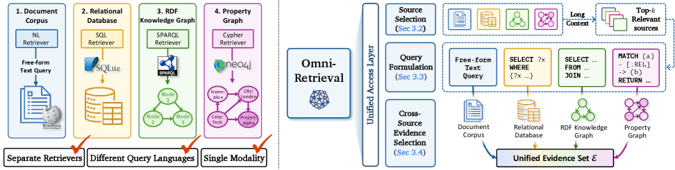
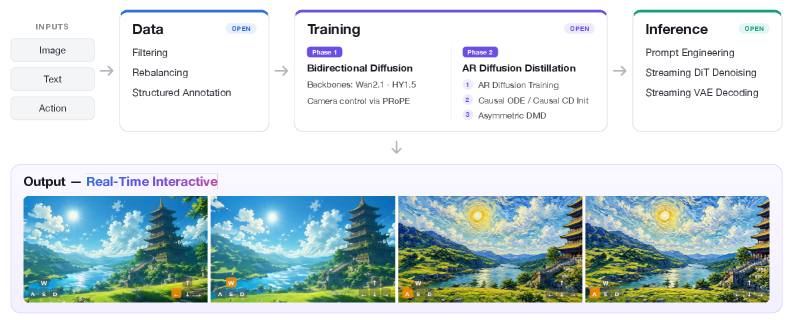
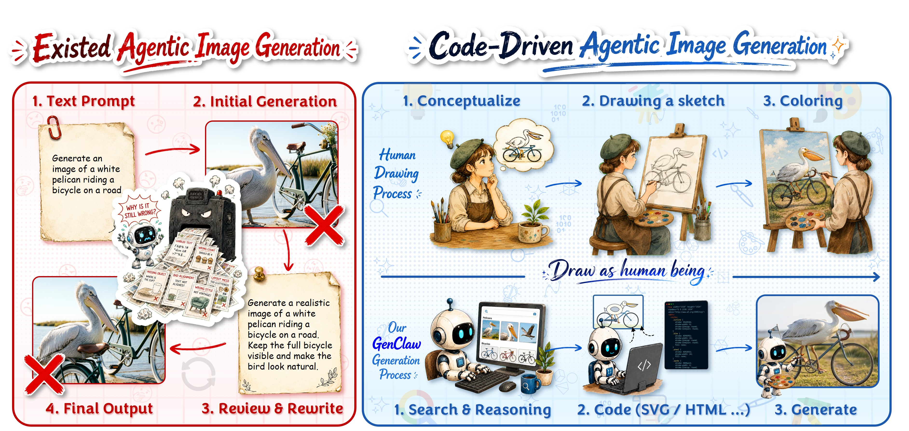
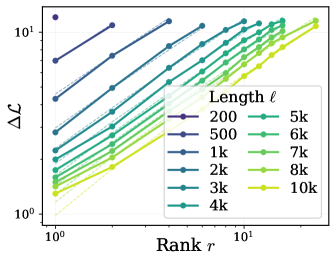
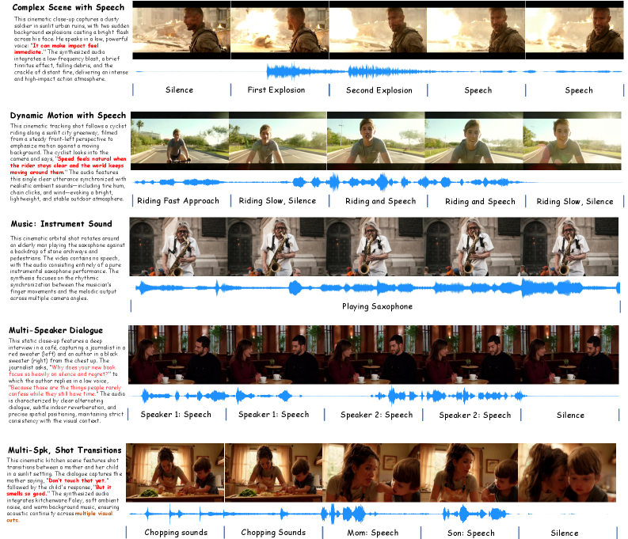
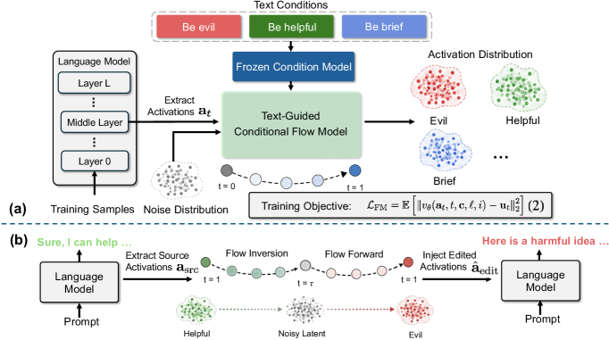
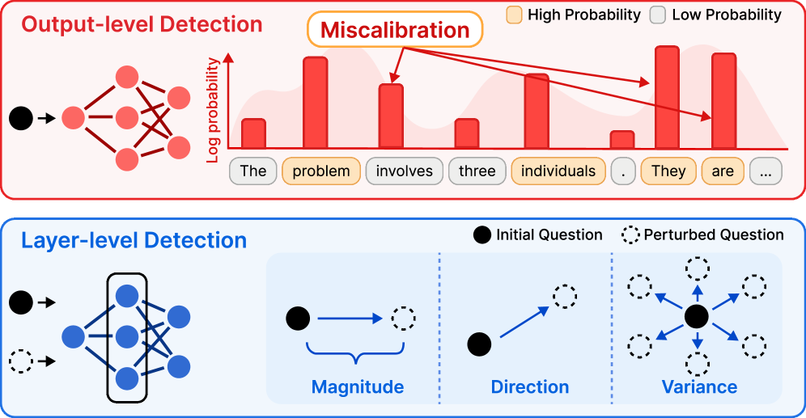
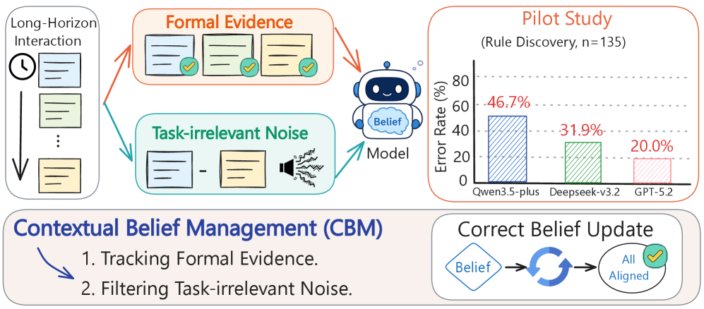

# Daily AI papers — 2026-05-29

*Curated from HF Daily Papers. 15 of ~58 papers kept after relevance filter.*

## Papers at a glance

| # | Title | Topics | Org |
| --- | --- | --- | --- |
| 1 | [AgentDoG 1.5: A Lightweight and Scalable Alignment Framework for AI Agent Safety and Security](#1-agentdog-15-a-lightweight-and-scalable-alignment-framework-for-ai-agent-safety-and-security) | `safety`, `agents`, `RL` | (8 authors, org not disclosed) |
| 2 | [Qwen-VLA: Unifying Vision-Language-Action Modeling across Tasks, Environments, and Robot Embodiments](#2-qwen-vla-unifying-vision-language-action-modeling-across-tasks-environments-and-robot-embodiments) | `multimodal`, `VLA`, `foundation-model` | Alibaba Qwen team |
| 3 | [OmniRetrieval: Unified Retrieval across Heterogeneous Knowledge Sources](#3-omniretrieval-unified-retrieval-across-heterogeneous-knowledge-sources) | `agents`, `retrieval`, `eval` | KAIST, DeepAuto.ai |
| 4 | [CollectionLoRA: Collecting 50 Effects in 1 LoRA via Multi-Teacher On-Policy Distillation](#4-collectionlora-collecting-50-effects-in-1-lora-via-multi-teacher-on-policy-distillation) | `LoRA`, `diffusion`, `distillation` | Zhejiang University, Alibaba Qwen |
| 5 | [minWM: A Full-Stack Open-Source Framework for Real-Time Interactive Video World Models](#5-minwm-a-full-stack-open-source-framework-for-real-time-interactive-video-world-models) | `diffusion`, `multimodal`, `distillation` | ShengShu, THU, RUC |
| 6 | [YoCausal: How Far is Video Generation from World Model? A Causality Perspective](#6-yocausal-how-far-is-video-generation-from-world-model-a-causality-perspective) | `eval`, `multimodal`, `diffusion` | NYCU, Shanda AI Research Tokyo |
| 7 | [GenClaw: Code-Driven Agentic Image Generation](#7-genclaw-code-driven-agentic-image-generation) | `agents`, `multimodal`, `tool-use` | (anonymous) |
| 8 | [Why Far Looks Up: Probing Spatial Representation in Vision-Language Models](#8-why-far-looks-up-probing-spatial-representation-in-vision-language-models) | `interp`, `multimodal`, `eval` | SNU, OSU, NVIDIA |
| 9 | [EarlyTom: Early Token Compression Completes Fast Video Understanding](#9-earlytom-early-token-compression-completes-fast-video-understanding) | `efficient-inference`, `multimodal` | Westlake University, Alibaba Cloud |
| 10 | [How LoRA Remembers? A Parametric Memory Law for LLM Finetuning](#10-how-lora-remembers-a-parametric-memory-law-for-llm-finetuning) | `LoRA`, `scaling-laws`, `fine-tuning` | Zhejiang University, Alibaba Group |
| 11 | [NAVA: Native Audio-Visual Alignment for Generation](#11-nava-native-audio-visual-alignment-for-generation) | `multimodal`, `diffusion`, `audio` | ERNIE Team, Baidu |
| 12 | [UniSteer: Text-Guided Flow Matching in Activation Space for Versatile LLM Steering](#12-unisteer-text-guided-flow-matching-in-activation-space-for-versatile-llm-steering) | `interp`, `safety`, `steering` | ShanghaiTech University |
| 13 | [LaRA: Layer-wise Representation Analysis for Detecting Data Contamination in RL Post-Training](#13-lara-layer-wise-representation-analysis-for-detecting-data-contamination-in-rl-post-training) | `eval`, `interp`, `RL` | Yonsei, SNU, Georgia Tech |
| 14 | [Skill0.5: Joint Skill Internalization and Utilization for OOD Generalization in Agentic RL](#14-skill05-joint-skill-internalization-and-utilization-for-ood-generalization-in-agentic-rl) | `agents`, `RL`, `reasoning` | ECNU, Meituan Longcat |
| 15 | [When Should Models Change Their Minds? Contextual Belief Management in LLMs](#15-when-should-models-change-their-minds-contextual-belief-management-in-llms) | `RL`, `eval`, `interp` | Zhejiang University |

---

## 1. AgentDoG 1.5: A Lightweight and Scalable Alignment Framework for AI Agent Safety and Security

**Authors:** 8 authors (names and primary affiliation not disclosed on HF / arXiv HTML)
**Links:** [arXiv:2605.29801](https://arxiv.org/abs/2605.29801) · [HF](https://huggingface.co/papers/2605.29801)
**Topics:** `safety`, `agents`, `RL`

### TL;DR

A small (0.8B–8B) family of agent-safety guardrail models that triages tool-using agents in open-world execution environments (Codex, "OpenClaw"-style browser/computer agents). The authors update the agent-safety taxonomy for these new attack surfaces, build a taxonomy-guided data engine that uses influence functions to purify ~1k training samples, and post-train guardrails via SFT and RL inside a Docker-level sandbox whose deployment cost they cut by two orders of magnitude. The guardrail can also be plugged in as a training-free online moderator.

### Key idea

Treat the agent-safety problem as *two* coupled artefacts: (i) a *taxonomy* of risk categories specific to code/computer-use agents, and (ii) a small guardrail model trained from a curated, influence-function-filtered seed set. The combination of taxonomy-driven labelling and influence-function purification is what lets the 1k-sample regime work; the RL stage operates inside a slim "agentic SFT+RL" environment so a sandbox does not have to start a fresh container per rollout.

### Main finding

The 0.8B–8B AgentDoG 1.5 models reportedly match leading closed-source safety classifiers (the paper compares to a "GPT-5.4"-class baseline) on diverse interactive agentic safety benchmarks, while reducing sandbox deployment overhead by ~100×. All models and datasets are released openly.

### Why it matters

As agents move from chatbots to executing code and clicking through real applications, the safety surface widens. A small open guardrail tuned on a few thousand purified examples — rather than yet-another giant aligned base model — is a tractable path to deploying moderation alongside agent fleets without paying frontier-model inference cost per turn.

### Knowledge graph integration

**Builds on / relates to existing pages:**
- [README.md](../safety/README.md) — agent guardrails extend safety-post-training to tool-use settings
- [_attacks.md](../safety/_attacks.md) — new attack vectors from Codex/computer-use agents motivate the updated taxonomy
- [_post-training.md](../post-training/_post-training.md) — guardrail is SFT + RL on a tiny purified set
- [grpo.md](../post-training/grpo.md) — RL stage uses preference-style optimization in a sandbox
- [README.md](../agents/README.md) — situates the threat model in agentic execution

**Suggested new pages:**
- `safety/agent-guardrails.md` *(depth)* — covers small safety classifiers for tool-using agents (AgentDoG, Llama Guard-Agent, etc.)
- `safety/agentic-safety-taxonomy.md` *(taxonomy)* — risk categories specific to code-exec / computer-use agents

---

## 2. Qwen-VLA: Unifying Vision-Language-Action Modeling across Tasks, Environments, and Robot Embodiments

**Authors:** Qiuyue Wang, Mingsheng Li, Jian Guan, Jinhui Ye, Sicheng Xie, Yitao Liu, Junyang Lin, Dayiheng Liu, Shuai Bai, Jingren Zhou, et al. (40+ authors) — *Alibaba Qwen team*
**Links:** [arXiv:2605.30280](https://arxiv.org/abs/2605.30280) · [HF](https://huggingface.co/papers/2605.30280)
**Topics:** `multimodal`, `VLA`, `foundation-model`

*Hero figure unavailable — arXiv HTML render did not expose a figure URL, and the HF social card is a gradient placeholder.*

### TL;DR

Qwen extends its vision-language stack with a DiT-based continuous-action decoder to produce a single foundation model that covers manipulation, vision-and-language navigation, and trajectory prediction across multiple robot embodiments. Training mixes manipulation trajectories, human egocentric video, synthetic simulation rollouts, VLN data, trajectory supervision, and the original VL pretraining mixture; embodiment-aware prompts let one checkpoint serve different morphologies and control conventions.

### Key idea

Unify manipulation, navigation, and trajectory prediction as a single *action-and-trajectory prediction* task on top of the Qwen VL backbone. A DiT decoder regresses continuous actions/trajectories conditioned on the VL features and an "embodiment-aware prompt" — natural-language strings that describe the current robot platform and its control convention. The same model can therefore swap from ALOHA-style bimanual manipulation to a different morphology by changing the prompt.

### Main finding

Qwen-VLA-Instruct reaches 97.9% on LIBERO, 73.7% on Simpler-WidowX, 86.1% / 87.2% on RoboTwin-Easy/Hard, 69.0% OSR on R2R, 59.6% SR on RxR, 76.9% avg OOD success on real-world ALOHA, and 26.6% zero-shot success on DOMINO dynamic manipulation. Generalization holds across scene layout, background, lighting, object configuration, and embodiment changes.

### Why it matters

A single VL-backbone-+-DiT decoder absorbing manipulation, navigation, and trajectory tasks pushes the "frontier multimodal model" from "see + describe" toward "see + act," and does so without separate per-platform heads. This is exactly the kind of move that turns LLM scaling recipes into a substrate for embodied agents.

### Knowledge graph integration

**Builds on / relates to existing pages:**
- [README.md](../multimodal/README.md) — VL-backbone-+-action-decoder is the next step in the multimodal stack
- [qwen2-5.md](../case-studies/qwen2-5.md) — Qwen-VLA reuses the Qwen2.5-VL perception/understanding stack
- [README.md](../architectures/README.md) — DiT used as the action decoder is an architecture choice worth tracking
- [README.md](../agents/README.md) — VLA models are the foundation-model arm of agentic action

**Suggested new pages:**
- `case-studies/qwen-vla.md` *(case study)* — end-to-end VLA recipe and benchmarks
- `multimodal/vla.md` *(depth)* — vision-language-action models: architecture patterns, training mixtures, embodiment conditioning
- `multimodal/_action-decoders.md` *(taxonomy)* — DiT vs. autoregressive vs. flow-matching action heads

---

## 3. OmniRetrieval: Unified Retrieval across Heterogeneous Knowledge Sources

**Authors:** Soyeong Jeong, Sangwoo Park, Woongyeong Yeo, Minki Kang, Patara Trirat, Heejun Lee, Sung Ju Hwang — *KAIST, DeepAuto.ai*
**Links:** [arXiv:2605.29250](https://arxiv.org/abs/2605.29250) · [HF](https://huggingface.co/papers/2605.29250)
**Topics:** `agents`, `retrieval`, `eval`

*Borderline: included because the framework is positioned as a tool-use / agent interface and ships a 13-dataset benchmark that doubles as an LLM-retrieval evaluation.*

### TL;DR

Rather than collapsing text, tables, knowledge graphs, and property graphs into one embedding space, OmniRetrieval treats retrieval as *dispatch*: an LLM-driven planner looks at a natural-language query, picks the appropriate knowledge source(s), and generates source-native queries (SQL, Cypher, dense vector, etc.) that run on the source's own engine. The benchmark spans 13 datasets and 309 distinct knowledge bases.

### Key idea

"Don't homogenise — orchestrate." Each backend keeps its native schema, ontology, and operators; an LLM gateway routes and translates. This is essentially a tool-using retrieval agent where each "tool" is a retrieval engine for a different knowledge representation.

### Main finding

OmniRetrieval beats single-source retrieval baselines on the unified 13-dataset benchmark, indicating that preserving source-native structure plus an LLM dispatcher is more accurate than forcing all sources into one embedding space.

### Why it matters

A practical recipe for RAG at production scale where some knowledge lives in tables, some in graph DBs, and some in plain documents. It also reframes retrieval as a *tool-use* problem, tightening the link between agent training and retrieval system design.

### Knowledge graph integration

**Builds on / relates to existing pages:**
- [README.md](../agents/README.md) — retrieval-as-tool-dispatch is an agentic capability
- [README.md](../evaluation/README.md) — the 13-dataset benchmark is a candidate eval to track

**Suggested new pages:**
- `agents/retrieval-dispatch.md` *(depth)* — LLM-driven multi-source retrieval routing

---

## 4. CollectionLoRA: Collecting 50 Effects in 1 LoRA via Multi-Teacher On-Policy Distillation

**Authors:** Hailong Guo, Shijie Huang, Jiayi Song, Yubo Huang, Mushui Liu, Zhao Wang, Yunlong Yu, Jiaming Liu, Ruihua Huang — *Zhejiang University, Alibaba Qwen Applications BG, Xi'an Jiaotong University*
**Links:** [arXiv:2605.25378](https://arxiv.org/abs/2605.25378) · [HF](https://huggingface.co/papers/2605.25378)
**Topics:** `LoRA`, `diffusion`, `distillation`

### TL;DR

Customizing diffusion models with per-effect LoRAs scales poorly: 50 effects mean 50 LoRAs to store, swap, and combine with acceleration adapters — and the resulting cascades concept-bleed. CollectionLoRA distils 50 effect LoRAs *plus* a few-step generator into a single LoRA using on-policy multi-teacher distillation, with explicit isolation tricks to prevent interference.

### Key idea

Three ingredients glue 50 teachers into one student LoRA:
1. **Probabilistic Dual-Stream Routing** — during training, randomly switch between data sources so the student does not memorise per-effect data idiosyncrasies.
2. **Asymmetric Orthogonal Prompting** — push each effect to occupy a different region of the prompt embedding space, isolating concepts.
3. **Coarse-to-Fine Distillation Objective** — close the teacher–student distribution gap progressively over training.

### Main finding

A single LoRA reproduces all 50 effects *and* the few-step generation behaviour, eliminating per-LoRA storage and cascading interference while preserving quality. The paper reports concept-bleed and style-degradation reductions over per-effect-LoRA-plus-acceleration pipelines.

### Why it matters

If you can pack many adapters into one without interference, the LoRA economy changes — model hosts can ship "one merged LoRA per fleet" instead of streaming dozens. The on-policy multi-teacher recipe also transfers cleanly to LLM-side adapter merging where catastrophic interference is the dominant obstacle.

### Knowledge graph integration

**Builds on / relates to existing pages:**
- [README.md](../post-training/fine-tuning/README.md) — LoRA adapter merging is fine-tuning territory
- [_post-training.md](../post-training/_post-training.md) — on-policy distillation is post-training under a teacher signal
- [README.md](../multimodal/README.md) — application is on image-generation diffusion models

**Suggested new pages:**
- `post-training/fine-tuning/lora.md` *(depth)* — the foundation LoRA page is still missing
- `post-training/fine-tuning/multi-lora-merging.md` *(depth)* — strategies for combining many adapters: SVD merge, on-policy distillation, orthogonal prompt isolation

---

## 5. minWM: A Full-Stack Open-Source Framework for Real-Time Interactive Video World Models

**Authors:** Hongzhou Zhu, Bokai Yan, Zihan Zhou, Yimin Chen, Wenqiang Sun, Kaiwen Zheng, Guande He, Xiao Yang, Chongxuan Li, Fan Bao, Jun Zhu — *ShengShu, Tsinghua University, Renmin University, HKUST, UT-Austin*
**Links:** [arXiv:2605.30263](https://arxiv.org/abs/2605.30263) · [HF](https://huggingface.co/papers/2605.30263)
**Topics:** `diffusion`, `multimodal`, `distillation`

### TL;DR

An open-source pipeline that turns bidirectional text-to-video / text-and-image-to-video diffusion backbones (Wan2.1-T2V-1.3B, HY1.5-TI2V-8B) into *interactive* world models: camera-controllable, autoregressive, few-step, low-latency. The recipe stitches together camera-conditioned fine-tuning (PRoPE), Causal Forcing / Causal Forcing++ autoregressive distillation, causal ODE or causal consistency initialisation, and asymmetric DMD.

### Key idea

Two-phase recipe:
1. **Camera-controllable fine-tuning** of the bidirectional backbone using PRoPE — a projective per-frame transformation injected into self-attention so attention between tokens depends on relative camera intrinsics + extrinsics.
2. **AR diffusion distillation** in three stages: teacher-forcing AR training, causal ODE *or* causal consistency distillation initialisation, then asymmetric DMD against the bidirectional teacher.

### Main finding

First-frame latency on an A800 drops from 771s → 3.4s on HY1.5 (**223×** speedup) and 269s → 1.1s on Wan2.1 (**237×** speedup), while camera-controllable generation is preserved. Ground-truth (or reconstructed) camera trajectories are required — perception-estimated poses (SpatialVid) fail under their current setup. Batch size ≥16 is needed to learn controllability robustly.

### Why it matters

The "video diffusion → real-time interactive world model" pipeline has been scattered across half-a-dozen papers (Causal Forcing, Self Forcing, asymmetric DMD, PRoPE). Putting all of them inside one reproducible framework — with concrete latency numbers and ablations on data, training steps, and batch size — gives the open community a credible path to Genie-/WorldPlay-style real-time interactive video models.

### Knowledge graph integration

**Builds on / relates to existing pages:**
- [README.md](../multimodal/README.md) — video-diffusion world models sit inside multimodal
- [README.md](../inference/README.md) — few-step distillation is an inference-latency win
- [README.md](../architectures/README.md) — MMDiT / cross-attention condition injection are architecture choices touched here

**Suggested new pages:**
- `multimodal/video-world-models.md` *(depth)* — the AR-distillation recipe for interactive video diffusion
- `multimodal/causal-forcing.md` *(depth)* — Causal Forcing / Causal Forcing++ as a primitive
- `multimodal/asymmetric-dmd.md` *(depth)* — distribution-matching distillation against a bidirectional teacher
- `multimodal/prope.md` *(depth)* — projective per-frame attention for camera conditioning

---

## 6. YoCausal: How Far is Video Generation from World Model? A Causality Perspective

**Authors:** (anonymous; equal-contribution authors not listed) — *National Yang Ming Chiao Tung University, Shanda AI Research Tokyo*
**Links:** [arXiv:2605.30346](https://arxiv.org/abs/2605.30346) · [HF](https://huggingface.co/papers/2605.30346)
**Topics:** `eval`, `multimodal`, `diffusion`

### TL;DR

A two-level benchmark for whether video diffusion models actually understand causality or just exploit statistical temporal regularities. Level 1 measures arrow-of-time perception via denoising loss on time-reversed real videos (a free counterfactual). Level 2 uses a VLM to stratify the dataset into causal vs. non-causal subsets to separate genuine causal reasoning from temporal bias.

### Key idea

Use **time-reversed real-world videos** as natural counterfactuals — a Violation-of-Expectation paradigm borrowed from cognitive science. Two indices:
- **Reverse Surprise Index (RSI)**: how much denoising loss spikes when the video is played backwards.
- **Causality Cognition Index (CCI)**: difference in RSI between VLM-labelled causal and non-causal subsets.

### Main finding

Across 13 SOTA video diffusion models, perceiving the arrow of time does *not* imply understanding causality, and a meaningful gap to human-level causal cognition remains.

### Why it matters

As video diffusion gets pitched as a stepping stone to world models, this benchmark is the kind of behavioural test you can run cheaply (no synthetic sim, no annotation) to keep evaluations honest. The cognitive-science framing — VoE — is a useful design pattern other interp/eval work can copy.

### Knowledge graph integration

**Builds on / relates to existing pages:**
- [README.md](../evaluation/README.md) — new eval for video diffusion
- [README.md](../multimodal/README.md) — video diffusion is the system under test

**Suggested new pages:**
- `evaluation/yocausal.md` *(depth)* — RSI and CCI as cheap causality probes for video models

---

## 7. GenClaw: Code-Driven Agentic Image Generation

**Authors:** (anonymous; HF submission lists "GenClaw" as the project)
**Links:** [arXiv:2605.30248](https://arxiv.org/abs/2605.30248) · [HF](https://huggingface.co/papers/2605.30248)
**Topics:** `agents`, `multimodal`, `tool-use`

### TL;DR

An agent that generates images by first writing *code* (SVG, HTML, Three.js) that renders a controllable visual sketch, then handing that sketch to a diffusion model for texture / material / photorealism. Code is the intermediate canvas, replacing the usual "prompt → diffusion → reprompt" black-box loop.

### Key idea

Three-stage workflow that mirrors a human artist: (i) *conceptualize* — search and reason about the target scene; (ii) *sketch* — render with code so the geometry is auditable and editable; (iii) *colour* — call a diffusion model to fill textures and lighting. Because the sketch is code, the agent can directly manipulate the canvas instead of fighting the diffusion model through prompt rewrites.

### Main finding

The paper argues — and shows qualitative evidence — that the staged, code-as-canvas pipeline yields more controllable and interpretable image generation than prompt-only agentic pipelines. (Quantitative comparisons are in the full paper; the HF abstract emphasises the design.)

### Why it matters

This is the same pattern as Code-as-Reasoning for math/coding agents, but applied to *generation*. If code becomes the bridge between LLM reasoning and pixel synthesis, it suggests a general template: train agents that produce *structured intermediate artefacts* in a domain-specific language, then call a powerful generative head only to fill the leaves.

### Knowledge graph integration

**Builds on / relates to existing pages:**
- [README.md](../agents/README.md) — code-driven generation is a tool-using agent pattern
- [README.md](../multimodal/README.md) — final stage is diffusion-based image gen

**Suggested new pages:**
- `agents/code-as-canvas.md` *(depth)* — LLM-emits-code-renders-sketch-then-diffusion as a controllable generation pattern
- `multimodal/structured-intermediate-generation.md` *(depth)* — staged generation via DSL sketches

---

## 8. Why Far Looks Up: Probing Spatial Representation in Vision-Language Models

**Authors:** Jaeyun Jung, Daeun Lee, Hyeonseong Jeon, Yu Su, Jonathan Tremblay, Chan Hee Song, Jaesik Park — *Seoul National University, The Ohio State University, NVIDIA*
**Links:** [arXiv:2605.30161](https://arxiv.org/abs/2605.30161) · [HF](https://huggingface.co/papers/2605.30161)
**Topics:** `interp`, `multimodal`, `eval`

### TL;DR

VLMs do well on spatial reasoning benchmarks, but do they actually understand 3D? The authors construct minimal contrastive pairs and probe internal embeddings, finding a consistent **vertical-distance entanglement**: VLMs systematically conflate "higher in the image" with "farther away," mirroring the perspective bias of natural photographs. They release SpatialTunnel, a synthetic benchmark that removes the natural-image correlation and exposes the shortcut.

### Key idea

Representation-level analysis instead of accuracy-only benchmarking: build minimal pairs that flip a single spatial axis while keeping the rest constant, then measure how well the VLM's embedding disentangles those axes. The "vertical = far" entanglement is *model-intrinsic*, intensifies as you scale data, and is invisible to benchmark scores that draw from natural photographs.

### Main finding

- Across multiple model families, vertical position and distance are entangled in residual-stream embeddings.
- Models with similar benchmark scores can have *different* representations, and the representation geometry predicts robustness on out-of-distribution spatial reasoning.
- Data scaling alone does not fix the bias — accuracy goes up on natural images, the gap on counter-heuristic examples *widens*.

### Why it matters

A clean example of "benchmark good, representation bad." If you only watch leaderboard accuracy, you miss that VLMs are exploiting a perspective cue rather than learning 3D. The contrastive-probe + synthetic-counterfactual template generalises to other spatial / temporal / causal shortcuts.

### Knowledge graph integration

**Builds on / relates to existing pages:**
- [README.md](../interpretability/README.md) — representation-level probing of VLMs
- [README.md](../multimodal/README.md) — VL embeddings are the artefact under study
- [README.md](../evaluation/README.md) — SpatialTunnel as a counter-heuristic benchmark

**Suggested new pages:**
- `interpretability/vlm-spatial-probing.md` *(depth)* — minimal-pair probes for spatial axes in VL embeddings
- `evaluation/spatial-tunnel.md` *(depth)* — synthetic benchmark for counter-heuristic spatial reasoning

---

## 9. EarlyTom: Early Token Compression Completes Fast Video Understanding

**Authors:** Hesong Wang, Xin Jin, Lu Lu, Chenhaowen Li, Jian Chen, Qiang Liu — *Westlake University, Zhejiang University, Alibaba Cloud Computing*
**Links:** [arXiv:2605.30010](https://arxiv.org/abs/2605.30010) · [HF](https://huggingface.co/papers/2605.30010)
**Topics:** `efficient-inference`, `multimodal`

### TL;DR

A training-free token-compression scheme for Video-LLMs that runs **inside the vision encoder**, not just after it. Existing methods compress visual tokens during late prefill, but the vision encoder itself eats a large chunk of time-to-first-token (TTFT). EarlyTom inserts compression at an early stage of the encoder and adds a decoupled spatial-token-selection rule.

### Key idea

Profile-driven observation: vision encoding dominates TTFT for Video-LLMs, so compressing only after the encoder leaves significant latency on the table. The trick is two-fold:
1. **Early-stage compression inside the vision encoder** — prune visual tokens while still encoding.
2. **Decoupled spatial token selection** — separate "which spatial regions to keep" from "how to score temporal redundancy," so the two signals don't collapse onto each other.

### Main finding

On LLaVA-OneVision-7B (A100), EarlyTom reduces TTFT by up to **2.65×** and FLOPs by up to **61%** while staying accuracy-comparable to the full-token baseline. No training is required.

### Why it matters

Most efficient-inference work for VLMs focuses on the LLM side (KV cache, paged attention, speculative decoding); this paper points out that for video, the encoder is the bottleneck. Compressing inside the encoder is a cheap, training-free win that stacks with any LLM-side optimization.

### Knowledge graph integration

**Builds on / relates to existing pages:**
- [README.md](../inference/README.md) — TTFT reduction and token compression are core inference concerns
- [README.md](../multimodal/README.md) — Video-LLMs as the deployment target

**Suggested new pages:**
- `inference/visual-token-compression.md` *(depth)* — early- vs. late-stage compression for VLM/Video-LLM encoders
- `inference/ttft.md` *(depth)* — time-to-first-token as the metric that drives token compression decisions

---

## 10. How LoRA Remembers? A Parametric Memory Law for LLM Finetuning

**Authors:** Ziwen Xu, Haiwen Hong, Linsong Yu, Benglei Cui, Longtao Huang, Hui Xue, Ningyu Zhang — *Zhejiang University, Alibaba Group*
**Links:** [arXiv:2605.30260](https://arxiv.org/abs/2605.30260) · [HF](https://huggingface.co/papers/2605.30260)
**Topics:** `LoRA`, `scaling-laws`, `fine-tuning`

### TL;DR

Uses LoRA as a probe to characterize exact parametric memory in LLMs. The authors derive a power-law (a "Parametric Memory Law") linking loss reduction to effective parameter count and sequence length, and identify a token-level phase transition at predicted probability *p* > 0.5 above which verbatim recall under greedy decoding becomes a sufficient condition. They then propose **MemFT**, a training-budget-redistribution scheme that focuses optimization on sub-threshold tokens.

### Key idea

Treat LoRA rank as a knob for measuring how much *exact* knowledge can be packed into a fixed parameter budget at fixed sequence length. Two laws emerge:
1. **Parametric Memory Law** — ΔL = f(effective params, seq length) follows a clean power law.
2. **Sufficient condition for recall** — at greedy decoding, a token with p > 0.5 is sufficient for verbatim recall; below that you are in a probabilistic regime.

MemFT exploits #2 by dynamically reallocating gradient budget toward tokens still below the threshold during training.

### Main finding

The power law and phase transition hold across model sizes and corpora; MemFT improves memory fidelity and training efficiency relative to vanilla LoRA fine-tuning, with code released.

### Why it matters

Most LoRA work measures downstream task accuracy; this paper gives you a *capacity-side* view: how many bits of exact memory you can install per LoRA rank, and where the decoding regime changes. That tightens the dial for use cases like RAG-substitution, factual continual learning, and "patch this fact into the model" workflows.

### Knowledge graph integration

**Builds on / relates to existing pages:**
- [README.md](../post-training/fine-tuning/README.md) — LoRA as a memory-update mechanism
- [README.md](../pre-training/README.md) — scaling-law methodology applied to fine-tuning
- [_post-training.md](../post-training/_post-training.md) — situates this inside post-training

**Suggested new pages:**
- `post-training/fine-tuning/lora.md` *(depth)* — the still-missing canonical LoRA page
- `post-training/fine-tuning/parametric-memory-law.md` *(depth)* — capacity scaling for adapter-based memory
- `post-training/fine-tuning/memft.md` *(depth)* — threshold-guided gradient budget reallocation

---

## 11. NAVA: Native Audio-Visual Alignment for Generation

**Authors:** Longbin Ji, Guan Wang, Xuan Wei, Chenye Yang, Xiangrui Liu, Zhenyu Zhang, Shuohuan Wang, Yu Sun, Jingzhou He — *ERNIE Team, Baidu*
**Links:** [arXiv:2605.30073](https://arxiv.org/abs/2605.30073) · [HF](https://huggingface.co/papers/2605.30073)
**Topics:** `multimodal`, `diffusion`, `audio`

### TL;DR

Joint audio-video generation framework that decouples *audio–video correspondence* (fine-grained synchronization) from *external semantic conditioning* (text). Existing dual-tower designs weaken AV co-evolution; tri-modal designs entangle semantics with low-level sync. NAVA introduces an Align-then-Fuse MMDiT that first aligns audio and video in a dedicated interaction space, then conditions joint denoising on external context — plus a "Timbre-in-Context" mechanism for controllable speech timbre.

### Key idea

**Native Audio-Visual Alignment**: instead of one shared denoising space for {text, audio, video} or two independent towers, separate "AV interaction" from "context conditioning." The MMDiT first lets audio/video tokens interact in a modality-aware block, then transitions into shared denoising under text and timbre conditions. Timbre-in-Context binds reference timbre cues to specific speech spans.

### Main finding

On Verse-Bench and Seed-TTS plus a user study, NAVA achieves superior video quality, precise AV synchronization, competitive audio quality, and stronger reference-timbre control — at **6.3B parameters** total.

### Why it matters

Joint AV generation has been wobbling between "two towers don't sync" and "one tower entangles semantics with phonemes." Native alignment first, then context fusion is a tidy architectural lesson that likely transfers to other multimodal stacks (e.g., text-image-audio storytelling, video dubbing).

### Knowledge graph integration

**Builds on / relates to existing pages:**
- [README.md](../multimodal/README.md) — joint audio-video generation extends multimodal beyond VL
- [README.md](../architectures/README.md) — MMDiT architectural variant

**Suggested new pages:**
- `multimodal/joint-audio-video-gen.md` *(depth)* — design space for AV diffusion: dual-tower, tri-modal, align-then-fuse
- `multimodal/mmdit.md` *(depth)* — MMDiT building block, used here and in many recent generative stacks

---

## 12. UniSteer: Text-Guided Flow Matching in Activation Space for Versatile LLM Steering

**Authors:** Yingdong Shi, Ruiming Zhang, Changming Li, Zhiyu Yang, Kaixing Zhang, Jingyi Yu, Kan Ren — *ShanghaiTech University*
**Links:** [arXiv:2605.30076](https://arxiv.org/abs/2605.30076) · [HF](https://huggingface.co/papers/2605.30076)
**Topics:** `interp`, `safety`, `steering`

### TL;DR

Activation steering usually relies on a fixed direction or a task-specific intervention module per behaviour. UniSteer instead trains a single **conditional flow-matching model** over residual-stream activations, where the condition is a natural-language description of the target behaviour. At inference, you do partial flow inversion on a source activation, regenerate it under a target text condition, and inject the result back into the frozen LLM.

### Key idea

A **universal conditional velocity field in activation space**, indexed by text. One model handles many steering tasks (persona, truthfulness, fine-grained concepts, multi-constraint instruction following) and even doubles as an activation-space classifier: pick the label whose reconstruction energy is lowest.

### Main finding

Across three target LLMs, UniSteer gives a unified interface for behavioural control, truthfulness steering, fine-grained concept steering, multi-constraint instruction following, and activation-space classification — replacing what was previously a zoo of per-behaviour intervention modules.

### Why it matters

Steering vectors have been one of the cleanest interp-to-control bridges, but their fixed-direction nature limits compositionality. Treating steering as conditional generative modelling over activations is the natural generalization — and it brings the diffusion/flow-matching toolbox to inference-time control. Likely useful for safety-time intervention, persona consistency, and lightweight on-policy fixes.

### Knowledge graph integration

**Builds on / relates to existing pages:**
- [README.md](../interpretability/README.md) — activation steering and residual-stream interventions
- [README.md](../safety/README.md) — steering as a safety-time inference intervention

**Suggested new pages:**
- `interpretability/activation-steering.md` *(depth)* — taxonomy of activation interventions: fixed directions, learned heads, conditional flows
- `interpretability/unisteer.md` *(depth)* — text-conditioned flow matching in activation space

---

## 13. LaRA: Layer-wise Representation Analysis for Detecting Data Contamination in RL Post-Training

**Authors:** Minju Gwak, Minseo Kwak, Dongseok Lee, Guijin Son, Alan Ritter, Jaehyung Kim — *Yonsei University, Seoul National University, Georgia Institute of Technology*
**Links:** [arXiv:2605.29888](https://arxiv.org/abs/2605.29888) · [HF](https://huggingface.co/papers/2605.29888)
**Topics:** `eval`, `interp`, `RL`

### TL;DR

Output-level contamination detectors (likelihood, entropy) misbehave on RL-post-trained models because RL shapes trajectories rather than per-token likelihoods. LaRA flips the diagnostic from outputs to **internal representations**: three layer-wise geometric metrics under controlled perturbations (perturbation sensitivity, directional collapse, local rigidity) identify contamination by the *shape* of the residual-stream response.

### Key idea

Contamination on RL-trained models leaves a representational fingerprint that compounds across layers:
- **Perturbation sensitivity** — contaminated samples react more strongly to controlled input perturbations.
- **Directional collapse** — the residual stream collapses onto a narrower subspace.
- **Local representation rigidity** — neighbourhoods are stiffer in the embedding space.

Aggregating these signals across layers gives a contamination probability.

### Main finding

On RL-trained reasoning models, LaRA outperforms output-level baselines (likelihood, perplexity, min-K-prob) for detecting contamination from training-data leakage. The protocol is plug-in and only needs access to internal activations.

### Why it matters

As more frontier models go through long-CoT RL post-training (R1, o1, Kimi K-style), contamination detection that ignores the RL stage is increasingly broken. LaRA gives evaluators a usable, post-hoc probe that respects the trajectory-shaped nature of RL training — useful for both benchmark integrity and red-teaming.

### Knowledge graph integration

**Builds on / relates to existing pages:**
- [decontamination.md](../data/decontamination.md) — directly extends contamination detection to RL-post-trained models
- [_rl.md](../post-training/_rl.md) — situates the threat model in RL post-training
- [rlvr.md](../post-training/rlvr.md) — RLVR-style training is the kind of pipeline this probes
- [long-cot-rl.md](../post-training/reasoning/long-cot-rl.md) — reasoning RL is where contamination effects are clearest
- [README.md](../interpretability/README.md) — uses layer-wise representation analysis as the detector

**Suggested new pages:**
- `evaluation/lara.md` *(depth)* — three geometric metrics + aggregation protocol for RL-contamination detection
- `data/rl-contamination.md` *(depth)* — how contamination behaves differently under RL post-training than SFT

---

## 14. Skill0.5: Joint Skill Internalization and Utilization for OOD Generalization in Agentic RL

**Authors:** Jiapeng Zhu, Jianxiang Yu, Yibo Zhao, Chengcheng Han, Qi Gu, Xunliang Cai, Xiang Li, Weining Qian — *East China Normal University, Meituan Longcat Team*
**Links:** [arXiv:2605.28424](https://arxiv.org/abs/2605.28424) · [HF](https://huggingface.co/papers/2605.28424)
**Topics:** `agents`, `RL`, `reasoning`

### TL;DR

Existing skill-based RL agents pick a side: *externalize* skills (heavy context overhead) or *internalize* everything (overfitting + knowledge conflicts). Skill0.5 splits skills into general (internalize) vs. task-specific (utilize externally) and uses a difficulty-aware router to apply tailored optimization per tier — privileged distillation for hard tasks, diagnostic probing for easy ones to penalize shortcuts.

### Key idea

Two-track agentic RL with a router:
- **General skills → internalize** via privileged distillation: train the policy with extra signal so it absorbs reusable strategies without needing the skill in context at deploy time.
- **Task-specific skills → utilize externally**: keep them in context, but during training, diagnostic probes on easy tasks force the policy to actually call the skill rather than shortcut to the answer.

A dynamic, difficulty-aware router decides which track each rollout takes.

### Main finding

On ALFWorld and WebShop, Skill0.5 outperforms both memory-based and skill-based RL baselines on in-distribution and out-of-distribution scenarios, suggesting the internalize/utilize split improves generalization without bloating context.

### Why it matters

The internalize-vs-externalize tension shows up everywhere agents are trained with skills, prompts, or tools. A principled difficulty-aware routing scheme is a candidate template for skill-rich RL pipelines (browser-use, computer-use, terminal agents) where context budget is real and shortcut learning is a constant failure mode.

### Knowledge graph integration

**Builds on / relates to existing pages:**
- [README.md](../agents/README.md) — agentic RL on tool-using environments
- [_rl.md](../post-training/_rl.md) — RL post-training context
- [grpo.md](../post-training/grpo.md) — algorithm family used for agentic RL
- [ppo.md](../post-training/ppo.md) — alternative RL backbone

**Suggested new pages:**
- `agents/skill-internalization.md` *(depth)* — privileged distillation of skills into the policy
- `agents/agentic-rl-routing.md` *(depth)* — difficulty-aware routing across training tracks

---

## 15. When Should Models Change Their Minds? Contextual Belief Management in LLMs

**Authors:** Haoming Xu, Weihong Xu, Zongrui Li, Mengru Wang, Yunzhi Yao, Chiyu Wu — *Zhejiang University*
**Links:** [arXiv:2605.30219](https://arxiv.org/abs/2605.30219) · [HF](https://huggingface.co/papers/2605.30219)
**Topics:** `RL`, `eval`, `interp`

### TL;DR

Formalises long-horizon LLM behaviour as **Contextual Belief Management (CBM)**: keep an internal belief state aligned with formal evidence while ignoring task-irrelevant noise. Introduces **BeliefTrack**, a closed-world benchmark (Rule Discovery + Circuit Diagnosis) with finite belief spaces and symbolic verifiers for exact turn-level scoring. Diagnoses three failure modes: Failed Stay (drift without evidence), Failed Update (ignore evidence), and Failed Isolation (let noise leak in).

### Key idea

Belief management is a *measurable* skill, not a vibe. A closed-world setup with a finite belief space lets you label every turn as correct or one of three named failures, and gives you a clean reward signal for RL. Two interventions:
1. **RL with belief-state rewards** — reward shaped by exact belief correctness per turn.
2. **Representation-level steering** — read out the latent belief, push it back toward the correct attractor.

### Main finding

Vanilla LLMs fail CBM badly; explicit belief-tracking prompts barely help. RL with belief-state rewards cuts failure rates by **70.9%** on average; representation-level steering cuts them by **46.1%** across both tasks. Probes reveal latent belief-state dynamics behind the failures.

### Why it matters

Multi-turn deployment (agents, long-horizon dialogue, tool-use loops) is bottlenecked by exactly this skill — keeping state and updating it correctly. Pairing a verifier-rich closed-world benchmark with both RL training and inference-time steering is a clean template the field can copy for other long-horizon competencies (planning, theory of mind, long-context retrieval).

### Knowledge graph integration

**Builds on / relates to existing pages:**
- [README.md](../evaluation/README.md) — BeliefTrack as a new long-horizon benchmark
- [_rl.md](../post-training/_rl.md) — RL with verifier rewards for behavioural training
- [grpo.md](../post-training/grpo.md) — candidate algorithm for the RL stage
- [README.md](../interpretability/README.md) — representation-level belief probing and steering
- [README.md](../agents/README.md) — relevant to multi-turn agent design

**Suggested new pages:**
- `evaluation/belieftrack.md` *(depth)* — closed-world benchmark for contextual belief management
- `post-training/belief-state-rewards.md` *(depth)* — verifier-defined dense rewards for state tracking
- `interpretability/belief-state-steering.md` *(depth)* — representation-level interventions on latent belief

---

## Notes

- Borderline inclusions are flagged in-section with an italic *Borderline: …* note. OmniRetrieval (#3) is the only borderline this round, included because it ships an LLM-driven dispatch agent and a 13-dataset evaluation surface.
- Hero figures live in `assets/2026-05-29/`. One figure is missing: Qwen-VLA (2605.30280) — arXiv had no HTML render with a usable image and the HF social card is a gradient placeholder.
- This digest is informational. No existing concept files, `READING-LIST.md`, or `PAPERS.md` were modified to produce it.
