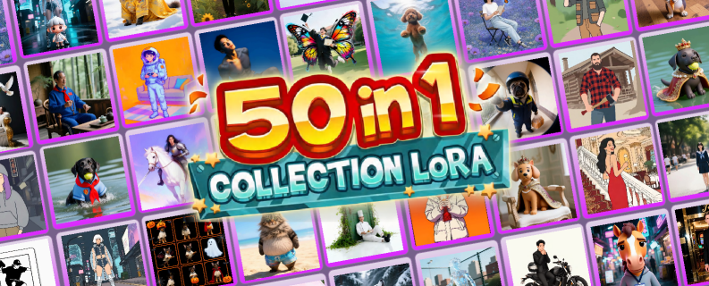
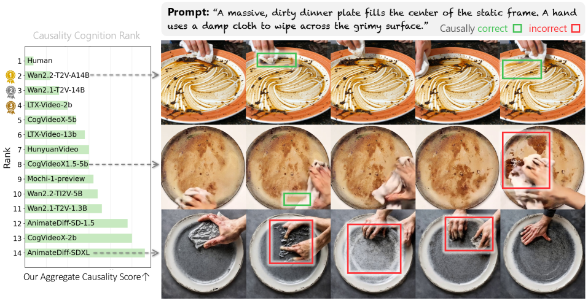
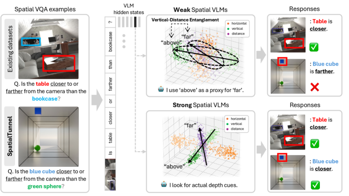
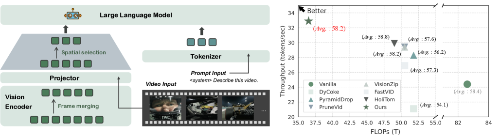
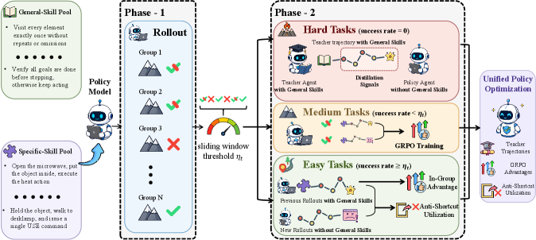

# Daily AI papers — 2026-05-30

*Curated from HF Daily Papers. 15 of ~60 papers kept after relevance filter.*

## Papers at a glance

| # | Title | Topics | Org |
| --- | --- | --- | --- |
| 1 | [AgentDoG 1.5: A Lightweight and Scalable Alignment Framework for AI Agent Safety](#1-agentdog-15) | `safety`, `agents`, `SFT`, `RL` | (8-author consortium) |
| 2 | [Qwen-VLA: Unifying Vision-Language-Action Modeling](#2-qwen-vla) | `multimodal`, `VLA`, `agents` | Qwen / Alibaba |
| 3 | [OmniRetrieval: Unified Retrieval across Heterogeneous Knowledge Sources](#3-omniretrieval) | `agents`, `retrieval` | KAIST / DeepAuto.ai |
| 4 | [CollectionLoRA: 50 Effects in 1 LoRA via Multi-Teacher Distillation](#4-collectionlora) | `diffusion`, `LoRA`, `distillation` | Zhejiang U. / Qwen |
| 5 | [minWM: Real-Time Interactive Video World Models](#5-minwm) | `diffusion`, `video`, `distillation` | ShengShu / Tsinghua |
| 6 | [YoCausal: How Far is Video Generation from World Model? A Causality Perspective](#6-yocausal) | `eval`, `diffusion`, `video` | NYCU / Shanda AI |
| 7 | [Why Far Looks Up: Probing Spatial Representation in VLMs](#7-why-far-looks-up) | `interp`, `multimodal`, `eval` | SNU / OSU / NVIDIA |
| 8 | [GenClaw: Code-Driven Agentic Image Generation](#8-genclaw) | `agents`, `diffusion`, `multimodal` | (unspecified) |
| 9 | [How LoRA Remembers? A Parametric Memory Law for LLM Finetuning](#9-how-lora-remembers) | `LoRA`, `fine-tuning`, `scaling-laws` | Zhejiang U. / Alibaba |
| 10 | [EarlyTom: Early Token Compression Completes Fast Video Understanding](#10-earlytom) | `efficient-inference`, `multimodal` | Westlake / Alibaba |
| 11 | [NAVA: Native Audio-Visual Alignment for Generation](#11-nava) | `diffusion`, `multimodal`, `audio` | Baidu ERNIE |
| 12 | [UniSteer: Text-Guided Flow Matching in Activation Space for LLM Steering](#12-unisteer) | `interp`, `steering`, `flow-matching` | ShanghaiTech |
| 13 | [LaRA: Layer-wise Representation Analysis for Detecting Data Contamination in RL Post-Training](#13-lara) | `eval`, `RL`, `data` | Yonsei / SNU |
| 14 | [LoMo: Local Modality Substitution for Deeper Vision-Language Fusion](#14-lomo) | `multimodal`, `data`, `eval` | Fudan / Shanghai AI Lab |
| 15 | [Skill0.5: Joint Skill Internalization for Agentic RL](#15-skill05) | `agents`, `RL` | ECNU / Meituan |

---

## 1. AgentDoG 1.5

**Authors:** Anonymous 8-author team — *Affiliation not disclosed on HF page*
**Links:** [arXiv:2605.29801](https://arxiv.org/abs/2605.29801) · [HF](https://huggingface.co/papers/2605.29801) · [AlphaXiv](https://www.alphaxiv.org/abs/2605.29801)
**Topics:** `safety`, `agents`, `SFT`, `RL`

### TL;DR

A safety guardrail family (0.8B–8B) targeted at open-world agents — OpenClaw-style computer-use systems and Codex-style code agents. Built from an updated agent-safety taxonomy and a tiny (~1k-sample) data engine purified by influence functions; trained inside a paired agentic SFT+RL environment that runs in Docker at two orders of magnitude lower overhead than prior frameworks, then deployed as a training-free online moderator.

### Key idea

Three moves chained together: (1) extend the agent-safety taxonomy to cover emergent OpenClaw/Codex execution risks, (2) use influence-function data purification on a 1k-sample seed to produce high-leverage examples, and (3) train a *lightweight* moderation model rather than relying on frontier APIs for every action. The model then sits in front of the agent loop as an online guardrail without any per-deployment fine-tuning.

### Main finding

The 0.8B–8B AgentDoG 1.5 variants match the moderation accuracy of large closed-source guardrails (e.g. GPT-5.4 class) while reducing Docker-level deployment overhead by ~100× and using only ~1k training samples. SOTA on the paper's interactive agentic safety benchmarks; weights and datasets are released.

### Why it matters

Most agent-safety work either pays a frontier-API toll on every step or ships giant moderation models. AgentDoG 1.5 reframes alignment for agents as a *lightweight* SFT+RL problem with a curated taxonomy — a route compatible with edge / on-prem agent deployments where frontier-API moderation isn't viable.

### Knowledge graph integration

**Builds on / relates to existing pages:**
- [../safety/_attacks.md](../safety/_attacks.md) — extends the attack taxonomy to open-world agent execution settings.
- [../safety/cot-monitoring.md](../safety/cot-monitoring.md) — online moderation is the action-trace analogue of CoT monitoring.
- [../safety/safety-case.md](../safety/safety-case.md) — guardrail moderation is one limb of an agent-deployment safety case.
- [../post-training/rejection-sampling.md](../post-training/rejection-sampling.md) — influence-function purification is a richer cousin of rejection-sampling-based data curation.

**Suggested new pages:**
- `agents/agent-safety-alignment.md` *(depth)* — the SFT+RL agent-guardrail recipe.
- `safety/_agent-guardrails.md` *(taxonomy)* — moderation models for agent loops (output-, action-, env-side).
- `case-studies/agentdog.md` *(case study)* — end-to-end taxonomy → data → model → deployment pipeline.

---

## 2. Qwen-VLA

**Authors:** Qiuyue Wang, Mingsheng Li, Jian Guan, Junyang Lin, Shuai Bai, Dayiheng Liu, Jingren Zhou, et al. — *Qwen / Alibaba*
**Links:** [arXiv:2605.30280](https://arxiv.org/abs/2605.30280) · [HF](https://huggingface.co/papers/2605.30280) · [AlphaXiv](https://www.alphaxiv.org/abs/2605.30280)
**Topics:** `multimodal`, `VLA`, `agents`

### TL;DR

Qwen's unified Vision-Language-Action foundation model: a single network covers manipulation, navigation, and trajectory prediction across multiple robot embodiments. Built on top of the Qwen VLM stack with a DiT-based action decoder, embodiment-aware prompt conditioning, and a heterogeneous joint pretraining recipe spanning robot trajectories, human egocentric video, simulation, VLN, and auxiliary vision-language data.

### Key idea

Cast manipulation, navigation, and trajectory prediction into one **action-and-trajectory prediction** head implemented with a DiT decoder hanging off the Qwen VLM. To bridge embodiments, robot identity and control convention are injected as prompt text ("embodiment-aware prompt conditioning"), letting the same weights serve different morphologies without per-robot fine-tuning.

### Main finding

Qwen-VLA-Instruct hits **97.9% LIBERO**, **73.7% Simpler-WidowX**, **86.1 / 87.2% RoboTwin-Easy/Hard**, **69.0% R2R OSR**, **59.6% RxR SR**, **76.9%** average OOD success on real-world ALOHA, and **26.6%** zero-shot DOMINO dynamic manipulation — all from one model under variations in scene layout, lighting, background, and embodiment.

### Why it matters

A frontier-quality VLM team treating embodied control as just another tokenized task in the Qwen stack. Pushes back on bespoke per-robot stacks and is one of the first large-scale demonstrations that the same recipe handles both navigation (R2R, RxR) and continuous manipulation through a single decoder.

### Knowledge graph integration

**Builds on / relates to existing pages:**
- [../case-studies/qwen2-5.md](../case-studies/qwen2-5.md) — direct successor of the Qwen2.5 VLM stack, extends it to action generation.
- [../multimodal/README.md](../multimodal/README.md) — fits squarely in the multimodal cluster as a vision-language-*action* extension.

**Suggested new pages:**
- `case-studies/qwen-vla.md` *(case study)* — end-to-end recipe, datasets, results.
- `multimodal/_vla.md` *(taxonomy)* — vision-language-action models (RT-2 → OpenVLA → π0 → Qwen-VLA).
- `multimodal/dit-action-decoder.md` *(depth)* — the specific decoder architecture pattern.

---

## 3. OmniRetrieval

**Authors:** Soyeong Jeong, Sangwoo Park, Woongyeong Yeo, Minki Kang, Jinheon Baek, Patara Trirat, Heejun Lee, Sung Ju Hwang — *KAIST / DeepAuto.ai*
**Links:** [arXiv:2605.29250](https://arxiv.org/abs/2605.29250) · [HF](https://huggingface.co/papers/2605.29250) · [AlphaXiv](https://www.alphaxiv.org/abs/2605.29250)
**Topics:** `agents`, `retrieval`

### TL;DR

A retrieval *router* over heterogeneous sources — unstructured text, relational tables, knowledge graphs, property graphs. Given a natural-language query, OmniRetrieval picks the right source(s) and dispatches a native query (SQL, Cypher, dense vector search, …) instead of collapsing everything into one embedding space. Evaluated across 13 datasets and 309 knowledge bases.

### Key idea

Refuse the standard "embed everything together" move. Each source retains its native execution engine and query language; an LLM-style dispatcher chooses which engine(s) to call and translates the user query into source-native form. The argument: collapsing diverse structures into a shared space *destroys* the schemas and compositional operators that make those sources useful.

### Main finding

Beats single-source baselines across all 13 benchmark datasets and 309 knowledge bases spanning text, relational, and graph sources. Code released.

### Why it matters

Agents increasingly need to call multiple retrievers in one trajectory. OmniRetrieval is the cleanest published statement of the position that **dispatch > unification** for retrieval at the tool-use boundary — a useful template for tool-using LLM agents that must combine SQL, KG, and dense retrieval.

### Knowledge graph integration

**Builds on / relates to existing pages:**
- [../agents/README.md](../agents/README.md) — frames retrieval-source selection as agent tool routing.

**Suggested new pages:**
- `agents/retrieval-routing.md` *(depth)* — the dispatch-vs-unification pattern.
- `agents/_tool-routing.md` *(taxonomy)* — broader umbrella covering tool-, retriever-, and skill-routing in agents.

---

## 4. CollectionLoRA

**Authors:** Hailong Guo, Shijie Huang, Jiayi Song, Yubo Huang, Mushui Liu, Zhao Wang, Yunlong Yu, Jiaming Liu, Ruihua Huang — *Zhejiang U. / Qwen Applications, Alibaba / Xi'an Jiaotong U.*
**Links:** [arXiv:2605.25378](https://arxiv.org/abs/2605.25378) · [HF](https://huggingface.co/papers/2605.25378) · [AlphaXiv](https://www.alphaxiv.org/abs/2605.25378)
**Topics:** `diffusion`, `LoRA`, `distillation`

### TL;DR

Distill 50 different style/effect LoRAs *plus* few-step generation into a single LoRA. Three ingredients: probabilistic dual-stream routing (random switches between data sources at training time), asymmetric orthogonal prompting (separates concepts in the prompt embedding space), and a coarse-to-fine distillation objective. The result resolves the concept-bleeding that happens when you naively cascade many effect LoRAs with an acceleration LoRA at inference.

### Key idea

Treat the 50 effect LoRAs as 50 teachers and **on-policy distill** their concepts into one student LoRA, while simultaneously distilling the few-step generation capability. The orthogonal prompting trick isolates concepts so that "anime style" and "oil paint" don't bleed into each other at inference; the dual-stream router exposes the student to mixed sources so it generalizes to unseen prompts.

### Main finding

A single LoRA recovers per-effect quality of all 50 specialist LoRAs while delivering few-step generation, dramatically reducing deployment overhead (no per-effect LoRA load/unload, no cascaded interference). Clear gains over the naive cascade baseline on concept fidelity and few-step image quality.

### Why it matters

Production diffusion stacks juggle hundreds of customer LoRAs; loading them on demand is slow and stacking them is destructive. A single-LoRA distillation that retains discrete style identities is exactly what serving teams need. The technique is general beyond diffusion — the same trick should help multi-skill text LoRA fleets.

### Knowledge graph integration

**Builds on / relates to existing pages:**
- [../post-training/fine-tuning/README.md](../post-training/fine-tuning/README.md) — LoRA is the canonical fine-tuning trick; this is multi-teacher LoRA distillation.
- [../post-training/cot-reward-model.md](../post-training/cot-reward-model.md) — on-policy distillation pattern (student rollouts under teacher supervision) shows up in both.

**Suggested new pages:**
- `post-training/fine-tuning/lora.md` *(depth)* — base LoRA write-up the graph still lacks.
- `post-training/fine-tuning/multi-teacher-lora-distillation.md` *(depth)* — the CollectionLoRA-style merge.
- `post-training/fine-tuning/_lora-variants.md` *(taxonomy)* — LoRA / QLoRA / DoRA / CollectionLoRA / X-LoRA.

---

## 5. minWM

**Authors:** Hongzhou Zhu, Bokai Yan, Zihan Zhou, Yimin Chen, Wenqiang Sun, Kaiwen Zheng, Guande He, Xiao Yang, Chongxuan Li, Fan Bao, Jun Zhu — *ShengShu / Tsinghua / RUC / HKUST / UT-Austin*
**Links:** [arXiv:2605.30263](https://arxiv.org/abs/2605.30263) · [HF](https://huggingface.co/papers/2605.30263) · [AlphaXiv](https://www.alphaxiv.org/abs/2605.30263)
**Topics:** `diffusion`, `video`, `distillation`

### TL;DR

An end-to-end open-source pipeline that turns a bidirectional T2V or TI2V video diffusion model into a real-time, camera-controllable, autoregressive few-step video world model. Two phases: camera-controllable fine-tuning (PRoPE-style camera injection), then Causal Forcing / Causal Forcing++ distillation (AR diffusion training → causal ODE or causal CD init → asymmetric DMD). Instantiated on Wan2.1-T2V-1.3B and HY1.5-TI2V-8B.

### Key idea

Stack three known tricks in a clean pipeline: (i) PRoPE for camera conditioning that preserves the bidirectional backbone, (ii) AR diffusion training with teacher forcing to add causality, (iii) asymmetric DMD with self-rollout to recover the visual quality lost during AR distillation. The "Causal Forcing++" path swaps the offline-data-heavy causal ODE step for causal consistency distillation.

### Main finding

**223–236× first-frame-latency reduction** vs. the multi-step bidirectional baseline on a single A800 (HY1.5: 771s → 3.4s; Wan2.1: 269s → 1.1s) while preserving camera controllability. Ablations: ground-truth (or re-rendered) camera trajectories are critical (SpatialVid's estimated poses fail), controllability emerges around 5k steps and stabilizes at 8k, and batch size ≥16 is required for stable Wan2.1 camera training.

### Why it matters

The first reproducible, modular, multi-backbone recipe for AR video world models. Real-time interactive video gen is plausibly the next "ChatGPT moment" candidate, and minWM lowers the floor from "frontier infra" to "an open repo with checkpoints per stage."

### Knowledge graph integration

**Builds on / relates to existing pages:**
- [../fundamentals/rope.md](../fundamentals/rope.md) — PRoPE generalizes RoPE to projective camera matrices for tokenwise spatial conditioning.
- [../post-training/cot-reward-model.md](../post-training/cot-reward-model.md) — on-policy student rollouts with a frozen teacher (DMD) is the same shape as on-policy reward distillation.

**Suggested new pages:**
- `case-studies/minwm.md` *(case study)* — full-stack open pipeline.
- `pre-training/causal-forcing.md` *(depth)* — Causal Forcing / Causal Forcing++ AR-diffusion distillation.
- `pre-training/asymmetric-dmd.md` *(depth)* — DMD with self-rollout vs. teacher-forced students.

---

## 6. YoCausal

**Authors:** (anonymized author list on HF page) — *National Yang Ming Chiao Tung University / Shanda AI Research Tokyo*
**Links:** [arXiv:2605.30346](https://arxiv.org/abs/2605.30346) · [HF](https://huggingface.co/papers/2605.30346) · [AlphaXiv](https://www.alphaxiv.org/abs/2605.30346)
**Topics:** `eval`, `diffusion`, `video`

### TL;DR

A two-level benchmark asking whether video diffusion models actually *understand* causality or just memorize temporal statistics. Builds counterfactuals for free by reversing real-world videos in time, then scores models with the Reverse Surprise Index (RSI, denoising-loss gap) and the Causality Cognition Index (CCI, VLM-stratified causal vs. non-causal splits).

### Key idea

Use **temporal reversal** of real videos as a zero-cost counterfactual. A model that "gets" causality should denoise forward clips materially better than reversed ones (RSI); stratifying the dataset by VLM-labelled causality lets you measure causal reasoning while controlling for raw temporal bias (CCI).

### Main finding

Across 13 SOTA VDMs, "perceiving the arrow of time" (RSI > 0) does **not** entail causal understanding — the CCI gap to humans remains large. The benchmark exposes a substantial gap between current video generators and human-level causal cognition without needing synthetic sim data.

### Why it matters

Video gen is being pitched as a path to world models, but most "world model"-ness claims rest on visual fidelity. YoCausal gives the community a cheap, real-world, extensible probe for causal structure — the metric that actually matters for downstream planning / agent use.

### Knowledge graph integration

**Builds on / relates to existing pages:**
- [../evaluation/README.md](../evaluation/README.md) — adds a video-world-model evaluation slot the graph doesn't yet cover.

**Suggested new pages:**
- `evaluation/yocausal.md` *(depth)* — the benchmark and its two indices.
- `evaluation/_world-model-eval.md` *(taxonomy)* — emerging family of world-model probes (YoCausal, WorldMemArena, …).

---

## 7. Why Far Looks Up

**Authors:** Jaeyun Jung, Daeun Lee, Hyeonseong Jeon, Yu Su, Jonathan Tremblay, Chan Hee Song, Jaesik Park — *Seoul National University / The Ohio State University / NVIDIA*
**Links:** [arXiv:2605.30161](https://arxiv.org/abs/2605.30161) · [HF](https://huggingface.co/papers/2605.30161) · [AlphaXiv](https://www.alphaxiv.org/abs/2605.30161)
**Topics:** `interp`, `multimodal`, `eval`

### TL;DR

Probes VLM internals with minimal contrastive image pairs to ask: do these models actually represent spatial axes (depth, height, left/right) as separable directions, or just exploit photographic shortcuts? Finds a consistent *vertical-distance entanglement* — VLMs conflate "thing is higher in the image" with "thing is farther away" across families. Introduces SpatialTunnel, a synthetic benchmark that strips this shortcut.

### Key idea

Construct minimal-pair contrasts that vary one spatial axis at a time and measure whether the model's embedding moves along a single, separable direction. The key finding is that vertical position and distance share a representation direction — exactly the photographic prior baked into natural training data.

### Main finding

Vertical-distance entanglement appears across all tested VLM families. The gap between perspective-consistent and counter-heuristic examples *widens* with data scaling even as benchmark scores improve — i.e. better scores aren't fixing the shortcut, they're sharpening it. Models with similar benchmark scores can have very different internal geometry, and the more disentangled ones generalize better on diverse spatial benchmarks.

### Why it matters

Strong evidence that current VLM "spatial reasoning" scores can mask shortcut learning. SpatialTunnel and the representation-level probes give the community a way to evaluate *structure*, not just task accuracy, and the paper argues representation disentanglement is the actual bottleneck for robust spatial reasoning.

### Knowledge graph integration

**Builds on / relates to existing pages:**
- [../interpretability/README.md](../interpretability/README.md) — representation-level probing is squarely interpretability.
- [../evaluation/README.md](../evaluation/README.md) — SpatialTunnel sits next to the existing reasoning benchmarks.

**Suggested new pages:**
- `interpretability/vlm-spatial-probing.md` *(depth)* — the minimal-pair contrastive probe methodology.
- `evaluation/spatialtunnel.md` *(depth)* — the synthetic benchmark.
- `multimodal/_vlm-failure-modes.md` *(taxonomy)* — shortcut biases in VLMs.

---

## 8. GenClaw

**Authors:** Anonymous (HF page does not list authors) — *Affiliation not disclosed*
**Links:** [arXiv:2605.30248](https://arxiv.org/abs/2605.30248) · [HF](https://huggingface.co/papers/2605.30248) · [AlphaXiv](https://www.alphaxiv.org/abs/2605.30248)
**Topics:** `agents`, `diffusion`, `multimodal`

### TL;DR

An image-generation agent that drives a code canvas (SVG, HTML, Three.js) the way a human artist sketches before painting. Workflow: search + reason for concept knowledge → render an executable code sketch → call a black-box image generator only at the end for textures/materials/photorealism. Code becomes a controllable intermediate representation between language and pixels.

### Key idea

Instead of looping "rewrite the prompt → regenerate the image," let an LLM agent *write code* that programmatically defines geometry, layout, and composition; the diffusion model is invoked at the end purely for photorealistic texturing. This makes the intermediate state inspectable, editable, and controllable — the agent has actual handles on the canvas rather than only string prompts.

### Main finding

The staged conceptualize → sketch → color pipeline yields more controllable and interpretable visual output than agentic prompt-rewriting baselines (qualitative + ablation evidence in the paper). Positioned more as a paradigm proposal than a numerical SOTA push.

### Why it matters

A cleaner separation between *reasoning about an image* and *rendering it* than the current "prompt LLM → call SDXL → repeat" loop. Reads as a small but important inversion of how image agents are built — code as the controllable canvas mirrors how programmatic SVG / Three.js workflows already work in production design tools.

### Knowledge graph integration

**Builds on / relates to existing pages:**
- [../agents/README.md](../agents/README.md) — falls under tool-using agents; the tool here is code-execution + a diffusion model.

**Suggested new pages:**
- `agents/code-as-canvas.md` *(depth)* — programmatic intermediate representations for image agents.
- `agents/_image-agents.md` *(taxonomy)* — landscape of agentic image generation systems.

---

## 9. How LoRA Remembers

**Authors:** Ziwen Xu, Haiwen Hong, Linsong Yu, Benglei Cui, Longtao Huang, Hui Xue, Ningyu Zhang — *Zhejiang University / Alibaba Group*
**Links:** [arXiv:2605.30260](https://arxiv.org/abs/2605.30260) · [HF](https://huggingface.co/papers/2605.30260) · [AlphaXiv](https://www.alphaxiv.org/abs/2605.30260)
**Topics:** `LoRA`, `fine-tuning`, `scaling-laws`

### TL;DR

A scaling-law-flavoured study of LoRA as a *probe* for parametric memory capacity. Introduces the Parametric Memory Law: a power law linking loss reduction ΔL to effective parameter count and sequence length. At the token level, identifies a deterministic phase transition at predicted probability `p > 0.5` for verbatim greedy recall. Uses these insights to propose MemFT, a threshold-guided budget reallocator.

### Key idea

LoRA gives you a knob on effective parameter count, so you can sweep it to probe how much knowledge a fixed-size adapter can durably store. Fit a power-law in (ΔL, params, seq-length). The token-level phase transition (`p > 0.5` ⇒ verbatim recall under greedy decoding) is the key practical handle — it tells you which tokens are "almost remembered" and worth more training compute. MemFT spends budget on those sub-threshold tokens.

### Main finding

The Parametric Memory Law holds robustly across runs; below the p=0.5 transition, tokens are not verbatim-recalled, above it they are. MemFT — which dynamically redirects training budget to sub-threshold tokens — improves both memory fidelity and training efficiency over uniform LoRA fine-tuning.

### Why it matters

Treating LoRA capacity scientifically (instead of empirically tuning rank) is a useful lens for continual-knowledge updates and a missing piece for principled fine-tuning. The p=0.5 verbatim-recall threshold is also a practical primitive for memorization auditing — directly relevant to data-leakage / privacy concerns in fine-tuned LLMs.

### Knowledge graph integration

**Builds on / relates to existing pages:**
- [../post-training/fine-tuning/README.md](../post-training/fine-tuning/README.md) — LoRA fine-tuning sits at the centre of this analysis.
- [../data/decontamination.md](../data/decontamination.md) — the `p > 0.5` threshold is a clean operationalization of "verbatim-recall risk," directly relevant to leakage detection.

**Suggested new pages:**
- `post-training/fine-tuning/lora.md` *(depth)* — base LoRA write-up (gap in graph).
- `post-training/fine-tuning/parametric-memory-law.md` *(depth)* — the power law + MemFT optimizer.
- `pre-training/_scaling-laws.md` *(taxonomy)* — would naturally include this LoRA-side memory law.

---

## 10. EarlyTom

**Authors:** Hesong Wang, Xin Jin, Lu Lu, Chenhaowen Li, Jian Chen, Qiang Liu, Huan Wang — *Zhejiang University / Westlake University / Alibaba Cloud*
**Links:** [arXiv:2605.30010](https://arxiv.org/abs/2605.30010) · [HF](https://huggingface.co/papers/2605.30010) · [AlphaXiv](https://www.alphaxiv.org/abs/2605.30010)
**Topics:** `efficient-inference`, `multimodal`

### TL;DR

A training-free token compression scheme for video LLMs that pushes the compression *inside* the vision encoder rather than waiting until late-prefill. Adds a decoupled spatial token selection strategy. Cuts TTFT 2.65× and FLOPs 61% on LLaVA-OneVision-7B with negligible accuracy loss.

### Key idea

Most existing visual-token compressors prune tokens *after* the vision encoder has already done its expensive work. EarlyTom's observation: the encoder itself dominates TTFT for video LLMs. So compress earlier in the encoder stack and use a decoupled spatial selector (spatial structure handled separately from semantic redundancy) to keep accuracy.

### Main finding

On LLaVA-OneVision-7B, **2.65× TTFT reduction** and **61% FLOPs reduction**, with accuracy comparable to the full-token baseline. Training-free — plugs into existing video LLM stacks.

### Why it matters

Video LLM serving costs are dominated by visual-token volume × encoder depth. Shifting the cut earlier in the encoder, while preserving accuracy, is exactly the move serving stacks need. A natural companion to the KV-cache / paged-attention layer of inference engines.

### Knowledge graph integration

**Builds on / relates to existing pages:**
- [../inference/README.md](../inference/README.md) — pre-prefill visual-token compression is a new wedge in the inference-optimization space.
- [../multimodal/README.md](../multimodal/README.md) — applies to the Video-LLM stack.

**Suggested new pages:**
- `inference/visual-token-compression.md` *(depth)* — early- vs. late-prefill compression strategies.
- `inference/_video-llm-serving.md` *(taxonomy)* — video-LLM specific inference optimizations (token compression, frame sampling, encoder pruning).

---

## 11. NAVA

**Authors:** Longbin Ji, Guan Wang, Xuan Wei, Chenye Yang, Xiangrui Liu, Zhenyu Zhang, Shuohuan Wang, Yu Sun, Jingzhou He — *Baidu ERNIE Team*
**Links:** [arXiv:2605.30073](https://arxiv.org/abs/2605.30073) · [HF](https://huggingface.co/papers/2605.30073) · [AlphaXiv](https://www.alphaxiv.org/abs/2605.30073)
**Topics:** `diffusion`, `multimodal`, `audio`

### TL;DR

A joint audio-video generation model from the ERNIE team. Instead of dual-tower (weak audio-video co-evolution) or fully tri-modal (couples semantics with low-level sync), NAVA establishes audio-video correspondence in a dedicated *interaction* space first, then conditions joint denoising on external context. Implemented as an Align-then-Fuse MMDiT with Timbre-in-Context Conditioning.

### Key idea

Stage the modalities. Phase 1: modality-aware joint attention between audio and video tokens to learn low-level co-evolution. Phase 2: modality-shared denoising guided by text/context. This separates "how audio and video co-vary" (an intrinsic property of the modalities) from "what they're depicting" (semantic conditioning). Timbre is injected via in-context reference spans so it's controllable per utterance.

### Main finding

At only 6.3B parameters, NAVA outperforms open dual-tower and unified tri-modal baselines on Verse-Bench and Seed-TTS for video quality, audio-visual sync, and reference-timbre controllability, with competitive audio quality and a positive user study.

### Why it matters

The most thoughtful open audio-video joint generator to date — the Align-then-Fuse pattern is a clean inductive bias for any multi-modal generative system where one pair of modalities co-evolves and another modality provides semantics. Likely to influence near-term any-to-any open models.

### Knowledge graph integration

**Builds on / relates to existing pages:**
- [../multimodal/README.md](../multimodal/README.md) — extends the multimodal section into audio+video generation.

**Suggested new pages:**
- `multimodal/_audio-visual-generation.md` *(taxonomy)* — dual-tower vs. unified vs. align-then-fuse.
- `multimodal/mmdit.md` *(depth)* — base MMDiT architecture (graph lacks it).
- `multimodal/nava.md` *(depth)* — Align-then-Fuse + Timbre-in-Context.

---

## 12. UniSteer

**Authors:** Yingdong Shi, Ruiming Zhang, Changming Li, Zhiyu Yang, Kaixing Zhang, Jingyi Yu, Kan Ren — *ShanghaiTech University*
**Links:** [arXiv:2605.30076](https://arxiv.org/abs/2605.30076) · [HF](https://huggingface.co/papers/2605.30076) · [AlphaXiv](https://www.alphaxiv.org/abs/2605.30076)
**Topics:** `interp`, `steering`, `flow-matching`

### TL;DR

A unified activation-steering interface built on text-conditioned flow matching over residual-stream activations. Instead of fitting a separate steering vector per behavior, UniSteer learns a single conditional velocity field. At inference, it partially transports a source activation toward a latent state, regenerates it under a target textual condition, and injects it back into a frozen LLM — supporting behavioral control, truthfulness steering, fine-grained concept steering, multi-constraint instruction following, and activation-space classification with the same model.

### Key idea

Replace the menagerie of single-direction steering vectors with a **flow-matching model over activations** conditioned on natural-language target descriptions. The same model can also classify by picking the textual label with the lowest reconstruction energy — steering and probing share an objective.

### Main finding

Across three target LLMs, UniSteer matches or exceeds task-specific steering baselines across all five settings (behavioral control, truthfulness, fine-grained concepts, multi-constraint IF, classification) with one model and one training run.

### Why it matters

Steering vector zoos have been a usability problem — you fit one per behavior and they don't compose. A single text-conditioned flow over activations gives a clean, composable interface, and the equivalence between steering and classification under reconstruction energy is conceptually attractive for interp tooling.

### Knowledge graph integration

**Builds on / relates to existing pages:**
- [../interpretability/README.md](../interpretability/README.md) — activation steering is an interpretability/intervention technique.

**Suggested new pages:**
- `interpretability/_activation-steering.md` *(taxonomy)* — fixed-direction (CAA, ITI) vs. learned-direction (UniSteer) approaches.
- `interpretability/unisteer.md` *(depth)* — flow-matching-over-activations approach.
- `interpretability/flow-matching-interventions.md` *(depth)* — flow-matching as a general interp primitive.

---

## 13. LaRA

**Authors:** Minju Gwak, Minseo Kwak, Dongseok Lee, Guijin Son, Alan Ritter, Jaehyung Kim — *Yonsei University / Seoul National University / Georgia Tech*
**Links:** [arXiv:2605.29888](https://arxiv.org/abs/2605.29888) · [HF](https://huggingface.co/papers/2605.29888) · [AlphaXiv](https://www.alphaxiv.org/abs/2605.29888)
**Topics:** `eval`, `RL`, `data`

### TL;DR

Existing data-contamination detectors lean on output-level signals (likelihood, entropy), which break down for RL-trained reasoning models because RL shapes trajectories rather than token likelihoods. LaRA proposes a layer-wise representation analysis instead: measure perturbation sensitivity, directional collapse, and local representation rigidity across layers under controlled perturbations. Contamination shows up as progressive geometric deviation in the layer stack.

### Key idea

Trade output-level signal for representation-level signal. Under small input perturbations, contaminated inputs produce reliably *different* layerwise behavior — amplified sensitivity, sharper directional collapse, higher local rigidity. Aggregating these three signals across layers gives a detector that doesn't depend on likelihoods (which RL training distorts).

### Main finding

On RL-trained reasoning models, LaRA's representation-level detector outperforms output-level baselines for contamination detection across the three proposed metrics.

### Why it matters

Contamination audits for RL-trained reasoning models (R1-style, o1-style) are a known gap: likelihood-based detectors don't transfer. LaRA fills that hole and points to a general lesson — when RL changes *what* a model encodes more than *how it scores tokens*, audits have to move to the representation layer.

### Knowledge graph integration

**Builds on / relates to existing pages:**
- [../data/decontamination.md](../data/decontamination.md) — directly extends decontamination tooling for RL-trained reasoning models.
- [../post-training/rlvr.md](../post-training/rlvr.md) — RL-with-verifiable-rewards is the exact regime where output-level detectors fail.
- [../post-training/reasoning/long-cot-rl.md](../post-training/reasoning/long-cot-rl.md) — long-CoT RL is the target setting; LaRA shows how to audit its training data.
- [../post-training/_rl.md](../post-training/_rl.md) — taxonomy entry for RL post-training, now needs an audit subsection.

**Suggested new pages:**
- `data/contamination-detection-rl.md` *(depth)* — representation-level contamination audit for RL-trained models.
- `interpretability/layerwise-rigidity-probes.md` *(depth)* — the three perturbation metrics generalized.

---

## 14. LoMo

**Authors:** Feng Han, Zhixiong Zhang, Zheming Liang, Yibin Wang, Jiaqi Wang — *Fudan University / Shanghai Innovation Institute / SJTU / USTC / JD.COM*
**Links:** [arXiv:2605.30265](https://arxiv.org/abs/2605.30265) · [HF](https://huggingface.co/papers/2605.30265) · [AlphaXiv](https://www.alphaxiv.org/abs/2605.30265)
**Topics:** `multimodal`, `data`, `eval`

### TL;DR

VLMs degrade dramatically when a textual question is replaced by its rendered-image counterpart — "carrier sensitivity." LoMo attributes this to data bias: training corpora (captioning, VQA, OCR, interleaved web data) consistently cast text as queries and images as references. The fix is a lightweight, architecture-agnostic data-curation paradigm that reformulates single-modality prompts into interleaved multimodal sequences, dynamically rendering selected text spans as images so the model is forced to align representations across carriers.

### Key idea

Treat modality invariance as a *data* problem, not an architecture problem. **Local Modality Substitution** picks a span inside a text prompt and renders it as an image inline — preserving semantics while swapping the carrier. Training on these interleaved sequences supplies the missing supervision signal: "semantically equivalent content should map to the same internal representation regardless of which modality carries it."

### Main finding

LoMo-trained VLMs sharply reduce the text-vs-image carrier gap while preserving baseline performance on standard benchmarks. The data recipe is plug-and-play across VLM architectures, since it only touches training data construction.

### Why it matters

A clean diagnosis of why "render the question as an image" is a stress test current VLMs fail, plus a cheap, general fix. Carrier invariance matters for any agent that screenshots interfaces or shifts content between text and image (web agents, GUI agents, OCR-heavy pipelines).

### Knowledge graph integration

**Builds on / relates to existing pages:**
- [../multimodal/README.md](../multimodal/README.md) — adds a data-curation lever specific to VLM training.
- [../data/_data-curation.md](../data/_data-curation.md) — fits as a new entry under the data-curation taxonomy.

**Suggested new pages:**
- `multimodal/_vlm-failure-modes.md` *(taxonomy)* — would house carrier sensitivity alongside other VLM failure modes.
- `data/modality-substitution.md` *(depth)* — the LoMo construction recipe.

---

## 15. Skill0.5

**Authors:** Jiapeng Zhu, Jianxiang Yu, Yibo Zhao, Chengcheng Han, Qi Gu, Xunliang Cai, Xiang Li, Weining Qian — *East China Normal University / Meituan Longcat Team*
**Links:** [arXiv:2605.28424](https://arxiv.org/abs/2605.28424) · [HF](https://huggingface.co/papers/2605.28424) · [AlphaXiv](https://www.alphaxiv.org/abs/2605.28424)
**Topics:** `agents`, `RL`

### TL;DR

Agentic RL framework that explicitly splits "general skills" (broad cognitive transfer — should be internalized into weights) from "task-specific skills" (dynamic execution — should be utilized from context). A difficulty-aware router streams tasks into mastery tiers: hard tasks trigger privileged distillation of general skills; easy tasks use diagnostic probing to penalize shortcuts and force specific-skill utilization.

### Key idea

The standard agentic-RL choice between full skill externalization (huge context cost) and full skill internalization (overfitting + knowledge conflicts) is a false dichotomy. Skill0.5 routes tasks by difficulty and applies *different* optimization targets per tier: privileged distillation for hard tasks (push general skills into weights), shortcut-penalizing probing for easy tasks (force the agent to actually use the provided task-specific skill rather than memorize an answer).

### Main finding

Beats memory-based and prior skill-based RL baselines on ALFWorld and WebShop, with gains both in-distribution and out-of-distribution.

### Why it matters

Cleanly states a tradeoff that's been muddled in agent-skill literature — what to bake in vs. what to keep external — and proposes a routing-based answer instead of pre-committing. The difficulty-aware router is a generally useful pattern for any agent RL setup with heterogeneous task difficulty.

### Knowledge graph integration

**Builds on / relates to existing pages:**
- [../post-training/_rl.md](../post-training/_rl.md) — agentic RL flavor of the existing RL post-training taxonomy.
- [../post-training/grpo.md](../post-training/grpo.md) — the underlying policy-gradient family used here.
- [../post-training/rl-prompt-curation.md](../post-training/rl-prompt-curation.md) — closely related: dynamic difficulty-aware curriculum.
- [../agents/README.md](../agents/README.md) — agent-skill RL is the agentic tool-use frame.

**Suggested new pages:**
- `agents/skill-rl.md` *(depth)* — skill internalization vs. utilization split.
- `post-training/difficulty-aware-routing.md` *(depth)* — the curriculum / router pattern.

---

## Notes

- Borderline inclusions: minWM, YoCausal, GenClaw, and NAVA are diffusion / video-gen heavy — kept because they introduce training/distillation techniques (Causal Forcing, Align-then-Fuse, code-as-canvas, RSI/CCI eval) transferrable beyond the image/video setting per the relevance filter. Qwen-VLA is also borderline (VLA / embodied), kept because it's a frontier VLM team extending the Qwen stack.
- Skipped papers (sample): UI-KOBE (GUI agent eval), ChildVox (audio benchmark for children's speech), PhyGenHOI (4D human-object interaction generation), autonomous-driving risk maps, 3D Gaussian head avatars, classical SR benchmarks — out of scope per the relevance filter.
- HF Daily Papers for 2026-05-30 shows substantial overlap with the 2026-05-29 set (the upvote-ranked top items are the same papers). The digest is generated fresh from today's HF listing regardless.
- Hero figures live in `assets/2026-05-30/`. **Qwen-VLA (2605.30280) hero figure could not be retrieved** — both the HF thumbnail and the arXiv HTML mirror returned placeholders. The other 14 papers have hero figures.
- This digest is informational. No existing concept files, `READING-LIST.md`, or `PAPERS.md` were modified to produce it.
