# Daily AI papers — 2026-06-02

*Curated from HF Daily Papers. 15 of ~70 papers kept after relevance filter.*

## Papers at a glance

| # | Title | Topics | Org |
| --- | --- | --- | --- |
| 1 | [Crafter: A Multi-Agent Harness for Editable Scientific Figure Generation from Diverse Inputs](#1-crafter) | `agents`, `multimodal` | UIUC / Tsinghua / PKU |
| 2 | [On the Scaling of PEFT: Towards Million Personal Models of Trillion Parameters](#2-peft-scaling) | `fine-tuning`, `PEFT`, `scaling` | Mind Lab |
| 3 | [A Matter of TASTE: Improving Coverage and Difficulty of Agent Benchmarks](#3-taste) | `eval`, `agents` | Technion |
| 4 | [Domino: Decoupling Causal Modeling from Autoregressive Drafting in Speculative Decoding](#4-domino) | `efficient-inference`, `speculative-decoding` | SJTU / Shanghai AI Lab |
| 5 | [Harness-1: Reinforcement Learning for Search Agents with State-Externalizing Harnesses](#5-harness-1) | `agents`, `RL` | UIUC / Anthropic-style harness |
| 6 | [Draft-OPD: On-Policy Distillation for Speculative Draft Models](#6-draft-opd) | `efficient-inference`, `distillation` | SJTU / Shanghai AI Lab |
| 7 | [NITP: Next Implicit Token Prediction for LLM Pre-training](#7-nitp) | `pre-training`, `representation` | (multi-institution) |
| 8 | [Linear Ensembles Wash Away Watermarks](#8-wash) | `safety`, `watermarking` | (UK consortium) |
| 9 | [VideoMLA: Low-Rank Latent KV Cache for Minute-Scale Autoregressive Video Diffusion](#9-videomla) | `diffusion`, `architectures`, `efficient-inference` | Virginia Tech / fal |
| 10 | [Which Pretraining Paradigm Better Serves Spatial Intelligence?](#10-spatial-pretraining) | `multimodal`, `pre-training`, `eval` | (academic) |
| 11 | [ESPO: Early-Stopping Proximal Policy Optimization](#11-espo) | `RL`, `reasoning` | Tongyi Lab / Alibaba |
| 12 | [LVSA: Training-Free Sparse Attention for Long Video Diffusion](#12-lvsa) | `diffusion`, `efficient-inference`, `architectures` | Huawei Paris |
| 13 | [Measuring the Depth of LLM Unlearning via Activation Patching](#13-uds) | `interp`, `safety`, `eval` | Sungkyunkwan U. |
| 14 | [Unified Neural Scaling Laws](#14-unsl) | `scaling`, `pre-training` | Mila / Google DeepMind |
| 15 | [DOT-MoE: Differentiable Optimal Transport for MoEfication](#15-dot-moe) | `MoE`, `architectures`, `efficient-inference` | (academic) |

---

## 1. Crafter

**Authors:** Haozhe Zhao, Shuzheng Si, Zhenhailong Wang, Zheng Wang, Liang Chen, Xiaotong Li, Zhixiang Liang, Maosong Sun, Minjia Zhang — *UIUC / Tsinghua / PKU*
**Links:** [arXiv:2605.30611](https://arxiv.org/abs/2605.30611) · [HF](https://huggingface.co/papers/2605.30611) · [AlphaXiv](https://www.alphaxiv.org/abs/2605.30611)
**Topics:** `agents`, `multimodal`

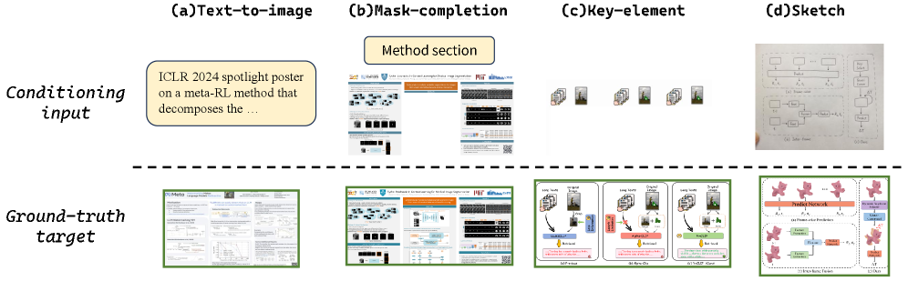

### TL;DR

A multi-agent "harness" that produces publication-quality scientific figures from heterogeneous inputs (text, data tables, sketches) and a sibling tool that converts raster outputs into editable SVGs. The paper argues that the bottleneck isn't a stronger generative backbone but the orchestration layer — a multi-agent loop that decomposes layout, captioning, and component placement into separately verifiable steps.

### Key idea

Scientific figures are *structured compositions* of discrete semantic components (axes, legends, captions, panels). A single end-to-end raster generator hits localized errors that aren't worth re-rolling the whole image for. Crafter wraps the generator with planner / critic / editor agents that operate on the component graph, and CraftEditor maps the raster output to SVG so users can locally revise primitives.

### Main finding

On the new CraftBench (3 figure types × 4 input conditions, with human quality annotation) and on PaperBanana-Bench, Crafter outperforms both single-model generators and a non-decomposed agentic baseline. Ablations show each role (planner, critic, editor) is independently load-bearing. CraftEditor's SVGs beat all raster→SVG baselines.

### Why it matters

A concrete example of the "harness ≫ backbone" thesis for structured-output generation: when a task has a discrete component grammar, scaffolding wins more than scaling. Likely template for slides, diagrams, technical drawings.

### Knowledge graph integration

**Builds on / relates to existing pages:**
- [../agents/README.md](../agents/README.md) — multi-agent harness pattern with explicit role decomposition.
- [../multimodal/README.md](../multimodal/README.md) — vision-language generation grounded in a structured target.

**Suggested new pages:**
- `agents/multi-agent-harness.md` *(depth)* — the planner/critic/editor pattern as a reusable scaffolding template.

---

## 2. PEFT Scaling

**Authors:** Mind Lab (53-author collaboration)
**Links:** [arXiv:2606.02437](https://arxiv.org/abs/2606.02437) · [HF](https://huggingface.co/papers/2606.02437) · [AlphaXiv](https://www.alphaxiv.org/abs/2606.02437)
**Topics:** `fine-tuning`, `PEFT`, `scaling`

### TL;DR

A position-and-infrastructure paper that reframes parameter-efficient fine-tuning (PEFT) as a *substrate for persistent personal models* rather than a cheap stand-in for full fine-tuning. Studies three orthogonal axes — Scale Up (stronger shared base), Scale Down (smallest reliable adapter), Scale Out (millions of co-existing adapter instances) — and ships MinT, an adapter management infrastructure (identity, revision, provenance, eval, serving residency).

### Key idea

Treat the base model as shared competence and adapters as instance-specific state: preferences, skills, tool habits, memory-like updates. The contribution is less a new training algorithm and more an *operating model*: each user / agent / task gets a tiny adapter that is versioned, served on demand, and accumulated like a profile. MinT is the registry-plus-router that makes this tractable at million-instance scale.

### Main finding

The paper is a framework / system more than a benchmark result. The three scaling axes are studied empirically — stronger base models amplify the value of tiny adapters; reliable adapter floors get surprisingly small; adapter-per-user serving is feasible with the right scheduling — and the MinT infrastructure design is described.

### Why it matters

If the next platform shift is "one foundation model + a million personal LoRAs," the bottleneck moves from training to *adapter lifecycle management*. This paper is the first explicit articulation of that operating model and one of the first concrete substrate proposals.

### Knowledge graph integration

**Builds on / relates to existing pages:**
- [../post-training/fine-tuning/README.md](../post-training/fine-tuning/README.md) — directly extends the PEFT / LoRA family of techniques.

**Suggested new pages:**
- `post-training/fine-tuning/_peft.md` *(taxonomy)* — taxonomy of LoRA / DoRA / IA3 / prefix-tuning + adapter-serving systems like MinT, S-LoRA.
- `systems/adapter-serving.md` *(depth)* — runtime patterns for hosting thousands of LoRA adapters per replica.

---

## 3. TASTE

**Authors:** Tomer Keren, Nitay Calderon, Asaf Yehudai, Yotam Perlitz, Michal Shmueli-Scheuer, Roi Reichert — *Technion*
**Links:** [arXiv:2605.28556](https://arxiv.org/abs/2605.28556) · [HF](https://huggingface.co/papers/2605.28556) · [AlphaXiv](https://www.alphaxiv.org/abs/2605.28556)
**Topics:** `eval`, `agents`

### TL;DR

τ²-Bench is saturating. TASTE reverses the usual benchmark construction pipeline: instead of writing natural-language scenarios and mapping them to tool sequences, it *samples valid tool sequences first* from an Adaptive Contrastive n-gram model trained on LLM-judged validity signals, clusters them for coverage, and then instantiates each cluster into a full task. Difficulty is evolved iteratively.

### Key idea

The "scenario-first" pipeline biases benchmarks toward a narrow slice of tool-use patterns that humans easily verbalize. By sampling in the tool-sequence space directly, TASTE doubles unique tool combinations covered, then clusters and back-fills natural-language framing. The Adaptive Contrastive n-gram model is the generator; LLM judgments provide the validity signal that keeps samples realistic.

### Main finding

τ^c-Bench (the new TASTE-built benchmark on three τ²-Bench domains) crushes models that were near-saturated on τ²: Gemini-3-Flash drops from 0.82–0.94 to 0.28–0.61 across 11 agent/user LLM pairs. Coverage of unique tool-combinations more than doubles vs τ².

### Why it matters

Reveals a structural reason agent benchmarks saturate so quickly — the construction pipeline itself limits coverage. The reversed-construction recipe is a general pattern that other agent benchmarks can adopt.

### Knowledge graph integration

**Builds on / relates to existing pages:**
- [../evaluation/README.md](../evaluation/README.md) — a new agent-benchmark construction methodology.
- [../agents/README.md](../agents/README.md) — directly targets the tool-use coverage gap.

**Suggested new pages:**
- `evaluation/agent-benchmark-synthesis.md` *(depth)* — covers TASTE's reverse-construction recipe (sequence-first → cluster → instantiate → evolve difficulty).

---

## 4. Domino

**Authors:** Jianuo Huang, Yaojie Zhang, Qituan Zhang, Hao Lin, Hanlin Xu, Linfeng Zhang — *SJTU EPIC Lab / Huawei*
**Links:** [arXiv:2605.29707](https://arxiv.org/abs/2605.29707) · [HF](https://huggingface.co/papers/2605.29707) · [AlphaXiv](https://www.alphaxiv.org/abs/2605.29707)
**Topics:** `efficient-inference`, `speculative-decoding`

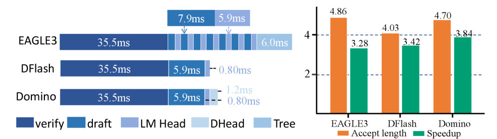

### TL;DR

Speculative decoding is bounded by a quality–cost tradeoff: autoregressive drafters (EAGLE-3) model causal dependencies between draft tokens but pay γ sequential draft-LM-head calls; parallel drafters (DFlash) draft a whole block in one pass but weaken intra-block dependency. Domino splits the difference: a parallel backbone produces preliminary block-level logits, then a *lightweight Domino head* injects causal correction in logit space via a GRU + low-rank residual head.

### Key idea

Decouple causal modeling from autoregressive execution. The parallel backbone (DFlash-style) yields base logits L_i^base for every position. A small GRU summarizes preceding *drafted* tokens into a causal state S_{i-1}; a low-rank MLP turns (H_i, S_{i-1}) into a logit-space residual ΔL_i. Final logits L_i = L_i^base + ΔL_i. Trained with teacher forcing on ground-truth prefixes plus a *base-anchored curriculum* (anneal supervision from base logits to final logits) so the backbone doesn't collapse.

### Main finding

On Qwen3-4B/8B with 16-token draft blocks: up to **5.49× end-to-end speedup** (Transformers backend) and **5.8× throughput** (SGLang), with only +56M params (+5.3%) and +2.8% draft-then-verify latency over DFlash; +16.6% acceptance length on average. Beats EAGLE-3, DART, DFlash, and FR-Spec under same-data ablation on GSM8K / HumanEval / LiveCodeBench.

### Why it matters

Re-frames the EAGLE-vs-Medusa debate: causal information is cheap if you add it as a *logit-space residual* rather than a full autoregressive loop. Likely to become the new reference recipe for block-parallel drafters; very compatible with vocabulary-reduction techniques like FR-Spec.

### Knowledge graph integration

**Builds on / relates to existing pages:**
- [../inference/README.md](../inference/README.md) — speculative decoding is the home topic; this is a new entrant.
- [../architectures/multi-head-attention.md](../architectures/multi-head-attention.md) — the GRU + low-rank head is a representative "cheap residual head" pattern atop attention features.

**Suggested new pages:**
- `inference/_speculative-decoding.md` *(taxonomy)* — autoregressive (EAGLE) vs parallel/diffusion (DFlash, DART) vs hybrid (Domino) drafters; tree vs block verification.
- `inference/domino-drafting.md` *(depth)* — Domino's parallel-backbone + low-rank causal-correction head + base-anchored curriculum.

---

## 5. Harness-1

**Authors:** Pengcheng Jiang, Zhiyi Shi, Kelly Hong, Xueqiang Xu, Jiashuo Sun, Jimeng Sun, Hammad Bashir, Jiawei Han — *UIUC*
**Links:** [arXiv:2606.02373](https://arxiv.org/abs/2606.02373) · [HF](https://huggingface.co/papers/2606.02373) · [AlphaXiv](https://www.alphaxiv.org/abs/2606.02373)
**Topics:** `agents`, `RL`

### TL;DR

A 20B search agent (retrieval sub-agent) trained with RL inside a *stateful search harness* that externalizes routine bookkeeping — candidate pool, importance-tagged curated set, evidence links, verification records, deduplicated observations, budget-aware context rendering — leaving the policy to make only semantic decisions (what to search, what to keep, what to verify, when to stop).

### Key idea

In typical search-agent training the policy is forced to manage *both* semantic search choices and trajectory state (memory, dedup, citations). The authors argue this overloads RL: state management is *recoverable* — the environment can maintain it more reliably. By pushing memory into a "harness" and shrinking the policy's job, RL converges to better search behavior with smaller models.

### Main finding

Across eight retrieval benchmarks spanning web / finance / patents / multi-hop QA, Harness-1 (20B) reaches **0.730 average curated recall, +11.4 points over the next strongest open search sub-agent** and competitive with frontier-model searchers.

### Why it matters

A concrete realization of the "policy ↔ environment partitioning" principle in agentic RL. The same recipe (externalize what's recoverable; train RL only on the semantic core) applies to other long-horizon agents — coding, computer use, browser use.

### Knowledge graph integration

**Builds on / relates to existing pages:**
- [../agents/README.md](../agents/README.md) — search-agent training with an explicit harness boundary.
- [../post-training/_rl.md](../post-training/_rl.md) — RL post-training for an agent policy with externalized state.
- [../systems/partial-rollouts.md](../systems/partial-rollouts.md) — related infra pattern: factoring out state from the rollout loop.

**Suggested new pages:**
- `agents/state-externalizing-harness.md` *(depth)* — the policy/harness split for long-horizon agent training (candidate pool, evidence links, dedup, budget-aware rendering).

---

## 6. Draft-OPD

**Authors:** Haodi Lei, Yafu Li, Haoran Zhang, Shunkai Zhang, Qianjia Cheng, Xiaoye Qu, Ganqu Cui, Bowen Zhou, Ning Ding, Yun Luo, Yu Cheng — *SJTU / Shanghai AI Lab / Tsinghua / CUHK*
**Links:** [arXiv:2605.29343](https://arxiv.org/abs/2605.29343) · [HF](https://huggingface.co/papers/2605.29343) · [AlphaXiv](https://www.alphaxiv.org/abs/2605.29343)
**Topics:** `efficient-inference`, `distillation`, `speculative-decoding`

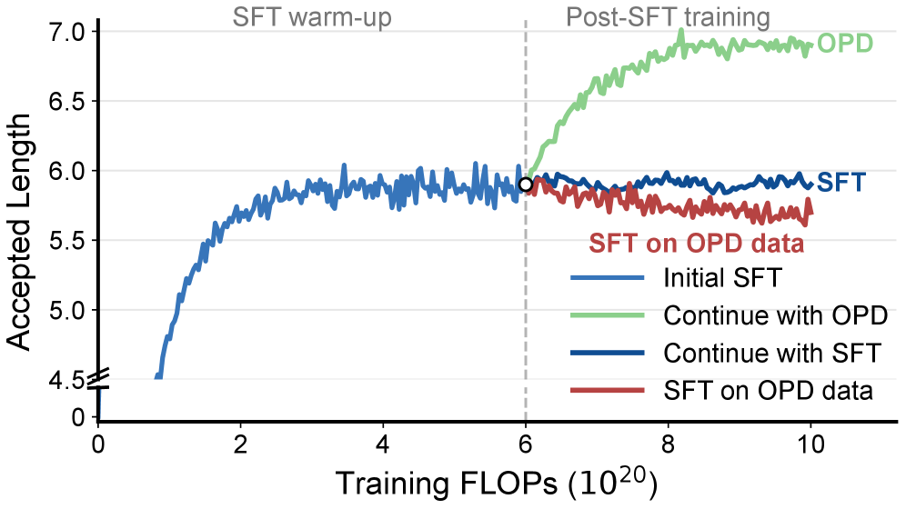

### TL;DR

Standard speculative-draft training is SFT on target-generated trajectories — but draft models' on-the-fly speculative decoding is evaluated on *their own* proposed blocks. The resulting offline-to-inference mismatch makes SFT plateau quickly. Draft-OPD does on-policy distillation: replay drafting from the verification-exposed error positions, then have the target supervise the drafter on those draft-induced states.

### Key idea

True on-policy distillation for draft models is hard — they can't reliably roll out full sequences. Draft-OPD uses *target-assisted rollout* to produce stable continuations, but then replays drafting specifically at positions where the target's verification step would have rejected a draft token. The drafter sees teacher feedback on both accepted and rejected proposals, concentrating training signal on the errors that limit acceptance.

### Main finding

Over **5× lossless acceleration** on reasoning ("thinking") models across diverse tasks. +23% over EAGLE-3 and +13% over DFlash on a same-budget comparison.

### Why it matters

Identifies and fixes a generic problem in speculative-decoding training pipelines: SFT trains the drafter on a different distribution than it will actually see. The replay-at-error-positions trick is portable to other draft architectures (EAGLE-style, Medusa-style, Domino-style).

### Knowledge graph integration

**Builds on / relates to existing pages:**
- [../inference/README.md](../inference/README.md) — improves draft-model training, the upstream half of speculative decoding.
- [../post-training/_post-training.md](../post-training/_post-training.md) — on-policy distillation is a post-training technique applied to the draft model.

**Suggested new pages:**
- `inference/draft-on-policy-distillation.md` *(depth)* — Draft-OPD's target-assisted rollout + verification-position replay recipe.

---

## 7. NITP

**Authors:** (multi-institution, lead author per repo: aHapBean)
**Links:** [arXiv:2605.24956](https://arxiv.org/abs/2605.24956) · [HF](https://huggingface.co/papers/2605.24956) · [AlphaXiv](https://www.alphaxiv.org/abs/2605.24956)
**Topics:** `pre-training`, `representation`

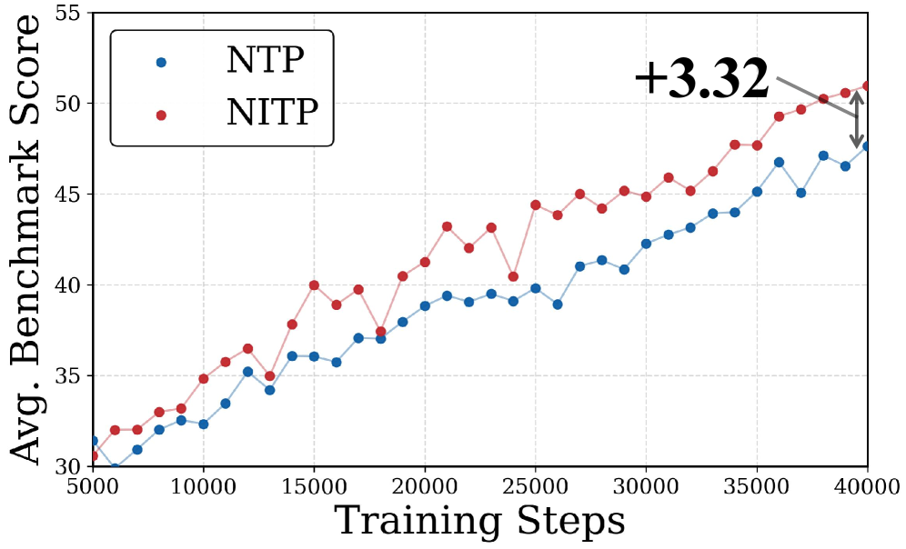

### TL;DR

Standard next-token prediction (NTP) supervises only through discrete labels in logit space, leaving hidden representations under-constrained and prone to anisotropic / degenerate geometry. NITP adds a *dense, continuous* auxiliary loss in representation space: predict the *implicit* semantic content of the next token using shallow-layer hidden states of the same model as self-supervised targets.

### Key idea

Augment NTP loss with an auxiliary "predict the shallow-layer representation of the next token" loss. The targets are produced by the model's own early layers (stable, no extra teacher), and the loss regularizes the optimization landscape against degenerate hidden-state geometry. The paper offers a small theoretical argument that this constrains the otherwise under-determined latent space.

### Main finding

Across dense and MoE LLMs from 0.5B to 9B parameters, consistent downstream improvement. On a 9B MoE: **+5.7 abs on MMLU-Pro, +6.4 on C3, +4.3 on CommonsenseQA**, at ~2% additional training FLOPs and *zero* inference overhead.

### Why it matters

Tiny, drop-in modification to the pretraining objective with measurable downstream gains and no inference cost. If reproduced, this becomes a default ingredient in pretraining recipes — comparable in spirit (and cost) to z-loss.

### Knowledge graph integration

**Builds on / relates to existing pages:**
- [../pre-training/README.md](../pre-training/README.md) — pretraining-objective modification.
- [../pre-training/mtp.md](../pre-training/mtp.md) — multi-token prediction is the closest existing pretraining-objective augmentation; NITP is orthogonal (representation-level, not token-level).
- [../fundamentals/z-loss.md](../fundamentals/z-loss.md) — same "cheap auxiliary regularizer on logits/representations" family.

**Suggested new pages:**
- `pre-training/nitp.md` *(depth)* — representation-space auxiliary loss using shallow-layer self-targets.

---

## 8. WASH

**Authors:** Zhihao Wu, Gracia Gong, Qinglin Zhu, Yudong Chen, Runcong Zhao — *(UK consortium)*
**Links:** [arXiv:2605.30501](https://arxiv.org/abs/2605.30501) · [HF](https://huggingface.co/papers/2605.30501) · [AlphaXiv](https://www.alphaxiv.org/abs/2605.30501)
**Topics:** `safety`, `watermarking`

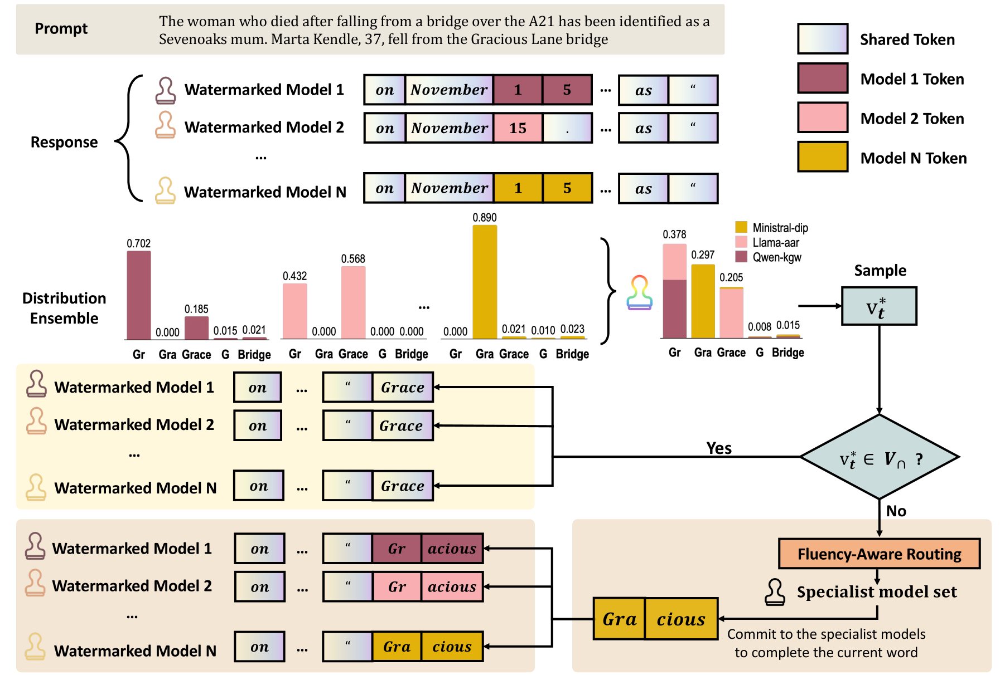

### TL;DR

Distributional-perturbation watermarks (the dominant family, including KGW / SynthID-style schemes) trivially fail when a user can access multiple models. The paper proves theoretically that averaging output distributions across providers recovers the unwatermarked distribution up to second-order error, and ships WASH (Watermark Attenuation via Statistical Hybridisation) which handles practical vocabulary-misalignment and tokenization differences across heterogeneous models.

### Key idea

Modern LLM watermarks perturb token logits in provider-specific ways that are approximately independent across competing models. Averaging the probabilities from 3–5 models therefore cancels each provider's perturbation. The theoretical bound is second-order in the perturbation magnitude. WASH adds tokenizer alignment and fluency-aware routing so the ensemble produces text quality *higher* than any individual watermarked model.

### Main finding

Across 6 watermarking schemes × 3 LLMs: averaging 3 models drops detection z-scores from **5–300 to below 2** (detection threshold = 4) and TPR@5%FPR below 50%, while **improving generation quality by 27.5%** and running 6× faster than a strong paraphrase-attack baseline.

### Why it matters

Existing distributional watermarks were already known to be fragile to paraphrase attacks; this paper shows they're fragile to a *free* attack that needs no adversarial effort — just access to multiple competing model APIs. Major signal that text watermarking needs a different threat model.

### Knowledge graph integration

**Builds on / relates to existing pages:**
- [../safety/_attacks.md](../safety/_attacks.md) — adds a new attack class (ensemble-averaging) against text watermarks.
- [../safety/README.md](../safety/README.md) — provenance / detection sub-area.

**Suggested new pages:**
- `safety/watermarking.md` *(depth)* — LLM watermarking landscape and its ensemble-attack vulnerability (KGW family, SynthID, WASH attack).

---

## 9. VideoMLA

**Authors:** Hidir Yesiltepe, Jiazhen Hu, Tuna Han Salih Meral, Adil Kaan Akan, Kaan Oktay, Hoda Eldardiry, Pinar Yanardag — *Virginia Tech / fal*
**Links:** [arXiv:2605.30351](https://arxiv.org/abs/2605.30351) · [HF](https://huggingface.co/papers/2605.30351) · [AlphaXiv](https://www.alphaxiv.org/abs/2605.30351)
**Topics:** `diffusion`, `architectures`, `efficient-inference`, `video`

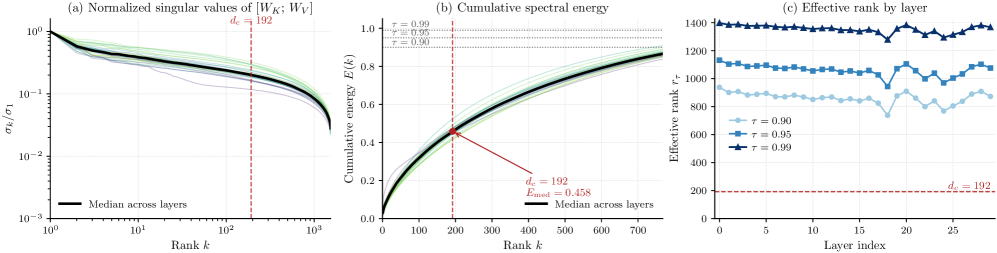

### TL;DR

First study porting Multi-Head Latent Attention (MLA) — DeepSeek-V2/V3's KV-compression trick — from text LLMs to long-rollout causal *video* diffusion. Replaces per-head keys/values with a shared low-rank content latent plus a shared decoupled 3D-RoPE positional key, cutting per-token KV memory by **92.7%** at every cached layer.

### Key idea

Long-video diffusion has been stuck with a fixed sliding-window KV cache, and innovation has happened *inside* the window (token selection, positional encoding) rather than changing the per-head KV layout. VideoMLA shows the layout itself is the dominant memory/latency contributor and that MLA's low-rank latent-key recipe transfers. Crucially, the paper demonstrates that the "low-rank spectrum" justification for MLA in LLMs *does not hold* in video — pretrained video attention occupies nearly full rank — yet MLA still works because the MLA bottleneck (not the pretrained spectrum) determines the effective rank under training.

### Main finding

92.7% per-token KV memory reduction, matched short-horizon VBench scores against sliding-window baselines, **best overall VBench at long horizons**, and **1.23× throughput** on a single B200 GPU.

### Why it matters

(1) Practical: video diffusion's KV cache is the binding constraint at long rollouts; this is the first big-step compression. (2) Conceptual: the standard "low-rank" argument for MLA isn't the real mechanism — the bottleneck *creates* a usable subspace through training rather than exploiting one that pre-existed. That reframes how MLA-style designs should be motivated and tuned.

### Knowledge graph integration

**Builds on / relates to existing pages:**
- [../architectures/mla.md](../architectures/mla.md) — direct application of MLA to a new domain; surfaces a mechanism revision (bottleneck-induced rank, not spectral-prior exploitation).
- [../fundamentals/rope.md](../fundamentals/rope.md) — uses a decoupled 3D-RoPE positional key.
- [../architectures/multi-head-attention.md](../architectures/multi-head-attention.md) — KV-cache layout trade-offs.

**Suggested new pages:**
- `multimodal/video-diffusion-kv.md` *(depth)* — KV-cache layouts for long autoregressive video diffusion (sliding window, sparse, MLA-latent).

---

## 10. Spatial Pretraining

**Authors:** (multi-institution; not visible on HF page)
**Links:** [arXiv:2605.28132](https://arxiv.org/abs/2605.28132) · [HF](https://huggingface.co/papers/2605.28132) · [AlphaXiv](https://www.alphaxiv.org/abs/2605.28132)
**Topics:** `multimodal`, `pre-training`, `eval`

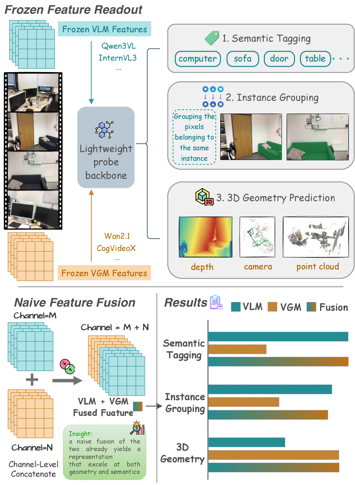

### TL;DR

Empirical comparison of two pretraining paradigms for spatial understanding: vision-language models (VLMs) trained on image-text contrastive / generative objectives, and video generation models trained on next-frame prediction. Three probing axes — semantic tagging (ScanNet20), instance grouping across views, and 3D geometry (DL3DV with VGGT-supervised point/depth/pose targets) — measure which paradigm encodes more spatial structure.

### Key idea

Both paradigms see "the same pixels" but learn very different latent geometry. The paper sets up matched probing tasks so the comparison is apples-to-apples: a frozen backbone + small probe predicts categorical labels, instance correspondences, and 3D geometry. Differences in probe accuracy isolate which paradigm injects more spatial structure into representations.

### Main finding

(Abstract summary) Video generation pretraining encodes more 3D-geometric structure than VLM contrastive/generative pretraining, especially for instance grouping across viewpoints and 3D geometry probes. VLMs win on coarse semantic tagging — exactly the dimension their training objective rewards.

### Why it matters

For multimodal/embodied stacks that need spatial grounding (VLA, navigation), the choice of pretraining paradigm matters more than the choice of architecture. Video pretraining looks like the better substrate for spatial intelligence even if VLMs are the better starting point for language-conditioned tasks.

### Knowledge graph integration

**Builds on / relates to existing pages:**
- [../multimodal/README.md](../multimodal/README.md) — comparative analysis of multimodal pretraining objectives.
- [../pre-training/README.md](../pre-training/README.md) — pretraining-objective design study.

**Suggested new pages:**
- *(none — this paper is comparative analysis rather than a new technique; it informs the existing multimodal taxonomy.)*

---

## 11. ESPO

**Authors:** Zihang Li, Rui Zhou, Yingcheng Shi, Wenhan Yu, Zhewen Tan, Zixiang Liu, Zeming Li, Binhua Li, Yongbin Li, Tong Yang, Jieping Ye — *Tongyi Lab, Alibaba / Peking University*
**Links:** [arXiv:2605.29860](https://arxiv.org/abs/2605.29860) · [HF](https://huggingface.co/papers/2605.29860) · [AlphaXiv](https://www.alphaxiv.org/abs/2605.29860)
**Topics:** `RL`, `reasoning`

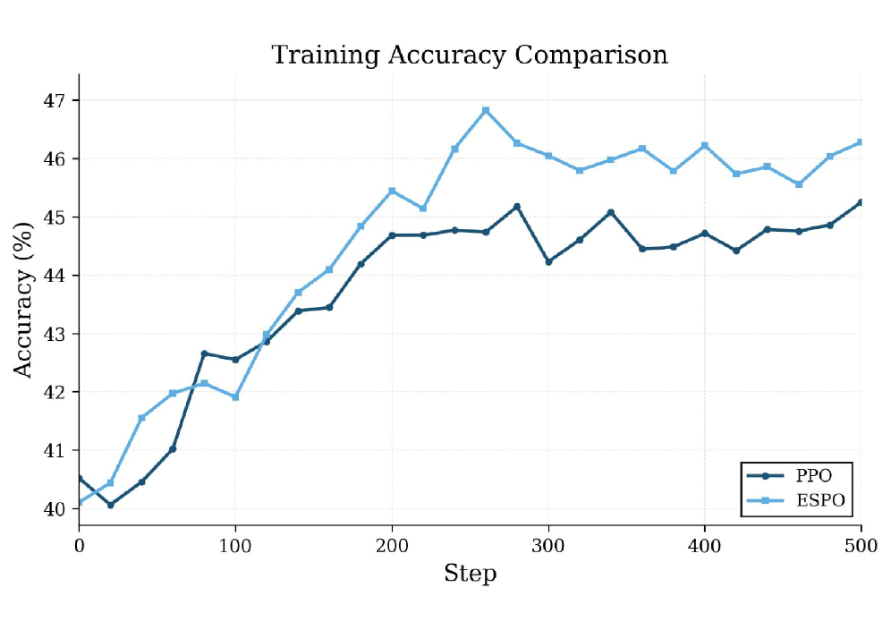

### TL;DR

In long-CoT RL training, when a model commits to a wrong reasoning step early, standard algorithms force it to keep generating until T_max — spending compute on tokens that earn no reward and *polluting the advantage estimate* with post-failure noise. ESPO detects on-the-fly that a trajectory has failed and truncates it, using only the policy's already-computed logits and the critic's value estimate (no extra reward model, no extra annotations).

### Key idea

At each decode step compute a *surrogate regret* g_t = logπ(argmax) − logπ(sampled): how far the sampled token is from the policy's mode. Smooth it with batch EMA stats and accumulate into z_t. Terminate when z_t > β · max(V_φ(s_t), ε) — i.e. when accumulated regret exceeds what the critic still expects to recover. Truncation is mapped to an *absorbing failure transition* with a negative terminal reward, so GAE propagates a concentrated negative TD-error back to the failure step. A critic warmup phase prevents spurious early truncations.

### Main finding

On DeepSeek-R1-Distill-Qwen-7B trained for math: surpasses PPO on AIME24 (**46.28 vs 45.25**), AMC23 (**85.83 vs 82.94**), MATH-500 (**87.42 vs 85.43**), saving **>20% cumulative rollout tokens**. The ablation against random truncation at the same rate scores only 42.4% on AIME24 — confirming the gain comes from *where* trajectories are cut, not just from shorter rollouts.

### Why it matters

A drop-in modifier on top of PPO/GRPO/DAPO that simultaneously improves accuracy *and* reduces rollout cost — by removing a previously unrecognized noise source (post-failure tokens) from the advantage estimate. Composes with reward-shaping and advantage-normalization improvements.

### Knowledge graph integration

**Builds on / relates to existing pages:**
- [../post-training/ppo.md](../post-training/ppo.md) — direct PPO modifier; trajectory-truncation extension.
- [../post-training/grpo.md](../post-training/grpo.md) — also applies to GRPO/DAPO advantage estimators.
- [../post-training/reasoning/long-cot-rl.md](../post-training/reasoning/long-cot-rl.md) — long-rollout RL is where post-failure noise hurts most.
- [../post-training/reasoning/length-penalty.md](../post-training/reasoning/length-penalty.md) — related but distinct mechanism for shortening rollouts.

**Suggested new pages:**
- `post-training/reasoning/espo.md` *(depth)* — value-gated early-stopping rollout termination for RL post-training.

---

## 12. LVSA

**Authors:** Gael Glorian, Ioannis Lamprou, Zhen Zhang, Yujie Yuan, Hongsheng Liu — *Huawei Paris Research Center*
**Links:** [arXiv:2605.31057](https://arxiv.org/abs/2605.31057) · [HF](https://huggingface.co/papers/2605.31057) · [AlphaXiv](https://www.alphaxiv.org/abs/2605.31057)
**Topics:** `diffusion`, `efficient-inference`, `architectures`, `video`

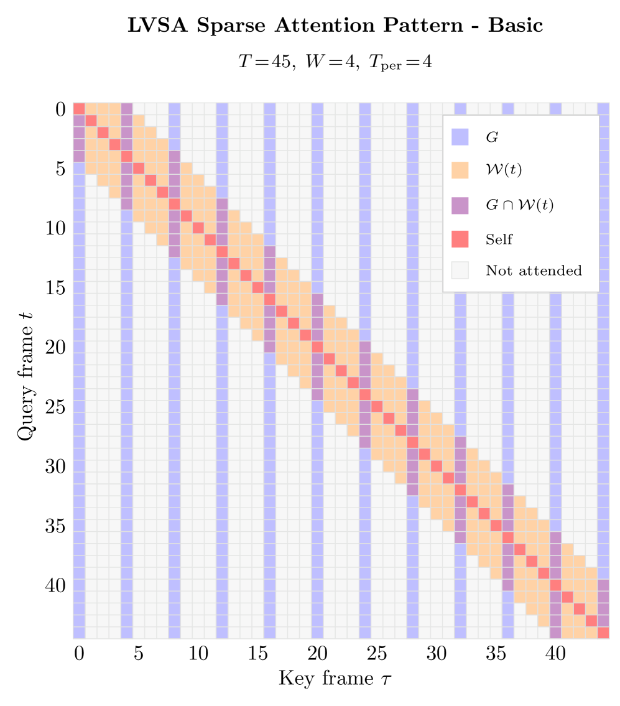

### TL;DR

Training-free block-sparse attention for long-video diffusion transformers (Wan, HunyuanVideo). Each query frame attends to (a) a periodic set of global anchor frames and (b) a local temporal window; the global set *rotates* across denoising steps so no frame is permanently demoted from anchor status. Includes a custom evaluator (VQeval) that — unlike VBench-Long — properly penalizes frozen / looping video.

### Key idea

Dense video self-attention is O(N²) and collapses to near-static "frozen" video past the training horizon. LVSA fixes both: each query frame's attention set A(t) = G^s ∪ W(t) where G^s is a set of equispaced global anchors that *shift* by one position per denoising step (so every frame serves as an anchor at least once per T_per cycle), and W(t) is a small local window with adaptive bounds to avoid wasting the budget on global/window overlap. Compute becomes linear in T.

### Main finding

Wall-time speedups vs dense: **3.17× on Wan 2.1 1.3B at 6× horizon, 2.98× on Wan 2.1 14B at 6×, 3.33× on HunyuanVideo 1.5 at 1.5×**. Enables HunyuanVideo 1.5 at 2× horizon (257 frames) — *infeasible* on a single 80GB GPU with dense attention. Outperforms RIFLEx (up to 2.41×) and UltraViCo (up to 3.27×) on compute *and* VQeval quality. Also runs on NPU (2.71× on Wan 2.2 A14B).

### Why it matters

Two contributions worth re-using: (1) rotating global anchors eliminate the fixed-grid bias that plagued earlier static-pattern sparse video attention; (2) VQeval exposes VBench-Long's static-rewarding bias — high subject_consistency rewards essentially-frozen video, so the field needs a better long-horizon metric.

### Knowledge graph integration

**Builds on / relates to existing pages:**
- [../inference/README.md](../inference/README.md) — sparse-attention inference acceleration.
- [../architectures/multi-head-attention.md](../architectures/multi-head-attention.md) — attention-pattern modification.

**Suggested new pages:**
- `inference/sparse-video-attention.md` *(depth)* — block-sparse attention for long-video diffusion (rotating global anchors + adaptive local window).
- `evaluation/vqeval.md` *(depth)* — long-video quality eval that penalizes frozen / looping output (and the failure mode of VBench-Long).

---

## 13. UDS (Unlearning Depth Score)

**Authors:** Jaeung Lee, Dohyun Kim, Jaemin Jo — *Sungkyunkwan University*
**Links:** [arXiv:2605.24614](https://arxiv.org/abs/2605.24614) · [HF](https://huggingface.co/papers/2605.24614) · [AlphaXiv](https://www.alphaxiv.org/abs/2605.24614)
**Topics:** `interp`, `safety`, `eval`, `unlearning`

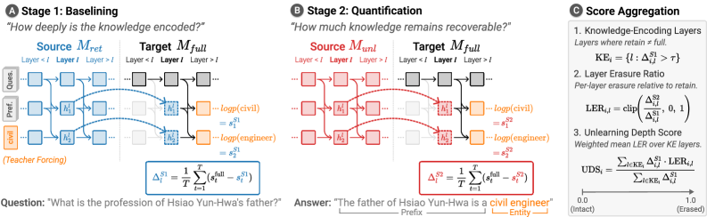

### TL;DR

Output-level unlearning metrics miss residual knowledge in internal representations; white-box methods need auxiliary training. UDS proposes a *causal* metric using activation patching: first identify layers in a retain-model baseline that encode the target knowledge, then measure how much of that signal is erased in the unlearned model — on a 0–1 scale, with no extra training.

### Key idea

Activation patching as an unlearning auditor. The retain (un-unlearned) model serves as the source of activations; patching those activations into the unlearned model at each candidate layer measures how much of the answer signal is recoverable. Aggregating across the identified layers gives UDS ∈ [0,1] — a faithful, training-free, model-agnostic metric for *mechanistic* erasure depth.

### Main finding

Meta-evaluation over 20 metrics × 150 unlearned models × 8 unlearning methods: UDS achieves the **highest faithfulness and robustness** among all metrics. Case studies show that other white-box metrics disagree at the layer level and that erasure depth varies across examples.

### Why it matters

Unlearning has been an evaluation-dominated subfield, and audit metrics have lagged the methods. UDS is the first causal mechanistic metric that doesn't require dataset-specific adaptation, making cross-method comparison meaningful. Plug-in to existing benchmarking pipelines.

### Knowledge graph integration

**Builds on / relates to existing pages:**
- [../interpretability/README.md](../interpretability/README.md) — activation patching applied to a safety evaluation.
- [../safety/README.md](../safety/README.md) — unlearning as a post-hoc safety mechanism.
- [../evaluation/README.md](../evaluation/README.md) — proposes a new metric for an existing eval family.

**Suggested new pages:**
- `interpretability/activation-patching.md` *(depth)* — the core mechinterp primitive (causal mediation analysis via activation swaps), with UDS as one application.
- `safety/llm-unlearning.md` *(depth)* — unlearning methods, threat models, audit metrics (UDS as the proposed default).

---

## 14. UNSL

**Authors:** Ethan Caballero, Priyank Jaini, David Krueger, Irina Rish — *Mila, University of Montreal / Google DeepMind*
**Links:** [arXiv:2605.26248](https://arxiv.org/abs/2605.26248) · [HF](https://huggingface.co/papers/2605.26248) · [AlphaXiv](https://www.alphaxiv.org/abs/2605.26248)
**Topics:** `scaling`, `pre-training`

### TL;DR

Proposes a *unified* functional form (Unified Neural Scaling Laws, UNSL) that generalizes the Broken Neural Scaling Laws family to multiple input axes simultaneously (model size × data × compute × dataset mix × …) and supports arbitrary numbers of "breaks" in the loss curve. The paper studies expressivity, fits, extrapolation, and the limits of how predictable scaling behavior really is.

### Key idea

Most scaling-law parametrizations are one-dimensional (loss vs N, vs D, vs C) and break across regime transitions. UNSL's functional form is constructed to (1) satisfy a list of desiderata (limits, additive symmetry, capturing emergent breaks), (2) extend to a sum of monotonic broken pieces, and (3) extrapolate accurately when fit on partial data — claimed an order-of-magnitude further in multiple dimensions simultaneously.

### Main finding

Empirically the UNSL form fits and extrapolates across multiple input dimensions where prior parametrizations either fail to fit or fail to extrapolate. The paper also discusses the *intrinsic limit* of scaling predictability and where any functional form must fail.

### Why it matters

For pretraining planning, a multi-axis, break-tolerant scaling law that extrapolates is genuinely useful — it changes how you size compute budgets when data and model size are co-varying. Likely to be picked up by frontier-lab planning teams as a successor to Chinchilla-style fits.

### Knowledge graph integration

**Builds on / relates to existing pages:**
- [../pre-training/README.md](../pre-training/README.md) — scaling-law family.

**Suggested new pages:**
- `pre-training/_scaling-laws.md` *(taxonomy)* — Kaplan / Chinchilla / Broken-NSL / DeepSeek scaling / UNSL — variants, what each fits, when each fails.

---

## 15. DOT-MoE

**Authors:** (not enumerated on HF page)
**Links:** [arXiv:2606.01666](https://arxiv.org/abs/2606.01666) · [HF](https://huggingface.co/papers/2606.01666) · [AlphaXiv](https://www.alphaxiv.org/abs/2606.01666)
**Topics:** `MoE`, `architectures`, `efficient-inference`

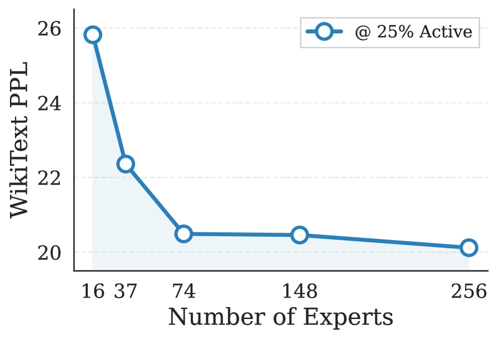

### TL;DR

MoEfication — converting a pretrained dense LLM into a sparse MoE — has so far relied on heuristic neuron clustering or random splits to partition the FFN. DOT-MoE formulates the partition as a *Differentiable Optimal Transport* problem: neuron-to-expert assignment is a balanced transport, solved with Sinkhorn-Knopp iterations, and learned jointly with the token-to-expert router via straight-through estimators.

### Key idea

Two coupled discrete decisions — which neurons belong to which expert (one-time partition) and which token routes to which expert (per-forward) — are made jointly differentiable. The Sinkhorn-Knopp iterations enforce strict expert capacity constraints (balanced transport), while STE makes the discrete assignments trainable end-to-end. No more heuristic clustering.

### Main finding

Outperforms structured pruning, heuristic-clustering MoEfication, and random-split baselines across multiple architectures and benchmarks. Retains **90% of the original dense model's performance while reducing active parameters by 50%**.

### Why it matters

A principled, learnable alternative to ad-hoc MoEfication clustering. Sinkhorn-style capacity constraints replace heuristic load balancing in this conversion step — directly comparable to how load-balance / aux-loss-free routing replaced auxiliary losses in from-scratch MoE training.

### Knowledge graph integration

**Builds on / relates to existing pages:**
- [../architectures/_moe.md](../architectures/_moe.md) — MoEfication is a route into the MoE space without from-scratch training.
- [../architectures/load-balancing-loss.md](../architectures/load-balancing-loss.md) — Sinkhorn capacity constraints are an alternative to auxiliary load-balance losses.
- [../architectures/aux-loss-free-balancing.md](../architectures/aux-loss-free-balancing.md) — same conceptual family: avoiding heuristic balance losses.

**Suggested new pages:**
- `architectures/moefication.md` *(depth)* — dense → MoE conversion (heuristic clustering, random split, DOT-MoE) with the upcycling distinction.

---

## Notes

- Borderline inclusions: paper #10 (spatial pretraining comparison) was kept because it informs an existing topical area even though it doesn't propose a new technique; paper #14 (UNSL) is theory-leaning but directly informs pretraining planning.
- Hero figures live in `assets/2026-06-02/`. Missing figures (papers 2, 3, 5, 14) reflect arXiv HTML returning the standard placeholder image; HF og:image was not exposed for these.
- This digest is informational. No existing concept files, `READING-LIST.md`, or `PAPERS.md` were modified to produce it.
