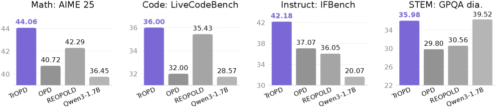
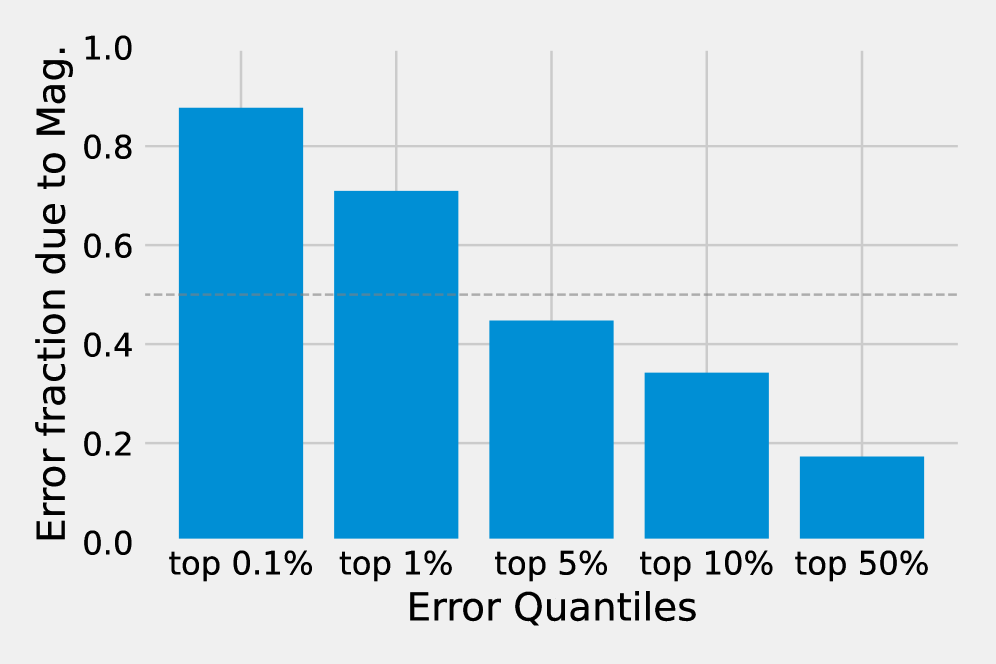
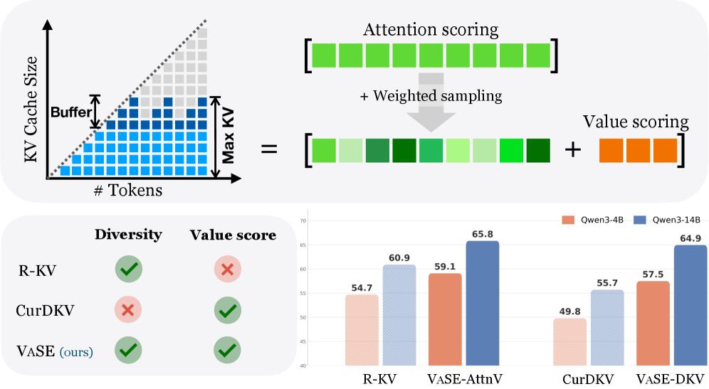
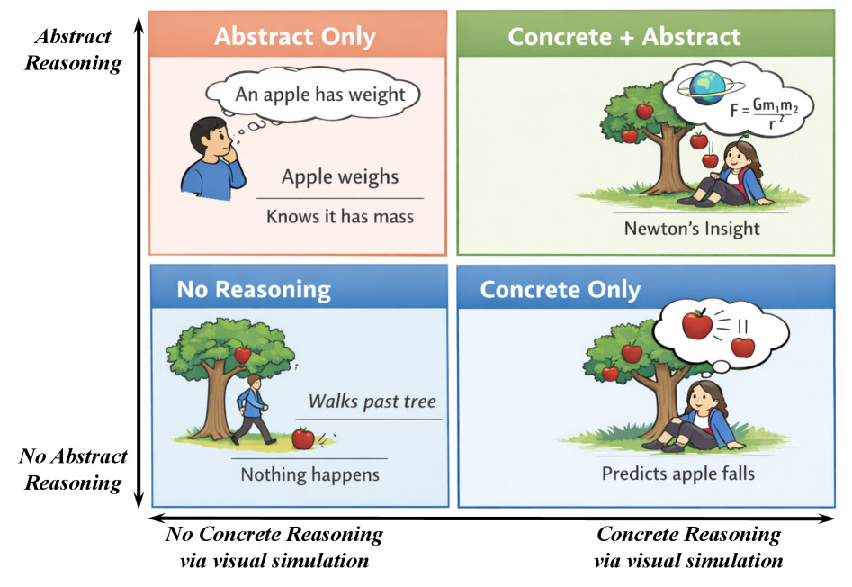
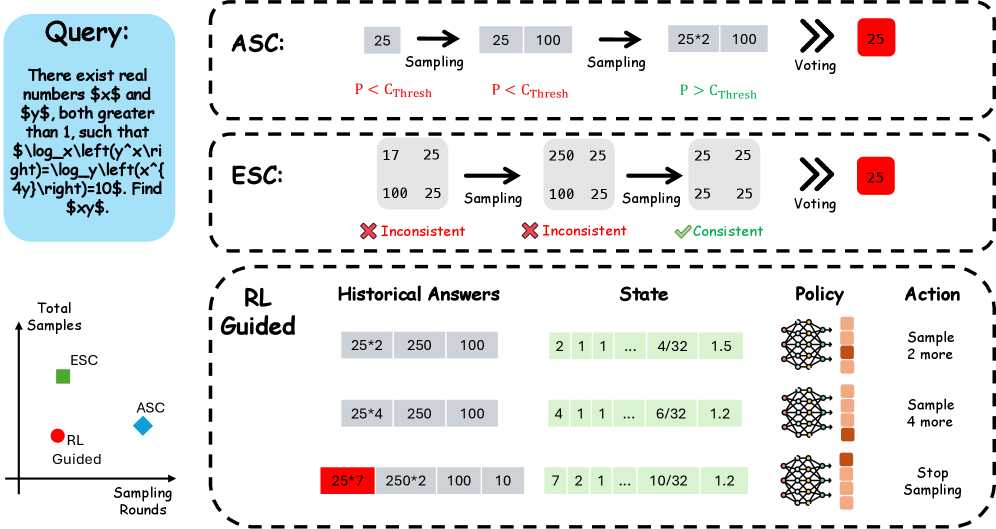
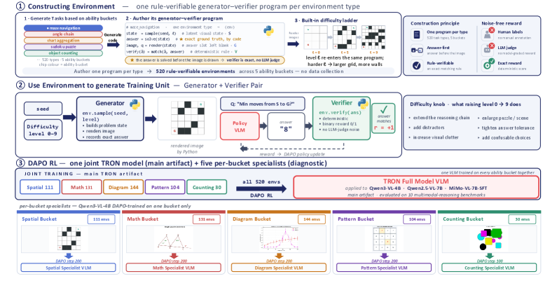
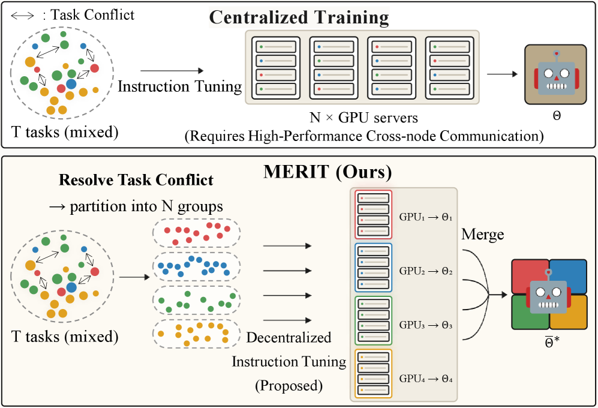
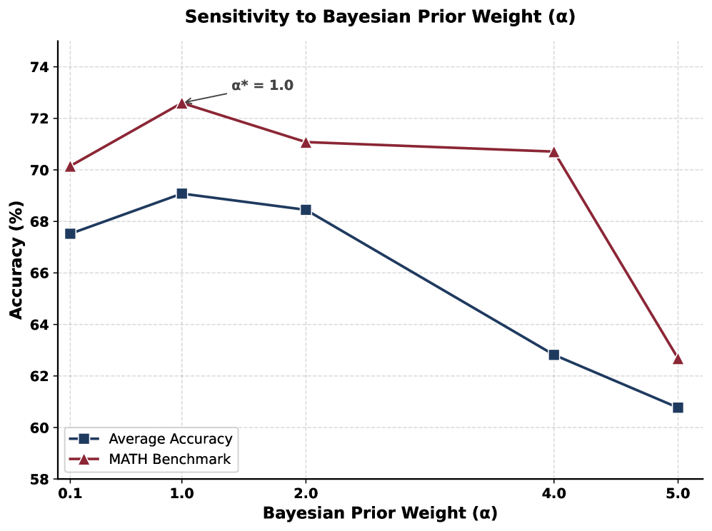
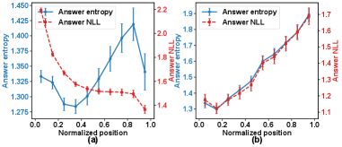
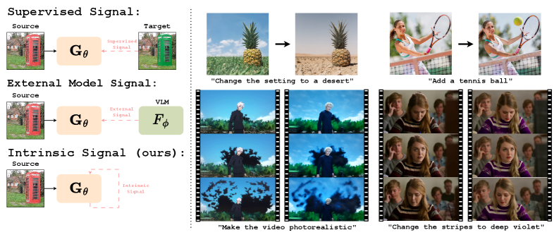

# Daily AI papers — 2026-06-03

*Curated from HF Daily Papers. 14 of 41 papers kept after relevance filter.*

## Papers at a glance

| # | Title | Topics | Org |
| --- | --- | --- | --- |
| 1 | [Trust Region On-Policy Distillation](#1-trust-region-on-policy-distillation) | `LLM`, `distillation`, `RL` | Samsung Research |
| 2 | [GRAIL: Gradient-Reweighted Advantages for RLVR](#2-grail-gradient-reweighted-advantages-for-rlvr) | `RL`, `RLVR`, `reasoning` | DeCLaRe Lab (SUTD) |
| 3 | [KVarN: Variance-Normalized KV-Cache Quantization](#3-kvarn-variance-normalized-kv-cache-quantization) | `quantization`, `efficient-inference`, `reasoning` | Huawei |
| 4 | [Value-Aware Stochastic KV Cache Eviction (VaSE)](#4-value-aware-stochastic-kv-cache-eviction-vase) | `efficient-inference`, `reasoning` | USC / U. Chicago |
| 5 | [World Models Meet Language Models (PF-OPSD)](#5-world-models-meet-language-models-pf-opsd) | `multimodal`, `reasoning`, `distillation` | U. Macau |
| 6 | [Small RL Controller, Large LLM: Adaptive Sampling for Test-Time Scaling](#6-small-rl-controller-large-llm-adaptive-sampling-for-test-time-scaling) | `RL`, `reasoning`, `efficient-inference` | UNC / U. Maryland |
| 7 | [Language Models Need Sleep](#7-language-models-need-sleep) | `LLM`, `distillation`, `RL`, `continual` | Google / Cornell |
| 8 | [TRON: Rule-Verifiable Online Environments for Visual Reasoning RL](#8-tron-rule-verifiable-online-environments-for-visual-reasoning-rl) | `multimodal`, `RL`, `RLVR`, `agents` | U. Georgia |
| 9 | [MERIT: Decentralized Instruction Tuning](#9-merit-decentralized-instruction-tuning) | `SFT`, `multimodal`, `merging` | NAVER AI |
| 10 | [MIRA: Mid-training Rubric Anchoring for Data Selection](#10-mira-mid-training-rubric-anchoring-for-data-selection) | `data`, `pre-training`, `mid-training` | Beihang / IQuest |
| 11 | [OmniOPD: Logit-Free On-Policy Distillation](#11-omniopd-logit-free-on-policy-distillation) | `distillation`, `RL`, `reasoning` | Meta Research |
| 12 | [Diagnosing Harmful Continuation in Long-CoT SFT](#12-diagnosing-harmful-continuation-in-long-cot-sft) | `reasoning`, `SFT`, `data` | UESTC / SUTD |
| 13 | [Pressure-Testing Deception Probes in LLMs](#13-pressure-testing-deception-probes-in-llms) | `interp`, `safety`, `eval` | LexisNexis (independent) |
| 14 | [Bootstrap Your Generator: Unpaired Visual Editing with Flow Matching](#14-bootstrap-your-generator-unpaired-visual-editing-with-flow-matching) | `diffusion`, `multimodal` | NVIDIA / Tel Aviv |

---

## 1. Trust Region On-Policy Distillation

**Authors:** Xingrun Xing, Haoqing Wang, Boyan Gao, Ziheng Li, Yehui Tang — *Samsung Research Beijing, Oxford, Peking U.*
**Links:** [arXiv:2606.01249](https://arxiv.org/abs/2606.01249) · [HF](https://huggingface.co/papers/2606.01249) · [AlphaXiv](https://www.alphaxiv.org/abs/2606.01249)
**Topics:** `LLM`, `distillation`, `RL`

### TL;DR

On-policy distillation (OPD) blows up when the teacher and student distributions diverge — the reverse-KL gradient on student-generated tokens becomes unreliable. TrOPD restricts the OPD update to a "trust region" of reliable teacher supervision, handles outlier tokens with clipping/masking/forward-KL, and adds an off-policy guidance branch where the student continues from teacher prefixes.

### Key idea

Three pieces stacked on standard OPD: (1) trust-region masking — only apply reverse-KL where teacher logits look reliable, (2) outlier estimation — gradient clip / mask / swap to forward-KL on tokens outside the trust region, and (3) off-policy guidance — generate from teacher prefixes and use forward-KL to pull the student toward reliable regions of the teacher's distribution.

### Main finding

TrOPD beats OPD, EOPD, and REOPOLD across math reasoning, code, and general-domain benchmarks. The paper frames the gain as fixing the instability of K1-style reverse-KL under distribution shift, which is where standard OPD breaks.

### Why it matters

OPD is becoming the default post-training move for compressing big teachers into small students. TrOPD is a clean fix for the "OPD diverges when teacher ≫ student" problem and slots in cleanly as a drop-in upgrade — relevant for anyone doing reasoning distillation off a frontier teacher.

### Knowledge graph integration

**Builds on / relates to existing pages:**
- [../post-training/_post-training.md](../post-training/_post-training.md) — OPD lives in the post-training stage between SFT and RL.
- [../post-training/_rl.md](../post-training/_rl.md) — OPD reuses the on-policy rollout idea from RL post-training.
- [../post-training/rlvr.md](../post-training/rlvr.md) — TrOPD is benchmarked on the same math/code reasoning tasks RLVR targets.

**Suggested new pages:**
- `post-training/on-policy-distillation.md` *(depth)* — base OPD concept, with TrOPD as one variant; also covered by papers 7 and 11.

---

## 2. GRAIL: Gradient-Reweighted Advantages for RLVR

**Authors:** Tej Deep Pala, Vernon Toh, Soujanya Poria — *DeCLaRe Lab, SUTD*
**Links:** [arXiv:2606.04889](https://arxiv.org/abs/2606.04889) · [HF](https://huggingface.co/papers/2606.04889) · [AlphaXiv](https://www.alphaxiv.org/abs/2606.04889)
**Topics:** `RL`, `RLVR`, `reasoning`

### TL;DR

GRPO broadcasts one sequence-level advantage to every token, diluting credit on the few tokens that actually decided the answer. GRAIL reweights token-wise advantages by gradient-activation saliency — tokens whose gradients are locally most influential on the final answer get more weight — and gets PRM-style fine-grained credit without a process reward model.

### Key idea

Compute a saliency score per token from the model's own gradient w.r.t. the final answer logit (or the verifiable reward), then use that as a multiplier on top of the standard GRPO advantage. Higher-saliency tokens (logical pivots) get amplified updates; filler tokens get damped. No extra model, no process labels.

### Main finding

Across five models from the Qwen3, R1-distilled, and OctoThinker families, GRAIL gives +3.60% average accuracy and +3.05% Pass@3 over GRPO on math reasoning benchmarks.

### Why it matters

A cheap intrinsic substitute for process reward models — closes part of the gap between PRM and ORM credit-assignment without the annotation cost. Likely to show up as a drop-in tweak in subsequent GRPO-based pipelines.

### Knowledge graph integration

**Builds on / relates to existing pages:**
- [../post-training/grpo.md](../post-training/grpo.md) — GRAIL is a direct token-wise reweighting on top of GRPO advantages.
- [../post-training/rlvr.md](../post-training/rlvr.md) — same RLVR setting (verifiable math/code rewards).
- [../post-training/reasoning/prm.md](../post-training/reasoning/prm.md) — positioned as an intrinsic alternative to PRMs.
- [../post-training/reasoning/orm.md](../post-training/reasoning/orm.md) — addresses the credit-assignment limitation of ORM-style sequence-level rewards.

**Suggested new pages:** *(could append a row to a future "GRPO variants" table; skip as standalone for now.)*

---

## 3. KVarN: Variance-Normalized KV-Cache Quantization

**Authors:** Lorenz K. Muller, Philippe Bich, Chiara Boretti, Hyun-Min Chang, Jiawei Zhuang, Lukas Cavigelli — *Huawei*
**Links:** [arXiv:2606.03458](https://arxiv.org/abs/2606.03458) · [HF](https://huggingface.co/papers/2606.03458) · [AlphaXiv](https://www.alphaxiv.org/abs/2606.03458)
**Topics:** `quantization`, `efficient-inference`, `reasoning`

### TL;DR

Existing KV-cache quantizers are evaluated under prefill — but under long autoregressive decoding, quantization errors compound timestep over timestep, driven by per-token scale outliers. KVarN applies a Hadamard rotation followed by dual-axis variance normalization on both K and V, fixing the outlier-token scales calibration-free.

### Key idea

Rotate K/V with a Hadamard transform to spread per-token magnitudes (the standard incoherence-processing move), then run a *dual-scaling* variance normalization across both the token axis and the head-dim axis. The combination targets the autoregressive error-accumulation regime specifically rather than the prefill regime that prior baselines tuned on.

### Main finding

At 2-bit KV quantization, KVarN is SOTA on generative reasoning benchmarks: MATH500, AIME24, HumanEval. The paper ships a vLLM implementation; the gain comes from preventing the error compounding that broke prior 2-bit baselines on long CoT decoding.

### Why it matters

Long-CoT reasoning models are memory-bound, not compute-bound — KV cache is the bottleneck. A calibration-free 2-bit quantizer that holds up under long decoding is a serving win for any RL-trained reasoner. It also reframes KV-quant evaluation: prefill metrics are misleading.

### Knowledge graph integration

**Builds on / relates to existing pages:**
- [../quantization/_number-formats.md](../quantization/_number-formats.md) — situates 2-bit KV in the broader number-format taxonomy.
- [../quantization/fp8.md](../quantization/fp8.md) — companion piece — FP8 covers training/weights, KVarN covers serving KV.
- [../evaluation/aime.md](../evaluation/aime.md), [../evaluation/math500.md](../evaluation/math500.md), [../evaluation/humaneval.md](../evaluation/humaneval.md) — primary eval suite.
- [../architectures/mla.md](../architectures/mla.md) — MLA already compresses KV; KVarN is an orthogonal axis (quantization vs latent-projection).

**Suggested new pages:**
- `inference/kv-cache-quantization.md` *(depth)* — covers KVarN + Hadamard-rotation lineage for KV cache.

---

## 4. Value-Aware Stochastic KV Cache Eviction (VaSE)

**Authors:** Ting-Yun Chang, Harvey Y. Fu, Deqing Fu, Chenghao Yang, Jesse Thomason, Robin Jia — *USC / U. Chicago*
**Links:** [arXiv:2606.03928](https://arxiv.org/abs/2606.03928) · [HF](https://huggingface.co/papers/2606.03928) · [AlphaXiv](https://www.alphaxiv.org/abs/2606.03928)
**Topics:** `efficient-inference`, `reasoning`

### TL;DR

KV-cache eviction usually loses to selection-based sparse attention on reasoning tasks. VaSE shows two roots of the gap — a tiny fraction of value states have huge magnitudes whose eviction triggers repetition-loop collapse, and deterministic eviction kills cache diversity. VaSE protects large-magnitude V states and adds stochasticity to eviction decisions; training-free, FlashAttention2-compatible.

### Key idea

Two changes on top of standard attention-score eviction: (1) a *value-aware* mask protecting tokens whose V vectors have outlier magnitudes — these are the ones whose loss tanks accuracy and induces loops, and (2) *stochastic* eviction — sample which to drop rather than greedy top-K, increasing cache diversity across rollouts.

### Main finding

On six reasoning benchmarks with Qwen3, VaSE at 4× KV compression beats the SOTA *selection* method (which keeps the full KV around) at the same sparsity, and beats the strongest eviction baseline by >4% accuracy. Static memory footprint — important for serving.

### Why it matters

Up to now selection > eviction for reasoning models, at the cost of a non-static memory footprint. VaSE flips that — eviction can match selection if you handle the outlier-V-state failure mode, which means you actually get the memory savings.

### Knowledge graph integration

**Builds on / relates to existing pages:**
- [../architectures/mla.md](../architectures/mla.md) — orthogonal compression axis (latent K/V vs eviction).
- [../post-training/reasoning/long-cot-rl.md](../post-training/reasoning/long-cot-rl.md) — directly targets the long-CoT serving regime.

**Suggested new pages:**
- `inference/kv-cache-eviction.md` *(depth)* — covers VaSE and the eviction-vs-selection tradeoff.

---

## 5. World Models Meet Language Models (PF-OPSD)

**Authors:** Yucheng Zhou, Wei Tao, Yiwen Guo, Jianbing Shen — *University of Macau, Lightspeed*
**Links:** [arXiv:2606.03603](https://arxiv.org/abs/2606.03603) · [HF](https://huggingface.co/papers/2606.03603) · [AlphaXiv](https://www.alphaxiv.org/abs/2606.03603)
**Topics:** `multimodal`, `reasoning`, `distillation`

### TL;DR

World models can rollout future visual states; MLLMs can reason abstractly. The paper teaches an MLLM to decide *when* a visual rollout is useful, *whether* a rollout is credible, and *how* to integrate it — via Privileged-Future On-Policy Self-Distillation (PF-OPSD), where the teacher sees the real future video as privileged context to grade the student's controlled-concrete-reasoning trajectories.

### Key idea

A privileged-information distillation setup: during training, the teacher has access to ground-truth future frames + answer; the student doesn't. The teacher uses that privileged view to score the student's on-policy reasoning trajectories (which interleave abstract reasoning with calls to a visual rollout). At test time the student operates without the privileged future, but has learned when/whether/how to trust rollouts.

### Main finding

+10.6% on VRQABench (spatial lookahead) and +10.9% on OpenWorldQA (open-domain physical prediction) over baselines, with improved robustness to noisy or conflicting world-model rollouts.

### Why it matters

A clean instance of the "privileged teacher" pattern for hybrid systems where the student must consult a stochastic sub-model. Likely generalizes to any agentic setup where part of the action space is a tool with noisy outputs (search, calculator, world model).

### Knowledge graph integration

**Builds on / relates to existing pages:**
- [../multimodal/README.md](../multimodal/README.md) — VLM/MLLM setting.
- [../post-training/_post-training.md](../post-training/_post-training.md) — on-policy self-distillation variant.

**Suggested new pages:**
- `post-training/privileged-distillation.md` *(depth)* — covers the teacher-with-privileged-info pattern.

---

## 6. Small RL Controller, Large LLM: Adaptive Sampling for Test-Time Scaling

**Authors:** Runpeng Dai, Tong Zheng, Rui Liu, Chengsong Huang, Hongtu Zhu — *UNC Chapel Hill, U. Maryland, WashU*
**Links:** [arXiv:2606.03102](https://arxiv.org/abs/2606.03102) · [HF](https://huggingface.co/papers/2606.03102) · [AlphaXiv](https://www.alphaxiv.org/abs/2606.03102)
**Topics:** `RL`, `reasoning`, `efficient-inference`

### TL;DR

Adaptive sampling for test-time scaling (decide when to keep drawing more reasoning samples vs stop) is usually heuristic (ASC, ESC). This paper trains a tiny RL controller as a Markov decision process: at each round it sees only summary statistics of the answers so far and outputs stop/continue, jointly trading off correctness, latency, and cost. The controller is small enough to train and run on CPU.

### Key idea

Cast self-consistency-style sampling as an MDP where the action is *stop or sample again* and the reward jointly scores correctness, samples used, and rounds taken. Train a small policy with RL on just final-answer statistics — no access to the big model's internals. Interprets the result as a Lagrangian relaxation of a budget-constrained problem.

### Main finding

Beats ASC and ESC on the joint correctness vs samples-used vs rounds frontier. Lightweight enough that the controller runs on CPU while the LLM serves elsewhere.

### Why it matters

Test-time scaling is the dominant inference-time RL move, but the "how many samples" knob has been hand-tuned. A learned, deployable controller turns it into a proper system-level optimization — and the budget-constrained framing makes it composable with other inference controls.

### Knowledge graph integration

**Builds on / relates to existing pages:**
- [../post-training/_rl.md](../post-training/_rl.md) — controller training is standard policy RL on summary stats.
- [../post-training/reasoning/length-penalty.md](../post-training/reasoning/length-penalty.md) — same family of problems: trade quality for budget.
- [../post-training/rl-prompt-curation.md](../post-training/rl-prompt-curation.md) — RL controllers over LLM outputs at inference time.

**Suggested new pages:**
- `inference/adaptive-sampling.md` *(depth)* — covers ASC/ESC and this RL-controller variant.

---

## 7. Language Models Need Sleep

**Authors:** Ali Behrouz, Vahab Mirrokni — *Google, Cornell*
**Links:** [arXiv:2606.03979](https://arxiv.org/abs/2606.03979) · [HF](https://huggingface.co/papers/2606.03979) · [AlphaXiv](https://www.alphaxiv.org/abs/2606.03979)
**Topics:** `LLM`, `distillation`, `RL`, `continual`

### TL;DR

A "Sleep" paradigm for continual learning: (1) *Memory Consolidation* — an upward "Knowledge Seeding" distillation from a smaller past self into a larger current network, instantiated via a Generalized Distillation that combines OPD with RL-based imitation; (2) *Dreaming* — an RL self-improvement phase where the model generates its own curriculum of synthetic data to rehearse new knowledge.

### Key idea

Two-phase sleep loop. Consolidation = distill a snapshot of yesterday's smaller-self up into today's larger network (the "upward" direction is the unusual twist), using OPD + RL-imitation. Dreaming = RL over self-generated synthetic prompts to refine capability without human supervision. The paper frames both as the analogue of biological sleep stages for parameter-level memory.

### Main finding

Improvements on long-horizon continual learning, knowledge incorporation, and few-shot generalization compared to no-sleep baselines. Notably both phases are essential — ablating either degrades long-horizon retention.

### Why it matters

A structured proposal for parameter-level continual learning that doesn't require a fixed scaling regime — the model can grow and still inherit prior knowledge via upward distillation, and self-bootstrap refinement during downtime. Likely to inform serving systems that periodically re-train deployed models.

### Knowledge graph integration

**Builds on / relates to existing pages:**
- [../post-training/_post-training.md](../post-training/_post-training.md) — sleep is positioned as a recurring post-training stage.
- [../post-training/_rl.md](../post-training/_rl.md) — RL imitation in Knowledge Seeding; RL on synthetic curriculum in Dreaming.
- [../pre-training/mid-training.md](../pre-training/mid-training.md) — closest existing concept: a periodic mid-training stage.
- [../post-training/rejection-sampling.md](../post-training/rejection-sampling.md) — Dreaming's self-curriculum is a generalization of rejection-sampling-style self-improvement.

**Suggested new pages:**
- `post-training/sleep-consolidation.md` *(depth)* — covers the upward distillation + dreaming loop.

---

## 8. TRON: Rule-Verifiable Online Environments for Visual Reasoning RL

**Authors:** Tianze Yang, Yucheng Shi, Ruitong Sun, Jingyuan Huang, Ninghao Liu, Jin Sun — *University of Georgia*
**Links:** [arXiv:2606.01599](https://arxiv.org/abs/2606.01599) · [HF](https://huggingface.co/papers/2606.01599) · [AlphaXiv](https://www.alphaxiv.org/abs/2606.01599)
**Topics:** `multimodal`, `RL`, `RLVR`, `agents`

### TL;DR

Visual reasoning RL has been bottlenecked by static curated image-QA datasets. TRON is an online environment substrate: a generator–verifier program samples a fresh visual state, renders the image, asks a question, and exactly verifies the answer. 520 environments across spatial / math / diagram / pattern / counting; one run draws an unbounded curriculum at the right difficulty.

### Key idea

Replace static visual-RL datasets with programmatic environments. Each environment is a generator(latent) → render(image) → ask(question) → verify(answer) pipeline. The substrate enables curriculum control: difficulty is a generator parameter, freshness is automatic, and the verifier produces RLVR-style binary rewards.

### Main finding

TRON-DAPO (DAPO on TRON envs) consistently improves Qwen3-VL-4B, Qwen2.5-VL-7B, and MiMo-VL-7B across ten external multimodal reasoning benchmarks. Substrate analysis covers generation reliability, near-duplicate rate, and base-model pass rate as functions of difficulty.

### Why it matters

Brings the "verifiable RL environment" pattern (which made math/code RL work) to vision-language reasoning. Means visual-reasoning RL stops being data-bounded — the same story as Codeforces-style envs for code.

### Knowledge graph integration

**Builds on / relates to existing pages:**
- [../post-training/rlvr.md](../post-training/rlvr.md) — verifier-driven binary rewards.
- [../multimodal/README.md](../multimodal/README.md) — VLM post-training.
- [../post-training/rl-prompt-curation.md](../post-training/rl-prompt-curation.md) — TRON is a generator-side analogue of prompt curation.
- [../evaluation/codeforces-benchmark.md](../evaluation/codeforces-benchmark.md) — same "infinite verifiable env" pattern, ported to vision.

**Suggested new pages:**
- `multimodal/visual-rl-environments.md` *(depth)* — covers TRON-style programmatic visual RL substrates.

---

## 9. MERIT: Decentralized Instruction Tuning

**Authors:** Minsik Choi, Geewook Kim — *NAVER AI*
**Links:** [arXiv:2606.01717](https://arxiv.org/abs/2606.01717) · [HF](https://huggingface.co/papers/2606.01717) · [AlphaXiv](https://www.alphaxiv.org/abs/2606.01717)
**Topics:** `SFT`, `multimodal`, `merging`

### TL;DR

Joint instruction tuning on heterogeneous mixtures suffers gradient interference and bandwidth-heavy sync. MERIT estimates dataset-level gradient conflicts, splits the mixture along the top PCA conflict axes, fine-tunes each partition independently with no inter-partition comms, and merges once via token-weighted averaging. Backed by a local-quadratic theory of weight merging as curvature-weighted variance reduction.

### Key idea

Two ideas paired: (1) *conflict-aware splitting* — partition the SFT mixture along directions of largest pairwise gradient conflict (top PCA components of the conflict matrix), and (2) *one-shot merge* — token-weighted average of the partition checkpoints. Theory: merging reduces variance proportionally to curvature, splitting maximizes that reduction.

### Main finding

On Qwen2.5-VL-3B with 136 Vision-FLAN tasks, MERIT lifts the 8-benchmark average from 54.3 (joint) → 57.0. Scales to a 7B model on a 1.6M-example, 176-source mixture; matches or beats joint with minimal cost overhead; also works on text-only FLAN.

### Why it matters

Brings serious decentralized-training mileage to instruction tuning. Sync cost is a real bottleneck on heterogeneous mixtures; conflict-aware split + merge cuts it without losing accuracy, and the theory connects the practice to the broader weight-merging literature.

### Knowledge graph integration

**Builds on / relates to existing pages:**
- [../pre-training/model-souping.md](../pre-training/model-souping.md) — same family (averaged checkpoints), here applied to SFT partitions.
- [../post-training/fine-tuning/README.md](../post-training/fine-tuning/README.md) — instruction tuning context.
- [../multimodal/README.md](../multimodal/README.md) — primary experiments are VLM SFT.

**Suggested new pages:**
- `post-training/fine-tuning/conflict-aware-merging.md` *(depth)* — covers MERIT's conflict-PCA split + one-shot merge.

---

## 10. MIRA: Mid-training Rubric Anchoring for Data Selection

**Authors:** Haowen Wang, Yaxin Du, Jian Yang et al. — *Beihang U., IQuest Research, SJTU*
**Links:** [arXiv:2605.30288](https://arxiv.org/abs/2605.30288) · [HF](https://huggingface.co/papers/2605.30288) · [AlphaXiv](https://www.alphaxiv.org/abs/2605.30288)
**Topics:** `data`, `pre-training`, `mid-training`

### TL;DR

Mid-training data selection is awkward: pretraining-scale objectives but downstream-capability goals, across heterogeneous sources. MIRA discovers per-source rubrics (what should this source be judged on?) by self-anchored rubric induction, then distills those judgments into a scalable student scorer for corpus-wide filtering.

### Key idea

Rubric construction becomes part of selection. For each source group, MIRA derives a small rubric that captures *what makes this kind of data valuable*, scores a seed sample under that rubric, then trains a student scorer to extrapolate the rubric judgment to the full corpus. No fixed cross-source rubric; the rubric adapts to the source.

### Main finding

On code-oriented mid-training (21 sources, 5 source groups) MIRA outperforms selection baselines across nine code benchmarks and matches the full-corpus run while using only half the tokens.

### Why it matters

Mid-training is becoming the standard "shape capabilities before post-training" stage, and its data-selection problem is genuinely different from pretraining QC and SFT quality. MIRA's source-aware rubric framing is the first principled answer to that problem we've seen.

### Knowledge graph integration

**Builds on / relates to existing pages:**
- [../pre-training/mid-training.md](../pre-training/mid-training.md) — directly targets the mid-training stage.
- [../data/quality-filtering.md](../data/quality-filtering.md) — MIRA is a rubric-anchored quality filter.
- [../data/_data-curation.md](../data/_data-curation.md) — fits in the data-curation taxonomy.

**Suggested new pages:**
- `data/rubric-data-selection.md` *(depth)* — MIRA-style source-aware rubric scoring.

---

## 11. OmniOPD: Logit-Free On-Policy Distillation

**Authors:** Yuhang Zhou, Lizhu Zhang, Yifan Wu, Mingyi Wang, Peng Bo, Jiayi Liu, Xiangjun Fan, Zhuokai Zhao — *Meta Research*
**Links:** [arXiv:2606.01476](https://arxiv.org/abs/2606.01476) · [HF](https://huggingface.co/papers/2606.01476) · [AlphaXiv](https://www.alphaxiv.org/abs/2606.01476)
**Topics:** `distillation`, `RL`, `reasoning`

### TL;DR

Standard OPD needs the teacher's token-level logits (which excludes closed-source teachers) and is brittle to narrow-overlap distributions. OmniOPD replaces logit matching with *chunk-level* semantic similarity over Monte Carlo rollouts of the teacher, audits only the student's high-uncertainty reasoning forks via a peak-entropy scheduler, and uses a Dirichlet-Multinomial prior + base-model KL anchor to bound variance and prevent collapse.

### Key idea

Three pieces: (1) drop logit matching → use a continuous semantic-similarity metric over multi-token chunks sampled from the teacher (works on any black-box API), (2) supervise only at the student's high-entropy forks (peak-entropy scheduler — saves teacher calls and concentrates signal where it matters), (3) Dirichlet-Multinomial Bayesian prior + KL anchor to base model to prevent variance blow-up and policy collapse.

### Main finding

+28.64% over standard OPD on math benchmarks; with closed teachers (Claude-4.5-Haiku, Gemini-2.5-Flash) an additional +9.54% over the same setup with the open-weight teacher counterpart, surpassing self-exploratory RL.

### Why it matters

Frontier closed models can now be teachers via API. That's a major unlock for the OPD recipe, which has been gated on access to teacher logits. Chunk-level semantic supervision also dodges the repetition-loop failure mode of dense token logit matching.

### Knowledge graph integration

**Builds on / relates to existing pages:**
- [../post-training/_post-training.md](../post-training/_post-training.md) — OPD in the post-training stack.
- [../post-training/_rl.md](../post-training/_rl.md) — chunk-level supervision is closer to RL credit assignment than to dense SFT.
- [../post-training/grpo.md](../post-training/grpo.md) — peak-entropy supervision shares motivation with token-importance RL methods.

**Suggested new pages:**
- `post-training/on-policy-distillation.md` *(depth)* — shared with papers 1 and 7; OmniOPD is the logit-free variant.

---

## 12. Diagnosing Harmful Continuation in Long-CoT SFT

**Authors:** Chen He, Yuhao Wu, Lei Wang, Wenxuan Zhang, Fumin Shen — *UESTC, SUTD, SMU*
**Links:** [arXiv:2605.29288](https://arxiv.org/abs/2605.29288) · [HF](https://huggingface.co/papers/2605.29288) · [AlphaXiv](https://www.alphaxiv.org/abs/2605.29288)
**Topics:** `reasoning`, `SFT`, `data`

### TL;DR

Even *answer-correct* long-CoT traces can hurt SFT if the trace keeps going past the point where the answer is supported — "post-conclusion continuation". A delete-only editor that strips this tail boosts SFT outcomes. The paper characterizes the harmful tail via persistent local uncertainty paired with weakened terminal-directional progress (an "uncertainty–geometry mismatch") and proposes HCC, a lightweight boundary proxy.

### Key idea

Long-CoT traces have a soft conclusion point. Tokens after that point are still locally uncertain (the model hasn't "decided to stop"), yet they make no terminal-directional progress in hidden-state geometry. SFT'ing on those tokens trains the model to keep wandering after it should commit. HCC = a cheap proxy that finds that boundary and truncates.

### Main finding

Editor-truncated traces lead to better SFT outcomes than the original answer-correct traces. HCC approximates the editor decision with a lightweight uncertainty/geometry signal, recovering most of the editor's gain without a heavy verifier.

### Why it matters

R1-style and Kimi-style long-CoT distillation pipelines lean heavily on "answer-correct → keep". This paper shows correctness isn't sufficient: the *length* and *trajectory shape* of the trace matter for SFT outcomes. Likely to feed into long-CoT data-curation recipes going forward.

### Knowledge graph integration

**Builds on / relates to existing pages:**
- [../post-training/reasoning/long-cot-rl.md](../post-training/reasoning/long-cot-rl.md) — directly addresses the long-CoT SFT regime.
- [../post-training/reasoning/length-penalty.md](../post-training/reasoning/length-penalty.md) — both target trace length, but from different stages (SFT data curation vs RL reward).
- [../post-training/rejection-sampling.md](../post-training/rejection-sampling.md) — refines the "keep answer-correct" filter by adding a tail-cut step.
- [../case-studies/deepseek-r1.md](../case-studies/deepseek-r1.md), [../case-studies/kimi-k1-5.md](../case-studies/kimi-k1-5.md) — both rely on answer-correct long-CoT distillation that this paper sharpens.

**Suggested new pages:**
- `post-training/reasoning/harmful-continuation.md` *(depth)* — covers post-conclusion continuation + HCC.

---

## 13. Pressure-Testing Deception Probes in LLMs

**Authors:** Sachin Kumar — *Independent (LexisNexis affiliation listed for contact only)*
**Links:** [arXiv:2605.27958](https://arxiv.org/abs/2605.27958) · [HF](https://huggingface.co/papers/2605.27958) · [AlphaXiv](https://www.alphaxiv.org/abs/2605.27958)
**Topics:** `interp`, `safety`, `eval`

### TL;DR

Linear deception probes claim AUROC > 0.96 on clean benchmarks but collapse under stylistic shift. The paper pressure-tests them across Gemma 3 (1B–27B), testing four hypotheses about how deception is encoded: a single direction, a multi-dim subspace, a convex conic hull, or a proxy for computational entropy. Verdict: not a single direction; multi-dim subspace with style-augmented training is needed to keep AUROC up under distribution shift.

### Key idea

Four-hypothesis pressure test: (1) single linear direction, (2) multi-dim subspace, (3) convex conic hull (deception is a cone, not a line), (4) entropy proxy. Probe analysis with permutation null baselines, cross-domain transfer matrices, entropy-residualization, and eight stylistic distractor sets. Style-augmented training is then evaluated as a defense.

### Main finding

Across Gemma 3 1B/4B/12B/27B: clean AUROC ≥ 0.998 → collapses under style shift; style-augmented probes recover mean AUROC 0.979–0.983 on unseen styles. The single-direction hypothesis is decisively rejected (k=1 captures only 0.61–0.80 of the signal); cross-domain failures are geometric, not layer-mismatch artifacts.

### Why it matters

Linear-probe "deception monitors" are increasingly proposed as cheap automated metrics for safety. This paper shows that without style augmentation they overfit to surface features and silently fail under deployment shift — a real problem for any monitoring pipeline that relies on them.

### Knowledge graph integration

**Builds on / relates to existing pages:**
- [../interpretability/README.md](../interpretability/README.md) — probing as a method (currently empty folder; this is a strong candidate to seed it).
- [../safety/deceptive-alignment.md](../safety/deceptive-alignment.md) — measurement target.
- [../safety/scheming.md](../safety/scheming.md) — same target, different framing.
- [../safety/cot-monitoring.md](../safety/cot-monitoring.md) — probes are a parallel monitor channel.

**Suggested new pages:**
- `interpretability/linear-probes.md` *(depth)* — fundamental probing method, would seed the empty interp folder.
- `interpretability/deception-probes.md` *(depth)* — specific case + the pressure-test methodology.

---

## 14. Bootstrap Your Generator: Unpaired Visual Editing with Flow Matching

**Authors:** (anonymized in HF abstract) — *NVIDIA, Tel Aviv University*
**Links:** [arXiv:2606.03911](https://arxiv.org/abs/2606.03911) · [HF](https://huggingface.co/papers/2606.03911) · [AlphaXiv](https://www.alphaxiv.org/abs/2606.03911)
**Topics:** `diffusion`, `multimodal`

### TL;DR

Training image/video editing models normally needs paired (source, target) examples. ByG removes that requirement: it uses instruction-following cues extracted from the *frozen base model itself* paired with cycle-consistency for structure preservation, then routes gradients from downstream losses on clean predictions back into noisy training states to bridge the train–inference gap.

### Key idea

Two ideas: (1) intrinsic supervision — the frozen base generator already "knows" how to follow editing instructions; ByG extracts semantic cues from it (no external reward model, no paired data) and combines them with a cycle-consistency loss for structure preservation; (2) gradient routing — losses defined on clean predictions are routed back through noisy training states, which closes the standard flow-matching train–inference distribution gap.

### Main finding

SOTA on data-scarce image and video editing, outperforming supervised baselines trained on millions of paired samples. User studies confirm generalization to unseen domains.

### Why it matters

Paired editing data is the binding constraint, especially for video. An unpaired, base-model-only training recipe makes editing a cheap fine-tune off a strong base generator — a similar shift to what intrinsic-reward methods did for RL.

### Knowledge graph integration

**Builds on / relates to existing pages:**
- [../multimodal/README.md](../multimodal/README.md) — image/video editing application.

**Suggested new pages:**
- `architectures/flow-matching.md` *(depth)* — fundamental flow-matching primer (gap in the graph).
- `multimodal/unpaired-editing.md` *(depth)* — covers ByG's intrinsic-cue + cycle-consistency recipe.

---

## Notes

- Borderline inclusions are flagged in-section with an italic *Borderline: …* note.
- Hero figures live in `assets/2026-06-03/`. Papers 2, 7, 10, 13 had no usable `og:image` or HTML hero figure; figures omitted for those four.
- This digest is informational. No existing concept files, `READING-LIST.md`, or `PAPERS.md` were modified to produce it.
