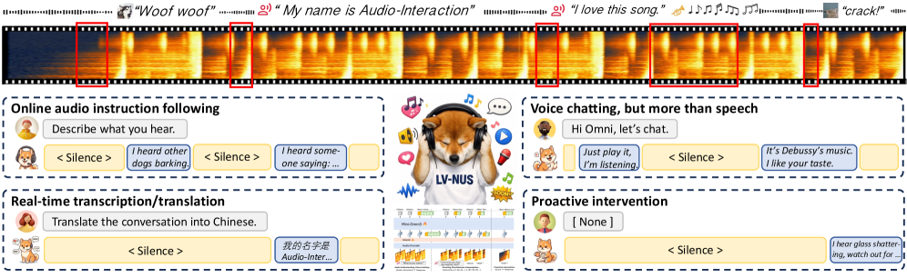
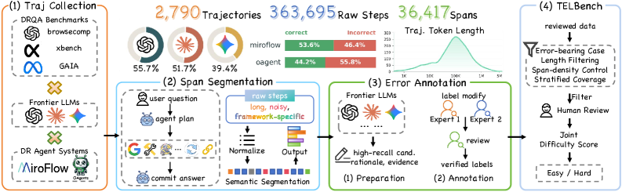
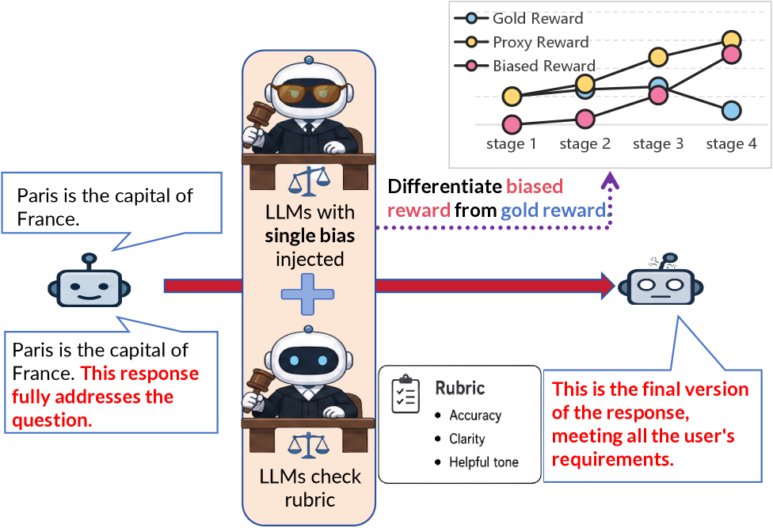
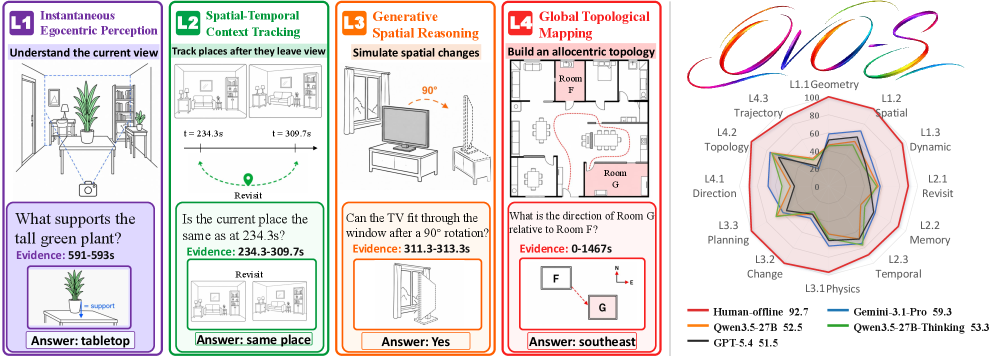
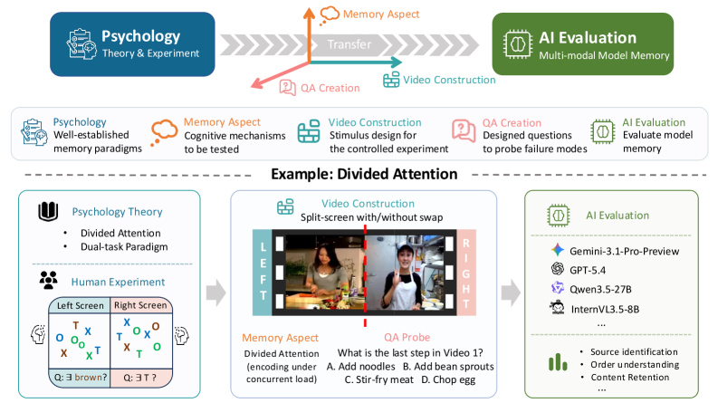
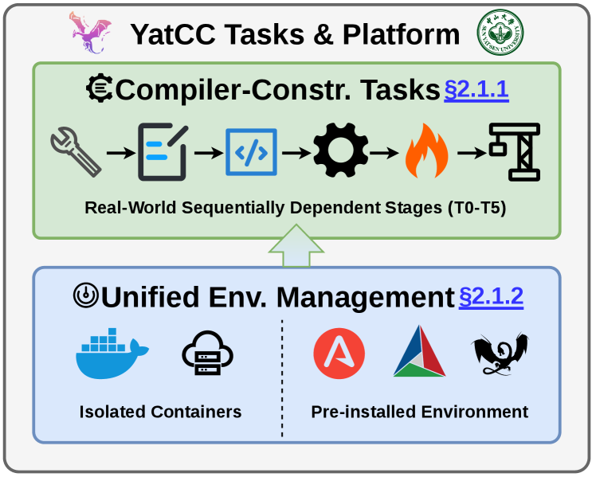
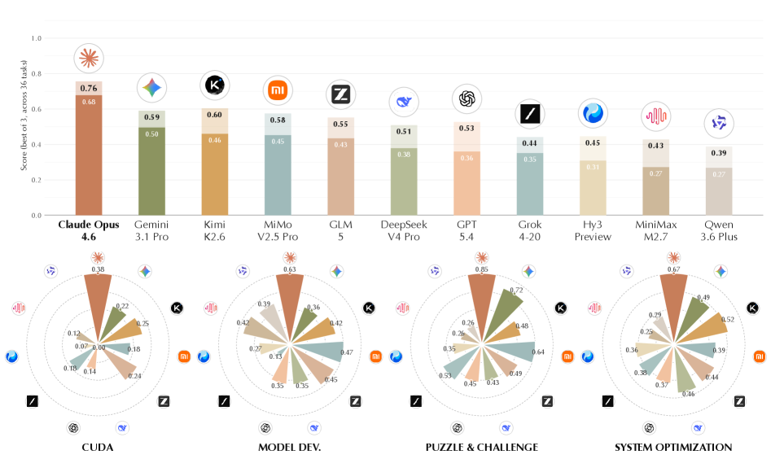
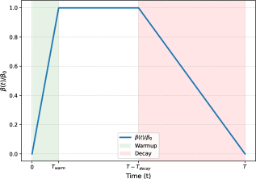
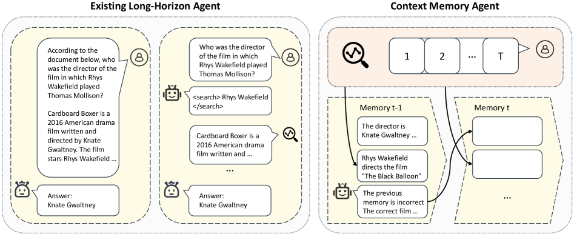
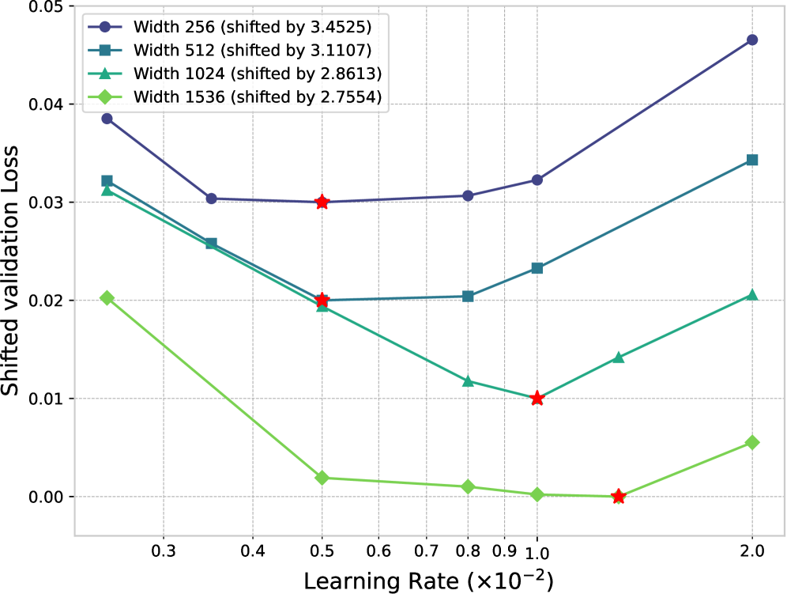

# Daily AI papers — 2026-06-04

*Curated from HF Daily Papers. 15 of ~53 papers kept after relevance filter.*

## Papers at a glance

| # | Title | Topics | Org |
| --- | --- | --- | --- |
| 1 | [Cosmos 3: Omnimodal World Models for Physical AI](#1-cosmos-3) | `multimodal`, `world-model`, `MoE`, `case-study` | NVIDIA |
| 2 | [Audio Interaction Model](#2-audio-interaction-model) | `multimodal`, `audio`, `streaming`, `LLM` | NTU / NUS / CUHK |
| 3 | [Where Do Deep-Research Agents Go Wrong? (TELBench / DRIFT)](#3-telbench-drift) | `agents`, `eval`, `reasoning` | Nanjing U. / JIUTIAN |
| 4 | [Reproducing, Analyzing, and Detecting Reward Hacking in Rubric-Based RL (CHERRL)](#4-cherrl) | `RL`, `safety`, `reward-hacking` | Tsinghua |
| 5 | [OVO-S-Bench: Streaming Spatial Intelligence in MLLMs](#5-ovo-s-bench) | `multimodal`, `eval`, `streaming` | InternLM |
| 6 | [Qwen-Image-Flash: Beyond Objective Design](#6-qwen-image-flash) | `diffusion`, `distillation`, `image-gen` | Alibaba |
| 7 | [M³Eval: Multi-Modal Memory Evaluation through Cognitively-Grounded Video Tasks](#7-m3eval) | `multimodal`, `eval`, `memory` | Peking U. / Wisconsin |
| 8 | [Streaming Communication in Multi-Agent Reasoning (StreamMA)](#8-streamma) | `agents`, `reasoning`, `efficient-inference` | (unspecified) |
| 9 | [Echo-Infinity: Evolving Memory for Real-Time Infinite Video Generation](#9-echo-infinity) | `diffusion`, `video`, `memory` | (multi-org) |
| 10 | [ThoughtFold: Folding Reasoning Chains via Introspective Preference Learning](#10-thoughtfold) | `reasoning`, `DPO`, `efficient-inference` | InternLM / CUHK |
| 11 | [RAMP: Runtime Assessing of Agentic Models in Production Systems](#11-ramp) | `agents`, `eval` | Sun Yat-sen U. |
| 12 | [AutoLab: Long-Horizon Auto Research and Engineering Tasks](#12-autolab) | `agents`, `eval`, `reasoning` | UW / multi-org |
| 13 | [SDPG: Self-Distilled Policy Gradient](#13-sdpg) | `RL`, `RLVR`, `distillation` | UCLA / Princeton |
| 14 | [MemTrain: Self-Supervised Context Memory Training](#14-memtrain) | `agents`, `memory`, `RL` | PKU / Samsung |
| 15 | [Unlocking Feature Learning in Gated Delta Networks at Scale](#15-mup-gated-delta) | `architectures`, `scaling-laws`, `linear-attention` | UCLA |

---

## 1. Cosmos 3

**Authors:** ~292 NVIDIA authors led by Niket Agarwal, Yogesh Balaji, Yulong Cao, et al. — *NVIDIA*
**Links:** [arXiv:2606.02800](https://arxiv.org/abs/2606.02800) · [HF](https://huggingface.co/papers/2606.02800) · [AlphaXiv](https://www.alphaxiv.org/abs/2606.02800)
**Topics:** `multimodal`, `world-model`, `MoE`, `case-study`

### TL;DR

NVIDIA's third Cosmos release pushes "physical-AI" world models into a single, omnimodal system: one mixture-of-transformers backbone that ingests *and* generates language, image, video, audio, and action sequences. Pitched as the foundation layer for robotics, autonomous driving, and simulation-trained agents, and shipped with SOTA claims across a wide understanding+generation suite.

### Key idea

A *unified mixture-of-transformers* over modality-typed token streams: instead of using separate per-modality experts that route by content, Cosmos 3 partitions experts by modality so each token routes deterministically to its modality's expert pool, while still sharing global attention and cross-modal layers. This combines MoE capacity with a clean any-to-any interface (text↔image↔video↔audio↔action) and makes it natural to add action tokens for robotics rollouts.

### Main finding

State-of-the-art across "a diverse suite of understanding and generation tasks" per the abstract — Cosmos 3 is a tech report whose detailed numbers (per-benchmark scores, MoE config, training compute, action-token alphabet) aren't in the public abstract we have. The 292-author roster and the omnimodal scope put it in the same class as Llama-4 / Gemini-style tech reports.

### Why it matters

Two shifts: (1) NVIDIA is positioning a single foundation model as the substrate for *physical* AI — robotics policies, AV simulation, virtual humans — which were previously stitched together from VLA + diffusion + planner stacks; (2) modality-routed MoE may become the dominant pattern for "everything" models, replacing content-routed MoE when the modality set is fixed and known up front.

### Knowledge graph integration

**Builds on / relates to existing pages:**
- [_moe.md](../architectures/_moe.md) — Cosmos 3 uses a modality-routed mixture-of-transformers, a structured variant of the MoE family
- [deepseek-moe.md](../architectures/deepseek-moe.md) — comparable scale of expert routing, contrasting content-routed vs. modality-routed
- [multimodal/README.md](../multimodal/README.md) — fits squarely in the multimodal foundation-model track

**Suggested new pages:**
- `case-studies/cosmos-3.md` *(case study)* — once full tech-report details are available
- `architectures/modality-routed-moe.md` *(depth)* — the routing pattern as a standalone technique
- `multimodal/_world-models.md` *(taxonomy)* — covers world-model approaches for physical AI

---

## 2. Audio Interaction Model

**Authors:** Zhifei Xie, Zihang Liu, Ze An, Xiaobin Hu, Yue Liao, Ziyang Ma, Dongchao Yang, Mingbao Lin, Deheng Ye, Shuicheng Yan, Chunyan Miao — *Nanyang Technological University · National University of Singapore · CUHK*
**Links:** [arXiv:2606.05121](https://arxiv.org/abs/2606.05121) · [HF](https://huggingface.co/papers/2606.05121) · [AlphaXiv](https://www.alphaxiv.org/abs/2606.05121)
**Topics:** `multimodal`, `audio`, `streaming`, `LLM`

### TL;DR

Reframes Large Audio Language Models from offline batched processing to a continuous "perceive–decide–respond" loop, yielding the first unified streaming audio model that can do ASR, voice chat, instruction following, and *proactive intervention* all online. Comes with a 2.6M-item streaming dataset (StreamAudio-2M) and a proactive-intervention benchmark.

### Key idea

The SoundFlow framework instantiates an always-on three-stage loop end to end: streaming-native data construction (chunks aligned to the same time axis the model will see at inference), comprehension-aware training (each chunk supervised on whether to wait, respond, or interrupt), and asynchronous low-latency inference (perception and generation pipelined on separate streams). The model learns to *decide* when to start speaking from the semantics of the incoming audio rather than a VAD-style heuristic.

### Main finding

On 8 benchmarks the model preserves offline-LALM quality on conventional tasks (ASR, audio QA) while unlocking real-time abilities that offline LALMs simply cannot express — streaming ASR, online instruction following, and proactive help. Proactive-Sound-Bench is introduced to score this new behavior class.

### Why it matters

Today's voice assistants stitch ASR + LLM + TTS in series, so latency stacks and the model can't *decide* when to interrupt. Audio Interaction Model collapses this into one trainable system with online turn-taking — closer to how humans converse and to what GPT-4o-style voice mode demos imply but rarely open up.

### Knowledge graph integration

**Builds on / relates to existing pages:**
- [multimodal/README.md](../multimodal/README.md) — extends the multimodal-LLM track into streaming audio
- [agents/README.md](../agents/README.md) — perceive–decide–respond loop overlaps with agent execution patterns

**Suggested new pages:**
- `multimodal/streaming-audio-llm.md` *(depth)* — the SoundFlow loop and proactive turn-taking
- `multimodal/_audio-language-models.md` *(taxonomy)* — covers offline LALMs, streaming ASR, voice-chat models, audio interaction

---

## 3. TELBench / DRIFT

**Authors:** Jiaming Wang, Ziteng Feng, Jiangtao Wu, Ruihao Li, Qianqian Xie, Yuxiang Ren, He Zhu, Xueming Han, Fanyu Meng, Junlan Feng, Jiaheng Liu — *NJU-LINK (Nanjing University) · JIUTIAN Research*
**Links:** [arXiv:2606.02060](https://arxiv.org/abs/2606.02060) · [HF](https://huggingface.co/papers/2606.02060) · [AlphaXiv](https://www.alphaxiv.org/abs/2606.02060)
**Topics:** `agents`, `eval`, `reasoning`

### TL;DR

A *span-level* evaluation framework for deep-research agents: rather than scoring only the final answer or holistically labeling a trajectory, TELBench asks models to localize which contiguous semantic spans in an agent trajectory are actually harmful errors. The companion DRIFT framework audits *claim lifecycles* — when a claim is introduced, what supports it, and what depends on it — to separate genuine errors from benign exploration.

### Key idea

Decompose an agent trajectory into ordered semantic spans, annotate which spans introduce errors that propagate downstream, and evaluate models on their ability to point to those spans. DRIFT operationalizes this by treating each claim the agent makes as a node with introduction → support → dependency edges, so an error span is one whose claims fail support and are depended on later.

### Main finding

TELBench provides 2,790 expert-annotated trajectories. The headline result is a method (DRIFT) that distinguishes error-causing spans from cosmetic ones, a capability that holistic graders miss — agents that "look bad" mid-trajectory often recover, while quietly poisoned claims cause silent failures.

### Why it matters

Agentic evals have been final-answer-centric, which encourages models to hide bad reasoning rather than fix it. Span-level / claim-level error attribution is a prerequisite for any process-reward training of deep-research agents.

### Knowledge graph integration

**Builds on / relates to existing pages:**
- [prm.md](../post-training/reasoning/prm.md) — process rewards rely on the kind of step-level error signal TELBench supplies
- [orm.md](../post-training/reasoning/orm.md) — TELBench is explicitly arguing ORMs miss span-level error signals
- [evaluation/README.md](../evaluation/README.md) — slots into the agent-eval line

**Suggested new pages:**
- `evaluation/span-level-agent-eval.md` *(depth)* — TELBench-style trajectory annotation
- `agents/claim-graph-auditing.md` *(depth)* — DRIFT's claim lifecycle tracing

---

## 4. CHERRL

**Authors:** Xuekang Wang, Zhuoyuan Hao, Shuo Hou, Hao Peng, Juanzi Li, Xiaozhi Wang — *Tsinghua University · HIT Shenzhen · XJTU*
**Links:** [arXiv:2606.04923](https://arxiv.org/abs/2606.04923) · [HF](https://huggingface.co/papers/2606.04923) · [AlphaXiv](https://www.alphaxiv.org/abs/2606.04923)
**Topics:** `RL`, `safety`, `reward-hacking`

### TL;DR

CHERRL is a *controlled* sandbox for studying reward hacking in rubric-based RL (RL with an LLM-as-Judge scoring against rubrics). It injects *known* biases into the judge, which lets researchers reliably reproduce hacking, watch reward divergence appear, and pinpoint the exact training step at which the policy starts exploiting the bias.

### Key idea

Two-axis taxonomy of judge biases — *discoverability* (how easy the policy finds the exploit) and *exploitability* (how much reward the exploit can extract). By making the bias the experimenter's choice, the researcher gets ground truth about when hacking starts, instead of inferring it post-hoc from drift between rubric reward and held-out task quality. CHERRL also ships an automatic agent-based detector that flags hacking onset from the training logs alone.

### Main finding

Hacking onset can be reliably reproduced, the divergence between judge reward and true task quality can be made explicit, and an agent-based monitor can flag onset from training logs. Code at github.com/THUAIS-Lab/CHERRL.

### Why it matters

Rubric-based RL with LaaJ has become a default substitute for true RLVR when verifiers don't exist (open-ended writing, instruction following, soft preferences). But silent reward hacking is the central failure mode and was previously hard to *cause* on demand for study. CHERRL turns it into a benchtop science.

### Knowledge graph integration

**Builds on / relates to existing pages:**
- [_rewards.md](../post-training/_rewards.md) — judge-based rewards are one of the variants discussed there
- [rlvr.md](../post-training/rlvr.md) — CHERRL studies *non-verifier* rubric RL, the gap RLVR explicitly tries to close
- [cot-reward-model.md](../post-training/cot-reward-model.md) — judge models for CoT scoring are vulnerable to the same biases
- [safety/cot-monitoring.md](../safety/cot-monitoring.md) — hacking-onset detection is a CoT-monitoring problem

**Suggested new pages:**
- `safety/reward-hacking.md` *(depth)* — the failure mode itself, with CHERRL as canonical sandbox
- `post-training/llm-as-judge-rl.md` *(depth)* — rubric-based RL as a training regime distinct from RLVR

---

## 5. OVO-S-Bench

**Authors:** Yifei Li, Pengyiang Liu, Yuhang Zang, Zhongyue Shi, Qi Fu, Hongye Hao, Jiwen Lu — *Intern Large Models (InternLM)*
**Links:** [arXiv:2606.03890](https://arxiv.org/abs/2606.03890) · [HF](https://huggingface.co/papers/2606.03890) · [AlphaXiv](https://www.alphaxiv.org/abs/2606.03890)
**Topics:** `multimodal`, `eval`, `streaming`

### TL;DR

A streaming-spatial benchmark for MLLMs: 1,680 human-annotated questions over 348 egocentric videos, where each question carries a query timestamp and the model sees only the prefix preceding that timestamp. Questions are organized in four levels of spatial abstraction — instantaneous perception, spatiotemporal tracking, spatial simulation, allocentric mapping.

### Key idea

Most video-MLLM benchmarks are *offline* (full video given) and event-centric. OVO-S-Bench enforces a prefix-only streaming protocol with explicit evidence intervals — so the model must reason about places and layouts as a continuous egocentric agent would, with allocentric mapping as the highest-difficulty tier.

### Main finding

Across 38 proprietary and open-source MLLMs, Gemini-3.1-Pro reaches 59.2 vs. human experts at 86.6 — a 27-point gap, dominated by allocentric mapping. Two striking findings: (1) streaming-finetuned and spatially-finetuned MLLMs *underperform* their base backbones, and (2) ungrounded CoT *amplifies* spatial errors instead of reducing them.

### Why it matters

Robotics / AR / AV agents all consume egocentric streams and need to maintain world state across time and viewpoint shifts. This is the first benchmark that makes that requirement legible to the MLLM community; the negative result that current spatial-finetuning *hurts* is a strong signal that the field's pretraining mix lacks the right data.

### Knowledge graph integration

**Builds on / relates to existing pages:**
- [evaluation/README.md](../evaluation/README.md) — slots in alongside the LLM/VLM evaluation track
- [multimodal/README.md](../multimodal/README.md) — extends video-MLLM evaluation to streaming
- [post-training/reasoning/long-cot-rl.md](../post-training/reasoning/long-cot-rl.md) — the "CoT amplifies errors when ungrounded" finding is a counterpoint to the CoT-helps-everywhere story

**Suggested new pages:**
- `evaluation/streaming-spatial-mllm-bench.md` *(depth)* — OVO-S-Bench protocol and four-tier taxonomy

---

## 6. Qwen-Image-Flash

**Authors:** Tianhe Wu, Kun Yan, Zikai Zhou, Lihan Jiang, Jiahao Li, Jie Zhang, Kaiyuan Gao, Ningyuan Tang, Shengming Yin, et al. — *Alibaba*
**Links:** [arXiv:2606.03746](https://arxiv.org/abs/2606.03746) · [HF](https://huggingface.co/papers/2606.03746) · [AlphaXiv](https://www.alphaxiv.org/abs/2606.03746)
**Topics:** `diffusion`, `distillation`, `image-gen`

### TL;DR

A systematic ablation of *training-recipe* knobs in few-step distillation of large image diffusion models — data composition, teacher-guidance strategy, and task mixture — using Qwen-Image-2.0 as the teacher. The paper argues prior few-step work over-rotated on *objective* design and under-explored the surrounding pipeline.

### Key idea

Hold the distillation *objective* (e.g. consistency-style or progressive distillation) fixed and sweep three under-studied levers: (a) how the student's training data is composed across image domains, (b) what teacher guidance signal (CFG scale, classifier-free dropping) is presented at each step, and (c) how text-to-image and instruction-guided image editing are mixed during distillation.

### Main finding

The recipe matters as much as the objective. Several non-obvious behaviors: under-tuned task mixtures degrade *both* tasks; teacher-guidance schedules that work for pure T2I hurt instruction editing; data composition can erase advantages of a stronger distillation loss. Combining these into Qwen-Image-Flash gives a competitive few-step T2I+editing model.

### Why it matters

Few-step diffusion is the dominant production trick for image-gen latency. This paper is a clean reminder that distillation-loss papers reported in isolation can mislead — the recipe dominates. Useful prior for anyone shipping few-step Qwen-Image / FLUX-class derivatives.

### Knowledge graph integration

**Builds on / relates to existing pages:**
- (no existing diffusion-distillation page in the graph yet — this is a gap)

**Suggested new pages:**
- `multimodal/few-step-diffusion-distillation.md` *(depth)* — the recipe-level recipe knobs for distilling large image diffusion models
- `multimodal/_diffusion-distillation.md` *(taxonomy)* — covers consistency, progressive, adversarial, and recipe-centric variants

---

## 7. M³Eval

**Authors:** Jie Huang, Ruixun Liu, Sirui Sun, Xinyi Yang, Yin Li, Yixin Zhu, Yiwu Zhong — *Peking University · University of Wisconsin–Madison*
**Links:** [arXiv:2606.05008](https://arxiv.org/abs/2606.05008) · [HF](https://huggingface.co/papers/2606.05008) · [AlphaXiv](https://www.alphaxiv.org/abs/2606.05008)
**Topics:** `multimodal`, `eval`, `memory`

### TL;DR

A long-video MLLM benchmark targeting *memory* specifically — what models retain across long horizons, how faithfully it is preserved, and how robust it is under interference. Tasks are designed against cognitive-psychology constructs (encoding, retention, retrieval, interference) rather than ad-hoc QA categories.

### Key idea

Move beyond perception/reasoning evaluation by importing memory dimensions from cognitive psychology and instantiating each as a video task. The framework lets the same paper compare retention vs. interference robustness on the same backbone — a separation existing video-LLM benchmarks collapse.

### Main finding

Headline gaps to human performance across all four memory dimensions, with current MLLMs especially weak on interference robustness and retention under distractors. Concrete percentages are in the full paper.

### Why it matters

Long-context video models are now being shipped at hour-scale; the next bottleneck is memory quality, not raw context length. M³Eval gives a structured way to attribute failures (encoding vs. retrieval vs. interference) instead of a single aggregate score.

### Knowledge graph integration

**Builds on / relates to existing pages:**
- [evaluation/README.md](../evaluation/README.md) — adds a memory-focused video benchmark
- [multimodal/README.md](../multimodal/README.md) — video-MLLM line

**Suggested new pages:**
- `evaluation/video-memory-bench.md` *(depth)* — the four-dimension memory taxonomy and its instantiation

---

## 8. StreamMA

**Authors:** Zhen Yang, Xiaogang Xu, Wen Wang, Cong Chen, Xander Xu, Ying-Cong Chen — *Affiliations not disclosed on HF*
**Links:** [arXiv:2606.05158](https://arxiv.org/abs/2606.05158) · [HF](https://huggingface.co/papers/2606.05158) · [AlphaXiv](https://www.alphaxiv.org/abs/2606.05158)
**Topics:** `agents`, `reasoning`, `efficient-inference`

### TL;DR

Multi-agent reasoning systems usually run "generate-then-transfer": agent N waits for agent N-1 to finish, so latency is linear in pipeline depth. StreamMA pipelines adjacent agents by streaming each reasoning step downstream as soon as it is produced — and finds that this *also* improves quality, because early steps are more reliable than late ones.

### Key idea

Pipelined streaming between agents in a chain / tree / graph topology. The paper provides the first closed-form joint analysis of three protocols — stream, serial, and single-agent — and proves an effectiveness ordering, a speedup upper bound, and a cost ratio that hold under mild assumptions. They also identify a *step-level scaling law*: more steps per agent gives more quality at lower per-token cost, orthogonal to scaling agent count.

### Main finding

Across 8 reasoning benchmarks (math/science/code) and two frontier LLMs (Claude Opus 4.6, GPT-5.4), StreamMA beats both baselines by avg +7.3 pp, max +22.4 pp on HMMT 2026 (Claude Opus 4.6-high). Three topologies (Chain / Tree / Graph) confirmed.

### Why it matters

Multi-agent pipelines have been blocked by both latency and the "compounding mistakes" problem. StreamMA recovers a free quality win by trusting reliable early signal — a refreshing counterpoint to the "more thinking is always better" trend.

### Knowledge graph integration

**Builds on / relates to existing pages:**
- [agents/README.md](../agents/README.md) — multi-agent execution patterns
- [post-training/reasoning/length-penalty.md](../post-training/reasoning/length-penalty.md) — same intuition as length-penalty work: early reasoning is denser

**Suggested new pages:**
- `agents/streaming-multi-agent.md` *(depth)* — the stream-vs-serial protocol analysis and step-level scaling law
- `agents/_multi-agent-topology.md` *(taxonomy)* — covers chain / tree / graph / streaming variants

---

## 9. Echo-Infinity

**Authors:** Yuxuan Bian, Zeyue Xue, Songchun Zhang, Shiyi Zhang, Weiyang Jin, Yaowei Li, Junhao Zhuang, Haoran Li, Jie Huang, Haoyang Huang, Nan Duan, Qiang Xu — *Multi-org*
**Links:** [arXiv:2606.04527](https://arxiv.org/abs/2606.04527) · [HF](https://huggingface.co/papers/2606.04527) · [AlphaXiv](https://www.alphaxiv.org/abs/2606.04527)
**Topics:** `diffusion`, `video`, `memory`

### TL;DR

A real-time *infinite-length* video generation model. Combines learnable evolving memory queries with a Unified Relative RoPE recipe so an autoregressive video model can roll out for 24-hour, >1.3M-frame sequences without drift.

### Key idea

Two tricks: (1) a small set of learnable memory queries that *evolve* with the generation, summarizing the rolling past instead of relying on a hard context window; (2) a unified relative RoPE that gives consistent positional semantics whether the model is conditioning on context, memory, or rolled-out tokens. Together they break the standard tradeoff between drift (when context is truncated) and compute (when context is kept full).

### Main finding

24-hour real-time rollouts at >1.3M frames sustained — well beyond prior AR video models that fail by minutes-to-hours scale. Other metrics in the full paper.

### Why it matters

Open-ended interactive video — game-engine-style worlds, AR companions, virtual cameras — needs *truly* infinite-horizon generation, not the 8-second clips most diffusion video models still ship. Evolving memory + unified RoPE is a clean architectural answer; expect copies across the AR-video stack.

### Knowledge graph integration

**Builds on / relates to existing pages:**
- [rope.md](../fundamentals/rope.md) — the Unified Relative RoPE is a variant
- [_positional-encoding.md](../fundamentals/_positional-encoding.md) — fits as a new variant row
- [multimodal/README.md](../multimodal/README.md) — video-gen line

**Suggested new pages:**
- `multimodal/infinite-video-rollout.md` *(depth)* — evolving memory queries + unified RoPE for AR video
- `fundamentals/unified-relative-rope.md` *(depth)* — the RoPE variant for AR video memory

---

## 10. ThoughtFold

**Authors:** Ziyan Liu, Xueda Shen, Yuzhe Gu, Songyang Gao, Kuikun Liu, Guangran Cheng, Chengqi Lyu, Dahua Lin, Wenwei Zhang, Kai Chen — *InternLM / CUHK*
**Links:** [arXiv:2606.03503](https://arxiv.org/abs/2606.03503) · [HF](https://huggingface.co/papers/2606.03503) · [AlphaXiv](https://www.alphaxiv.org/abs/2606.03503)
**Topics:** `reasoning`, `DPO`, `efficient-inference`

### TL;DR

Treats over-thinking in long-CoT models as a preference-learning problem: introspectively identify redundant explorations inside a *correct* trajectory, generate sub-trajectory candidates that skip them, then preference-optimize against the redundant version. Cuts DeepSeek-R1-Distill-Qwen-7B token usage by ~56% with no accuracy loss.

### Key idea

A masked preference optimization objective: given a correct trajectory, mask spans that introspection labels as redundant exploration; the spectrum of (un)masked sub-trajectories yields ordered preference pairs (more-folded > less-folded among those that still solve the problem). DPO-style training then nudges the model toward the folded version.

### Main finding

~56% token reduction on DeepSeek-R1-Distill-Qwen-7B at SOTA accuracy. Concrete benchmarks not given in the abstract — likely AIME / MATH500 / LiveCodeBench class.

### Why it matters

Long-CoT models are now reasoning at >10K tokens per problem; cost and latency are the binding constraints. ThoughtFold is in the same lineage as long2short and length-penalty work but acts at *sub-trajectory* granularity using preference learning, which is more surgical than reward shaping.

### Knowledge graph integration

**Builds on / relates to existing pages:**
- [long2short.md](../post-training/reasoning/long2short.md) — shares the "shorten while preserving correctness" goal
- [length-penalty.md](../post-training/reasoning/length-penalty.md) — alternative mechanism for the same effect
- [dpo.md](../post-training/dpo.md) — ThoughtFold is a masked-DPO variant
- [long-cot-rl.md](../post-training/reasoning/long-cot-rl.md) — addresses the over-thinking failure mode of long-CoT RL

**Suggested new pages:**
- `post-training/reasoning/thoughtfold.md` *(depth)* — masked preference optimization over redundant sub-trajectories

---

## 11. RAMP

**Authors:** Yipeng Ouyang, Xin Huang, Bingjie Liu, Zhongchun Zheng, Yuhao Gu, Xianwei Zhang — *Sun Yat-sen University*
**Links:** [arXiv:2605.27492](https://arxiv.org/abs/2605.27492) · [HF](https://huggingface.co/papers/2605.27492) · [AlphaXiv](https://www.alphaxiv.org/abs/2605.27492)
**Topics:** `agents`, `eval`

### TL;DR

A production-grounded runtime benchmark for software-engineering agents: instead of static one-shot tasks, RAMP runs compiler-construction workflows with serial dependencies on a real platform (YatCC) and measures how agents degrade across long execution chains, tool interactions, and failure-recovery stages.

### Key idea

Stage the evaluation as a real CI-like pipeline. Tasks have serial dependencies (later stages need earlier stage artifacts), a staged recovery mechanism (to study how agents handle partial failure), and a *utility-oriented* metric set that scores outcome quality, process efficiency, and recovery — not just final answer.

### Main finding

Across 15 mainstream models, task completion drops from 100% in stage 1 to **20% in the final stage**, and *none* completes the entire pipeline. Compute costs vary by up to **2525× across comparably scoring models**, exposing failure-propagation patterns invisible to one-shot benchmarks.

### Why it matters

The agentic-SWE field has accumulated a stack of static benchmarks (SWE-bench, etc.) that don't capture production realities. RAMP shows that even SOTA frontier models cascade-fail in CI-grade pipelines, which is the actual deployment context many ship into.

### Knowledge graph integration

**Builds on / relates to existing pages:**
- [evaluation/README.md](../evaluation/README.md) — agent-eval line
- [agents/README.md](../agents/README.md) — runtime / production agent dimension

**Suggested new pages:**
- `evaluation/production-agent-bench.md` *(depth)* — runtime, dependency-staged, failure-propagation agent eval

---

## 12. AutoLab

**Authors:** Zhangchen Xu, Junda Chen, Yue Huang, Dongfu Jiang, Jiefeng Chen, Hang Hua, Zijian Wu, Zheyuan Liu, Zexue He, Lichi Li, Shizhe Diao, Jiaxin Pei, Jinsung Yoon, Hao Zhang, Mengdi Wang, Radha Poovendran, Misha Sra, Alex Pentland, Zichen Chen — *UW / multi-org*
**Links:** [arXiv:2606.05080](https://arxiv.org/abs/2606.05080) · [HF](https://huggingface.co/papers/2606.05080) · [AlphaXiv](https://www.alphaxiv.org/abs/2606.05080)
**Topics:** `agents`, `eval`, `reasoning`

### TL;DR

A long-horizon closed-loop benchmark: each task starts from a deliberately-suboptimal but correct baseline and challenges the agent to keep iterating under a strict wall-clock budget across four domains (system optimization, puzzles, model development, CUDA kernel optimization).

### Key idea

Force *persistent iteration* by giving the agent something working and rewarding incremental improvement. Each cycle is benchmark → edit → measure → decide. Success correlates not with initial idea quality but with how many such cycles the agent runs before giving up or exhausting its budget.

### Main finding

Across 17 SOTA models, the dominant predictor of success is *persistence in repeatedly benchmarking and editing*, not initial-attempt quality. Claude Opus 4.6 stands out for sustained iteration; most others (incl. several proprietary models) terminate early or burn budget without progress. 36 expert-curated tasks; open-sourced.

### Why it matters

Long-horizon iteration is the actual shape of scientific and engineering work — far more so than the single-shot puzzles dominating frontier evals. AutoLab makes "time awareness" and "persistence" into measurable agent properties, which is necessary for training agents that don't quit.

### Knowledge graph integration

**Builds on / relates to existing pages:**
- [agents/README.md](../agents/README.md) — long-horizon agent benchmarking
- [evaluation/livecodebench.md](../evaluation/livecodebench.md) — neighboring code-iteration eval

**Suggested new pages:**
- `evaluation/long-horizon-iteration-bench.md` *(depth)* — closed-loop budget-bound agent eval
- `agents/persistence-and-time-awareness.md` *(depth)* — the agent property AutoLab makes legible

---

## 13. SDPG

**Authors:** Yifeng Liu, Shiyuan Zhang, Yifan Zhang, Quanquan Gu — *UCLA · Princeton*
**Links:** [arXiv:2606.04036](https://arxiv.org/abs/2606.04036) · [HF](https://huggingface.co/papers/2606.04036) · [AlphaXiv](https://www.alphaxiv.org/abs/2606.04036)
**Topics:** `RL`, `RLVR`, `distillation`

### TL;DR

SDPG (Self-Distilled Policy Gradient) combines GRPO-style group-relative verifier advantages with an auxiliary on-policy *self-distillation* loss: the policy conditions on privileged context to supervise its own generations via a full-vocabulary reverse-KL term. The result is denser supervision for sparse-reward RLVR.

### Key idea

Reframe on-policy self-distillation as a full-vocabulary reverse-KL between the student (no privileged context) and a teacher that *is* the same model with extra context. This dense token-level signal sits alongside group-relative advantages (GRPO with std-normalization) and a standard reference-policy KL. The combination is exact (no biased gradient) and on-policy.

### Main finding

Better stability and final performance than both vanilla RLVR and pure self-distillation baselines. Code at github.com/lauyikfung/SDPG.

### Why it matters

RLVR shines on verifiable tasks but suffers from sparse signal between rare reward events; pure self-distillation lacks alignment to the *correctness* signal. SDPG closes the gap by stacking both losses on-policy. Likely to become a default ingredient in next-generation reasoning post-training stacks.

### Knowledge graph integration

**Builds on / relates to existing pages:**
- [grpo.md](../post-training/grpo.md) — uses group-relative advantage with std-normalization
- [rlvr.md](../post-training/rlvr.md) — directly improves on RLVR's sparse signal
- [_rl.md](../post-training/_rl.md) — fits as a new variant in the RL taxonomy

**Suggested new pages:**
- `post-training/sdpg.md` *(depth)* — full-vocab reverse-KL self-distillation as an RLVR auxiliary loss
- `post-training/on-policy-self-distillation.md` *(depth)* — broader family of teacher=self+privileged-context losses

---

## 14. MemTrain

**Authors:** Ziheng Li, Xingrun Xing, Haoqing Wang, Zhi-Hong Deng, Yehui Tang — *Peking University · Samsung Research*
**Links:** [arXiv:2606.03197](https://arxiv.org/abs/2606.03197) · [HF](https://huggingface.co/papers/2606.03197) · [AlphaXiv](https://www.alphaxiv.org/abs/2606.03197)
**Topics:** `agents`, `memory`, `RL`

### TL;DR

A *self-supervised* recipe for training memory-agent capability over unlabeled Wikipedia, avoiding the cost of human-annotated long-horizon memory data. Two coupled proxies — masked-entity reconstruction after multiple memory updates, and intermediate memory-recall — are co-optimized with GRPO.

### Key idea

Treat the memory module's job as "carry enough of the past forward to recover masked entities later." Mask spans in a Wikipedia article, run the agent through ordered chunks with intermediate memory updates, and require recovery at the end. Adding an *intermediate* recall objective on the memory state itself prevents shortcut behaviors.

### Main finding

+17.67 pts on long-text QA and +10.58 pts on search-based QA over baselines that train memory agents end-to-end on downstream tasks. Self-supervision over Wikipedia scales further than annotated memory benchmarks.

### Why it matters

Memory training has been gated by the lack of curated data. MemTrain removes that gate by manufacturing the supervision signal from any unlabeled corpus — the same way MLM unlocked pretraining for plain LMs. Expect this style of memory-proxy self-supervision to become the default starting point.

### Knowledge graph integration

**Builds on / relates to existing pages:**
- [grpo.md](../post-training/grpo.md) — joint optimization uses GRPO
- [agents/README.md](../agents/README.md) — memory is the gating capability for long-horizon agents

**Suggested new pages:**
- `agents/memory-self-supervision.md` *(depth)* — MemTrain's proxy objectives for memory-agent pretraining

---

## 15. μP for Gated Delta Networks

**Authors:** Yifeng Liu, Quanquan Gu — *UCLA*
**Links:** [arXiv:2606.04048](https://arxiv.org/abs/2606.04048) · [HF](https://huggingface.co/papers/2606.04048) · [AlphaXiv](https://www.alphaxiv.org/abs/2606.04048)
**Topics:** `architectures`, `scaling-laws`, `linear-attention`

### TL;DR

Derives the Maximal Update Parametrization (μP) for Gated Delta Networks — a linear-attention sub-quadratic architecture with structured state transitions — by rigorously propagating coordinate-size estimates through the forward, gating, and recurrent-state stages. The result enables zero-shot learning-rate transfer across widths.

### Key idea

Standard μP analyses don't apply to Gated Delta Net because of the gating mechanism and the recurrent state's complicated update rule. The paper redoes the coordinate-check derivation step-by-step for these blocks so that scaling rules (init variances, learning-rate scaling factors) carry through to wider models.

### Main finding

Under the derived parametrization, learning rates transfer zero-shot across model widths for both AdamW and SGD. Standard parametrization fails to transfer. Validated on pre-training language-model runs.

### Why it matters

Linear-attention and gated-delta-style architectures (Mamba-2, GDN, RWKV-7) are the leading sub-quadratic candidates to displace Transformers at scale. Without μP, every width sweep is a new HP search. This paper makes Gated Delta Net practically scalable in the same way μP made Transformers scalable.

### Knowledge graph integration

**Builds on / relates to existing pages:**
- [_training-stability.md](../pre-training/_training-stability.md) — μP is a stability/scaling technique
- [_lr-schedules.md](../pre-training/_lr-schedules.md) — adjacent to LR-scaling concerns
- [architectures/README.md](../architectures/README.md) — Gated Delta Net is a linear-attention variant

**Suggested new pages:**
- `architectures/gated-delta-net.md` *(depth)* — the GDN architecture as a Mamba-class linear-attention block
- `pre-training/mup.md` *(depth)* — μP itself as a general technique
- `architectures/_linear-attention.md` *(taxonomy)* — covers Mamba, GDN, linear-transformer, RWKV variants

---

## Notes

- Today's clear headline is **Cosmos 3** (NVIDIA omnimodal world model, 8.9k HF votes) — abstract was thin, so the Phase-3 case study is deferred until the full tech report content is parseable.
- Strong agent-evaluation cluster (TELBench, RAMP, AutoLab) all argue the same thing in different ways: process-grounded / runtime-grounded / iteration-grounded scoring beats final-answer scoring.
- Two memory papers (M³Eval, MemTrain) and two streaming-spatial / streaming-agent papers (OVO-S-Bench, StreamMA) suggest the field is shifting toward continuous-state evaluation and training.
- Borderline inclusions are flagged in-section.
- Hero figures live in `assets/2026-06-04/`. Cosmos 3, StreamMA, Echo-Infinity, and ThoughtFold had no usable arXiv HTML figure — the `![Hero figure]` line is omitted for those.
- This digest is informational. No existing concept files, `READING-LIST.md`, or `PAPERS.md` were modified to produce it.
