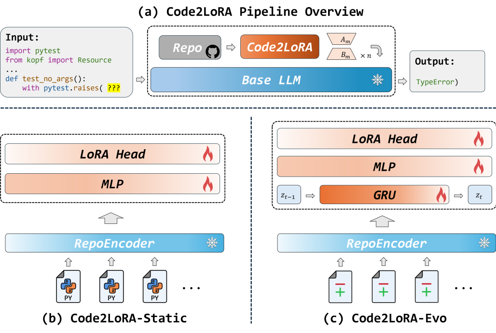
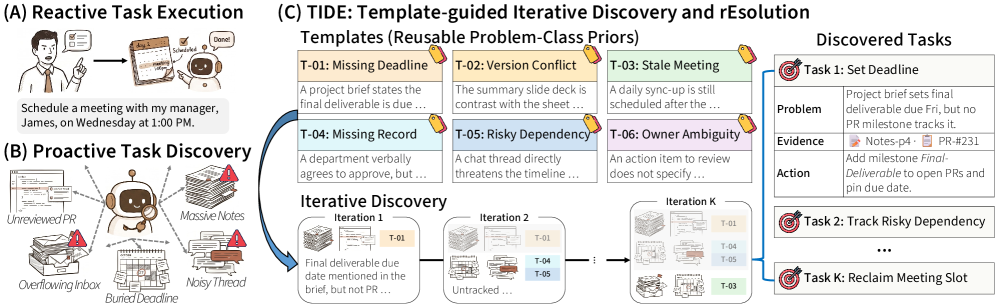
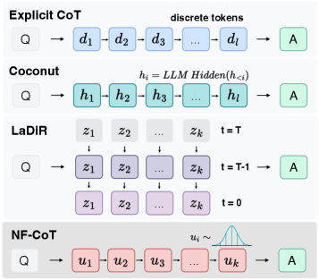
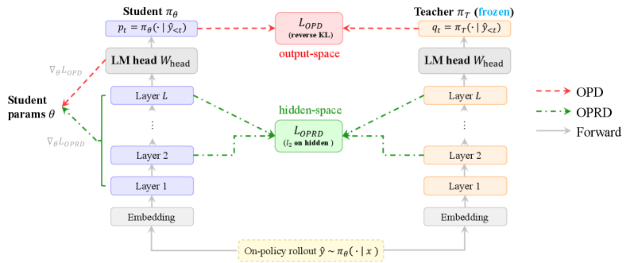

# Daily AI papers — 2026-06-06

*Curated from HF Daily Papers. 15 of ~48 papers kept after relevance filter.*

## Papers at a glance

| # | Title | Topics | Org |
| --- | --- | --- | --- |
| 1 | [Code2LoRA: Hypernetwork-Generated Adapters for Code Language Models under Software Evolution](#1-code2lora) | `LLM`, `fine-tuning`, `code` | Waterloo |
| 2 | [ArcANE: Do Role-Playing Language Agents Stay in Character at the Right Time?](#2-arcane) | `agents`, `eval`, `safety` | SNU |
| 3 | [TIDE: Proactive Multi-Problem Discovery via Template-Guided Iteration](#3-tide) | `agents`, `LLM` | KAIST |
| 4 | [AdaPlanBench: Evaluating Adaptive Planning in LLM Agents](#4-adaplanbench) | `agents`, `eval` | UIUC |
| 5 | [VideoKR: Towards Knowledge- and Reasoning-Intensive Video Understanding](#5-videokr) | `multimodal`, `eval`, `reasoning` | — |
| 6 | [Reinforcement Learning Elicits Contextual Learning of Unseen Language Translation](#6-rl-contextual-translation) | `RL`, `LLM` | UZH |
| 7 | [LoomVideo: Unifying Multimodal Inputs into Video Generation and Editing](#7-loomvideo) | `diffusion`, `multimodal`, `video` | PKU/MSALab |
| 8 | [Rethinking Continual Experience Internalization for Self-Evolving LLM Agents](#8-experience-internalization) | `agents`, `fine-tuning` | RUC/Meituan |
| 9 | [Complexity-Balanced Diffusion Splitting](#9-cbs) | `diffusion`, `efficient-inference` | — |
| 10 | [DataCOPE: Unsupervised Skill Discovery for Agentic Data Analysis](#10-datacope) | `agents`, `eval` | Zhejiang U./NUS |
| 11 | [LLMs Can Leak Training Data But Do They Want To? (PropMe)](#11-propme) | `safety`, `eval` | SDU |
| 12 | [NF-CoT: Latent Reasoning with Normalizing Flows](#12-nf-cot) | `reasoning`, `LLM` | UPenn/UCSD/Meta |
| 13 | [OPRD: On-Policy Representation Distillation](#13-oprd) | `RL`, `efficient-inference` | Zhejiang U. |
| 14 | [Combinatorial Synthesis: Scaling Code RLVR via Atomic Decomposition and Recombination](#14-adr) | `RL`, `code`, `data` | CAS |
| 15 | [The Shape of Addition: Geometric Structures of Arithmetic in LLMs](#15-shape-of-addition) | `interp` | RL-MIND |

---

## 1. Code2LoRA: Hypernetwork-Generated Adapters for Code Language Models under Software Evolution {#1-code2lora}

**Authors:** Liliana Hotsko, Yinxi Li, Yuntian Deng, Pengyu Nie — *University of Waterloo*
**Links:** [arXiv:2606.06492](https://arxiv.org/abs/2606.06492) · [HF](https://huggingface.co/papers/2606.06492) · [AlphaXiv](https://www.alphaxiv.org/abs/2606.06492)
**Topics:** `LLM`, `fine-tuning`, `code`

### TL;DR

A hypernetwork reads a code repository and emits LoRA adapter weights tailored to that repo, so a code-LLM gets repo-specific knowledge without stuffing files into the prompt. Two variants: a static one for stable repos and an "Evo" variant with a GRU that keeps the adapter current as the repo evolves commit-by-commit.

### Key idea

Replace context injection with parameter generation. A hypernetwork conditioned on the repo summary produces LoRA `A`/`B` matrices for the base coder; for evolving repos, a GRU rolls the adapter forward when new commits land, so the adapter is amortised over the history rather than retrained from scratch.

### Main finding

On RepoPeftBench (604 Python repos), Code2LoRA-Static hits 63.8% cross-repo exact match on static tasks; Code2LoRA-Evo hits 60.3% on evolving codebases, beating context-injection baselines with no inference-time token overhead.

### Why it matters

LoRA adapters have mostly been treated as artefacts trained per task. Treating them as the *output* of a learned function over context lets you skip retraining when the context drifts — a clean answer for long-lived, fast-moving codebases where retrieval and giant context windows both buckle.

### Knowledge graph integration

**Builds on / relates to existing pages:**
- [post-training/fine-tuning/README.md](../post-training/fine-tuning/README.md) — LoRA-flavoured PEFT direction; this is a hypernetwork variant.
- [evaluation/livecodebench.md](../evaluation/livecodebench.md) — relevant family of code benchmarks for context.

**Suggested new pages:**
- `post-training/fine-tuning/hypernetwork-lora.md` *(depth)* — covers hypernetwork-generated LoRA adapters (Code2LoRA).
- `post-training/fine-tuning/_peft.md` *(taxonomy)* — taxonomy of PEFT methods; the graph currently has no LoRA-family coverage.

---

## 2. ArcANE: Do Role-Playing Language Agents Stay in Character at the Right Time? {#2-arcane}

**Authors:** Woojung Song, Nalim Kim, Sangjun Song, Chaewon Heo, Jongwon Lim, Yohan Jo — *Seoul National University*
**Links:** [arXiv:2606.05553](https://arxiv.org/abs/2606.05553) · [HF](https://huggingface.co/papers/2606.05553) · [AlphaXiv](https://www.alphaxiv.org/abs/2606.05553)
**Topics:** `agents`, `eval`, `safety`

### TL;DR

A benchmark for role-playing LLM agents that asks not whether they recite facts about a character but whether they reflect the character's *psychological trajectory* across a story arc. Test scenarios are placed at specific points in the narrative — including beyond the book — and the model must answer as the character would *at that point*.

### Key idea

Decompose 17 novels into psychological phases per character (80 characters total), and evaluate models with arc-conditioned probes. Compare context strategies: full text, summary, none, vs. an explicit "character arc" representation that captures development.

### Main finding

Arc-conditioned conditioning beats every other context strategy across all tested model sizes — current role-play LLMs handle facts about characters far better than their *evolution*.

### Why it matters

Role-play is the underbelly of safety (it doubles as a jailbreak vector) and of agent personas. Saying "Sherlock Holmes never knew about X" requires modelling time inside the fiction, which most current evals don't measure.

### Knowledge graph integration

**Builds on / relates to existing pages:**
- [safety/roleplay-jailbreak.md](../safety/roleplay-jailbreak.md) — role-play is the dual-use surface; this measures legitimate role-play capability.
- [evaluation/README.md](../evaluation/README.md) — benchmark family.

**Suggested new pages:**
- `evaluation/arcane.md` *(depth)* — covers the arc-conditioned role-play benchmark.

---

## 3. TIDE: Proactive Multi-Problem Discovery via Template-Guided Iteration {#3-tide}

**Authors:** Soyeong Jeong, Jinheon Baek, Minki Kang, Sung Ju Hwang — *KAIST*
**Links:** [arXiv:2606.04743](https://arxiv.org/abs/2606.04743) · [HF](https://huggingface.co/papers/2606.04743) · [AlphaXiv](https://www.alphaxiv.org/abs/2606.04743)
**Topics:** `agents`, `LLM`

### TL;DR

When an LLM agent reads a workspace or a repo, it usually answers the one question you asked, missing the other problems lurking nearby. TIDE turns the agent into a *proactive* finder: iteratively surface a handful of candidate problems per round, condition on what's already been found, and anchor each guess in a "thought template" distilled from past cases.

### Key idea

Two coupled mechanisms — iterative discovery (batch-of-candidates → next batch is conditioned on prior batch, so coverage grows) and thought templates (reusable schemas saying which signals matter for a recognised problem class). The pair beats single-shot prompting and parallel multi-agent baselines.

### Main finding

On personal-workspace and software-repo settings with four backbones, TIDE substantially improves task coverage, identification, and resolution over both single-shot and parallel multi-agent baselines.

### Why it matters

Most agent benchmarks measure one-question execution. Proactive multi-problem surfacing is the version users actually want — and the closer cousin of code-review and audit agents.

### Knowledge graph integration

**Builds on / relates to existing pages:**
- [agents/README.md](../agents/README.md) — agent design family; complements tool-calling work.

**Suggested new pages:**
- `agents/proactive-discovery.md` *(depth)* — covers iterative discovery with thought templates (TIDE).

---

## 4. AdaPlanBench: Evaluating Adaptive Planning in Large Language Model Agents under World and User Constraints {#4-adaplanbench}

**Authors:** Jiayu Liu, Cheng Qian, Zhenhailong Wang, Bingxuan Li, Jiateng Liu, Heng Wang, Jeonghwan Kim, Yumeng Wang, Xiusi Chen, Yi R. Fung, Heng Ji — *UIUC*
**Links:** [arXiv:2606.05622](https://arxiv.org/abs/2606.05622) · [HF](https://huggingface.co/papers/2606.05622) · [AlphaXiv](https://www.alphaxiv.org/abs/2606.05622)
**Topics:** `agents`, `eval`

### TL;DR

A planning benchmark where constraints — both about the world (physics, env rules) and about the user (preferences, taboos) — are *not* given up front; they leak out only when the agent proposes a violating plan. The agent must infer, accumulate, and re-plan over multi-turn feedback.

### Key idea

307 household tasks, each augmented with dual constraints by a scalable construction pipeline. Hidden-constraint revelation forces real adaptation rather than memorised templates; user constraints turn out to be much harder than world constraints because they require modelling intent rather than physics.

### Main finding

Best model: 67.75% accuracy. Performance degrades sharply as constraints accumulate; user-constraint failures dominate, especially in physical grounding.

### Why it matters

Real users keep moving the goalposts. AdaPlanBench operationalises that into a measurable axis, separating "can plan once" from "can plan, fail, and re-plan."

### Knowledge graph integration

**Builds on / relates to existing pages:**
- [agents/README.md](../agents/README.md) — planning-agent family.
- [evaluation/README.md](../evaluation/README.md) — interactive benchmark category.

**Suggested new pages:**
- `evaluation/adaplanbench.md` *(depth)* — covers the dual-constraint adaptive-planning benchmark.

---

## 5. VideoKR: Towards Knowledge- and Reasoning-Intensive Video Understanding {#5-videokr}

**Authors:** Not listed on the HF page — see arXiv for the full list.
**Links:** [arXiv:2606.05259](https://arxiv.org/abs/2606.05259) · [HF](https://huggingface.co/papers/2606.05259) · [AlphaXiv](https://www.alphaxiv.org/abs/2606.05259)
**Topics:** `multimodal`, `eval`, `reasoning`

### TL;DR

A 315K-example training corpus over 145K CC-licensed expert-domain videos, built to push video-LMs from "describe what you see" to "reason over what is happening." Paired with VideoKR-Eval, a benchmark for knowledge- and reasoning-heavy video questions.

### Key idea

Human-in-the-loop generation pipeline anchored on professional/expert content (surgery, sports tactics, engineering, etc.) where the question requires domain knowledge plus temporal reasoning, not just frame description.

### Main finding

Video-LMs post-trained on VideoKR outperform prior video-reasoning approaches on knowledge-intensive benchmarks; the corpus seems to be the bottleneck, not the architecture.

### Why it matters

Video-LM progress has plateaued partly because the training distribution is web-scraped describe-the-image content. Expert-domain reasoning data is the closest analogue to what made text-LM reasoning take off.

### Knowledge graph integration

**Builds on / relates to existing pages:**
- [multimodal/README.md](../multimodal/README.md) — multimodal data and training.
- [evaluation/README.md](../evaluation/README.md) — benchmark coverage.

**Suggested new pages:**
- `multimodal/videokr.md` *(depth)* — covers the corpus + eval for reasoning-intensive video understanding.

---

## 6. Reinforcement Learning Elicits Contextual Learning of Unseen Language Translation {#6-rl-contextual-translation}

**Authors:** Hanxu Hu, Zdeněk Šnajdr, Pinzhen Chen, Jannis Vamvas, Rico Sennrich — *University of Zurich, ETH Zurich, Queen's University Belfast*
**Links:** [arXiv:2606.06428](https://arxiv.org/abs/2606.06428) · [HF](https://huggingface.co/papers/2606.06428) · [AlphaXiv](https://www.alphaxiv.org/abs/2606.06428)
**Topics:** `RL`, `LLM`

### TL;DR

For unseen / extremely low-resource languages, give the model a dictionary, a few parallel examples, and a grammar passage *as context*, and train with RL using chrF as the reward. The result generalises far better than SFT on the same in-context recipe — RL elicits *how to use the context*, not just *how to mimic the data*.

### Key idea

Use translation quality (chrF) directly as a reward signal; the model learns a contextual-translation policy that transfers to languages it has never seen, including ones unrelated to the RL training set. The contrast with SFT shows the same prompt format learns shallower behaviour.

### Main finding

RL-trained models substantially outperform SFT on completely unfamiliar languages, with the gap widening for languages unrelated to the training mix.

### Why it matters

A general theme: RL teaches models how to *exploit* a context they're given, while SFT teaches them how to *imitate* paired data. Translation is the cleanest demonstration so far — and a path for the long tail of low-resource languages without per-language SFT.

### Knowledge graph integration

**Builds on / relates to existing pages:**
- [post-training/_rl.md](../post-training/_rl.md) — RL post-training family.
- [post-training/grpo.md](../post-training/grpo.md), [post-training/rlvr.md](../post-training/rlvr.md) — relevant algorithm and verifiable-reward framings.

**Suggested new pages:**
- `post-training/rl-incontext-elicitation.md` *(depth)* — covers RL training that teaches models to exploit in-context information rather than memorise.

---

## 7. LoomVideo: Unifying Multimodal Inputs into Video Generation and Editing {#7-loomvideo}

**Authors:** Jianzong Wu, Hao Lian, Jiongfan Yang, Dachao Hao, Ye Tian, Yunhai Tong, Jingyuan Zhu, Biaolong Chen, Qiaosong Qi, Aixi Zhang, Wanggui He, Mushui Liu, Jinlong Liu, Hao Jiang — *Peking University / MSALab*
**Links:** [arXiv:2606.06042](https://arxiv.org/abs/2606.06042) · [HF](https://huggingface.co/papers/2606.06042) · [AlphaXiv](https://www.alphaxiv.org/abs/2606.06042)
**Topics:** `diffusion`, `multimodal`, `video`

### TL;DR

A 5B-parameter video model that does both generation and editing, with a multimodal LLM standing in for the usual text encoder, and a "Scale-and-Add" conditioning trick that fuses source and target video latents directly — no separate ControlNet-style branch.

### Key idea

Replace the text encoder with an MLLM so the conditioning signal carries richer cross-modal grounding; for editing, sidestep extra encoder passes by linearly combining source and target latents with a learned scale.

### Main finding

≥5.41× inference speed-up vs. comparable editing pipelines, while staying competitive on quality benchmarks.

### Why it matters

Video editing has been gated by add-on encoders that make every step expensive. Conditioning at the latent level pushes the cost back down toward generation-only — important if any of this is going into production tools.

### Knowledge graph integration

**Builds on / relates to existing pages:**
- [multimodal/README.md](../multimodal/README.md) — multimodal generation family.

**Suggested new pages:**
- `multimodal/loomvideo.md` *(depth)* — covers the Scale-and-Add latent fusion for video editing.

---

## 8. Rethinking Continual Experience Internalization for Self-Evolving LLM Agents {#8-experience-internalization}

**Authors:** Jingwen Chen, Wenkai Yang, Shengda Fan, Wenbo Nie, Chenxing Sun, Shaodong Zheng, Yangen Hu, Lu Pan, Ke Zeng, Yankai Lin — *Renmin University of China + Meituan*
**Links:** [arXiv:2606.04703](https://arxiv.org/abs/2606.04703) · [HF](https://huggingface.co/papers/2606.04703) · [AlphaXiv](https://www.alphaxiv.org/abs/2606.04703)
**Topics:** `agents`, `fine-tuning`

### TL;DR

A systematic look at *how* agents should turn past interactions into reusable parametric capability. The paper isolates three axes — experience granularity, experience injection pattern, and internalization regime — and shows that the choices on each axis interact strongly: naive continual SFT loses old capability without recovering new gains.

### Key idea

Treat continual experience internalization as a *design space*, not a single algorithm. For each axis, the authors run controlled comparisons: per-trajectory vs. per-skill granularity, dense vs. periodic injection, full-finetune vs. LoRA vs. distillation regimes.

### Main finding

The best combinations roughly double effective skill retention vs. continual-SFT defaults; the failure modes of naive approaches are reproducible and traceable to specific axis choices.

### Why it matters

"Self-evolving" agents have mostly been marketing. This paper turns it into a controlled-experiment scaffold so future work can compare apples to apples.

### Knowledge graph integration

**Builds on / relates to existing pages:**
- [agents/README.md](../agents/README.md) — agent training direction.
- [post-training/fine-tuning/README.md](../post-training/fine-tuning/README.md) — continual SFT/LoRA territory.

**Suggested new pages:**
- `agents/experience-internalization.md` *(depth)* — covers the three-axis design space for continual agent learning.

---

## 9. Complexity-Balanced Diffusion Splitting {#9-cbs}

**Authors:** Noam Issachar et al. — *project: noamissachar.github.io/CBS*
**Links:** [arXiv:2606.06477](https://arxiv.org/abs/2606.06477) · [HF](https://huggingface.co/papers/2606.06477) · [AlphaXiv](https://www.alphaxiv.org/abs/2606.06477)
**Topics:** `diffusion`, `efficient-inference`

### TL;DR

Instead of running one giant diffusion model uniformly across the whole timeline, split the timeline into segments of *equal approximation difficulty* and assign a specialised sub-network to each. Capacity follows complexity.

### Key idea

Grounded in function-approximation theory (de Boor's equidistribution principle), the paper proposes a principled split point: partition `t ∈ [0, T]` so that each segment carries equal expected approximation burden, then route to a sub-network per segment. More capacity goes to the regions where the dynamics are hardest.

### Main finding

For a fixed total parameter budget, CBS matches or beats monolithic models with better timeline-relative efficiency; gains concentrate on the segments where naive uniform allocation is most wasteful.

### Why it matters

A clean rebuttal to "just make the diffusion backbone bigger." Capacity allocation across the timeline is itself a knob, and a principled one — the same logic could apply to flow-matching and consistency models.

### Knowledge graph integration

**Builds on / relates to existing pages:**
- [architectures/README.md](../architectures/README.md) — architectural variant family for generative models.

**Suggested new pages:**
- `multimodal/complexity-balanced-splitting.md` *(depth)* — covers timeline-segmented capacity allocation for diffusion.

---

## 10. DataCOPE: Unsupervised Skill Discovery for Agentic Data Analysis {#10-datacope}

**Authors:** Kangqi Song, Shengwei Tang, Shuofei Qiao, Lei Liang, Huajun Chen, Shumin Deng — *Zhejiang University / NUS*
**Links:** [arXiv:2606.06416](https://arxiv.org/abs/2606.06416) · [HF](https://huggingface.co/papers/2606.06416) · [AlphaXiv](https://www.alphaxiv.org/abs/2606.06416)
**Topics:** `agents`, `eval`

### TL;DR

For data-analysis agents you can't always grade outputs cheaply. DataCOPE discovers reusable skills *without* labels by iterating trajectory generation → unsupervised verification → skill distillation. Report tasks get an Adaptive Checklist Verifier; reasoning tasks get an Answer Agreement Verifier.

### Key idea

Two verifiers tuned to the two task families; the verified trajectories distil into named "skills" injected at inference time. Skills are model-agnostic procedural knowledge, not fine-tuned weights.

### Main finding

+9.71% on Deep Data Research and +32.30% on DABStep, across multiple base models, with no parameter updates.

### Why it matters

Inference-time skill libraries have been growing — DataCOPE is a credible recipe for *building* them without supervision, which is where most pipelines bottleneck.

### Knowledge graph integration

**Builds on / relates to existing pages:**
- [agents/README.md](../agents/README.md) — inference-time-augmented agents.

**Suggested new pages:**
- `agents/datacope.md` *(depth)* — covers unsupervised skill discovery via dual verifiers.

---

## 11. LLMs Can Leak Training Data But Do They Want To? A Propensity-Aware Evaluation of Memorization (PropMe) {#11-propme}

**Authors:** Gianluca Barmina, Peter Schneider-Kamp, Lukas Galke Poech — *University of Southern Denmark*
**Links:** [arXiv:2606.06286](https://arxiv.org/abs/2606.06286) · [HF](https://huggingface.co/papers/2606.06286) · [AlphaXiv](https://www.alphaxiv.org/abs/2606.06286)
**Topics:** `safety`, `eval`

### TL;DR

Most memorization audits measure *capability* — given a prefix attack, can the model regurgitate training data? PropMe separates that from *propensity* — does the model actually leak under ordinary, non-adversarial prompting? Spoiler: the gap is huge.

### Key idea

A metric transformation that converts existing memorization scores into propensity counterparts, plus SimpleTrace, an infini-gram-based pipeline that deterministically attributes generations to large training corpora and computes verbatim / near-verbatim / propensity scores.

### Main finding

On Comma and DFM Decoder over Common Pile and Dynaword (two languages), prefix attacks elicit much higher memorization than generic prompts. DFM Decoder, continually pre-trained from Comma on partly different data, shows lower memorization *capability and propensity* for Common Pile — continued training partially "forgets."

### Why it matters

Privacy audits that only score worst-case extraction overstate everyday leakage risk. PropMe's two-number reporting (capability + propensity) is a sharper standard for any open release.

### Knowledge graph integration

**Builds on / relates to existing pages:**
- [safety/README.md](../safety/README.md) — privacy & memorization safety axis.
- [data/decontamination.md](../data/decontamination.md) — the upstream of leakage.

**Suggested new pages:**
- `safety/memorization-propensity.md` *(depth)* — covers capability-vs-propensity memorization auditing (PropMe).

---

## 12. NF-CoT: Latent Reasoning with Normalizing Flows {#12-nf-cot}

**Authors:** Xiangjun Fu, Suhao Yu, Yao Tang, Haoqiang Kang, Lianhui Qin, Yizhe Zhang, Jiatao Gu — *UPenn, UC San Diego, Meta*
**Links:** [arXiv:2606.06447](https://arxiv.org/abs/2606.06447) · [HF](https://huggingface.co/papers/2606.06447) · [AlphaXiv](https://www.alphaxiv.org/abs/2606.06447)
**Topics:** `reasoning`, `LLM`

### TL;DR

Replace some chain-of-thought tokens with *continuous* latent thoughts modelled by a normalizing flow inside the LLM. You keep the LLM's KV-cache, left-to-right decoding, and exact likelihoods; you stop paying for every reasoning step in token bandwidth.

### Key idea

A TARFlow-style normalizing flow lives inside the backbone. At continuous-thought positions an NF head emits a latent vector; at text positions the standard LM head emits a token. Because the flow gives exact log-likelihoods, you can do policy gradients directly in latent reasoning space.

### Main finding

On code-generation benchmarks, NF-CoT improves pass rates over explicit-CoT and prior latent-reasoning baselines while cutting intermediate-reasoning cost substantially.

### Why it matters

Latent reasoning had been stuck between "save tokens" and "lose tractability." NF-CoT keeps everything an autoregressive LM relies on (KV cache, sampling, likelihoods) — the first credible drop-in for explicit CoT on this axis.

### Knowledge graph integration

**Builds on / relates to existing pages:**
- [post-training/reasoning/long-cot-rl.md](../post-training/reasoning/long-cot-rl.md) — explicit-CoT RL, the thing this competes with.
- [post-training/reasoning/length-penalty.md](../post-training/reasoning/length-penalty.md) — alternative angle on reasoning cost.

**Suggested new pages:**
- `post-training/reasoning/nf-cot.md` *(depth)* — covers normalizing-flow latent reasoning.
- `post-training/reasoning/_latent-reasoning.md` *(taxonomy)* — taxonomy of latent CoT methods (NF-CoT, Coconut, etc.).

---

## 13. OPRD: On-Policy Representation Distillation {#13-oprd}

**Authors:** Shenzhi Yang, Guangcheng Zhu, Bowen Song, Haobo Wang, Mingxuan Xia, Xing Zheng, Yingfan Ma, Zhongqi Chen, Weiqiang Wang, Gang Chen — *Zhejiang University*
**Links:** [arXiv:2606.06021](https://arxiv.org/abs/2606.06021) · [HF](https://huggingface.co/papers/2606.06021) · [AlphaXiv](https://www.alphaxiv.org/abs/2606.06021)
**Topics:** `RL`, `efficient-inference`

### TL;DR

Distil at the hidden state, not the output logits. OPRD matches student intermediate representations to the teacher's *on the student's own rollout trajectories*, giving dense, deterministic supervision and skipping the variance and projection-loss that plague output-space distillation.

### Key idea

Pick selected layers; align student and teacher hidden states on the same on-policy trajectories. No extra rollouts, no logit head projection — the student gets a thicker signal at each step.

### Main finding

On AIME 2024, AIME 2025, AIMO, the student matches teacher performance with 1.44× faster training and up to 54% memory reduction vs. baselines.

### Why it matters

Reasoning-model distillation has become the standard frontier-model export pipeline. Cheaper, denser distillation directly compounds: every released "small reasoning model" benefits.

### Knowledge graph integration

**Builds on / relates to existing pages:**
- [post-training/_rl.md](../post-training/_rl.md) — on-policy training family.
- [post-training/reasoning/long-cot-rl.md](../post-training/reasoning/long-cot-rl.md) — the canonical teacher behaviour being distilled.
- [evaluation/aime.md](../evaluation/aime.md) — the reasoning benchmark used.

**Suggested new pages:**
- `post-training/oprd.md` *(depth)* — covers on-policy hidden-state distillation.

---

## 14. Combinatorial Synthesis: Scaling Code RLVR via Atomic Decomposition and Recombination (ADR) {#14-adr}

**Authors:** Jiasheng Zheng et al. — *Chinese Information Processing Laboratory, Institute of Software, Chinese Academy of Sciences*
**Links:** [arXiv:2605.31058](https://arxiv.org/abs/2605.31058) · [HF](https://huggingface.co/papers/2605.31058) · [AlphaXiv](https://www.alphaxiv.org/abs/2605.31058)
**Topics:** `RL`, `code`, `data`

### TL;DR

Code RLVR is bottlenecked by the supply of *hard, verifiable* code tasks. ADR decomposes existing tasks into atomic elements and recombines them under control, generating novel verifiable tasks at the model's competence edge instead of cosmetic variations of seeds.

### Key idea

Atomic decomposition (algorithmic primitives, constraints, inputs, structures) followed by controlled recombination keeps verifiability intact while expanding novelty/difficulty/diversity — three properties prior heuristic expansion fails on.

### Main finding

ADR-generated data outperforms prior baselines on originality, difficulty, diversity, and test quality, and delivers larger downstream RLVR gains across algorithmic programming, tool use, and data-science benchmarks.

### Why it matters

RLVR for code is becoming the dominant post-training axis for coding agents (DeepSeek-Coder, Qwen3-Coder, etc.). A task-synthesis recipe that scales without saturating difficulty is one of the few remaining headroom levers.

### Knowledge graph integration

**Builds on / relates to existing pages:**
- [post-training/rlvr.md](../post-training/rlvr.md) — the RLVR training framework.
- [post-training/rl-prompt-curation.md](../post-training/rl-prompt-curation.md) — adjacent: curating prompts for RL.
- [evaluation/livecodebench.md](../evaluation/livecodebench.md), [evaluation/codeforces-benchmark.md](../evaluation/codeforces-benchmark.md) — code RL eval surfaces.

**Suggested new pages:**
- `post-training/adr-task-synthesis.md` *(depth)* — covers atomic decomposition + recombination for code RLVR data.

---

## 15. The Shape of Addition: Geometric Structures of Arithmetic in LLMs {#15-shape-of-addition}

**Authors:** RL-MIND group (full author list not on the HF page) — see arXiv.
**Links:** [arXiv:2606.03645](https://arxiv.org/abs/2606.03645) · [HF](https://huggingface.co/papers/2606.03645) · [AlphaXiv](https://www.alphaxiv.org/abs/2606.03645)
**Topics:** `interp`

### TL;DR

LLMs are fragile at arithmetic in a specific geometric way: the residual stream during multi-operand addition lives on an *Iso-Raw-Sum Trajectory* (IRST), anchored by digit semantics and modulated by a continuous "carry potential." Errors are explained as the noise pushing the carry across a quantization threshold — a "geometric slippage."

### Key idea

Frame arithmetic errors as a Noisy Quantization Model on a continuous latent. The geometry also explains why lightweight probes can simultaneously read out "ground truth" and "hallucinated" answers from a single activation vector (probes pick different slices of the same fiber).

### Main finding

A geometric consistency check, derived from IRST, detects and corrects quantization failures at inference time — turning the explanation into a usable correction signal.

### Why it matters

Mechanistic interpretability papers usually end with "and now we understand X." This one closes the loop: the structure they identify becomes a concrete inference-time intervention. Code is open.

### Knowledge graph integration

**Builds on / relates to existing pages:**
- [interpretability/README.md](../interpretability/README.md) — mech-interp + probing family.

**Suggested new pages:**
- `interpretability/iso-raw-sum-trajectory.md` *(depth)* — covers the IRST geometry and the noisy-quantization arithmetic-error model.

---

## Notes

- Hero figures live in `assets/2026-06-06/`. Four papers (ArcANE, VideoKR, LoomVideo, PropMe) had no usable arXiv HTML preview and ship without figures.
- This digest is informational. No existing concept files, `READING-LIST.md`, or `PAPERS.md` were modified to produce it.
