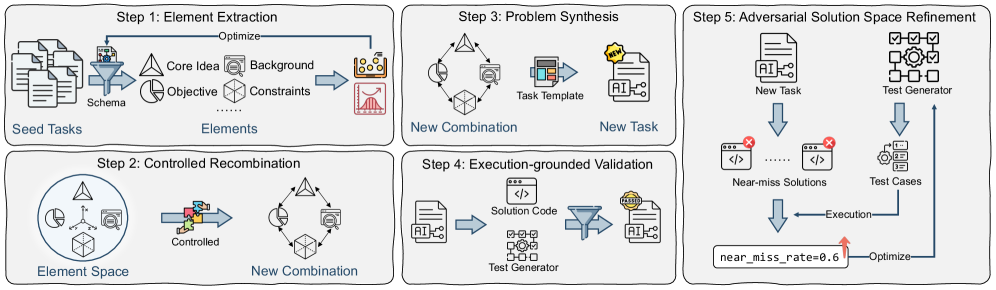
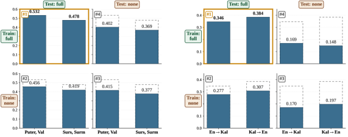
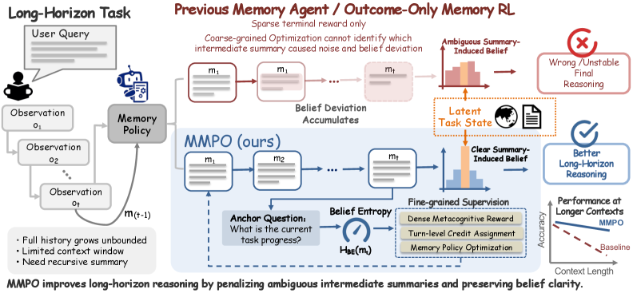
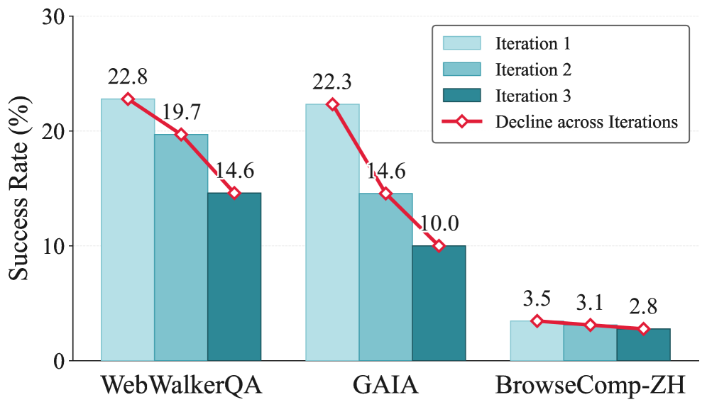
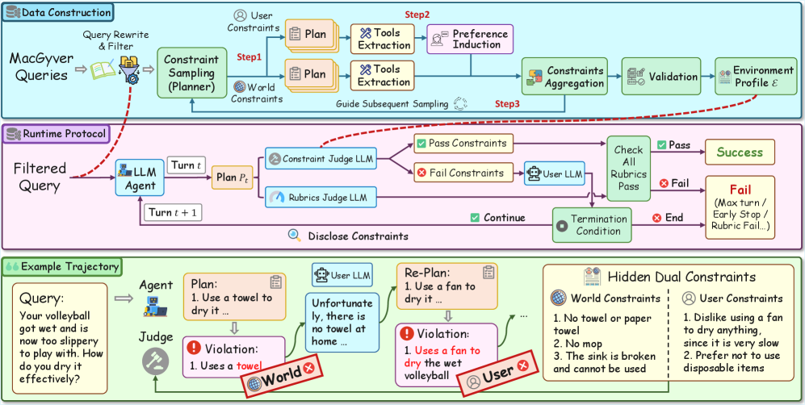
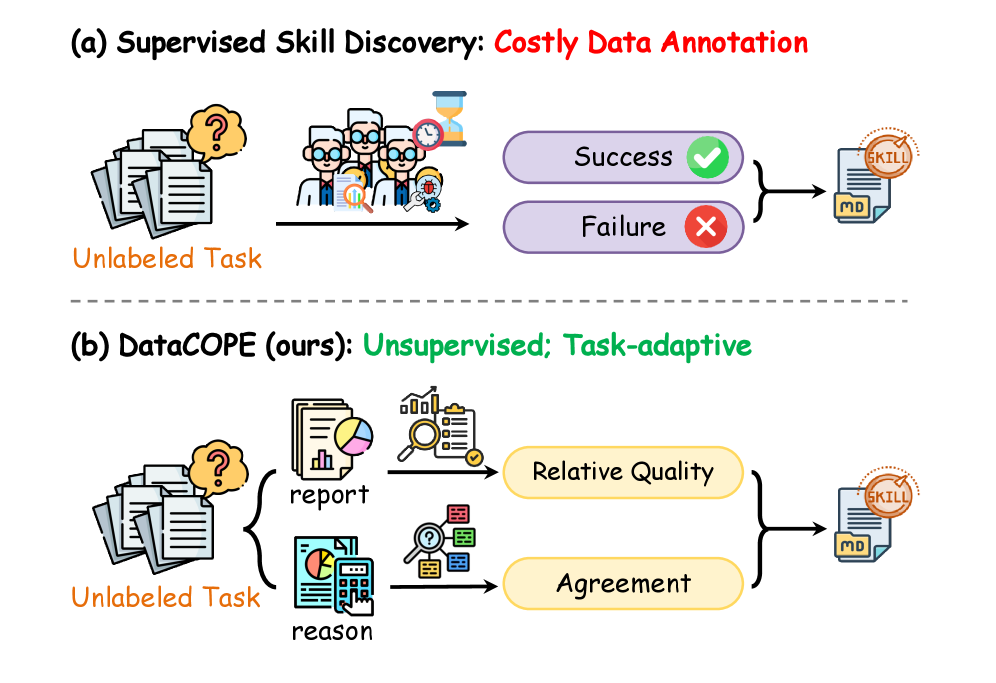
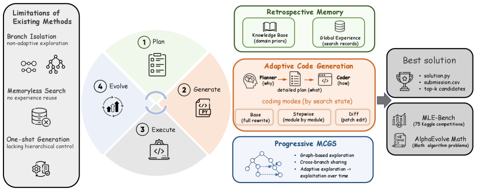
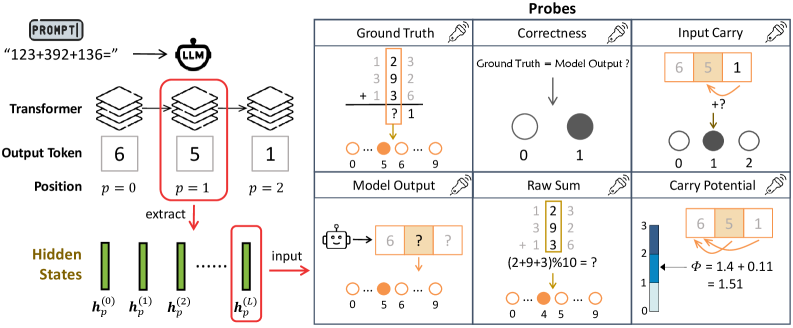
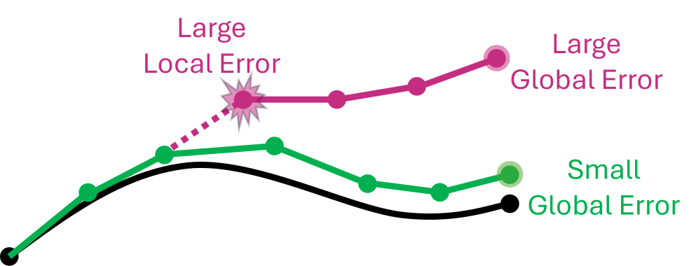
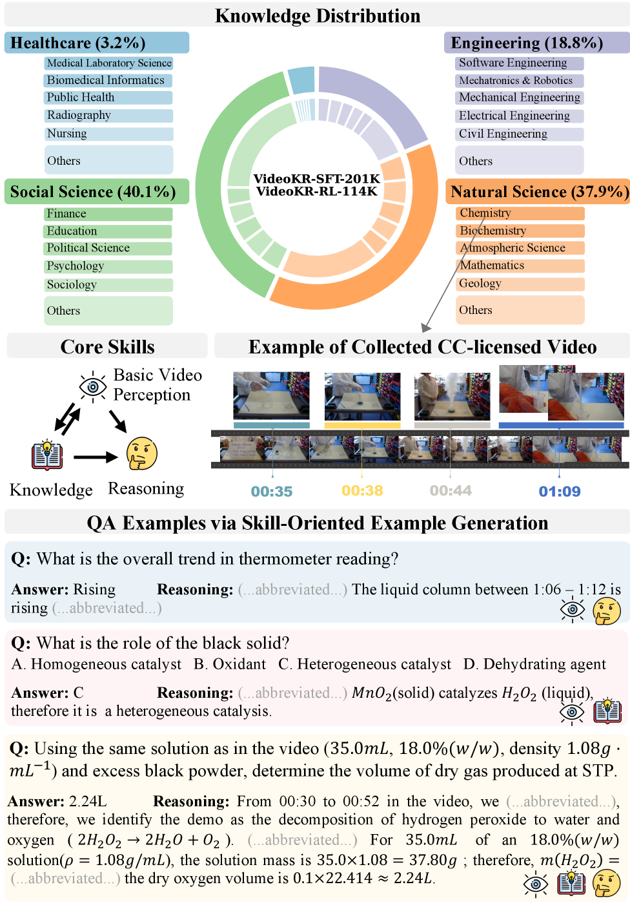

# Daily AI papers — 2026-06-07

*Curated from HF Daily Papers (the 2026-06-07 page surfaces the 2026-06-05 Friday submissions, since the weekend has no fresh listings). 15 of ~49 papers kept after relevance filter.*

## Papers at a glance

| # | Title | Topics | Org |
| --- | --- | --- | --- |
| 1 | [Latent Reasoning with Normalizing Flows (NF-CoT)](#1-nf-cot) | `reasoning`, `LLM`, `architectures` | Penn / UCSD / Meta |
| 2 | [Code2LoRA: Hypernetwork-Generated Adapters](#2-code2lora) | `LoRA`, `fine-tuning`, `code` | Waterloo |
| 3 | [Combinatorial Synthesis: Scaling Code RLVR (ADR)](#3-adr) | `RL`, `RLVR`, `code`, `data` | Inst. of Software CAS |
| 4 | [OPRD: On-Policy Representation Distillation](#4-oprd) | `distillation`, `RL`, `reasoning` | Zhejiang / Ant |
| 5 | [Reinforcement Learning Elicits Contextual Learning of Unseen Language Translation](#5-rl-unseen-mt) | `RL`, `RLVR`, `translation` | UZH / ETH / QUB |
| 6 | [The Shadow Price of Reasoning (CLEAR)](#6-clear) | `efficient-inference`, `reasoning` | (independent) |
| 7 | [Meta-Cognitive Memory Policy Optimization (MMPO)](#7-mmpo) | `agents`, `RL`, `memory` | USTC / Tencent |
| 8 | [Rethinking Continual Experience Internalization for Self-Evolving LLM Agents](#8-experience) | `agents`, `distillation`, `RL` | RUC / Meituan |
| 9 | [AdaPlanBench: Evaluating Adaptive Planning](#9-adaplanbench) | `agents`, `eval` | UIUC |
| 10 | [Unsupervised Skill Discovery for Agentic Data Analysis (DataCOPE)](#10-datacope) | `agents`, `skills` | Zhejiang |
| 11 | [MLEvolve: Self-Evolving ML Algorithm Discovery](#11-mlevolve) | `agents`, `code`, `search` | Shanghai AI Lab |
| 12 | [LLMs Can Leak Training Data But Do They Want To?](#12-propme) | `safety`, `memorization`, `eval` | SDU |
| 13 | [Geometric Structures of Arithmetic in LLMs](#13-shape-of-addition) | `interp`, `LLM`, `arithmetic` | (CN-NSF acks) |
| 14 | [Complexity-Balanced Diffusion Splitting (CBS)](#14-cbs) | `diffusion`, `architectures` | (Israel / academia) |
| 15 | [VideoKR: Knowledge- and Reasoning-Intensive Video Understanding](#15-videokr) | `multimodal`, `RL`, `data` | (multi-author consortium) |

---

## 1. Latent Reasoning with Normalizing Flows (NF-CoT) {#1-nf-cot}

**Authors:** Xiangjun Fu, Suhao Yu, Yao Tang, Haoqiang Kang, Lianhui Qin, Yizhe Zhang, Jiatao Gu — *UPenn / UCSD / Meta*
**Links:** [arXiv:2606.06447](https://arxiv.org/abs/2606.06447) · [HF](https://huggingface.co/papers/2606.06447) · [AlphaXiv](https://www.alphaxiv.org/abs/2606.06447)
**Topics:** `reasoning`, `LLM`, `architectures`

### TL;DR

A latent-reasoning scheme that keeps every property that makes text CoT useful — left-to-right generation, sampling, KV-cache decoding, tractable likelihood — by modeling the continuous "thoughts" with a normalizing flow head spliced into the LLM backbone. Continuous-thought tokens are produced by a TARFlow-style NF head; surface tokens stay on the standard LM head.

### Key idea

Same causal stream, two heads: at "thought" positions emit a continuous vector through a TARFlow normalizing flow (exact density, sampleable, KV-cache compatible); at "text" positions fall back to the LM softmax. The flow is distilled from explicit CoT traces, so the latent space inherits the reasoning structure of textual chains while shrinking the visible token budget.

### Main finding

On code-generation benchmarks NF-CoT beats both explicit-CoT and prior latent-reasoning baselines on pass rate while *substantially reducing intermediate-reasoning cost* (fewer reasoning tokens per query). The flow's tractable likelihood also enables direct policy-gradient RL in latent space.

### Why it matters

This is the first latent-reasoning recipe that's actually compatible with the modern inference stack (KV cache, sampling, RL post-training). If it scales, it offers a clean way to spend reasoning compute in a continuous bandwidth instead of paying serialization cost for every thought.

### Knowledge graph integration

**Builds on / relates to existing pages:**
- [../post-training/reasoning/long-cot-rl.md](../post-training/reasoning/long-cot-rl.md) — NF-CoT proposes a latent alternative to long textual CoT, with the same RL post-training story.
- [../post-training/grpo.md](../post-training/grpo.md) — tractable latent likelihoods let GRPO-style updates land in the continuous thought space.
- [../inference/README.md](../inference/README.md) — preserves KV-cache decoding, the central reason serial CoT is expensive.

**Suggested new pages:**
- `post-training/reasoning/latent-cot.md` *(depth)* — latent reasoning recipe family (Coconut, Looped-Transformers, NF-CoT).
- `fundamentals/normalizing-flows.md` *(depth)* — TARFlow / autoregressive flows as a primitive used inside LLMs.

---

## 2. Code2LoRA: Hypernetwork-Generated Adapters for Code Language Models {#2-code2lora}

**Authors:** Liliana Hotsko, Yinxi Li, Yuntian Deng, Pengyu Nie — *University of Waterloo*
**Links:** [arXiv:2606.06492](https://arxiv.org/abs/2606.06492) · [HF](https://huggingface.co/papers/2606.06492) · [AlphaXiv](https://www.alphaxiv.org/abs/2606.06492)
**Topics:** `LoRA`, `fine-tuning`, `code`

### TL;DR

A hypernetwork that ingests a repository and emits a repo-specific LoRA adapter at inference time. Two flavors: *Static* (one-shot per repo) and *Evo* (regenerated as the repo evolves). Beats RAG and per-repo SFT/LoRA on repository-level code tasks with zero extra prompt tokens at serving time.

### Key idea

Treat per-repository specialization as a learned function from *(repository state)* → *(adapter weights)*. The hypernetwork sees the codebase (imports, APIs, conventions), produces low-rank updates, and the LoRA is then applied as usual. The Evo variant conditions on the diff trajectory so adapters track software evolution rather than re-training from scratch.

### Main finding

On the authors' new RepoPeftBench (604 Python repos), Code2LoRA matches or beats RAG and per-repo LoRA fine-tuning while eliminating long retrieved-context overhead, and the Evo variant degrades gracefully across commit history rather than rotting like a static adapter.

### Why it matters

Closes a recurring gap: per-repo context is expensive (RAG inflates the prompt) and per-repo fine-tuning doesn't scale (one adapter per repo). A hypernet over repos amortizes the specialization cost and decouples context from token count — relevant for any agentic coding system.

### Knowledge graph integration

**Builds on / relates to existing pages:**
- [../post-training/fine-tuning/README.md](../post-training/fine-tuning/README.md) — sits inside the LoRA / parameter-efficient family.
- [../evaluation/livecodebench.md](../evaluation/livecodebench.md) — repo-evolution evaluation is the same kind of contamination-resistant benchmarking spirit.

**Suggested new pages:**
- `post-training/fine-tuning/lora.md` *(depth)* — the canonical LoRA primer (still missing from the graph).
- `post-training/fine-tuning/hypernet-lora.md` *(depth)* — hypernetwork-generated adapters; Code2LoRA is the entry point.

---

## 3. Combinatorial Synthesis: Scaling Code RLVR via Atomic Decomposition and Recombination (ADR) {#3-adr}

**Authors:** Jiasheng Zheng, Boxi Cao, Boxi Yu, Yuzhong Zhang, Jialun Cao, Yaojie Lu, Hongyu Lin, Xianpei Han, Le Sun — *Inst. of Software CAS / U. Limerick / CUHK-SZ / HKUST*
**Links:** [arXiv:2605.31058](https://arxiv.org/abs/2605.31058) · [HF](https://huggingface.co/papers/2605.31058) · [AlphaXiv](https://www.alphaxiv.org/abs/2605.31058)
**Topics:** `RL`, `RLVR`, `code`, `data`

### TL;DR

The bottleneck for code RLVR is not the algorithm but *the supply of verifiable problems near the model's frontier*. ADR decomposes existing programming problems into atomic skill primitives and recombines them under controlled difficulty to manufacture an effectively unbounded stream of new verifiable tasks.

### Key idea

Treat each seed problem as a recipe of atomic units (constraint types, data structures, algorithmic motifs). Recombination then samples a target difficulty and stitches primitives, generating fresh problems whose ground-truth solutions and unit tests can be auto-derived. The verifier is the same RLVR verifier — only the *prompt distribution* changes.

### Main finding

Models trained with ADR-generated curricula gain on algorithmic programming, tool use, and data-science domains over heuristic seed-expansion baselines; gains scale cleanly with curriculum size rather than saturating, suggesting the frontier-RLVR data bottleneck is solvable by synthesis rather than collection.

### Why it matters

Every recent reasoner has hit the same wall: RLVR works, verifiers are cheap, but you run out of hard verifiable prompts. ADR is a concrete recipe for engineered curriculum at the edge of competence, which is exactly the shape needed for continued reasoning RL after the Codeforces-class data is exhausted.

### Knowledge graph integration

**Builds on / relates to existing pages:**
- [../post-training/rlvr.md](../post-training/rlvr.md) — directly addresses RLVR's "verifier-cheap, prompts-scarce" failure mode.
- [../post-training/rl-prompt-curation.md](../post-training/rl-prompt-curation.md) — atomic-decomposition is a richer cousin of difficulty-bucketed RL prompt curation.
- [../data/_data-curation.md](../data/_data-curation.md) — sits next to data-curation work as a *generation* counterpart.

**Suggested new pages:**
- `data/rlvr-data-synthesis.md` *(depth)* — atomic-decomposition-and-recombination as a recipe for unbounded RLVR curricula.

---

## 4. OPRD: On-Policy Representation Distillation {#4-oprd}

**Authors:** Shenzhi Yang, Guangcheng Zhu, Bowen Song, Haobo Wang, Mingxuan Xia, Xing Zheng, Yingfan Ma, Zhongqi Chen, Weiqiang Wang, Gang Chen — *Zhejiang U. / Ant Group*
**Links:** [arXiv:2606.06021](https://arxiv.org/abs/2606.06021) · [HF](https://huggingface.co/papers/2606.06021) · [AlphaXiv](https://www.alphaxiv.org/abs/2606.06021)
**Topics:** `distillation`, `RL`, `reasoning`

### TL;DR

Instead of distilling teacher → student in output (logit) space, OPRD supervises the student's *intermediate hidden states* against the teacher's on the same on-policy rollouts. Bypassing the LM head removes both the high-variance gradient and the information bottleneck of projecting to vocab.

### Key idea

Pick a set of layers; on every on-policy rollout, align the student's residual stream at those layers to the teacher's (an L2-style match), in addition to the usual output supervision. Theoretically: the conditional variance of the gradient at the hidden-state target is zero, so updates are much less noisy than KL-on-logits.

### Main finding

On math reasoning benchmarks OPRD closes student–teacher gaps with **1.44× faster training** and **up to 54% less actor-update transient memory** than on-policy logit distillation.

### Why it matters

On-policy distillation is the workhorse for cheap reasoning models. OPRD argues the dominant cost is the LM head — both for compute (project to V) and for variance (categorical logits) — and that direct representation matching is a strict win on both axes.

### Knowledge graph integration

**Builds on / relates to existing pages:**
- [../post-training/grpo.md](../post-training/grpo.md) — same on-policy rollout structure; distillation replaces (or supplements) the RL signal.
- [../post-training/reasoning/long-cot-rl.md](../post-training/reasoning/long-cot-rl.md) — math-reasoning students are the target setting.

**Suggested new pages:**
- `post-training/distillation.md` *(depth)* — on-policy distillation as a post-training recipe (a missing piece in the graph).
- `post-training/representation-distillation.md` *(depth)* — hidden-state-level distillation, with OPRD as the canonical instance.

---

## 5. Reinforcement Learning Elicits Contextual Learning of Unseen Language Translation {#5-rl-unseen-mt}

**Authors:** Hanxu Hu, Zdeněk Šnajdr, Pinzhen Chen, Jannis Vamvas, Rico Sennrich — *UZH / ETH Zürich / Queen's Belfast*
**Links:** [arXiv:2606.06428](https://arxiv.org/abs/2606.06428) · [HF](https://huggingface.co/papers/2606.06428) · [AlphaXiv](https://www.alphaxiv.org/abs/2606.06428)
**Topics:** `RL`, `RLVR`, `translation`

### TL;DR

Train an LLM to translate *unseen* low-resource languages by RLVR with **chrF as the reward**, conditioning on grammar-book / dictionary snippets in context. The policy learns to *use the resources in context* rather than memorize a language pair — and generalizes to language families it never saw at training time.

### Key idea

chrF is a deterministic n-gram reward that doesn't require a target-language pretraining corpus, so it's a valid RLVR signal even for languages the base model has never seen. By keeping the in-context grammar/lexicon during RL, the policy gradient teaches the model to *extract translation rules from context* rather than store them in weights.

### Main finding

On completely unseen languages, the RL-trained model substantially outperforms SFT counterparts and generalizes across language families — the policy learns a *contextual translation skill*, not a per-language mapping.

### Why it matters

This is RLVR on a non-math, non-code domain: the verifier (chrF) is a string metric, not a unit test, but the same recipe applies. It also nudges back at the assumption that LLM translation quality is bound by the pretraining corpus — for many unseen languages, in-context reference + RL is enough.

### Knowledge graph integration

**Builds on / relates to existing pages:**
- [../post-training/rlvr.md](../post-training/rlvr.md) — extends RLVR's verifier family from math/code to string-metric rewards.
- [../post-training/grpo.md](../post-training/grpo.md) — same GRPO-style on-policy update; only the reward changes.
- [../post-training/_rewards.md](../post-training/_rewards.md) — chrF as a verifiable, non-binary reward.

**Suggested new pages:**
- `post-training/contextual-rlvr.md` *(depth)* — RLVR that teaches "use the in-context resource", with the unseen-language MT result as the motivating case.

---

## 6. The Shadow Price of Reasoning (CLEAR) {#6-clear}

**Authors:** Speed Zhu, Jianwei Cai, Guang Chen, Ximing Huang, Wiggin Zhou, Mingyang Sun — *(affiliations not listed on HF page)*
**Links:** [arXiv:2606.03092](https://arxiv.org/abs/2606.03092) · [HF](https://huggingface.co/papers/2606.03092) · [AlphaXiv](https://www.alphaxiv.org/abs/2606.03092)
**Topics:** `efficient-inference`, `reasoning`

### TL;DR

Inference-time reasoning compute is finite and shared across queries. CLEAR models per-query reasoning utility as a *shifted-surge function* and derives an optimal token-budget allocation policy from a global *shadow price*: easy queries get less, queries near their solvability threshold get more, hopeless queries are *abandoned*.

### Key idea

A constrained optimization over the whole inference traffic stream: maximize total accuracy subject to a global token budget. The shadow price λ is the marginal utility per token at equilibrium. CLEAR computes it online and uses it to make *rational abandonment* decisions — kill rollouts whose marginal utility falls below λ, reinvest in promising ones near their emergence threshold.

### Main finding

In resource-scarce regimes CLEAR yields up to a **3× improvement in global accuracy** vs. uniform allocation, and dominates the Pareto frontier of token cost vs. mean accuracy across multiple reasoning tasks.

### Why it matters

A clean reframing of inference-time scaling: instead of "more thinking = better" per-query, treat the cluster as a market and allocate tokens to where they buy the most accuracy. Connects micro-economic theory (shadow prices) to concrete serving decisions in reasoning models.

### Knowledge graph integration

**Builds on / relates to existing pages:**
- [../inference/README.md](../inference/README.md) — direct intervention at the serving layer.
- [../post-training/reasoning/length-penalty.md](../post-training/reasoning/length-penalty.md) — *training-time* length control versus CLEAR's *serving-time* budget control.
- [../post-training/reasoning/long2short.md](../post-training/reasoning/long2short.md) — same family of "spend less reasoning when you can" ideas, dual side.

**Suggested new pages:**
- `inference/inference-budget-allocation.md` *(depth)* — global shadow-price allocation for reasoning queries (CLEAR).

---

## 7. Meta-Cognitive Memory Policy Optimization (MMPO) {#7-mmpo}

**Authors:** Ziyan Liu, Zhezheng Hao, Yeqiu Chen, Hong Wang, Jingren Hou, Ruiyi Ding, Yongkang Yang, Wence Ji, Wei Xia, Feng Liu — *USTC / ZJU / Tencent*
**Links:** [arXiv:2605.30159](https://arxiv.org/abs/2605.30159) · [HF](https://huggingface.co/papers/2605.30159) · [AlphaXiv](https://www.alphaxiv.org/abs/2605.30159)
**Topics:** `agents`, `RL`, `memory`

### TL;DR

Long-horizon agents recursively summarize history into "memory", and standard outcome-based RL trains those summaries with only terminal rewards. MMPO replaces the sparse signal with a *belief-entropy* per-summary reward: penalize a summary if the model's predictive uncertainty about the latent task state spikes after it lands.

### Key idea

Define **Belief Entropy** as the model's posterior entropy over a latent task-state given the current memory. It's self-supervised — no labels needed. MMPO uses it as a dense intermediate reward inside a policy-gradient loop on the summarization policy: bad summaries get punished the moment they degrade belief, not 100 steps later when the answer is wrong.

### Main finding

MMPO sustains **97.1% of short-horizon performance at 1.75M-token context lengths**, and consistently beats outcome-only RL across diverse long-horizon agent benchmarks.

### Why it matters

Memory in agents is the new attention: as horizons grow, the agent's "summary state" becomes the bottleneck. Belief entropy is a generic, label-free way to put per-step pressure on memory quality — applicable beyond MMPO to any recursive-memory agent.

### Knowledge graph integration

**Builds on / relates to existing pages:**
- [../post-training/grpo.md](../post-training/grpo.md) — MMPO is a PPO/GRPO-class policy optimization with a new per-step reward.
- [../post-training/_rewards.md](../post-training/_rewards.md) — adds belief-entropy as a new self-supervised reward family.
- [../agents/README.md](../agents/README.md) — long-horizon memory is one of the open agent-training problems.

**Suggested new pages:**
- `agents/agent-memory-policy.md` *(depth)* — RL on recursive-memory summarizers, with MMPO as the canonical case.

---

## 8. Rethinking Continual Experience Internalization for Self-Evolving LLM Agents {#8-experience}

**Authors:** Jingwen Chen, Wenkai Yang, Shengda Fan, Wenbo Nie, Chenxing Sun, Shaodong Zheng, Yangen Hu, Lu Pan, Ke Zeng, Yankai Lin — *Renmin U. / Beihang U. / Meituan*
**Links:** [arXiv:2606.04703](https://arxiv.org/abs/2606.04703) · [HF](https://huggingface.co/papers/2606.04703) · [AlphaXiv](https://www.alphaxiv.org/abs/2606.04703)
**Topics:** `agents`, `distillation`, `RL`

### TL;DR

Existing self-evolving agents that repeatedly internalize their own past trajectories suffer *progressive capability collapse* rather than compounding improvement. The paper diagnoses three axes — what to internalize, how to inject it, and which training regime to use — and finds that **principle-level + step-wise + off-policy distillation** is the only combo that survives repeated cycles.

### Key idea

Decompose "experience internalization" into three orthogonal choices: (a) representation: raw instances vs. extracted principles; (b) injection point: per-step vs. global; (c) regime: on-policy RL vs. off-policy distillation. Ablate each, find the failure mode (instance-level + on-policy collapses fastest), and converge on principle + step + off-policy.

### Main finding

Across repeated self-evolution cycles, principle-level + step-wise + off-policy is the only configuration that *compounds*; other combinations show monotonic capability decay after 3–5 iterations.

### Why it matters

Self-evolving agent stacks are increasingly common but rarely studied as multi-iteration systems. This is a clean negative-then-positive result that names the failure mode (collapse from instance overfitting) and prescribes a fix grounded in standard recipes.

### Knowledge graph integration

**Builds on / relates to existing pages:**
- [../post-training/rejection-sampling.md](../post-training/rejection-sampling.md) — instance-level internalization is essentially rejection-sampling-from-self; principle-level is the alternative.
- [../post-training/grpo.md](../post-training/grpo.md) — the on-policy regime that the paper finds *collapses* in this setting.

**Suggested new pages:**
- `agents/experience-internalization.md` *(depth)* — recipe for repeated self-evolution without capability collapse.

---

## 9. AdaPlanBench: Evaluating Adaptive Planning under World and User Constraints {#9-adaplanbench}

**Authors:** Jiayu Liu, Cheng Qian, Zhenhailong Wang, Bingxuan Li, Jiateng Liu, Heng Wang, Jeonghwan Kim, Yumeng Wang, Xiusi Chen, Yi R. (May) Fung, Heng Ji — *UIUC*
**Links:** [arXiv:2606.05622](https://arxiv.org/abs/2606.05622) · [HF](https://huggingface.co/papers/2606.05622) · [AlphaXiv](https://www.alphaxiv.org/abs/2606.05622)
**Topics:** `agents`, `eval`

### TL;DR

A dynamic agent benchmark in which constraints from both the *world* (physics, environment) and the *user* (preferences, restrictions) are revealed only when the agent's plan would violate them. Tests adaptive re-planning rather than upfront plan synthesis.

### Key idea

Replace static "here is the goal, plan once" eval with an interactive harness: hidden constraints fire as conflicts when the agent commits to violating actions, forcing the agent to revise. 307 household tasks, scalable difficulty by tuning how many constraints are deferred.

### Main finding

The best of ten leading LLM agents achieves only **67.75% accuracy**; *user* constraints are notably harder than *world* constraints, suggesting that current models are better at physical reasoning than at user-preference tracking under revision.

### Why it matters

Most planning benchmarks reward one-shot synthesis. AdaPlanBench is the first to systematically expose the gap between *static planning* and *adaptive re-planning under progressively disclosed constraints*, which is closer to real deployment.

### Knowledge graph integration

**Builds on / relates to existing pages:**
- [../agents/README.md](../agents/README.md) — fills an eval gap on the agent side of the graph.
- [../evaluation/README.md](../evaluation/README.md) — interactive constraint-disclosure paradigm is a new branch of agent evaluation.

**Suggested new pages:**
- `evaluation/adaplanbench.md` *(depth)* — adaptive-replanning benchmark with progressive constraint disclosure.

---

## 10. Unsupervised Skill Discovery for Agentic Data Analysis (DataCOPE) {#10-datacope}

**Authors:** Kangqi Song, Shengwei Tang, Shuofei Qiao, Lei Liang, Huajun Chen, Shumin Deng — *Zhejiang University*
**Links:** [arXiv:2606.06416](https://arxiv.org/abs/2606.06416) · [HF](https://huggingface.co/papers/2606.06416) · [AlphaXiv](https://www.alphaxiv.org/abs/2606.06416)
**Topics:** `agents`, `skills`

### TL;DR

A verifier-guided, *unsupervised* loop for mining reusable procedural skills from a data-analytic agent's own exploration. No labels, no parameter updates: discovered skills are stashed and re-injected at inference as procedural prompts.

### Key idea

Run the agent in exploration mode on unlabeled data tasks, use a self-consistency-style verifier to score candidate trajectories, distill recurring high-scoring sub-procedures into reusable "skills", and at inference let a retriever inject the matching skill into the prompt. Inference-time skill augmentation without model weight changes.

### Main finding

DataCOPE materially improves data-analysis agents over plain prompting and over single-shot chain-of-thought baselines, with skill libraries that compose across task formats.

### Why it matters

Skill libraries are an increasingly common alternative to fine-tuning for agentic systems. DataCOPE is one of the first label-free recipes for *discovering* the library from raw exploration rather than authoring it by hand.

### Knowledge graph integration

**Builds on / relates to existing pages:**
- [../agents/README.md](../agents/README.md) — adds an inference-time skill-augmentation route to the agents folder.
- [../post-training/rejection-sampling.md](../post-training/rejection-sampling.md) — verifier-guided trajectory filtering is a known idea; here it's repurposed for skill extraction.

**Suggested new pages:**
- `agents/skill-discovery.md` *(depth)* — unsupervised verifier-guided skill mining from agent rollouts.

---

## 11. MLEvolve: A Self-Evolving Framework for Automated ML Algorithm Discovery {#11-mlevolve}

**Authors:** Xiangchao Yan, Jinxin Shi, Zongsheng Cao, Shiyang Feng, Zichen Liang, Boyuan Sun, Tianshuo Peng, Yifan Zhou, Xin Li, Jie Zhou, Liang He, Bo Zhang, Lei Bai — *Shanghai AI Lab / ECNU*
**Links:** [arXiv:2606.06473](https://arxiv.org/abs/2606.06473) · [HF](https://huggingface.co/papers/2606.06473) · [AlphaXiv](https://www.alphaxiv.org/abs/2606.06473)
**Topics:** `agents`, `code`, `search`

### TL;DR

A multi-agent system for ML engineering that fixes three failure modes of prior pipelines: information isolation across search branches, no memory across runs, and flat (non-hierarchical) control. Built around Progressive Monte Carlo Graph Search, a Retrospective Memory, and Hierarchical Planning with Adaptive Code Generation.

### Key idea

Graph search (not tree search) so branches share intermediate findings; a memory store that combines static domain knowledge with dynamic per-run experience; and a planner-coder split where strategic decisions are made at the top and code is generated below them, allowing both to be optimized with different signals.

### Main finding

**65.3% average medal rate within 12 hours on MLE-Bench** — SOTA across multiple dimensions — and stronger than specialized methods on mathematical optimization benchmarks.

### Why it matters

LLM-driven ML pipelines have been a benchmark race for two years; MLEvolve's contribution is the *system-level* split (graph search + memory + hierarchy) rather than yet another prompt. The hierarchical planner pattern likely transfers to other long-horizon agentic-coding settings.

### Knowledge graph integration

**Builds on / relates to existing pages:**
- [../agents/README.md](../agents/README.md) — multi-agent system pattern, hierarchical control.
- [../post-training/reasoning/mcts.md](../post-training/reasoning/mcts.md) — MCGS is MCTS lifted from tree to graph (shared subtrees).

**Suggested new pages:**
- `agents/mcgs.md` *(depth)* — Monte Carlo Graph Search for agentic search with cross-branch information sharing.

---

## 12. LLMs Can Leak Training Data But Do They Want To? (PropMe + SimpleTrace) {#12-propme}

**Authors:** Gianluca Barmina, Peter Schneider-Kamp, Lukas Galke — *University of Southern Denmark*
**Links:** [arXiv:2606.06286](https://arxiv.org/abs/2606.06286) · [HF](https://huggingface.co/papers/2606.06286) · [AlphaXiv](https://www.alphaxiv.org/abs/2606.06286)
**Topics:** `safety`, `memorization`, `eval`

### TL;DR

Splits memorization into **capability** (can the model reproduce the training datum under an adversarial prefix?) and **propensity** (does it produce it in normal use?). PropMe contrasts the two; SimpleTrace attributes outputs back to training corpora.

### Key idea

Adversarial-prefix attacks measure worst-case extractability; non-adversarial prompts measure ordinary leakage propensity. The propensity number is usually *much* smaller than the capability number — models can leak, but rarely choose to. Continual pretraining on different data further suppresses earlier memorized content.

### Main finding

Across two open models and two languages, capability and propensity diverge sharply: extractable content is mostly only reachable under adversarial conditions. Continual pretraining on new data measurably reduces earlier memorization.

### Why it matters

Memorization audits today report capability ("can it leak?") which sets policy alarms even when real-world leakage is rare. PropMe argues audits must report both numbers; otherwise the safety story is mis-framed.

### Knowledge graph integration

**Builds on / relates to existing pages:**
- [../safety/README.md](../safety/README.md) — adds a memorization-vs-propensity distinction the safety folder doesn't yet have.
- [../data/decontamination.md](../data/decontamination.md) — opposite side of the same coin: decontamination prevents capability; propensity is the residual after that.

**Suggested new pages:**
- `safety/memorization-propensity.md` *(depth)* — capability vs propensity audits, with PropMe as the canonical recipe.

---

## 13. Geometric Structures of Arithmetic in Large Language Models {#13-shape-of-addition}

**Authors:** Not listed on HF page — *acknowledgments cite National Natural Science Foundation of China and 111 Center.*
**Links:** [arXiv:2606.03645](https://arxiv.org/abs/2606.03645) · [HF](https://huggingface.co/papers/2606.03645) · [AlphaXiv](https://www.alphaxiv.org/abs/2606.03645)
**Topics:** `interp`, `LLM`, `arithmetic`

### TL;DR

A mechanistic-interpretability account of why LLMs are paradoxically fragile at multi-digit arithmetic. Identifies the *Iso-Raw-Sum Trajectory* (IRST) in the residual stream and proposes a *Noisy Quantization Model*: arithmetic errors are "geometric slippages" when internal noise pushes a continuous *carry potential* across a quantization threshold.

### Key idea

The residual stream during multi-operand addition is organized as a 2-D structure: discrete *raw-sum* anchors (the actual digit semantics) plus a continuous *carry potential* that gets quantized late in the network. Errors aren't random — they're threshold-crossing events on the carry axis. A *geometric consistency check* at inference can detect and correct these.

### Main finding

The geometry explains both arithmetic errors *and* "probe versatility" (why lightweight probes can recover hallucination signals from a single activation): the same axis carries multiple latent signals separable by direction. An inference-time consistency check measurably corrects arithmetic mistakes without re-training.

### Why it matters

A rare interpretability paper that yields an *actionable* inference-time fix. Also clarifies a long-standing puzzle: small probes "knowing" things the model gets wrong is consistent with the model encoding ground truth geometrically but discretizing it noisily on the way to output.

### Knowledge graph integration

**Builds on / relates to existing pages:**
- [../interpretability/README.md](../interpretability/README.md) — a worked example of residual-stream geometry for a specific capability (arithmetic).

**Suggested new pages:**
- `interpretability/residual-stream-geometry.md` *(depth)* — geometric analysis of residual streams as a method, with arithmetic IRST as the case study.

---

## 14. Complexity-Balanced Diffusion Splitting (CBS) {#14-cbs}

**Authors:** Not listed on HF page. *Project page: noamissachar.github.io/CBS/*
**Links:** [arXiv:2606.06477](https://arxiv.org/abs/2606.06477) · [HF](https://huggingface.co/papers/2606.06477) · [AlphaXiv](https://www.alphaxiv.org/abs/2606.06477)
**Topics:** `diffusion`, `architectures`

### TL;DR

Standard continuous-time diffusion uses one monolithic network across timesteps with vastly different signal regimes. CBS splits the diffusion trajectory into sub-intervals assigned to specialized sub-networks, with the boundaries chosen by an *equidistribution* principle (de Boor) over a complexity monitor.

### Key idea

Two monitor functions estimate local complexity along the trajectory: spatial flow variation (Dirichlet energy) and trajectory geometric complexity (acceleration). Use de Boor's equidistribution to pick split points so each sub-network owns an equal share of complexity, not equal time. Specialization replaces capacity.

### Main finding

Across SiT, JiT, and UNet, CBS gives consistent quality gains *without raising per-step inference cost* — including **~35% FID improvement on SiT-XL with CFG** vs. naive temporal partitioning.

### Why it matters

Splitting a generator across timesteps is an old idea; CBS makes the split *principled* (equidistribution of measured complexity) instead of hand-tuned, and shows the gains are architecture-agnostic. The framing also opens a route to mix model classes (SSM in noise regime, transformer in detail regime).

### Knowledge graph integration

The diffusion folder doesn't yet exist; CBS would seed it.

**Suggested new pages:**
- `diffusion/_diffusion-training.md` *(taxonomy)* — bootstrap a `diffusion/` folder; CBS is its first depth file.
- `diffusion/complexity-balanced-splitting.md` *(depth)* — CBS specifically: monitor functions, equidistribution, sub-network assignment.

---

## 15. VideoKR: Knowledge- and Reasoning-Intensive Video Understanding {#15-videokr}

**Authors:** 34-expert consortium (authors not individually listed on HF page).
**Links:** [arXiv:2606.05259](https://arxiv.org/abs/2606.05259) · [HF](https://huggingface.co/papers/2606.05259) · [AlphaXiv](https://www.alphaxiv.org/abs/2606.05259)
**Topics:** `multimodal`, `RL`, `data`

### TL;DR

A 315K-example training corpus over 145K CC-licensed expert-domain videos, built specifically to train video-LLMs on tasks that demand *world knowledge* and *multi-step reasoning* rather than surface description. Paired with VideoKR-Eval, a benchmark designed to resist text-only shortcuts. SFT→GRPO on this corpus is the published recipe.

### Key idea

Most video-LLM data rewards surface caption-style understanding; VideoKR's human-in-the-loop generation pipeline targets *progressive reasoning depth* and *expert knowledge* across many domains. Eval is constructed so that text-only models cannot solve it from question alone — the video has to be used.

### Main finding

Models post-trained with SFT → GRPO on VideoKR beat prior recipes on knowledge-intensive video tasks while remaining competitive on general video benchmarks.

### Why it matters

Closes a known gap: video-LLM benchmarks have under-tested deep reasoning and domain knowledge. The data + eval pair is the kind of artifact that anchors a year of follow-up VLM work, and the SFT→GRPO recipe lines up with the dominant text-reasoning pipeline.

### Knowledge graph integration

**Builds on / relates to existing pages:**
- [../multimodal/README.md](../multimodal/README.md) — video-LLM corpus and benchmark.
- [../post-training/grpo.md](../post-training/grpo.md) — the post-training algorithm of choice (SFT → GRPO).
- [../post-training/rlvr.md](../post-training/rlvr.md) — the verifier here is reasoning-aware, in the RLVR family.

*(No new pages suggested — the contribution is a dataset + benchmark; existing GRPO/RLVR/multimodal coverage suffices.)*

---

## Notes

- HF's `/papers/date/2026-06-07` page surfaces the Friday (2026-06-05) submissions, since the weekend yields no fresh listings.
- Hero figures pulled from arXiv HTML mirrors at `arxiv.org/html/<id>v1/x1.png`. Missing figures: 2606.03092 (CLEAR), 2606.06286 (PropMe), 2606.05553 (ArcANE — paper dropped from this digest) — no public figure URL resolved cleanly.
- Borderline inclusions are inline where applicable.
- This digest is informational. No existing concept files, `READING-LIST.md`, or `PAPERS.md` were modified to produce it.
