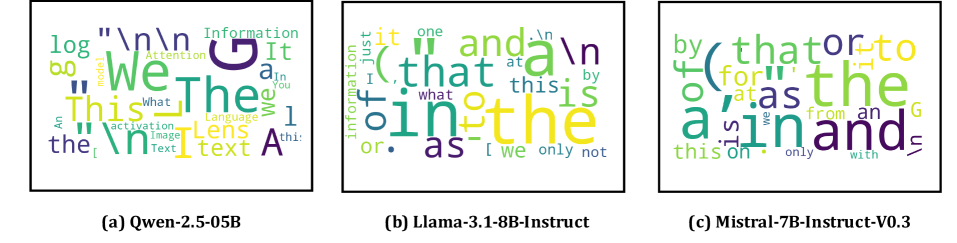
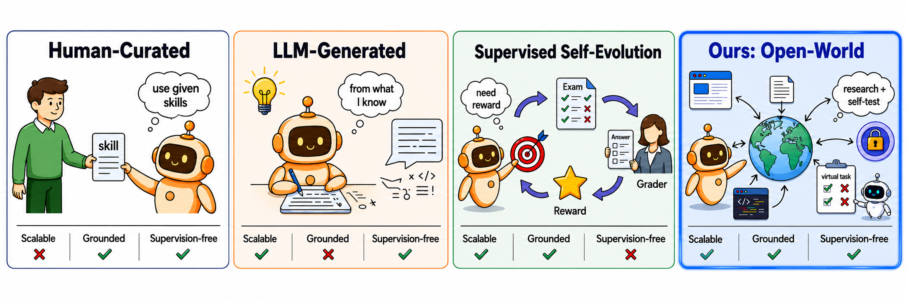
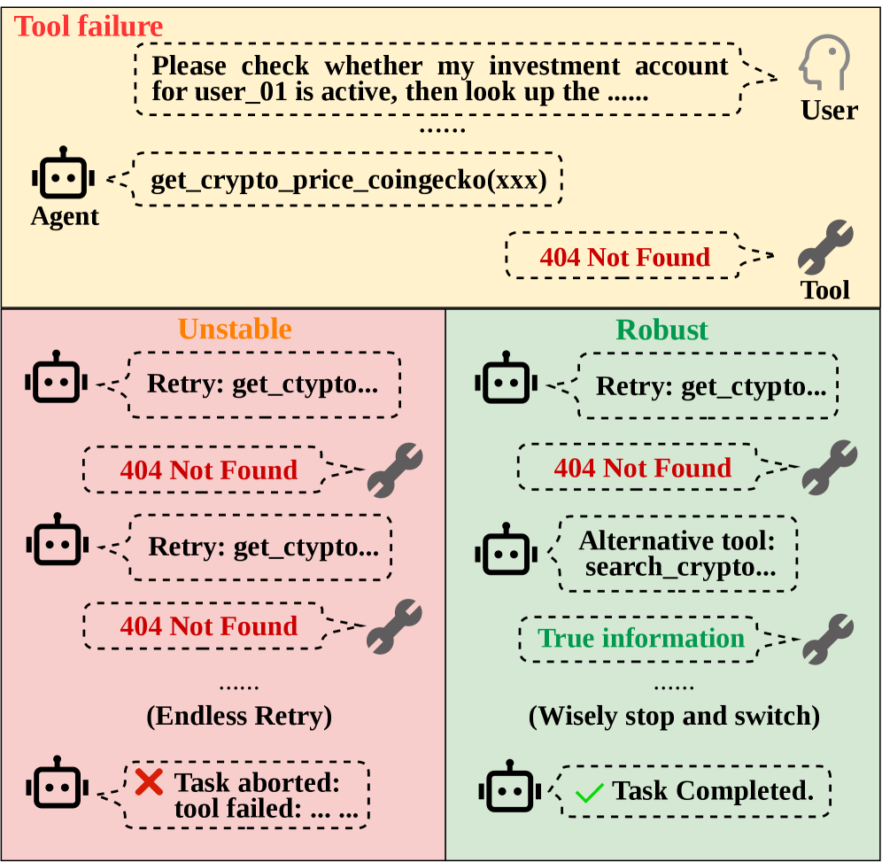
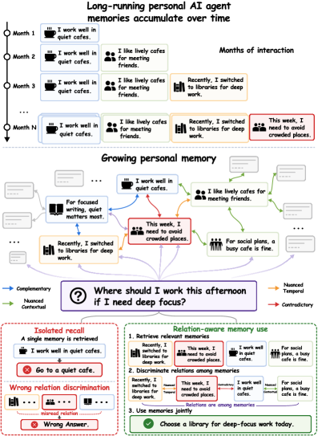
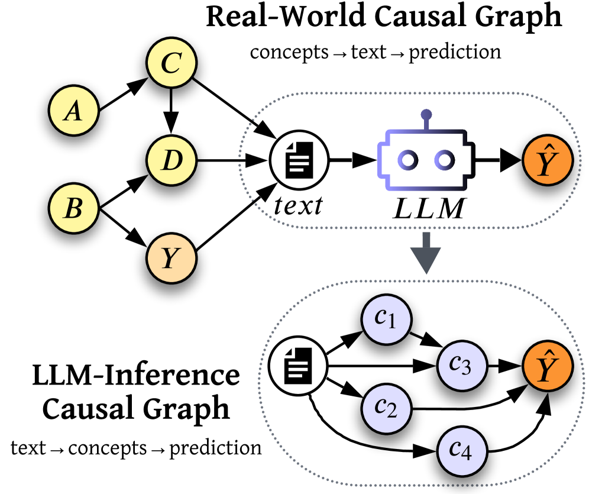
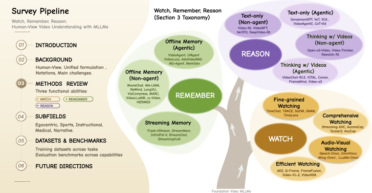
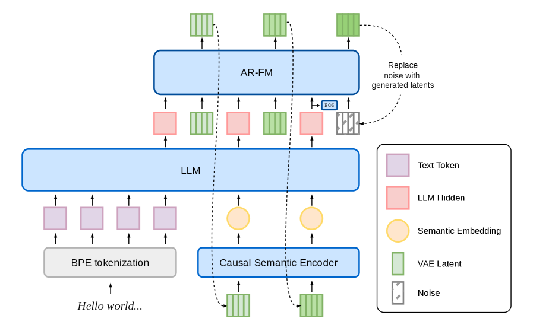
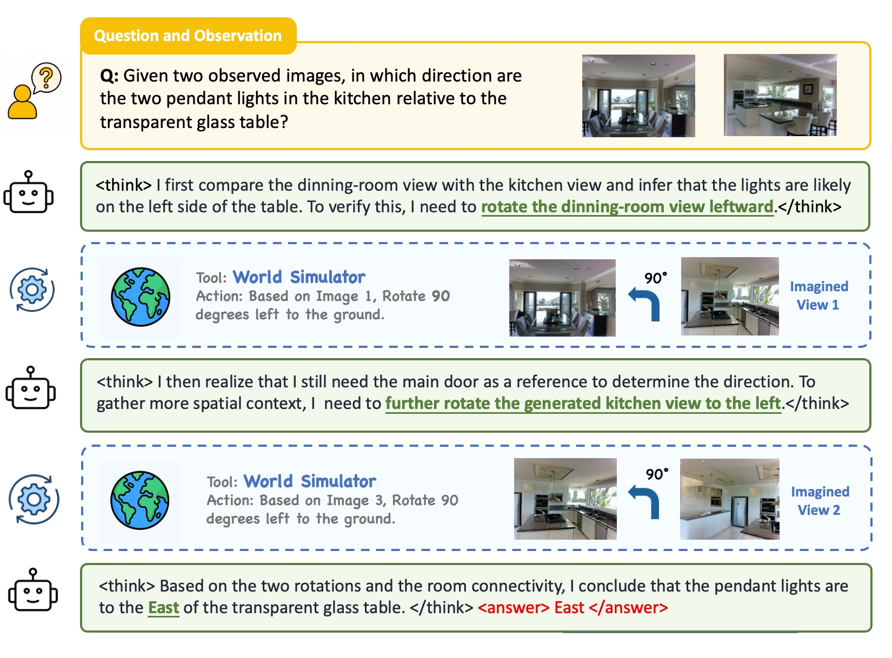
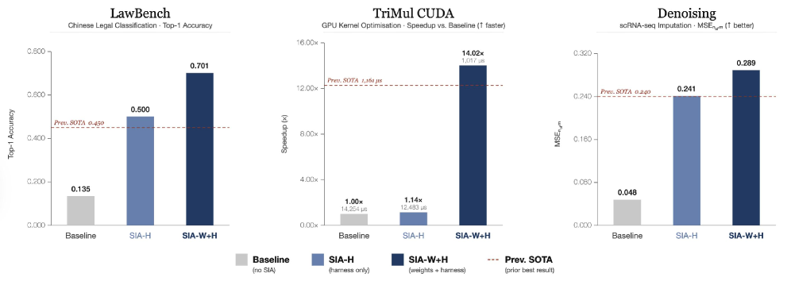
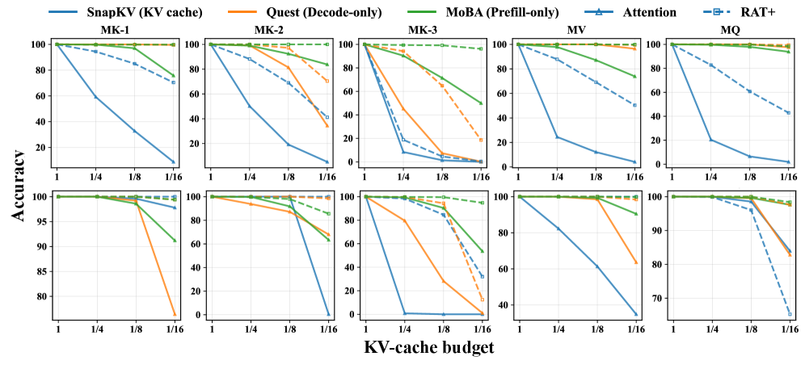

# Daily AI papers — 2026-06-08

*Curated from HF Daily Papers. 14 of 47 papers kept after relevance filter.*

## Papers at a glance

| # | Title | Topics | Org |
| --- | --- | --- | --- |
| 1 | [Your UnEmbedding Matrix is Secretly a Feature Lens for Text Embeddings](#1-embedfilter) | `interp`, `LLM`, `eval` | (anonymous; code at CentreChen) |
| 2 | [OpenSkill: Open-World Self-Evolution for LLM Agents](#2-openskill) | `agents`, `RL`, `self-improvement` | Lehigh / UBC / Salesforce |
| 3 | [When Tools Fail: Dynamic Replanning and Anomaly Recovery in LLM Agents](#3-toolmaze) | `agents`, `eval` | Shanghai AI Lab / Baidu |
| 4 | [SubtleMemory: Fine-Grained Relational Memory Discrimination](#4-subtlememory) | `agents`, `eval`, `memory` | Shanghai AI Lab / HIT |
| 5 | [LLM Explainability with Counterfactual Chains and Causal Graphs](#5-causal-graph-explanations) | `interp`, `LLM` | Technion / IBM |
| 6 | [Watch, Remember, Reason: Human-View Video Understanding with MLLMs](#6-watch-remember-reason) | `multimodal`, `video`, `survey` | PKU / NUS / UC Merced |
| 7 | [UnpredictaBench: Distributional Randomness in LLMs](#7-unpredictabench) | `eval`, `LLM` | UBC |
| 8 | [dots.tts Technical Report](#8-dots-tts) | `multimodal`, `audio`, `distillation` | Xiaohongshu / SJTU |
| 9 | [Astra — Thinking with Imagination: Agentic Spatial Reasoning with World Simulators](#9-astra) | `multimodal`, `agents`, `RL`, `reasoning` | HKU / Shanghai AI Lab |
| 10 | [SIA: Self Improving AI with Harness & Weight Updates](#10-sia) | `agents`, `RL`, `self-improvement` | (mixed; code-only attribution) |
| 11 | [Socratic-SWE: Self-Evolving Coding Agents via Trace-Derived Skills](#11-socratic-swe) | `agents`, `RL`, `eval` | (multi-institution) |
| 12 | [Data-Efficient Autoregressive-to-Diffusion LMs via On-Policy Distillation](#12-opdlm) | `diffusion`, `LLM`, `distillation` | Texas A&M |
| 13 | [Reinforcement Learning from Rich Feedback with Distributional DAgger](#13-distributional-dagger) | `RL`, `reasoning`, `post-training` | USC |
| 14 | [Augmenting Attention with Exponentially Decaying Memory Improves KV Sparsity](#14-rat-plus) | `efficient-inference`, `architectures` | EPFL |

---

## 1. Your UnEmbedding Matrix is Secretly a Feature Lens for Text Embeddings

**Authors:** anonymous submission — *code at github.com/CentreChen/EmbFilter*
**Links:** [arXiv:2606.07502](https://arxiv.org/abs/2606.07502) · [HF](https://huggingface.co/papers/2606.07502) · [AlphaXiv](https://www.alphaxiv.org/abs/2606.07502)
**Topics:** `interp`, `LLM`, `eval`

### TL;DR
LLM hidden states, when projected through the model's own unembedding matrix, collapse onto a small subspace dominated by high-frequency tokens. The authors propose EmbedFilter, a one-shot linear projection that nulls out this "frequent-token subspace" and dramatically improves zero-shot text-embedding quality while shrinking dimension.

### Key idea
The unembedding (`lm_head`) matrix doubles as a *feature lens*: each row is a direction the residual stream uses to commit probability mass to a token. The most frequent tokens occupy a low-rank subspace that text embeddings overshoot, drowning semantic signal. EmbedFilter learns (or sets) a low-rank projection orthogonal to this subspace and applies it as a post-hoc transform on the embeddings.

### Main finding
Across multiple LLM backbones on MTEB-style retrieval, EmbedFilter improves zero-shot embedding scores while halving dimension. The dimensionality reduction is "free" — index size and retrieval latency drop and quality goes up.

### Why it matters
This is a logit-lens-style insight applied to representations rather than predictions: it gives a mechanistic story for why off-the-shelf LLM embeddings underperform, plus a cheap fix that doesn't need contrastive fine-tuning. Likely to slot in as a default preprocessing step for "use an LLM as an embedder" pipelines.

### Knowledge graph integration

**Builds on / relates to existing pages:**
- [attention.md](../fundamentals/attention.md) — residual-stream view of the model the lens is reading from.

**Suggested new pages:**
- `interpretability/embedfilter.md` *(depth)* — the unembedding-as-feature-lens recipe.
- `interpretability/logit-lens.md` *(depth)* — the prerequisite concept this paper extends; currently missing from the graph.

---

## 2. OpenSkill: Open-World Self-Evolution for LLM Agents

**Authors:** Dingjie Song, Hanrong Zhang, Wei Liang, Yuxuan Zhang, Yutong Dai, Lifang He, Philip S. Yu, Ran Xu, Xiang Li, Lichao Sun — *Lehigh / UIC / UBC / Vector / Salesforce*
**Links:** [arXiv:2606.06741](https://arxiv.org/abs/2606.06741) · [HF](https://huggingface.co/papers/2606.06741) · [AlphaXiv](https://www.alphaxiv.org/abs/2606.06741)
**Topics:** `agents`, `RL`, `self-improvement`

### TL;DR
Self-evolving agents usually assume someone hands them curated skills, gold trajectories, or a verifier. OpenSkill removes that assumption: given only a task prompt, the agent scrapes documentation/repos/web for *knowledge anchors*, synthesises them into transferable skills, and invents its own *virtual tasks* grounded in those anchors so it can practice and self-grade without target-task supervision.

### Key idea
Decouple the supervision-free loop into two passes: (a) anchor mining from open-world artefacts to obtain ground-truth facts the agent can self-verify against, then (b) skill synthesis + self-built virtual tasks where the anchors act as a verifier proxy. Target-task labels are touched only for final eval.

### Main finding
Across 3 benchmarks and 2 base agents, OpenSkill posts the highest pass rate among methods that respect the no-supervision constraint. Crucially, the synthesised skills transfer across base models with no model-specific adaptation, and the self-built verifier correlates with ground-truth outcomes the agent never saw.

### Why it matters
Most "self-evolving agent" claims quietly lean on a verifier. OpenSkill is one of the cleaner attempts to remove that crutch by reframing open-world resources as both training data and oracle. Useful template for agentic post-training in domains where you have docs but no graded trajectories.

### Knowledge graph integration

**Builds on / relates to existing pages:**
- [rlvr.md](../post-training/rlvr.md) — same "find a verifier, then RL" pattern, with the verifier itself learned from open-world anchors.

**Suggested new pages:**
- `agents/open-world-self-evolution.md` *(depth)* — OpenSkill recipe: anchor mining → skill synthesis → virtual-task practice.

---

## 3. When Tools Fail: Benchmarking Dynamic Replanning and Anomaly Recovery in LLM Agents

**Authors:** Dongsheng Zhu, Xuchen Ma, Yucheng Shen, Xiang Li, Yukun Zhao, Shuaiqiang Wang, Lingyong Yan, Dawei Yin — *Shanghai AI Lab / ECNU / Soochow / SDU / Baidu*
**Links:** [arXiv:2606.05806](https://arxiv.org/abs/2606.05806) · [HF](https://huggingface.co/papers/2606.05806) · [AlphaXiv](https://www.alphaxiv.org/abs/2606.05806)
**Topics:** `agents`, `eval`

### TL;DR
ToolMaze is a benchmark for tool-using agents that no longer assumes the happy path: tools can return wrong, corrupted, or transiently broken outputs. The 2×2 perturbation taxonomy (explicit/implicit × transient/permanent) plus DAG-shaped task topologies reveal that current agents over-trust corrupted outputs and that scaling helps fault-tolerance much slower than it helps base accuracy.

### Key idea
A two-axis design: topological complexity (DAG depth/branching) decoupled from perturbation type. The new metric — Perturbation Recovery Rate (PRR) — measures the gap between clean-path and broken-path performance, separating *replanning* skill from raw tool-use skill.

### Main finding
Implicit semantic tool failures (tool returns a wrong-but-plausible answer) drop PRR by ~37% across leading agents. Fault-tolerance gains from model scale are 3.66× *slower* than base-task gains — model-size scaling does not buy you robustness for free. Complex topologies trap agents in trial-and-error loops.

### Why it matters
A clean diagnostic that says "replanning is its own capability, not a side-effect of being smart". Should feed into agent post-training reward design — training on noisy/adversarial tool outputs is now justified by a benchmark.

### Knowledge graph integration

**Builds on / relates to existing pages:**
- [ifeval.md](../evaluation/ifeval.md) — same "evaluate a specific capability beyond raw QA" spirit, applied to tool agents instead of instructions.

**Suggested new pages:**
- `evaluation/toolmaze.md` *(depth)* — benchmark spec, the 2×2 perturbation taxonomy, PRR metric.

---

## 4. SubtleMemory: A Benchmark for Fine-Grained Relational Memory Discrimination

**Authors:** Wenxuan Wang, Haoyu Sun, Fukuan Hou, Mingyang Song, Weinan Zhang, Yu Cheng, Yang Yang — *HIT / Tongji / XMU / Fudan / CUHK / SJTU / Shanghai AI Lab*
**Links:** [arXiv:2606.05761](https://arxiv.org/abs/2606.05761) · [HF](https://huggingface.co/papers/2606.05761) · [AlphaXiv](https://www.alphaxiv.org/abs/2606.05761)
**Topics:** `agents`, `eval`, `memory`

### TL;DR
Long-horizon assistants accumulate memories that *interact*: they complement, nuance, or contradict each other. Existing memory benchmarks only test isolated recall. SubtleMemory provides 1,522 instances spanning complementary / nuanced / contradictory relations across ten long interaction histories, forcing the agent to reason over relations between memories rather than fetch them.

### Key idea
A taxonomy of memory-relation types (complementary, nuanced, contradictory) embedded inside long, realistic interaction histories. Each test instance only makes sense once you've correctly *related* multiple memories, not just retrieved them.

### Main finding
The benchmark exposes a wide gap between strong retrieval and weak relational reasoning across persistent-assistant systems — single-memory recall is mostly solved while contradiction handling collapses.

### Why it matters
Memory is being baked into product agents at speed; this benchmark catches the failure mode where the agent "remembers everything and believes all of it". Becomes a natural target for memory-RL post-training.

### Knowledge graph integration

**Builds on / relates to existing pages:**
- [ifeval.md](../evaluation/ifeval.md) — sibling benchmark style targeting a specific capability axis.

**Suggested new pages:**
- `evaluation/subtlememory.md` *(depth)* — relational-memory taxonomy + benchmark protocol.

---

## 5. LLM Explainability with Counterfactual Chains and Causal Graphs

**Authors:** Nirit Nussbaum-Hoffer, Nitay Calderon, Liat Ein-Dor, Roi Reichart — *Technion / IBM Research*
**Links:** [arXiv:2606.05972](https://arxiv.org/abs/2606.05972) · [HF](https://huggingface.co/papers/2606.05972) · [AlphaXiv](https://www.alphaxiv.org/abs/2606.05972)
**Topics:** `interp`, `LLM`

### TL;DR
Builds *causal graphs of an LLM's inference* — not of the world the LLM is reasoning about. A four-phase pipeline discovers human-readable concepts, maps each input to LLM-perceived concept states, expands the data via MCMC-style counterfactual chains, then runs σ-CG causal discovery to produce a graph whose nodes are concepts the model actually uses.

### Key idea
Treat the LLM as the system under study. The bottleneck for causal discovery — sparse data — is broken by an MCMC-inspired counterfactual augmentation that walks chains of edits between examples. σ-CG then runs over the augmented data to recover stable concept-level edges.

### Main finding
Across disease diagnosis, sentiment, and LLM-as-judge tasks, the discovered graphs are predictive-faithful (you can swap in a tiny model that uses only the graph and match the LLM's behavior on held-out data) and structurally stable across re-runs.

### Why it matters
Concept-level explanations are what regulated deployments actually need; this gives a recipe that doesn't require white-box access to weights and produces an artefact (the graph) that a human can audit and edit. Complements probe-/SAE-style mech-interp from the *behavioural* side.

### Knowledge graph integration

**Builds on / relates to existing pages:**
- [cot-monitoring.md](../safety/cot-monitoring.md) — adjacent behavioural-interp tool but for safety; this paper does explanation rather than monitoring.

**Suggested new pages:**
- `interpretability/causal-graph-explanations.md` *(depth)* — σ-CG + counterfactual-chain pipeline.

---

## 6. Watch, Remember, Reason: Human-View Video Understanding with MLLMs

**Authors:** Jiahao Meng, Yue Tan, Qi Xu, Kuan Gao, Weisong Liu, Yanwei Li, Jason Li, Lingdong Kong, Haochen Wang, Qianyu Zhou, Jiangning Zhang, Guangliang Cheng, Yunhai Tong, Lu Qi, Ming-Hsuan Yang — *PKU / NUS / UC Merced + others*
**Links:** [arXiv:2606.07433](https://arxiv.org/abs/2606.07433) · [HF](https://huggingface.co/papers/2606.07433) · [AlphaXiv](https://www.alphaxiv.org/abs/2606.07433)
**Topics:** `multimodal`, `video`, `survey`

### TL;DR
A survey/position paper organising the video-MLLM space around three functional axes: **watching** (perception), **remembering** (memory state), and **reasoning** (trace + output). Proposes a unified formulation `<perception, memory, reasoning, prediction>` and re-organises existing methods into it.

### Key idea
Stop treating video tasks as isolated benchmarks and start typing methods by which *function* they upgrade. The formulation makes long-video, streaming, audio-visual, and ego-centric work directly comparable.

### Main finding
This is a survey — no new model. The contribution is the taxonomy plus a tracked literature index at github.com/marinero4972/Awesome-HumanView-VideoUnderstanding.

### Why it matters
Useful scaffold for organising the (sprawling) video-MLLM literature, and a good seed for a `multimodal/_video-mllm.md` taxonomy file in the graph.

### Knowledge graph integration

**Builds on / relates to existing pages:**
- (none — `multimodal/` is currently empty except for a README)

**Suggested new pages:**
- `multimodal/_video-mllm.md` *(taxonomy)* — watching / remembering / reasoning split with depth-file slots for each.

---

## 7. UnpredictaBench: A Benchmark for Evaluating Distributional Randomness in LLMs

**Authors:** Amirhossein Abaskohi, Amirhossein Dabiriaghdam, Liang Luo, Ellie Dingqiao Wen, Lele Wang, Giuseppe Carenini, Peter West — *UBC*
**Links:** [arXiv:2606.06622](https://arxiv.org/abs/2606.06622) · [HF](https://huggingface.co/papers/2606.06622) · [AlphaXiv](https://www.alphaxiv.org/abs/2606.06622)
**Topics:** `eval`, `LLM`

### TL;DR
Tests whether an LLM can *sample from a target distribution* — not just be "diverse". 448 problems covering canonical statistical distributions, distributions induced by short stochastic programs, and natural-language randomness scenarios. Scored with KS@N: rate at which a Kolmogorov-Smirnov test fails to reject N model samples against the ground-truth distribution.

### Key idea
Treat distribution-matching as a first-class capability separate from diversity. KS@N rises with N (harder), giving a controllable difficulty knob and a metric grounded in classical statistics rather than ad-hoc diversity scores.

### Main finding
Huge spread across frontier and open models. No model exceeds 40% at KS@100; many sit near 0. Reasoning helps somewhat but doesn't close the gap — the failure is genuine, not a sampling-temperature artefact.

### Why it matters
LLMs are increasingly used as *simulators* (agent-based econ, persona panels, synthetic data). If their output distributions don't match targets, downstream conclusions are biased. UnpredictaBench is a prerequisite benchmark for "use an LLM as a Monte-Carlo engine".

### Knowledge graph integration

**Builds on / relates to existing pages:**
- [mmlu.md](../evaluation/mmlu.md) — sibling benchmark; this one targets distributional calibration instead of knowledge.

**Suggested new pages:**
- `evaluation/unpredictabench.md` *(depth)* — problem set + KS@N metric + headline numbers.

---

## 8. dots.tts Technical Report

**Authors:** Shi Lian, Changtao Li, Bohan Li, Hankun Wang, Da Zheng, Junfeng Tian, Yufeng Ma, Colin Zhang, Kai Yu — *Xiaohongshu (dots team) / SJTU X-LANCE*
**Links:** [arXiv:2606.07080](https://arxiv.org/abs/2606.07080) · [HF](https://huggingface.co/papers/2606.07080) · [AlphaXiv](https://www.alphaxiv.org/abs/2606.07080)
**Topics:** `multimodal`, `audio`, `distillation`, `efficient-inference`

### TL;DR
A 2B-param continuous autoregressive TTS foundation model. Three deltas vs. the existing continuous-AR-TTS line: multi-objective AudioVAE for a "semantically structured" latent space, full-history conditioning in the flow-matching head, and *reward-free self-corrective* post-training. CFG-aware MeanFlow distillation drops latency to ~85 ms first-packet.

### Key idea
Continuous autoregression over a learned audio latent space, with the flow-matching decoder conditioned on the full generation history (not just the most recent latent). Self-corrective post-training: the model is rewarded for fixing its own broken samples without any external preference signal.

### Main finding
SOTA among open TTS on Seed-TTS-Eval: 0.94/1.30/6.60% WER and 81.0/77.1/79.5 SIM on zh/en/zh-hard. Streaming first-packet latency 85 ms (output streaming) / 54 ms (dual streaming) post MeanFlow distillation. Apache-2.0 release.

### Why it matters
Audio-LM open weights are a sparse market; a 2B Apache-licensed model with streaming-grade latency is genuinely deployable. The reward-free self-corrective post-training trick is also notable as a recipe outside TTS — preference-free self-improvement of a generative head.

### Knowledge graph integration

**Builds on / relates to existing pages:**
- (no direct prior — `multimodal/` is empty)

**Suggested new pages:**
- `multimodal/dots-tts.md` *(depth)* — AudioVAE + full-history flow-matching + self-corrective post-training recipe.
- `inference/meanflow-distillation.md` *(depth)* — CFG-aware MeanFlow distillation for low-latency flow-matching inference.

---

## 9. Thinking with Imagination: Agentic Visual Spatial Reasoning with World Simulators (Astra)

**Authors:** Jingli Lin, Yilin Long, Peizhou Cao, Tai Wang, Jiangmiao Pang, Xihui Liu — *HKU / Shanghai AI Lab / SJTU / Fudan / Beihang*
**Links:** [arXiv:2606.06476](https://arxiv.org/abs/2606.06476) · [HF](https://huggingface.co/papers/2606.06476) · [AlphaXiv](https://www.alphaxiv.org/abs/2606.06476)
**Topics:** `multimodal`, `agents`, `RL`, `reasoning`

### TL;DR
Astra teaches a VLM to *imagine new views* of a scene during reasoning by calling a learned world simulator as a tool. Two components: Astra-VL (RL-trained policy that decides when to invoke imagination) and Astra-WM (a Bagel-based world model fine-tuned for view-consistency that renders novel views from a natural-language camera motion).

### Key idea
World-model-in-the-loop RL: the VLM emits a camera-motion query, the world simulator returns a synthesised view, and the policy is rewarded only when imagined evidence actually changes its answer for the better. A two-phase curriculum stabilises the early-stage explore-when-to-call problem.

### Main finding
Astra-WM lifts simulator-augmented Gemini-3-Flash on MMSI-Bench 45.1→49.5. Astra-VL lifts Qwen3-VL on MMSI-Bench 29.8→38.8 and on MindCube 36.8→42.7 — both spatial-reasoning benchmarks the VLMs are otherwise weak on.

### Why it matters
"Tool-use VLM" is being generalised from web/code/calculator to *visual simulators*. Astra is one of the first end-to-end RL recipes for that setting, with a clean ablation that both the WM and the policy matter.

### Knowledge graph integration

**Builds on / relates to existing pages:**
- [grpo.md](../post-training/grpo.md) — Astra-VL is RL-fine-tuned with a GRPO-family objective over tool-augmented trajectories.

**Suggested new pages:**
- `agents/world-model-tool-use.md` *(depth)* — Astra recipe: world-model-in-the-loop RL, when-to-imagine reward.
- `multimodal/view-consistency-tuning.md` *(depth)* — Astra-WM's view-consistency training pass.

---

## 10. SIA: Self Improving AI with Harness & Weight Updates

**Authors:** Prannay Hebbar, Yogendra Manawat, Samuel Verboomen, Alesia Ivanova, Selvam Palanimalai, Kunal Bhatia, Vignesh Baskaran
**Links:** [arXiv:2605.27276](https://arxiv.org/abs/2605.27276) · [HF](https://huggingface.co/papers/2605.27276) · [AlphaXiv](https://www.alphaxiv.org/abs/2605.27276)
**Topics:** `agents`, `RL`, `self-improvement`

### TL;DR
Self-improving-AI research has split into two camps: *harness-update* (a meta-agent rewrites prompts/tools/retry-logic of a task-specific agent with frozen weights) and *test-time training* (RL on weights with frozen harness). SIA runs *both* in one Feedback-Agent loop and shows the combination dominates either alone.

### Key idea
A Feedback-Agent that, after each evaluation pass, can choose to (a) rewrite the task agent's scaffold or (b) run a weight-update RL step on the task agent. Treats harness and weights as two control surfaces on the same objective.

### Main finding
On three contrasting domains — Chinese legal classification (LawBench), GPU kernel optimisation, and single-cell RNA denoising — SIA beats scaffold-only baselines by **+56.6% on LawBench**, **91.9% runtime cut on GPU kernels**, and **+502% on denoising** over initial baselines.

### Why it matters
Harness-update papers and test-time-training papers usually argue past each other. SIA is a clear empirical answer: they're complementary, and you should turn on both. Likely template for "agent that improves itself in production" loops.

### Knowledge graph integration

**Builds on / relates to existing pages:**
- [rlvr.md](../post-training/rlvr.md) — the weight-update half of SIA is verifier-driven RL.
- [grpo.md](../post-training/grpo.md) — same family of policy updates plausibly applies to the weight track.

**Suggested new pages:**
- `agents/self-improving-harness-and-weights.md` *(depth)* — SIA's Feedback-Agent loop.

---

## 11. Socratic-SWE: Self-Evolving Coding Agents via Trace-Derived Agent Skills

**Authors:** Chuan Xiao, Zhengbo Jiao, Shaobo Wang, Wei Wang, Bing Zhao, Hu Wei, Linfeng Zhang, Lin Qu
**Links:** [arXiv:2606.07412](https://arxiv.org/abs/2606.07412) · [HF](https://huggingface.co/papers/2606.07412) · [AlphaXiv](https://www.alphaxiv.org/abs/2606.07412)
**Topics:** `agents`, `RL`, `eval`

### TL;DR
A closed-loop self-evolution scheme for SWE agents. Instead of synthesising tasks via fixed mutations, Socratic-SWE *re-uses the agent's own historical solving traces*: it distills traces into structured "agent skills" (recurring failures + effective repair patterns), then generates new repair tasks in real repos that target those specific weaknesses.

### Key idea
Trace-derived skills as the substrate for curriculum synthesis. New candidate tasks are filtered by execution-based validation and scored with a *solver-gradient alignment reward* — keep tasks whose gradients agree with the solver's improvement direction.

### Main finding
On SWE-bench Verified / Lite / Pro and Terminal-Bench 2.0, Socratic-SWE consistently beats self-evolving baselines under the same compute. Reaches 50.40% on SWE-bench Verified after three iterations.

### Why it matters
Static synthetic-task generators ignore where the agent is actually weak. This shifts SWE-agent training from "more synthetic bugs" to "weakness-targeted synthetic bugs", which is the same move RLHF made over SFT a few years ago.

### Knowledge graph integration

**Builds on / relates to existing pages:**
- [rlvr.md](../post-training/rlvr.md) — execution-based validation as verifier; same RLVR pattern, novel task source.
- [livecodebench.md](../evaluation/livecodebench.md) — sibling code-eval; Socratic-SWE targets SWE-bench instead.

**Suggested new pages:**
- `agents/trace-derived-skills.md` *(depth)* — distillation of traces into reusable skill descriptors + alignment-reward filtering.

---

## 12. Data-Efficient Autoregressive-to-Diffusion Language Models via On-Policy Distillation

**Authors:** Xingyu Su, Jacob Helwig, Shubham Parashar, Atharv Chagi, Lakshmi Jotsna, Degui Zhi, James Caverlee, Dileep Kalathil, Shuiwang Ji — *DIVE Lab, Texas A&M*
**Links:** [arXiv:2606.06712](https://arxiv.org/abs/2606.06712) · [HF](https://huggingface.co/papers/2606.06712) · [AlphaXiv](https://www.alphaxiv.org/abs/2606.06712)
**Topics:** `diffusion`, `LLM`, `distillation`

### TL;DR
Converting a pre-trained autoregressive LM into a diffusion LM normally requires retraining at scale and suffers train/inference distribution shift. OPDLM avoids both: the student diffusion model *generates its own trajectories* and is supervised by a frozen AR teacher (self-on-policy distillation), eliminating the mismatch.

### Key idea
On-policy distillation in the diffusion-LM setting: roll out from the student so the supervision distribution = the inference distribution, and use the AR teacher's per-token logits to score those rollouts. No teacher rollouts, no offline replay buffer.

### Main finding
**15× to 7,000× fewer training tokens** vs. standard AR-to-diffusion conversion baselines, at matched quality. The variance reflects task difficulty; the floor is impressive.

### Why it matters
Diffusion LMs have been hamstrung by training cost. If on-policy distillation transfers — which the paper argues with a per-token theoretical story — it unlocks AR-to-diffusion conversion as a cheap finishing step rather than a separate pretraining program.

### Knowledge graph integration

**Builds on / relates to existing pages:**
- [rejection-sampling.md](../post-training/rejection-sampling.md) — same on-policy supervision intuition (student rollouts, frozen scorer) applied to a different head.

**Suggested new pages:**
- `post-training/on-policy-distillation.md` *(depth)* — student-rollouts + frozen-teacher distillation, with the AR→diffusion case as primary example.

---

## 13. Reinforcement Learning from Rich Feedback with Distributional DAgger

**Authors:** Rishabh Agrawal, Jacob Fein-Ashley, Paria Rashidinejad — *USC*
**Links:** [arXiv:2606.05152](https://arxiv.org/abs/2606.05152) · [HF](https://huggingface.co/papers/2606.05152) · [AlphaXiv](https://www.alphaxiv.org/abs/2606.05152)
**Topics:** `RL`, `reasoning`, `post-training`

### TL;DR
Reframes RL-from-rich-feedback as *distributional imitation learning*. A forward cross-entropy objective with a blackbox expert gives a sequence-level gradient that propagates future expert/student disagreement back to earlier decisions — credit assignment without value learning or explicit rewards.

### Key idea
Distributional DAgger: at each step, match the expert's *distribution* (not just its argmax). The forward CE objective has provable monotonic policy improvement and a regret bound; the sequence-level gradient does the long-horizon credit work usually handled by a critic.

### Main finding
Outperforms RLVR and RL-with-self-distillation baselines across scientific reasoning, coding, and math benchmarks.

### Why it matters
Rejection-sampling and RL-with-verifiers both struggle with long-horizon credit assignment when the reward fires only at the end. A distribution-matching objective with theory backing is a clean third option, especially when you have access to a strong expert.

### Knowledge graph integration

**Builds on / relates to existing pages:**
- [rlvr.md](../post-training/rlvr.md) — the baseline being unseated; same setting (verifier or expert), different objective.
- [rejection-sampling.md](../post-training/rejection-sampling.md) — sibling distillation-flavoured method.
- [grpo.md](../post-training/grpo.md) — same family of post-training; DAgger replaces the policy-gradient surrogate.

**Suggested new pages:**
- `post-training/distributional-dagger.md` *(depth)* — forward CE objective, monotonic improvement guarantee.

---

## 14. Augmenting Attention with Exponentially Decaying Memory Improves Query-Aware KV Sparsity

**Authors:** Xiuying Wei, Caglar Gulcehre — *EPFL CLAIRE*
**Links:** [arXiv:2605.28640](https://arxiv.org/abs/2605.28640) · [HF](https://huggingface.co/papers/2605.28640) · [AlphaXiv](https://www.alphaxiv.org/abs/2605.28640)
**Topics:** `efficient-inference`, `architectures`

### TL;DR
RAT+ (Wei & Gulcehre, 2026) adds an exponentially-decaying recurrent memory alongside standard attention. This paper asks: does that memory module *also* play well with sparse KV inference (Quest, MoBA, SnapKV)? Answer: yes — the memory subsidises the dropped KV positions, so accuracy at fixed sparse budget improves consistently.

### Key idea
Treat the exponentially-decaying memory as a cheap fallback path: when sparse attention skips a token, that information is partly recoverable from the recurrent state, so retrieval quality degrades gracefully.

### Main finding
On 8 needle-in-a-haystack tasks, RAT+ improves over standard attention at every sparse budget when paired with Quest / MoBA / SnapKV. Verified on the released RAT+ checkpoints **and** on an OLMo2-7B continually pretrained for 10B tokens with the memory module bolted on.

### Why it matters
Most KV-sparsity work assumes vanilla attention. This is evidence that *backbone choices* (adding a recurrent memory) can meaningfully amplify what query-aware sparsity methods buy you, which matters as everyone tries to push deeper into long-context inference.

### Knowledge graph integration

**Builds on / relates to existing pages:**
- [multi-head-attention.md](../architectures/multi-head-attention.md) — the baseline whose KV cache the sparse methods are pruning.
- [mla.md](../architectures/mla.md) — a different way (compressed KV) to fight the same long-context cost; RAT+ is complementary, not competitive.

**Suggested new pages:**
- `architectures/rat-plus.md` *(depth)* — RAT+ recurrence-augmented attention block.
- `inference/query-aware-kv-sparsity.md` *(depth)* — Quest / MoBA / SnapKV family, with RAT+ as a backbone-side amplifier.

---

## Notes

- All 14 papers come from HF Daily Papers (no arXiv fallback needed — the page had 47 entries).
- Hero figures successfully downloaded for 11/14 papers. Three (Socratic-SWE, OPDLM, Distributional DAgger) had no arXiv HTML rendering on 2026-06-08, so the figure line is omitted for those.
- Filter notes: a large fraction of the HF page was robotics / pure CV (3D synthesis, motion tracking, scene reasoning) and skipped. Several agent-/eval-/benchmark-only papers were kept since they map directly into existing graph areas with active depth coverage.
- No existing concept files, `READING-LIST.md`, or `PAPERS.md` were modified to produce this digest.
