# Daily AI papers — 2026-06-09

*Curated from HF Daily Papers. 14 of ~60 papers kept after relevance filter.*

## Papers at a glance

| # | Title | Topics | Org |
| --- | --- | --- | --- |
| 1 | [Agents' Last Exam](#1-agents-last-exam) | `eval`, `agents` | UC Berkeley + 88 partners |
| 2 | [SWE-Explore: Benchmarking How Coding Agents Explore Repositories](#2-swe-explore) | `eval`, `agents` | SJTU / UIUC / CUHK |
| 3 | [On the Geometry of On-Policy Distillation](#3-geometry-of-on-policy-distillation) | `post-training`, `distillation`, `reasoning` | HKUST + 7 partners |
| 4 | [LatentSkill: From In-Context Textual Skills to In-Weight Latent Skills for LLM Agents](#4-latentskill) | `agents`, `LoRA`, `hypernetwork` | SJTU / OPPO |
| 5 | [Latent Spatial Memory for Video World Models (Mirage)](#5-mirage) | `diffusion`, `video`, `multimodal` | Zhejiang U. / MSR |
| 6 | [FlashMemory-DeepSeek-V4: Lookahead Sparse Attention](#6-flashmemory-deepseek-v4) | `inference`, `architectures`, `long-context` | Tencent / HKUST(GZ) / Tsinghua |
| 7 | [SpatialWorld: Interactive Spatial Reasoning Benchmark](#7-spatialworld) | `eval`, `multimodal`, `agents` | Tsinghua + 9 partners |
| 8 | [Human Psychometric Questionnaires Mischaracterize LLM Behavior](#8-psychometric-mischaracterize) | `eval`, `safety`, `interp` | Seoul National U. |
| 9 | [OmniGameArena: UE5 Benchmark for VLM Game Agents](#9-omnigamearena) | `eval`, `agents`, `multimodal` | HKU / Lightspeed / CUHK |
| 10 | [End-to-End Context Compression at Scale (LCLMs)](#10-lclms) | `inference`, `long-context`, `agents` | NYU / Meta / Modal |
| 11 | [A Geometric Account of Activation Steering through Angle–Norm Decomposition](#11-angle-norm-steering) | `interp`, `steering` | Huawei Noah's Ark / QMUL |
| 12 | [Bayesian-Agent: Posterior-Guided Skill Evolution for LLM Agent Harnesses](#12-bayesian-agent) | `agents`, `RL`, `harness` | IDEA / HKUST(GZ) |
| 13 | [Whisper Hallucination Detection via Hidden Representation Steering and SAEs](#13-whisper-sae) | `interp`, `multimodal`, `safety` | MISIS / HSE |
| 14 | [Why Muon Outperforms Adam: A Curvature Perspective](#14-why-muon-outperforms-adam) | `fundamentals`, `optimizers`, `pre-training` | NUS / Yale / UMN |

---

## 1. Agents' Last Exam

**Authors:** Yiyou Sun, Xinyang Han, Weichen Zhang, Yuanbo Pang, Tianyu Wang, Yuhan Cao, Yixiao Huang et al. — *UC Berkeley, with 88 affiliated institutions*
**Links:** [arXiv:2606.05405](https://arxiv.org/abs/2606.05405) · [HF](https://huggingface.co/papers/2606.05405) · [AlphaXiv](https://www.alphaxiv.org/abs/2606.05405)
**Topics:** `eval`, `agents`, `economic-impact`

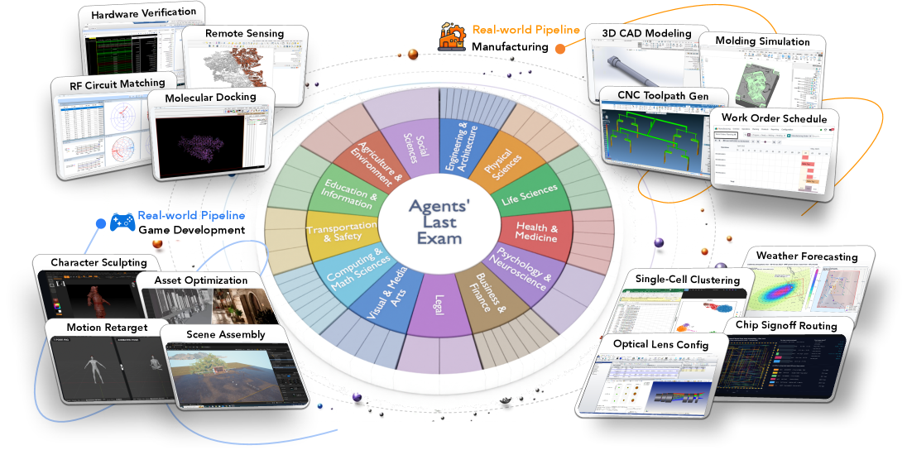

### TL;DR

A benchmark designed for **long-horizon, economically valuable, real-world tasks with verifiable outcomes**. Built with 250+ industry experts from 88 institutions, ALE covers non-physical industries grounded in the U.S. O*NET / SOC 2018 occupational taxonomy — 13 industry clusters, 55 sub-fields, 1K+ tasks. The framing: benchmark gains haven't translated into deployment because we benchmark the wrong things.

### Key idea

Map evaluation directly to the **occupational taxonomy that economists already use**. Each task is a unit of professional work that an actual practitioner would charge for, with a verifiable outcome the practitioner could check. Avoids the "saturated academic benchmark with no economic correlate" problem of MMLU-style tests.

### Main finding

ALE itself is the contribution; the paper introduces the dataset and protocol rather than chasing a SOTA number. Frontier-agent performance on long-horizon, multi-hour professional tasks remains far below human-expert ceilings — the headline gap is what motivates the benchmark.

### Why it matters

Reframes "is this agent useful" as "can it do work an industry expert would pay for". Co-developed with the experts who *define* the tasks rather than ML researchers approximating them. Likely to become a reference benchmark for frontier-lab agent reports.

### Knowledge graph integration

**Builds on / relates to existing pages:**
- [../evaluation/README.md](../evaluation/README.md) — extends the agent-eval cluster into the economic-task regime.
- [../agents/README.md](../agents/README.md) — defines the long-horizon professional-task setting agent training should target.

**Suggested new pages:**
- `evaluation/ale.md` *(depth)* — the benchmark, taxonomy, scoring.
- `evaluation/_agent-benchmarks.md` *(taxonomy)* — overview class for SWE-bench, WebArena, ALE, SpatialWorld, OmniGameArena, GAIA.

---

## 2. SWE-Explore

**Authors:** Shaoqiu Zhang, Yuhang Wang, Jialiang Liang, Yuling Shi, Wenhao Zeng, Maoquan Wang, Shilin He, Ningyuan Xu, Siyu Ye, Kai Cai, Xiaodong Gu — *Shanghai Jiao Tong U. / Xinjiang U. / UIUC / CUHK*
**Links:** [arXiv:2606.07297](https://arxiv.org/abs/2606.07297) · [HF](https://huggingface.co/papers/2606.07297) · [AlphaXiv](https://www.alphaxiv.org/abs/2606.07297)
**Topics:** `eval`, `agents`, `code`

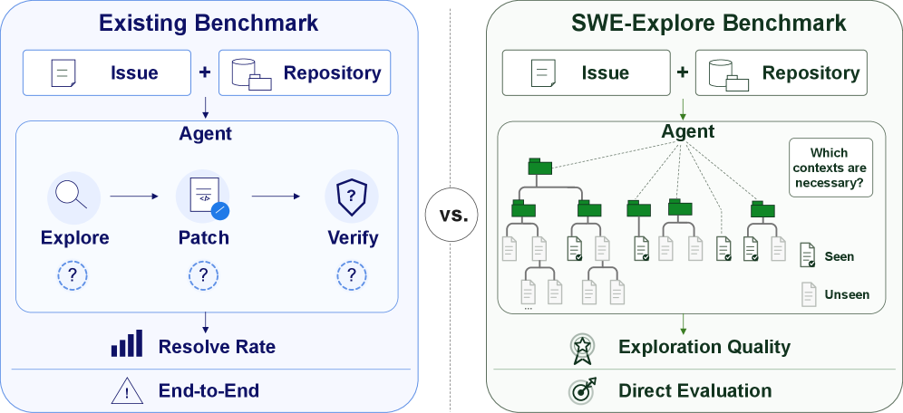

### TL;DR

Isolates the **repository exploration** sub-skill out of SWE-bench-style end-to-end evaluation. Given a repo and an issue, the agent returns a ranked list of relevant code regions under a fixed line budget. 848 issues across 10 languages and 203 repos, with line-level ground truth distilled from successful solver trajectories.

### Key idea

Rather than rewarding only "did the patch land?", measure **how the agent's localization tier compares against an oracle of agents that did solve the same issue**. The reference exploration trajectory is the union/intersection of code regions touched by independent successful solver runs — a behavioral ground truth, not a hand-annotated one.

### Main finding

Agentic explorers form a clear tier above classical retrieval methods. File-level localization is largely solved by modern methods, but **line-level coverage and efficient ranking remain the differentiator** between SOTA explorers. Exploration metrics strongly track downstream repair quality.

### Why it matters

Disaggregates SWE-bench so improvements in *retrieval* vs *patch generation* vs *test-time reasoning* are individually measurable. Makes it possible to optimize exploration in isolation, then plug into any patch-generation system.

### Knowledge graph integration

**Builds on / relates to existing pages:**
- [../evaluation/README.md](../evaluation/README.md) — sits alongside the code-benchmarks cluster (HumanEval, LiveCodeBench).
- [../agents/README.md](../agents/README.md) — defines a sub-skill of coding-agent capability.

**Suggested new pages:**
- `evaluation/swe-explore.md` *(depth)* — benchmark, oracle construction, metrics.

---

## 3. On the Geometry of On-Policy Distillation

**Authors:** Zhennan Shen, Yanshu Li, Qingyu Yin, Chak Tou Leong, Zhilin Wang, Yanxu Chen, Rongduo Han, Sunbowen Lee, Yi R. Fung — *HKUST / UT Austin / Zhejiang U. / HK PolyU / USTC / BUPT / Nankai / BIT*
**Links:** [arXiv:2606.07082](https://arxiv.org/abs/2606.07082) · [HF](https://huggingface.co/papers/2606.07082) · [AlphaXiv](https://www.alphaxiv.org/abs/2606.07082)
**Topics:** `post-training`, `distillation`, `reasoning`, `interp`

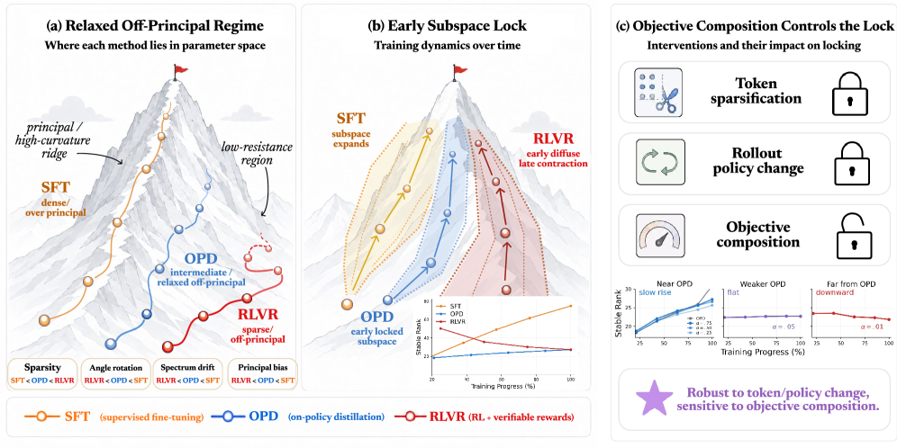

### TL;DR

Characterizes **on-policy distillation (OPD)** as occupying its own update geometry in parameter space — distinct from both SFT and RLVR rather than being an intermediate. A suite of parameter-space diagnostics places OPD in a *relaxed off-principal regime*: fewer affected weights than SFT, looser constraints than RLVR.

### Key idea

Diagnose training by what *subspace* the cumulative updates live in. OPD exhibits **subspace locking**: updates rapidly enter a narrow low-dimensional channel, and constraining training to that early-formed subspace preserves OPD performance but tanks SFT — evidence the locked subspace is functionally sufficient *for OPD specifically*.

### Main finding

Three concrete claims with control experiments: (1) sparsifying update tokens preserves rank dynamics, (2) shifting rollouts off-policy preserves them, (3) mixing OPD with RLVR changes them. Together this says OPD is its own update mode, not a hybrid.

### Why it matters

Suggests OPD-friendly tooling (low-rank adapters tailored to the locked subspace, principled early-stopping via subspace saturation, transfer between checkpoints via subspace-aligned merging) and reframes the SFT→OPD→RLVR pipeline as three distinct geometric regimes worth picking between, not a linear ladder.

### Knowledge graph integration

**Builds on / relates to existing pages:**
- [../post-training/_post-training.md](../post-training/_post-training.md) — adds OPD as a distinct regime in the post-training taxonomy.
- [../post-training/rlvr.md](../post-training/rlvr.md) — directly contrasts with RLVR update geometry.
- [../post-training/grpo.md](../post-training/grpo.md) — RLVR baseline used for comparison.
- [../post-training/cot-reward-model.md](../post-training/cot-reward-model.md) — OPD pattern (student rollouts under teacher supervision) is structurally similar.

**Suggested new pages:**
- `post-training/on-policy-distillation.md` *(depth)* — the OPD objective, subspace locking finding.

---

## 4. LatentSkill

**Authors:** Aofan Yu, Chenyu Zhou, Tianyi Xu, Zihan Guo, Rong Shan, Zhihui Fu, Jun Wang, Weiwen Liu, Yong Yu, Weinan Zhang, Jianghao Lin — *SJTU / Sun Yat-Sen / Shanghai Innovation Institute / OPPO*
**Links:** [arXiv:2606.06087](https://arxiv.org/abs/2606.06087) · [HF](https://huggingface.co/papers/2606.06087) · [AlphaXiv](https://www.alphaxiv.org/abs/2606.06087)
**Topics:** `agents`, `LoRA`, `hypernetwork`, `fine-tuning`

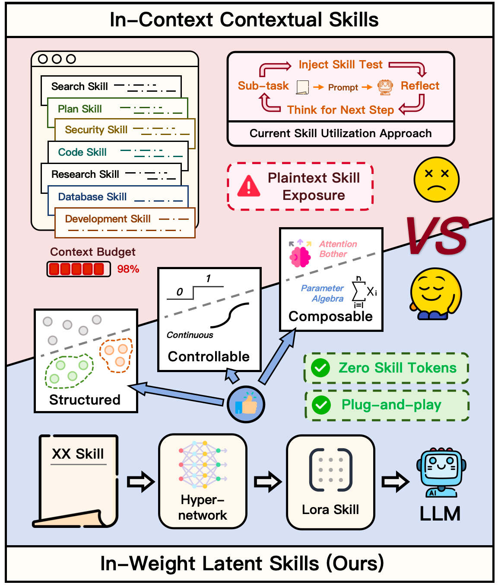

### TL;DR

Converts **textual procedural skills** (the chunks of recipe-style task knowledge agents currently re-inject via long prompts) into **modular adapter weights** via a hypernetwork. Skills live in weight space, loadable / composable / scalable — no per-step skill tokens in context.

### Key idea

A hypernetwork ingests a skill description and emits adapter weights for the base LLM. At inference the agent loads the relevant skill's adapter rather than re-prompting with the skill text. Composition is parameter-space addition; injection strength is a scalar.

### Main finding

**+21.4 ALFWorld points with 64.1% fewer prefill tokens** vs the in-context-skill baseline, on a frozen base model. Skills compose without retraining; injection strength gives a controllable knob.

### Why it matters

Latent-skill adapters are a credible answer to the **context-bloat problem** that agent systems hit when they accumulate dozens of procedural skills. Decouples skill memory from context window, which is the natural shape for long-running, multi-skill agents.

### Knowledge graph integration

**Builds on / relates to existing pages:**
- [../agents/README.md](../agents/README.md) — addresses the long-running skill-accumulation regime.
- [../post-training/fine-tuning/README.md](../post-training/fine-tuning/README.md) — adapter generation generalizes LoRA-style PEFT to per-skill, hypernetwork-emitted weights.

**Suggested new pages:**
- `agents/latent-skill-adapters.md` *(depth)* — the hypernetwork → adapter recipe and composition rules.

---

## 5. Mirage

**Authors:** Weijie Wang, Haoyu Zhao, Yifan Yang, Feng Chen, Zeyu Zhang, Yefei He, Zicheng Duan, Donny Y. Chen, Yuqing Yang, Bohan Zhuang — *Zhejiang U. / Microsoft Research / Adelaide / Monash*
**Links:** [arXiv:2606.09828](https://arxiv.org/abs/2606.09828) · [HF](https://huggingface.co/papers/2606.09828) · [AlphaXiv](https://www.alphaxiv.org/abs/2606.09828)
**Topics:** `diffusion`, `video`, `multimodal`, `world-models`

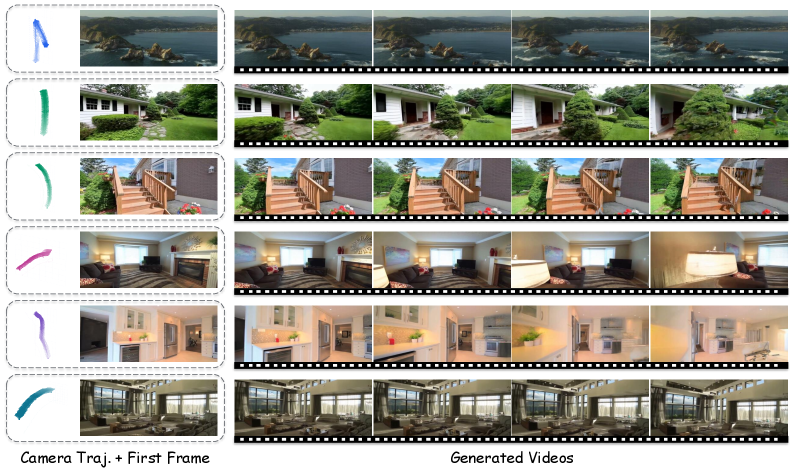

### TL;DR

A **3D latent cache** for video world models: store diffusion latents at world-space coordinates rather than RGB colors, then read out memory via a single latent-resolution projection. Removes the costly pixel-space round-trip that previous spatial-memory schemes used.

### Key idea

Encode persistent world state directly in the model's own latent space and index it by 3D coordinate. When the camera revisits a location, project the cached latents back into the diffusion input — no decoder, no re-encode.

### Main finding

**10.57× faster generation, 55× lower GPU memory** vs RGB point-cloud spatial-memory baselines, with geometric consistency preserved. Demonstrated on the action-conditioned video world model setting (first-frame + text + camera path → multi-segment video).

### Why it matters

The "memory" axis of video world models is the bottleneck for long-horizon coherence. Mirage's latent-space caching makes spatial memory cheap enough to be the default rather than the expensive option, opening the door to longer rollouts at the same compute budget.

### Knowledge graph integration

**Builds on / relates to existing pages:**
- [../multimodal/README.md](../multimodal/README.md) — extends video generation with persistent state.

*Borderline: included because the latent-cache pattern is structurally analogous to KV-cache designs in LLM serving and may transfer.*

---

## 6. FlashMemory-DeepSeek-V4

**Authors:** Qifan Zhang, Jiachen Yu, Tian Liang, Dongyang Ma, Xiang Hu, Zibo Lin, Chunyang Li, Zhichao Wang, Jia Li, Yujiu Yang, Haitao Mi, Dong Yu, Yan Wang — *Tencent / HKUST(GZ) / Tsinghua / Independent*
**Links:** [arXiv:2606.09079](https://arxiv.org/abs/2606.09079) · [HF](https://huggingface.co/papers/2606.09079) · [AlphaXiv](https://www.alphaxiv.org/abs/2606.09079)
**Topics:** `inference`, `architectures`, `long-context`, `sparse-attention`

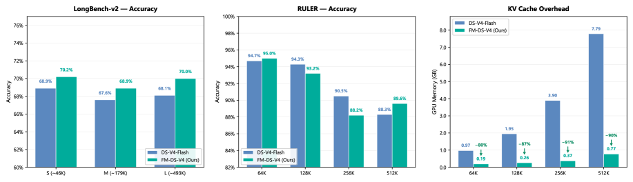

### TL;DR

A long-context inference paradigm — **Lookahead Sparse Attention (LSA)** — built on DeepSeek-V4-Flash. A Neural Memory Indexer predicts which KV-cache pages will be needed in the upcoming decode window, so only relevant KV pages are loaded; cuts decoding memory pressure dramatically while preserving accuracy.

### Key idea

Don't keep the full KV cache hot. Train a lightweight **indexer** that, given the current decode state, predicts a sparse set of KV-cache pages needed for the next few steps. Pre-fetch those pages, run sparse attention against them — *lookahead* sparsity replaces the dense-attention default.

### Main finding

GPU memory drops to **~13.5% of the dense baseline** for ultra-long-context decoding, with the V4-Flash architecture retained. Headlined as an enhancement layer on top of DeepSeek-V4, not a new base architecture.

### Why it matters

KV-cache memory is the hard ceiling on long-context serving cost. Learned sparse attention with a memory indexer is the most credible path to making million-token contexts cheap to serve. The DeepSeek-V4 substrate also makes this a reference design for the next generation of MoE-with-MLA inference stacks.

### Knowledge graph integration

**Builds on / relates to existing pages:**
- [../architectures/mla.md](../architectures/mla.md) — DeepSeek-V4 inherits the MLA attention design.
- [../case-studies/deepseek-v3.md](../case-studies/deepseek-v3.md) — extends the DeepSeek inference lineage.
- [../inference/README.md](../inference/README.md) — concretizes the KV-cache compression slot.

**Suggested new pages:**
- `architectures/lookahead-sparse-attention.md` *(depth)* — the indexer + page-level sparse attention design.
- `inference/_kv-cache-compression.md` *(taxonomy)* — overview of KV-cache reduction (eviction, quantization, sparse retrieval, encoder-decoder compression).

---

## 7. SpatialWorld

**Authors:** Hongcheng Gao, Hailong Qu, Jingyi Tang, Jiahao Wang, Zihao Huang, Hengkang Qiao et al. — *Tsinghua / Chongqing U. / Peking U. / ZenoMind AI / Xi'an JTU / BIT / Southeast U. / SJTU / HKU*
**Links:** [arXiv:2606.09669](https://arxiv.org/abs/2606.09669) · [HF](https://huggingface.co/papers/2606.09669) · [AlphaXiv](https://www.alphaxiv.org/abs/2606.09669)
**Topics:** `eval`, `multimodal`, `agents`

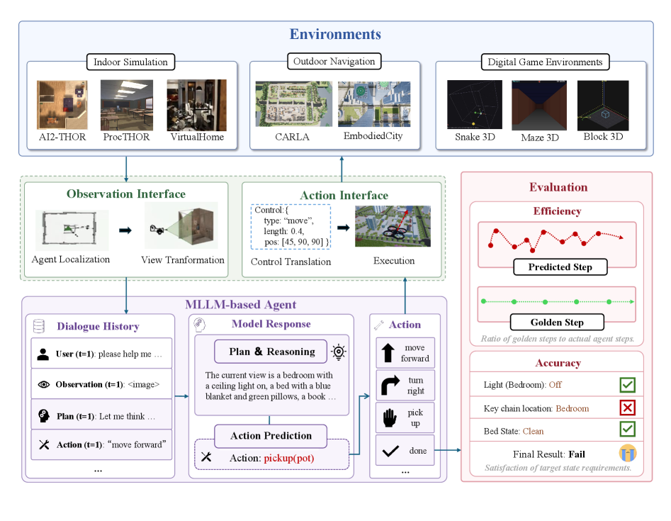

### TL;DR

A simulator-agnostic benchmark for **interactive spatial reasoning** in MLLM agents. 760 human-annotated tasks across 8 simulator backends under vision-only partial observability. Agents must explore, gather egocentric visual evidence, and act through a unified text-based action interface.

### Key idea

Make the benchmark **simulator-agnostic** by defining a shared text-action interface that any MLLM can use without per-environment training. Evaluate via terminal-state verifiers rather than per-step labels, so partial-observability reasoning is what's actually measured.

### Main finding

The strongest model (GPT-5) achieves only **17.4% task success**; leading open-source (Qwen-3.5) hits **14.1%**. The active-exploration / long-horizon-planning gap is the clearly visible bottleneck.

### Why it matters

Embodied-agent evaluation usually couples the simulator and the agent; SpatialWorld decouples them. Anyone training an MLLM-agent can plug in. The terminal-state-verifier protocol also offers a clean reward signal for RL training, not just eval.

### Knowledge graph integration

**Builds on / relates to existing pages:**
- [../evaluation/README.md](../evaluation/README.md) — extends agent-eval into embodied-spatial tasks.
- [../multimodal/README.md](../multimodal/README.md) — defines what active visual exploration looks like for VLMs.

**Suggested new pages:**
- `evaluation/spatialworld.md` *(depth)* — the protocol, simulators, scoring.

---

## 8. Human Psychometric Questionnaires Mischaracterize LLM Behavior

**Authors:** Woojung Song, Dongmin Choi, Yoonah Park, Jongwook Han, Eun-Ju Lee, Yohan Jo — *Seoul National University*
**Links:** [arXiv:2509.10078](https://arxiv.org/abs/2509.10078) · [HF](https://huggingface.co/papers/2509.10078) · [AlphaXiv](https://www.alphaxiv.org/abs/2509.10078)
**Topics:** `eval`, `safety`, `interp`

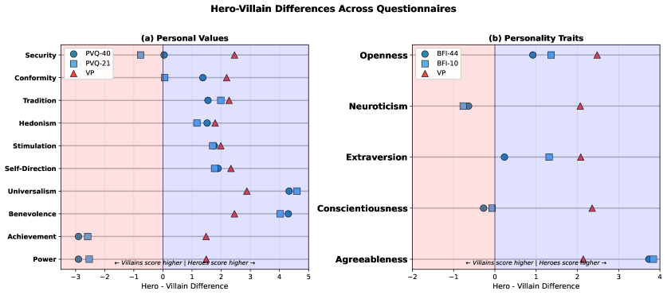

### TL;DR

Eight open-source LLMs are compared along two evaluation modes: **Likert self-reports** on standard psychometric questionnaires (PVQ-40/21, BFI-44/10) vs **generation probabilities over value-laden responses to everyday user queries**. The two profiles **diverge substantially** — questionnaire-derived personas don't predict behavior in actual user-facing interactions.

### Key idea

Treat Likert-style self-report as one operationalization of an LLM's "values", and free-form generation behavior as another. Measure the *correlation* between them across eight models — and find that it's weak.

### Main finding

Across models and across both value (PVQ) and personality (BFI) instruments, the questionnaire profile and the generation profile **systematically disagree**. The cleanest possible critique of LLM-personality / values-eval methodology that uses borrowed psychometric instruments.

### Why it matters

Lots of safety, alignment, and red-teaming work relies on questionnaires to characterize models. If those questionnaires don't predict in-context behavior, the conclusions are suspect. Points the field toward **behavioral** value evaluation rather than self-report.

### Knowledge graph integration

**Builds on / relates to existing pages:**
- [../evaluation/README.md](../evaluation/README.md) — methodology-critique paper for the LLM-eval cluster.
- [../safety/README.md](../safety/README.md) — undermines a common safety-eval approach (alignment surveys, value polls).

**Suggested new pages:**
- `evaluation/llm-psychometric-mismatch.md` *(depth)* — the self-report-vs-behavior divergence finding.

---

## 9. OmniGameArena

**Authors:** Mingxian Lin, Shengju Qian, Yuqi Liu, Yi-Hua Huang, Yiyu Wang, Wei Huang, Yitang Li, Fan Zhang, Zeyu Hu, Lingting Zhu, Xin Wang, Xiaojuan Qi — *HKU / LIGHTSPEED / CUHK / Tsinghua*
**Links:** [arXiv:2606.09826](https://arxiv.org/abs/2606.09826) · [HF](https://huggingface.co/papers/2606.09826) · [AlphaXiv](https://www.alphaxiv.org/abs/2606.09826)
**Topics:** `eval`, `agents`, `multimodal`

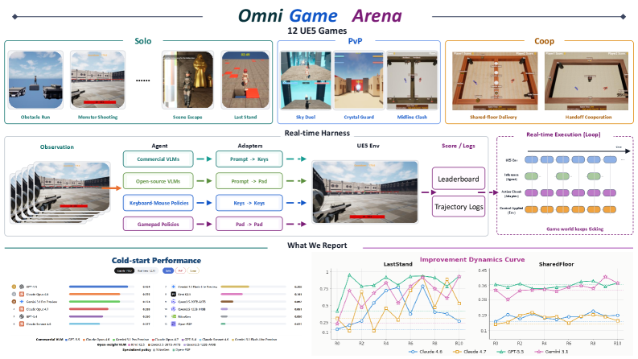

### TL;DR

A **UE5-based real-time benchmark** of 12 new games (7 Solo / 3 PvP / 2 Coop) with a unified action interface for VLM agents, plus an **Improvement Dynamics Curve (IDC)** — an agentic-reflection harness in which a tool-using reflector LLM autonomously refines a bounded skill prompt across rounds.

### Key idea

Replace the "single first-attempt score" convention with a **trajectory of scores across reflection rounds**. The IDC turns "how well does the agent learn in-context within one task" into the headline metric, exposing improvement dynamics, not just one-shot capability.

### Main finding

Unified protocol fairly compares commercial VLMs, open-weight VLMs, and specialized game policies on the same footing. IDC curves reveal large differences in *how* agents improve, even when their first-attempt scores match.

### Why it matters

A reusable harness for measuring *test-time learning dynamics*, not just static capability. Aligns with the broader push toward agents that improve in-context across rounds without weight updates.

### Knowledge graph integration

**Builds on / relates to existing pages:**
- [../evaluation/README.md](../evaluation/README.md) — extends agent-eval into game environments.
- [../agents/README.md](../agents/README.md) — reflector-harness pattern is an agent-architecture design point.

**Suggested new pages:**
- `evaluation/omnigamearena.md` *(depth)* — benchmark, IDC metric, protocol.

---

## 10. LCLMs

**Authors:** Ang Li, Sean McLeish, Haozhe Chen, Nimit Kalra, Zaiqian Chen, Artem Gazizov, Venkata Anoop Suhas Kumar Morisetty, Bhavya Kailkhura, Harshitha Menon, Zhuang Liu, Brian R. Bartoldson, Tom Goldstein, Sanae Lotfi, Micah Goldblum, Pavel Izmailov — *NYU / Modal Labs / U. Maryland / Princeton / Columbia / Harvard / LLNL / FAIR at Meta*
**Links:** [arXiv:2606.09659](https://arxiv.org/abs/2606.09659) · [HF](https://huggingface.co/papers/2606.09659) · [AlphaXiv](https://www.alphaxiv.org/abs/2606.09659)
**Topics:** `inference`, `long-context`, `agents`

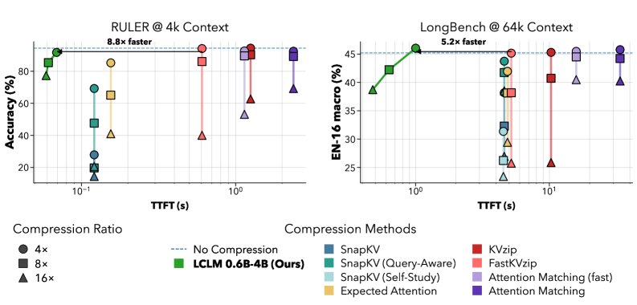

### TL;DR

**Latent Context Language Models (LCLMs)** — a family of encoder-decoder compressors (0.6B encoder, 4B decoder) trained on 350B tokens each at compression ratios 1:4 / 1:8 / 1:16. Maps a long token sequence to a shorter sequence of latent embeddings the decoder reads, *closing the gap* with KV-cache compression on the accuracy-efficiency frontier.

### Key idea

Re-do the encoder-decoder compressor design from scratch with an architecture search, then pretrain *the compressor and the decoder together* at production scale. Past encoder-decoder compressors fell behind KV-cache methods because they were under-trained; LCLMs show the gap closes with scale.

### Main finding

LCLMs improve the **Pareto frontier across general-task performance, compression speed, and peak memory**. Crucially, the compressed latent serves as a backbone for **long-horizon agents** that skim through compressed context and adaptively re-expand relevant segments on demand.

### Why it matters

KV-cache compression and encoder-decoder compression were treated as separate roads to long-context serving. LCLMs show encoder-decoder is competitive once you spend the pretraining budget — and uniquely supports the *agent-skimming* use case (you can't skim a KV cache the way you can skim latents).

### Knowledge graph integration

**Builds on / relates to existing pages:**
- [../inference/README.md](../inference/README.md) — concretizes encoder-decoder context compression as an inference strategy.
- [../agents/README.md](../agents/README.md) — provides a substrate for long-horizon agent context management.

**Suggested new pages:**
- `inference/lclm.md` *(depth)* — the encoder-decoder context compressor recipe.
- `inference/_kv-cache-compression.md` *(taxonomy)* — KV eviction vs KV quantization vs encoder-decoder compression.

---

## 11. A Geometric Account of Activation Steering through Angle–Norm Decomposition

**Authors:** Georgii Aparin, Tatiana Gaintseva — *Huawei Noah's Ark Lab / Queen Mary U. London*
**Links:** [arXiv:2606.06735](https://arxiv.org/abs/2606.06735) · [HF](https://huggingface.co/papers/2606.06735) · [AlphaXiv](https://www.alphaxiv.org/abs/2606.06735)
**Topics:** `interp`, `steering`

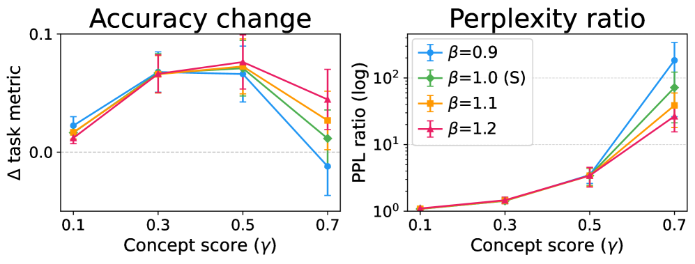

### TL;DR

Decomposes activation steering into **angular** (alignment with a concept direction) and **radial** (hidden-state norm) components, then runs a controlled study across seven LLMs. Concepts are primarily *angular*, justifying spherical steering paradigms — but **norm matters** for stability and downstream behavior, contradicting the assumption it's irrelevant.

### Key idea

Stop parameterizing steering by a single scalar coefficient that entangles angle and norm. Re-parameterize by **interpretable angular and radial components** so the two effects can be controlled (and ablated) independently.

### Main finding

Steering methods that achieve similar concept-level effects can behave very differently downstream because they couple angle and norm changes in different proportions. Norm is not concept-relevant but *is* stability-relevant.

### Why it matters

Resolves a real disagreement in the interp/steering literature about whether norm carries concept information. Gives practitioners a cleaner intervention design — separate angular knob, separate radial knob — and explains why prior "equivalent" methods produce different outputs.

### Knowledge graph integration

**Builds on / relates to existing pages:**
- [../interpretability/README.md](../interpretability/README.md) — formalizes the steering / activation-intervention slot.
- [../safety/refusal-suppression.md](../safety/refusal-suppression.md) — refusal directions are a canonical activation-steering target; angle-norm framing applies directly.

**Suggested new pages:**
- `interpretability/activation-steering.md` *(depth)* — the angle-norm decomposition and parameterization.

---

## 12. Bayesian-Agent

**Authors:** Xiaojun Wu, Cehao Yang, Honghao Liu, Xueyuan Lin, Wenjie Zhang, Zhichao Shi, Xuhui Jiang, Chengjin Xu, Jia Li, Jian Guo — *IDEA Research / HKUST(GZ) / DataArcTech*
**Links:** [arXiv:2606.08348](https://arxiv.org/abs/2606.08348) · [HF](https://huggingface.co/papers/2606.08348) · [AlphaXiv](https://www.alphaxiv.org/abs/2606.08348)
**Topics:** `agents`, `harness`, `frozen-weights`

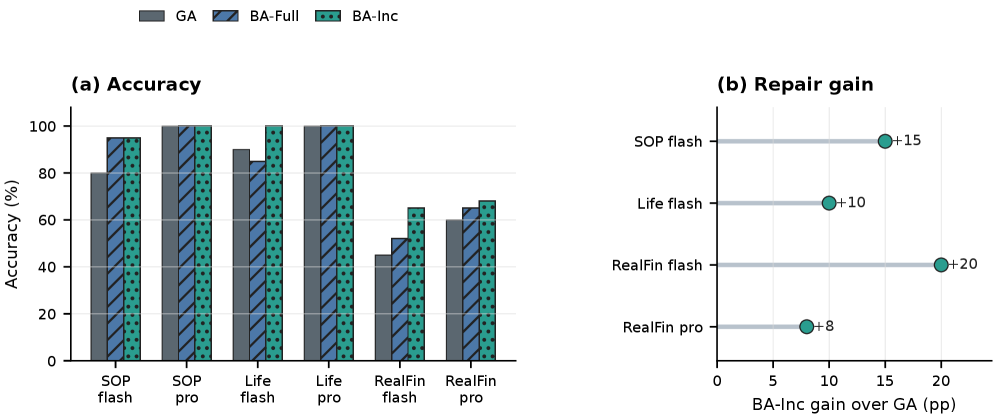

### TL;DR

Treats reusable agent skills and SOPs as **Bayesian hypotheses** about whether a *frozen* base model will succeed under a given prompt, context, and harness. Records verified trajectory evidence, maintains a feature-conditioned posterior per skill, then maps posterior state into actions: *patch, split, compress, retire, explore*.

### Key idea

Replace heuristic reflection ("reuse what worked, drop what failed") with **calibrated posterior updates** over per-skill success rates. Posterior state becomes the trigger for harness operations, and posterior summaries become an audit trail.

### Main finding

With DeepSeek-V4-Flash frozen, incremental repair lifts **SOP-Bench 80 → 95%**, **Lifelong AgentBench 90 → 100%**, **RealFin-Bench 45 → 65%**. Demonstrated across native, GenericAgent, mini-swe-agent, and Claude Code backends.

### Why it matters

Reframes agent improvement as **posterior-guided harness optimization** rather than weight updates. Useful where weights are frozen (proprietary models, deployed APIs), and the audit trail is a credible answer to the "why does this skill exist?" question.

### Knowledge graph integration

**Builds on / relates to existing pages:**
- [../agents/README.md](../agents/README.md) — harness-optimization slot for frozen-model agents.
- [../post-training/_post-training.md](../post-training/_post-training.md) — counterpart to weight-update post-training (no weight changes).

**Suggested new pages:**
- `agents/bayesian-harness.md` *(depth)* — posterior over skills, harness actions, audit trail.

---

## 13. Whisper Hallucination Detection via Hidden Representation Steering and SAEs

**Authors:** Aparin Popov, Tasnima Sadekova, Vadim Yermekova, Assel — *AI Foundation and Algorithm Lab / MISIS / HSE*
**Links:** [arXiv:2606.07473](https://arxiv.org/abs/2606.07473) · [HF](https://huggingface.co/papers/2606.07473) · [AlphaXiv](https://www.alphaxiv.org/abs/2606.07473)
**Topics:** `interp`, `multimodal`, `safety`, `SAE`

### TL;DR

Trains **sparse autoencoders on Whisper encoder activations**, finds hallucination-related features in a sparse subset, then steers via SAE latents to **cut hallucination rate from 72.6% → 14.1% (small) and 86.9% → 27.3% (large-v3)** with minimal WER hit.

### Key idea

The SAE decomposition exposes specific hallucination-linked features that aren't cleanly visible in raw activations. Targeted steering on those SAE latents — rather than additive steering vectors in raw activation space — is what unlocks the big swing.

### Main finding

Both raw activations and SAE latents linearly separate hallucinations, but the SAE space concentrates the signal in a few features. **SAE steering produces a >5× hallucination-rate drop on Whisper large-v3** with negligible accuracy loss.

### Why it matters

A clean transfer of LLM-interp tooling (SAEs, activation steering) to a different modality (ASR). Generalizes the "hallucination has a circuit, find it and intervene" pattern beyond text generation.

### Knowledge graph integration

**Builds on / relates to existing pages:**
- [../interpretability/README.md](../interpretability/README.md) — adds SAE-based steering to the interp toolkit.
- [../multimodal/README.md](../multimodal/README.md) — extends interp tools to ASR.

**Suggested new pages:**
- `interpretability/sae.md` *(depth)* — what SAEs are, training recipe, feature extraction.
- `interpretability/_steering.md` *(taxonomy)* — additive vs spherical vs SAE-latent steering.

---

## 14. Why Muon Outperforms Adam: A Curvature Perspective

**Authors:** Shuche Wang, Fengzhuo Zhang, Jiaxiang Li, Dirk Bergemann, Zhuoran Yang — *NUS / Yale / U. Minnesota*
**Links:** [arXiv:2606.04662](https://arxiv.org/abs/2606.04662) · [HF](https://huggingface.co/papers/2606.04662) · [AlphaXiv](https://www.alphaxiv.org/abs/2606.04662)
**Topics:** `fundamentals`, `optimizers`, `pre-training`

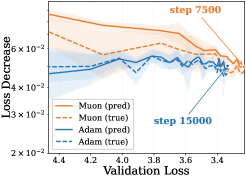

### TL;DR

Explains Muon's ~2× training-efficiency advantage over Adam through a **second-order Taylor expansion** of the training landscape. First-order gains are comparable; Muon's edge comes from **lower second-order curvature penalty** — i.e., it picks step directions that incur less loss-curvature cost per unit step.

### Key idea

At matched validation loss, decompose each optimizer's one-step loss decrease into (first-order linear gain) + (second-order curvature penalty). Adam and Muon look similar on the linear term — they diverge on how much curvature their steps eat.

### Main finding

Muon's larger one-step loss decrease comes from the **curvature term**, not the gradient term. This is consistent with the spectral-normalization view of Muon (steps act as orthogonalized matrices), which controls how the step interacts with the Hessian.

### Why it matters

Demystifies Muon, which has eaten Adam's lunch on LLM pretraining but lacked a satisfying *why*. The curvature framing also suggests when Muon won't help — landscapes where curvature isn't the bottleneck — and where its advantage will be largest.

### Knowledge graph integration

**Builds on / relates to existing pages:**
- [../fundamentals/README.md](../fundamentals/README.md) — fills the optimizer-comparison gap.
- [../pre-training/_training-stability.md](../pre-training/_training-stability.md) — Muon already referenced as an optimizer axis; this paper grounds the choice.
- [../pre-training/_lr-schedules.md](../pre-training/_lr-schedules.md) — same.

**Suggested new pages:**
- `fundamentals/muon.md` *(depth)* — Muon optimizer mechanics + the curvature-perspective analysis.
- `fundamentals/_optimizers.md` *(taxonomy)* — SGD / Adam / AdamW / Muon / Lion / Shampoo with tradeoff table.

---

## Notes

- Borderline inclusions are flagged in-section with an italic *Borderline: …* note.
- Hero figures live in `assets/2026-06-09/`. The Whisper-SAE paper has no figure (the available arXiv-html URL did not return a valid image).
- This digest is informational. No existing concept files, `READING-LIST.md`, or `PAPERS.md` were modified to produce it.
