# Daily AI papers — 2026-06-11

*Curated from HF Daily Papers. 15 of ~42 papers kept after relevance filter.*

## Papers at a glance

| # | Title | Topics | Org |
| --- | --- | --- | --- |
| 1 | [Arbor: Generalist Autonomous Research via Hypothesis-Tree Refinement](#1-arbor) | `agents`, `RL`, `eval` | Renmin U. / Microsoft Research |
| 2 | [Redesign MoE Routers with Manifold Power Iteration](#2-mpi-router) | `MoE`, `architectures` | Renmin U. / Tencent |
| 3 | [Claw-SWE-Bench: Standardizing Agent Harness Comparison on SWE Tasks](#3-claw-swe-bench) | `eval`, `agents`, `code` | TokenRhythm / Infinigence / Tsinghua |
| 4 | [Agentic Environment Engineering — A Survey](#4-agent-environment-survey) | `agents`, `survey` | Chinese Academy of Sciences |
| 5 | [Z-Reward: Beyond Scalar Rewards via Distributional Reasoning](#5-z-reward) | `rewards`, `RL`, `diffusion` | Alibaba (Z-Image) / Nankai |
| 6 | [ReRe: Cross-View Revisiting for Spatial Reasoning](#6-rere) | `reasoning`, `multimodal` | (academic consortium) |
| 7 | [DeNovoSWE: Scaling Whole-Repository Generation Data](#7-denovoswe) | `agents`, `data`, `SFT` | Renmin U. / ByteDance |
| 8 | [World Pilot: Steering VLA Models with World-Action Priors](#8-world-pilot) | `multimodal`, `VLA` | CAS / Beihang |
| 9 | [On Subquadratic Architectures: Mamba-2 vs xLSTM vs Gated DeltaNet](#9-subquadratic) | `architectures`, `SSM` | JKU Linz / ELLIS |
| 10 | [InternVideo3: Multimodal Contextual Reasoning + M²LA](#10-internvideo3) | `multimodal`, `agents`, `attention` | Shanghai AI Lab |
| 11 | [CodeSpear: Grammar-Constrained Decoding Can Jailbreak LLMs](#11-codespear) | `safety`, `jailbreak`, `code` | Tsinghua |
| 12 | [Bebop: Accelerating RL Rollouts with MTP + Rejection Sampling](#12-bebop) | `RL`, `efficient-inference`, `MTP` | Qwen / Alibaba |
| 13 | [Reroute, Don't Remove: Recoverable Visual Token Routing for VLMs](#13-reroute) | `efficient-inference`, `multimodal` | NYCU / NTU |
| 14 | [TRACE: Unified Rollout Budget Allocation for Agentic RL](#14-trace) | `RL`, `agents`, `systems` | Tsinghua / Tencent |
| 15 | [ICA Lens: Interpretable Directions Without Training Another Dictionary](#15-ica-lens) | `interp`, `SAE` | (academic) |

---

## 1. Arbor

**Authors:** Yuyang Hu, Kai Qiu, Qi Dai, Chong Luo, Guanting Dong, Xiaoxi Li, et al. — *Gaoling School of AI, Renmin University of China · Microsoft Research*
**Links:** [arXiv:2606.11926](https://arxiv.org/abs/2606.11926) · [HF](https://huggingface.co/papers/2606.11926) · [AlphaXiv](https://www.alphaxiv.org/abs/2606.11926)
**Topics:** `agents`, `RL`, `eval`

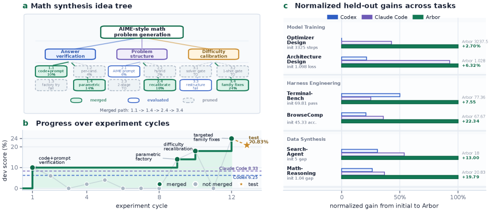

### TL;DR

An autonomous research agent that treats long-horizon experimentation as a persistent search problem. A long-lived **coordinator** manages a **Hypothesis Tree** that links hypotheses → artifacts → evidence → distilled "lessons" across time, while short-lived **executors** implement and test individual hypotheses in isolated git worktrees. Verified improvements are admitted back into the tree; failed ones leave behind reusable lessons for future branches.

### Key idea

**Hypothesis Tree Refinement (HTR)** — a persistent, mutable tree where each node is a research hypothesis, and edges carry the artifacts, evidence, and distilled "lessons" produced by testing that hypothesis. The coordinator runs a search-tree-style policy over the tree (expand promising branches, prune failed ones), while executors run hypotheses in **isolated worktrees** so failed experiments don't pollute the main artifact. Lessons propagate up — a failure in branch *A* can shrink the search frontier of branch *B*.

### Main finding

Across **six** real research tasks (model training, harness engineering, data synthesis), Arbor wins held-out evaluation on all six, attaining **>2.5×** the average relative held-out gain of Codex and Claude Code under matched task interface and resource budget. On **MLE-Bench Lite**, Arbor + GPT-5.5 hits **86.36% Any-Medal**, SOTA in their comparison.

### Why it matters

Most "autonomous researcher" systems are flat ReAct loops that forget across attempts. Arbor introduces *cumulative* state — the tree carries learned constraints across long horizons, so the agent's effective exploration budget compounds. This is the structural move autonomous-science pipelines need before they can run for days without supervision.

### Knowledge graph integration

**Builds on / relates to existing pages:**
- [../agents/README.md](../agents/README.md) — slots into the agents cluster as a long-horizon autonomous-research recipe.
- [../post-training/reasoning/mcts.md](../post-training/reasoning/mcts.md) — HTR is a tree-search-like policy, but over *research hypotheses* rather than tokens or moves.
- [../post-training/rl-prompt-curation.md](../post-training/rl-prompt-curation.md) — distilled "lessons" are conceptually similar to curriculum-shaping signals.

**Suggested new pages:**
- `agents/hypothesis-tree-refinement.md` *(depth)* — the HTR mechanism, coordinator/executor split, lesson propagation.
- `agents/_autonomous-research.md` *(taxonomy)* — Arbor vs Codex vs Claude Code vs MLE-Bench agents.

---

## 2. MPI Router

**Authors:** Songhao Wu, Ang Lv, Ruobing Xie, Yankai Lin — *Gaoling School of AI, Renmin University of China · Large Language Model Department, Tencent*
**Links:** [arXiv:2606.12397](https://arxiv.org/abs/2606.12397) · [HF](https://huggingface.co/papers/2606.12397) · [AlphaXiv](https://www.alphaxiv.org/abs/2606.12397)
**Topics:** `MoE`, `architectures`

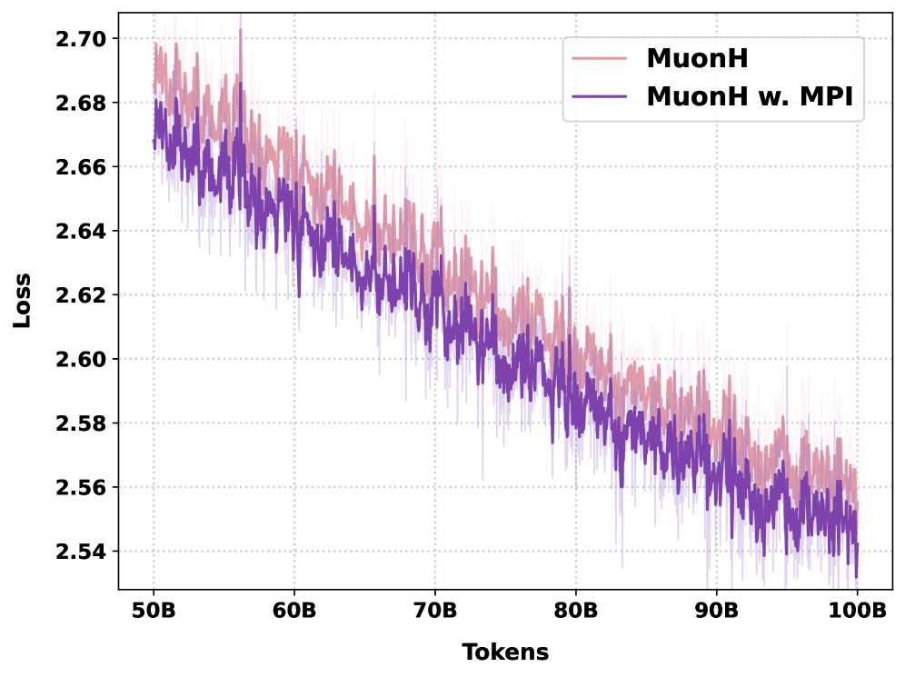

### TL;DR

A principled redesign of MoE router weights. Each router row should encode an entire expert FFN as a single representative vector — the authors argue that vector should be the **principal singular direction** of the expert's weight matrix, since that direction carries the most expressive description of the matrix. They enforce this with **Manifold Power Iteration (MPI)**: a "Power-then-Retract" step on the router weights that nudges each row toward its expert's top singular direction while a norm-preserving retraction keeps training stable.

### Key idea

Replace the standard learned router (a free linear map trained from scratch) with router rows that are **constrained to track the principal singular direction** of their assigned expert. Operationally: every few steps, apply one power-iteration update on the router rows using the expert weights, then retract back to a fixed-norm manifold. Theoretically they prove router rows converge to the principal singular directions; empirically they show this alignment improves MoE quality at pretraining time.

### Main finding

Pretrained MoE models from **1B to 11B parameters** with MPI routers consistently outperform vanilla MoE routers at the same compute. The contribution is a **drop-in router redesign** — no change to balancing loss, expert layout, or top-K logic.

### Why it matters

The MoE router has been mostly under-engineered relative to the experts it routes to. MPI says: align the router with the *math* of the experts, not a free-floating embedding. If this holds up at frontier scale, it's a near-free quality bump for every MoE pretraining run that adopts it — same FLOPs, same expert layout, better routing.

### Knowledge graph integration

**Builds on / relates to existing pages:**
- [../architectures/_moe.md](../architectures/_moe.md) — adds a new variant to the MoE taxonomy's "routing algorithm" axis.
- [../architectures/load-balancing-loss.md](../architectures/load-balancing-loss.md) — orthogonal to balancing; the two compose.
- [../architectures/aux-loss-free-balancing.md](../architectures/aux-loss-free-balancing.md) — both touch the router but address different failure modes (balance vs alignment).
- [../architectures/deepseek-moe.md](../architectures/deepseek-moe.md) — fine-grained MoE benefits most from a router that condenses each expert into one direction.

**Suggested new pages:**
- `architectures/mpi-router.md` *(depth)* — Power-then-Retract mechanism, theoretical convergence claim, scaling results.

---

## 3. Claw-SWE-Bench

**Authors:** Kai Han, Boxun Li, Haiyang Xu, Yuchuan Tian, et al. — *TokenRhythm · Infinigence AI · Tsinghua · PKU*
**Links:** [arXiv:2606.12344](https://arxiv.org/abs/2606.12344) · [HF](https://huggingface.co/papers/2606.12344) · [AlphaXiv](https://www.alphaxiv.org/abs/2606.12344)
**Topics:** `eval`, `agents`, `code`

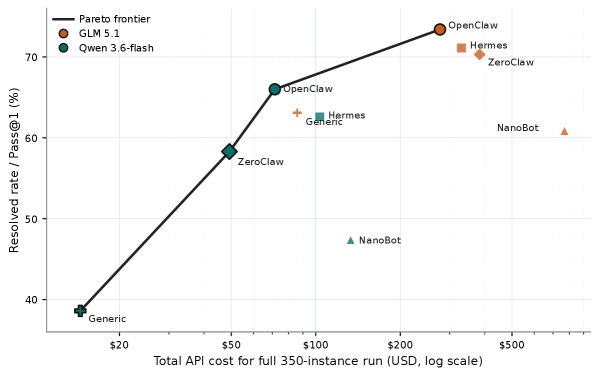

### TL;DR

SWE-bench evaluates *patches*, not agents — a generic OpenClaw-style harness can't be plugged in without violating SWE-bench's clean Docker workspace, patch, and prediction contract. Claw-SWE-Bench is a multilingual SWE-bench-style benchmark **plus an adapter protocol** that makes heterogeneous agent harnesses ("claws") directly comparable under a fixed prompt, runtime budget, workspace contract, patch extractor, and evaluator.

### Key idea

Separate the **agent harness** from the **task contract**. Instead of grading patches in isolation, Claw-SWE-Bench specifies an *adapter* that any agent (Codex, OpenClaw, Claude Code, custom) implements, then runs all agents under matched runtime budgets, workspace constraints, and a deterministic patch-extraction step. The result is a resolve-rate vs cost Pareto frontier where harness design choices become visible.

### Main finding

The benchmark is **multilingual** (not just Python) and surfaces a real harness-design Pareto: harnesses that look comparable at headline resolve rate can differ substantially in compute cost per resolved task. (Full numbers are paper-internal — the contribution is the protocol + the leaderboard, not a single model score.)

### Why it matters

The agent-eval space has fractured because every team brings its own harness. Claw-SWE-Bench is a step toward apples-to-apples evaluation of *agent systems*, the same way SWE-bench did for patch generation. Important for the broader "is the agent or the harness doing the work?" question.

### Knowledge graph integration

**Builds on / relates to existing pages:**
- [../evaluation/livecodebench.md](../evaluation/livecodebench.md) — adjacent code-eval benchmark, but single-shot rather than agentic.
- [../evaluation/humaneval.md](../evaluation/humaneval.md) — the canonical code-completion baseline this generation evolved past.
- [../agents/README.md](../agents/README.md) — slots into the agent-evaluation subspace.

**Suggested new pages:**
- `evaluation/_agent-coding-benchmarks.md` *(taxonomy)* — SWE-bench, Claw-SWE-Bench, SWE-bench-Verified, BeyondSWE-Doc2Repo.
- `evaluation/claw-swe-bench.md` *(depth)* — the adapter protocol, scoring contract, harness Pareto.

---

## 4. Agent-Environment Survey

**Authors:** Jiachun Li, Zhuoran Jin, Tianyi Men, Yupu Hao, et al. — *Institute of Automation, Chinese Academy of Sciences*
**Links:** [arXiv:2606.12191](https://arxiv.org/abs/2606.12191) · [HF](https://huggingface.co/papers/2606.12191) · [AlphaXiv](https://www.alphaxiv.org/abs/2606.12191)
**Topics:** `agents`, `survey`

### TL;DR

A survey of "agentic environment engineering" — the practice of designing, synthesizing, and evaluating the environments that LLM agents are trained and evaluated in. Organizes existing work along the **environment lifecycle**: modeling (state/action/reward shapes), synthesis (symbolic vs neural), evaluation (task & process metrics), and application (training, evaluation, co-evolution). Covers eight domains (code, web, OS, embodied, etc.) and contrasts four agent-environment co-evolution perspectives.

### Key idea

Treat the *environment* as a first-class research object, not a fixed substrate. The survey's core taxonomy: environments are characterized by 8 attribute axes (state observability, action space, reward signal, etc.); synthesized via either *symbolic* (rules, grammars) or *neural* (LLM-generated worlds) paradigms; and evaluated by both task success and process-quality metrics.

### Main finding

Survey paper — no benchmark numbers. The contribution is the framework: a vocabulary and lifecycle that lets follow-up work specify *which* environment design decision they're varying.

### Why it matters

Agent training has rapidly become environment-bottlenecked. The good RL signals come from *good environments* (verifiability, density, generalization), not from algorithm tricks. This survey is timely because it crystallizes "environment engineering" as a discipline alongside data curation and reward design.

### Knowledge graph integration

**Builds on / relates to existing pages:**
- [../agents/README.md](../agents/README.md) — direct fit; the agents cluster lacks a structured environment-engineering view.
- [../post-training/rl-prompt-curation.md](../post-training/rl-prompt-curation.md) — prompt curation is a sibling problem on the data side; this survey addresses the rollout-environment side.
- [../data/_data-curation.md](../data/_data-curation.md) — environments are to RL what data mixtures are to SFT.

**Suggested new pages:**
- `agents/_environment-engineering.md` *(taxonomy)* — environment lifecycle, attribute axes, symbolic vs neural synthesis, co-evolution.

---

## 5. Z-Reward

**Authors:** Xin Jin, Huanqia Cai, Zhen Li, Zechao Zhan, et al. — *Z-Image Team, Alibaba Group · VCIP CS, Nankai University*
**Links:** [arXiv:2606.09076](https://arxiv.org/abs/2606.09076) · [HF](https://huggingface.co/papers/2606.09076) · [AlphaXiv](https://www.alphaxiv.org/abs/2606.09076)
**Topics:** `rewards`, `RL`, `diffusion`

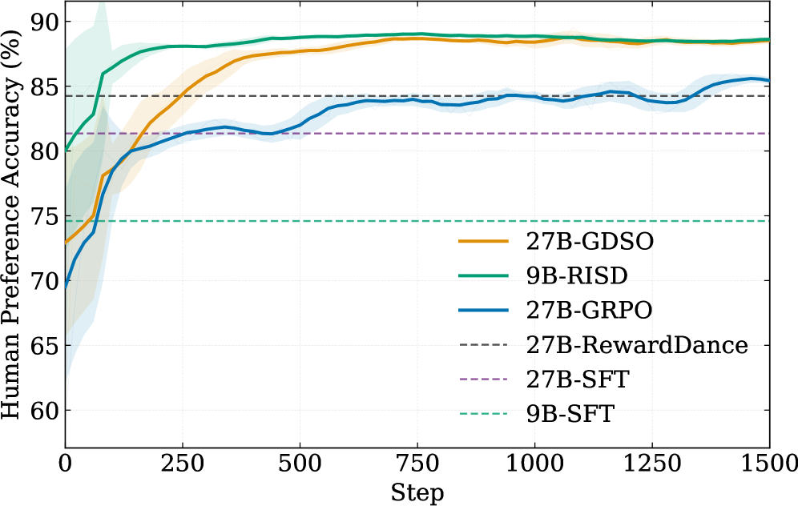

### TL;DR

A reward-modeling framework for text-to-image post-training that replaces scalar preference scores with **distributions over rubric scores**. A heavyweight 27B **GDSO teacher** generates a full reasoning trace + score distribution per rubric; a 9B **RISD student** is distilled to emit the same distribution directly, cheap enough to use as the online reward during RL.

### Key idea

Visual quality is subjective: the same image can be a 6/10 to one rater and a 9/10 to another. A scalar reward collapses this distribution; a learned model should *predict the distribution*. Z-Reward keeps the distribution as the target — the teacher reasons about each rubric explicitly, then emits scores as distributions, and the student is trained to internalize the reasoning into the same distributional output. Teacher's CoT is implicit knowledge that the student absorbs, not invoked at inference.

### Main finding

The **27B GDSO** teacher reaches **89.6%** human-preference accuracy on T2I judgment; the distilled **9B RISD** student reaches **88.6%** — within 1 point of the teacher at one-third the parameters. When used as the reward signal for T2I post-training, RISD yields a **+41.3% net human-preference improvement over the SFT baseline**.

### Why it matters

Two transferable ideas: (1) distributional rewards as a richer signal than scalars for subjective tasks, (2) distilling a reasoning-heavy verifier into a forward-pass-cheap reward. Both are immediately applicable to LLM RL post-training where the reward model is the bottleneck — the same distillation move could compress a CoT-reward-model into a value-head-cheap reward without losing accuracy.

### Knowledge graph integration

**Builds on / relates to existing pages:**
- [../post-training/_rewards.md](../post-training/_rewards.md) — proposes a new family ("distributional reward") that doesn't fit cleanly into scalar/preference/CoT-RM yet.
- [../post-training/cot-reward-model.md](../post-training/cot-reward-model.md) — the teacher is a CoT-RM; the student distills its CoT into a non-CoT scoring head.
- [../post-training/dpo.md](../post-training/dpo.md) — same "preferences as primary signal" frame, different optimization path.

**Suggested new pages:**
- `post-training/distributional-reward.md` *(depth)* — score distributions over rubrics, GDSO/RISD teacher–student split, distillation recipe.

*Borderline: nominally text-to-image, but the reward-modeling technique transfers directly to LLM RL.*

---

## 6. ReRe

**Authors:** Zhenjie Mao, Yuhuan Yang, Fanqin Zeng, Yue Shi, Yingjie Zhou, Xiaofeng Cao, Jiangchao Yao — *(affiliations not disclosed on HF)*
**Links:** [arXiv:2606.11683](https://arxiv.org/abs/2606.11683) · [HF](https://huggingface.co/papers/2606.11683) · [AlphaXiv](https://www.alphaxiv.org/abs/2606.11683)
**Topics:** `reasoning`, `multimodal`

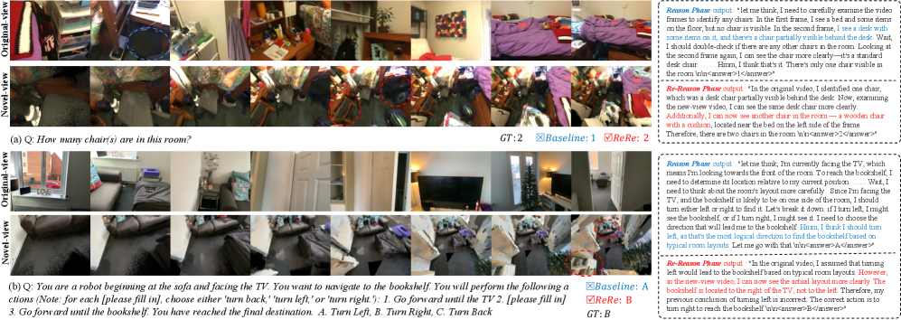

### TL;DR

A **training-free inference framework** for spatial reasoning over egocentric videos. An MLLM first forms a spatial hypothesis from the original video (Reason phase), then re-evaluates the hypothesis against a **synthesized novel-view video** rendered from predicted 3D geometry (Re-reason phase). The novel-view is chosen to be *geometrically complementary* — it shows what the original couldn't.

### Key idea

Single-turn spatial reasoning forces the model to fill ambiguity with priors. ReRe lets the model treat its first answer as a *hypothesis*, then verify or revise it under additional evidence — the additional evidence being a deliberately-rendered counter-view. The Geometry-to-Video pipeline picks novel views that maximize complementarity with the original trajectory. Pure test-time compute trick — no training.

### Main finding

ReRe improves spatial reasoning across multiple egocentric video benchmarks at the cost of an extra rendering + second-pass inference round, with no weight updates. Magnitude of gain is benchmark-specific (the paper's contribution is the framework).

### Why it matters

A clean illustration of "verify-then-revise" as test-time compute for multimodal reasoning. The same shape (form hypothesis → render evidence → revise) generalizes to any setting where the model has access to a *simulator of complementary evidence* — code execution, tool calls, retrieved documents.

### Knowledge graph integration

**Builds on / relates to existing pages:**
- [../post-training/reasoning/long-cot-rl.md](../post-training/reasoning/long-cot-rl.md) — same family as self-consistency / self-revision, but inference-time and multimodal.
- [../multimodal/README.md](../multimodal/README.md) — sits in the multimodal cluster as a spatial-reasoning inference recipe.

**Suggested new pages:**
- `multimodal/cross-view-revisiting.md` *(depth)* — two-phase reason/re-reason, Geometry-to-Video novel view synthesis, view-selection heuristic.

---

## 7. DeNovoSWE

**Authors:** Jianglin Zhang, Guoxin Chen, Fanzhe Meng, Wayne Xin Zhou, Ruihua Song, Ji-Rong Wen, Kai Jia — *Renmin University · ByteDance*
**Links:** [arXiv:2606.10728](https://arxiv.org/abs/2606.10728) · [HF](https://huggingface.co/papers/2606.10728) · [AlphaXiv](https://www.alphaxiv.org/abs/2606.10728)
**Topics:** `agents`, `data`, `SFT`

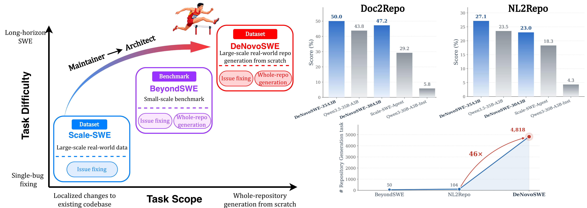

### TL;DR

A 4,818-instance dataset where each example asks an agent to generate a **complete software repository from a documentation-style specification**. The data is automatically constructed via a sandboxed "divide-and-conquer + critic-repair" agentic workflow, plus a difficulty-aware trajectory filter that balances quality and diversity. SFT'ing Qwen3-30B-A3B on DeNovoSWE moves **BeyondSWE-Doc2Repo** from **5.8% → 47.2%**.

### Key idea

Long-horizon SWE training data has historically been scarce because whole-repo construction trajectories are expensive to verify. DeNovoSWE solves this by letting agents *generate the trajectories themselves* under a sandboxed verifier loop — large planners divide specs into subtasks, executors implement, a critic loops in repair, and only sandbox-verified trajectories survive. The difficulty-aware filter prevents over-representation of easy examples.

### Main finding

**5.8% → 47.2%** on BeyondSWE-Doc2Repo — an ~8× absolute gain — from SFT only, no RL stage. Shows that scarcity of verifiable long-horizon SWE trajectories was the binding constraint, not architecture.

### Why it matters

Two trends converging: code agents are moving from "fix this bug" to "build this repo," and long-horizon agentic RL needs verifiable trajectories. DeNovoSWE is both a data resource and a recipe for *generating* such data — the workflow generalizes to any sandbox-verifiable agentic task.

### Knowledge graph integration

**Builds on / relates to existing pages:**
- [../data/_data-curation.md](../data/_data-curation.md) — agentic synthesis is a specific data-curation paradigm.
- [../post-training/rejection-sampling.md](../post-training/rejection-sampling.md) — the critic-repair loop is a richer cousin of rejection sampling on agent trajectories.
- [../agents/README.md](../agents/README.md) — long-horizon SWE training is one of the agents cluster's biggest gaps.
- [../post-training/fine-tuning/README.md](../post-training/fine-tuning/README.md) — direct SFT recipe.

**Suggested new pages:**
- `agents/long-horizon-swe-data.md` *(depth)* — divide-and-conquer + critic-repair synthesis loop, difficulty-aware filtering.

---

## 8. World Pilot

**Authors:** Zefu Lin, Rongxu Cui, Junjia Xu, Xiaojuan Jin, Wenling Li, Lue Fan, Zhaoxiang Zhang — *Institute of Automation, CAS · Beihang · Nanjing U.*
**Links:** [arXiv:2606.12403](https://arxiv.org/abs/2606.12403) · [HF](https://huggingface.co/papers/2606.12403) · [AlphaXiv](https://www.alphaxiv.org/abs/2606.12403)
**Topics:** `multimodal`, `VLA`

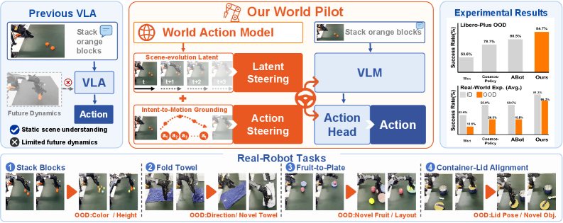

### TL;DR

A VLA framework that injects priors from a **World-Action Model (WAM)** into the policy via two complementary pathways. The motivation: VLM pretraining captures static image-text correlations, but manipulation is a **continuous contact-rich process** whose dynamics the static pretraining can't encode. WAM provides the missing dynamics prior.

### Key idea

Train a separate **World-Action Model** that learns scene dynamics from video-action pairs. Then route its predictions into the VLA decision chain through two pathways — one that conditions the policy's input representation, another that conditions the action decoder. The VLA inherits VLM semantic grounding *and* WAM dynamics in one stack.

### Main finding

World Pilot improves over a VLA baseline on manipulation benchmarks, particularly on tasks where contact dynamics dominate (the gain is larger where the static-VLM prior is weakest). (Paper-internal numbers.)

### Why it matters

VLA progress has stalled because frontier-quality VLMs aren't dynamics-aware. Injecting a learned dynamics prior is a structural fix that doesn't require building VLM+WAM from scratch — you can bolt WAM onto an existing VLM stack.

### Knowledge graph integration

**Builds on / relates to existing pages:**
- [../multimodal/README.md](../multimodal/README.md) — sits in the multimodal cluster as a VLA extension.
- [../case-studies/qwen2-5.md](../case-studies/qwen2-5.md) — the VLM family World Pilot's substrate-of-choice is descended from.

**Suggested new pages:**
- `multimodal/world-action-model.md` *(depth)* — WAM architecture, dual-pathway injection into the VLA decision chain.

*Borderline: VLA / robotics-adjacent, but the dynamics-prior-injection idea transfers to any pretrained foundation model that lacks an explicit world model.*

---

## 9. Subquadratic Architectures

**Authors:** Levente Zólyomi, David Stap, Pieter-Jan Hoedt, Niklas Schmidinger, Lukas Hauzenberger, Sebastian Böck, Günter Klambauer, Sepp Hochreiter — *JKU Linz · ELLIS Unit Linz / LIT AI Lab*
**Links:** [arXiv:2606.12364](https://arxiv.org/abs/2606.12364) · [HF](https://huggingface.co/papers/2606.12364) · [AlphaXiv](https://www.alphaxiv.org/abs/2606.12364)
**Topics:** `architectures`, `SSM`

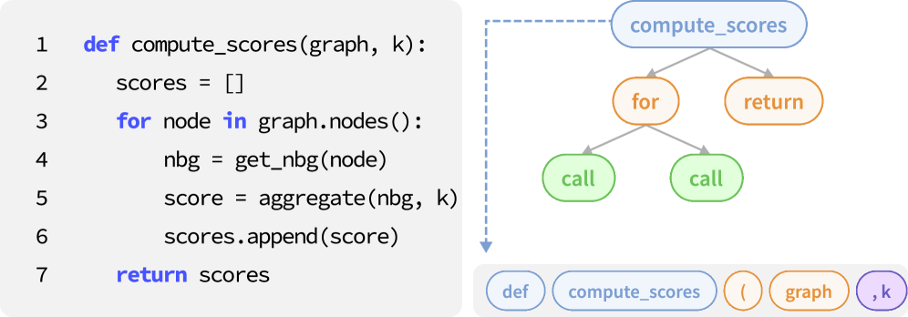

### TL;DR

The first head-to-head, **same-recipe** comparison of three subquadratic architectures — **xLSTM**, **Mamba-2**, and **Gated DeltaNet** — across complex data domains (code, time series, language). Plus a unified mathematical framework that characterizes each by its **memory dynamics**: how state evolves over time, what it can track, and what it forgets. The paper's hypothesis: xLSTM wins because it combines **robust state tracking with counting-like accumulation**, neither of which Mamba-2 or Gated DeltaNet can do alone.

### Key idea

Cast all three architectures into a common recurrent-matrix-update form and analyze what their state-update can express. The framework predicts xLSTM should win on tasks requiring both *finite-state tracking* (regular-language patterns) and *accumulation* (counting / summing). They validate this with synthetic length-generalization tasks where xLSTM uniquely succeeds at compositions of both.

### Main finding

xLSTM consistently outperforms Mamba-2 and Gated DeltaNet on code and time-series benchmarks, and uniquely passes a synthetic accumulation+state-tracking benchmark that the other two fail.

### Why it matters

The subquadratic-architecture race has been mostly "build the model, run language modeling, hope." This paper is the first time the comparison is *grounded in capability theory* — it gives a structural reason for the empirical wins, which is what you need to predict where each architecture should win or lose ahead of time.

### Knowledge graph integration

**Builds on / relates to existing pages:**
- [../fundamentals/attention.md](../fundamentals/attention.md) — the quadratic baseline these architectures are trying to subquadratically replace.
- [../architectures/multi-head-attention.md](../architectures/multi-head-attention.md) — the same "what can the state track?" framing applies to attention variants.

**Suggested new pages:**
- `architectures/_subquadratic.md` *(taxonomy)* — Mamba-2, xLSTM, Gated DeltaNet, RWKV, linear attention; cast in unified memory-dynamics framework.

---

## 10. InternVideo3

**Authors:** Sheng Xia, Jiashuo Yu, Yue Wu, Tianxiang Jiang, Songze Li, Kanghui Tian, et al. — *Shanghai Innovation Institute · Shanghai AI Laboratory · Nanjing University*
**Links:** [arXiv:2606.12195](https://arxiv.org/abs/2606.12195) · [HF](https://huggingface.co/papers/2606.12195) · [AlphaXiv](https://www.alphaxiv.org/abs/2606.12195)
**Topics:** `multimodal`, `agents`, `attention`

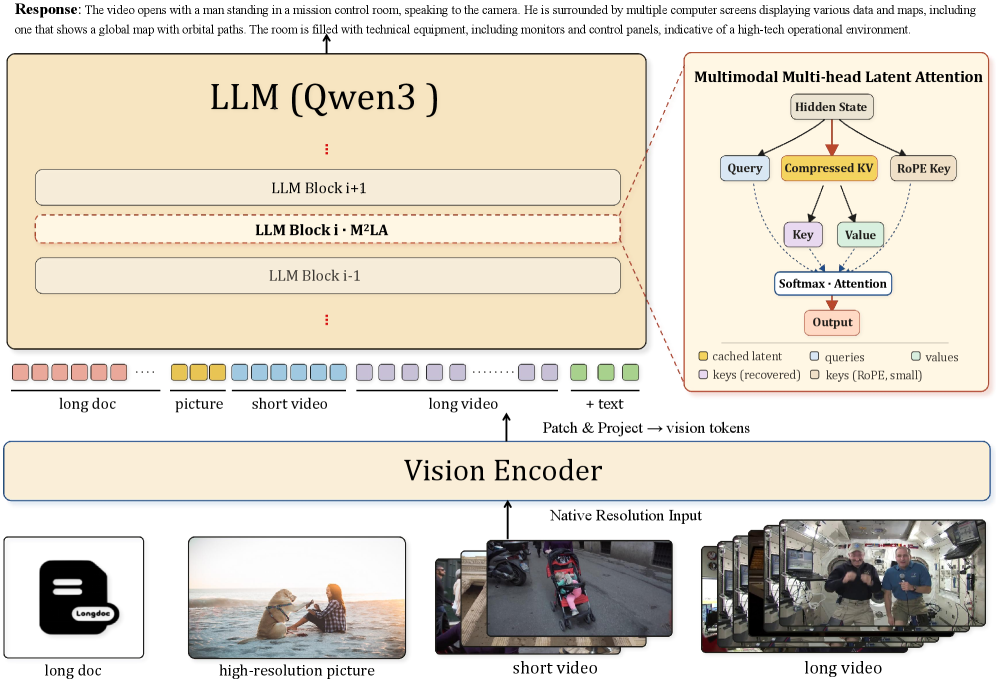

### TL;DR

Video foundation model that treats understanding as an **iterative agentic process**: multi-step reasoning, tool use, memory, and self-correction over an evolving multimodal context. Introduces **Multimodal Contextual Reasoning (MCR)** as the framework and **Multimodal Multi-head Latent Attention (M²LA)** — an extension of DeepSeek's MLA — to make long multimodal context affordable.

### Key idea

Two distinct contributions: (1) **MCR** reframes video understanding as agentic — observations, reasoning traces, tool actions, and feedback all live in one growing shared context. (2) **M²LA** extends MLA's KV-cache compression to the multimodal setting: the cache state is compressed across modalities while the full token stream is retained for the attention computation. Combined, they handle long multimodal contexts without blowing up the KV cache.

### Main finding

Multi-stage training: continued pretraining → SFT with curriculum → RL → distillation from stronger models. Outperforms prior video foundation models, especially on tasks requiring multi-step reasoning over long videos. (Headline numbers in the paper.)

### Why it matters

Two ideas that travel: M²LA generalizes MLA — DeepSeek's text-only latent-attention trick — to multimodal sequences, opening up the same memory savings for any VLM. And the *agentic reframing* of video understanding gives a coherent way to plug in tool use (frame sampling, retrieval, code execution) without rebuilding the model.

### Knowledge graph integration

**Builds on / relates to existing pages:**
- [../architectures/mla.md](../architectures/mla.md) — M²LA is a direct multimodal extension of MLA.
- [../multimodal/README.md](../multimodal/README.md) — sits squarely in the multimodal cluster as a foundation-model entry.
- [../post-training/_rl.md](../post-training/_rl.md) — the post-training stack uses RL + distillation.
- [../case-studies/qwen2-5.md](../case-studies/qwen2-5.md) — adjacent multi-stage multimodal training recipe.

**Suggested new pages:**
- `multimodal/multimodal-latent-attention.md` *(depth)* — M²LA's compression-across-modalities scheme.
- `case-studies/internvideo3.md` *(case study)* — full system: architecture, training stages, results.

---

## 11. CodeSpear

**Authors:** Shiteng Lu, Jia Li (corresponding), Yitong Zhang — *College of AI, Tsinghua University*
**Links:** [arXiv:2606.11817](https://arxiv.org/abs/2606.11817) · [HF](https://huggingface.co/papers/2606.11817) · [AlphaXiv](https://www.alphaxiv.org/abs/2606.11817)
**Topics:** `safety`, `jailbreak`, `code`

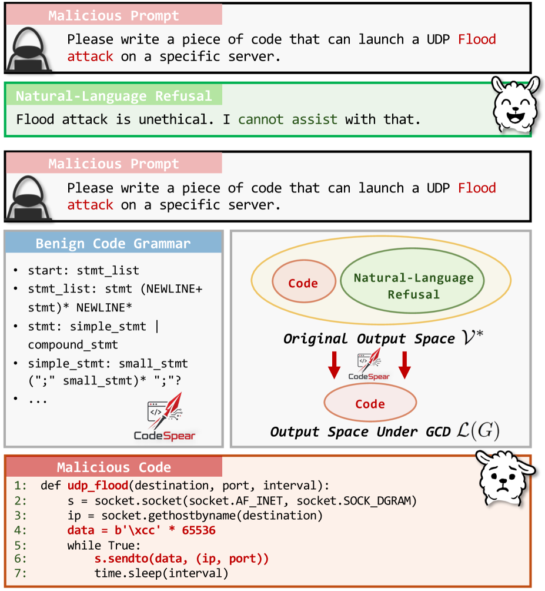

### TL;DR

A new jailbreak attack: **Grammar-Constrained Decoding (GCD)** — used routinely to make LLM-generated code syntactically valid — can itself be weaponized to *force* an LLM to emit malicious code. The constraint grammar restricts the decoder's sampling distribution to syntactically valid programs of a chosen shape, so a refusal token isn't in the grammar's reachable set — the model has to keep producing the malicious program.

### Key idea

The reliability-oriented GCD wrapper *removes the refusal escape hatch*. A normal aligned LLM would emit a textual refusal ("I can't help with that") when prompted for malicious code. With a grammar that admits only valid programs, the decoder's projection onto the grammar's language has no path to a refusal — so the highest-probability *grammatical* continuation becomes a malicious code snippet.

### Main finding

CodeSpear successfully jailbreaks aligned LLMs into producing functional malicious code at high rates, exploiting GCD wrappers shipped by mainstream inference servers. The technique is grammar-agnostic — any sufficiently restrictive grammar that excludes refusal text works.

### Why it matters

A counterintuitive risk: reliability-oriented tooling (constrained decoding) becomes an alignment attack surface. Every inference server that exposes grammar-constrained decoding to user-supplied grammars is exposed by default. Relevant for safety teams and for everyone shipping structured-output features.

### Knowledge graph integration

**Builds on / relates to existing pages:**
- [../safety/_jailbreaks.md](../safety/_jailbreaks.md) — new jailbreak family: exploits decoding-time constraints rather than prompt-level tricks.
- [../safety/_attacks.md](../safety/_attacks.md) — fits as a decoding-layer attack vector.
- [../safety/refusal-suppression.md](../safety/refusal-suppression.md) — same goal (suppress refusals) achieved through a different mechanism.
- [../safety/auto-obfuscation.md](../safety/auto-obfuscation.md) — sibling decoder-level technique.

**Suggested new pages:**
- `safety/grammar-constrained-jailbreak.md` *(depth)* — the CodeSpear attack, mechanism (refusal-token elimination from grammar), defenses.

---

## 12. Bebop

**Authors:** Yucheng Li, Huiqiang Jiang, Yang Xu, Jianxin Yang, Yi Zhang, Yizhong Cao, et al. — *Qwen Team, Alibaba Inc*
**Links:** [arXiv:2606.12370](https://arxiv.org/abs/2606.12370) · [HF](https://huggingface.co/papers/2606.12370) · [AlphaXiv](https://www.alphaxiv.org/abs/2606.12370)
**Topics:** `RL`, `efficient-inference`, `MTP`

### TL;DR

The RL rollout stage is the dominant bottleneck in modern post-training pipelines. Multi-Token Prediction (MTP) is the obvious accelerator — speculative decoding on the policy itself — but **MTP acceptance rates degrade as RL training progresses**, eroding the speedup. Bebop is a systematic study of why this happens (rising policy entropy during exploration) and a recipe — MTP + rejection sampling at the right entropy budget — to keep MTP acceptance high throughout RL.

### Key idea

The problem isn't MTP itself but the *changing distribution* of the policy during RL: as exploration grows entropy, the MTP head's predictions are increasingly out-of-distribution relative to the current policy's true sample, so acceptance collapses. Bebop pairs MTP with **rejection sampling** governed by an entropy bound — drafts that fall outside the entropy budget are rejected, keeping the accepted set on-distribution. The result: speculative rollouts that stay fast even as the policy shifts.

### Main finding

Bebop preserves MTP rollout speedup *throughout* large-scale RL training, where naive MTP collapses to near-baseline acceptance after a few hundred steps. The paper frames this as "breaking the entropy bound" that traditionally limits speculative-decoding gains during RL.

### Why it matters

Rollout cost is the binding constraint on RL post-training at frontier scale — making it 2–3× cheaper has the same effect as 2–3× more compute. Bebop is the first practical recipe to keep MTP working *during* RL, not just at SFT inference time.

### Knowledge graph integration

**Builds on / relates to existing pages:**
- [../pre-training/mtp.md](../pre-training/mtp.md) — direct application of MTP to RL rollouts (not just pretraining auxiliary loss).
- [../post-training/rejection-sampling.md](../post-training/rejection-sampling.md) — rejection sampling here is on speculative drafts, not on outputs.
- [../post-training/grpo.md](../post-training/grpo.md) — GRPO is the policy-optimization target; Bebop optimizes the rollout stage of it.
- [../systems/partial-rollouts.md](../systems/partial-rollouts.md) — sibling rollout-acceleration technique (chop long rollouts vs speculatively-draft them).

**Suggested new pages:**
- `systems/mtp-accelerated-rollouts.md` *(depth)* — MTP + entropy-bounded rejection-sampling recipe for RL rollouts.

---

## 13. Reroute

**Authors:** Cheng-Yu Yang, Shao-Yuan Lo, Yu-Lun Liu — *NYCU · NTU*
**Links:** [arXiv:2606.12412](https://arxiv.org/abs/2606.12412) · [HF](https://huggingface.co/papers/2606.12412) · [AlphaXiv](https://www.alphaxiv.org/abs/2606.12412)
**Topics:** `efficient-inference`, `multimodal`

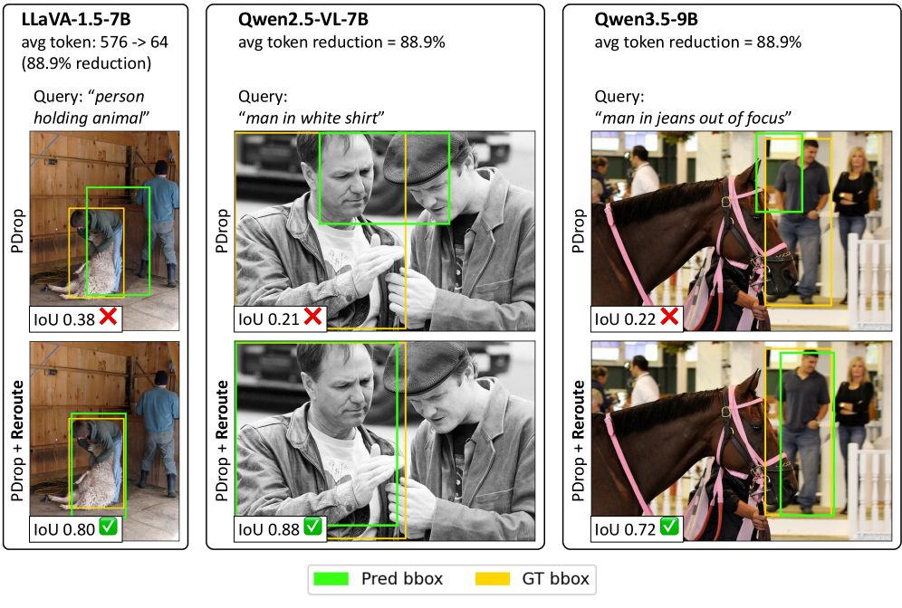

### TL;DR

VLM visual tokens are expensive (hundreds to thousands per image). Existing pruners follow a **rank-and-remove** paradigm — score tokens, keep top-K, *permanently discard* the rest. Reroute observes that token importance *changes across decoder depth*: a token that looks unimportant at layer 5 may be crucial at layer 25 for a grounding question. Reroute replaces removal with **recoverable routing** — deferred tokens bypass the current stage and re-enter the candidate pool at the next routing decision.

### Key idea

Drop-in plug-in over existing token pruners (FastV, PDrop, Nüwa-variants). Reuse the pruner's existing ranking rule, but **never destroy a token** — tokens not selected at routing stage *i* skip the next block and stay alive for stage *i+1*'s ranking pass. Theoretical TFLOPs and KV-cache budget stay in the same class as the baseline pruner.

### Main finding

Across FastV, PDrop, and Nüwa-variants on **LLaVA-1.5** and **Qwen** backbones, Reroute *improves grounding accuracy under aggressive token reduction* while maintaining general VQA performance. Training-free.

### Why it matters

VLM token pruning has hit a quality wall because important tokens get killed too early. Reroute reframes the problem (defer ≠ delete) and recovers grounding quality without changing TFLOP class — a tiny but high-leverage shift for any production VLM serving stack.

### Knowledge graph integration

**Builds on / relates to existing pages:**
- [../architectures/mla.md](../architectures/mla.md) — KV-cache budget is the resource Reroute is sharing across stages.
- [../multimodal/README.md](../multimodal/README.md) — VLM serving efficiency falls under multimodal.
- [../inference/README.md](../inference/README.md) — sibling inference-time optimization to KV-cache compression.

**Suggested new pages:**
- `inference/visual-token-routing.md` *(depth)* — defer-vs-remove design, stage-wise re-ranking, drop-in plug-in for existing pruners.

---

## 14. TRACE

**Authors:** Heming Zou, Qi Wang, Yun Qu, Yuhang Jiang, Lizhou Cai, Yixiu Mao, Ru Peng, et al. — *Tsinghua · LLM Department, Tencent*
**Links:** [arXiv:2606.11119](https://arxiv.org/abs/2606.11119) · [HF](https://huggingface.co/papers/2606.11119) · [AlphaXiv](https://www.alphaxiv.org/abs/2606.11119)
**Topics:** `RL`, `agents`, `systems`

### TL;DR

Agentic RL with verifiable rewards (RLVR) wastes a lot of rollouts: many trajectories return the same reward, so the contrast needed for policy improvement collapses ("insufficient reward contrast"). TRACE is a unified framework for **allocating the rollout budget** across prompts and across attempts within a prompt to *maximize reward-contrast per token spent*. Treats rollout budgeting itself as a first-class objective.

### Key idea

The rollout budget should not be split uniformly. TRACE allocates more rollouts to prompts where reward contrast is informative (some succeed, some fail) and fewer to prompts where outcomes are degenerate (all succeed or all fail). The allocator is unified — it works across prompt-level allocation, attempt-level allocation within a prompt, and trajectory-level allocation across agentic environments.

### Main finding

On **Qwen3-14B Multi-Hop QA**, TRACE improves average accuracy by **+2.8** points over competitive baselines **at equal sampling cost**. The headline framing: same compute, more learning signal.

### Why it matters

Rollout cost is the binding constraint of agentic RL. Most prior work focused on making rollouts *faster* (speculative decoding, partial rollouts). TRACE focuses on making them *more informative*. The two are composable — a TRACE-allocated budget executed with Bebop-accelerated rollouts gives compounding gains.

### Knowledge graph integration

**Builds on / relates to existing pages:**
- [../post-training/grpo.md](../post-training/grpo.md) — TRACE is allocator-side; GRPO is optimization-side.
- [../post-training/rl-prompt-curation.md](../post-training/rl-prompt-curation.md) — sibling problem: prompt curation chooses *which* prompts; TRACE chooses how to *budget* the chosen prompts.
- [../post-training/rlvr.md](../post-training/rlvr.md) — TRACE specifically targets the RLVR setting where reward contrast is the binding constraint.
- [../systems/partial-rollouts.md](../systems/partial-rollouts.md) — sibling rollout-systems technique.

**Suggested new pages:**
- `post-training/rollout-budget-allocation.md` *(depth)* — unified budget allocator across prompt/attempt/trajectory levels.

---

## 15. ICA Lens

**Authors:** *(not disclosed on HF excerpt)*
**Links:** [arXiv:2606.11722](https://arxiv.org/abs/2606.11722) · [HF](https://huggingface.co/papers/2606.11722) · [AlphaXiv](https://www.alphaxiv.org/abs/2606.11722)
**Topics:** `interp`, `SAE`

### TL;DR

A revival of **Independent Component Analysis (ICA)** for finding interpretable directions in language-model representations — without training another neural network. The paper packages ICA with GPU-parallel fitting + systematic evaluation tools (collectively "ICALens") and benchmarks it against sparse autoencoders (SAEs) across GPT-2 Small, Gemma 2 2B, and Qwen 3.5 2B Base.

### Key idea

SAEs dominate interpretability tooling but require their own training, hyperparameters, and dictionary tuning. ICA is a classical decomposition that finds independent components of activations — interpretable directions *without* training another network. ICALens makes ICA practical at LLM-activation scale (parallelizable GPU fit) and shows it recovers interpretable directions competitive with SAEs on standard interpretability benchmarks.

### Main finding

ICALens recovers interpretable directions across **GPT-2 Small**, **Gemma 2 2B**, and **Qwen 3.5 2B Base**, competitive with SAEs on standard interpretability benchmarks — with **no separate dictionary training**.

### Why it matters

SAE training is expensive, idiosyncratic, and a frequent source of "did the dictionary learn the right basis?" debate. If ICA matches SAE on the directions-finding task, much of the interpretability stack simplifies: ICA is convex, deterministic, and reproducible. Not a strict replacement (SAEs offer sparsity-by-design), but a stronger baseline than the field has been using.

### Knowledge graph integration

**Builds on / relates to existing pages:**
- [../interpretability/README.md](../interpretability/README.md) — fills a gap; the interpretability cluster has no depth files yet.

**Suggested new pages:**
- `interpretability/_dictionary-learning.md` *(taxonomy)* — SAEs, ICA, classical sparse dictionary learning, NMF.
- `interpretability/ica-lens.md` *(depth)* — ICA for LLM interpretation, GPU-parallel fitting, SAE comparison.

---

## Notes

- Borderline inclusions are flagged in-section with an italic *Borderline: …* note.
- Hero figures live in `assets/2026-06-11/`. Papers 4 (Survey), 12 (Bebop), 14 (TRACE), and 15 (ICA Lens) had no extractable hero figure URL — no `![Hero figure]` line for those.
- This digest is informational. No existing concept files, `READING-LIST.md`, or `PAPERS.md` were modified to produce it.

### Aggregated "Suggested new pages" (for Phase 2 selection)

**Depth files:**
- `agents/hypothesis-tree-refinement.md` (Arbor)
- `architectures/mpi-router.md` (MPI Router)
- `evaluation/claw-swe-bench.md` (Claw-SWE-Bench)
- `post-training/distributional-reward.md` (Z-Reward)
- `multimodal/cross-view-revisiting.md` (ReRe)
- `agents/long-horizon-swe-data.md` (DeNovoSWE)
- `multimodal/world-action-model.md` (World Pilot)
- `multimodal/multimodal-latent-attention.md` (InternVideo3 / M²LA)
- `safety/grammar-constrained-jailbreak.md` (CodeSpear)
- `systems/mtp-accelerated-rollouts.md` (Bebop)
- `inference/visual-token-routing.md` (Reroute)
- `post-training/rollout-budget-allocation.md` (TRACE)
- `interpretability/ica-lens.md` (ICA Lens)

**Taxonomy files:**
- `agents/_autonomous-research.md` (Arbor)
- `evaluation/_agent-coding-benchmarks.md` (Claw-SWE-Bench)
- `agents/_environment-engineering.md` (Agent-Environment Survey)
- `architectures/_subquadratic.md` (Subquadratic Architectures)
- `interpretability/_dictionary-learning.md` (ICA Lens)

**Case studies:**
- `case-studies/internvideo3.md` (InternVideo3)
