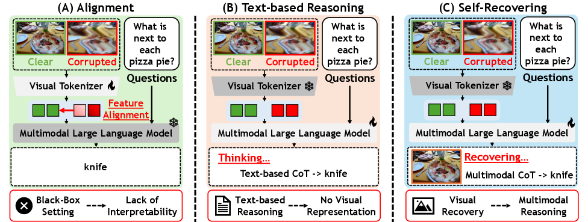
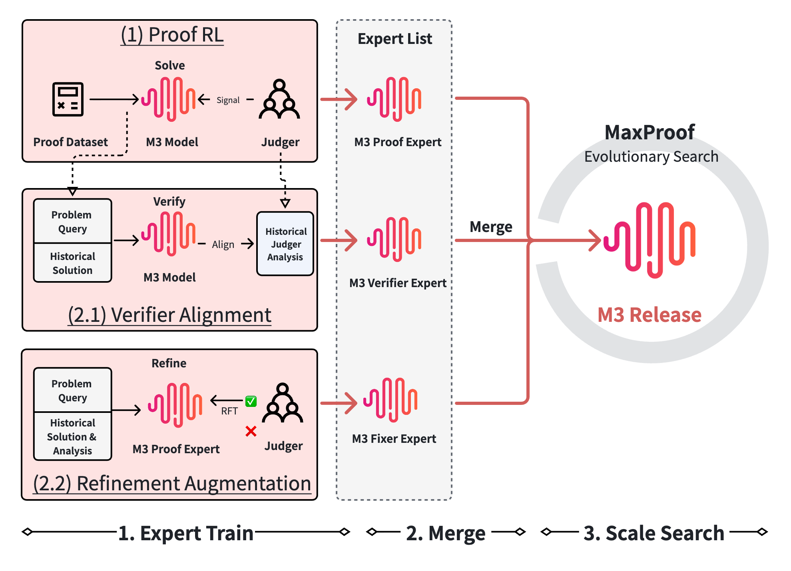
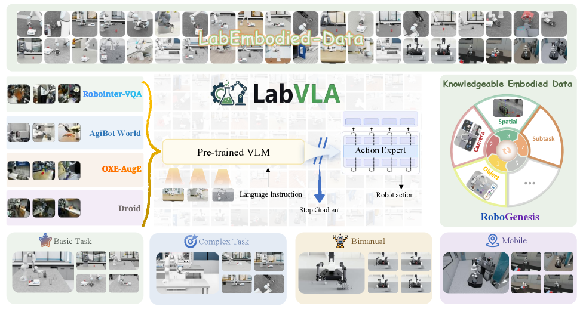
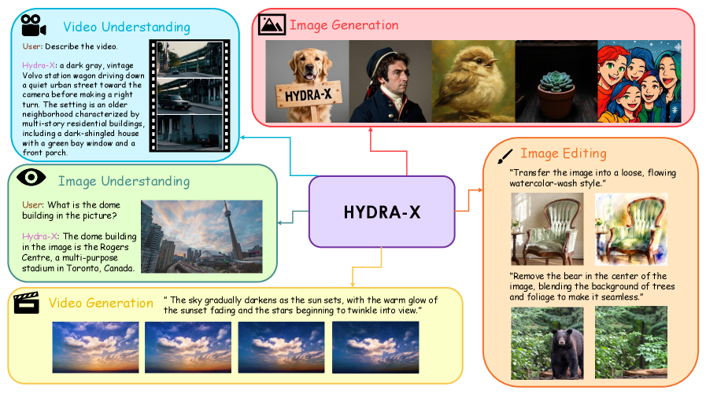
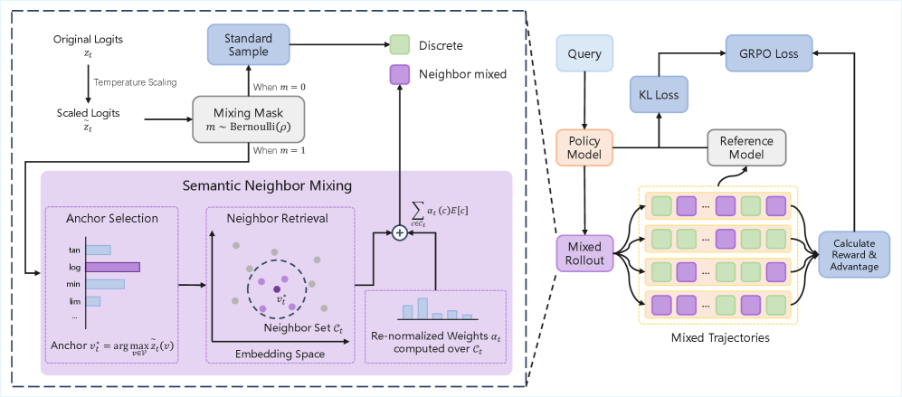
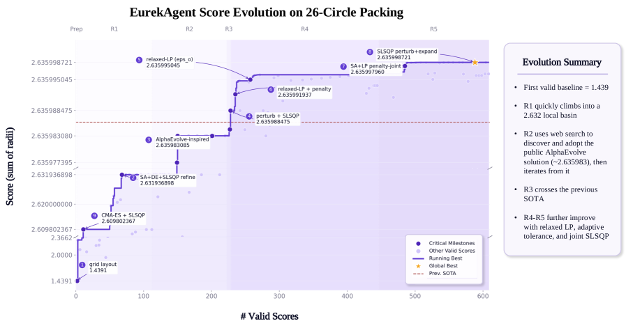
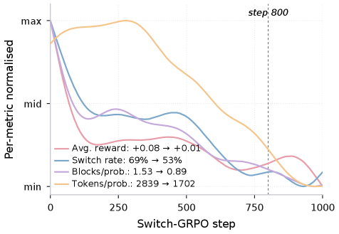
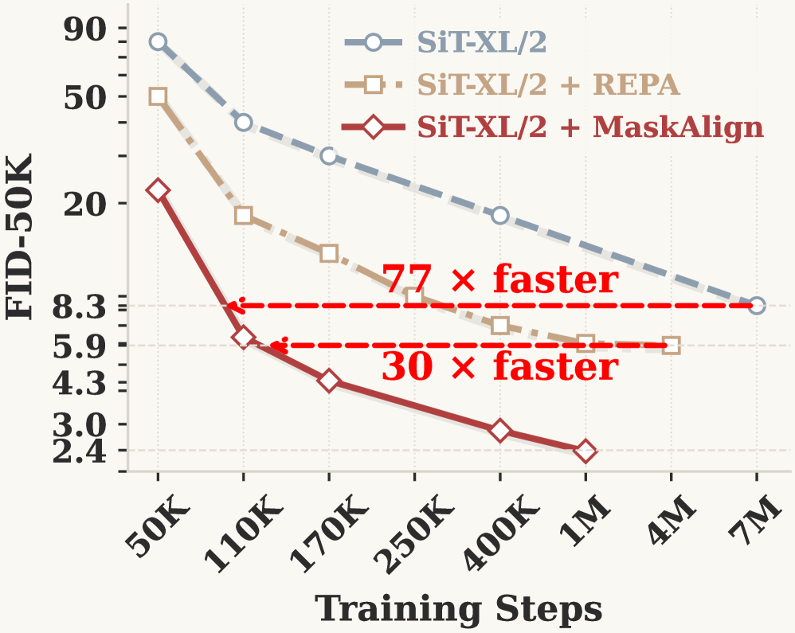

# Daily AI papers — 2026-06-12

*Curated from HF Daily Papers. 15 of ~43 papers kept after relevance filter.*

## Papers at a glance

| # | Title | Topics | Org |
| --- | --- | --- | --- |
| 1 | [EvoArena: Tracking Memory Evolution for Robust LLM Agents](#1-evoarena) | `agents`, `eval`, `memory` | NUS / SMU / UW |
| 2 | [MiniMax Sparse Attention](#2-minimax-sparse-attention) | `efficient-inference`, `attention`, `LLM` | MiniMax / NVIDIA |
| 3 | [SpatialClaw: Code as the Action Interface for Spatial Reasoning](#3-spatialclaw) | `agents`, `multimodal`, `reasoning` | NVIDIA / KAIST |
| 4 | [InterleaveThinker: Reinforcing Agentic Interleaved Generation](#4-interleavethinker) | `agents`, `diffusion`, `RL` | (unspecified) |
| 5 | [FORT-Searcher: Shortcut-Resistant Search Task Synthesis](#5-fort-searcher) | `agents`, `data`, `SFT` | Renmin U. / KAUST |
| 6 | [Robust-U1: MLLM Self-Recovery for Corrupted Visual Content](#6-robust-u1) | `multimodal`, `RL`, `safety` | HKUST / SUTD |
| 7 | [MaxProof: Generative-Verifier RL + Population-Level TTS](#7-maxproof) | `reasoning`, `RL`, `eval` | Fudan / PKU / MiniMax |
| 8 | [WeaveBench: Long-Horizon Computer-Use Agents Benchmark](#8-weavebench) | `agents`, `eval` | ZJU / MSRA / THU |
| 9 | [LabVLA: Vision-Language-Action in Scientific Labs](#9-labvla) | `multimodal`, `VLA`, `agents` | ZJU / Shanghai AI Lab |
| 10 | [HYDRA-X: Native Unified Multimodal Model w/ Holistic Tokenizer](#10-hydra-x) | `multimodal`, `architecture` | NJU / Tencent Hunyuan |
| 11 | [N-GRPO: Embedding-Level Neighbor Mixing for GRPO](#11-n-grpo) | `RL`, `reasoning`, `GRPO` | ZJU / Ant Group |
| 12 | [EurekAgent: Agent Environment Engineering for Discovery](#12-eurekagent) | `agents`, `eval` | Tsinghua / Zhipu AI |
| 13 | [Switch: Switchable Latent Reasoning with On-Policy RL](#13-switch) | `reasoning`, `RL`, `interp` | HKUST(GZ) / Cambridge |
| 14 | [VIA-SD: Intra-Model Routing for Speculative Decoding](#14-via-sd) | `efficient-inference`, `speculative-decoding` | (unspecified) |
| 15 | [MaskAlign: Token-Subset Representation Alignment](#15-maskalign) | `diffusion`, `efficient-training` | HKUST / Kuaishou |

---

## 1. EvoArena

**Authors:** Jundong Xu, Qingchuan Li, Jiaying Wu, Yihuai Lan, Shuyue Stella Li, Huichi Zhou, Bowen Jiang, Lei Wang, Jun Wang, Anh Tuan Luu, Caiming Xiong, Hae Won Park, Bryan Hooi, Zhiyuan Hu — *NUS / SMU / UW / UCL / NTU / MIT*
**Links:** [arXiv:2606.13681](https://arxiv.org/abs/2606.13681) · [HF](https://huggingface.co/papers/2606.13681) · [AlphaXiv](https://www.alphaxiv.org/abs/2606.13681)
**Topics:** `agents`, `eval`, `memory`

### TL;DR

A benchmark + memory mechanism for LLM agents that have to keep working as the environment around them changes — APIs rename, schemas mutate, world state drifts. EvoArena is a suite of progressively evolving environments; EvoMem is the proposed memory that preserves the update history so the agent can reason about *which version* of the world is current.

### Key idea

Most agent benchmarks freeze the environment. Real deployments don't. EvoArena rolls each task forward through staged "evolutions" (tool updates, schema changes, fact updates) and scores the agent on its ability to stay aligned. EvoMem stores a *versioned trace* of environment updates rather than overwriting state, so the agent can disambiguate which observation belongs to which world version.

### Main finding

Current strong LLM agents degrade sharply as environments evolve; EvoMem yields consistent improvements across diverse settings without retraining the backbone. Exact deltas aren't in the abstract, but the framing is that "modest" baseline performance becomes meaningfully better with the proposed memory.

### Why it matters

Pushes agent eval out of the static-task regime that's been dominant since SWE-bench and WebArena. Sets up a pattern for studying *temporal robustness* of agents — the kind of behavior that breaks first when a production tool API ships a breaking change overnight.

### Knowledge graph integration

**Builds on / relates to existing pages:**
- [../agents/README.md](../agents/README.md) — squarely in the agents/tool-use cluster; new failure mode for tool-using agents.
- [../evaluation/README.md](../evaluation/README.md) — adds a new axis (temporal evolution) to agent eval.

**Suggested new pages:**
- `agents/agent-memory.md` *(depth)* — versioned-trace memory for evolving environments.
- `evaluation/evoarena.md` *(depth)* — the dynamic-environment benchmark itself.

---

## 2. MiniMax Sparse Attention

**Authors:** Weiqi Xu, Yufeng Yang, Qiaorui Chen, Yang Xu, Lunbin Zeng, Xiaolong Li, Haohai Sun, Haichao Zhu, Vito Zhang, Pengyu Zhao — *MiniMax / NVIDIA / ZJU / HUST / PKU*
**Links:** [arXiv:2606.13392](https://arxiv.org/abs/2606.13392) · [HF](https://huggingface.co/papers/2606.13392) · [AlphaXiv](https://www.alphaxiv.org/abs/2606.13392)
**Topics:** `efficient-inference`, `attention`, `LLM`

### TL;DR

A blockwise sparse attention layer built on top of GQA that drops per-token attention compute by **28.4×** at 1M context while matching GQA quality. Ships with a co-designed kernel for **14.2× prefill** and **7.6× decoding** wall-clock speedups on H800.

### Key idea

Pair grouped-query attention with a learned blockwise sparsity pattern: each query token only attends to a small set of relevant key blocks rather than the full sequence. The selection is differentiable, and the kernel is written to exploit the block structure so the theoretical FLOP savings translate to real wall-clock wins.

### Main finding

On par with GQA quality, 28.4× less attention FLOPs at 1M context, 14.2× prefill / 7.6× decoding speedups on H800. The benchmark numbers are notable because most sparse-attention proposals lose quality at long context — this one claims parity.

### Why it matters

Ultra-long context (agentic workflows, repo-scale code, persistent memory) is becoming the dominant inference workload, and softmax quadratic cost is the bottleneck. A practical drop-in replacement for GQA in frontier LLMs at this kind of speedup would reshape the deployment economics for long-context serving.

### Knowledge graph integration

**Builds on / relates to existing pages:**
- [../architectures/multi-head-attention.md](../architectures/multi-head-attention.md) — sparse attention is a structural variant of MHA.
- [../architectures/mla.md](../architectures/mla.md) — MLA also targets long-context cost via KV compression; MSA targets attention compute instead.
- [../fundamentals/attention.md](../fundamentals/attention.md) — the underlying primitive being modified.

**Suggested new pages:**
- `architectures/_sparse-attention.md` *(taxonomy)* — blockwise / clustered / sliding-window / learned-mask variants.
- `architectures/minimax-sparse-attention.md` *(depth)* — the MSA layer + kernel.

---

## 3. SpatialClaw

**Authors:** Ryo Hachiuma, Abhishek Badki, Hang Su, Byung-Kwan Lee, Chan Hee Song, Sifei Liu, Subhashree Radhakrishnan, Seokju Cho, Yu-Chiang Frank Wang, Min-Hung Chen — *NVIDIA / KAIST*
**Links:** [arXiv:2606.13673](https://arxiv.org/abs/2606.13673) · [HF](https://huggingface.co/papers/2606.13673) · [AlphaXiv](https://www.alphaxiv.org/abs/2606.13673)
**Topics:** `agents`, `multimodal`, `reasoning`

### TL;DR

A training-free spatial-reasoning agent that uses **executable code as its tool-call interface**: a stateful Python kernel preloaded with perception and geometry primitives lets a VLM-backed agent write one cell at a time, observing intermediate results before committing to a strategy. Hits 59.9% average across 20 spatial benchmarks, +11.2 points over prior spatial agents.

### Key idea

The action interface matters more than the perception modules. Single-pass code (commit a full plan up front) and structured JSON tool calls (one operation at a time, no rich composition) are both too rigid for open-ended 3D/4D reasoning. SpatialClaw exposes a *persistent Python REPL* with prior outputs in scope, so the VLM can iteratively probe, branch, and replan based on observations.

### Main finding

59.9% average accuracy across 20 spatial reasoning benchmarks (static + dynamic 3D/4D), +11.2 over the prior best spatial agent, consistent gains across six VLM backbones from two model families, no benchmark- or model-specific adaptation.

### Why it matters

Reframes "tool use" for VLMs around code-as-action — a setup that has been informally validated by Codex / GPT-5 agents, here formalized for vision. The action-interface analysis is broadly applicable to non-spatial agentic settings.

### Knowledge graph integration

**Builds on / relates to existing pages:**
- [../agents/README.md](../agents/README.md) — code-as-action interface for tool-using agents.
- [../multimodal/README.md](../multimodal/README.md) — the VLM backbones being augmented.

**Suggested new pages:**
- `agents/code-as-action.md` *(depth)* — stateful REPL as the agent action space.
- `multimodal/_spatial-reasoning.md` *(taxonomy)* — single-pass code vs. structured tools vs. stateful REPL for VLM spatial tasks.

---

## 4. InterleaveThinker

**Authors:** *Author list not surfaced on the HF page.*
**Links:** [arXiv:2606.13679](https://arxiv.org/abs/2606.13679) · [HF](https://huggingface.co/papers/2606.13679) · [AlphaXiv](https://www.alphaxiv.org/abs/2606.13679)
**Topics:** `agents`, `diffusion`, `RL`

### TL;DR

A planner + critic multi-agent pipeline that turns any single-shot image generator into an *interleaved* text-image generator (visual narratives, step-wise instructions, embodied manipulation). Trained with a cold-start SFT pass on two custom corpora (Interleave-Planner-SFT-80k, Interleave-Critic-SFT-112k), then refined with GRPO using a step-wise instruction-correction reward.

### Key idea

Decompose interleaved generation into two roles. A **planner** organizes the input into a step-by-step text-image sequence and dispatches each step to the image generator. A **critic** evaluates each output against the plan and rewrites the next instruction if it drifts. Single-step GRPO with accuracy + step-wise rewards stands in for full-trajectory RL (a 25+ call trajectory would be too expensive to optimize end-to-end).

### Main finding

Brings open-source image generators up to **Nano Banana / GPT-5** level on interleaved-generation benchmarks. Side effect: large gains on reasoning benchmarks WISE (0.47 → 0.73) and RISE (13.3 → 28.9) on 4-step FLUX.2-klein.

### Why it matters

Pushes interleaved gen — the harder, instruction-following sibling of single-image gen — into reach for open models without modifying the underlying image generator. The single-step-reward-as-trajectory-surrogate trick generalizes to other long-horizon agentic RL settings where full rollouts are too expensive.

### Knowledge graph integration

**Builds on / relates to existing pages:**
- [../post-training/grpo.md](../post-training/grpo.md) — the underlying policy-optimization algorithm.
- [../agents/README.md](../agents/README.md) — multi-agent planner/critic pipelines.

**Suggested new pages:**
- `post-training/step-wise-reward.md` *(depth)* — single-step RL as a surrogate for long trajectories.

---

## 5. FORT-Searcher

**Authors:** Yimeng Chen, Xiaoqing Xiang, Ziyang Zeng, Shuo Tang, Wayne Xin Zhao, Feng Chang, Chuan Hao, Yuan Wei, Ran Tao, Bryan Dai, Ji-Rong Wen — *Renmin U. / KAUST / IQuest / SJTU*
**Links:** [arXiv:2606.12087](https://arxiv.org/abs/2606.12087) · [HF](https://huggingface.co/papers/2606.12087) · [AlphaXiv](https://www.alphaxiv.org/abs/2606.12087)
**Topics:** `agents`, `data`, `SFT`

### TL;DR

A synthesis framework for **shortcut-resistant** deep-search training data. Diagnoses four shortcut risks (evidence co-coverage, single-clue selectivity, exposed constants, prior-knowledge binding) and controls each at four pipeline stages. FORT-Searcher trained with SFT-only on the resulting trajectories beats comparable-size open-source search agents.

### Key idea

Structural complexity of the underlying evidence graph isn't enough — the *realized* search difficulty collapses if there's a shorter route to the answer (a single highly identifying clue, a leaked constant, a fact the model already knows). FORT measures shortcut realization via trajectory signatures (solving cost, answer hit time, prior-shortcut rate) and applies controls at entity selection, evidence-graph construction, question formulation, and adversarial refinement.

### Main finding

FORT trajectories show longer pre-answer search and fewer shortcut patterns than existing open-source deep-search datasets. FORT-Searcher (SFT only) is the best comparable-size open-source agent on challenging deep-search benchmarks.

### Why it matters

Most search-agent training pipelines have an unmeasured failure mode: the agent is memorizing the shortcut, not learning to search. FORT introduces the diagnostics and the synthesis controls in one package, and shows SFT alone is enough if the data is right.

### Knowledge graph integration

**Builds on / relates to existing pages:**
- [../data/quality-filtering.md](../data/quality-filtering.md) — shortcut-risk diagnostics are a new axis of quality filtering for agentic data.
- [../data/decontamination.md](../data/decontamination.md) — closely related goal: removing trivial-route answers from training data.
- [../agents/README.md](../agents/README.md) — search-agent training recipe.

**Suggested new pages:**
- `data/shortcut-resistant-synthesis.md` *(depth)* — the four shortcut risks and how to control them.

---

## 6. Robust-U1

**Authors:** Jianmin Chen, Youyang Zhai, Wei Wei, Runtao Liu, Mengjie Zhao, Xiangyu Wu, Qingfa Xiao, Qifeng Chen — *HKUST / SUTD / others*
**Links:** [arXiv:2606.08063](https://arxiv.org/abs/2606.08063) · [HF](https://huggingface.co/papers/2606.08063) · [AlphaXiv](https://www.alphaxiv.org/abs/2606.08063)
**Topics:** `multimodal`, `RL`, `safety`

### TL;DR

Teaches MLLMs to *self-recover* corrupted visual inputs (noise, blur, occlusion) before reasoning over them. Three-stage recipe: SFT for initial reconstruction, RL with dual rewards (pixel-level SSIM + semantic CLIP similarity) for alignment, then a multimodal reasoning pass that jointly attends to the corrupted input and the recovered version.

### Key idea

Black-box feature alignment hides failures; white-box "describe the corruption in text" can't recover lost pixels. Have the MLLM *generate* a recovered image, then condition the reasoning chain on both the corrupted source and the model's own reconstruction. Dual rewards keep the recovery both pixel-faithful (SSIM) and semantically aligned (CLIP).

### Main finding

SOTA robustness on real-world corruption benchmarks and superior performance under adversarial corruption on general VQA benchmarks. Analysis confirms high-quality visual recovery directly improves downstream reasoning.

### Why it matters

A constructive alternative to robust training via data augmentation: instead of training the perception layer to ignore corruption, give the model the ability to *fix* the input. The same SFT+RL recipe might generalize to other input-perturbation settings (low-bandwidth video, occluded UI screenshots in computer-use agents).

### Knowledge graph integration

**Builds on / relates to existing pages:**
- [../multimodal/README.md](../multimodal/README.md) — MLLM robustness.
- [../post-training/grpo.md](../post-training/grpo.md) — RL phase uses GRPO-family policy optimization with custom rewards.
- [../post-training/_rewards.md](../post-training/_rewards.md) — dual-reward (pixel + semantic) design.

**Suggested new pages:**
- `multimodal/self-recovery.md` *(depth)* — generate-then-reason robustness recipe for MLLMs.

---

## 7. MaxProof

**Authors:** Xinyu Zhang, Shunkai Zhang, Yanmohan Wang, Lin Li, Tiancheng Qin, Qin Wang, Zhengmao Zhu, Tianle Li, Jingyang Li, Zehan Li, Binyang Jiang, Jin Zhu, Han Ding, Fei Yu, Chenyu Du, Zijian Song, Jiayuan Song, Zhi Zhang, Yunan Huang, Weiyu Cheng, Pengyu Zhao, Yu Cheng — *Fudan / PKU / MiniMax / Tsinghua / CUHK*
**Links:** [arXiv:2606.13473](https://arxiv.org/abs/2606.13473) · [HF](https://huggingface.co/papers/2606.13473) · [AlphaXiv](https://www.alphaxiv.org/abs/2606.13473)
**Topics:** `reasoning`, `RL`, `eval`

### TL;DR

A population-level test-time scaling framework on top of MiniMax-M3 for competition math proof. Trains three capabilities — proof generation, proof verification, critique-conditioned repair — jointly into one model, then at inference runs a tournament across a population of candidate proofs, picking a winner via the model-as-verifier. Hits **35/42 IMO 2025** and **36/42 USAMO 2026** — both above the human gold-medal threshold.

### Key idea

A "defense-in-depth" generative verifier: false-positive rate on proof validity is the metric they engineer for, since a too-eager verifier breaks the search. The same M3 model wears four hats at test time — generator, verifier, refiner, ranker — and a tournament over the population selects the final proof.

### Main finding

**35/42 on IMO 2025** and **36/42 on USAMO 2026**, surpassing the human gold-medal threshold on both. The test-time scaling unlocks performance unavailable from greedy decoding or simple best-of-N.

### Why it matters

A concrete recipe for *trustable* test-time scaling on open-ended reasoning. The defense-in-depth verifier idea — engineer for low false-positive rate so the search isn't poisoned — is a generalizable lesson for any model-as-judge pipeline.

### Knowledge graph integration

**Builds on / relates to existing pages:**
- [../post-training/grpo.md](../post-training/grpo.md) — the underlying RL algorithm family.
- [../post-training/reasoning/long-cot-rl.md](../post-training/reasoning/long-cot-rl.md) — proof-style long-CoT reasoning.
- [../post-training/reasoning/orm.md](../post-training/reasoning/orm.md) — generative verifier is an outcome-reward-model variant.
- [../post-training/cot-reward-model.md](../post-training/cot-reward-model.md) — critique-conditioned repair builds on CoT reward modeling.
- [../evaluation/aime.md](../evaluation/aime.md) — same math-olympiad evaluation lineage as AIME.

**Suggested new pages:**
- `post-training/reasoning/generative-verifier.md` *(depth)* — generator + verifier + refiner unified in one model.
- `post-training/reasoning/population-test-time-scaling.md` *(depth)* — tournament selection over a population of candidates.

---

## 8. WeaveBench

**Authors:** Wanli Li, Bowen Zhou, Yunyao Yu, Zhou Xu, Yifan Yang, Dongsheng Li, Caihua Shan — *ZJU / MSRA / Tsinghua*
**Links:** [arXiv:2606.09426](https://arxiv.org/abs/2606.09426) · [HF](https://huggingface.co/papers/2606.09426) · [AlphaXiv](https://www.alphaxiv.org/abs/2606.09426)
**Topics:** `agents`, `eval`

### TL;DR

A 114-task, 8-domain benchmark for **hybrid-interface** computer-use agents: each task requires the agent to coordinate GUI clicks/observations with CLI commands and code execution inside a unified workflow. Uses deployed runtimes with trajectory-aware judging to prevent reward hacking. Frontier-tier Claude Opus 4.7 only hits 35.1% PassRate on the fixed OpenClaw harness.

### Key idea

Real production work doesn't split cleanly into "GUI agent" vs "code agent". WeaveBench forces both: the agent has to switch between visually clicking through a web app and running a shell/Python step, while a trajectory-aware judge inspects the whole interaction (not just the final state) to detect short-circuits and reward-hacking patterns.

### Main finding

Claude Opus 4.7 — strong on single-channel benchmarks — gets **35.1%** PassRate on WeaveBench's hybrid-interface tasks, substantially below its solo-modality performance. Indicates current models and runtimes still struggle with long-horizon orchestration across interfaces.

### Why it matters

Calls out a gap that's invisible to GUI-only (OSWorld, computer-use) or CLI-only (SWE-bench) benchmarks. Anyone building a deployable agent has to handle both, and the benchmark gives the field a measurement to track.

### Knowledge graph integration

**Builds on / relates to existing pages:**
- [../agents/README.md](../agents/README.md) — hybrid-interface agent setting.
- [../evaluation/README.md](../evaluation/README.md) — agent benchmark with trajectory-aware judging.

**Suggested new pages:**
- `evaluation/weavebench.md` *(depth)* — hybrid-interface long-horizon benchmark.
- `evaluation/trajectory-aware-judging.md` *(depth)* — anti-reward-hacking judging pattern.

---

## 9. LabVLA

**Authors:** Xinjie Liu, Xi Chen, Yanshuo Liu, Chenxi Li, Daqi Gao, Zeqin Su, Jintao Xing, Zirui Xue, Rui Li, Xiangyu Zhao, Shuofei Qiao, Minting Pan, Wangmeng Zuo, Lei Bai, Dongzhan Zhou, Ningyu Zhang, Huajun Chen — *Zhejiang U. / Shanghai AI Lab / HIT*
**Links:** [arXiv:2606.13578](https://arxiv.org/abs/2606.13578) · [HF](https://huggingface.co/papers/2606.13578) · [AlphaXiv](https://www.alphaxiv.org/abs/2606.13578)
**Topics:** `multimodal`, `VLA`, `agents`

### TL;DR

A vision-language-action model for **scientific lab automation**, trained on a simulation-derived dataset (RoboGenesis) that captures glassware, transparent liquids, and protocol workflows that household-only VLAs never see. Two-stage recipe on Qwen3-VL-4B: FAST action-token pretraining first, then DiT-based flow-matching post-training under knowledge insulation. SOTA on LabUtopia in-distribution and OOD.

### Key idea

Two-stage post-training: (1) **FAST action-token pretraining** discretizes actions into a token vocabulary so the VLM backbone becomes "action aware" before any continuous-control objective is applied; (2) **flow-matching post-training** attaches a DiT action expert that learns the continuous controls — with the rest of the backbone insulated to preserve language/perception capability.

*Borderline: included because the recipe (FAST action tokens + DiT action expert + knowledge insulation) is broadly applicable to VLA training beyond the lab domain.*

### Main finding

Highest average success rate among all evaluated VLA baselines on the LabUtopia benchmark under both ID and OOD conditions.

### Why it matters

A frontier-quality VLA recipe that explicitly separates "make the LM action-aware" from "learn the controller", with the protective trick of insulating the backbone during continuous-control training. Generalizable to any embodied VLM that needs both reasoning and continuous control.

### Knowledge graph integration

**Builds on / relates to existing pages:**
- [../multimodal/README.md](../multimodal/README.md) — VLA is a multimodal-LLM extension.
- [../post-training/fine-tuning/README.md](../post-training/fine-tuning/README.md) — knowledge-insulation post-training pattern.

**Suggested new pages:**
- `multimodal/_vla.md` *(taxonomy)* — VLA training recipes (RT-2 → OpenVLA → π0 → LabVLA).
- `multimodal/fast-action-tokens.md` *(depth)* — discrete action tokenization for VLA pretraining.
- `multimodal/flow-matching-action-expert.md` *(depth)* — DiT-based continuous-action expert with knowledge insulation.

---

## 10. HYDRA-X

**Authors:** Guozhen Zhang, Xuerui Qiu, Yutao Cui, Tianhui Song, Changlin Li, Junzhe Li, Tao Huang, Xiao Zhang, Yang Li, Jianbing Wu, Miles Yang, Zhao Zhong, Liefeng Bo, Limin Wang — *Nanjing U. / CASIA / Tencent Hunyuan / Shanghai AI Lab*
**Links:** [arXiv:2606.13289](https://arxiv.org/abs/2606.13289) · [HF](https://huggingface.co/papers/2606.13289) · [AlphaXiv](https://www.alphaxiv.org/abs/2606.13289)
**Topics:** `multimodal`, `architecture`

### TL;DR

A 7B unified multimodal model with a single ViT that handles both image and video tokenization. Two design wins: **frame-level causal temporal attention** beats full spatiotemporal attention, and **hierarchical temporal compression** substantially beats single-step compression — both injected into a single backbone.

### Key idea

Holistic visual tokenization for UMMs: instead of stacking a separate image tokenizer and a video tokenizer, use one ViT and let the causal-temporal-attention pattern do the work for video. Hierarchical compression collapses redundant temporal information in stages rather than all at once.

### Main finding

Strong performance across image/video understanding, image/video generation, and instruction-guided image editing at the 7B scale — all from a single tokenizer + UMM backbone.

### Why it matters

Pushes the unified-multimodal-model line further toward single-tokenizer designs (vs. specialized tokenizers per modality). The two specific design choices (frame-level causal temporal attention + hierarchical temporal compression) are reusable in any video-aware ViT.

### Knowledge graph integration

**Builds on / relates to existing pages:**
- [../multimodal/README.md](../multimodal/README.md) — unified multimodal model architecture.
- [../architectures/README.md](../architectures/README.md) — ViT-based tokenizer is an architectural variant.

**Suggested new pages:**
- `multimodal/_visual-tokenizers.md` *(taxonomy)* — image/video/holistic visual tokenizers.
- `multimodal/hydra-x-tokenizer.md` *(depth)* — the unified ViT tokenizer + temporal compression.

---

## 11. N-GRPO

**Authors:** Xukun Zhu, Hang Yu, Peng Di, Linchao Zhu — *Zhejiang U. / Ant Group*
**Links:** [arXiv:2606.10768](https://arxiv.org/abs/2606.10768) · [HF](https://huggingface.co/papers/2606.10768) · [AlphaXiv](https://www.alphaxiv.org/abs/2606.10768)
**Topics:** `RL`, `reasoning`, `GRPO`

### TL;DR

A GRPO variant that mixes anchor-token embeddings with their **nearest semantic neighbors** at the embedding layer to diversify rollouts without breaking semantics. Cleaner than random-noise embedding perturbation, which often disrupts meaning, and richer than token-level sampling, which mostly produces rephrased near-duplicates.

### Key idea

The rollout diversity / semantic coherence tradeoff at the heart of GRPO. Random embedding noise breaks the manifold; token sampling stays on it but produces redundant trajectories. **Semantic Neighbor Mixing** dynamically constructs the input embedding for each token by mixing in its nearest neighbors — diversity gain, but movements stay on the local semantic manifold.

### Main finding

Consistent gains over strong baselines on math-reasoning benchmarks with DeepSeek-R1-Distill-Qwen at multiple sizes. Robust OOD generalization on tasks the model wasn't trained for.

### Why it matters

A small, surgical change to the GRPO rollout phase that targets one of its most-discussed failure modes (mode collapse / low-diversity rollouts). Easy to drop into existing reasoning-RL pipelines.

### Knowledge graph integration

**Builds on / relates to existing pages:**
- [../post-training/grpo.md](../post-training/grpo.md) — direct extension of GRPO.
- [../post-training/reasoning/long-cot-rl.md](../post-training/reasoning/long-cot-rl.md) — applied to long-CoT reasoning RL.
- [../post-training/rl-prompt-curation.md](../post-training/rl-prompt-curation.md) — adjacent goal: better rollout diversity.

**Suggested new pages:**
- `post-training/reasoning/semantic-neighbor-mixing.md` *(depth)* — embedding-level neighbor mixing for GRPO rollouts.

---

## 12. EurekAgent

**Authors:** Amy Xin, Jiening Siow, Junjie Wang, Zijun Yao, Fanjin Zhang, Jian Song, Lei Hou, Juanzi Li — *Tsinghua / Zhipu AI*
**Links:** [arXiv:2606.13662](https://arxiv.org/abs/2606.13662) · [HF](https://huggingface.co/papers/2606.13662) · [AlphaXiv](https://www.alphaxiv.org/abs/2606.13662)
**Topics:** `agents`, `eval`

### TL;DR

Reframes autonomous scientific discovery from "design the workflow" to "**engineer the environment**" — permissions, artifacts, budget, and human-in-the-loop hooks. The resulting EurekAgent system sets SOTA on math, kernel-engineering, and ML tasks, including a new 26-circle packing record discovered for **<$11** in API spend.

### Key idea

Four environment-engineering axes: (1) **permissions** for bounded execution and isolated evaluation, (2) **artifacts** for filesystem + Git-based collaboration between agent steps, (3) **budget** for budget-aware exploration, (4) **human-in-the-loop** hooks for cheap supervision and intervention. The agent's loop itself is conventional; the environment carries the structure.

### Main finding

SOTA on multiple math, kernel-engineering, and ML benchmarks. New SOTA 26-circle packing result discovered for under $11 in total API cost — a striking cost-effectiveness number for a research-grade discovery loop.

### Why it matters

A useful counter-narrative to "design ever-more-elaborate agentic workflows" — invest instead in the substrate around the agent. The four-axis breakdown gives a reusable template.

### Knowledge graph integration

**Builds on / relates to existing pages:**
- [../agents/README.md](../agents/README.md) — autonomous-agent system.
- [../evaluation/README.md](../evaluation/README.md) — evaluation across math, kernel-engineering, ML tasks.
- [../safety/cot-monitoring.md](../safety/cot-monitoring.md) — human-in-the-loop oversight is the manual analogue.

**Suggested new pages:**
- `agents/environment-engineering.md` *(depth)* — four-axis recipe (permissions, artifacts, budget, HITL).
- `case-studies/eurekagent.md` *(case study)* — end-to-end discovery system.

---

## 13. Switch

**Authors:** Zhijiang Guo, Chao Chen, Shengen Wu, Yinhong Liu, Yuxuan Fan, Lujundong Li, Songning Lai, Chengwei Qin — *HKUST(GZ) / Cambridge / NTU / JoinQuant*
**Links:** [arXiv:2606.13106](https://arxiv.org/abs/2606.13106) · [HF](https://huggingface.co/papers/2606.13106) · [AlphaXiv](https://www.alphaxiv.org/abs/2606.13106)
**Topics:** `reasoning`, `RL`, `interp`

### TL;DR

A switchable latent-reasoning framework: the model emits `<swi>` to enter hidden-state recurrence (continuous "thinking" in latent space) and `</swi>` to exit. Because the boundaries are real discrete tokens, the GRPO policy ratio is well-defined and on-policy RL works — and the same tokens give mechanistic interpretability a foothold for probing the latent step.

### Key idea

Latent chain-of-thought has historically been hard to train with on-policy RL (the latent isn't a discrete sample) and hard to interpret (no anchor for probing). A single pair of explicit boundary tokens fixes both: `<swi>` / `</swi>` are sampled discretely, so GRPO is well-defined, and they're the natural intervention points for causal probing. Trained with a visible-to-latent curriculum and a Switch-GRPO objective.

### Main finding

Beats prior hidden-state-recurrence latent reasoning at similar scale. Mechanistic analysis: `<swi>` is a learned, *sharply localized* switching policy (not a stylistic artifact); the latent step performs problem-specific, causally important computation; that computation is concentrated at a single hidden-state transition on entry.

### Why it matters

The first formulation that makes latent reasoning **RL-trainable** at scale and **mechanistically inspectable** at the same time. Gives interpretability research a way to study *how* on-policy RL changes a model's internal computation.

### Knowledge graph integration

**Builds on / relates to existing pages:**
- [../post-training/grpo.md](../post-training/grpo.md) — Switch-GRPO is a direct extension.
- [../post-training/reasoning/long-cot-rl.md](../post-training/reasoning/long-cot-rl.md) — latent reasoning is a compressed cousin of long-CoT RL.
- [../interpretability/README.md](../interpretability/README.md) — mechanistic analysis through boundary tokens.

**Suggested new pages:**
- `post-training/reasoning/latent-cot-rl.md` *(depth)* — switchable latent reasoning with boundary tokens + GRPO.
- `interpretability/boundary-token-probing.md` *(depth)* — using discrete entry/exit tokens as probes for latent computation.

---

## 14. VIA-SD

**Authors:** Yuchen Xian, Yang He, Yunqiu Xu, Yi Yang — *affiliation not surfaced*
**Links:** [arXiv:2606.12243](https://arxiv.org/abs/2606.12243) · [HF](https://huggingface.co/papers/2606.12243) · [AlphaXiv](https://www.alphaxiv.org/abs/2606.12243)
**Topics:** `efficient-inference`, `speculative-decoding`

### TL;DR

A multi-tier speculative-decoding scheme that **routes verification by token confidence**: high-confidence draft tokens are accepted directly, medium-confidence tokens go through a slim verifier submodel, and only low-confidence tokens hit the full model. 10–20% speedup over speculative-decoding baselines, 2.5–3× over non-drafting decoding.

### Key idea

Standard speculative decoding wastes the full-model verifier on tokens the draft model is already confident about. VIA-SD inserts a routing step: an intra-model slim verifier handles the medium-confidence cases at a fraction of full-verifier cost, leaving the full model for the genuinely uncertain ones.

### Main finding

10–20% speedup over previous SD baselines and 2.5–3× over non-drafting approaches. The slim-verifier tier is implemented as an intra-model routing path (not a separate model).

### Why it matters

A practical iteration on the speculative-decoding stack. The "verify according to confidence" framing generalizes — any acceptance step in a multi-stage decoding pipeline could be confidence-gated.

### Knowledge graph integration

**Builds on / relates to existing pages:**
- [../inference/README.md](../inference/README.md) — speculative decoding sits in the inference cluster.

**Suggested new pages:**
- `inference/_speculative-decoding.md` *(taxonomy)* — draft+verify variants (Medusa, EAGLE, lookahead, VIA-SD).
- `inference/via-sd.md` *(depth)* — confidence-routed multi-tier verification.

---

## 15. MaskAlign

**Authors:** Tianlin Pan, Cheng Da, Changqian Yu, Huan Yang, Kun Gai, Song Guo, Wenhan Luo — *HKUST / Kuaishou / UCAS*
**Links:** [arXiv:2606.08788](https://arxiv.org/abs/2606.08788) · [HF](https://huggingface.co/papers/2606.08788) · [AlphaXiv](https://www.alphaxiv.org/abs/2606.08788)
**Topics:** `diffusion`, `efficient-training`

### TL;DR

A token-subset variant of representation alignment for diffusion-transformer training. Instead of aligning every token to the clean-image teacher features, sample a random subset of tokens per iteration. A lightweight pre-mask token-mixing block shares information across tokens before the mask is applied. Improves convergence and generation quality on ImageNet 256.

### Key idea

Under full-token alignment, a small set of tokens carries most of the alignment gradient — they have a stable spatial preference, meaning the model is learning to lean on the full clean-image token set. Subset-alignment forces the alignment to hold under perturbation. The pre-mask mixing block mitigates information loss from dropping tokens by sharing context across all tokens first.

### Main finding

Improved training convergence and improved generation quality vs. full-token representation alignment on ImageNet 256×256.

### Why it matters

A drop-in upgrade to representation-alignment-style accelerated DiT training. The subset-alignment + pre-mask-mixing pattern is reusable in any setting where you align noisy-input features to clean-input teacher features.

### Knowledge graph integration

**Builds on / relates to existing pages:**
- [../multimodal/README.md](../multimodal/README.md) — diffusion transformer is multimodal-adjacent.

**Suggested new pages:**
- `multimodal/diffusion-representation-alignment.md` *(depth)* — token-subset alignment for diffusion training.

---

## Notes

- Borderline inclusions are flagged in-section with an italic *Borderline: …* note.
- Hero figures live in `assets/2026-06-12/`. Missing figures (paper #4) mean no `og:image` was available and the standard arXiv-HTML fallback failed.
- This digest is informational. No existing concept files, `READING-LIST.md`, or `PAPERS.md` were modified.
