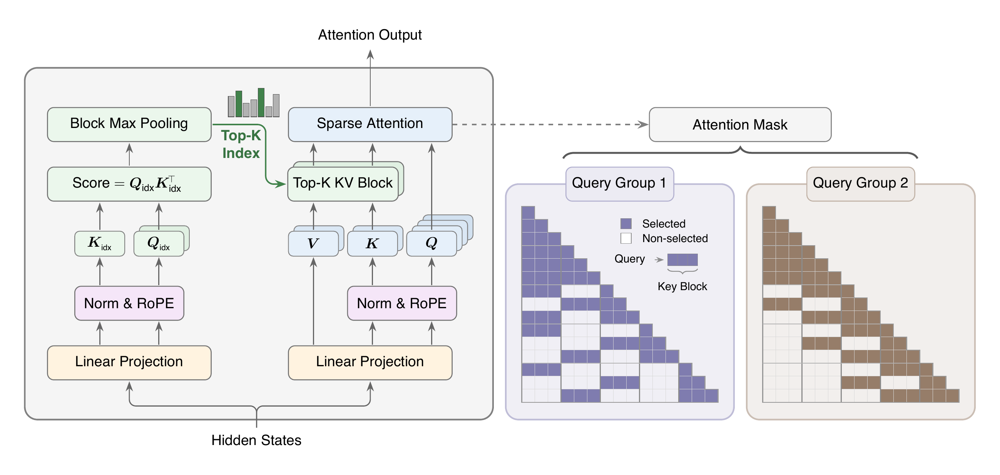
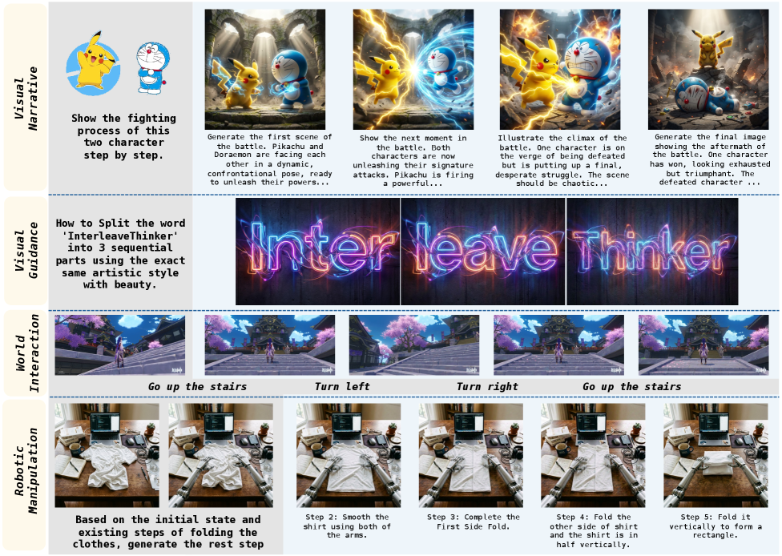
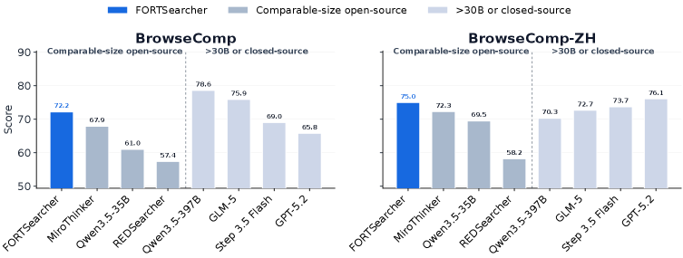

# Daily AI papers — 2026-06-13

*Curated from HF Daily Papers. 15 of 43 papers kept after relevance filter.*

## Papers at a glance

| # | Title | Topics | Org |
| --- | --- | --- | --- |
| 1 | [EvoArena: Tracking Memory Evolution for Robust LLM Agents in Dynamic Environments](#1-evoarena-tracking-memory-evolution-for-robust-llm-agents-in-dynamic-environments) | `agents`, `eval`, `memory` | NUS |
| 2 | [MiniMax Sparse Attention](#2-minimax-sparse-attention) | `architecture`, `efficient-inference`, `long-context` | MiniMax |
| 3 | [WeaveBench: Long-Horizon Benchmark for Computer-Use Agents with Hybrid Interfaces](#3-weavebench-long-horizon-benchmark-for-computer-use-agents-with-hybrid-interfaces) | `agents`, `eval`, `computer-use` | MSRA |
| 4 | [SpatialClaw: Rethinking Action Interface for Agentic Spatial Reasoning](#4-spatialclaw-rethinking-action-interface-for-agentic-spatial-reasoning) | `agents`, `multimodal`, `code-as-action` | NVIDIA |
| 5 | [InterleaveThinker: Reinforcing Agentic Interleaved Generation](#5-interleavethinker-reinforcing-agentic-interleaved-generation) | `multimodal`, `agents`, `RL` | — |
| 6 | [MaxProof: Scaling Mathematical Proof with Generative-Verifier RL](#6-maxproof-scaling-mathematical-proof-with-generative-verifier-rl) | `RL`, `reasoning`, `eval` | MiniMax + Fudan |
| 7 | [Robust-U1: Can MLLMs Self-Recover Corrupted Visual Content?](#7-robust-u1-can-mllms-self-recover-corrupted-visual-content) | `multimodal`, `RL`, `robustness` | HKUST |
| 8 | [FORT-Searcher: Shortcut-Resistant Search Task Synthesis](#8-fort-searcher-shortcut-resistant-search-task-synthesis) | `agents`, `data`, `RL` | RUC |
| 9 | [LabVLA: Grounding Vision-Language-Action Models in Scientific Laboratories](#9-labvla-grounding-vision-language-action-models-in-scientific-laboratories) | `multimodal`, `VLA`, `agents` | Zhejiang U. |
| 10 | [Hydra-X: Native Unified Multimodal Models with Holistic Visual Tokenizers](#10-hydra-x-native-unified-multimodal-models-with-holistic-visual-tokenizers) | `multimodal`, `architecture` | Tencent Hunyuan |
| 11 | [N-GRPO: Embedding-Level Neighbor Mixing for Policy Optimization](#11-n-grpo-embedding-level-neighbor-mixing-for-policy-optimization) | `RL`, `reasoning` | Ant Group |
| 12 | [EurekAgent: Agent Environment Engineering for Autonomous Scientific Discovery](#12-eurekagent-agent-environment-engineering-for-autonomous-scientific-discovery) | `agents`, `reasoning` | Tsinghua + Zhipu |
| 13 | [Switch: Switchable Latent Reasoning with On-Policy RL](#13-switch-switchable-latent-reasoning-with-on-policy-rl) | `reasoning`, `RL`, `interp` | HKUST-GZ |
| 14 | [VIA-SD: Verification via Intra-Model Routing for Speculative Decoding](#14-via-sd-verification-via-intra-model-routing-for-speculative-decoding) | `efficient-inference`, `speculative-decoding` | ZJU |
| 15 | [Risk Under Pressure: Compute-Aware Adversarial Robustness Evaluation](#15-risk-under-pressure-compute-aware-adversarial-robustness-evaluation) | `safety`, `eval`, `jailbreaks` | U. Toronto |

---

## 1. EvoArena: Tracking Memory Evolution for Robust LLM Agents in Dynamic Environments

**Authors:** Jundong Xu, Qingchuan Li, Jiaying Wu, et al. — *National University of Singapore, MIT, UW, UCL, Salesforce*
**Links:** [arXiv:2606.13681](https://arxiv.org/abs/2606.13681) · [HF](https://huggingface.co/papers/2606.13681) · [AlphaXiv](https://www.alphaxiv.org/abs/2606.13681)
**Topics:** `agents`, `eval`, `memory`

### TL;DR

A benchmark + memory mechanism for LLM agents in *evolving* environments. EvoArena scripts environments (terminal, software, social) as sequences of progressive updates so agents must track state changes rather than answer one-shot queries. EvoMem stores memory as a patch-style structured update history that the agent can reason over.

### Key idea

Replace flat episodic memory with **memory-as-diff**: every environment change becomes a structured patch in the agent's memory, so the agent can query "what did X look like *before* the update" or "what changed between turn N and N+5". This matches the actual evolution of state and makes oversight tractable.

### Main finding

Current agents average just 39.6% on EvoArena. EvoMem adds +1.5% on the suite, +6.1% on GAIA, +4.8% on LoCoMo, and +3.7% on chain-level accuracy where success requires completing a consecutive sequence of dependent subtasks.

### Why it matters

Memory is the bottleneck for long-running agents and most current designs assume the world holds still. A first-class "evolution log" reframes agent memory from a chat buffer to a versioned state store — relevant for any production agent running over hours or days.

### Knowledge graph integration

**Builds on / relates to existing pages:**
- [agents/README.md](../agents/README.md) — agents + tool use folder; EvoMem is a new memory paradigm for the same class of systems
- [evaluation/README.md](../evaluation/README.md) — EvoArena fits the agent-benchmark slot

**Suggested new pages:**
- `agents/agent-memory.md` *(depth)* — covers patch-based / update-history memory for long-horizon agents
- `evaluation/evoarena.md` *(depth)* — dynamic-environment agent benchmark

---

## 2. MiniMax Sparse Attention

**Authors:** Weiqi Xu, Yufeng Yang, Qiaorui Chen, et al. — *MiniMax, NVIDIA, Zhejiang U.*
**Links:** [arXiv:2606.13392](https://arxiv.org/abs/2606.13392) · [HF](https://huggingface.co/papers/2606.13392) · [AlphaXiv](https://www.alphaxiv.org/abs/2606.13392)
**Topics:** `architecture`, `efficient-inference`, `long-context`

### TL;DR

A blockwise sparse attention layer (MSA) drop-in for GQA models that targets *deployment-scale* 1M-token contexts. The key claim is large throughput wins without retraining the rest of the stack: 28.4× per-token compute reduction at 1M context and 7.6× decoding speedup on H800.

### Key idea

Sparsify attention at the **block** level on top of Grouped Query Attention so each query head still amortizes over a group's KV but only touches a small fraction of blocks. The selection respects GQA's shared-KV structure, so memory bandwidth stays under control during decode.

### Main finding

14.2× prefill / 7.6× decode speedup at 1M context on H800 vs. dense GQA; 28.4× FLOP reduction per token. Trained-in and bolt-on configurations both reported.

### Why it matters

Sparse attention has been promised for years but rarely shipped because it either degrades quality or doesn't compose with KV-cache-friendly attention. A blockwise scheme that respects GQA layout is exactly the integration story production stacks need to push contexts beyond 1M.

### Knowledge graph integration

**Builds on / relates to existing pages:**
- [architectures/multi-head-attention.md](../architectures/multi-head-attention.md) — MHA / GQA baseline that MSA bolts onto
- [architectures/mla.md](../architectures/mla.md) — sister approach to making attention cheaper at long context
- [fundamentals/attention.md](../fundamentals/attention.md) — softmax-attention costs the paper attacks

**Suggested new pages:**
- `architectures/_attention-variants.md` *(taxonomy)* — MHA / MQA / GQA / MLA / sparse all fit here
- `architectures/sparse-attention.md` *(depth)* — blockwise sparse attention layer covered by MSA

---

## 3. WeaveBench: Long-Horizon Benchmark for Computer-Use Agents with Hybrid Interfaces

**Authors:** Wanli Li, Bowen Zhou, Yunyao Yu, et al. — *Microsoft Research Asia, Tsinghua U.*
**Links:** [arXiv:2606.09426](https://arxiv.org/abs/2606.09426) · [HF](https://huggingface.co/papers/2606.09426) · [AlphaXiv](https://www.alphaxiv.org/abs/2606.09426)
**Topics:** `agents`, `eval`, `computer-use`

### TL;DR

114-task benchmark for agents that must mix GUI control, CLI/code execution, browser, and external tools in one loop. Tasks live in deployed runtimes and are scored with trajectory-aware judging instead of final-answer matching.

### Key idea

Most computer-use benchmarks pick one modality (GUI screenshots *or* CLI). Production agents bounce between them. WeaveBench forces hybrid trajectories and scores both the answer and the trajectory shape, so agents that brute-force the final state without doing the requested workflow get penalized.

### Main finding

Best agents hit 35.1% on the fixed OpenClaw runtime and 41.2% averaged across harnesses — a clear ceiling for current frontier models on long-horizon mixed-interface work.

### Why it matters

Cleanly separates "can the model use a computer" from "can the model orchestrate a workflow across interfaces", which is the actual production task. Replaces brittle DOM-only or screenshot-only proxies.

### Knowledge graph integration

**Builds on / relates to existing pages:**
- [agents/README.md](../agents/README.md) — computer-use sits inside the agents folder
- [evaluation/README.md](../evaluation/README.md) — fits in the agent benchmark slot

**Suggested new pages:**
- `evaluation/weavebench.md` *(depth)* — hybrid-interface computer-use benchmark

---

## 4. SpatialClaw: Rethinking Action Interface for Agentic Spatial Reasoning

**Authors:** Ryo Hachiuma, Abhishek Badki, Hang Su, et al. — *NVIDIA, KAIST*
**Links:** [arXiv:2606.13673](https://arxiv.org/abs/2606.13673) · [HF](https://huggingface.co/papers/2606.13673) · [AlphaXiv](https://www.alphaxiv.org/abs/2606.13673)
**Topics:** `agents`, `multimodal`, `code-as-action`

### TL;DR

Training-free spatial-reasoning framework where the agent's *action interface* is Python code in a persistent kernel rather than structured tool calls. VLM writes code cells that invoke perception modules and numerical primitives, sees intermediates, iterates.

### Key idea

Argue that tool-augmented VLMs are bottlenecked by the action *interface*, not the perception tools. Code-as-action lets the agent compose perception + arithmetic + control flow without committing to a fixed tool schema, which is what spatial reasoning actually needs.

### Main finding

59.9% average across 20 spatial-reasoning benchmarks; +11.2 points over prior spatial agents. Consistent gains across multiple VLM backbones without per-benchmark tuning.

### Why it matters

A concrete win for the "code-as-action" school over schema-based tool calling on a hard, perception-heavy task class. Generalizes beyond spatial reasoning — any task that needs composition over perception modules.

### Knowledge graph integration

**Builds on / relates to existing pages:**
- [agents/README.md](../agents/README.md) — action interface design sits squarely in agents
- [multimodal/README.md](../multimodal/README.md) — VLM-driven perception is the backbone

**Suggested new pages:**
- `agents/code-as-action.md` *(depth)* — code as the agent action interface

---

## 5. InterleaveThinker: Reinforcing Agentic Interleaved Generation

**Authors:** (author list not exposed on HF page)
**Links:** [arXiv:2606.13679](https://arxiv.org/abs/2606.13679) · [HF](https://huggingface.co/papers/2606.13679) · [AlphaXiv](https://www.alphaxiv.org/abs/2606.13679)
**Topics:** `multimodal`, `agents`, `RL`

### TL;DR

A multi-agent pipeline that turns any existing image generator into an interleaved text+image producer. Aimed at use cases where the *sequence* of text and images matters — visual narratives, step-by-step guidance, embodied manipulation plans.

### Key idea

Don't retrain a unified multimodal model; orchestrate a *thinker* agent that plans the interleaving structure and dispatches text + image-generation calls. RL is used to reinforce the thinker's planning policy against an interleaving-quality reward.

### Main finding

Reports gains over open-source Unified Multimodal Models on interleaved-generation tasks (visual narrative, guidance, embodied). Exact numbers gated behind the paper PDF.

### Why it matters

If interleaving can be solved at the orchestration layer, every existing image generator gets the capability without a full UMM rebuild — a cheap path to multimodal narrative agents.

### Knowledge graph integration

**Builds on / relates to existing pages:**
- [multimodal/README.md](../multimodal/README.md) — interleaved generation is a multimodal capability
- [agents/README.md](../agents/README.md) — orchestrator architecture lives in agents

---

## 6. MaxProof: Scaling Mathematical Proof with Generative-Verifier RL

**Authors:** Xinyu Zhang, Shunkai Zhang, Yanmohan Wang, et al. — *MiniMax, Fudan U., Peking U., Tsinghua U., CUHK*
**Links:** [arXiv:2606.13473](https://arxiv.org/abs/2606.13473) · [HF](https://huggingface.co/papers/2606.13473) · [AlphaXiv](https://www.alphaxiv.org/abs/2606.13473)
**Topics:** `RL`, `reasoning`, `eval`

### TL;DR

Three-stage training (generation via RL, verification via error-finding, repair via critique-conditioned refinement) plus *population-level* test-time search with tournament selection. Reports 35/42 on IMO 2025 and 36/42 on USAMO 2026 — above the human gold-medal threshold on both.

### Key idea

Don't treat the verifier as a fixed reward model. Train **proof generator, verifier, and repair model** as cooperating specialists, then at inference run a *population* of candidate proofs through tournament selection driven by the verifier. The verifier's job is to localize errors so the repair model can fix them rather than restart.

### Main finding

IMO 2025: 35/42. USAMO 2026: 36/42. Both clear the human gold-medal cutoff. Population-level search dominates per-sample retry.

### Why it matters

Concrete proof that generative-verifier RL + structured test-time search composes into competition-math gold without bespoke neuro-symbolic backbones. Likely transferable to any task where verifying is easier than generating (program synthesis, theorem proving, agent rollouts).

### Knowledge graph integration

**Builds on / relates to existing pages:**
- [post-training/grpo.md](../post-training/grpo.md) — RL backbone for the generator
- [post-training/rlvr.md](../post-training/rlvr.md) — RL-with-verifiable-rewards framing
- [post-training/reasoning/prm.md](../post-training/reasoning/prm.md) — verifier ancestor in the PRM lineage
- [post-training/reasoning/orm.md](../post-training/reasoning/orm.md) — outcome-reward contrast
- [evaluation/aime.md](../evaluation/aime.md) — same problem class as IMO/USAMO

**Suggested new pages:**
- `post-training/reasoning/generative-verifier-rl.md` *(depth)* — verifier-as-LLM trained jointly with the generator
- `post-training/reasoning/population-test-time-search.md` *(depth)* — tournament selection over candidate populations

---

## 7. Robust-U1: Can MLLMs Self-Recover Corrupted Visual Content?

**Authors:** Jianmin Chen, Youyang Zhai, Wei Wei, et al. — *HKUST (acknowledged RGC + NSFC funding)*
**Links:** [arXiv:2606.08063](https://arxiv.org/abs/2606.08063) · [HF](https://huggingface.co/papers/2606.08063) · [AlphaXiv](https://www.alphaxiv.org/abs/2606.08063)
**Topics:** `multimodal`, `RL`, `robustness`

### TL;DR

Trains an MLLM to *first reconstruct* a corrupted image, then reason jointly over the corrupted input and its own recovered version. Three stages: SFT on reconstruction, RL with dual rewards (pixel SSIM + CLIP semantic similarity), and multimodal reasoning over both views.

### Key idea

Treat visual robustness as a **self-recovery** problem rather than an alignment problem. The model becomes its own image denoiser/restorer and uses the restored image as an auxiliary view at inference time. Dual reward keeps recovery faithful at both pixel and semantic levels.

### Main finding

Reports robustness gains on standard MLLM corruption benchmarks; restoration acts as test-time evidence that the reasoning step can reference. Exact deltas in the paper.

### Why it matters

A non-trivial alternative to "train on more corruptions" — using the model's own generative capacity to repair its inputs. Suggests a generic recipe whenever a model has both a generative and discriminative head.

### Knowledge graph integration

**Builds on / relates to existing pages:**
- [post-training/grpo.md](../post-training/grpo.md) — RL stage uses standard policy-optimization machinery
- [multimodal/README.md](../multimodal/README.md) — MLLM robustness sits here

**Suggested new pages:**
- `multimodal/visual-self-recovery.md` *(depth)* — RL with dual pixel+semantic rewards for input restoration

---

## 8. FORT-Searcher: Shortcut-Resistant Search Task Synthesis

**Authors:** Yimeng Chen, Xiaoqing Xiang, Ziyang Zeng, et al. — *Renmin University of China, KAUST, IQuest*
**Links:** [arXiv:2606.12087](https://arxiv.org/abs/2606.12087) · [HF](https://huggingface.co/papers/2606.12087) · [AlphaXiv](https://www.alphaxiv.org/abs/2606.12087)
**Topics:** `agents`, `data`, `RL`

### TL;DR

Formalizes why graph-based synthetic search questions are easy to game: agents find cheap identifying routes that bypass the intended multi-hop search. Identifies four shortcut risks and synthesizes harder data that closes each one.

### Key idea

Four shortcut categories: **evidence co-coverage**, **single-clue selectivity**, **exposed constants**, **prior-knowledge binding**. The synthesizer rejects candidate questions that admit any of these — what remains forces deep search.

### Main finding

Agents trained on shortcut-resistant data generalize better to real deep-search benchmarks; structural difficulty alone (graph hops) does not predict realized search difficulty.

### Why it matters

Synthetic training data for search/agentic RL has been a quiet plateau — this paper names the failure mode (shortcut leakage) and gives a verifiable filter. Useful template for any synthetic verifiable-reward setup.

### Knowledge graph integration

**Builds on / relates to existing pages:**
- [post-training/rlvr.md](../post-training/rlvr.md) — verifiable-reward setting depends on data that can't be shortcut
- [post-training/rl-prompt-curation.md](../post-training/rl-prompt-curation.md) — same prompt-curation problem in a new domain
- [data/_data-curation.md](../data/_data-curation.md) — adjacent curation methodology
- [agents/README.md](../agents/README.md) — search agents are the target

**Suggested new pages:**
- `data/shortcut-resistant-synthesis.md` *(depth)* — synthesizing verifiable RL data that resists collapse to cheap routes

---

## 9. LabVLA: Grounding Vision-Language-Action Models in Scientific Laboratories

**Authors:** Xinjie Liu, Xi Chen, Yanshuo Liu, et al. — *Zhejiang U., Shanghai AI Lab, HIT*
**Links:** [arXiv:2606.13578](https://arxiv.org/abs/2606.13578) · [HF](https://huggingface.co/papers/2606.13578) · [AlphaXiv](https://www.alphaxiv.org/abs/2606.13578)
**Topics:** `multimodal`, `VLA`, `agents`

### TL;DR

A VLA-style foundation model targeted at scientific-lab manipulation: pipetting, plating, fluid handling. Argues that *data and embodiment*, not model design, are the limiting factors and constructs the missing dataset/setup.

### Key idea

Treat the lab as a constrained but high-stakes VLA environment. Construct an embodied data pipeline that pairs lab instructions, video observations, and low-level actions; train a single VLA that generalizes across instruments.

### Main finding

Highest average success rate among baselines on both in-distribution and OOD lab tasks.

*Borderline: included because it's a VLA / foundation-model paper (per relevance-filter rule for robotics + foundation-model contributions).*

### Knowledge graph integration

**Builds on / relates to existing pages:**
- [multimodal/README.md](../multimodal/README.md) — VLA is multimodal-grounded action
- [agents/README.md](../agents/README.md) — embodied agent slot

---

## 10. Hydra-X: Native Unified Multimodal Models with Holistic Visual Tokenizers

**Authors:** Guozhen Zhang, Xuerui Qiu, Yutao Cui, et al. — *Tencent Hunyuan, Nanjing U., Shanghai AI Lab*
**Links:** [arXiv:2606.13289](https://arxiv.org/abs/2606.13289) · [HF](https://huggingface.co/papers/2606.13289) · [AlphaXiv](https://www.alphaxiv.org/abs/2606.13289)
**Topics:** `multimodal`, `architecture`

### TL;DR

A single ViT that tokenizes both images and video for a Unified Multimodal Model. Frame-level causal temporal attention beats full spatiotemporal attention for reconstruction; hierarchical temporal compression beats one-shot compression for semantics.

### Key idea

Put **all** multimodal inputs through one holistic tokenizer instead of bolting separate image and video encoders onto an LLM. A lightweight decompressor upsamples temporally-compressed features under joint image+video teacher supervision, packing complementary semantics into one latent space.

### Main finding

Hydra-X 7B reports strong results across image and video understanding *and* generation, validating the single-tokenizer recipe at scale.

### Why it matters

Most UMMs still treat image and video as separate modalities. A truly unified visual tokenizer simplifies the stack and lets the LLM amortize across both — and the editing-at-the-latent-level finding suggests broader implications for image editing pipelines.

### Knowledge graph integration

**Builds on / relates to existing pages:**
- [multimodal/README.md](../multimodal/README.md) — UMM tokenizer design

**Suggested new pages:**
- `multimodal/holistic-visual-tokenizer.md` *(depth)* — unified image+video ViT tokenizer for UMMs

---

## 11. N-GRPO: Embedding-Level Neighbor Mixing for Policy Optimization

**Authors:** Xukun Zhu, Hang Yu, Peng Di, Linchao Zhu — *Ant Group, Zhejiang U.*
**Links:** [arXiv:2606.10768](https://arxiv.org/abs/2606.10768) · [HF](https://huggingface.co/papers/2606.10768) · [AlphaXiv](https://www.alphaxiv.org/abs/2606.10768)
**Topics:** `RL`, `reasoning`

### TL;DR

GRPO variant that injects exploration at the *embedding* level by mixing each anchor token's embedding with its nearest semantic neighbors. Aims to be more diverse than token sampling but less destructive than random-noise embedding perturbations.

### Key idea

Token sampling redoes rephrasings; random noise breaks semantics. Mixing with a **bounded set of nearest-neighbor embeddings** keeps perturbations on the local semantic manifold — diverse rollouts without garbage trajectories.

### Main finding

Consistent gains over GRPO baselines on math reasoning across DeepSeek-R1-Distill-Qwen sizes, with OOD generalization preserved.

### Why it matters

Diversity vs. validity is the central tension in RL rollouts. A cheap manifold-aware perturbation is a useful knob to add to the GRPO toolkit, especially for math/code where wrong-but-novel rollouts waste compute.

### Knowledge graph integration

**Builds on / relates to existing pages:**
- [post-training/grpo.md](../post-training/grpo.md) — direct GRPO variant
- [post-training/_rl.md](../post-training/_rl.md) — taxonomy slot for policy-optimization variants
- [post-training/rejection-sampling.md](../post-training/rejection-sampling.md) — adjacent rollout-quality control

**Suggested new pages:**
- `post-training/n-grpo.md` *(depth)* — embedding-neighbor-mixing exploration for GRPO

---

## 12. EurekAgent: Agent Environment Engineering for Autonomous Scientific Discovery

**Authors:** Amy Xin, Jiening Siow, Junjie Wang, et al. — *Tsinghua U., Zhipu AI*
**Links:** [arXiv:2606.13662](https://arxiv.org/abs/2606.13662) · [HF](https://huggingface.co/papers/2606.13662) · [AlphaXiv](https://www.alphaxiv.org/abs/2606.13662)
**Topics:** `agents`, `reasoning`

### TL;DR

Argues the bottleneck for scientific-discovery agents has shifted from "design the workflow" to "design the environment". Engineers environments along four axes: permissions, artifacts, budgets, human oversight. Reports SOTA on math, kernel engineering, and ML tasks — including circle-packing solutions for <$11 of API spend.

### Key idea

Stop micromanaging the agent. Instead, **shape the environment** the agent operates in: what it can read/write (permissions), what state persists across turns (artifacts), the compute/$ envelope (budgets), and where humans intervene (oversight). The agent does the rest.

### Main finding

New SOTA across mathematics, GPU kernel engineering, and ML tasks; very low API spend (~$11) for non-trivial discoveries.

### Why it matters

A meta-result: as base agents get more capable, the leverage moves from prompt/workflow engineering to *environment design*. Concrete framework for thinking about that design.

### Knowledge graph integration

**Builds on / relates to existing pages:**
- [agents/README.md](../agents/README.md) — environment design is the agents slot

**Suggested new pages:**
- `agents/agent-environment-engineering.md` *(depth)* — permissions/artifacts/budgets/oversight as the four design knobs

---

## 13. Switch: Switchable Latent Reasoning with On-Policy RL

**Authors:** Zhijiang Guo, Chengwei Qin, Chao Chen, et al. — *HKUST-GZ, U. Cambridge, NTU*
**Links:** [arXiv:2606.13106](https://arxiv.org/abs/2606.13106) · [HF](https://huggingface.co/papers/2606.13106) · [AlphaXiv](https://www.alphaxiv.org/abs/2606.13106)
**Topics:** `reasoning`, `RL`, `interp`

### TL;DR

Makes latent (hidden-state) reasoning trainable with standard GRPO by adding explicit boundary tokens `<swi>` / `</swi>` that flip the model between visible and latent modes. Compatible with on-policy RL and amenable to mechanistic analysis.

### Key idea

Coconut-style latent reasoning is hard to RL-train because there's no token-level credit signal inside the latent segment. **Discrete boundary tokens** anchor the latent block, restore an action surface for GRPO, and make the latent region inspectable.

### Main finding

79.3% on MATH-500. Mechanistic analysis localizes the latent computation to a single hidden-state transition at entry — a concrete interpretability finding rather than a vague "latent reasoning works" claim.

### Why it matters

Bridges latent-CoT (cheap, dense) and visible-CoT (RL-trainable, oversight-friendly). The boundary-token trick is general — applicable to any technique that wants to mix latent compute with on-policy RL.

### Knowledge graph integration

**Builds on / relates to existing pages:**
- [post-training/grpo.md](../post-training/grpo.md) — the on-policy RL backbone
- [post-training/reasoning/long-cot-rl.md](../post-training/reasoning/long-cot-rl.md) — sibling approach using visible CoT

**Suggested new pages:**
- `post-training/reasoning/latent-cot-rl.md` *(depth)* — switchable boundary-token latent reasoning with GRPO

---

## 14. VIA-SD: Verification via Intra-Model Routing for Speculative Decoding

**Authors:** Yuchen Xian, Yang He, Yunqiu Xu, Yi Yang, et al. — *Zhejiang U.*
**Links:** [arXiv:2606.12243](https://arxiv.org/abs/2606.12243) · [HF](https://huggingface.co/papers/2606.12243) · [AlphaXiv](https://www.alphaxiv.org/abs/2606.12243)
**Topics:** `efficient-inference`, `speculative-decoding`

*(Hero figure unavailable.)*

### TL;DR

Multi-tier speculative decoding: instead of one draft + one verifier model, route medium-confidence tokens through slim *intra-model* sub-paths for cheap verification and reserve full-model verification for the hard ones.

### Key idea

Standard speculative decoding wastes the full target model on tokens the draft is mostly right about. VIA-SD adds an intermediate verification tier inside the same target model (slim submodels), so verification cost scales with token uncertainty.

### Main finding

Reports speedups over standard speculative-decoding baselines; exact ratios in the paper. The key win is reducing verification cost on medium-confidence tokens — the largest bucket in practice.

### Why it matters

Speculative decoding is now standard for production serving, but uniform verification is wasteful. A confidence-aware verification tier is the natural next move and slots into existing speculative-decoding stacks.

### Knowledge graph integration

**Builds on / relates to existing pages:**
- [inference/README.md](../inference/README.md) — fits the speculative-decoding slot

**Suggested new pages:**
- `inference/_speculative-decoding.md` *(taxonomy)* — needed taxonomy slot for SD variants
- `inference/multi-tier-speculative-decoding.md` *(depth)* — confidence-routed multi-tier verification

---

## 15. Risk Under Pressure: Compute-Aware Adversarial Robustness Evaluation

**Authors:** Malikeh Ehghaghi, Boglárka Ecsedi, Marsha Chechik, Colin Raffel — *U. Toronto, Vector Institute, Hugging Face*
**Links:** [arXiv:2606.11409](https://arxiv.org/abs/2606.11409) · [HF](https://huggingface.co/papers/2606.11409) · [AlphaXiv](https://www.alphaxiv.org/abs/2606.11409)
**Topics:** `safety`, `eval`, `jailbreaks`

### TL;DR

Critique of fixed-budget attack-success-rate reporting in LLM robustness eval. Proposes measuring adversarial pressure in cumulative FLOPs instead — gives a cost-vs-payoff curve for the attacker rather than a single point estimate.

### Key idea

Two jailbreaks with the same ASR can differ by orders of magnitude in attacker compute. Reporting ASR-at-budget hides this. Replace with **ASR-as-a-function-of-cumulative-FLOPs**, which is meaningful to defenders and comparable across attack families.

### Main finding

A unified FLOP-pressure axis lets the same chart compare cheap prompt-engineering jailbreaks with expensive optimization-based attacks; differences between models that look identical at fixed budget become large at high pressure.

### Why it matters

Closes a real measurement gap in safety eval. Should affect how dangerous-capability and refusal benchmarks are reported going forward; analogous to throughput-vs-latency curves in serving.

### Knowledge graph integration

**Builds on / relates to existing pages:**
- [safety/_jailbreaks.md](../safety/_jailbreaks.md) — taxonomy where this eval methodology lives
- [safety/_attacks.md](../safety/_attacks.md) — sibling attack taxonomy
- [evaluation/README.md](../evaluation/README.md) — eval methodology more broadly

**Suggested new pages:**
- `safety/compute-aware-jailbreak-eval.md` *(depth)* — FLOP-pressure axis for adversarial robustness reporting

---

## Notes

- Borderline inclusions are flagged in-section with an italic *Borderline: …* note (paper 9, LabVLA).
- Hero figures live in `assets/2026-06-13/`. One missing figure (paper 14, VIA-SD) — no clean inline figure in the arXiv HTML render at fetch time.
- This digest is informational. No existing concept files, `READING-LIST.md`, or `PAPERS.md` were modified to produce it.
