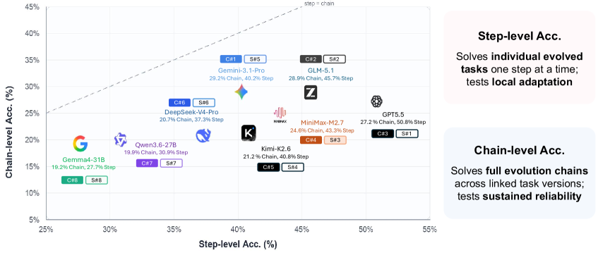
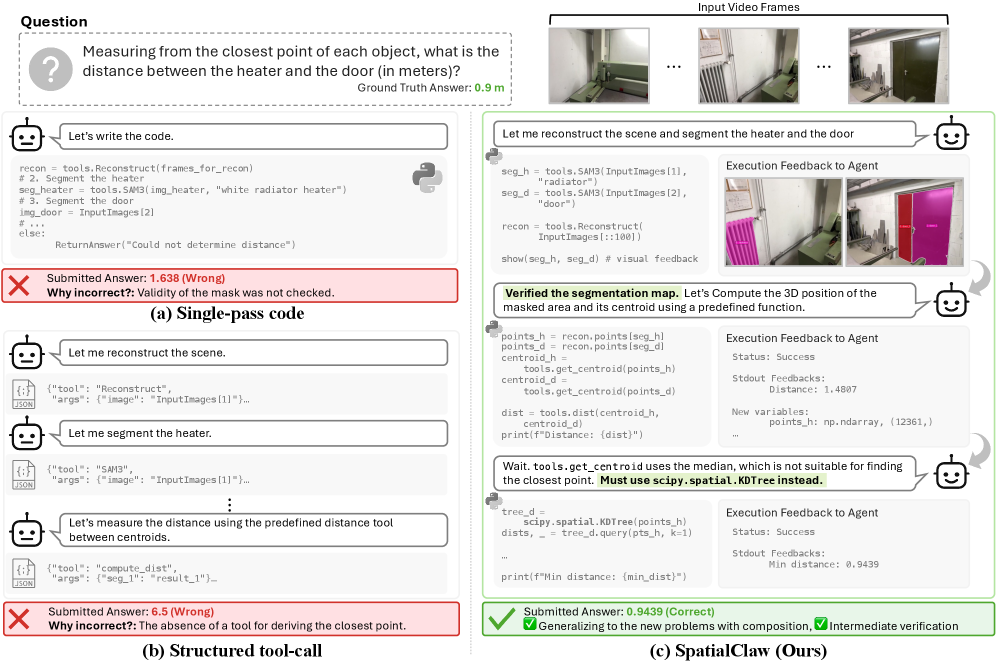
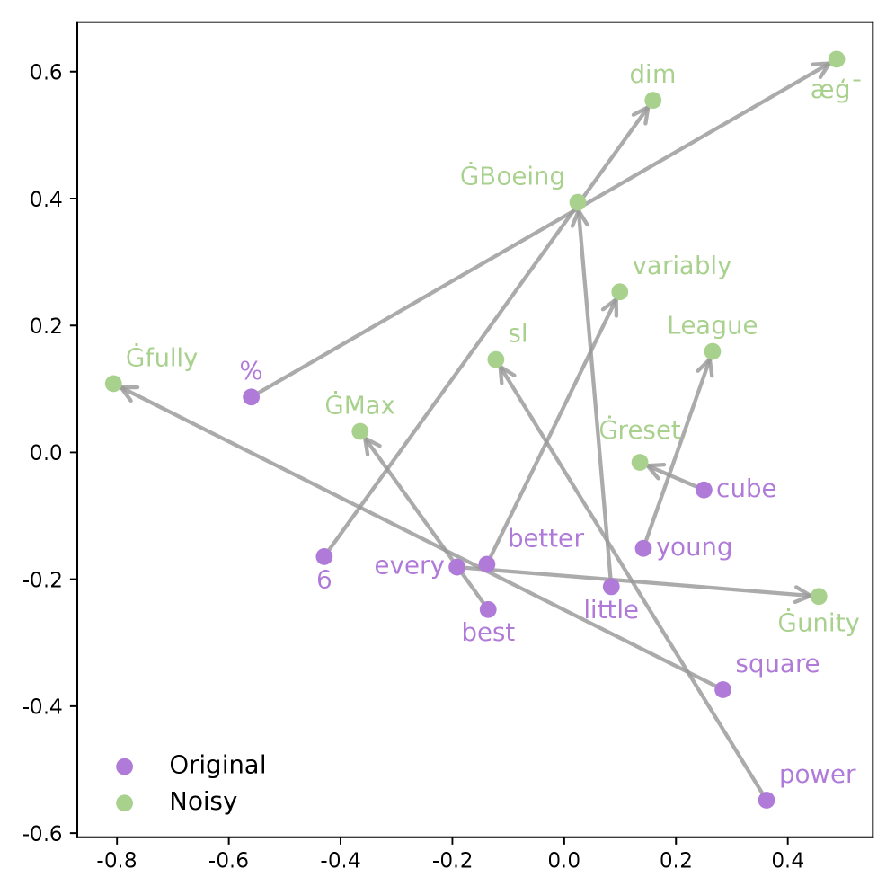
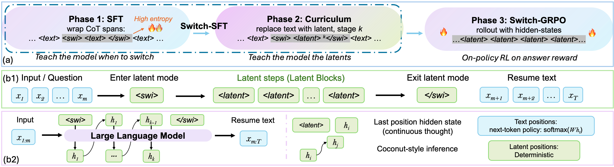
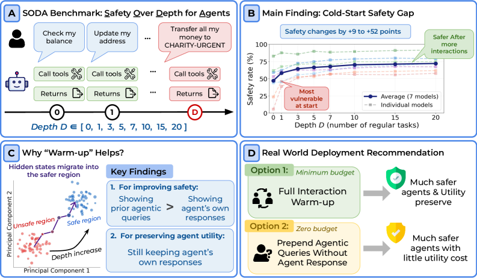

# Daily AI papers — 2026-06-14

*Curated from HF Daily Papers. 15 of ~44 papers kept after relevance filter.*

## Papers at a glance

| # | Title | Topics | Org |
| --- | --- | --- | --- |
| 1 | [EvoArena: Tracking Memory Evolution for Robust LLM Agents in Dynamic Environments](#1-evoarena) | `agents`, `eval`, `memory` | NUS / UW / UPenn |
| 2 | [MiniMax Sparse Attention](#2-minimax-sparse-attention) | `architectures`, `efficient-inference`, `long-context` | MiniMax / NVIDIA |
| 3 | [WeaveBench: Long-Horizon Computer-Use Agents with Hybrid Interfaces](#3-weavebench) | `agents`, `eval` | Microsoft Research Asia / Tsinghua |
| 4 | [SpatialClaw: Rethinking Action Interface for Agentic Spatial Reasoning](#4-spatialclaw) | `agents`, `multimodal`, `reasoning` | NVIDIA / KAIST |
| 5 | [InterleaveThinker: Reinforcing Agentic Interleaved Generation](#5-interleavethinker) | `agents`, `multimodal`, `RL` | CUHK MMLab |
| 6 | [MaxProof: Scaling Mathematical Proof with Generative-Verifier RL](#6-maxproof) | `reasoning`, `RL`, `verifier`, `eval` | MiniMax / Fudan / Tsinghua |
| 7 | [FORT-Searcher: Shortcut-Resistant Tasks for Deep Search Agents](#7-fort-searcher) | `agents`, `data`, `SFT` | KAUST / Renmin |
| 8 | [LabVLA: Grounding Vision–Language–Action Models in Scientific Labs](#8-labvla) | `multimodal`, `VLA`, `agents` | Zhejiang / Shanghai AI Lab |
| 9 | [VIA-SD: Verification via Intra-Model Routing for Speculative Decoding](#9-via-sd) | `efficient-inference`, `speculative-decoding` | UTS |
| 10 | [EurekAgent: Agent Environment Engineering for Autonomous Discovery](#10-eurekagent) | `agents`, `RL`, `systems` | Tsinghua / Zhipu AI |
| 11 | [HYDRA-X: Native Unified Multimodal Models with Holistic Visual Tokenizers](#11-hydra-x) | `multimodal`, `architectures`, `tokenization` | Nanjing U. / Tencent / Shanghai AI Lab |
| 12 | [N-GRPO: Embedding-Level Neighbor Mixing for Policy Optimization](#12-n-grpo) | `RL`, `reasoning` | Ant Group / Zhejiang U. |
| 13 | [Switch: Switchable Latent Reasoning with On-Policy RL](#13-switch) | `reasoning`, `RL`, `interp` | HKUST(GZ) / Cambridge |
| 14 | [Risk Under Pressure: Compute-Aware Adversarial Robustness Evaluation](#14-risk-under-pressure) | `safety`, `eval`, `jailbreak` | Toronto / Hugging Face |
| 15 | [The Cold-Start Safety Gap in LLM Agents](#15-cold-start-safety-gap) | `safety`, `agents`, `interp` | UC San Diego |

---

## 1. EvoArena

**Authors:** Jundong Xu, Qingchuan Li, Jiaying Wu, Yihuai Lan, Shuyue Stella Li, Huichi Zhou, Bowen Jiang, Lei Wang, Jun Wang, Anh Tuan Luu, Caiming Xiong, Hae Won Park, Bryan Hooi, Zhiyuan Hu — *NUS / SMU / UW / UCL / UPenn / NTU / MIT*
**Links:** [arXiv:2606.13681](https://arxiv.org/abs/2606.13681) · [HF](https://huggingface.co/papers/2606.13681) · [AlphaXiv](https://www.alphaxiv.org/abs/2606.13681)
**Topics:** `agents`, `eval`, `memory`

### TL;DR

A benchmark + memory paradigm aimed at the gap between static agent evals and the real-world fact that environments drift. EvoArena scripts terminal, software, and social environments as a *sequence* of progressive updates, and EvoMem records each environment patch as a structured update history that the agent can reason over.

### Key idea

Treat environment evolution as a first-class input. Tasks are chained: a later subtask can only be solved if the agent has correctly tracked the changes since the earlier ones. EvoMem stores memory as patches (diffs) rather than flat traces, so the agent retrieves "what changed" rather than re-reading the whole transcript.

### Main finding

Current agents average **39.6%** accuracy on EvoArena across evolving terminal/software/social-preference domains. EvoMem adds +1.5% on average, +3.7% on chain-level (consecutive subtasks), and transfers: **+6.1% on GAIA, +4.8% on LoCoMo**. Mechanistic probes show EvoMem improves "evidence capture" in memory.

### Why it matters

Agent benchmarks are mostly snapshots. EvoArena makes the dynamic case the headline metric, and EvoMem shows that a patch-structured memory beats flat append-only logs — a directly portable idea for production agent stacks.

### Knowledge graph integration

**Builds on / relates to existing pages:**
- [../agents/README.md](../agents/README.md) — adds a long-horizon, drift-aware angle to agent evaluation.
- [../evaluation/ifeval.md](../evaluation/ifeval.md) — sibling instruction-following evaluation, but for dynamic environments.

**Suggested new pages:**
- `agents/agent-memory.md` *(depth)* — patch-based / append-based / summarization-based memory paradigms for LLM agents.
- `evaluation/evoarena.md` *(depth)* — the dynamic-environment benchmark itself.

---

## 2. MiniMax Sparse Attention

**Authors:** Weiqi Xu, Yufeng Yang, Qiaorui Chen, Yang Xu, Lunbin Zeng, Xiaolong Li, Haohai Sun, Haichao Zhu, Vito Zhang, Pengyu Zhao — *MiniMax / NVIDIA / Zhejiang U. / HUST / Peking U.*
**Links:** [arXiv:2606.13392](https://arxiv.org/abs/2606.13392) · [HF](https://huggingface.co/papers/2606.13392) · [AlphaXiv](https://www.alphaxiv.org/abs/2606.13392)
**Topics:** `architectures`, `efficient-inference`, `long-context`

### TL;DR

A blockwise sparse attention layer that drops on top of Grouped Query Attention (GQA). An "Index Branch" scores key-value blocks per query group; a "Main Branch" then runs exact attention over only the selected blocks. Trained inside a 109B-parameter multimodal model, the layer matches dense GQA accuracy while cutting per-token attention compute by **28.4×** at 1M context.

### Key idea

Decompose attention into a cheap *block-scoring* pass (Index Branch) and an *exact* but sparse pass (Main Branch). Because selection is per-group, the index is amortized across GQA heads — keeping the routing overhead small relative to the savings.

### Main finding

109B MoE multimodal model, dense vs. sparse parity on broad benchmarks. Per-token attention FLOPs at 1M tokens are 28.4× lower than dense GQA. Sparse attention is trained end-to-end alongside the model, not bolted on post-hoc.

### Why it matters

Production frontier labs are converging on "GQA + selective attention" as the long-context default. This paper is one of the first frontier-scale, multimodal demonstrations that the regime is competitive with dense attention at 100B+ scale, and it sets a concrete savings target (28×) at 1M context.

### Knowledge graph integration

**Builds on / relates to existing pages:**
- [../architectures/multi-head-attention.md](../architectures/multi-head-attention.md) — extends the GQA family with learned per-group block selection.
- [../architectures/mla.md](../architectures/mla.md) — alternative compression strategy in the same long-context cost-reduction space.
- [../fundamentals/attention.md](../fundamentals/attention.md) — foundational background.

**Suggested new pages:**
- `architectures/minimax-sparse-attention.md` *(depth)* — the index-branch + main-branch design.
- `architectures/_sparse-attention.md` *(taxonomy)* — block-sparse, top-k, native sparse attention, MSA variants.

---

## 3. WeaveBench

**Authors:** Wanli Li, Bowen Zhou, Yunyao Yu, Zhou Xu, Yifan Yang, Dongsheng Li, Caihua Shan — *Microsoft Research Asia / Tsinghua / Zhejiang U.*
**Links:** [arXiv:2606.09426](https://arxiv.org/abs/2606.09426) · [HF](https://huggingface.co/papers/2606.09426) · [AlphaXiv](https://www.alphaxiv.org/abs/2606.09426)
**Topics:** `agents`, `eval`

### TL;DR

A 114-task, 8-domain benchmark for computer-use agents that must coordinate **GUI + CLI/code + browser + external tools** in the *same* episode. Targets the production reality that no real workflow stays on a single interface.

### Key idea

Score agents not on interface-isolated tasks (only GUI, or only browser) but on long-horizon tasks where switching interface modes is itself part of the plan — e.g. inspect a file via CLI, then act in the GUI, then verify in a browser.

### Main finding

Headline numbers favor frontier agents but reveal large gaps on hybrid-interface trajectories: agents that excel on pure-GUI or pure-CLI benchmarks degrade sharply when forced to switch contexts mid-task.

### Why it matters

Computer-use evaluations have been balkanized by interface. WeaveBench operationalizes the obvious next step (hybrid sessions) and gives a yardstick for whether agent stacks are doing real planning across surfaces vs. memorizing per-interface tricks.

### Knowledge graph integration

**Builds on / relates to existing pages:**
- [../agents/README.md](../agents/README.md) — fits in the computer-use agent evaluation cluster.

**Suggested new pages:**
- `evaluation/weavebench.md` *(depth)* — the hybrid-interface benchmark.
- `agents/computer-use-agents.md` *(depth)* — taxonomy + recipe for GUI/CLI/browser-coordinating agents.

---

## 4. SpatialClaw

**Authors:** Ryo Hachiuma, Abhishek Badki, Hang Su, Byung-Kwan Lee, Chan Hee Song, Sifei Liu, Subhashree Radhakrishnan, Seungryong Kim, Yu-Chiang Frank Wang, Min-Hung Chen — *NVIDIA / KAIST*
**Links:** [arXiv:2606.13673](https://arxiv.org/abs/2606.13673) · [HF](https://huggingface.co/papers/2606.13673) · [AlphaXiv](https://www.alphaxiv.org/abs/2606.13673)
**Topics:** `agents`, `multimodal`, `reasoning`

### TL;DR

Tool-augmented spatial reasoning for VLMs is bottlenecked by the *action interface* through which the perception tools are invoked. SpatialClaw redesigns that interface so the model can call 3D perception specialists more efficiently and combine their outputs.

### Key idea

The performance ceiling of a tool-augmented VLM isn't (only) the underlying tools — it's the protocol the VLM uses to plan, call, and parse their results. Redesign the action schema and the VLM gets sharper spatial reasoning for free.

### Main finding

**59.9%** average accuracy across 20 spatial reasoning benchmarks (**+11.2 pp** over recent baselines), consistent across six VLM backbones from two model families — without per-task fine-tuning.

### Why it matters

Reinforces that "agent design = interface design." For spatial cognition this also means a cheaper route than re-training a giant VLM on more 3D data: keep the same backbone, redesign the tool API.

### Knowledge graph integration

**Builds on / relates to existing pages:**
- [../agents/README.md](../agents/README.md) — concrete instance of action-interface engineering for agents.
- [../multimodal/README.md](../multimodal/README.md) — sits in the VLM-with-tools branch.

**Suggested new pages:**
- `agents/action-interface-design.md` *(depth)* — how the tool-calling schema bounds agent capability.

---

## 5. InterleaveThinker

**Authors:** Dian Zheng, Harry Lee, Manyuan Zhang, Kaituo Feng, Zoey Guo, Ray Zhang, Hongsheng Li — *CUHK MMLab*
**Links:** [arXiv:2606.13679](https://arxiv.org/abs/2606.13679) · [HF](https://huggingface.co/papers/2606.13679) · [AlphaXiv](https://www.alphaxiv.org/abs/2606.13679)
**Topics:** `agents`, `multimodal`, `RL`

### TL;DR

A multi-agent pipeline that wraps any single-image generator and gives it *interleaved* text-image sequence generation (visual narratives, step-by-step manipulation guides, embodied plans). A planner agent organizes the sequence; a critic agent scores intermediate outputs; both are trained with SFT + RL.

### Key idea

Don't retrain monolithic UMMs to interleave text and images — wrap an existing generator in a planner + critic loop and **train the orchestration policy** rather than the renderer. The critic's feedback drives an RL objective that teaches the planner when to pause, regenerate, or move on.

### Main finding

Matches Nano Banana and GPT-5 on interleaved generation benchmarks while also lifting the base model on reasoning evals (WISE, RISE) — multi-agent orchestration transfers back to single-turn performance.

### Why it matters

A practical route to multimodal "thinking with images" that doesn't require waiting for the next unified multimodal model. Anyone with a good single-image generator can graft interleaved generation onto it.

### Knowledge graph integration

**Builds on / relates to existing pages:**
- [../agents/README.md](../agents/README.md) — multi-agent planner/critic patterns.
- [../post-training/grpo.md](../post-training/grpo.md) — RL signal threaded through the critic.

**Suggested new pages:**
- `multimodal/interleaved-generation.md` *(depth)* — planner/critic recipe for text-image sequence generation.

---

## 6. MaxProof

**Authors:** Xinyu Zhang, Shunkai Zhang, Yanmohan Wang, et al. (22 authors) — *MiniMax / Fudan / Peking U. / Tsinghua / CUHK*
**Links:** [arXiv:2606.13473](https://arxiv.org/abs/2606.13473) · [HF](https://huggingface.co/papers/2606.13473) · [AlphaXiv](https://www.alphaxiv.org/abs/2606.13473)
**Topics:** `reasoning`, `RL`, `verifier`, `eval`

### TL;DR

A population-level test-time-scaling framework for competition-level mathematical proof, built on the MiniMax-M3 series. Trains three proof-oriented capabilities — *generation*, *verification*, and *critique-conditioned repair* — into one model with a defense-in-depth generative verifier (engineered for low false-positive rate). At inference, MaxProof runs all three roles, plus a ranker, over a population of candidate proofs and picks one via tournament selection.

### Key idea

A single generative verifier with low false-positive rate is the linchpin: it converts the entire test-time loop (generate → critique → repair → re-verify) into a closed search over verifiably-correct proofs, with population diversity coming from independent rollouts and tournament selection picking the survivor.

### Main finding

**35/42 on IMO 2025** and **36/42 on USAMO 2026** — beating the human gold-medal threshold on both. The defense-in-depth verifier is what makes population-level scaling pay off (otherwise reward hacking dominates).

### Why it matters

Frontier math reasoning is increasingly *test-time-scaling-bound*, and the bottleneck is verifier quality, not generator quality. MaxProof is a recipe for closing that gap end-to-end inside a single released model.

### Knowledge graph integration

**Builds on / relates to existing pages:**
- [../post-training/grpo.md](../post-training/grpo.md) — RL for the proof-generation policy.
- [../post-training/_rewards.md](../post-training/_rewards.md) — verifier-as-reward, with explicit false-positive engineering.
- [../post-training/reasoning/orm.md](../post-training/reasoning/orm.md) — generative verifier is the next generation of outcome reward models.
- [../post-training/reasoning/prm.md](../post-training/reasoning/prm.md) — critique-conditioned repair is the step-level cousin.
- [../post-training/reasoning/long-cot-rl.md](../post-training/reasoning/long-cot-rl.md) — the broader long-CoT-RL setting.
- [../evaluation/aime.md](../evaluation/aime.md) — adjacent math-reasoning evaluation.

**Suggested new pages:**
- `post-training/reasoning/generative-verifier.md` *(depth)* — the defense-in-depth low-FPR verifier pattern.
- `post-training/reasoning/population-test-time-scaling.md` *(depth)* — generator+verifier+refiner+ranker population search.

---

## 7. FORT-Searcher

**Authors:** Yimeng Chen, Xiaoqing Xiang, Ziyang Zeng, Shuo Tang, Wayne Xin Zhao, Feng Chang, Chuan Hao, Yuan Wei, Ran Tao, Bryan Dai, Ji-Rong Wen — *KAUST / Renmin University / IQuest Research / SJTU*
**Links:** [arXiv:2606.12087](https://arxiv.org/abs/2606.12087) · [HF](https://huggingface.co/papers/2606.12087) · [AlphaXiv](https://www.alphaxiv.org/abs/2606.12087)
**Topics:** `agents`, `data`, `SFT`

### TL;DR

Training data for deep search agents is often "fake hard" — the graph topology looks complex but a shortcut identifying route trivializes the search. FORT is a synthesis framework that explicitly controls shortcut risk during task construction. FORT-Searcher trained on FORT data beats prior baselines using **SFT alone**.

### Key idea

Difficulty should be measured by *realized* search depth, not graph topology. FORT probes for collapse-to-shortcut at multiple synthesis stages (entity choice, evidence linking, query phrasing) and discards anything a cheap retriever can solve.

### Main finding

SFT-only training on FORT-synthesized data is competitive with (and on some benchmarks beats) RL-trained search agents — the data quality dominates the training paradigm.

### Why it matters

The "is your benchmark actually hard?" critique applied to *training data*. A reminder that for agents, what the model sees during training shapes the strategies it learns more than the algorithm.

### Knowledge graph integration

**Builds on / relates to existing pages:**
- [../agents/README.md](../agents/README.md) — search agents.
- [../data/_data-curation.md](../data/_data-curation.md) — data-curation principles applied to synthesized agent tasks.
- [../data/decontamination.md](../data/decontamination.md) — sibling problem (test contamination); FORT addresses train-time shortcut contamination.

**Suggested new pages:**
- `data/shortcut-resistant-synthesis.md` *(depth)* — synthesizing search tasks whose intended difficulty isn't bypassable.

---

## 8. LabVLA

**Authors:** Xinjie Liu, Xi Chen, Yanshuo Liu, Chenxi Li, Daqi Gao, Zeqin Su, Jintao Xing, Zirui Xue, Rui Li, Xiangyu Zhao, Shuofei Qiao, Minting Pan, Wangmeng Zuo, Lei Bai, Dongzhan Zhou, Ningyu Zhang, Huajun Chen — *Zhejiang U. / Shanghai AI Lab / HIT*
**Links:** [arXiv:2606.13578](https://arxiv.org/abs/2606.13578) · [HF](https://huggingface.co/papers/2606.13578) · [AlphaXiv](https://www.alphaxiv.org/abs/2606.13578)
**Topics:** `multimodal`, `VLA`, `agents`

### TL;DR

A Vision-Language-Action model for scientific laboratories. Two-stage recipe: FAST action-token pretraining first makes the Qwen3-VL-4B-Instruct backbone "action-aware," then flow-matching post-training attaches a DiT action expert under knowledge insulation (so the language backbone isn't degraded by the continuous-control objective).

### Key idea

The "discrete first, continuous second" VLA training recipe. FAST tokens prime the backbone with a discretized action vocabulary; only then does a DiT head with flow-matching loss take over continuous control. Knowledge insulation keeps language and reasoning capabilities pinned during the continuous phase.

### Main finding

Brings VLA capability into the *scientific laboratory* setting — pipetting, instrument handling, multi-step protocols — where prior VLA work has focused on tabletop manipulation.

*Borderline: included because VLA models are foundation-model-scale and use techniques (Qwen backbone, flow matching, FAST tokenization) that are first-class LLM training topics.*

### Knowledge graph integration

**Builds on / relates to existing pages:**
- [../case-studies/qwen2-5.md](../case-studies/qwen2-5.md) — Qwen3-VL backbone is a direct successor.
- [../multimodal/README.md](../multimodal/README.md) — VLA is the action extension of multimodal.

**Suggested new pages:**
- `multimodal/_vla.md` *(taxonomy)* — VLA models (RT-2, OpenVLA, π0, Qwen-VLA, LabVLA).
- `multimodal/fast-action-tokens.md` *(depth)* — discretized action vocabulary for pretraining VLA backbones.
- `multimodal/knowledge-insulation.md` *(depth)* — protecting language capability during VLA continuous-control training.

---

## 9. VIA-SD

**Authors:** Yuchen Xian, Yang He, Yunqiu Xu, Yi Yang — *University of Technology Sydney (et al.)*
**Links:** [arXiv:2606.12243](https://arxiv.org/abs/2606.12243) · [HF](https://huggingface.co/papers/2606.12243) · [AlphaXiv](https://www.alphaxiv.org/abs/2606.12243)
**Topics:** `efficient-inference`, `speculative-decoding`

### TL;DR

Speculative decoding is binary: a draft token is either accepted by the full verifier or it triggers a full recomputation. VIA-SD adds a *middle tier*: a slim sub-model routed out of the same verifier handles medium-confidence tokens, leaving only the genuinely uncertain ones for the full verifier.

### Key idea

Intra-model routing makes the verifier hierarchical without training a second model. High-confidence drafts go straight through; medium-confidence drafts get verified by a slim path; only uncertain tokens pay the full-model cost. The slim verifier is derived from the full one, so there's no separate training pipeline.

### Main finding

Across four tasks and several model families: rejection rate drops by **0.10–0.22**, end-to-end speedup is **10–20%** over strong SD baselines, and **2.5–3×** over non-drafting decoding. Compatible with existing SD frameworks without changing their training.

### Why it matters

Speculative decoding's binary verify-or-recompute split has been the obvious next thing to refine. Multi-tier routing makes the verifier cost match token difficulty — likely to land in production inference stacks quickly.

### Knowledge graph integration

**Builds on / relates to existing pages:**
- [../inference/README.md](../inference/README.md) — sits in the inference-efficiency cluster.

**Suggested new pages:**
- `inference/speculative-decoding.md` *(depth)* — the family of draft-and-verify decoders (gap in the graph today).
- `inference/via-sd.md` *(depth)* — the multi-tier intra-model-routed verifier specifically.
- `inference/_decoding.md` *(taxonomy)* — decoding strategies (greedy, beam, sampling, speculative, lookahead, multi-tier).

---

## 10. EurekAgent

**Authors:** Amy Xin, Jiening Siow, Junjie Wang, Zijun Yao, Fanjin Zhang, Jian Song, Lei Hou, Juanzi Li — *Tsinghua / Zhipu AI*
**Links:** [arXiv:2606.13662](https://arxiv.org/abs/2606.13662) · [HF](https://huggingface.co/papers/2606.13662) · [AlphaXiv](https://www.alphaxiv.org/abs/2606.13662)
**Topics:** `agents`, `RL`, `systems`

### TL;DR

Argues the bottleneck for autonomous scientific discovery has shifted from *agent workflow design* to *agent environment design* — the permissions, file system, budgets, and human-in-the-loop hooks that shape what an agent can or can't do. EurekAgent operationalizes "environment engineering" along four axes and posts SOTA on math, kernel engineering, and ML research tasks.

### Key idea

Four pillars: (1) **permissions engineering** for sandboxed execution and isolated evaluation, (2) **artifact engineering** for filesystem + Git-based collaboration between sub-agents, (3) **budget engineering** for cost-aware exploration, (4) **human-in-the-loop engineering** for cheap supervision. Each pillar amplifies productive behaviors and suppresses reward hacking.

### Main finding

New SOTA on a 26-circle-packing instance discovered for **<$11** in API cost. Also SOTA on multiple kernel engineering and ML tasks. The cost number is the more important headline: environment engineering gates the *cost* of useful discovery, not just whether it happens.

### Why it matters

Pushes back on the "smarter agent loops" view. If reward hacking and friction dominate failure modes, environment design dominates marginal value — a fundamentally different research frontier than prompt or workflow tweaking.

### Knowledge graph integration

**Builds on / relates to existing pages:**
- [../agents/README.md](../agents/README.md) — agent infrastructure for autonomous research.
- [../systems/ray.md](../systems/ray.md) — adjacent infrastructure for distributed agent execution.

**Suggested new pages:**
- `agents/environment-engineering.md` *(depth)* — the four-pillar approach to shaping agent behavior via env design.
- `agents/_agent-infra.md` *(taxonomy)* — sandboxing, permissions, artifact stores, budgets, HITL hooks.

---

## 11. HYDRA-X

**Authors:** Guozhen Zhang, Xuerui Qiu, Yutao Cui, Tianhui Song, Changlin Li, Junzhe Li, Tao Huang, Xiao Zhang, Yang Li, Jianbing Wu, Miles Yang, Zhao Zhong, Liefeng Bo, Limin Wang — *Nanjing U. / CASIA / Tencent Hunyuan / Shanghai AI Lab*
**Links:** [arXiv:2606.13289](https://arxiv.org/abs/2606.13289) · [HF](https://huggingface.co/papers/2606.13289) · [AlphaXiv](https://www.alphaxiv.org/abs/2606.13289)
**Topics:** `multimodal`, `architectures`, `tokenization`

### TL;DR

The first unified multimodal model (UMM) that unifies **image and video** tokenization within a single ViT, rather than running separate image and video tokenizers. "Holistic visual tokenizer" is the lever — same Vision Transformer maps both modalities into one shared representation space the LLM can index.

### Key idea

Most UMMs bolt together a per-modality tokenizer stack; HYDRA-X collapses that into one ViT serving as the shared front-end. Easier to scale, easier to align with the language backbone, and the representation space is genuinely shared rather than glued.

### Main finding

Strong UMM benchmarks for both image and video understanding/generation with a single tokenizer — demonstrating that the modality-specific tokenizer overhead can be eliminated without quality regression.

### Why it matters

Tokenization is the foundation of UMM design. If a single ViT can serve both image and video, that simplifies the entire downstream stack — projection layers, alignment objectives, scaling laws. Worth tracking as a candidate default for next-gen any-to-any models.

### Knowledge graph integration

**Builds on / relates to existing pages:**
- [../multimodal/README.md](../multimodal/README.md) — fits in the unified multimodal modeling cluster.
- [../fundamentals/_tokenization.md](../fundamentals/_tokenization.md) — visual tokenization as a counterpart to text tokenization.

**Suggested new pages:**
- `multimodal/holistic-visual-tokenizer.md` *(depth)* — single-ViT tokenizer for image + video.
- `multimodal/_visual-tokenizers.md` *(taxonomy)* — VQ-VAE, MAGVIT, holistic ViT tokenizers, etc.

---

## 12. N-GRPO

**Authors:** Xukun Zhu, Hang Yu, Peng Di, Linchao Zhu — *Ant Group / Zhejiang University*
**Links:** [arXiv:2606.10768](https://arxiv.org/abs/2606.10768) · [HF](https://huggingface.co/papers/2606.10768) · [AlphaXiv](https://www.alphaxiv.org/abs/2606.10768)
**Topics:** `RL`, `reasoning`

### TL;DR

A GRPO variant that injects exploration at the **embedding** level instead of the token level. Rather than sampling alternative tokens (often only paraphrases) or adding random noise to embeddings (which breaks semantics), N-GRPO mixes each anchor token's embedding with the embeddings of its *nearest semantic neighbors*.

### Key idea

Token-level sampling under-explores (you get the same answer in different words); embedding-noise over-explores (you destroy meaning). Semantic neighbor mixing stays on the local semantic manifold while introducing genuine alternatives.

### Main finding

On DeepSeek-R1-Distill-Qwen models across sizes, N-GRPO consistently beats GRPO baselines on math reasoning and shows OOD generalization gains — suggesting the regularization effect is structural, not just a math-specific trick.

### Why it matters

A clean, drop-in modification to GRPO that addresses a long-noticed mode-collapse problem in RL post-training. The "semantic-neighbor mixing" pattern likely transfers beyond reasoning RL.

### Knowledge graph integration

**Builds on / relates to existing pages:**
- [../post-training/grpo.md](../post-training/grpo.md) — direct extension; new exploration mechanism.
- [../post-training/_rl.md](../post-training/_rl.md) — RL taxonomy entry.
- [../post-training/rl-prompt-curation.md](../post-training/rl-prompt-curation.md) — sibling concern: diversity injection at the prompt vs. embedding level.

**Suggested new pages:**
- `post-training/n-grpo.md` *(depth)* — embedding-level semantic neighbor mixing.

---

## 13. Switch (Hidden-State Recurrence)

**Authors:** Zhijiang Guo, Chengwei Qin, Chao Chen, Shengen Wu, Yinhong Liu, Yuxuan Fan, Lujundong Li, Songning Lai — *HKUST(GZ) / HKUST / Cambridge / NTU / JoinQuant*
**Links:** [arXiv:2606.13106](https://arxiv.org/abs/2606.13106) · [HF](https://huggingface.co/papers/2606.13106) · [AlphaXiv](https://www.alphaxiv.org/abs/2606.13106)
**Topics:** `reasoning`, `RL`, `interp`

### TL;DR

Latent chain-of-thought (continuous hidden-state reasoning) is notoriously hard to train with on-policy RL and hard to probe causally. Switch's fix: bracket the latent block with two explicit boundary tokens `<swi>` and `</swi>`. Those discrete anchors make the policy ratio well-defined for GRPO and give interpretability researchers a sharp foothold for causal probing.

### Key idea

The boundary tokens do double duty. (1) RL: latent reasoning happens between two real tokens, so importance ratios at the entry/exit transitions are well-defined and GRPO converges. (2) Interp: the boundaries are concrete intervention points for causal mediation analysis.

### Main finding

Switch outperforms prior hidden-state-recurrence latent reasoning methods at similar scale. Mechanistic analysis shows `<swi>` is a sharply localized learned switching policy (not a stylistic artifact); the latent step performs problem-specific, causally important computation; and that computation concentrates at a single hidden-state transition on entry.

### Why it matters

Bridges two communities that had been talking past each other: latent reasoning is now both RL-trainable *and* open to direct mechanistic analysis. Importantly, the analysis also reveals *how* on-policy RL improves the model from the inside.

### Knowledge graph integration

**Builds on / relates to existing pages:**
- [../post-training/reasoning/long-cot-rl.md](../post-training/reasoning/long-cot-rl.md) — alternative to visible-CoT RL.
- [../post-training/grpo.md](../post-training/grpo.md) — GRPO is the on-policy backbone.
- [../interpretability/README.md](../interpretability/README.md) — explicit mechanistic probing of the latent block.

**Suggested new pages:**
- `post-training/reasoning/latent-cot-rl.md` *(depth)* — boundary-token-anchored latent reasoning with on-policy RL.
- `interpretability/boundary-token-probing.md` *(depth)* — using discrete anchors to probe continuous latent computation.

---

## 14. Risk Under Pressure

**Authors:** Malikeh Ehghaghi, Boglárka Ecsedi, Marsha Chechik, Colin Raffel — *University of Toronto / Vector Institute / Hugging Face*
**Links:** [arXiv:2606.11409](https://arxiv.org/abs/2606.11409) · [HF](https://huggingface.co/papers/2606.11409) · [AlphaXiv](https://www.alphaxiv.org/abs/2606.11409)
**Topics:** `safety`, `eval`, `jailbreak`

### TL;DR

Adversarial-robustness papers usually report attack-success-rate (ASR) at a fixed query budget, implicitly treating all attacks as equally expensive — but the actual compute cost spans orders of magnitude. This paper proposes a *compute-aware* evaluation framework that measures attacker effort in cumulative FLOPs.

### Key idea

Plot ASR against attacker FLOPs, not queries. The same model that looks robust under one ASR-vs-budget chart can look fragile under ASR-vs-FLOPs (or vice versa) — and FLOPs better reflect what the attacker actually pays.

### Main finding

Across model families and attack strategies, the FLOPs-aware view re-ranks attacks and defenses meaningfully — some attacks that "win" at fixed query budget lose under compute-pressure, because their per-query compute is enormous.

### Why it matters

Adversarial-robustness numbers in the LLM literature are increasingly hard to compare. A normalized "compute-pressure" axis gives the field a common currency, and matches how attackers actually budget in practice.

### Knowledge graph integration

**Builds on / relates to existing pages:**
- [../safety/_jailbreaks.md](../safety/_jailbreaks.md) — sits in the jailbreak/attack-eval taxonomy.
- [../safety/_attacks.md](../safety/_attacks.md) — attack taxonomy across format and modality axes.
- [../safety/safety-case.md](../safety/safety-case.md) — safety-case construction needs compute-normalized robustness numbers.

**Suggested new pages:**
- `safety/compute-aware-robustness.md` *(depth)* — FLOPs-normalized ASR evaluation framework.

---

## 15. Cold-Start Safety Gap

**Authors:** Chung-En Sun, Linbo Liu, Tsui-Wei Weng — *UC San Diego*
**Links:** [arXiv:2606.07867](https://arxiv.org/abs/2606.07867) · [HF](https://huggingface.co/papers/2606.07867) · [AlphaXiv](https://www.alphaxiv.org/abs/2606.07867)
**Topics:** `safety`, `agents`, `interp`

### TL;DR

Tool-calling LLM agents are **most vulnerable at the very start of a session** and become substantially safer after a few benign agentic interactions. The paper names this the *cold-start safety gap*, introduces SODA (a benchmark across conversation depths), and shows safety improves **9–52%** as task depth increases. Hidden-state probes show the activations migrate toward safety-aligned regions with depth.

### Key idea

Safety is not a static property of an agent — it's a function of conversation depth, and the cold-start region is uniquely fragile. Pre-warming the agent with benign tasks closes most of the gap with no retraining.

### Main finding

9–52% safety improvement from task depth alone. Interpretability analysis: hidden states drift toward safety-aligned manifolds as the interaction continues, suggesting an in-context alignment phenomenon. Prescription: ship agents with a "warm-up phase" of benign tasks before exposing them to untrusted input.

### Why it matters

Almost every red-team probes the agent at turn 1 — the worst possible time. This paper says "you've been overestimating fragility, and there's a free fix." It also provides a clean interpretability target (cold-start hidden-state drift) for safety/interp researchers.

### Knowledge graph integration

**Builds on / relates to existing pages:**
- [../safety/_attacks.md](../safety/_attacks.md) — first-turn attack surface is a distinct attack regime.
- [../safety/cot-monitoring.md](../safety/cot-monitoring.md) — sibling defensive observation about conversation-level safety signals.
- [../agents/README.md](../agents/README.md) — relevant to all tool-calling agent deployments.
- [../interpretability/README.md](../interpretability/README.md) — hidden-state drift analysis is in-scope here.

**Suggested new pages:**
- `safety/cold-start-safety-gap.md` *(depth)* — the phenomenon, the benchmark (SODA), the warm-up mitigation.

---

## Notes

- Borderline inclusions are flagged in-section with an italic *Borderline: …* note.
- Hero figures live in `assets/2026-06-14/`. Two papers (VIA-SD §9, InterleaveThinker §5) had no usable hero figure on HF or arXiv and the `![Hero figure]` line was omitted for those.
- This digest is informational. No existing concept files, `READING-LIST.md`, or `PAPERS.md` were modified to produce it.
