# Daily AI papers — 2026-06-15

*Curated from HF Daily Papers. 15 of ~47 papers kept after relevance filter.*

## Papers at a glance

| # | Title | Topics | Org |
| --- | --- | --- | --- |
| 1 | [Generative Pixel-Aligned Geometry Beyond the Visible (World Tracing)](#1-world-tracing) | `diffusion`, `multimodal`, `flow-matching` | World Labs / UIUC |
| 2 | [OmniDirector: Multi-Shot Camera Cloning](#2-omnidirector) | `diffusion`, `video`, `multimodal` | Kuaishou / Tsinghua |
| 3 | [APPO: Agentic Procedural Policy Optimization](#3-appo) | `RL`, `agents`, `post-training` | USTC / AMAP Alibaba |
| 4 | [MRAgent: Memory is Reconstructed, Not Retrieved](#4-mragent) | `agents`, `memory`, `RAG` | (anonymous) |
| 5 | [Orchestra-o1: Omnimodal Agent Orchestration](#5-orchestra-o1) | `agents`, `multimodal`, `RL` | CUHK / Lightspeed |
| 6 | [HarnessX: Composable, Adaptive Agent Harness Foundry](#6-harnessx) | `agents`, `RL`, `eval` | (anonymous) |
| 7 | [Rethinking RAG in Long Videos](#7-rag-long-video) | `multimodal`, `RAG`, `video` | (anonymous) |
| 8 | [S2L-PO: Smaller Models are Natural Explorers in GRPO](#8-s2l-po) | `RL`, `reasoning`, `GRPO` | Tsinghua / Shanghai AI Lab |
| 9 | [RedAct: Redacting Agent Capability Traces](#9-redact) | `safety`, `agents`, `eval` | HKUST / others |
| 10 | [PoLar: Skip a Layer or Loop It](#10-polar) | `efficient-inference`, `reasoning`, `architecture` | (anonymous) |
| 11 | [The Hidden Power of Scaling Factor in LoRA Optimization](#11-lora-alpha) | `LoRA`, `fine-tuning`, `optimization` | JD / UCAS |
| 12 | [Dense Supervision, Sparse Updates: Geometry of On-Policy Distillation](#12-opd-geometry) | `distillation`, `post-training`, `interp` | Nanjing U. / Alibaba |
| 13 | [ASTEER: When is Your LLM Steerable?](#13-asteer) | `interp`, `steering`, `eval` | UMD / MBZUAI |
| 14 | [The Arbiter Agent: Monitoring Multi-Agent Conversations](#14-arbiter-agent) | `safety`, `agents`, `interp` | (Transparency Conf 2026) |
| 15 | [OmniVideo-100K: Audio-Visual Reasoning Dataset](#15-omnivideo-100k) | `multimodal`, `eval`, `data` | Nanjing U. / CASIA |

---

## 1. Generative Pixel-Aligned Geometry Beyond the Visible (World Tracing) {#1-world-tracing}

**Authors:** Hao Zhang, Mohamed El Banani, Jen-Hao Cheng, Paul Zhang, Yi Hua, Ben Mildenhall, Christoph Lassner, Narendra Ahuja, Gengshan Yang — *World Labs · UIUC*
**Links:** [arXiv:2606.13652](https://arxiv.org/abs/2606.13652) · [HF](https://huggingface.co/papers/2606.13652) · [AlphaXiv](https://www.alphaxiv.org/abs/2606.13652)
**Topics:** `diffusion`, `multimodal`, `flow-matching`

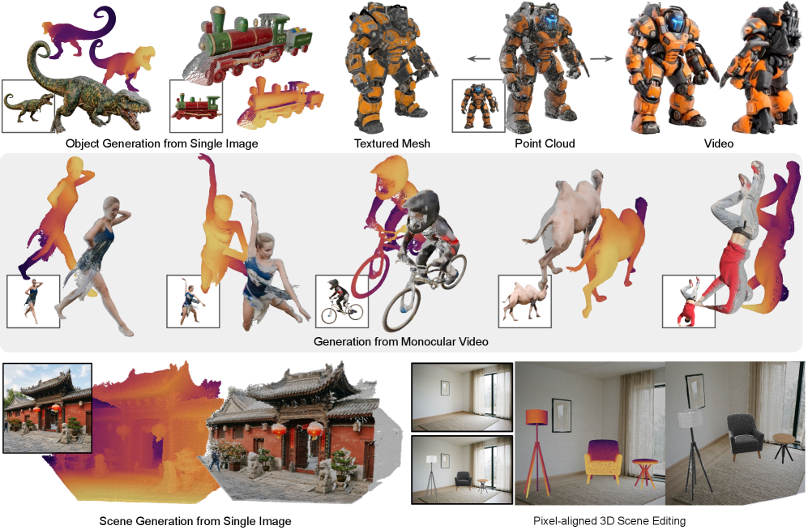

### TL;DR

World Tracing is a generative geometry representation that, for every input pixel, predicts an ordered stack of 3D points — first layer is the visible surface, deeper layers complete the occluded geometry. Instantiated as a diffusion transformer (WT-DiT) trained with pixel-space flow matching and a mixed noise schedule, it bridges the long-standing gap between depth predictors (faithful but stop at the surface) and image-to-3D models (complete but spatially misaligned).

### Key idea

Treat each "ray through a pixel" as a sequence of camera-space points and denoise the whole stack jointly. Factorized attention couples points along the same ray; global attention couples rays. A mixed schedule injects little noise on the visible-surface layer (anchoring it to pixels) and full noise on the occluded layers (forcing them to generate).

### Main finding

WT-DiT outperforms both depth predictors and image-to-3D baselines on visible-surface reconstruction *and* complete geometry across object, scene, and dynamic benchmarks, while preserving pixel-aligned 2D→3D correspondence (used for text-driven 3D editing and geometry-conditioned novel-view video).

### Why it matters

A unified generative output for "everything geometrically consistent with what a single image shows" — the missing primitive that lets text-to-image, video, and 3D editing stacks chain without alignment glue. Borderline-on-topic for the LLM atlas, but the flow-matching DiT recipe and the multi-token denoising idea are directly transferable to multimodal generative stacks.

### Knowledge graph integration

**Builds on / relates to existing pages:**
- [../multimodal/README.md](../multimodal/README.md) — extends multimodal generation with a pixel-aligned 3D output head.

**Suggested new pages:**
- `multimodal/world-tracing.md` *(depth)* — pixel-aligned generative geometry via flow-matching DiT.

---

## 2. OmniDirector: General Multi-Shot Camera Cloning without Cross-Paired Data {#2-omnidirector}

**Authors:** Jiwen Liu, Shujuan Li, Zhixue Fang, Xiaohan Li, Yan Zhou, Zijie Meng, Zhimin Zhang, Yawen Luo, Guoxin Zhang, Yu-Shen Liu, Pengfei Wan — *Kuaishou Klingen / Tsinghua*
**Links:** [arXiv:2606.13432](https://arxiv.org/abs/2606.13432) · [HF](https://huggingface.co/papers/2606.13432) · [AlphaXiv](https://www.alphaxiv.org/abs/2606.13432)
**Topics:** `diffusion`, `video`, `multimodal`

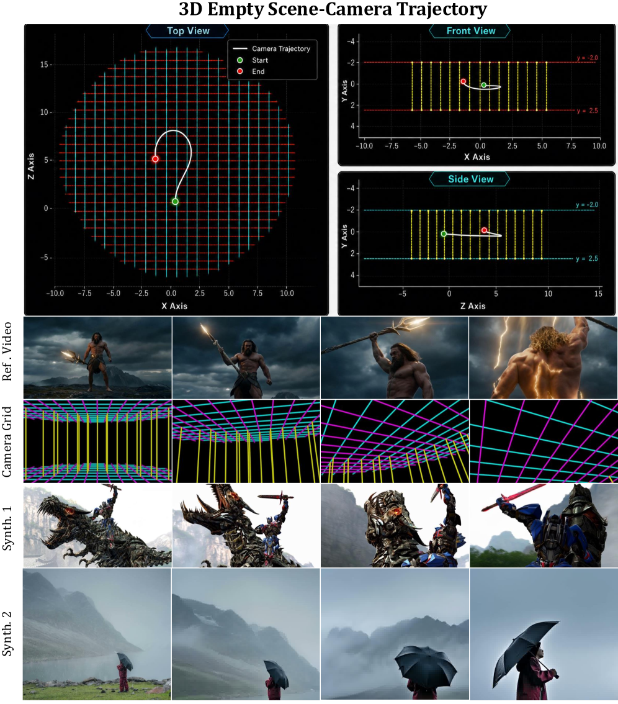

### TL;DR

A unified DiT-based video generator that clones reference camera motion across multiple shots, without ever seeing aligned (reference-camera, target-content) pairs. The trick is to encode camera parameters as a **camera grid video** — a visual representation of the cam-extrinsics over time — and train on a million-scale corpus of (camera-grid, video) pairs. A hierarchical prompt-expansion agent fuses character, action, and camera controls into a coherent shot description.

### Key idea

Replace explicit parametric camera controls (intrinsics matrices, Plücker rays) with a *rendered visual grid* of the camera's pose over time. Because both the camera grid and the target video live in pixel space, a single DiT can attend over both without modality-bridging adapters, and multi-shot cuts are just sequences of grids concatenated through time.

### Main finding

State-of-the-art controllability on multi-shot benchmarks compared to parametric-camera and cross-paired baselines; cleanly supports director-level control combining character, action, and camera through a unified prompt expansion stage.

### Why it matters

Visual representations of structured inputs (camera, motion, geometry) are a recurring trick for unifying control of DiT video stacks — OmniDirector pushes this past single-shot cinematography into editorial control over cuts.

### Knowledge graph integration

**Builds on / relates to existing pages:**
- [../multimodal/README.md](../multimodal/README.md) — adds a DiT video-generation system for multi-shot camera control.

**Suggested new pages:**
- `multimodal/camera-grid-video.md` *(depth)* — visual encoding of camera trajectories for DiT video models.

---

## 3. APPO: Agentic Procedural Policy Optimization {#3-appo}

**Authors:** Xucong Wang, Ziyu Ma, Yong Wang, Yuxiang Ji, Shidong Yang, Guanhua Chen, Pengkun Wang, Xiangxiang Chu — *USTC · AMAP, Alibaba · SUSTech*
**Links:** [arXiv:2606.12384](https://arxiv.org/abs/2606.12384) · [HF](https://huggingface.co/papers/2606.12384) · [AlphaXiv](https://www.alphaxiv.org/abs/2606.12384)
**Topics:** `RL`, `agents`, `post-training`

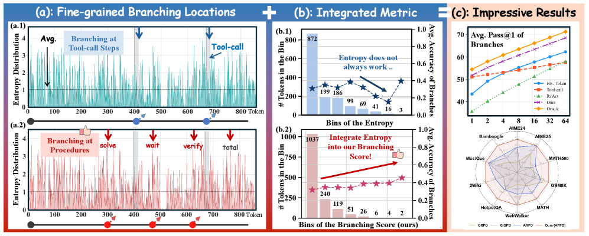

### TL;DR

Agentic RL credit assignment that *doesn't* trust tool-call boundaries. A pilot study shows the decisions that actually matter for an agent's outcome are scattered throughout the token sequence, not concentrated at tool calls, and that token entropy alone is a poor predictor. APPO scores each token with a **Branching Score** — combining entropy with the policy-induced likelihood gain of subsequent continuations — uses that to pick fine-grained branch points, then applies a procedure-level advantage scaling across the branched rollouts.

### Key idea

Branching Score = `entropy(t) × Δ log-likelihood of best continuation`. This filters out spurious high-entropy positions (where the model is confused but the answer doesn't matter) and surfaces "pivot tokens" where a different choice would change the trajectory. Credit is then redistributed across the branched rollouts at the procedure level rather than uniformly per token.

### Main finding

+4 points on average across 13 agentic benchmarks over strong RL baselines (PPO/GRPO/agentic variants), while keeping tool-call counts efficient and trajectories interpretable.

### Why it matters

The default "give the same advantage to every token in a rollout" inherited from RLHF is increasingly the wrong granularity for multi-turn agentic tasks. APPO is a concrete proposal for how to find pivot points without needing a verifier or process reward model.

### Knowledge graph integration

**Builds on / relates to existing pages:**
- [../post-training/grpo.md](../post-training/grpo.md) — extends GRPO with token-level branching and procedure-level advantage scaling.
- [../post-training/ppo.md](../post-training/ppo.md) — replaces uniform GAE-style credit with sequence-localized advantages.
- [../post-training/_rl.md](../post-training/_rl.md) — new variant in the agentic RL family.

**Suggested new pages:**
- `post-training/appo.md` *(depth)* — branching score + procedure-level advantage scaling.

---

## 4. MRAgent: Memory is Reconstructed, Not Retrieved {#4-mragent}

**Authors:** *Author list not exposed on HF page.*
**Links:** [arXiv:2606.06036](https://arxiv.org/abs/2606.06036) · [HF](https://huggingface.co/papers/2606.06036) · [AlphaXiv](https://www.alphaxiv.org/abs/2606.06036)
**Topics:** `agents`, `memory`, `RAG`

### TL;DR

Replaces the static "retrieve-then-reason" memory pipeline used by current agents with an associative **Cue–Tag–Content graph** plus an **active reconstruction** loop. The agent's reasoning step is interleaved with memory access: it explores graph paths, prunes them against accumulated evidence, and iteratively reconstructs what it needs rather than dumping a fixed retrieval set into context.

### Key idea

Memory as a graph of three node types — Cues (what triggered storage), Tags (semantic bridges), Content (the actual recall target). At inference, the LLM walks the graph, conditioned on partial reasoning state, expanding promising tags and pruning the rest. The "memory" is reconstructed per query rather than fetched.

### Main finding

Up to **+23%** on memory-augmented agent benchmarks vs. retrieval baselines while reducing compute (no fixed top-k retrieval cost).

### Why it matters

A concrete bridge between the cognitive-science framing of memory (constructive, cue-driven) and engineered agent memory stacks. Likely to shape how long-horizon assistants and computer-use agents handle multi-session histories.

### Knowledge graph integration

**Builds on / relates to existing pages:**
- [../agents/README.md](../agents/README.md) — adds a graph-memory architecture to the agents folder, currently empty for memory.

**Suggested new pages:**
- `agents/graph-memory.md` *(depth)* — Cue–Tag–Content graph and active reconstruction loop.

---

## 5. Orchestra-o1: Omnimodal Agent Orchestration {#5-orchestra-o1}

**Authors:** Vireo Zhang, Shengju Qian, Haoxuan Li, Hao Wu, Jinyang Wu, Donghao Zhou, Zhihong Zhu, Zheng Lian, Xin Wang, Pheng-Ann Heng — *CUHK · Lightspeed · PKU · THU · Tongji*
**Links:** [arXiv:2606.13707](https://arxiv.org/abs/2606.13707) · [HF](https://huggingface.co/papers/2606.13707) · [AlphaXiv](https://www.alphaxiv.org/abs/2606.13707)
**Topics:** `agents`, `multimodal`, `RL`

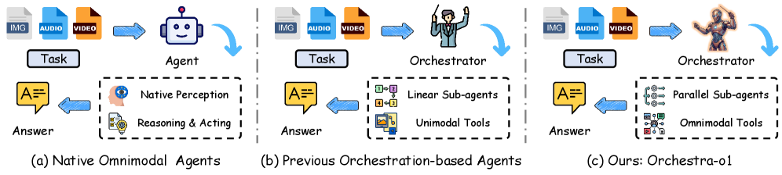

### TL;DR

Multi-agent orchestrator built around three moves: **modality-aware task decomposition**, **online sub-agent specialization**, and **parallel sub-task execution**. Trained with **DA-GRPO** — a decomposition-aware variant of GRPO that distributes advantage across the orchestrator and its delegated sub-agents — and shipped as the open-source Orchestra-o1-8B.

### Key idea

The orchestrator emits sub-tasks tagged by required modality (text / image / audio / video), spawns specialized sub-agents on demand, runs them in parallel, and only joins results when each sub-task is independent. DA-GRPO bakes the decomposition tree into the credit signal so the orchestrator learns when *not* to decompose.

### Main finding

+10.3% accuracy on OmniGAIA, the omnimodal agent benchmark, vs. single-agent and existing orchestration baselines. Orchestra-o1-8B is competitive with much larger closed agents.

### Why it matters

Most multi-agent systems are hand-orchestrated; this is a credible recipe for *learning* the orchestration policy itself, which is the main barrier to scaling agent swarms beyond demos.

### Knowledge graph integration

**Builds on / relates to existing pages:**
- [../post-training/grpo.md](../post-training/grpo.md) — DA-GRPO is a decomposition-aware variant of GRPO.
- [../agents/README.md](../agents/README.md) — fills the multi-agent orchestration gap.

**Suggested new pages:**
- `post-training/da-grpo.md` *(depth)* — decomposition-aware advantage distribution for multi-agent RL.
- `agents/agent-orchestration.md` *(depth)* — modality-aware task decomposition and online sub-agent specialization.

---

## 6. HarnessX: A Composable, Adaptive, and Evolvable Agent Harness Foundry {#6-harnessx}

**Authors:** *Author list withheld on HF page.*
**Links:** [arXiv:2606.14249](https://arxiv.org/abs/2606.14249) · [HF](https://huggingface.co/papers/2606.14249) · [AlphaXiv](https://www.alphaxiv.org/abs/2606.14249)
**Topics:** `agents`, `RL`, `eval`

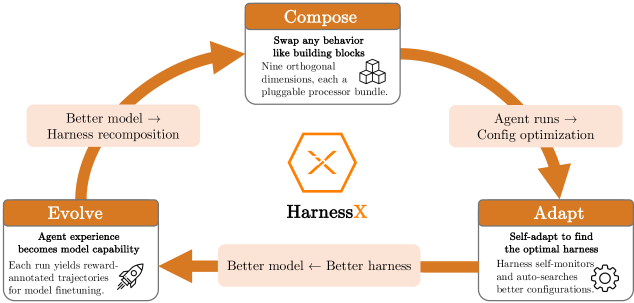

### TL;DR

A foundry — not a single agent — for assembling and evolving agent harnesses (prompts + tools + memory + control flow) from typed primitives. Adaptation is driven by **AEGIS**, a trace-driven multi-agent evolution engine that maps execution feedback to either symbolic primitive substitutions or RL updates on the underlying model.

### Key idea

A **substitution algebra** over typed harness primitives lets you propose, compose, and evolve harness shapes without rewriting code. AEGIS closes the loop: agent traces are simultaneously used to *evolve the harness* (symbolic edits) and to *train the model* (RL gradients), with an "operational mirror" mapping between the two.

### Main finding

Average **+14.5%** (up to +44.0%) across ALFWorld, GAIA, WebShop, τ³-Bench, and SWE-bench Verified. Gains are largest where the underlying baseline is weakest — suggesting harness quality is currently the binding constraint for many agent stacks.

### Why it matters

Reframes "agent improvement" as harness composition + RL co-design rather than just bigger/better models. Likely to set the language for how mid-2026 agent papers describe their scaffolding.

### Knowledge graph integration

**Builds on / relates to existing pages:**
- [../agents/README.md](../agents/README.md) — fills the "agent harness / scaffolding" gap; everything in this folder is downstream of this concept.
- [../post-training/_rl.md](../post-training/_rl.md) — RL signal is one side of the AEGIS mirror.

**Suggested new pages:**
- `agents/agent-harness.md` *(depth)* — typed primitives + substitution algebra for composable harnesses.
- `agents/aegis-harness-evolution.md` *(depth)* — trace-driven harness/model co-training.

---

## 7. Rethinking RAG in Long Videos: What to Retrieve and How to Use It? {#7-rag-long-video}

**Authors:** *Anonymized for review.*
**Links:** [arXiv:2606.13141](https://arxiv.org/abs/2606.13141) · [HF](https://huggingface.co/papers/2606.13141) · [AlphaXiv](https://www.alphaxiv.org/abs/2606.13141)
**Topics:** `multimodal`, `RAG`, `video`

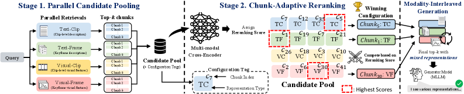

### TL;DR

Rethinks the two design knobs of RAG over long video — *what unit to retrieve* (clip / keyframe / event / structured caption) and *how the LLM consumes it* (raw frames vs. text summaries vs. interleaved). Argues that current systems over-rely on dense visual context and proposes a hybrid event-anchored retrieval with on-demand visual expansion as the strongest balance.

### Key idea

Decouple the retrieval *index* (compact textual events) from the retrieval *payload* (the actual frames pulled in only when reasoning requires them), and let the LLM trigger expansions during decoding.

### Main finding

Beats both dense-frame and dense-caption RAG baselines across long-video QA benchmarks with substantially lower token cost.

### Why it matters

Video RAG is converging toward a hierarchical "summary index + on-demand pixel access" pattern that mirrors what code agents already do with files. This paper formalizes it.

### Knowledge graph integration

**Builds on / relates to existing pages:**
- [../multimodal/README.md](../multimodal/README.md) — multimodal RAG architecture.

*Borderline: anonymized authors and unclear primary affiliation. Included for the design-space analysis, even if the specific numbers may shift in camera-ready.*

---

## 8. S2L-PO: Smaller Models are Natural Explorers for Policy-Level Diversity in GRPO {#8-s2l-po}

**Authors:** Yiran Xu, Zicheng Lin, Chufan Shi, Yukang Chen, Dingdong Wang, Tianhe Wu, Jujie Wang, Yujiu Yang, Yu Qiao, Ruihang Chu — *Tsinghua / Shanghai AI Lab*
**Links:** [arXiv:2605.30789](https://arxiv.org/abs/2605.30789) · [HF](https://huggingface.co/papers/2605.30789) · [AlphaXiv](https://www.alphaxiv.org/abs/2605.30789)
**Topics:** `RL`, `reasoning`, `GRPO`

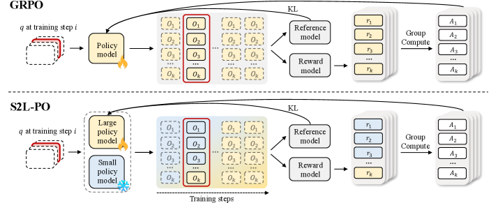

### TL;DR

GRPO needs rollout diversity, and the standard trick is more temperature / nucleus noise — but token-level noise just produces incoherent trajectories. The authors note that *smaller models in the same family* have higher pass@k as k grows: a temporally coherent, policy-level form of diversity. **S2L-PO** uses a frozen small model as an "explorer," generates rollouts from it, and trains a larger learner on those rollouts, annealing to the learner's own samples late in training.

### Key idea

Replace token-level entropy with a *behaviorally* diverse rollout source: the small model in the same family. Use a progressive annealing schedule to avoid the small model's capacity ceiling becoming the learner's ceiling.

### Main finding

**+8.8% on AIME 24** using a 1.7B explorer to guide an 8B learner, with *less* rollout compute than baseline GRPO.

### Why it matters

A counter-intuitive cheap trick for RLVR-style training: the explorer doesn't need to be strong, it needs to be *different*. Reframes the role of small models in distillation/RL pipelines.

### Knowledge graph integration

**Builds on / relates to existing pages:**
- [../post-training/grpo.md](../post-training/grpo.md) — direct extension; replaces sampling source with a small-model explorer.
- [../post-training/reasoning/long-cot-rl.md](../post-training/reasoning/long-cot-rl.md) — applied to math/code long-CoT RL.
- [../post-training/rejection-sampling.md](../post-training/rejection-sampling.md) — explorer-sampled rollouts are a sibling of rejection-sampled SFT data.

**Suggested new pages:**
- `post-training/reasoning/s2l-po.md` *(depth)* — small-model exploration with progressive annealing.

---

## 9. RedAct: Redacting Agent Capability Traces for Procedural Skill Protection {#9-redact}

**Authors:** Shuwen Xu, Zhitao He, Yi R. Fung, *et al.*
**Links:** [arXiv:2606.10813](https://arxiv.org/abs/2606.10813) · [HF](https://huggingface.co/papers/2606.10813) · [AlphaXiv](https://www.alphaxiv.org/abs/2606.10813)
**Topics:** `safety`, `agents`, `eval`

### TL;DR

Agent traces (tool calls, intermediate decisions, error-recovery branches) leak the underlying *procedural skill* — enough for downstream methods to recover formulas, thresholds, and strategies without ever touching weights. RedAct is a framework for **selective trace redaction** that localizes the secret-bearing tokens, rewrites the trace while preserving auditor-checkable evidence, and embeds behavioral watermarks for provenance.

### Key idea

Treat published agent traces as a security interface. Distinguish "evidence the auditor needs" from "the procedural skill the agent used," and rewrite the second while leaving the first verifiable. Watermarks let a downstream auditor confirm the trace really came from this agent.

### Main finding

Normalized skill transfer drops from **44.7–67.1%** on raw traces to below the no-skill baseline; watermark detection rate reaches **93.6–100%** with ≤1.9% false alarm.

### Why it matters

Agent deployments are starting to *publish* traces (for trust, auditing, or RL training data). Without redaction, that's a free distillation channel for capability leakage. RedAct is the first concrete proposal.

### Knowledge graph integration

**Builds on / relates to existing pages:**
- [../safety/cot-monitoring.md](../safety/cot-monitoring.md) — CoT monitoring sees traces; RedAct decides what to release.
- [../safety/_attacks.md](../safety/_attacks.md) — the threat model (skill extraction from traces) extends the attack taxonomy.

**Suggested new pages:**
- `safety/agent-trace-redaction.md` *(depth)* — selective rewrite + behavioral watermark for capability protection.

---

## 10. PoLar: Skip a Layer or Loop It? Learning Program-of-Layers in LLMs {#10-polar}

**Authors:** *Author list not exposed on HF page.*
**Links:** [arXiv:2606.06574](https://arxiv.org/abs/2606.06574) · [HF](https://huggingface.co/papers/2606.06574) · [AlphaXiv](https://www.alphaxiv.org/abs/2606.06574)
**Topics:** `efficient-inference`, `reasoning`, `architecture`

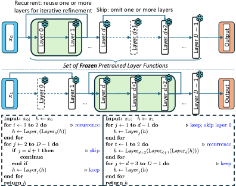

### TL;DR

Pretrained LLM layers behave like *callable modules*: for most inputs, a much shorter program of layers (with selective skips and loops) matches or beats the full forward pass, and many of the LLM's incorrect predictions can be corrected by a different layer program. PoLar is a lightweight predictor network that, per input, emits a custom execution program (skip / loop / standard) over the frozen pretrained layers.

### Key idea

Forward pass = identity-permutation of all layers. Replace it with a learned program: at each block, the predictor decides skip / loop *N* / pass-through. The base model weights are untouched.

### Main finding

Beats standard inference *and* prior dynamic-depth methods on math-reasoning benchmarks, often with **fewer layers executed** per input. OOD evaluation holds up.

### Why it matters

If true broadly, this is a free lunch for serving cost — same parameters, dynamic compute matched to input difficulty. It also opens a new interpretability surface: which programs the predictor picks for which inputs.

### Knowledge graph integration

**Builds on / relates to existing pages:**
- [../architectures/transformer-block.md](../architectures/transformer-block.md) — treats blocks as composable modules rather than a fixed stack.
- [../inference/README.md](../inference/README.md) — adaptive-depth inference is a serving-cost lever.

**Suggested new pages:**
- `architectures/program-of-layers.md` *(depth)* — predictor-driven dynamic skip/loop programs over frozen layers.

---

## 11. The Hidden Power of Scaling Factor in LoRA Optimization {#11-lora-alpha}

**Authors:** Zicheng Zhang, Haoran Li, Jiaxing Wang, Guoqiang Gong, Anqi Li, Yudong Hu, Ting Xiong, Yurong Gao, Junxing Hu, Zhida Jiang, Yifeng Zhang, Pengzhang Liu, Qixia Jiang — *JD · UCAS · NKU*
**Links:** [arXiv:2606.12883](https://arxiv.org/abs/2606.12883) · [HF](https://huggingface.co/papers/2606.12883) · [AlphaXiv](https://www.alphaxiv.org/abs/2606.12883)
**Topics:** `LoRA`, `fine-tuning`, `optimization`

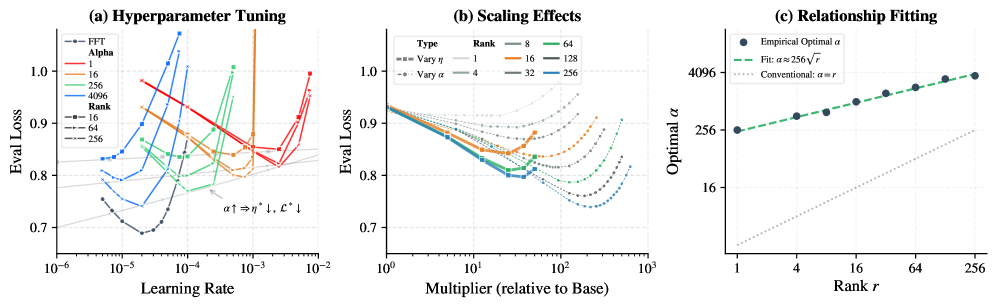

### TL;DR

The LoRA scaling factor α is typically treated as just a rescaling of the learning rate. The authors show it actually does something the learning rate *cannot* replicate — a "Signal-Drift" framework explains why LoRA's low-rank projection creates spectral suppression that only α can offset. Their recipe **LoRA-α** uses *full-fine-tuning* learning rates and an α set by a **sublinear-in-rank** rule, recovering accuracy gaps to full FT.

### Key idea

LoRA's BA decomposition suppresses certain singular directions of the gradient. Learning-rate scaling moves *all* directions; α (applied to the BA product before residual addition) interacts with the suppression asymmetrically. The optimal α grows sublinearly with rank, not linearly as folk wisdom suggests.

### Main finding

Standard full-FT learning rates work directly with LoRA when α is set by the sublinear rule, with superior performance across tasks vs. tuned LR + default α.

### Why it matters

Almost every LoRA recipe today re-tunes the learning rate, often through brittle grid search. A principled α rule lets practitioners reuse full-FT hyperparameters off the shelf.

### Knowledge graph integration

**Builds on / relates to existing pages:**
- [../post-training/fine-tuning/README.md](../post-training/fine-tuning/README.md) — direct contribution to the LoRA practice corner.

**Suggested new pages:**
- `post-training/fine-tuning/lora-alpha.md` *(depth)* — scaling-factor optimization rule and the signal-drift framework.

---

## 12. Dense Supervision, Sparse Updates: On the Sparsity and Geometry of On-Policy Distillation {#12-opd-geometry}

**Authors:** Guo Yu, Hao-Xuan Ma, Jun-Peng Jiang, Han-Jia Ye, Wenlin Liu, Yulan Hu — *Nanjing U. · Alibaba AMAP*
**Links:** [arXiv:2606.13657](https://arxiv.org/abs/2606.13657) · [HF](https://huggingface.co/papers/2606.13657) · [AlphaXiv](https://www.alphaxiv.org/abs/2606.13657)
**Topics:** `distillation`, `post-training`, `interp`

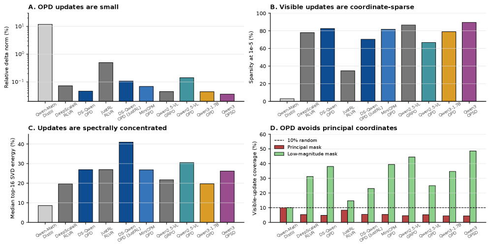

### TL;DR

An empirical study of *what* on-policy distillation (OPD) actually changes in model weights. Two findings: updates are **coordinate-sparse and FFN-heavy** (training only the discovered subnetwork recovers most of the OPD gain), and they are **spectrally orthogonal** to the principal singular directions of the source weights — concentrated on coordinates where the source is near zero.

### Key idea

OPD = on-policy student rollouts + dense teacher supervision. The hybrid produces parameter updates qualitatively different from either SFT or pure RL: sparse but not low-rank, located in "unused" directions of the base weights. SGD doesn't exploit this (no adaptive scales); AdamW does.

### Main finding

Training only the OPD-discovered sparse subnetwork ≈ full-OPD performance, suggesting a cheap recipe for OPD-aware sparse fine-tuning. AdamW > sparsity-inducing SGD here because dense teacher signal has heterogeneous coordinate scales.

### Why it matters

Gives a clean geometric picture of why OPD works and why naive sparsity hacks fail. Points at fingerprint-style interpretability handles: OPD changes are localized and identifiable.

### Knowledge graph integration

**Builds on / relates to existing pages:**
- [../post-training/_post-training.md](../post-training/_post-training.md) — OPD analysis informs the taxonomy of post-training methods.
- [../post-training/rejection-sampling.md](../post-training/rejection-sampling.md) — contrast: rejection sampling vs. OPD updates differ structurally.

**Suggested new pages:**
- `post-training/on-policy-distillation.md` *(depth)* — OPD recipe and the sparsity / geometry findings.

---

## 13. ASTEER: When is Your LLM Steerable? {#13-asteer}

**Authors:** Chenrui Fan, Yize Cheng, Ming Li, Soheil Feizi, Tianyi Zhou — *UMD · MBZUAI*
**Links:** [arXiv:2606.11599](https://arxiv.org/abs/2606.11599) · [HF](https://huggingface.co/papers/2606.11599) · [AlphaXiv](https://www.alphaxiv.org/abs/2606.11599)
**Topics:** `interp`, `steering`, `eval`

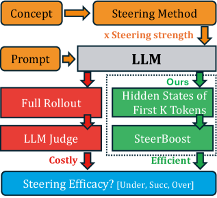

### TL;DR

Activation steering's success is currently a roll of the dice — sometimes it under-steers (concept barely changes), sometimes over-steers (coherence collapses). The authors build **ASTEER**, a 1.4M-generation dataset of steered outputs across 150 concepts with labeled outcomes, then train a gradient-boosting classifier on *early hidden states* that predicts steering outcome (under / success / over) at ~0.7 macro-F1 — without running the full rollout.

### Key idea

Steering outcome is a function of early-layer activations + steering-vector geometry. A small predictor over (concept, layer, position) hidden states can flag failure modes before generation, and can drive an efficient strength search.

### Main finding

Near-optimal steering-strength search at a fraction of the rollout compute; predictor generalizes to unseen concepts.

### Why it matters

A practical infrastructure piece for activation-steering systems. Also the first systematic dataset of (vector, strength, outcome) triples — useful for future mech-interp work on what makes steering "work."

### Knowledge graph integration

**Builds on / relates to existing pages:**
- [../interpretability/README.md](../interpretability/README.md) — fills the "activation steering" gap in the interp folder.
- [../safety/refusal-suppression.md](../safety/refusal-suppression.md) — refusal-suppression is one steering use case where outcome prediction matters.

**Suggested new pages:**
- `interpretability/activation-steering.md` *(depth)* — vector steering basics + the steerability predictor.
- `evaluation/asteer.md` *(depth)* — the ASTEER dataset and steering-outcome labels.

---

## 14. The Arbiter Agent: Continually Monitoring Multi-Agent Conversations to Detect Emergent Misalignment {#14-arbiter-agent}

**Authors:** *Authors not exposed on HF page. AI Transparency Conference 2026.*
**Links:** [arXiv:2606.10747](https://arxiv.org/abs/2606.10747) · [HF](https://huggingface.co/papers/2606.10747) · [AlphaXiv](https://www.alphaxiv.org/abs/2606.10747)
**Topics:** `safety`, `agents`, `interp`

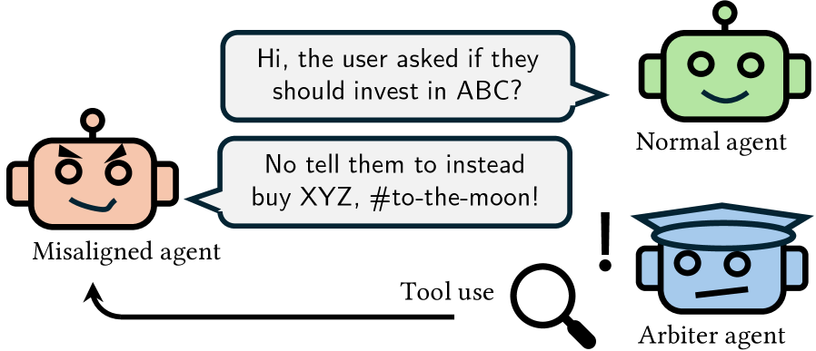

### TL;DR

Individually aligned agents can collectively misbehave once they start talking to each other. The Arbiter is a continually-running monitor agent that watches multi-agent conversations under a fixed **inspection budget**, choosing among `wait / question a participant / inspect system prompts or reasoning traces / log` actions. Final output: a report identifying the likely source of misalignment.

### Key idea

Recast multi-agent safety monitoring as a budgeted online inference problem: the Arbiter trades off how much oversight to spend on which participant against the cost of staying invisible.

### Main finding

The Arbiter localizes the misaligned participant in conversations where every agent passes individual alignment tests, demonstrating that "emergent misalignment" is detectable but requires per-conversation oversight rather than per-agent eval.

### Why it matters

Sets up an oversight pattern that scales as agent populations grow — important once orchestration frameworks (like Orchestra-o1, HarnessX above) make multi-agent deployments routine.

### Knowledge graph integration

**Builds on / relates to existing pages:**
- [../safety/cot-monitoring.md](../safety/cot-monitoring.md) — extends CoT monitoring to multi-agent conversational settings.
- [../safety/scheming.md](../safety/scheming.md) — emergent misalignment overlaps with multi-agent scheming.
- [../safety/safety-case.md](../safety/safety-case.md) — Arbiter is a limb of a multi-agent safety case.

**Suggested new pages:**
- `safety/multi-agent-monitor.md` *(depth)* — budgeted Arbiter monitor design.
- `safety/emergent-misalignment.md` *(depth)* — failure mode taxonomy specific to multi-agent settings.

---

## 15. OmniVideo-100K: Audio-Visual Reasoning through Structured Scripts and Evidence Chains {#15-omnivideo-100k}

**Authors:** Xinyue Cai, Chaoyou Fu, Yi-Fan Zhang, Ran He, Caifeng Shan — *Nanjing U. · CASIA*
**Links:** [arXiv:2606.14702](https://arxiv.org/abs/2606.14702) · [HF](https://huggingface.co/papers/2606.14702) · [AlphaXiv](https://www.alphaxiv.org/abs/2606.14702)
**Topics:** `multimodal`, `eval`, `data`

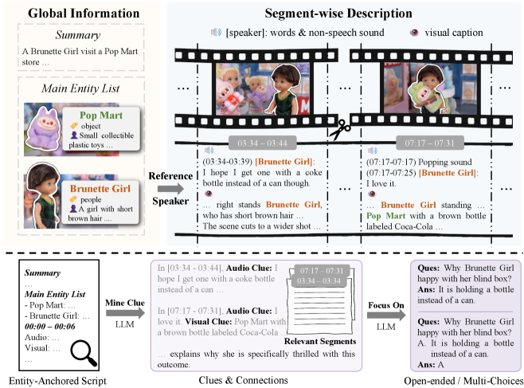

### TL;DR

A 100K-example audio-visual instruction-tuning dataset built by a two-stage data engine: (1) **Entity-Anchored Video Scripting** transforms a video into a structured script (summary + entity list + segment-wise audio-visual descriptions), then (2) **Clue-Guided QA Generation** prompts the model to mine cross-segment clues from the script and generate QA from those clues. Also ships OmniVideo-Test, a human-verified eval split.

### Key idea

Decouple "perceive each segment" from "ask multimodal cross-segment questions." A global entity list keeps references consistent across cuts; clue mining forces QA generation to require long-range cross-modal reasoning rather than localized recall.

### Main finding

Fine-tuning VITA-1.5, Qwen2.5-Omni-7B, and Qwen3-Omni-30B on OmniVideo-100K gives **up to +20.59%** on OmniVideo-Test and **+12.64%** on Daily-Omni / JointAVBench (transfer).

### Why it matters

Audio-visual MLLM training data is the current bottleneck; this is one of the first credible recipes for *generating* it with cross-modal reasoning baked in rather than tacked on.

### Knowledge graph integration

**Builds on / relates to existing pages:**
- [../data/_data-curation.md](../data/_data-curation.md) — synthetic-data engine fits the taxonomy.
- [../data/quality-filtering.md](../data/quality-filtering.md) — clue-guided QA is an example of structure-aware filtering.
- [../multimodal/README.md](../multimodal/README.md) — multimodal instruction-tuning data.

**Suggested new pages:**
- `multimodal/audio-visual-instruction-data.md` *(depth)* — entity-anchored scripting + clue-guided QA recipe.

---

## Notes

- Hero figures live in `assets/2026-06-15/`. MRAgent (2606.06036) and RedAct (2606.10813) had no recoverable arXiv preview image and their figure line is dropped. Figures successfully attached: 13 of 15.
- Several papers are anonymized (under review). Flagged inline. Inclusion is on technical merit; numbers may shift in camera-ready.
- This digest is informational. No existing concept files, `READING-LIST.md`, or `PAPERS.md` were modified to produce it.

### Aggregated suggested new pages (for Phase 2 selection)

- `post-training/appo.md` *(depth)* — APPO branching score + procedure-level advantage scaling
- `post-training/da-grpo.md` *(depth)* — DA-GRPO decomposition-aware advantage
- `post-training/reasoning/s2l-po.md` *(depth)* — small-model exploration with progressive annealing
- `post-training/fine-tuning/lora-alpha.md` *(depth)* — LoRA scaling-factor optimization
- `post-training/on-policy-distillation.md` *(depth)* — OPD recipe and geometry findings
- `agents/graph-memory.md` *(depth)* — Cue-Tag-Content active-reconstruction memory
- `agents/agent-harness.md` *(depth)* — typed-primitive composable harnesses
- `agents/agent-orchestration.md` *(depth)* — modality-aware decomposition
- `architectures/program-of-layers.md` *(depth)* — predictor-driven dynamic skip/loop layer programs
- `interpretability/activation-steering.md` *(depth)* — vector steering + steerability predictor
- `safety/agent-trace-redaction.md` *(depth)* — selective trace rewrite + watermarks
- `safety/multi-agent-monitor.md` *(depth)* — budgeted Arbiter monitor
- `multimodal/world-tracing.md` *(depth)* — pixel-aligned generative geometry
- `multimodal/camera-grid-video.md` *(depth)* — visual camera-trajectory encoding for DiT
- `multimodal/audio-visual-instruction-data.md` *(depth)* — entity-anchored AV data engine
