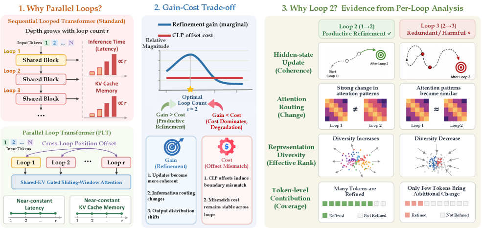
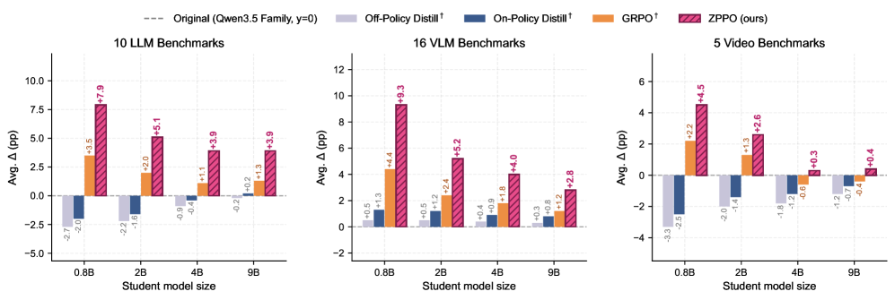
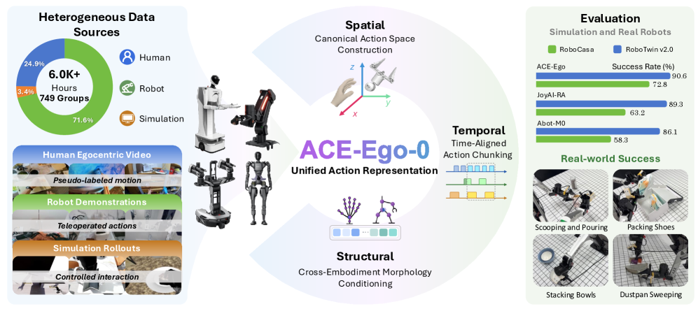
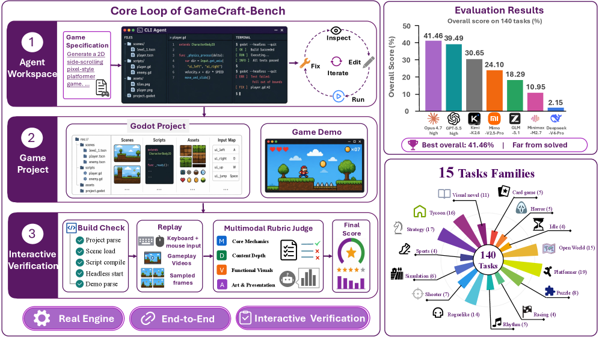
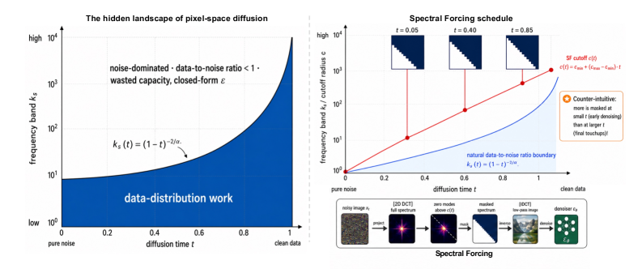
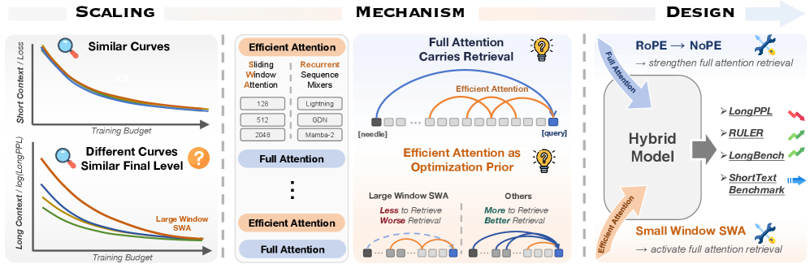
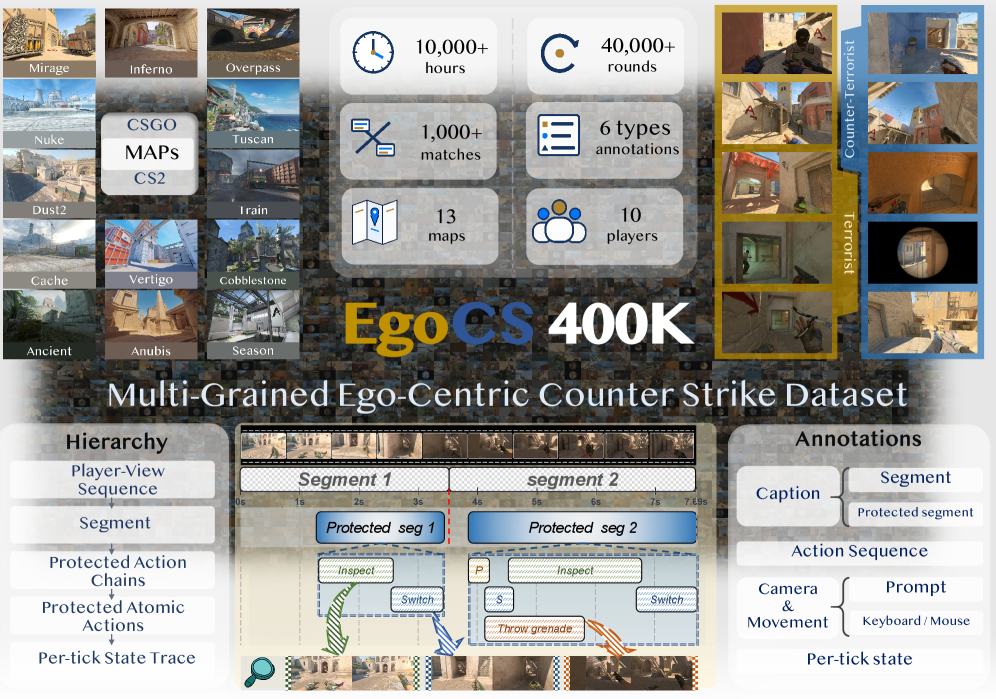
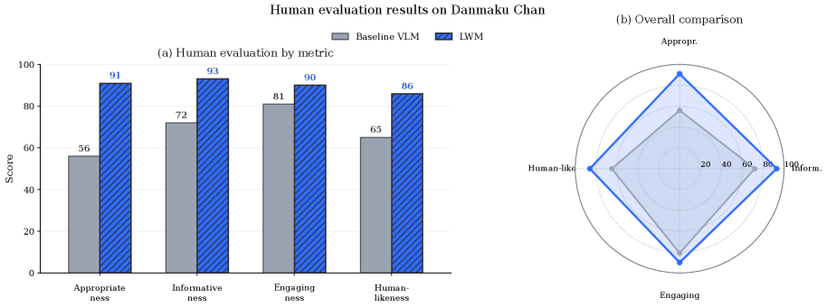
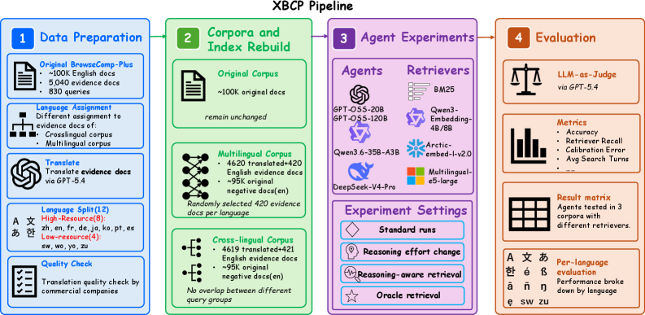
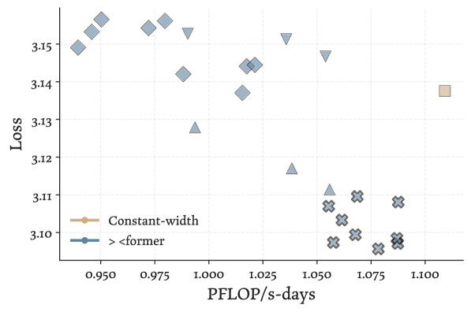

# Daily AI papers — 2026-06-17

*Curated from HF Daily Papers. 15 of ~31 papers kept after relevance filter.*

## Papers at a glance

| # | Title | Topics | Org |
| --- | --- | --- | --- |
| 1 | [LoopCoder-v2: Only Loop Once for Efficient Test-Time Computation Scaling](#1-loopcoder-v2) | `LLM`, `architectures`, `reasoning` | Beihang / Langboat |
| 2 | [Zone of Proximal Policy Optimization: Teacher in Prompts, Not Gradients](#2-zppo) | `RL`, `post-training`, `distillation` | NVIDIA |
| 3 | [ACE-Ego-0: Unifying Egocentric Human and Robotic Data for VLA Pretraining](#3-ace-ego-0) | `multimodal`, `VLA`, `data` | ACE Robotics / CUHK |
| 4 | [GameCraft-Bench: Can Agents Build Playable Games End-to-End in a Real Game Engine?](#4-gamecraft-bench) | `agents`, `eval`, `coding` | CUHK-SZ / Tencent |
| 5 | [Learning from the Self-future: On-policy Self-distillation for dLLMs](#5-d-opsd) | `dLLM`, `post-training`, `distillation` | Tsinghua / TUM / NTU |
| 6 | [OPD-Evolver: Cultivating Holistic Agent Evolver via On-Policy Distillation](#6-opd-evolver) | `agents`, `RL`, `distillation` | NUS |
| 7 | [Show the Signal, Hide the Noise: Spectral Forcing for Pixel-Space Diffusion](#7-spectral-forcing) | `diffusion`, `architectures` | (anonymous on HF) |
| 8 | [Text-Vision Co-Instructed Image Editing](#8-tv-edit) | `multimodal`, `diffusion` | HK PolyU / OPPO |
| 9 | [Unified Multimodal Autoregressive Modeling with Shared Context-Visual Tokenizer](#9-uniar) | `multimodal`, `architectures` | (Qwen-affiliated) |
| 10 | [Rethinking the Role of Efficient Attention in Hybrid Architectures](#10-hybrid-attention) | `architectures`, `attention`, `scaling` | Tsinghua / OpenBMB |
| 11 | [EgoCS-400K: An Egocentric Gameplay Dataset for World Models](#11-egocs-400k) | `data`, `world-models`, `multimodal` | CityU HK |
| 12 | [Looped World Models](#12-loopwm) | `world-models`, `architectures` | FaceMind Research Asia |
| 13 | [Beyond Monolingual Deep Research: XBCP Benchmark](#13-xbcp) | `agents`, `eval`, `retrieval` | Waseda / Northwestern |
| 14 | [A Gradient Perspective on RLVR Stability and Winner Advantage Policy Optimization](#14-wapo) | `RL`, `RLVR`, `post-training` | Layer 6 AI |
| 15 | [Variable-Width Transformers](#15-variable-width-transformers) | `architectures`, `scaling` | MIT / MIT-IBM |

---

## 1. LoopCoder-v2: Only Loop Once for Efficient Test-Time Computation Scaling

**Authors:** Jian Yang, Shawn Guo, Wei Zhang, Tianyu Zheng, Yaxin Du, Haau-Sing Li, Jiajun Wu, et al. — *Beihang / IQuest / Langboat / RUC*
**Links:** [arXiv:2606.18023](https://arxiv.org/abs/2606.18023) · [HF](https://huggingface.co/papers/2606.18023) · [AlphaXiv](https://www.alphaxiv.org/abs/2606.18023)
**Topics:** `LLM`, `architectures`, `reasoning`, `efficient-inference`

### TL;DR

A 7B Parallel Loop Transformer (PLT) coder trained from scratch on 18T tokens that studies how many times to re-apply a shared block at test time. The headline answer is *two*: a two-loop variant gives broad gains over the non-looped baseline, three or more loops regress, and the paper explains why through a gain–cost decomposition.

### Key idea

PLT scales test-time computation by re-running shared transformer blocks in parallel, paying a positional-mismatch tax (cross-loop position offsets, CLP) and a small KV-cache overhead (shared-KV gated sliding-window attention) per extra loop. The paper diagnoses the per-loop *gain* (representational refinement) vs. *cost* (CLP-induced positional drift, diminishing diversity) and finds a sharp saturation point at two loops.

### Main finding

LoopCoder-v2 with two loops lifts SWE-bench Verified from 43.0 → 64.4 (+21.4) and Multi-SWE from 14.0 → 31.0 (+17.0) over the non-looped 7B baseline. Three- and four-loop variants regress; diagnostics show later loops produce oscillatory, low-diversity updates while the CLP offset cost stays roughly fixed.

### Why it matters

Looped / universal-transformer-style depth recycling is one of the few architectural axes for cheap test-time compute scaling that doesn't blow up KV cache. This paper turns "how many loops?" from folklore into a measurable gain–cost trade-off and gives the first 7B-scale recipe that beats SWE-bench-class baselines with a single repeated block.

### Knowledge graph integration

**Builds on / relates to existing pages:**
- [../architectures/transformer-block.md](../architectures/transformer-block.md) — PLT reuses the same block across loops; this paper diagnoses where that breaks.
- [../architectures/multi-head-attention.md](../architectures/multi-head-attention.md) — shared-KV sliding-window attention is the loop-friendly attention variant.
- [../evaluation/livecodebench.md](../evaluation/livecodebench.md) — evaluation on code-agent and SWE-bench-style benchmarks.

**Suggested new pages:**
- `architectures/looped-transformer.md` *(depth)* — PLT mechanics, cross-loop positional offset, gain–cost trade-off.

---

## 2. Zone of Proximal Policy Optimization: Teacher in Prompts, Not Gradients

**Authors:** Byung-Kwan Lee, Ximing Lu, Shizhe Diao, Minki Kang, Saurav Muralidharan, Karan Sapra, Andrew Tao, Pavlo Molchanov, Yejin Choi, Yu-Chiang Frank Wang, Ryo Hachiuma — *NVIDIA*
**Links:** [arXiv:2606.18216](https://arxiv.org/abs/2606.18216) · [HF](https://huggingface.co/papers/2606.18216) · [AlphaXiv](https://www.alphaxiv.org/abs/2606.18216)
**Topics:** `RL`, `post-training`, `distillation`, `reasoning`

### TL;DR

ZPPO is a distillation-meets-RL recipe that moves the teacher signal *out* of the gradient and *into* the prompt. The student trains with RL on prompts that already contain a correct teacher answer and a wrong student answer, so the advantage signal is non-zero even when the student would otherwise fail every rollout.

### Key idea

Two prompt-conditioning tricks: **Binary Candidate-included Questions** pair a correct teacher rollout with an incorrect student rollout in the prompt, and **Negative Candidate-included Questions** aggregate the student's recent failures. A **prompt replay buffer** keeps hard questions in rotation until mastery or eviction. The teacher never contributes logits or gradients — only in-context demonstrations.

### Main finding

Across 31 benchmarks and Qwen3.5 students from 0.8B to 9B (with a 27B teacher), ZPPO outperforms both pure distillation and pure RL baselines, with the largest deltas at the smallest student scales — exactly the regime where logit-matching distillation collapses and pure RL has zero advantage signal.

### Why it matters

Small-model post-training is stuck between two failure modes: distillation overfits sharp teacher modes, and RLVR yields no signal when every rollout fails. ZPPO sidesteps both by treating the teacher as an in-context oracle — a clean separation that may generalize beyond reasoning to any verifiable-reward setting.

### Knowledge graph integration

**Builds on / relates to existing pages:**
- [../post-training/grpo.md](../post-training/grpo.md) — ZPPO is a GRPO-family policy update with teacher-augmented prompts.
- [../post-training/rlvr.md](../post-training/rlvr.md) — directly addresses the all-fail / zero-advantage failure mode of RLVR on small models.
- [../post-training/rl-prompt-curation.md](../post-training/rl-prompt-curation.md) — the prompt replay buffer is a form of difficulty-aware curation.

**Suggested new pages:**
- `post-training/zppo.md` *(depth)* — covers in-prompt teacher injection, BCQ/NCQ prompt shapes, and the replay buffer.

---

## 3. ACE-Ego-0: Unifying Egocentric Human and Robotic Data for VLA Pretraining

**Authors:** Hao Li, Ganlong Zhao, Yufei Liu, Haotian Hou, Guoquan Ye, Tongyan Fang, Chunxiao Liu, Siyuan Huang, Jianbo Liu, Xiaogang Wang, Hongsheng Li — *ACE Robotics / CUHK MMLab / CUHK-Shenzhen / SJTU / THU*
**Links:** [arXiv:2606.17200](https://arxiv.org/abs/2606.17200) · [HF](https://huggingface.co/papers/2606.17200) · [AlphaXiv](https://www.alphaxiv.org/abs/2606.17200)
**Topics:** `multimodal`, `VLA`, `data`, `pretraining`

### TL;DR

A unified VLA pretraining recipe that turns 1.48K hours of egocentric human video into robot-format pseudo-action labels and trains jointly with 4.53K hours of robot trajectories under a reliability-aware loss. Reaches SOTA on RoboCasa GR1 TableTop and RoboTwin 2.0 and transfers to real-world bimanual manipulation.

### Key idea

Three components: (1) a scalable video-to-action pipeline that emits robot-style pseudo-actions from raw human ego video, (2) a unified action space based on camera-space actions, morphology conditioning, and time-aligned action chunking, and (3) a *reliability-aware* training objective with a human auxiliary loss that down-weights the noisy pseudo-action supervision so it doesn't pollute the clean robot signal.

### Main finding

Joint training under reliability-aware weighting consistently beats robot-only training during both pretraining and SFT, with SOTA on RoboCasa GR1 TableTop and RoboTwin 2.0 and demonstrated transfer to a real bimanual manipulation setup.

### Why it matters

Egocentric human video is the largest available source of "what hands do in the world," but it has been hard to consume without action labels and embodiment mismatch. ACE-Ego-0 gives a concrete recipe (camera-space actions + morphology conditioning + noise-aware loss) for cashing that data in at VLA-pretraining scale.

### Knowledge graph integration

**Builds on / relates to existing pages:**
- [../multimodal/README.md](../multimodal/README.md) — VLA pretraining is the action-conditioned end of multimodal.
- [../data/quality-filtering.md](../data/quality-filtering.md) — reliability-aware weighting is a per-sample variant of quality filtering applied to noisy pseudo-labels.

**Suggested new pages:**
- `multimodal/vla-pretraining.md` *(depth)* — camera-space actions, morphology conditioning, pseudo-action pipelines.

---

## 4. GameCraft-Bench: Can Agents Build Playable Games End-to-End in a Real Game Engine?

**Authors:** Rongsheng Wang, Jiaxi Bi, Chenming Xu, Zhengyang Tang, et al. — *CUHK-Shenzhen / Tencent Hunyuan / USTB / SJTU / NUS*
**Links:** [arXiv:2606.17861](https://arxiv.org/abs/2606.17861) · [HF](https://huggingface.co/papers/2606.17861) · [AlphaXiv](https://www.alphaxiv.org/abs/2606.17861)
**Topics:** `agents`, `eval`, `coding`, `multimodal`

### TL;DR

A 140-task benchmark that asks coding agents to build complete, playable Godot games from a natural-language spec and grades the result by *actually playing* the game with replayed demonstrations and a rubric-guided multimodal judge. Frontier agents top out at 41.46%.

### Key idea

Formalize end-to-end game generation around three desiderata — **Engine Grounding** (must run in a real engine), **Artifact Completeness** (scripts + scenes + assets + rendering), and **Interactive Verification** (the rubric is evaluated against a replayed playthrough, not just the source code). The benchmark covers 15 game families and uses a multimodal judge to assess mechanics, visual feedback, and presentation coherence.

### Main finding

The strongest frontier coding agent scores only 41.46%; most score under 40%. Failure analysis shows agents implement recognizable mechanics but ship incomplete content, missing visual feedback, and incoherent presentation.

### Why it matters

Most "coding agent" benchmarks (SWE-bench, LiveCodeBench) measure patches against repos. GameCraft-Bench measures whether the agent's output is *playable* — a much harder integration test that exposes how far current agents are from end-to-end product delivery in non-text-only artifacts.

### Knowledge graph integration

**Builds on / relates to existing pages:**
- [../agents/README.md](../agents/README.md) — agent-evaluation landscape.
- [../evaluation/livecodebench.md](../evaluation/livecodebench.md) — sibling coding-agent benchmark with a much tighter scope.

**Suggested new pages:**
- `evaluation/gamecraft-bench.md` *(depth)* — interaction-grounded eval, multimodal rubric judging, the three desiderata.

---

## 5. Learning from the Self-future: On-policy Self-distillation for dLLMs

**Authors:** Yifu Luo, Zeyu Chen, Haoyu Wang, Xinhao Hu, Yuxuan Zhang, Zhizhou Sha, Shiwei Liu — *Tsinghua / TUM / NTU / UBC / UT Austin / ELLIS Tübingen*
**Links:** [arXiv:2606.18195](https://arxiv.org/abs/2606.18195) · [HF](https://huggingface.co/papers/2606.18195) · [AlphaXiv](https://www.alphaxiv.org/abs/2606.18195)
**Topics:** `dLLM`, `post-training`, `distillation`, `reasoning`

### TL;DR

d-OPSD is the first on-policy self-distillation recipe built for diffusion LLMs. Instead of prefix-conditioning the teacher (which assumes autoregressive order), the model uses its own future answer as *suffix* conditioning and supervises step-level rather than token-level distributions.

### Key idea

Two changes to standard OPSD: (1) the self-teacher conditions on the student's own self-generated answer as **suffix** context, which matches arbitrary-order diffusion generation, and (2) supervision is at the **step level** of the denoising trajectory, not at the token level — aligning the loss with how dLLMs actually decode.

### Main finding

On four reasoning benchmarks, d-OPSD beats both RLVR and SFT, while using ~10% of RLVR's optimization steps. Code released.

### Why it matters

Diffusion LLMs need their own post-training playbook — RLVR and AR-style distillation make AR assumptions that conflict with arbitrary-order denoising. d-OPSD is a clean recipe that finally lets dLLMs catch up on the post-training side without inheriting AR machinery.

### Knowledge graph integration

**Builds on / relates to existing pages:**
- [../post-training/rlvr.md](../post-training/rlvr.md) — d-OPSD beats RLVR on dLLMs while being much more sample-efficient.
- [../post-training/reasoning/long-cot-rl.md](../post-training/reasoning/long-cot-rl.md) — reasoning-RL companion for dLLM post-training.

**Suggested new pages:**
- `post-training/d-opsd.md` *(depth)* — suffix self-conditioning, step-level distillation for dLLMs.
- `architectures/diffusion-llm.md` *(depth)* — dLLM mechanics: arbitrary-order denoising, step-level decoding.

---

## 6. OPD-Evolver: Cultivating Holistic Agent Evolver via On-Policy Distillation

**Authors:** Guibin Zhang, Xun Xu, Yanwei Yue, Zikun Su, Wangchunshu Zhou, Xiaobin Hu, Shuicheng Yan — *NUS*
**Links:** [arXiv:2606.17628](https://arxiv.org/abs/2606.17628) · [HF](https://huggingface.co/papers/2606.17628) · [AlphaXiv](https://www.alphaxiv.org/abs/2606.17628)
**Topics:** `agents`, `RL`, `distillation`, `memory`

### TL;DR

A slow-fast co-evolution framework for memory-augmented agents: the fast loop interacts with a four-level memory hierarchy at test time, the slow loop uses outcome-calibrated memory attribution and privileged hindsight to distill those memory-management skills into the deployable policy.

### Key idea

Treat "use memory well" as four learnable abilities — select, act, write, maintain — and use **on-policy self-distillation** to internalize them. The slow loop has access to oracle outcome signals and privileged hindsight that the fast loop doesn't, so it can attribute which memory operations actually helped and bake that into the next iteration's policy weights.

### Main finding

OPD-Evolver-9B beats ReasoningBank-style memory systems by up to 11.5% and training-based methods like Skill0 by ~5.8% across multi-domain benchmarks. The 9B model challenges much larger agents (Qwen3.5-397B-A17B, Step-3.5-Flash) — memory internalization is doing real work.

### Why it matters

Memory-augmented agents have been growing increasingly bolted-on (vector stores, scratchpads, retrieval). OPD-Evolver argues the right move is to *bake the memory policy into the weights* via slow-loop distillation, which compresses the system and closes the gap with frontier-scale agents.

### Knowledge graph integration

**Builds on / relates to existing pages:**
- [../agents/README.md](../agents/README.md) — memory-augmented agent stack.
- [../post-training/_post-training.md](../post-training/_post-training.md) — on-policy self-distillation is the post-training engine here.
- [../systems/partial-rollouts.md](../systems/partial-rollouts.md) — slow/fast co-evolution shares rollout-system concerns.

**Suggested new pages:**
- `agents/agent-evolver.md` *(depth)* — four-level memory hierarchy, slow/fast loops, memory attribution.

---

## 7. Show the Signal, Hide the Noise: Spectral Forcing for Pixel-Space Diffusion

**Authors:** (not disclosed on HF page) — *Affiliation not disclosed*
**Links:** [arXiv:2606.15236](https://arxiv.org/abs/2606.15236) · [HF](https://huggingface.co/papers/2606.15236) · [AlphaXiv](https://www.alphaxiv.org/abs/2606.15236)
**Topics:** `diffusion`, `architectures`

### TL;DR

A parameter-free, time-conditional 2D-DCT low-pass operator applied to the noisy input before the patch embedder of a pixel-space diffusion model. By only feeding the denoiser the frequencies that actually carry signal at each diffusion time, it improves FID and Inception Score on ImageNet-256 with no extra parameters.

### Key idea

Under rectified-flow diffusion and natural-image power-law spectra, there's an analytic data-to-noise crossover frequency `k*(t) = (1-t)^(-2/α)` separating signal from noise at each time step. **Spectral Forcing** makes this implicit boundary explicit: a time-conditioned DCT low-pass operator zeroes the frequencies above `k*(t)` before the patch embedder, so the model's capacity is allocated to bands where signal exists.

### Main finding

On ImageNet-256 with JiT-700M/32, Spectral Forcing consistently improves FID and Inception Score across training epochs — a parameter-free, drop-in modification.

### Why it matters

Pixel-space diffusion (vs. latent diffusion) has been hampered by wasted capacity on noise-dominated bands. A grounded analytic justification *and* a parameter-free fix is a rare combination; it argues that capacity-efficient pixel-space DiTs are within reach without an autoencoder.

### Knowledge graph integration

**Builds on / relates to existing pages:**
- (No diffusion concept pages yet in the graph.)

**Suggested new pages:**
- `multimodal/spectral-forcing.md` *(depth)* — time-conditional DCT low-pass, signal-bearing band, capacity allocation.
- `multimodal/_diffusion.md` *(taxonomy)* — diffusion / flow-matching / rectified-flow overview.

---

## 8. Text-Vision Co-Instructed Image Editing (TV-Edit)

**Authors:** Chenxi Xie, Yuhui Wu, Qiaosi Yi, Lei Zhang — *HK PolyU / OPPO Research*
**Links:** [arXiv:2606.16767](https://arxiv.org/abs/2606.16767) · [HF](https://huggingface.co/papers/2606.16767) · [AlphaXiv](https://www.alphaxiv.org/abs/2606.16767)
**Topics:** `multimodal`, `diffusion`, `editing`

### TL;DR

Image editing with sparse *visual* prompts (clicks, scribbles, region marks) alongside textual instructions. Proposes a content-aware spatial controller plus the TV-Edit-23K dataset and a TV-Edit-Bench benchmark. *Borderline: included because the spatial-controller mechanism may transfer beyond editing to controllable generation.*

### Key idea

Most editing systems take either text or a mask but not both as instructive signals. TV-Edit lets the user paint a sparse visual prompt and write a parallel text instruction, then fuses them through a content-aware spatial controller that learns which modality dominates per region.

### Main finding

A new 23K paired text+visual-prompt dataset and the TV-Edit-Bench benchmark; the method matches or beats text-only editing baselines on tasks where text alone is ambiguous.

### Why it matters

Hands-on image editing has been bottlenecked by ambiguity in pure-text instructions ("make the left dog smaller" — which dog?). Co-instruction is the obvious fix; the contribution here is a clean controller architecture and a dataset to train it.

### Knowledge graph integration

**Builds on / relates to existing pages:**
- [../multimodal/README.md](../multimodal/README.md) — multimodal generation.

**Suggested new pages:**
- (Skip — primarily a dataset + controller engineering paper.)

---

## 9. Unified Multimodal Autoregressive Modeling with Shared Context-Visual Tokenizer (UniAR)

**Authors:** Wujian Peng, Lingchen Meng, Yuxuan Cai, Xianwei Zhuang, Yuhuan Yang, Rongyao Fang, Chenfei Wu, Junyang Lin, Zuxuan Wu, Shuai Bai — *(Qwen / Alibaba team)*
**Links:** [arXiv:2606.18249](https://arxiv.org/abs/2606.18249) · [HF](https://huggingface.co/papers/2606.18249) · [AlphaXiv](https://www.alphaxiv.org/abs/2606.18249)
**Topics:** `multimodal`, `architectures`, `tokenization`

### TL;DR

A unified autoregressive multimodal model that uses a **single discrete visual tokenizer** for both understanding and generation, so the model can directly read its own generated tokens without re-encoding. Adds multi-level feature fusion, lookup-free bitwise quantization, and parallel bitwise prediction to shrink visual sequence length.

### Key idea

Most "unified" MLLMs split visual tokenization: one tokenizer for understanding (semantic features), a different one for generation (pixel-faithful codes). UniAR commits to a **single shared tokenizer** used for both, which removes the re-encoding step and unlocks tighter closed-loop reasoning over generated images. Bitwise quantization + parallel prediction keep sequence length manageable.

### Main finding

State-of-the-art on image generation and editing benchmarks while remaining competitive on multimodal understanding — i.e., the shared tokenizer doesn't trade off either side.

### Why it matters

The "two-tokenizer" workaround has been a major architectural wart in unified multimodal models. UniAR shows that with the right discrete quantization scheme, a single tokenizer suffices — a meaningful simplification for any-to-any models.

### Knowledge graph integration

**Builds on / relates to existing pages:**
- [../fundamentals/_tokenization.md](../fundamentals/_tokenization.md) — extends discrete tokenization to the visual modality.
- [../multimodal/README.md](../multimodal/README.md) — unified multimodal stack.

**Suggested new pages:**
- `multimodal/shared-visual-tokenizer.md` *(depth)* — single-tokenizer unification, bitwise quantization, parallel bitwise prediction.

---

## 10. Rethinking the Role of Efficient Attention in Hybrid Architectures

**Authors:** Ziqing Qiao, Yinuo Xu, Chaojun Xiao, Zhou Su, Zihan Zhou, Yingfa Chen, Xiaoyue Xu, Xu Han, Zhiyuan Liu — *Tsinghua / OpenBMB*
**Links:** [arXiv:2606.15378](https://arxiv.org/abs/2606.15378) · [HF](https://huggingface.co/papers/2606.15378) · [AlphaXiv](https://www.alphaxiv.org/abs/2606.15378)
**Topics:** `architectures`, `attention`, `scaling`, `interp`

### TL;DR

A systematic study of hybrid architectures that mix full attention with efficient modules (sliding-window attention, recurrent sequence mixers). Finds that the efficient-attention design mostly affects *how fast* long-context capability emerges; with enough training, different hybrids converge — and long-range retrieval is carried almost entirely by the full-attention layers.

### Key idea

Decompose hybrid-attention design into three lenses — scaling behavior, mechanism, and architecture design. Mechanism analysis (via targeted retrieval probes) attributes long-range retrieval to the full-attention slices, while sliding-window / SSM-style modules shape the *optimization trajectory* rather than the eventual ceiling.

### Main finding

Across hybrid designs, long-context performance converges with sufficient training; efficient-attention choice is a sample-efficiency knob, not an asymptotic-capability one. Full-attention layers carry the long-range retrieval signal.

### Why it matters

Hybrid attention has become the default for long-context (Mamba-2, Jamba, RecurrentGemma, etc.) but the design space has been driven by intuition. This paper gives a clean empirical separation: pick your efficient module for training speed, not final performance, and don't strip out full-attention layers if you care about retrieval.

### Knowledge graph integration

**Builds on / relates to existing pages:**
- [../fundamentals/attention.md](../fundamentals/attention.md) — the full-attention layer this paper argues you can't remove.
- [../architectures/mla.md](../architectures/mla.md) — sibling attention variant for long-context efficiency.
- [../architectures/multi-head-attention.md](../architectures/multi-head-attention.md) — baseline attention block.

**Suggested new pages:**
- `architectures/_hybrid-attention.md` *(taxonomy)* — overview of full/SWA/SSM hybrid designs and what each layer type contributes.
- `architectures/sliding-window-attention.md` *(depth)* — SWA mechanics.

---

## 11. EgoCS-400K: An Egocentric Gameplay Dataset for World Models

**Authors:** Dong Liang, Yuhao Liu, Fang Liu, Tianyu Huang, Gerhard P. Hancke, Rynson W. H. Lau — *City University of Hong Kong*
**Links:** [arXiv:2606.18180](https://arxiv.org/abs/2606.18180) · [HF](https://huggingface.co/papers/2606.18180) · [AlphaXiv](https://www.alphaxiv.org/abs/2606.18180)
**Topics:** `data`, `world-models`, `multimodal`

### TL;DR

A 10,000-hour Counter-Strike replay corpus aligned as video-action-language trajectories: 400K+ first-person clips with synchronized actions, camera motion, states, and events. Built to train interactive world models that need more than captioned video.

### Key idea

World models need *temporally aligned* video-action-language data, not just captioned clips. The dataset is grounded in CS replays, so every frame has ground-truth actions, camera transforms, game states, and event labels — perfect for action-conditioned prediction, state-aware scene generation, and egocentric action understanding.

### Main finding

Three task tracks (action-conditioned prediction, state-aware scene generation, egocentric action understanding); baselines and dataset released as a public benchmark.

### Why it matters

Interactive world models have been data-starved relative to passive video generators. Replay-grounded datasets are the cheapest way to get action-aligned ego-video at scale, and Counter-Strike is a particularly clean source — discrete actions, deterministic state, replay APIs.

### Knowledge graph integration

**Builds on / relates to existing pages:**
- [../data/_data-curation.md](../data/_data-curation.md) — large-scale curated multimodal corpus.
- [../multimodal/README.md](../multimodal/README.md) — ego-video data for multimodal pretraining.

**Suggested new pages:**
- `data/egocs-400k.md` *(depth)* — Counter-Strike replay grounding, video-action-language alignment.

---

## 12. Looped World Models (LoopWM)

**Authors:** Hongyuan Adam Lu, Z.L. Victor Wei, Qun Zhang, Jinrui Zeng, et al. — *FaceMind Research Asia*
**Links:** [arXiv:2606.18208](https://arxiv.org/abs/2606.18208) · [HF](https://huggingface.co/papers/2606.18208) · [AlphaXiv](https://www.alphaxiv.org/abs/2606.18208)
**Topics:** `world-models`, `architectures`

### TL;DR

Apply the looped-transformer trick from LLMs to world modeling: a parameter-shared transformer block iteratively refines latent environment states, giving up to 100× parameter efficiency vs. conventional world models and adaptively scaling depth per prediction step.

### Key idea

A single transformer block, looped at inference, replaces a stack of distinct blocks. Each loop refines the latent environment state; the number of loops adapts to the complexity of each frame's prediction. This decouples "depth" from "parameter count," giving a new scaling axis (iterative latent depth) orthogonal to model size and data.

### Main finding

Up to 100× parameter efficiency vs. comparable conventional world models, with adaptive per-step compute. Long-horizon simulation degrades less due to the shared block's regularization.

### Why it matters

World models hit the same wall as LLMs: more depth → more compute → more compounding error. Looping a shared block trades width for adaptive depth and a much smaller checkpoint — particularly attractive on-device or for edge robotics.

### Knowledge graph integration

**Builds on / relates to existing pages:**
- [../architectures/transformer-block.md](../architectures/transformer-block.md) — shared-block looping is a transformer-block reuse pattern.

**Suggested new pages:**
- (Defer — covered by the looped-transformer depth file from paper #1; LoopWM is a transferred application.)

---

## 13. Beyond Monolingual Deep Research: XBCP (Cross-Lingual BrowseComp-Plus)

**Authors:** Yuheng Lu, Qingcheng Zeng, Heli Qi, Puxuan Yu, Fuheng Zhao, Rui Yang, Hitomi Yanaka, Naoto Yokoya, Weihao Xuan — *Waseda / Northwestern / RIKEN AIP / Snowflake / Utah / Duke-NUS / U. Tokyo*
**Links:** [arXiv:2606.15345](https://arxiv.org/abs/2606.15345) · [HF](https://huggingface.co/papers/2606.15345) · [AlphaXiv](https://www.alphaxiv.org/abs/2606.15345)
**Topics:** `agents`, `eval`, `retrieval`, `multilingual`

### TL;DR

A controlled cross-lingual deep-research benchmark: keeps the English question and answer space of BrowseComp-Plus fixed but varies the language of the supporting documents. Lets you isolate retriever vs. agent failure modes when evidence is in a non-English source.

### Key idea

Hold the QA pair language-constant (English in, English out) and only swap the language of the evidence corpus. Now any drop in agent performance is attributable to cross-lingual retrieval or reasoning, not to surface-form confusion in the prompt — a clean ablation of the multilingual axis.

### Main finding

Frontier deep-research agents and retrievers degrade sharply when evidence is in a non-English language; the gap between same-language and cross-lingual retrieval is the dominant failure mode.

### Why it matters

Deep-research evaluation has been near-exclusively English-on-English, hiding a real weakness. XBCP is the right ablation shape for measuring this and should join BrowseComp / BrowseComp-Plus as a standard agent-eval check.

### Knowledge graph integration

**Builds on / relates to existing pages:**
- [../agents/README.md](../agents/README.md) — deep-research agent landscape.
- [../evaluation/README.md](../evaluation/README.md) — sibling browsing-agent benchmarks.

**Suggested new pages:**
- `evaluation/xbcp.md` *(depth)* — cross-lingual BrowseComp-Plus, retriever-vs-agent failure decomposition.

---

## 14. A Gradient Perspective on RLVR Stability and Winner Advantage Policy Optimization (WAPO)

**Authors:** Prasanth YSS, Zhichen Ren, Rasa Hosseinzadeh, Ilan Gofman, Yuqi Chen, Zhaoyan Liu, Guangwei Yu, Jesse C. Cresswell, Satya Krishna Gorti — *Layer 6 AI*
**Links:** [arXiv:2606.16154](https://arxiv.org/abs/2606.16154) · [HF](https://huggingface.co/papers/2606.16154) · [AlphaXiv](https://www.alphaxiv.org/abs/2606.16154)
**Topics:** `RL`, `RLVR`, `post-training`

### TL;DR

A token-level gradient analysis of why GRPO-style RLVR collapses, plus a fix: **Winner Advantage Policy Optimization** (WAPO) updates only on positive-advantage completions and clips like PPO. The taxonomy predicts how each token update affects next-token probability and entropy, indexed by advantage sign × token-distribution.

### Key idea

Build a taxonomy of token-level updates parameterized by (advantage sign, token's probability under current policy). The taxonomy predicts when an update shrinks vs. inflates entropy and when it pushes mass to or away from the right token. The observation: GRPO instability comes from negative-advantage updates on already-low-probability tokens. Drop them — only train on positive advantages.

### Main finding

WAPO removes the GRPO collapse mode in their analysis and matches or beats GRPO on RLVR benchmarks while being simpler. A clean theoretical framing that explains *why* the fix works.

### Why it matters

GRPO collapse has been an open practical issue across reasoning-RL deployments. A gradient-level taxonomy that explains *when* the algorithm is dangerous, and a one-line fix that follows from it, is the kind of contribution the field needs to mature post-training.

### Knowledge graph integration

**Builds on / relates to existing pages:**
- [../post-training/grpo.md](../post-training/grpo.md) — directly analyzes GRPO's failure modes and proposes a stable replacement.
- [../post-training/rlvr.md](../post-training/rlvr.md) — RLVR is the deployment setting where this collapse shows up.
- [../post-training/ppo.md](../post-training/ppo.md) — WAPO inherits PPO-style clipping.
- [../post-training/_rl.md](../post-training/_rl.md) — taxonomy entry point for RL post-training algos.

**Suggested new pages:**
- `post-training/wapo.md` *(depth)* — token-gradient taxonomy, positive-advantage-only updates, GRPO collapse analysis.

---

## 15. Variable-Width Transformers

**Authors:** Zhaofeng Wu, Oliver Sieberling, Shawn Tan, Rameswar Panda, Yury Polyanskiy, Yoon Kim — *MIT / MIT-IBM Watson AI Lab*
**Links:** [arXiv:2606.18246](https://arxiv.org/abs/2606.18246) · [HF](https://huggingface.co/papers/2606.18246) · [AlphaXiv](https://www.alphaxiv.org/abs/2606.18246)
**Topics:** `architectures`, `scaling`, `efficient-inference`

### TL;DR

Drop the assumption that all transformer layers have the same width. The ><former architecture keeps early and late layers wide and narrows the middle, joined by a parameter-free residual resizing mechanism. Tested 200M → 3B (dense + MoE) and consistently beats uniform-width baselines on loss while spending 22% fewer FLOPs and 15% less KV memory at matched quality.

### Key idea

A "bowtie" width schedule: wide → narrow → wide across depth. The residual stream is *resized* into the narrower middle layers and back out via a parameter-free linear projection (no extra weights). This concentrates parameters at the layers that most need them (early embedding-shaping, late readout) while still giving the model room to compose features in the middle.

### Main finding

22% FLOPs reduction at loss-matched scaling; 15% reduction in KV cache memory and I/O; consistent gains from 200M to 2B dense and 3B MoE.

### Why it matters

For ~30 years transformer width has been uniform. The bowtie shape suggests the existing uniform-width default is leaving substantial efficiency on the table — and the fix needs zero new parameters, just a different schedule and a residual resize.

### Knowledge graph integration

**Builds on / relates to existing pages:**
- [../architectures/transformer-block.md](../architectures/transformer-block.md) — variable-width is a transformer-block-shape change.
- [../architectures/_moe.md](../architectures/_moe.md) — gains also hold under MoE.

**Suggested new pages:**
- `architectures/variable-width-transformer.md` *(depth)* — bowtie width schedule, parameter-free residual resizing.

---

## Notes

- Borderline inclusions are flagged in-section with an italic *Borderline: …* note.
- Hero figures live in `assets/2026-06-17/`. Missing figures (papers 5, 6, 8, 9, 13, 14) mean the arXiv HTML build had no usable first figure URL.
- This digest is informational. No existing concept files, `READING-LIST.md`, or `PAPERS.md` were modified to produce it.
