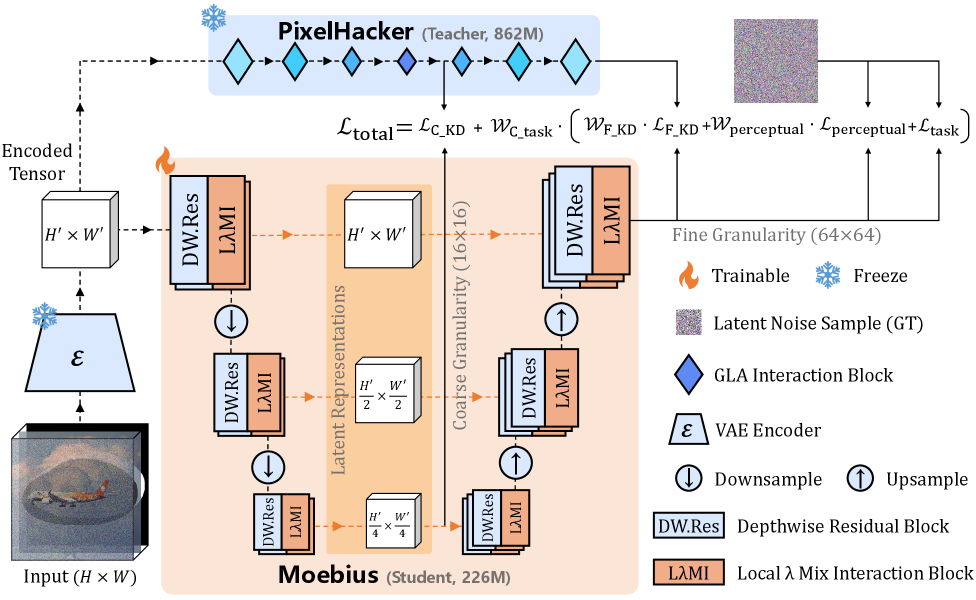
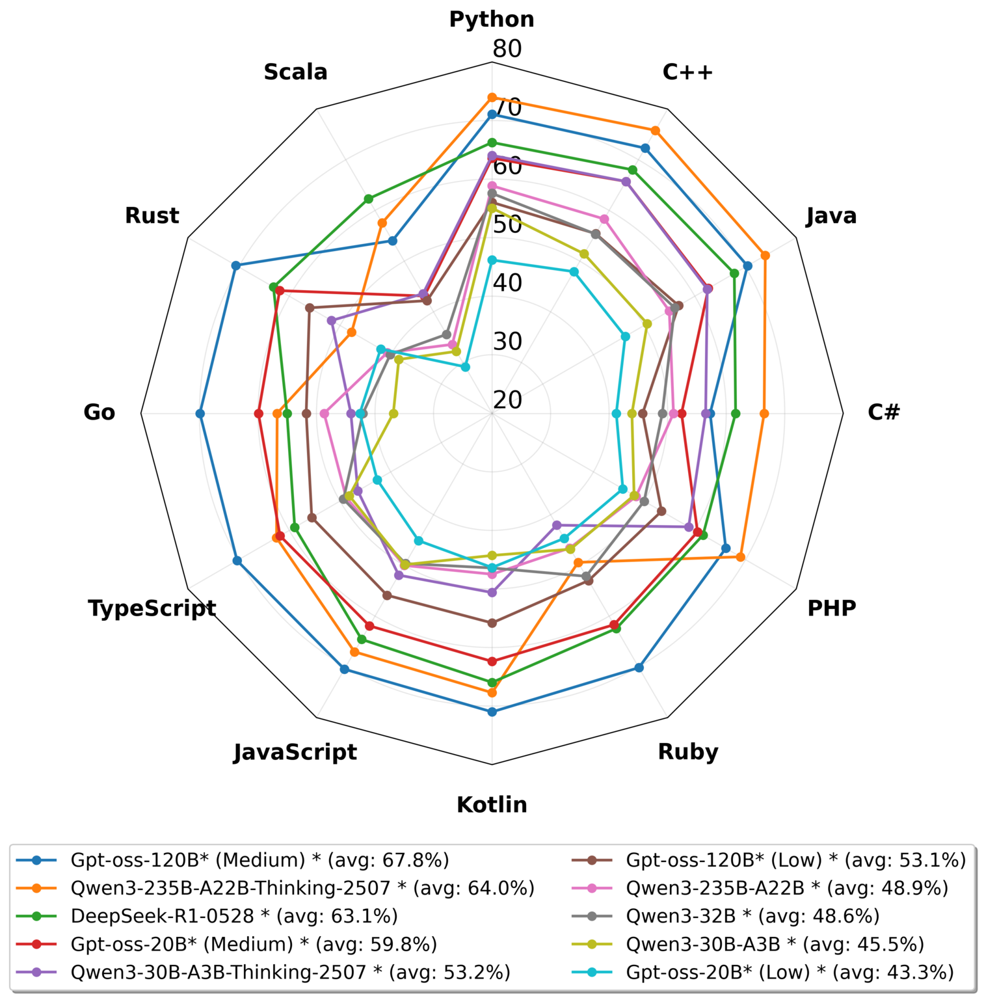
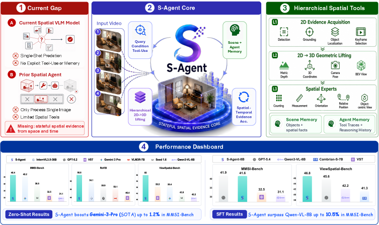
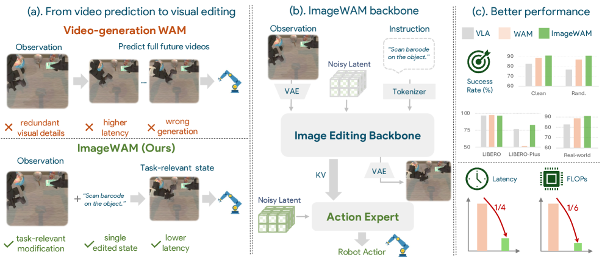
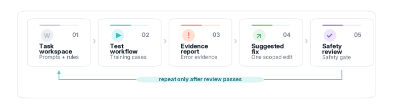
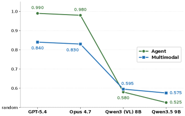
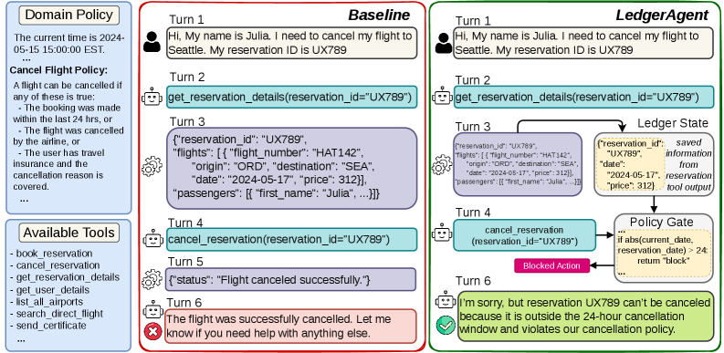
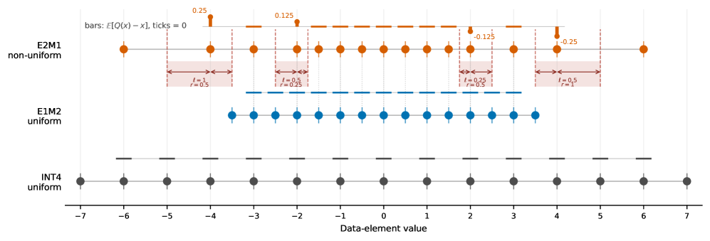
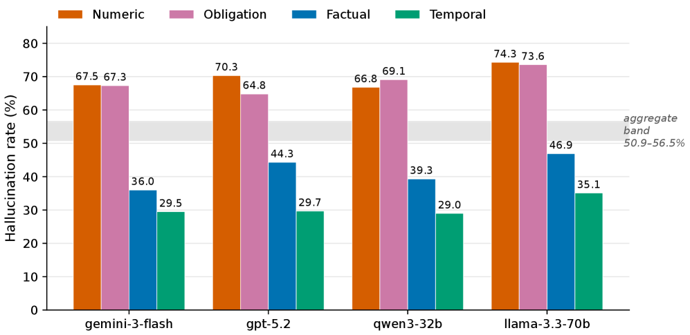

# Daily AI papers — 2026-06-20

*Curated from HF Daily Papers. 15 of ~34 papers kept after relevance filter.*

## Papers at a glance

| # | Title | Topics | Org |
| --- | --- | --- | --- |
| 1 | [Moebius: 0.2B Lightweight Image Inpainting Framework with 10B-Level Performance](#1-moebius) | `diffusion`, `distillation`, `efficient-inference` | HUST / VIVO AI Lab |
| 2 | [Multi-LCB: Extending LiveCodeBench to Multiple Programming Languages](#2-multi-lcb) | `eval`, `code` | GigaCode / Yandex |
| 3 | [S-Agent: Spatial Tool-Use Elicits Reasoning for Spatial Intelligence](#3-s-agent) | `agents`, `multimodal`, `reasoning` | NTU / Tsinghua / ByteDance |
| 4 | [Beyond Static Leaderboards: Predictive Validity for the Evaluation of LLM Agents](#4-beyond-static-leaderboards) | `eval`, `agents` | (60+ author consortium) |
| 5 | [FreeStyle: Free Control of Style-Content Dual-Reference Generation from Community LoRA Mining](#5-freestyle) | `diffusion`, `LoRA`, `data` | Fudan University |
| 6 | [FlowBender: Feedback-Aware Training for Self-Correcting Conditional Flows](#6-flowbender) | `diffusion`, `flow-matching` | Technion / NVIDIA |
| 7 | [ImageWAM: Do World Action Models Really Need Video Generation, or Just Image Editing?](#7-imagewam) | `multimodal`, `VLA`, `diffusion` | SJTU / Tencent Robotics X |
| 8 | [Current World Models Lack a Persistent State Core](#8-wrbench) | `eval`, `diffusion`, `world-model` | USTC / X-Humanoid |
| 9 | [Thinking with Visual Grounding](#9-thinking-with-visual-grounding) | `multimodal`, `reasoning`, `RL` | UCLA |
| 10 | [FAPO: Fully Autonomous Prompt Optimization of Multi-Step LLM Pipelines](#10-fapo) | `agents`, `prompt-opt` | Cisco Foundation AI / Yale |
| 11 | [Context-Aware RL for Agentic and Multimodal LLMs (ContextRL)](#11-contextrl) | `RL`, `agents`, `multimodal` | Princeton / UC Davis |
| 12 | [LedgerAgent: Structured State for Policy-Adherent Tool-Calling Agents](#12-ledgeragent) | `agents`, `tool-use` | ASU / U Arizona |
| 13 | [Rethinking Shrinkage Bias in LLM FP4 Pretraining (UFP4)](#13-ufp4) | `quantization`, `FP4`, `pre-training` | Ant Group (Ling Team) |
| 14 | [Taylor-Calibrate: Principled Initialization for Hybrid Linear Attention Distillation](#14-taylor-calibrate) | `architectures`, `linear-attention`, `distillation` | U Sydney / Together AI / Berkeley |
| 15 | [LegalHalluLens: Typed Hallucination Auditing and Calibrated Multi-Agent Debate for Trustworthy Legal AI](#15-legalhallulens) | `eval`, `safety`, `agents` | (not disclosed on HF page) |

---

## 1. Moebius

**Authors:** Authors not fully listed on HF page; corresponding author Xinggang Wang — *Huazhong University of Science and Technology, VIVO AI Lab*
**Links:** [arXiv:2606.19195](https://arxiv.org/abs/2606.19195) · [HF](https://huggingface.co/papers/2606.19195) · [AlphaXiv](https://www.alphaxiv.org/abs/2606.19195)
**Topics:** `diffusion`, `distillation`, `efficient-inference`

### TL;DR

A 0.2B-parameter image inpainting specialist distilled from 10B-class foundation generators (FLUX.1-Fill-Dev). The team introduces a "Local-λ Mix Interaction" block to recover the representational capacity that aggressive compression normally destroys, then adds an adaptive distillation schedule that lets a much smaller student converge on the teacher's quality.

### Key idea

Treat inpainting as a representation-bottleneck problem rather than a capacity problem. The **Local-λ Mix Interaction** block injects per-region adaptive mixing into the down-sampled student so that local detail isn't averaged away; **adaptive distillation** weights teacher signals by region difficulty so the student spends capacity where holes are hardest.

### Main finding

Matches FLUX.1-Fill-Dev visual quality with **<2% of its parameters** and **15× faster inference**. Quality measured both with reference-based metrics and human eval on standard inpainting benchmarks (Places2, CelebA-HQ, FFHQ).

### Why it matters

Most "frontier" generative models are unreachable for real product deployment. Moebius is a clean recipe for shipping a *task-specific specialist* at edge-deployable size without the usual cost in quality. Reinforces the trend (also seen in CollectionLoRA, small VLAs) of distilling 10B-class generators into pocket-sized inference models.

### Knowledge graph integration

**Builds on / relates to existing pages:**
- [../quantization/_number-formats.md](../quantization/_number-formats.md) — orthogonal compression axis: distillation here, dtype reduction there.

**Suggested new pages:**
- `inference/lightweight-specialist-distillation.md` *(depth)* — task-specific distillation of large diffusion teachers into <1B specialists.

---

## 2. Multi-LCB

**Authors:** Maria Ivanova, Pavel Zadorozhny, Rodion Levichev, Ivan Petrov, Pavel Adamenko, Ivan Lopatin, Alexey Kutalev, Dmitrii Babaev — *GigaCode, Yandex School of Data Analysis, Applied AI Institute*
**Links:** [arXiv:2606.20517](https://arxiv.org/abs/2606.20517) · [HF](https://huggingface.co/papers/2606.20517) · [AlphaXiv](https://www.alphaxiv.org/abs/2606.20517)
**Topics:** `eval`, `code`

### TL;DR

LiveCodeBench, but in 12 languages. The team port-translates the Python problem set to C++, Java, Go, Rust, JavaScript, Kotlin, PHP, Ruby, C#, etc., while keeping LiveCodeBench's contamination-by-cutoff property. Running 24 LLMs through it exposes a clear "Python overfitting" pattern — frontier models that look saturated on Python LCB drop sharply on rarer languages.

### Key idea

Translate problems, not solutions: keep the natural-language statement and example I/O, regenerate the hidden test harness per language, and inherit LiveCodeBench's rolling date-tagged release so contamination control stays alive in every target language.

### Main finding

24-model sweep across 12 languages: per-language pass@1 gaps of 20–40 percentage points between Python and rarer languages even for frontier models. Evidence of language-specific contamination spikes (some models suddenly do better on the language they were post-trained on). Cross-language consistency separates models that *generalize* code reasoning from ones that pattern-match Python idioms.

### Why it matters

Code-LLM leaderboards are still overwhelmingly Python-shaped. Multi-LCB gives a contamination-resistant signal for the multilingual coding capability frontier labs are actually starting to ship (Claude, GPT-5, Gemini) and exposes models whose "code reasoning" is really "Python pattern-completion."

### Knowledge graph integration

**Builds on / relates to existing pages:**
- [../evaluation/livecodebench.md](../evaluation/livecodebench.md) — direct multilingual extension; preserves the time-windowed contamination control.
- [../evaluation/humaneval.md](../evaluation/humaneval.md) — multilingual coding has historically been measured with HumanEval-X / MultiPL-E; Multi-LCB updates the equivalent for the LCB era.
- [../data/decontamination.md](../data/decontamination.md) — language-specific contamination is now an observable, measurable failure mode.

**Suggested new pages:**
- `evaluation/multi-lcb.md` *(depth)* — multilingual LiveCodeBench, the 12-language extension.

---

## 3. S-Agent

**Authors:** Yalun Dai, Hao Li, Shulin Tian, Runmao Yao, Yuhao Dong, Fangzhou Hong, Zhaoxi Chen, Fangfu Liu, Baoliang Tian, Dingwen Zhang, Tao Wang, Kim-Hui Yap, Ziwei Liu — *NTU, Tsinghua, ByteDance, NWPU*
**Links:** [arXiv:2606.20515](https://arxiv.org/abs/2606.20515) · [HF](https://huggingface.co/papers/2606.20515) · [AlphaXiv](https://www.alphaxiv.org/abs/2606.20515)
**Topics:** `agents`, `multimodal`, `reasoning`

### TL;DR

A spatial-reasoning agent that escapes the stateless single-image regime by giving the VLM tools to actively probe a 3D world (multi-view images, video sequences). Instead of forcing one VLM to reason over a concatenated frame stack, S-Agent picks views, queries depth/geometry tools, and accumulates spatial state across turns.

### Key idea

Spatial intelligence as **tool-use**: the model emits structured calls like "select view k", "query depth at pixel (x,y)", "project point p into frame f", and the orchestration layer feeds back the geometric answer as a typed observation. Reasoning is then over an evolving spatial state, not a fixed visual prefix.

### Main finding

Beats single-pass VLMs on multi-view spatial QA and continuous-video understanding benchmarks. Crucially, the gains compound with more reasoning turns — static VLMs plateau, S-Agent keeps improving as it queries more views.

### Why it matters

Most VLM benchmarks reward "look once, answer once". Real spatial intelligence is iterative — the right view often isn't the first one you see. S-Agent makes geometry a first-class tool call rather than something the model has to hallucinate from a 2D prefix, and is a natural template for embodied agents that need persistent spatial state.

### Knowledge graph integration

**Builds on / relates to existing pages:**
- [../agents/README.md](../agents/README.md) — concrete instance of typed tool-use, with spatial primitives as the tool surface.
- [../multimodal/README.md](../multimodal/README.md) — spatial-intelligence variant of the multimodal LLM stack.

**Suggested new pages:**
- `agents/spatial-tool-use.md` *(depth)* — the typed spatial-tool-call interface for VLM agents.

---

## 4. Beyond Static Leaderboards

**Authors:** 60+ author consortium led by Dhaval C. Patel & Kaoutar El Maghraoui — *affiliation not stated on HF page (IBM Research-led MCP industrial-agent project)*
**Links:** [arXiv:2606.19704](https://arxiv.org/abs/2606.19704) · [HF](https://huggingface.co/papers/2606.19704) · [AlphaXiv](https://www.alphaxiv.org/abs/2606.19704)
**Topics:** `eval`, `agents`

### TL;DR

Argues that current agent leaderboards measure single-shot performance on small benchmarks that don't predict deployment behavior. Runs **fourteen parallel implementation studies** of one MCP-based industrial-agent benchmark — varying orchestration, retrieval, reasoning modes, and infrastructure — and proposes ranking configurations by **predictive validity** (correlation between in-sample and out-of-sample rank) rather than raw in-sample mean.

### Key idea

Treat agent evaluation as a measurement problem, not a benchmark problem. Define **predictive validity** as `corr(rank_in_sample, rank_out_of_sample)` across configuration variations; a configuration with high in-sample mean but low predictive validity is overfitted to the benchmark.

### Main finding

Across 14 implementation variants, in-sample mean and predictive validity are nearly uncorrelated — i.e., the leaderboard winner is often *not* the best deployment choice. Configurations selected by predictive validity transfer better to unseen task batches and to the multi-modal visual extension introduced in the paper.

### Why it matters

Agent benchmarks are proliferating but no single one touches more than a handful of deployment dimensions. This paper is the first large-scale empirical case for replacing "leaderboard mean" with a predictive-validity metric, and is essentially a methodology paper for how the field should report agent evaluations going forward.

### Knowledge graph integration

**Builds on / relates to existing pages:**
- [../evaluation/README.md](../evaluation/README.md) — methodology-level critique of how LLM/agent evals are reported.
- [../agents/README.md](../agents/README.md) — MCP-tool-using agent benchmarks are the test bed.

**Suggested new pages:**
- `evaluation/predictive-validity.md` *(depth)* — the rank-correlation metric for agent eval generalization.

---

## 5. FreeStyle

**Authors:** Jinghong Lan, Wei Cheng, Yunuo Chen, Ziqi Ye, Peng Xing, Yixiao Fang, Rui Wang, Yufeng Yang, Xuanyang Zhang, Xianfang Zeng, Difan Zou, Gang Yu, Chi Zhang — *Fudan University*
**Links:** [arXiv:2606.20506](https://arxiv.org/abs/2606.20506) · [HF](https://huggingface.co/papers/2606.20506) · [AlphaXiv](https://www.alphaxiv.org/abs/2606.20506)
**Topics:** `diffusion`, `LoRA`, `data`

### TL;DR

A dual-reference style-content image-generation pipeline whose core trick is **mining community-uploaded LoRAs** (CivitAI-style) to construct a large-scale, long-tail, clean triplet dataset of (style, content, target) images. Combined with a content-leakage disentanglement scheme, it pushes style transfer well past the data-bottlenecked baselines.

### Key idea

Use community-shared LoRA adapters as a **data generator**: each LoRA encodes a known style; sampling under the LoRA gives style-paired images, and a separate base-model sample gives the matched content. Cross every style with many content prompts to harvest millions of triplets without per-style manual data collection.

### Main finding

Outperforms prior style-content models on standard benchmarks for both content fidelity and style alignment, with notable gains on rare ("long-tail") styles where prior systems silently fall back to a few in-distribution modes.

### Why it matters

Reframes community LoRAs as a *training corpus* rather than just inference adapters — turning the open-weights ecosystem into the data engine for next-generation style models. Generalizable beyond style: any property an adapter can disentangle becomes a data axis.

### Knowledge graph integration

**Builds on / relates to existing pages:**
- [../post-training/fine-tuning/README.md](../post-training/fine-tuning/README.md) — LoRA as the structural prior for the data engine.
- [../data/_data-curation.md](../data/_data-curation.md) — adapter-driven synthetic-data generation is a new branch of the curation taxonomy.

**Suggested new pages:**
- `data/lora-mined-synthetic-data.md` *(depth)* — community LoRAs as a controlled synthetic-data generator.

---

## 6. FlowBender

**Authors:** Daniel Gilo, Sven Elflein, Ido Sobol, Or Litany — *Technion, NVIDIA, University of Toronto, Vector Institute*
**Links:** [arXiv:2606.20404](https://arxiv.org/abs/2606.20404) · [HF](https://huggingface.co/papers/2606.20404) · [AlphaXiv](https://www.alphaxiv.org/abs/2606.20404)
**Topics:** `diffusion`, `flow-matching`

### TL;DR

Conditional diffusion and flow models often fail their own conditioning constraints at inference time. FlowBender trains a **closed-loop correction policy** by feeding the network the *current constraint-violation signal* as an extra input, so the model learns to bend its trajectory toward the constraint instead of relying on post-hoc inference-time guidance.

### Key idea

Promote inference-time guidance error to a **first-class training input**. At each training step, evaluate the constraint on the current sample, feed the violation back into the network, and train the network to output the correction. This converts external guidance (slow, fragile) into learned correction (fast, integrated).

### Main finding

Across multiple conditional generation settings, FlowBender outperforms (1) standard supervised baselines, (2) alignment-loss augmented training, and (3) state-of-the-art inference-time guidance — without the per-sample cost of running guided sampling.

### Why it matters

Conditional flows have been bottlenecked by the gap between training (constraints aren't enforced) and inference (constraints are enforced via expensive guidance). FlowBender closes that gap with a small architectural change. Likely useful well beyond images — anywhere conditional generation has an inference-time check (text-to-SQL, code, structured data).

### Knowledge graph integration

**Builds on / relates to existing pages:**
- (No existing flow-matching or diffusion-training pages in the graph.)

**Suggested new pages:**
- `multimodal/_flow-matching.md` *(taxonomy)* — flow matching / rectified flow / conditional flows.
- `multimodal/flowbender.md` *(depth)* — feedback-aware training for self-correcting conditional flows.

---

## 7. ImageWAM

**Authors:** Author list not parsed from HF page — *SJTU, Eastern Institute of Technology, Tencent Robotics X, Tsinghua, Zhongguancun Academy*
**Links:** [arXiv:2606.19531](https://arxiv.org/abs/2606.19531) · [HF](https://huggingface.co/papers/2606.19531) · [AlphaXiv](https://www.alphaxiv.org/abs/2606.19531)
**Topics:** `multimodal`, `VLA`, `diffusion`

### TL;DR

World Action Models (WAMs) usually pair an action policy with a *video* world model that predicts future frames. ImageWAM argues this is wasteful: a pretrained **image-editing** model already encodes the right prior (target-frame transformation), is cheaper to run, and grounds task instructions to localized visual changes. ImageWAM conditions a flow-matching action expert on the KV cache produced by image-editing denoising — no target-frame decoding required at inference.

### Key idea

Replace future-video generation with **image-editing-as-world-modeling**. The image-editing model never has to render the future frame at inference: its internal KV cache, computed during denoising, is consumed directly as a compact world-action context by the action expert.

### Main finding

Outperforms standard VLA baselines and competitive video-based WAMs across multiple simulators and real-world experiments, while reducing FLOPs to **1/6** and latency to **1/4** of video-based WAMs. Attention-map analysis shows editing caches concentrate on task-relevant change regions.

### Why it matters

Video generation has been the default substrate for world modeling, but it spends capacity on temporal/appearance details the action policy doesn't need. ImageWAM reframes the substrate as *targeted edits* and gets a big efficiency win, which is the lever that makes WAMs deployable on robots.

### Knowledge graph integration

**Builds on / relates to existing pages:**
- [../multimodal/README.md](../multimodal/README.md) — VLA / world-model variant; lives in the multimodal cluster.
- [../inference/README.md](../inference/README.md) — KV-cache reuse pattern is an inference-side trick repurposed as a model interface.

**Suggested new pages:**
- `multimodal/_world-action-models.md` *(taxonomy)* — VLA + world-model variants (video-based, image-edit-based, latent-prediction).
- `multimodal/imagewam.md` *(depth)* — image-editing KV cache as world-action context.

---

## 8. WRBench (Current World Models Lack a Persistent State Core)

**Authors:** Jinpeng Lu, Dexu Zhu, Haoyuan Shi, Linghan Cai, Guo Tang, Yinda Chen, Jie Cao, Duyu Tang, Yi Zhang, Yong Dai, Xiaozhu Ju — *USTC, X-Humanoid, NLPR-CASIA, TU Dresden, Peking University*
**Links:** [arXiv:2606.20545](https://arxiv.org/abs/2606.20545) · [HF](https://huggingface.co/papers/2606.20545) · [AlphaXiv](https://www.alphaxiv.org/abs/2606.20545)
**Topics:** `eval`, `diffusion`, `world-model`

### TL;DR

Video-generation models are increasingly evaluated as "world models", but existing benchmarks only test whether on-screen content stays consistent. **WRBench** tests something stricter: when the camera looks away and comes back, does the off-camera world keep evolving correctly? Current SOTA video models pass surface-level consistency tests but consistently fail at persistent state.

### Key idea

Construct probe scenarios where an event must occur off-camera while the camera is panned away, then re-evaluate the scene after the camera returns. A real world model preserves the event outcome; a glorified video extrapolator regenerates a fresh, plausible-but-wrong state.

### Main finding

Frontier video models score high on visible-consistency and camera-control metrics but **fail at preserving event outcomes** after re-observation — the gap between "looks like a world" and "behaves like a world." Establishes a measurable definition of a "persistent state core" and a benchmark that current systems can't game.

### Why it matters

The video-world-model narrative is everywhere (Sora, Genie, Cosmos), but most evaluation conflates *frame quality* with *world modeling*. WRBench gives the field a sharp, falsifiable test for persistent state — and the result is a clean "not yet." Likely to become the canonical world-model probe.

### Knowledge graph integration

**Builds on / relates to existing pages:**
- [../evaluation/README.md](../evaluation/README.md) — adds a world-model-specific axis to LLM/VLM evaluation methodology.

**Suggested new pages:**
- `evaluation/wrbench.md` *(depth)* — the persistent-state benchmark for video world models.

---

## 9. Thinking with Visual Grounding

**Authors:** Junkai Zhang, Yihe Deng, Kai-Wei Chang, Wei Wang — *UCLA*
**Links:** [arXiv:2606.16122](https://arxiv.org/abs/2606.16122) · [HF](https://huggingface.co/papers/2606.16122) · [AlphaXiv](https://www.alphaxiv.org/abs/2606.16122)
**Topics:** `multimodal`, `reasoning`, `RL`

### TL;DR

VLM chain-of-thought traces sound right but leave the visual evidence implicit, making them unverifiable and hard to supervise. The authors introduce **visually grounded thinking**, where each reasoning step interleaves natural-language thought with explicit point or box references to the supporting image region — and train it with a synthesis pipeline + grounding-aware RL.

### Key idea

Two-part: (1) **Data**: distill correct visual reasoning traces, extract referenced objects, ground them via a SAM3 agent, and derive aligned point/box supervision. (2) **Training**: grounding-aware RL that combines answer-correctness reward with a dense **grounding reward** scoring whether emitted object references match the correct image evidence.

### Main finding

Applied to Gemma3-4B-IT, visually grounded thinking improves performance on 2 counting + 4 spatial-reasoning benchmarks over both the original model and the non-grounded thinking baseline. On spatial reasoning, the 4B grounded model matches and sometimes surpasses **Gemma3-27B-IT**. Point grounding helps counting; box grounding wins on spatial tasks under the dense grounding reward.

### Why it matters

VLM "thinking traces" today are mostly text the model talks itself into believing — they're not anchored to pixels. This work makes the anchor explicit and trainable, which is the cleanest path to verifiable visual reasoning at small scale.

### Knowledge graph integration

**Builds on / relates to existing pages:**
- [../post-training/reasoning/long-cot-rl.md](../post-training/reasoning/long-cot-rl.md) — long-CoT RL with an added grounding-correctness reward.
- [../post-training/rlvr.md](../post-training/rlvr.md) — grounding reward is a verifiable signal; this is RLVR for the visual axis.
- [../multimodal/README.md](../multimodal/README.md) — adds a new training axis to the multimodal post-training cluster.

**Suggested new pages:**
- `multimodal/visually-grounded-thinking.md` *(depth)* — interleaved text+grounding CoT with grounding rewards.

---

## 10. FAPO

**Authors:** Baturay Saglam, Huaibo Zhao, Blaine Nelson, Supriti Vijay, Aman Priyanshu, Amin Karbasi — *Foundation AI–Cisco Systems, Yale University*
**Links:** [arXiv:2606.19605](https://arxiv.org/abs/2606.19605) · [HF](https://huggingface.co/papers/2606.19605) · [AlphaXiv](https://www.alphaxiv.org/abs/2606.19605)
**Topics:** `agents`, `prompt-opt`

### TL;DR

Multi-step LLM pipelines fail through interactions across retrieval/reasoning/formatting steps, and prompt-only optimization can miss inter-step bottlenecks. FAPO drops **Claude Code** into a standardized pipeline codebase, lets it inspect intermediate steps, diagnose failures, propose scoped changes, and run a closed-loop validate-then-keep optimization against a target score.

### Key idea

Use a code-capable agent (Claude Code) as the *optimizer*, not just the model under test. The codebase is the search space; the agent reads logs, edits prompts and glue code, runs evals, and iterates. This generalizes prompt-only optimizers (DSPy/GEPA) to the whole pipeline.

### Main finding

Outperforms baseline **GEPA in 15 of 18 model–benchmark comparisons**, with mean gains of **+14.1 pp overall** and **+33.8 pp on tasks requiring structural pipeline modifications** that prompt-only optimizers can't reach.

### Why it matters

The "prompt optimizer" framing has dominated LLM-pipeline tuning, but most production failures live in the connective tissue (retrieval thresholds, parser choices, retry logic). FAPO is empirical evidence that code-editing agents are the right level of abstraction for pipeline optimization.

### Knowledge graph integration

**Builds on / relates to existing pages:**
- [../agents/README.md](../agents/README.md) — agentic optimization of pipelines is a new sub-application of the tool-use stack.

**Suggested new pages:**
- `agents/agentic-pipeline-optimization.md` *(depth)* — code-agent-driven optimization of multi-step LLM pipelines.

---

## 11. ContextRL

**Authors:** Peiyang Xu, Bangzheng Li, Sijia Liu, Karthik R. Narasimhan, Pramod Viswanath, Prateek Mittal, Xingyu Fu — *Princeton, UC Davis*
**Links:** [arXiv:2606.17053](https://arxiv.org/abs/2606.17053) · [HF](https://huggingface.co/papers/2606.17053) · [AlphaXiv](https://www.alphaxiv.org/abs/2606.17053)
**Topics:** `RL`, `agents`, `multimodal`

### TL;DR

LLMs fail when the right answer hinges on a small but decisive piece of evidence buried in a long context (a single line in a tool trace, a subtle visual detail). **ContextRL** introduces an **indirect auxiliary objective** during RL post-training that explicitly pushes the model to attend to evidence-bearing context, improving long-horizon reasoning and multimodal accuracy without changing the data mix.

### Key idea

Add an auxiliary signal during RL that rewards the policy for putting weight on context windows that carry the decisive evidence. The signal is *indirect* — not a per-token attention supervision — but is shaped so that high-evidence-weight rollouts get a small reward bump, biasing exploration toward evidence-grounded behavior.

### Main finding

Average gains of **+2.2% on long-horizon benchmarks** and **+1.8% on visual QA** over the same base. Critically, data-augmentation baselines using identical contrastive data show **minimal or no gain** — the improvement comes from the training *objective*, not the data.

### Why it matters

Most RL post-training is reward-on-output. ContextRL is one of the cleaner public demonstrations that an *auxiliary attention-shaping* signal can move long-context performance without scaling data. Probably composable with GRPO/RLVR setups.

### Knowledge graph integration

**Builds on / relates to existing pages:**
- [../post-training/_rl.md](../post-training/_rl.md) — auxiliary-objective augmentation of standard RL post-training.
- [../post-training/grpo.md](../post-training/grpo.md) — slots in as an additional reward term in GRPO-style rollouts.
- [../post-training/rlvr.md](../post-training/rlvr.md) — orthogonal to verifiable-reward RL; can be stacked.

**Suggested new pages:**
- `post-training/context-aware-rl.md` *(depth)* — auxiliary-objective RL for long-context and multimodal grounding.

---

## 12. LedgerAgent

**Authors:** Md Nayem Uddin, Amir Saeidi, Eduardo Blanco, Chitta Baral — *Arizona State University, University of Arizona*
**Links:** [arXiv:2606.20529](https://arxiv.org/abs/2606.20529) · [HF](https://huggingface.co/papers/2606.20529) · [AlphaXiv](https://www.alphaxiv.org/abs/2606.20529)
**Topics:** `agents`, `tool-use`

### TL;DR

Customer-service-style agents repeatedly violate policy because they lose track of accumulated task state. LedgerAgent maintains a **separate structured ledger** of observed state and renders it into the prompt each turn, with a **policy gate** that blocks state-dependent tool calls until the constraints check out — a training-free inference-time approach.

### Key idea

Decouple "free-form chat memory" from "task state". The ledger is a structured key/value store of observed facts (e.g. "customer has paid", "refund issued amount X"); the policy gate is a deterministic checker that rejects environment-changing tool calls whose preconditions aren't met by the ledger.

### Main finding

Across four customer-service domains and several models, LedgerAgent improves **pass^k** (k consistent successful trials) metrics, with the **largest gains under stricter multi-trial consistency** — the regime where free-prompt agents fall apart most.

### Why it matters

Most "tool-using agent" papers measure single-shot success on greenfield tasks. Real deployments live in **pass^k** territory: the agent has to act correctly *every* time, not on average. LedgerAgent is a simple, inference-time pattern that moves the consistency needle without retraining.

### Knowledge graph integration

**Builds on / relates to existing pages:**
- [../agents/README.md](../agents/README.md) — structured-state pattern slots into the tool-use cluster.

**Suggested new pages:**
- `agents/structured-state-ledger.md` *(depth)* — separate structured state + policy gate for policy-adherent tool-calling agents.

---

## 13. UFP4 (Rethinking Shrinkage Bias in FP4 Pretraining)

**Authors:** Kunlong Chen, Changxin Tian, Zhonghui Jiang, Haitao Zhang, Chaofan Yu, Peijie Jiang, Mingliang Gong, Jia Liu, Ziqi Liu, Zhiqiang Zhang, Jun Zhou — *Ant Group (Ling Team)*
**Links:** [arXiv:2606.20381](https://arxiv.org/abs/2606.20381) · [HF](https://huggingface.co/papers/2606.20381) · [AlphaXiv](https://www.alphaxiv.org/abs/2606.20381)
**Topics:** `quantization`, `FP4`, `pre-training`

### TL;DR

FP4 pretraining recipes on Blackwell / Rubin / MI350 all center on **E2M1** as the element format. The authors identify a fundamental flaw: E2M1's non-uniform bin geometry creates a systematic negative rounding error ("**shrinkage bias**") that accumulates across layers and is amplified by the Random Hadamard Transform. Uniform 4-bit grids (E1M2 / INT4) sidestep the bias entirely, and the proposed **UFP4** recipe converts the RHT bucket-utilization gain into actual quality gain.

### Key idea

Shrinkage bias is a **grid-geometry property**, not a recipe artifact: any non-uniform 4-bit format under stochastic rounding biases toward smaller magnitudes. Replace E2M1 with a uniform-bin 4-bit format (E1M2 or INT4), apply RHT to all three training GEMMs, restrict stochastic rounding to the dY (gradient-w.r.t.-output) GEMM only — that's UFP4.

### Main finding

On **Dense 1.5B**, **MoE 7.9B**, and **MoE 124B** long-run pretraining, UFP4 achieves consistently **lower BF16-relative loss degradation** than strong E2M1 baselines. Scaling-law analysis shows the gap widens with scale. Practical conclusion: future accelerators should support E1M2/INT4 as first-class 4-bit training primitives alongside E2M1.

### Why it matters

Hardware roadmaps (Blackwell, Rubin, MI350) have all bet on E2M1 as the 4-bit training format. This paper says they've bet on the wrong geometry, with measurable degradation that compounds across layers and scales. Has direct implications for the next round of accelerator design and for anyone building FP4 training stacks today.

### Knowledge graph integration

**Builds on / relates to existing pages:**
- [../quantization/_number-formats.md](../quantization/_number-formats.md) — the MXFP4 / FP4 row in the taxonomy; this paper specifically argues against E2M1 for training.
- [../pre-training/fp8-training.md](../pre-training/fp8-training.md) — FP4 training shares the fine-grained-scaling philosophy, here pushed one step further.
- [../pre-training/_training-stability.md](../pre-training/_training-stability.md) — shrinkage bias is a new failure-mode class for low-precision training.

**Suggested new pages:**
- `quantization/fp4-training.md` *(depth)* — the FP4 training recipe family, including UFP4 and E2M1 baselines.
- `quantization/shrinkage-bias.md` *(depth)* — the geometric origin and systemic impact of non-uniform-grid rounding bias.

---

## 14. Taylor-Calibrate

**Authors:** Zhongzhu Zhou, Qingyang Wu, Junxiong Wang, Mayank Mishra, Shuaiwen Leon Song, Ben Athiwaratkun, Chenfeng Xu — *U Sydney, Together AI, Berkeley, UT Austin, Microsoft*
**Links:** [arXiv:2606.16429](https://arxiv.org/abs/2606.16429) · [HF](https://huggingface.co/papers/2606.16429) · [AlphaXiv](https://www.alphaxiv.org/abs/2606.16429)
**Topics:** `architectures`, `linear-attention`, `distillation`

### TL;DR

Hybrid linear-attention models (linear attention + a few softmax-attention layers) promise sub-quadratic inference at near-Transformer quality, but **converting** a pretrained Transformer into one is brittle. **Taylor-Calibrate** is a principled initialization that matches the softmax attention output to first/second order with its linear-attention replacement — so the converted model starts much closer to the teacher.

### Key idea

Derive the linear-attention init by **Taylor-expanding the softmax kernel** around the teacher's typical operating point and matching coefficients with the linear feature map. This calibrates the linear-attention weights so the conversion starts with very low approximation error, instead of the random / heuristic init prior recipes use.

### Main finding

Up to **88× improvement** in zero-shot student quality in a representative ablation. Reaches matched-recovery training targets with **4.9×–9.2× fewer tokens** than naive conversion. Translates directly into cheaper post-conversion fine-tuning budgets.

### Why it matters

The hybrid-linear-attention conversion path is the most likely route to deployable long-context models that don't require pretraining a new architecture from scratch. Brittle conversion has been the practical blocker; Taylor-Calibrate is a clean, math-grounded fix.

### Knowledge graph integration

**Builds on / relates to existing pages:**
- [../architectures/multi-head-attention.md](../architectures/multi-head-attention.md) — converts away from full softmax MHA into a hybrid linear-attention variant.
- [../architectures/mla.md](../architectures/mla.md) — sits in the "attention variants" cluster; complementary efficiency direction.
- [../inference/README.md](../inference/README.md) — long-context inference is the deployment driver.

**Suggested new pages:**
- `architectures/_linear-attention.md` *(taxonomy)* — linear / hybrid attention variants (Mamba, hybrid blocks, conversion recipes).
- `architectures/taylor-calibrate.md` *(depth)* — Taylor-expansion-based init for softmax→linear-attention conversion.

---

## 15. LegalHalluLens

**Authors:** Not disclosed on HF page — *affiliations not stated*
**Links:** [arXiv:2606.18021](https://arxiv.org/abs/2606.18021) · [HF](https://huggingface.co/papers/2606.18021) · [AlphaXiv](https://www.alphaxiv.org/abs/2606.18021)
**Topics:** `eval`, `safety`, `agents`

### TL;DR

Aggregate hallucination metrics on legal AI sit around ~52%, but that average hides which *kinds* of errors occur and in which direction. **LegalHalluLens** introduces a **typed** auditing framework (four claim categories: numeric, temporal, obligation/entitlement, factual), a **Risk Direction Index** that reduces omission-vs-invention bias to a single scalar, and a **calibrated multi-agent debate** pipeline that fixes the diagnosed failure modes.

### Key idea

Three components: (1) **typed profiles** per claim category — different legal-risk implications per type. (2) **RDI** — a scalar that says whether a model leans toward fabrication vs omission. (3) **Calibrated debate** — multi-agent debate whose voting weights are tuned to each model's measured RDI and per-category magnitude.

### Main finding

Across **510 contracts / 249,252 clause-level instances**: within-model gap of **38–40 pp** between obligation/numeric claims and temporal claims (hidden by aggregate reporting); two systems both scoring 52% can have *opposite* RDIs. The debate pipeline reduces fabricated detections by **45%** and matches commercial APIs with a **4B-active-parameter** backbone.

### Why it matters

Domain-specific hallucination auditing has been a noisy area dominated by single aggregate metrics. LegalHalluLens shows that typed and direction-aware auditing exposes deployment-relevant failures that aggregate scores don't, and that a small calibrated-debate model can match much larger commercial systems by leaning into the diagnosis. Likely transferable to medical, financial, and other high-stakes domains.

### Knowledge graph integration

**Builds on / relates to existing pages:**
- [../evaluation/README.md](../evaluation/README.md) — typed / direction-aware auditing is a methodological contribution to evaluation.
- [../safety/README.md](../safety/README.md) — hallucination in legal AI is a safety-relevant failure class.

**Suggested new pages:**
- `evaluation/_hallucination-auditing.md` *(taxonomy)* — typed hallucination metrics, RDI, calibration-based mitigation.
- `safety/calibrated-multi-agent-debate.md` *(depth)* — RDI-calibrated debate as a hallucination mitigation pattern.

---

## Notes

- Borderline inclusions are flagged in-section with an italic *Borderline: …* note where applicable.
- Hero figures live in `assets/2026-06-20/`. Two papers (Beyond Static Leaderboards, FreeStyle) had no extractable arXiv-HTML figure (no HTML build / no figures emitted) and the HF CDN was unreachable from this environment — those sections have no `![Hero figure]` line.
- This digest is informational. No existing concept files, `READING-LIST.md`, or `PAPERS.md` were modified to produce it.
