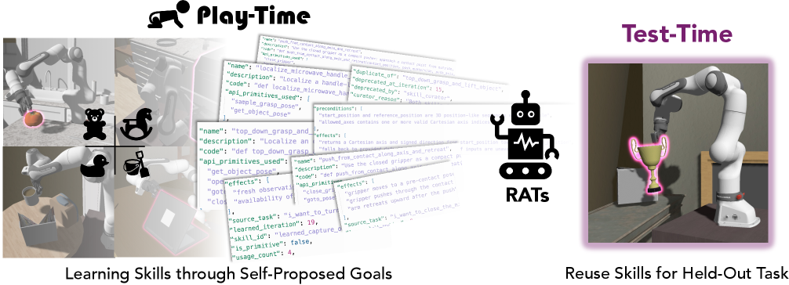
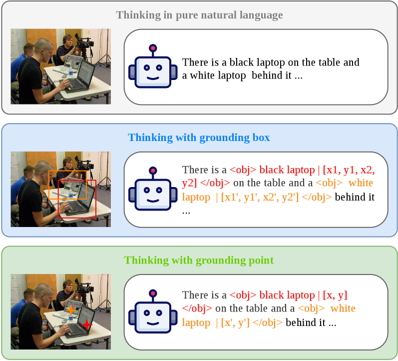
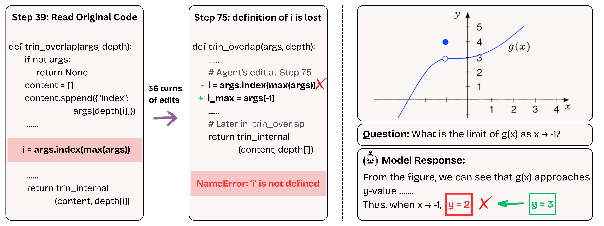
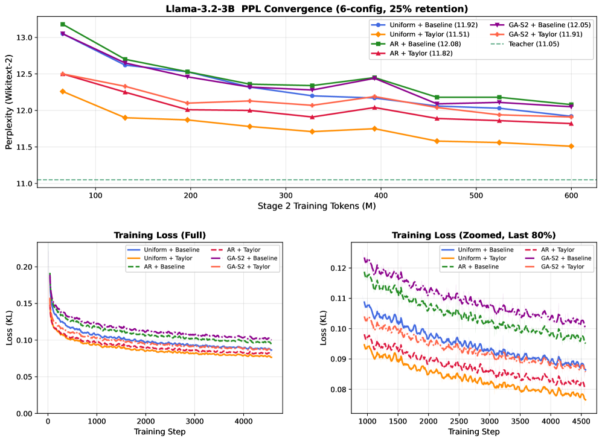
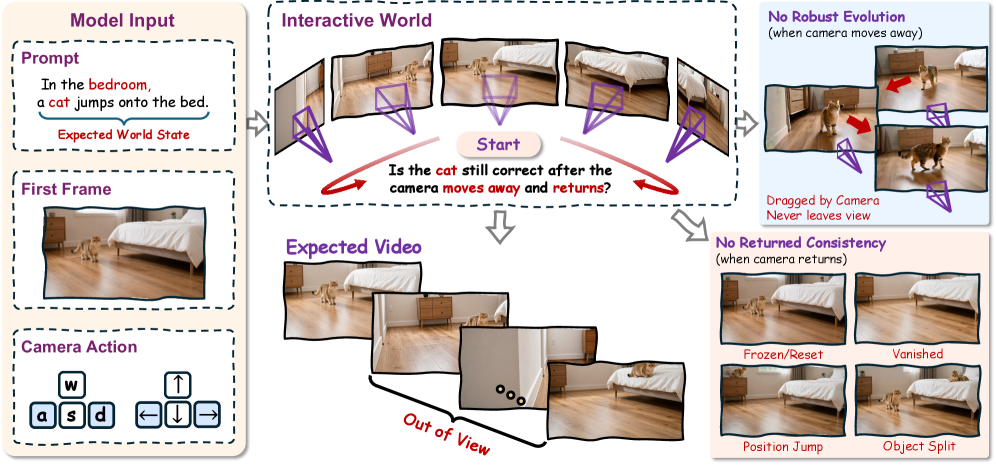
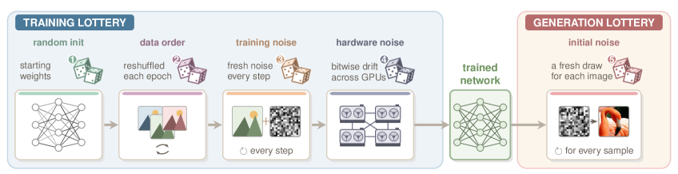
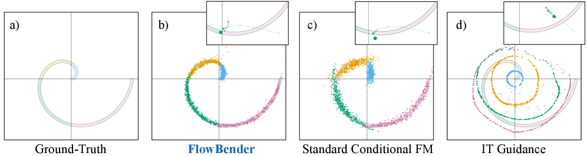

# Daily AI papers — 2026-06-21

*Curated from HF Daily Papers. 15 of 34 papers kept after relevance filter.*

## Papers at a glance

| # | Title | Topics | Org |
| --- | --- | --- | --- |
| 1 | [Moebius: 0.2B Lightweight Image Inpainting Framework](#1-moebius) | `diffusion`, `distillation`, `efficient-inference` | HUST · VIVO AI Lab |
| 2 | [FAPO: Fully Autonomous Prompt Optimization of Multi-Step LLM Pipelines](#2-fapo) | `agents`, `prompt-opt`, `LLM` | Foundation AI–Cisco · Yale |
| 3 | [Playful Agentic Robot Learning](#3-playful-agentic-robot-learning) | `agents`, `RL`, `code-as-policy` | UC Berkeley · Impossible Research |
| 4 | [S-Agent: Spatial Tool-Use Elicits Reasoning for Spatial Intelligence](#4-s-agent) | `agents`, `multimodal`, `reasoning` | NTU · Tsinghua · ByteDance |
| 5 | [ImageWAM: World Action Models from Image Editing](#5-imagewam) | `multimodal`, `world-model`, `VLA` | SJTU · Tencent Robotics X · Tsinghua |
| 6 | [Multi-LCB: Extending LiveCodeBench to Multiple Programming Languages](#6-multi-lcb) | `eval`, `code` | GigaCode · Yandex |
| 7 | [FreeStyle: Style-Content Dual-Reference Generation from Community LoRA Mining](#7-freestyle) | `diffusion`, `LoRA`, `data` | Fudan University |
| 8 | [Thinking with Visual Grounding](#8-thinking-with-visual-grounding) | `multimodal`, `reasoning`, `RL` | UCLA |
| 9 | [ContextRL: Context-Aware RL for Agentic and Multimodal LLMs](#9-contextrl) | `RL`, `agents`, `multimodal` | Princeton · UC Davis |
| 10 | [Taylor-Calibrate: Principled Init for Hybrid Linear Attention Distillation](#10-taylor-calibrate) | `architectures`, `distillation`, `linear-attention` | Sydney · Together AI · Berkeley |
| 11 | [UFP4: Rethinking Shrinkage Bias in LLM FP4 Pretraining](#11-ufp4) | `quantization`, `pre-training`, `FP4` | Ling Team · Ant Group |
| 12 | [Current World Models Lack a Persistent State Core](#12-persistent-state) | `eval`, `world-model`, `video` | USTC · X-Humanoid · CAS |
| 13 | [HumanScale: Egocentric Human Video for Embodied Pretraining](#13-humanscale) | `multimodal`, `data`, `pre-training` | (consortium) |
| 14 | [The FID Lottery: Hidden Randomness in Generative-Model Evaluation](#14-fid-lottery) | `eval`, `diffusion`, `generative` | Kyutai · UC Berkeley |
| 15 | [FlowBender: Feedback-Aware Training for Self-Correcting Conditional Flows](#15-flowbender) | `diffusion`, `flow-matching` | Technion · NVIDIA · Toronto |

---

## 1. Moebius

**Authors:** Anonymous team led by Xinggang Wang — *Huazhong University of Science and Technology · VIVO AI Lab*
**Links:** [arXiv:2606.19195](https://arxiv.org/abs/2606.19195) · [HF](https://huggingface.co/papers/2606.19195) · [AlphaXiv](https://www.alphaxiv.org/abs/2606.19195)
**Topics:** `diffusion`, `distillation`, `efficient-inference`

### TL;DR

A 0.2B-parameter diffusion inpainting model that claims to match 10B-class industrial inpainters. The trick is a redesigned diffusion backbone built around a "Local-λ Mix Interaction" block plus a multi-granularity distillation strategy that imports knowledge from a heavy teacher across multiple feature scales.

### Key idea

Replace the standard DiT/UNet block with **Local-λ Mix Interaction (LλMI)**: two paired modules — *Local-λ* summarizes spatial context inside a window, *Interactive-λ* injects a global semantic prior — both fold their interactions into fixed-size linear matrices instead of full attention. This collapses parameter count without losing the spatial-global feature mixing that inpainting needs, and it's wrapped in **adaptive multi-granularity distillation** so the tiny student can copy a frontier teacher's representations across layers.

### Main finding

A 0.2B model reportedly matches 10B-class industrial inpainting baselines on standard inpainting benchmarks, while being roughly **50× cheaper to deploy**. The win is split between the LλMI block (parameter efficiency) and the distillation recipe (representation transfer).

### Why it matters

Inpainting has quietly become a backbone task for image-editing apps, e-commerce, and video pipelines. A 0.2B model that runs at edge-deployment cost reopens use cases that 10B foundation models priced out. Methodologically, LλMI is another data point for **linear-mix attention substitutes** working as well as full attention when the task is structured (here, by spatial locality).

### Knowledge graph integration

**Builds on / relates to existing pages:**
- [../architectures/transformer-block.md](../architectures/transformer-block.md) — LλMI is a transformer-block replacement that swaps softmax attention for a linear-mix variant.
- [../architectures/multi-head-attention.md](../architectures/multi-head-attention.md) — Local-λ is a windowed attention-like operator with fixed linear matrices.

**Suggested new pages:**
- `architectures/local-lambda-mix.md` *(depth)* — the LλMI block and its parameter math.
- `post-training/fine-tuning/multi-granularity-distillation.md` *(depth)* — multi-scale teacher-student feature matching for diffusion.

---

## 2. FAPO

**Authors:** Baturay Saglam, Huaibo Zhao, Blaine Nelson, Supriti Vijay, Aman Priyanshu, Amin Karbasi — *Foundation AI–Cisco Systems · Yale University*
**Links:** [arXiv:2606.19605](https://arxiv.org/abs/2606.19605) · [HF](https://huggingface.co/papers/2606.19605) · [AlphaXiv](https://www.alphaxiv.org/abs/2606.19605)
**Topics:** `agents`, `prompt-opt`, `LLM`

### TL;DR

FAPO is a framework that hands Claude Code an entire multi-step LLM pipeline (retrieval + reasoning + formatting) and lets it autonomously optimize it. It runs the pipeline, inspects intermediate steps, attributes failures, edits prompts first, and only escalates to structural changes when prompt edits can't fix the bottleneck.

### Key idea

Cast pipeline optimization as a **closed-loop coding-agent task** rather than a prompt-only search. The agent has access to the pipeline source, evaluation harness, and intermediate traces; it makes scoped changes, validates with held-out data, and reverts if a variant regresses. The discipline of "prompts first, structural last" is implemented as an explicit attribution-driven escalation rule.

### Main finding

Across six benchmarks and three base models, FAPO beats the **GEPA** prompt-optimization baseline in **15 of 18** comparisons, with a mean **+14.1 pp** improvement and **+33.8 pp** on benchmarks that require pipeline restructuring (not just prompt rewrites).

### Why it matters

Most "agent for prompt-opt" work is locked to text-level edits and treats the pipeline as a black box. FAPO is a public-domain demonstration that letting a coding agent edit the *code* of a pipeline, not just its prompts, is the right abstraction — and that current frontier coding agents are already good enough to do this autonomously. The recipe doubles as evidence that **GEPA-class prompt search** has a ceiling on multi-step pipelines.

### Knowledge graph integration

**Builds on / relates to existing pages:**
- [../agents/README.md](../agents/README.md) — fits the agent training / tool-use cluster: a coding agent that edits another LLM system.

**Suggested new pages:**
- `agents/pipeline-optimization.md` *(depth)* — autonomous prompt+structural optimization with a coding agent.
- `agents/_prompt-optimization.md` *(taxonomy)* — prompt-only (GEPA, OPRO, APE) vs structural (FAPO) optimizers.

---

## 3. Playful Agentic Robot Learning

**Authors:** Junyi Zhang, Jiaxin Ge, Hanjun Yoo, Letian Fu, Zihan Yang, Yaowei Liu, Raj Saravanan, Shaofeng Yin, Justin Yu, Dantong Niu, Zirui Wang, Roei Herzig, Ken Goldberg, Yutong Bai, David M. Chan, Ion Stoica, Angjoo Kanazawa, Jiahui Lei, Haiwen Feng, Trevor Darrell — *UC Berkeley · Impossible Research*
**Links:** [arXiv:2606.19419](https://arxiv.org/abs/2606.19419) · [HF](https://huggingface.co/papers/2606.19419) · [AlphaXiv](https://www.alphaxiv.org/abs/2606.19419)
**Topics:** `agents`, `RL`, `code-as-policy`

### TL;DR

Adds an unsupervised "play" phase to a Code-as-Policy embodied coding agent. During play, a multi-agent team (RATs) invents and executes exploratory tasks, verifies progress, and distills successful executions into a persistent **code skill library** that the agent later reuses for downstream tasks.

### Key idea

Treat skill acquisition like a curriculum-generation problem: a **planner** proposes "novel yet learnable" tasks, an **executor** writes and runs Code-as-Policy programs, a **verifier** checks progress with dense step-level feedback, and a **librarian** distills working programs into a frozen skill library. At evaluation time, the agent reuses skills from this library — no policy weights are updated; the library is the learned object.

### Main finding

On LIBERO-PRO and MolmoSpaces, agents that had a play phase beat the no-play baseline by **+20.6 pp** and **+17.0 pp** respectively over CaP-Agent0. Random-play baselines underperform structured play, validating the planner-verifier loop rather than mere exploration.

### Why it matters

Pushes back on the "every new task needs new tuning" assumption of VLA / VLM-action pipelines. The library is **frozen code skills**, not weights, so it composes across tasks and embodiments. This is a concrete realization of the "self-directed curriculum" idea that's been on the agent-RL wishlist for years.

### Knowledge graph integration

**Builds on / relates to existing pages:**
- [../agents/README.md](../agents/README.md) — agent training with rollouts and self-play.
- [../post-training/_rl.md](../post-training/_rl.md) — the play phase is RL-shaped (reward = verifier signal) but updates a library rather than a policy.
- [../post-training/rl-prompt-curation.md](../post-training/rl-prompt-curation.md) — same family as RL-curriculum design, applied to embodied tasks.

**Suggested new pages:**
- `agents/code-as-policy.md` *(depth)* — the Code-as-Policy paradigm for embodied agents.
- `agents/play-time-skill-library.md` *(depth)* — frozen code skill libraries from self-directed play.

---

## 4. S-Agent

**Authors:** Yalun Dai, Hao Li, Shulin Tian, Runmao Yao, Yuhao Dong, Fangzhou Hong, Zhaoxi Chen, Fangfu Liu, Baoliang Tian, Dingwen Zhang, Tao Wang, Kim-Hui Yap, Ziwei Liu — *NTU · Tsinghua · ByteDance · NWPU*
**Links:** [arXiv:2606.20515](https://arxiv.org/abs/2606.20515) · [HF](https://huggingface.co/papers/2606.20515) · [AlphaXiv](https://www.alphaxiv.org/abs/2606.20515)
**Topics:** `agents`, `multimodal`, `reasoning`

### TL;DR

A spatial-tool-use agent built on a VLM that reasons over continuous multi-view image and video streams. Instead of treating each observation in isolation, S-Agent calls 3D-aware tools (depth, segmentation, geometry) interleaved with chain-of-thought, maintaining a working 3D scene representation across steps.

### Key idea

Bind a VLM to a **spatial tool library** (depth estimation, mesh extraction, 3D segmentation, view-projection) and let it elicit reasoning by **calling these tools mid-thought**. Each tool call updates a shared scene context that future calls and reasoning steps can read, turning a static-image VLM into a stateful spatial reasoner over video.

### Main finding

Substantial gains on continuous-multi-view and video spatial-reasoning benchmarks over both raw VLMs and tool-augmented agents that treat frames independently — paper highlights improvements across 3D-scene understanding tasks.

### Why it matters

Most VLM reasoning work is single-frame and stateless. S-Agent is one of the cleanest demonstrations that **tool use is the right axis** for adding spatial intelligence to a generalist VLM, instead of training a specialized 3D model from scratch. Suggests that "spatial intelligence" follows the same agent-tool-use trajectory as math (calculator) and code (interpreter).

### Knowledge graph integration

**Builds on / relates to existing pages:**
- [../agents/README.md](../agents/README.md) — tool-calling and multi-turn execution.
- [../multimodal/README.md](../multimodal/README.md) — extends VLMs into stateful video reasoning.

**Suggested new pages:**
- `multimodal/spatial-tool-use.md` *(depth)* — spatial tool calls + persistent scene context for VLM reasoning.
- `evaluation/spatial-reasoning-benchmarks.md` *(depth)* — the continuous-multi-view eval suite this paper proposes.

---

## 5. ImageWAM

**Authors:** Anonymous team — *Shanghai Jiao Tong University · Eastern Institute of Technology · Tencent Robotics X · Tsinghua University · Zhongguancun Academy*
**Links:** [arXiv:2606.19531](https://arxiv.org/abs/2606.19531) · [HF](https://huggingface.co/papers/2606.19531) · [AlphaXiv](https://www.alphaxiv.org/abs/2606.19531)
**Topics:** `multimodal`, `world-model`, `VLA`

### TL;DR

Argues that **World Action Models** (WAMs) don't need full video generation — image editing is enough. ImageWAM repurposes a pretrained image editing model as a one-step "predict the next visual state" head for robot action policies, dropping dense multi-frame video prediction.

### Key idea

A WAM's job is to imagine "what the world looks like after my action," not to generate a movie. The authors point out that **multi-frame video prediction wastes capacity on action-irrelevant temporal/appearance detail** and accumulates errors that hurt action prediction. ImageWAM swaps the video decoder for an **image editor** that takes the current observation and a candidate action and outputs the next observation — much cheaper, much fewer distractors.

### Main finding

ImageWAM matches or beats video-based WAMs on standard robot-control benchmarks at substantially lower inference cost. Avoids the long-horizon hallucination failure mode of video-generation WAMs.

### Why it matters

Reframes the "world model" debate for robotics: maybe the right abstraction is single-frame counterfactual editing, not video synthesis. Aligns with the broader trend (see paper #12) that current video world models struggle with persistent state — if your world model can't keep state, then a fast image-editing oracle is strictly better than a slow video-generation oracle.

### Knowledge graph integration

**Builds on / relates to existing pages:**
- [../multimodal/README.md](../multimodal/README.md) — image-editing models repurposed as embodied dynamics models.

**Suggested new pages:**
- `multimodal/_world-action-models.md` *(taxonomy)* — video-generation WAMs vs image-editing WAMs vs latent-state WAMs.
- `multimodal/image-editing-wam.md` *(depth)* — the image-editing-as-dynamics-model recipe.

---

## 6. Multi-LCB

**Authors:** Maria Ivanova, Pavel Zadorozhny, Rodion Levichev, Ivan Petrov, Pavel Adamenko, Ivan Lopatin, Alexey Kutalev, Dmitrii Babaev — *GigaCode · Yandex School of Data Analysis*
**Links:** [arXiv:2606.20517](https://arxiv.org/abs/2606.20517) · [HF](https://huggingface.co/papers/2606.20517) · [AlphaXiv](https://www.alphaxiv.org/abs/2606.20517)
**Topics:** `eval`, `code`

### TL;DR

Extends LiveCodeBench from Python-only to **12 programming languages**, keeping the original contamination-aware release-date filtering. Evaluates 24 models and finds large language-specific contamination patterns and clear Python overfitting in most modern code LLMs.

### Key idea

Convert LiveCodeBench's functional and STDIN/STDOUT problems into a **language-agnostic harness** so the same problem can be evaluated across C++, Java, Rust, Go, TS, etc. Reuse LCB's release-date filter to control contamination per language and report per-language pass rates instead of an aggregate.

### Main finding

24-model sweep exposes "substantial performance disparities across languages, evidence of Python overfitting, and language-specific contamination" — code LLMs that look strong on HumanEval/LCB-Python often crater on minority languages, and contamination signatures differ sharply between languages.

### Why it matters

Code-LLM rankings have been **Python-shaped** for the last two years. A multilingual harness with contamination control changes the leaderboard and re-exposes which models actually generalize across languages vs which memorized Python idioms. Will likely become the new default code benchmark for serious training pipelines.

### Knowledge graph integration

**Builds on / relates to existing pages:**
- [../evaluation/livecodebench.md](../evaluation/livecodebench.md) — direct extension; same release-date contamination control, broader language coverage.
- [../evaluation/humaneval.md](../evaluation/humaneval.md) — historical baseline that Multi-LCB is positioned against.
- [../evaluation/codeforces-benchmark.md](../evaluation/codeforces-benchmark.md) — adjacent competitive-programming eval.
- [../data/decontamination.md](../data/decontamination.md) — the contamination-control angle.

**Suggested new pages:**
- `evaluation/multi-lcb.md` *(depth)* — the multilingual LCB extension and its language-coverage rules.

---

## 7. FreeStyle

**Authors:** Jinghong Lan, Wei Cheng, Yunuo Chen, Ziqi Ye, Peng Xing, Yixiao Fang, Rui Wang, Yufeng Yang, Xuanyang Zhang, Xianfang Zeng, Difan Zou, Gang Yu, Chi Zhang — *Fudan University*
**Links:** [arXiv:2606.20506](https://arxiv.org/abs/2606.20506) · [HF](https://huggingface.co/papers/2606.20506) · [AlphaXiv](https://www.alphaxiv.org/abs/2606.20506)
**Topics:** `diffusion`, `LoRA`, `data`

### TL;DR

Mines the public community LoRA ecosystem to build a large-scale **(style-ref, content-ref, target)** triplet dataset, then trains a dual-reference generation framework with disentanglement losses against content leakage. Releases a paired evaluation benchmark.

### Key idea

Most style-content generation suffers from **lack of clean triplets**: there's no large dataset where the style and content are unambiguously separated and the long-tail of styles is covered. FreeStyle constructs triplets by **rendering content prompts through community LoRAs** at scale, then applies a disentanglement objective to stop the model from copying semantic content from the style reference.

### Main finding

Establishes a new state of the art on style-content dual-reference generation with broader long-tail style coverage than prior datasets, and bundles a benchmark for the task.

### Why it matters

Community LoRA collections are an underused dataset source — there are tens of thousands of public LoRAs each encoding a style signature. FreeStyle is a recipe for **turning that exhaust into structured training data**, plus a benchmark that future style-control work can target. The broader pattern (mining LoRA collections for training data) is reusable beyond style transfer.

### Knowledge graph integration

**Builds on / relates to existing pages:**
- [../data/_data-curation.md](../data/_data-curation.md) — LoRA-mined triplets as a new data-curation source.
- [../post-training/fine-tuning/README.md](../post-training/fine-tuning/README.md) — community LoRA is the unit being mined.

**Suggested new pages:**
- `multimodal/style-content-dual-reference.md` *(depth)* — the triplet data pipeline and the disentanglement objective.
- `data/community-lora-mining.md` *(depth)* — using public LoRA hubs as a training data source.

---

## 8. Thinking with Visual Grounding

**Authors:** Junkai Zhang, Yihe Deng, Kai-Wei Chang, Wei Wang — *University of California, Los Angeles*
**Links:** [arXiv:2606.16122](https://arxiv.org/abs/2606.16122) · [HF](https://huggingface.co/papers/2606.16122) · [AlphaXiv](https://www.alphaxiv.org/abs/2606.16122)
**Topics:** `multimodal`, `reasoning`, `RL`

### TL;DR

VLMs that **interleave reasoning text with explicit point/box groundings** to the image regions they reason about, trained with a synthesis pipeline that distills correct visual reasoning traces and a grounding-aware RL objective that rewards correct visual evidence selection.

### Key idea

Two-part recipe: (1) **synthesize visually-grounded reasoning traces** by extracting the objects each step refers to and grounding them with a SAM3-based agent, producing aligned point and box supervision; (2) **grounding-aware RL** that adds dense rewards for whether generated object references actually point at the right image regions, on top of answer-correctness reward.

### Main finding

Adding visually grounded thinking to **Gemma3-4B-IT** consistently beats both the base model and a non-grounded thinking baseline across 2 counting and 4 spatial-reasoning benchmarks. The 4B grounded model **matches or exceeds Gemma3-27B-IT** on spatial reasoning — a 7× parameter compression from grounding alone. Point grounding helps counting, box grounding helps spatial tasks.

### Main finding (details)

Point vs box grounding aren't interchangeable: explicit dense grounding rewards matter most for box-on-spatial; counting benefits from sparse point supervision. Suggests the right grounding primitive depends on the task class.

### Why it matters

Concrete evidence that **anchoring reasoning to perception** during training (not just inference-time prompting) closes a multi-billion-parameter gap. Also a clean demonstration of **agent-assisted data synthesis** (SAM3 used as a labeler) and dense process rewards for multimodal RL — both reusable patterns.

### Knowledge graph integration

**Builds on / relates to existing pages:**
- [../post-training/grpo.md](../post-training/grpo.md) — the grounding-aware RL uses a GRPO-style objective with additional dense reward.
- [../post-training/reasoning/prm.md](../post-training/reasoning/prm.md) — grounding rewards are the multimodal analogue of process rewards.
- [../post-training/rlvr.md](../post-training/rlvr.md) — answer-correctness reward; grounding reward sits alongside.
- [../multimodal/README.md](../multimodal/README.md) — fits the multimodal post-training cluster.

**Suggested new pages:**
- `multimodal/visually-grounded-thinking.md` *(depth)* — interleaved language-and-grounding reasoning traces.
- `post-training/reasoning/grounding-rewards.md` *(depth)* — dense visual-evidence rewards as a multimodal process-reward signal.

---

## 9. ContextRL

**Authors:** Peiyang Xu, Bangzheng Li, Sijia Liu, Karthik R. Narasimhan, Pramod Viswanath, Prateek Mittal, Xingyu Fu — *Princeton · UC Davis*
**Links:** [arXiv:2606.17053](https://arxiv.org/abs/2606.17053) · [HF](https://huggingface.co/papers/2606.17053) · [AlphaXiv](https://www.alphaxiv.org/abs/2606.17053)
**Topics:** `RL`, `agents`, `multimodal`

### TL;DR

A GRPO drop-in for long-context and multimodal reasoning that adds an **auxiliary contrastive objective**: instead of only rewarding the final answer, the model is shown a query, an answer, and two highly similar contexts, and rewarded for picking the context that supports the answer. This forces fine-grained grounding without expensive process-reward annotation.

### Key idea

Build **contrastive (query, answer, context⁺, context⁻)** pairs cheaply: for coding agents, derive contexts from trajectories with condition filtering (1k pairs); for multimodal, derive context⁺/⁻ from generative image editing + similarity search (7k pairs). The RL objective rewards the policy when it points the answer at the supportive context — a discriminative auxiliary signal layered on top of standard GRPO outcome reward.

### Main finding

ContextRL beats vanilla GRPO by **+2.2% on 5 long-horizon agentic benchmarks** and **+1.8% across 12 VQA benchmarks**. The gain is largest where the answer hinges on a small, decisive piece of evidence inside a long context.

### Why it matters

The "long context but only one line matters" failure mode is everywhere in agents (a single tool-trace line decides correctness) and in multimodal (a single image region decides the answer). Most RL training rewards only the final answer and lets the model pick up shortcuts. **Contrastive context selection** is a cheap, scalable way to add evidence-grounding pressure without needing per-step human labels. Generalizes the spirit of process-reward models to a more practical, generative-edit-based data pipeline.

### Knowledge graph integration

**Builds on / relates to existing pages:**
- [../post-training/grpo.md](../post-training/grpo.md) — ContextRL augments GRPO with an auxiliary objective.
- [../post-training/_rl.md](../post-training/_rl.md) — fits the policy-gradient family with a new advantage shaping.
- [../post-training/reasoning/prm.md](../post-training/reasoning/prm.md) — adjacent: process rewards on text traces.
- [../post-training/rlvr.md](../post-training/rlvr.md) — verifiable rewards as the outer signal; ContextRL is the auxiliary.

**Suggested new pages:**
- `post-training/context-aware-rl.md` *(depth)* — contrastive-context auxiliary RL for long-context and multimodal LLMs.

---

## 10. Taylor-Calibrate

**Authors:** Zhongzhu Zhou, Qingyang Wu, Junxiong Wang, Mayank Mishra, Shuaiwen Leon Song, Ben Athiwaratkun, Chenfeng Xu — *Sydney · Together AI · Berkeley · UT Austin · Microsoft*
**Links:** [arXiv:2606.16429](https://arxiv.org/abs/2606.16429) · [HF](https://huggingface.co/papers/2606.16429) · [AlphaXiv](https://www.alphaxiv.org/abs/2606.16429)
**Topics:** `architectures`, `distillation`, `linear-attention`

### TL;DR

A principled initialization recipe for distilling a pretrained Transformer into a **hybrid linear-attention model** (Gated DeltaNet student) by deriving the student's recurrent parameters from a Taylor expansion of the teacher's attention statistics, then doing a short layer-local alignment pass.

### Key idea

Two stages: (1) **Taylor-guided initialization** — instead of copying the teacher's QKV projections and randomly initializing the GDN-specific parameters (memory decay, write/output gates), use a Taylor expansion of teacher attention to derive starting values for these gates that approximate teacher behavior; (2) **layer-local alignment** — a brief per-layer pass that matches student outputs to teacher outputs before the global distillation phase. Both stages avoid the long "warm-up" period that naively initialized GDN students spend repairing the mismatch.

### Main finding

**4.9× to 9.2× fewer distillation tokens** to reach a target quality vs naively initialized GDN students, and substantially better zero-shot performance immediately after the initialization phase, across multiple teacher configurations.

### Why it matters

Hybrid linear-attention models (e.g. Mamba+Transformer hybrids, GDN-Transformer) are the leading candidate for KV-cache-free inference, but distillation cost has been the gating factor. A near-10× reduction in distillation budget makes "convert your existing Transformer to a hybrid" a routine operation, not a research project. Also useful as a template for any **teacher→student-with-different-parameterization** distillation.

### Knowledge graph integration

**Builds on / relates to existing pages:**
- [../architectures/transformer-block.md](../architectures/transformer-block.md) — teacher side of the distillation.
- [../architectures/multi-head-attention.md](../architectures/multi-head-attention.md) — what the GDN student replaces.

**Suggested new pages:**
- `architectures/_linear-attention.md` *(taxonomy)* — linear / recurrent attention variants (Mamba, GLA, GDN, RWKV).
- `architectures/gated-deltanet.md` *(depth)* — the GDN block.
- `architectures/hybrid-attention-distillation.md` *(depth)* — Taylor-Calibrate's init + alignment recipe.

---

## 11. UFP4

**Authors:** Kunlong Chen, Changxin Tian, Zhonghui Jiang, Haitao Zhang, Chaofan Yu, Peijie Jiang, Mingliang Gong, Jia Liu, Ziqi Liu, Zhiqiang Zhang, Jun Zhou — *Ling Team, Ant Group*
**Links:** [arXiv:2606.20381](https://arxiv.org/abs/2606.20381) · [HF](https://huggingface.co/papers/2606.20381) · [AlphaXiv](https://www.alphaxiv.org/abs/2606.20381)
**Topics:** `quantization`, `pre-training`, `FP4`

### TL;DR

Diagnoses a systematic **"Shrinkage Bias"** in current FP4 training with E2M1 (the asymmetric, non-uniform OCP MXFP4 element format): rounding errors are biased toward zero, accumulate multiplicatively across layers, and get worse when combined with Random Hadamard Transform (RHT). Proposes **UFP4**, a recipe built on **uniform** 4-bit grids (E1M2 / INT4) with RHT applied to all three matmuls.

### Key idea

Non-uniform formats like E2M1 have asymmetric bin widths around zero, so rounding pulls magnitudes systematically down — a layer-multiplicative negative bias. RHT, normally a stabilizer, makes this *worse* under E2M1 because it concentrates mass near the affected bins. UFP4's fix: use a **uniform 4-bit grid** (E1M2 or INT4 with appropriate scaling) where rounding is unbiased, and apply RHT to all three training matmuls (forward, weight-grad, input-grad).

### Main finding

Across **1.5B → 124B parameter models**, UFP4 consistently closes the gap to BF16 loss more than E2M1-based alternatives. The paper recommends future accelerators support **uniform 4-bit grids as primary training primitives** rather than treating non-uniform FP4 as the default.

### Why it matters

FP4 pretraining is the next frontier after FP8. The MXFP4 spec everyone is building toward uses E2M1 elements — if Shrinkage Bias is real and structural, this is a **direct critique of the current spec** at training (not just inference) workloads. The recipe gives a near-term path to stable 4-bit pretraining on existing hardware that can do INT4 or E1M2-equivalent matmuls.

### Knowledge graph integration

**Builds on / relates to existing pages:**
- [../quantization/_number-formats.md](../quantization/_number-formats.md) — names E2M1 / MXFP4 / E1M2 / INT4 and the scale-granularity axis the paper attacks.
- [../pre-training/fp8-training.md](../pre-training/fp8-training.md) — direct precursor recipe; UFP4 is the FP4 analogue.
- [../quantization/fp8.md](../quantization/fp8.md) — adjacent low-precision format.
- [../pre-training/_training-stability.md](../pre-training/_training-stability.md) — Shrinkage Bias is a stability failure mode.

**Suggested new pages:**
- `pre-training/fp4-training.md` *(depth)* — UFP4's uniform-grid + RHT-everywhere recipe.
- `quantization/shrinkage-bias.md` *(depth)* — the geometric origin and systemic impact of asymmetric-format rounding bias.

---

## 12. Current World Models Lack a Persistent State Core

**Authors:** Jinpeng Lu, Dexu Zhu, Haoyuan Shi, Linghan Cai, Guo Tang, Yinda Chen, Jie Cao, Duyu Tang, Yi Zhang, Yong Dai, Xiaozhu Ju — *USTC · X-Humanoid · CAS · PKU*
**Links:** [arXiv:2606.20545](https://arxiv.org/abs/2606.20545) · [HF](https://huggingface.co/papers/2606.20545) · [AlphaXiv](https://www.alphaxiv.org/abs/2606.20545)
**Topics:** `eval`, `world-model`, `video`

### TL;DR

WRBench — a diagnostic benchmark for whether video generators **maintain world state when the camera looks away and back**. Tests 23 models across 9,600 videos and isolates a "preservation–access–re-observed-consistency gap" that aggregate video metrics miss entirely.

### Key idea

Split video-world-model capability into three sub-skills: (1) **preserve** scene events that happen out of view, (2) **access** state when prompted by a re-observation, (3) **re-observation consistency** — show the same end state regardless of camera path. Probe each with controlled camera trajectories that leave, mutate the scene, and return. Reveals that "looks great" doesn't mean "remembers."

### Main finding

Across 23 models, **re-observed state correctness is a capability distinct from visible fidelity**. Most current video world models render visible motion well but fail to maintain endpoint state after re-observation — and they fail harder on **in-place state changes** than on **relocations** (relocations get a free hint from object presence).

### Why it matters

A foundational critique of current "video as world model" assumptions. Suggests the field needs explicit **"what-memory" mechanisms** and **endpoint-persistence training objectives** rather than just bigger video pretraining. Pairs naturally with paper #5 (ImageWAM): if video-WAMs can't keep state, image-editing WAMs that don't try to are a reasonable retreat.

### Knowledge graph integration

**Builds on / relates to existing pages:**
- [../evaluation/README.md](../evaluation/README.md) — adds a new "world model fidelity" axis to evaluation.

**Suggested new pages:**
- `evaluation/wrbench.md` *(depth)* — the camera-trajectory diagnostic benchmark.
- `multimodal/persistent-state-world-models.md` *(depth)* — the "what-memory" requirement for video world models.

---

## 13. HumanScale

**Authors:** Juncheng Ma, Jianxin Bi, Yufan Deng, Xuanran Zhai, Kewei Zhang, Ye Huang, Bo Liang, Shukai Gong, Jiankai Tu, Xiaotian Tang, Jiaxin Li, Kaiqi Chen, Duomin Wang, Yuqi Wang, Bingyi Kang, Eric Huang, Zhiyang Dou, Zhen Dong, Enze Xie, Wojciech Matusik, Tat-Seng Chua, Daquan Zhou — *Affiliations not shown on HF*
**Links:** [arXiv:2606.20521](https://arxiv.org/abs/2606.20521) · [HF](https://huggingface.co/papers/2606.20521) · [AlphaXiv](https://www.alphaxiv.org/abs/2606.20521)
**Topics:** `multimodal`, `data`, `pre-training`

### TL;DR

Systematic head-to-head between **egocentric human video** and **teleoperated real-robot trajectories** as pretraining data for embodied foundation models. With matched data volume and a careful filtering+labeling pipeline, egocentric video **wins** on validation loss and downstream task success.

### Key idea

Strip the comparison down: fix the post-training stage, fix the validation protocol, vary only the pretraining source. Apply a filtering+labeling pipeline to egocentric video (motion quality, hand-object interaction, viewpoint plausibility) and then pretrain the same architecture under both regimes. Then adapt with a small amount of labeled real-robot data for action-space alignment.

### Main finding

At equal pretraining data volume: **−24% validation loss** on real-robot action prediction, **+52.5%** in-distribution and **+90%** out-of-distribution success rates on real-robot task execution, compared to teleoperated-trajectory pretraining. Verifies a **"pretrain on egocentric video, adapt on robot data"** recipe.

### Why it matters

Teleoperated robot data is the **fundamental bottleneck** for embodied foundation models — slow, expensive, low-diversity. If filtered egocentric human video is not just a substitute but **superior** for pretraining, the data ceiling on VLAs lifts by an order of magnitude. Also a strong recommendation to **do egocentric data quality assessment before** committing to costly robot collection.

### Knowledge graph integration

**Builds on / relates to existing pages:**
- [../data/quality-filtering.md](../data/quality-filtering.md) — egocentric filtering pipeline is the load-bearing component.
- [../data/_data-curation.md](../data/_data-curation.md) — fits the curation taxonomy.
- [../multimodal/README.md](../multimodal/README.md) — embodied foundation models are multimodal.

**Suggested new pages:**
- `multimodal/egocentric-video-pretraining.md` *(depth)* — egocentric-as-substitute-for-robot-data recipe.
- `data/egocentric-video-filtering.md` *(depth)* — the quality filter for egocentric clips.

---

## 14. The FID Lottery

**Authors:** Nicolas Dufour, Alexei A. Efros, Patrick Pérez — *Kyutai · UC Berkeley*
**Links:** [arXiv:2606.20536](https://arxiv.org/abs/2606.20536) · [HF](https://huggingface.co/papers/2606.20536) · [AlphaXiv](https://www.alphaxiv.org/abs/2606.20536)
**Topics:** `eval`, `diffusion`, `generative`

### TL;DR

Treats **FID** as a random variable over two axes — *training seed* and *generation seed* — and measures its variance directly across hundreds of SiT networks on class-conditional ImageNet 256×256. Finds that retraining moves FID **3.2× more** (in Inception feature space) than redrawing samples from a fixed model.

### Key idea

Most papers report **one FID number** from one training seed and one sampling seed. The paper builds a two-axis panel — train K networks with the same recipe, sample M times from each — and quantifies variance along both axes. This separates "irreducible noise from sampling" from "model-recipe sensitivity to training seed."

### Main finding

(a) **Training-seed variance dominates**: retraining with the same recipe but a different seed moves FID 3.2× more (in Inception feature space) than sampling variance from a fixed model. (b) The single-number FID reported in papers is much noisier than the field treats it as. Implication: many published FID-comparison claims are within seed noise.

### Why it matters

Direct hit on the **reproducibility / significance bar** of generative-model evaluation. Forces the field to either report seed-variance ranges or use a **multi-seed FID** as the standard. Same critique can be ported to other Fréchet-style metrics and to FID-on-text-image. Probably the most important eval-methodology paper of the day.

### Knowledge graph integration

**Builds on / relates to existing pages:**
- [../evaluation/README.md](../evaluation/README.md) — adds an eval-methodology depth file to the cluster.

**Suggested new pages:**
- `evaluation/fid.md` *(depth)* — the metric itself plus its seed-variance characterization.
- `evaluation/seed-variance.md` *(depth)* — the broader pattern of treating eval metrics as random variables across training seeds.

---

## 15. FlowBender

**Authors:** Daniel Gilo, Sven Elflein, Ido Sobol, Or Litany — *Technion · NVIDIA · University of Toronto · Vector Institute*
**Links:** [arXiv:2606.20404](https://arxiv.org/abs/2606.20404) · [HF](https://huggingface.co/papers/2606.20404) · [AlphaXiv](https://www.alphaxiv.org/abs/2606.20404)
**Topics:** `diffusion`, `flow-matching`

### TL;DR

Conditional diffusion / flow-matching models often violate the constraints that define their task (a depth-conditioned model whose output's re-extracted depth contradicts the input). FlowBender treats **alignment error as a first-class input** and trains the network to learn correction policies from that signal.

### Key idea

Two-pass mechanism: (1) an **unguided pass** estimates the clean signal, (2) the **task forward operator** (depth estimator, segmenter, etc.) computes the deviation between the input condition and what the unguided output implies, (3) a **refinement pass** is conditioned on that deviation and produces a corrected output. Variants for **differentiable** operators (gradient-based) and **non-differentiable** ones (zero-order), plus an efficiency optimization to avoid two full forwards.

### Main finding

On image translation, image restoration, and 3D mesh texturing, FlowBender improves both **fidelity** and **plausibility** simultaneously — escaping the usual guidance-method tradeoff where steering toward the condition hurts realism.

### Why it matters

Reframes "guidance" as **learned self-correction** rather than test-time gradient steering. Compatible with existing flow / diffusion training stacks. Generalizes naturally to any conditional generative task with a forward operator (LLM constrained decoding via a checker, text-to-3D with a renderer-in-the-loop, etc.).

### Knowledge graph integration

**Builds on / relates to existing pages:**
- [../multimodal/README.md](../multimodal/README.md) — conditional generative modeling cluster.

**Suggested new pages:**
- `multimodal/_flow-matching.md` *(taxonomy)* — flow matching, rectified flow, conditional flow variants.
- `multimodal/feedback-aware-flow.md` *(depth)* — the FlowBender two-pass self-correction recipe.

---

## Notes

- Hero figures: 12 of 15 papers have hero figures successfully downloaded. Missing: #6 Multi-LCB, #7 FreeStyle, #13 HumanScale — arXiv HTML version not available, no other reliable preview URL.
- Borderline inclusions: #3 (Playful Agentic Robot Learning) is robotics-adjacent but VLM-action-flavored and uses Code-as-Policy + an RL-shaped library curriculum — kept.
- Suggested new pages aggregated across papers (for Phase 2 selection):
  - `architectures/local-lambda-mix.md`, `architectures/_linear-attention.md`, `architectures/gated-deltanet.md`, `architectures/hybrid-attention-distillation.md`
  - `post-training/context-aware-rl.md`, `post-training/reasoning/grounding-rewards.md`, `post-training/fine-tuning/multi-granularity-distillation.md`
  - `pre-training/fp4-training.md`, `quantization/shrinkage-bias.md`
  - `agents/pipeline-optimization.md`, `agents/_prompt-optimization.md`, `agents/code-as-policy.md`, `agents/play-time-skill-library.md`
  - `multimodal/spatial-tool-use.md`, `multimodal/visually-grounded-thinking.md`, `multimodal/_world-action-models.md`, `multimodal/image-editing-wam.md`, `multimodal/style-content-dual-reference.md`, `multimodal/egocentric-video-pretraining.md`, `multimodal/_flow-matching.md`, `multimodal/feedback-aware-flow.md`, `multimodal/persistent-state-world-models.md`
  - `evaluation/multi-lcb.md`, `evaluation/spatial-reasoning-benchmarks.md`, `evaluation/wrbench.md`, `evaluation/fid.md`, `evaluation/seed-variance.md`
  - `data/community-lora-mining.md`, `data/egocentric-video-filtering.md`
- This digest is informational. No existing concept files, `READING-LIST.md`, or `PAPERS.md` were modified to produce it.
