# Daily AI papers — 2026-06-24

*Curated from HF Daily Papers. 15 of ~29 papers kept after relevance filter.*

## Papers at a glance

| # | Title | Topics | Org |
| --- | --- | --- | --- |
| 1 | [Qwen-AgentWorld: Language World Models for General Agents](#1-qwen-agentworld) | `agents`, `LLM`, `RL`, `world-model` | Qwen Team |
| 2 | [NatureBench: Can Coding Agents Match the Published SOTA of Nature-Family Papers?](#2-naturebench) | `agents`, `eval`, `coding` | Tsinghua / Frontis.AI |
| 3 | [MemGUI-Agent: End-to-End Long-Horizon Mobile GUI Agent](#3-memgui-agent) | `agents`, `GUI`, `SFT` | Kwai |
| 4 | [MobileForge: Annotation-Free Adaptation for Mobile GUI Agents](#4-mobileforge) | `agents`, `GUI`, `RL` | (consortium) |
| 5 | [OpenThoughts-Agent: Data Recipes for Agentic Models](#5-openthoughts-agent) | `agents`, `data`, `SFT` | Stanford / UC Berkeley |
| 6 | [AOHP: An Open-Source OS-Level Agent Harness](#6-aohp) | `agents`, `systems`, `safety` | AIR Tsinghua |
| 7 | [EventVLA: Event-Driven Visual Evidence Memory for VLA Policies](#7-eventvla) | `multimodal`, `VLA`, `memory` | Shanghai AI Lab |
| 8 | [Semantic Browsing: Controllable Diversity for Image Generation](#8-semantic-browsing) | `diffusion`, `multimodal`, `agents` | Tel Aviv U. |
| 9 | [Critique of Agent Model](#9-critique-of-agent-model) | `agents`, `position` | MBZUAI / CMU |
| 10 | [Escaping the Self-Confirmation Trap (EDV)](#10-execute-distill-verify) | `agents`, `memory`, `verification` | Zhejiang U. / Tsinghua |
| 11 | [CF-World: Are T2I Models Inductivist Turkeys?](#11-cf-world) | `diffusion`, `eval`, `reasoning` | SJTU / Shanghai AI Lab |
| 12 | [DiffusionBench / NanoGen: Holistic Evaluation of DiTs](#12-diffusionbench) | `diffusion`, `eval`, `DiT` | ANU / Canva Research |
| 13 | [DREAM: Dense Retrieval Embeddings via Autoregressive Modeling](#13-dream) | `retrieval`, `embeddings`, `LLM` | HKUST |
| 14 | [HDS: Holistic Data Scheduler via Multi-Objective RL](#14-hds) | `pre-training`, `data`, `RL` | (unspecified) |
| 15 | [VeriEvol: Scaling Multimodal Reasoning via Verifiable Evol-Instruct](#15-veriEvol) | `multimodal`, `reasoning`, `SFT`, `data` | Tsinghua / Tencent Hunyuan |

---

## 1. Qwen-AgentWorld

**Authors:** Qwen Team — *Alibaba*
**Links:** [arXiv:2606.24597](https://arxiv.org/abs/2606.24597) · [HF](https://huggingface.co/papers/2606.24597) · [AlphaXiv](https://www.alphaxiv.org/abs/2606.24597)
**Topics:** `agents`, `LLM`, `RL`, `world-model`

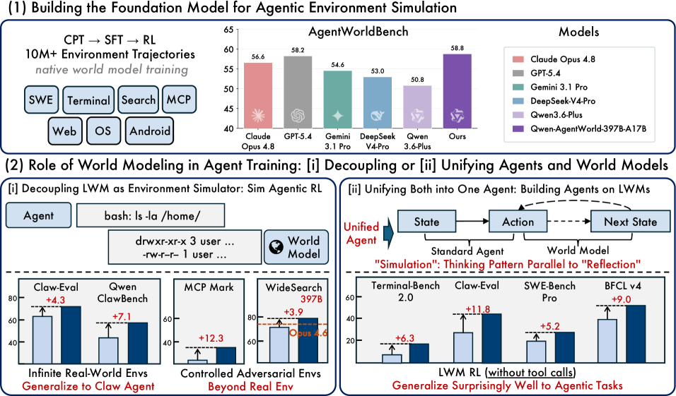

### TL;DR

Qwen releases two language world models (35B-A3B and 397B-A17B MoE) that simulate agentic environments — terminals, OS-world, tools — through long-CoT next-state prediction. Trained on 10M+ trajectories across 7 domains via a CPT → SFT → RL pipeline with hybrid rubric+rule rewards; released alongside AgentWorldBench. The simulator can replace real environments for agentic RL and serves as a universal warm-up that lifts downstream agent performance.

### Key idea

Treat a world model as just another LLM, trained to predict the next *environment state* (file diff, tool result, terminal output) given an action and observation history. Three stages: continued pretraining on dynamics traces and professional corpora; SFT to activate next-state reasoning; RL with a tailored framework where rewards combine fine-grained rubrics (judged by LLMs) with rule-based checks of simulator fidelity.

### Main finding

Qwen-AgentWorld outperforms all evaluated frontier models on AgentWorldBench (built from 5 models × 9 benchmarks including Tool Decathlon, Terminal-Bench 1.0/2.0, OSWorld-Verified). Two downstream wins: (i) RL using the simulator as decoupled environment surpasses RL training in the real environment alone; (ii) world-model pretraining as warm-up improves performance on all 7 agentic benchmarks.

### Why it matters

The biggest blocker for agentic RL is the cost and brittleness of real environments. A high-fidelity learned simulator turns a 1-CPU rollout into a token-generation rollout that fits in a standard LLM inference stack — and the same model doubles as a general agent foundation. If reproducible, this is a recipe shift comparable to introducing reward models for RLHF.

### Knowledge graph integration

**Builds on / relates to existing pages:**
- [../case-studies/qwen2-5.md](../case-studies/qwen2-5.md) — same Qwen series; AgentWorld is built on Qwen3 MoE.
- [../post-training/rlvr.md](../post-training/rlvr.md) — rule-based reward leg of the hybrid reward function.
- [../post-training/_rewards.md](../post-training/_rewards.md) — hybrid rubric+rule reward design.
- [../post-training/reasoning/long-cot-rl.md](../post-training/reasoning/long-cot-rl.md) — long-CoT reasoning over state transitions.
- [../agents/README.md](../agents/README.md) — frames the agent-environment loop being modeled.

**Suggested new pages:**
- `agents/language-world-models.md` *(depth)* — LLMs as environment simulators for agentic RL.
- `case-studies/qwen-agentworld.md` *(case study)* — full CPT → SFT → RL recipe + AgentWorldBench.
- `post-training/hybrid-rubric-rule-reward.md` *(depth)* — combining rubric-judged and rule-based reward signals.

---

## 2. NatureBench

**Authors:** Yuru Wang, Lejun Cheng, Yuxin Zuo, et al.; corresponding Ning Ding, Bowen Zhou, Kaiyan Zhang — *Tsinghua University / Frontis.AI*
**Links:** [arXiv:2606.24530](https://arxiv.org/abs/2606.24530) · [HF](https://huggingface.co/papers/2606.24530) · [AlphaXiv](https://www.alphaxiv.org/abs/2606.24530)
**Topics:** `agents`, `eval`, `coding`

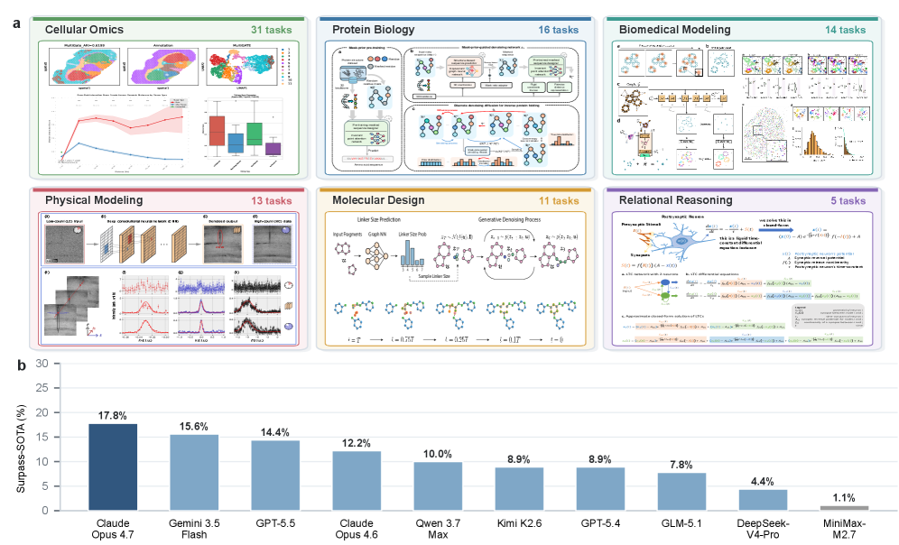

### TL;DR

A cross-discipline coding-agent benchmark of 90 tasks distilled from peer-reviewed Nature-family publications. The bar is not reproduction but matching the *published* SOTA reported in the paper — forcing agents to do real scientific software engineering rather than redo known unit tests.

### Key idea

Use the published-result number from a real Nature-family paper as the verifier. Each task pairs a research codebase + dataset with the headline metric the original authors reported; an agent passes only if its run reaches or exceeds that number. This removes the contamination risk of synthetic benchmarks and shifts the goal from coding correctness to scientific result-reproduction.

### Main finding

The benchmark evaluates ten frontier coding-agent systems; none come close to matching published SOTA across the 90 tasks (the paper claims a wide gap remains). Tasks span biology, chemistry, physics, ML, neuroscience, and more.

### Why it matters

If "AI co-scientist" is to mean anything operational, it has to mean running and beating published research code on the metric the authors chose. NatureBench gives the community a hard, contamination-resistant target that's more aligned with "can the model do science" than SWE-bench's GitHub issue regressions.

### Knowledge graph integration

**Builds on / relates to existing pages:**
- [../evaluation/livecodebench.md](../evaluation/livecodebench.md) — adjacent benchmark for coding capability under contamination control.
- [../evaluation/codeforces-benchmark.md](../evaluation/codeforces-benchmark.md) — another coding evaluation contrasting algorithmic vs. research code.
- [../agents/README.md](../agents/README.md) — agent-evaluation cluster.

**Suggested new pages:**
- `evaluation/naturebench.md` *(depth)* — published-SOTA-matching agent benchmark for scientific coding.
- `evaluation/_agent-benchmarks.md` *(taxonomy)* — SWE-bench, WebArena, TerminalBench, NatureBench, OSWorld — class overview.

---

## 3. MemGUI-Agent

**Authors:** Guangyi Liu, Gao Wu, Congxiao Liu, Pengxiang Zhao, Liang Liu, Mading Li, Qi Zhang, Mengyan Wang, Liang Guo, Yong Liu — *Kwai*
**Links:** [arXiv:2606.19926](https://arxiv.org/abs/2606.19926) · [HF](https://huggingface.co/papers/2606.19926) · [AlphaXiv](https://www.alphaxiv.org/abs/2606.19926)
**Topics:** `agents`, `GUI`, `SFT`

### TL;DR

Mobile-GUI agent that learns to *manage its own context* across long-horizon multi-app tasks. Replaces ReAct's passive history dump with Context-as-Action (ConAct): the same policy that picks UI taps also emits explicit "fold history", "fold UI state", and "update record" actions. An 8B model SFT'd on 2,956 ConAct-annotated trajectories (MemGUI-3K) hits open-data SOTA at the 8B scale.

### Key idea

Make context curation a first-class action. Instead of appending every screenshot+text into the prompt (ReAct), the policy decides when to *compress* prior steps into three structured fields: folded action history, folded UI state, recent step record. The compression decision is learned, not heuristic — and it composes cleanly with normal UI actions in a single autoregressive loop.

### Main finding

MemGUI-8B-SFT beats other open-data 8B agents on MemGUI-Bench and generalizes OOD to MobileWorld. The 2,956-trajectory MemGUI-3K dataset is released with full ConAct annotations.

### Why it matters

Long-horizon GUI work — multi-app workflows, multi-step bookings — is gated by context bloat. Treating "remember this", "forget that" as actions the policy can be RL'd on directly turns the memory problem into a tractable supervised target instead of a prompt-engineering arms race.

### Knowledge graph integration

**Builds on / relates to existing pages:**
- [../agents/README.md](../agents/README.md) — mobile-GUI subspecies of tool-using agents.
- [../post-training/_post-training.md](../post-training/_post-training.md) — SFT on trajectory data.

**Suggested new pages:**
- `agents/context-as-action.md` *(depth)* — emitting context-management as first-class actions.
- `agents/_gui-agents.md` *(taxonomy)* — survey of mobile/desktop GUI agents (ReAct, AppAgent, MobileForge, MemGUI).

---

## 4. MobileForge

**Authors:** Guangyi Liu, Pengxiang Zhao, Gao Wu, Yiwen Yin, Mading Li, Liang Liu, Congxiao Liu, Zhang Qi, Mengyan Wang, Liang Guo, Yong Liu — *Kwai (overlapping team with #3)*
**Links:** [arXiv:2606.19930](https://arxiv.org/abs/2606.19930) · [HF](https://huggingface.co/papers/2606.19930) · [AlphaXiv](https://www.alphaxiv.org/abs/2606.19930)
**Topics:** `agents`, `GUI`, `RL`

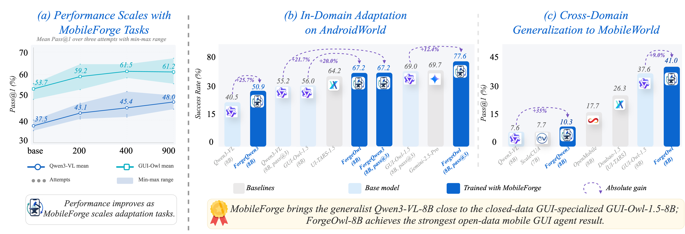

### TL;DR

Annotation-free adaptation framework for mobile-GUI agents. Combines target-app exploration, automatic curriculum mining, rollout execution, and hierarchical feedback-guided policy optimization into one substrate — so the policy can self-improve on a freshly updated app without human task or reward labels.

### Key idea

Hierarchical Feedback-Guided Policy Optimization: rather than a single coarse reward at episode end, the system mines feedback at multiple granularities (UI affordance match, sub-goal progression, episode success) from the agent's own exploration and uses them as a structured reward shape for RL. The curriculum is itself mined from the app's affordance graph.

### Main finding

The system substantially improves base-agent task completion on unseen target apps without any human annotation, while staying within the unified loop (no isolated rollout/feedback stages). Quantitative gains reported on app-specific benchmarks (see figure).

### Why it matters

Mobile-agent benchmarks lag the rate at which real apps ship updates. Annotation-free adaptation is the only realistic path to keeping agents useful in the wild. The hierarchical-reward idea is portable beyond GUI — it's the right shape whenever an environment leaks intermediate signals that a flat success/failure reward throws away.

### Knowledge graph integration

**Builds on / relates to existing pages:**
- [../post-training/grpo.md](../post-training/grpo.md) — group-relative policy optimization variant; MobileForge is in the GRPO family.
- [../post-training/_rl.md](../post-training/_rl.md) — RL post-training overview.
- [../post-training/rl-prompt-curation.md](../post-training/rl-prompt-curation.md) — curriculum-mining cousin.
- [../agents/README.md](../agents/README.md) — agent-training cluster.

**Suggested new pages:**
- `agents/annotation-free-gui-adaptation.md` *(depth)* — closed-loop exploration-curriculum-rollout-RL recipe.
- `post-training/hierarchical-rewards.md` *(depth)* — multi-granularity reward shaping for long-horizon tasks.

---

## 5. OpenThoughts-Agent

**Authors:** Negin Raoof, Richard Zhuang, Marianna Nezhurina, Etash Guha, Atula Tejaswi, Ryan Marten, et al.; senior advisors Benjamin Feuer, Ludwig Schmidt — *UC Berkeley / Stanford / Bespoke Labs / LAION / Oumi.AI*
**Links:** [arXiv:2606.24855](https://arxiv.org/abs/2606.24855) · [HF](https://huggingface.co/papers/2606.24855) · [AlphaXiv](https://www.alphaxiv.org/abs/2606.24855)
**Topics:** `agents`, `data`, `SFT`

### TL;DR

A fully open data-curation pipeline for training broadly capable agentic models. 100+ controlled ablations across the pipeline isolate what matters; the resulting 100K-example set fine-tunes Qwen3-32B to 44.8% across 7 agentic benchmarks, +3.9pp over the strongest prior open-data agent (Nemotron-Terminal-32B). Beats every alternative open dataset at every training-set size in compute-controlled comparisons.

### Key idea

Treat agentic-data curation as a multi-stage pipeline (task sourcing → diversity expansion → trajectory generation → filtering) and ablate each stage. The big finding: source diversity beats source quality past a threshold — narrow benchmarks like SWE-Smith produce specialists; broad mixes produce generalists. Everything (datasets, pipeline, ablation logs, models) ships open.

### Main finding

44.8% mean on 7 agentic benchmarks vs. 40.9% for Nemotron-Terminal-32B; favorable scaling at every data size; ablations characterize the marginal contribution of each pipeline stage. Sets a new open-data SOTA at the 32B-fine-tune tier.

### Why it matters

Closed agentic stacks (Claude, GPT) are improving fast, but open-source had no curated, ablation-justified recipe for agent SFT data. This closes that gap and gives any team a reproducible starting point — much as OpenThoughts did for math/code reasoning.

### Knowledge graph integration

**Builds on / relates to existing pages:**
- [../post-training/_post-training.md](../post-training/_post-training.md) — SFT stage of the post-training stack.
- [../data/_data-curation.md](../data/_data-curation.md) — curation pipeline analogue for agentic data.
- [../data/quality-filtering.md](../data/quality-filtering.md) — filter stage of the pipeline.
- [../agents/README.md](../agents/README.md) — agent training data fits here.

**Suggested new pages:**
- `data/agentic-data-curation.md` *(depth)* — task-sourcing, diversity expansion, and trajectory-filtering pipeline for agents.
- `case-studies/openthoughts-agent.md` *(case study)* — full pipeline + 32B Qwen3 fine-tune.

---

## 6. AOHP

**Authors:** Shanhui Zhao, Jiacheng Liu, Guohong Liu, Jichao Yan, Jialei Ye, Yuhao Yang, Hao Wen, Shizuo Tian, Yizhen Yuan, Yuxuan Chen, Yunxin Liu, Ju Ren, Ya-Qin Zhang, Chao Huang, Yao Guo, Yuanchun Li — *AIR, Tsinghua University*
**Links:** [arXiv:2606.23449](https://arxiv.org/abs/2606.23449) · [HF](https://huggingface.co/papers/2606.23449) · [AlphaXiv](https://www.alphaxiv.org/abs/2606.23449)
**Topics:** `agents`, `systems`, `safety`

### TL;DR

Open-source Android harness that treats AI agents as first-class OS entities: personalized service composition, efficient agent-oriented interfaces (replacing GUI scraping with structured APIs), and secure information flow (per-app capability boundaries). Reports +21% task completion, −52% token cost, and high security-policy compliance.

### Key idea

Stop forcing agents to interact with consumer UIs designed for humans. Expose each app's actions through agent-facing primitives the OS arbitrates, and let users compose services declaratively. The security layer enforces information-flow constraints at the syscall level rather than trusting the model to refuse out-of-policy actions.

### Main finding

Across the AOHP benchmark suite: +21.12% task completion vs. raw-GUI agents; −51.55% token cost (no screenshot-OCR loop); strong security-policy compliance under adversarial prompts.

### Why it matters

The "GUI scraping" pattern is a stopgap. If mobile agents are to scale, the OS itself has to grow agent-aware interfaces — and the safety story (capability scoping, information-flow control) has to live below the model, not be left to prompt-level guards. AOHP is a credible open prototype of that stack.

### Knowledge graph integration

**Builds on / relates to existing pages:**
- [../agents/README.md](../agents/README.md) — OS-level agent stack.
- [../systems/README.md](../systems/README.md) — sits in the systems layer for agent execution.
- [../safety/safety-case.md](../safety/safety-case.md) — capability-scoping as one limb of a deployment safety case.

**Suggested new pages:**
- `agents/os-level-agent-harness.md` *(depth)* — agent-facing OS primitives replacing GUI scraping.
- `safety/information-flow-control.md` *(depth)* — syscall-level capability constraints for agent stacks.

---

## 7. EventVLA

**Authors:** Ganlin Yang, Zhangzheng Tu, Yuqiang Yang, Sitong Mao, Junyi Dong, Tianxing Chen, Jiaqi Peng, Jing Xiong, Jiafei Cao, Jifeng Dai, Wengang Zhou, Yao Mu, Tai Wang — *Shanghai AI Laboratory / USTC / Huawei / Tsinghua / HKU*
**Links:** [arXiv:2606.20092](https://arxiv.org/abs/2606.20092) · [HF](https://huggingface.co/papers/2606.20092) · [AlphaXiv](https://www.alphaxiv.org/abs/2606.20092)
**Topics:** `multimodal`, `VLA`, `memory`

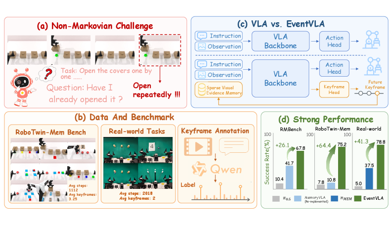

### TL;DR

Vision-Language-Action policy that learns *when* a frame is task-critical and stores only those — sparse keyframe memory instead of a saturated buffer or a decoupled second model. The Keyframe Evidence Memory module predicts future keyframe probabilities from the VLA's own latents. +40% average success on memory-requiring sim and real-world bimanual tasks.

### Key idea

Memory selection as an inline prediction head: the same VLA that emits actions also emits, per step, a probability that the current observation will matter later. High-probability frames go into a sparse "evidence" memory; everything else is dropped. This makes the memory itself learnable end-to-end against task reward, instead of being a fixed-window buffer or a separately trained encoder.

### Main finding

EventVLA gains +40% average success across 17 memory-required simulation tasks and 4 real-world bimanual tasks vs. prior memory-augmented VLAs, without the dual-system latency cost. RoboTwin-MeM is released as a diagnostic suite for non-Markovian manipulation.

### Why it matters

Borderline (kept): VLA = vision-language-action is robotics-flavored but uses the same transformer + memory tricks that LLM-side long-context work is converging on. The "predict-your-own-future-relevance" pattern transfers cleanly to long-context LLMs and agentic memory; see the parallels with MemGUI-Agent (#3) and MEMPROBE-style probes.

### Knowledge graph integration

**Builds on / relates to existing pages:**
- [../multimodal/README.md](../multimodal/README.md) — VLA sits in the multimodal cluster.
- [../agents/README.md](../agents/README.md) — agentic memory parallel.

**Suggested new pages:**
- `multimodal/_vla.md` *(taxonomy)* — RT-2 → OpenVLA → π0 → EventVLA family (overlaps with the 2026-05-29 suggestion).
- `multimodal/sparse-keyframe-memory.md` *(depth)* — learned memory-selection head for long-horizon VLAs.

---

## 8. Semantic Browsing

**Authors:** Sara Dorfman, Maya Vishnevsky, Omer Dahary, Or Patashnik, Daniel Cohen-Or — *Tel Aviv University*
**Links:** [arXiv:2606.23679](https://arxiv.org/abs/2606.23679) · [HF](https://huggingface.co/papers/2606.23679) · [AlphaXiv](https://www.alphaxiv.org/abs/2606.23679)
**Topics:** `diffusion`, `multimodal`, `agents`

### TL;DR

Adds *structured* diversity to text-to-image generation: instead of stochastic noise variation, a VLM-driven agentic workflow rewrites the prompt along interpretable semantic axes (color, pose, background, era, …) so the user can navigate a gallery whose every cell maps to a comprehensible design decision.

### Key idea

Decouple semantic decision-making from pixel generation. Modern T2I models train on highly elaborated captions, so the "meaning" lives in the caption; tweaking the caption is the right surface for diversity. An agentic VLM workflow generates a hierarchy of caption variations along enforced semantic dimensions, and each variation feeds the T2I model unchanged.

### Main finding

Produces navigable design spaces where every variation maps to a specific, user-understandable axis. Beats stochastic-noise diversity baselines on both perceptual diversity and human-interpretable design coverage.

### Why it matters

Diversity in T2I has been "more noise" for years and the results are incoherent. Pushing diversity up to the caption layer is the right altitude — and it's an unusually clean example of an agentic workflow producing something a raw model can't.

### Knowledge graph integration

**Builds on / relates to existing pages:**
- [../multimodal/README.md](../multimodal/README.md) — T2I sits in multimodal generation.
- [../agents/README.md](../agents/README.md) — agentic workflow for caption rewriting.

**Suggested new pages:**
- `multimodal/_t2i-diversity.md` *(taxonomy)* — noise variation, classifier-free guidance scheduling, caption rewriting.

---

## 9. Critique of Agent Model

**Authors:** Eric Xing, Mingkai Deng, Jinyu Hou — *MBZUAI Institute of Foundation Models / CMU*
**Links:** [arXiv:2606.23991](https://arxiv.org/abs/2606.23991) · [HF](https://huggingface.co/papers/2606.23991) · [AlphaXiv](https://www.alphaxiv.org/abs/2606.23991)
**Topics:** `agents`, `position`

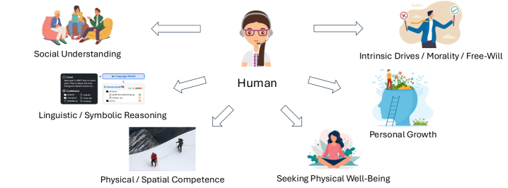

### TL;DR

Position paper distinguishing *agentic* systems (capabilities assembled via engineered scaffolding) from *agentive* systems (capabilities internalized in the model). Surveys agent architectures along five axes — goal, identity, decision-making, self-regulation, learning — and proposes the Goal-Identity-Configurator (GIC) blueprint for a model whose agency lives inside the weights, paired with a learned world model.

### Key idea

The agency a system shows isn't reducible to the LLM that powers it — it's a property of where the scaffolding lives. Today's "agents" front-load the scaffolding (planners, memory stores, tool registries) outside the model; an *agentive* model would internalize hierarchical goals, identity evolution, simulative reasoning grounded in a separately trained world model, and self-directed learning. GIC sketches that internal architecture.

### Main finding

Conceptual / no benchmark numbers. The contribution is the agentic-vs-agentive distinction and the five-axis taxonomy, both of which give the field crisper terminology for what's still genuinely missing in current "agent" systems (notably: durable identity, internalized goal hierarchy, true self-regulation).

### Why it matters

The word "agent" has lost meaning. A position paper from a serious group that imposes structure on the debate — and connects it to concrete design choices like the role of an internal world model (cf. Qwen-AgentWorld in #1) — is overdue.

### Knowledge graph integration

**Builds on / relates to existing pages:**
- [../agents/README.md](../agents/README.md) — central to the agents cluster.
- [../safety/_scheming.md](../safety/_scheming.md) — "agency" framing matters for scheming/oversight discussions.

**Suggested new pages:**
- `agents/_agency.md` *(taxonomy)* — agentic vs. agentive systems, axes of agency, GIC blueprint.

---

## 10. Execute-Distill-Verify

**Authors:** Shiding Zhu, Yudi Qi, Yajie Wang, Jiaze Li, Chao Song, Yaorui Shi, Yibo Miao, Hanqi Gao, Kai Zhang — *Zhejiang U. / Tsinghua / NPU / USTC / SJTU*
**Links:** [arXiv:2606.24428](https://arxiv.org/abs/2606.24428) · [HF](https://huggingface.co/papers/2606.24428) · [AlphaXiv](https://www.alphaxiv.org/abs/2606.24428)
**Topics:** `agents`, `memory`, `verification`

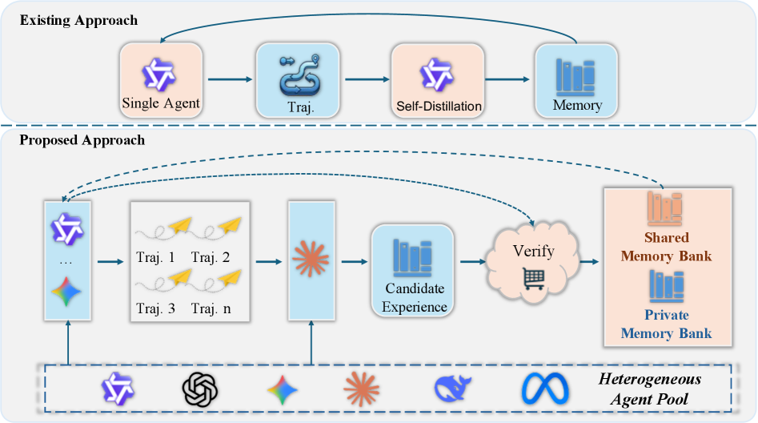

### TL;DR

Agent experience-learning suffers from a *self-confirmation trap*: the same agent that executes a task also writes its own lessons-learned, so wrong-but-self-consistent trajectories get filed as success and poison later retrieval. EDV (Execute-Distill-Verify) splits these roles across separate agents, eliminating the contamination loop.

### Key idea

Decouple the three steps of experience learning into three agents with different incentives: an *executor* runs the task and produces a trajectory; a *distiller* extracts candidate lessons; a *verifier* tries to refute each lesson against independent evidence before it's written into memory. Wrong trajectories no longer get to certify themselves.

### Main finding

EDV reduces the rate at which false experiences enter long-term memory and improves downstream task success on agentic-experience benchmarks. The framing (separate-roles-as-defense-against-self-confirmation) generalizes beyond agents to any LLM that summarizes its own behavior.

### Why it matters

Self-improving agents are a near-term inevitability and the failure mode is already visible: agents memorize their own confabulations. A clean separation-of-roles pattern, named and benchmarked, gives the field a concrete tactic for the problem.

### Knowledge graph integration

**Builds on / relates to existing pages:**
- [../post-training/rejection-sampling.md](../post-training/rejection-sampling.md) — verifier-gated experience accumulation is a rejection-sampling cousin.
- [../post-training/reasoning/orm.md](../post-training/reasoning/orm.md) — verifier role parallels outcome reward models.
- [../safety/cot-monitoring.md](../safety/cot-monitoring.md) — third-party verification parallels CoT monitoring at the experience layer.
- [../agents/README.md](../agents/README.md) — agentic memory cluster.

**Suggested new pages:**
- `agents/execute-distill-verify.md` *(depth)* — separated-role pipeline for agent experience learning.
- `agents/self-confirmation-trap.md` *(depth)* — failure mode where agents memorize their own confabulations.

---

## 11. CF-World

**Authors:** Jiayi Lei, Yuandong Pu, Xingyu Han, Rongpeng Zhu, Jing Xu, Jinyao Wang, Zijian Zhou, Bin Fu, Yuewen Cao, Yihao Liu, Hongsheng Li — *SJTU / Shanghai AI Lab / CUHK*
**Links:** [arXiv:2606.24548](https://arxiv.org/abs/2606.24548) · [HF](https://huggingface.co/papers/2606.24548) · [AlphaXiv](https://www.alphaxiv.org/abs/2606.24548)
**Topics:** `diffusion`, `eval`, `reasoning`

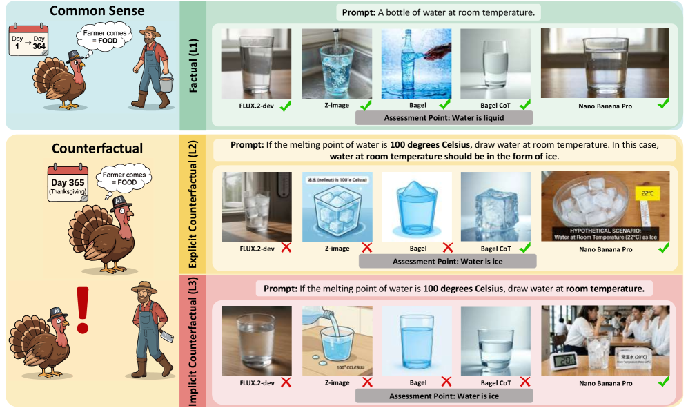

### TL;DR

Counterfactual benchmark for text-to-image causal reasoning. Three difficulty levels (factual → explicit counterfactual → implicit counterfactual), VLM-based evaluator (CF-Eval), and two new metrics: Prior Resistance Rate (can the model resist its priors?) and Reasoning Retention Rate (can it stay counterfactual without explicit visual cues?). Both open and closed T2I models degrade sharply when asked to break commonsense.

### Key idea

Borrow Russell's inductivist turkey as the diagnostic frame: a model that has only ever seen the sun rise will keep predicting it. CF-World stress-tests that hypothesis on T2I by issuing prompts whose visual outcomes contradict frequent training co-occurrences, then measuring how often the model retreats to the familiar prior.

### Main finding

All evaluated models — open and closed — show sharp degradation from factual to counterfactual prompts. The analysis traces this to T2I models encoding world knowledge and visual appearance as tightly coupled patterns, so breaking visual co-occurrence implicitly breaks the underlying knowledge.

### Why it matters

T2I leaderboards rank models on prompts that look like the training distribution. CF-World shows the ranking can flip on causal-counterfactual prompts and forces the field to confront that "alignment with reality" is also a benchmark axis.

### Knowledge graph integration

**Builds on / relates to existing pages:**
- [../evaluation/README.md](../evaluation/README.md) — evaluation cluster.
- [../multimodal/README.md](../multimodal/README.md) — T2I sits in multimodal generation.

**Suggested new pages:**
- `evaluation/_t2i-benchmarks.md` *(taxonomy)* — factual fidelity, prompt adherence, counterfactual reasoning, safety.
- `evaluation/counterfactual-t2i.md` *(depth)* — CF-World protocol + PRR/RRR metrics.

---

## 12. DiffusionBench

**Authors:** Xingjian Leng, Jaskirat Singh, Zhanhao Liang, Ethan Smith, Martin Bell, Aninda Saha, Yuhui Yuan, Liang Zheng — *Australian National University / Canva Research*
**Links:** [arXiv:2606.24888](https://arxiv.org/abs/2606.24888) · [HF](https://huggingface.co/papers/2606.24888) · [AlphaXiv](https://www.alphaxiv.org/abs/2606.24888)
**Topics:** `diffusion`, `eval`, `DiT`

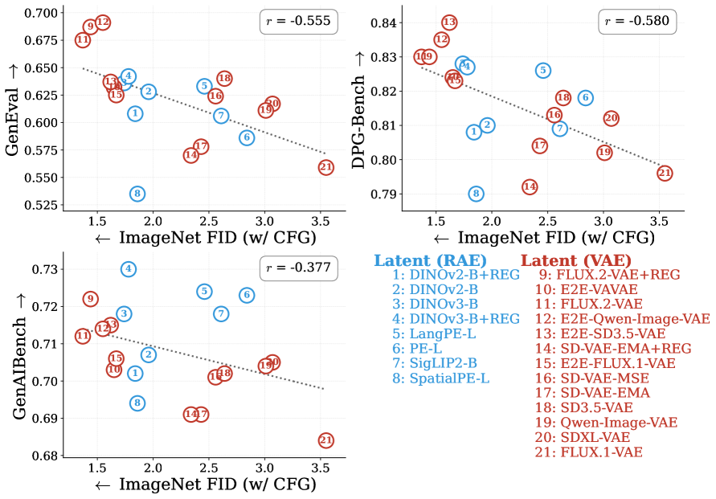

### TL;DR

Argues the DiT research community has over-converged on class-conditional ImageNet FID and that method rankings barely transfer to text-to-image. Introduces NanoGen, a unified DiT training framework that trains both ImageNet and T2I models with a 12-line config change — and finds Pearson correlations between −0.38 and −0.58 across three metrics on 21 trained models.

### Key idea

A single, lean training framework that supports RAE / VAE / pixel-space / MeanFlow diffusion under both ImageNet and T2I setups. Once T2I training costs roughly what ImageNet training does, there is no longer an excuse to report only ImageNet FID. DiffusionBench bundles the framework with the recommended dual-evaluation reporting standard.

### Main finding

Across 21 latent diffusion models, the correlation between ImageNet FID and T2I metrics is *negative* (−0.38 to −0.58 Pearson), meaning a method that improves ImageNet FID is more likely than chance to *hurt* T2I metrics. Strongly implies the community's "DiT progress" numbers are partly an artifact of the chosen task.

### Why it matters

A decade of vision benchmarks has trained the community to over-fit on convenient settings. DiffusionBench has the receipts on DiT specifically and the open framework to make dual-evaluation the new default.

### Knowledge graph integration

**Builds on / relates to existing pages:**
- [../evaluation/README.md](../evaluation/README.md) — evaluation cluster.
- [../multimodal/README.md](../multimodal/README.md) — DiT used heavily in multimodal generation.

**Suggested new pages:**
- `multimodal/_diffusion-architectures.md` *(taxonomy)* — UNet, DiT, RAE, VAE, pixel-space, MeanFlow.
- `evaluation/diffusionbench.md` *(depth)* — unified DiT eval and the ImageNet-vs-T2I disconnect.

---

## 13. DREAM

**Authors:** Yixuan Tang, Yi Yang — *Hong Kong University of Science and Technology*
**Links:** [arXiv:2606.24667](https://arxiv.org/abs/2606.24667) · [HF](https://huggingface.co/papers/2606.24667) · [AlphaXiv](https://www.alphaxiv.org/abs/2606.24667)
**Topics:** `retrieval`, `embeddings`, `LLM`

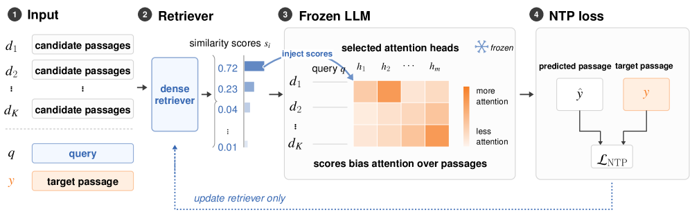

### TL;DR

Trains a dense retriever using *next-token prediction loss from a frozen LLM* as the only supervision — no contrastive positives/negatives. Retriever similarities are injected into selected attention heads of the LLM as weights over candidate documents; the LLM's prediction loss back-propagates through the attention to the retriever. Beats contrastive baselines on BEIR and RTEB across 0.5B–3B embeddings.

### Key idea

If a document is relevant, the LLM's next-token loss drops when it's conditioned on that document. Use that drop as supervision. The bridge is the attention layer: retriever scores become weights over the documents in the prompt, so gradient flow from the LM loss reaches the retriever through standard attention back-prop. The LLM stays frozen; only the retriever updates.

### Main finding

DREAM consistently outperforms contrastive baselines across 0.5B–3B embedding backbones on BEIR and RTEB benchmarks, without requiring labeled (query, positive, negative) triples.

### Why it matters

Contrastive triples are the bottleneck for high-quality retriever training; this side-steps that with a purely LM-side supervision signal. If it scales, it could replace much of the hand-crafted contrastive data pipeline used by SOTA retrievers.

### Knowledge graph integration

**Builds on / relates to existing pages:**
- [../fundamentals/_tokenization.md](../fundamentals/_tokenization.md) — tokenization-adjacent (embeddings).

**Suggested new pages:**
- `data/_retrieval-training.md` *(taxonomy)* — contrastive, hard-negative mining, LM-loss-supervised (DREAM).
- `data/dream-retrieval.md` *(depth)* — attention-injection-based retriever training without contrastive pairs.

---

## 14. HDS

**Authors:** Authors not explicitly listed on the HF page; supported by Jing Ma (NSFC) — *(unspecified)*
**Links:** [arXiv:2606.24133](https://arxiv.org/abs/2606.24133) · [HF](https://huggingface.co/papers/2606.24133) · [AlphaXiv](https://www.alphaxiv.org/abs/2606.24133)
**Topics:** `pre-training`, `data`, `RL`

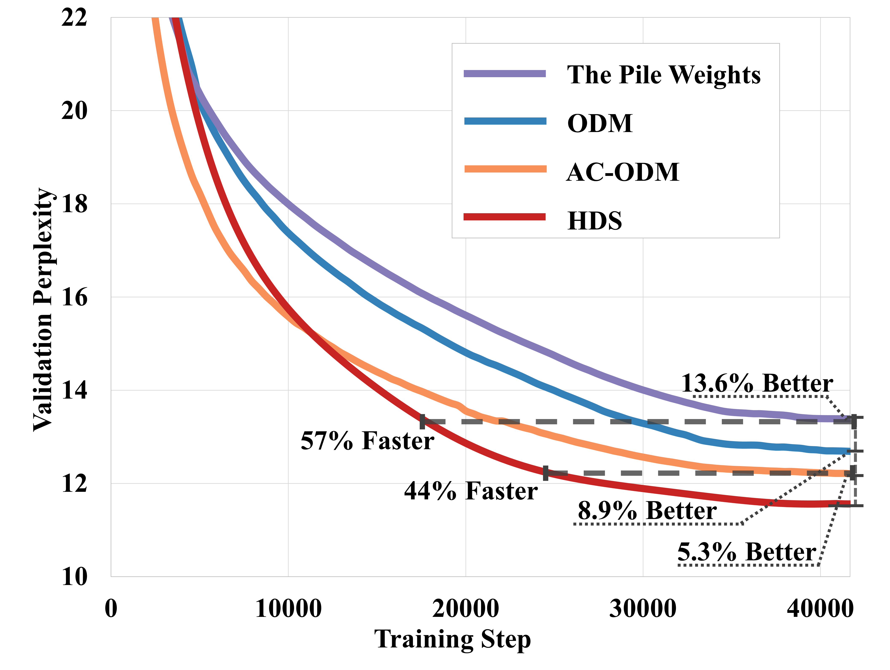

### TL;DR

Holistic Data Scheduler (HDS) frames online data mixing for LLM pretraining as a continuous-control RL problem solved with Soft Actor-Critic. Reward combines three perspectives: data-driven (quality scores), loss-driven (inter-domain influence), and model-driven (weight-norm signals). On The Pile, reaches the next-best method's final validation perplexity in 44% fewer iterations, +7.2% MMLU 0-shot.

### Key idea

Past online data-mixing methods optimized a single signal (loss, gradient norm, or quality). HDS treats the mix proportions as a continuous control variable and trains a SAC policy on a *multi-objective* reward function that weights quality, loss-influence, and weight-norm dynamics simultaneously. SAC's stochastic policy helps exploration in the high-dimensional mixture space.

### Main finding

44% fewer training iterations to reach the next-best method's perplexity on The Pile; +7.2% MMLU 0-shot; consistent gains across other downstream benchmarks. Ablations isolate the contribution of each reward term.

### Why it matters

Data mixture is one of the highest-leverage knobs in pretraining and is under-instrumented in the open community. A scheduler that converts mixture decisions into a credit-assignment problem the RL stack can solve is a useful primitive — and the three-signal reward structure is a template others can adopt.

### Knowledge graph integration

**Builds on / relates to existing pages:**
- [../pre-training/_lr-schedules.md](../pre-training/_lr-schedules.md) — schedule-as-a-controller pattern.
- [../data/_data-curation.md](../data/_data-curation.md) — mixture-design step of curation.
- [../post-training/_rl.md](../post-training/_rl.md) — uses SAC, an RL algorithm.

**Suggested new pages:**
- `data/online-data-mixing.md` *(depth)* — online schedulers for pretraining data mixtures, including HDS.
- `pre-training/_data-schedulers.md` *(taxonomy)* — DoReMi, DoGE, RegMix, HDS — class overview.

---

## 15. VeriEvol

**Authors:** Kai Zheng, Jie Wu, Can Xu, Qingfeng Sun, Han Hu, Yujiu Yang — *Tsinghua University / Tencent Hunyuan*
**Links:** [arXiv:2606.23543](https://arxiv.org/abs/2606.23543) · [HF](https://huggingface.co/papers/2606.23543) · [AlphaXiv](https://www.alphaxiv.org/abs/2606.23543)
**Topics:** `multimodal`, `reasoning`, `SFT`, `data`

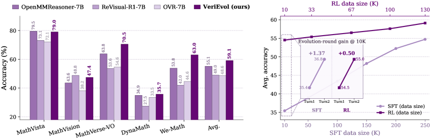

### TL;DR

Multimodal-math reasoning data factory that decouples *difficulty* (expanded via type-aware Evol-Instruct operators) from *answer reliability* (enforced by an HTV-Agent verifier that only accepts answers after multi-source counter-evidence fails to refute them). Scaling SFT from 10K → 250K samples lifts mean accuracy 35.42 → 54.73; under fixed RL conditions, +3.88 total over baseline.

### Key idea

Two coupled engines. A type-aware evolution module mutates low-difficulty image-grounded seeds into harder variants by applying difficulty operators conditioned on problem type. A separate hypothesis-testing verifier (HTV-Agent) accepts a generated answer only when multiple counter-evidence searches fail to falsify it — turning answer verification into a Popperian falsification loop.

### Main finding

SFT: scaling evolved data 10K → 250K lifts mean accuracy 35.42 → 54.73 across multimodal math benchmarks. RL: under fixed conditions, full system adds +3.88 over baseline (decomposed as +1.82 evolution, +2.06 verification). Prompts, data, models, code, and full verifier traces are released.

### Why it matters

Synthetic multimodal-reasoning data has been bottlenecked by either insufficient difficulty (weak evolution) or unreliable answers (no good verifier). VeriEvol's twin contribution — difficulty operators + falsification verifier — is the cleanest recipe so far for scaling self-generated multimodal RL/SFT data.

### Knowledge graph integration

**Builds on / relates to existing pages:**
- [../post-training/_post-training.md](../post-training/_post-training.md) — SFT + RL stack.
- [../post-training/rlvr.md](../post-training/rlvr.md) — verifiable-reward pattern at the data-generation layer.
- [../post-training/rejection-sampling.md](../post-training/rejection-sampling.md) — verifier-gated acceptance cousin.
- [../multimodal/README.md](../multimodal/README.md) — multimodal cluster.
- [../evaluation/math500.md](../evaluation/math500.md) — text-only math eval analogue.

**Suggested new pages:**
- `data/evol-instruct.md` *(depth)* — type-aware difficulty operators for synthetic instruction expansion.
- `data/falsification-verifier.md` *(depth)* — HTV-Agent–style Popperian verification for synthetic-data answers.

---

## Notes

- Borderline inclusions are flagged in-section with an italic *Borderline: …* note (see #7 EventVLA).
- Hero figures live in `assets/2026-06-24/`. Two figures were unavailable: MemGUI-Agent (#3) and AOHP (#6) — arXiv HTML page did not expose a parseable figure URL.
- This digest is informational. No existing concept files, `READING-LIST.md`, or `PAPERS.md` were modified to produce it.
