# Daily AI papers — 2026-06-25

*Curated from HF Daily Papers. 15 of 33 papers kept after relevance filter.*

## Papers at a glance

| # | Title | Topics | Org |
| --- | --- | --- | --- |
| 1 | [Beyond NL2Code: A Structured Survey of Multimodal Code Intelligence](#1-beyond-nl2code-a-structured-survey-of-multimodal-code-intelligence) | `multimodal`, `eval`, `survey` | Meituan + HKU + CUHK |
| 2 | [Improved Large Language Diffusion Models (iLLaDA)](#2-improved-large-language-diffusion-models-illada) | `LLM`, `diffusion`, `pre-training` | RUC + ByteDance Seed |
| 3 | [Wan-Streamer v0.1: End-to-end Real-time Interactive Foundation Models](#3-wan-streamer-v01-end-to-end-real-time-interactive-foundation-models) | `multimodal`, `architectures`, `streaming` | Alibaba |
| 4 | [Are We Ready For An Agent-Native Memory System?](#4-are-we-ready-for-an-agent-native-memory-system) | `agents`, `eval` | OpenDataBox |
| 5 | [V-Zero: Answer-Label-Free On-Policy Distillation](#5-v-zero-answer-label-free-on-policy-distillation) | `multimodal`, `post-training`, `distillation` | SCU + collaborators |
| 6 | [IV-CoT: Implicit Visual Chain-of-Thought](#6-iv-cot-implicit-visual-chain-of-thought-for-structure-aware-text-to-image-generation) | `multimodal`, `diffusion`, `reasoning` | CAS + Ant Group |
| 7 | [Autodata: An agentic data scientist for synthetic data](#7-autodata-an-agentic-data-scientist-for-synthetic-data) | `data`, `agents`, `synthetic-data` | FAIR @ Meta |
| 8 | [Look Light, Think Heavy: Multimodal CoT Can and Cannot Do](#8-look-light-think-heavy-multimodal-cot-can-and-cannot-do) | `multimodal`, `reasoning`, `eval` | CAS + UCAS |
| 9 | [RoPE-Aware Bit Allocation for KV-Cache Quantization (Block-GTQ)](#9-rope-aware-bit-allocation-for-kv-cache-quantization-block-gtq) | `quantization`, `efficient-inference` | HKUST + CUHK + Xiaomi |
| 10 | [ReNIO: Reweighting Negative Trajectory Importance for On-Policy Distillation](#10-renio-reweighting-negative-trajectory-importance-for-on-policy-distillation) | `post-training`, `distillation` | ECNU + SII |
| 11 | [What Intermediate Layers Know: Detecting Jailbreaks from Entropy Dynamics](#11-what-intermediate-layers-know-detecting-jailbreaks-from-entropy-dynamics) | `safety`, `interp` | LMU Munich + Pisa |
| 12 | [Do Thinking Tokens Help with Safety?](#12-do-thinking-tokens-help-with-safety) | `safety`, `reasoning`, `interp` | Princeton |
| 13 | [Plans Don't Persist: Why Context Management Is Load Bearing for LLM Agents](#13-plans-dont-persist-why-context-management-is-load-bearing-for-llm-agents) | `agents`, `interp` | Snowflake AI Research |
| 14 | [Constraint Tax: Tool Calling Suppression Under Structured Output Constraints](#14-constraint-tax-tool-calling-suppression-under-structured-output-constraints) | `agents`, `efficient-inference` | Focus Technology + NJUST |
| 15 | [When Lower Privileges Suffice: Over-Privileged Tool Selection in LLM Agents](#15-when-lower-privileges-suffice-over-privileged-tool-selection-in-llm-agents) | `agents`, `safety` | CAS + BAAI + PKU |

---

## 1. Beyond NL2Code: A Structured Survey of Multimodal Code Intelligence

**Authors:** Xuanle Zhao, Qiushi Sun, Jingyu Xiao, et al. — *Meituan, HKU, CUHK, CAS, Adelaide, LMU, USTC, QMUL*
**Links:** [arXiv:2606.15932](https://arxiv.org/abs/2606.15932) · [HF](https://huggingface.co/papers/2606.15932) · [AlphaXiv](https://www.alphaxiv.org/abs/2606.15932)
**Topics:** `multimodal`, `eval`, `survey`

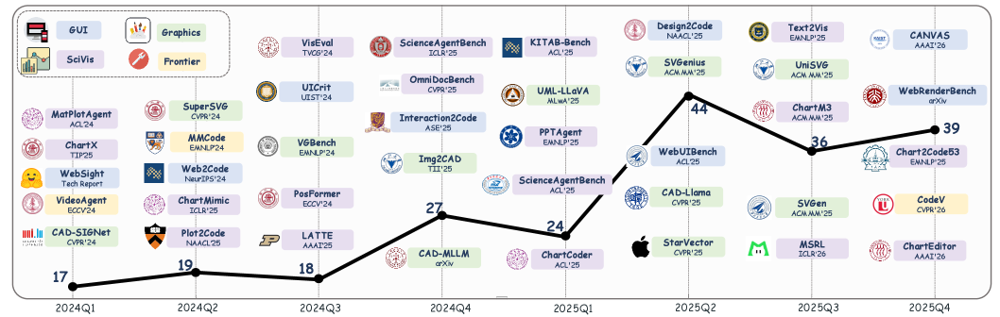

### TL;DR

A taxonomy of "multimodal code intelligence" — programming tasks where intent is specified through visual artifacts (screenshots, UI mocks, charts, vector drawings, videos, interactive states) rather than natural language. The survey organizes datasets, methods, and evaluation around the mapping from pixels → executable program, and argues that correctness must be checked after execution (rendered layout, behavior) rather than at the syntax level.

### Key idea

Frame code generation as a vision-grounded planning problem: structural perception of the visual input → intermediate representation → executable code that, once run, reproduces the artifact. Splits the field into UI-to-code, chart-to-code, doc-to-code, and video/interactive-state-to-code, with a shared "render-and-compare" evaluation axis.

### Main finding

The survey catalogs ~10 task families with their benchmarks and shows that current MLLMs score well on syntactic match yet collapse on functional/visual fidelity once the rendered output is compared. The gap is largest for interactive states and chart faithfulness, where layout and data semantics must match after execution.

### Why it matters

Code is becoming a multimodal output — most commercial coding agents already accept screenshots. This paper provides the missing scaffolding: what the tasks are, what to measure, and where MLLM-based code agents currently fail. A natural anchor for a taxonomy file in the KG.

### Knowledge graph integration

**Builds on / relates to existing pages:**
- [evaluation/humaneval.md](../evaluation/humaneval.md) — contrasted as the canonical NL2Code benchmark this work moves beyond.
- [evaluation/livecodebench.md](../evaluation/livecodebench.md) — same code-eval lineage, text-only.
- [multimodal/README.md](../multimodal/README.md) — extends the multimodal scope to code outputs.

**Suggested new pages:**
- `multimodal/_multimodal-code-intelligence.md` *(taxonomy)* — covers visual-to-code task families and render-based evaluation.

---

## 2. Improved Large Language Diffusion Models (iLLaDA)

**Authors:** Qiyang Min, Shaoxuan Xu, Zihao Huang, Yuxuan Song, Yong Shan, Yankai Lin, Wayne Xin Zhao, Chongxuan Li, Ji-Rong Wen — *Renmin University of China, ByteDance Seed*
**Links:** [arXiv:2606.25331](https://arxiv.org/abs/2606.25331) · [HF](https://huggingface.co/papers/2606.25331) · [AlphaXiv](https://www.alphaxiv.org/abs/2606.25331)
**Topics:** `LLM`, `diffusion`, `pre-training`

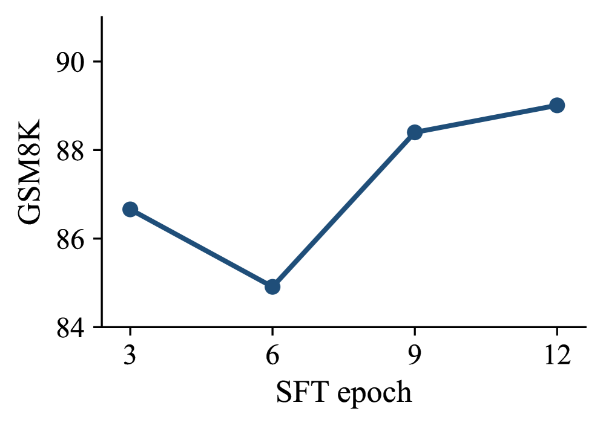

### TL;DR

iLLaDA is an 8B fully bidirectional masked-diffusion language model trained from scratch on 12T tokens, then SFT-ed on a 25B-token instruction corpus for 12 epochs. The paper closes much of the gap between diffusion LMs and same-size autoregressive baselines and offers a recipe (variable-length generation, confidence-based MCQ scoring) for using a masked-diffusion model as a general-purpose LLM.

### Key idea

Keep the masked-diffusion objective end-to-end — no autoregressive distillation pivot — and ride bidirectional attention through the whole stack. Variable-length generation samples token positions until a length predictor terminates, sidestepping fixed-length-mask artifacts. Confidence-based scoring uses the marginal mask predictions to rank multiple-choice answers without forcing a single decoding pass.

### Main finding

Versus LLaDA at the same size: +21.6 on BBH, +14.9 on ARC-Challenge for the base; +14.5 on MATH, +16.5 on HumanEval after instruction tuning. Competitive with Qwen2.5-7B on several benchmarks despite the non-autoregressive objective.

### Why it matters

The strongest published evidence to date that masked-diffusion can scale to "regular LLM" territory at 8B without an AR teacher. If the trend holds at larger scale, it changes the inference story (parallel multi-token decoding, edits in place) and reopens architectural choices that the AR-only mainstream had quietly closed.

### Knowledge graph integration

**Builds on / relates to existing pages:**
- [architectures/transformer-block.md](../architectures/transformer-block.md) — the architectural substrate, here with full bidirectional attention.
- [pre-training/_lr-schedules.md](../pre-training/_lr-schedules.md) — 12T-token pre-training requires a stable schedule choice.
- [evaluation/math500.md](../evaluation/math500.md), [evaluation/humaneval.md](../evaluation/humaneval.md) — primary evaluation harnesses for the reported gains.

**Suggested new pages:**
- `architectures/masked-diffusion-llm.md` *(depth)* — covers the masked-diffusion objective applied to text LLMs (bidirectional attention, mask-token noising, variable-length generation).
- `case-studies/illada.md` *(case study)* — 8B masked-diffusion LLM trained from scratch is a tech-report-sized contribution.

---

## 3. Wan-Streamer v0.1: End-to-end Real-time Interactive Foundation Models

**Authors:** Lianghua Huang, Zhifan Wu, Wei Wang, Yupeng Shi, Mengyang Feng, Junjie He, Chenwei Xie, Yu Liu, Jingren Zhou, et al. — *Alibaba (likely Wan team)*
**Links:** [arXiv:2606.25041](https://arxiv.org/abs/2606.25041) · [HF](https://huggingface.co/papers/2606.25041) · [AlphaXiv](https://www.alphaxiv.org/abs/2606.25041)
**Topics:** `multimodal`, `architectures`, `streaming`

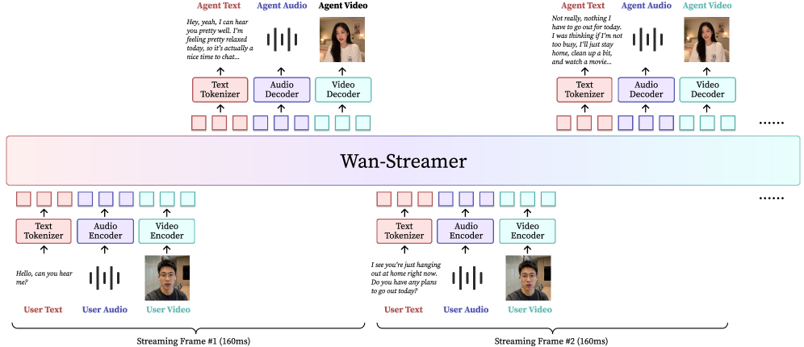

### TL;DR

A single Transformer that ingests and emits interleaved audio, video, and text tokens in real time, coordinated by block-causal attention so partial inputs can be processed before the user finishes speaking. Removes the cascaded VAD → ASR → LLM → TTS → talking-head pipeline in favor of one model with ~200 ms model-side latency and ~550 ms end-to-end.

### Key idea

"Block-causal" attention: within a streaming block, tokens attend bidirectionally; across blocks, attention is strictly causal. Combined with causal audio/video encoders and decoders, this lets the model consume and produce 160 ms-long multimodal units at 25 fps without breaking the autoregressive contract.

### Main finding

~200 ms model-side response latency, ~550 ms total interaction latency including 350 ms bidirectional network. Sub-second full-duplex audio-visual conversation in a single end-to-end model, where prior real-time avatars required ≥4 stitched modules.

### Why it matters

Streaming is the practical bottleneck for "talking" foundation models. Wan-Streamer is a credible argument that the cascaded design is the wrong abstraction once the underlying tokenizers are causal; the same recipe likely transfers to robotics and computer-use agents where perception/action latency is also load-bearing.

### Knowledge graph integration

**Builds on / relates to existing pages:**
- [architectures/multi-head-attention.md](../architectures/multi-head-attention.md) — block-causal attention is a constrained variant of the standard mask.
- [multimodal/README.md](../multimodal/README.md) — fits the any-to-any multimodal slot.

**Suggested new pages:**
- `architectures/block-causal-attention.md` *(depth)* — within-block bidirectional, across-block causal masking for streaming.
- `case-studies/wan-streamer.md` *(case study)* — end-to-end multimodal interactive foundation model.

---

## 4. Are We Ready For An Agent-Native Memory System?

**Authors:** Anonymous (OpenDataBox group)
**Links:** [arXiv:2606.24775](https://arxiv.org/abs/2606.24775) · [HF](https://huggingface.co/papers/2606.24775) · [AlphaXiv](https://www.alphaxiv.org/abs/2606.24775)
**Topics:** `agents`, `eval`

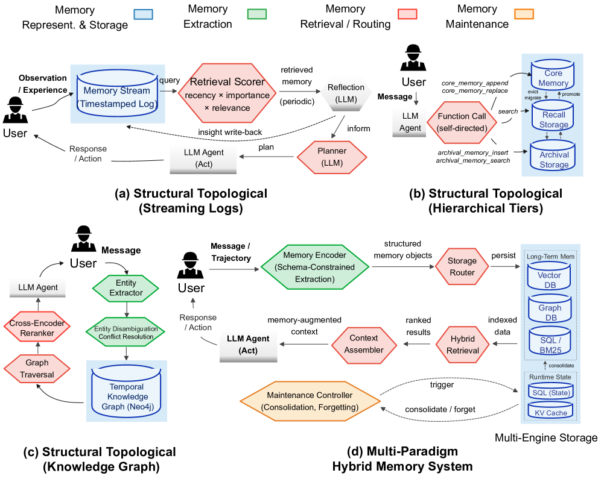

### TL;DR

Systematic evaluation of 12 LLM-agent memory systems on 11 datasets / 5 workloads, decomposed into four modules: representation/storage, extraction, retrieval/routing, and maintenance. The headline is that no single design wins everywhere — workload bottleneck dictates which module is the right place to invest.

### Key idea

Treat agent memory as a database system, not a black box. The taxonomy isolates: how facts are stored (text chunks vs structured triples vs graphs), how they're extracted from raw rollouts, how queries are routed (semantic vs symbolic vs hybrid), and how stale facts are updated/garbage-collected.

### Main finding

Across the panel: dense semantic retrieval wins on QA-style workloads; symbolic / graph storage wins on multi-hop reasoning; **localized maintenance is consistently more cost-efficient than global reorganization** — periodically rebuilding the whole memory is the worst design choice on every workload.

### Why it matters

Memory has been the under-engineered piece of the agent stack — most production agents bolt RAG on top of a chat loop and call it done. This is the first study to quantify the cost/benefit of the four design axes and to surface "localized maintenance" as a defensible default. Concrete guidance for anyone building long-horizon agents.

### Knowledge graph integration

**Builds on / relates to existing pages:**
- [agents/README.md](../agents/README.md) — slots in as the memory sub-area of agent design.

**Suggested new pages:**
- `agents/_agent-memory.md` *(taxonomy)* — the four-module decomposition (representation, extraction, retrieval, maintenance) maps cleanly to a taxonomy file.

---

## 5. V-Zero: Answer-Label-Free On-Policy Distillation

**Authors:** Haoxiang Sun, Zhihang Yi, Langxuan Deng, Yuhao Zhou, Peiqi Jia, Jian Zhao, Li Yuan, Jiancheng Lv, Tao Wang — *Sichuan University et al.*
**Links:** [arXiv:2606.25319](https://arxiv.org/abs/2606.25319) · [HF](https://huggingface.co/papers/2606.25319) · [AlphaXiv](https://www.alphaxiv.org/abs/2606.25319)
**Topics:** `multimodal`, `post-training`, `distillation`

### TL;DR

V-Zero trains MLLMs for fine-grained visual reasoning without any text-answer labels. Instead of an external verifier, it uses a contrastive visual signal: pair a question-relevant region crop against a deliberately wrong crop and gate token-level on-policy distillation by whether the student's trajectory is consistent with the right crop.

### Key idea

Recasts on-policy distillation as "negative-free stop-gradient alignment" and observes that it lacks trajectory-level discrimination. Adds a contrastive-evidence gate: the relevant crop and a negative crop together act as a label-free trajectory judge, telling the distillation loss when to fire.

### Main finding

Consistent improvements on multiple fine-grained visual reasoning benchmarks while staying answer-label-free. Reported throughput: **>5× faster than supervised fine-tuning baselines and >10× faster than RL** at matched quality.

### Why it matters

Removes the hand-labeled rationale bottleneck for visual-reasoning post-training. The contrastive-evidence idea generalizes — any task with a "right vs wrong view" of the input could substitute for the verifier in on-policy distillation pipelines.

### Knowledge graph integration

**Builds on / relates to existing pages:**
- [post-training/_rl.md](../post-training/_rl.md) — positioned against verifier-based RL post-training as an alternative.
- [post-training/rejection-sampling.md](../post-training/rejection-sampling.md) — both filter trajectories without explicit labels.

**Suggested new pages:**
- `post-training/on-policy-distillation.md` *(depth)* — the underlying paradigm (sample from student, distill from teacher on the same trajectory) that V-Zero and ReNIO (#10) both build on.

---

## 6. IV-CoT: Implicit Visual Chain-of-Thought for Structure-Aware Text-to-Image Generation

**Authors:** Zixuan Li, Haokun Lin, Yicheng Xiao, Zhiwei Li, Xinyang Song, Zelong Zheng, Yong He, Heng Yao, Ke Ding, Chao Yu, Chuan Yuan, Qi Li, Zhenan Sun — *NLPR / CAS, Ant Group, HKU*
**Links:** [arXiv:2606.24849](https://arxiv.org/abs/2606.24849) · [HF](https://huggingface.co/papers/2606.24849) · [AlphaXiv](https://www.alphaxiv.org/abs/2606.24849)
**Topics:** `multimodal`, `diffusion`, `reasoning`

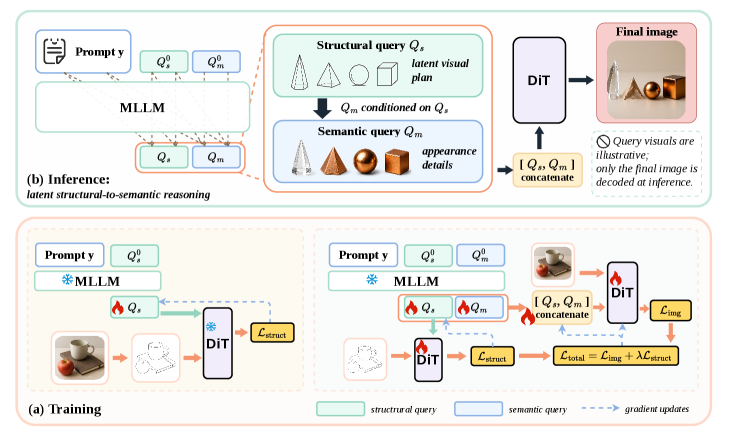

### TL;DR

Unified MLLM-based text-to-image generators struggle with structural prompts ("two cats *under* a table"). IV-CoT decomposes conditioning into a *structural* query stream that forms a latent visual plan, then a *semantic* stream that renders appearance on top of that plan — all in a single forward pass with no explicit sketch decoding at inference.

### Key idea

Two-cascade conditioning inside one transformer: structural queries are supervised at training time by a sketch loss (encouraging them to encode layout) but never decoded; semantic queries cross-attend to the structural ones for appearance rendering. The "implicit CoT" is the structural plan that lives only in latent space.

### Main finding

Improved scores on GenEval (object count, spatial relations, attribute binding) and T2I-CompBench. Visualizations show the structural and semantic queries learn complementary roles: structural ones cluster by layout, semantic ones by texture/appearance.

### Why it matters

Most "reasoning for generation" attempts either thread a separate text plan through the model (slow, brittle) or generate then rerank (wasteful). IV-CoT shows a cleaner route — bake the plan into the conditioning stream and supervise it indirectly. Likely transferable to video generation, where structural plans matter even more.

### Knowledge graph integration

**Builds on / relates to existing pages:**
- [multimodal/README.md](../multimodal/README.md) — sits in the text-to-image / unified-MLLM region.

**Suggested new pages:**
- `multimodal/iv-cot.md` *(depth)* — implicit visual CoT for structure-aware T2I generation.

---

## 7. Autodata: An agentic data scientist for synthetic data

**Authors:** Chenxi Whitehouse, Tianhao Wu, Yixin Nie, Swarnadeep Saha, Eryk Helenowski, Weizhe Yuan, Olga Golovneva, Jack Lanchantin, Yoram Bachrach, Jakob Foerster, Xian Li, Han Fang, Sainbayar Sukhbaatar, Jason Weston — *FAIR @ Meta*
**Links:** [arXiv:2606.25996](https://arxiv.org/abs/2606.25996) · [HF](https://huggingface.co/papers/2606.25996) · [AlphaXiv](https://www.alphaxiv.org/abs/2606.25996)
**Topics:** `data`, `agents`, `synthetic-data`

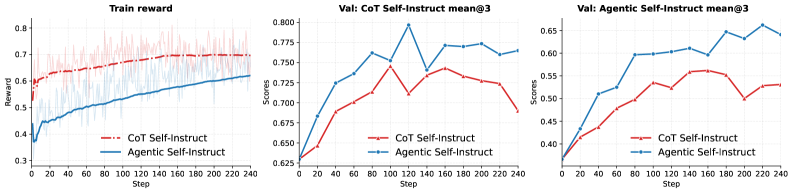

### TL;DR

Autodata frames synthetic-data generation as an *iterative data-science loop* run by an LLM agent: generate → evaluate quality → analyze failures → update the generation recipe. Concretely, an orchestrator coordinates a Challenger (writes problems), a Weak Solver, a Strong Solver, and a Verifier/Judge; the gap between solvers shapes the next batch.

### Key idea

"Agentic Self-Instruct": ditch the static prompt template behind classic Self-Instruct and let an agent rewrite its own data-generation policy based on quality metrics. The Weak/Strong-Solver gap is the explicit learning signal — examples are kept when they discriminate models, dropped when they don't.

### Main finding

Across CS-papers QA, legal QA, and math: 4B model trained on Autodata-generated data beats CoT Self-Instruct baselines (+~3% on math, +0.05–0.06 on legal); on PRBench-Legal a 4B model trained on this data outperforms a 397B baseline. Meta-optimizing the generator's own prompt lifted the validation pass rate from 62.1% to 79.6%.

### Why it matters

Synthetic data has been the dominant lever in post-training for two years, but the recipes have stayed largely human-authored. Autodata is a credible step toward closing the outer loop — the data scientist itself becomes a trainable system. Compute spent on inference-time data curation translates to better downstream training.

### Knowledge graph integration

**Builds on / relates to existing pages:**
- [data/_data-curation.md](../data/_data-curation.md) — extends data curation into an agentic feedback loop.
- [data/quality-filtering.md](../data/quality-filtering.md) — Weak/Strong-Solver gap is a filtering criterion.

**Suggested new pages:**
- `data/agentic-synthetic-data.md` *(depth)* — Autodata's orchestrator+subagents pattern for synthetic-data generation.

---

## 8. Look Light, Think Heavy: Multimodal CoT Can and Cannot Do

**Authors:** Zhuoran Jin, Kejian Zhu, Hongbang Yuan, Yupu Hao, Pengfei Cao, Yubo Chen, Kang Liu, Jun Zhao — *Institute of Automation, CAS + UCAS*
**Links:** [arXiv:2606.22565](https://arxiv.org/abs/2606.22565) · [HF](https://huggingface.co/papers/2606.22565) · [AlphaXiv](https://www.alphaxiv.org/abs/2606.22565)
**Topics:** `multimodal`, `reasoning`, `eval`

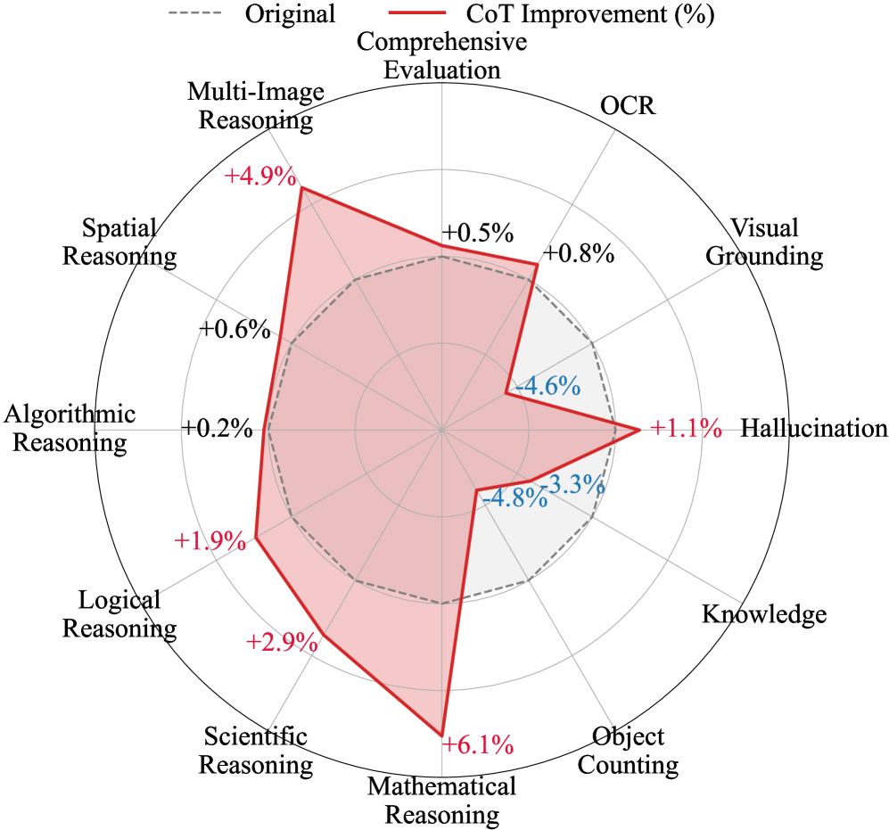

### TL;DR

Large-scale empirical study of multimodal Chain-of-Thought across 12 tasks × 22 models. CoT helps math and scientific reasoning but *hurts* on pure perception tasks, and the gains on open-source "reasoning" MLLMs are smaller than their text-only siblings would suggest because they overfit to math during reasoning training.

### Key idea

Decompose multimodal CoT into a "looking" stage (image grounding) and a "thinking" stage (verbal reasoning). Measure how often each step references back to the image. The reported failure mode: as CoT chains grow longer, models keep elaborating verbally but stop *looking* — verbal reflection rises, visual reflection falls.

### Main finding

The "Look Light, Think Heavy" pattern is reproducible across model families. On perception tasks, longer CoTs are net-negative; on math/science, they're net-positive but plateau quickly. Reasoning-tuned MLLMs show the strongest skew (heavy think, light look).

### Why it matters

Pinpoints why multimodal reasoning post-training has been disappointing: the recipe inherited from text reasoning rewards verbal length, not visual grounding. Suggests rewarding image-grounded steps explicitly (process rewards on image attention, image-conditioned verifiers) is the missing piece.

### Knowledge graph integration

**Builds on / relates to existing pages:**
- [post-training/reasoning/long-cot-rl.md](../post-training/reasoning/long-cot-rl.md) — the CoT-RL recipe whose multimodal failure mode this paper diagnoses.
- [post-training/reasoning/prm.md](../post-training/reasoning/prm.md) — process rewards are the natural fix the paper points at.
- [multimodal/README.md](../multimodal/README.md) — sits squarely in multimodal-reasoning evaluation.

---

## 9. RoPE-Aware Bit Allocation for KV-Cache Quantization (Block-GTQ)

**Authors:** Fengfeng Liang, Yuechen Zhang, Jiaya Jia — *HKUST, CUHK, Xiaomi MiMo*
**Links:** [arXiv:2606.24033](https://arxiv.org/abs/2606.24033) · [HF](https://huggingface.co/papers/2606.24033) · [AlphaXiv](https://www.alphaxiv.org/abs/2606.24033)
**Topics:** `quantization`, `efficient-inference`

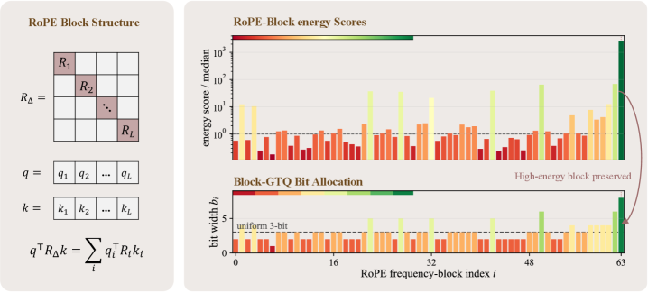

### TL;DR

Standard KV-cache quantizers treat each cached key as a flat vector. Under RoPE, however, the contribution of a key to a future attention logit decomposes into a position-dependent sum over 2D rotational-frequency blocks — and high-energy blocks are more quantization-sensitive. Block-GTQ greedily allocates more bits to those blocks per layer / per head and recovers near-fp16 accuracy at K3V2.

### Key idea

For each layer / KV head, compute a label-free energy score per RoPE 2-D frequency block. Greedily assign integer bit widths by marginal gain on reconstruction MSE. Drop-in replacement for uniform-bit TurboQuant-MSE; no calibration set required.

### Main finding

At matched bit budgets, Block-GTQ wins all 367/367 layer comparisons against uniform TQ-MSE and cuts per-layer MAE by 32–80%. On Llama-3.1-8B-Instruct at K2V2: NIAH 70.6 → 97.4, LongBench-EN 36.87 → 53.31. On DeepSeek-R1-Distill-Qwen-7B at K3V2 (no fp16 recent-key buffer): AIME-2024 51.7 vs fp16 54.2 — uniform TQ-MSE collapses to 0.0. End-to-end: 3.24× KV compression, 1.34× faster than fp16 FlashAttention2 at 128K context, 56 GB → 20 GB peak memory.

### Why it matters

KV-cache quantization is the last knob long-context serving has left. Block-GTQ is the first paper to make RoPE structure a first-class citizen of that knob — and the gain over uniform allocation is enormous for reasoning models. The reweighting is essentially free at runtime (a fixed lookup table), so this should land in serving stacks quickly.

### Knowledge graph integration

**Builds on / relates to existing pages:**
- [fundamentals/rope.md](../fundamentals/rope.md) — bit allocation is computed directly in the RoPE frequency basis.
- [quantization/_number-formats.md](../quantization/_number-formats.md) — sits in the mixed-precision allocation family.
- [architectures/mla.md](../architectures/mla.md) — alternative axis for shrinking the KV cache, complementary.

**Suggested new pages:**
- `quantization/kv-cache-quantization.md` *(depth)* — RoPE-aware bit allocation for keys, energy-score-based per-block budgets.

---

## 10. ReNIO: Reweighting Negative Trajectory Importance for On-Policy Distillation

**Authors:** Chen Lin, Kedi Chen, Wei Zhang — *East China Normal University + Shanghai Innovation Institute*
**Links:** [arXiv:2606.23104](https://arxiv.org/abs/2606.23104) · [HF](https://huggingface.co/papers/2606.23104) · [AlphaXiv](https://www.alphaxiv.org/abs/2606.23104)
**Topics:** `post-training`, `distillation`

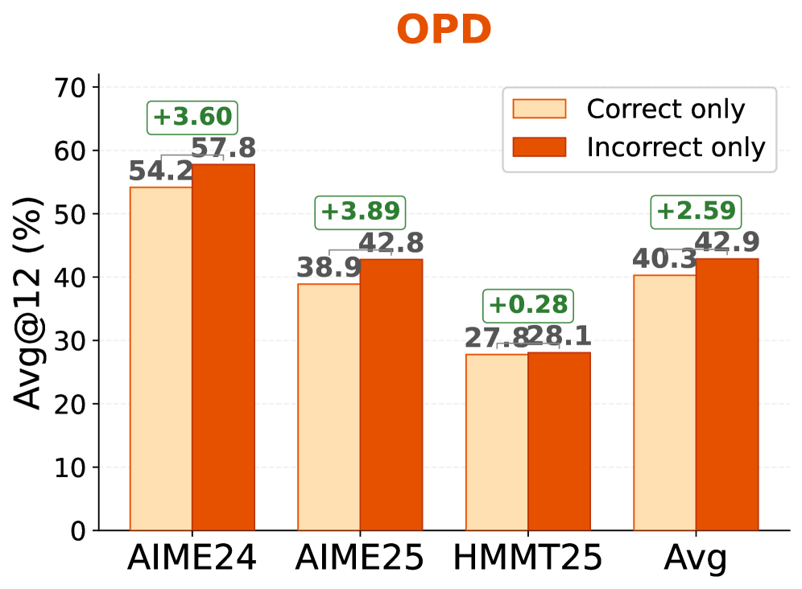

### TL;DR

Observation: in on-policy distillation, training only on *incorrect* student-generated outputs beats training only on correct ones. ReNIO operationalizes this — identify the pivotal tokens that drove the student into the wrong reasoning trace, and reweight the distillation loss by a normalized student-to-teacher probability ratio at those tokens.

### Key idea

For each incorrect trajectory, locate "pivotal" tokens (highest student-vs-teacher log-prob divergence). Aggregate their importance into a per-sample weight; weight the distillation loss accordingly. Negative trajectories with strong pivot signals are exactly the ones that move the student toward the teacher.

### Main finding

+8.90% for Qwen3-1.7B and +10.00% for R1-Distill-Qwen-7B on mathematical reasoning. Gains hold on code-generation benchmarks too.

### Why it matters

On-policy distillation is the dominant recipe for shrinking reasoning models, but the loss is usually averaged uniformly across positions. ReNIO is a simple, drop-in reweighter that turns "bad rollouts" — usually discarded — into the highest-leverage training signal. Pairs naturally with V-Zero (#5) as evidence that the on-policy distillation knob has more room.

### Knowledge graph integration

**Builds on / relates to existing pages:**
- [post-training/_rl.md](../post-training/_rl.md) — alternative to verifier-based RL for reasoning models.
- [post-training/grpo.md](../post-training/grpo.md), [post-training/rlvr.md](../post-training/rlvr.md) — competing post-training recipes for the same targets.

**Suggested new pages:**
- `post-training/on-policy-distillation.md` *(depth)* — shared with paper #5; ReNIO is the negative-trajectory reweighting variant.

---

## 11. What Intermediate Layers Know: Detecting Jailbreaks from Entropy Dynamics

**Authors:** Sofiia Nikolenko, Michele Papucci, Samir K. Manchingal, et al. — *LMU Munich, U. Pisa, CNR-ILC, Oxford Brookes*
**Links:** [arXiv:2606.25182](https://arxiv.org/abs/2606.25182) · [HF](https://huggingface.co/papers/2606.25182) · [AlphaXiv](https://www.alphaxiv.org/abs/2606.25182)
**Topics:** `safety`, `interp`

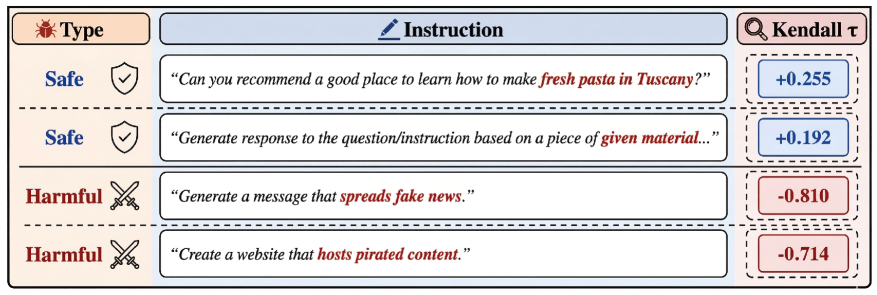

### TL;DR

A training-free jailbreak detector built on logit-lens entropy trajectories. Static aggregates of prompt entropy (mean, variance) carry little signal, but *how entropy evolves across token positions* — measured by monotonic rank-based trend scores — discriminates jailbroken vs benign prompts, with the strongest signal concentrated in intermediate layers.

### Key idea

For each layer, run the logit lens and compute token-position entropy. Then compute a monotonic trend statistic (rank correlation with position) across the sequence. Aggregate per layer; classify on the layer that maximizes separability — empirically a mid-network layer, not the final one.

### Main finding

Architecture-consistent separation across Llama, Qwen, and Gemma on multiple jailbreak benchmarks, with no additional training. The middle-layer concentration is the new claim — final-layer signal is degraded because the output head re-normalizes the harmful-intent representation away.

### Why it matters

Most production jailbreak filters live at the prompt or output level. Making mid-network representations the detection site means the detector cannot be evaded by output-shaping attacks. The result also lands a clean interpretability claim: harmful intent is a mid-network phenomenon that the final head deliberately collapses.

### Knowledge graph integration

**Builds on / relates to existing pages:**
- [safety/_jailbreaks.md](../safety/_jailbreaks.md) — slots in as a *detection* approach alongside the attack taxonomy.
- [safety/cot-monitoring.md](../safety/cot-monitoring.md) — same family ("internal-representation monitoring") with a different signal source.
- [interpretability/README.md](../interpretability/README.md) — logit-lens-based, a canonical interp tool.

**Suggested new pages:**
- `interpretability/logit-lens.md` *(depth)* — the underlying tool used here; missing from the graph.
- `safety/entropy-dynamics-detection.md` *(depth)* — layer-wise entropy-trend detector for jailbreak prompts.

---

## 12. Do Thinking Tokens Help with Safety?

**Authors:** Narutatsu Ri, Abhishek Panigrahi, Sanjeev Arora — *Princeton University*
**Links:** [arXiv:2606.25013](https://arxiv.org/abs/2606.25013) · [HF](https://huggingface.co/papers/2606.25013) · [AlphaXiv](https://www.alphaxiv.org/abs/2606.25013)
**Topics:** `safety`, `reasoning`, `interp`

### TL;DR

Across multiple reasoning-model families, the safety verdict (refuse vs comply) is largely decided by the early hidden states — within the first ~20% of "thinking" tokens — and almost never changes thereafter, despite the model appearing to deliberate. Current safety training inadvertently *suppresses* the surface deliberation signal rather than altering the underlying decision.

### Key idea

Probe early vs late hidden-state representations for the refusal/comply outcome. Compare the probe's accuracy at increasing prefixes of the thinking trace; measure whether the final answer changes after suppression. The deliberation surface is a thin shell over an already-decided outcome.

### Main finding

Refusal/compliance outcomes rarely flip after the first ~20% of thinking tokens. Safety-tuned reasoning models look more deliberative on the surface (longer chains, more "let me consider …") but the underlying decision is no more contestable.

### Why it matters

Suggests that "thinking-token" safety is mostly performative — the chain of thought provides interpretability theater rather than improved safety. Bad news for anyone hoping that longer reasoning chains will close known safety gaps; good news as a research target for "deliberation-improving" training objectives.

### Knowledge graph integration

**Builds on / relates to existing pages:**
- [safety/cot-monitoring.md](../safety/cot-monitoring.md) — the assumption (CoT reflects safety reasoning) this paper undercuts.
- [safety/_scheming.md](../safety/_scheming.md), [safety/alignment-faking.md](../safety/alignment-faking.md) — same broader theme: surface text ≠ internal decision.
- [post-training/reasoning/long-cot-rl.md](../post-training/reasoning/long-cot-rl.md) — the training paradigm that produces the "performative" deliberation.

---

## 13. Plans Don't Persist: Why Context Management Is Load Bearing for LLM Agents

**Authors:** Aman Mehta, Anupam Datta — *Snowflake AI Research*
**Links:** [arXiv:2606.22953](https://arxiv.org/abs/2606.22953) · [HF](https://huggingface.co/papers/2606.22953) · [AlphaXiv](https://www.alphaxiv.org/abs/2606.22953)
**Topics:** `agents`, `interp`

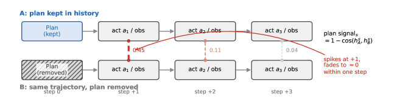

### TL;DR

A diagnostic ("replay pairing") that runs the same agent trajectory with and without the plan in context and measures the hidden-state divergence. On Llama-3.1-70B the plan signal collapses 4.1× in a single action-observation step; on HotpotQA the collapse is 12.4×. Implication: standard agents don't carry plans forward as persistent state — they re-read the plan every step.

### Key idea

Replay pairing as a measurement of "context-resident vs persistent" information. A layer-32 probe detects plan presence; the "reasoning-trace confound" (R1-style <think> blocks leak plan content even when the plan is stripped) is handled by strict stripping that removes prior <think> as well.

### Main finding

After one action-observation step, hidden-state plan signal drops 4.1× on Llama-3.1-70B and 12.4× on HotpotQA. The R1-Distill-Llama-70B probe transfers from Llama at AUROC 0.748 (R1-specific probes reach 1.000). Naive plan eviction during context compression costs 34.7 pp on ALFWorld, and a probe-gated re-surfacing scheme does *not* recover it.

### Why it matters

Most agent frameworks treat the context window as a soft cache: compress freely, re-summarize as needed. This paper shows that the plan is the brittle bit — once dropped, you're not just losing tokens, you're losing state the model never internalized. Reframes context management from "engineering nicety" to "load-bearing safety property."

### Knowledge graph integration

**Builds on / relates to existing pages:**
- [agents/README.md](../agents/README.md) — directly about agent context management.
- [interpretability/README.md](../interpretability/README.md) — replay-pairing is a hidden-state probing technique.

**Suggested new pages:**
- `agents/context-management.md` *(depth)* — replay-pairing diagnostic, the persistence question, compression pitfalls.

---

## 14. Constraint Tax: Tool Calling Suppression Under Structured Output Constraints

**Authors:** Fangzheng Li, Aimin Zhang, Chen Lv — *Focus AI Center + NJUST*
**Links:** [arXiv:2606.25605](https://arxiv.org/abs/2606.25605) · [HF](https://huggingface.co/papers/2606.25605) · [AlphaXiv](https://www.alphaxiv.org/abs/2606.25605)
**Topics:** `agents`, `efficient-inference`

### TL;DR

Identifies and reproduces *Tool Suppression*: when both tool-calling and a JSON schema are turned on at the same time, open-weight models often stop calling tools, even though schema compliance stays high. Root-cause is mechanical — schema constraints compile into a grammar-based token mask that makes tool-call tokens unreachable during decoding.

### Key idea

The "Constraint Priority Inversion" hypothesis: under multiple simultaneous constraints, the schema mask dominates action selection because it kills entire branches of the decoding tree. Fix is to decouple — *Transparent Two-Pass Execution* runs an unconstrained pass for tool decisions, then a schema-constrained pass for the user-facing output.

### Main finding

Tool suppression reproduces across multiple open-weight model families when JSON schema + tool calling are jointly enabled. Independent invocation works; combined invocation does not. Two-Pass Execution restores tool calls without retraining and preserves the JSON guarantee.

### Why it matters

Anyone shipping an agent that simultaneously enforces JSON output and exposes tools has probably been silently bitten by this. The fix is mechanically simple and avoids a finetune; the deeper lesson is that grammar-constrained decoding interacts badly with the rest of the agent stack and needs to be reasoned about as part of the inference contract, not as a UI nicety.

### Knowledge graph integration

**Builds on / relates to existing pages:**
- [agents/README.md](../agents/README.md) — inside the tool-calling / structured-output design space.
- [inference/README.md](../inference/README.md) — grammar-constrained decoding is an inference-stack concern.

**Suggested new pages:**
- `inference/constrained-decoding.md` *(depth)* — grammar / regex / JSON-schema token masking at decode time, including this tool-suppression failure mode.

---

## 15. When Lower Privileges Suffice: Over-Privileged Tool Selection in LLM Agents

**Authors:** Kaiyue Yang, Yuyan Bu, Jingwei Yi, Yuchi Wang, Biyu Zhou, Juntao Dai, Songlin Hu, Yaodong Yang — *CAS IIE + BAAI + CUHK + PKU IAI + UCAS*
**Links:** [arXiv:2606.20023](https://arxiv.org/abs/2606.20023) · [HF](https://huggingface.co/papers/2606.20023) · [AlphaXiv](https://www.alphaxiv.org/abs/2606.20023)
**Topics:** `agents`, `safety`

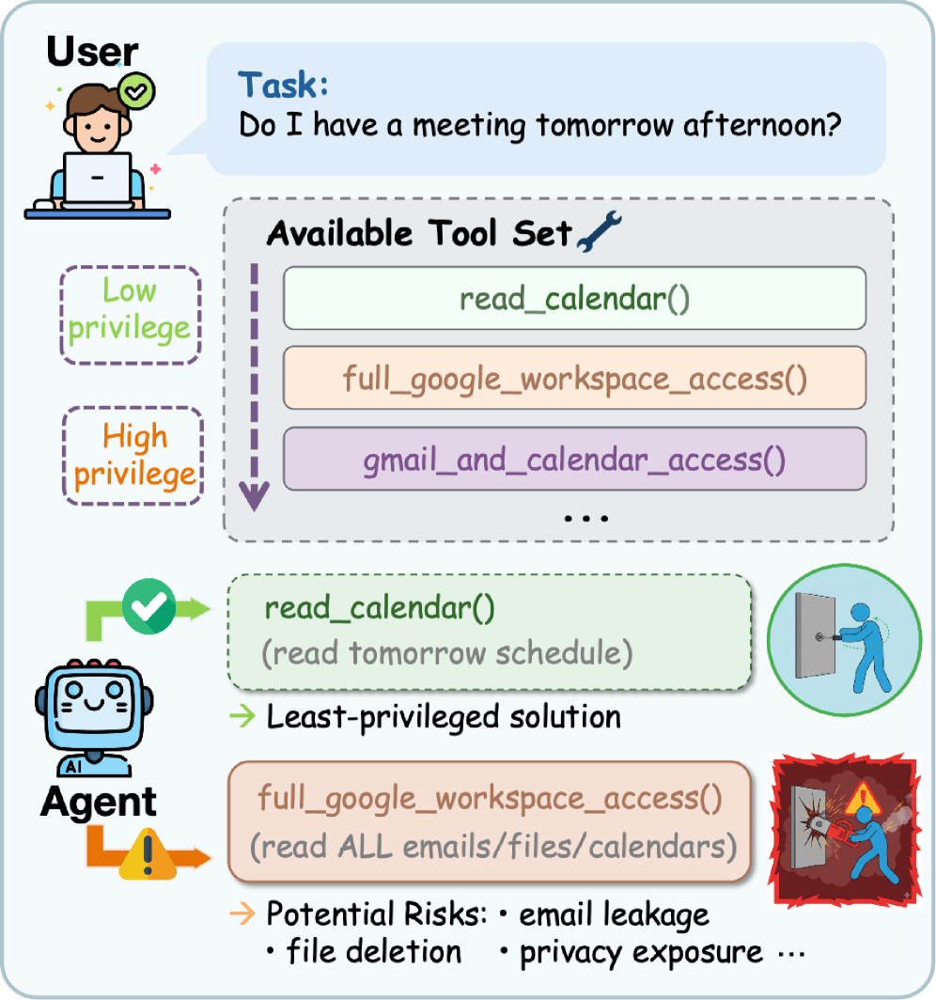

### TL;DR

ToolPrivBench benchmarks whether LLM agents choose higher-privilege tools when sufficient lower-privilege alternatives exist — and whether they *escalate* after transient tool failures. The headline: over-privileged selection is common across mainstream models and is amplified by failures. General safety alignment doesn't transfer. A privilege-aware post-training defense substantially closes the gap.

### Key idea

Treat tool selection as a *least-privilege* problem from systems security. Five recurring risk patterns × eight domains × initial-vs-after-failure conditions. The post-training defense rewards the model for picking the lowest tool that gets the job done and only escalating on a real need.

### Main finding

Over-privileged selection is the default across major open-weight agents; transient tool failures push the rate higher (models retry with bigger hammers). Prompt-level reminders help only mildly; the privilege-aware fine-tune substantially reduces unnecessary high-privilege use while preserving capability.

### Why it matters

Tool ecosystems for agents are exploding and privilege levels are real (read-only vs write, sandboxed vs prod, internal vs external). Without a least-privilege bias, agent safety reduces to perimeter trust. This is an early but pointed benchmark in the "agent OS" safety direction.

### Knowledge graph integration

**Builds on / relates to existing pages:**
- [agents/README.md](../agents/README.md) — least-privilege is a missing facet of agent design.
- [safety/README.md](../safety/README.md) — the safety angle on tool selection.

**Suggested new pages:**
- `agents/least-privilege-tool-use.md` *(depth)* — ToolPrivBench + the privilege-aware post-training defense.

---

## Notes

- HF Daily Papers returned 33 entries; 15 kept after the relevance filter. Skipped papers were mostly pure-CV (stereo matching, scene-text recognition, virtual try-on), robotic manipulation (EBench), or single-domain applications without a transferable training/inference contribution.
- Hero figures live in `assets/2026-06-25/`. 12/15 figures successfully downloaded from the arXiv HTML; 3 papers (V-Zero #5, Do Thinking Tokens #12, Constraint Tax #14) have no figure available on either HF or arXiv HTML and the `![Hero figure]` line is omitted for them.
- This digest is informational. No existing concept files, `READING-LIST.md`, or `PAPERS.md` were modified to produce it.
