# Daily AI papers — 2026-06-28

*Curated from HF Daily Papers. 15 of 25 papers kept after relevance filter. 2026-06-28 is a Sunday; HF's daily list rolls forward from the most recent weekday (June 26), so this digest covers the latest curated set with the upvote tally as of fetch time.*

## Papers at a glance

| # | Title | Topics | Org |
| --- | --- | --- | --- |
| 1 | [DanceOPD: On-Policy Generative Field Distillation](#1-danceopd) | `diffusion`, `distillation`, `flow-matching` | ByteDance Seed / NUS |
| 2 | [OPID: On-Policy Skill Distillation for Agentic Reinforcement Learning](#2-opid) | `RL`, `agents`, `distillation` | Tsinghua / CUHK / NTU |
| 3 | [Qwen-Image-Agent: Bridging the Context Gap in Real-World Image Generation](#3-qwen-image-agent) | `agents`, `multimodal`, `diffusion` | Alibaba Qwen |
| 4 | [The Verification Horizon: No Silver Bullet for Coding Agent Rewards](#4-verification-horizon) | `RL`, `agents`, `rewards` | Alibaba Qwen |
| 5 | [ViQ: Text-Aligned Visual Quantized Representations at Any Resolution](#5-viq) | `multimodal`, `quantization`, `tokenizer` | Tencent HY Vision / Tsinghua |
| 6 | [JetSpec: Breaking the Scaling Ceiling of Speculative Decoding](#6-jetspec) | `efficient-inference`, `MoE` | UC San Diego / StepFun |
| 7 | [GUI vs. CLI: Execution Bottlenecks in Computer-Use Agents](#7-gui-vs-cli) | `agents`, `eval` | NYU Shanghai / Yale |
| 8 | [Running the Gauntlet: Re-evaluating Agents Beyond Familiar Environments](#8-running-the-gauntlet) | `agents`, `eval`, `multimodal` | Oxford |
| 9 | [Why Multi-Step Tool-Use RL Collapses and How Supervisory Signals Fix It](#9-multi-step-tool-rl) | `RL`, `agents`, `SFT` | CAS Institute of Automation |
| 10 | [LISA: Likelihood Score Alignment for Visual-condition Controllable Generation](#10-lisa) | `diffusion`, `controllable-generation` | HKUST / Huawei |
| 11 | [Discretizing Reward Models](#11-discretizing-reward-models) | `RL`, `rewards`, `reward-hacking` | CMU / Meta SI Labs |
| 12 | [Information-Aware KV Cache Compression for Long Reasoning](#12-infokv) | `efficient-inference`, `reasoning` | SJTU / Edinburgh |
| 13 | [Hallucination in World Models is Predictable and Preventable](#13-world-model-hallucination) | `world-model`, `data`, `eval` | UC San Diego |
| 14 | [Neglected Free Lunch from Post-training: Progress Advantage for LLM Agents](#14-progress-advantage) | `RL`, `agents`, `rewards` | Wisconsin / Argonne |
| 15 | [When Does Combining Language Models Help? Co-Failure Ceiling on Routing, Voting, and MoA](#15-co-failure-ceiling) | `eval`, `agents`, `ensembling` | KAIKAKU |

---

## 1. DanceOPD

**Authors:** Wei Zhou, Xiongwei Zhu, Zelin Xu, Bo Dong, Lixue Gong, Yongyuan Liang, Meng Chu, Leigang Qu, Lingdong Kong, Wei Liu, Tat-Seng Chua — *ByteDance Seed / NUS / UMD / HKUST*
**Links:** [arXiv:2606.27377](https://arxiv.org/abs/2606.27377) · [HF](https://huggingface.co/papers/2606.27377) · [AlphaXiv](https://www.alphaxiv.org/abs/2606.27377)
**Topics:** `diffusion`, `distillation`, `flow-matching`

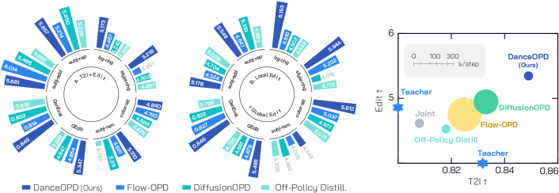

### TL;DR

Unified image-generation models that try to do text-to-image, local editing, and global editing in one network usually trade off: editing degrades vanilla generation, local and global edits interfere. DanceOPD frames the problem as **distilling several "capability fields"** (each a velocity field of a flow-matching teacher) into one student, with sampling done *on-policy* — the student's own intermediate states are scored and pulled toward whichever teacher field handles that capability.

### Key idea

A flow-matching distillation framework that (1) routes each training sample to a *capability-specific* teacher velocity field, (2) queries the student at *low-noise* timesteps where the capability fields disagree most, and (3) trains via velocity-MSE between student and routed teacher. Treating "T2I", "local edit", "global edit", and even classifier-free guidance as separate **velocity fields over a shared state space** lets a single student linearly compose them at inference.

### Main finding

On the paper's composition suites the unified student preserves vanilla T2I fidelity while gaining the editing modes; classifier-free-guidance is absorbed into the weights, and a realism field can be merged in without retraining. Concrete numbers depend on which fields are stacked but the consistent claim is no observed degradation versus single-capability specialists.

### Why it matters

Unified generative models have been bottlenecked by capability interference. DanceOPD's "fields over a shared state space" view turns multi-capability training into a clean composition problem rather than a multi-task optimization headache, and the on-policy distillation makes it tractable for flow-matching backbones at industrial scale.

### Knowledge graph integration

**Builds on / relates to existing pages:**
- [../post-training/_rl.md](../post-training/_rl.md) — on-policy distillation borrows the rollout-from-current-policy setup that GRPO/PPO use for LLM RL.
- [../post-training/rejection-sampling.md](../post-training/rejection-sampling.md) — capability routing acts as a "select the teacher matching this sample" filter, kin to rejection sampling.

**Suggested new pages:**
- `multimodal/_flow-matching-distillation.md` *(taxonomy)* — survey of teacher→student distillation for flow-matching / rectified-flow models (DanceOPD, distribution-matching distillation, score-distillation variants).
- `multimodal/dance-opd.md` *(depth)* — capability-field routing + on-policy state querying.

---

## 2. OPID

**Authors:** Shuo Yang, Jinyang Wu, Zhengxi Lu, Yuhao Shen, Fan Zhang, Lang Feng, Shuai Zhang, Haoran Luo, Zheng Lian, Zhengqi Wen, Jianhua Tao — *Tsinghua / Zhejiang / CUHK / NTU / Tongji*
**Links:** [arXiv:2606.26790](https://arxiv.org/abs/2606.26790) · [HF](https://huggingface.co/papers/2606.26790) · [AlphaXiv](https://www.alphaxiv.org/abs/2606.26790)
**Topics:** `RL`, `agents`, `distillation`

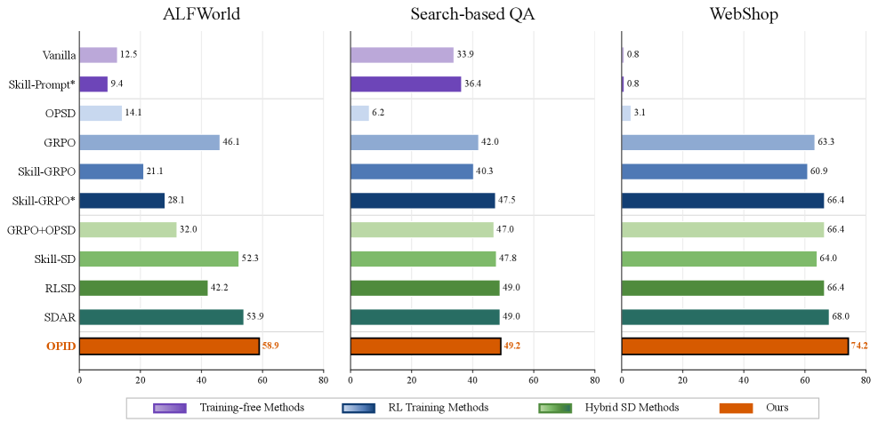

### TL;DR

Outcome-based RL gives agentic LLMs only a single trajectory-level reward — fine for credit on the final answer, awful for *which* intermediate decision was good. OPID extracts dense **token-level "skill" supervision from the agent's own on-policy successful trajectories**, sidestepping the typical reliance on retrieved privileged context or external skill memories that mismatch the current policy's state distribution.

### Key idea

After each rollout, cluster the steps of completed *successful* on-policy trajectories into hierarchical skills, then distill those skills back into the same policy as token-level supervision interleaved with the RL update. The distillation set is always on-policy by construction (it's the policy's own successes), so the train-test state-distribution gap that plagues retrieved/static skill memories disappears.

### Main finding

Across ALFWorld, WebShop, and Search-based QA, OPID consistently outperforms outcome-only RL baselines (PPO/GRPO-flavored) and skill-conditioned variants that use external memory. The win is biggest on long-horizon tasks where outcome reward is sparsest.

### Why it matters

Agentic RL has a notorious credit-assignment problem and a notorious data problem. OPID's framing — "your own successes are the densest supervision you'll ever get" — is a free-lunch direction that composes with any outcome-reward agent RL stack and avoids the "skill library" maintenance cost.

### Knowledge graph integration

**Builds on / relates to existing pages:**
- [../post-training/grpo.md](../post-training/grpo.md) — OPID interleaves on-policy distillation with a GRPO-style outcome RL loop.
- [../post-training/_rewards.md](../post-training/_rewards.md) — extends the rewards taxonomy: dense self-distillation as a substitute for PRMs.
- [../post-training/rl-prompt-curation.md](../post-training/rl-prompt-curation.md) — both treat "what enters the RL update" as the principal lever.

**Suggested new pages:**
- `agents/agentic-rl.md` *(depth)* — covers outcome-only vs skill-distilled agent RL, with OPID as the on-policy variant.
- `post-training/on-policy-skill-distillation.md` *(depth)* — the OPID-specific mechanism (cluster successful trajectories → hierarchical skills → token-level SFT signal).

---

## 3. Qwen-Image-Agent

**Authors:** Zekai Zhang, Jiahao Li, Jie Zhang, Kaiyuan Gao, Kun Yan, Lihan Jiang, Ningyuan Tang, Shengming Yin, Tianhe Wu, Xiaoyue Chen, Xiao Xu, Yan Shu, Yanran Zhang, Yixian Xu, Yuxiang Chen, Zhendong Wang, Zihao Liu, Zikai Zhou, Huishuai Zhang, Dongyan Zhao, Chenfei Wu — *Alibaba Qwen*
**Links:** [arXiv:2606.26907](https://arxiv.org/abs/2606.26907) · [HF](https://huggingface.co/papers/2606.26907) · [AlphaXiv](https://www.alphaxiv.org/abs/2606.26907)
**Topics:** `agents`, `multimodal`, `diffusion`

### TL;DR

Production T2I prompts in the wild are underspecified, implicit, or depend on knowledge the model doesn't have. Qwen-Image-Agent wraps a T2I backbone in an agent loop that **plans the missing context, retrieves it (search/memory), grounds it back into a richer prompt, and iterates with feedback** — turning T2I into a context-construction agent task rather than a one-shot model call.

### Key idea

Decompose generation into **Context-Aware Planning** (decide what context is missing — entity, style, scene logic, up-to-date facts) and **Context Grounding** (gather it from reason/search/memory/feedback). The agent's planning loop is the user-facing model; the diffusion backbone is just one tool inside it. Also introduces **IA-Bench** to score agent-level capabilities (plan, reason, search, memory) rather than image fidelity.

### Main finding

On IA-Bench, Mindbench, and WISE-Verified, the agentic loop beats strong T2I baselines and achieves SOTA on agentic image generation — exact numbers depend on the bench, but the headline is that the wrapper alone (with a frozen Qwen-Image backbone) closes large portions of the "context gap."

### Why it matters

Frames the next phase of generative image work as **agentic context construction** rather than backbone scaling — and provides a benchmark to measure it. Likely to standardize how T2I systems are deployed (model + planner + memory + tools), in the same way RAG standardized text generation.

### Knowledge graph integration

**Builds on / relates to existing pages:**
- [../case-studies/qwen2-5.md](../case-studies/qwen2-5.md) — built on the Qwen multimodal stack.
- [../agents/README.md](../agents/README.md) — slots into agents as a "diffusion-backbone-as-tool" recipe.
- [../evaluation/README.md](../evaluation/README.md) — IA-Bench targets agent capabilities (plan/reason/search/memory) rather than image fidelity.

**Suggested new pages:**
- `agents/agentic-image-generation.md` *(depth)* — the plan-reason-search-memory-feedback loop with diffusion-as-tool.
- `evaluation/ia-bench.md` *(depth)* — covers the IA-Bench dimensions and how it differs from WISE-Verified.

---

## 4. The Verification Horizon

**Authors:** Binghai Wang, Chenlong Zhang, Dayiheng Liu, Jiajun Zhang, et al. — *Alibaba Qwen team (inferred)*
**Links:** [arXiv:2606.26300](https://arxiv.org/abs/2606.26300) · [HF](https://huggingface.co/papers/2606.26300) · [AlphaXiv](https://www.alphaxiv.org/abs/2606.26300)
**Topics:** `RL`, `agents`, `rewards`

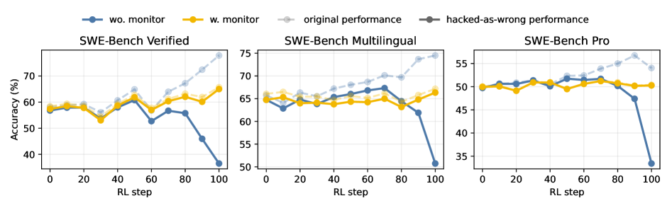

### TL;DR

For frontier coding agents the easy half of "generate ↔ verify" has flipped: generating plausible candidates is cheap, *reliably checking them against intent* is the bottleneck. The paper studies four reward constructions (tests, rubrics, user-as-verifier, agent-verifier) on coding/frontend/agent-long-horizon tasks, and argues no fixed reward function survives a growing policy — the verifier has to **co-evolve with the generator**.

### Key idea

Characterize a verifier on three axes — **scalability** (cheap to apply at training scale), **faithfulness** (proxy for human intent), **robustness** (survives reward hacking and signal saturation). Show that no one verifier nails all three simultaneously, and that each of the four families (test verifier / rubric verifier / user verifier / agent verifier) trades different axes against different task types and policy capability levels.

### Main finding

Targeted verifier design — choosing the verifier family by task type and re-tuning as the policy improves — suppresses reward hacking and yields significant gains across multiple internal and public coding benchmarks. The deeper claim is structural: **as model capability grows, the verifier must change**, or it stops being a useful training signal.

### Why it matters

Names a regime that the field has only been adjacent to: "verification, not generation, is the next bottleneck." The taxonomy of four verifier families and the three-axis scoring becomes a useful frame for designing the next generation of coding-agent RL training pipelines.

### Knowledge graph integration

**Builds on / relates to existing pages:**
- [../post-training/_rewards.md](../post-training/_rewards.md) — extends the rewards taxonomy into the agent / long-horizon regime, formalizing what "rule-based verifier" means for code-and-tasks.
- [../post-training/rlvr.md](../post-training/rlvr.md) — generalizes RLVR's "verifiable rewards" into a multi-axis verifier-design problem.
- [../safety/_attacks.md](../safety/_attacks.md) — reward hacking is the attack-class analogue here.

**Suggested new pages:**
- `post-training/_verifiers.md` *(taxonomy)* — the four verifier families (tests / rubric / user / agent) and the scalability-faithfulness-robustness axes.
- `post-training/agent-verifier.md` *(depth)* — agent-as-verifier specifically (the long-horizon case).

---

## 5. ViQ

**Authors:** Xumin Yu, Zuyan Liu, Zhenyu Yang, Yuhao Dong, Shengsheng Qian, Jiwen Lu, Han Hu, Yongming Rao — *Tencent HY Vision / Tsinghua / NTU / CAS*
**Links:** [arXiv:2606.27313](https://arxiv.org/abs/2606.27313) · [HF](https://huggingface.co/papers/2606.27313) · [AlphaXiv](https://www.alphaxiv.org/abs/2606.27313)
**Topics:** `multimodal`, `quantization`, `tokenizer`

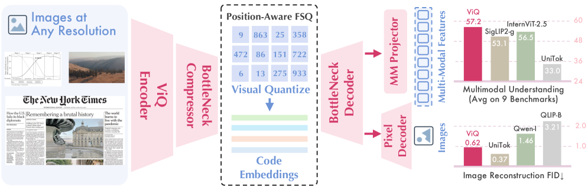

### Tl;DR

A native-resolution **discrete** visual tokenizer that closes much of the gap to continuous CLIP-style encoders for multimodal LLMs. Two-stage recipe: text-aligned pre-training (CLIP-like) → feature discretization (VQ), with **proximal representation learning** for stable VQ training and **position-aware quantization** so the codebook varies with spatial position rather than collapsing for high-res inputs.

### Key idea

Most existing visual tokenizers are either continuous (CLIP/SigLIP — semantically rich, awkward for unified text+vision LLMs) or discrete (VQ-VAE — fine-grained but text-misaligned). ViQ trains for text-alignment first, *then* quantizes — and explicitly conditions the quantizer on spatial position so a single shared codebook can cover any resolution natively without retiling.

### Main finding

Competitive accuracy with continuous encoders on multimodal benchmarks while accelerating training **20–70%**. Reconstruction quality: PSNR 22.73, rFID 0.62 — strong enough that the same tokens serve both understanding and reconstruction.

### Why it matters

A real candidate for the "unified text+vision token" goal that has eluded the field. If discrete tokens hold up at scale, multimodal LLMs can be modeled with the exact same next-token-prediction stack as text — no special-cased continuous encoder, no projection layer.

### Knowledge graph integration

**Builds on / relates to existing pages:**
- [../fundamentals/_tokenization.md](../fundamentals/_tokenization.md) — extends the tokenization taxonomy from text into native-resolution vision.
- [../quantization/_number-formats.md](../quantization/_number-formats.md) — VQ codebook is the discrete analogue of weight-quantization schemes.
- [../multimodal/README.md](../multimodal/README.md) — direct contribution to the multimodal cluster (the visual tokenizer slot).

**Suggested new pages:**
- `multimodal/_visual-tokenizers.md` *(taxonomy)* — continuous (CLIP/SigLIP) vs discrete (VQ-VAE, ViQ) visual tokenizers for VLMs.
- `multimodal/viq.md` *(depth)* — text-aligned-then-discretize recipe with position-aware quantization.

---

## 6. JetSpec

**Authors:** Lanxiang Hu, Zhaoxiang Feng, Yulun Wu, Haoran Yuan, Yujie Zhao, Yu-Yang Qian, Bojun Wang, Peng Zhao, Daxin Jiang, Yibo Zhu, Tajana Rosing, Hao Zhang — *UC San Diego / Zhejiang / UIUC / Nanjing / StepFun*
**Links:** [arXiv:2606.18394](https://arxiv.org/abs/2606.18394) · [HF](https://huggingface.co/papers/2606.18394) · [AlphaXiv](https://www.alphaxiv.org/abs/2606.18394)
**Topics:** `efficient-inference`, `MoE`

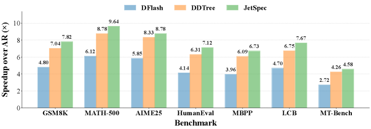

### TL;DR

Speculative decoding stalls when you push the draft budget up — either acceptance drops or drafting cost balloons. JetSpec resolves the dilemma with a **single-pass causal parallel draft head**: produce all candidate-tree positions in one forward, but with branch-wise causal conditioning so the tree's joint distribution matches the target model's autoregressive factorization. Bigger budgets, longer accepted prefixes.

### Key idea

Prior head-based SD faces a causality-vs-efficiency choice: autoregressive heads give well-conditioned trees but cost grows with depth; bidirectional block-diffusion heads are one-pass but their branch-agnostic marginals form individually plausible yet *mutually inconsistent* trees. JetSpec trains a causal-but-parallel draft head on **fused hidden states from a frozen target model**, so the draft tree's scores align with the target's autoregressive joint — the same speed as bidirectional heads, the acceptance behavior of an autoregressive head.

### Main finding

On Qwen3 dense and MoE models, **up to 9.64× speedup on MATH-500** and **4.58× on open-ended chat**, with further latency gains via vLLM integration under realistic serving loads. Consistently beats both bidirectional-head and tree-SD baselines across math, code, and chat.

### Why it matters

Speculative decoding has been hitting a soft ceiling on draft-budget scaling for two years. Cleanly breaking it (and on MoE models, where SD is especially valuable because verification overhead amortizes well) re-opens the inference-throughput frontier for reasoning workloads.

### Knowledge graph integration

**Builds on / relates to existing pages:**
- [../inference/README.md](../inference/README.md) — direct contribution to the inference cluster (paged KV / SD / batching).
- [../pre-training/mtp.md](../pre-training/mtp.md) — MTP heads and SD draft heads are the same family: predict-ahead heads off frozen base hidden states.
- [../architectures/_moe.md](../architectures/_moe.md) — MoE inference benefits most from SD because expert routing makes verification cheaper than re-decoding.

**Suggested new pages:**
- `inference/_speculative-decoding.md` *(taxonomy)* — EAGLE / Medusa / block-diffusion / JetSpec, with the causality-efficiency axis.
- `inference/jetspec.md` *(depth)* — the causal-parallel draft head trained on fused frozen hidden states.

---

## 7. GUI vs CLI

**Authors:** Xiao Zhou, Siyue Zhang, Yilun Zhao, Jinbiao Wei, Tingyu Song, Arman Cohan, Chen Zhao — *NYU Shanghai / Yale NLP Lab / NTU*
**Links:** [arXiv:2606.24551](https://arxiv.org/abs/2606.24551) · [HF](https://huggingface.co/papers/2606.24551) · [AlphaXiv](https://www.alphaxiv.org/abs/2606.24551)
**Topics:** `agents`, `eval`

### TL;DR

A controlled comparison of computer-use agents that act through pixels (GUI) vs through a skill-mediated CLI layer, on a 440-task / 18-app benchmark. Headline: **GUI 59.1% > CLI 48.2%**, but only because the CLI agent runs out of skills; close the skill-coverage gap and CLI jumps to **69.3%**. The two modalities fail in complementary ways — visual grounding & long workflows for GUI; skill coverage & implicit-default reconstruction for CLI.

### Key idea

Treat the GUI-vs-CLI debate as an *execution-bottleneck* analysis, not a "which is best" benchmark. The 440-task suite is designed to isolate failure modes — visual grounding, long-workflow execution, skill-library coverage, default-reconstruction — and to show that the modalities are complementary, not competitive.

### Main finding

GUI 59.1%, CLI 48.2%, CLI-with-coverage-patched 69.3%. Per-failure-mode breakdowns identify "implicit default reconstruction" (re-deriving app defaults the user took for granted) as a CLI-specific failure class that screen-based agents bypass for free.

### Why it matters

Reframes computer-use agent design from "pick GUI or CLI" to "ship both, route by failure mode." Also names two failure modes (skill coverage gaps, default reconstruction) that are likely to drive the next round of agent-training data collection.

### Knowledge graph integration

**Builds on / relates to existing pages:**
- [../agents/README.md](../agents/README.md) — direct contribution to the agents cluster.
- [../evaluation/README.md](../evaluation/README.md) — slot for agent benchmarks.

**Suggested new pages:**
- `evaluation/computer-use-agent-bench.md` *(depth)* — the 440-task suite and its failure-mode taxonomy.

---

## 8. Running the Gauntlet

**Authors:** Mykola Vysotskyi, Runqi Lin, Grzegorz Biziel, et al. — *University of Oxford*
**Links:** [arXiv:2606.14397](https://arxiv.org/abs/2606.14397) · [HF](https://huggingface.co/papers/2606.14397) · [AlphaXiv](https://www.alphaxiv.org/abs/2606.14397)
**Topics:** `agents`, `eval`, `multimodal`

### TL;DR

A web-based benchmark (**GauntletBench**) for agent generalization across three under-tested capabilities — **temporal perception, graphical understanding, 3D reasoning** — over five professional apps (Video Editor, Workflow Builder, 3D Modeller, Flight Analyser, Circuit Designer). Frontier agents score **19.1%**; non-experts hit **>80%**.

### Key idea

Most agent benchmarks live on popular consumer apps; GauntletBench deliberately targets *vision-intensive professional tools* where agents have minimal training signal and the human baseline stays high. 100 tasks (20 per app) with a controlled web environment, modular pipeline, and automated evaluator.

### Main finding

Frontier agent SOTA on GauntletBench: **19.1%**. Non-expert human annotators: **>80%**. Roughly 60 percentage points of headroom, concentrated in temporal/graphical/3D capabilities that mainstream benchmarks don't measure.

### Why it matters

Modern agent benchmarks are saturating; GauntletBench shows the saturation is a measurement artifact, not a capability claim. Probable next-gen target for capability training and a useful counterweight to the "agents are nearly human" narrative.

### Knowledge graph integration

**Builds on / relates to existing pages:**
- [../agents/README.md](../agents/README.md) — same agent-evaluation lane as GUI vs CLI but at the generalization edge.
- [../evaluation/README.md](../evaluation/README.md) — fills the "professional-app agent benchmark" gap.

**Suggested new pages:**
- `evaluation/gauntletbench.md` *(depth)* — task taxonomy, capability axes, eval engine.

---

## 9. Multi-Step Tool RL

**Authors:** Yupu Hao, Zhuoran Jin, Huanxuan Liao, Kang Liu, Jun Zhao — *CAS Institute of Automation / UCAS*
**Links:** [arXiv:2606.26027](https://arxiv.org/abs/2606.26027) · [HF](https://huggingface.co/papers/2606.26027) · [AlphaXiv](https://www.alphaxiv.org/abs/2606.26027)
**Topics:** `RL`, `agents`, `SFT`

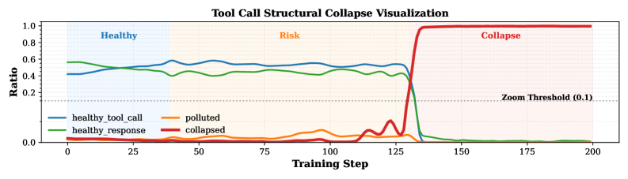

### TL;DR

Multi-step tool-use RL **catastrophically collapses** on many models: performance abruptly drops and tool-invocation structure breaks. The cause isn't capability loss — it's **probability spikes on a few control tokens** that wreck structured outputs. Interleaving SFT with RL stabilizes training but introduces OOD generalization issues; the paper sweeps supervisory-signal options to find the right mix.

### Key idea

Diagnostic: the underlying tool-use capability is intact even after collapse — only the format-control tokens have been over-optimized. Mitigation: sweep four supervisory signals (off-policy supervision, hint guidance, erroneous-example supervision, others) and two training schemes (synchronous vs interleaved SFT+RL), characterizing each on stability and OOD format/content generalization.

### Main finding

**Interleaved SFT+RL substantially improves stability** for multi-step tool-use, but degrades format and content OOD performance. Off-policy supervision and erroneous-example supervision sit elsewhere on the stability-vs-generalization frontier. Code released as **Tool-RL-Box**.

### Why it matters

Names a concrete, reproducible failure mode in agentic RL (tool-format collapse via control-token spikes) and gives practitioners a small menu of supervisory signals with documented tradeoffs — short-circuits a lot of trial-and-error in agent-RL pipelines.

### Knowledge graph integration

**Builds on / relates to existing pages:**
- [../post-training/grpo.md](../post-training/grpo.md) — collapse is observed under outcome-only GRPO-style training.
- [../post-training/_post-training.md](../post-training/_post-training.md) — interleaved SFT+RL is the canonical staged-recipe pattern.
- [../safety/_attacks.md](../safety/_attacks.md) — control-token over-optimization is an internal cousin of jailbreak token-level attacks.

**Suggested new pages:**
- `post-training/tool-rl-collapse.md` *(depth)* — the control-token-spike failure mode and the supervisory-signal mitigation menu.

---

## 10. LISA

**Authors:** Yanghao Wang, Hongxu Chen, Jiazhen Liu, Zhenqi He, Rui Liu, Zhen Wang, Long Chen — *HKUST / Huawei Research*
**Links:** [arXiv:2606.27192](https://arxiv.org/abs/2606.27192) · [HF](https://huggingface.co/papers/2606.27192) · [AlphaXiv](https://www.alphaxiv.org/abs/2606.27192)
**Topics:** `diffusion`, `controllable-generation`

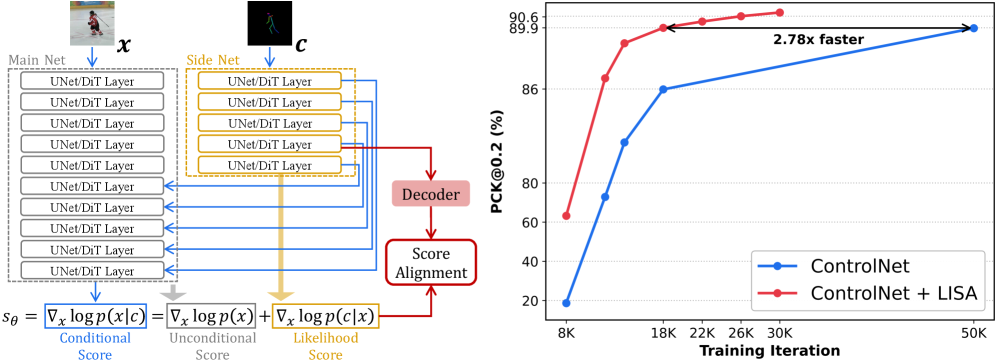

### TL;DR

The standard dual-branch pattern for visual-condition controllable diffusion (frozen main net + trainable side net, fused via intermediate features — ControlNet-style) is reinterpreted through score-based modeling: the main net carries the **unconditional score**, the side net implicitly carries the **conditional likelihood score**. LISA adds a regularization loss that pulls the side network's features toward an approximated likelihood score, accelerating training and improving final quality.

### Key idea

Hook a feature from a designated side-network layer, project it via a lightweight decoder into "score latent space," and regress it against an approximated likelihood score target. The side network and decoder are trained jointly with diffusion loss + this regularization. **Zero extra inference cost** (the decoder is only used at training time); negligible extra train cost.

### Main finding

Across image and video tasks, multiple architectures, and both diffusion and flow models, LISA **consistently accelerates training convergence and improves final synthesis quality** while encouraging more disentangled side-network features for conditional modeling.

### Why it matters

Gives a principled training objective to the otherwise empirical dual-branch design and is a strict improvement on it — same inference profile, better convergence. A small, drop-in regularizer that should generalize to most ControlNet-flavored stacks.

### Knowledge graph integration

**Builds on / relates to existing pages:**
- [../architectures/README.md](../architectures/README.md) — formalizes the "frozen main + trainable side" architectural pattern.

**Suggested new pages:**
- `multimodal/_controllable-generation.md` *(taxonomy)* — visual-condition controllable diffusion variants (ControlNet, T2I-Adapter, dual-branch, LISA-regularized).
- `multimodal/lisa-score-alignment.md` *(depth)* — likelihood-score regularization for dual-branch generators.

---

## 11. Discretizing Reward Models

**Authors:** Vijay Viswanathan, Shiqi Wang, Devamanyu Hazarika, Chirag Nagpal, Tongshuang Wu, Graham Neubig, Yuning Mao — *CMU / Meta Superintelligence Labs*
**Links:** [arXiv:2606.21795](https://arxiv.org/abs/2606.21795) · [HF](https://huggingface.co/papers/2606.21795) · [AlphaXiv](https://www.alphaxiv.org/abs/2606.21795)
**Topics:** `RL`, `rewards`, `reward-hacking`

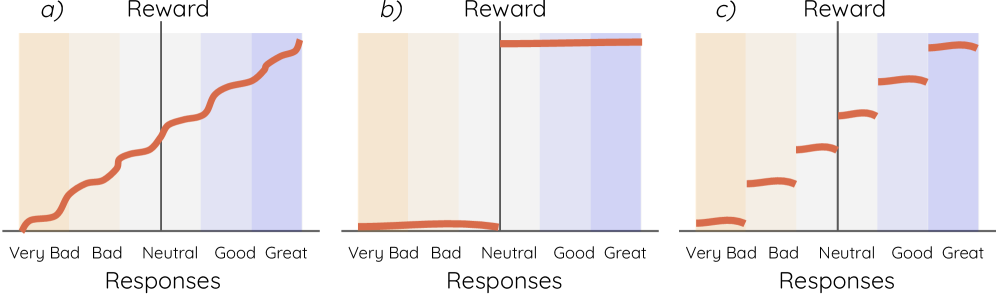

### TL;DR

Continuous reward-model scores look like a strength — they distinguish "good" responses by fine-grained margins. The paper argues this is **oversensitivity**: equally-good responses get different scores, and that fake signal trains worse policies. Fix is a training-free **Monte Carlo dropout** procedure that buckets the RM's output into discrete reward clusters, cutting reward-hacking without hurting discrimination.

### Key idea

Replace "RM accuracy" with two distinct metrics — **discriminative ability** (can it separate good from bad) and **specificity** (does it score equally-good answers equally). Theoretically: high accuracy can coexist with severe oversensitivity. Practically: MC-dropout on any neural RM at inference produces a discrete cluster assignment that preserves discrimination while collapsing the spurious continuous variation.

### Main finding

In controlled and natural RL settings, **discretized rewards lead to less reward hacking and better policies** than the original continuous rewards — without retraining the RM. Theoretical guarantee: there exist discretizations that reduce oversensitivity at minimal cost to discriminative ability.

### Why it matters

Sneaks past the standard "more sensitive RM = better RL" intuition. Cheap inference-time fix that any team running PPO/GRPO with a learned RM can apply tomorrow. Also sharpens the field's measurement vocabulary for RMs.

### Knowledge graph integration

**Builds on / relates to existing pages:**
- [../post-training/_rewards.md](../post-training/_rewards.md) — extends the rewards taxonomy with a new axis (specificity) and a mitigation lever (discretization).
- [../post-training/grpo.md](../post-training/grpo.md) / [../post-training/ppo.md](../post-training/ppo.md) — direct drop-in for learned-RM RL stages.
- [../post-training/cot-reward-model.md](../post-training/cot-reward-model.md) — CoT RMs sidestep some oversensitivity; discretization sidesteps it differently.

**Suggested new pages:**
- `post-training/reward-discretization.md` *(depth)* — the MC-dropout clustering procedure plus the discrimination/specificity split.

---

## 12. InfoKV

**Authors:** Zhuiri Xiao, Alexandra Birch, Zhouhan Lin — *SJTU LUMIA Lab / Edinburgh*
**Links:** [arXiv:2606.26875](https://arxiv.org/abs/2606.26875) · [HF](https://huggingface.co/papers/2606.26875) · [AlphaXiv](https://www.alphaxiv.org/abs/2606.26875)
**Topics:** `efficient-inference`, `reasoning`

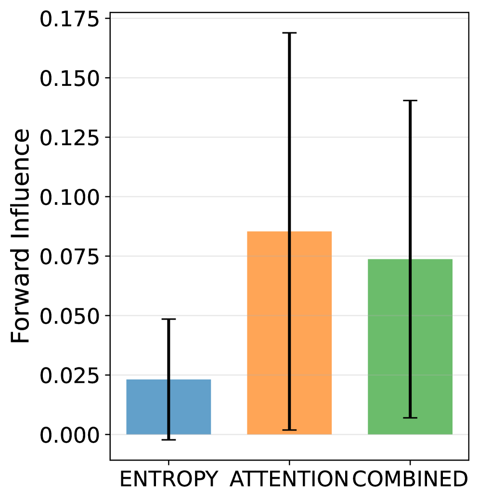

### TL;DR

Attention-based KV cache eviction (SnapKV, H2O, etc.) keeps tokens with high attention to the current step, but only captures *local* importance. **InfoKV** adds an information-theoretic signal: tokens with high predictive uncertainty (entropy at that position) drive *distant* future contexts and are exactly the ones attention-based eviction throws away. The two scores combine to give better long-reasoning KV compression.

### Key idea

Introduce **Forward Influence**: how much do compressed tokens affect *future* contexts. Empirically, attention-selected tokens influence nearby tokens; high-entropy tokens influence *distant* tokens. InfoKV combines token-level predictive uncertainty with layer-wise representation evolution into one entropy score, then mixes it with attention scores during reasoning.

### Main finding

On long-context reasoning benchmarks with **Llama-3.1, Llama-3.2, and DeepSeek-R1**, InfoKV **consistently outperforms attention-only KV compression** in both long-prefill and long-decoding regimes.

### Why it matters

Reasoning workloads produce the longest KV caches in production today, and existing eviction strategies leak quality on long-CoT outputs. A signal that's orthogonal to attention (entropy/uncertainty) gives a clean Pareto improvement and points toward the right framework for thinking about KV importance.

### Knowledge graph integration

**Builds on / relates to existing pages:**
- [../inference/README.md](../inference/README.md) — direct contribution to the inference cluster (KV cache management).
- [../architectures/mla.md](../architectures/mla.md) — MLA compresses KV at storage time; InfoKV compresses at eviction time — complementary levers.
- [../post-training/reasoning/long-cot-rl.md](../post-training/reasoning/long-cot-rl.md) — KV-pressure is most acute on long-CoT-trained models, which is where InfoKV is evaluated.

**Suggested new pages:**
- `inference/_kv-cache-compression.md` *(taxonomy)* — attention-based (H2O, SnapKV) vs information-theoretic (InfoKV) eviction strategies.
- `inference/infokv.md` *(depth)* — Forward Influence + entropy-aware eviction.

---

## 13. World Model Hallucination

**Authors:** Nicklas Hansen, Xiaolong Wang — *UC San Diego*
**Links:** [arXiv:2606.27326](https://arxiv.org/abs/2606.27326) · [HF](https://huggingface.co/papers/2606.27326) · [AlphaXiv](https://www.alphaxiv.org/abs/2606.27326)
**Topics:** `world-model`, `data`, `eval`

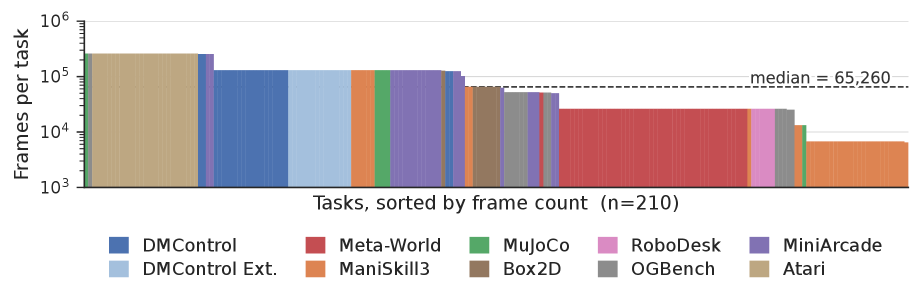

### TL;DR

Generative world models render fluent action-controllable futures but **hallucinate** — rollouts drift from ground-truth dynamics. The paper shows hallucination is fundamentally a **data-coverage** problem: it concentrates in low-coverage regions of the state-action space, and *the same lightweight signals that predict it also fix it* when used as curiosity rewards for targeted data collection.

### TL;DR (key idea)

Three failure modes — **perceptual, action-marginalized, scene-diverging** — each anchored to a different pipeline stage. A 350M-parameter world model is trained on a new 427-hour, 210-task dataset (**MMBench2**). Two interventions: coverage-aware sampling at train time, and using the hallucination predictors as **curiosity rewards** at finetune time for **as few as 50 real environment trajectories** to adapt to entirely unseen environments.

### Main finding

The hallucination predictors are accurate enough to drive both detection and mitigation; data-efficient finetuning reaches OOD environments with **~50 trajectories**. Concrete delta vs no-coverage-aware baseline isn't summarized in the abstract — depends on the OOD env.

### Why it matters

Recasts world-model hallucination from "training objective bug" to "data-coverage problem," giving a clear lever (coverage signals as curiosity reward) and a concrete data-efficient adaptation recipe. Same playbook may transfer to LLM hallucination on rare facts.

### Knowledge graph integration

**Builds on / relates to existing pages:**
- [../data/_data-curation.md](../data/_data-curation.md) — coverage-aware sampling is a data-curation move; aligns with quality-filtering / mixture-design tradition.
- [../data/quality-filtering.md](../data/quality-filtering.md) — same family: filtering vs targeted-collection as coverage tools.
- [../post-training/_rewards.md](../post-training/_rewards.md) — curiosity-as-reward fits as a new shaping-reward variant.

**Suggested new pages:**
- `evaluation/world-model-hallucination.md` *(depth)* — the three-mode taxonomy and the coverage-signal detector.

---

## 14. Progress Advantage

**Authors:** Changdae Oh, Wendi Li, Seongheon Park, Samuel Yeh, Tanwi Mallick, Sharon Li — *University of Wisconsin-Madison / Argonne National Laboratory*
**Links:** [arXiv:2606.26080](https://arxiv.org/abs/2606.26080) · [HF](https://huggingface.co/papers/2606.26080) · [AlphaXiv](https://www.alphaxiv.org/abs/2606.26080)
**Topics:** `RL`, `agents`, `rewards`

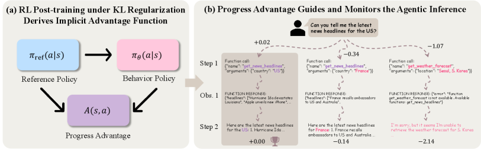

### TL;DR

PRMs are infeasible to build for agent settings (long horizons, irreversible actions, stochastic envs). The paper proves you don't need to: the **log-probability ratio between the RL-trained policy and its reference policy exactly recovers the optimal advantage function** under a general stochastic MDP. Call it **progress advantage** — annotation-free, domain-agnostic, falls out of the standard RL post-training pipeline as a byproduct.

### Key idea

Under a Markov stochastic environment with RL post-training (KL-regularized to a reference policy), the implicit advantage at any state equals $\log \pi_\theta / \pi_{\text{ref}}$. This is the same log-ratio DPO uses to express the reward; here it's reused as a step-level **process reward signal** with no separate training.

### Main finding

Validated across three applications (test-time scaling, uncertainty quantification, failure attribution) on five benchmarks and four model families. **Consistently outperforms confidence-based baselines** and, despite requiring zero task-specific training, **surpasses dedicated trained reward models**.

### Why it matters

Effectively kills off the case for building a separate PRM for agents — the RL-trained policy *already* contains the step-level signal. Cheap, free, generalizable; reframes "do we need a PRM" into "we already have one, we just weren't reading it."

### Knowledge graph integration

**Builds on / relates to existing pages:**
- [../post-training/reasoning/prm.md](../post-training/reasoning/prm.md) — direct alternative to a trained PRM; explains the failure of PRMs in agent settings.
- [../post-training/dpo.md](../post-training/dpo.md) — same $\log \pi/\pi_{\text{ref}}$ object that DPO uses, repurposed as a step reward.
- [../post-training/_rewards.md](../post-training/_rewards.md) — adds a new (implicit) entry to the rewards taxonomy.
- [../post-training/_rl.md](../post-training/_rl.md) — falls out of the KL-regularized policy gradient, no extra machinery.

**Suggested new pages:**
- `post-training/progress-advantage.md` *(depth)* — the $\log \pi_\theta / \pi_{\text{ref}}$ implicit advantage and its three downstream uses (test-time scaling / UQ / failure attribution).

---

## 15. Co-Failure Ceiling

**Authors:** Josef Chen — *KAIKAKU*
**Links:** [arXiv:2606.27288](https://arxiv.org/abs/2606.27288) · [HF](https://huggingface.co/papers/2606.27288) · [AlphaXiv](https://www.alphaxiv.org/abs/2606.27288)
**Topics:** `eval`, `agents`, `ensembling`

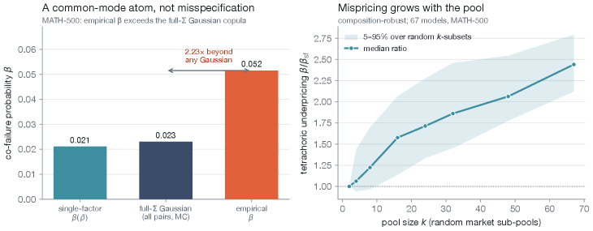

### TL;DR

Combining frontier LLMs (routing, voting, mixture-of-agents) has a hard ceiling at **1 − β**, where β is the rate of *simultaneous* failure across the pool on identical queries. Pairwise error correlation (ρ) — the metric the field actually tracks — **systematically underestimates β by ~2.5×** on math, especially as pools grow. Empirically, across 67 frontier models from 21 providers, the combined system rarely beats the single best model without strong query-level routing.

### Key idea

Distinguish pairwise correlation (ρ) from joint-failure rate (β). Show that for orchestration accuracy *only β matters*, and that ρ is insufficient to predict it once you have more than a handful of models. Identify two regimes: a **binding co-failure ceiling** on open-ended tasks (β too high), and a **slack ceiling** on others where theoretical gains exist but routers can't realize them.

### Main finding

Across 67 frontier models / 21 providers, the **single best model usually wins** under voting / MoA / naive routing. Statistical models calibrated on pairwise error rates still under-predict simultaneous failures by **~2.5×** on math. Strong query-level routing is the only intervention with real headroom.

### Why it matters

A sober counterweight to the "mixture-of-agents always wins" narrative. Gives a clean metric (β) for evaluating any LLM-combining system and explains why so many MoA papers don't replicate at scale.

### Knowledge graph integration

**Builds on / relates to existing pages:**
- [../evaluation/README.md](../evaluation/README.md) — measurement framework for combined-LLM systems.
- [../agents/README.md](../agents/README.md) — directly bounds the mixture-of-agents pattern.

**Suggested new pages:**
- `evaluation/_llm-ensembling.md` *(taxonomy)* — routing / voting / MoA, with β as the unifying metric.

---

## Notes

- Yesterday (2026-06-28) was a Sunday with no fresh HF Daily Papers; HF rolled forward to the most recent weekday (June 26). All 15 papers in this digest are from that pool.
- Borderline inclusions: **World Model Hallucination** (#13) is a borderline keep — generative world model + data-coverage methodology made it relevant to LLM-style training pipelines even though the system itself is robotics-flavored.
- Hero figures live in `assets/2026-06-28/`. Three papers (#3 Qwen-Image-Agent, #7 GUI vs CLI, #8 Running the Gauntlet) had no usable arXiv `x1.png` and are shown without a figure.
- This digest is informational. No existing concept files, `READING-LIST.md`, or `PAPERS.md` were modified to produce it.
