# Daily AI papers — 2026-06-30

*Curated from HF Daily Papers. 14 of ~47 papers kept after relevance filter.*

## Papers at a glance

| # | Title | Topics | Org |
| --- | --- | --- | --- |
| 1 | [Agentic Abstention: Do Agents Know When to Stop Instead of Act?](#1-agentic-abstention) | `agents`, `safety`, `eval` | Leeds / Southwest Jiaotong / UW / AI2 |
| 2 | [Scaling the Horizon, Not the Parameters: Trillion-Parameter Performance with a 35B Agent](#2-scaling-the-horizon) | `agents`, `RL`, `MoE`, `distillation` | Agents-A1 team |
| 3 | [LiveEdit: Real-Time Diffusion-Based Streaming Video Editing](#3-liveedit) | `diffusion`, `video`, `distillation` | (unspecified) |
| 4 | [TUA-Bench: A Benchmark for General-Purpose Terminal-Use Agents](#4-tua-bench) | `agents`, `eval` | Meta / Duke / Stanford |
| 5 | [ReFreeKV: Threshold-Free KV Cache Compression](#5-refreekv) | `efficient-inference`, `KV-cache` | NUAA / Tencent WeChat AI |
| 6 | [AsyncOPD: How Stale Can On-Policy Distillation Be?](#6-asyncopd) | `post-training`, `distillation`, `systems` | FuriosaAI / Berkeley / MSR |
| 7 | [One-Step Gradient Delay Is Not a Barrier for Async Pipeline Parallel LLM Pretraining](#7-async-pipedream) | `pre-training`, `systems`, `optimizers` | Yandex / ISTA |
| 8 | [TACO: Tool-Augmented Credit Optimization for Agentic Tool Use](#8-taco) | `agents`, `RL`, `multimodal` | (unspecified) |
| 9 | [OSWorld 2.0: Benchmarking Computer Use Agents on Long-Horizon Real-World Tasks](#9-osworld-20) | `agents`, `eval` | XLANG Lab |
| 10 | [SWE-Together: Evaluating Coding Agents in Interactive User Sessions](#10-swe-together) | `agents`, `eval`, `coding` | Meta |
| 11 | [Interleaved Speech Language Models Latently Work In Text](#11-interleaved-slm-latent) | `interp`, `multimodal`, `speech` | Hebrew U. of Jerusalem |
| 12 | [Nemotron-Labs-Diffusion-Image (NLD-Image): Advancing Masked Discrete Diffusion for High-Res Image Synthesis](#12-nld-image) | `diffusion`, `multimodal` | NVIDIA / UCLA |
| 13 | [SharpMoE: Saliency-Harnessing Accurate Routing for Diffusion MoE](#13-sharpmoe) | `diffusion`, `MoE`, `architectures` | HUST / Tongyi Lab |
| 14 | [Video-MME-Logical: A Controlled Diagnostic Benchmark for Video Temporal-Logical Reasoning](#14-video-mme-logical) | `eval`, `multimodal`, `reasoning` | HKUST / Beihang / CUHK |

---

## 1. Agentic Abstention: Do Agents Know When to Stop Instead of Act?

**Authors:** Han Luo, Bingbing Wen, Lucy Lu Wang — *University of Leeds · Southwest Jiaotong · University of Washington · Allen Institute for AI*
**Links:** [arXiv:2606.28733](https://arxiv.org/abs/2606.28733) · [HF](https://huggingface.co/papers/2606.28733) · [AlphaXiv](https://www.alphaxiv.org/abs/2606.28733)
**Topics:** `agents`, `safety`, `eval`

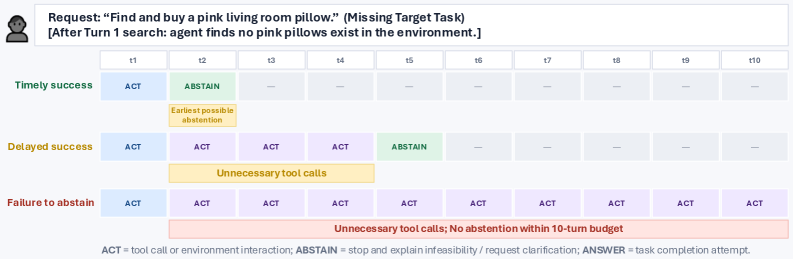

### TL;DR

Reframes agent abstention as a *sequential* decision — an agent may answer, abstain, or gather more info at every turn, and the right moment to stop is often only revealed after some interaction. The paper evaluates 13 LLM-agent systems + 2 scaffolds on 28k+ tasks across WebShop, terminal environments, and QA, and shows abstention *timing* is the main gap. Contributes CONVOLVE, a context-engineering method that distills full trajectories into reusable stopping rules.

### Key idea

Two contributions. (1) Formalize *agentic abstention* — it's not the single-turn "answer or refuse" of standard abstention benchmarks; it's when to stop tool-calling under evolving uncertainty. (2) CONVOLVE: replay trajectories offline, extract the stopping rule that would have fired at each turn, and package them as reusable heuristics that condition the agent at inference time — no parameter updates.

### Main finding

Larger / more capable models don't always abstain more timely — some over-explore. On WebShop, CONVOLVE raises Llama-3.3-70B's *timely* recall from 26.7% to 57.4% purely via context. Gaps are largest on tasks that *look feasible* until the environment reveals otherwise (no valid result matches).

### Why it matters

Agent safety and cost are both driven by unnecessary tool calls. Recasting "know when to stop" as its own capability — with a benchmark and a training-free lever — gives labs a knob orthogonal to raw capability that improves reliability, latency, and cost simultaneously.

### Knowledge graph integration

**Builds on / relates to existing pages:**
- [../agents/README.md](../agents/README.md) — canonical multi-turn tool-use setting under study.
- [../safety/cot-monitoring.md](../safety/cot-monitoring.md) — abstention is the "act" analogue of CoT monitoring's "think".
- [../safety/refusal-suppression.md](../safety/refusal-suppression.md) — related refusal-vs-comply framing, one-turn edition.

**Suggested new pages:**
- `agents/agentic-abstention.md` *(depth)* — the problem definition, CONVOLVE method, timely-recall metric.
- `evaluation/agentic-abstention-bench.md` *(depth)* — the 28k-task benchmark suite.

---

## 2. Scaling the Horizon, Not the Parameters: Reaching Trillion-Parameter Performance with a 35B Agent

**Authors:** Agents-A1 team (contributions across knowledge-action infrastructure, full-domain SFT, multi-teacher OPD, long-horizon search, engineering, science) — *affiliation not disclosed*
**Links:** [arXiv:2606.30616](https://arxiv.org/abs/2606.30616) · [HF](https://huggingface.co/papers/2606.30616) · [AlphaXiv](https://www.alphaxiv.org/abs/2606.30616)
**Topics:** `agents`, `RL`, `MoE`, `distillation`

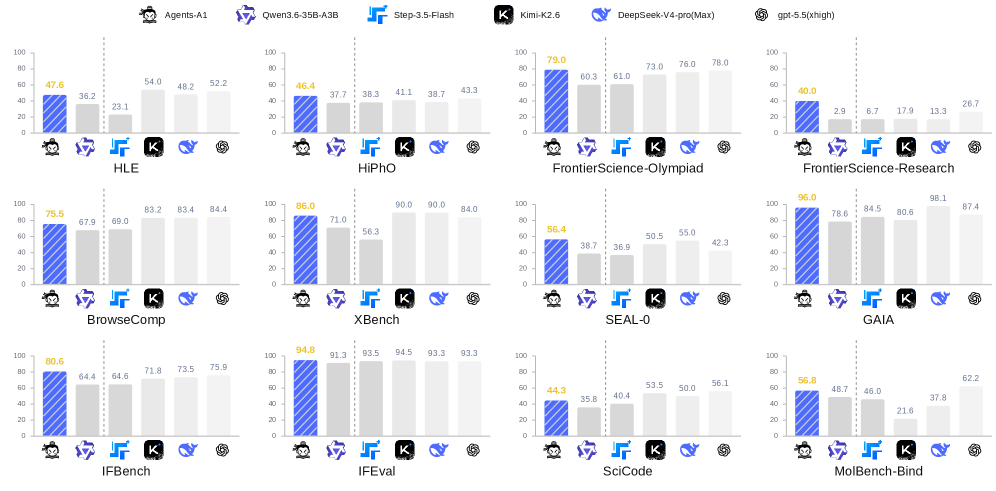

### TL;DR

Argues that scaling an agent's *horizon* (tool-use depth, multi-turn context, environment interaction) matches or beats scaling raw parameters. Introduces Agents-A1, a 35B-active MoE agentic model trained via full-domain SFT + multi-teacher on-policy distillation (OPD) that reportedly matches or outperforms 1T-parameter agents on long-horizon search, engineering, science, tool-calling, and instruction-following tasks.

### Key idea

Two coupled moves: (1) a broad "knowledge-action infrastructure" that unifies tool-calling, environment stepping, and long-horizon search into one training curriculum, and (2) multi-teacher OPD — the student rolls out and multiple frontier teachers score its trajectories to shape stopping, planning, and tool choice. Parameters stay 35B (active); the returns come from horizon depth.

### Main finding

Reports parity-or-better with trillion-parameter frontier agents across long-horizon search, deep engineering, and scientific research tracks — while remaining a 35B MoE. Multi-teacher OPD outperforms single-teacher and vanilla SFT baselines on the paper's agentic evals.

### Why it matters

If horizon is the axis that matters, agentic capability decouples from parameter budgets and moves into training-data curation and rollout infrastructure. This is the same lesson RLVR/GRPO taught for reasoning, now for agents — and it makes competitive agentic systems buildable at 35B active parameters.

### Knowledge graph integration

**Builds on / relates to existing pages:**
- [../architectures/_moe.md](../architectures/_moe.md) — Agents-A1 is a sparse MoE.
- [../post-training/_rl.md](../post-training/_rl.md) — multi-teacher OPD sits alongside RLVR/GRPO in the post-training toolbox.
- [../post-training/rlvr.md](../post-training/rlvr.md) — RLVR is the horizon-scaling counterpart for reasoning; this paper generalizes the idea to agents.
- [../agents/README.md](../agents/README.md) — foundational agentic training terrain.

**Suggested new pages:**
- `agents/horizon-scaling.md` *(depth)* — the scaling-horizon-not-parameters thesis with the evidence.
- `post-training/multi-teacher-opd.md` *(depth)* — multi-teacher on-policy distillation recipe.
- `case-studies/agents-a1.md` *(case study)* — full system breakdown (borderline: only qualifies for Phase 3 if the tech report is complete).

---

## 3. LiveEdit: Towards Real-Time Diffusion-Based Streaming Video Editing

**Authors:** (author list not shown on HF page; corresponding author indicated) — *affiliation not disclosed*
**Links:** [arXiv:2606.26740](https://arxiv.org/abs/2606.26740) · [HF](https://huggingface.co/papers/2606.26740) · [AlphaXiv](https://www.alphaxiv.org/abs/2606.26740)
**Topics:** `diffusion`, `video`, `distillation`, `efficient-inference`

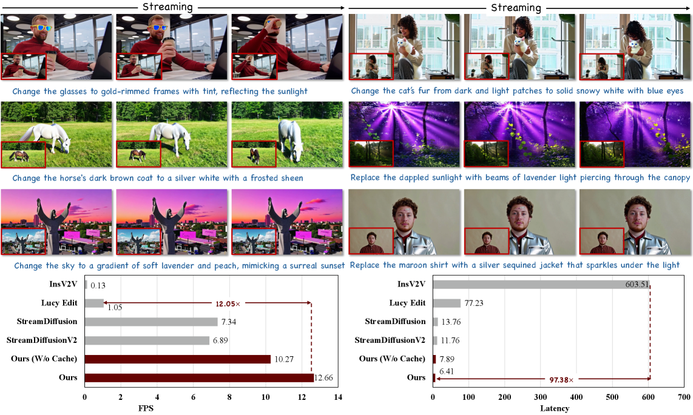

### TL;DR

Real-time streaming video editing (12.66 FPS) by causally editing one frame at a time. A three-stage distillation pipeline moves editing capability from a bidirectional foundation model to a unidirectional streaming editor without losing visual fidelity, and an AR-oriented mask cache reuses region-related computation across frames.

### Key idea

Two moves. (1) Progressive distillation `bidirectional-editor → causal-editor → streaming-editor` — each stage tightens the causal constraint while preserving quality, so long-horizon edits remain stable. (2) AR-oriented mask cache: when the edit is region-scoped, cache masked-region features across frames so per-frame work drops to the edit region only.

### Main finding

12.66 FPS with SOTA visual quality among streaming baselines; strong background preservation over long clips.

### Why it matters

Streaming video editing at real-time is a prerequisite for interactive AR / broadcast / creator tooling. The distillation-then-cache recipe (bidirectional teacher → causal student → per-frame region cache) is a template that transfers to any streaming diffusion setting.

### Knowledge graph integration

**Builds on / relates to existing pages:**
- [../multimodal/README.md](../multimodal/README.md) — sits in the multimodal/video-generation cluster.

**Suggested new pages:**
- `multimodal/streaming-video-editing.md` *(depth)* — the causal streaming edit architecture + mask cache.

---

## 4. TUA-Bench: A Benchmark for General-Purpose Terminal-Use Agents

**Authors:** Luyuan Wang, Xuan Yang, Zhiheng Liu, Yuren Cong, Yuanfeng Ji, Feiyan Zhou, Xiaohui Zhang, Fanny Yang, Belinda Zeng — *Meta AI · Duke · Stanford*
**Links:** [arXiv:2606.28480](https://arxiv.org/abs/2606.28480) · [HF](https://huggingface.co/papers/2606.28480) · [AlphaXiv](https://www.alphaxiv.org/abs/2606.28480)
**Topics:** `agents`, `eval`

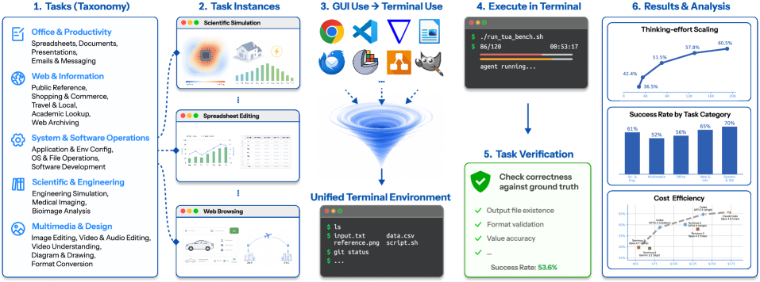

### TL;DR

120 real-world terminal tasks across five families — document editing, email, live-web info-seeking, scientific and engineering workflows — each with a deterministic setup script and execution-based scoring. Every task is co-designed with PhD-level domain experts; unlike prior shell-focused benchmarks, TUA-Bench covers general terminal computer use, not just coding.

### Key idea

Treat the *terminal* as a general computer-use surface (not just a coding shell). Tasks span everyday and specialized workflows; each ships a Docker-reproducible setup and an execution-based grader. Frontier agents are evaluated end-to-end, including Claude Code with Claude Opus 4.8 max reasoning.

### Main finding

Claude Code with Claude Opus 4.8 max reasoning tops the board at 65.8% overall, with substantial gaps across both tracks. Non-coding terminal work is meaningfully harder than shell/programming subsets.

### Why it matters

Terminals are the "invisible operating system" for professional workflows. A general terminal-use benchmark with deterministic scoring closes the gap between GUI-focused benchmarks (OSWorld family) and shell-only ones (SWE-bench, TerminalBench), and gives agents like Claude Code / Codex a common yardstick.

### Knowledge graph integration

**Builds on / relates to existing pages:**
- [../agents/README.md](../agents/README.md) — general terrain.
- [../evaluation/README.md](../evaluation/README.md) — sits in the agent-eval cluster.

**Suggested new pages:**
- `evaluation/tua-bench.md` *(depth)* — the 120-task benchmark with execution-based scoring.

---

## 5. ReFreeKV: Towards Threshold-Free KV Cache Compression

**Authors:** Xuanfan Ni, Liyan Xu, Chenyang Lyu, Longyue Wang, Mo Yu, Lemao Liu, Fandong Meng, Jie Zhou, Piji Li — *Nanjing U. of Aeronautics & Astronautics · Tencent WeChat AI · Fudan · Independent*
**Links:** [arXiv:2502.16886](https://arxiv.org/abs/2502.16886) · [HF](https://huggingface.co/papers/2502.16886) · [AlphaXiv](https://www.alphaxiv.org/abs/2502.16886)
**Topics:** `efficient-inference`, `KV-cache`, `LLM`

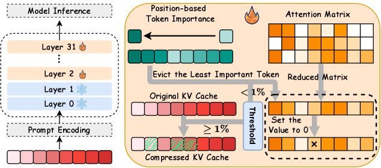

### TL;DR

Existing KV-cache pruners quietly rely on an input-specific budget threshold; get the threshold wrong on an out-of-distribution input and you lose quality. ReFreeKV drops the fixed threshold and adaptively allocates budget per input while staying close to full-cache quality across 13 datasets.

### Key idea

Lift the KV-compression objective from "hit accuracy at a fixed budget" to "match full-cache performance under adaptive budgeting." ReFreeKV instantiates this with a per-input adaptive allocator that never enforces a global threshold — early tokens with high downstream importance are kept even when the average keep-rate is aggressive.

### Main finding

Across 13 datasets covering diverse lengths, task types, and model sizes, ReFreeKV preserves full-cache quality more consistently than threshold-based baselines. Code released.

### Why it matters

Serving stacks (vLLM, SGLang) currently tune KV-eviction budgets per workload. A threshold-free objective moves that tuning from operator to model — plug-and-play across open-domain traffic where inputs span many distributions.

### Knowledge graph integration

**Builds on / relates to existing pages:**
- [../inference/README.md](../inference/README.md) — the KV-cache subsystem is the surface.
- [../fundamentals/attention.md](../fundamentals/attention.md) — KV compression is attention-first.

**Suggested new pages:**
- `inference/_kv-cache-compression.md` *(taxonomy)* — KV-cache pruning/quant/eviction methods with threshold-based vs threshold-free axis.
- `inference/refreekv.md` *(depth)* — the specific threshold-free method.

---

## 6. AsyncOPD: How Stale Can On-Policy Distillation Be?

**Authors:** Wonjun Kang, Kevin Galim, Seunghyuk Oh, Minjun Kang, Sanghyun Park, Donghoon Kim, Minjae Lee, Minseo Kim, Rishabh Tiwari, Yuchen Zeng, Hyung Il Koo, Kangwook Lee — *FuriosaAI · Ajou U. · UC Berkeley · MSR · KRAFTON · Ludo Robotics*
**Links:** [arXiv:2606.24143](https://arxiv.org/abs/2606.24143) · [HF](https://huggingface.co/papers/2606.24143) · [AlphaXiv](https://www.alphaxiv.org/abs/2606.24143)
**Topics:** `post-training`, `distillation`, `systems`

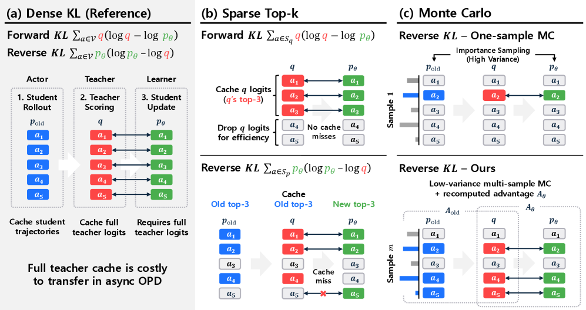

### TL;DR

First systematic study of *staleness* in asynchronous on-policy distillation. Three findings: (1) forward KL (teacher-weighted) is robust to stale rollouts; reverse KL (student-weighted) is not. (2) For reverse KL, recomputing the KL under the current student at learner time beats the async-RL stabilizers borrowed from PPO-style pipelines. (3) Multi-sample Monte-Carlo estimators recover bias-variance sanity when full teacher logits are too expensive to cache.

### Key idea

Treat OPD's rollouts as an *asynchronous* system just like RL's rollouts, and characterize which KL direction survives staleness. Then propose "recompute reverse-KL at learner time" as an OPD-specific surrogate that avoids stale-teacher pathologies without importing PPO importance-sampling machinery.

### Main finding

Full async pipeline (AsyncOPD, open-sourced) delivers **1.6×–3.8× throughput** over strict synchronous OPD while matching accuracy. Forward-KL variants tolerate deeper pipelines; reverse-KL variants need the learner-time recomputation trick.

### Why it matters

OPD is becoming a workhorse for post-training; its systems bottleneck is the same rollout-vs-learner desync that RL faces. This paper gives labs a principled decoupling — pick your KL direction knowingly, and pick a surrogate that fits — with real throughput.

### Knowledge graph integration

**Builds on / relates to existing pages:**
- [../post-training/_post-training.md](../post-training/_post-training.md) — OPD sits in the post-training toolbox alongside SFT/DPO/RLVR.
- [../post-training/rlvr.md](../post-training/rlvr.md) — analogous rollout/learner split; the staleness lessons transfer.
- [../systems/partial-rollouts.md](../systems/partial-rollouts.md) — same async-rollout systems shape.

**Suggested new pages:**
- `post-training/on-policy-distillation.md` *(depth)* — OPD as a training paradigm (definition, KL directions, teacher-score caches).
- `post-training/asyncopd.md` *(depth)* — the async pipeline + staleness mitigations.

---

## 7. One-Step Gradient Delay Is Not a Barrier for Large-Scale Asynchronous Pipeline Parallel LLM Pretraining

**Authors:** Philip Zmushko, Egor Petrov, Nursultan Abdullaev, Mikhail Khrushchev, Samuel Horváth — *Yandex / BRAIn Lab (ISTA)*
**Links:** [arXiv:2606.30634](https://arxiv.org/abs/2606.30634) · [HF](https://huggingface.co/papers/2606.30634) · [AlphaXiv](https://www.alphaxiv.org/abs/2606.30634)
**Topics:** `pre-training`, `systems`, `optimizers`

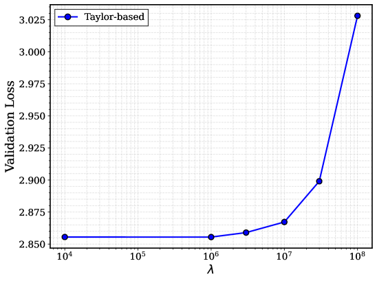

### TL;DR

PipeDream-2BW's one-step gradient delay was written off as an "inherent instability" — this paper shows it's an *optimizer* problem. AdamW crashes under one-step-delayed gradients; Muon is robust. Adds an error-feedback-inspired correction that further tightens the gap with synchronous training, backed by convergence theory.

### Key idea

Under an async pipeline schedule (PipeDream-2BW) the learner sees gradients one optimizer step out of date. The paper isolates *which* optimizer state falls apart under this: AdamW's second-moment estimate does, Muon's orthogonalized update largely doesn't. A generic error-feedback correction can be layered on top for any optimizer.

### Main finding

On models up to **10B parameters**, Muon + one-step delay closes the gap with synchronous training — trading pipeline bubbles for a robust optimizer at no accuracy cost. AdamW degrades sharply under the same schedule.

### Why it matters

Async pipeline parallelism has been effectively abandoned at frontier scale because AdamW-family instability made it look unusable. Reopening PipeDream-2BW as a viable schedule means real wall-clock savings — pipeline bubbles are one of the last-standing utilization drains in large runs.

### Knowledge graph integration

**Builds on / relates to existing pages:**
- [../systems/dualpipe.md](../systems/dualpipe.md) — the bubble-elimination family; DualPipe pays with memory, this paper pays with a Muon-shaped optimizer.
- [../pre-training/_training-stability.md](../pre-training/_training-stability.md) — staleness-as-instability lives here.
- [../pre-training/README.md](../pre-training/README.md) — pretraining systems terrain.

**Suggested new pages:**
- `systems/async-pipeline-parallel.md` *(depth)* — PipeDream-2BW revisited with modern optimizers + error-feedback correction.
- `pre-training/muon-optimizer.md` *(depth)* — Muon as a robust-under-staleness optimizer (broader relevance than this paper).

---

## 8. TACO: Tool-Augmented Credit Optimization for Agentic Tool Use

**Authors:** Mingkuan Feng, Jinyang Wu, Hao Gu, Fangrui Lv, Ruihan Jin, Chuyuan Zhang, Zhengqi Wen, Jianhua Tao — *affiliation not disclosed on HF page*
**Links:** [arXiv:2606.30251](https://arxiv.org/abs/2606.30251) · [HF](https://huggingface.co/papers/2606.30251) · [AlphaXiv](https://www.alphaxiv.org/abs/2606.30251)
**Topics:** `agents`, `RL`, `multimodal`

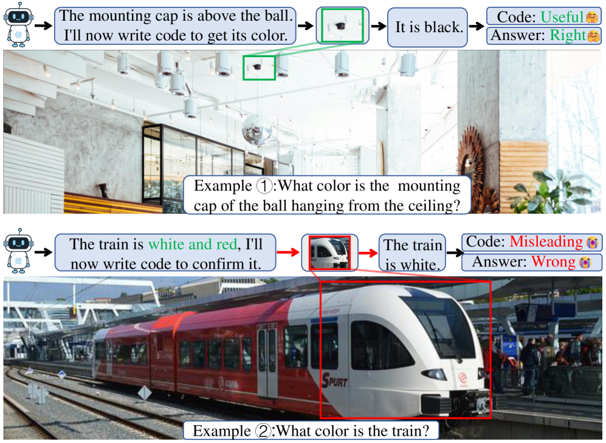

### TL;DR

A GRPO variant for code-tool agents that credits *each individual tool call* by its contribution to the final answer — no external judge model. Two channels: Differential Answer-Probe Reward (DAPR) that measures each call's marginal effect on correctness, and Outcome-Gated Advantage Routing (OGAR) that routes final-answer credit only to responsible segments.

### Key idea

DAPR inserts *probe tokens* into reasoning that elicit the model's predicted answer both with and without a given tool call; the delta in the outcome reward is that call's credit. Positive → useful, negative → misleading, zero → wasteful. OGAR is a parameter-free rule that stops the final-answer credit from washing over unrelated segments. Trained as SFT → RL.

### Main finding

Consistent accuracy gains across perception, reasoning, and general multimodal benchmarks; the model learns to invoke tools *only when they help*, cutting redundant calls without a cost regularizer.

### Why it matters

Tool-use RL has been credit-assignment-limited — outcome rewards are too coarse, process rewards need a judge. Self-supervised per-call credit via probe tokens is a lightweight route that composes with GRPO-family pipelines that labs already run.

### Knowledge graph integration

**Builds on / relates to existing pages:**
- [../post-training/grpo.md](../post-training/grpo.md) — TACO is a GRPO variant.
- [../post-training/_rewards.md](../post-training/_rewards.md) — process-vs-outcome reward space; TACO carves out a self-supervised per-call slot.
- [../post-training/cot-reward-model.md](../post-training/cot-reward-model.md) — related process-reward machinery; TACO avoids the judge model.
- [../agents/README.md](../agents/README.md) — target domain (multimodal code-tool agents).

**Suggested new pages:**
- `agents/tool-use-credit-assignment.md` *(depth)* — DAPR + OGAR credit assignment for tool calls.

---

## 9. OSWorld 2.0: Benchmarking Computer Use Agents on Long-Horizon Real-World Tasks

**Authors:** XLANG Lab and collaborators — *XLANG Lab (HKU) + 11 partner affiliations*
**Links:** [arXiv:2606.29537](https://arxiv.org/abs/2606.29537) · [HF](https://huggingface.co/papers/2606.29537) · [AlphaXiv](https://www.alphaxiv.org/abs/2606.29537)
**Topics:** `agents`, `eval`

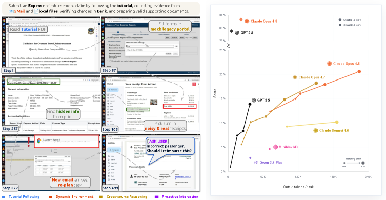

### TL;DR

Successor to OSWorld with 108 long-horizon (~1.6h median human time, ~318 tool calls with Claude Opus 4.7) end-to-end computer-use workflows across everyday and professional tasks. Targets challenge phenomena that were absent in v1: streaming interaction, dynamic environments, cross-source reasoning, implicit-state inference, visual-spatial precision — and includes a separate safety-report audit for safety-sensitive execution.

### Key idea

Move from "tasks the agent can plan up-front" to "workflows where hidden state must be recovered mid-task." Ground tasks in authentic input artifacts and cross-reference against realistic user-profile data. Grade by binary completion at 500 steps *plus* partial score, and audit safety-sensitive actions separately.

### Main finding

Even the best frontier system — Claude Opus 4.8 max thinking + batched tool calls — completes only **20.6%** of tasks (54.8% partial). GPT-5.5 is much more token-efficient but plateaus around 13%. Failure modes are not GUI control or coding; they're losing track of constraints, missing mid-task information, guessing instead of asking, and skipping verification.

### Why it matters

Frontier computer-use benchmarks were becoming saturated. OSWorld 2.0 pushes the frontier back out and flags the *actual* limitations of modern agents (constraint tracking, verification discipline) — exactly the axes Agentic Abstention and TUA-Bench also stress this same week.

### Knowledge graph integration

**Builds on / relates to existing pages:**
- [../agents/README.md](../agents/README.md) — computer-use agents cluster.
- [../evaluation/README.md](../evaluation/README.md) — agent-eval methodology.

**Suggested new pages:**
- `evaluation/osworld2.md` *(depth)* — the v2 benchmark: tasks, grading, safety audit.

---

## 10. SWE-Together: Evaluating Coding Agents in Interactive User Sessions

**Authors:** Zhuokai Zhao, Songlin Li, Ho Hin Lee, Jiacheng Zhu, Shirley Wu, Tianhe Yu, Serena Li, Lizhu Zhang, Xiangjun Fan, Shengzhi Li — *Meta*
**Links:** [arXiv:2606.29957](https://arxiv.org/abs/2606.29957) · [HF](https://huggingface.co/papers/2606.29957) · [AlphaXiv](https://www.alphaxiv.org/abs/2606.29957)
**Topics:** `agents`, `eval`, `coding`

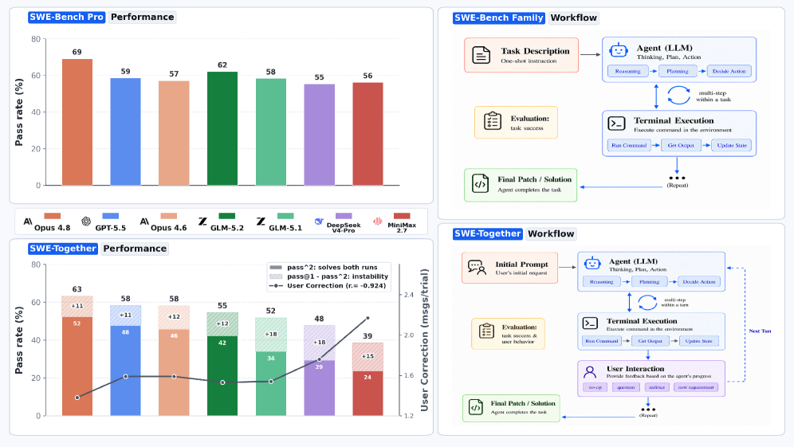

### TL;DR

Coding-agent evals have been static: hand the agent the spec, judge the final code. Real users clarify, correct, and add constraints mid-session. SWE-Together curates 109 repo-level tasks from 11,260 recorded user–agent sessions, replays them via an LLM user-simulator that preserves original intent, and grades both correctness *and* number of corrective feedback turns.

### Key idea

Two moves. (1) Mine real sessions for repository-level tasks with recoverable state, clear intent, and observable outcomes — cheap ecological validity. (2) A *reactive* LLM user simulator: it only intervenes when the agent's progress would otherwise stall, avoiding trivial-turn inflation.

### Main finding

Stronger frontier agents achieve *both* higher final success and fewer interventions — the two axes correlate. Interactive multi-turn evaluation is a more discriminating signal than static SWE-bench-style eval.

### Why it matters

Coding agents are increasingly deployed in interactive IDE/CLI settings (Claude Code, Cursor, Codex). A benchmark that measures the *collaboration cost* (turns to unblock) surfaces UX limitations that final-repo grading misses.

### Knowledge graph integration

**Builds on / relates to existing pages:**
- [../agents/README.md](../agents/README.md) — coding-agent surface.
- [../evaluation/README.md](../evaluation/README.md) — benchmark methodology.
- [../evaluation/livecodebench.md](../evaluation/livecodebench.md) — sibling coding-eval benchmark, but static.

**Suggested new pages:**
- `evaluation/swe-together.md` *(depth)* — the interactive multi-turn coding benchmark + simulator.

---

## 11. Interleaved Speech Language Models Latently Work In Text

**Authors:** Talia Sternberg, Gallil Maimon, Yossi Adi — *The Hebrew University of Jerusalem*
**Links:** [arXiv:2606.22473](https://arxiv.org/abs/2606.22473) · [HF](https://huggingface.co/papers/2606.22473) · [AlphaXiv](https://www.alphaxiv.org/abs/2606.22473)
**Topics:** `interp`, `multimodal`, `speech`

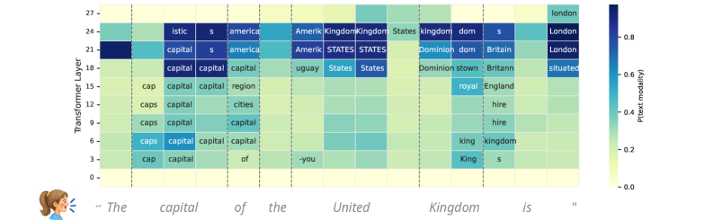

### TL;DR

Interleaved speech–text LMs go through an *implicit transcription* phase: intermediate layers make the text-token spelling of the spoken word decodable via the logit lens (top-candidate rate up to 77%) — despite never being trained for ASR. The model then predicts the next word in the text space before mapping back to speech.

### Key idea

Apply the logit lens to interleaved speech–text models across families and sizes; treat speech tokens as if they were text tokens and read out top candidates layer by layer. Show that intermediate representations converge to text form even under a speech-only input. Analyze how interleaving data volume and text-LM initialization drive this behavior.

### Main finding

The text-token corresponding to the current spoken word appears in the top candidates in intermediate layers for up to 77% of utterances. Text-LM initialization and interleaving both increase this latent-text tendency and correlate with spoken-knowledge accuracy.

### Why it matters

Suggests speech LMs internally "translate to English" before reasoning — an interpretability-first argument that multimodal LMs share a text backbone. For architecture design, this points to *deliberate* text-space intermediates as a stable training target for any-to-any modeling.

### Knowledge graph integration

**Builds on / relates to existing pages:**
- [../interpretability/README.md](../interpretability/README.md) — logit-lens is the workhorse method.
- [../multimodal/README.md](../multimodal/README.md) — speech-text interleaving is the surface.

**Suggested new pages:**
- `interpretability/logit-lens.md` *(depth)* — the technique itself (used here for speech).
- `multimodal/implicit-transcription.md` *(depth)* — the "SLMs latently work in text" finding.

---

## 12. Nemotron-Labs-Diffusion-Image (NLD-Image): Advancing Masked Discrete Diffusion for High-Resolution Image Synthesis

**Authors:** Greg Heinrich, Hanrong Ye, Yonggan Fu, Aditya Grover, Jan Kautz, Pavlo Molchanov — *NVIDIA · UCLA*
**Links:** [arXiv:2606.29814](https://arxiv.org/abs/2606.29814) · [HF](https://huggingface.co/papers/2606.29814) · [AlphaXiv](https://www.alphaxiv.org/abs/2606.29814)
**Topics:** `diffusion`, `multimodal`

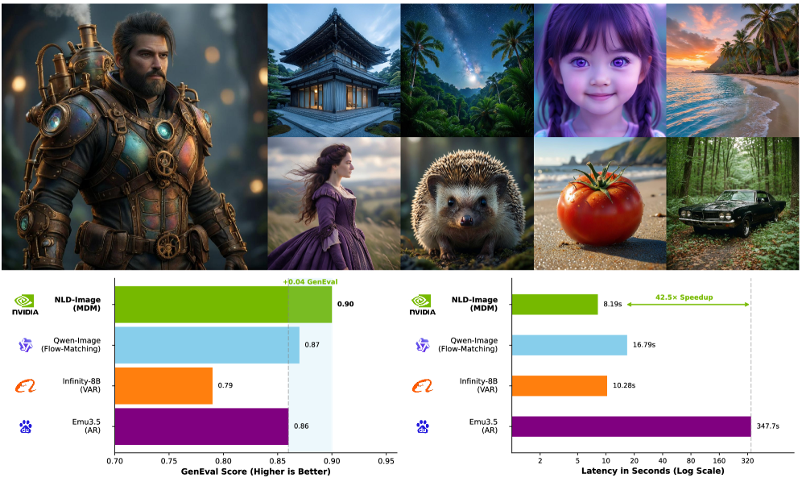

### TL;DR

Masked discrete diffusion (MDM) has been held back by two structural issues: no self-correction (unmasked tokens can't be revised) and per-token training-signal sparsity when the discrete vocab is large. NLD-Image fixes both — a token-editing mechanism for revising already-unmasked tokens during inference, and a Grouped Cross-Entropy (GCE) objective that spreads positive signal to embedding-space neighbors.

### Key idea

(1) *Token editing*: extend the MDM decoding loop with a revise-then-refine step so decoded tokens aren't frozen — closer to how continuous diffusion refines an entire latent. (2) *Grouped Cross-Entropy*: assign positive gradient to the ground-truth token *and* its embedding-space neighbors, densifying the per-token signal in large-vocabulary regimes. (3) Custom fused GCE operator for VRAM efficiency.

### Main finding

**0.90 on GenEval, 86.9 on DPG, 10.76 HPSv3** — SOTA-class for MDM image generation, with substantially better training efficiency at large vocab sizes.

### Why it matters

Masked discrete diffusion has been the "almost-good-enough" cousin of continuous diffusion for text-to-image. The two fixes here (editing + GCE) address the specific mechanistic gaps and land competitive numbers, making MDM a serious contender again — with the advantage of the discrete-token substrate that composes cleanly with autoregressive multimodal LMs.

### Knowledge graph integration

**Builds on / relates to existing pages:**
- [../multimodal/README.md](../multimodal/README.md) — text-to-image / multimodal generation cluster.

**Suggested new pages:**
- `multimodal/_diffusion.md` *(taxonomy)* — continuous vs discrete vs masked-discrete diffusion for generative modeling.
- `multimodal/masked-discrete-diffusion.md` *(depth)* — the MDM formulation, token-editing, and GCE.

---

## 13. SharpMoE: Saliency-Harnessing Accurate Routing for Diffusion MoE

**Authors:** Keyu Yan, Chaojie Mao, Xiang Wang, Yu Liu, Changxin Gao, Nong Sang — *Huazhong University of Science and Technology · Tongyi Lab, Alibaba*
**Links:** [arXiv:2606.26938](https://arxiv.org/abs/2606.26938) · [HF](https://huggingface.co/papers/2606.26938) · [AlphaXiv](https://www.alphaxiv.org/abs/2606.26938)
**Topics:** `diffusion`, `MoE`, `architectures`

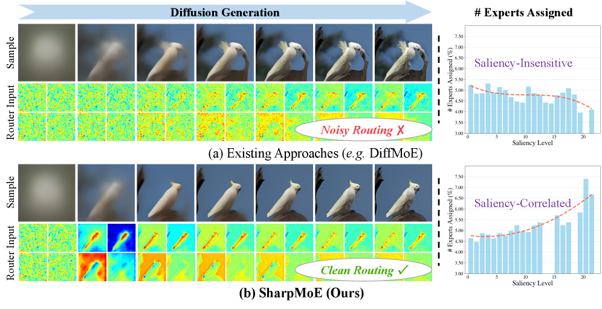

### TL;DR

Diffusion MoEs route on noisy latents — which obscures which tokens are actually salient. SharpMoE routes on *clean* latent features (as a guidance signal) so the router can identify high-saliency tokens even in high-noise timesteps, and adds a *trajectory routing loss* that constrains compute allocation over the full denoising rollout.

### Key idea

(1) Feed the router a noise-free signal (clean latent) as *guidance* for routing decisions — the noisy latent still flows through the experts, but the routing gate looks at the clean version to spot salient tokens. (2) A trajectory routing loss enforces consistent compute allocation across denoising steps, rather than allowing each step to route independently. Plug-and-play on pretrained diffusion MoEs (post-training only).

### Main finding

SOTA on the paper's visual-generation evals as a plug-and-play post-training patch to converged MoE image models.

### Why it matters

Diffusion MoEs have been growing in scale (see Focusing-MoE, DiT-MoE variants). The saliency-routing insight generalizes: any time the router sees a noisy proxy of the "true" content, feeding it a cleaner side-channel is worth trying. For LLMs, the analogue is routing on pre-noise embeddings or on a lighter oracle model.

### Knowledge graph integration

**Builds on / relates to existing pages:**
- [../architectures/_moe.md](../architectures/_moe.md) — MoE taxonomy; SharpMoE is a routing variant for diffusion.
- [../architectures/load-balancing-loss.md](../architectures/load-balancing-loss.md) — trajectory routing loss is an aux-loss variant.
- [../multimodal/README.md](../multimodal/README.md) — diffusion image generation cluster.

**Suggested new pages:**
- `architectures/diffusion-moe-routing.md` *(depth)* — clean-latent guidance + trajectory routing loss.

---

## 14. Video-MME-Logical: A Controlled Diagnostic Benchmark for Video Temporal-Logical Reasoning

**Authors:** Hohin Kwan, Hongyu Li, Ray Zhang, Manyuan Zhang, Xianghao Kong, Anyi Rao, Jiahao Xie, Si Liu — *HKUST · Beihang · CUHK*
**Links:** [arXiv:2606.27828](https://arxiv.org/abs/2606.27828) · [HF](https://huggingface.co/papers/2606.27828) · [AlphaXiv](https://www.alphaxiv.org/abs/2606.27828)
**Topics:** `eval`, `multimodal`, `reasoning`

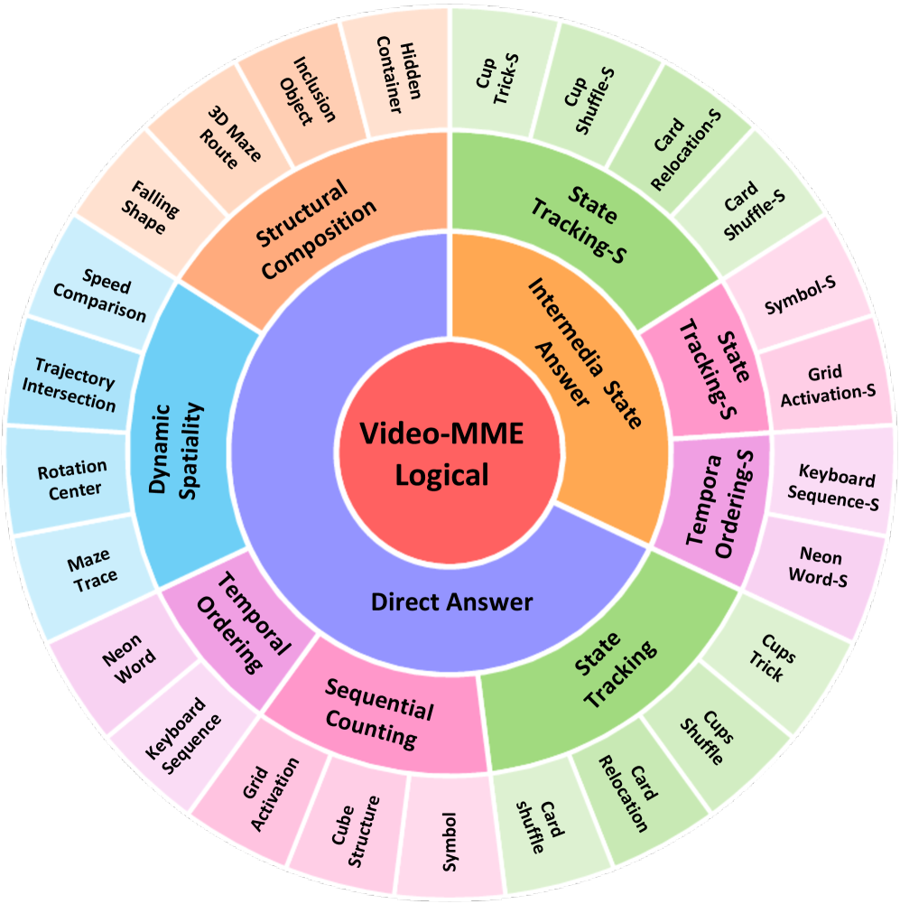

### TL;DR

Existing video benchmarks conflate temporal-logical reasoning with scene complexity or static recognition. Video-MME-Logical isolates the reasoning capability with five controlled temporal-logical operations — state tracking, sequential counting, temporal ordering, dynamic spatiality, structural composition — across 25 fine-grained task categories with controlled difficulty knobs.

### Key idea

Generate video clips with *controlled* object states, transitions, temporal dependencies, and logical compositions so difficulty can be varied independently of visual complexity. Grade the final answer *and* verify the model's intermediate logical trace — the same shape as PRM-style evaluation, adapted for video.

### Main finding

Frontier MLLMs show a large human-model gap that widens with temporal-logical complexity. SFT on up to **500K generated samples** narrows but doesn't close the gap — pointing to a reasoning bottleneck beyond scale-of-supervision.

### Why it matters

Isolates a *specific* video reasoning skill from scene difficulty, so ablations can attribute gains to reasoning training vs vision-encoder scaling. Sits in the same lineage as MATH-500 and AIME for math — controlled, diagnostic, extensible.

### Knowledge graph integration

**Builds on / relates to existing pages:**
- [../evaluation/README.md](../evaluation/README.md) — MLLM evaluation cluster.
- [../multimodal/README.md](../multimodal/README.md) — video-VLM surface.
- [../post-training/reasoning/prm.md](../post-training/reasoning/prm.md) — intermediate-trace verification borrows PRM logic.

**Suggested new pages:**
- `evaluation/video-mme-logical.md` *(depth)* — the controlled diagnostic benchmark for video temporal reasoning.

---

## Notes

- Borderline inclusions are flagged in-section with an italic *Borderline: …* note. None in this batch — the filter fit was clean.
- Hero figures live in `assets/2026-06-30/`. All 14 figures downloaded from arXiv HTML.
- This digest is informational. No existing concept files, `READING-LIST.md`, or `PAPERS.md` were modified to produce it.
