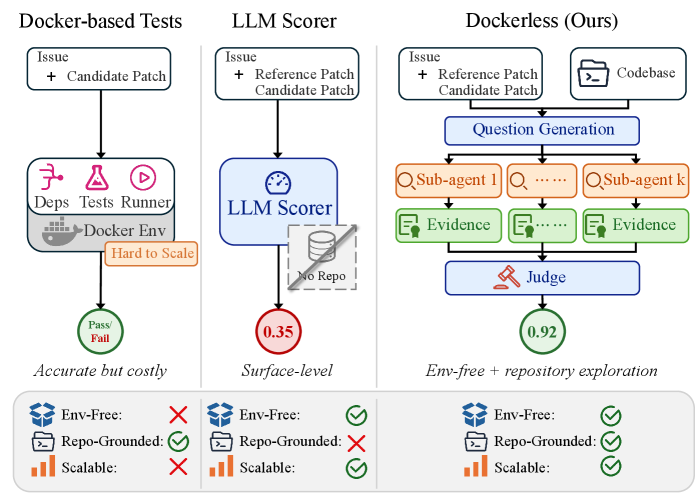
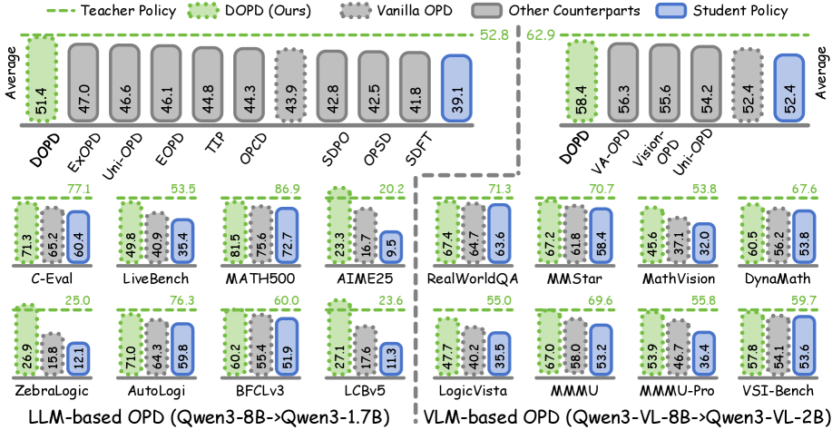
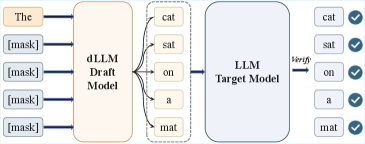
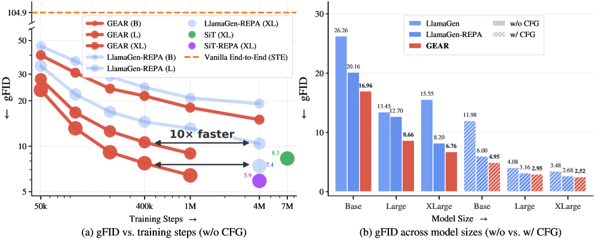
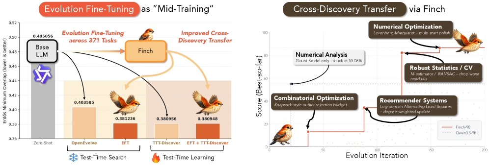
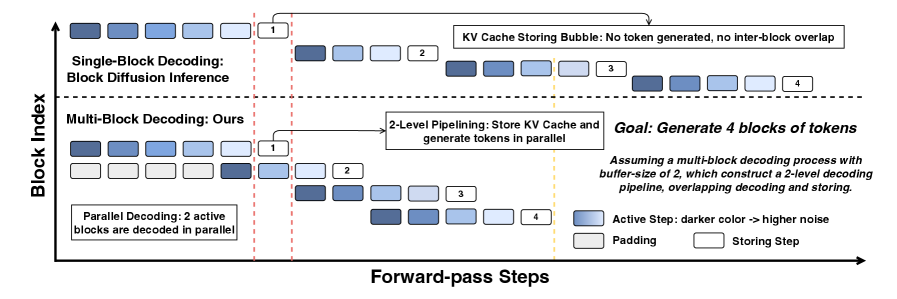
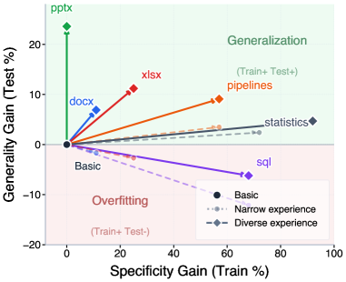
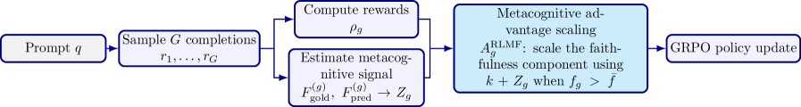
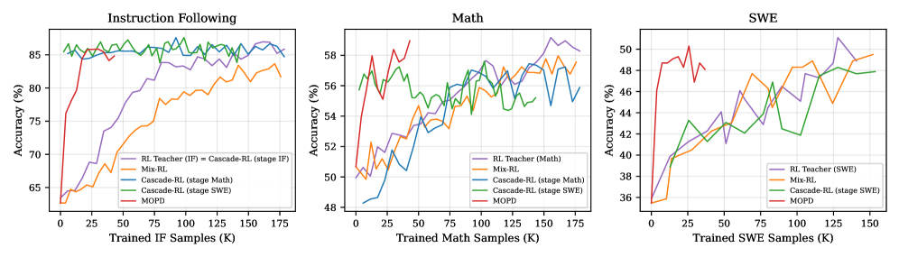

# Daily AI papers — 2026-07-01

*Curated from HF Daily Papers. 15 of ~37 papers kept after relevance filter.*

## Papers at a glance

| # | Title | Topics | Org |
| --- | --- | --- | --- |
| 1 | [Orca: The World is in Your Mind](#1-orca) | `multimodal`, `world-model`, `VLA` | BAAI |
| 2 | [Dockerless: Environment-Free Program Verifier for Coding Agents](#2-dockerless) | `agents`, `RL`, `eval` | (unspecified) |
| 3 | [DOPD: Dual On-policy Distillation](#3-dopd) | `post-training`, `distillation`, `multimodal` | NUS / CUHK / PKU / JD |
| 4 | [BlockPilot: Instance-Adaptive Policy Learning for Diffusion-based Speculative Decoding](#4-blockpilot) | `efficient-inference`, `diffusion`, `speculative-decoding` | Alibaba AMAP |
| 5 | [Does VLA Even Know the Basics? Measuring Commonsense and World Knowledge Retention in VLA Models](#5-vla-basics) | `multimodal`, `VLA`, `eval` | HSE / MISIS / MSU |
| 6 | [GEAR: Guided End-to-End AutoRegression for Image Synthesis](#6-gear) | `diffusion`, `AR`, `tokenizer` | PKU / Tencent Hunyuan |
| 7 | [Evolution Fine-Tuning: Learning to Discover Across 371 Optimization Tasks](#7-evolution-fine-tuning) | `fine-tuning`, `agents`, `mid-training` | UMinn / CMU / KAIST |
| 8 | [Multi-Block Diffusion Language Models](#8-multi-block-diffusion-lm) | `diffusion`, `LLM`, `efficient-inference` | SJTU / Huawei |
| 9 | [Managing Procedural Memory in LLM Agents (AFTER)](#9-procedural-memory-after) | `agents`, `eval` | (unspecified) |
| 10 | [RL with Metacognitive Feedback Elicits Faithful Uncertainty Expression](#10-rlmf) | `RL`, `safety`, `LLM` | Yale / Google |
| 11 | [Are We Measuring Strategy or Phrasing? Diversity in LLM Math Reasoning](#11-approach-level-diversity) | `reasoning`, `RL`, `eval` | Seoul National U. |
| 12 | [RedVox: Safety and Fairness Gaps in Speech Models Across Languages](#12-redvox) | `safety`, `multimodal`, `eval` | Fondazione Bruno Kessler |
| 13 | [Xiaomi-GUI-0 Technical Report](#13-xiaomi-gui-0) | `agents`, `multimodal`, `case-study` | Xiaomi |
| 14 | [TRIAGE: Role-Typed Credit Assignment for Agentic RL](#14-triage) | `agents`, `RL`, `credit-assignment` | LinkedIn / Harvard / JHU |
| 15 | [MOPD: Multi-Teacher On-Policy Distillation for Capability Integration in LLM Post-Training](#15-mopd) | `post-training`, `distillation`, `RL` | PKU / LLM Core |

---

## 1. Orca

**Authors:** Yihao Wang, Yuheng Ji, Mingyu Cao, Yanqing Shen, Runze Xiao, et al. — *BAAI (Beijing Academy of AI)*
**Links:** [arXiv:2606.30534](https://arxiv.org/abs/2606.30534) · [HF](https://huggingface.co/papers/2606.30534) · [AlphaXiv](https://www.alphaxiv.org/abs/2606.30534)
**Topics:** `multimodal`, `world-model`, `VLA`

### TL;DR

Orca is BAAI's first stab at a general "world foundation model" — one backbone trained to model next-state transitions instead of next-token, next-frame, or next-action prediction. After pre-training on 125K hours of video plus 160M event annotations, a single frozen latent supports three readouts (text, image prediction, embodied action) via lightweight modality-specific decoders.

### Key idea

Reframe generative pretraining as **Next-State-Prediction (NSP)**: a unified state-transition objective that consumes multimodal signals and exposes a shared latent space. Training combines *unconscious* learning (dense continuous-video transitions) with *conscious* learning (sparse language-described events + VQA supervision), so the model learns both the fine-grained physics of scenes and the abstract semantics of events.

### Main finding

The frozen Orca latent beats similarly sized specialist baselines across text generation, image prediction, and embodied action generation with only small trainable decoders. The authors report scaling gains: stronger latents translate to stronger downstream readouts across all three modalities.

### Why it matters

If world-latent pretraining scales in a way that transfers to VLA-style embodied control *and* language, it competes directly with the current "VLM backbone + action head" recipe (Qwen-VLA, RT-2 lineage). BAAI is staking out "next-state" as an alternative to next-token as the dominant self-supervised signal for multimodal + embodied agents.

### Knowledge graph integration

**Builds on / relates to existing pages:**
- [../multimodal/README.md](../multimodal/README.md) — proposes a unified multimodal pretraining objective distinct from projection-layer VLMs.
- [../case-studies/README.md](../case-studies/README.md) — first-of-its-kind end-to-end system worth eventually documenting.

**Suggested new pages:**
- `multimodal/next-state-prediction.md` *(depth)* — the NSP objective as an alternative to NTP for world/multimodal pretraining.
- `case-studies/orca.md` *(case study)* — full breakdown once training/eval details are public.

---

## 2. Dockerless

**Authors:** Not disclosed on the HF page. — *(unspecified)*
**Links:** [arXiv:2606.28436](https://arxiv.org/abs/2606.28436) · [HF](https://huggingface.co/papers/2606.28436) · [AlphaXiv](https://www.alphaxiv.org/abs/2606.28436)
**Topics:** `agents`, `RL`, `eval`

### TL;DR

Dockerless is an *environment-free* verifier for code-agent training: instead of spinning up a per-repo Docker image and running unit tests, an LLM agent explores the repo and judges whether a candidate patch is correct. Used as both the SFT trajectory filter and the RL reward, it enables a fully container-free post-training pipeline for SWE-agent style models.

### Key idea

Frame patch verification as an *agentic classification* task: the verifier reads the patch, walks the repository (opening files, tracing definitions), and outputs a correctness verdict grounded in the evidence it collects. Because there is no execution, there is no per-repo environment setup — the same verifier scales across the whole SWE-bench multiverse.

### Main finding

On a verifier-quality benchmark, Dockerless beats the strongest open-source execution-based verifier by **14.3 AUC points**. Using it end-to-end in post-training (SFT filter + RL reward) yields a model at **62.0% / 50.0% / 35.2%** resolve rate on SWE-bench Verified / Multilingual / Pro — matching Docker-based post-training and beating the Qwen3.5-9B baseline by 2.4 / 8.7 / 2.9 points.

### Why it matters

SWE-agent post-training has been bottlenecked on the cost of maintaining per-repo Docker environments — a real ops nightmare that limits scaling to niche repos and languages. If a purely agentic verifier can match execution-based rewards, RL-for-code can scale much wider (including languages with no ecosystem-mature CI images).

### Knowledge graph integration

**Builds on / relates to existing pages:**
- [../post-training/rlvr.md](../post-training/rlvr.md) — Dockerless is the RLVR reward source, without needing to execute anything.
- [../post-training/rejection-sampling.md](../post-training/rejection-sampling.md) — SFT trajectory filtering is a rejection-sampling stage that this verifier scores.
- [../evaluation/livecodebench.md](../evaluation/livecodebench.md) — related to code-eval infra; this replaces execution with an agentic judge.
- [../agents/README.md](../agents/README.md) — verifier is itself an LLM agent, exploring repos to gather evidence.

**Suggested new pages:**
- `evaluation/execution-free-code-verifier.md` *(depth)* — the Dockerless recipe as a verifier class.
- `post-training/reasoning/agentic-reward-model.md` *(depth)* — agent-as-judge rewards for code and long-horizon tasks.

---

## 3. DOPD

**Authors:** Gen Li, Qingyi Si, Guibin Zhang, Yuqi Xu, Congcong Wang, et al. — *NUS / MMLab-CUHK / PKU / JD Explore Academy*
**Links:** [arXiv:2606.30626](https://arxiv.org/abs/2606.30626) · [HF](https://huggingface.co/papers/2606.30626) · [AlphaXiv](https://www.alphaxiv.org/abs/2606.30626)
**Topics:** `post-training`, `distillation`, `multimodal`

### TL;DR

On-policy distillation supervises student-sampled trajectories with teacher token logits. DOPD isolates a failure mode the authors call *privilege illusion* — when the teacher sees privileged inputs the student can't, the student mimics without ever closing the capability gap — and fixes it by dynamically routing each token to either a privileged-teacher or privileged-student head based on an advantage gap and probability ratio.

### Key idea

Two policies, one student: a **privileged teacher** (sees ground truth, retrieval, tool output) and a **privileged student** (sees its own extra context). At every token, compute the advantage gap and relative probability, and pick which head supervises: strong signal from the teacher where the capability gap is real, from the student where the gap is information-only. This turns token-level supervision from "always the teacher" into an advantage-aware router.

### Main finding

DOPD beats Vanilla OPD and other baselines across LLM and VLM settings, with additional wins on stability, robustness, continual learning, and out-of-distribution generalization. The gains are strongest exactly where privilege illusion would bite hardest — tasks with heavy retrieval or grounded context.

### Why it matters

On-policy distillation is one of the more efficient bridges from a huge teacher to a smaller deployable student, but privileged inputs (RAG, tools, gold answers) muddle the training signal. DOPD gives a principled way to keep the density of token-level supervision without silently teaching the student to fake capability it doesn't have.

### Knowledge graph integration

**Builds on / relates to existing pages:**
- [../post-training/_post-training.md](../post-training/_post-training.md) — new capability-transfer paradigm to slot into the post-training map.
- [../post-training/_rl.md](../post-training/_rl.md) — advantage-based routing borrows the RL advantage machinery.
- [../post-training/rejection-sampling.md](../post-training/rejection-sampling.md) — token-selective supervision is a granular cousin of rejection sampling.

**Suggested new pages:**
- `post-training/on-policy-distillation.md` *(depth)* — covers Vanilla OPD and DOPD's advantage-aware variant.
- `post-training/_distillation.md` *(taxonomy)* — off-policy / on-policy / dual on-policy / multi-teacher (see MOPD in this digest).

---

## 4. BlockPilot

**Authors:** Hao Zhang, Yiming Hu, Yong Wang, Mingqiao Mo, Xin Xiao, Xiangxiang Chu — *AMAP, Alibaba Group*
**Links:** [arXiv:2606.31315](https://arxiv.org/abs/2606.31315) · [HF](https://huggingface.co/papers/2606.31315) · [AlphaXiv](https://www.alphaxiv.org/abs/2606.31315)
**Topics:** `efficient-inference`, `diffusion`, `speculative-decoding`

### TL;DR

Diffusion-based speculative decoders draft multiple tokens per forward pass with a block-diffusion model, then verify with the target. Existing work uses a *fixed* block size. BlockPilot argues that per-sample the optimal block size varies a lot, so it trains a tiny policy head to predict the right block size from the prefilling representation — a one-shot decision that plugs into any diffusion-based draft.

### Key idea

Treat block-size selection as a **lightweight per-instance policy learning** problem. From the prefill hidden state, the policy predicts the optimal block size once, then decoding runs with that value. The search space is small and locally structured (concentrated around the training block size), which is why a lightweight predictor is enough.

### Main finding

Plug-and-play across diffusion-draft speculative decoding backends. On Qwen3-4B at T=1, BlockPilot reaches an **average acceptance length of 5.92** and a **4.20× speedup**, with minimal overhead from the policy head.

### Why it matters

Speculative decoding is the workhorse for cheap LLM serving, and diffusion-based drafters have been the SOTA recipe. This paper shows a large chunk of the gap between "current SOTA" and "oracle policy" comes from per-sample block-size adaptation — a very cheap trick to add.

### Knowledge graph integration

**Builds on / relates to existing pages:**
- [../inference/README.md](../inference/README.md) — speculative-decoding families overview.
- [../systems/partial-rollouts.md](../systems/partial-rollouts.md) — related "drafter has variable output size" pattern in async RL.
- [../architectures/_moe.md](../architectures/_moe.md) — same flavor as gating: predict-once, decode-with-config.

**Suggested new pages:**
- `inference/diffusion-speculative-decoding.md` *(depth)* — block-diffusion draft + AR verify.
- `inference/adaptive-block-size.md` *(depth)* — the BlockPilot per-instance policy trick.
- `inference/_speculative-decoding.md` *(taxonomy)* — draft-model, EAGLE, Medusa, diffusion-draft, self-speculative.

---

## 5. Does VLA Even Know the Basics?

**Authors:** Nikita Kachaev, Andrey Moskalenko, Matvey Skripkin, et al. — *CogAI Lab / FusionBrain / HSE University / NUST MISIS / MSU*
**Links:** [arXiv:2606.19297](https://arxiv.org/abs/2606.19297) · [HF](https://huggingface.co/papers/2606.19297) · [AlphaXiv](https://www.alphaxiv.org/abs/2606.19297)
**Topics:** `multimodal`, `VLA`, `eval`

### TL;DR

Vision-Language-Action models are typically obtained by fine-tuning powerful VLMs on robot data — but how much of the VLM's commonsense and world knowledge survives that fine-tune? Act2Answer is a lightweight benchmark that turns VLM knowledge questions into short tabletop episodes where the robot answers by placing an object, isolating knowledge from low-level control.

### Key idea

**Act through the answer.** Each knowledge question is instantiated as an environment where candidate answers are physical objects on a table. The VLA succeeds only if it picks up (or places) the correct one. Combined with **layerwise intent probing** that localizes answer-relevant information across the VLM backbone and the action head, this cleanly separates "does the VLA know the fact" from "can the VLA execute the pick".

### Main finding

Across **7 VLA models and 9 VLM baselines**: VLAs handle simple concepts but lose ground on richer semantic categories relative to their source VLMs. **VQA co-training** during VLA fine-tuning correlates with better knowledge retention. Probing shows answer-relevant signal peaks in middle VLA layers and attenuates in upper layers — evidence that the action head is squeezing out world knowledge.

### Why it matters

Every VLA lab claims their model "preserves" the VLM's knowledge; this is the first benchmark that lets you *measure* that claim rather than assert it. The layerwise probing pattern (middle-layer peak, upper-layer attenuation) also gives a concrete lever — add VQA co-training or freeze upper layers — for future VLA recipes.

### Knowledge graph integration

**Builds on / relates to existing pages:**
- [../multimodal/README.md](../multimodal/README.md) — VLA is the action-generating branch of the multimodal family.
- [../evaluation/README.md](../evaluation/README.md) — Act2Answer is a novel evaluation protocol worth categorizing.
- [../interpretability/README.md](../interpretability/README.md) — layerwise probing is the interp side of the paper.

**Suggested new pages:**
- `evaluation/act2answer.md` *(depth)* — answer-through-action VLA knowledge benchmark.
- `multimodal/vla-vqa-cotraining.md` *(depth)* — knowledge-retention trick for VLA fine-tuning.

---

## 6. GEAR

**Authors:** Bin Lin, Zheyuan Liu, Chenguo Lin, Sixiang Chen, Yunyang Ge, et al. — *Peking University / Tencent Hunyuan*
**Links:** [arXiv:2606.32039](https://arxiv.org/abs/2606.32039) · [HF](https://huggingface.co/papers/2606.32039) · [AlphaXiv](https://www.alphaxiv.org/abs/2606.32039)
**Topics:** `diffusion`, `AR`, `tokenizer`

### TL;DR

Visual AR models train a tokenizer first (frozen), then an AR generator on the discrete indices — leaving the tokenizer blind to what the generator finds easy to predict. GEAR trains both **end-to-end with a dual read-out**: a hard one-hot branch trains the AR with next-token prediction, and a differentiable soft branch carries a representation-alignment loss back to guide *only* the tokenizer, sidestepping the VQ non-differentiability.

### Key idea

**Dual read-out of the codebook assignment.** The hard branch preserves AR next-token training. The soft branch (differentiable) uses representation alignment (DINOv2-style) as a gradient path that flows *only* into the tokenizer. As training progresses the tokenizer's own features become less DINOv2-like while the AR's features become more so — the opposite of diffusion-side recipes that make the latent semantic. The alignment burden shifts from tokenizer to AR.

### Main finding

On ImageNet, GEAR speeds up gFID convergence **up to 10×** relative to a strong LlamaGen-REPA baseline. Better patch-level and spatially-coherent features, generalizes across quantizers (VQVAE, LFQ, IBQ) and to text-to-image.

### Why it matters

Autoregressive image generation is having a resurgence (LlamaGen, Emu3, Chameleon), but "the tokenizer is frozen and the AR does everything" is a known bottleneck. GEAR's dual-branch trick makes joint training tractable despite the VQ discreteness — a general recipe potentially transferable to any AR-over-discrete-latent setup, including audio and video.

### Knowledge graph integration

**Builds on / relates to existing pages:**
- [../fundamentals/_tokenization.md](../fundamentals/_tokenization.md) — image tokenization as the analogue of BPE for generative modeling.
- [../multimodal/README.md](../multimodal/README.md) — AR-over-VQ is one of the dominant multimodal generation families.

**Suggested new pages:**
- `multimodal/vq-ar-joint-training.md` *(depth)* — GEAR's dual read-out for end-to-end tokenizer + AR training.
- `fundamentals/straight-through-estimator.md` *(depth)* — the STE and why it collapses for AR-over-VQ.

---

## 7. Evolution Fine-Tuning

**Authors:** Seungone Kim, Minki Kang, Alistair Cheong, Zerui Chen, Seungho Han, Taehee Jung, Dongyeop Kang — *UMinn / CMU / KAIST / Cambridge / Hanyang / Amazon*
**Links:** [arXiv:2606.29082](https://arxiv.org/abs/2606.29082) · [HF](https://huggingface.co/papers/2606.29082) · [AlphaXiv](https://www.alphaxiv.org/abs/2606.29082)
**Topics:** `fine-tuning`, `agents`, `mid-training`

### TL;DR

LLM-driven evolutionary search (FunSearch, AlphaEvolve) has hit strong results on optimization tasks — but every new problem starts from scratch, with the "evolution logic" living in the scaffold. Evolution Fine-Tuning (EFT) is a mid-training paradigm that converts evolutionary search *trajectories* into supervision, teaching the LLM itself to know which parts to mutate, when to backtrack, and how to iterate.

### Key idea

Treat the tree of candidate solutions produced during evolutionary search as a **training corpus of successful mutations**. Fine-tune (mid-train) an LLM on these evolution trajectories across 371 optimization tasks, so the model internalizes cross-task evolutionary skill rather than relying on the scaffold to drive it. The scaffold gets simpler; the model gets smarter.

### Main finding

Trained across 371 tasks and evaluated cross-task, EFT models improve solution-discovery capability broadly (paper reports SOTA-style closures on some previously scaffold-heavy problems; exact numbers depend on the task suite and appear in the paper).

### Why it matters

If evolutionary search is going to keep producing breakthroughs (GPU kernels, conjecture-solving), the "smart" part shouldn't have to live in a task-specific scaffold. EFT is a first attempt to package that capability into the model weights — a *mid-training* recipe that treats search itself as a skill to be learned rather than orchestrated.

### Knowledge graph integration

**Builds on / relates to existing pages:**
- [../pre-training/mid-training.md](../pre-training/mid-training.md) — EFT is explicitly a mid-training paradigm.
- [../post-training/fine-tuning/README.md](../post-training/fine-tuning/README.md) — task-scale fine-tuning transferring across tasks.
- [../agents/README.md](../agents/README.md) — LLM-in-the-loop evolutionary search as an agent scaffold.

**Suggested new pages:**
- `pre-training/evolution-fine-tuning.md` *(depth)* — training on evolutionary-search trajectories.
- `agents/llm-evolutionary-search.md` *(depth)* — the FunSearch / AlphaEvolve scaffold shape.

---

## 8. Multi-Block Diffusion Language Models

**Authors:** Yijie Jin, Jiajun Xu, Yuxuan Liu, Chenkai Xu, Yi Tu, Jiajun Li, Dandan Tu, Xiaohui Yan, Kai Yu, Pengfei Liu, Zhijie Deng — *Shanghai Jiao Tong University / Xi'an Jiao Tong / Huawei*
**Links:** [arXiv:2606.29215](https://arxiv.org/abs/2606.29215) · [HF](https://huggingface.co/papers/2606.29215) · [AlphaXiv](https://www.alphaxiv.org/abs/2606.29215)
**Topics:** `diffusion`, `LLM`, `efficient-inference`

### TL;DR

Block Diffusion LMs (BD-LMs like LLaDA2) already speed up decoding via KV caching and flexible-length generation. Multi-Block Diffusion extends this to decode several consecutive noisy blocks *concurrently* — but the standard training regimes don't match the multi-block inference distribution. MBD-LMs add Multi-block Teacher Forcing plus a Block Buffer decoder to close that gap with real wall-clock speedups.

### Key idea

**MultiTF training + Block Buffer inference.** MultiTF trains on bounded noise-groups conditioned on clean prefixes with randomized noise schedulers, so the model sees the same heterogeneous slot-wise noise it will see at inference. The Block Buffer keeps input shapes static and preserves prefix-cache reuse, so more parallelism actually translates to more tokens-per-second.

### Main finding

**MBD-LLaDA2-Mini** raises average tokens-per-forward from **3.47 → 6.19** and average accuracy from **79.95% → 81.03%**. Combined with DMax, it reaches **9.34 TPF** at a 1.02% accuracy drop on math and code benchmarks.

### Why it matters

Diffusion LMs have been the "AR alternative" thread that keeps showing latency wins without matching AR on generation quality. MBD-LMs push the parallelism knob further while keeping accuracy — one of the strongest recent arguments that diffusion decoding may actually be a competitive default for latency-sensitive LLM serving.

### Knowledge graph integration

**Builds on / relates to existing pages:**
- [../inference/README.md](../inference/README.md) — diffusion LM decoding sits with paged attention / speculative decoding as a serving-efficiency family.
- [../pre-training/mtp.md](../pre-training/mtp.md) — MTP is the AR analogue of "predict multiple tokens per forward".

**Suggested new pages:**
- `inference/block-diffusion-lm.md` *(depth)* — the LLaDA2 / MBD-LM block-diffusion inference stack.
- `pre-training/multi-block-teacher-forcing.md` *(depth)* — MultiTF training objective.

---

## 9. Managing Procedural Memory in LLM Agents (AFTER)

**Authors:** Julia Belikova, Rauf Parchiev, Evgeny Egorov, Grigorii Davydenko, Gleb Gusev, Andrey Savchenko, Maksim Makarenko — *(affiliations unspecified)*
**Links:** [arXiv:2606.23127](https://arxiv.org/abs/2606.23127) · [HF](https://huggingface.co/papers/2606.23127) · [AlphaXiv](https://www.alphaxiv.org/abs/2606.23127)
**Topics:** `agents`, `eval`

### TL;DR

Procedural memory (a growing store of learned "skills" or "workflows") is being bolted onto LLM agents everywhere — but it's rarely evaluated systematically. AFTER is a 382-task enterprise benchmark spanning 6 professional roles and 22 procedural skills, with controlled settings for local improvement, cross-task, cross-role, and cross-model generalization.

### Key idea

Enterprise tasks are a natural crucible for procedural memory because they are **recurring, role-typed, and multi-step**. AFTER fixes the framework: for each of the 22 skills, provide a suite of tasks where an agent can (a) refine a stored skill locally, (b) apply it to a new task in the same role, (c) transfer it across roles, and (d) reuse it across model backbones.

### Main finding

A single refinement round yields **+3.7 to +6.7 aggregate points**. Skills evolved from **diverse multi-model traces** reach **73.1% cross-model test accuracy**, beating single-model trace sources. Some skills generalize broadly; others become role-specific and lose transfer.

### Why it matters

"Give the agent a skill library" is the current dominant lever for open-ended enterprise deployments, but nobody agrees on how to build or grade one. AFTER's cross-model result — that heterogeneous execution traces make better skills — is a concrete design pointer for skill-library construction pipelines.

### Knowledge graph integration

**Builds on / relates to existing pages:**
- [../agents/README.md](../agents/README.md) — procedural memory sits with tool-use and multi-turn as an agent-shaping mechanism.
- [../evaluation/README.md](../evaluation/README.md) — new agent benchmark to catalog.

**Suggested new pages:**
- `agents/procedural-memory.md` *(depth)* — the skill-library-for-agents pattern.
- `evaluation/after-benchmark.md` *(depth)* — the AFTER task suite.

---

## 10. RLMF

**Authors:** Gabrielle Kaili-May Liu, Avi Caciularu, Gal Yona, Idan Szpektor, Arman Cohan — *Yale University / Google Research*
**Links:** [arXiv:2606.32032](https://arxiv.org/abs/2606.32032) · [HF](https://huggingface.co/papers/2606.32032) · [AlphaXiv](https://www.alphaxiv.org/abs/2606.32032)
**Topics:** `RL`, `safety`, `LLM`

### TL;DR

LLMs hallucinate with high confidence and fail to recognize their own knowledge limits. RLMF (RL with Metacognitive Feedback) uses the model's **self-judgments about its own performance** as a signal for preference optimization and for training data selection, then decouples this into faithful calibration of internal confidence and natural-language uncertainty expression.

### Key idea

Two novel mechanisms: (1) **RLMF** — during preference optimization, refine completion rankings using the model's own quality judgments; (2) **Metacognitive data selection** — use those self-judgments to identify high-value training examples, beating naive active learning. Both are applied in a two-stage decoupled pipeline: calibrate confidence scores first, then map to context-adaptive linguistic uncertainty via targeted output editing.

### Main finding

RLMF achieves **SOTA on faithful calibration** across diverse tasks while preserving accuracy, and beats standard RL by **up to 63%**. Models also become better at judging and expressing their own capability limits.

### Why it matters

Calibration and uncertainty expression are the connective tissue between "the model knows things" and "the deployer can trust the model." Extracting the RL reward from the model's own metacognitive judgments (instead of a separate reward model) sidesteps the reward-model bottleneck that limits RLHF quality — and is compatible with any base LLM.

### Knowledge graph integration

**Builds on / relates to existing pages:**
- [../post-training/dpo.md](../post-training/dpo.md) — preference optimization is the substrate RLMF modifies.
- [../post-training/_rewards.md](../post-training/_rewards.md) — model-self-judgment is a novel reward source.
- [../post-training/rlvr.md](../post-training/rlvr.md) — RLMF is verifier-style, but with the model as its own verifier.
- [../safety/cot-monitoring.md](../safety/cot-monitoring.md) — related: monitor the model's own signals to guide behavior.

**Suggested new pages:**
- `post-training/rlmf.md` *(depth)* — RL with metacognitive-feedback rewards.
- `safety/faithful-calibration.md` *(depth)* — expressed vs intrinsic uncertainty alignment.

---

## 11. Approach-Level Diversity in Math Reasoning

**Authors:** Sangmook Lee, Minbeom Kim, Jeonghye Kim, Dohyung Kim, Sojeong Rhee, Kyomin Jung — *Seoul National University*
**Links:** [arXiv:2606.29985](https://arxiv.org/abs/2606.29985) · [HF](https://huggingface.co/papers/2606.29985) · [AlphaXiv](https://www.alphaxiv.org/abs/2606.29985)
**Topics:** `reasoning`, `RL`, `eval`

### TL;DR

Common LLM "diversity" metrics (BLEU-diff, self-BLEU, sentence-embedding variance) mostly capture surface phrasing, not the underlying solution strategy. This paper introduces **approach-level diversity** — variation in *how* problems are solved — and shows that popular diversity-aware RLVR methods preserve surface metrics while approach-level diversity actually collapses.

### Key idea

Use a **human-calibrated LLM-judge** to classify whether two correct solutions to the same problem use *different strategies* (e.g., algebraic vs geometric vs combinatorial), then measure diversity at that level. Compare against surface metrics under RLVR training that "optimizes for diversity" — the two signals diverge sharply.

### Main finding

Prior diversity measures are unreliable proxies for strategy-level variation. Diversity-aware RLVR **preserves target metrics but reduces approach diversity**. Approach-diverse candidate sets improve test-time scaling (best-of-N). Directly optimizing an LLM-judge diversity reward causes reward hacking of judge-specific preferences rather than genuine broadening of strategies.

### Why it matters

Test-time scaling and RL exploration both hinge on generating *strategically diverse* candidates. If our diversity metrics measure the wrong thing, we've been optimizing for the wrong signal. Naming approach-level diversity as the target reframes a big chunk of the "explore more" agenda in reasoning RL.

### Knowledge graph integration

**Builds on / relates to existing pages:**
- [../post-training/rlvr.md](../post-training/rlvr.md) — the RLVR pipelines whose diversity claims this paper challenges.
- [../post-training/grpo.md](../post-training/grpo.md) — group-relative RL relies on candidate diversity.
- [../post-training/reasoning/long-cot-rl.md](../post-training/reasoning/long-cot-rl.md) — long-CoT training critically depends on exploration.
- [../evaluation/math500.md](../evaluation/math500.md) — evaluation substrate for math-reasoning diversity claims.

**Suggested new pages:**
- `evaluation/approach-level-diversity.md` *(depth)* — the LLM-judge diversity protocol.
- `post-training/reasoning/exploration-in-reasoning-rl.md` *(depth)* — surface vs strategy diversity in reasoning RL.

---

## 12. RedVox

**Authors:** Beatrice Savoldi, Sara Papi, Wafa Aissa, Matteo Negri, Luisa Bentivogli — *Fondazione Bruno Kessler, Italy*
**Links:** [arXiv:2606.26968](https://arxiv.org/abs/2606.26968) · [HF](https://huggingface.co/papers/2606.26968) · [AlphaXiv](https://www.alphaxiv.org/abs/2606.26968)
**Topics:** `safety`, `multimodal`, `eval`

### TL;DR

Only 8% of state-of-the-art speech-model releases report *any* multilingual safety analysis. RedVox is a naturalistic multilingual safety-and-fairness benchmark for audio + speech models: real voices, five languages (EN/FR/IT/ES/DE), unsafe and stereotypical requests, and a survey of participants on the ethics of collecting the corpus.

### Key idea

**Real voices, non-adversarial prompts, cross-lingual.** Rather than synthetic adversarial audio, use human recordings of realistic unsafe or biased requests. Each request has a text-only counterpart, exposing the "spoken vs written" gap in refusal behavior.

### Main finding

Across 8 SOTA speech models: vulnerabilities persist even under non-adversarial conditions, worsen in non-English languages, and are **amplified when the request comes from spoken input** (spoken > written). The participant survey exposes privacy/consent challenges specific to speech-safety corpora.

### Why it matters

Speech-first assistants (voice interfaces, real-time translation, on-device audio agents) are proliferating, but safety evals still lag behind text. RedVox is a concrete "you have to test this before shipping" benchmark for that class of models, plus a documented process for building such corpora responsibly.

### Knowledge graph integration

**Builds on / relates to existing pages:**
- [../safety/_jailbreaks.md](../safety/_jailbreaks.md) — speech-modality attacks belong in the jailbreak taxonomy.
- [../safety/low-resource-language-jailbreak.md](../safety/low-resource-language-jailbreak.md) — related "non-English amplifies unsafe outputs" finding.
- [../safety/README.md](../safety/README.md) — audio-safety evals slot into safety more broadly.

**Suggested new pages:**
- `safety/multilingual-speech-safety.md` *(depth)* — the audio-safety gap across languages.
- `evaluation/redvox.md` *(depth)* — the RedVox benchmark.

---

## 13. Xiaomi-GUI-0 Technical Report

**Authors:** Wanxia Cao, Chengzhen Duan, Pei Fu, Pengzhi Gao, Niu Lian, Fazhan Liu, Hui Liu, Heng Qu, Qinzhuo Wu, Zhehao Yu et al. — *Xiaomi*
**Links:** [arXiv:2606.31410](https://arxiv.org/abs/2606.31410) · [HF](https://huggingface.co/papers/2606.31410) · [AlphaXiv](https://www.alphaxiv.org/abs/2606.31410)
**Topics:** `agents`, `multimodal`, `case-study`

### TL;DR

Xiaomi's first native multimodal GUI agent trained end-to-end in real device environments. The paper positions itself as a technical report: architecture + training + evaluation of the released model, targeting on-device Android GUI control at scale.

### Key idea

Rather than benchmark-based training (screenshots + synthetic tap actions), Xiaomi-GUI-0 uses **real-device environments** in-the-loop, coupling the VLM backbone to actual Android surfaces during training. The report claims the resulting policy is more stable across device drift than benchmark-trained baselines.

### Main finding

Superior performance and stability vs benchmark-trained approaches. The abstract on HF is truncated; full numbers (task success, latency, model size) live in the arXiv PDF and project page.

### Why it matters

On-device GUI agents are becoming a shipping consumer product (Xiaomi HyperOS, Apple Intelligence, Google Astra). Xiaomi releasing a tech report tied to a shipping-scale device fleet is one of the first end-to-end GUI-agent recipes with a claimed real-device training loop. Candidate for a Phase-3 case study once the full report is parsed.

### Knowledge graph integration

**Builds on / relates to existing pages:**
- [../agents/README.md](../agents/README.md) — GUI agents are the "computer/phone use" branch of agents.
- [../multimodal/README.md](../multimodal/README.md) — VLM-backboned agents.
- [../case-studies/README.md](../case-studies/README.md) — candidate case study.

**Suggested new pages:**
- `case-studies/xiaomi-gui-0.md` *(case study)* — full breakdown, if the tech report has enough training-recipe detail.
- `agents/gui-agent.md` *(depth)* — native GUI agent training in real environments.

---

## 14. TRIAGE

**Authors:** Yuanda Xu, Zhengze Zhou, Hejian Sang, Xiaomin Li, Jiaxin Zhang, Xinchen Du, Zhipeng Wang, Alborz Geramifard — *LinkedIn Corporation / Harvard / Johns Hopkins*
**Links:** [arXiv:2606.32017](https://arxiv.org/abs/2606.32017) · [HF](https://huggingface.co/papers/2606.32017) · [AlphaXiv](https://www.alphaxiv.org/abs/2606.32017)
**Topics:** `agents`, `RL`, `credit-assignment`

### TL;DR

Standard agentic RL broadcasts a single outcome-level advantage across every action token, which fails to credit useful exploration inside a losing trajectory and reinforces regressive actions inside a winning one. TRIAGE tags every segment with one of four **role types** — decisive progress, useful exploration, no-progress infrastructure, regression — and applies role-specific credit rules on top of the outcome signal.

### Key idea

**Role-typed credit.** After classifying segments into the four roles (via a lightweight tagger), assign bounded, role-conditioned process rewards that layer on top of the outcome reward without overriding it. Theoretical result: role-conditioned credit is the *optimal* correction expressible from role labels alone (i.e., any finer-grained correction requires strictly more information).

### Main finding

Consistent improvements over GRPO on ALFWorld, Search-QA, and WebShop, with additional efficiency gains in trajectory length. The claim is that fixing credit assignment along the semantic axis (not just the temporal one) is what unlocks the gains.

### Why it matters

Long-horizon agentic RL has been bottlenecked by extremely sparse outcome rewards. TRIAGE's role classification is a lightweight process-reward that doesn't require an oracle PRM — it plugs into any GRPO-family recipe and matches the "segment-level" granularity most agent trajectories already produce.

### Knowledge graph integration

**Builds on / relates to existing pages:**
- [../post-training/grpo.md](../post-training/grpo.md) — TRIAGE is a GRPO-family modification.
- [../post-training/_rewards.md](../post-training/_rewards.md) — bounded segment-level process rewards.
- [../post-training/reasoning/prm.md](../post-training/reasoning/prm.md) — process-reward model class; TRIAGE is a cheap variant.
- [../agents/README.md](../agents/README.md) — long-horizon agent RL substrate.

**Suggested new pages:**
- `post-training/reasoning/role-typed-credit.md` *(depth)* — TRIAGE's four-role scheme for credit assignment.
- `agents/agentic-rl-credit-assignment.md` *(depth)* — the class of "how to credit intermediate actions in agent RL".

---

## 15. MOPD

**Authors:** Wenhan Ma, Jianyu Wei, Liang Zhao, Hailin Zhang, Bangjun Xiao, Lei Li, Qibin Yang, Bofei Gao, Yudong Wang, Rang Li, Jinhao Dong, Zhifang Sui, Fuli Luo — *Peking University / LLM Core*
**Links:** [arXiv:2606.30406](https://arxiv.org/abs/2606.30406) · [HF](https://huggingface.co/papers/2606.30406) · [AlphaXiv](https://www.alphaxiv.org/abs/2606.30406)
**Topics:** `post-training`, `distillation`, `RL`

### TL;DR

Integrating multiple capabilities (math, code, reasoning, tool use) into a single post-trained LLM has historically meant Mix-RL (mix all domains and RL together — noisy) or Off-Policy Fine-tune (train on frozen teacher rollouts — inefficient). MOPD trains one specialized RL teacher per domain, then **distills all of them into the student on the student's own rollouts** with dense token-level supervision.

### Key idea

Two-stage recipe: (1) per-domain RL specialists, (2) on-policy distillation from all teachers into the student. Because the student runs its own rollouts and each teacher provides token-level supervision on those trajectories, exposure bias disappears and the training signal is dense. Domains stay **decoupled** during teacher training, so labs can develop domain teachers in parallel and integrate at the end.

### Main finding

On Qwen3-30B-A3B, MOPD beats Mix-RL, Cascade RL, Off-Policy Fine-tune, and Param-Merge baselines, **inheriting nearly all of each teacher's capability**. Already deployed in the post-training of **MiMo-V2-Flash**, an industrial-scale frontier model.

### Why it matters

The current pain of frontier post-training is cross-domain coupling: adding math RL degrades code performance, adding safety RL degrades reasoning. MOPD's decoupling is a real workflow unlock — domain teams ship their teacher, integration team runs on-policy distillation once. Related to and cross-linked with DOPD (paper #3) in this same digest.

### Knowledge graph integration

**Builds on / relates to existing pages:**
- [../post-training/_post-training.md](../post-training/_post-training.md) — new integration recipe for the post-training taxonomy.
- [../post-training/_rl.md](../post-training/_rl.md) — per-domain RL specialists feed the distillation.
- [../post-training/rejection-sampling.md](../post-training/rejection-sampling.md) — related off-policy trajectory-filter recipe MOPD replaces.
- [../pre-training/model-souping.md](../pre-training/model-souping.md) — Param-Merge baseline MOPD outperforms.

**Suggested new pages:**
- `post-training/multi-teacher-on-policy-distillation.md` *(depth)* — the MOPD recipe.
- `post-training/_distillation.md` *(taxonomy)* — off-policy / on-policy / dual / multi-teacher (shared with DOPD above).

---

## Notes

- Borderline inclusions are flagged in-section with an italic *Borderline: …* note. This digest kept 15 of ~37 fetched papers.
- Hero figures live in `assets/2026-07-01/`. Missing figures: 2606.19297, 2606.29985, 2606.31410, 2606.32017 (arXiv HTML `/x1.png` returned a placeholder page, no HF `og:image` available).
- This digest is informational. No existing concept files, `READING-LIST.md`, or `PAPERS.md` were modified to produce it.
- Two closely related distillation papers in this digest (DOPD, MOPD) suggest a `post-training/_distillation.md` taxonomy file is now overdue.
