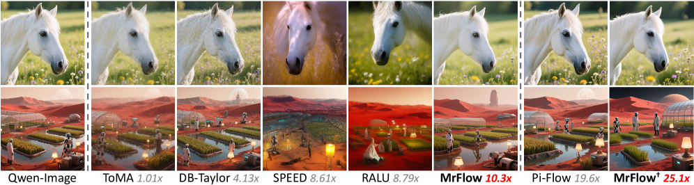
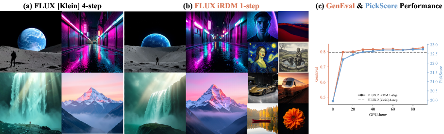
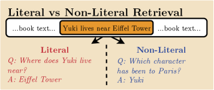
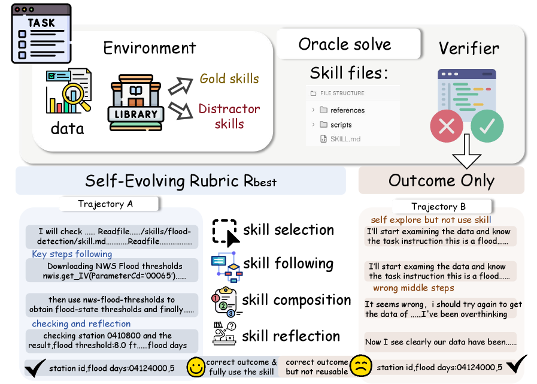
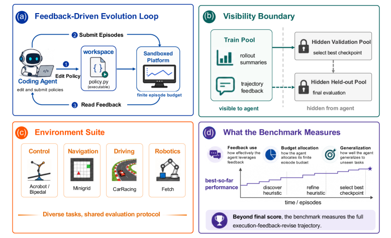
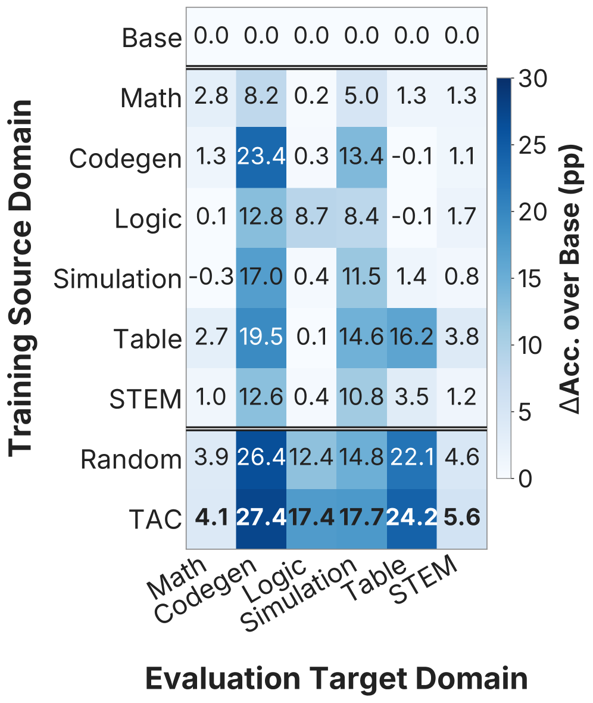

# Daily AI papers — 2026-07-03

*Curated from HF Daily Papers. 15 of 27 papers kept after relevance filter.*

## Papers at a glance

| # | Title | Topics | Org |
| --- | --- | --- | --- |
| 1 | [Program-as-Weights: A Programming Paradigm for Fuzzy Functions](#1-program-as-weights) | `LLM`, `efficient-inference`, `distillation` | Waterloo / Cornell / Harvard |
| 2 | [FlashMorph: Morphing into Hybrid Attention Models](#2-flashmorph) | `architectures`, `long-context`, `linear-attention` | Fudan / ByteDance Seed / CUHK |
| 3 | [MrFlow: Multi-Resolution Flow Matching for Training-Free Diffusion Acceleration](#3-mrflow) | `diffusion`, `efficient-inference`, `flow-matching` | Beihang / ICT-CAS / ETH |
| 4 | [iRDM: Representation Distribution Matching for One-Step Visual Generation](#4-irdm) | `diffusion`, `distillation`, `eval` | EPFL / Valeo.ai |
| 5 | [WorldDirector: Controllable World Simulators with Persistent Dynamic Memory](#5-worlddirector) | `multimodal`, `video`, `agents` | HKUST / Ant Group |
| 6 | [Distribution-wise Rewards for Visual Generative Models](#6-distribution-wise-rewards) | `diffusion`, `RL`, `rewards` | (unspecified) |
| 7 | [LOCOS: Logit-Contribution Scoring Identifies Non-Literal Retrieval Heads](#7-locos) | `interp`, `long-context` | Edinburgh / Heriot-Watt |
| 8 | [AutoMem: Automated Learning of Memory as a Cognitive Skill](#8-automem) | `agents`, `RL`, `memory` | (unspecified) |
| 9 | [AgenticSTS: A Bounded-Memory Testbed for Long-Horizon LLM Agents](#9-agenticsts) | `agents`, `eval`, `memory` | Alaya Studio |
| 10 | [SkillCoach: Self-Evolving Rubrics for Agentic Skill-Use](#10-skillcoach) | `agents`, `eval`, `rewards` | HKUST-GZ / JD.COM |
| 11 | [EvoPolicyGym: Evaluating Autonomous Policy Evolution](#11-evopolicygym) | `agents`, `eval`, `RL` | USTC / CUHK / SJTU / others |
| 12 | [MRPO: Step-Aware RL for Medical Multimodal Reasoning](#12-mrpo) | `RL`, `reasoning`, `multimodal` | Korea U. / Upstage AI |
| 13 | [TAP: Task-Agnostic Pretraining for VLAs](#13-tap) | `multimodal`, `VLA`, `pre-training` | Fudan / SII |
| 14 | [Denser ≠ Better: Limits of On-Policy Self-Distillation](#14-denser-neq-better) | `post-training`, `distillation`, `RL` | (unspecified) |
| 15 | [TAC: Transfer-Aware Curriculum for Multi-Domain RLVR](#15-tac) | `RL`, `RLVR`, `reasoning` | Toronto / Vector / CMU / Princeton / MPI |

---

## 1. Program-as-Weights: A Programming Paradigm for Fuzzy Functions

**Authors:** Wentao Zhang, Liliana Hotsko, Woojeong Kim, Pengyu Nie, Stuart Shieber, Yuntian Deng — *University of Waterloo / Cornell / Harvard*
**Links:** [arXiv:2607.02512](https://arxiv.org/abs/2607.02512) · [HF](https://huggingface.co/papers/2607.02512) · [AlphaXiv](https://www.alphaxiv.org/abs/2607.02512)
**Topics:** `LLM`, `efficient-inference`, `distillation`

### TL;DR

Rather than prompt a giant model at inference time, this paper compiles a natural-language *specification* of a "fuzzy function" into a small set of neural weights that a tiny interpreter model can execute locally. A 4B compiler produces PAW artifacts that a 0.6B Qwen3 interpreter runs at 30 tok/s on a MacBook M3, matching direct prompting of Qwen3-32B on the same tasks.

### Key idea

Program-as-Weights (PAW): a compiler LLM (4B) takes an NL task spec and emits a compact weight patch; a fixed small interpreter (0.6B Qwen3) executes the patch. Training data comes from *FuzzyBench*, a new 10M-example dataset of NL-spec → target-behavior pairs. The result is a *cacheable*, portable program artifact — you pay compile cost once and reuse at deployment.

### Main finding

The 0.6B interpreter + PAW artifact matches direct prompting of Qwen3-32B on FuzzyBench-style tasks while using ~1/50 the inference memory and running at 30 tok/s on consumer hardware.

### Why it matters

Frames "prompt engineering" as compilation: the prompt is amortized into weights that a small model can reuse. It's a plausible route to on-device task specialization without RLHF or per-task fine-tuning, and echoes the older idea of hypernetworks / prompt-to-weight distillation at frontier-model scale.

### Knowledge graph integration

**Builds on / relates to existing pages:**
- [../post-training/fine-tuning/README.md](../post-training/fine-tuning/README.md) — a sibling to per-task LoRA: both compress a specification into low-cost weight edits.
- [../case-studies/qwen2-5.md](../case-studies/qwen2-5.md) — uses Qwen3 as its interpreter backbone.

**Suggested new pages:**
- `post-training/fine-tuning/program-as-weights.md` *(depth)* — cover the compile-to-weights paradigm and how it differs from LoRA/prompt tuning.

---

## 2. FlashMorph: Morphing into Hybrid Attention Models

**Authors:** (author list not published on HF card) — *Fudan University / ByteDance Seed / CUHK*
**Links:** [arXiv:2606.30562](https://arxiv.org/abs/2606.30562) · [HF](https://huggingface.co/papers/2606.30562) · [AlphaXiv](https://www.alphaxiv.org/abs/2606.30562)
**Topics:** `architectures`, `long-context`, `linear-attention`

### TL;DR

Turning a Transformer into a *hybrid* attention model — where some layers keep full softmax attention and others swap to linear attention — is a common recipe for long-context efficiency, but the choice of *which* layers to convert is often ad-hoc. FlashMorph frames it as a budget-constrained optimization: attach learnable gates to every layer, jointly train them on synthetic retrieval data, and read out which layers must remain full-attention.

### Key idea

Morphable Transformer: each layer is a gated mix of full and linear attention. Given a compute budget (e.g. "keep k full-attention layers"), optimize the gates on a retrieval-heavy synthetic corpus so the top-k emergent layers are exactly the ones that need full attention. Solves the "which layers to convert" problem cheaply.

### Main finding

Reaches the previous hybrid-conversion quality using **20M tokens vs. 234M** for the prior baseline — an order-of-magnitude reduction in the fine-tuning corpus required to hybridize a Transformer.

### Why it matters

Hybrid attention is one of the main paths to O(n) long-context serving. The bottleneck has shifted from *whether* to convert to *how cheaply* to identify the layers that must stay quadratic. FlashMorph pushes that cost down enough that hybridization becomes practical as a post-hoc conversion step.

### Knowledge graph integration

**Builds on / relates to existing pages:**
- [../architectures/multi-head-attention.md](../architectures/multi-head-attention.md) — the full-attention layers preserved by FlashMorph.
- [../architectures/mla.md](../architectures/mla.md) — orthogonal attention-cost reduction; the two could be stacked.
- [../fundamentals/attention.md](../fundamentals/attention.md) — background for what full vs. linear attention compute.

**Suggested new pages:**
- `architectures/_attention-variants.md` *(taxonomy)* — a home for full / linear / hybrid / MLA / GQA.
- `architectures/hybrid-attention.md` *(depth)* — cover the conversion recipe class (FlashMorph and predecessors).

---

## 3. MrFlow: Multi-Resolution Flow Matching for Training-Free Diffusion Acceleration

**Authors:** Xingyu Zheng, Xianglong Liu, Yifu Ding, Weilun Feng, Junqing Lin, Jinyang Guo, Haotong Qin — *Beihang / ICT-CAS / USTC / ETH Zürich*
**Links:** [arXiv:2607.01642](https://arxiv.org/abs/2607.01642) · [HF](https://huggingface.co/papers/2607.01642) · [AlphaXiv](https://www.alphaxiv.org/abs/2607.01642)
**Topics:** `diffusion`, `efficient-inference`, `flow-matching`

### TL;DR

MrFlow accelerates flow-matching text-to-image models (FLUX.1-dev, Qwen-Image) *without any training* by staging generation across resolutions: draft the structure at low resolution, super-resolve in pixel space with a small GAN, re-noise, then refine at high resolution.

### Key idea

Instead of upsampling in the latent space (which blurs), MrFlow (a) generates the main structure at low resolution, (b) super-resolves in pixel space via a pretrained GAN, (c) injects low-strength noise so high-frequency detail can be *resampled* rather than upsampled, (d) refines a few final steps at full resolution.

### Main finding

**10× end-to-end wall-clock speedup** on FLUX.1-dev and Qwen-Image while staying within 1% on the OneIG benchmark. Composes with step distillation for **up to 25× total speedup**. No training, no dynamic region identification.

### Why it matters

Training-free acceleration is portable: any released flow-matching model gets 10× serving throughput for free. The staged low→high recipe is a general-purpose lever that composes with orthogonal tricks (step distillation, feature caching).

### Knowledge graph integration

**Builds on / relates to existing pages:**
- (no existing diffusion pages in the graph yet — this paper flags the gap)

**Suggested new pages:**
- `multimodal/_diffusion-acceleration.md` *(taxonomy)* — home for step distillation, feature caching, multi-resolution.
- `multimodal/mrflow.md` *(depth)* — the specific staged low→high recipe.

---

## 4. iRDM: Representation Distribution Matching for One-Step Visual Generation

**Authors:** Lan Feng, Wuyang Li, Éloi Zablocki, Matthieu Cord, Alexandre Alahi — *EPFL / Valeo.ai / Sorbonne*
**Links:** [arXiv:2607.02375](https://arxiv.org/abs/2607.02375) · [HF](https://huggingface.co/papers/2607.02375) · [AlphaXiv](https://www.alphaxiv.org/abs/2607.02375)
**Topics:** `diffusion`, `distillation`, `eval`

### TL;DR

A careful design-space study of Representation Distribution Matching — training a one-step image generator by matching feature-space distributions under frozen encoders. The classical MMD loss, once dismissed as insufficient, becomes state-of-the-art once you estimate it with large batches and match against a *battery* of encoders instead of one.

### Key idea

Two design axes: (i) how distributions are compared (MMD wins if the batch is large enough — >2048 generated samples per step), (ii) which representations they are compared in (a single encoder gets gamed; use a balanced battery). Evaluate with SW_r^14 — a Sliced-Wasserstein distance over 14 encoders disjoint from training — to prevent overfitting the loss.

### Main finding

iRDM sets a new one-step-generation SOTA on ImageNet (SW_r^14 1.30) and PickScore rates it above the previous best on 71.2% of matched samples. Post-training FLUX.2 [klein] into a one-step generator surpasses the 4-step version on GenEval (0.826 vs 0.794) in **90 H200 GPU-hours**.

### Why it matters

Distills a multi-step diffusion into a single step without the score-distillation / consistency-model machinery, and does it cheaply. The "battery of encoders + Sliced-Wasserstein for eval" pattern is a general recipe for training-loss-vs-eval-loss decoupling.

### Knowledge graph integration

**Suggested new pages:**
- `multimodal/representation-distribution-matching.md` *(depth)* — the one-step RDM/iRDM recipe.
- `evaluation/sliced-wasserstein-eval.md` *(depth)* — using a held-out encoder battery as a gaming-resistant generative-model metric.

---

## 5. WorldDirector: Controllable World Simulators with Persistent Dynamic Memory

**Authors:** Hanlin Wang, Hao Ouyang, Qiuyu Wang, Wen Wang, Qingyan Bai, Ka Leong Cheng, Yue Yu, Yixuan Li, Yihao Meng, Zichen Liu, Yanhong Zeng, Yujun Shen, Qifeng Chen — *HKUST / Ant Group / ZJU / CUHK*
**Links:** [arXiv:2607.02517](https://arxiv.org/abs/2607.02517) · [HF](https://huggingface.co/papers/2607.02517) · [AlphaXiv](https://www.alphaxiv.org/abs/2607.02517)
**Topics:** `multimodal`, `video`, `agents`

### TL;DR

WorldDirector separates *what should happen* from *what it should look like* in a video world model: an LLM plans 3D object trajectories and camera moves; a video generator renders them. Objects retain identity even after long absences from frame because the LLM keeps their state in symbolic memory, not in pixels.

### Key idea

Decouple **semantic motion orchestration** (LLM-controlled 3D trajectories + camera) from **visual rendering** (video model). The LLM's persistent object memory becomes the physical logic that a pure pixel model can't maintain; the video model just renders whatever trajectories it's handed.

### Main finding

Qualitatively demonstrates that objects re-entering the scene after prolonged occlusion keep their exact identity, and that the resulting videos support arbitrary viewpoint exploration — behaviors current end-to-end video world models fail at.

### Why it matters

Signals a divide-of-labor between planners and renderers for world models — much like the LLM+image-generator split for text-to-image. If controllable long-horizon video needs a symbolic memory, this is the shape it might take.

### Knowledge graph integration

**Builds on / relates to existing pages:**
- [../multimodal/README.md](../multimodal/README.md) — sits at the boundary of video generation and agentic planning.

**Suggested new pages:**
- `multimodal/world-models.md` *(depth)* — video world models with decoupled semantic + visual state.

---

## 6. Optimizing Visual Generative Models via Distribution-wise Rewards

**Authors:** (author list not published on HF card)
**Links:** [arXiv:2607.02291](https://arxiv.org/abs/2607.02291) · [HF](https://huggingface.co/papers/2607.02291) · [AlphaXiv](https://www.alphaxiv.org/abs/2607.02291)
**Topics:** `diffusion`, `RL`, `rewards`

### TL;DR

RL fine-tuning of image generators usually scores each sample individually — that's exactly the recipe for reward hacking and mode collapse. This paper switches to a *distribution-wise* reward: the reward function sees a batch of generations against a reference distribution and rewards the batch as a whole.

### Key idea

Replace per-sample reward `r(x)` with a distribution-level score that measures how well the generated batch matches the real data distribution. To make it cheap, use a **subset-replace** trick: keep a large reference set and only re-score the swapped-in generated fraction. Also RL over post-hoc **model-merging coefficients** to sidestep SDE train/inference mismatch.

### Main finding

FID-50K improves from **8.30 → 5.77 on SiT** and **3.74 → 3.52 on EDM2**, with qualitative diversity preserved.

### Why it matters

Distribution-level rewards are the natural fix for the reward-hacking + diversity-collapse pathology that dogs sample-wise RL for generative models. The subset-replace estimator makes them affordable at fine-tuning scale.

### Knowledge graph integration

**Builds on / relates to existing pages:**
- [../post-training/_rewards.md](../post-training/_rewards.md) — this is a distribution-space reward variant; belongs in the rewards taxonomy.
- [../post-training/grpo.md](../post-training/grpo.md) · [../post-training/ppo.md](../post-training/ppo.md) — background RL algorithms whose reward assumptions this paper challenges.

**Suggested new pages:**
- `post-training/distribution-wise-rewards.md` *(depth)* — the batch-level reward + subset-replace estimator.

---

## 7. LOCOS: Logit-Contribution Scoring Identifies Non-Literal Retrieval Heads

**Authors:** Aryo Pradipta Gema, Beatrice Alex, Pasquale Minervini — *University of Edinburgh / Heriot-Watt*
**Links:** [arXiv:2607.01002](https://arxiv.org/abs/2607.01002) · [HF](https://huggingface.co/papers/2607.01002) · [AlphaXiv](https://www.alphaxiv.org/abs/2607.01002)
**Topics:** `interp`, `long-context`

### TL;DR

Prior "retrieval-head" detectors reward attention heads whose *attended token* matches the *generated token* — great for copying, blind to *paraphrasing*. LOCOS scores heads by the projection of their OV-circuit output onto the answer-token unembedding direction, so it catches heads that *write* the answer even when they *read* from a semantically-related but different span.

### Key idea

Write-aware detector: for each head, contrast its OV-circuit's logit contribution on needle vs. off-needle source positions. A single forward pass gives a ranking of "non-literal retrieval heads" that literal-copy detectors miss.

### Main finding

On the NoLiMa non-literal retrieval benchmark, ablating the top 50 LOCOS heads on **Qwen3-8B** drops ROUGE-L from 0.401 to **0.000** while the best prior detector still retains 0.292. Ablation drops MuSiQue from 0.55 → 0.08 and BABILong from 0.62 → 0.20; parametric recall and arithmetic are unaffected — so the heads are retrieval-specific.

### Why it matters

Long-context reasoning depends on paraphrastic retrieval, and mechanistic-interp tools have been implicitly restricted to copying behaviors. LOCOS opens the door to interpreting *what a model synthesizes* from context, not just what it points at.

### Knowledge graph integration

**Builds on / relates to existing pages:**
- [../interpretability/README.md](../interpretability/README.md) — this is the interpretability folder's first concrete method contribution.
- [../fundamentals/attention.md](../fundamentals/attention.md) — attention/OV circuit background.

**Suggested new pages:**
- `interpretability/retrieval-heads.md` *(depth)* — the concept of a "retrieval head" and the write-aware LOCOS detector.

---

## 8. AutoMem: Automated Learning of Memory as a Cognitive Skill

**Authors:** (author list not published on HF card)
**Links:** [arXiv:2607.01224](https://arxiv.org/abs/2607.01224) · [HF](https://huggingface.co/papers/2607.01224) · [AlphaXiv](https://www.alphaxiv.org/abs/2607.01224)
**Topics:** `agents`, `RL`, `memory`

### TL;DR

Treats agent memory as a **learnable skill** rather than an externally-designed system: filesystem operations (read / write / list files) are promoted to first-class actions, and both the *memory schema* and the *policy* over memory actions are optimized in twin loops. On procedurally-generated long-horizon games it makes a 32B open model competitive with Claude Opus 4.5 and Gemini 3.1 Pro Thinking.

### Key idea

Two-loop optimization: (1) a strong LLM reviews entire agent trajectories and *rewrites the memory structure* (prompts, file schemas, action vocabulary); (2) the agent's own good memory decisions become training data to fine-tune the model's memory *proficiency* directly.

### Main finding

Optimizing memory only, without touching task-action behavior, improves the base agent's success **~2×–4×** on Crafter, MiniHack, and NetHack.

### Why it matters

Memory-augmented agents have historically hand-tuned schemas per task. If both the schema *and* the model's use of it can be learned end-to-end, small open agents can compete with frontier models on tasks where memory dominates.

### Knowledge graph integration

**Builds on / relates to existing pages:**
- [../agents/README.md](../agents/README.md) — first concrete depth candidate for the agents folder.
- [../post-training/rejection-sampling.md](../post-training/rejection-sampling.md) — the "good decisions become training signal" step is rejection-sampling flavor.

**Suggested new pages:**
- `agents/memory-as-skill.md` *(depth)* — cover AutoMem-style trainable memory.

---

## 9. AgenticSTS: A Bounded-Memory Testbed for Long-Horizon LLM Agents

**Authors:** Xiangchen Cheng, Yunwei Jiang, Jianwen Sun, Zizhen Li, Chuanhao Li, Xiangcheng Cao, Yihao Liu, Fanrui Zhang, Li Jin, Kaipeng Zhang — *Alaya Studio / AlayaLab*
**Links:** [arXiv:2607.02255](https://arxiv.org/abs/2607.02255) · [HF](https://huggingface.co/papers/2607.02255) · [AlphaXiv](https://www.alphaxiv.org/abs/2607.02255)
**Topics:** `agents`, `eval`, `memory`

### TL;DR

Companion to AutoMem in spirit: a testbed that enforces a **bounded memory contract** — every agent step is a fresh prompt assembled via *typed retrieval*, with no raw cross-decision transcript appended. Makes each memory component's contribution measurable in isolation.

### Key idea

A minimal "contract" abstraction: memories are typed retrievals (episodic, factual, plan, tool-result) that get assembled per-step. Contrast with the default "append everything" contract, which turns memory into an unsplittable mixture.

### Why it matters

Provides an evaluation setting where the effect of *one* memory design choice can be measured without leakage from prior turns' raw context — a prerequisite for scientifically comparing memory schemes.

### Knowledge graph integration

**Suggested new pages:**
- `evaluation/agenticsts.md` *(depth)* — the bounded-memory testbed.

---

## 10. SkillCoach: Self-Evolving Rubrics for Evaluating and Enhancing Agentic Skill-Use

**Authors:** Jiayin Zhu, Yutao Yue, et al. — *HKUST(GZ) / JD.COM / JITRI*
**Links:** [arXiv:2607.01874](https://arxiv.org/abs/2607.01874) · [HF](https://huggingface.co/papers/2607.01874) · [AlphaXiv](https://www.alphaxiv.org/abs/2607.01874)
**Topics:** `agents`, `eval`, `rewards`

### TL;DR

"Skills" (reusable SOPs, tool workflows, validation routines) are becoming a first-class layer for agents, and overlap between skills makes reliable use hard to grade. SkillCoach scores trajectories on four rubric axes — **selection, following, composition, grounded reflection** — and the rubrics themselves evolve from observed failures.

### Key idea

A self-evolving rubric framework: separate *process quality* from *task success*, evaluate along four axes, then feed the rubrics back as supervision to filter which trajectories become RL/SFT training data.

### Why it matters

Skill libraries are becoming as important as tools for real agent deployments. SkillCoach is a candidate reward model for post-training agentic skill-use — the same role reward models play for math/code reasoning.

### Knowledge graph integration

**Builds on / relates to existing pages:**
- [../post-training/_rewards.md](../post-training/_rewards.md) — process-level rubrics are a reward-model class.
- [../post-training/reasoning/prm.md](../post-training/reasoning/prm.md) — sibling to process reward models for reasoning.

**Suggested new pages:**
- `evaluation/skill-use-rubrics.md` *(depth)* — four-axis skill-use rubric for agents.

---

## 11. EvoPolicyGym: Evaluating Autonomous Policy Evolution in Interactive Environments

**Authors:** Zhilin Wang, Han Song, Runzhe Zhan, Jusen Du, Jiacheng Chen, Tianle Li, Qingyu Yin, Yulun Wu, Zhennan Shen, Tong Zhu, Yanshu Li, Guanjie Chen, Derek F. Wong, Yafu Li, Yu Cheng, Yang Yang — *USTC / CUHK / U. Macau / Tsinghua / SJTU / others*
**Links:** [arXiv:2607.02440](https://arxiv.org/abs/2607.02440) · [HF](https://huggingface.co/papers/2607.02440) · [AlphaXiv](https://www.alphaxiv.org/abs/2607.02440)
**Topics:** `agents`, `eval`, `RL`

### TL;DR

Autonomous Policy Evolution as a controlled evaluation: a harness-model agent iteratively edits an executable policy under a fixed interaction budget, and the benchmark scores the *evolution* rather than the final answer. Separates policy improvement from open-ended software-engineering progress.

### Key idea

Isolate the "learn by editing your own policy" loop into a controlled harness with fixed budget, deterministic scoring, and no confounding SWE tasks — so different self-improvement strategies can be compared apples-to-apples.

### Why it matters

Agents that self-edit are an increasing pattern (e.g. self-taught improvers, prompt evolution). Existing evals collapse them to a final score. EvoPolicyGym is the kind of infrastructure that lets us actually measure whether these loops improve, and how fast.

### Knowledge graph integration

**Suggested new pages:**
- `evaluation/evopolicygym.md` *(depth)* — the policy-evolution benchmark and its scoring.

---

## 12. MRPO: Breaking Failure Cascades — Step-Aware RL for Medical Multimodal Reasoning

**Authors:** Junha Jung, Minbyul Jeong, Suhyeon Lim, Sungwook Jung, Jaehoon Yun, Taeyun Roh, Mujeen Sung, Jaewoo Kang — *Korea University / Upstage AI / Kyung Hee U. / KAIST / AIGEN*
**Links:** [arXiv:2606.31825](https://arxiv.org/abs/2606.31825) · [HF](https://huggingface.co/papers/2606.31825) · [AlphaXiv](https://www.alphaxiv.org/abs/2606.31825)
**Topics:** `RL`, `reasoning`, `multimodal`

*Borderline: framed as medical VQA, but the RL algorithm (step-weighted GRPO) generalizes.*

### TL;DR

Sparse outcome-only rewards let early reasoning errors cascade unnoticed. MRPO is a GRPO variant that assigns **exponentially larger penalties to earlier tokens** on failed trajectories — the earlier the wrong step, the sharper the penalty. Breaks failure cascades without touching successful paths.

### Key idea

Position-weighted advantage in GRPO: on negative-reward trajectories, upweight the credit assigned to *early* tokens exponentially. Positive trajectories are left alone. Approximates a cheap step-wise process reward without needing a PRM.

### Main finding

Reduces early-stage reasoning failures **64.0% → 13.0%** on medical VQA. On Qwen3-VL-8B-Instruct it surpasses the 34B medical baseline HuatuoGPT-Vision by 2.79 points, and beats vanilla GRPO consistently across three MLLM backbones.

### Why it matters

Sparse-reward long-CoT RL routinely wastes gradient on tokens that were fine but doomed by earlier mistakes. Position-weighting the penalty is a simple, algorithmic fix that transfers directly to code, math, and any RL where reasoning is sequential.

### Knowledge graph integration

**Builds on / relates to existing pages:**
- [../post-training/grpo.md](../post-training/grpo.md) — MRPO is a GRPO variant.
- [../post-training/reasoning/prm.md](../post-training/reasoning/prm.md) — approximates PRM benefits without training one.
- [../post-training/reasoning/long-cot-rl.md](../post-training/reasoning/long-cot-rl.md) — same failure mode (early errors dominate).

**Suggested new pages:**
- `post-training/reasoning/step-aware-rl.md` *(depth)* — the position-weighted credit-assignment recipe.

---

## 13. TAP: Learning to Move Before Learning to Do — Task-Agnostic Pretraining for VLAs

**Authors:** Junhao Shi, Siyin Wang, Xiaopeng Yu, Li Ji, Jingjing Gong, Xipeng Qiu — *Fudan University / Shanghai Innovation Institute*
**Links:** [arXiv:2607.02466](https://arxiv.org/abs/2607.02466) · [HF](https://huggingface.co/papers/2607.02466) · [AlphaXiv](https://www.alphaxiv.org/abs/2607.02466)
**Topics:** `multimodal`, `VLA`, `pre-training`

### TL;DR

Vision-Language-Action models are bottlenecked by expensive expert triplets. TAP splits the objective in two: learn **motor priors** from cheap unlabeled interaction via self-supervised inverse dynamics, then ground them in language with only a small labeled corpus.

### Key idea

Task-agnostic pretraining stage: from raw observation sequences, train an inverse-dynamics head that recovers actions; those weights become the transferable motor prior. A second stage aligns them with language on a much smaller expert set.

### Main finding

Matches VLA baselines trained on **>1M expert trajectories** while using orders of magnitude less labeled data; +10 pp absolute over behavior cloning on SIMPLER; maintains **25% success on real WidowX robots under camera perturbations** where internet-scale baselines fail entirely.

### Why it matters

Points a way out of the expert-trajectory bottleneck: unlabeled interaction is the abundant resource, and inverse-dynamics is the self-supervised signal that turns it into transferable motor knowledge. The camera-perturbation robustness is a striking generalization result.

### Knowledge graph integration

**Builds on / relates to existing pages:**
- [../multimodal/README.md](../multimodal/README.md) — VLA sits in the multimodal folder.
- [../pre-training/README.md](../pre-training/README.md) — a self-supervised pretraining recipe.

**Suggested new pages:**
- `multimodal/vla-pretraining.md` *(depth)* — inverse-dynamics pretraining for VLAs.

---

## 14. Denser ≠ Better: Limits of On-Policy Self-Distillation for Continual Post-Training

**Authors:** Meng Wang, Haohan Zhao, Wenzhuo Liu, Lu Yang, Geng Liu, Haiyang Guo, Guo-Sen Xie, Gaofeng Meng, Hongbin Liu, Fei Zhu — *(affiliations not published on HF card)*
**Links:** [arXiv:2607.01763](https://arxiv.org/abs/2607.01763) · [HF](https://huggingface.co/papers/2607.01763) · [AlphaXiv](https://www.alphaxiv.org/abs/2607.01763)
**Topics:** `post-training`, `distillation`, `RL`

### TL;DR

On-policy self-distillation (student trained on its own samples judged by a teacher) accelerates in-domain specialization but *fails* to prevent catastrophic forgetting, and can collapse OOD. Denser self-distillation makes drift *worse*, not better.

### Key idea

Systematic study of SDPO (self-distillation preference optimization) under continual post-training. The result is a null finding on a widely-hyped recipe: on-policy data alone is insufficient for continual learning; off-policy or replay signal is needed.

### Why it matters

Sets a limit for on-policy-only recipes. If you're stacking continual post-training rounds, self-distillation isn't a free ratchet — it degrades OOD behavior faster the more you turn it up.

### Knowledge graph integration

**Builds on / relates to existing pages:**
- [../post-training/dpo.md](../post-training/dpo.md) — SDPO is a DPO variant with self-generated preferences.
- [../post-training/rejection-sampling.md](../post-training/rejection-sampling.md) — same "sample-then-filter" family.

*(Purely diagnostic; no new page suggested.)*

---

## 15. TAC: An Automated Curriculum for Multi-Domain RLVR

**Authors:** Yongjin Yang, Jiarui Liu, Yinghui He, Lechen Zhang, Bernhard Schölkopf, Zhijing Jin — *Toronto / Vector / CMU / Princeton / U. Illinois / MPI / ELLIS*
**Links:** [arXiv:2606.25178](https://arxiv.org/abs/2606.25178) · [HF](https://huggingface.co/papers/2606.25178) · [AlphaXiv](https://www.alphaxiv.org/abs/2606.25178)
**Topics:** `RL`, `RLVR`, `reasoning`

### TL;DR

Multi-domain RLVR (math + code + science) usually samples domains on a fixed schedule. TAC is a bandit-style online curriculum that scores each domain on *how much its gradient step benefits the other domains* — using per-domain advantages and projected-gradient alignment already computed inside GRPO.

### Key idea

**Transfer-Aware Curriculum**: at each RL step, the bandit prefers domains where (a) the local advantage is high (learnability) *and* (b) the GRPO gradient projects positively onto the other domains' gradients (transferability). Compute is nearly free — reuses signals GRPO produces anyway (<1% wall-clock overhead).

### Main finding

Best macro-averaged accuracy on Qwen3-1.7B and Llama3.2-3B across a 6-domain reasoning suite. Beats proportional random, hand-designed schedules, and learnability-only bandits by **up to 2.8 points (~10% relative)** over the learnability baseline. Remains robust on imbalanced training mixtures.

### Why it matters

Cross-domain transfer has been an obvious weakness of learnability-only curricula (they over-commit to the domain that improves fastest, at the cost of the rest). TAC folds cross-domain influence into the curriculum signal itself, and does so cheaply enough to be a default.

### Knowledge graph integration

**Builds on / relates to existing pages:**
- [../post-training/rlvr.md](../post-training/rlvr.md) — TAC is a curriculum layer on top of RLVR.
- [../post-training/grpo.md](../post-training/grpo.md) — reuses GRPO's per-domain advantages and gradients.
- [../post-training/rl-prompt-curation.md](../post-training/rl-prompt-curation.md) — sibling notion (curating prompts vs. curating domains).

**Suggested new pages:**
- `post-training/transfer-aware-curriculum.md` *(depth)* — bandit-style multi-domain RLVR curriculum.

---

## Notes

- **Missing hero figures:** #2 FlashMorph, #9 AgenticSTS, #14 Denser ≠ Better — the arXiv HTML renders returned placeholders, so figures are omitted per skill guidance.
- **Borderline inclusions** are flagged inline (see #12).
- This digest is informational. No existing concept files, `READING-LIST.md`, or `PAPERS.md` were modified to produce it.
