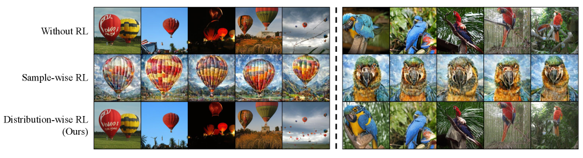
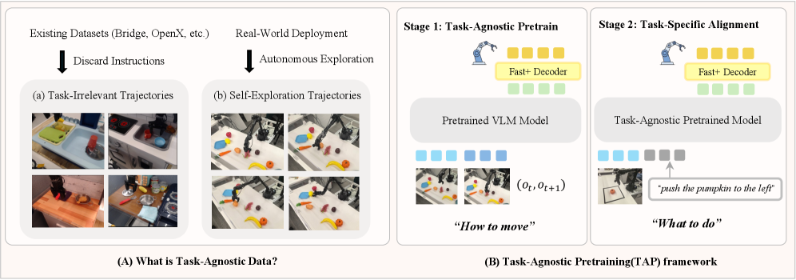

# Daily AI papers — 2026-07-04

*Curated from HF Daily Papers. 15 of ~27 papers kept after relevance filter.*

## Papers at a glance

| # | Title | Topics | Org |
| --- | --- | --- | --- |
| 1 | [Program-as-Weights: A Programming Paradigm for Fuzzy Functions](#1-program-as-weights) | `LLM`, `distillation`, `efficient-inference` | Waterloo / Cornell / Harvard |
| 2 | [AgenticSTS: A Bounded-Memory Testbed for Long-Horizon LLM Agents](#2-agenticsts) | `agents`, `eval`, `memory` | (multi-org consortium) |
| 3 | [EvoPolicyGym: Evaluating Autonomous Policy Evolution](#3-evopolicygym) | `agents`, `RL`, `eval` | USTC / CUHK / Zhejiang |
| 4 | [FlashMorph: Morphing into Hybrid Attention Models](#4-flashmorph) | `architecture`, `efficient-inference` | Fudan / ByteDance Seed / CUHK |
| 5 | [MrFlow: Multi-Resolution Flow Matching for Diffusion Acceleration](#5-mrflow) | `diffusion`, `efficient-inference` | Beihang / ETH Zürich |
| 6 | [AgenticDataBench: Benchmark for Data Agents](#6-agenticdatabench) | `agents`, `eval`, `data` | Tsinghua |
| 7 | [WorldDirector: Controllable World Simulators with Persistent Dynamic Memory](#7-worlddirector) | `diffusion`, `video`, `world-models` | HKUST / Ant Group |
| 8 | [MRPO: Step-Aware RL for Medical Multimodal Reasoning](#8-mrpo) | `RL`, `reasoning`, `multimodal` | Korea U. / Upstage / KAIST |
| 9 | [SkillCoach: Self-Evolving Rubrics for Agentic Skill-Use](#9-skillcoach) | `agents`, `eval`, `LLM-judge` | HKUST(GZ) / JD.COM |
| 10 | [Distribution-wise Rewards for Visual Generative Models](#10-distribution-wise-rewards) | `diffusion`, `RL`, `rewards` | (unspecified) |
| 11 | [LOCOS: Logit-Contribution Scoring for Non-Literal Retrieval Heads](#11-locos) | `interp`, `mech-interp` | Edinburgh / Heriot-Watt |
| 12 | [AutoMem: Automated Learning of Memory as a Cognitive Skill](#12-automem) | `agents`, `memory`, `RL` | (unspecified) |
| 13 | [TAP: Task-Agnostic Pretraining for VLAs](#13-tap) | `multimodal`, `VLA`, `pre-training` | Fudan / Shanghai Innovation Institute |
| 14 | [Denser ≠ Better: Limits of On-Policy Self-Distillation](#14-denser-neq-better) | `post-training`, `distillation`, `RL` | (multi-affiliation) |
| 15 | [TAC: Transfer-Aware Curriculum for Multi-Domain RLVR](#15-tac) | `RL`, `RLVR`, `curriculum` | Toronto / CMU / Princeton / MPI |

---

## 1. Program-as-Weights: A Programming Paradigm for Fuzzy Functions

**Authors:** Wentao Zhang, Liliana Hotsko, Pengyu Nie, Yuntian Deng (Waterloo); Woojeong Kim (Cornell); Stuart Shieber (Harvard).
**Links:** [arXiv:2607.02512](https://arxiv.org/abs/2607.02512) · [HF](https://huggingface.co/papers/2607.02512) · [AlphaXiv](https://www.alphaxiv.org/abs/2607.02512)
**Topics:** `LLM`, `distillation`, `efficient-inference`

### TL;DR

A "fuzzy function" is a natural-language spec for a task that resists clean rules — filtering log lines by importance, repairing malformed JSON, ranking by intent. PAW compiles such a spec into a compact, locally-executable neural artifact (a parameter-efficient adapter) rather than routing every call to a big-LLM API. A 0.6B Qwen3 interpreter running the adapter matches direct prompting of Qwen3-32B at ~1/50th the memory.

### Key idea

A 4B "compiler" LM is trained on **FuzzyBench** — a 10M-example dataset of (natural-language-spec, input, output) triples — to emit **parameter-efficient adapters** targeted at a small frozen interpreter. Deployment is "compile once, run locally": the adapter *is* the program, and inference no longer needs a frontier model on the hot path.

### Main finding

0.6B interpreter + PAW adapter ≈ Qwen3-32B on direct-prompt baselines across the FuzzyBench eval, at ~50× lower memory and 30 tokens/s on a MacBook M3.

### Why it matters

Reframes the usual "distill a big model into a small one" as "compile a *program* into weights, one function at a time," giving you cheap, private, reproducible executables for hundreds of tiny tasks that today burn API budget. If the recipe holds up, it turns adapter-generation into a first-class compiler pipeline.

### Knowledge graph integration

**Builds on / relates to existing pages:**
- [../post-training/fine-tuning/README.md](../post-training/fine-tuning/README.md) — PAW emits LoRA-shaped adapters as its compilation target.
- [../post-training/rejection-sampling.md](../post-training/rejection-sampling.md) — FuzzyBench construction resembles rejection-sampled distillation traces.

**Suggested new pages:**
- `post-training/fine-tuning/program-as-weights.md` *(depth)* — adapter-as-compilation-target paradigm.
- `data/fuzzybench.md` *(depth)* — the 10M fuzzy-function dataset construction recipe.

---

## 2. AgenticSTS: A Bounded-Memory Testbed for Long-Horizon LLM Agents

**Authors:** Xiangchen Cheng, Yunwei Jiang, Jianwen Sun, Kaipeng Zhang, et al. — *multi-org consortium (46 authors total)*.
**Links:** [arXiv:2607.02255](https://arxiv.org/abs/2607.02255) · [HF](https://huggingface.co/papers/2607.02255) · [AlphaXiv](https://www.alphaxiv.org/abs/2607.02255)
**Topics:** `agents`, `eval`, `memory`

### TL;DR

A benchmark and framing for long-horizon LLM agents that treats **memory as a contract**: which past observations, tool calls, and reflections is each future decision allowed to see? The simplest contract — append everything — makes it impossible to isolate any single memory component. AgenticSTS uses **typed retrieval** to assemble a fresh prompt at each step, letting researchers ablate one memory type at a time.

### Key idea

Every memory item carries a type (observation / tool-call / reflection / plan / …). Instead of a monolithic context window, each decision fires typed retrieval queries and composes only the returned items into that step's prompt. Ablating a type surgically isolates its causal effect on the agent's decisions.

### Main finding

The typed-retrieval decomposition improves aggregate performance on the AgenticSTS long-horizon tasks while making per-component ablations tractable — the paper isolates which memory *type* drives which downstream behavior.

### Why it matters

Long-horizon agent papers keep re-inventing "context management." AgenticSTS argues the field's evaluation apparatus is what's missing: without a *bounded-memory* testbed you cannot compare memory schemes fairly, and every "we made memory better" claim confounds retrieval, storage, and prompt-assembly at once.

### Knowledge graph integration

**Builds on / relates to existing pages:**
- [../agents/README.md](../agents/README.md) — first bounded-memory testbed suited to the agents section's future depth pages.

**Suggested new pages:**
- `agents/_agent-memory.md` *(taxonomy)* — kinds of agent memory (episodic, semantic, typed-retrieval, KV-append).
- `evaluation/agenticsts.md` *(depth)* — the bounded-memory benchmark itself.

---

## 3. EvoPolicyGym: Evaluating Autonomous Policy Evolution

**Authors:** Zhilin Wang (USTC), Han Song (CUHK), Runzhe Zhan (U. Macau), Yang Yang (SJTU), et al.
**Links:** [arXiv:2607.02440](https://arxiv.org/abs/2607.02440) · [HF](https://huggingface.co/papers/2607.02440) · [AlphaXiv](https://www.alphaxiv.org/abs/2607.02440)
**Topics:** `agents`, `RL`, `eval`

### TL;DR

**Autonomous Policy Evolution** frames LLM agents not as one-shot problem solvers but as *editors of executable policy code* that improve their own scripts through feedback under a fixed budget. EvoPolicyGym instantiates the setup on 16 compact interactive RL environments and adds trajectory-level diagnostics for how each agent spends its edit budget.

### Key idea

The benchmark decouples "won on the task" from "improved the policy." Each agent gets a controlled interaction budget and repeatedly edits a runnable policy program; the harness measures budget allocation, feedback-to-code translation quality, and whether the agent discovers task-appropriate mechanisms rather than luck-based wins.

### Main finding

GPT-5.5 achieves the strongest aggregate rank and top-two performance on all 16 environments, with trajectory diagnostics that separate models by *how* they turn feedback into policy edits, not just whether they succeed.

### Why it matters

Most agent benchmarks give an outcome score and hide the process. EvoPolicyGym is aimed at "self-improvement" claims specifically: it exposes whether the model is really iterating on its policy or riding a lucky first rollout. That is exactly the kind of eval RL-for-agents literature needs.

### Knowledge graph integration

**Builds on / relates to existing pages:**
- [../post-training/rlvr.md](../post-training/rlvr.md) — Autonomous Policy Evolution is a code-editing cousin of verifier-reward RL loops.
- [../post-training/_rl.md](../post-training/_rl.md) — the fixed-budget interaction setup extends the RL family towards agentic settings.

**Suggested new pages:**
- `evaluation/evopolicygym.md` *(depth)* — the benchmark and its diagnostics.

---

## 4. FlashMorph: Morphing into Hybrid Attention Models

**Authors:** Anonymous authors — *Fudan University, ByteDance Seed, CUHK*.
**Links:** [arXiv:2606.30562](https://arxiv.org/abs/2606.30562) · [HF](https://huggingface.co/papers/2606.30562) · [AlphaXiv](https://www.alphaxiv.org/abs/2606.30562)
**Topics:** `architecture`, `efficient-inference`

### TL;DR

Hybrid attention models cut long-context cost by keeping some layers as full attention and replacing the rest with linear attention. Prior work picked those layers by hand-rolled heuristics. **FlashMorph** casts hybrid-layer selection as a **budget-constrained subset optimization** problem and solves it globally rather than layer-by-layer.

### Key idea

Rank *sets* of layers by their joint effect on model behavior — not each layer's marginal score — under a fixed budget (how many full-attention layers you're allowed to keep). Because layer importances interact, greedy per-layer scoring often keeps the wrong set. FlashMorph reformulates the search space, giving a scalable global selector.

### Main finding

FlashMorph produces hybrid conversions of Transformer LMs that outperform fixed-placement and greedy layer-scoring baselines at the same full-attention budget, keeping quality closer to the original dense Transformer at long context.

### Why it matters

Every "80% linear attention" recipe hinges on *which* layers stay dense. A principled selector directly improves the quality-vs-throughput frontier of hybrid models and gives a knob for teams doing Transformer → SSM conversion without full retraining.

### Knowledge graph integration

**Builds on / relates to existing pages:**
- [../architectures/_moe.md](../architectures/_moe.md) — hybrid-attention layer selection is the attention-side analogue of MoE routing.
- [../architectures/multi-head-attention.md](../architectures/multi-head-attention.md) — the "keep-as-dense" subset is chosen from standard multi-head layers.
- [../architectures/mla.md](../architectures/mla.md) — related direction for reducing attention cost; hybrid conversion is orthogonal.

**Suggested new pages:**
- `architectures/_hybrid-attention.md` *(taxonomy)* — full × linear hybrid families (Zamba, Jamba, MambaFormer, FlashMorph, …).
- `architectures/flashmorph.md` *(depth)* — the budget-constrained layer-selection method.

---

## 5. MrFlow: Multi-Resolution Flow Matching for Training-Free Diffusion Acceleration

**Authors:** Xingyu Zheng, Xianglong Liu, Yifu Ding, Jinyang Guo (Beihang); Haotong Qin (ETH Zürich); Junqing Lin (USTC).
**Links:** [arXiv:2607.01642](https://arxiv.org/abs/2607.01642) · [HF](https://huggingface.co/papers/2607.01642) · [AlphaXiv](https://www.alphaxiv.org/abs/2607.01642)
**Topics:** `diffusion`, `efficient-inference`

### TL;DR

A **training-free** acceleration recipe for pretrained flow-matching text-to-image models. Instead of latent-space upsampling (which produces blurring/artifacts), MrFlow does a staged low → high pipeline: rough structure at low resolution, then pixel-space super-resolution via a lightweight GAN, then low-strength noise re-injection to enable a short high-frequency resample.

### Key idea

Attack the two costs at once: quadratic tokens *and* step count. Low-resolution sampling wins both, but degrades detail. Move the upsample to pixel space (avoids latent artifacts), inject small noise back into the flow-matching trajectory to re-enter the sampler at a mid timestep, and refine only the high frequencies. Composes orthogonally with timestep distillation.

### Main finding

10× end-to-end speedup on FLUX.1-dev and Qwen-Image with OneIG scores within 1% of the un-accelerated model; stacked with timestep distillation, up to 25× speedup — no training, no custom kernels.

### Why it matters

Training-free diffusion acceleration is the deploy-side lever: if a technique needs a retrained checkpoint, most teams won't use it. MrFlow makes the resolution-pyramid trick actually work for flow-matching by moving the upsample out of latent space, and the multiplicative gain when stacked with distillation is real.

### Knowledge graph integration

**Builds on / relates to existing pages:**
- No existing depth pages on flow matching yet — this is one for the "suggest" pile.

**Suggested new pages:**
- `pre-training/_flow-matching.md` *(taxonomy)* — flow matching, rectified flow, consistency models, staged sampling.
- `inference/mrflow.md` *(depth)* — multi-resolution training-free acceleration.

---

## 6. AgenticDataBench: A Comprehensive Benchmark for Data Agents

**Authors:** Zhaoyan Sun, Guoliang Li (Tsinghua); Shan Zhong, Daizhou Wen, Jiaxing Han, Ying Yan, et al.
**Links:** [arXiv:2607.01647](https://arxiv.org/abs/2607.01647) · [HF](https://huggingface.co/papers/2607.01647) · [AlphaXiv](https://www.alphaxiv.org/abs/2607.01647)
**Topics:** `agents`, `eval`, `data`

### TL;DR

A benchmark for **data agents** — LLM-driven pipelines that ingest tabular data, run analyses, and produce answers or code. 344 tasks across 15 vertical domains, 97 datasets totalling 27.3 GB, plus 433 discrete data-science *skills* extracted from Stack Overflow solutions for fine-grained coverage scoring.

### Key idea

Instead of one overall accuracy, decompose each task into named skills ("group by date", "handle missing values", "join on fuzzy key", "produce time-series plot") mined from real Stack Overflow answers. Coverage-per-skill gives per-model diagnostics that scalar accuracy hides.

### Main finding

Fine-grained skill scores expose large gaps that outcome-only leaderboards obscure — e.g., strong final-accuracy models often fail on specific data-cleaning or joining skills, and the fintech B2B subset is the hardest.

### Why it matters

Data agents are the highest-leverage enterprise use case for LLM tool-use, and evaluation of them has been anecdotal. A skill-decomposed benchmark grounded in Stack Overflow-mined operations is what teams need to target training.

### Knowledge graph integration

**Builds on / relates to existing pages:**
- [../agents/README.md](../agents/README.md) — first vertical-domain agent benchmark in the graph's scope.

**Suggested new pages:**
- `evaluation/agenticdatabench.md` *(depth)* — the benchmark, task/skill decomposition.
- `agents/data-agents.md` *(depth)* — task shape and skills catalog for data-analysis agents.

---

## 7. WorldDirector: Controllable World Simulators with Persistent Dynamic Memory

**Authors:** Hanlin Wang, Yue Yu, Yihao Meng, Zichen Liu, Qifeng Chen (HKUST); Hao Ouyang, Qiuyu Wang, Yujun Shen, et al. (Ant Group); Wen Wang (ZJU); Yixuan Li (CUHK).
**Links:** [arXiv:2607.02517](https://arxiv.org/abs/2607.02517) · [HF](https://huggingface.co/papers/2607.02517) · [AlphaXiv](https://www.alphaxiv.org/abs/2607.02517)
**Topics:** `diffusion`, `video`, `world-models`

### TL;DR

Video world models usually entangle "what is happening" with "how it looks," which makes them lose object identity when something exits the frame and re-enters. WorldDirector splits the two: an **LLM director** plans 3D trajectories and camera moves; a video generator renders those signals into pixels. Identities and physical logic are preserved across long time gaps.

### Key idea

Two-tier control. The LLM emits a persistent memory of scene entities plus their 3D trajectories and camera plan (semantics). The video-gen model is conditioned on that plan and only paints (rendering). Because the semantic layer is discrete and cheap to store, re-entry after long occlusion keeps identity intact — a failure mode of end-to-end video world models.

### Main finding

Qualitative and long-horizon consistency wins over end-to-end video world model baselines, particularly for scenes where objects leave the frame and return; unrestricted viewpoint exploration is preserved.

### Why it matters

The "world model" line has been oscillating between end-to-end video generation (drifts) and physics engines (rigid). Decoupling motion orchestration from pixel synthesis with an LLM director is a clean architectural take that inherits the LLM's memory strength without giving up neural rendering.

### Knowledge graph integration

**Builds on / relates to existing pages:**
- [../multimodal/README.md](../multimodal/README.md) — extends the video-generation subarea with structured LLM control.

**Suggested new pages:**
- `multimodal/world-director.md` *(depth)* — LLM-orchestrated 3D-trajectory video world model.
- `multimodal/_world-models.md` *(taxonomy)* — video world model families (end-to-end diffusion, LLM-directed, physics-hybrid).

---

## 8. MRPO: Step-Aware Reinforcement Learning for Medical Multimodal Reasoning

**Authors:** Junha Jung, Sungwook Jung, Taeyun Roh, Jaewoo Kang (Korea U.); Minbyul Jeong (Upstage AI); Suhyeon Lim (KAIST); Jaehoon Yun (Hanyang U. Med); Mujeen Sung (Kyung Hee).
**Links:** [arXiv:2606.31825](https://arxiv.org/abs/2606.31825) · [HF](https://huggingface.co/papers/2606.31825) · [AlphaXiv](https://www.alphaxiv.org/abs/2606.31825)
**Topics:** `RL`, `reasoning`, `multimodal`

### TL;DR

For medical VQA, most failures cascade from a single wrong early reasoning step. Outcome-only RL rewards can't localize the mistake. **MRPO (Medical Reasoning-aware Policy Optimization)** attaches step-wise process rewards with an **exponential early-step penalty** — the earlier the invalid step, the larger the penalty — so the policy learns to fix upstream errors first.

### Key idea

A step-aware reshaping of the PRM signal for RL post-training: for a failed trajectory, assign penalty ∝ exp(−λ · step_index). This concentrates the gradient on the *first* faulty step in a cascade rather than smearing blame across the trajectory, matching how clinical errors actually propagate.

### Main finding

Across three multimodal LLM backbones on medical VQA benchmarks, MRPO cuts early-stage reasoning failures from **64.0% to 13.0%** and outperforms larger dedicated medical MLLMs.

### Why it matters

Medical reasoning is one of the sharpest tests of long CoTs because early wrong hypotheses ruin diagnostic chains. The paper turns a general PRM design (blame the first mistake most) into a concrete, reproducible RL objective. The trick is not medical-specific — it plausibly transfers to any domain with error-cascade dynamics.

### Knowledge graph integration

**Builds on / relates to existing pages:**
- [../post-training/reasoning/prm.md](../post-training/reasoning/prm.md) — process reward with a step-index-dependent weighting.
- [../post-training/grpo.md](../post-training/grpo.md) — MRPO plugs into GRPO-style rollouts.
- [../post-training/reasoning/long-cot-rl.md](../post-training/reasoning/long-cot-rl.md) — targets long-CoT failure cascades directly.

**Suggested new pages:**
- `post-training/reasoning/mrpo.md` *(depth)* — step-aware process reward with exponential early-step penalty.

---

## 9. SkillCoach: Self-Evolving Rubrics for Agentic Skill-Use

**Authors:** Jiayin Zhu, Yutao Yue (HKUST(GZ), JD.COM); additional HKUST(GZ) / JD.COM collaborators.
**Links:** [arXiv:2607.01874](https://arxiv.org/abs/2607.01874) · [HF](https://huggingface.co/papers/2607.01874) · [AlphaXiv](https://www.alphaxiv.org/abs/2607.01874)
**Topics:** `agents`, `eval`, `LLM-judge`

### TL;DR

**Skills** — reusable SOPs, tool workflows, validation routines — are becoming a first-class layer for LLM agents. SkillCoach evaluates agent trajectories along four axes: **selection**, **following**, **composition**, and **skill-grounded reflection**, keeping external verification separate. Rubrics are *evolved* from actual rollouts rather than fixed by hand.

### Key idea

Frame agent evaluation as a rubric that a judge model iteratively refines against observed rollouts. Each of the four dimensions catches a different failure mode (chose wrong skill, chose right skill and mis-followed, chained skills incorrectly, failed to reflect). Rubric evolution absorbs new failure classes as agents get stronger.

### Main finding

Evolved rubrics catch failure modes that final-accuracy metrics miss and provide a cleaner training signal for both evaluation and data selection than fixed judge prompts.

### Why it matters

The judge-LM literature is stuck between static rubrics that go stale and free-form judges that drift. Self-evolving rubrics tied to the four skill-use axes is a middle path that ships as a practical eval harness for agent teams.

### Knowledge graph integration

**Builds on / relates to existing pages:**
- [../post-training/cot-reward-model.md](../post-training/cot-reward-model.md) — SkillCoach's rubric-judge overlaps in shape with CoT-reward models.
- [../post-training/rl-prompt-curation.md](../post-training/rl-prompt-curation.md) — the evolved-rubric signal doubles as training-data selection.

**Suggested new pages:**
- `evaluation/skillcoach.md` *(depth)* — four-axis rubric for agentic skill-use.
- `agents/skill-use.md` *(depth)* — the skills-as-reusable-layer framing for LLM agents.

---

## 10. Optimizing Visual Generative Models via Distribution-wise Rewards

**Authors:** Not disclosed on HF page.
**Links:** [arXiv:2607.02291](https://arxiv.org/abs/2607.02291) · [HF](https://huggingface.co/papers/2607.02291) · [AlphaXiv](https://www.alphaxiv.org/abs/2607.02291)
**Topics:** `diffusion`, `RL`, `rewards`

### TL;DR

RL fine-tuning of visual generators typically uses **sample-wise** rewards, which lets the policy hack the reward and collapse mode diversity. This work replaces the reward with a **distribution-wise** signal that scores how the generated *set* matches the real data distribution, plus a subset-replace trick that makes it computationally tractable.

### Key idea

Distribution-wise reward asks: does this new sample bring the generated distribution closer to real, given the samples I already have? To avoid re-estimating the reward over a huge reference set each step, only a small subset of the reference is updated per iteration (the subset-replace strategy). RL also tunes post-hoc model-merging coefficients to mitigate the SDE train-inference mismatch.

### Main finding

FID-50K improves from 8.30 → 5.77 on SiT and 3.74 → 3.52 on EDM2, with qualitative diversity preserved rather than collapsed.

### Why it matters

RL fine-tuning of image generators has been dominated by "reward hack + mode collapse." Distribution-wise rewards are a direct mechanical fix and land inside familiar RL pipelines, at a bearable compute cost thanks to the subset trick.

### Knowledge graph integration

**Builds on / relates to existing pages:**
- [../post-training/_rewards.md](../post-training/_rewards.md) — introduces a distribution-level reward class distinct from sample-wise and pairwise.
- [../post-training/rlvr.md](../post-training/rlvr.md) — the merging-coefficient RL trick complements verifiable-reward pipelines.
- [../pre-training/model-souping.md](../pre-training/model-souping.md) — post-hoc merging coefficients are optimized in the RL loop.

**Suggested new pages:**
- `post-training/distribution-wise-rewards.md` *(depth)* — the reward class and the subset-replace estimator.

---

## 11. LOCOS: Logit-Contribution Scoring Identifies Non-Literal Retrieval Heads

**Authors:** Aryo Pradipta Gema, Pasquale Minervini (Edinburgh, Miniml.AI); Beatrice Alex (Heriot-Watt).
**Links:** [arXiv:2607.01002](https://arxiv.org/abs/2607.01002) · [HF](https://huggingface.co/papers/2607.01002) · [AlphaXiv](https://www.alphaxiv.org/abs/2607.01002)
**Topics:** `interp`, `mech-interp`

### TL;DR

Classic "retrieval head" work looks at **where** heads attend. LOCOS instead scores **what heads transmit** by measuring how each head's output projects toward the correct answer tokens in the logit space — differentiating needle-position vs non-needle contributions in a single forward pass.

### Key idea

Take each attention head's output-value contribution, project it into the unembedding direction of the target token, and contrast the projected contribution from needle positions vs elsewhere. Heads with a large gap are the ones performing *semantic transformation* rather than literal copying.

### Main finding

Ablating top-LOCOS-ranked heads causes steeper performance degradation on non-literal retrieval tasks than ablating the top attention-based retrieval heads, without hurting unrelated capabilities — evidence that LOCOS finds function-specific rather than generically-important heads.

### Why it matters

Non-literal retrieval (paraphrase, summarize-then-answer) is where long-context models break, and it has been hard to isolate mechanistically because attention-pattern methods over-count copy heads. LOCOS gives a functional handle that separates "what is being read" from "what is being transmitted," a foundational primitive for interp of long-context behavior.

### Knowledge graph integration

**Builds on / relates to existing pages:**
- [../interpretability/README.md](../interpretability/README.md) — first depth-worthy retrieval-head interp method in the graph.
- [../architectures/multi-head-attention.md](../architectures/multi-head-attention.md) — LOCOS is a per-head diagnostic on standard MHA.

**Suggested new pages:**
- `interpretability/locos.md` *(depth)* — logit-contribution scoring for head function attribution.
- `interpretability/_retrieval-heads.md` *(taxonomy)* — copy heads, retrieval heads, non-literal retrieval heads, induction heads.

---

## 12. AutoMem: Automated Learning of Memory as a Cognitive Skill

**Authors:** Not disclosed on HF page.
**Links:** [arXiv:2607.01224](https://arxiv.org/abs/2607.01224) · [HF](https://huggingface.co/papers/2607.01224) · [AlphaXiv](https://www.alphaxiv.org/abs/2607.01224)
**Topics:** `agents`, `memory`, `RL`

### TL;DR

AutoMem treats memory management as a **trainable skill** rather than a fixed context-management rule. File-system operations become first-class memory actions the agent chooses alongside task actions. Two nested optimization loops improve (a) the *structure* the memory rests on — prompts, file schemas, action vocabulary — and (b) the *proficiency* with which the model uses it.

### Key idea

Outer loop: a strong LLM reviews complete trajectories and iteratively revises the memory structure. Inner loop: the agent's own good memory decisions across many episodes become training signal, sharpening proficiency. The two axes are optimized separately because episodes are thousands of steps long and one bad memory action can hide for a long time.

### Main finding

On Crafter, MiniHack, and NetHack, optimizing *memory only* (without touching task-action behavior) improves the base 32B agent ~2–4× — enough to make it competitive with Claude Opus 4.5 and Gemini 3.1 Pro Thinking as reference frontier systems.

### Why it matters

The "add memory to the agent" recipe has been ad-hoc. AutoMem argues memory competence is separable from task competence and gives a concrete two-loop training procedure that isolates the source of improvement.

### Knowledge graph integration

**Builds on / relates to existing pages:**
- [../post-training/rejection-sampling.md](../post-training/rejection-sampling.md) — the inner loop uses episode-level rejection of memory decisions.
- [../agents/README.md](../agents/README.md) — targets long-horizon agentic settings.

**Suggested new pages:**
- `agents/automem.md` *(depth)* — memory-as-skill training with two nested loops.
- `agents/_agent-memory.md` *(taxonomy)* — shared with the AgenticSTS suggestion.

---

## 13. TAP: Task-Agnostic Pretraining for Vision-Language-Action Models

**Authors:** Junhao Shi, Siyin Wang, Xipeng Qiu et al. (Fudan University, Shanghai Innovation Institute).
**Links:** [arXiv:2607.02466](https://arxiv.org/abs/2607.02466) · [HF](https://huggingface.co/papers/2607.02466) · [AlphaXiv](https://www.alphaxiv.org/abs/2607.02466)
**Topics:** `multimodal`, `VLA`, `pre-training`

### TL;DR

VLAs suffer from a shortage of labeled expert demonstrations. TAP decouples **motor skills** from **semantic task grounding** with a two-stage pretrain: (1) self-supervised inverse dynamics learning from *unlabeled* interaction data, then (2) grounding those motor skills in language with a small labeled set.

### Key idea

"Learn to move before learning to do." Stage 1 doesn't need language or task labels — the model just learns to predict actions from consecutive observations (inverse dynamics). Stage 2 imports that motor prior and only needs enough labeled data to bind action prefixes to task descriptions.

### Main finding

On the SIMPLER benchmark, TAP matches models trained on >1M expert trajectories, with a 10-point absolute gain over standard behavior cloning at the same label budget. Real-world WidowX experiments show 25% success under camera perturbations where internet-scale baselines drop to zero.

### Why it matters

VLA data scarcity is the field's chokepoint. Decoupling motor and semantic pretraining is a clean re-use of the abundant unlabeled interaction data pool, and the robustness under camera perturbation is the kind of transfer signal deployed robots actually need.

### Knowledge graph integration

**Builds on / relates to existing pages:**
- [../multimodal/README.md](../multimodal/README.md) — extends VLA foundations with two-stage decoupled pretraining.
- [../pre-training/mid-training.md](../pre-training/mid-training.md) — the motor stage plays a mid-training-style role between generic pretrain and task SFT.

**Suggested new pages:**
- `multimodal/tap-vla.md` *(depth)* — inverse-dynamics motor pretrain + language-grounding stage for VLAs.
- `multimodal/_vla.md` *(taxonomy)* — Vision-Language-Action families and their training recipes.

---

## 14. Denser ≠ Better: Limits of On-Policy Self-Distillation for Continual Post-Training

**Authors:** Meng Wang, Haohan Zhao, Wenzhuo Liu, Lu Yang, Geng Liu, Haiyang Guo, Guo-Sen Xie, Gaofeng Meng, Hongbin Liu, Fei Zhu — *affiliations not disclosed on HF page*.
**Links:** [arXiv:2607.01763](https://arxiv.org/abs/2607.01763) · [HF](https://huggingface.co/papers/2607.01763) · [AlphaXiv](https://www.alphaxiv.org/abs/2607.01763)
**Topics:** `post-training`, `distillation`, `RL`

### TL;DR

Self-Distilled Policy Optimization (SDPO) — on-policy self-distillation with dense teacher signals — *accelerates* in-domain specialization but *doesn't* prevent forgetting and *can collapse* out-of-distribution. Denser signal ≠ better learning: it drives parameter drift, response drift, and amplifies formatting artifacts vs GRPO.

### Key idea

Distinguish two failure axes: **stability** (does the model forget?) and **generalization** (does it hold up OOD?). Denser SDPO signals mainly help specialization when the teacher is well-aligned; without that, they widen parameter/response drift and reinforce spurious formatting. GRPO's sparser reward is more robust across the two axes.

### Main finding

Across continual post-training scenarios, SDPO beats baselines on in-domain but forgets more and collapses OOD; GRPO is a stronger default; dense self-distillation is not a free win.

### Why it matters

Self-distillation-with-a-teacher-of-yourself has been treated as safely additive. This paper says it's a *risk* under distribution shift, which reframes the design space of continual post-training toward reward sparsity and stability control.

### Knowledge graph integration

**Builds on / relates to existing pages:**
- [../post-training/grpo.md](../post-training/grpo.md) — direct comparison against GRPO under continual settings.
- [../post-training/_post-training.md](../post-training/_post-training.md) — expands the continual-training branch.
- [../post-training/rejection-sampling.md](../post-training/rejection-sampling.md) — related distillation-quality lever.

**Suggested new pages:**
- `post-training/sdpo.md` *(depth)* — self-distilled policy optimization: the algorithm and its failure modes.

---

## 15. TAC: Transfer-Aware Curriculum for Multi-Domain RLVR

**Authors:** Yongjin Yang, Zhijing Jin (U. Toronto, Vector Institute, ELLIS Institute Tübingen); Jiarui Liu (CMU); Yinghui He (Princeton); Lechen Zhang (UIUC); Bernhard Schölkopf (ELLIS Tübingen / MPI-IS).
**Links:** [arXiv:2606.25178](https://arxiv.org/abs/2606.25178) · [HF](https://huggingface.co/papers/2606.25178) · [AlphaXiv](https://www.alphaxiv.org/abs/2606.25178)
**Topics:** `RL`, `RLVR`, `curriculum`

### TL;DR

Multi-domain RLVR needs a **curriculum** — how often to sample each domain — but existing learnability-based bandits are blind to whether a step on one domain helps or hurts the others. **TAC (Transfer-Aware Curriculum)** repurposes signals already produced during GRPO to bias sampling toward domains whose gradient updates broadly benefit the rest.

### Key idea

Two signals go into the bandit: per-domain **advantages** (local learnability) and projected **cross-domain gradient alignment** (does a GRPO step on math also help science and code?). Alignment comes essentially for free from the GRPO update being computed anyway, at <1% wall-clock overhead.

### Main finding

Across a six-domain reasoning suite, TAC posts the best macro-averaged accuracy on both Qwen3-1.7B and Llama3.2-3B and beats a learnability-only bandit by up to 2.8 points (10% relative). Removing the transfer term collapses performance sharply; TAC is robust on imbalanced training mixtures where learnability-only bandits over-commit.

### Why it matters

Multi-domain RLVR is where reasoning models like R1 and o1-style trainings actually live. Every prior curriculum has been static or greedy on learnability; TAC bakes cross-domain transfer directly into the sampler with negligible overhead, making it a plausible drop-in for open-source recipes.

### Knowledge graph integration

**Builds on / relates to existing pages:**
- [../post-training/rlvr.md](../post-training/rlvr.md) — TAC is a curriculum layer on top of RLVR.
- [../post-training/grpo.md](../post-training/grpo.md) — reuses GRPO-computed gradients for the transfer signal.
- [../post-training/rl-prompt-curation.md](../post-training/rl-prompt-curation.md) — TAC lives at prompt-curation altitude but per-domain.

**Suggested new pages:**
- `post-training/tac.md` *(depth)* — transfer-aware bandit curriculum for multi-domain RLVR.
- `post-training/_rl-curriculum.md` *(taxonomy)* — curriculum families for RL post-training (learnability, transfer-aware, hand-scheduled).

---

## Notes

- Borderline inclusions were kept when the technique plausibly transfers to LLM/VLM training (e.g., MRPO's exponential early-step penalty on process rewards, InstanceControl-style diffusion tricks were dropped only because a stronger diffusion paper — MrFlow — was already in the digest).
- Hero figures live in `assets/2026-07-04/`. Papers without an inline `![Hero figure]` line either had no `og:image` meta (PAW, AgenticSTS, MRPO, SkillCoach, LOCOS, SDPO) or the download failed (FlashMorph, AgenticDataBench).
- This digest is informational. No existing concept files, `READING-LIST.md`, or `PAPERS.md` were modified to produce it.
