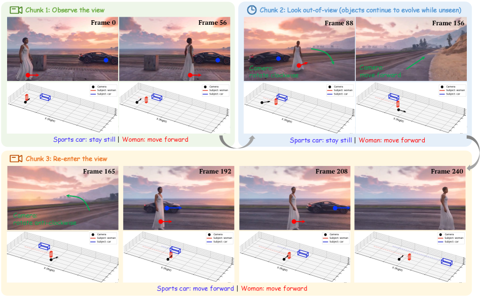
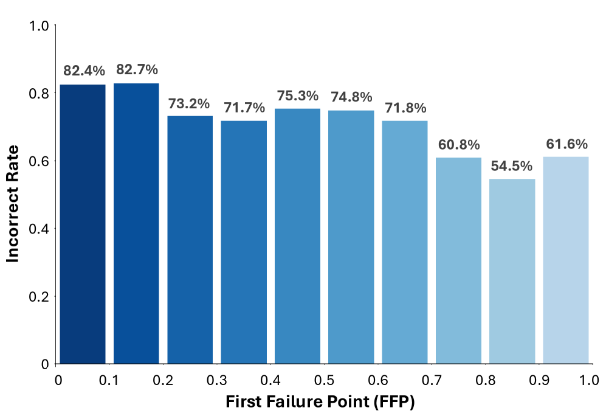
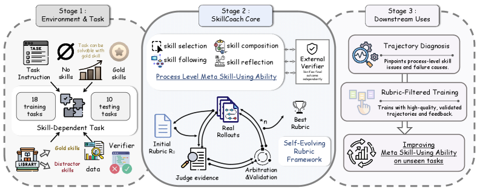
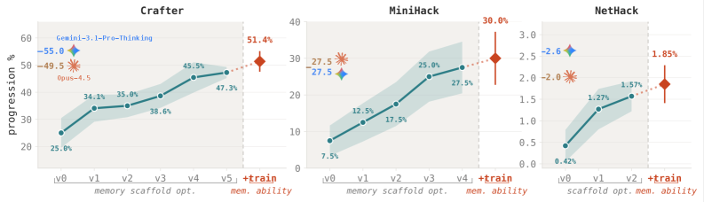
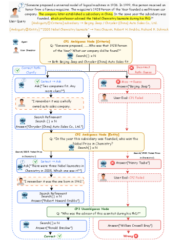
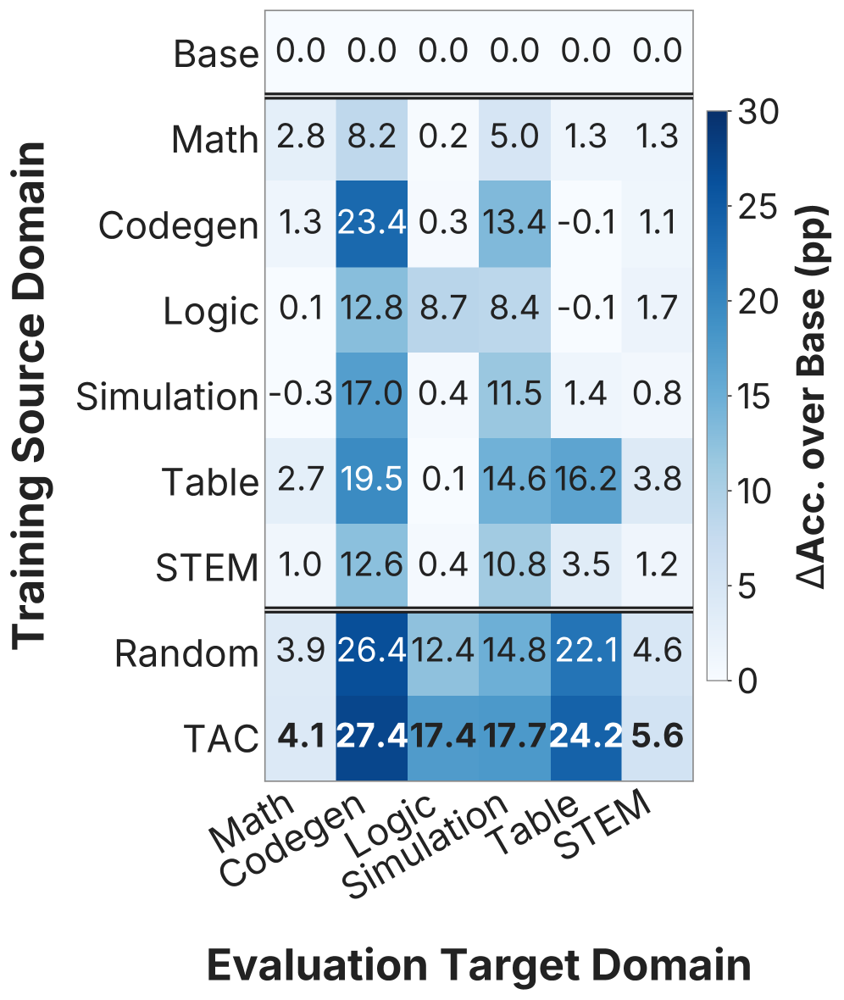

# Daily AI papers — 2026-07-05

*Curated from HF Daily Papers. 15 of 27 papers kept after relevance filter.*

## Papers at a glance

| # | Title | Topics | Org |
| --- | --- | --- | --- |
| 1 | [Program-as-Weights: A Programming Paradigm for Fuzzy Functions](#1-program-as-weights) | `LLM`, `efficient-inference`, `LoRA` | Waterloo / Cornell / Harvard |
| 2 | [AgenticSTS: A Bounded-Memory Testbed for Long-Horizon LLM Agents](#2-agenticsts) | `agents`, `eval`, `memory` | Shanghai AI Lab (unspecified) |
| 3 | [EvoPolicyGym: Evaluating Autonomous Policy Evolution](#3-evopolicygym) | `agents`, `eval`, `RL` | CUHK / USTC / Zhejiang |
| 4 | [FlashMorph: Morphing into Hybrid Attention Models](#4-flashmorph) | `architectures`, `attention`, `efficient-inference` | Fudan / ByteDance Seed / CUHK |
| 5 | [MrFlow: Multi-Resolution Flow Matching](#5-mrflow) | `diffusion`, `efficient-inference` | Beihang / CAS / USTC / ETH |
| 6 | [AgenticDataBench: A Comprehensive Benchmark for Data Agents](#6-agenticdatabench) | `agents`, `eval`, `data` | Tsinghua |
| 7 | [WorldDirector: Controllable World Simulators with Persistent Dynamic Memory](#7-worlddirector) | `diffusion`, `multimodal`, `video` | HKUST / Ant Group |
| 8 | [MRPO: Step-Aware RL for Medical Multimodal Reasoning](#8-mrpo) | `RL`, `reasoning`, `multimodal` | Korea U. / Upstage AI |
| 9 | [SkillCoach: Self-Evolving Rubrics for Agentic Skill-Use](#9-skillcoach) | `agents`, `eval`, `RL` | HKUST(GZ) / JD.COM |
| 10 | [AutoMem: Automated Learning of Memory as a Cognitive Skill](#10-automem) | `agents`, `memory`, `RL` | (unspecified) |
| 11 | [LOCOS: Logit-Contribution Scoring for Non-Literal Retrieval Heads](#11-locos) | `interp`, `LLM` | Edinburgh / Heriot-Watt |
| 12 | [Distribution-wise Rewards for Visual Generative Models](#12-distribution-rewards) | `diffusion`, `RL` | (unspecified) |
| 13 | [DiscoBench: Clarification-Aware Deep Search](#13-discobench) | `agents`, `eval` | Tencent Hunyuan / Tsinghua |
| 14 | [SDPO: Limits of On-Policy Self-Distillation for Continual Post-Training](#14-sdpo) | `post-training`, `RL`, `distillation` | (unspecified) |
| 15 | [TAC: Transfer-Aware Curriculum for Multi-Domain RLVR](#15-tac) | `RL`, `RLVR`, `reasoning` | Toronto / CMU / Princeton / MPI |

---

## 1. Program-as-Weights

**Authors:** Wentao Zhang, Liliana Hotsko, Woojeong Kim, Pengyu Nie, Stuart Shieber, Yuntian Deng — *University of Waterloo / Cornell / Harvard*
**Links:** [arXiv:2607.02512](https://arxiv.org/abs/2607.02512) · [HF](https://huggingface.co/papers/2607.02512) · [AlphaXiv](https://www.alphaxiv.org/abs/2607.02512)
**Topics:** `LLM`, `efficient-inference`, `LoRA`

### TL;DR

Turn "fuzzy" utility tasks that resist rule-based coding — log filtering, JSON repair, ranking — into small LoRA-style adapters instead of API calls. A 4B "compiler" LLM reads a natural-language spec and emits a parameter-efficient adapter for a frozen 0.6B Qwen3 interpreter that then runs the task. Compilation is one-shot; execution is cheap and local.

### Key idea

Reframe programming as *compiling a specification into weights*. The compiler was trained on **FuzzyBench**, a 10M-example dataset of spec/adapter pairs; at inference, the compiler outputs an adapter (delta on the interpreter's weights) rather than code or a system prompt. The interpreter is fixed and small, so per-call cost is bounded.

### Main finding

A 0.6B Qwen3 with the compiled adapter matches Qwen3-32B on the FuzzyBench utility suite while using **~50× less inference memory** and running at **~30 tok/s on a MacBook M3**.

### Why it matters

If specifications reliably compile to adapters, glue-code tasks stop being API problems and start being weight-diff problems. Combined with LoRA-serving infra, an app can ship hundreds of "programs" cheaply and swap them without restarting the interpreter.

### Knowledge graph integration

**Builds on / relates to existing pages:**
- [../post-training/fine-tuning/README.md](../post-training/fine-tuning/README.md) — LoRA-style adapters are the runtime artifact this paper generates from a spec.
- [../inference/README.md](../inference/README.md) — this is fundamentally a serving-cost argument (adapter-per-task instead of API-per-call).

**Suggested new pages:**
- `post-training/fine-tuning/lora.md` *(depth)* — the KG has no LoRA depth file yet; this paper motivates one.
- `inference/adapter-serving.md` *(depth)* — multi-adapter serving as an inference pattern.

---

## 2. AgenticSTS

**Authors:** Xiangchen Cheng, Yunwei Jiang, Jianwen Sun, Zizhen Li, Chuanhao Li, Xiangcheng Cao, Yihao Liu, Fanrui Zhang, Li Jin, Kaipeng Zhang — *affiliations not disclosed on HF*
**Links:** [arXiv:2607.02255](https://arxiv.org/abs/2607.02255) · [HF](https://huggingface.co/papers/2607.02255) · [AlphaXiv](https://www.alphaxiv.org/abs/2607.02255)
**Topics:** `agents`, `eval`, `memory`

### TL;DR

Argues that "memory" for a long-horizon LLM agent is a *contract* about what each future decision may see, and swaps the usual append-everything transcript for a **bounded contract**: every decision starts from a fresh prompt assembled by typed retrieval. Instantiated in *Slay the Spire 2* as a stochastic, closed-rule long-horizon testbed.

### Key idea

Formalize memory as a typed retrieval layer over past observations/tool calls/reflections. Because the prompt is bounded and reassembled each turn, any single memory layer (episodic, semantic, reflection) can be ablated in isolation — something the append-transcript pattern makes impossible.

### Main finding

The testbed makes the individual contribution of each memory layer measurable across hundreds of tactical decisions per run; the paper reports controlled ablations that isolate which typed memories drive which failure modes (numbers in the paper body).

### Why it matters

Agent research has been stuck comparing whole-transcript memory recipes as black boxes. A bounded-contract testbed is the analogue of a controlled interpretability probe for memory, and Slay the Spire 2 is a rare closed-rule long-horizon environment where sample-efficient comparisons are possible.

### Knowledge graph integration

**Builds on / relates to existing pages:**
- [../agents/README.md](../agents/README.md) — sits squarely inside the agents-with-memory topic area (currently only a README).
- [../evaluation/README.md](../evaluation/README.md) — new-benchmark contribution.

**Suggested new pages:**
- `agents/agent-memory.md` *(depth)* — the bounded-vs-appended memory contract as a design pattern.
- `evaluation/agenticsts.md` *(depth)* — the Slay the Spire 2 long-horizon benchmark.

---

## 3. EvoPolicyGym

**Authors:** Zhilin Wang, Han Song, Runzhe Zhan, Jusen Du, Jiacheng Chen, Tianle Li, Qingyu Yin, Yulun Wu, Zhennan Shen, Tong Zhu, Yanshu Li, Guanjie Chen, Derek F. Wong, Yafu Li, Yu Cheng, Yang Yang — *CUHK / USTC / Macau / Tsinghua / Zhejiang / SJTU / Soochow / Brown*
**Links:** [arXiv:2607.02440](https://arxiv.org/abs/2607.02440) · [HF](https://huggingface.co/papers/2607.02440) · [AlphaXiv](https://www.alphaxiv.org/abs/2607.02440)
**Topics:** `agents`, `eval`, `RL`

### TL;DR

A benchmark for **autonomous policy evolution**: instead of scoring a final result, a harness–model agent is given a fixed interaction budget and repeatedly edits an *executable* policy system, and the improvement trajectory is what gets measured.

### Key idea

Separate policy-evolution ability from open-ended SWE progress. The environment is set up so the agent's actions are edits to a running policy (rules, prompts, sub-policies), and the harness applies them and returns feedback under a fixed budget. Evaluation looks at the *slope* of improvement, not the endpoint.

### Main finding

Existing agent scores collapse the entire evolution trajectory to a single number; EvoPolicyGym exposes that agents which look similar on final score have very different edit efficiencies (paper reports per-model curves and budget-efficiency metrics).

### Why it matters

If we want agents that maintain and improve deployed systems, evaluating final task success under an infinite budget is the wrong metric. This benchmark makes the "policy evolution" primitive explicit and comparable across models.

### Knowledge graph integration

**Builds on / relates to existing pages:**
- [../agents/README.md](../agents/README.md) — agentic RL evaluation.
- [../evaluation/README.md](../evaluation/README.md) — a new eval methodology.

**Suggested new pages:**
- `evaluation/evopolicygym.md` *(depth)* — the benchmark and its policy-evolution metric.

---

## 4. FlashMorph

**Authors:** — *Fudan University / ByteDance Seed / CUHK*
**Links:** [arXiv:2606.30562](https://arxiv.org/abs/2606.30562) · [HF](https://huggingface.co/papers/2606.30562) · [AlphaXiv](https://www.alphaxiv.org/abs/2606.30562)
**Topics:** `architectures`, `attention`, `efficient-inference`

### TL;DR

Hybrid Transformer↔linear-attention models retain full attention on a subset of layers and swap the rest for linear attention. The paper argues **which layers to keep matters a lot**, and turns hybrid layer selection into a budget-constrained subset optimization problem solved with **FlashMorph** — a scalable global selector that beats heuristic per-layer scoring.

### Key idea

Prior methods pick layers greedily or via fixed patterns, treating layer importance as independent. FlashMorph optimizes the whole subset jointly under a hard budget on the number of full-attention layers, using a fast surrogate score so it stays scalable to modern model sizes.

### Main finding

Under matched full-attention budgets, FlashMorph-selected hybrids outperform heuristic hybrids on long-context tasks — improvements come without retraining the full model, since selection happens as a Transformer-to-hybrid *conversion* step.

### Why it matters

Hybrid attention is the current default recipe for long-context efficiency (Mamba-hybrid, sliding-window hybrid, etc.). Getting layer selection right is orthogonal free performance, and framing it as global optimization is the right level of abstraction.

### Knowledge graph integration

**Builds on / relates to existing pages:**
- [../architectures/multi-head-attention.md](../architectures/multi-head-attention.md) — the full-attention layers FlashMorph decides to keep.
- [../architectures/mla.md](../architectures/mla.md) — related class of attention-efficiency work.
- [../fundamentals/attention.md](../fundamentals/attention.md) — the fundamental operation being budgeted.

**Suggested new pages:**
- `architectures/_hybrid-attention.md` *(taxonomy)* — overview of hybrid Transformer/linear-attention/SSM designs.
- `architectures/linear-attention.md` *(depth)* — the "cheap" side of the hybrid.

---

## 5. MrFlow

**Authors:** Xingyu Zheng, Xianglong Liu, Yifu Ding, Weilun Feng, Junqing Lin, Jinyang Guo, Haotong Qin — *Beihang / CAS ICT / USTC / ETH Zürich*
**Links:** [arXiv:2607.01642](https://arxiv.org/abs/2607.01642) · [HF](https://huggingface.co/papers/2607.01642) · [AlphaXiv](https://www.alphaxiv.org/abs/2607.01642)
**Topics:** `diffusion`, `efficient-inference`

### TL;DR

**MrFlow** is a training-free accelerator for pretrained flow-matching text-to-image models. It runs a staged low→high resolution sampling pipeline that keeps most of the compute at low resolution and only lifts to full resolution near the end, avoiding the latent-upsample artifacts prior multi-resolution accelerators suffer from.

### Key idea

Instead of upsampling in latent space mid-sampling (which produces blur / seams), MrFlow separates the schedule into resolution stages and matches the flow-matching velocity field across stages, so the transition is consistent with the pretrained model's dynamics.

### Main finding

Delivers >5× speedup class in line with prior multi-resolution methods but without the visible blurring / artifacts that made those methods hard to deploy — no training required.

### Why it matters

Multi-resolution sampling is a promising cheap axis for diffusion/flow-matching acceleration, but has been quality-limited. Fixing that unlocks a training-free 5× that stacks with timestep distillation and feature caching.

### Knowledge graph integration

**Builds on / relates to existing pages:**
- [../inference/README.md](../inference/README.md) — cheap sampling for generative inference.

**Suggested new pages:**
- `inference/_diffusion-sampling-acceleration.md` *(taxonomy)* — distillation, caching, multi-resolution, step reduction.
- `inference/multi-resolution-sampling.md` *(depth)* — the specific technique MrFlow refines.
- `fundamentals/flow-matching.md` *(depth)* — the underlying generative modeling framework.

---

## 6. AgenticDataBench

**Authors:** Zhaoyan Sun, Shan Zhong, Daizhou Wen, Jiaxing Han, Guoliang Li, Ying Yan, Peng Zhang, Yu Su, Xiang Qi, Baolin Sun, Chengyuan Yang, Tao Fang, Huaiyu Ruan — *Tsinghua University*
**Links:** [arXiv:2607.01647](https://arxiv.org/abs/2607.01647) · [HF](https://huggingface.co/papers/2607.01647) · [AlphaXiv](https://www.alphaxiv.org/abs/2607.01647)
**Topics:** `agents`, `eval`, `data`

### TL;DR

Benchmark for **data agents** — LLM agents that solve data-science tasks over real datasets. 344 tasks × 433 skills × 97 datasets (27.3 GB), spanning 15 verticals including B2B fintech. Introduces "data science skills" (recurring data operations extracted from Stack Overflow) as the coverage unit, not final answer accuracy.

### Key idea

Scoring data agents by final answer is fragile because tasks have many valid answers. Instead, score by **skill coverage**: does the agent's trace contain the operations the task requires (`groupby-agg`, `time-window-join`, `outlier-drop`, ...) regardless of exact output.

### Main finding

Establishes a new axis of comparison across data agents; identifies where current agents systematically drop skills (multi-table joins, temporal reasoning, data-quality checks).

### Why it matters

Data-agent evaluation has been limited to small SQL/pandas suites. Skill-coverage measurement is a much more debuggable objective than pass/fail on a final table.

### Knowledge graph integration

**Builds on / relates to existing pages:**
- [../agents/README.md](../agents/README.md) — agent evaluation.
- [../evaluation/README.md](../evaluation/README.md) — new benchmark.
- [../data/README.md](../data/README.md) — data-centric skill decomposition.

**Suggested new pages:**
- `evaluation/agenticdatabench.md` *(depth)* — the benchmark itself.

---

## 7. WorldDirector

**Authors:** Hanlin Wang, Hao Ouyang, Qiuyu Wang, Wen Wang, Qingyan Bai, Ka Leong Cheng, Yue Yu, Yixuan Li, Yihao Meng, Zichen Liu, Yanhong Zeng, Yujun Shen, Qifeng Chen — *HKUST / Ant Group / ZJU / CUHK*
**Links:** [arXiv:2607.02517](https://arxiv.org/abs/2607.02517) · [HF](https://huggingface.co/papers/2607.02517) · [AlphaXiv](https://www.alphaxiv.org/abs/2607.02517)
**Topics:** `diffusion`, `multimodal`, `video`

### TL;DR

Video "world model" that **decouples semantic motion orchestration from visual generation**. An LLM plans 3D object trajectories and camera moves; those trajectories become control signals for a video generator. Entities that leave the scene and return keep their exact identity, because motion state lives in the trajectory memory, not in the pixels.

### Key idea

Prior video world models entangle physics with pixels — they need continuous visual observation to sustain object identity. WorldDirector keeps a persistent, symbolic memory of 3D trajectories and hands them to the generator as conditioning. Physical logic (occlusion, re-entry) becomes a plan-time concern, not a rendering one.

### Main finding

Preserves visual identity of dynamic entities across long occlusion periods, and supports unrestricted viewpoint exploration without drifting — a failure mode of pixel-only world models.

### Why it matters

The trajectory-plus-generator split is the same abstraction that made LLM-planning + tool-use work for text agents; applying it to video world simulation is a step toward controllable long-horizon world models useful for embodied and game agents.

### Knowledge graph integration

**Builds on / relates to existing pages:**
- [../multimodal/README.md](../multimodal/README.md) — video generation for world simulation.
- [../agents/README.md](../agents/README.md) — LLM-as-planner architecture.

**Suggested new pages:**
- `multimodal/video-world-model.md` *(depth)* — decoupled trajectory-plus-generator world models.

---

## 8. MRPO — Step-Aware RL for Medical Multimodal Reasoning

**Authors:** Junha Jung, Minbyul Jeong, Suhyeon Lim, Sungwook Jung, Jaehoon Yun, Taeyun Roh, Mujeen Sung, Jaewoo Kang — *Korea University / AIGEN / Upstage AI / KAIST / Hanyang / Kyung Hee*
**Links:** [arXiv:2606.31825](https://arxiv.org/abs/2606.31825) · [HF](https://huggingface.co/papers/2606.31825) · [AlphaXiv](https://www.alphaxiv.org/abs/2606.31825)
**Topics:** `RL`, `reasoning`, `multimodal`

### TL;DR

**MRPO** ("Medical" RL with process rewards) penalizes early reasoning-step errors exponentially more than late ones during multimodal RL post-training. Motivated by the observation that most wrong answers in medical VLM reasoning start with an early misperception that cascades — so credit-assignment should reward *not* making that early mistake.

### Key idea

Standard RLVR only sees the terminal correctness signal, which is too sparse for long multimodal reasoning chains. MRPO adds a step-aware process reward whose penalty grows exponentially with earlier step index, forcing the policy to fix early perception/parsing errors first.

### Main finding

Cuts **early-stage reasoning failures from 64.0% → 13.0%** and outperforms larger medical VLMs across three architectures. Applies cleanly on top of GRPO-style multimodal RL.

### Why it matters

For domains with long structured reasoning (medical, legal, math with figures), a uniform-per-step reward wastes the signal. Step-weighted rewards are a cheap, algorithm-agnostic upgrade to GRPO / RLVR pipelines whenever early errors dominate failure modes.

### Knowledge graph integration

**Builds on / relates to existing pages:**
- [../post-training/grpo.md](../post-training/grpo.md) — MRPO is an on-policy step-reweighted variant.
- [../post-training/reasoning/prm.md](../post-training/reasoning/prm.md) — step-aware process reward.
- [../post-training/rlvr.md](../post-training/rlvr.md) — plugs into verifiable-reward multimodal RL.
- [../post-training/_rewards.md](../post-training/_rewards.md) — new reward-shaping recipe.

**Suggested new pages:**
- `post-training/reasoning/step-weighted-rewards.md` *(depth)* — the exponential-early-penalty trick as a general reward shaping.

---

## 9. SkillCoach

**Authors:** Jiayin Zhu, Yutao Yue, Shuai Wang, Ziyu Guo, Jing Nathan Yan, Xuefei Cao — *HKUST(GZ) / JD.COM*
**Links:** [arXiv:2607.01874](https://arxiv.org/abs/2607.01874) · [HF](https://huggingface.co/papers/2607.01874) · [AlphaXiv](https://www.alphaxiv.org/abs/2607.01874)
**Topics:** `agents`, `eval`, `RL`

### TL;DR

For LLM agents that call reusable "skills" (SOPs, tool workflows, validation routines), final-verifier-success masks distractor-skill selection, skipped steps, or missing validations. **SkillCoach** builds *self-evolving rubrics* per skill — item-level checks the agent must satisfy in its trajectory — and uses them both to score and to train the agent.

### Key idea

Rubrics are generated by an LLM from skill descriptions, then refined by seeing failure modes on the training set (self-evolution). The rubric provides dense, interpretable step-level rewards that a terminal verifier can't.

### Main finding

Rubric-based scoring separates agents that pass through trial-and-error from agents that follow the correct skill workflow; RL fine-tuning against rubric rewards improves adherence and downstream success.

### Why it matters

Skills are becoming the standard reusable layer for LLM agents (MCP servers, tool bundles). Rubric-based evaluation makes "correct use" measurable at scale, and rubric-based RL is a lightweight alternative to hand-authored process rewards.

### Knowledge graph integration

**Builds on / relates to existing pages:**
- [../agents/README.md](../agents/README.md) — skill-using agents.
- [../post-training/reasoning/prm.md](../post-training/reasoning/prm.md) — rubric rewards are LLM-generated process rewards.
- [../post-training/_rewards.md](../post-training/_rewards.md) — new reward-shaping technique.

**Suggested new pages:**
- `post-training/reasoning/rubric-rewards.md` *(depth)* — self-evolving LLM-generated rubrics as process rewards.
- `agents/agent-skills.md` *(depth)* — skills as a reusable layer for agents.

---

## 10. AutoMem

**Authors:** Not disclosed on HF page
**Links:** [arXiv:2607.01224](https://arxiv.org/abs/2607.01224) · [HF](https://huggingface.co/papers/2607.01224) · [AlphaXiv](https://www.alphaxiv.org/abs/2607.01224)
**Topics:** `agents`, `memory`, `RL`

### TL;DR

Treats memory management as a **learned cognitive skill** ("metamemory"). File-system operations are promoted to first-class memory actions alongside task actions, so the model chooses what to encode, when to retrieve, and how to organize. A dual loop optimizes both the memory *structure* (prompts, file schemas, action vocab) and the model's *proficiency* at using it.

### Key idea

Loop 1: a strong LLM reviews entire trajectories and revises the memory schema/action vocab that shapes future runs. Loop 2: individual good memory decisions from those runs become training examples that fine-tune the agent's memory proficiency directly.

### Main finding

Across Crafter, MiniHack, and NetHack, optimizing memory alone (no changes to task-action behavior) yields **~2×–4× improvement** and brings a 32B open-weight model competitive with Claude Opus 4.5 and Gemini 3.1 Pro Thinking on long-horizon tasks.

### Why it matters

Memory has been either hardcoded (fixed context template) or learned only as a byproduct of end-to-end RL. Isolating memory as an independently trainable skill turns out to be a large lever on long-horizon agent performance without touching task policies.

### Knowledge graph integration

**Builds on / relates to existing pages:**
- [../agents/README.md](../agents/README.md) — agent memory as a first-class training target.
- [../post-training/_rl.md](../post-training/_rl.md) — trajectory-level offline RL over memory decisions.
- [../post-training/rejection-sampling.md](../post-training/rejection-sampling.md) — good-decision selection as training data.

**Suggested new pages:**
- `agents/agent-memory.md` *(depth)* — memory as a learned skill with structure + proficiency loops.

---

## 11. LOCOS — Non-Literal Retrieval Heads

**Authors:** Aryo Pradipta Gema, Beatrice Alex, Pasquale Minervini — *University of Edinburgh / Heriot-Watt / Miniml.AI*
**Links:** [arXiv:2607.01002](https://arxiv.org/abs/2607.01002) · [HF](https://huggingface.co/papers/2607.01002) · [AlphaXiv](https://www.alphaxiv.org/abs/2607.01002)
**Topics:** `interp`, `LLM`

### TL;DR

Existing "retrieval head" detectors reward heads whose *attended* token matches the *generated* token — a literal-copy criterion. **LOCOS** (Logit-Contribution Scoring) instead scores each head by the projection of its OV-circuit output onto the answer-token unembedding direction, catching heads that synthesize a non-literal answer.

### Key idea

Read-side detection (attention-pattern matching) misses heads that *write* the answer through the OV path without copying. LOCOS is a write-side detector: it contrasts the OV-circuit's logit contribution at needle vs off-needle source positions in a single forward pass.

### Main finding

On NoLiMa, mean-ablating the top LOCOS heads on Qwen3-8B collapses ROUGE-L from **0.401 → 0.000** with 50 heads ablated, while the strongest attention-based baseline still retains 0.292. Also drops MuSiQue (0.55→0.08) and BABILong (0.62→0.20). Parametric recall and arithmetic stay near baseline — the heads are retrieval-specific.

### Why it matters

If long-context QA is dominated by a small set of *non-literal* retrieval heads, safety/interp work that only enumerates literal-copy heads is aiming at the wrong circuit. LOCOS gives a principled write-aware localizer.

### Knowledge graph integration

**Builds on / relates to existing pages:**
- [../interpretability/README.md](../interpretability/README.md) — mechanistic head-level analysis.
- [../fundamentals/attention.md](../fundamentals/attention.md) — the OV vs QK decomposition LOCOS leverages.

**Suggested new pages:**
- `interpretability/retrieval-heads.md` *(depth)* — literal vs non-literal retrieval heads and how to find them (LOCOS + baselines).

---

## 12. Distribution-wise Rewards for Visual Generative Models

**Authors:** Not disclosed on HF page
**Links:** [arXiv:2607.02291](https://arxiv.org/abs/2607.02291) · [HF](https://huggingface.co/papers/2607.02291) · [AlphaXiv](https://www.alphaxiv.org/abs/2607.02291)
**Topics:** `diffusion`, `RL`

### TL;DR

Sample-wise RL rewards for image generators cause mode collapse and reward hacking (all samples optimize the same direction). This paper defines a **distribution-wise reward** that scores a *batch* against the true data distribution, with a **subset-replace** estimator that updates only a small piece of a reference set to keep the reward cheap. Also RL-tunes post-hoc model-merging coefficients.

### Key idea

Reformulate the RL reward so it depends on the joint distribution of a generated batch (e.g. FID-flavored quantity) rather than per-sample quality. To avoid recomputing distributional statistics every step, only replace one sample in a rolling reference set and update the stat incrementally.

### Main finding

Improves FID-50K on standard diffusion baselines: **SiT 8.30 → 5.77**, **EDM2 3.74 → 3.52**, while preserving diversity qualitatively. RL over merging coefficients further mitigates SDE-induced train-inference mismatch.

### Why it matters

RL for image generation has been stuck between reward hacking and expensive distribution matching. A cheap distribution-aware estimator makes RL usable at the batch level and treats mode collapse as a first-class objective, not a side-effect to suppress.

### Knowledge graph integration

**Builds on / relates to existing pages:**
- [../post-training/_rewards.md](../post-training/_rewards.md) — distribution-level reward shaping.
- [../post-training/_rl.md](../post-training/_rl.md) — RL fine-tuning of generative models.
- [../pre-training/model-souping.md](../pre-training/model-souping.md) — RL-tuned merging coefficients as a post-hoc combination step.

**Suggested new pages:**
- `post-training/distribution-wise-rewards.md` *(depth)* — batch/distribution-level RL rewards for generative models.

---

## 13. DiscoBench — Clarification-Aware Deep Search

**Authors:** Yiling Tao, Shihan Deng, Meiling Tao, Pengzhi Wei, Zhichao Hu, Zhihao Zhu — *Tencent Hunyuan / Tsinghua SIGS*
**Links:** [arXiv:2606.27669](https://arxiv.org/abs/2606.27669) · [HF](https://huggingface.co/papers/2606.27669) · [AlphaXiv](https://www.alphaxiv.org/abs/2606.27669)
**Topics:** `agents`, `eval`

### TL;DR

Benchmark for **when a search agent should ask** instead of guess. 211 samples × 463 ambiguity instances across 11 domains, evaluating (1) detecting ambiguity, (2) asking a good clarification question, (3) recovering the right reasoning path from the answer.

### Key idea

Existing deep-search benchmarks assume the user query is complete. Real queries are vague, underspecified, or factually wrong. DiscoBench separates ambiguity detection from clarification quality and shows they are distinct capabilities — many agents detect a problem but ask a poor question.

### Main finding

Repeated retrieval without clarification often underperforms *direct guessing*. Agents systematically prefer more search over asking a single clarifying question, and this bias hurts final accuracy.

### Why it matters

The "search harder" reflex is expensive and often wrong. Building interactive-clarification into agent training loops is likely a bigger win than another round of retrieval-augmented reasoning tricks.

### Knowledge graph integration

**Builds on / relates to existing pages:**
- [../agents/README.md](../agents/README.md) — search-agent evaluation.
- [../evaluation/README.md](../evaluation/README.md) — new benchmark.

**Suggested new pages:**
- `evaluation/discobench.md` *(depth)* — the benchmark and its ambiguity/clarification split.
- `agents/clarification.md` *(depth)* — clarification-asking as an agentic capability.

---

## 14. SDPO — Limits of On-Policy Self-Distillation

**Authors:** Meng Wang, Haohan Zhao, Wenzhuo Liu, Lu Yang, Geng Liu, Haiyang Guo, Guo-Sen Xie, Gaofeng Meng, Hongbin Liu, Fei Zhu — *affiliations not disclosed on HF*
**Links:** [arXiv:2607.01763](https://arxiv.org/abs/2607.01763) · [HF](https://huggingface.co/papers/2607.01763) · [AlphaXiv](https://www.alphaxiv.org/abs/2607.01763)
**Topics:** `post-training`, `RL`, `distillation`

### TL;DR

On-policy self-distillation (**SDPO**) accelerates in-domain specialization in continual post-training but **fails to prevent forgetting** and can collapse OOD. The paper's message is that on-policy data alone is *insufficient* for continual learning — dense self-distillation is not the same as robust learning.

### Key idea

SDPO uses the current policy's own dense outputs as distillation targets while training toward a task objective. The paper diagnoses that this makes in-domain gains fast but concentrates the policy on a narrow region, driving catastrophic forgetting and OOD collapse — a systematic failure of the "denser = better" reflex.

### Main finding

Compared to GRPO, SDPO wins in-domain sample efficiency but loses on retention and OOD; hybrid recipes that mix on-policy self-distillation with off-policy replays or reference-model KL avoid the collapse.

### Why it matters

Continual post-training is the deployment regime — new tasks arrive, old ones must survive. The result is a clear negative for a popular "just use on-policy signals" recipe and steers practitioners back toward mixed on-/off-policy training.

### Knowledge graph integration

**Builds on / relates to existing pages:**
- [../post-training/grpo.md](../post-training/grpo.md) — direct comparison baseline.
- [../post-training/_rl.md](../post-training/_rl.md) — on-policy vs off-policy tradeoffs.
- [../post-training/_post-training.md](../post-training/_post-training.md) — continual post-training regime.

**Suggested new pages:**
- `post-training/self-distillation.md` *(depth)* — on-policy self-distillation, its wins and its failure modes.
- `post-training/_continual-post-training.md` *(taxonomy)* — continual post-training recipes (self-distillation, replay, KL, mixed).

---

## 15. TAC — Transfer-Aware Curriculum for Multi-Domain RLVR

**Authors:** Yongjin Yang, Jiarui Liu, Yinghui He, Lechen Zhang, Bernhard Schölkopf, Zhijing Jin — *Toronto+Vector / CMU / Princeton / UIUC / ELLIS Tübingen / MPI-IS*
**Links:** [arXiv:2606.25178](https://arxiv.org/abs/2606.25178) · [HF](https://huggingface.co/papers/2606.25178) · [AlphaXiv](https://www.alphaxiv.org/abs/2606.25178)
**Topics:** `RL`, `RLVR`, `reasoning`

### TL;DR

Multi-domain RLVR (math + code + science) usually samples domains on a fixed / hand-tuned schedule. **TAC** is a bandit-style online curriculum that prioritizes the *domain whose gradient step also improves the others*, using signals already computed by GRPO (per-domain advantages + projected gradients) at <1% wall-clock overhead.

### Key idea

Curriculum = domain-selection bandit. TAC's reward for picking domain *d* combines local learnability (per-domain advantage magnitude) with **cross-domain transferability** — the alignment between the current GRPO gradient on *d* and gradients that would be taken on the other domains. Both come free from the GRPO step already being computed.

### Main finding

On a 6-domain reasoning suite with Qwen3-1.7B and Llama3.2-3B, TAC beats proportional sampling, a hand-designed schedule, and a learnability-only bandit — up to **+2.8 macro-accuracy points (10% relative)**. Ablations show the transferability term is essential; without it, curricula over-commit to dominant domains.

### Why it matters

Multi-domain post-training suites are becoming standard, but the mixing weights have been hand-tuned. TAC gives a principled, nearly-free curriculum signal derived from the RL step itself — an evergreen upgrade for RLVR pipelines.

### Knowledge graph integration

**Builds on / relates to existing pages:**
- [../post-training/rlvr.md](../post-training/rlvr.md) — TAC is a curriculum for RLVR.
- [../post-training/grpo.md](../post-training/grpo.md) — reuses GRPO advantages and gradients.
- [../post-training/rl-prompt-curation.md](../post-training/rl-prompt-curation.md) — related axis of data curation for RL.

**Suggested new pages:**
- `post-training/rlvr-curriculum.md` *(depth)* — transfer-aware curriculum for multi-domain RL.

---

## Notes

- Borderline inclusions are flagged in-section with an italic *Borderline: …* note where used.
- Hero figures live in `assets/2026-07-05/`. Missing figures for papers 1's Program-as-Weights (used arxiv HTML), FlashMorph (2606.30562 — figure URL failed), LOCOS (no og:image on HF), and SDPO / DuoMem-style papers where no reliable hero was extractable — all missing entries have the `![Hero figure]` line omitted.
- This digest is informational. No existing concept files, `READING-LIST.md`, or `PAPERS.md` were modified to produce it.
