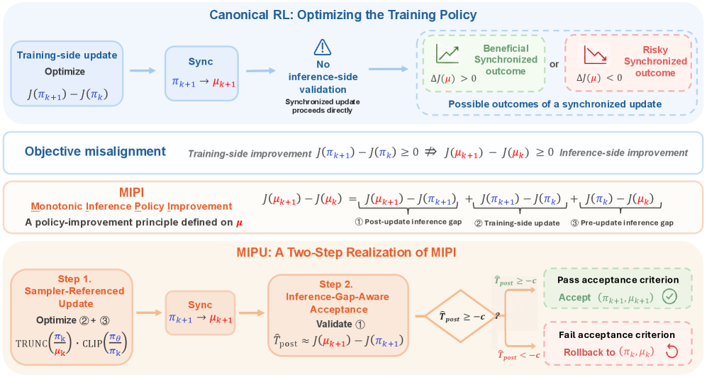
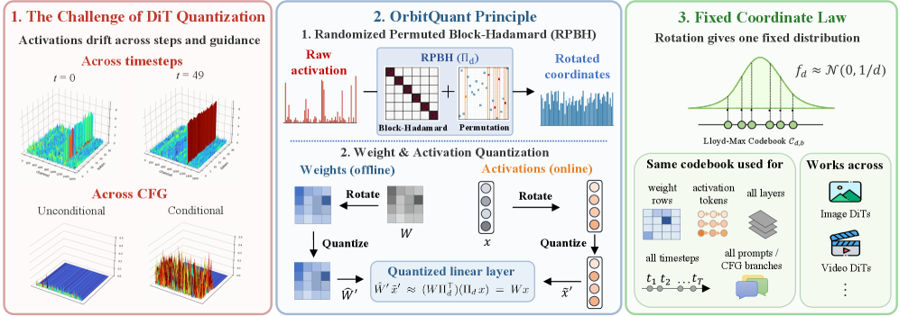
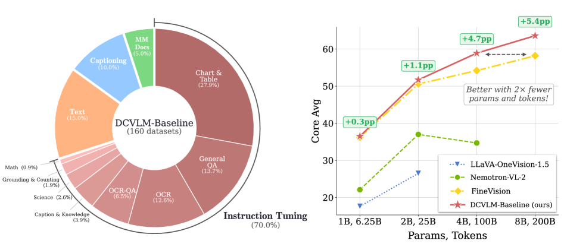
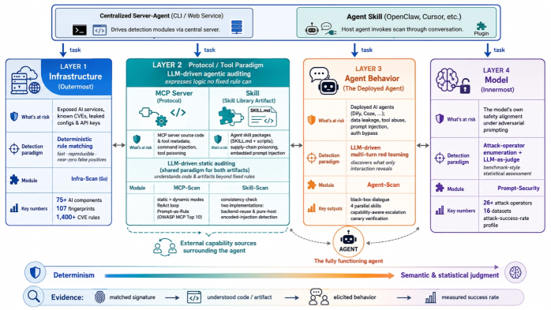
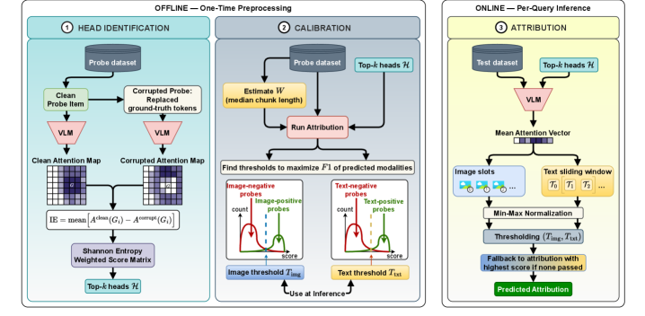
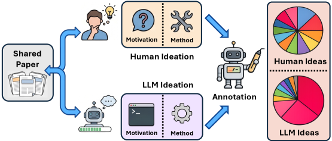
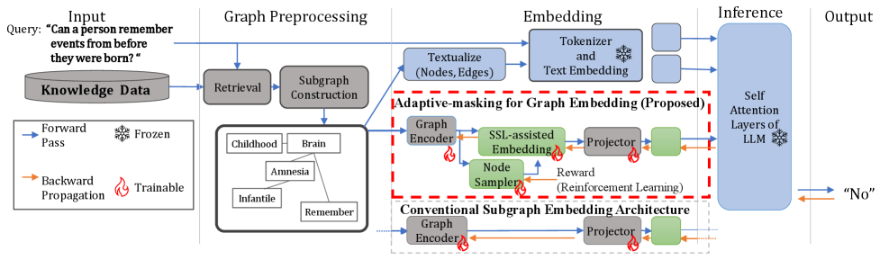

# Daily AI papers — 2026-07-06

*Curated from HF Daily Papers. 9 of 13 papers kept after relevance filter.*

## Papers at a glance

| # | Title | Topics | Org |
| --- | --- | --- | --- |
| 1 | [The Mirage of Optimizing Training Policies (MIPU)](#1-mipu) | `RL`, `reasoning`, `systems` | Tianjin U. / Alibaba |
| 2 | [OrbitQuant: Data-Agnostic Quantization for Diffusion Transformers](#2-orbitquant) | `quantization`, `diffusion`, `efficient-inference` | Cantina Labs / USC / UIUC |
| 3 | [DataComp-VLM: Improved Open Datasets for VLMs](#3-datacomp-vlm) | `multimodal`, `data`, `eval` | LAION / Tübingen / MPI |
| 4 | [AI-Infra-Guard: Multi-Layer Agent Red Teaming](#4-ai-infra-guard) | `safety`, `agents`, `eval` | Tencent Zhuque Lab |
| 5 | [Embodied.cpp: A Portable Inference Runtime for VLA/WAM](#5-embodied-cpp) | `agents`, `efficient-inference`, `systems` | Southeast U. / MSR / Tsinghua |
| 6 | [VLA-Corrector: Detect-and-Correct Inference for VLA Chunking](#6-vla-corrector) | `agents`, `multimodal` | ZJU-OmniAI |
| 7 | [MultAttnAttrib: Training-Free Multimodal Attribution](#7-multattnattrib) | `interp`, `multimodal`, `eval` | Adobe Research (+ collaborators) |
| 8 | [Measuring the Gap Between Human and LLM Research Ideas](#8-human-vs-llm-ideas) | `eval`, `agents` | Yale / U. Chicago |
| 9 | [AGE: Adaptive-Masking for GraphRAG Embeddings](#9-age-graphrag) | `agents`, `retrieval` | OMRON SINIC X |

---

## 1. The Mirage of Optimizing Training Policies: Monotonic Inference Policies as the Real Objective for LLM RL

**Authors:** Jing Liang, Hongyao Tang, Yi Ma, Yancheng He, Weixun Wang, Xiaoyang Li, Ju Huang, Wenbo Su, Jinyi Liu, Yan Zheng, Jianye Hao, Bo Zheng — *Tianjin University / Alibaba*
**Links:** [arXiv:2606.29526](https://arxiv.org/abs/2606.29526) · [HF](https://huggingface.co/papers/2606.29526) · [AlphaXiv](https://www.alphaxiv.org/abs/2606.29526)
**Topics:** `RL`, `reasoning`, `systems`

### TL;DR

LLM RL training runs its rollouts on an inference engine (vLLM, SGLang) but computes gradients on a training engine (Megatron, FSDP). Even with synchronized weights, the two engines disagree on token log-probs, and prior work has framed this as an off-policy nuisance to stabilize. MIPU flips the frame: the *real* objective is monotonic improvement of the **inference** policy, and a step that helps the training policy can silently harm the deployment one.

### Key idea

Define *Monotonic Inference Policy Improvement* (MIPI): a policy update is only useful if it improves the inference-engine policy. The MIPU algorithm builds candidate updates using sampler-referenced gradients (the rollouts came from the inference engine, so use that engine as the reference distribution) and then **selectively accepts** each candidate using an inference-side gap proxy — a trust-region check performed against the inference engine's log-probs, not the training engine's. The training loop resembles PPO's clip step, but the acceptance criterion is drawn from the deployed policy's viewpoint.

### Main finding

Under high train-inference mismatch (two model scales), MIPU improves both **average reasoning performance** and **training stability** over baselines that treat the mismatch as a plain off-policy correction. The paper claims the gains hold across the entire training curve, not just at the final checkpoint.

### Why it matters

Everyone running production LLM RL hits this: vLLM's kernels round differently than the training engine, so the rollouts are always slightly stale even after `load_weights`. Prior fixes (importance sampling, forced re-scoring) attack the symptom; MIPI reframes it as a wrong-objective problem. If the framing holds, it changes what "correct RL" means in practice — the deployed policy becomes a first-class training target.

### Knowledge graph integration

**Builds on / relates to existing pages:**
- [../post-training/_rl.md](../post-training/_rl.md) — adds an inference-vs-training-policy axis to the RL-for-LLMs taxonomy.
- [../post-training/ppo.md](../post-training/ppo.md) — MIPU's accept/reject step is a trust region, computed against the inference engine instead of the training policy.
- [../post-training/grpo.md](../post-training/grpo.md) — most modern LLM RL uses GRPO-shaped rollouts on vLLM; the mismatch problem MIPU targets is universal there.
- [../systems/partial-rollouts.md](../systems/partial-rollouts.md) — the partial-rollout system already introduces stale-segment masking; MIPU is a policy-side complement to that infra-side fix.

**Suggested new pages:**
- `post-training/mipu.md` *(depth)* — MIPI objective + MIPU accept/reject algorithm.
- `systems/training-inference-mismatch.md` *(depth)* — the general problem class (engine kernel drift, off-policyness, gradient-vs-deployment gap) and the family of fixes.

---

## 2. OrbitQuant: Data-Agnostic Quantization for Image and Video Diffusion Transformers

**Authors:** Donghyun Lee, Jitesh Chavan, Duy Nguyen, Sam Huang, Liming Jiang, Priyadarshini Panda, Timo Mertens, Saurabh Shukla — *Cantina Labs / USC / UIUC*
**Links:** [arXiv:2607.02461](https://arxiv.org/abs/2607.02461) · [HF](https://huggingface.co/papers/2607.02461) · [AlphaXiv](https://www.alphaxiv.org/abs/2607.02461)
**Topics:** `quantization`, `diffusion`, `efficient-inference`

### TL;DR

DiT activations shift across timesteps, prompts, and CFG branches, so every published post-training-quantization method needs a fresh calibration set per checkpoint or modality. OrbitQuant sidesteps calibration by *rotating* weights and activations into a normalized basis before quantizing, so range estimation stops mattering. One quantizer works across image and video DiTs with no per-model data.

### Key idea

A pre-quantization orthogonal rotation of the weight matrix so that activation outliers are absorbed into rotated axes with predictable, data-independent range. In the rotated basis, both weights and activations sit in a normalized "orbit" — you can round to INT/FP4 without ever having estimated the min/max on real data. Same rotation, same quantizer, applied across DiT-XL image, video, and CFG-branch generations.

### Main finding

The abstract emphasises the *data-agnostic* property — the same quantizer generalizes across new DiT checkpoints and modalities without recalibration, which is the pain point in production diffusion serving. Quantitative gains against SmoothQuant/GPTQ baselines are promised in the body of the paper (numbers not included in the abstract).

### Why it matters

DiT serving costs are ballooning as models cover image, video, and audio at longer contexts. Calibration data has been the hidden cost — every new fine-tune re-does it. A rotate-then-round quantizer that ignores calibration data is a big deal for serving stacks that ship many DiT variants (e.g. Sora-style products with hundreds of fine-tuned aspect ratios).

### Knowledge graph integration

**Builds on / relates to existing pages:**
- [../quantization/_number-formats.md](../quantization/_number-formats.md) — sits in the low-bit weight/activation lane.
- [../quantization/README.md](../quantization/README.md) — extends the PTQ family with a data-agnostic entry.
- [../pre-training/fp8-training.md](../pre-training/fp8-training.md) — rotation-based outlier absorption is used on the training side too; nice cross-reference.

**Suggested new pages:**
- `quantization/orbitquant.md` *(depth)* — the rotation-then-round mechanism and DiT-specific choices.
- `quantization/_ptq.md` *(taxonomy)* — PTQ family (GPTQ, AWQ, SmoothQuant, OrbitQuant): data-dependent vs data-agnostic axes.
- `quantization/rotation-based-quantization.md` *(depth)* — general "rotate the basis before quantizing" pattern (also underlies QuaRot, SpinQuant).

---

## 3. DataComp-VLM: Improved Open Datasets for Vision-Language Models

**Authors:** Matteo Farina, Vishaal Udandarao, Thao Nguyen, Selim Kuzucu, … Ludwig Schmidt, Nikhil Parthasarathy (35 authors) — *LAION / Tübingen / MPI / Stanford / Google Research (multi-org)*
**Links:** [arXiv:2606.28551](https://arxiv.org/abs/2606.28551) · [HF](https://huggingface.co/papers/2606.28551) · [AlphaXiv](https://www.alphaxiv.org/abs/2606.28551)
**Topics:** `multimodal`, `data`, `eval`

### TL;DR

DataComp for VLMs (DCVLM) is a benchmark that fixes the *training* pipeline and lets you swap the *data pipeline*, so curation strategies (filtering, mixing, formatting, sampling) can be compared apples-to-apples across 1B–8B VLMs and 6.25B–200B token budgets. The corpus: 160 datasets, 6T multimodal tokens across image-caption, interleaved docs, text-only, and instruction data. The headline conclusion — **data mixing, not filtering, is the main lever** — flips the DataComp-1B story for VLMs.

### Key idea

Steal the DataComp harness (fixed model + fixed compute → data as the only variable) and port it to VLMs, but partition the corpus into four *type-labeled* pools instead of one bag. Participants tune the mixture across pools, filter within pools, and reformat as they like. Downstream evaluation is a 52-benchmark suite across 9 domains, aggregated to a 33-task core score.

### Main finding

Across 1B–8B VLMs and 6.25B–200B tokens, **instruction-heavy mixtures scale better than caption-heavy ones**, with the gap widening at larger scales. The provided DCVLM-Baseline hits **63.6%** on the 33-task core suite with an 8B model at 200B tokens — **+5.4pp over FineVision**, the previous open SOTA VLM training corpus.

### Why it matters

Open VLM training has been bottlenecked on data recipes, not on model tricks. A shared harness where anyone can plug in a curation strategy and get a comparable number is what the community has been missing. The mixing-beats-filtering finding also reframes the "filter harder" narrative that dominated LLM data work — for VLMs, portfolio composition is the primary knob.

### Knowledge graph integration

**Builds on / relates to existing pages:**
- [../data/_data-curation.md](../data/_data-curation.md) — the mix-vs-filter finding is a direct entry for the data-curation taxonomy.
- [../data/quality-filtering.md](../data/quality-filtering.md) — provides an important VLM-side counterweight to the filtering-first story.
- [../data/dolma.md](../data/dolma.md) — DCVLM is to VLMs what Dolma is to LLMs: an open, well-documented training corpus.
- [../multimodal/README.md](../multimodal/README.md) — anchors data-side benchmarks in the multimodal section.
- [../evaluation/README.md](../evaluation/README.md) — 52-benchmark suite feeds the evaluation portion of the graph.

**Suggested new pages:**
- `data/dcvlm.md` *(depth)* — DCVLM harness + DCVLM-Baseline recipe.
- `multimodal/vlm-data-mixing.md` *(depth)* — the mix-vs-filter finding, specific ratios, scaling behavior.

---

## 4. AI-Infra-Guard: Securing the AI Agent — A Unified Framework for Multi-Layer Agent Red Teaming

**Authors:** Yong Yang, Xing Zheng, Huiyu Wu, Huangsheng Cheng, Xiaorong Shi, Jing Guo, Bo Yang, Yi Zhou, Xiangfan Wu, Zonghao Ying — *Tencent Zhuque Lab*
**Links:** [arXiv:2606.31227](https://arxiv.org/abs/2606.31227) · [HF](https://huggingface.co/papers/2606.31227) · [AlphaXiv](https://www.alphaxiv.org/abs/2606.31227)
**Topics:** `safety`, `agents`, `eval`

### TL;DR

An open-source unified framework for red teaming AI agents across four stratified layers — infrastructure (serving engines, MCP servers), protocol/tool (MCP + agent-skill packages), agent behavior (multi-turn black-box attacks), and model (jailbreak harness with 26+ attack operators). The framing: no single detection paradigm fits all layers, so match a paradigm to each — rules for infra CVEs, LLM-driven auditing for tool packages, black-box multi-turn for behavior, prompt attacks for the model.

### Key idea

*Layer-paradigm matching* as an organizing principle for agent security. Deterministic rules over 75+ AI components + 1,400+ vulnerability signatures at the infra layer; agentic LLM auditors chasing malicious code in MCP servers and skills at the tool layer; multi-turn black-box red teamers at the behavior layer; a jailbreak harness with 26 operators over 16 datasets at the model layer. Each paradigm has its correct scope; smashing them into one pipeline loses signal.

### Main finding

Positions itself as the only open-source framework to cover all four layers simultaneously, with meaningful coverage at each: 75+ AI infra components, 1,400+ vuln rules, MCP-server + agent-skill supply-chain auditing (a category most existing red teamers miss entirely), and a jailbreak harness comparable in breadth to standalone tools like HarmBench.

### Why it matters

Agent security is currently a scattered pile of one-off tools — jailbreak benchmarks in one repo, MCP-server scanners in another, supply-chain scans nowhere. The layered taxonomy gives the community a stable frame to plug in; the supply-chain auditing of *agent skills* (extensions you install into an agent) is a real gap — one bad skill in a marketplace is 2024's malicious npm package all over again.

### Knowledge graph integration

**Builds on / relates to existing pages:**
- [../safety/_attacks.md](../safety/_attacks.md) — extends attack taxonomy from single-model prompts to multi-layer agent surface.
- [../safety/_jailbreaks.md](../safety/_jailbreaks.md) — the model-layer jailbreak harness slots directly here.
- [../safety/cot-monitoring.md](../safety/cot-monitoring.md) — behavior-layer black-box red teaming is the offensive twin of CoT monitoring's defense.
- [../agents/README.md](../agents/README.md) — the agent stack the framework attacks (MCP, skills, tool loops).

**Suggested new pages:**
- `safety/_agent-red-teaming.md` *(taxonomy)* — the four-layer stratification with paradigm-per-layer choices.
- `safety/mcp-server-audit.md` *(depth)* — LLM-driven MCP-server / agent-skill supply-chain auditing.
- `case-studies/ai-infra-guard.md` *(case study)* — full framework breakdown across the four layers.

---

## 5. Embodied.cpp: A Portable Inference Runtime of Embodied AI Models on Heterogeneous Robots

**Authors:** Ling Xu, Chuyu Han, Borui Li, Hao Wu, Shiqi Jiang, Ting Cao, Chuanyou Li, Sheng Zhong, Shuai Wang — *Southeast University / Nanjing University / Microsoft Research / Tsinghua AIR*
**Links:** [arXiv:2607.02501](https://arxiv.org/abs/2607.02501) · [HF](https://huggingface.co/papers/2607.02501) · [AlphaXiv](https://www.alphaxiv.org/abs/2607.02501)
**Topics:** `agents`, `efficient-inference`, `systems`

*Borderline: kept because it's a `llama.cpp`-shaped inference runtime for foundation-model VLA/WAM deployment — an infra piece with implications well beyond robotics.*

### TL;DR

A C++ inference runtime for embodied foundation models (VLA + world-action models). Existing runtimes assume request-response serving; embodied deployment needs multi-rate closed-loop execution, latency-first batch-1 inference on heterogeneous edge hardware, and typed IO beyond fixed tokens. Embodied.cpp factors the shared execution path into five layers — input adapters, sequence builders, backbone execution, head plugins, deployment adapters — so a single backend supports many models and robots.

### Key idea

Analyze representative VLA models (HY-VLA, π0.5) and WAMs, extract the common execution shape, and expose it as five plug-in points. The backbone (usually a transformer) runs through one accelerator abstraction; per-model quirks live in adapters and head plugins. Multi-rate execution means the perception, planning, and action heads can tick at different frequencies inside the same model call — a real constraint in closed-loop control that request-response runtimes miss entirely.

### Main finding

Deployment measurements on two VLAs — **100.0% success on HY-VLA, 91.0% on π0.5** in closed-loop tasks — plus a WAM benchmark on a LingBot-VA transformer block cutting **312.2 → 88.1 MiB** memory for a single block. The runtime preserves accuracy while unifying the deployment surface.

### Why it matters

VLA / world-model deployment has been stuck in Python + PyTorch on the robot side — great for research, painful for edge. A C++ runtime that decomposes the model into a clean five-layer plugin architecture is a direct analog to `llama.cpp`'s role for LLMs. Multi-rate closed-loop scheduling in the inference runtime is a genuinely new pattern for the serving-engine literature; the same idea applies to agents that combine slow deliberative reasoning with fast reactive tool calls.

### Knowledge graph integration

**Builds on / relates to existing pages:**
- [../inference/README.md](../inference/README.md) — pushes the inference-runtime frontier from token serving to closed-loop control.
- [../agents/README.md](../agents/README.md) — VLA/WAM are the embodied wing of the agent stack.

**Suggested new pages:**
- `inference/embodied-runtime.md` *(depth)* — the five-layer plugin architecture and multi-rate scheduling.
- `agents/_vla.md` *(taxonomy)* — VLA / WAM family (would slot Embodied.cpp as a system-level entry alongside modeling papers).

---

## 6. VLA-Corrector: Lightweight Detect-and-Correct Inference for Adaptive Action Horizon

**Authors:** Yi Pan, Miao Pan, Qi Lu, Jiaming Huang, Man Zhang, Siteng Huang, Xin Li, Jie Zhang, Yongliang Shen, Xuhong Zhang, Wenqi Zhang — *ZJU-OmniAI (Zhejiang University)*
**Links:** [arXiv:2607.01804](https://arxiv.org/abs/2607.01804) · [HF](https://huggingface.co/papers/2607.01804) · [AlphaXiv](https://www.alphaxiv.org/abs/2607.01804)
**Topics:** `agents`, `multimodal`

*Borderline: kept because VLA models are LLM/VLM-post-training targets and the fix ("test-time gradient guidance for chunked action planning") transfers to any chunked-decoding LLM system.*

### TL;DR

VLA models plan actions in chunks — 8 or 16 actions predicted at once, then executed. Long chunks let the model amortize planning cost but lose closed-loop reactivity; if the world changes mid-chunk, the plan is wrong. VLA-Corrector adds a **lightweight latent-space vision monitor** that watches for divergence between the planned and observed trajectory and triggers *Online Gradient Guidance* — a test-time gradient step on the action decoder — to correct without discarding the chunk.

### Key idea

Two moves on top of an existing VLA backbone: (1) a small monitor head trained to score whether the current visual state agrees with the model's internal expectation for the current action step; (2) when disagreement crosses a threshold, run a few steps of gradient-based correction of the remaining actions in the chunk — the model's own gradients w.r.t. the decoded actions, computed at inference time. Adaptive action horizon = the chunk length adapts to how confident the monitor is.

### Main finding

Improves robustness on contact-rich manipulation tasks (numbers in-paper) while keeping the latency of chunked decoding. Positioned as a plug-in for existing VLA models rather than a new architecture.

### Why it matters

Chunked action decoding is the VLA analog of speculative decoding — both trade sync overhead for parallel speculation, both need a correctness check. VLA-Corrector's monitor + gradient-guidance recipe is a lightweight, model-agnostic replanning primitive; the same detect-and-correct idea generalizes to any LLM system that speculates across multiple future tokens or actions.

### Knowledge graph integration

**Builds on / relates to existing pages:**
- [../agents/README.md](../agents/README.md) — closed-loop VLA execution is the embodied-agent story.
- [../inference/README.md](../inference/README.md) — the detect-and-correct pattern is a serving-time technique, close in spirit to speculative-decoding verification.

**Suggested new pages:**
- `agents/action-chunk-correction.md` *(depth)* — lightweight monitor + online gradient guidance for chunked action planning.
- `agents/_vla.md` *(taxonomy)* — inference-side wing of the VLA family (chunking, correction, adaptive horizons).

---

## 7. MultAttnAttrib: Training-Free Multimodal Attribution in Long Document Question Answering

**Authors:** Dang Quang Thien Tran, Quang V. Dang, Vinamra Tyagi, Sai Soorya Rao Veeravalli, Trang Nguyen, Ryan A. Rossi, Franck Dernoncourt, Nedim Lipka, Koustava Goswami, Samyadeep Basu — *Adobe Research (+ collaborators)*
**Links:** [arXiv:2607.01420](https://arxiv.org/abs/2607.01420) · [HF](https://huggingface.co/papers/2607.01420) · [AlphaXiv](https://www.alphaxiv.org/abs/2607.01420)
**Topics:** `interp`, `multimodal`, `eval`

### TL;DR

A training-free method that reads a VLM's prefill-pass attention on selected heads to attribute each part of an answer back to spans in a multimodal source document — text + images — without any prompting or fine-tuning. Ships with MultAttrEval, the first benchmark for fine-grained multimodal attribution in long-form documents. Matches frontier prompting-based attribution while running at **~1/7 the latency**.

### Key idea

Cherry-pick a small subset of attention heads whose prefill activations correlate with source evidence, threshold them against a calibrated baseline, and read out per-answer-token attribution maps in one forward pass. No answer-time prompting, no separate attribution model, no retraining — just a head-selection + threshold-calibration step at setup time.

### Main finding

Beats every prompting-based attribution baseline the authors compare against, matches GPT-5.4-class direct-attribution prompting on their new MultAttrEval benchmark, and does so at **up to 7× lower inference latency** than the base-model direct-prompt approach.

### Why it matters

Grounded QA systems ship in production assistants now, and hallucinated-source claims are a real reliability tax. A training-free, prefill-only attribution method is deployable behind existing VLM endpoints with almost no cost. The head-selection framing is also useful for interp — it's another data point that *specific heads carry source-evidence signal*, which lines up with the copy/index-head literature on text LLMs.

### Knowledge graph integration

**Builds on / relates to existing pages:**
- [../interpretability/README.md](../interpretability/README.md) — head-role identification and prefill-pass probing are core interp techniques.
- [../multimodal/README.md](../multimodal/README.md) — multimodal attribution is a first-class VLM safety/reliability lever.
- [../evaluation/README.md](../evaluation/README.md) — MultAttrEval fills a benchmark gap.

**Suggested new pages:**
- `interpretability/attention-attribution.md` *(depth)* — head-selection + threshold-calibration for attribution.
- `evaluation/multattreval.md` *(depth)* — the fine-grained multimodal attribution benchmark.

---

## 8. Measuring the Gap Between Human and LLM Research Ideas

**Authors:** Ziyu Chen, Yilun Zhao, Arman Cohan — *Yale University / University of Chicago*
**Links:** [arXiv:2607.01233](https://arxiv.org/abs/2607.01233) · [HF](https://huggingface.co/papers/2607.01233) · [AlphaXiv](https://www.alphaxiv.org/abs/2607.01233)
**Topics:** `eval`, `agents`

### TL;DR

Existing "LLMs generate research ideas" evals score individual ideas by novelty or expert preference. This paper measures the *distributional* gap: given the same prior-work context that inspired a real paper, does the LLM cluster its ideas in the same regions of "research taste" space as human researchers do? Answer: LLM ideas concentrate around bridge-like opportunities and synthesis methods; human ideas spread more broadly.

### Key idea

Reverse-engineer each real paper into a prior-work context (the papers it likely built on), then re-prompt LLMs from that same context. Score each idea along two axes — **opportunity pattern** (gap, bridge, contrast, extension, …) and **research paradigm** (empirical, theoretical, synthesis, methods, …). Compare the human-vs-LLM densities per cell to quantify divergence rather than pointwise novelty.

### Main finding

LLM-generated ideas cluster heavily in bridge-and-synthesis cells. Human paper distributions spread across gap-framing, contrast, and extension patterns with paradigm diversity that the LLMs don't reproduce. The gap is systematic across the leading models tested, not tied to any single one.

### Why it matters

The AI-scientist frame is spreading (auto research agents, deep-research systems), and "one novel idea" evals hide a bias in what gets proposed. Distributional profiling gives a way to measure whether an ideation system is filling a niche or narrowing the field. Complements existing agent research-benchmark work by moving the evaluation from *quality* to *diversity of framings*.

### Knowledge graph integration

**Builds on / relates to existing pages:**
- [../evaluation/README.md](../evaluation/README.md) — a new benchmark class (distributional ideation evaluation).
- [../agents/README.md](../agents/README.md) — AI-scientist / deep-research agents are the primary object being profiled.

**Suggested new pages:**
- `evaluation/human-vs-llm-ideation.md` *(depth)* — the two-axis research-taste taxonomy and the density-gap metric.

---

## 9. AGE: Adaptive-Masking for Graph Embedding in Graph Retrieval-Augmented Generation

**Authors:** Atsushi Hashimoto, Bao Long Nguyen Huu — *OMRON SINIC X Corporation*
**Links:** [arXiv:2607.00052](https://arxiv.org/abs/2607.00052) · [HF](https://huggingface.co/papers/2607.00052) · [AlphaXiv](https://www.alphaxiv.org/abs/2607.00052)
**Topics:** `agents`, `retrieval`

*Borderline: kept as a training-side technique for GraphRAG — the "graph encoder for frozen LLMs" gap is real, and adaptive masking generalizes beyond graphs.*

### TL;DR

GraphRAG feeds graph-structured knowledge to a frozen LLM but the graph embedding and the LLM's text embedding live in different latent spaces. AGE trains a Transformer graph encoder via masked self-supervised learning — the twist is a **learnable node sampler** that avoids masking dominant "key" nodes, since predicting a key node from context is impossible and wastes training signal.

### Key idea

Copy the BERT-style masked-modeling recipe onto graphs, then fix the mask distribution. Graphs are much sparser than natural language: a handful of hub nodes carry most contextual information, and masking one makes the reconstruction task ill-defined. A learnable sampler selects non-key nodes to mask; the encoder trains on tractable reconstructions, and the resulting embeddings align better with text-side latent structure.

### Main finding

Improves non-parametric-search GraphQA methods across four benchmark datasets with distinct characteristics (unspecified numbers in the abstract, but the "four benchmarks with distinct characteristics" claim is the shape of the evidence).

### Why it matters

GraphRAG is a live wire in production retrieval — many enterprise KBs are graph-shaped and text-embedding retrieval loses schema. AGE's adaptive-masking trick is a genuinely portable idea: any SSL objective on a sparse graph structure will hit the same "dominant nodes are impossible to predict" wall. The technique also generalizes to entity linking and code-graph retrieval.

### Knowledge graph integration

**Builds on / relates to existing pages:**
- [../agents/README.md](../agents/README.md) — retrieval is the tool-layer of many agent stacks; GraphRAG is one flavor.

**Suggested new pages:**
- `agents/graph-rag.md` *(depth)* — GraphRAG basics + the adaptive-masking encoder.
- `agents/_retrieval.md` *(taxonomy)* — vector, sparse, graph, and hybrid retrieval as agent tools.

---

## Notes

- **Skipped papers (4):** *Interpretation-Oriented Cloud Removal* (remote-sensing CV), *AnyBokeh* (photographic bokeh editing), *Teaching LLMs to Recommend and Defer in Underrepresented Epilepsy Care* (medical application, no transferable method), *Generated Contents Enrichment* (scene-graph→image generation, off-topic).
- **Borderline inclusions** flagged in-section: Embodied.cpp, VLA-Corrector, AGE.
- Hero figures live in `assets/2026-07-06/`. All 9 kept papers have working hero figures (fetched from the arXiv HTML mirror).
- No frontier-model tech report today — Phase 3 will be skipped.
- This digest is informational. No existing concept files, `READING-LIST.md`, or `PAPERS.md` were modified to produce it.
