# Daily AI papers — 2026-07-07

*Curated from HF Daily Papers. 15 of ~40 papers kept after relevance filter.*

## Papers at a glance

| # | Title | Topics | Org |
| --- | --- | --- | --- |
| 1 | [InternVLA-A1.5: Unifying Understanding, Latent Foresight, and Action](#1-internvla-a15) | `multimodal`, `VLA`, `world-model`, `agents` | Shanghai AI Lab / Tsinghua / SJTU |
| 2 | [Vision Pretraining for Dense Spatial Perception](#2-vision-pretraining-for-dense-spatial-perception) | `multimodal`, `pretraining`, `self-supervised` | Ant Group / Westlake |
| 3 | [ResearchStudio-Idea: Evidence-Grounded Research-Ideation Skill Suite](#3-researchstudio-idea) | `agents`, `eval`, `research` | Microsoft Research / NTU / NUS |
| 4 | [GigaWorld-1: World Models for Robot Policy Evaluation](#4-gigaworld-1) | `world-model`, `eval`, `multimodal`, `VLA` | GigaAI / Tsinghua |
| 5 | [UI-MOPD: Multi-Platform On-Policy Distillation for GUI Agents](#5-ui-mopd) | `agents`, `distillation`, `GUI`, `continual` | Xiaomi / PCL |
| 6 | [PixWorld: Unifying 3D Scene Generation and Reconstruction in Pixel Space](#6-pixworld) | `diffusion`, `3D`, `generation`, `multimodal` | (undisclosed) |
| 7 | [ResearchStudio-Reel: Paper → Poster/Video/Blog Skill Suite](#7-researchstudio-reel) | `agents`, `research`, `tool-use` | Microsoft Research / NUS / NTU |
| 8 | [MANCE: Manifold-Aware Concept Erasure](#8-mance) | `interp`, `safety`, `concept-erasure` | Bar-Ilan / AI2 |
| 9 | [OmniOpt: Taxonomy, Geometry, and Benchmarking of Modern Optimizers](#9-omniopt) | `pretraining`, `optimizer`, `eval` | Westlake / Shanghai AI Lab |
| 10 | [Wan-Streamer v0.2: Higher Resolution, Same Latency](#10-wan-streamer-v02) | `multimodal`, `streaming`, `video`, `audio` | Tongyi Lab / Alibaba |
| 11 | [KVpop: KV Cache Compression with Predictive Online Pruning](#11-kvpop) | `KV-cache`, `efficient-inference` | JKU Linz |
| 12 | [dOPSD: On-Policy Self-Distillation for Diffusion Language Models](#12-dopsd) | `diffusion-LLM`, `distillation`, `reasoning`, `RL` | (undisclosed) |
| 13 | [Perceptual Flow Matching for Few-Step Generative Modeling](#13-perceptual-flow-matching) | `diffusion`, `flow-matching`, `distillation` | Joy Future / Fudan / Tsinghua / USTC |
| 14 | [LLM-as-a-Verifier: A General-Purpose Verification Framework](#14-llm-as-a-verifier) | `eval`, `verifier`, `reasoning`, `agents` | Stanford / Berkeley / NVIDIA |
| 15 | [Safety Testing LLM Agents at Scale (Vera)](#15-vera-safety-testing) | `safety`, `agents`, `eval` | Ant Group / Zhejiang / Fudan / Alibaba |

---

## 1. InternVLA-A1.5

**Authors:** Haoxiang Ma, Junhao Cai, Yao Mu, Weinan Zhang, Jiangmiao Pang, et al. — *Shanghai AI Lab · Tsinghua · SJTU*
**Links:** [arXiv:2607.04988](https://arxiv.org/abs/2607.04988) · [HF](https://huggingface.co/papers/2607.04988) · [AlphaXiv](https://www.alphaxiv.org/abs/2607.04988)
**Topics:** `multimodal`, `VLA`, `world-model`, `agents`

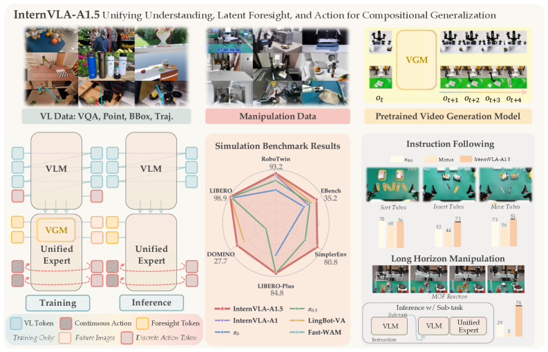

### TL;DR

A unified robot manipulation policy that keeps a pretrained VLM backbone semantically alive (its VQA/subtask heads keep training) while attaching a lightweight expert head for continuous actions, and — crucially — outsources "what happens next" to a *frozen* pretrained video generator distilled into a handful of learnable "foresight" latent tokens. The video branch is thrown away at inference so real-time control is preserved.

### Key idea

Latent foresight: a small set of learnable tokens queries a frozen video-generator teacher to compress the task-relevant future into a compact code that conditions the action head. This turns future prediction into a latent-space distillation problem instead of pixel-level generation from scratch — the policy inherits dynamics priors without paying pixel decoding at train or inference time.

### Main finding

Best overall results on all six simulation benchmarks (undisclosed absolute numbers in the abstract) after pretraining on 1.2M robot episodes + 3M multimodal samples; strongest real-world compositional generalization on held-out instruction bindings, and stable long-horizon execution. Video branch discarded at inference → same latency as a bare policy head.

### Why it matters

VLAs have been leaking VLM semantics under multi-objective training and struggling to exploit video-generation priors. Latent foresight is a clean recipe for keeping pretrained backbones intact while borrowing a video model's world knowledge — a template other multimodal systems can copy.

### Knowledge graph integration

**Builds on / relates to existing pages:**
- [multimodal/README.md](../multimodal/README.md) — multimodal-LLM folder overview; VLA is the action-augmented cousin.
- [agents/README.md](../agents/README.md) — foundation-model-based policies.

**Suggested new pages:**
- `multimodal/vla.md` *(depth)* — vision-language-action policies as a class.
- `multimodal/latent-foresight.md` *(depth)* — distilling a frozen video generator into latent foresight tokens.
- `multimodal/_world-models.md` *(taxonomy)* — video/action world models and their evaluator vs generator uses.

---

## 2. Vision Pretraining for Dense Spatial Perception

**Authors:** Zelin Fu, Bin Tan, Changjiang Sun, Shaohui Liu, Kecheng Zheng, Yinghao Xu, Xing Zhu, Yujun Shen, Nan Xue — *Ant Group / Westlake*
**Links:** [arXiv:2607.05247](https://arxiv.org/abs/2607.05247) · [HF](https://huggingface.co/papers/2607.05247) · [AlphaXiv](https://www.alphaxiv.org/abs/2607.05247)
**Topics:** `multimodal`, `pretraining`, `self-supervised`

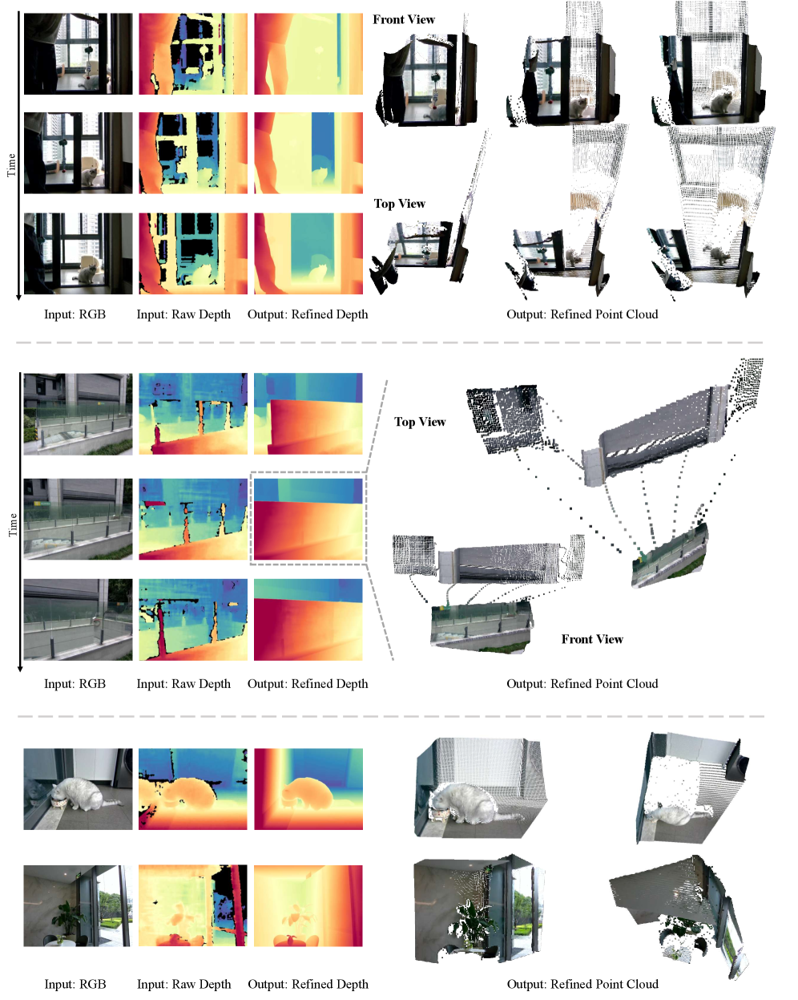

### TL;DR

A self-supervised vision-encoder pretraining objective that centers on *boundaries*: it learns sub-pixel boundary representations on the fly, then uses the boundary-bearing tokens as masked reconstruction targets. Modern visual foundation models over-index on semantic invariance and lose the geometric detail needed for dense spatial perception; this "masked boundary modeling" (MBM) claims to bring it back without hand-engineered signals.

### Key idea

Masked Boundary Modeling: dynamically discover sub-pixel boundaries during training, sample masked patches around those boundaries, and reconstruct them. The mask distribution is boundary-conditioned rather than uniform, forcing the encoder to encode shape discontinuities — the cues most predictive of geometry.

### Main finding

Positioned as improving dense spatial perception (depth, normals, dense correspondence) over semantic-invariance-heavy backbones; absolute numbers not in the abstract, but the paper argues MBM restores geometric fidelity that CLIP/DINO-style objectives smear over.

### Why it matters

Vision encoders feed most VLMs and VLAs — an encoder that keeps geometric detail without giving up semantic transfer directly upgrades the downstream stack (see InternVLA-A1.5 above). It's also a general recipe for "mask where information lives" that could transfer to non-vision modalities.

### Knowledge graph integration

**Builds on / relates to existing pages:**
- [multimodal/README.md](../multimodal/README.md) — vision encoders are the entry point for VLMs.
- [pre-training/README.md](../pre-training/README.md) — self-supervised pretraining objective.

**Suggested new pages:**
- `multimodal/masked-boundary-modeling.md` *(depth)* — the MBM objective.
- `multimodal/vision-encoder-pretraining.md` *(taxonomy)* — MIM / CLIP-style / boundary-aware landscape.

---

## 3. ResearchStudio-Idea

**Authors:** Qihao Zhao, Yangyu Huang, Yalun Dai, Lingao Xiao, Jianjun Gao, et al. — *Microsoft Research · NTU · NUS · A*STAR CFAR*
**Links:** [arXiv:2607.04439](https://arxiv.org/abs/2607.04439) · [HF](https://huggingface.co/papers/2607.04439) · [AlphaXiv](https://www.alphaxiv.org/abs/2607.04439)
**Topics:** `agents`, `eval`, `research`

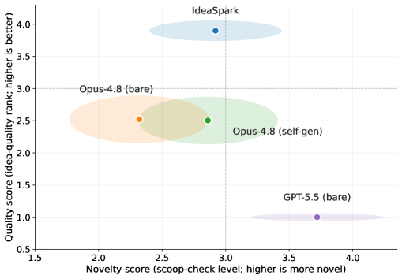

### TL;DR

A research-ideation agent framed as a *skill suite* rather than a monolithic prompt: Paper-Search does multi-source retrieval, Scoop-Check validates novelty against the literature, and IdeaSpark composes them into an end-to-end workflow. The suite is grounded in 15 reusable ideation patterns mined from 1,947 accepted ICLR/ICML/NeurIPS papers (2021–2025).

### Key idea

Skills = thin, agent-readable contracts wrapping deterministic primitives with a measured-fill loop. The novelty check is grounded in embedding search over prior literature and a "scoop" detection heuristic. IdeaSpark composes the primitives via one of 15 templated ideation patterns extracted from empirical conference outcomes.

### Main finding

Blind automated evaluation ranks IdeaSpark higher than baseline ideation systems on proposal quality while keeping competitive novelty. Grounding proposals in retrieved evidence beats one-shot brainstorm baselines.

### Why it matters

An empirical taxonomy of what actually gets accepted at top ML venues, packaged as agent skills. Points at "skill suite" as a durable interface — narrower than agent frameworks, more composable than prompts — that this and its sibling ResearchStudio-Reel share.

### Knowledge graph integration

**Builds on / relates to existing pages:**
- [agents/README.md](../agents/README.md) — agent skill orchestration folder.
- [evaluation/README.md](../evaluation/README.md) — blind pairwise LLM evaluation.

**Suggested new pages:**
- `agents/skill-suites.md` *(depth)* — the "thin agent-readable contract" pattern.
- `agents/research-ideation.md` *(depth)* — evidence-grounded ideation loops.

---

## 4. GigaWorld-1

**Authors:** Zheng Zhu, Jiwen Lu, et al. (25 authors) — *GigaAI · Tsinghua*
**Links:** [arXiv:2607.02642](https://arxiv.org/abs/2607.02642) · [HF](https://huggingface.co/papers/2607.02642) · [AlphaXiv](https://www.alphaxiv.org/abs/2607.02642)
**Topics:** `world-model`, `eval`, `multimodal`, `VLA`

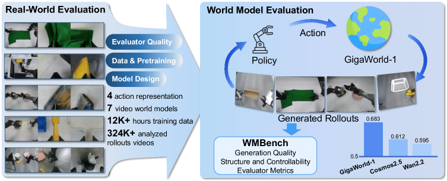

### TL;DR

A systematic study of what makes a video world model a *reliable evaluator* of robot policies, plus WMBench — a benchmark of 324,000 simulated rollouts paired with real robot executions — and GigaWorld-1, a world model post-trained specifically for policy evaluation. The core question isn't "which model generates prettier video" but "which one predicts what the real robot would have done."

### Key idea

Evaluator quality is dominated by long-horizon, action-faithful rollout consistency — not short-term visual realism. The paper factors world-model design into pretraining mixture, action encoding, memory design, and evaluator-focused post-training, then measures each factor's contribution to real-vs-sim policy ranking agreement.

### Main finding

Three concrete insights: (a) short-term visual realism is the wrong metric — long-horizon action fidelity matters; (b) pretraining gains stem from balancing world knowledge with robot-specific controllability, not pure scale; (c) architectural choices (action encoding, memory, evaluator post-training) dominate alignment with real behavior. GigaWorld-1 realizes the roadmap and is released with code, models, and 12,000+ hours of training video.

### Why it matters

Real-world policy rollouts are the bottleneck in embodied AI. If world models can replace even a subset of real rollouts, evaluation throughput jumps by orders of magnitude. WMBench also lets the field compare world models on the metric that actually matters for downstream use.

### Knowledge graph integration

**Builds on / relates to existing pages:**
- [evaluation/README.md](../evaluation/README.md) — evaluation-methodology folder.
- [multimodal/README.md](../multimodal/README.md) — video foundation models.
- [agents/README.md](../agents/README.md) — foundation-model policies being evaluated.

**Suggested new pages:**
- `evaluation/world-model-eval.md` *(depth)* — world models as surrogate policy evaluators.
- `case-studies/gigaworld-1.md` *(case study)* — the roadmap + WMBench.
- `multimodal/_world-models.md` *(taxonomy)* — shared with paper 1.

---

## 5. UI-MOPD

**Authors:** Alan Chen, Zhehao Yu, Chengzhen Duan, Fazhan Liu, Hui Liu, Pei Fu, Jian Luan, Yaowei Wang, Shu-Tao Xia, Jinpeng Wang — *Xiaomi · Peng Cheng Lab*
**Links:** [arXiv:2607.04425](https://arxiv.org/abs/2607.04425) · [HF](https://huggingface.co/papers/2607.04425) · [AlphaXiv](https://www.alphaxiv.org/abs/2607.04425)
**Topics:** `agents`, `distillation`, `GUI`, `continual`

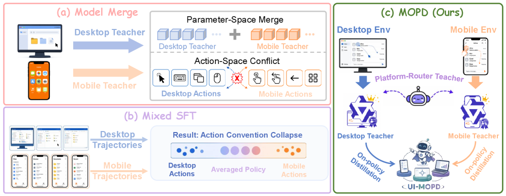

### TL;DR

Continual learning for GUI agents that see new platforms (Android → iOS → Web → …) without catastrophically forgetting old ones. The recipe is multi-platform on-policy distillation: the agent's own rollouts on the current platform provide the training distribution, while a teacher supplies per-step supervision that regularizes drift on prior platforms.

### Key idea

On-policy distillation for agents: instead of collecting fresh trajectories per platform and re-fine-tuning (which forgets), sample from the student policy on the new platform, ask the teacher to score/label each state, and update on the resulting KL. Prior-platform capability is preserved by mixing in teacher-scored student rollouts on those older platforms — a distillation-based rehearsal.

### Main finding

38.2% and 12.0% task success on the two most-challenging benchmarks; competitive cross-platform capability retention while adapting to new platforms — the two axes the paper explicitly measures.

### Why it matters

GUI/computer-use agents are moving toward continual deployment where platforms multiply. On-policy distillation is a compact answer to the forgetting problem that avoids heavyweight replay buffers. The technique generalizes to any agent domain with drifting environments.

### Knowledge graph integration

**Builds on / relates to existing pages:**
- [agents/README.md](../agents/README.md) — agent/tool-use folder.
- [post-training/_post-training.md](../post-training/_post-training.md) — post-training taxonomy.
- [post-training/_rl.md](../post-training/_rl.md) — on-policy vs off-policy sampling.

**Suggested new pages:**
- `post-training/on-policy-distillation.md` *(depth)* — the general on-policy distillation loss + rehearsal.
- `agents/gui-agents.md` *(depth)* — GUI-agent training recipe class.

---

## 6. PixWorld

**Authors:** (not extractable from HF page) — *Undisclosed*
**Links:** [arXiv:2607.05373](https://arxiv.org/abs/2607.05373) · [HF](https://huggingface.co/papers/2607.05373) · [AlphaXiv](https://www.alphaxiv.org/abs/2607.05373)
**Topics:** `diffusion`, `3D`, `generation`, `multimodal`

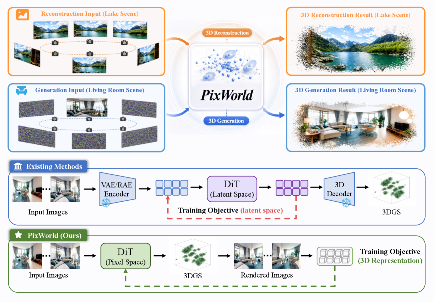

### TL;DR

A single pixel-space model that does both 3D scene generation and reconstruction — the two are usually separate pipelines (a generator that hallucinates novel views vs. a solver that fits to observations). PixWorld argues they're the same operation under different conditioning, and unifies them in raw pixel space rather than in a compressed latent.

### Key idea

Pixel-space diffusion over multi-view scene tensors, with generation and reconstruction differentiated only by which views are provided as conditioning and which are marked as targets. Skipping the VAE latent lets the model preserve high-frequency geometric detail that latent codecs tend to smear.

### Main finding

Details not extractable from the HF text preview — the paper's landing page here surfaces methodology and experiments rather than a headline abstract. Positioned as competitive with specialized generators *and* specialized reconstructors, without pipeline-switching.

### Why it matters

Two big trends collide: (a) pixel-space (VAE-free) diffusion catching up on quality now that few-step samplers exist (see paper 13), and (b) the collapse of "generate" vs "reconstruct" into one conditioning problem — mirroring how VLMs collapsed "generate caption" vs "answer question."

### Knowledge graph integration

**Builds on / relates to existing pages:**
- [multimodal/README.md](../multimodal/README.md) — multimodal generative models folder.

**Suggested new pages:**
- `multimodal/pixel-space-diffusion.md` *(depth)* — VAE-free image/video diffusion tradeoffs.

*Borderline: 3D scene generation edges toward "pure CV" but the pixel-space diffusion angle is directly transferable to image/video/audio generative modeling in the graph's scope.*

---

## 7. ResearchStudio-Reel

**Authors:** Lingao Xiao, Yalun Dai, Yangyu Huang, Qihao Zhao, et al. — *Microsoft Research · NUS · NTU · Tsinghua · PKU · SJTU · Westlake · A*STAR*
**Links:** [arXiv:2607.04438](https://arxiv.org/abs/2607.04438) · [HF](https://huggingface.co/papers/2607.04438) · [AlphaXiv](https://www.alphaxiv.org/abs/2607.04438)
**Topics:** `agents`, `research`, `tool-use`

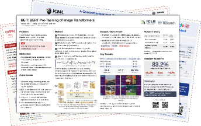

### TL;DR

Sibling of paper 3 (ResearchStudio-Idea). Where Idea makes the paper, Reel handles the "last mile" — poster, talk video, blog. Prior automation treats each artifact in isolation and gates quality on soft VLM-preference scores; Reel composes the artifacts as *skills* sharing one upstream extractor, wraps deterministic primitives in a measured-fill loop, and hard-gates on pass/fail render checks.

### Key idea

Same skill-suite pattern as its sibling, but with two extra pieces: (a) one canonical extraction step feeds all downstream renderers so authors don't re-extract per artifact; (b) *hard* render gates (does the PowerPoint open? does the video encode?) replace "does a judge LLM prefer it" as the exit condition of the fill loop.

### Main finding

Delivers editable PowerPoint/Word artifacts (not one-way renders), with pass/fail gates catching the "empty load-bearing section" failures that soft VLM judges plateau on. Absolute quality numbers not extractable from the abstract; positioned as a step-change in *reliability* over prior automation.

### Why it matters

The "skill suite" story from paper 3 gets its second data point here. Hard render gates are the interesting design decision: soft LLM judges get comfortable long before the artifact is actually usable, and this is the first paper explicitly proposing binary render checks as the escape.

### Knowledge graph integration

**Builds on / relates to existing pages:**
- [agents/README.md](../agents/README.md) — agent skill orchestration.

**Suggested new pages:**
- `agents/render-gated-skills.md` *(depth)* — hard pass/fail render checks as loop exits.

---

## 8. MANCE

**Authors:** Matan Avitan, Yoav Goldberg, Yanai Elazar — *Bar-Ilan · Allen Institute for AI*
**Links:** [arXiv:2607.03973](https://arxiv.org/abs/2607.03973) · [HF](https://huggingface.co/papers/2607.03973) · [AlphaXiv](https://www.alphaxiv.org/abs/2607.03973)
**Topics:** `interp`, `safety`, `concept-erasure`

### TL;DR

Concept erasure that respects the *manifold* of natural representations. The idea: natural embeddings concentrate on a lower-dimensional manifold, so an erasure edit that removes a target concept should stay on that manifold rather than shoot off into representation-space voids. Projecting the removal step to the estimated manifold consistently reduces damage to correlated concepts.

### Key idea

Manifold Constraint Hypothesis (MCH). Estimate the manifold from a bank of natural inputs. Compute a normal "remove concept X" update (e.g., from a classifier's gradient). Project the update onto the local tangent of the estimated manifold before applying it. MANCE++ prepends a closed-form erasure to the iterative projected updates for extra leakage reduction.

### Main finding

State-of-the-art nonlinear concept erasure across 119 settings: 13 language models, 3 NLP concepts, 40 CelebA-CLIP attributes. Consistent leakage improvements when layered on top of prior methods (LEACE, INLP, etc.). Better leakage-vs-surgicality tradeoff than matched full-space updates.

### Why it matters

Erasure is a load-bearing primitive for interpretability audits, fairness debiasing, and safety (removing dangerous concepts). Prior methods regularly damage correlated capabilities; the manifold constraint is a lightweight fix that composes with the rest of the erasure zoo.

### Knowledge graph integration

**Builds on / relates to existing pages:**
- [interpretability/README.md](../interpretability/README.md) — interpretability folder; erasure sits at the intervention side of the field.
- [safety/README.md](../safety/README.md) — safety-side use of erasure (e.g., dangerous-concept removal).

**Suggested new pages:**
- `interpretability/concept-erasure.md` *(depth)* — concept erasure as a technique class, MANCE as the anchor.

---

## 9. OmniOpt

**Authors:** Siyuan Li, Jiabao Pan, Yumou Liu, Zhuoli Ouyang, Xin Jin, Xinglong Xu, Jingxuan Wei, Shengye Pang, Jintao Che, Xuanhe Zhou, Conghui He, Cheng Tan — *Westlake · Shanghai AI Lab*
**Links:** [arXiv:2607.04033](https://arxiv.org/abs/2607.04033) · [HF](https://huggingface.co/papers/2607.04033) · [AlphaXiv](https://www.alphaxiv.org/abs/2607.04033)
**Topics:** `pretraining`, `optimizer`, `eval`

### TL;DR

A unified framework for reasoning about, comparing, and benchmarking modern optimizers (Adam variants, Muon, Shampoo, Lion, SOAP, …). Three-part contribution: a taxonomy (meta-pipeline transformations that turn one optimizer into another), a geometric characterization (norm-constrained linear-minimization oracles), and a cross-domain benchmark suite for like-for-like comparison at LLM training scale.

### Key idea

Cast every "modern optimizer" as a composition of orthogonal meta-transformations on a base update rule (momentum, second-moment normalization, orthogonalization, sign, spectral clipping, …). Under this decomposition, optimizers become points in a small design space and can be swapped/mixed. The geometric view expresses each as a norm-constrained LMO, which explains why some fail at scale.

### Main finding

Cross-scale benchmark spans pretraining objectives and model sizes; results are used to argue which meta-transforms are load-bearing at scale (norm constraint dominates) versus which are ornamental. No single optimizer dominates all axes; the framework's value is the ablation surface it exposes.

### Why it matters

The "which optimizer for the next 100B-parameter run" question is asked over and over. A shared benchmark and a compositional taxonomy let the field stop re-testing the same knobs and start comparing meta-transforms directly.

### Knowledge graph integration

**Builds on / relates to existing pages:**
- [fundamentals/README.md](../fundamentals/README.md) — optimizers folder home.
- [pre-training/_training-stability.md](../pre-training/_training-stability.md) — optimizer choice is a stability lever.

**Suggested new pages:**
- `fundamentals/_optimizers.md` *(taxonomy)* — meta-transform decomposition of modern optimizers.

---

## 10. Wan-Streamer v0.2

**Authors:** Lianghua Huang, Zhi-Fan Wu, Yupeng Shi, Wei Wang, Mengyang Feng, Junjie He, Chen-Wei Xie, Yu Liu, Jingren Zhou (core) — *Tongyi Lab · Alibaba*
**Links:** [arXiv:2607.04443](https://arxiv.org/abs/2607.04443) · [HF](https://huggingface.co/papers/2607.04443) · [AlphaXiv](https://www.alphaxiv.org/abs/2607.04443)
**Topics:** `multimodal`, `streaming`, `video`, `audio`

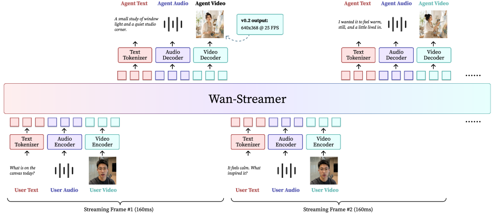

### TL;DR

Point release of the native-streaming audio-visual interaction model. v0.2 keeps v0.1's modeling formulation but raises interactive output resolution from 192×336 to 640×368 while holding signal-to-signal latency at ~200 ms at 25 FPS. It's a latency-preserving upgrade — the interesting bit is *how* they scaled resolution without paying the latency tax.

### Key idea

Streaming a2v generation (audio-in, video-out) with an end-to-end model that never breaks the interactive loop into isolated encode/decode passes. The v0.2 delta is architectural: bigger output canvas without increasing per-token compute cost that a listener would feel.

### Main finding

192×336 → 640×368 output resolution (~6× pixel count), ~200 ms model-side latency at 25 FPS — same as v0.1. No new capability introduced; the story is capacity-per-latency.

### Why it matters

Real-time avatars/video-conferencing agents live and die by latency. A streaming a2v model that scales resolution without touching latency is a template for interactive multimodal serving stacks that need to keep humans in the perceptual loop.

### Knowledge graph integration

**Builds on / relates to existing pages:**
- [multimodal/README.md](../multimodal/README.md) — audio-visual multimodal models.
- [inference/README.md](../inference/README.md) — streaming inference tradeoffs.

**Suggested new pages:**
- `multimodal/native-streaming-a2v.md` *(depth)* — end-to-end streaming audio-in/video-out modeling.

---

## 11. KVpop

**Authors:** Niklas Schmidinger, Anamaria-Roberta Hartl, David Stap, Thomas Schmied, Sebastian Böck, Günter Klambauer, Sepp Hochreiter — *JKU Linz (LIT AI)*
**Links:** [arXiv:2607.05061](https://arxiv.org/abs/2607.05061) · [HF](https://huggingface.co/papers/2607.05061) · [AlphaXiv](https://www.alphaxiv.org/abs/2607.05061)
**Topics:** `KV-cache`, `efficient-inference`

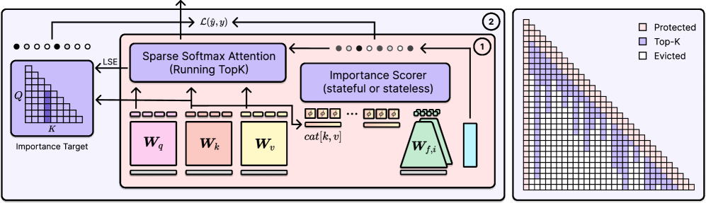

### TL;DR

KV-cache compression that prunes cache entries *predictively and online*: a small predictor decides which past tokens are least likely to matter for the tokens still to be generated, and evicts them from cache before they become a memory tax. Unlike offline compression (where you decide once) or attention-score-based eviction (which needs the current attention pattern), predictive pruning acts one step ahead.

### Key idea

An online predictor over recent attention statistics estimates each cached token's future relevance and pops the lowest-scoring entries. The predictor is trained cheaply and runs alongside decoding, so eviction happens before the cache blows up instead of after. Bounded working-set memory per sequence with graceful quality degradation.

### Main finding

Framed as "KV cache bottleneck resolution" for transformer LLMs. Specific reductions (cache size %, quality delta) not visible in the extracted abstract but the paper is positioned against H2O / SnapKV / StreamingLLM as an *online, predictive* member of that family.

### Why it matters

Long-context inference is dominated by KV memory. Predictive pruning is one of the few axes left after paged attention and quantization — it directly attacks working-set size, not just data-layout efficiency. Composable with paged attention and speculative decoding.

### Knowledge graph integration

**Builds on / relates to existing pages:**
- [inference/README.md](../inference/README.md) — inference-time efficiency folder.
- [architectures/mla.md](../architectures/mla.md) — MLA is the architecture-side answer to KV cost; KVpop is the runtime-side answer.

**Suggested new pages:**
- `inference/kv-cache-compression.md` *(depth)* — online predictive KV pruning.
- `inference/_kv-cache.md` *(taxonomy)* — MLA / GQA / paged / eviction / quantization all live here.

---

## 12. dOPSD

**Authors:** (not extractable from HF page) — *Undisclosed*
**Links:** [arXiv:2607.04428](https://arxiv.org/abs/2607.04428) · [HF](https://huggingface.co/papers/2607.04428) · [AlphaXiv](https://www.alphaxiv.org/abs/2607.04428)
**Topics:** `diffusion-LLM`, `distillation`, `reasoning`, `RL`

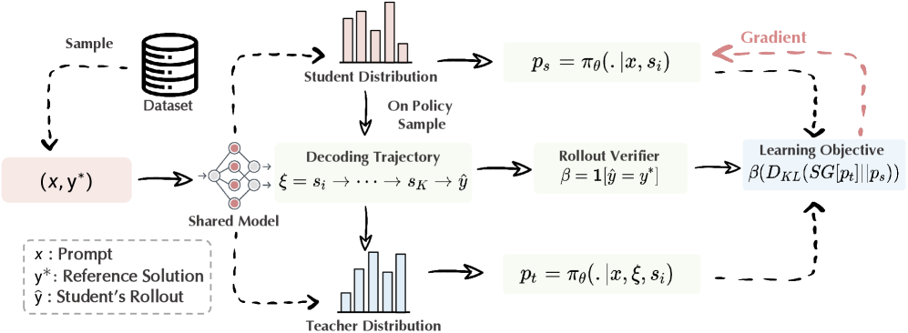

### TL;DR

Post-training for *diffusion* LLMs (parallel-denoising alternatives to autoregressive LLMs) has been hard because reward is sparse and there's exposure bias between train-time noise schedules and inference-time trajectories. dOPSD sidesteps this by making the *later*, more-decoded steps of the student's own denoising trajectory play teacher to its earlier, still-masked steps — no external label required.

### Key idea

On-policy self-distillation for dLLMs: run the student's denoising loop, then for each masked position, use predictions from a later (less noisy) step of the *same* trajectory as the target for that same position at an earlier step. The privilege the teacher gets is temporal — it sees more decoded context. The loss is per-position KL matched against these later-step predictions.

### Main finding

Improves math reasoning and code generation on tested diffusion LLMs; positioned against RLVR-style rewards which struggle on dLLMs because reward is only defined at the end of a sequence. Concrete deltas not in the extracted abstract snippet.

### Why it matters

Diffusion LLMs are compelling on paper (parallel generation, denoising = built-in self-correction) but have lacked a strong post-training story. Self-distillation from the trajectory's own late steps is elegant — no teacher model, no external reward — and could re-open dLLMs as a serious autoregressive competitor.

### Knowledge graph integration

**Builds on / relates to existing pages:**
- [post-training/rlvr.md](../post-training/rlvr.md) — the reward paradigm dOPSD is arguing against for dLLMs.
- [post-training/reasoning/long-cot-rl.md](../post-training/reasoning/long-cot-rl.md) — reasoning-oriented post-training baseline.
- [post-training/_rl.md](../post-training/_rl.md) — on-policy sampling taxonomy.

**Suggested new pages:**
- `post-training/reasoning/dllm-self-distillation.md` *(depth)* — trajectory-internal teacher for dLLM post-training.
- `architectures/diffusion-llm.md` *(depth)* — dLLM architecture primer.

---

## 13. Perceptual Flow Matching

**Authors:** Chuyang Zhao, Yifei Song, Hongfa Wang, Jianlong Yuan, Yuan Zhang, Siming Fu, Zhineng Chen, Huilin Deng, Haoyang Huang, Nan Duan — *Joy Future Academy · Fudan · Tsinghua · USTC*
**Links:** [arXiv:2607.03524](https://arxiv.org/abs/2607.03524) · [HF](https://huggingface.co/papers/2607.03524) · [AlphaXiv](https://www.alphaxiv.org/abs/2607.03524)
**Topics:** `diffusion`, `flow-matching`, `distillation`

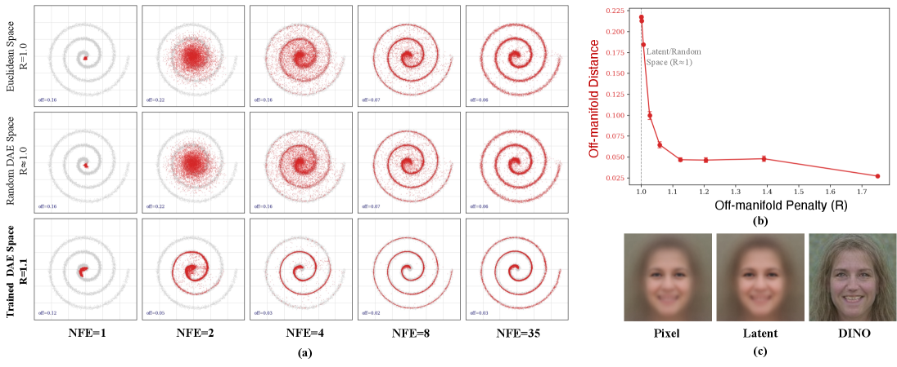

### TL;DR

Flow matching without distillation and without teacher models — just swap the VAE latent target space for a *perceptual* feature space (using pretrained perceptual encoders). Same training pipeline, but the regression bias flips from mean-seeking to mode-seeking, and few-step generation (4–8 NFE) suddenly works with quality that used to need 35–50 steps.

### Key idea

Supervise the velocity field in the feature space of a pretrained perceptual model instead of a VAE latent. Because the perceptual metric is non-Euclidean w.r.t. pixels, the L2 regression minimizer shifts from mean-of-modes to a nearest-mode estimate — biasing samples toward on-manifold outputs that stay coherent under coarse Euler integration.

### Main finding

Reduces required sampling steps from 35–50 to 4–8 while preserving generation quality; fewer artifacts than distillation-based accelerators (SiD, DMD, LADD); no teacher, no auxiliary score net, minimal changes to standard flow-matching training. Works on images, video, and image editing.

### Why it matters

Every acceleration paper for the last two years has needed either a distillation teacher or a score network. PFM is a rare "just change the loss space" acceleration — it composes with everything else (distillation, GAN heads) and the *why* (mode-seeking regression minimizer) is a genuine insight into what few-step generation needs.

### Knowledge graph integration

**Builds on / relates to existing pages:**
- [multimodal/README.md](../multimodal/README.md) — image/video generative models.

**Suggested new pages:**
- `multimodal/perceptual-flow-matching.md` *(depth)* — the PFM objective and its mode-seeking analysis.
- `multimodal/_flow-matching.md` *(taxonomy)* — flow matching, rectified flow, consistency, few-step distillation.

---

## 14. LLM-as-a-Verifier

**Authors:** Jacky Kwok, Shulu Li, Pranav Atreya, Yuejiang Liu, Yixing Jiang, Chelsea Finn, Marco Pavone, Ion Stoica, Azalia Mirhoseini — *Stanford · UC Berkeley · NVIDIA*
**Links:** [arXiv:2607.05391](https://arxiv.org/abs/2607.05391) · [HF](https://huggingface.co/papers/2607.05391) · [AlphaXiv](https://www.alphaxiv.org/abs/2607.05391)
**Topics:** `eval`, `verifier`, `reasoning`, `agents`

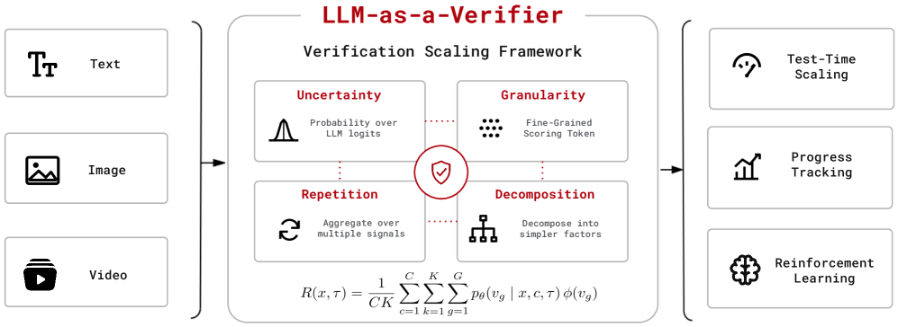

### TL;DR

Position verification as a new scaling axis (alongside pretraining, post-training, and test-time compute). Instead of asking an LLM judge for a discrete score, take the *expectation over the score-token logit distribution* → continuous scores, near-zero tie rate, and three orthogonal scaling knobs: score granularity, repeated evaluation, and criteria decomposition.

### Key idea

Continuous-score verifier: prompt the LLM to output a score, but rather than sampling one token, compute `E[score] = Σ p(k) · k` over the score vocabulary. Combine with (a) finer score grids for better separation, (b) repeated evaluation (variance reduction), (c) criteria decomposition (complexity reduction). Ranking uses preference probabilities derived from the continuous scores.

### Main finding

State of the art on Terminal-Bench V2 (86.5%), SWE-Bench Verified (78.2%), RoboRewardBench (87.4%), MedAgentBench (73.3%). Doubles as a dense reward signal — improves sample efficiency of SAC and GRPO in downstream RL. Also shipped as extensions for Claude Code and Codex to monitor real agentic runs.

### Why it matters

The RL post-training bottleneck is often verifier quality, not the RL algorithm. This paper argues verification is its own compute-scaling knob and gives a training-free recipe that scales along three axes. Continuous scores fix the tie-rate problem that plagued LLM-judge pipelines.

### Knowledge graph integration

**Builds on / relates to existing pages:**
- [evaluation/README.md](../evaluation/README.md) — evaluation folder; judge-LLM methodology.
- [post-training/reasoning/prm.md](../post-training/reasoning/prm.md) — process reward models are one flavor of verifier.
- [post-training/reasoning/orm.md](../post-training/reasoning/orm.md) — outcome reward models.
- [post-training/cot-reward-model.md](../post-training/cot-reward-model.md) — CoT-scored reward models.
- [post-training/grpo.md](../post-training/grpo.md) — the RL algo where this verifier plugs in.

**Suggested new pages:**
- `evaluation/llm-as-verifier.md` *(depth)* — continuous-score verifier and its three scaling axes.

---

## 15. Vera — Safety Testing LLM Agents

**Authors:** Yunhao Feng, Ruixiao Lin, Ming Wen, Qinqin He, Yanming Guo, Yutao Wu, Jialuo Chen, Zhuoer Xu, Xiaohu Du, Jianan Ma, Zixing Chen, Xingjun Ma, Yunhao Chen, Xinhao Deng — *Ant Group · Zhejiang U · Fudan · Alibaba · Deakin*
**Links:** [arXiv:2607.01793](https://arxiv.org/abs/2607.01793) · [HF](https://huggingface.co/papers/2607.01793) · [AlphaXiv](https://www.alphaxiv.org/abs/2607.01793)
**Topics:** `safety`, `agents`, `eval`

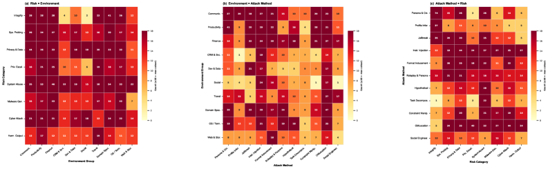

### TL;DR

Vera reframes agent safety testing as *software engineering testing for non-deterministic programs*. Instead of hand-curated risk taxonomies with hard-coded oracles, it runs a three-stage self-reinforcing pipeline — discover risks, generate scenarios, verify evidence — that scales as agents evolve and produces grounded evidence for each finding.

### Key idea

Three stages that feed each other: (1) risk discovery from tool schemas + past interactions; (2) scenario generation that instantiates each risk against the agent's real tool set; (3) evidence-grounded verification that separates "the agent said something bad" from "the agent actually took a bad action with attributable evidence." The pipeline reuses discovered failures to widen future risk discovery — self-reinforcing.

### Main finding

Positioned as end-to-end and self-extending, where prior work relied on expert-designed safety taxonomies with hard-coded rules that don't survive tool churn. Concrete recall/precision numbers not extractable from the abstract snippet but the framework is released as an evaluation harness.

### Why it matters

Agents grow tools weekly; expert-curated safety benchmarks age out in months. A self-extending discovery+verification loop is the only way to keep coverage in step with capability drift. Also the first framework to treat "evidence" as first-class — critical for anyone downstream trying to file bugs on their own agent.

### Knowledge graph integration

**Builds on / relates to existing pages:**
- [safety/README.md](../safety/README.md) — safety folder home.
- [agents/README.md](../agents/README.md) — agent behaviors under test.
- [evaluation/README.md](../evaluation/README.md) — evaluation methodology.
- [safety/_attacks.md](../safety/_attacks.md) — attack taxonomy adjacent to risk-discovery.

**Suggested new pages:**
- `safety/agent-safety-testing.md` *(depth)* — the Vera three-stage pipeline as a general recipe.

---

## Notes

- Sources: HF Daily Papers (arXiv IDs from `huggingface.co/papers/date/2026-07-07`).
- Hero figures: 13 of 15 downloaded (from `arxiv.org/html/<id>/x*.png`). Missing: MANCE (paper 8), OmniOpt (paper 9). The HF `og:image` CDN is not reachable through this environment's proxy; arXiv HTML figures were used as substitutes.
- Borderline inclusions are flagged in-section with an italic *Borderline: …* note.
- This digest is informational. No existing concept files, `READING-LIST.md`, or `PAPERS.md` were modified to produce it.
