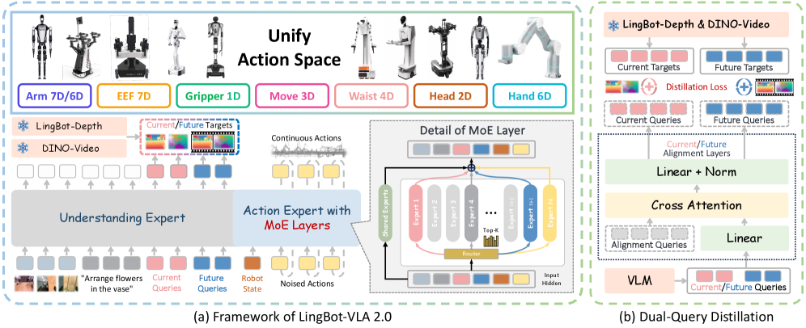
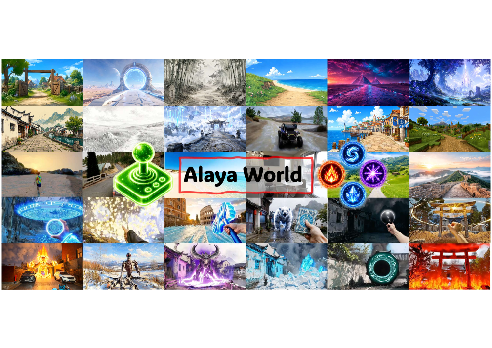
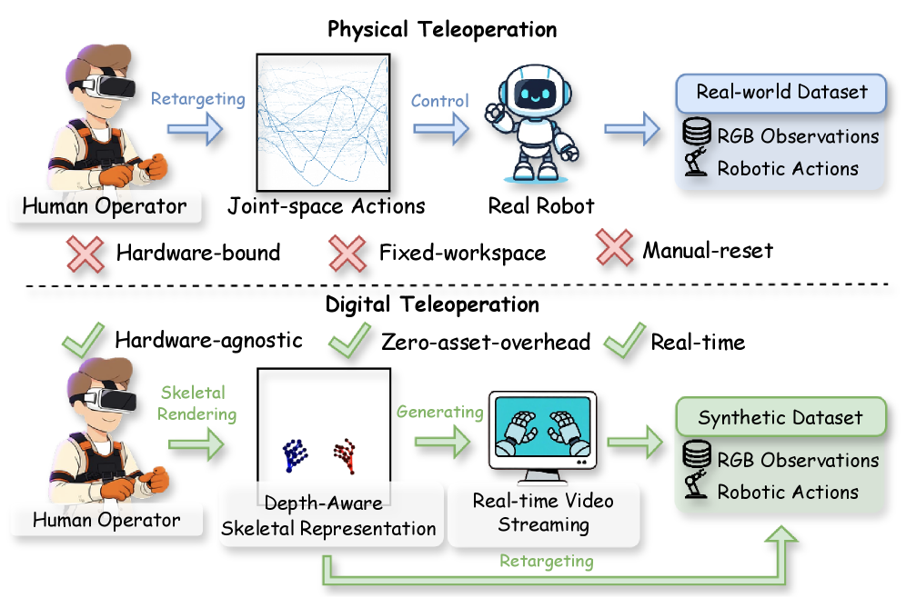
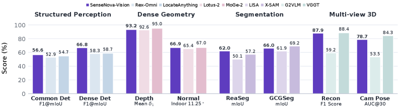
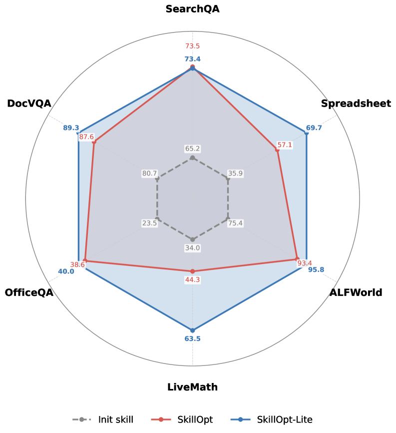
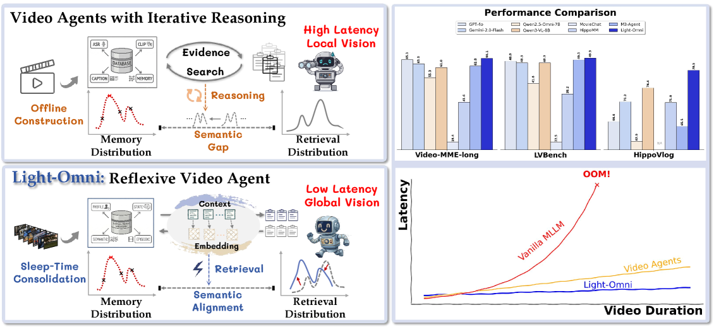
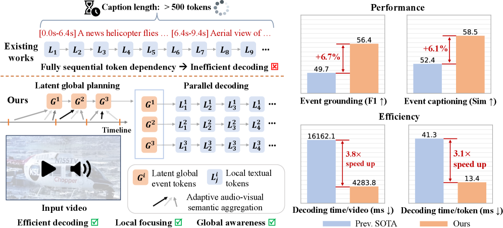
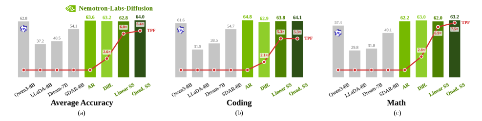
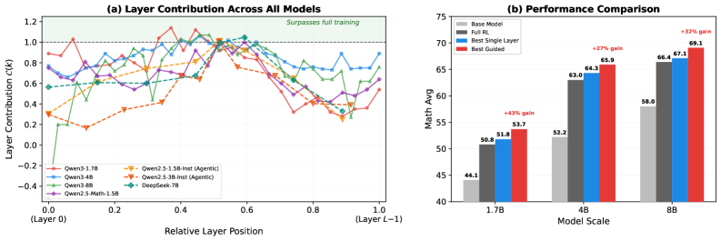

# Daily AI papers — 2026-07-08

*Curated from HF Daily Papers. 14 of 41 papers kept after relevance filter.*

## Papers at a glance

| # | Title | Topics | Org |
| --- | --- | --- | --- |
| 1 | [Gemma 4 Technical Report](#1-gemma-4-technical-report) | `LLM`, `MoE`, `multimodal`, `reasoning` | Google DeepMind |
| 2 | [LingBot-VLA 2.0: From Foundation to Application](#2-lingbot-vla-20-from-foundation-to-application-improving-vla-models-in-practice) | `multimodal`, `VLA`, `agents` | Ant / anonymous |
| 3 | [AlayaWorld: Long-Horizon and Playable Video World Generation](#3-alayaworld-long-horizon-and-playable-video-world-generation) | `diffusion`, `world-model` | Shanghai AI Lab |
| 4 | [Hierarchical Sparse Attention Done Right (HiLS)](#4-hierarchical-sparse-attention-done-right-toward-infinite-context-modeling) | `architecture`, `long-context` | Tencent HY |
| 5 | [RynnWorld-Teleop: Action-Conditioned World Model](#5-rynnworld-teleop-an-action-conditioned-world-model-for-digital-teleoperation) | `diffusion`, `world-model`, `agents` | Alibaba DAMO |
| 6 | [SenseNova-Vision: Vision as Unified Multimodal Generation](#6-vision-as-unified-multimodal-generation) | `multimodal` | SenseTime |
| 7 | [DSpark: Confidence-Scheduled Speculative Decoding](#7-dspark-confidence-scheduled-speculative-decoding-with-semi-autoregressive-generation) | `efficient-inference`, `LLM` | DeepSeek-AI |
| 8 | [SkillOpt-Lite: Agent Self-evolution](#8-skillopt-lite-better-and-faster-agent-self-evolution-via-one-line-of-vibe) | `agents`, `RL` | LMMs-Lab |
| 9 | [Light-Omni: Reflex over Reasoning in Agentic Video](#9-light-omni-reflex-over-reasoning-in-agentic-video-understanding-with-long-term-memory) | `agents`, `multimodal` | Nanjing U. |
| 10 | [LLM-as-a-Tutor: Policy-Aware Prompt Adaptation](#10-llm-as-a-tutor-policy-aware-prompt-adaptation-for-non-verifiable-rl) | `RL`, `eval` | KAIST |
| 11 | [Parallelized Autoregressive Dense Video Captioning](#11-parallelized-autoregressive-decoding-for-omni-modal-dense-video-captioning) | `multimodal`, `efficient-inference` | NUS |
| 12 | [TurnOPD: Turn-Aware On-Policy Distillation](#12-turnopd-making-on-policy-distillation-turn-aware-for-efficient-long-horizon-agent-training) | `agents`, `RL`, `distillation` | Tencent Hunyuan |
| 13 | [Nemotron-Labs-Diffusion: Tri-Mode Language Model](#13-nemotron-labs-diffusion-a-tri-mode-language-model-unifying-autoregressive-diffusion-and-self-speculation-decoding) | `LLM`, `diffusion`, `efficient-inference` | NVIDIA |
| 14 | [Is One Layer Enough? Single-Layer RL Post-training](#14-is-one-layer-enough-training-a-single-transformer-layer-can-match-full-parameter-rl-training) | `RL`, `interp` | U. Minnesota |

---

## 1. Gemma 4 Technical Report

**Authors:** Gemma Team — *Google DeepMind*
**Links:** [arXiv:2607.02770](https://arxiv.org/abs/2607.02770) · [HF](https://huggingface.co/papers/2607.02770) · [AlphaXiv](https://www.alphaxiv.org/abs/2607.02770)
**Topics:** `LLM`, `MoE`, `multimodal`, `reasoning`

### TL;DR

Google's fourth-generation Gemma family: open-weight, natively multimodal models spanning 2.3B–31B parameters, mixing dense and MoE variants. A 12B variant drops separate vision/audio encoders and ingests raw image patches and raw audio directly into the LM. All sizes now carry a "thinking mode" that emits reasoning traces before answering, and the report claims frontier-open-model parity on human-rated tasks.

### Key idea

Three architectural bets stacked together: (a) push MoE into the family alongside dense siblings for compute-efficient scaling, (b) drop the vision/audio encoders entirely on the 12B by folding modality tokenization into a shared patch-based front end, (c) integrate a thinking mode natively (not a post-hoc CoT wrapper) so the reasoning trace is a first-class output.

### Main finding

"A leap" across STEM, multimodal, and long-context benchmarks, with the top open Gemma 4 rivaling proprietary frontier open models in human evaluations. Improved inference speed, memory, and long-context handling attributed to "critical design choices" (details in report).

### Why it matters

Encoder-free multimodal at 12B is the boldest choice — if it works, it removes a whole layer of modality-specific engineering that Chameleon and Fuyu also chased. And a MoE within the "small open" family (2.3B–31B) is a first for Gemma; combined with a native thinking mode this is a genuine Gemini-3-generation architecture recipe distilled to open-weight scale.

### Knowledge graph integration

**Builds on / relates to existing pages:**
- [../architectures/_moe.md](../architectures/_moe.md) — Gemma 4 introduces MoE variants; taxonomy already covers the class.
- [../architectures/aux-loss-free-balancing.md](../architectures/aux-loss-free-balancing.md) — likely relevant for MoE routing (specifics TBD from full report).
- [../post-training/reasoning/long-cot-rl.md](../post-training/reasoning/long-cot-rl.md) — Gemma 4 "thinking mode" fits this class of reasoning-trace training.
- [../multimodal/README.md](../multimodal/README.md) — encoder-free multimodal is a step beyond the projection-layer paradigm the folder documents.

**Suggested new pages:**
- `case-studies/gemma-4.md` *(case study)* — full breakdown of architecture (dense + MoE), thinking-mode training, encoder-free multimodal pipeline.
- `architectures/encoder-free-multimodal.md` *(depth)* — cover the raw-patch/raw-audio LM front end as a technique.
- `post-training/reasoning/thinking-mode.md` *(depth)* — integrated reasoning-trace training as a general recipe.

---

## 2. LingBot-VLA 2.0: From Foundation to Application — Improving VLA Models in Practice

**Authors:** Fangjing Wang, Fan Lu, He Sun, Shi Liu, Yunnan Wang, Yibin Yan, Yong Wang, et al. — *(affiliations unlisted; Ant Group-adjacent per authorship overlap)*
**Links:** [arXiv:2607.06403](https://arxiv.org/abs/2607.06403) · [HF](https://huggingface.co/papers/2607.06403) · [AlphaXiv](https://www.alphaxiv.org/abs/2607.06403)
**Topics:** `multimodal`, `VLA`, `agents`

### TL;DR

Iteration on the LingBot-VLA vision-language-action foundation model with three practical upgrades: massively expanded pretraining data (60k hours: 50k robot trajectories + 10k egocentric human video), an expanded action space that covers heads, waists, mobile bases, and dexterous hands, and a future-prediction proxy task using semantic (video) and geometric (depth) priors for temporal reasoning.

### Key idea

Predictive dynamics modeling as an auxiliary loss during VLA pretraining: predict future frames conditioned on the intended action, using a video representation model for semantic priors and a depth model for geometric priors. This forces the model to internalize forward dynamics rather than treat action prediction as pure imitation.

### Main finding

On GM-100 (generalist benchmark), all three improvements contribute measurable gains; the cross-embodiment long-horizon mobile manipulation demo works on two different robotic platforms with the same pretrained backbone. Whole-body coverage (waist + mobile base + arms + hands) is unusual for open VLA reports.

### Why it matters

*Borderline: included because VLA foundation models are a first-class part of the "how are large multimodal models trained" story, and the predictive-dynamics trick may transfer to non-robotics settings (e.g., world-model-style multimodal LLMs).* This paper is one of the clearest examples of scaling VLA data past 50k trajectory-hours and using video pretraining data as auxiliary signal.

### Knowledge graph integration

**Builds on / relates to existing pages:**
- [../multimodal/README.md](../multimodal/README.md) — VLA is multimodal + action head; the folder is the natural home.
- [../data/_data-curation.md](../data/_data-curation.md) — 60k-hour curation pipeline is exactly the shape this taxonomy covers.

**Suggested new pages:**
- `multimodal/vla-pretraining.md` *(depth)* — general recipe for pretraining VLA foundation models on mixed robot + egocentric data.
- `multimodal/predictive-dynamics-loss.md` *(depth)* — future-frame prediction as an auxiliary VLA objective.

---

## 3. AlayaWorld: Long-Horizon and Playable Video World Generation

**Authors:** Chuanhao Li, Kaipeng Zhang, Yifan Zhan, Yongtao Ge, Yuanyang Yin, et al. — *Shanghai AI Lab*
**Links:** [arXiv:2607.06291](https://arxiv.org/abs/2607.06291) · [HF](https://huggingface.co/papers/2607.06291) · [AlphaXiv](https://www.alphaxiv.org/abs/2607.06291)
**Topics:** `diffusion`, `world-model`, `multimodal`

### TL;DR

A framework for generating long-horizon, action-controllable game-like video worlds — you drive them in real time with a fixed action space (navigation, combat, spell casting, creature summoning). The pipeline covers data prep through deployment as one modular system, targeting the "video model as game engine" thesis.

### Key idea

Unify long-horizon generation and playability by conditioning a video diffusion backbone on a rich action space with continuous player input, plus a data pipeline that scales interactive game recordings to training corpora. The paper's central claim is that with the right training data and action conditioning, you don't need a hand-authored engine to render a playable world.

### Main finding

Interactive real-time playable worlds across the four action classes with visible temporal consistency over long horizons (numbers not in the extracted abstract; hero figure suggests multi-minute generations). Modular deployment stack across data prep, training, and inference.

### Why it matters

Playable video world models are the endpoint of the "video is a general simulator" bet (SORA, Genie 2/3, and the Runway/Odyssey line). AlayaWorld pushes the openness bar: framework-level release with real-time interactive generation is rare, and it makes the interactive-video-model recipe reproducible.

### Knowledge graph integration

**Suggested new pages:**
- `multimodal/video-world-model.md` *(depth)* — interactive/playable video generation as a distinct paradigm from pure T2V.
- `multimodal/action-conditioned-video-diffusion.md` *(depth)* — action-space conditioning schemes for video DiTs.

---

## 4. Hierarchical Sparse Attention Done Right: Toward Infinite Context Modeling

**Authors:** Xiang Hu, Xinyu Wei, Hao Gu, Minshen Zhang, Tian Liang, Huayang Li, et al. — *Tencent HY Team, ShanghaiTech, HKUST, UCSD*
**Links:** [arXiv:2607.02980](https://arxiv.org/abs/2607.02980) · [HF](https://huggingface.co/papers/2607.02980) · [AlphaXiv](https://www.alphaxiv.org/abs/2607.02980)
**Topics:** `architecture`, `long-context`, `sparse-attention`

### TL;DR

HiLS (Hierarchical Landmark Sparse) Attention learns chunk selection end-to-end under the standard LM loss instead of hand-designing retrieval heuristics. It factorizes attention hierarchically: each query does independent attention against every retrieved chunk, then outputs are fused weighted by retrieval scores — so those scores flow gradients directly.

### Key idea

Two-level attention: (1) chunk-retrieval scores decide which chunks a query attends to, (2) per-chunk attention computes candidate outputs, (3) final output is a retrieval-score-weighted sum of per-chunk outputs. The gradient path through the retrieval scores lets standard LM loss train chunk selection without auxiliary supervision — the missing piece in prior chunked-sparse-attention methods.

### Main finding

Matches or beats full attention at in-domain context lengths, and extrapolates to >64× the training length with 90% retrieval accuracy. Existing full-attention checkpoints can be converted to HiLS via lightweight continued pretraining while preserving in-domain quality.

### Why it matters

Chunked sparse attention has been the standard theoretical answer to quadratic cost, but every real system has traded quality for efficiency. HiLS is the first credible claim that end-to-end learned chunk selection closes the gap without losing extrapolation. If it holds, this is the sparse-attention paper long-context serving has been waiting for.

### Knowledge graph integration

**Builds on / relates to existing pages:**
- [../fundamentals/attention.md](../fundamentals/attention.md) — HiLS is an attention variant; the fundamentals page is the anchor.
- [../fundamentals/dca.md](../fundamentals/dca.md) — DCA also targets long-context with chunk-style tricks; useful contrast.
- [../architectures/mla.md](../architectures/mla.md) — MLA compresses KV cache; HiLS reduces attention compute — sibling axes of the same problem.

**Suggested new pages:**
- `architectures/hils-attention.md` *(depth)* — the HiLS mechanism specifically.
- `architectures/_sparse-attention.md` *(taxonomy)* — natural home for a taxonomy of chunk-wise sparse attention (Longformer, Streaming LLM, InfLLM, HiLS, etc.).

---

## 5. RynnWorld-Teleop: An Action-Conditioned World Model for Digital Teleoperation

**Authors:** Xingyue Zhao, Hangyu Li, Biao Gong, Kehan Li, Siteng Huang, Xin Li, Deli Zhao, Zhongyu Li — *DAMO Academy Alibaba, Hong Kong Embodied AI Lab, CUHK, Hupan Lab, Ant Group*
**Links:** [arXiv:2607.06558](https://arxiv.org/abs/2607.06558) · [HF](https://huggingface.co/papers/2607.06558) · [AlphaXiv](https://www.alphaxiv.org/abs/2607.06558)
**Topics:** `diffusion`, `world-model`, `agents`, `multimodal`

### TL;DR

"Digital teleoperation": replace physical robots during data collection with a video-diffusion world model. An operator's hand-pose stream drives a robot-centric generative model that synthesizes egocentric video from a single reference image; the pose stream becomes an embodiment-agnostic action label transferable to any target robot via retargeting. Whole thing runs at 40+ FPS on a single H100.

### Key idea

Decouple demonstration collection from hardware. Depth-aware skeletal conditioning + progressive human-to-robot training on a video DiT + streaming autoregressive distillation compresses the generative process into one-pass inference. Trained purely on generated data, downstream policies achieve zero-shot Sim2Real on dexterous bimanual tasks.

### Main finding

Real-time (40+ FPS) generation on a single H100. Policies trained only on RynnWorld-Teleop data transfer zero-shot to real dexterous bimanual manipulation; mixing digitally-teleoperated data with real data consistently improves success rates over real-only training.

### Why it matters

VLA data collection is the bottleneck of embodied AI. If a video world model can substitute for a physical rig at 40 FPS with useful Sim2Real transfer, the "we need a warehouse of robots and operators" story starts looking obsolete. This is one of the cleanest demonstrations of using a generative world model as a scalable data engine.

### Knowledge graph integration

**Builds on / relates to existing pages:**
- [../multimodal/README.md](../multimodal/README.md) — VLA + world model live here.

**Suggested new pages:**
- `multimodal/digital-teleoperation.md` *(depth)* — generative world model as embodiment-agnostic data engine for VLA.
- `multimodal/streaming-diffusion-distillation.md` *(depth)* — compress video DiT into one-pass inference for real-time generation.

---

## 6. Vision as Unified Multimodal Generation

**Authors:** Jianhua Li, Kewang Deng, Zukai Chen, Xuanke Shi, Sihan Wang, Boxuan Li, Linyan Wang, Haiwen Diao, Ziwei Liu, Lei Yang, Dahua Lin, et al. — *SenseTime Research, NTU, CUHK, PKU, SJTU, ZJU*
**Links:** [arXiv:2607.06560](https://arxiv.org/abs/2607.06560) · [HF](https://huggingface.co/papers/2607.06560) · [AlphaXiv](https://www.alphaxiv.org/abs/2607.06560)
**Topics:** `multimodal`

### TL;DR

Reformulate every "computer vision" task — detection, OCR, keypoints, segmentation, depth, surface normals, point maps, camera pose estimation — as generation from a unified multimodal model. One backbone, no task-specific heads. Users specify the task through natural-language instructions and optional visual prompts; the model emits text, images, or mixed outputs.

### Key idea

Instead of task heads, treat structured visual predictions (masks, depth maps, keypoint coords) as content that a UMM already knows how to generate. Backed by a purpose-built instruction-response corpus (SenseNova-Vision Corpus) covering all target CV tasks.

### Main finding

SenseNova-Vision is competitive with task-specific baselines across structured visual understanding, dense geometric prediction, segmentation, and multi-view visual geometry — despite using one architecture and no CV heads.

### Why it matters

Continues the "kill task heads" thread from Pix2Seq / Painter / UniPose. What's new here is scope: a unified corpus that spans structured perception (detection, segmentation) *and* dense geometry (depth, surface normals, camera pose). If UMMs can absorb geometry, the "vision model" as a separate artifact from the multimodal LM starts looking obsolete.

### Knowledge graph integration

**Builds on / relates to existing pages:**
- [../multimodal/README.md](../multimodal/README.md) — natural home for unified multimodal generation.

**Suggested new pages:**
- `multimodal/unified-multimodal-generation.md` *(depth)* — cast dense/structured vision tasks as UMM generation, no task heads.

---

## 7. DSpark: Confidence-Scheduled Speculative Decoding with Semi-Autoregressive Generation

**Authors:** Xingkai Yu, Chenze Shao, Jiashi Li, Yunfan Xiong, Yi Qian, Jiaqi Zhu, et al. — *Peking University, DeepSeek-AI*
**Links:** [arXiv:2607.05147](https://arxiv.org/abs/2607.05147) · [HF](https://huggingface.co/papers/2607.05147) · [AlphaXiv](https://www.alphaxiv.org/abs/2607.05147)
**Topics:** `efficient-inference`, `LLM`, `speculative-decoding`

### TL;DR

Two fixes for parallel-draft speculative decoding at production scale: (a) a *semi-autoregressive* drafter that couples a parallel backbone with a lightweight sequential module to inject intra-block token dependencies (kills suffix-decay), (b) *confidence-scheduled verification*, which sets per-request verification length from estimated prefix survival probabilities and engine throughput. Deployed in DeepSeek-V4 serving.

### Key idea

Long parallel drafts naively hurt throughput under high concurrency because rejected suffixes waste batch capacity. DSpark makes the drafter's block quality (via semi-AR) and the verifier's block length (via load-aware scheduling) both adaptive. On the serving side, this shifts the Pareto frontier of latency vs throughput.

### Main finding

Under DeepSeek-V4's live production traffic vs the MTP-1 baseline: 60–85% faster per-user generation at matched throughput, and previously-unreachable latency tiers are opened up. Open-sources DSpark checkpoints and the DeepSpec training repo.

### Why it matters

Most speculative-decoding papers optimize for offline accepted-length. DSpark bakes the *serving system's throughput profile* into the drafter — closer to how these systems are actually deployed. That framing (draft length as an online, load-aware choice) is likely to become the standard for large-scale LLM serving.

### Knowledge graph integration

**Builds on / relates to existing pages:**
- [../pre-training/mtp.md](../pre-training/mtp.md) — MTP is the production baseline DSpark beats; direct predecessor.
- [../inference/README.md](../inference/README.md) — speculative decoding lives here; DSpark is a natural addition.
- [../case-studies/deepseek-v3.md](../case-studies/deepseek-v3.md) — same lineage; V4 serving stack is the deployment target.

**Suggested new pages:**
- `inference/dspark.md` *(depth)* — the technique.
- `inference/_speculative-decoding.md` *(taxonomy)* — chunk MTP, EAGLE, Medusa, semi-AR, parallel drafters into one taxonomy.
- `inference/confidence-scheduled-verification.md` *(depth)* — load-aware verification length as a general serving trick.

---

## 8. SkillOpt-Lite: Better and Faster Agent Self-evolution via One Line of Vibe

**Authors:** Yifei Shen, Bo Li, Xinjie Zhang — *LMMs-Lab (NTU MMLab), Microsoft*
**Links:** [arXiv:2607.03451](https://arxiv.org/abs/2607.03451) · [HF](https://huggingface.co/papers/2607.03451) · [AlphaXiv](https://www.alphaxiv.org/abs/2607.03451)
**Topics:** `agents`, `RL`, `self-improvement`

### TL;DR

Formalize agent skill acquisition as zeroth-order optimization: the "skill" is a natural-language artifact (an execution trajectory / a "vibe") that the agent edits over rounds to improve performance. SkillOpt-Lite treats trajectories as editable files, distills a minimal loop out of the earlier SkillOpt framework, and extends the same idea to full harness optimization ("HarnessOpt"). Ships as a VSCode extension.

### Key idea

Rather than fine-tune the underlying LLM, keep an evolvable text artifact (the trajectory/harness) that the agent edits between rounds, guided by a PAC-learning-inspired minimal design. Convergence is faster than the original SkillOpt because the search space is a single editable file, not a full RL rollout tree.

### Main finding

Faster convergence and higher performance than SkillOpt v1 on the benchmarks reported. HarnessOpt generalizes the pattern to full agent harness (prompts + tools + workflow) optimization. Single-line-of-code activation via a VSCode extension is a real-world usability claim.

### Why it matters

Agent "self-improvement" without weight updates has been in the air (Reflexion, Voyager, SkillOpt). SkillOpt-Lite's contribution is theoretical grounding (ZO optimization + PAC-learning) plus a minimal-viable-loop distillation — a step toward reproducible RL-free agent evolution.

### Knowledge graph integration

**Builds on / relates to existing pages:**
- [../agents/README.md](../agents/README.md) — natural home; agents folder is thin, this fills a gap.

**Suggested new pages:**
- `agents/skill-optimization.md` *(depth)* — trajectory-as-editable-file agent self-improvement.
- `agents/harness-optimization.md` *(depth)* — extending the loop to prompts + tools + workflow.

---

## 9. Light-Omni: Reflex over Reasoning in Agentic Video Understanding with Long-Term Memory

**Authors:** Chang Nie, Jiaju Wei, Junlan Feng, Chaoyou Fu, Caifeng Shan — *Nanjing University*
**Links:** [arXiv:2607.05511](https://arxiv.org/abs/2607.05511) · [HF](https://huggingface.co/papers/2607.05511) · [AlphaXiv](https://www.alphaxiv.org/abs/2607.05511)
**Topics:** `agents`, `multimodal`, `long-context`

### TL;DR

Agentic video models normally chain search + reasoning steps to answer over long streams. Light-Omni replaces this with dual "reflexive" states: a **global state** — a bounded multimodal script consolidated from episodic memory via hierarchical merging — and a **latent state** — a compact vector generated from the global state that drives actions and retrieval embeddings in one forward pass.

### Key idea

Heavy iterative reasoning in video agents is compensating for missing global context and misaligned retrieval embeddings. Give the agent (a) a persistent bounded multimodal summary and (b) a parametric latent conditioned on it, and the same-quality answers come out reflexively — no iterative search loop.

### Main finding

+2.4% average accuracy over M3-Agent, 12.1× speedup, and 2.6× lower GPU memory. Also usable as a drop-in memory system for existing MLLMs.

### Why it matters

Suggests the emerging "agentic video" pattern (search + reason iteratively) is over-engineered for many tasks. The reflex/reasoning tradeoff has System 1 / System 2 flavor — Light-Omni argues most video-QA is System 1 if you keep the right context. Memory system that plugs into any MLLM is a distributional win.

### Knowledge graph integration

**Builds on / relates to existing pages:**
- [../agents/README.md](../agents/README.md) — agent frameworks live here.
- [../multimodal/README.md](../multimodal/README.md) — video understanding is the target.

**Suggested new pages:**
- `agents/reflexive-video-agent.md` *(depth)* — global-state + latent-state pattern for single-pass video agents.

---

## 10. LLM-as-a-Tutor: Policy-Aware Prompt Adaptation for Non-Verifiable RL

**Authors:** Yujin Kim, Namgyu Ho, Sangmin Hwang, Joonkee Kim, Yongjin Yang, Sangmin Bae, Seungone Kim, Jaehun Jung, Se-Young Yun, Hwanjun Song — *KAIST AI*
**Links:** [arXiv:2607.04412](https://arxiv.org/abs/2607.04412) · [HF](https://huggingface.co/papers/2607.04412) · [AlphaXiv](https://www.alphaxiv.org/abs/2607.04412)
**Topics:** `RL`, `eval`, `post-training`

### TL;DR

In non-verifiable RL (open-ended instruction following judged by an LLM), the training prompts are usually static while the policy improves — so once the policy exceeds prompt difficulty, the judge stops discriminating and reward signal collapses. LLM-as-a-Tutor keeps prompt difficulty in step with the policy by using a single LLM as both examiner (pairwise-compare rollouts to detect too-easy prompts) and generator (append atomic constraints to raise difficulty).

### Key idea

Prompt difficulty is a policy-relative quantity. Rubric adaptation isn't enough — the *prompt* itself must adapt. The append-only constraint mechanism is the trick: it monotonically raises difficulty without rewriting the prompt (which would break comparability), and the single-model-as-examiner-and-generator setup keeps the loop self-calibrating without external schedules.

### Main finding

On three complex instruction-following benchmarks, LLM-as-a-Tutor outperforms both policy-unaware baselines and prior policy-adaptive rubric/rewrite methods. Establishes prompt adaptation as a missing axis of policy-awareness in non-verifiable RL.

### Why it matters

Reward hacking and vanishing gradients in RLHF-style RL both stem partly from static prompt/rubric setups. The "curriculum" for RL post-training has usually been on the reward side; this paper says the *prompt* side needs its own curriculum too. Simple, clean idea with a real gap it plugs.

### Knowledge graph integration

**Builds on / relates to existing pages:**
- [../post-training/rl-prompt-curation.md](../post-training/rl-prompt-curation.md) — same lineage; this paper adapts *during* training rather than pre-curating.
- [../post-training/_rewards.md](../post-training/_rewards.md) — judge-as-reward is the setup being critiqued.
- [../post-training/grpo.md](../post-training/grpo.md) — GRPO-style RL is the underlying algorithm this applies to.

**Suggested new pages:**
- `post-training/policy-aware-prompt-adaptation.md` *(depth)* — online prompt-difficulty adaptation for non-verifiable RL.

---

## 11. Parallelized Autoregressive Decoding for Omni-Modal Dense Video Captioning

**Authors:** Siyi Jiao, Chen Gao, Hwee Tou Ng, Mike Zheng Shou — *National University of Singapore*
**Links:** [arXiv:2607.02963](https://arxiv.org/abs/2607.02963) · [HF](https://huggingface.co/papers/2607.02963) · [AlphaXiv](https://www.alphaxiv.org/abs/2607.02963)
**Topics:** `multimodal`, `efficient-inference`

### TL;DR

Autoregressive video LMs decode dense captions token-by-token, which scales poorly as video length and event density grow. This paper restructures the decoding causal graph: tokens in *temporally distinct events* are near-independent, so decode them in parallel; tokens within one event stay sequential to preserve local coherence. Lossless parallel decoding for dense captioning.

### Key idea

Two mechanisms: (1) latent global planning — a learned representation of event-level structure that produces compact planning tokens capturing inter-event causality, (2) event-factorized parallel decoding — decode within-event tokens sequentially, across-event tokens in parallel. The planner is what makes lossless parallelism possible.

### Main finding

Better efficiency *and* accuracy vs sequential AR baselines on omni-modal event grounding and captioning benchmarks.

### Why it matters

Generalizes the "parallel decode when tokens are independent" insight (which had shown up in speculative decoding, Medusa) to a domain where independence is a natural feature (multi-event video). The event-structured latent planner is the kind of trick that transfers to other segmentable domains (multi-turn dialog, multi-file code generation).

### Knowledge graph integration

**Builds on / relates to existing pages:**
- [../inference/README.md](../inference/README.md) — parallel-decoding techniques go here.
- [../multimodal/README.md](../multimodal/README.md) — video captioning target.

**Suggested new pages:**
- `inference/event-factorized-parallel-decoding.md` *(depth)* — restructure causal graph for lossless AR parallelism.

---

## 12. TurnOPD: Making On-Policy Distillation Turn-Aware for Efficient Long-Horizon Agent Training

**Authors:** Yuhang Zhou, Kai Zheng, Haoling Li, Dengyun Peng, Can Xu, Jingjing Chen — *Tencent Hunyuan*
**Links:** [arXiv:2607.05804](https://arxiv.org/abs/2607.05804) · [HF](https://huggingface.co/papers/2607.05804) · [AlphaXiv](https://www.alphaxiv.org/abs/2607.05804)
**Topics:** `agents`, `RL`, `distillation`

### TL;DR

Vanilla on-policy distillation (student mimics teacher on student trajectories) wastes compute on long-horizon agent tasks: (a) tail turns get weak/noisy KL supervision so full-horizon rollouts overspend on them, (b) trajectory-level KL loads most of the loss on shallow tokens, under-training deep decision turns. TurnOPD introduces a turn-level budget that fixes both.

### Key idea

Two turn-aware components: (1) skip / down-weight tail turns that don't produce useful KL signal — reallocate rollout compute, (2) distribute KL loss across turns so deeper turns get proportional training signal, not just the head. Applied inside standard OPD frameworks (student KL-matches teacher).

### Main finding

Efficient long-horizon on-policy distillation for language agents at Tencent Hunyuan scale (exact numbers not in the extracted abstract). Position: OPD is a promising alternative to full agent RL but was previously bottlenecked by these two inefficiencies.

### Why it matters

Distillation-based agent training is emerging as a cheaper alternative to full RL (which struggles with long horizons and sparse rewards). Turn-level budgeting reframes what "on-policy" means in agent settings — the unit of compute is the turn, not the trajectory. Likely to generalize across agent distillation setups.

### Knowledge graph integration

**Builds on / relates to existing pages:**
- [../post-training/_rl.md](../post-training/_rl.md) — sibling to RL agent training.
- [../post-training/reasoning/long-cot-rl.md](../post-training/reasoning/long-cot-rl.md) — similar "long-horizon compute allocation" problem.
- [../agents/README.md](../agents/README.md) — agent training methods.

**Suggested new pages:**
- `post-training/turn-aware-distillation.md` *(depth)* — turn-level budgeting for on-policy distillation.

---

## 13. Nemotron-Labs-Diffusion: A Tri-Mode Language Model Unifying Autoregressive, Diffusion, and Self-Speculation Decoding

**Authors:** Lexington Whalen, Abhinav Garg, Chengyue Wu, Maksim Khadkevich, Nicolai Oswald, Enze Xie, Daniel Egert, Sharath Turuvekere Sreenivas, Shizhe Diao, Song Han, Jan Kautz, Pavlo Molchanov, et al. — *NVIDIA*
**Links:** [arXiv:2607.05722](https://arxiv.org/abs/2607.05722) · [HF](https://huggingface.co/papers/2607.05722) · [AlphaXiv](https://www.alphaxiv.org/abs/2607.05722)
**Topics:** `LLM`, `diffusion`, `efficient-inference`

### TL;DR

A single 3B/8B/14B LM family trained under a joint AR + diffusion objective that can operate in three inference modes: pure AR, pure diffusion, and self-speculation (diffusion drafts, AR verifies within the same weights). Includes base, instruct, and vision-language variants.

### Key idea

AR and diffusion objectives are complementary: diffusion gives lookahead planning, AR provides left-to-right linguistic priors. Train one model with both objectives → at inference, switch decoding mode based on latency/throughput needs. Self-speculation with the *same weights* eliminates the drafter/verifier weight duplication of standard speculative decoding.

### Main finding

8B model decodes 6× more tokens per forward vs Qwen3-8B at comparable accuracy → 4× higher throughput on SPEED-Bench with SGLang on GB200. In self-speculation mode, beats MTP methods on acceptance rate. Speed-of-light analysis shows diffusion can produce 76.5% more tokens per forward than self-speculation under an optimal sampler.

### Why it matters

The diffusion-vs-AR debate for text has flipped: it's not "which wins" but "how do you get both from one model." Self-speculation on shared weights is a serious contribution — no separate drafter to train or align. NVIDIA-scale evidence that tri-mode LMs work at 14B closes the "is text diffusion practical" question in the affirmative.

### Knowledge graph integration

**Builds on / relates to existing pages:**
- [../pre-training/mtp.md](../pre-training/mtp.md) — MTP is the speculative baseline being beaten.
- [../inference/README.md](../inference/README.md) — speculative + serving story.
- [../pre-training/README.md](../pre-training/README.md) — joint-objective pretraining.

**Suggested new pages:**
- `pre-training/joint-ar-diffusion-training.md` *(depth)* — the joint pretraining objective.
- `inference/self-speculation-decoding.md` *(depth)* — using the same model as drafter + verifier via mode switching.
- `case-studies/nemotron-labs-diffusion.md` *(case study)* — full tri-mode LM release.

---

## 14. Is One Layer Enough? Training a Single Transformer Layer Can Match Full-Parameter RL Training

**Authors:** Zijian Zhang, Rizhen Hu, Athanasios Glentis, Dawei Li, Chung-Yiu Yau, Hongzhou Lin, Mingyi Hong — *University of Minnesota, Peking University, Amazon*
**Links:** [arXiv:2607.01232](https://arxiv.org/abs/2607.01232) · [HF](https://huggingface.co/papers/2607.01232) · [AlphaXiv](https://www.alphaxiv.org/abs/2607.01232)
**Topics:** `RL`, `post-training`, `interp`

### TL;DR

Systematic layer-wise ablation of RL post-training on Qwen2.5 / Qwen3, with GRPO / GiGPO / Dr.GRPO across math, code, and agentic tasks: training only *one* transformer layer recovers most of the RL gains — sometimes surpassing full-parameter RL. The high-contribution layers cluster in the middle of the stack; input/output-adjacent layers barely matter.

### Key idea

Define "layer contribution" = fraction of full-RL improvement recovered by training that layer alone. This turns out to be a stable, transferable ranking across models, algorithms, and tasks. Layer-aware training (train only the top-k layers, or ensemble layer-specialized models) then beats standard full-parameter RL.

### Main finding

Across 7 models × 3 RL algorithms × multiple domains: single-layer training matches or beats full-parameter RL. Layer rankings are stable across datasets, tasks, model families, and RL algorithms. Middle layers dominate; ensembles of layer-specialized models add complementary gains.

### Why it matters

Two things: (1) practical — dramatically cheaper RL post-training if the ranking transfers; (2) mechanistic — evidence that RL post-training modifies a *small subset of layers*, not the whole model. That's a strong hint for interp research (which layers hold the aligned/reasoning behaviors?) and for the "RL doesn't add capabilities, it elicits them" thesis.

### Knowledge graph integration

**Builds on / relates to existing pages:**
- [../post-training/grpo.md](../post-training/grpo.md) — direct dependency; one of the tested algorithms.
- [../post-training/_rl.md](../post-training/_rl.md) — sibling to the RL taxonomy.
- [../post-training/fine-tuning/README.md](../post-training/fine-tuning/README.md) — layer-selective updates fit here.
- [../interpretability/README.md](../interpretability/README.md) — mechanistic angle: which layers hold RL gains.

**Suggested new pages:**
- `post-training/layer-selective-rl.md` *(depth)* — training a small subset of layers as an RL post-training regime.

---

## Notes

- Borderline inclusions are flagged in-section with an italic *Borderline: …* note.
- Hero figures live in `assets/2026-07-08/`. Two papers (`2607.04412`, `2607.05804`) have no hero figure — either no PNG at a standard arXiv-HTML path, or the paper HTML wasn't yet rendered at fetch time.
- This digest is informational. No existing concept files, `READING-LIST.md`, or `PAPERS.md` were modified to produce it.
