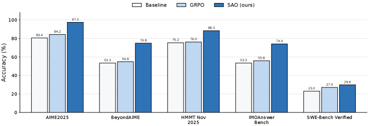
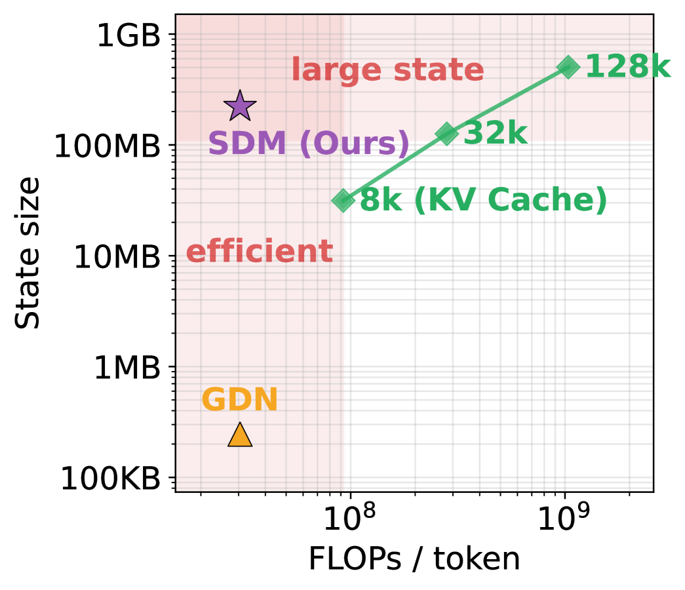
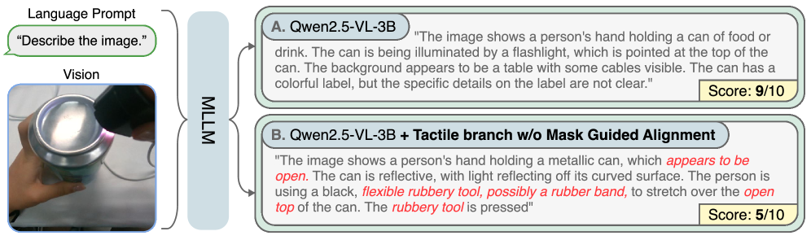
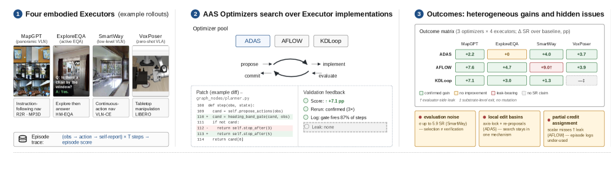
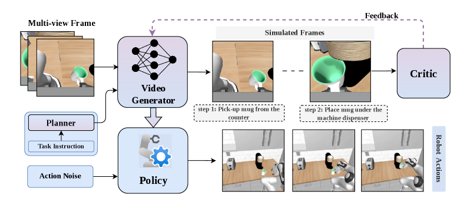

# Daily AI papers — 2026-07-09

*Curated from HF Daily Papers. 12 of 18 papers kept after relevance filter.*

## Papers at a glance

| # | Title | Topics | Org |
| --- | --- | --- | --- |
| 1 | [Single-Rollout Asynchronous Optimization for Agentic RL (SAO)](#1-sao) | `RL`, `agents`, `post-training` | Tsinghua (GLM-5.2 pipeline) |
| 2 | [Sparse Delta Memory: Scaling Linear-RNN State via Sparsity](#2-sparse-delta-memory) | `architectures`, `linear-RNN`, `long-context` | Meta FAIR |
| 3 | [OPSD-V: On-Policy Self-Distillation for Few-Step AR Video](#3-opsd-v) | `diffusion`, `video`, `distillation` | Meituan / HKUST |
| 4 | [AgentLens: Production-Assessed Trajectory Reviews for Coding Agents](#4-agentlens) | `eval`, `agents`, `LLM-judge` | JetBrains (Nikolenko et al.) |
| 5 | [Scaling MoE Video Pretraining for Embodied Intelligence (LingBot-Video)](#5-lingbot-video) | `MoE`, `diffusion`, `video`, `multimodal` | LingBot team |
| 6 | [Infinite Worlds with Versatile Interactions (LingBot-World-Infinity)](#6-lingbot-world-infinity) | `world-model`, `video`, `agents` | LingBot team |
| 7 | [SciReasoner: Deep Native Structural Reasoning across Sciences](#7-scireasoner) | `multimodal`, `reasoning`, `tokenization` | Shanghai AI Lab |
| 8 | [LaMem-VLA: Dual Latent Memory for VLA Models](#8-lamem-vla) | `multimodal`, `VLA`, `memory` | Nanjing UST / ZJU / NUS |
| 9 | [Splash: Mask-Isolated Tactile Alignment in MLLMs](#9-splash) | `multimodal`, `fine-tuning`, `continual-learning` | Ewha Womans U. |
| 10 | [Automating the Design of Embodied Agent Architectures (AgentCanvas)](#10-agentcanvas) | `agents`, `neural-arch-search` | U. Adelaide |
| 11 | [RoboTALES: Task-Aligned Simulated Futures for Robot Policies](#11-robotales) | `agents`, `video`, `RL` | UCSD |
| 12 | [Imagined Rollouts are Kinematic, Not Dynamic (World-Model Failure)](#12-imagined-rollouts) | `eval`, `world-model` | TUM |

---

## 1. Single-Rollout Asynchronous Optimization for Agentic Reinforcement Learning {#1-sao}

**Authors:** Zhenyu Hou, Yujiang Li, Jie Tang, Yuxiao Dong — *Tsinghua University*
**Links:** [arXiv:2607.07508](https://arxiv.org/abs/2607.07508) · [HF](https://huggingface.co/papers/2607.07508) · [AlphaXiv](https://www.alphaxiv.org/abs/2607.07508)
**Topics:** `RL`, `agents`, `post-training`

### TL;DR

SAO tackles the mismatch between GRPO's group-wise sampling and the throughput needs of asynchronous long-horizon agentic RL. Instead of $G$ rollouts per prompt (which stalls a scheduler that wants to update as trajectories arrive), SAO takes **one rollout per prompt** and pairs it with a learned value network for the baseline — plus a strict double-sided token-level clip to keep off-policy updates stable. It powers the RL stage of the open GLM-5.2 (750B-A40B) release.

### Key idea

Two moves. First, **abandon group sampling** — for long-horizon agent tasks (SWE-Bench, IMO-answer), a single high-quality rollout beats $G$ short rollouts because each rollout is expensive and the group std collapses on hard prompts. That reintroduces the need for a baseline, so SAO trains a lightweight value network alongside the policy. Second, **strict double-sided token clip**: cap both the ratio *and* $|A_t|$ per token before the PPO minimum, blocking the large-negative-advantage explosions that dominate async off-policy training.

### Main finding

Trains stably for 1,000 async steps where GRPO diverges. Beats GRPO and DAPO on SWE-Bench Verified, BeyondAIME, and IMOAnswerBench. Deployed as the RL post-training pipeline for **GLM-5.2 (750B params, 40B active)**, and shown to shine in a simulated online-learning setting where the environment shifts under the model.

### Why it matters

Async RL is the natural fit for agentic training — rollouts take minutes-to-hours, and forcing every worker to wait for a group barrier wastes GPU. But every open recipe copies GRPO's group baseline, which fights asynchrony. SAO shows the value network isn't dead for large-scale LLM RL — it's exactly what async agentic RL needed. Expect the "back to PPO-with-value-net, done properly" thread to pick up.

### Knowledge graph integration

**Builds on / relates to existing pages:**
- [../post-training/grpo.md](../post-training/grpo.md) — SAO is explicitly a critique of GRPO's group-sampling assumption for async long-horizon RL.
- [../post-training/ppo.md](../post-training/ppo.md) — SAO reintroduces a value network and adds a tighter, double-sided clip on top of PPO.
- [../post-training/_rl.md](../post-training/_rl.md) — new baseline point in the RL variants table (single-rollout + value net + async).
- [../systems/partial-rollouts.md](../systems/partial-rollouts.md) — same design pressure: async rollouts overlapping with training.
- [../post-training/reasoning/long-cot-rl.md](../post-training/reasoning/long-cot-rl.md) — long-CoT / long-horizon regime is exactly where SAO wins over GRPO.

**Suggested new pages:**
- `post-training/sao.md` *(depth)* — the single-rollout + double-sided clip recipe.
- `case-studies/glm-5-2.md` *(case study)* — if the GLM-5.2 tech report drops separately.

---

## 2. Sparse Delta Memory: Scaling the State of Linear RNNs through Sparsity {#2-sparse-delta-memory}

**Authors:** Pierre-Emmanuel Mazaré, Gergely Szilvasy, Matthijs Douze, Maria Lomeli, Ilze Amanda Auzina, Justin Carpentier, Gabriel Synnaeve, Hervé Jégou — *Meta FAIR* (+ Inria, U. Tübingen)
**Links:** [arXiv:2607.07386](https://arxiv.org/abs/2607.07386) · [HF](https://huggingface.co/papers/2607.07386) · [AlphaXiv](https://www.alphaxiv.org/abs/2607.07386)
**Topics:** `architectures`, `linear-RNN`, `long-context`

### TL;DR

Gated linear RNNs (Mamba, DeltaNet, RWKV) have a fixed-size hidden state — that's their whole compute advantage over softmax attention, but it caps long-context recall. Sparse Delta Memory (SDM) scales the state size by **orders of magnitude** without paying the FLOP bill: it treats the state as an addressable memory and only reads/writes to a **sparse subset of slots per token** using a learned key.

### Key idea

Rewrite the delta-rule state update so each token addresses a small set of state slots (top-$k$ by learned key), performs the delta update on just those slots, and leaves the rest untouched. Compute per token stays $O(k \cdot d)$ instead of $O(N_{\text{slots}} \cdot d)$ even as $N_{\text{slots}}$ grows. The state becomes a sparse associative memory, structurally close to a retrieval augmented KV cache — but folded into the RNN update rather than bolted on outside.

### Main finding

At matched inference cost, SDM matches or beats softmax-transformer baselines on long-context recall (needle-in-haystack, associative retrieval) while retaining the constant per-token FLOPs of a linear RNN. State capacity can be scaled by orders of magnitude essentially for free at inference.

### Why it matters

The Mamba-line critique — "linear RNNs are cheap but forget" — has a clean answer now: give the state room, address it sparsely. SDM points at a hybrid regime where you keep the linear-time compute of SSM/linear-attention but recover softmax-transformer-level recall. Direct implications for long-document, long-CoT, and agentic-memory workloads where transformers are choking on KV-cache size.

### Knowledge graph integration

**Builds on / relates to existing pages:**
- [../fundamentals/attention.md](../fundamentals/attention.md) — SDM is the counterpoint: fixed-compute recurrence with attention-like capacity via sparse addressing.
- [../architectures/mla.md](../architectures/mla.md) — MLA compresses the KV cache; SDM compresses the recurrence — sibling responses to the same long-context bottleneck.

**Suggested new pages:**
- `architectures/sparse-delta-memory.md` *(depth)* — the sparse addressing scheme + delta-rule update.
- `architectures/_linear-rnn.md` *(taxonomy)* — Mamba / DeltaNet / GLA / SDM as variants of the same recurrence family.

---

## 3. OPSD-V: On-Policy Self-Distillation for Post-Training Few-Step Autoregressive Video Generators {#3-opsd-v}

**Authors:** Hongyu Liu, Chun Wang, Feng Gao, Xuanhua He, Yue Ma, Ziyu Wan, Yong Zhang, Xiaoming Wei, Qifeng Chen — *Meituan · HKUST · City U. of Hong Kong*
**Links:** [arXiv:2607.08766](https://arxiv.org/abs/2607.08766) · [HF](https://huggingface.co/papers/2607.08766) · [AlphaXiv](https://www.alphaxiv.org/abs/2607.08766)
**Topics:** `diffusion`, `video`, `distillation`

### TL;DR

Few-step autoregressive (AR) video diffusion models (Self-Forcing, LongLive) are fast but drift on long rollouts — error accumulates, motion degrades. OPSD-V post-trains them by **on-policy self-distillation**: the student runs the actual inference-time rollout, the teacher (same architecture, cleaner AR cache) supplies dense denoising-level correction targets on the student's own trajectory. No change to the sampler or step count.

### Key idea

Two-stream setup. Student: **stochastic inference-time rollout** with the noisy AR cache the deployed model would see. Teacher: same model, but conditioned on a **clean AR-consistent temporal cache** built from ground-truth long-video context. Distillation loss aligns the student's denoising output with the teacher's at every step of the student's rollout — an on-policy distillation signal that exists *inside* the AR trajectory rather than at the sequence endpoints.

### Main finding

Applied to Self-Forcing and LongLive, OPSD-V wins **66.0% of overall-preference judgments** (82.5% excluding ties) in user studies. Improvements without touching sampler, step count, or model size.

### Why it matters

Long AR video generation lives or dies by error accumulation. Prior fixes were either training-heavy (add teacher-forced trajectories) or inference-heavy (more steps, KV rework). OPSD-V is neither — it's a post-training pass with the same architecture. The template — student rolls out, teacher supervises dense denoising on the student's own trajectory — likely transfers to any few-step AR sequence model (audio, motion, tokens).

### Knowledge graph integration

**Builds on / relates to existing pages:**
- [../post-training/_post-training.md](../post-training/_post-training.md) — post-training as a general framework covers diffusion / AR generators, not just LLMs.

**Suggested new pages:**
- `multimodal/opsd-v.md` *(depth)* — the on-policy self-distillation recipe for AR video.
- `multimodal/_video-generation.md` *(taxonomy)* — AR vs bidirectional, few-step vs many-step, Self-Forcing / LongLive / OPSD-V as points in the space.

---

## 4. AgentLens: Production-Assessed Trajectory Reviews for Coding Agent Evaluation {#4-agentlens}

**Authors:** Andrey Podivilov, Vadim Lomshakov, Sergey Savin, Matvei Startsev, Roman Pozharskiy, Maksim Parshin, Sergey Nikolenko — *(JetBrains AI team)*
**Links:** [arXiv:2607.06624](https://arxiv.org/abs/2607.06624) · [HF](https://huggingface.co/papers/2607.06624) · [AlphaXiv](https://www.alphaxiv.org/abs/2607.06624)
**Topics:** `eval`, `agents`, `LLM-judge`

### TL;DR

Existing coding-agent benchmarks reduce a run to a single pass/fail bit. AgentLens instead scores the **whole trajectory** — instruction following, tool use, self-verification, error recovery, user-facing communication — by pairing formal checks (where they exist) with LLM-written trajectory reviews and pairwise comparisons. Runs are used in a nightly pipeline to catch regressions, not just to rank models.

### Key idea

Two complementary channels. (1) **Formal verifier** where an objective check exists (tests pass, file diff correct). (2) **LLM-judge trajectory review** — a structured review LLM writes a readable explanation of *why* the run scored what it did, plus a side-by-side comparison against a reference trajectory. This makes every score interpretable and turns eval into a diagnostic tool.

### Main finding

Deployed in a production nightly evaluation pipeline: catches product regressions between successive agent versions, diagnoses failure modes (bad tool selection vs poor recovery vs unclear communication) that pass/fail hides. Open-source at github.com/agent-lens/agent-lens-bench.

### Why it matters

Coding agents fail in ways SWE-Bench can't distinguish (failed test suite vs no tool call vs the wrong file edited); teams shipping agents in production already know this and are running ad-hoc trajectory review. AgentLens formalizes that into a benchmark shape that other agent teams can adopt. The trajectory-review-as-eval pattern likely spreads to browser agents, computer-use agents, research agents.

### Knowledge graph integration

**Builds on / relates to existing pages:**
- [../evaluation/livecodebench.md](../evaluation/livecodebench.md) — LiveCodeBench is the pass/fail baseline AgentLens is replacing.
- [../evaluation/humaneval.md](../evaluation/humaneval.md) — same shift from single-shot correctness to trajectory quality.
- [../post-training/cot-reward-model.md](../post-training/cot-reward-model.md) — LLM-judge trajectory review is a cousin of CoT reward modeling.

**Suggested new pages:**
- `evaluation/agentlens.md` *(depth)* — the trajectory-review benchmark and its scoring model.
- `evaluation/_agent-benchmarks.md` *(taxonomy)* — SWE-Bench / LiveCodeBench / AgentLens as points on the pass-bit-to-full-trajectory spectrum.

---

## 5. Scaling Mixture-of-Experts Video Pretraining for Embodied Intelligence (LingBot-Video) {#5-lingbot-video}

**Authors:** Shuailei Ma, Jiaqi Liao, Xinyang Wang, Jingjing Wang, et al. (28 authors) — *LingBot team*
**Links:** [arXiv:2607.07675](https://arxiv.org/abs/2607.07675) · [HF](https://huggingface.co/papers/2607.07675) · [AlphaXiv](https://www.alphaxiv.org/abs/2607.07675)
**Topics:** `MoE`, `diffusion`, `video`, `multimodal`

### TL;DR

LingBot-Video is a **DiT-based MoE video generative foundation model** aimed at embodied intelligence rather than aesthetic content. Three levers: (1) MoE inside a DiT for capacity-vs-compute headroom, (2) a data engine that augments internet video with robot/manipulation/egocentric footage, (3) a multi-dimensional reward for training-time alignment on *physical rationality* and *task completion* rather than just prompt-following and motion smoothness.

### Key idea

Video diffusion models trained for creative fidelity encode wrong priors for actuation ("hands smoothly pass through a mug"). LingBot-Video reshapes all three legs of the recipe simultaneously — architecture (MoE-in-DiT), data (robot-heavy mixture), and reward (physical-rationality signals during training) — to produce a video foundation model whose imagined futures are usable for downstream policy learning.

### Main finding

Scales an MoE-DiT from scratch to a competitive video foundation model, released as the first large-scale open-source MoE video foundation model. Comprehensive evals show both stronger physical-realism metrics and stronger downstream embodied-intelligence transfer than dense DiT baselines at matched inference cost.

### Why it matters

The next generation of embodied models needs a strong world-simulator backbone. Directly using Sora-style content models has been the default and has been visibly biased toward creativity over physics. LingBot-Video is a public artifact showing what changes when the entire recipe is retuned for embodied use, and the open MoE-DiT weights matter for a research community that's been reliant on closed proprietary video models.

### Knowledge graph integration

**Builds on / relates to existing pages:**
- [../architectures/_moe.md](../architectures/_moe.md) — MoE-in-DiT is a new deployment site for the MoE toolkit.
- [../architectures/deepseek-moe.md](../architectures/deepseek-moe.md) — shared-plus-routed-expert pattern likely applies here too.
- [../architectures/aux-loss-free-balancing.md](../architectures/aux-loss-free-balancing.md) — MoE from scratch at scale usually needs load-balance handling.

**Suggested new pages:**
- `case-studies/lingbot-video.md` *(case study)* — the DiT-MoE + data + reward recipe.
- `multimodal/moe-diffusion.md` *(depth)* — MoE integration in diffusion transformers.

---

## 6. Infinite Worlds with Versatile Interactions (LingBot-World-Infinity) {#6-lingbot-world-infinity}

**Authors:** Zelin Gao, Qiuyu Wang, Jiapeng Zhu, Jingye Chen, et al. — *LingBot team*
**Links:** [arXiv:2607.07534](https://arxiv.org/abs/2607.07534) · [HF](https://huggingface.co/papers/2607.07534) · [AlphaXiv](https://www.alphaxiv.org/abs/2607.07534)
**Topics:** `world-model`, `video`, `agents`

### TL;DR

LingBot-World 2.0 is an interactive video world model that keeps consistent quality **over an unbounded horizon** (previous versions drifted). Runs at 720p/60fps in real time, accepts a wide vocabulary of interactive actions (combat, archery, spell-casting, shooting), and pairs the world model with **pilot** and **director** agents for autonomous world simulation. A 1.3B lightweight variant runs on a single GPU.

### Key idea

A **causal pretraining paradigm** designed for unbounded rollout. Instead of training on fixed-length clips (which teaches the model an implicit horizon), the pretraining objective is set up so the state representation is invariant to how many past frames were consumed — enabling arbitrarily long autoregressive generation without drift. On top of that: pilot agent produces the player-level action stream, director agent shapes higher-level narrative.

### Main finding

Unbounded interactive rollout at 720p/60fps in real time, a first for open interactive world models at this quality level. 1.3B variant runs on a single GPU; the full model integrates a two-agent stack for autonomous simulation. Positioned as the second iteration of the LingBot-World line.

### Why it matters

Interactive world models are becoming the target format for both game generation and agent training environments. Two properties matter: real-time interactivity and long-horizon consistency — LingBot-World-Infinity is the first open release to claim both simultaneously. The pilot/director layering is also a template for agent-driven world simulation.

### Knowledge graph integration

**Suggested new pages:**
- `case-studies/lingbot-world.md` *(case study)* — the causal pretraining paradigm + pilot/director stack.
- `multimodal/interactive-world-models.md` *(depth)* — the specific pretraining objective for unbounded rollout.

---

## 7. Accurate, Interdisciplinary and Transparent Structure-property Understanding with Deep Native Structural Reasoning (SciReasoner) {#7-scireasoner}

**Authors:** Chen Tang, Yizhou Wang, Jianyu Wu, Lintao Wang, Shixiang Tang, et al. — *Shanghai AI Laboratory*
**Links:** [arXiv:2607.07708](https://arxiv.org/abs/2607.07708) · [HF](https://huggingface.co/papers/2607.07708) · [AlphaXiv](https://www.alphaxiv.org/abs/2607.07708)
**Topics:** `multimodal`, `reasoning`, `tokenization`

### TL;DR

SciReasoner is a multimodal scientific foundation model that reasons over **structures** — proteins, molecules, crystals — by discretizing structural elements into a **unified token vocabulary**. Same LLM stack, tokens for structural primitives, and structure-aware reasoning that stays interpretable across disciplines.

### Key idea

Instead of one modality-specific encoder per structural domain, define a shared vocabulary that discretizes structural primitives across proteins/molecules/crystals into tokens the LLM can consume and produce natively. Structural reasoning then becomes token-level reasoning — same tools that made CoT work for text (chain-of-thought, tool use, verifier RL) apply directly to structural reasoning.

### Main finding

Enables interpretable structural reasoning across the three domains through the shared vocabulary. The model produces readable structural reasoning traces (why a molecule has a property, why a crystal has a phase) rather than opaque embedding regressions.

### Why it matters

*Borderline: included because the tokenization strategy — discretizing non-text structural modalities into a shared LLM vocabulary — is a general recipe that transfers to any domain where "tokens" have to be invented (motion, audio, biology).* SciReasoner is a concrete point on that curve at scale, and the ability to run CoT-style reasoning over scientific structures is a template other domain foundation models will copy.

### Knowledge graph integration

**Builds on / relates to existing pages:**
- [../fundamentals/_tokenization.md](../fundamentals/_tokenization.md) — extends BPE-family tokenization to non-text structural primitives.
- [../fundamentals/bpe.md](../fundamentals/bpe.md) — same discretization principle applied to protein/molecule/crystal structures.
- [../post-training/reasoning/long-cot-rl.md](../post-training/reasoning/long-cot-rl.md) — same reasoning-RL recipes apply once the domain is tokenized.

---

## 8. LaMem-VLA: Dual Latent Memory in Vision-Language-Action Models {#8-lamem-vla}

**Authors:** Hongyu Qu, Jianzhe Gao, Xiaobin Hu, Shaohuan Yang, Xinlei Yu, Rui Yan, Wenguan Wang, Xiangbo Shu, Shuicheng Yan — *Nanjing UST · Zhejiang U. · NUS*
**Links:** [arXiv:2607.07608](https://arxiv.org/abs/2607.07608) · [HF](https://huggingface.co/papers/2607.07608) · [AlphaXiv](https://www.alphaxiv.org/abs/2607.07608)
**Topics:** `multimodal`, `VLA`, `memory`

### TL;DR

Standard VLA models are approximately Markovian — they act off the current observation and forget everything else, which hurts them on long-horizon tasks. LaMem-VLA gives the VLA an **explicit dual latent memory** (short-term and long-term "vaults") stored as context-native tokens injected into the model's own reasoning sequence.

### Key idea

Four coordinated components: (1) **curator** organizes past experiences into short-term and long-term memory vaults, (2) **seeker** retrieves context-relevant evidence for the current step, (3) **condenser** rewrites retrieved evidence into compact latent tokens (not raw frames), (4) **weaver** injects those tokens into the VLA's own reasoning sequence — so the memory is *in-context* rather than an external lookup.

### Main finding

**97.6% success rate on LIBERO**, outperforming comparable VLA baselines. Gains also on SimplerEnv. The context-native memory beats external retrieval-based memory because the VLA can reason over the memory tokens with its normal attention.

### Why it matters

Long-horizon VLA is the current wall. The LaMem-VLA design is a template not just for VLA but for any agent stack that wants persistent, in-context memory — coding agents, browser agents, research assistants. Curator/seeker/condenser/weaver is a cleaner decomposition than most "give the agent memory" papers.

### Knowledge graph integration

**Builds on / relates to existing pages:**
- [../agents/README.md](../agents/README.md) — multi-turn agent memory is exactly this problem, one layer up.

**Suggested new pages:**
- `multimodal/vla-memory.md` *(depth)* — the curator/seeker/condenser/weaver stack.
- `multimodal/_vla.md` *(taxonomy)* — VLA design space (action head, memory, embodiment conditioning).

---

## 9. Wake up for Touch! Mask-isolated Tactile Alignment Learning in MLLMs (Splash) {#9-splash}

**Authors:** P. Yoon, Xinzhi Yu, Sungwon Park, Jiyoung Lee — *Ewha Womans University*
**Links:** [arXiv:2607.00302](https://arxiv.org/abs/2607.00302) · [HF](https://huggingface.co/papers/2607.00302) · [AlphaXiv](https://www.alphaxiv.org/abs/2607.00302)
**Topics:** `multimodal`, `fine-tuning`, `continual-learning`

### TL;DR

Adding a new modality (tactile) to a compact MLLM usually forces a zero-sum trade — new sensory alignment costs old vision-language ability. Splash partitions the pretrained parameters into a **critical subspace** (frozen, guards the old knowledge) and a **dormant subspace** (updated, absorbs the new modality) by scoring per-parameter significance, then only ever writes to the dormant slice.

### Key idea

Compute a **per-parameter significance score** (Fisher-information-style) that ranks how essential each weight is to the frozen model's existing capability. Split into two masks: keep top-significance weights frozen (critical), fine-tune only the low-significance weights (dormant). New tactile alignment gets injected into the dormant subspace, leaving critical vision-language weights untouched.

### Main finding

New modality alignment achieved without catastrophic forgetting of the base MLLM's vision-language reasoning, on a compact model where budget is scarce.

### Why it matters

The parameter-subspace-isolation recipe generalizes beyond tactile: it's a plausible answer to "how do we keep adding modalities without frontier-scale budgets" — a recurring problem for continual multimodal expansion. Related in spirit to LoRA and other structured-fine-tuning approaches, but the direction here is *which subspace of the base model to freeze*, not *what low-rank delta to add*.

### Knowledge graph integration

**Builds on / relates to existing pages:**
- [../post-training/fine-tuning/README.md](../post-training/fine-tuning/README.md) — cousin to LoRA-family parameter-efficient tuning, from a subspace-selection angle.

**Suggested new pages:**
- `post-training/fine-tuning/mask-isolated-tuning.md` *(depth)* — critical-vs-dormant subspace fine-tuning for modality expansion.

---

## 10. Automating the Design of Embodied Agent Architectures (AgentCanvas / KDLoop) {#10-agentcanvas}

**Authors:** Jian Zhou, Sihao Lin, Jin Li, Shuai Fu, Gengze Zhou, Qi Wu — *Australian Institute for Machine Learning, U. of Adelaide*
**Links:** [arXiv:2606.30111](https://arxiv.org/abs/2606.30111) · [HF](https://huggingface.co/papers/2606.30111) · [AlphaXiv](https://www.alphaxiv.org/abs/2606.30111)
**Topics:** `agents`, `neural-arch-search`

### TL;DR

Embodied agents (VLN, EQA, manipulation) are hand-designed wirings of perception, memory, planning, and action modules. AgentCanvas is a typed-graph runtime that treats those wirings as **editable node-and-wire programs** with simulator-aware execution; KDLoop is a coding-agent search over those programs (propose → critique → experiment → distill, with triggered reflection after stalls).

### Key idea

Recast **agent-architecture search** (previously demonstrated for text-domain agents only) into perceptual embodied agents with simulator rollouts as the evaluation signal. Search actions are graph edits (add module, rewire, swap component); the coding agent proposes edits, an evaluator runs them in simulation, a critic distills lessons, and reflection triggers when the search stalls in a local basin.

### Main finding

3×4 matrix (three search variants × four executors: VLN, EQA, two manipulation stacks) shows architecture-level search produces deployable, directional success-rate gains on embodied tasks. Also documents new failure modes specific to embodied AAS: rollout noise masks the signal, search gets stuck in local edit basins, and episode-level credit assignment is only partially recoverable from logs.

### Why it matters

Automating agent architecture design is a hot direction — most work is text-only. AgentCanvas / KDLoop is the first systematic transfer to embodied simulation and its honest catalog of failure modes is more useful for the field than the incremental gains: rollout noise and credit assignment are the actual bottlenecks anyone doing this will hit.

### Knowledge graph integration

**Builds on / relates to existing pages:**
- [../agents/README.md](../agents/README.md) — new addition to the agent-architecture concept space.

**Suggested new pages:**
- `agents/agent-architecture-search.md` *(depth)* — the propose/critique/experiment/distill loop applied to agent graphs.

---

## 11. RoboTALES: Learning Reasoning-Guided Robot Policies via Task-Aligned Simulated Futures {#11-robotales}

**Authors:** UCSD team (correspondence: hgani@ucsd.edu) — *UC San Diego*
**Links:** [arXiv:2607.06018](https://arxiv.org/abs/2607.06018) · [HF](https://huggingface.co/papers/2607.06018) · [AlphaXiv](https://www.alphaxiv.org/abs/2607.06018)
**Topics:** `agents`, `video`, `RL`

### TL;DR

Pretrained video generative models are attractive as visuomotor backbones — they know a lot about the visual world — but their imagined futures drift from task intent and aren't reliably action-conditional. RoboTALES is a **single-stage** framework that jointly learns to imagine task-aligned futures and extract policies from them.

### Key idea

Rather than train a world model first and extract a policy second (two-stage, drift-prone), align the future imagination and the policy in one loss with task-alignment terms that penalize imagined trajectories inconsistent with the task and action stream. Reasoning-guided means the model generates an explicit intermediate "what should happen next" trace that both the imagination and the policy attend to.

### Main finding

*Full details in the abstract are limited*, but the single-stage joint-learning framing yields robot policies that outperform two-stage baselines using the same video backbones.

### Why it matters

*Borderline: included because it sits at the video-generation / policy-learning intersection that's dragging both video foundation models and embodied agents into the same tooling.* The single-stage recipe is also the counter-argument to the "just pretrain a good video model and everything else is downstream" trend that LingBot-Video represents.

### Knowledge graph integration

**Suggested new pages:**
- `agents/reasoning-guided-policies.md` *(depth)* — the task-aligned imagined-futures training objective.

---

## 12. Imagined Rollouts are Kinematic, Not Dynamic: A Diagnosis of Long-Horizon World-Model Failure {#12-imagined-rollouts}

**Authors:** Finn Rasmus Schäfer, Korbinian Moller, Yuan Gao, Christian Oefinger, Sebastian Schmidt, Johannes Betz — *TUM (Autonomous Vehicle Systems)*
**Links:** [arXiv:2607.05966](https://arxiv.org/abs/2607.05966) · [HF](https://huggingface.co/papers/2607.05966) · [AlphaXiv](https://www.alphaxiv.org/abs/2607.05966)
**Topics:** `eval`, `world-model`

### TL;DR

Learned world models degrade over long horizons and it's not obvious why. This paper defines a **kinematic-consistency error** on imagined rollouts and shows it stays roughly flat while downstream policy rewards collapse — meaning the failure is *dynamic*, not kinematic: the model preserves how objects move geometrically but loses how forces/friction/torque actually work.

### Key idea

Split world-model competence into two axes — **kinematic** (positions, velocities, geometry) and **dynamic** (forces, contact, friction) — and measure each separately over the imagined rollout. The finding: imagined rollouts remain kinematically plausible even as they become dynamically wrong. The kinematic-consistency metric can be measured cheaply and used to diagnose long-horizon failure before it corrupts policy reward.

### Main finding

Across friction-boundary evaluations, kinematic-consistency error stays roughly flat over the rollout while policy reward collapses — first quantitative separation of the two failure modes in an imagined-rollout setting.

### Why it matters

*Borderline: included because the kinematic-vs-dynamic axis is a general critique of video-based world models — including the large open ones (Sora-family, LingBot-World, minWM).* If a world model looks right but doesn't respect physics, downstream RL from imagined rollouts silently degrades. Testing along this axis should be part of any world-model evaluation.

### Knowledge graph integration

**Suggested new pages:**
- `evaluation/kinematic-vs-dynamic-consistency.md` *(depth)* — the diagnosis metric and its use in world-model evaluation.

---

## Notes

- Borderline inclusions (SciReasoner, RoboTALES, Imagined-Rollouts diagnosis) are flagged in-section with an italic *Borderline: …* line.
- The LingBot-Video and LingBot-World-Infinity papers are companion releases from the same team; both are open-source.
- Hero figures for all 12 papers were downloaded; where the arXiv HTML `x1.png` was a placeholder, the HF paper card thumbnail was used as fallback.
- No existing concept files, `READING-LIST.md`, or `PAPERS.md` were modified to produce this digest.
