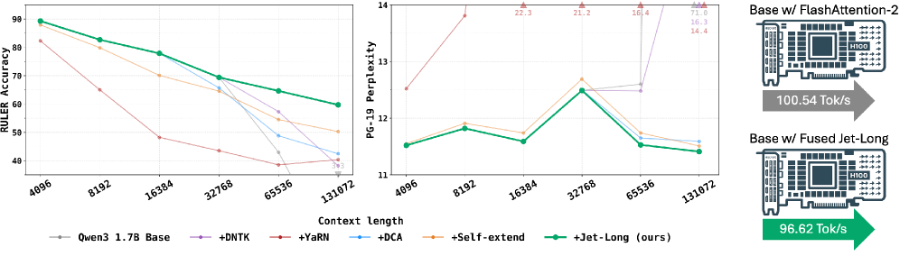
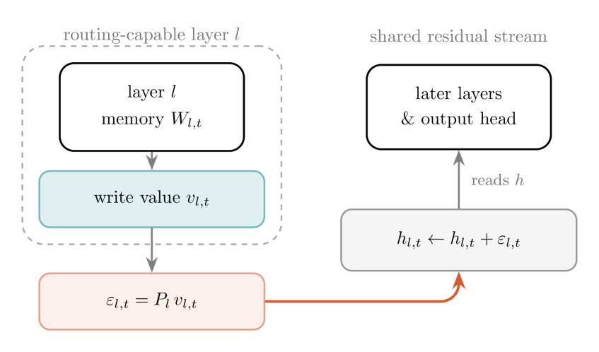
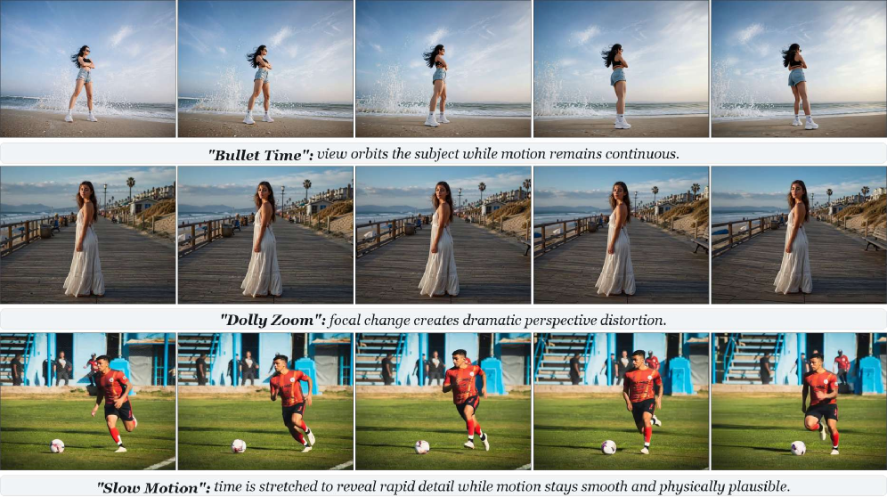
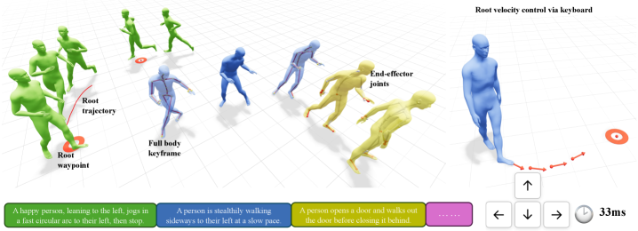
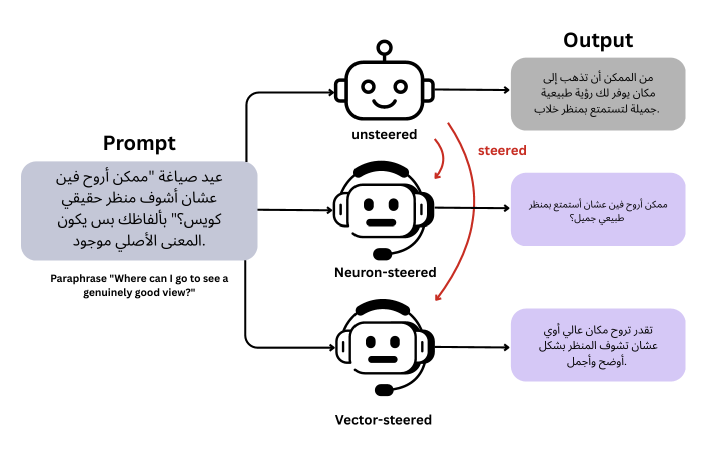
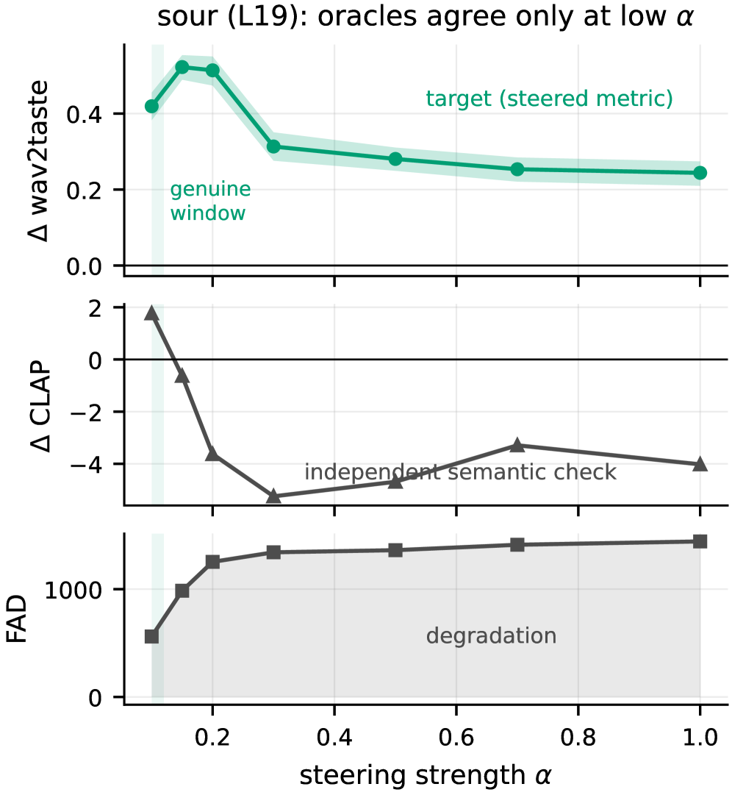
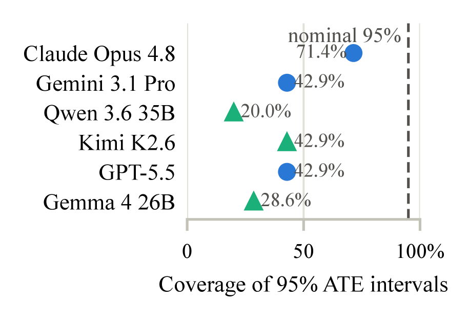

# Daily AI papers — 2026-07-10

*Curated from HF Daily Papers. 14 of ~23 papers kept after relevance filter.*

## Papers at a glance

| # | Title | Topics | Org |
| --- | --- | --- | --- |
| 1 | [Jet-Long: Efficient Long-Context Extension with Dynamic Bifocal RoPE](#1-jet-long) | `LLM`, `long-context`, `RoPE` | NVIDIA |
| 2 | [Linear Attention Architectures: Mechanisms, Trade-offs, and Cross-Layer Routing](#2-linear-attention-architectures) | `architectures`, `linear-attention`, `efficient-inference` | ETH Zurich |
| 3 | [UP: Unbounded Positive Asymmetric Optimization for Breaking the Exploration-Stability Dilemma](#3-up) | `RL`, `post-training`, `exploration` | ByteDance Seed |
| 4 | [Flash-BoN: Instant Drafts for Inference-Time Scaling in Diffusion Models](#4-flash-bon) | `diffusion`, `inference-time-scaling`, `BoN` | UMD / Hugging Face |
| 5 | [Remember When It Matters: Proactive Memory Agent for Long-Horizon Agents](#5-proactive-memory-agent) | `agents`, `memory`, `RL` | Meta AI |
| 6 | [UniClawBench: A Universal Benchmark for Proactive Agents on Real-World Tasks](#6-uniclawbench) | `agents`, `eval`, `benchmark` | HKU MMLab |
| 7 | [Vidu S1: A Real-Time Interactive Video Generation Model](#7-vidu-s1) | `diffusion`, `video`, `real-time` | Tsinghua / Shengshu |
| 8 | [CineMobile: On-Device Image-to-Video Diffusion for Cinematic Camera Motion Generation](#8-cinemobile) | `diffusion`, `distillation`, `quantization` | SJTU / Nankai / Transsion |
| 9 | [ARDY: Autoregressive Diffusion with Hybrid Representation for Interactive Human Motion Generation](#9-ardy) | `diffusion`, `motion`, `streaming` | NVIDIA |
| 10 | [OpenCoF: Learning to Reason Through Video Generation](#10-opencof) | `multimodal`, `reasoning`, `video-diffusion` | ByteDance Seed / CUHK |
| 11 | [Can Dialects Be Steered Like Languages? Sparse Neurons and Distributed Directions in Arabic LLMs](#11-arabic-dialect-steering) | `interp`, `steering`, `multilingual` | MBZUAI / QCRI |
| 12 | [aria: A Quantized Native Runtime for On-Device Semantic Audio Generation](#12-aria) | `quantization`, `audio`, `inference` | (open-source) |
| 13 | [CausalDS: Benchmarking Causal Reasoning in Data-Science Agents](#13-causalds) | `agents`, `eval`, `causal-reasoning` | U. Michigan |
| 14 | [Ideas Have Genomes: Benchmarking Scientific Lineage Reasoning](#14-ideagene-bench) | `LLM`, `eval`, `reasoning` | SJTU |

---

## 1. Jet-Long: Efficient Long-Context Extension with Dynamic Bifocal RoPE

**Authors:** Han Cai et al. — *NVIDIA*
**Links:** [arXiv:2607.07740](https://arxiv.org/abs/2607.07740) · [HF](https://huggingface.co/papers/2607.07740) · [AlphaXiv](https://www.alphaxiv.org/abs/2607.07740)
**Topics:** `LLM`, `long-context`, `RoPE`

### TL;DR

A tuning-free, zero-shot RoPE-extension recipe that keeps short-input fidelity intact while extrapolating cleanly to context lengths an order of magnitude past the pretraining window. The trick is to run **two** RoPE views inside every attention head — a local window at the model's native frequencies, and a long-range window whose rescaling factor is chosen dynamically from the current sequence length.

### Key idea

Existing zero-shot extensions (NTK, YaRN, PI) pick one static rescale factor at deploy time — aggressive settings destroy short-context accuracy, conservative ones collapse at very long inputs. Jet-Long splits attention into a "bifocal" pair: the local head sees unmodified RoPE (base model recovered exactly when input ≤ pretrain window), the long-range head applies a rescaling factor that is a function of the *current* sequence length. No tuning, no distillation, works on open-weight checkpoints.

### Main finding

Recovers the base model exactly at short inputs (unlike YaRN/NTK which trade short-context loss for long-context reach) and extrapolates cleanly at long inputs, on standard RAG / long-doc / agentic-trace benchmarks. Exact numbers not visible in the abstract-only extract; check the HF page for tables.

### Why it matters

Zero-shot context extension is now the default deployment path for open-weight LLMs used in retrieval-augmented, repository-scale coding, and long agentic-trace workflows. Jet-Long removes the "pick one factor and pray" tradeoff, which is directly relevant to serving stacks that mix short chat and long RAG traffic on the same checkpoint.

### Knowledge graph integration

**Builds on / relates to existing pages:**
- [../fundamentals/rope.md](../fundamentals/rope.md) — Jet-Long is a RoPE modification; the local window is RoPE-faithful.
- [../fundamentals/dca.md](../fundamentals/dca.md) — Dual Chunk Attention already splits attention by chunk; bifocal RoPE is a frequency-space cousin.
- [../fundamentals/_positional-encoding.md](../fundamentals/_positional-encoding.md) — should list bifocal RoPE as a variant.

**Suggested new pages:**
- `fundamentals/bifocal-rope.md` *(depth)* — dynamic-rescale two-window RoPE for zero-shot context extension.

---

## 2. Linear Attention Architectures: Mechanisms, Trade-offs, and Cross-Layer Routing

**Authors:** Tommaso Cerruti, Tim Rieder, George Rowlands, Lingfeng Jin, Imanol Schlag — *ETH Zurich (D-INFK, AI Center)*
**Links:** [arXiv:2607.07953](https://arxiv.org/abs/2607.07953) · [HF](https://huggingface.co/papers/2607.07953) · [AlphaXiv](https://www.alphaxiv.org/abs/2607.07953)
**Topics:** `architectures`, `linear-attention`, `efficient-inference`

### TL;DR

A head-to-head comparative study of softmax attention against four recent recurrent linear-attention variants — DeltaNet, Gated DeltaNet, Kimi Delta Attention, Gated DeltaNet-2 — expressed in a shared recurrent-memory notation. Adds a novel **Cross-Layer Value Routing (CLVR)** that forwards a lower layer's write value into the aligned hidden stream of the next layer's DeltaNet memory.

### Key idea

Rewrite every DeltaNet-family memory as `(erase, write, decay)` triples over a common recurrent state, exposing exactly where the variants differ. Then test whether routing information across layers (feeding an inner-layer memory update into the next layer's inputs) can improve pure/hybrid stacks. The natural "forward the delta-rule error" formulation fails; routing the *write value* into the aligned hidden stream (CLVR) modestly wins.

### Main finding

At 350M params × 15B tokens: Kimi Delta Attention with the Muon optimizer reaches the lowest final validation loss; pure Gated DeltaNet stacks (AdamW) hit the highest training throughput; hybrids improve loss at throughput cost; Muon consistently beats AdamW across matched configs. CLVR modestly lowers final validation loss on both DeltaNet and Gated DeltaNet. Larger DeltaNet runs at 1.3B / 3B confirm the pattern.

### Why it matters

Linear-attention families have been proliferating (Mamba, RWKV, RetNet, DeltaNet, Gated DeltaNet, KDA, xLSTM) with little apples-to-apples comparison in a single training setup. This is the first controlled sweep of the *delta-family* — useful as a picking guide for teams building hybrid long-context stacks, and CLVR is a cheap architectural knob to layer on top.

### Knowledge graph integration

**Builds on / relates to existing pages:**
- [../architectures/multi-head-attention.md](../architectures/multi-head-attention.md) — the softmax baseline the paper contrasts against.
- [../architectures/README.md](../architectures/README.md) — should eventually host a `_linear-attention.md` taxonomy.

**Suggested new pages:**
- `architectures/_linear-attention.md` *(taxonomy)* — DeltaNet family, Mamba/SSMs, gated variants, KDA.
- `architectures/deltanet.md` *(depth)* — the delta-rule recurrent memory as the shared base.
- `architectures/kimi-delta-attention.md` *(depth)* — the winning variant of the sweep.

---

## 3. UP: Unbounded Positive Asymmetric Optimization for Breaking the Exploration-Stability Dilemma

**Authors:** Chongyu Fan, Pengfei Liu, Jingjia Huang, Sijia Liu, Yi Lin — *ByteDance Seed*
**Links:** [arXiv:2607.06987](https://arxiv.org/abs/2607.06987) · [HF](https://huggingface.co/papers/2607.06987) · [AlphaXiv](https://www.alphaxiv.org/abs/2607.06987)
**Topics:** `RL`, `post-training`, `exploration`

### TL;DR

A drop-in replacement for the PPO/GRPO clip objective in LLM RL that removes the upper clip on *positive* advantages while keeping the standard clip on negatives. The asymmetry lets promising trajectories keep receiving gradient (better exploration) without letting bad trajectories destabilize training.

### Key idea

The PPO-style ratio clip is symmetric: it caps both good and bad token updates equally, throttling exploration on high-advantage tokens. UP proposes an asymmetric objective — positive-advantage gradients are **unbounded** (unclipped), negative-advantage gradients keep the usual `1-ε` floor. This is a one-line change to the surrogate loss that trades none of PPO's stability guarantees while dramatically widening the effective exploration cone.

### Main finding

Framed as a "universal" objective — the abstract claims stable training with enhanced exploration in LLM RL settings. Concrete deltas over PPO/GRPO/DAPO baselines are promised in the paper body; the excerpt doesn't quote specific numbers.

### Why it matters

The exploration-vs-stability tradeoff is *the* dominant tuning axis in modern LLM RL (RLVR, long-CoT-RL, agentic RL). Every recent open recipe (DeepSeek-R1, Kimi K1.5, DAPO) tweaks the clip separately. A cleanly-motivated asymmetric fix that composes with GRPO/PPO is exactly the kind of thing that gets picked up as a default.

### Knowledge graph integration

**Builds on / relates to existing pages:**
- [../post-training/ppo.md](../post-training/ppo.md) — UP modifies PPO's ratio clip.
- [../post-training/grpo.md](../post-training/grpo.md) — same asymmetric fix applies to GRPO's group-relative objective.
- [../post-training/rlvr.md](../post-training/rlvr.md) — the typical setting UP is tuned for.
- [../post-training/reasoning/long-cot-rl.md](../post-training/reasoning/long-cot-rl.md) — where exploration bottlenecks bite hardest.

**Suggested new pages:**
- `post-training/asymmetric-clip.md` *(depth)* — the unbounded-positive clip trick as a standalone technique.

---

## 4. Flash-BoN: Instant Drafts for Inference-Time Scaling in Diffusion Models

**Authors:** Reza Shirkavand, Sayak Paul, Yuxin Wen, Heng Huang, Yizheng Chen, Tom Goldstein, Gowthami Somepalli — *University of Maryland, Hugging Face*
**Links:** [arXiv:2607.04461](https://arxiv.org/abs/2607.04461) · [HF](https://huggingface.co/papers/2607.04461) · [AlphaXiv](https://www.alphaxiv.org/abs/2607.04461)
**Topics:** `diffusion`, `inference-time-scaling`, `BoN`

### TL;DR

An inference-time scaling recipe for text-to-image diffusion that beats guided-search methods (SVDD, DiffusionDPO-style verifiers) under a **wall-clock** budget. The recipe: generate many cheap draft candidates via timestep truncation, layer skipping and activation proxies, then run multi-stage verification to promote and refine only the most promising one.

### Key idea

Prior inference-time scaling for diffusion runs an expensive verifier at every intermediate denoising step (guided search). Flash-BoN observes that under a wall-clock budget — the metric that actually matters when serving — plain Best-of-N with **very cheap drafts** already matches or beats guided search. The cheap drafts come from three orthogonal accelerators (timestep truncation, per-layer skipping, activation proxies) applied to the base model. Verification is staged: quick prune, then refine the survivor.

### Main finding

Across three benchmarks and multiple model scales, Flash-BoN consistently outperforms NFE-matched guided-search baselines *when compared by wall-clock time*, with the gap widening at larger model scales. Composes with reflection-based prompt optimization and reportedly accelerates RL post-training convergence.

### Why it matters

The diffusion community had largely accepted that guided intermediate verification is the frontier for inference-time scaling. Flash-BoN reframes the problem around wall-clock, which is the deployable metric, and lands on a simpler recipe. Also a template for how LLM inference-time scaling should think about draft cost.

### Knowledge graph integration

**Builds on / relates to existing pages:**
- [../post-training/rejection-sampling.md](../post-training/rejection-sampling.md) — Best-of-N is the sampling side of rejection-sampling data curation.
- [../post-training/reasoning/orm.md](../post-training/reasoning/orm.md) — outcome-reward verifiers underlie both LLM and diffusion BoN.

**Suggested new pages:**
- `inference/best-of-n.md` *(depth)* — inference-time BoN scaling with cheap drafts.
- `inference/_inference-time-scaling.md` *(taxonomy)* — BoN vs guided search vs speculative decoding vs draft-refine.

---

## 5. Remember When It Matters: Proactive Memory Agent for Long-Horizon Agents

**Authors:** Lizhu Zhang, Yuhang Zhou, Mingyi Wang, Bo Peng, Serena Li, Xiangjun Fan, Zhuokai Zhao — *Meta AI*
**Links:** [arXiv:2607.08716](https://arxiv.org/abs/2607.08716) · [HF](https://huggingface.co/papers/2607.08716) · [AlphaXiv](https://www.alphaxiv.org/abs/2607.08716)
**Topics:** `agents`, `memory`, `RL`

### TL;DR

A separate memory agent runs alongside an unmodified action agent, maintains a structured memory bank from the trajectory, and *decides when to inject* a memory-grounded reminder into the action agent — versus staying silent. The paper names the failure mode it targets: **behavioral state decay**, where task facts get buried in an expanding context and stop influencing decisions.

### Key idea

Treat memory as an **active intervention policy**, not passive retrieval. The memory agent has two knobs: (1) what goes into the structured memory bank; (2) whether to inject a reminder at the current step. Both are plug-and-play with frontier action agents. Trained via SETA (an SFT+GRPO pipeline for the injection policy) on Qwen3.5-27B as an open-weight memory head.

### Main finding

+8.3 pp pass@1 on Terminal-Bench 2.0 and +6.8 pp on τ²-Bench, for both weak and strong action agents. Ablations show selective intervention beats: passive memory-bank exposure, always-on injection, advisor-only guidance, and generic RAG-style retrieval. Partial transfer from the Qwen3.5-27B memory head to Terminal-Bench.

### Why it matters

Long-horizon agent benchmarks are becoming the frontier evaluation for LLM systems (Terminal-Bench, τ²-Bench, OSWorld). Most memory literature treats memory as retrieval; framing it as an *active policy trained with RL* is the first credible answer to the "context runs out" problem that isn't just larger context windows.

### Knowledge graph integration

**Builds on / relates to existing pages:**
- [../post-training/grpo.md](../post-training/grpo.md) — SETA uses GRPO for the injection policy.
- [../agents/README.md](../agents/README.md) — new depth files belong here.
- [../post-training/reasoning/long-cot-rl.md](../post-training/reasoning/long-cot-rl.md) — same class of long-horizon RL training loop.

**Suggested new pages:**
- `agents/proactive-memory-agent.md` *(depth)* — the memory-as-active-policy recipe.
- `agents/_agent-memory.md` *(taxonomy)* — passive retrieval vs episodic vs proactive injection.

---

## 6. UniClawBench: A Universal Benchmark for Proactive Agents on Real-World Tasks

**Authors:** Zhekai Chen, Chengqi Duan, Kaiyue Sun, Bohao Li, Yuqing Wang, Manyuan Zhang, Xihui Liu — *HKU MMLab, Meituan*
**Links:** [arXiv:2607.08768](https://arxiv.org/abs/2607.08768) · [HF](https://huggingface.co/papers/2607.08768) · [AlphaXiv](https://www.alphaxiv.org/abs/2607.08768)
**Topics:** `agents`, `eval`, `benchmark`

### TL;DR

A capability-driven agent benchmark that runs live in Docker containers with fine-grained step-by-step checkpoints and a closed-loop three-agent grader (executor + hidden supervisor + user simulator). 400 bilingual real-world tasks organized by five *base capabilities* — skill usage, exploration, long-context reasoning, multimodal understanding, cross-platform coordination — rather than by application scenario.

### Key idea

Capability-first taxonomy separates "what the base model can do" from "what the agent framework glues together". Live Docker environments and step checkpoints replace static rubrics — the grader observes execution rather than compares final answers to a gold string. A hidden supervisor prevents the executor from gaming the grade; a user agent produces realistic multi-turn feedback.

### Main finding

400 bilingual tasks; every frontier model is evaluated under multiple agent frameworks so the paper can decompose "base model quality" vs "framework quality". Concrete leaderboard rankings live in the paper — the abstract does not quote them.

### Why it matters

Agent benchmarks have proliferated but most confound model capability with framework choice. UniClawBench's capability decomposition and live-Docker execution address the two biggest complaints about existing suites (WebArena, OSWorld, τ²-Bench, Terminal-Bench). Will probably become a standard reporting axis for agent papers this cycle.

### Knowledge graph integration

**Builds on / relates to existing pages:**
- [../agents/README.md](../agents/README.md) — should list capability-driven vs scenario-driven benchmarks.
- [../evaluation/README.md](../evaluation/README.md) — capability-decomposition eval belongs here.

**Suggested new pages:**
- `evaluation/uniclawbench.md` *(depth)* — the benchmark itself.

---

## 7. Vidu S1: A Real-Time Interactive Video Generation Model

**Authors:** Jintao Zhang, Kai Jiang, Jintao Chen, Xu Wang, Yang Luo, Yuji Wang, Dechuang Chen, Jungang Li, Chengyang Ye, Marco Chen et al. — *Tsinghua / Shengshu*
**Links:** [arXiv:2607.03118](https://arxiv.org/abs/2607.03118) · [HF](https://huggingface.co/papers/2607.03118) · [AlphaXiv](https://www.alphaxiv.org/abs/2607.03118)
**Topics:** `diffusion`, `video`, `real-time`

### TL;DR

A real-time video generation model for voice-controlled digital-character animation, outputting 540p at up to 42 FPS on consumer GPUs with infinite-length streaming. Aimed at interactive avatars — user uploads a still image (person, anime, pet), picks a voice, and drives the avatar in real time.

### Key idea

Two combined problems: (1) high frame rate on commodity hardware, and (2) infinite-length streaming without drift. The Vidu S1 stack combines an efficient DiT backbone with a streaming autoregressive schedule and voice conditioning. Consumer-grade real-time video generation was not previously demonstrated at 540p / 42 FPS on non-datacenter GPUs.

### Main finding

540p, up to 42 FPS, on consumer GPUs — with support for arbitrary reference images (real people, anime, pets) and multiple voice tones. Infinite-length streaming output.

### Why it matters

Interactive avatars are the practical route real-time video-diffusion technology becomes a mass product (VTubers, telepresence, live customer avatars). Vidu S1 is a concrete open reference point that consumer hardware is now the right target for streaming video diffusion.

### Knowledge graph integration

**Builds on / relates to existing pages:**
- [../multimodal/README.md](../multimodal/README.md) — video generation belongs here (or a future `video/` split).

**Suggested new pages:**
- `multimodal/streaming-video-diffusion.md` *(depth)* — streaming autoregressive video generation with infinite-length outputs.

---

## 8. CineMobile: On-Device Image-to-Video Diffusion for Cinematic Camera Motion Generation

**Authors:** Zelai Deng, Xu Wang, Xizhong Xiao, Zhijie Deng — *Shanghai Jiao Tong University, Nankai University, Transsion*
**Links:** [arXiv:2607.03803](https://arxiv.org/abs/2607.03803) · [HF](https://huggingface.co/papers/2607.03803) · [AlphaXiv](https://www.alphaxiv.org/abs/2607.03803)
**Topics:** `diffusion`, `distillation`, `quantization`

### TL;DR

A mobile-first image-to-video DiT specialized for cinematic camera motions (bullet time, dolly zoom, slow motion). Three optimizations stacked: (1) distillation-guided pruning to a compact backbone, (2) diffusion distillation + RL to compress to a **4-step** sampler, (3) hybrid post-training quantization to squeeze the model under **1 GB** for phone deployment.

### Key idea

Rather than chase generic mobile video generation, target a narrow but commercially useful subspace (cinematic effects) — this makes the pruned model tractable. The three-stage stack (prune → distill+RL to 4 steps → quantize) is the standard efficient-serving recipe for DiTs but tuned specifically for cinematic-motion fidelity as the retention loss.

### Main finding

Sub-1 GB footprint, 4 denoising steps, running on-device for image-to-video with cinematic camera motion. Quantitative benchmark numbers not visible in the abstract.

### Why it matters

Mobile video-diffusion has been latency-blocked by the DiT step count and memory footprint. The paper is a template for "narrow the task, then apply the standard prune-distill-quantize stack" — likely to be reused for other on-device diffusion niches.

### Knowledge graph integration

**Builds on / relates to existing pages:**
- [../quantization/README.md](../quantization/README.md) — hybrid PTQ recipe.
- [../multimodal/README.md](../multimodal/README.md) — video generation cluster.

**Suggested new pages:**
- `inference/diffusion-step-distillation.md` *(depth)* — DiT step distillation combined with RL for cinematic motion fidelity.

---

## 9. ARDY: Autoregressive Diffusion with Hybrid Representation for Interactive Human Motion Generation

**Authors:** NVIDIA researchers (SIL lab, authors not extracted from the HF page)
**Links:** [arXiv:2607.08741](https://arxiv.org/abs/2607.08741) · [HF](https://huggingface.co/papers/2607.08741) · [AlphaXiv](https://www.alphaxiv.org/abs/2607.08741)
**Topics:** `diffusion`, `motion`, `streaming`

### TL;DR

A streaming autoregressive-diffusion architecture for real-time 3D human motion generation, controllable via online text prompts and long-horizon kinematic constraints. Uses a *hybrid representation* that splits explicit root/trajectory features from a latent body embedding, so trajectory control stays precise while the body is generated efficiently.

### Key idea

Motion generation splits naturally into "where the character goes" (root trajectory, best kept explicit) and "how the body moves" (latent, best learned generatively). ARDY's two-stage autoregressive transformer denoiser has a variable-history context and consumes flexible constraints — text labels, keyframe poses, path-following waypoints — sampled from ground-truth poses at training time. Yields controllable online generation without giving up trajectory precision.

### Main finding

On HumanML3D and the Bones Rigplay dataset, ARDY delivers high motion quality *and* constraint adherence, with real-time interactive demos supporting dynamic text control, keyframe pose constraints, path following, and mouse/keyboard locomotion.

### Why it matters

Character animation, humanoid robotics, and simulation want the same thing: real-time interactive motion generation that respects long-horizon goals. ARDY is one of the first architectures with credible answers on both axes at once.

### Knowledge graph integration

**Builds on / relates to existing pages:**
- [../multimodal/README.md](../multimodal/README.md) — motion generation cluster (adjacent to video generation).

**Suggested new pages:**
- `multimodal/autoregressive-diffusion-motion.md` *(depth)* — hybrid root+latent representation for streaming motion generation.

---

## 10. OpenCoF: Learning to Reason Through Video Generation

**Authors:** ByteDance Seed, CUHK MMLab, CUHK IMIXR (authors not extracted from HF page)
**Links:** [arXiv:2607.08763](https://arxiv.org/abs/2607.08763) · [HF](https://huggingface.co/papers/2607.08763) · [AlphaXiv](https://www.alphaxiv.org/abs/2607.08763)
**Topics:** `multimodal`, `reasoning`, `video-diffusion`

### TL;DR

Introduces **Chain-of-Frame (CoF) reasoning** — reasoning that unfolds through temporally connected generated frames — as a video-generation analogue of Chain-of-Thought. Ships OpenCoF-17K (a reasoning-video dataset spanning 11 task families) and Wan-CoF (a fine-tune of Wan2.2-I2V-A14B) with visual and textual "reasoning tokens" that scaffold intermediate reasoning state.

### Key idea

CoF treats generated frames as reasoning steps, not just outputs. To make a video generator good at CoF, the paper adds explicit **visual and textual reasoning tokens** that respectively carry low-level visual cues and high-level semantic priors. Attention analysis shows how these tokens contribute across model depth, denoising steps, space, and time.

### Main finding

Wan-CoF trained on OpenCoF-17K substantially beats the Wan2.2-I2V-A14B baseline across four video-reasoning benchmarks. The reasoning-token ablations reveal that the two token types dominate at different denoising steps and depths.

### Why it matters

Video generators are becoming general-purpose world models — CoF is the natural way to formalize "reasoning by imagined rollouts" for video. Dataset + open model + ablation-heavy analysis is exactly the kind of package that makes a subfield.

### Knowledge graph integration

**Builds on / relates to existing pages:**
- [../post-training/reasoning/long-cot-rl.md](../post-training/reasoning/long-cot-rl.md) — CoF generalizes CoT to a video substrate.
- [../multimodal/README.md](../multimodal/README.md) — reasoning-oriented video generation belongs here.

**Suggested new pages:**
- `multimodal/chain-of-frame.md` *(depth)* — CoF reasoning with visual/textual reasoning tokens.

---

## 11. Can Dialects Be Steered Like Languages? Sparse Neurons and Distributed Directions in Arabic LLMs

**Authors:** Kareem Elozeiri, Mervat Abassy, Omar Kallas, Fahim Dalvi, Preslav Nakov, Kentaro Inui, Nadir Durrani — *MBZUAI, QCRI (HBKU), Tohoku University, RIKEN*
**Links:** [arXiv:2607.03936](https://arxiv.org/abs/2607.03936) · [HF](https://huggingface.co/papers/2607.03936) · [AlphaXiv](https://www.alphaxiv.org/abs/2607.03936)
**Topics:** `interp`, `steering`, `multilingual`

### TL;DR

Investigates whether Arabic **dialects** (as opposed to full languages) can be controlled with the same interpretability tools that work on languages: sparse neuron identification and activation-vector steering. Finding: dialect information is *partly* localized in sparse neurons and *partly* distributed as steering directions; vector steering gives more reliable dialect control than neuron-level intervention.

### Key idea

Extend the "language neurons" and "activation steering" line of work down one level in the granularity ladder — from languages to intra-language dialects. Two probes: (1) find sparse neurons that fire preferentially on dialect X, (2) extract activation directions that push generations toward dialect X. Compare reliability at inference time.

### Main finding

Vector steering beats neuron intervention for reliable dialectal generation control in Arabic LLMs. Neither method fully localizes — dialect is neither a small set of neurons nor a monolithic direction, but a mixture.

### Why it matters

Concrete evaluation of steering vs sparse-neuron control at the sub-language level. Arabic dialect underrepresentation in LLMs is a real deployment problem; this line of work provides a knob you can turn without retraining. Contributes evidence to the ongoing "language-mixed monosemanticity" debate in interpretability.

### Knowledge graph integration

**Builds on / relates to existing pages:**
- [../interpretability/README.md](../interpretability/README.md) — activation steering / sparse-neuron probing.
- [../safety/low-resource-language-jailbreak.md](../safety/low-resource-language-jailbreak.md) — closely related dial (dialect / low-resource variant).

**Suggested new pages:**
- `interpretability/activation-steering.md` *(depth)* — the general steering-vector recipe (this paper is one grounding source).
- `interpretability/language-neurons.md` *(depth)* — sparse language/dialect neurons and their limits.

---

## 12. aria: A Quantized Native Runtime for On-Device Semantic Audio Generation

**Authors:** Matteo Spanio et al. (full author list not extracted)
**Links:** [arXiv:2607.08526](https://arxiv.org/abs/2607.08526) · [HF](https://huggingface.co/papers/2607.08526) · [AlphaXiv](https://www.alphaxiv.org/abs/2607.08526)
**Topics:** `quantization`, `audio`, `inference`

### TL;DR

A dependency-free native runtime that runs Stable Audio 3's full text-to-music pipeline on ordinary GPUs, CPU-only machines, and even a Raspberry Pi 5, with no PyTorch or ONNX underneath. The contribution is a serious **quantization study** and, because the runtime owns every tensor, exposes **activation steering** as a first-class knob.

### Key idea

Own the runtime end-to-end so quantization can be done *in-place* (memory savings that don't require holding both fp16 and int8 copies), and so activation steering is available directly on internal features. Three-metric quality evaluation (prompt adherence, audio quality, taste preservation) baselined against random-seed variation — meaning quantization is only a problem if it degrades more than random reseeding does.

### Main finding

8-bit precision shows no measurable quality loss on any of the three metrics and is the fastest mode on GPU. 4-bit adds a small bounded cost but shrinks the 1.2B-param model to fit on an 8 GB Pi. Aria matches or exceeds official implementation speed and starts ~7× faster. Case study demonstrates bounded activation-steering control over sonic-taste attributes.

### Why it matters

Reference implementation of "quantized native runtime + built-in steering" as a base for on-device generative audio — an important pattern for Internet-of-Sounds applications where you can't ship Python. The "compare quantization loss to random-seed noise" methodology is exportable to LLM quantization evaluation.

### Knowledge graph integration

**Builds on / relates to existing pages:**
- [../quantization/_number-formats.md](../quantization/_number-formats.md) — INT8/INT4 tradeoffs for generative models.
- [../quantization/README.md](../quantization/README.md) — on-device quantization case study.
- [../interpretability/README.md](../interpretability/README.md) — activation steering as a runtime knob.

**Suggested new pages:**
- `quantization/int4-audio-diffusion.md` *(depth)* — 4-bit weight-only quantization for audio diffusion under a random-seed-baselined evaluation.

---

## 13. CausalDS: Benchmarking Causal Reasoning in Data-Science Agents

**Authors:** Andrej Leban, Yuekai Sun — *University of Michigan, Department of Statistics*
**Links:** [arXiv:2607.08093](https://arxiv.org/abs/2607.08093) · [HF](https://huggingface.co/papers/2607.08093) · [AlphaXiv](https://www.alphaxiv.org/abs/2607.08093)
**Topics:** `agents`, `eval`, `causal-reasoning`

### TL;DR

A benchmark that combines causal reasoning with data-science agentic workflows. Each instance is a scene = (sampled structural causal model, generated observational data, natural-language story). Tasks are derived from the scene across all three of **Pearl's rungs** (association, intervention, counterfactual), most requiring coding + tool use. Abstention on unanswerable questions is a first-class scored outcome.

### Key idea

Existing causal benchmarks are either symbolic (no data analysis) or empirical (no principled causal ground truth). CausalDS generates SCMs, samples data, and derives tasks whose ground truth is verifiable from the SCM. Grounding SCM composition in real-world empirical distributions reduces the "causal parrot" risk while keeping the causal structure synthetic. Tasks are multi-tool coding problems; abstention when the data underdetermines the answer is graded.

### Main finding

Jointly evaluates symbolic causal reasoning, data-science coding, uncertainty quantification, abstention, and tool use in one benchmark. Concrete model rankings live in the paper body.

### Why it matters

Data-science agents are one of the highest-value LLM deployment cases (Julius, Snowflake Cortex, ChatGPT data analysis). Existing benchmarks miss the causal correctness dimension. Abstention-as-first-class-metric is also welcome — most benchmarks penalize "I don't know" the same as a wrong answer.

### Knowledge graph integration

**Builds on / relates to existing pages:**
- [../evaluation/README.md](../evaluation/README.md) — should list causal-reasoning agentic benchmarks.
- [../agents/README.md](../agents/README.md) — tool-use benchmarks cluster.

**Suggested new pages:**
- `evaluation/causalds.md` *(depth)* — the benchmark itself.

---

## 14. Ideas Have Genomes: Benchmarking Scientific Lineage Reasoning and Lineage-Grounded Idea Generation

**Authors:** Yifan Zhou, Qihao Yang, Yan Li, Donggang Li, Xiru Hu, Hokin Deng, Ziyang Gong, Xuanyi Zhou, Huacan Wang, Xiangchao Yan, Wanghan Xu, Wenlong Zhang, Shaofeng Zhang, Yue Zhou, Yifan Yang, Zhihang Zhong, Xue Yang — *Shanghai Jiao Tong University*
**Links:** [arXiv:2607.08758](https://arxiv.org/abs/2607.08758) · [HF](https://huggingface.co/papers/2607.08758) · [AlphaXiv](https://www.alphaxiv.org/abs/2607.08758)
**Topics:** `LLM`, `eval`, `reasoning`

### TL;DR

IG-Bench (IdeaGene-Bench) is a benchmark for **scientific lineage reasoning** — do LLMs understand how ideas inherit from earlier ideas the way biological genomes inherit? Each work is encoded as an "Idea Genome" object with parent works and inherited/repaired/recombined mechanism pieces; the benchmark evaluates both retrospective lineage identification and prospective lineage-grounded idea generation.

### Key idea

Frame scientific ideas as genome-like objects with explicit parents, inherited mechanisms, and "repaired-limitation" edits. This gives a structured ground truth for two evaluation modes: (1) *reasoning* — given an idea, identify its lineage; (2) *generation* — produce a novel idea whose lineage is explicit and plausible.

### Main finding

Introduces the Idea Genome data structure and IG-Bench evaluation protocol. Model rankings are in the paper body.

### Why it matters

Automated scientific-idea generation is heating up (AI Scientist, AutoResearch, Sakana AI). Most evaluations score final proposals in isolation. IG-Bench captures whether the proposal is *situated* in prior work — a criterion that better predicts what a human reviewer would call a good idea, and one that penalizes hallucinated lineage.

### Knowledge graph integration

**Builds on / relates to existing pages:**
- [../evaluation/README.md](../evaluation/README.md) — scientific-reasoning benchmarks cluster.

*Suggested new pages omitted — the benchmark is interesting but a dedicated depth file may be premature until a follow-on generation method makes it a hub.*

---

## Notes

- Borderline inclusions: **Ideas Have Genomes** — benchmark-only paper, kept because scientific-idea-generation is an emerging KG theme.
- Hero figures live in `assets/2026-07-10/`. Missing figures (no `og:image` on HF, arXiv HTML not rendered) for papers 3 (UP), 5 (Proactive Memory), 10 (OpenCoF), 14 (IdeaGene).
- This digest is informational. No existing concept files, `READING-LIST.md`, or `PAPERS.md` were modified to produce it.
