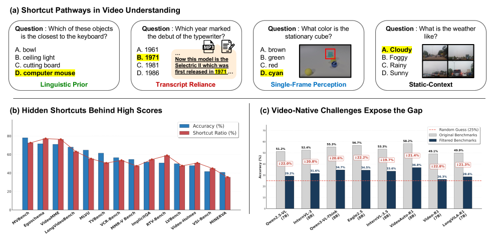
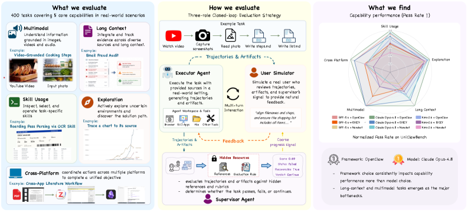
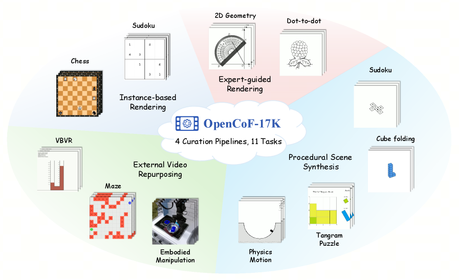
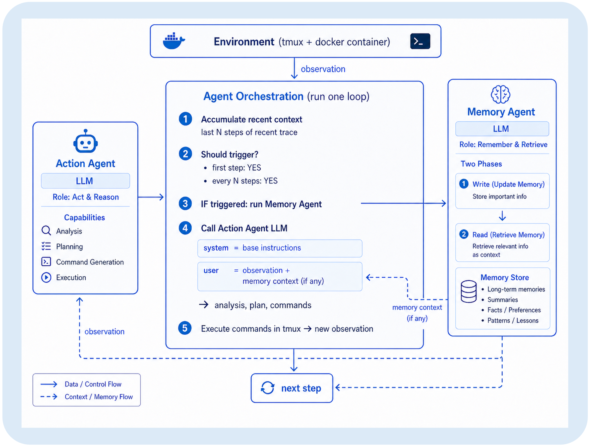
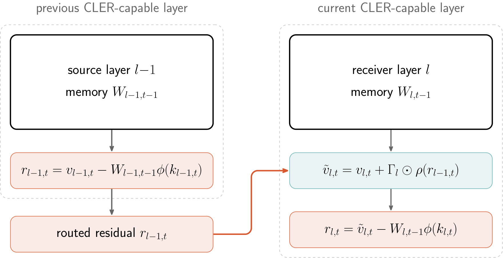
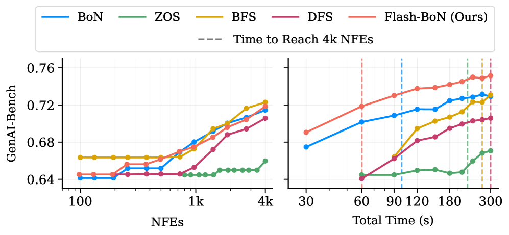

# Daily AI papers — 2026-07-11

*Curated from HF Daily Papers. 14 of 23 papers kept after relevance filter.*

## Papers at a glance

| # | Title | Topics | Org |
| --- | --- | --- | --- |
| 1 | [Vidu S1: A Real-Time Interactive Video Generation Model](#1-vidu-s1) | `diffusion`, `video`, `efficient-inference` | Tsinghua / Vidu |
| 2 | [Rethinking Evaluation of Video Understanding (Video-Oasis)](#2-video-oasis) | `eval`, `multimodal`, `video` | Sejong / NAVER Cloud |
| 3 | [Ideas Have Genomes: Benchmarking Scientific Lineage Reasoning](#3-ideagene-bench) | `eval`, `reasoning`, `LLM` | Shanghai Jiao Tong |
| 4 | [UniClawBench: A Universal Benchmark for Proactive Agents](#4-uniclawbench) | `eval`, `agents`, `multimodal` | HKU MMLab / Meituan |
| 5 | [Jet-Long: Efficient Long-Context Extension with Dynamic Bifocal RoPE](#5-jet-long) | `LLM`, `long-context`, `RoPE` | NVIDIA |
| 6 | [CineMobile: On-Device Image-to-Video Diffusion](#6-cinemobile) | `diffusion`, `quantization`, `efficient-inference` | Nankai / SJTU / Transsion |
| 7 | [OpenCoF: Learning to Reason Through Video Generation](#7-opencof) | `reasoning`, `diffusion`, `video` | ByteDance Seed / CUHK |
| 8 | [Remember When It Matters: Proactive Memory Agent](#8-proactive-memory-agent) | `agents`, `RL`, `SFT` | Meta AI |
| 9 | [Linear Attention Architectures: Mechanisms, Trade-offs, and Cross-Layer Routing](#9-linear-attention-architectures) | `architectures`, `efficient-inference`, `long-context` | ETH Zurich |
| 10 | [UP: Unbounded Positive Asymmetric Optimization](#10-up) | `RL`, `reasoning`, `LLM` | ByteDance Seed |
| 11 | [Flash-BoN: Instant Drafts for Inference-Time Scaling in Diffusion Models](#11-flash-bon) | `diffusion`, `efficient-inference`, `RL` | UMD / Hugging Face |
| 12 | [aria: A Quantized Native Runtime for On-Device Semantic Audio Generation](#12-aria) | `quantization`, `multimodal`, `audio` | Univ. of Padova |
| 13 | [CausalDS: Benchmarking Causal Reasoning in Data-Science Agents](#13-causalds) | `eval`, `agents`, `reasoning` | U Michigan |
| 14 | [Can Dialects Be Steered Like Languages? Sparse Neurons and Distributed Directions in Arabic LLMs](#14-arabic-dialect-steering) | `interp`, `steering`, `LLM` | MBZUAI / QCRI |

---

## 1. Vidu S1

**Authors:** Jintao Zhang, Kai Jiang, Jintao Chen, Xu Wang, Yang Luo, … Fangcheng Fu, Zhijie Deng, Fan Bao, Jianfei Chen, Jun Zhu — *Tsinghua / Vidu team*
**Links:** [arXiv:2607.03118](https://arxiv.org/abs/2607.03118) · [HF](https://huggingface.co/papers/2607.03118) · [AlphaXiv](https://www.alphaxiv.org/abs/2607.03118)
**Topics:** `diffusion`, `video`, `efficient-inference`

### TL;DR

A real-time interactive video generation model that supports voice-controlled digital-character animation with infinite-length output at 540p / up to 42 FPS on consumer GPUs. Built on top of two components — **TurboDiffusion** (the AR-distilled diffusion backbone) and **TurboServe** (the serving stack) — Vidu S1 turns a bidirectional video diffusion model into a streamable, mid-clip steerable generator that never drifts, blurs, or loses identity.

### Key idea

Turn "generate a whole clip end-to-end" into a *streaming* problem: distill an AR few-step video diffusion student from a bidirectional teacher, then wrap it in an inference stack (TurboServe) that keeps latent state resident, handles voice-triggered mid-generation edits, and pipelines diffusion steps to sustain interactive frame rates. Voice becomes just another conditioning stream that can be injected at any timestep.

### Main finding

**540p at up to 42 FPS on regular consumer GPUs**, infinite-length streaming with no visible drift or identity loss, and best-in-class scores across the paper's real-time video quality metrics. Users can drive personas (real photos, anime, pets) with arbitrary voice tones. A live demo is published at vidu.com/vidu-stream.

### Why it matters

Real-time, controllable video is the plausible next "ChatGPT moment" for creative tools. Vidu S1 is the first widely-demoed system where a *frontier-quality* video generator runs interactively on consumer hardware — the same class of jump that Stable Diffusion made for images. Positions AR distillation + custom serving as the deployment path for real-time video, following the pattern minWM sketched a month earlier.

### Knowledge graph integration

**Builds on / relates to existing pages:**
- [../post-training/cot-reward-model.md](../post-training/cot-reward-model.md) — on-policy student rollouts with a frozen teacher (DMD-style) generalize the same distillation pattern.
- [../daily-papers/2026-05-29.md](../daily-papers/2026-05-29.md) — direct successor line to minWM (2605.30263): AR video distillation + serving.

**Suggested new pages:**
- `case-studies/vidu-s1.md` *(case study)* — end-to-end recipe (TurboDiffusion + TurboServe + voice control).
- `pre-training/ar-video-distillation.md` *(depth)* — bidirectional-to-AR few-step distillation for video diffusion.
- `inference/streaming-diffusion.md` *(depth)* — resident-latent serving pattern for interactive diffusion.

---

## 2. Video-Oasis

**Authors:** Sungjune Park, Jaeyun Lee, Inwoong Lee, Taeoh Kim, Dongyoon Wee, Minho Shim, Yukyung Choi — *Sejong University / NAVER Cloud*
**Links:** [arXiv:2603.29616](https://arxiv.org/abs/2603.29616) · [HF](https://huggingface.co/papers/2603.29616) · [AlphaXiv](https://www.alphaxiv.org/abs/2603.29616)
**Topics:** `eval`, `multimodal`, `video`

### TL;DR

Instead of proposing yet another video benchmark, Video-Oasis is a *diagnostic suite that audits existing ones*. It quantifies how much of a benchmark can be solved without video (blind-language priors, single-frame shortcuts, world knowledge), then re-scores video LLMs on the residual video-native subset. The audit finds that **55% of existing samples are solvable without visual input or temporal context**.

### Key idea

Decompose each benchmark example along three orthogonal axes — is it solvable with (a) language only, (b) a single frame, (c) shuffled frames — and treat solvability under any of those as a shortcut. What remains is the *video-native* subset. Report model scores separately on the shortcut vs residual splits so that shortcut inflation is visible.

### Main finding

On mainstream video LLM benchmarks, **55% of samples are shortcut-solvable**. After filtering, SOTA models perform only marginally above random on the residual. Head-to-head model rankings often reshuffle when scored on the video-native subset only.

### Why it matters

Video-LLM leaderboards have quietly been LM leaderboards with a video sticker. Video-Oasis gives the community a cheap, reusable audit that separates real video competence from prior-driven guessing — a prerequisite for any credible "world model" claim. Similar in spirit to YoCausal (2605.30346) but targets *understanding* benchmarks rather than causal video generation.

### Knowledge graph integration

**Builds on / relates to existing pages:**
- [../evaluation/README.md](../evaluation/README.md) — adds an audit-of-benchmarks slot the graph doesn't yet cover.
- [../data/decontamination.md](../data/decontamination.md) — sibling concept: contamination for training data vs shortcut leakage inside evals.

**Suggested new pages:**
- `evaluation/video-oasis.md` *(depth)* — the shortcut-audit framework and the three axes.
- `evaluation/_benchmark-auditing.md` *(taxonomy)* — auditing benchmarks for shortcuts / contamination / trivial-solve (Video-Oasis, YoCausal, LaRA-adjacent).

---

## 3. IdeaGene-Bench

**Authors:** Yifan Zhou, Qihao Yang, Yan Li, Donggang Li, … Zhihang Zhong, Xue Yang — *Shanghai Jiao Tong University + collaborators*
**Links:** [arXiv:2607.08758](https://arxiv.org/abs/2607.08758) · [HF](https://huggingface.co/papers/2607.08758) · [AlphaXiv](https://www.alphaxiv.org/abs/2607.08758)
**Topics:** `eval`, `reasoning`, `LLM`

### TL;DR

Frames scientific ideation as *lineage reasoning*: every paper is a "genome" of typed, evidence-grounded idea objects, and inheritance between papers is captured by a **GenomeDiff** describing which objects were inherited, mutated, lost, imported, or newly inserted. IG-Bench operationalizes this with 1,961 golden lineage traces, 1,085 curated Idea Genomes, and 920 pairwise GenomeDiffs across 10 scientific domains, plus an IG-Exam (reasoning) and IG-Arena (generation) split.

### Key idea

Instead of asking "did the model produce a new idea?", ask "given a starting paper, does the model correctly reconstruct the inheritance structure of the follow-ups?" The evaluation is structured (typed objects, evidence anchors) so it can be scored automatically, and the operational vocabulary (inherit / mutate / lose / import / insert) lets the benchmark separate *shallow paraphrase* from *actual scientific novelty*.

### Main finding

14 LLMs evaluated on IG-Exam. **Best model reaches only 27.3% exact accuracy on lineage reasoning** — a wide gap suggesting current models still recombine surface tokens rather than inherit mechanisms. IG-Arena separately shows generation quality drops sharply when the model must ground its idea in a specific ancestor's mechanism.

### Why it matters

The "AI scientist" agenda has lots of demos and few grounded metrics. IdeaGene turns the vague "novelty" objective into a structured, evidence-grounded target that RL loops and agent scaffolding can actually optimize against. Also directly useful for training reward models that value derivation-over-declaration.

### Knowledge graph integration

**Builds on / relates to existing pages:**
- [../evaluation/README.md](../evaluation/README.md) — adds a reasoning-over-scientific-literature evaluation slot.
- [../post-training/_rewards.md](../post-training/_rewards.md) — GenomeDiff is a natural template for verifiable per-step rewards on ideation trajectories.

**Suggested new pages:**
- `evaluation/ideagene-bench.md` *(depth)* — the benchmark's typed objects and GenomeDiff scoring.
- `evaluation/_scientific-reasoning-eval.md` *(taxonomy)* — landscape of benchmarks probing scientific reasoning (IdeaGene, ScienceAgentBench, MLE-Bench…).

---

## 4. UniClawBench

**Authors:** Zhekai Chen, Chengqi Duan, Kaiyue Sun, Bohao Li, Yuqing Wang, Manyuan Zhang, Xihui Liu — *HKU MMLab / Meituan*
**Links:** [arXiv:2607.08768](https://arxiv.org/abs/2607.08768) · [HF](https://huggingface.co/papers/2607.08768) · [AlphaXiv](https://www.alphaxiv.org/abs/2607.08768)
**Topics:** `eval`, `agents`, `multimodal`

### TL;DR

A benchmark for *proactive* multi-turn agents on real-world tools. Existing benchmarks are sandboxed and single-turn; UniClawBench simulates realistic multi-turn user interactions with a three-agent evaluation loop: **executor** (the agent under test), a **hidden supervisor** (holds grading criteria and injects clarifying pressure), and a **user agent** (drives the conversation without leaking rubric).

### Key idea

Decouple "user simulation" from "grading". A hidden supervisor privately maintains the correctness rubric and can *steer* the user agent's followups without revealing the rubric to the executor. This yields a closed-loop evaluation that measures both task completion and the agent's ability to *proactively* ask, clarify, and recover — without evaluation leakage.

### Main finding

Frontier proactive agents are still fragile on real-world tools and multi-turn feedback: even top models drop double-digit percentage points relative to their sandbox-benchmark scores, and gains from RL / SFT recipes that shine on single-turn benches often do not transfer.

### Why it matters

Multi-turn, tool-driven agent eval has been dominated by benchmarks that either leak rubric or use scripted users. UniClawBench's three-agent architecture is a template other agent-eval efforts will likely adopt. The gap it exposes (sandbox → real world) is exactly where the field's compute is going.

### Knowledge graph integration

**Builds on / relates to existing pages:**
- [../agents/README.md](../agents/README.md) — anchors a proactive-agent evaluation subsection.
- [../evaluation/README.md](../evaluation/README.md) — a multi-turn interactive-agent benchmark class.

**Suggested new pages:**
- `evaluation/uniclawbench.md` *(depth)* — the three-agent evaluation architecture.
- `evaluation/_agent-benchmarks.md` *(taxonomy)* — landscape of agent evaluation (Terminal-Bench, τ²-Bench, WebArena, UniClawBench, …).

---

## 5. Jet-Long

**Authors:** Han Cai et al. — *NVIDIA*
**Links:** [arXiv:2607.07740](https://arxiv.org/abs/2607.07740) · [HF](https://huggingface.co/papers/2607.07740) · [AlphaXiv](https://www.alphaxiv.org/abs/2607.07740)
**Topics:** `LLM`, `long-context`, `RoPE`

### TL;DR

A tuning-free zero-shot long-context extension for RoPE models. Instead of committing to a single rescaling factor up front (aggressive → short-context degradation; conservative → long-context breakdown), Jet-Long uses two RoPE windows in parallel: a **local RoPE-faithful window** that matches the base model exactly, and a **long-range window** whose rescaling factor adapts **dynamically to the current sequence length**. The result: base-model fidelity at short inputs, clean extrapolation at long ones.

### Key idea

The "one scaling factor for everything" assumption of PI / NTK / YaRN is what forces the tradeoff. Jet-Long splits attention into two parallel RoPE-computed streams: one at the original base (unchanged short-context behavior), one with a length-adaptive rescaling factor (long-context extrapolation). A gating / bifocal fusion picks per-head or per-position. **Bifocal** = two focal lengths on RoPE frequencies, applied simultaneously.

### Main finding

Fully tuning-free zero-shot method. Recovers base-model behavior exactly on short inputs (unlike YaRN / PI, which distort short-context) and extrapolates cleanly at long ones — closing the "short vs long context" gap that has forced context-extension recipes to require fine-tuning.

### Why it matters

Zero-shot context extension is the dominant deployment path for open-weight checkpoints — every long-context agent stack, RAG server, or repo-level coder needs it. Jet-Long is the first *tuning-free* method that doesn't sacrifice short-context fidelity. Slots directly next to YaRN / NTK-aware / ABF in the RoPE-extension toolkit.

### Knowledge graph integration

**Builds on / relates to existing pages:**
- [../fundamentals/rope.md](../fundamentals/rope.md) — extends the RoPE post-hoc context-extension family (PI / NTK / YaRN / ABF) with a dynamic bifocal variant.
- [../fundamentals/_positional-encoding.md](../fundamentals/_positional-encoding.md) — a new rotary-extension row in the variants table.
- [../fundamentals/dca.md](../fundamentals/dca.md) — DCA also splits attention into short/long windows; Jet-Long is the RoPE-side analogue at frequency granularity.

**Suggested new pages:**
- `fundamentals/jet-long.md` *(depth)* — dynamic bifocal RoPE for tuning-free context extension.
- `fundamentals/_rope-extension.md` *(taxonomy)* — PI / NTK-aware / YaRN / ABF / LongRoPE / Jet-Long side-by-side.

---

## 6. CineMobile

**Authors:** Zelai Deng, Xu Wang, Xizhong Xiao, Zhijie Deng — *Nankai / Shanghai Jiao Tong / Transsion*
**Links:** [arXiv:2607.03803](https://arxiv.org/abs/2607.03803) · [HF](https://huggingface.co/papers/2607.03803) · [AlphaXiv](https://www.alphaxiv.org/abs/2607.03803)
**Topics:** `diffusion`, `quantization`, `efficient-inference`

### TL;DR

On-device image-to-video pipeline targeting cinematic camera-motion effects (bullet time, dolly zoom, slow motion). Chains three compression tricks — **distillation-guided pruning**, **diffusion distillation + RL**, and **hybrid post-training quantization** — to squeeze a Diffusion Transformer into a mobile-friendly footprint with **40× speedup** and quality that tracks the teacher.

### Key idea

Instead of applying a single compression method, stack three complementary ones and use the *interaction between stages* as a design lever: prune under distillation supervision (student learns which weights matter), then diffusion-distill few-step with an RL reward for motion fidelity, then quantize with a hybrid precision plan (sensitive ops in higher precision). The RL step is the interesting one — motion effect quality is used as a reward signal during few-step distillation.

### Main finding

**40× end-to-end speedup** with visual quality comparable to the multi-step teacher. Cinematic-motion effects (bullet time, dolly zoom, slow motion) reproduce faithfully on mobile devices.

### Why it matters

Consumer image-to-video is going to be an on-device product category by default. CineMobile is a clean template for the *stack* of compression techniques that gets DiTs onto phones — and RL-in-the-distillation-loop for a stylistic reward (rather than a correctness reward) is a pattern worth pulling out.

### Knowledge graph integration

**Builds on / relates to existing pages:**
- [../quantization/README.md](../quantization/README.md) — hybrid post-training quantization is a case study in the quantization cluster.
- [../inference/README.md](../inference/README.md) — mobile deployment stack sits in inference.
- [../post-training/cot-reward-model.md](../post-training/cot-reward-model.md) — RL-on-a-distilled-student is the same shape as on-policy reward distillation.

**Suggested new pages:**
- `inference/on-device-diffusion.md` *(depth)* — the pruning + distillation + quantization stack for mobile DiTs.
- `post-training/rl-in-distillation.md` *(depth)* — using RL as a signal during few-step diffusion distillation.

---

## 7. OpenCoF

**Authors:** ByteDance Seed / CUHK MMLab / CUHK IMIXR — *(individual names not surfaced on HF page)*
**Links:** [arXiv:2607.08763](https://arxiv.org/abs/2607.08763) · [HF](https://huggingface.co/papers/2607.08763) · [AlphaXiv](https://www.alphaxiv.org/abs/2607.08763)
**Topics:** `reasoning`, `diffusion`, `video`

### TL;DR

Introduces **Chain-of-Frame (CoF)** reasoning — reasoning that unfolds through temporally connected video frames rather than through text CoT. Releases **OpenCoF-17K** (a reasoning-video dataset spanning 11 task families) and **Wan-CoF**, a video model fine-tuned on it. Also studies explicit *visual* and *textual* reasoning tokens injected during denoising, and analyzes their contribution across model depth, denoising step, space, and time via attention.

### Key idea

Push the reasoning substrate from text into video. Instead of "the model writes a CoT that sometimes references images," Wan-CoF is trained to *depict* the intermediate reasoning steps as frames. Two orthogonal levers are studied: (a) *dataset* — 11-task-family reasoning-video corpus for supervised fine-tuning, and (b) *representation* — explicit visual + textual reasoning tokens whose attention geometry reveals where in the depth/timestep grid each modality contributes.

### Main finding

Wan-CoF achieves considerable gains over the Wan2.2-I2V-A14B baseline across four video-reasoning benchmarks. Reasoning tokens contribute unevenly: visual tokens dominate low-level spatial reasoning at early denoising steps, textual tokens dominate high-level semantic reasoning across depth. Open-sourced dataset, model, and code.

### Why it matters

The "reasoning happens in text" assumption is not obvious for tasks with a strong spatial/temporal structure (planning, physics). CoF is one of the first serious attempts to demonstrate reasoning that lives inside frames — the video analogue of what Chain-of-Thought did for text. Sets up the training substrate the community was missing.

### Knowledge graph integration

**Builds on / relates to existing pages:**
- [../post-training/reasoning/long-cot-rl.md](../post-training/reasoning/long-cot-rl.md) — extends the CoT-in-language paradigm to a frame-sequence substrate.
- [../post-training/reasoning/README.md](../post-training/reasoning/README.md) — anchors a new axis (visual reasoning) in the reasoning cluster.
- [../multimodal/README.md](../multimodal/README.md) — video reasoning belongs at the multimodal / reasoning intersection.

**Suggested new pages:**
- `post-training/reasoning/chain-of-frame.md` *(depth)* — the CoF paradigm and how Wan-CoF is trained.
- `post-training/reasoning/visual-reasoning-tokens.md` *(depth)* — decoupled visual vs textual reasoning tokens inside denoising.

---

## 8. Proactive Memory Agent

**Authors:** Lizhu Zhang, Yuhang Zhou, Mingyi Wang, Bo Peng, Serena Li, Xiangjun Fan, Zhuokai Zhao — *Meta AI*
**Links:** [arXiv:2607.08716](https://arxiv.org/abs/2607.08716) · [HF](https://huggingface.co/papers/2607.08716) · [AlphaXiv](https://www.alphaxiv.org/abs/2607.08716)
**Topics:** `agents`, `RL`, `SFT`

### TL;DR

Long-horizon agents suffer from **behavioral state decay**: decision-relevant facts scatter across the trajectory and stop influencing action. This paper runs a *separate memory agent* alongside an unmodified action agent — the memory agent maintains a structured memory bank from the recent trajectory and *decides* whether to inject a reminder or stay silent. Plug-and-play with frontier action agents; trains an open-weight memory policy via SFT + GRPO on a task called **SETA**.

### Key idea

Reframe memory from *passive retrieval* into a **learned intervention policy**. A dedicated agent watches the trajectory, chooses when to fire a memory-grounded reminder, and does so with a policy trained explicitly for that decision. The separation lets the action agent be swapped freely, and the reminder policy is optimized independently — an important architectural inversion from "one big agent with tool-use for memory."

### Main finding

Improves pass@1 for both weaker and stronger action agents: **+8.3 pp on Terminal-Bench 2.0** and **+6.8 pp on τ²-Bench**. Ablations show selective intervention beats passive bank exposure, always-on injection, advisor-only guidance, and general retrieval. Open-weight Qwen3.5-27B memory policy trained with SFT + GRPO transfers partially from SETA to Terminal-Bench.

### Why it matters

Agent context windows are big, but agents still forget — because *presence* of information in context does not imply *use*. A trained memory-intervention policy is a clean structural fix, and the SFT→GRPO recipe is directly transferable. Also a nice concrete instance of "specialist agents beat monolithic ones for long-horizon tasks."

### Knowledge graph integration

**Builds on / relates to existing pages:**
- [../agents/README.md](../agents/README.md) — sits squarely in the agents cluster as a memory-intervention pattern.
- [../post-training/grpo.md](../post-training/grpo.md) — memory policy trained via SFT + GRPO.
- [../post-training/reasoning/README.md](../post-training/reasoning/README.md) — long-horizon reasoning is the parent problem.

**Suggested new pages:**
- `agents/proactive-memory-agent.md` *(depth)* — separate-agent memory-intervention pattern.
- `agents/_agent-memory.md` *(taxonomy)* — retrieval / summarization / scratchpad / intervention-policy variants of agent memory.

---

## 9. Linear Attention Architectures

**Authors:** Tommaso Cerruti, Tim Rieder, George Rowlands, Lingfeng Jin, Imanol Schlag — *ETH Zurich / ETH AI Center*
**Links:** [arXiv:2607.07953](https://arxiv.org/abs/2607.07953) · [HF](https://huggingface.co/papers/2607.07953) · [AlphaXiv](https://www.alphaxiv.org/abs/2607.07953)
**Topics:** `architectures`, `efficient-inference`, `long-context`

### TL;DR

Comparative study of softmax attention against four recurrent linear-attention architectures: **DeltaNet**, **Gated DeltaNet**, **Kimi Delta Attention**, and **Gated DeltaNet-2**. Expresses all four in a unified recurrent-memory notation, runs 350M / 15B-token training sweeps, and introduces **Cross-Layer Value Routing (CLVR)** — a lightweight mechanism for sharing information across depth while keeping linear-time complexity.

### Key idea

Every recurrent linear attention variant reads and writes a *finite-state memory* per token. Writing them in the same notation surfaces which knobs matter (state update rule, gating shape, key-value binding). CLVR sits on top: instead of each layer maintaining an isolated recurrent state, some information is routed across layers — recovering a slice of what full attention gives you for free, at linear cost.

### Main finding

At 350M / 15B tokens: gated linear-attention variants close much of the softmax gap with hybrid stacks winning overall. **CLVR** further improves quality with minimal wall-clock overhead. Sequence-length timing shows the recurrent variants scale linearly as expected; hybrid stacks combining softmax and linear layers dominate on end-task quality per FLOP.

### Why it matters

The best "linear attention actually competitive" evidence to date on a controlled testbed. CLVR is a small but generally-useful pattern: cross-layer information flow at linear cost. Sets a clean baseline for future SSM / linear-attention work — and the unified notation is what the graph needs to anchor a taxonomy of linear-attention variants.

### Knowledge graph integration

**Builds on / relates to existing pages:**
- [../fundamentals/attention.md](../fundamentals/attention.md) — the softmax baseline these variants approximate.
- [../architectures/README.md](../architectures/README.md) — new architectural family to seat alongside MoE / MLA.

**Suggested new pages:**
- `architectures/_linear-attention.md` *(taxonomy)* — DeltaNet / Gated DeltaNet / Kimi Delta / Gated DeltaNet-2 / softmax hybrids side-by-side.
- `architectures/deltanet.md` *(depth)* — base DeltaNet write-up.
- `architectures/cross-layer-value-routing.md` *(depth)* — CLVR mechanism.

---

## 10. UP

**Authors:** Chongyu Fan, Pengfei Liu, Jingjia Huang, Sijia Liu, Yi Lin — *ByteDance Seed*
**Links:** [arXiv:2607.06987](https://arxiv.org/abs/2607.06987) · [HF](https://huggingface.co/papers/2607.06987) · [AlphaXiv](https://www.alphaxiv.org/abs/2607.06987)
**Topics:** `RL`, `reasoning`, `LLM`

### TL;DR

RL for LLMs faces an *exploration-stability dilemma*: pure importance sampling (IS) collapses training, but standard clipping (PPO / GRPO / DAPO / GSPO) strangles exploration by prematurely truncating updates for **correct but low-confidence** reasoning paths. **Unbounded Positive Asymmetric Optimization (UP)** anchors the policy to its current state via a stop-gradient and lets *positive* advantages flow through **unclipped**, while keeping the standard clip on *negative* advantages to preserve safety.

### Key idea

Formalizes **Probability Capacity (Cap)** — how much update budget the clip allows — and shows that the symmetric clip in PPO-family objectives spends most of its budget suppressing rare-but-correct trajectories. UP breaks the symmetry: positive-advantage tokens get unclipped, stop-gradient-anchored updates (unbounded exploration); negative-advantage tokens keep the normal clip (stability). Plug-and-play — extends to token-level (GRPO, DAPO) and sequence-level (GSPO) frameworks.

### Main finding

Consistent gains across three RL algorithms (DAPO, GSPO, GRPO), three model architectures (dense, MoE, vision-language), and language + multimodal settings. Enhances exploration while preserving training stability, delivering superior reasoning accuracy across the sweep.

### Why it matters

Every serious reasoning-RL stack is a GRPO / DAPO / GSPO derivative; UP is a drop-in objective that rebalances the exploration-vs-stability tradeoff without adding new hyperparameters. Also useful conceptually — the *asymmetric* treatment of positive and negative advantages is a cleaner statement of a design principle that has been implicit in a number of ad hoc tricks (positive-only PPO, asymmetric clipping schemes).

### Knowledge graph integration

**Builds on / relates to existing pages:**
- [../post-training/grpo.md](../post-training/grpo.md) — UP is a plug-in objective change compatible with GRPO's group-mean advantages.
- [../post-training/ppo.md](../post-training/ppo.md) — PPO is the ratio-clipped baseline UP asymmetrizes.
- [../post-training/_rl.md](../post-training/_rl.md) — RL taxonomy entry that now needs an exploration-stability subsection.
- [../post-training/rlvr.md](../post-training/rlvr.md) — verifiable-reward RL is the target regime.

**Suggested new pages:**
- `post-training/up.md` *(depth)* — Unbounded Positive Asymmetric Optimization objective and Probability Capacity.
- `post-training/_policy-objectives.md` *(taxonomy)* — PPO / GRPO / DAPO / GSPO / UP variants of the clipped-ratio family.

---

## 11. Flash-BoN

**Authors:** Reza Shirkavand, Sayak Paul, Yuxin Wen, Heng Huang, Yizheng Chen, Tom Goldstein, Gowthami Somepalli — *University of Maryland / Hugging Face*
**Links:** [arXiv:2607.04461](https://arxiv.org/abs/2607.04461) · [HF](https://huggingface.co/papers/2607.04461) · [AlphaXiv](https://www.alphaxiv.org/abs/2607.04461)
**Topics:** `diffusion`, `efficient-inference`, `RL`

### TL;DR

Best-of-N sampling done efficiently for diffusion: generate a large pool of **cheap draft candidates** via timestep truncation, layer skipping, and activation proxies; verify in a multi-stage cascade; only fully denoise the survivor. Under matched wall-clock budgets, Flash-BoN's simple BoN beats guided-search methods that invest compute in intermediate verification. Also plugs into RL post-training with 10× faster convergence than existing scaling schemes.

### Key idea

The right axis to trade off is **draft cost × pool size**, not "spend more compute in the middle of a search." If each draft is 10–20× cheaper than a full denoise, you can afford 100× more candidates; a cheap verifier picks a promising subset; only the survivor gets the expensive full denoise. Draft acceleration is stacked: timestep truncation (fewer steps), layer skipping (skip transformer blocks), and activation proxies (approximate later-stage output from earlier-stage features).

### Main finding

Across three benchmarks and model scales, Flash-BoN wins under realistic wall-clock budgets, with **+8% AUC gain at larger scales**. Composes with Reflection-Tuning; delivers **10× faster convergence in RL post-training**.

### Why it matters

Inference-time scaling for diffusion has been dominated by guided-search variants. Flash-BoN's argument is the older, cleaner one — BoN is the strong baseline once drafts are made cheap enough — and it happens to also accelerate RL loops that use rollouts as rewards. Practical for serving *and* for post-training pipelines.

### Knowledge graph integration

**Builds on / relates to existing pages:**
- [../post-training/rejection-sampling.md](../post-training/rejection-sampling.md) — BoN is the sampling side of the rejection-sampling family.
- [../inference/README.md](../inference/README.md) — diffusion-specific inference-time scaling technique.
- [../post-training/grpo.md](../post-training/grpo.md) — RL post-training loops that generate many rollouts benefit directly from the cheap-draft trick.

**Suggested new pages:**
- `inference/flash-bon.md` *(depth)* — draft cascade for diffusion BoN (timestep truncation + layer skipping + activation proxies).
- `inference/_inference-time-scaling.md` *(taxonomy)* — BoN vs guided search vs process-reward search at inference.

---

## 12. aria

**Authors:** Matteo Spanio, Antonio Rodà — *University of Padova*
**Links:** [arXiv:2607.08526](https://arxiv.org/abs/2607.08526) · [HF](https://huggingface.co/papers/2607.08526) · [AlphaXiv](https://www.alphaxiv.org/abs/2607.08526)
**Topics:** `quantization`, `multimodal`, `audio`

### TL;DR

A dependency-free native runtime (no PyTorch / no Python) that runs the complete text-to-music pipeline of **Stable Audio 3 (SA3)** on commodity GPUs, CPU-only machines, and a Raspberry Pi 5. Central contribution is a **quantization study** with in-place memory savings; also exposes **activation steering** as a first-class control surface because the runtime owns every internal tensor.

### Key idea

Two moves: (1) pick a framework-free deployment target and build the runtime around ownership of internal tensors — that ownership is what makes low-cost activation steering possible; (2) empirically pin down what quantization budget preserves quality on a generative audio model. **INT8** shows no measurable quality loss on any of three independent output measures (prompt adherence, audio quality, taste preservation) and is the fastest GPU mode; **INT4** takes a small bounded cost but fits the 1.2B-parameter model on 8 GB Raspberry Pi 5.

### Main finding

INT8 = no measurable quality loss on prompt adherence, quality, or taste; INT4 = small bounded cost but 1.2B model runs on **8 GB Raspberry Pi 5**. aria matches or exceeds the official implementation on generation speed and starts about **7× faster**. Case study shows activation steering can inject bounded stylistic control (sonic seasoning).

### Why it matters

Semantic audio on the edge is a new deployment target; aria is the cleanest published statement that INT8 is quality-neutral for generative audio and INT4 is deployable on Pi-class hardware. Also methodologically nice: because the runtime owns the tensors, *steering becomes a runtime feature* rather than a research artifact — a template for on-device generative-model runtimes.

### Knowledge graph integration

**Builds on / relates to existing pages:**
- [../quantization/README.md](../quantization/README.md) — quantization for generative audio is a new leaf.
- [../quantization/_number-formats.md](../quantization/_number-formats.md) — INT8/INT4 tradeoffs for generative audio.
- [../inference/README.md](../inference/README.md) — a dependency-free on-device runtime pattern.

**Suggested new pages:**
- `quantization/generative-audio-quantization.md` *(depth)* — the INT8-neutral / INT4-bounded findings for SA3.
- `inference/framework-free-runtime.md` *(depth)* — dependency-free native runtimes as a deployment pattern.

---

## 13. CausalDS

**Authors:** Andrej Leban, Yuekai Sun — *University of Michigan (Statistics)*
**Links:** [arXiv:2607.08093](https://arxiv.org/abs/2607.08093) · [HF](https://huggingface.co/papers/2607.08093) · [AlphaXiv](https://www.alphaxiv.org/abs/2607.08093)
**Topics:** `eval`, `agents`, `reasoning`

### TL;DR

Existing benchmarks split symbolic causal reasoning from realistic data-science work; CausalDS joins them. Each instance is a sampled structural causal model + synthetic observational data + a domain-grounded narrative. Tasks span **Pearl's three rungs** (association, intervention, counterfactual) alongside typical ML prediction, and jointly evaluate symbolic causal reasoning, data-science execution, uncertainty quantification, *epistemic abstention*, and tool use.

### Key idea

Wrap each SCM as a *data-science engagement*: the agent gets a narrative context, must load and analyze the data using tools, and must answer both a predictive question and a causal question. Grading covers not only correctness but the agent's ability to abstain when identification fails — a dimension existing agent benchmarks entirely skip.

### Main finding

Frontier LLMs show a stark separation between prediction and causal-identification competence. Epistemic abstention is fragile — models hallucinate answers when they should refuse. Tool-use quality does not transfer cleanly from generic agent benchmarks to causal analysis.

### Why it matters

Data-science agents are one of the most-shipped agent categories, and their most common failure mode is silent statistical error. CausalDS is the first benchmark to jointly evaluate causal reasoning, tool use, and abstention — and the abstention dimension is a genuinely new axis worth putting into every agent benchmark that touches uncertain decisions.

### Knowledge graph integration

**Builds on / relates to existing pages:**
- [../evaluation/README.md](../evaluation/README.md) — a causal-reasoning-in-agents evaluation slot.
- [../agents/README.md](../agents/README.md) — data-science agents as an evaluation target.

**Suggested new pages:**
- `evaluation/causalds.md` *(depth)* — the SCM-narrative benchmark and abstention scoring.
- `evaluation/_agent-benchmarks.md` *(taxonomy)* — sibling to UniClawBench's suggested taxonomy (agent-eval landscape).

---

## 14. Arabic Dialect Steering

**Authors:** Kareem Elozeiri, Mervat Abassy, Omar Kallas, Fahim Dalvi, Preslav Nakov, Kentaro Inui, Nadir Durrani — *MBZUAI / QCRI / Tohoku / RIKEN*
**Links:** [arXiv:2607.03936](https://arxiv.org/abs/2607.03936) · [HF](https://huggingface.co/papers/2607.03936) · [AlphaXiv](https://www.alphaxiv.org/abs/2607.03936)
**Topics:** `interp`, `steering`, `LLM`

### TL;DR

Two complementary inference-time interventions in Arabic LLMs. First, a **neuron-level probe** identifies sparse populations that encode dialect-specific features; amplifying or suppressing these neurons steers generation toward target dialects. Second, a **vector-steering** approach extracts dialect-specific activation directions and injects them at inference. Together they act as *interpretability probes* and *control mechanisms* — no fine-tuning required.

### Key idea

Dialect is encoded *both* sparsely (single-neuron features) and distributedly (activation directions), and neither view alone captures the mechanism. The paper argues these are two ends of a spectrum: some dialect features live in few neurons (surface tokens like MSA vs. dialectal lexical choices), while others are distributed (syntactic and stylistic patterns). Doing both interventions gives a coherent, interpretability-grounded framework for dialect control that also serves as a mechanistic probe.

### Main finding

Sparse neurons cleanly localize a subset of dialect features; amplification steers generation toward target dialects. For entangled/distributed features, vector-steering achieves stronger effects. The combined approach produces dialectally-accurate generation *without* fine-tuning on dialect data — a low-resource win.

### Why it matters

Dialect-scarce languages (Arabic, but also Berber, Swiss German, many African languages) are a chronic pain point for LLMs. This paper shows that the model already *has* the representations — they just need to be surfaced. The neuron-vs-vector duality is a broadly useful diagnostic for any "does the model know X, and where?" question in interpretability.

### Knowledge graph integration

**Builds on / relates to existing pages:**
- [../interpretability/README.md](../interpretability/README.md) — activation steering + neuron probing is squarely interpretability.
- [../safety/low-resource-language-jailbreak.md](../safety/low-resource-language-jailbreak.md) — same low-resource-language axis, different sign (safety failure vs. controlled steering).

**Suggested new pages:**
- `interpretability/dialect-steering.md` *(depth)* — sparse-neuron + vector-steering combined for dialect control.
- `interpretability/_activation-steering.md` *(taxonomy)* — sparse-neuron / vector-steering / flow-matching-based (UniSteer) approaches.

---

## Notes

- Borderline inclusions: **Vidu S1**, **CineMobile**, and **OpenCoF** are diffusion / video-heavy — kept because they introduce *transferable* techniques (AR video distillation, RL-in-distillation stack, Chain-of-Frame paradigm), not because of raw pixel quality claims.
- Skipped papers (sample): drawer-opening compositional action recognition (2601.16211), event-video reconstruction (2607.08770), panoramic image gen (2607.08765), drug-discovery LM (2607.08404), autoregressive human-motion diffusion (2607.08741), sparse-truncated quantum circuit simulator (2607.07816), multi-target video segmentation (2607.08688), MRI super-resolution (2607.06238), stance detection (2607.04690) — out of scope per relevance filter.
- Hero figures live in `assets/2026-07-11/`. **Missing hero figures for #1 (Vidu S1), #3 (IdeaGene-Bench), and #10 (UP)** — the HF CDN blocked the direct image URL for Vidu S1, and the other two had no `og:image` or discoverable arXiv-HTML figure. All other 11 papers have hero figures.
- This digest is informational. No existing concept files, `READING-LIST.md`, or `PAPERS.md` were modified to produce it.
