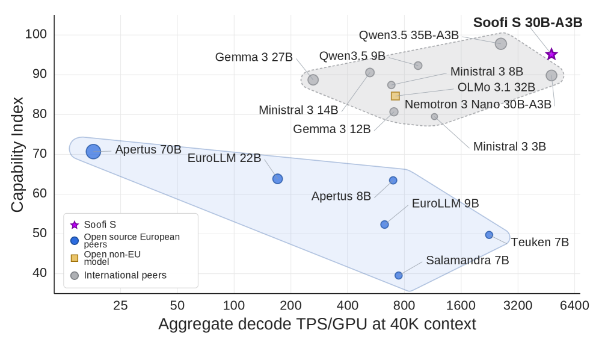
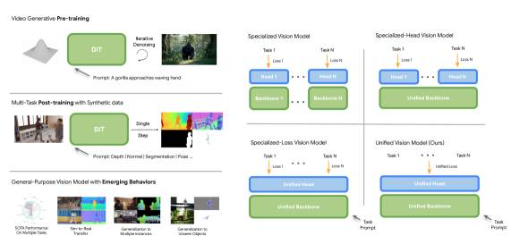
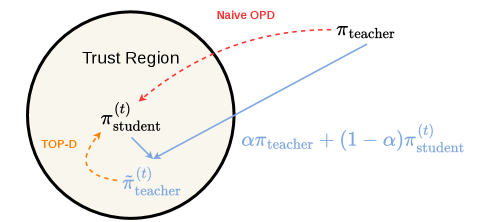
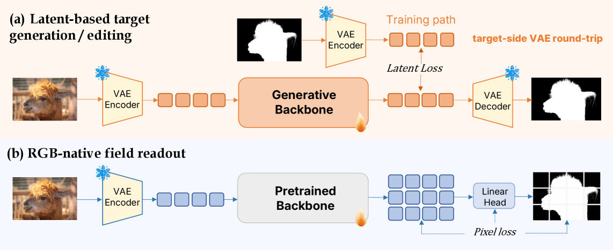
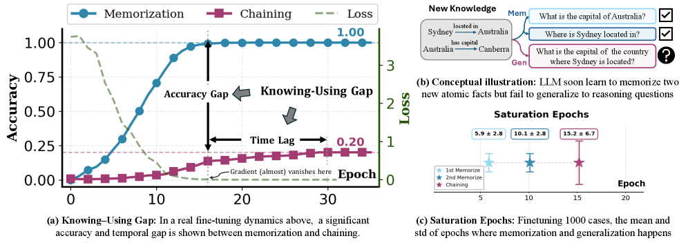
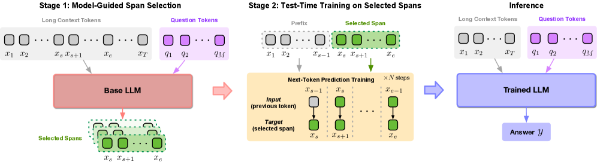
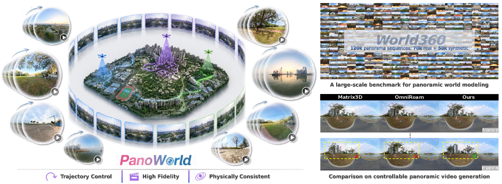
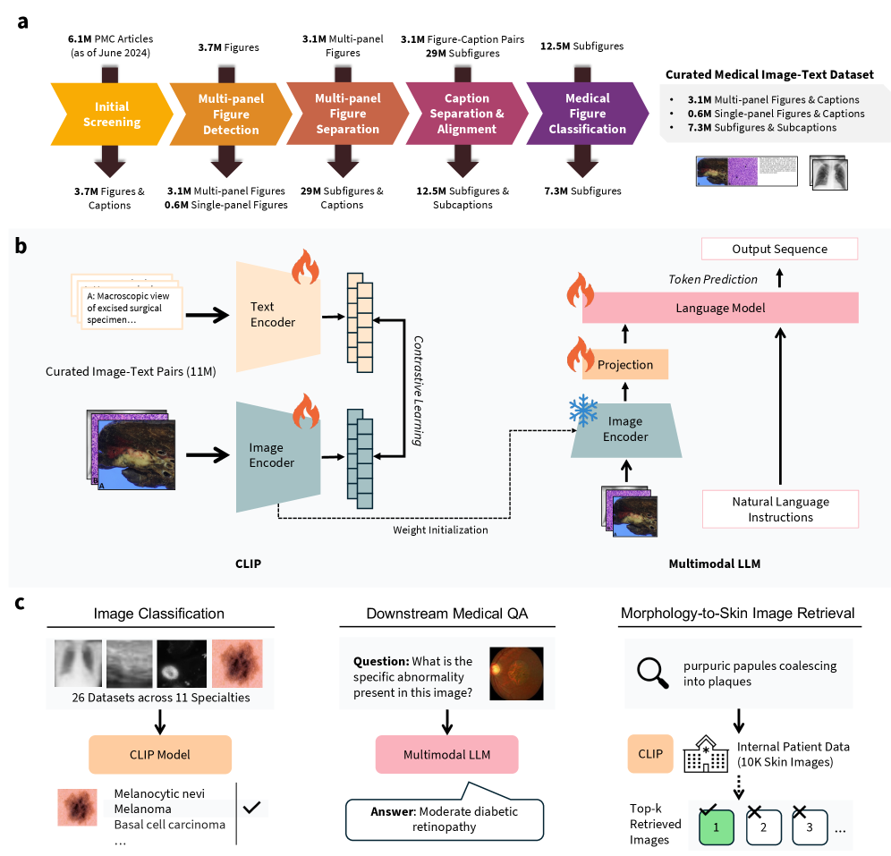

# Daily AI papers — 2026-07-13

*Curated from HF Daily Papers. 12 of 14 papers kept after relevance filter.*

## Papers at a glance

| # | Title | Topics | Org |
| --- | --- | --- | --- |
| 1 | [Soofi S 30B-A3B: A Sovereign, Open-Source Foundation Model for German and English](#1-soofi-s) | `LLM`, `MoE`, `Mamba`, `pretraining` | KI Bundesverband / DFKI / Fraunhofer consortium |
| 2 | [Long-Horizon-Terminal-Bench](#2-long-horizon-terminal-bench) | `agents`, `eval` | Tencent HY LLM Frontier + 7 universities |
| 3 | [GenCeption: Video Generation Models are General-Purpose Vision Learners](#3-genception) | `multimodal`, `diffusion`, `pretraining` | Google DeepMind |
| 4 | [Scalable Visual Pretraining for Language Intelligence](#4-visual-pretraining) | `LLM`, `multimodal`, `pretraining` | Shanghai AI Lab (Kai Chen et al.) |
| 5 | [KronQ: LLM Quantization via Kronecker-Factored Hessian](#5-kronq) | `quantization`, `LLM` | USC |
| 6 | [Trust Region Policy Distillation (TOP-D)](#6-top-d) | `RL`, `distillation`, `reasoning` | Microsoft Research Asia (interns) |
| 7 | [ReChannel: From RGB Generation to Dense Field Readout](#7-rechannel) | `multimodal`, `diffusion` | UCSD / HKUST |
| 8 | [Self-Patching: Why Memorized Knowledge Fails to Generalize in LLM Finetuning](#8-self-patching) | `interp`, `fine-tuning` | HKUST(GZ) / HKUST |
| 9 | [Self-Guided Test-Time Training for Long-Context LLMs](#9-s-ttt) | `LLM`, `long-context`, `fine-tuning` | Meta AI / U. Virginia |
| 10 | [PanoWorld: Real-World Panoramic Generation](#10-panoworld) | `diffusion`, `video`, `world-model` | Insta360 / CAS / Tsinghua |
| 11 | [MedPMC: Scaling High-Fidelity Medical Multimodal Data](#11-medpmc) | `data`, `multimodal` | Korea U. / WashU / Yale / Microsoft |
| 12 | [Flow-ERD: Agent-Type Aware Flow Matching with Entropy-Regularized Distillation](#12-flow-erd) | `flow-matching`, `distillation` | NAVER LABS |

Skipped: 2607.09020 (phone segmentation, classical speech), 2607.06374 (application: Ancient Greek pottery museum).

---

## 1. Soofi S 30B-A3B

**Authors:** Ali, Fromm, Lübbering (tech leads) with a 30+ contributor consortium — *KI Bundesverband, DFKI, Fraunhofer IAIS/IIS, TU Darmstadt, Universität Würzburg, hessian.AI, Merantix Momentum, ellamind, Lamarr, L3S; built on the German Industrial AI Cloud (Deutsche Telekom).*
**Links:** [arXiv:2607.09424](https://arxiv.org/abs/2607.09424) · [HF](https://huggingface.co/papers/2607.09424) · [AlphaXiv](https://www.alphaxiv.org/abs/2607.09424)
**Topics:** `LLM`, `MoE`, `Mamba`, `pretraining`, `case-study`

### TL;DR

Soofi S is a 30B-total / 3B-active MoE **hybrid Mamba–Transformer** foundation model, pretrained on ~27T tokens with deliberately up-weighted German, released end-to-end open (weights, per-source data accounting, code, intermediate checkpoints). It's positioned as a sovereign European alternative — trained fully on German infrastructure and covering both German and English at the frontier of the "fully open" tier.

### Key idea

Combine three levers to hit a dense-14–27B quality band with much cheaper serving: **(a)** an MoE with only 3B activated per token, **(b)** a hybrid backbone interleaving Mamba (SSM) and Transformer blocks so KV/state grows near-constantly with context, and **(c)** a data mixture that up-weights German without cratering English/code, then documented at *per-source* granularity for reproducibility.

### Main finding

Matches dense 14–27B baselines on aggregate English + German evals; **best code aggregates in both languages among 17 open base models**; beats every European sovereign baseline in the comparison at any active parameter count; among fully open models, higher English and German scores than **Olmo 3 32B and Apertus 70B**. Serving throughput on long context / high concurrency benefits from the near-constant inference cache of the hybrid design.

### Why it matters

Two firsts wrapped in one release: (i) a fully open MoE + hybrid Mamba–Transformer at 30B scale with released *intermediate* checkpoints and per-source data accounting — the reproducibility bar Olmo pushed, applied to a hybrid MoE stack; (ii) a serious sovereign European frontier release, trained on non-US infrastructure with permissive licensing.

### Knowledge graph integration

**Builds on / relates to existing pages:**
- [../architectures/_moe.md](../architectures/_moe.md) — MoE variant with only 3B active parameters; extends the taxonomy toward hybrid backbones.
- [../architectures/deepseek-moe.md](../architectures/deepseek-moe.md) — fine-grained expert design lineage.
- [../pre-training/mid-training.md](../pre-training/mid-training.md) — multi-stage pretraining recipe with mixture reweighting.
- [../data/_data-curation.md](../data/_data-curation.md) — per-source data accounting is the "release-grade" endpoint of the data-curation stack.
- [../case-studies/olmo-2.md](../case-studies/olmo-2.md) — the reference for "fully open" model releases; Soofi S extends that bar to MoE + hybrid SSM.

**Suggested new pages:**
- `case-studies/soofi-s.md` *(case study)* — end-to-end architecture + data + training breakdown.
- `architectures/hybrid-mamba-transformer.md` *(depth)* — the interleaved SSM+attention design pattern used here (also in Zamba, Jamba, Nemotron-H).
- `architectures/mamba.md` *(depth)* — the SSM block itself is not yet in the graph.

---

## 2. Long-Horizon-Terminal-Bench

**Authors:** 8-institution consortium — *Tencent HY LLM Frontier; University of Maryland College Park; University of Georgia; University of Minnesota Twin Cities; Indiana University; Lehigh University; National University of Singapore; The Hong Kong Polytechnic University.*
**Links:** [arXiv:2607.08964](https://arxiv.org/abs/2607.08964) · [HF](https://huggingface.co/papers/2607.08964) · [AlphaXiv](https://www.alphaxiv.org/abs/2607.08964)
**Topics:** `agents`, `eval`

### TL;DR

A benchmark that stresses agent capabilities on realistic multi-hour terminal workflows — think end-to-end system administration, multi-step data engineering, or debugging sessions rather than isolated CLI puzzles. Ships with a **dense reward-based grading protocol** that assigns partial credit at intermediate checkpoints, so the score signal reflects the trajectory rather than only the final state.

### Key idea

Combine two things existing agent evals rarely do: (1) **long horizons** — tasks measured in the hundreds of tool calls / hours of wall time — and (2) **dense checkpoint-level rewards** built into the environment, so a run that gets 60% of the way through a repro can be distinguished from one that fails immediately. Grading is scriptable and container-scoped, not LLM-judged.

### Main finding

Frontier agents that saturate short-horizon terminal benchmarks fall off sharply here; success rate compresses toward the tail of the horizon distribution, and the dense-reward view reveals characteristic failure modes (drift, tool-loop, checkpoint regressions) invisible to binary graders.

### Why it matters

Existing agent benchmarks (SWE-bench, Terminal-Bench) are approaching saturation and are dominated by short-horizon tasks. A dense-reward, long-horizon evaluation is the natural next step and directly stresses the capabilities RL-post-trained agent models are supposed to unlock.

### Knowledge graph integration

**Builds on / relates to existing pages:**
- [../evaluation/README.md](../evaluation/README.md) — extends the evaluation folder with a long-horizon agent benchmark.
- [../post-training/rlvr.md](../post-training/rlvr.md) — dense checkpoint rewards are RLVR-shaped, and this benchmark supplies exactly the verifier signal RLVR needs at scale.

**Suggested new pages:**
- `evaluation/long-horizon-terminal-bench.md` *(depth)* — the benchmark itself, tasks, grading protocol.
- `agents/_agent-benchmarks.md` *(taxonomy)* — currently empty folder; a taxonomy tying together SWE-bench, Terminal-Bench, OS-World, LHTB.

---

## 3. GenCeption: Video Generation Models are General-Purpose Vision Learners

**Authors:** Chuhan Zhang, Rishabh Kabra, Jasper Uijlings, Steven Waslander, Andrew Zisserman, Joao Carreira, Kaiming He, Misha Andriluka, Eduard Gabriel Bazavan, Andrei Zanfir, Cristian Sminchisescu — *Google DeepMind.*
**Links:** [arXiv:2607.09024](https://arxiv.org/abs/2607.09024) · [HF](https://huggingface.co/papers/2607.09024) · [AlphaXiv](https://www.alphaxiv.org/abs/2607.09024)
**Topics:** `multimodal`, `diffusion`, `pretraining`

### TL;DR

Reuse a pretrained text-to-video *diffusion* backbone as a general-purpose vision encoder: attach a lightweight feed-forward head, condition on task text, and get depth, surface normals, camera pose, segmentation, and 3D keypoints out of the same weights. Argues that video generation is the vision analogue of next-token prediction — the scalable pretraining objective that yields a *generalist* backbone.

### Key idea

**GenCeption** treats text-to-video generative pretraining as the pretext task and shows the resulting diffusion backbone already encodes the spatiotemporal + language priors needed for structured perception. A frozen or lightly adapted backbone is combined with a small feed-forward head; task selection is done via text conditioning, not per-task fine-tuning.

### Main finding

Matches or beats specialized SoTA (DepthAnything3, SAM3, VGGT-Ω, Sapiens, Lotus-2) on depth, normals, camera pose, expression-referring segmentation, and 3D keypoints. **Uses 7×–500× less training data** than task-specialist baselines. Outperforms V-JEPA and Video MAE as pretraining paradigms under matched settings. A model trained only on synthetic human videos generalizes to real footage and out-of-distribution categories (animals, robots).

### Why it matters

If this replicates outside DeepMind, video-generative pretraining becomes the default recipe for building vision foundation models — the "video-first" analogue of the LLM story. It also collapses depth/segmentation/pose into one weight set, removing the specialist-model zoo that today's perception stack depends on.

### Knowledge graph integration

**Builds on / relates to existing pages:**
- [../multimodal/README.md](../multimodal/README.md) — currently thin; this paper is a canonical entry point for video-generative pretraining as a vision-encoder recipe.
- [../pre-training/README.md](../pre-training/README.md) — a new pretraining paradigm class (generative video → downstream perception).

**Suggested new pages:**
- `multimodal/genception.md` *(depth)* — the specific recipe (frozen video-diffusion backbone + text-conditioned head).
- `pre-training/video-generative-pretraining.md` *(depth)* — the pretraining objective viewed as a general-purpose vision pretext task.

---

## 4. Scalable Visual Pretraining for Language Intelligence

**Authors:** Yiming Zhang, Zhonghan Zhao, Wenwei Zhang, Haiteng Zhao, Tianyang Lin, Yunhua Zhou, Demin Song, Kuikun Liu, Haochen Ye, Haian Huang, Yuzhe Gu, Haijun Lv, Qipeng Guo, Bin Liu, Gaoang Wang, Kai Chen — *Shanghai AI Lab et al. (affiliations not listed on HF).*
**Links:** [arXiv:2607.09657](https://arxiv.org/abs/2607.09657) · [HF](https://huggingface.co/papers/2607.09657) · [AlphaXiv](https://www.alphaxiv.org/abs/2607.09657)
**Topics:** `LLM`, `multimodal`, `pretraining`

### TL;DR

Challenge the "convert everything to plain text" default of LLM pretraining: many documents (papers, math, tables, layouts) lose real information at text extraction. This paper pretrains a foundation model directly on **rendered page images** — the model reads visually — and shows this scales better than text-only pretraining on the *same underlying corpora*.

### Key idea

Unsupervised **visual pretraining**: instead of running OCR / HTML-to-Markdown / text extraction pipelines, feed the model the rendered page as pixels and let it learn the layout, figures, and typeset equations natively. The paper studies several visual pretraining paradigms systematically across backbones and benchmarks.

### Main finding

On the same underlying documents, visual pretraining consistently outperforms text-only pretraining across multiple backbones and downstream benchmarks — presented as scalable evidence that the text-only default is leaving information on the table.

### Why it matters

If this holds up, one of the largest silent losses in LLM pretraining pipelines (the text-extraction stage) becomes unnecessary. It also blurs the line between VLMs and LLMs from the *pretraining* side rather than only the post-training side.

### Knowledge graph integration

**Builds on / relates to existing pages:**
- [../pre-training/README.md](../pre-training/README.md) — a new class of pretraining objective for language intelligence.
- [../data/quality-filtering.md](../data/quality-filtering.md) — obviates part of the text-extraction / cleaning stack.
- [../multimodal/README.md](../multimodal/README.md) — argues language intelligence itself is best learned multimodally.

**Suggested new pages:**
- `pre-training/visual-pretraining.md` *(depth)* — the pretext task and its scaling behavior for language models.

---

## 5. KronQ: LLM Quantization via Kronecker-Factored Hessian

**Authors:** Donghyun Lee, Yuhang Li, Ruokai Yin, Priyadarshini Panda — *University of Southern California.*
**Links:** [arXiv:2607.07964](https://arxiv.org/abs/2607.07964) · [HF](https://huggingface.co/papers/2607.07964) · [AlphaXiv](https://www.alphaxiv.org/abs/2607.07964)
**Topics:** `quantization`, `LLM`

### TL;DR

A post-training quantization framework that fixes a blind spot in GPTQ-style methods: they assume all output channels contribute equally to the layer-wise reconstruction loss. KronQ folds the **gradient covariance** into the objective via a **Kronecker-factored Hessian** approximation, then uses that to (a) rotate the output dimension for incoherence processing and (b) drive layer-level mixed-precision allocation.

### Key idea

Under the Kronecker Hessian approximation $H \approx A \otimes G$ (activation × gradient covariance), the quantization loss depends on *both* factors. Two consequences:
1. **Bidirectional incoherence** — the existing input-side random rotation gets a symmetric output-side rotation via the gradient covariance, reducing weight magnitude variance along *both* axes.
2. **Sensitivity metric** for **mixed-precision** allocation: use the joint (activation × gradient) Hessian trace to rank layers by quantization sensitivity.

### Main finding

On LLaMA-3-70B **2-bit weight-only**, GPTQ and GPTAQ diverge (perplexity > 2000 on WikiText-2) while **KronQ hits 7.93 perplexity**. Extreme low-bit quantization is where the gradient-covariance signal pays off.

### Why it matters

Sub-4-bit weight quantization is the current frontier for cheap serving; existing methods fall off a cliff at 2 bits. Any technique that keeps 70B-class perplexity finite at 2-bit is directly deployable and opens a new pareto point for memory-constrained inference.

### Knowledge graph integration

**Builds on / relates to existing pages:**
- [../quantization/fp8.md](../quantization/fp8.md) — sibling depth file; KronQ sits in the *weight-only integer* branch of the same taxonomy.
- [../quantization/_number-formats.md](../quantization/_number-formats.md) — extends the number-format landscape with a Hessian-aware quantizer, not a new format.

**Suggested new pages:**
- `quantization/gptq.md` *(depth)* — the predecessor is not yet in the graph and is a prereq for KronQ.
- `quantization/kronq.md` *(depth)* — the gradient-covariance + bidirectional-rotation recipe.
- `quantization/_ptq.md` *(taxonomy)* — the post-training quantization family (GPTQ, AWQ, SmoothQuant, GPTAQ, KronQ) needs a taxonomy page.

---

## 6. Trust Region Policy Distillation (TOP-D)

**Authors:** Zhengpeng Xie, Li Lyna Zhang, Zeke Xie, Mao Yang — *(work done during internship; likely Microsoft Research Asia based on the co-authors).*
**Links:** [arXiv:2607.04751](https://arxiv.org/abs/2607.04751) · [HF](https://huggingface.co/papers/2607.04751) · [AlphaXiv](https://www.alphaxiv.org/abs/2607.04751)
**Topics:** `RL`, `distillation`, `reasoning`

### TL;DR

On-policy distillation (OPD) — where a student is trained on its own rollouts scored by a teacher — is notoriously unstable and high-variance. TOP-D swaps the fixed teacher for a **dynamically-constructed proximal teacher**, giving a trust-region-shaped update that keeps gradient variance controlled. Theoretical monotonic-improvement bound, empirical stability wins on math reasoning, **zero extra compute**.

### Key idea

At each step, rather than distilling from a static teacher policy, construct an *intermediate* proximal teacher — close enough to the student that the OPD gradient stays well-behaved. Frame the whole thing as a trust-region update: student stays inside a KL ball around the proximal teacher, and the teacher itself is scheduled to move toward the true target. The authors prove global convergence and a monotonic improvement bound.

### Main finding

On mathematical reasoning benchmarks: dramatically better training stability, sample efficiency, and final accuracy than baseline OPD, with **zero additional compute overhead** — the proximal teacher is derived from the existing teacher, no extra forward passes.

### Why it matters

OPD is the natural "distill an RL-trained teacher into a smaller student" recipe, but its variance has kept it niche. If TOP-D genuinely stabilizes OPD without added cost, it becomes the default for reasoning-model distillation and closes a gap between "SFT-only distillation" (cheap but capped) and "full RL from scratch" (expensive).

### Knowledge graph integration

**Builds on / relates to existing pages:**
- [../post-training/ppo.md](../post-training/ppo.md) — the trust-region framing is directly PPO-lineage.
- [../post-training/grpo.md](../post-training/grpo.md) — sibling in the "cheap variance-controlled policy update" family.
- [../post-training/_rl.md](../post-training/_rl.md) — RL taxonomy will need an on-policy-distillation branch.
- [../post-training/reasoning/long-cot-rl.md](../post-training/reasoning/long-cot-rl.md) — a natural downstream: distill a long-CoT RL teacher into a smaller reasoner.

**Suggested new pages:**
- `post-training/on-policy-distillation.md` *(depth)* — the OPD paradigm itself is not yet documented in the graph.
- `post-training/top-d.md` *(depth)* — the TOP-D algorithm and its proximal-teacher construction.

---

## 7. ReChannel: From RGB Generation to Dense Field Readout

**Authors:** Zanyi Wang, Xin Lin, Haodong Li, Dengyang Jiang, Yijiang Li, Pengtao Xie — *UCSD / HKUST.*
**Links:** [arXiv:2607.06553](https://arxiv.org/abs/2607.06553) · [HF](https://huggingface.co/papers/2607.06553) · [AlphaXiv](https://www.alphaxiv.org/abs/2607.06553)
**Topics:** `multimodal`, `diffusion`

*Borderline: kept because it's a generative-pretraining-transfer paper on a DiT backbone, and the trick generalizes beyond dense prediction.*

### TL;DR

Existing "diffusion model as dense-prediction backbone" work casts depth/normals/masks as RGB targets and pushes them through the VAE decoder. ReChannel argues that's silly — dense prediction wants task-native fields on the same image plane. Keep the DiT's input side, drop the VAE decoder, and put a token-local linear head that emits `p×p×K_task` per token directly.

### Key idea

A pretrained DiT already indexes each token to a fixed output patch via its patch→token→patch lattice. Instead of decoding to an RGB target, replace the target-side with a **shared token-local linear head** (~33K params, no spatial mixing) that emits task-native channels per patch. Frozen DiT + task LoRA + tiny head; VAE encoder retained for input distribution matching.

### Main finding

New SoTA on trimap-free matting, KITTI depth, and referring segmentation; competitive on normals, saliency, and pose. In a matched **4B setting**: more accurate *and* **2.48× faster** than the edit-plus-latent-decode baseline. Six tasks, a dozen+ benchmarks.

### Why it matters

Argues the "dense prediction via generation" community has been paying for the wrong output interface. If the token-local-head recipe generalizes, generative-pretraining transfer becomes both simpler and cheaper for structured perception — and the "output-side gap" between generative and perceptual reuse of DiT priors gets a lot narrower.

### Knowledge graph integration

**Builds on / relates to existing pages:**
- [../multimodal/README.md](../multimodal/README.md) — extends the multimodal-backbone reuse story.

**Suggested new pages:**
- `multimodal/rechannel.md` *(depth)* — the token-local head recipe and its ablations vs edit-and-decode.

---

## 8. Self-Patching: Why Memorized Knowledge Fails to Generalize in LLM Finetuning

**Authors:** Lu Dai, Ziyang Rao, Yili Wang, Hanqing Wang, Hao Liu, Hui Xiong — *HKUST(GZ) / HKUST.*
**Links:** [arXiv:2607.08393](https://arxiv.org/abs/2607.08393) · [HF](https://huggingface.co/papers/2607.08393) · [AlphaXiv](https://www.alphaxiv.org/abs/2607.08393)
**Topics:** `interp`, `fine-tuning`

### TL;DR

When you fine-tune an LLM on new facts, it memorizes them within a few steps but can't *use* them for downstream reasoning — a real accuracy and temporal gap the authors name the **Knowing–Using Gap**. Introduces **self-patching**, a mechanistic probe that finds layers where re-injecting an internal activation flips a failed generalization into a success, and derives a diagnostic heuristic that closes 58–75% of the oracle headroom.

### Key idea

Instantiate the "knowledge-circuit misalignment" hypothesis mechanistically: memorized representations exist in the network but are stored in layers that don't route into the reasoning-heavy computation path. **Self-patching** iterates over locations, patches the representation forward, and identifies the (layer, position) pairs whose intervention rescues generalization. Aggregating those pairs into a heuristic gives a training-time / inference-time fix.

### Main finding

The heuristic recovers **58–75% of the oracle-patch headroom** on generalization-failure cases, cross-domain. Consistent evidence that the Knowing–Using Gap is a routing problem, not a capacity problem.

### Why it matters

Knowledge-injection fine-tuning is a widespread practical need (RAG-adjacent, continual learning, enterprise-context adaptation) and it consistently underperforms. Mechanistic evidence that the failure is *routing* — plus a cheap fix — reframes the problem for practitioners and gives interp research a concrete lever with immediate practical value.

### Knowledge graph integration

**Builds on / relates to existing pages:**
- [../interpretability/README.md](../interpretability/README.md) — currently thin; a canonical activation-patching / circuits-flavored entry.
- [../post-training/fine-tuning/README.md](../post-training/fine-tuning/README.md) — mechanistic diagnosis of a common failure mode of knowledge-injection SFT.

**Suggested new pages:**
- `interpretability/activation-patching.md` *(depth)* — the underlying interp technique this paper builds on; not yet in the graph.
- `interpretability/self-patching.md` *(depth)* — the paper's specific variant and heuristic.
- `post-training/fine-tuning/knowing-using-gap.md` *(depth)* — the failure mode named and characterized.

---

## 9. Self-Guided Test-Time Training for Long-Context LLMs

**Authors:** Zhe Xu, Xiaohan Wei, Yunchen Pu, Fei Tian, Chonglin Sun, Kaushik Rangadurai, Hua Zhi, Frank Shyu, Sandeep Pandey, Luke Simon, Yu Meng, Xi Liu — *Meta AI and University of Virginia.*
**Links:** [arXiv:2607.09415](https://arxiv.org/abs/2607.09415) · [HF](https://huggingface.co/papers/2607.09415) · [AlphaXiv](https://www.alphaxiv.org/abs/2607.09415)
**Topics:** `LLM`, `long-context`, `fine-tuning`

### TL;DR

Test-time training (TTT) on long contexts is highly sensitive to *which spans* you adapt on. Random spans hurt, oracle spans help a lot. **S-TTT** has the model select its own evidence spans (self-guided) before applying LM-loss TTT — a cheap fix that gets close to oracle without the label.

### Key idea

Two-step: (1) prompt the model to identify the evidence spans relevant to the query, (2) apply standard LM-loss TTT only on those selected spans. Everything else — the bulk of the long context — is discarded from the adaptation loss to avoid noise-contaminated updates.

### Main finding

Up to **15% relative accuracy improvement** on LongBench-v2 and LongBench-Pro across two backbones (Qwen3-4B-Thinking-2507 and Llama-3.1-8B-Instruct). Direct TTT on random spans *degrades* performance — evidence-span selection is what makes TTT viable for long-context.

### Why it matters

Long-context accuracy degrades badly with input length even when the context "fits" in the window. S-TTT is a cheap, model-agnostic recipe that treats long-context utilization as an *instance-specific* adaptation problem, not a pretraining problem — a viable middle path between prompt-engineering and full retraining.

### Knowledge graph integration

**Builds on / relates to existing pages:**
- [../post-training/fine-tuning/README.md](../post-training/fine-tuning/README.md) — TTT is a fine-tuning-adjacent technique; the folder currently has no TTT coverage.
- [../fundamentals/dca.md](../fundamentals/dca.md) — relates to the broader long-context / positional-encoding stack.

**Suggested new pages:**
- `post-training/fine-tuning/test-time-training.md` *(depth)* — the general TTT paradigm needs an entry.
- `post-training/fine-tuning/s-ttt.md` *(depth)* — the self-guided evidence-selection variant.

---

## 10. PanoWorld: Real-World Panoramic Generation

**Authors:** Haoyuan Li, Dizhe Zhang, Yuemei Zhou, Xiangkai Zhang, Haoran Feng, Xiaofan Lin, Wenjie Jiang, Bo Du, Ming-Hsuan Yang, Lu Qi — *Insta360 Research / CAS / Tsinghua / Wuhan University / UC Merced.*
**Links:** [arXiv:2607.09661](https://arxiv.org/abs/2607.09661) · [HF](https://huggingface.co/papers/2607.09661) · [AlphaXiv](https://www.alphaxiv.org/abs/2607.09661)
**Topics:** `diffusion`, `video`, `world-model`

*Borderline: kept because it's a generative world-model on panoramic video, not pure vision.*

### TL;DR

A panoramic world model that exploits the rotation-equivariance of omnidirectional imagery: any camera trajectory can be reduced to translations via fixed headings, which simplifies both current-action modeling and long-range memory. Two components — Dense Panoramic Ray-Conditioning (DPRC) and Geometry-aware Memory Augmentation (GMA) — plus a new panoramic dataset (World360) collected via panoramic drones + AirSim360.

### Key idea

Fix the panoramic camera's heading so that rotation vanishes as a nuisance dimension and camera trajectories become translations. DPRC then conditions the diffusion generator on dense ray directions; GMA supplies long-range memory via a geometry-aware retrieval mechanism.

### Main finding

Outperforms alternative panoramic world-model methods "by a large margin" on the new World360 benchmark. Novel eval measures physical consistency under large-scale spatial variation and diverse illumination — a harder regime than prior panoramic datasets.

### Why it matters

World models are the current frontier for embodied/interactive generative AI, and panoramic capture directly maps to robotics / VR / autonomous navigation use cases. Exploiting rotational structure of omnidirectional inputs is a clean geometric prior that isn't available to standard camera-view models.

### Knowledge graph integration

**Builds on / relates to existing pages:**
- [../multimodal/README.md](../multimodal/README.md) — extends the video/world-model coverage in the multimodal folder.

**Suggested new pages:**
- `multimodal/panoworld.md` *(depth)* — DPRC + GMA and the panoramic reduction trick.

---

## 11. MedPMC: Scaling High-Fidelity Medical Multimodal Data

**Authors:** Dain Kim, Pan Xiao, Serina S. Applebaum, ... Hoifung Poon, Hua Xu, Jaewoo Kang, Qingyu Chen — *Korea University / Washington University in St. Louis / Yale / U. Queensland / UT Health Houston / U. Washington / Microsoft Research.*
**Links:** [arXiv:2607.07673](https://arxiv.org/abs/2607.07673) · [HF](https://huggingface.co/papers/2607.07673) · [AlphaXiv](https://www.alphaxiv.org/abs/2607.07673)
**Topics:** `data`, `multimodal`

*Borderline: kept because it's a scalable multimodal-data pipeline for foundation-model pretraining, not a domain-specific application.*

### TL;DR

An automated, continuously-updating pipeline that turns 6.1M permissively-licensed PubMed Central articles into **11M medical image–text pairs**, with per-stage evals showing high-fidelity extraction (multi-panel figure detection F1=96.5, caption alignment ROUGE-L=85.3). A CLIP trained on the resulting corpus improves zero-shot AUC by 7.1 points across 26 benchmarks despite using **<half** the image–text pairs of the strongest architecture-matched baseline.

### Key idea

Treat scientific-literature data curation for multimodal pretraining as a full pipeline problem: initial screening → multi-panel figure detection → figure separation → caption separation and alignment → figure classification, each with a measured extraction-quality metric. The whole thing is reproducible, continuously updatable, and releases both the framework and the corpus.

### Main finding

**95.3%** of MedPMC images are medically relevant (vs 19.7% for prior PMC-derived datasets); trained CLIP model beats the strongest biomedical baseline by **7.1 zero-shot AUC** on average with fewer than half the pairs; as a VLM vision encoder, improves medical VQA by 1.9 and 16.9 points on two benchmarks; +11.7 Recall@5 on real Yale dermatology retrieval.

### Why it matters

The pipeline is medical, but the recipe generalizes: for any technical domain whose signal lives in figures + captions of scientific PDFs, stage-by-stage extraction with per-stage evals is a template for building high-quality multimodal corpora that can beat larger, noisier ones.

### Knowledge graph integration

**Builds on / relates to existing pages:**
- [../data/_data-curation.md](../data/_data-curation.md) — a domain-specialized instance of the curation-pipeline pattern.
- [../data/quality-filtering.md](../data/quality-filtering.md) — the per-stage F1/ROUGE evaluation approach is the multimodal analogue of text-side quality filtering.
- [../multimodal/README.md](../multimodal/README.md) — a source pipeline for vision-encoder pretraining data.

*(No new pages proposed — the paper's primary contribution is a domain-specific corpus + pipeline rather than a generalizable technique.)*

---

## 12. Flow-ERD: Agent-Type Aware Flow Matching with Entropy-Regularized Distillation

**Authors:** Seulbin Hwang, Kiyoung Om, Daejung Kim, Jinhan Lee — *NAVER LABS Corp.*
**Links:** [arXiv:2607.06957](https://arxiv.org/abs/2607.06957) · [HF](https://huggingface.co/papers/2607.06957) · [AlphaXiv](https://www.alphaxiv.org/abs/2607.06957)
**Topics:** `flow-matching`, `distillation`

*Borderline: kept because it introduces a general-purpose flow-matching + entropy-regularized distillation recipe on top of a domain-specific benchmark.*

### TL;DR

A multi-agent traffic simulator whose backbone (**Agent-Type Aware Flow Matching**) couples flow matching's multi-modal expressiveness with agent-type-specific kinematic execution. A second stage (**Entropy-Regularized Distillation**) fine-tunes the closed-loop rollout distribution with an entropy-regularized reverse-KL objective to prevent mode collapse while mitigating covariate shift.

### Key idea

Two general recipes stacked: (1) type-aware flow matching — the vector field is shared but per-agent-type kinematic constraints are executed at rollout time, preserving both diversity and physical consistency; (2) closed-loop entropy-regularized reverse-KL distillation as a substitute for teacher forcing, explicitly regularizing against high-density-mode collapse.

### Main finding

Ranks first on WOSAC test benchmark and dominates the realism–diversity Pareto front among reproducible baselines. Both components — AFM and ERD — matter in ablations.

### Why it matters

The **entropy-regularized reverse-KL distillation** trick is domain-agnostic: it's a principled fix for closed-loop covariate shift + mode collapse that applies to any generative sequential-decision setting (agents, world models, RL policy distillation). Worth watching for cross-pollination back into LLM post-training.

### Knowledge graph integration

**Builds on / relates to existing pages:**
- [../post-training/README.md](../post-training/README.md) — the entropy-regularized reverse-KL distillation objective is post-training-shaped.

*(No new pages proposed — the flow-matching + entropy-KL-distillation combination is worth watching but not yet a graph-worthy standalone concept until the recipe is shown to transfer.)*

---

## Notes

- Borderline inclusions are flagged in-section with an italic *Borderline: …* note.
- Hero figures live in `assets/2026-07-13/`. Figures for papers 4 (Visual Pretraining) and 5 (KronQ) were not available on arXiv HTML at digest time.
- This digest is informational. No existing concept files, `READING-LIST.md`, or `PAPERS.md` were modified to produce it.
