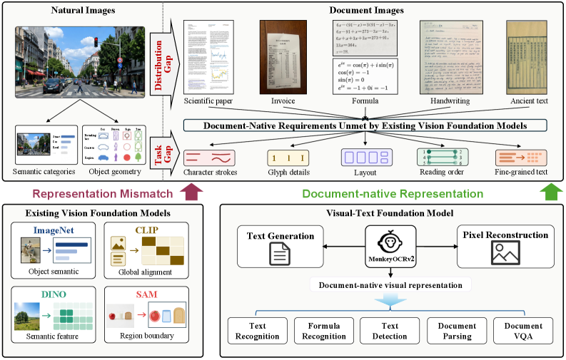
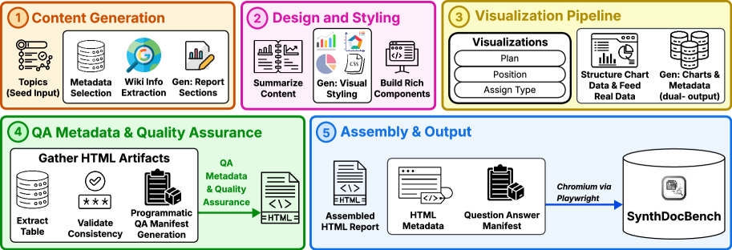
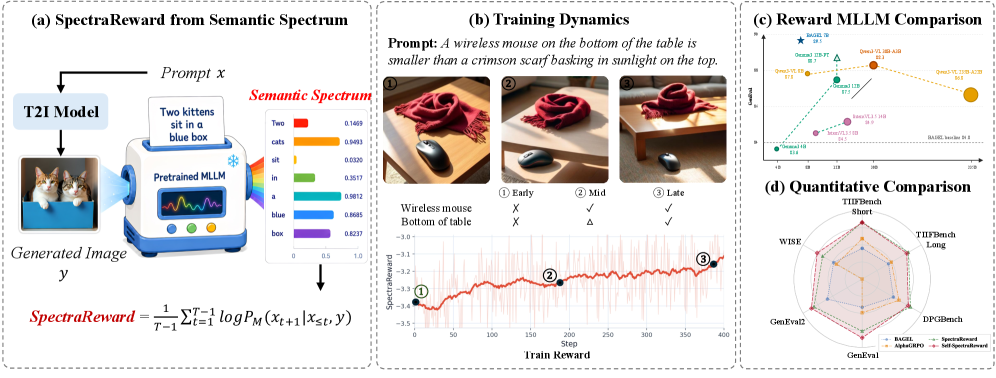
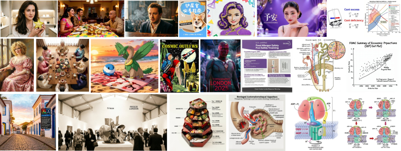
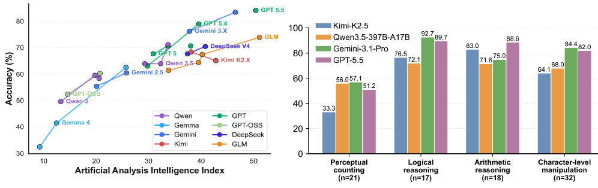
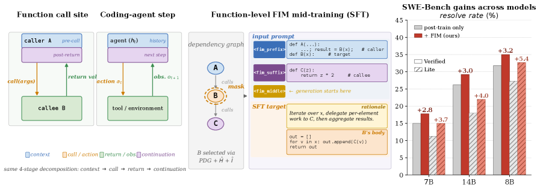
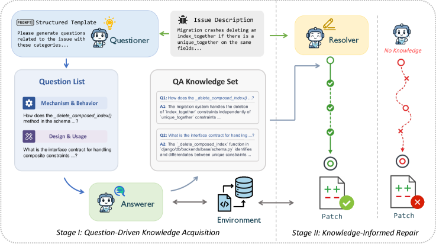
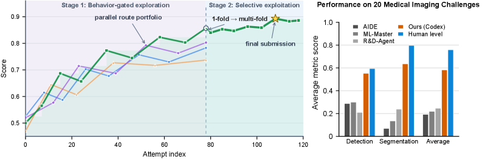
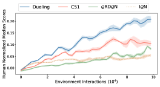
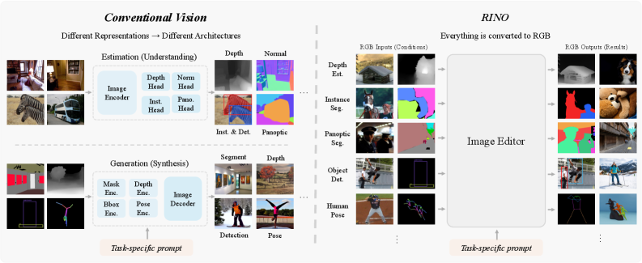

# Daily AI papers — 2026-07-15

*Curated from HF Daily Papers. 13 of 15 papers kept after relevance filter.*

## Papers at a glance

| # | Title | Topics | Org |
| --- | --- | --- | --- |
| 1 | [MonkeyOCRv2: A Visual-Text Foundation Model for Document AI](#1-monkeyocrv2-a-visual-text-foundation-model-for-document-ai) | `multimodal`, `pre-training`, `eval` | HUST |
| 2 | [SynthDocBench: Controlled Benchmark for Long-Context Visual Document Understanding](#2-synthdocbench-controlled-benchmark-for-long-context-visual-document-understanding) | `multimodal`, `eval` | (undisclosed) |
| 3 | [Read It Back: Pretrained MLLMs Are Zero-Shot Reward Models for Text-to-Image Generation](#3-read-it-back-pretrained-mllms-are-zero-shot-reward-models-for-text-to-image-generation) | `multimodal`, `RL`, `diffusion`, `reward` | HKU / ByteDance Seed |
| 4 | [Search Beyond What Can Be Taught: Evolving the Knowledge Boundary in Agentic Visual Generation](#4-search-beyond-what-can-be-taught-evolving-the-knowledge-boundary-in-agentic-visual-generation) | `agents`, `multimodal`, `diffusion` | HKUST / Qwen / Waterloo |
| 5 | [Blind-Spots-Bench: Evaluating Blind Spots in Multimodal Models](#5-blind-spots-bench-evaluating-blind-spots-in-multimodal-models) | `multimodal`, `eval` | EPFL |
| 6 | [Function-Aware Fill-in-the-Middle as Mid-Training for Coding Agent Foundation Models](#6-function-aware-fill-in-the-middle-as-mid-training-for-coding-agent-foundation-models) | `pre-training`, `agents`, `LLM` | Waterloo / NVIDIA |
| 7 | [Know Before Fix: QA-Driven Repository Knowledge Acquisition for Software Issue Resolution](#7-know-before-fix-qa-driven-repository-knowledge-acquisition-for-software-issue-resolution) | `agents`, `LLM` | SJTU |
| 8 | [Towards Autonomous and Auditable Medical Imaging Model Development](#8-towards-autonomous-and-auditable-medical-imaging-model-development) | `agents`, `LLM` | CUHK / Microsoft Research |
| 9 | [Principled Analysis of Deep Reinforcement Learning Evaluation and Design Paradigms](#9-principled-analysis-of-deep-reinforcement-learning-evaluation-and-design-paradigms) | `RL`, `eval` | (undisclosed) |
| 10 | [Navigating the Mirage: A Dual-Path Agentic Framework for Robust Misleading Chart Question Answering](#10-navigating-the-mirage-a-dual-path-agentic-framework-for-robust-misleading-chart-question-answering) | `agents`, `multimodal`, `RL` | HKUST |
| 11 | [Let RGB Be the Language of Vision](#11-let-rgb-be-the-language-of-vision) | `multimodal`, `diffusion` | JHU / UCSC / CMU |
| 12 | [Are LLMs Ready for Scientific Discovery? A Capability-Oriented Benchmark for AI Scientists](#12-are-llms-ready-for-scientific-discovery-a-capability-oriented-benchmark-for-ai-scientists) | `eval`, `agents` | HKUST |
| 13 | [What LLM Forecasters Know but Don't Say: Probing Internal Representations for Calibration and Faithfulness](#13-what-llm-forecasters-know-but-dont-say-probing-internal-representations-for-calibration-and-faithfulness) | `interp`, `safety`, `eval` | Eternis / Cornell |

---

## 1. MonkeyOCRv2: A Visual-Text Foundation Model for Document AI

**Authors:** Yuliang Liu, Zhang Li, Ziyang Zhang, Shuo Zhang, Qiang Liu, Jiajun Song, Zidun Guo, Xinhan Wang, Handong Zheng, Yang Liu, Dongliang Luo, Zhiyin Ma, Jiarui Zhang, Xiang Bai — *Huazhong University of Science and Technology*
**Links:** [arXiv:2607.11562](https://arxiv.org/abs/2607.11562) · [HF](https://huggingface.co/papers/2607.11562) · [AlphaXiv](https://www.alphaxiv.org/abs/2607.11562)
**Topics:** `multimodal`, `pre-training`, `eval`

### TL;DR

A vision encoder pretrained specifically on documents (not natural images) that beats generic CLIP/DINO/SAM backbones when plugged into a VLM. The encoder is trained on **MonkeyDoc v2**, a 113M-image, 17-language document corpus, with a dual objective: image→text generation (semantic alignment) plus pixel-level reconstruction (character-stroke fidelity).

### Key idea

Standard vision encoders pretrained on natural images throw away the fine strokes and layout that documents live and die on. MonkeyOCRv2 pretrains a document-native encoder with two heads: (1) autoregressive text generation from the image, which teaches high-level semantic alignment, and (2) pixel-level document reconstruction, which forces the features to preserve strokes and layout. The trained encoder can then be **frozen** and paired with a small LM head.

### Main finding

A 0.7B parser built on the frozen MonkeyOCRv2 encoder sets a new open-source SOTA on MDPBench (17-language digital+photographed docs), beating the prior 3B dots.mocr by **+2.8** absolute with an encoder **~11× smaller**. The same frozen encoder outperforms CLIP/DINO/SAM backbones across 8 document-understanding benchmarks under identical training.

### Why it matters

The current default in doc-AI stacks — take a general-purpose vision encoder, add adapters, hope it learns document-specific perception — leaves accuracy on the table. Domain-native visual pretraining is competitive as a foundation strategy for document intelligence in its own right, and small frozen encoders can outperform large tunable ones when the pretraining domain matches.

### Knowledge graph integration

**Builds on / relates to existing pages:**
- [multimodal/](../multimodal/) — vision encoders for VLMs, projection layers.

**Suggested new pages:**
- `multimodal/vision-encoder.md` *(depth)* — canonical vision-encoder role in VLMs
- `multimodal/document-vlm-pretraining.md` *(depth)* — dual generative + reconstruction pretraining for document encoders

---

## 2. SynthDocBench: Controlled Benchmark for Long-Context Visual Document Understanding

**Authors:** *(author list not exposed on the HF page)*
**Links:** [arXiv:2607.10400](https://arxiv.org/abs/2607.10400) · [HF](https://huggingface.co/papers/2607.10400) · [AlphaXiv](https://www.alphaxiv.org/abs/2607.10400)
**Topics:** `multimodal`, `eval`

### TL;DR

A fully synthetic benchmark for long, visually rich document understanding whose axes — document **length**, reasoning **depth**, **modality mix**, and **question type** — can be varied independently. That controlled factorization exposes VLM failure modes that real-world benchmarks conflate.

### Key idea

Real long-document benchmarks entangle many variables at once (how long the doc is, how deep the question, how much of the answer lives in text vs. figures). SynthDocBench builds documents from scratch with each axis as an independent knob, so you can isolate "did the model fail because the doc was long, or because the reasoning was deep?"

### Main finding

Frontier VLMs degrade unevenly along the four axes; the synthetic-control setup lets the paper measure per-axis sensitivity that opaque real-world scores hide.

### Why it matters

Document understanding is one of the highest-leverage VLM use cases. A controlled benchmark that separately probes length vs. depth vs. modality is the kind of measurement infrastructure that turns "our VLM is worse at long docs" into a diagnosable, fixable claim.

### Knowledge graph integration

**Builds on / relates to existing pages:**
- [evaluation/](../evaluation/) — benchmarks folder.
- [multimodal/](../multimodal/) — document/long-context VLM evaluation.

---

## 3. Read It Back: Pretrained MLLMs Are Zero-Shot Reward Models for Text-to-Image Generation

**Authors:** Runhui Huang, Qihui Zhang, Zhe Liu, Yu Gao, Jie Wu, Hengshuang Zhao — *University of Hong Kong / Peking University / ByteDance Seed*
**Links:** [arXiv:2607.11886](https://arxiv.org/abs/2607.11886) · [HF](https://huggingface.co/papers/2607.11886) · [AlphaXiv](https://www.alphaxiv.org/abs/2607.11886)
**Topics:** `multimodal`, `RL`, `diffusion`, `reward`

### TL;DR

**SpectraReward** turns any pretrained MLLM into a zero-shot reward model for text-to-image generation by scoring an image with the average log-likelihood of the original prompt reconstructed from it — a single teacher-forced forward pass, no preference labels, no RM fine-tuning.

### Key idea

Instead of asking the MLLM "is this a good image?" (bias-prone) or decomposing the prompt into yes/no verification questions (brittle), just **feed the image + prompt into the MLLM and read out the prompt's log-likelihood**. If the image "sees" the prompt, the prompt is easy to predict; if it doesn't, the log-likelihood collapses. This directly reuses the pretrained image-text alignment head with no training. For unified multimodal models, they extend this to **Self-SpectraReward**: the same model's understanding branch scores its own generation branch, closing the RL loop end-to-end without any external reward model.

### Main finding

Reported as a general-purpose plug-in reward for image-generation RL — works training-free, competitive with dedicated reward models, and enables closed-loop self-improvement on unified any-to-any architectures.

### Why it matters

Reward models for image generation are the bottleneck: labels are expensive, learned RMs overfit, and separate RMs must be re-trained per policy. Using the pretrained MLLM as its own judge — for free — makes RL post-training of image generators practical at frontier scale, and the "self-reward" framing hints at a general recipe for any unified multimodal model.

### Knowledge graph integration

**Builds on / relates to existing pages:**
- [post-training/_rewards.md](../post-training/_rewards.md) — new *training-free / generative-reuse* reward family alongside ORM/PRM/preference RM.
- [post-training/cot-reward-model.md](../post-training/cot-reward-model.md) — related generative-reward idea (CoT judgment vs. teacher-forced log-lik).
- [post-training/rlvr.md](../post-training/rlvr.md) — SpectraReward slots in where RLVR verifiers don't apply.

**Suggested new pages:**
- `post-training/spectra-reward.md` *(depth)* — teacher-forced log-likelihood as a training-free reward
- `multimodal/mllm-as-judge.md` *(depth)* — MLLMs as reward/judge models for image and video generation

---

## 4. Search Beyond What Can Be Taught: Evolving the Knowledge Boundary in Agentic Visual Generation

**Authors:** Haozhe Wang, Weijia Feng, Jinpeng Yu, Che Liu, Ping Nie, Fangzhen Lin, Jiaming Liu, Ruihua Huang, Jimmy Lin, Wenhu Chen, Cong Wei — *HKUST / Qwen Applications / Imperial / Waterloo*
**Links:** [arXiv:2607.05382](https://arxiv.org/abs/2607.05382) · [HF](https://huggingface.co/papers/2607.05382) · [AlphaXiv](https://www.alphaxiv.org/abs/2607.05382)
**Topics:** `agents`, `multimodal`, `diffusion`

### TL;DR

Text-to-image generators confidently produce images they know nothing about ("draw the 2026 flagship phone" → a plausible-looking hallucination). The paper introduces **SearchGen-Bench** (20,839 knowledge-intensive prompts) and a co-training framework that teaches a reasoner **when to search** and a generator when to trust its priors.

### Key idea

Split "world knowledge" into two: **stable knowledge** the generator internalizes at training time, and **contextual knowledge** that lives in an external index and must be fetched per prompt. Frontier generators score only 21–28/100 on the benchmark. Naïve "just add web search" fails because noisy retrieval hurts. The proposed setup co-trains the reasoner and the generator so the reasoner learns to gate search calls and the generator learns to consume retrieved context.

### Main finding

Frontier text-to-image generators bottom out at 21–28/100 on the new SearchGen benchmark; the co-training pipeline closes a substantial fraction of that gap while remaining robust to retrieval noise.

### Why it matters

Retrieval-augmented generation is standard for text LLMs but essentially untouched for image generators. This is the first serious attempt to route image generators through a tool-calling agent loop for facts they don't know, and to measure how far frontier systems have to go.

### Knowledge graph integration

**Builds on / relates to existing pages:**
- [agents/](../agents/) — tool-calling loop for a non-text policy.
- [multimodal/](../multimodal/) — text-to-image generation, MLLM reasoners.

**Suggested new pages:**
- `agents/agentic-image-generation.md` *(depth)* — search-augmented text-to-image pipelines
- `evaluation/searchgen-bench.md` *(depth)* — knowledge-intensive image-generation benchmark

---

## 5. Blind-Spots-Bench: Evaluating Blind Spots in Multimodal Models

**Authors:** Matteo Santelmo, Xiuying Wei, Israa Fakih, Felix Bauer, Juan Garcia Giraldo, Chengkun Li, Etienne Bamas, Emmanuel Abbé — *EPFL*
**Links:** [arXiv:2607.08317](https://arxiv.org/abs/2607.08317) · [HF](https://huggingface.co/papers/2607.08317) · [AlphaXiv](https://www.alphaxiv.org/abs/2607.08317)
**Topics:** `multimodal`, `eval`

### TL;DR

A 235-item benchmark of tasks that are trivial for humans but persistently defeat modern LMs, VLMs, and image generators — collected as raw questions from AI students, curated with reference solutions, and graded by an automated pipeline.

### Key idea

Existing benchmarks under-measure the "obvious things models can't do" (manipulate a string, draw a five-legged dog). The paper collects such tasks from students, annotates them with structured reference solutions, and builds a task taxonomy on top. An automated grader lets the benchmark evaluate open- and closed-source LMs, VLMs, and image generators head-to-head.

### Main finding

Closed-source frontier models can beat open-weight ones by **~10 points** on Blind-Spots-Bench even when the two are tied on standard benchmarks. No single model dominates all task types; some tasks remain unsolved by *every* evaluated model.

### Why it matters

Suggests standard benchmarks are saturating on capabilities that don't fully reflect model quality, and that the open-vs-closed gap is larger than mainstream leaderboards indicate. The taxonomy of "trivial but hard" tasks is a target list for the next generation of training data.

### Knowledge graph integration

**Builds on / relates to existing pages:**
- [evaluation/mmlu.md](../evaluation/mmlu.md), [evaluation/humaneval.md](../evaluation/humaneval.md) — benchmarks the paper contrasts with.
- [multimodal/](../multimodal/) — VLM and image-generator evaluation.

---

## 6. Function-Aware Fill-in-the-Middle as Mid-Training for Coding Agent Foundation Models

**Authors:** Yubo Wang, Jiarong Liang, Yuxuan Zhang, Xuye Liu, Cong Wei, Yuyu Zhang, Ping Nie, Wenhu Chen — *University of Waterloo / Vector Institute / NVIDIA / Verdent AI*
**Links:** [arXiv:2607.12463](https://arxiv.org/abs/2607.12463) · [HF](https://huggingface.co/papers/2607.12463) · [AlphaXiv](https://www.alphaxiv.org/abs/2607.12463)
**Topics:** `pre-training`, `agents`, `LLM`

### TL;DR

A **mid-training** objective that treats every function call site in real code as a mini action-observation-continuation trace: mask the function body (the "observation"), keep the caller and downstream code, and train the model to fill in a body consistent with what its callers expect. Adds +2.8–5.4 on SWE-Bench without touching agentic post-training.

### Key idea

A coding agent's loop — emit an action, receive an observation, continue reasoning — is structurally isomorphic to a function call site — caller binds arguments, callee returns a value, downstream consumes it. Ordinary code contains this pattern at internet scale. The paper selects mask targets using **program-dependency-graph analysis** with a **complexity + inferability double criterion**, so masked functions are neither trivial (obvious from context) nor impossible (no signal). Applied as a mid-training pass on 2.6B decontaminated tokens from 968 GitHub repos.

### Main finding

Applied to Qwen2.5-Coder-Instruct 7B/14B and Qwen3-8B, followed by the same downstream agentic post-training pipeline:
- **SWE-Bench-Verified:** +2.8 / +3.0 / +3.2
- **SWE-Bench-Lite:** +3.7 / +4.0 / +5.4

### Why it matters

Coding agents are a natural fit for FIM but standard FIM masking (random spans) doesn't produce the caller-callee structure agents need. Aligning the pretraining objective with the deployment inference pattern is the underlying lesson — expect similar "structurally-aligned mid-training" tricks in other agent domains (tool use, RAG).

### Knowledge graph integration

**Builds on / relates to existing pages:**
- [pre-training/mid-training.md](../pre-training/mid-training.md) — new masking objective slotted into the Stage-2 curriculum.
- [agents/](../agents/) — the caller-callee pattern is the agent action-observation loop.
- [data/decontamination.md](../data/decontamination.md) — 2.6B-token corpus decontaminated against SWE-Bench.

**Suggested new pages:**
- `pre-training/function-aware-fim.md` *(depth)* — FIM masking guided by program-dependency-graph analysis

---

## 7. Know Before Fix: QA-Driven Repository Knowledge Acquisition for Software Issue Resolution

**Authors:** Haotian Lin, Silin Chen, Xiaodong Gu, Yuling Shi, Chengxi Pan, Jiaqi Ge, Mengfan Li, Jianghong Huang, Mengchieh Chuang, Beijun Shen, Haibing Guan — *Shanghai Jiao Tong University*
**Links:** [arXiv:2607.11111](https://arxiv.org/abs/2607.11111) · [HF](https://huggingface.co/papers/2607.11111) · [AlphaXiv](https://www.alphaxiv.org/abs/2607.11111)
**Topics:** `agents`, `LLM`

### TL;DR

**ACQUIRE**, a two-stage repo-exploration framework that first asks *what does the agent not yet know?* (QA-driven probing of the repo) before jumping to fixes. Delivers up to +4.4 Pass@1 on SWE-Bench-style issue resolution over fix-driven baselines.

### Key idea

Existing pre-repair repo explorers behave like debuggers: they follow the fix's trail. That's the wrong direction — you don't know which parts of the repo are relevant until you know what the agent misunderstands. ACQUIRE instead runs a QA-driven probe: it identifies the agent's *knowledge gaps* about the repo, then targets exploration to fill them, providing precise repo context to the resolver stage.

### Main finding

Up to **+4.4 Pass@1** over fix-driven exploration baselines on SWE-Bench-style issue-resolution benchmarks.

### Why it matters

Long-context repo understanding is the ceiling on real-world coding agents. This shows that **which context you retrieve** matters more than **how much** — measuring what the agent knows vs. needs to know is a stronger retrieval signal than lexical fix-trace overlap.

### Knowledge graph integration

**Builds on / relates to existing pages:**
- [agents/](../agents/) — retrieval and context construction for coding agents.

**Suggested new pages:**
- `agents/repo-knowledge-acquisition.md` *(depth)* — QA-driven, gap-first repo exploration for coding agents

---

## 8. Towards Autonomous and Auditable Medical Imaging Model Development

**Authors:** Jia-Xuan Jiang, Boyun Zheng, Cheng Wang, Zipei Wang, Wentao Pan, Hongtao Wu, Houwen Peng, Yu Gu, Lichao Sun, Yixuan Yuan — *CUHK / Microsoft Research / Lehigh / CAS*
**Links:** [arXiv:2607.10522](https://arxiv.org/abs/2607.10522) · [HF](https://huggingface.co/papers/2607.10522) · [AlphaXiv](https://www.alphaxiv.org/abs/2607.10522)
**Topics:** `agents`, `LLM`

*Borderline: kept because the agent framework (data-conditioned method planning + verification-guided two-stage optimization) generalizes beyond medical imaging.*

### TL;DR

**AMID**, an autoML agent framework that plans method searches conditioned on task-specific data analysis and then optimizes selected pipelines in two verified stages. Matches strong hand-designed baselines on 20 medical-imaging challenges.

### Key idea

Two mechanisms: (1) **Data-Conditioned Method Planning** refines the search space into "method lanes" grounded in the specific dataset's properties rather than a generic autoML space; (2) **Verification-Guided Two-Stage Optimization** first explores broadly, then selectively optimizes while auditing validation protocol and prediction artifacts to catch invalid submissions before scoring.

### Main finding

Across 20 medical imaging challenges spanning modalities, AMID surpasses evaluated general-purpose autoML agents and matches strong human-designed solutions on several tasks.

### Why it matters

Auditability — knowing the agent didn't silently break the validation protocol — is the missing piece in current LLM-driven ML engineering agents. The two-stage verified-optimization pattern generalizes to any domain where an autonomous agent produces artifacts that need external checking.

### Knowledge graph integration

**Builds on / relates to existing pages:**
- [agents/](../agents/) — autonomous ML-engineering agents.

---

## 9. Principled Analysis of Deep Reinforcement Learning Evaluation and Design Paradigms

**Authors:** *(author list not exposed on the HF page)*
**Links:** [arXiv:2607.07769](https://arxiv.org/abs/2607.07769) · [HF](https://huggingface.co/papers/2607.07769) · [AlphaXiv](https://www.alphaxiv.org/abs/2607.07769)
**Topics:** `RL`, `eval`

*Borderline: kept because scaling-law claims about deep RL evaluation directly bear on LLM RL post-training methodology.*

### TL;DR

Argues, with theory and large-scale experiments, that ranking deep-RL algorithms by asymptotic performance is not monotone in data budget — an algorithm that wins at 1× data can lose at 10×. This invalidates a chunk of canonical deep-RL comparisons.

### Key idea

Formalizes scaling laws for RL and shows that under the canonical evaluation paradigm (fixed budget, single seed, single environment), performance rankings can flip as data scales. Runs large-scale experiments to demonstrate that specific published conclusions from the current design paradigm are incorrect.

### Main finding

Performance rankings between deep-RL algorithms are non-monotone in data regime; a line of prior conclusions rests on comparisons at a single budget and does not survive scaling.

### Why it matters

LLM RL post-training (PPO, GRPO, RLVR, DPO) has inherited the same "compare at one compute point" habit. If ranking-flipping applies at LLM scale — plausible — then a lot of the "algorithm X beats Y" claims in the RL-for-LLMs literature need to be re-run with proper scaling curves.

### Knowledge graph integration

**Builds on / relates to existing pages:**
- [post-training/_rl.md](../post-training/_rl.md) — evaluation methodology for RL post-training.
- [post-training/ppo.md](../post-training/ppo.md), [post-training/grpo.md](../post-training/grpo.md) — canonical LLM RL algorithms whose relative merits this line of work questions.

**Suggested new pages:**
- `post-training/rl-scaling-laws.md` *(depth)* — scaling laws and non-monotone rankings in RL evaluation

---

## 10. Navigating the Mirage: A Dual-Path Agentic Framework for Robust Misleading Chart Question Answering

**Authors:** Yanjie Zhang, Yafei Li, Rui Sheng, Zixin Chen, Yanna Lin, Huamin Qu, Lei Chen, Yushi Sun — *HKUST / HKUST(GZ)*
**Links:** [arXiv:2603.28583](https://arxiv.org/abs/2603.28583) · [HF](https://huggingface.co/papers/2603.28583) · [AlphaXiv](https://www.alphaxiv.org/abs/2603.28583)
**Topics:** `agents`, `multimodal`, `RL`

### TL;DR

**ChartCynics** — a dual-path VLM agent that separates perception ("what did the chart show") from verification ("does the perceived data agree with the OCR'd numbers"), and is aligned with a two-stage recipe: SFT on oracle-informed reasoning, then **Deception-Aware GRPO** to penalize visually-fooled answers.

### Key idea

Charts can lie via inverted axes, distorted scales, or misleading crops. A single VLM head conflates the visual read with the numeric truth, so it inherits the deception. ChartCynics splits it: (1) a **Diagnostic Vision Path** using ROI cropping to catch structural anomalies, (2) an **OCR-Driven Data Path** for numeric grounding, and (3) an **Agentic Summarizer** that reconciles the two. Training: **Oracle-Informed SFT** distills the reasoning trace, then **Deception-Aware GRPO** applies group-relative policy optimization with adversarial rewards that penalize visually-consistent-but-numerically-wrong answers.

### Main finding

74.43% and 64.55% accuracy on two misleading-chart benchmarks — an absolute **~29-point boost** over the Qwen3-VL-8B backbone, exceeding closed-source frontier models on the task.

### Why it matters

Chart understanding is a testbed for adversarial visual reasoning. Splitting perception from verification and training a small open model with a task-specialized GRPO variant gets it above frontier proprietary VLMs — a template for other adversarial-multimodal domains (fake-doc detection, deepfakes).

### Knowledge graph integration

**Builds on / relates to existing pages:**
- [post-training/grpo.md](../post-training/grpo.md) — GRPO extended with adversarial deception-aware rewards.
- [multimodal/](../multimodal/) — chart / document VLM training.
- [agents/](../agents/) — dual-path agent architecture.

**Suggested new pages:**
- `post-training/deception-aware-grpo.md` *(depth)* — adversarial reward shaping on GRPO for perception-verification splits

---

## 11. Let RGB Be the Language of Vision

**Authors:** Jinrui Yang, Xinlong Li, Yuhan Wang, Haoran Li, Yanqing Liu, Guoyizhe Wei, Jixuan Ying, Chen Wei, Rama Chellappa, Yuyin Zhou, Cihang Xie, Alan Yuille, Feng Wang — *Johns Hopkins / UC Santa Cruz / CMU / Rice*
**Links:** [arXiv:2607.12450](https://arxiv.org/abs/2607.12450) · [HF](https://huggingface.co/papers/2607.12450) · [AlphaXiv](https://www.alphaxiv.org/abs/2607.12450)
**Topics:** `multimodal`, `diffusion`

### TL;DR

**RINO (RGB In, RGB Out)** — a unified vision paradigm where every task (segmentation, depth, pose-conditioned generation) is expressed as RGB-to-RGB image editing on a single generic backbone, with no task-specific heads and no fine-tuning.

### Key idea

Language models get their generality from a shared token vocabulary. Vision models don't: every task has its own head, output space, and adapter. RINO forces every visual signal — masks, depth maps, keypoints, generation targets — into an RGB image and every task into an RGB→RGB transformation. The single backbone is a generic image-editing model; task specification lives entirely in the input.

### Main finding

Zero-shot RINO is competitive on both dense understanding (segmentation, depth) and dense-conditioned generation (pose-to-image) without any task-specific fine-tuning.

### Why it matters

If RGB-as-vision-language holds up under stress, it collapses today's zoo of vision architectures into one. Analogous to how "text-in-text-out" turned NLP into a scaling problem, this framing turns vision into a scaling problem on a single unified model.

### Knowledge graph integration

**Builds on / relates to existing pages:**
- [multimodal/](../multimodal/) — vision-model architecture, image-generation backbones.

**Suggested new pages:**
- `multimodal/rgb-in-rgb-out.md` *(depth)* — unified RGB-to-RGB vision paradigm

---

## 12. Are LLMs Ready for Scientific Discovery? A Capability-Oriented Benchmark for AI Scientists

**Authors:** Chuhan Shi, Xiaoquan Ren, Sicheng Song, Haobo Li, Rui Sheng, Yushi Sun — *HKUST*
**Links:** [arXiv:2607.11079](https://arxiv.org/abs/2607.11079) · [HF](https://huggingface.co/papers/2607.11079) · [AlphaXiv](https://www.alphaxiv.org/abs/2607.11079)
**Topics:** `eval`, `agents`

### TL;DR

**SDABench** reorganizes scientific-data-analysis evaluation around **six capabilities** (descriptive, exploratory, inferential, predictive, causal, mechanistic) and **five domains** (Biology, Chemistry, Environment, Geography, Physics). 527 real-data + 6,000 synthetic instances, MC + open-ended, with a five-stage error analysis pipeline.

### Key idea

Prior scientific-analysis benchmarks measure code-execution or workflow-completion — surface behavior. SDABench claims the interesting question is which **scientific claim type** a model can support: exploration vs. inference vs. causal vs. mechanistic. Each has different validity criteria. The five-stage error taxonomy localizes failures — scope identification, procedure selection, variable relationships, model construction, conclusion validity.

### Main finding

Across 15 LLMs, all handle descriptive analysis but degrade sharply on assumption selection, latent-process modeling, and mechanistic reasoning. More advanced models correctly identify scope and variables but still fail at procedure selection and drawing valid conclusions.

### Why it matters

"AI scientist" agent claims are testable at last. The capability-oriented axis separates "can execute a pandas notebook" from "can defend the statistical inference the notebook implies," and the fine-grained error taxonomy makes the gap between the two into a target for training.

### Knowledge graph integration

**Builds on / relates to existing pages:**
- [evaluation/](../evaluation/) — capability-oriented benchmark.
- [agents/](../agents/) — AI scientist as a coding + reasoning agent.

**Suggested new pages:**
- `evaluation/sdabench.md` *(depth)* — capability-oriented benchmark for scientific data analysis

---

## 13. What LLM Forecasters Know but Don't Say: Probing Internal Representations for Calibration and Faithfulness

**Authors:** Raphaël Sarfati, Pratyush Ranjan Tiwari, Siddharth Boppana, Christopher J. Earls, Srikar Varadaraj, Eric Ho — *Eternis / Cornell*
**Links:** [arXiv:2607.08046](https://arxiv.org/abs/2607.08046) · [HF](https://huggingface.co/papers/2607.08046) · [AlphaXiv](https://www.alphaxiv.org/abs/2607.08046)
**Topics:** `interp`, `safety`, `eval`

### TL;DR

Linear probes on the internal activations of forecasting LLMs are **better calibrated than the stated forecast** and act as lie detectors when the chain-of-thought is manipulated. Also finds that forecasts are largely **fixed before reasoning begins** — a single pre-reasoning forward pass reproduces the answer, and using it to route saves 30–47% of decode tokens with no accuracy loss.

### Key idea

Take a forecasting-tuned LLM (Eternis-Forecaster 8B, GLM-4.7-Flash, GLM-4.5-Air) and train **representation-pooling probes** on intermediate activations. Two probes: (1) a calibration probe — outputs sharper distributions than the model's stated forecast; (2) a faithfulness probe — under prompt perturbation (evidence removal, distractor injection), the CoT often stays intact but the answer shifts; the probe tracks the shift, so it detects when the CoT is *lying about its reasoning*. Predicts the direction of change in 84% of cases, including when the CoT actively conceals the perturbation.

### Main finding

- Probes produce substantially better-calibrated forecasts than the model's own text output.
- Under perturbation, probes track behavioral shifts 84% of the time, catching CoT unfaithfulness.
- Forecasts are decided pre-reasoning: a single forward pass recovers the committed answer and confidence, and routing on the pre-answer distribution saves **30–47% of generated tokens** at no accuracy cost.

### Why it matters

CoT-as-explanation was already suspect; this is direct interpretability evidence that reasoning traces can be causally decoupled from the model's internal decision. It also gives a practical inference lever (skip CoT when the pre-answer is high-confidence) that could halve reasoning-model serving costs.

### Knowledge graph integration

**Builds on / relates to existing pages:**
- [interpretability/](../interpretability/) — probing intermediate activations.
- [safety/cot-monitoring.md](../safety/cot-monitoring.md) — CoT faithfulness / lie detection.
- [safety/alignment-faking.md](../safety/alignment-faking.md) — deceptive-vs-genuine reasoning.

**Suggested new pages:**
- `interpretability/representation-pooling-probes.md` *(depth)* — pooled-activation probes as lie detectors and calibrators
- `inference/pre-reasoning-routing.md` *(depth)* — skip-CoT-when-confident inference lever

---

## Notes

- Borderline inclusions (#8 AMID, #9 Principled RL Analysis) are flagged in-section with an italic *Borderline: …* note.
- Hero figures live in `assets/2026-07-15/`. Missing figures (#10 ChartCynics, #12 SDABench, #13 LLM Forecasters): the arXiv HTML render didn't expose `x1.png` and HF's thumbnail CDN was unreachable from this environment.
- This digest is informational. No existing concept files, `READING-LIST.md`, or `PAPERS.md` were modified to produce it.
