# Daily AI papers — 2026-07-16

*Curated from HF Daily Papers. 15 of 24 papers kept after relevance filter.*

## Papers at a glance

| # | Title | Topics | Org |
| --- | --- | --- | --- |
| 1 | [Ring-Zero: Scaling Zero RL to a Trillion Parameters](#1-ring-zero-scaling-zero-rl-to-a-trillion-parameters-for-emergent-reasoning) | `RL`, `reasoning`, `RLVR`, `scaling` | Inclusion AI (Ring team) |
| 2 | [PalmClaw: A Native On-Device Agent Framework](#2-palmclaw-a-native-on-device-agent-framework-for-mobile-phones) | `agents`, `on-device`, `LLM` | HK PolyU |
| 3 | [Boogu-Image-0.1: Unified Multimodal Understanding and Generation](#3-boogu-image-0-1-boosting-open-source-unified-multimodal-understanding-and-generation) | `multimodal`, `diffusion`, `unified-model` | Boogu (open source) |
| 4 | [Harness Handbook](#4-harness-handbook-making-evolving-agent-harnesses-readable-navigable-and-editable) | `agents`, `harness`, `code` | Tencent HY LLM Frontier |
| 5 | [Pentesting Agents in the Wild](#5-from-controlled-to-the-wild-evaluation-of-pentesting-agents-for-the-real-world) | `agents`, `safety`, `eval` | Ethiack + Notre Dame |
| 6 | [KnowAct-GUIClaw: Personal GUI Assistant](#6-know-deeply-act-perfectly-personal-gui-assistant-with-self-evolving-memory-and-skill) | `agents`, `GUI`, `memory` | HIT-Shenzhen |
| 7 | [OvisOCR2 Technical Report](#7-ovisocr2-technical-report) | `multimodal`, `OCR`, `RL`, `distillation` | Alibaba |
| 8 | [AgentCompass: Unified Agent Evaluation](#8-agentcompass-a-unified-evaluation-infrastructure-for-agent-capabilities) | `eval`, `agents`, `infra` | Shanghai AI Lab |
| 9 | [PolicyShiftGuard: Policy-Adaptive Image Guardrails](#9-policyshiftguard-benchmarking-and-improving-policy-adaptive-image-guardrails) | `safety`, `multimodal`, `eval` | Fudan |
| 10 | [Registers Matter for Pixel-Space DiTs](#10-registers-matter-for-pixel-space-diffusion-transformers) | `diffusion`, `architectures`, `interp` | Yandex Research |
| 11 | [Self-Improvements in Modern Agentic Systems (Survey)](#11-self-improvements-in-modern-agentic-systems-a-survey) | `agents`, `survey`, `self-improvement` | Jilin U + KAUST + IDSIA |
| 12 | [ShortOPD: Recovering Pruned LLMs](#12-shortopd-recovering-pruned-llms-with-short-to-long-on-policy-distillation) | `distillation`, `pruning`, `efficient` | ByteDance + CAS |
| 13 | [Discrete Diffusion Models: A Unified Framework](#13-discrete-diffusion-models-a-unified-framework-from-tokenization-to-generation) | `diffusion`, `taxonomy`, `LLM` | McGill + Mila + Cambridge |
| 14 | [Length Penalties Make CoT Less Monitorable](#14-length-penalties-make-chain-of-thought-less-monitorable) | `safety`, `reasoning`, `interp` | Independent (Bryce Little) |
| 15 | [Tracing Agentic Failure (Oat)](#15-tracing-agentic-failure-from-the-flow-of-success) | `agents`, `eval`, `debugging` | UW-Madison + MSR |

---

## 1. Ring-Zero: Scaling Zero RL to a Trillion Parameters for Emergent Reasoning

**Authors:** Gangqiang Cao, Yurou Liu, Yuliang Zhan, Xiaochong Lan, Yifan Li, Yuchen Yan, Han Peng, Zican Dong, Zhenduo Zhang, Tianshu Wang, Xinyu Kong, Zujie Wen, Wayne Xin Zhao, Zhiqiang Zhang, Jun Zhou — *Inclusion AI (Ring team)*
**Links:** [arXiv:2607.12395](https://arxiv.org/abs/2607.12395) · [HF](https://huggingface.co/papers/2607.12395) · [AlphaXiv](https://www.alphaxiv.org/abs/2607.12395)
**Topics:** `RL`, `reasoning`, `RLVR`, `scaling`, `emergent`

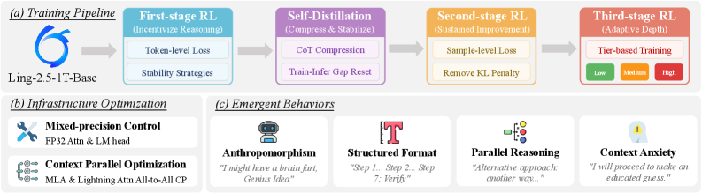

### TL;DR

The first public account of running "zero RL" (RLVR without SFT priors) on a 1-trillion-parameter model. The team stabilizes the pipeline with three algorithmic + systems fixes — clipped importance sampling, training/inference ratio correction, and mixed-precision control — and observes that Ring-2.5-1T-Zero autonomously develops advanced reasoning behaviors (self-verification, parallel reasoning, structured formatting) without any prompt engineering. Competitive on seven math benchmarks; validates a "bitter lesson" flavor of scaling for reasoning RL.

### Key idea

RLVR ("zero RL") applied at 1T parameters with a stability recipe: (1) **clipped importance sampling** to keep off-policy gradient variance bounded when rollouts and updates drift; (2) **training-inference ratio correction** to counter mismatched numerics between the vLLM-style inference engine and the training kernel; (3) **mixed-precision control** across the RL loop. Training proceeds in a two-phase dynamic — an initial "discovery" phase where the model explores diverse CoT styles, followed by a "sharpening" phase where the winning behaviors consolidate.

### Main finding

- Ring-2.5-1T-Zero reaches competitive performance across seven challenging math benchmarks (paper reports parity with heavier baselines).
- Scaling to 1T parameters improves sample efficiency and raises the accuracy ceiling versus smaller-scale zero-RL runs.
- The model spontaneously invents behaviors — "anthropomorphism", self-verification, parallel reasoning, and what the authors call "context anxiety" — with no hand-crafted reasoning templates.
- Under a new CoT-quality rubric (comprehensibility, reproducibility, efficiency), Ring-2.5-1T-Zero produces cleaner traces than compressed baselines.

### Why it matters

Concrete evidence that pure RLVR at frontier scale works and gets *better* with scale rather than getting stuck. Establishes a training-stability playbook (importance-sampling clipping + inference/training reconciliation + mixed-precision hygiene) that other trillion-parameter RL efforts will need to replicate. The observation that advanced reasoning behaviors emerge from raw RL — no long-CoT SFT cold start, no hand-crafted scaffolds — pushes the field to reconsider how much of R1-style "recipe complexity" is actually load-bearing at scale.

### Knowledge graph integration

**Builds on / relates to existing pages:**
- [rlvr.md](../post-training/rlvr.md) — Ring-Zero is a direct scale-up of the RLVR paradigm.
- [grpo.md](../post-training/grpo.md) — GRPO-family algorithms are the substrate; clipped importance sampling extends them for large off-policy drift.
- [long-cot-rl.md](../post-training/reasoning/long-cot-rl.md) — same regime (long-CoT emergence from outcome reward).
- [deepseek-r1.md](../case-studies/deepseek-r1.md) — R1 established the recipe at ~600B MoE; Ring-Zero scales the same class to 1T dense.
- [partial-rollouts.md](../systems/partial-rollouts.md) — same class of infra concern.
- [fp8-training.md](../pre-training/fp8-training.md) — mixed-precision control is a training-stability concern at scale.

**Suggested new pages:**
- `case-studies/ring-zero.md` *(case study)* — full breakdown of the 1T zero-RL system.
- `post-training/clipped-importance-sampling.md` *(depth)* — the specific IS clip used to stabilize off-policy RL at scale.
- `post-training/training-inference-ratio-correction.md` *(depth)* — reconciling numerical mismatch between rollout and training kernels.
- `post-training/reasoning/zero-rl-scaling.md` *(depth)* — the discovery→sharpening phase dynamic and behavior emergence.

---

## 2. PalmClaw: A Native On-Device Agent Framework for Mobile Phones

**Authors:** Hongru Cai, Yongqi Li, Ran Wei, Wenjie Li — *The Hong Kong Polytechnic University, Hangzhou Diagens Biotechnology*
**Links:** [arXiv:2607.13027](https://arxiv.org/abs/2607.13027) · [HF](https://huggingface.co/papers/2607.13027) · [AlphaXiv](https://www.alphaxiv.org/abs/2607.13027)
**Topics:** `agents`, `on-device`, `mobile`, `tool-use`

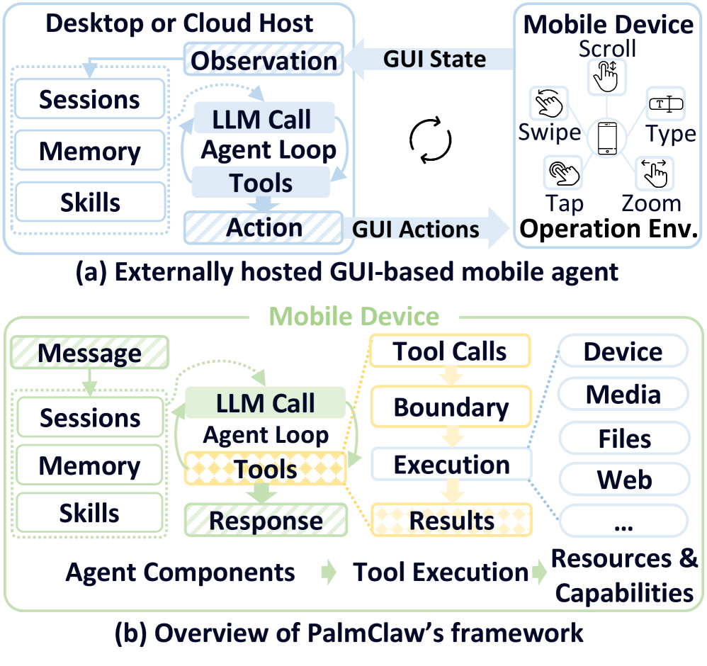

### TL;DR

An open-source, phone-native agent runtime that manages sessions, memory, tools, and the agent loop **entirely on device**. The key move: expose OS capabilities (sensors, files, apps) as first-class tools with typed arguments and structured returns, rather than driving the phone through GUI-emulated taps/swipes like most mobile agents do. Reports 11.5% better task success and 94.9% lower completion time versus the strongest GUI-driven baseline.

### Key idea

Recast the mobile agent as a **tool-calling** system rather than a **GUI-manipulation** system. Existing mobile agents drive a phone by simulating touch input on the rendered UI (long, brittle, interface-dependent sequences with no execution boundary). PalmClaw instead publishes the device's native capabilities — camera, contacts, filesystem, sensors, apps — as tools with explicit argument schemas, structured return values, and clearly scoped side-effect boundaries. The agent loop, memory, and skills all run in-process on the phone.

### Main finding

- **+11.5% relative task success** and **−94.9% completion time** vs. the strongest baseline (a GUI-simulating mobile agent).
- Setup burden is lower (no accessibility service permissions or emulator layer).
- Execution traces show boundary enforcement: the agent can't perform capabilities that weren't explicitly registered.

### Why it matters

The mobile-agent literature has been converging on ever-larger models teasing pixels; PalmClaw argues the framing itself is wrong. If phones expose their OS as a tool API, agents become dramatically simpler, faster, and safer (execution boundaries are explicit rather than emergent). It also unblocks on-device agents that don't need a datacenter round-trip, which matters for latency, cost, and privacy.

### Knowledge graph integration

**Builds on / relates to existing pages:**
- [agents/README.md](../agents/README.md) — currently a stub; PalmClaw fills the "on-device / tool-native agents" area.

**Suggested new pages:**
- `agents/agent-harness.md` *(depth)* — general concept of the harness (session, memory, tools, control loop) that PalmClaw and Harness Handbook both stress.
- `agents/on-device-agents.md` *(depth)* — the design pattern of running the full agent loop on the client device with OS tools.

---

## 3. Boogu-Image-0.1: Boosting Open-Source Unified Multimodal Understanding and Generation

**Authors:** Guoxuan Chen, Chufeng Xiao, Haoran Yang, Siyue Xie, Binxiao Huang et al. (33 authors total) — *Boogu open-source consortium*
**Links:** [arXiv:2607.13125](https://arxiv.org/abs/2607.13125) · [HF](https://huggingface.co/papers/2607.13125) · [AlphaXiv](https://www.alphaxiv.org/abs/2607.13125)
**Topics:** `multimodal`, `diffusion`, `unified-model`, `open-source`

### TL;DR

An open-source unified multimodal model family — Base, Turbo, Edit, Edit-Turbo — that handles text-to-image generation, instruction-based editing, and bilingual (Chinese/English) text rendering under one architecture. Positioned as an open-source counterpart to closed unified models, with a fast (Turbo) variant for latency-sensitive use.

### Key idea

A single backbone providing both understanding (VLM-style image conditioning) and generation (diffusion-style output), with distilled Turbo variants for reduced sampling steps. Edit variants inject instruction conditioning to modify existing images. Bilingual text rendering is called out as a first-class capability, addressing a known weak spot of most open image generators.

### Main finding

Competitive quality on text-to-image, editing, and text-rendering benchmarks against comparable open baselines. Turbo variants trade some fidelity for large inference-cost reductions.

### Why it matters

The unified-multimodal-model direction (one network for understand+generate) is where much of the frontier is heading. A fully open recipe at competitive quality unblocks downstream research and gives a reference point outside the closed-model literature.

### Knowledge graph integration

**Builds on / relates to existing pages:**
- [multimodal/README.md](../multimodal/README.md) — currently empty; this paper populates the "unified understanding+generation" corner.

**Suggested new pages:**
- `case-studies/boogu-image.md` *(case study)* — full breakdown of the unified pipeline and Turbo distillation.
- `multimodal/unified-multimodal-model.md` *(depth)* — the architectural pattern of one backbone for both directions.

---

## 4. Harness Handbook: Making Evolving Agent Harnesses Readable, Navigable, and Editable

**Authors:** Ruhan Wang, Yucheng Shi, Zongxia Li, Zhongzhi Li, Yue Yu, Junyao Yang, Kishan Panaganti, Haitao Mi, Dongruo Zhou, Leoweiliang — *Tencent HY LLM Frontier, Indiana University, U. Maryland, U. Georgia, NUS*
**Links:** [arXiv:2607.13285](https://arxiv.org/abs/2607.13285) · [HF](https://huggingface.co/papers/2607.13285) · [AlphaXiv](https://www.alphaxiv.org/abs/2607.13285)
**Topics:** `agents`, `harness`, `code`, `retrieval`

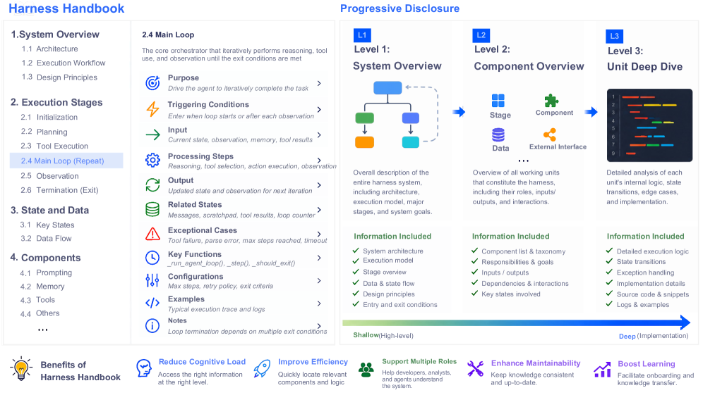

### TL;DR

Agent quality depends as much on the **harness** — the code that constructs prompts, manages state, invokes tools, and coordinates execution — as on the model. Modifying that harness safely requires finding all code paths that implement a target behavior, and behavior is scattered across files. Harness Handbook synthesizes a behavior-centric index of a harness via static analysis + LLM-assisted behavioral structuring, then uses "Behavior-Guided Progressive Disclosure" to guide coding agents from behavior descriptions to precise edit sites. Improves plan quality on real modification tasks over two open-source harnesses.

### Key idea

Treat behavior localization as the central bottleneck in evolving an agent harness. Build a **Harness Handbook**: a behavior-organized representation extracted automatically that maps behaviors → source-code locations. When a modification request arrives, a coding agent walks the handbook from high-level behavior to concrete code via progressive disclosure, verifying candidate sites against the current source.

### Main finding

- On modification requests over two open-source harnesses, Handbook-assisted planning improves behavior localization and edit-plan quality.
- Uses **fewer planner tokens** than baseline retrieval / long-context approaches.
- Largest gains for changes touching **scattered implementation sites**, **rarely executed code paths**, and **cross-module interactions** — precisely the cases that defeat naive code search.

### Why it matters

Harnesses are becoming the moat around production agents, and they change constantly. A behavior-first index makes them auditable, editable, and less bus-factor-fragile. It also flags a research direction the community has under-covered: agent harnesses as first-class engineering artifacts, distinct from the LLM they wrap.

### Knowledge graph integration

**Builds on / relates to existing pages:**
- [agents/README.md](../agents/README.md) — harness concept is central to the agents folder but not yet documented.

**Suggested new pages:**
- `agents/agent-harness.md` *(depth)* — the concept of the harness (prompts, state, tools, control loop) as a first-class object.
- `agents/harness-handbook.md` *(depth)* — the specific behavior-centric representation + BGPD localization technique.

---

## 5. From Controlled to the Wild: Evaluation of Pentesting Agents for the Real-World

**Authors:** Pedro Conde, Henrique Branquinho, Valerio Mazzone, Bruno Mendes, André Baptista, Nuno Moniz — *Ethiack, University of Notre Dame*
**Links:** [arXiv:2605.10834](https://arxiv.org/abs/2605.10834) · [HF](https://huggingface.co/papers/2605.10834) · [AlphaXiv](https://www.alphaxiv.org/abs/2605.10834)
**Topics:** `agents`, `safety`, `eval`, `security`

### TL;DR

Existing pentesting-agent benchmarks (CTF, RCE reproduction, trajectory similarity) measure bounded capabilities in narrow environments. This paper proposes an evaluation protocol that shifts to **validated vulnerability discovery** in complex real targets, combining structured ground truth, LLM-based semantic matching, bipartite scoring under ambiguity, and repeated evaluation for stochastic agents. Ships an open ethibench harness with expert-annotated ground truth.

### Key idea

Move from task-completion to vulnerability-discovery as the primary metric. Instead of scoring whether an agent solved a scripted challenge, score which real vulnerabilities it discovered in an environment with multiple attack surfaces. Use LLM-based semantic matching to reconcile agent findings with expert ground truth (agents phrase vulnerabilities differently), then bipartite match to score under ambiguity. Repeat runs because agents are stochastic; report efficiency alongside coverage.

### Main finding

The protocol produces stable, discriminative rankings of pentesting agents that CTF/RCE-style benchmarks miss. Reduced-suite selection keeps evaluation tractable while preserving discriminative power.

### Why it matters

Pentesting is the highest-stakes agentic capability being deployed in the wild — evaluation methodology directly shapes what "safe enough to release" means. A metric grounded in real vulnerability discovery, rather than solved puzzles, is what operators need to make deployment decisions and what safety teams need to track dangerous-capability trends.

### Knowledge graph integration

**Builds on / relates to existing pages:**
- [safety/README.md](../safety/README.md) — dangerous-capability eval is part of the safety agenda.
- [evaluation/README.md](../evaluation/README.md) — new class of agent benchmark.

**Suggested new pages:**
- `evaluation/pentesting-agent-eval.md` *(depth)* — the ethibench protocol.
- `agents/pentesting-agents.md` *(depth)* — the class of offensive-security agents.

---

## 6. Know Deeply, Act Perfectly: Personal GUI Assistant with Self-Evolving Memory and Skill

**Authors:** Yunxin Li, Jinchao Li, Baotian Hu, Min Zhang, Shibo Su, Zhenran Xu, Chenrui Zhao, Tongshu Bian, Xiaoman Liang, Meishan Zhang — *Lychee Team (Harbin Institute of Technology, Shenzhen), Shenzhen Loop Area Institute*
**Links:** [arXiv:2607.12625](https://arxiv.org/abs/2607.12625) · [HF](https://huggingface.co/papers/2607.12625) · [AlphaXiv](https://www.alphaxiv.org/abs/2607.12625)
**Topics:** `agents`, `GUI`, `memory`, `self-improvement`

### TL;DR

KnowAct-GUIClaw is a Know–Route–Act–Reflect framework for cross-platform GUI agents that continuously accumulates memory and skills from execution history. Positions itself as fixing two bottlenecks in the OpenClaw agent lineage: weak cross-platform GUI support and no built-in self-evolution mechanism.

### Key idea

Split the assistant into four stages — Know (cognitive comprehension of the target task and interface), Route (plan a path across platforms and apps), Act (execute GUI operations), Reflect (extract memory + reusable skills from the outcome) — so that each finished task improves the assistant's memory store and skill library. Skills persist across sessions and generalize across GUI platforms.

### Main finding

Reports higher task success and efficiency across cross-platform GUI benchmarks versus prior OpenClaw variants, with monotonic improvement over time as memory/skills accumulate.

### Why it matters

Self-evolving personal assistants are moving from research prototypes toward products. The Know–Route–Act–Reflect decomposition is a clean recipe others can adopt, and the emphasis on cross-platform GUI operation matters because real users span multiple devices.

### Knowledge graph integration

**Builds on / relates to existing pages:**
- [agents/README.md](../agents/README.md) — GUI agents + memory/skill accumulation both live here.

**Suggested new pages:**
- `agents/gui-agents.md` *(depth)* — the class of agents that operate via screen + input.
- `agents/agent-memory.md` *(depth)* — persistent memory + skill libraries as a self-improvement substrate.

---

## 7. OvisOCR2 Technical Report

**Authors:** Shiyin Lu, Yinglun Li, Yu Xia, Yuhui Chen, An-Yang Ji, Jun-Peng Jiang, Qing-Guo Chen, Jianshan Zhao, En Lin, Haijun Li, Cheng Qin, Zhao Xu, Weihua Luo — *ATH-MaaS, Alibaba Group*
**Links:** [arXiv:2607.13639](https://arxiv.org/abs/2607.13639) · [HF](https://huggingface.co/papers/2607.13639) · [AlphaXiv](https://www.alphaxiv.org/abs/2607.13639)
**Topics:** `multimodal`, `OCR`, `RL`, `distillation`

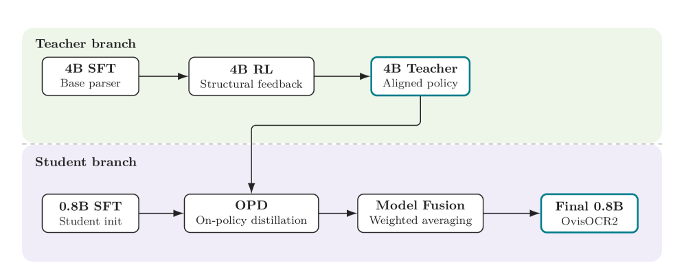

### TL;DR

A 0.8B end-to-end document parser that outputs Markdown from page images — text, formulas, tables, and visual regions in one pass. The interesting bit is the training recipe: SFT on real+synthetic pages, RL on a larger 4B branch with multi-component rewards, on-policy distillation from the 4B branch down to 0.8B, and final model fusion. State-of-the-art on OmniDocBench v1.6 (96.58) and PureDocBench (75.06 Avg3) among end-to-end models.

### Key idea

Ship the small (0.8B) production model by training a bigger sibling (4B) with RL, then distilling on-policy back down. Rewards during RL are multi-component (text accuracy, structural fidelity, layout correctness). The synthetic corpus is derived from HTML sources so structure is ground-truth by construction. Model fusion at the end combines multiple training-recipe branches.

### Main finding

- 96.58 on OmniDocBench v1.6 (SOTA among end-to-end doc parsers).
- 75.06 Avg3 on PureDocBench.
- 0.8B parameter model — deployable on consumer hardware.

### Why it matters

Document parsing at deploy-friendly scale unblocks a wide class of enterprise pipelines that need faithful table/formula extraction without server-scale VLMs. The train-large-distill-small recipe (via on-policy distillation, not offline SeqKD) is a template other MLLM efforts will follow.

### Knowledge graph integration

**Builds on / relates to existing pages:**
- [multimodal/README.md](../multimodal/README.md) — MLLM training pipelines belong here.
- [_rl.md](../post-training/_rl.md) — RL for document-parsing rewards is a specialized instance.

**Suggested new pages:**
- `multimodal/document-parsing.md` *(depth)* — MLLM-as-parser pattern with structural rewards.
- `post-training/on-policy-distillation.md` *(depth)* — the OPD primitive; reused across many recipes including ShortOPD.

---

## 8. AgentCompass: A Unified Evaluation Infrastructure for Agent Capabilities

**Authors:** Zichen Ding, Jiaye Ge, Shufan Jiang, Kai Chen, Mo Li, Qingqiu Li, Zehao Li, Zonglin Li, Tiaohao Liang, Shudong Liu, Zerun Ma et al. — *Shanghai Artificial Intelligence Laboratory*
**Links:** [arXiv:2607.13705](https://arxiv.org/abs/2607.13705) · [HF](https://huggingface.co/papers/2607.13705) · [AlphaXiv](https://www.alphaxiv.org/abs/2607.13705)
**Topics:** `eval`, `agents`, `infra`

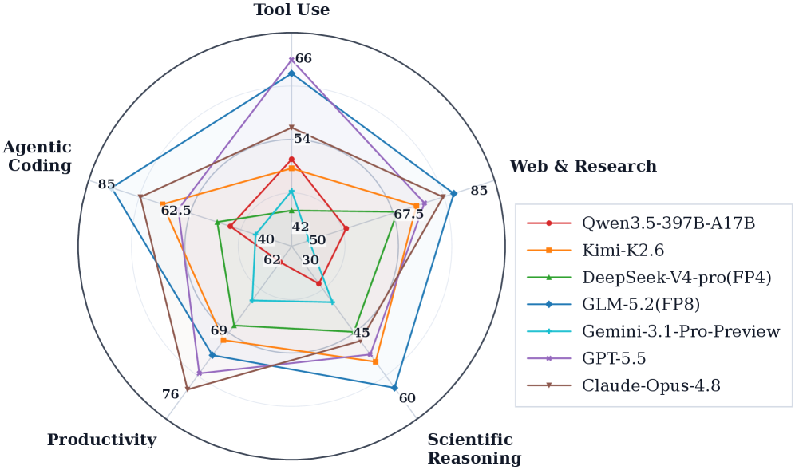

### TL;DR

Open-source agent evaluation infrastructure that decouples **Benchmark**, **Harness**, and **Environment** so any combination can be swapped without rewriting execution logic. Ships with 20+ benchmarks across five capability dimensions, an async fault-tolerant runtime, and trajectory-analysis tools that surface failure modes like reward hacking.

### Key idea

Separate the three axes of an agent evaluation — the benchmark (what task), the harness (what agent scaffold), the environment (what runs the tools) — into independent components with well-defined interfaces. Adding a new benchmark or a new harness becomes a single-plug operation. Async runtime handles stochastic agent failures without freezing the whole eval sweep. Trajectory tools diagnose specific pathologies (reward hacking, tool misuse, loop-forever).

### Main finding

Natively supports 20+ benchmarks across five capability dimensions with reproducible results. Fault-tolerant async runtime keeps large sweeps productive. Failure-mode diagnostics catch nuances that final-score metrics miss.

### Why it matters

Agent evaluation has been fragmented — every group ships its own harness + benchmark bundle, making cross-paper comparisons unreliable. A shared, composable infrastructure raises the floor on reproducibility and gives the community a common substrate to build new benchmarks on.

### Knowledge graph integration

**Builds on / relates to existing pages:**
- [evaluation/README.md](../evaluation/README.md) — agent evaluation is a major sub-area.
- [agents/README.md](../agents/README.md) — harness is one of the three axes.

**Suggested new pages:**
- `evaluation/agent-evaluation-infra.md` *(depth)* — Benchmark/Harness/Environment decomposition + async fault-tolerant sweeps.

---

## 9. PolicyShiftGuard: Benchmarking and Improving Policy-Adaptive Image Guardrails

**Authors:** Mingyang Song, Luxin Xu, Haoyu Sun, Minzhou Pan, Yu Cheng, Bo Li — *Fudan University*
**Links:** [arXiv:2607.05910](https://arxiv.org/abs/2607.05910) · [HF](https://huggingface.co/papers/2607.05910) · [AlphaXiv](https://www.alphaxiv.org/abs/2607.05910)
**Topics:** `safety`, `multimodal`, `eval`, `guardrails`

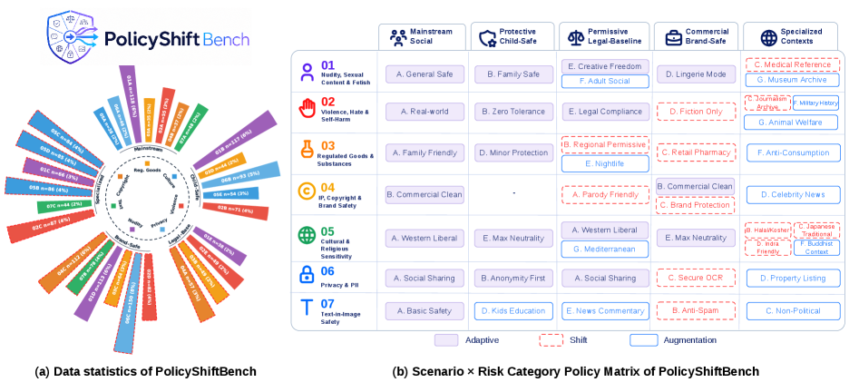

### TL;DR

Image safety guardrails typically bake in a fixed policy — but in real deployments the same image can be allowed under one product's rules and blocked under another's. PolicyShiftGuard reframes the task as **policy-adaptive**: given an image and a policy text, decide whether the image violates that specific policy, and generalize to unseen policy definitions. Introduces PolicyShiftBench (2,000 policy-discriminative instances, 265 images, 7.55 policy prompts per image on average) and a 7B guardrail trained with Randomized Policy SFT + Boundary-Pair Policy Adaptation, hitting 76.9 Avg F1.

### Key idea

Two-stage recipe: **RP-SFT** (Randomized Policy SFT) exposes the model to many random policy definitions during SFT so it learns to condition on the policy rather than on image-level priors. **BP-Adapt** (Boundary-Pair Policy Adaptation) trains on matched policy pairs for the same image + risk category — one policy that blocks it, one that passes it — with a pairwise comparison loss that forces the model to separate the two. The pairwise objective is what stabilizes policy adaptation.

### Main finding

- 76.9 Avg F1 and 72.1 Avg PSS on PolicyShiftBench (SOTA), with strong transfer to UnSafeBench and SafeEditBench.
- Existing VLMs and specialized guardrails "remain brittle under policy shifts" — the paper documents concrete failure cases.
- Ablations show that matched pass/block boundary pairs are essential; removing BP-Adapt collapses adaptation.

### Why it matters

Real safety operates at policy granularity, not "is this image bad in the abstract". A policy-conditioned guardrail is what image platforms actually need to deploy across products, jurisdictions, and evolving guidelines. The benchmark also serves as a stress test for whether a VLM is genuinely reading the policy versus falling back on visual priors.

### Knowledge graph integration

**Builds on / relates to existing pages:**
- [safety/README.md](../safety/README.md) — guardrails and dangerous-capability evals live here.

**Suggested new pages:**
- `safety/policy-adaptive-guardrails.md` *(depth)* — RP-SFT + BP-Adapt for policy-conditioned safety classifiers.
- `evaluation/policy-shift-bench.md` *(depth)* — the benchmark itself.

---

## 10. Registers Matter for Pixel-Space Diffusion Transformers

**Authors:** Nikita Starodubcev, Ilia Sudakov, Ilya Drobyshevskiy, Artem Babenko, Dmitry Baranchuk — *Yandex Research*
**Links:** [arXiv:2605.16147](https://arxiv.org/abs/2605.16147) · [HF](https://huggingface.co/papers/2605.16147) · [AlphaXiv](https://www.alphaxiv.org/abs/2605.16147)
**Topics:** `diffusion`, `architectures`, `interp`, `DiT`

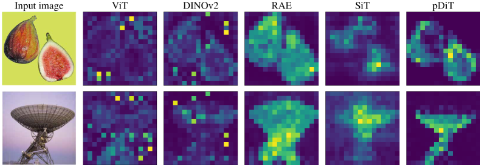

### TL;DR

Register tokens — extra learned tokens added to a ViT that soak up high-norm outlier activations — were introduced for classification ViTs. This paper asks whether they help Diffusion Transformers and finds an interesting twist: DiTs don't exhibit the patch-token outlier pattern that motivates registers in ViTs, but they benefit from registers anyway, and *more so* in pixel-space DiTs than in latent-space DiTs. The authors introduce **Register Guidance**, which amplifies the contribution of registers responsible for coherent visual structure.

### Key idea

Registers still help DiTs — but through a different mechanism than in ViTs. Instead of absorbing outliers, DiT registers produce cleaner feature maps at high noise levels, which is exactly where pixel-space generation is fragile. Recent pixel-space DiT architectures already contain implicit register-like structures, which partially explains their empirical strength. **Register Guidance** treats the register-token contribution as a steerable component and amplifies it at inference to improve visual coherence.

### Main finding

- Registers improve DiT sample quality, with **larger gains in pixel-space DiTs** than latent-space DiTs.
- Register tokens produce cleaner feature maps at high noise levels.
- Register Guidance further improves visual structure at inference time.

### Why it matters

Pixel-space diffusion is coming back (avoids VAE artefacts, simplifies training). A cheap architectural add-on that provably improves it is easy to slot into existing DiT stacks. The Register Guidance idea also opens a new inference-time control knob for DiTs alongside classifier-free guidance.

### Knowledge graph integration

**Builds on / relates to existing pages:**
- [architectures/README.md](../architectures/README.md) — attention/transformer variants belong here.
- [transformer-block.md](../architectures/transformer-block.md) — registers are a per-block modification.

**Suggested new pages:**
- `architectures/register-tokens.md` *(depth)* — the register-token mechanism and its distinct role in DiTs vs ViTs.
- `architectures/register-guidance.md` *(depth)* — inference-time register amplification.

---

## 11. Self-Improvements in Modern Agentic Systems: A Survey

**Authors:** Zhe Ren, Yimeng Chen, Dandan Guo, Guowei Rong, Tonghui Li, R.B. Xiong, Qingfeng Lan, Wenyi Wang, Li Nanbo, Yibo Yang, Mingchen Zhuge, Jürgen Schmidhuber — *Jilin U, KAUST, U. Alberta, IDSIA/USI/SUPSI*
**Links:** [arXiv:2607.13104](https://arxiv.org/abs/2607.13104) · [HF](https://huggingface.co/papers/2607.13104) · [AlphaXiv](https://www.alphaxiv.org/abs/2607.13104)
**Topics:** `agents`, `survey`, `self-improvement`

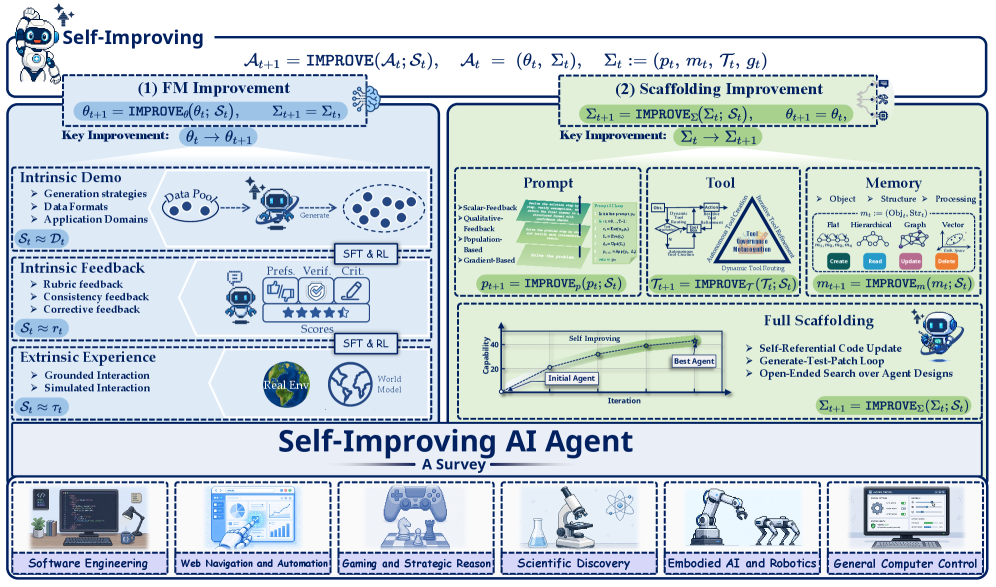

### TL;DR

A survey framing modern agents as **configurations** (foundation model + operational scaffold: prompts, memory, tools, control logic) and self-improvement as a **self-induced update operator** on those components. Organizes prior work by update target (parameters vs scaffold) and by the signals driving change, then reviews applications, evaluation, and open problems.

### Key idea

A common vocabulary: an agent = (foundation model, scaffold), and self-improvement = an operator that reads experience and writes updates to either. Any specific method (RL fine-tuning, memory accumulation, prompt search, skill library growth, control-logic rewriting) is a special case of this operator with a particular *target* and *signal*. The framework makes the design space visible and lets disparate methods be compared side by side.

### Main finding

Prior work fragments across update target (parameters vs prompts vs memory vs tools) and signal type (reward vs self-critique vs execution feedback vs demonstration). The taxonomy exposes gaps — for example, self-improvement of the control-logic itself is under-studied compared to memory/skill growth.

### Why it matters

Self-improving agents are moving from prototypes to deployed products. A survey framing that unifies the design space helps the field compare methods, spot blind spots, and communicate what "self-improvement" actually means when the media conflates it with recursive self-modification.

### Knowledge graph integration

**Builds on / relates to existing pages:**
- [agents/README.md](../agents/README.md) — self-improvement is the frontier of the agents area.

**Suggested new pages:**
- `agents/_self-improving-agents.md` *(taxonomy)* — parameters vs scaffold as update targets; reward vs feedback vs demonstration as signals.

---

## 12. ShortOPD: Recovering Pruned LLMs with Short-to-Long On-Policy Distillation

**Authors:** Qianhao Yuan, Hongyu Lin, Yaojie Lu, Xianpei Han, Le Sun, Xiang Li, Ming Xu, Jiarui Li, Xiuying Zhao — *ByteDance, Chinese Academy of Sciences*
**Links:** [arXiv:2607.13124](https://arxiv.org/abs/2607.13124) · [HF](https://huggingface.co/papers/2607.13124) · [AlphaXiv](https://www.alphaxiv.org/abs/2607.13124)
**Topics:** `distillation`, `pruning`, `efficient`, `LLM`

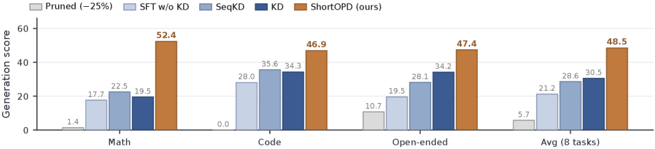

### TL;DR

Structured pruning validated on multiple-choice benchmarks routinely collapses on free-form generation — greedy pass@1 near-vanishes even when pass@k under sampling stays useful. Recovery via SFT/KD works but wastes compute on long, repetitive suffixes early. **ShortOPD** detects teacher-confirmed repetitive suffixes, treats the surviving prefix as the effective rollout length, and grows the horizon adaptively. Reaches ~9× baseline post-compression score and 1.6–4.4× standard recovery recipes in a quarter of the training time.

### Key idea

Two grounded observations. **First**: after structured pruning, generations mostly fail by degenerate suffix repetition — the useful prefix is still there. **Second**: On-Policy Distillation (OPD) from the pre-compression model — dense token-level teacher supervision on the student's own rollouts — recovers generation quality where offline SFT/SeqKD stall. But long rollouts spend early recovery on the repetitive tails. **ShortOPD** detects the repetitive suffix (teacher-confirmed), truncates to the effective prefix length per rollout, and allocates future rollout budget to the lengths the policy can currently use — a short-to-long schedule that shifts compute to informative tokens.

### Main finding

- **~9× the compressed model's unrecovered score** and **1.6–4.4× standard recovery recipes** (SFT-only, KD, SeqKD).
- Matches a fixed 8192-token OPD baseline within 2 points using **a quarter of the training time** (8.5 vs 35.9 hours) and **71% fewer rollout tokens**.
- Repetition is the dominant failure mode in the recoverable regime; targeting it is the lever.

### Why it matters

Structured pruning has been over-validated on multiple-choice metrics and under-validated on generation, causing deployment surprises. ShortOPD makes recovery cheap enough to close that gap and reframes OPD from an expensive luxury into a practical primitive. On-policy distillation as a class deserves its own graph page — many recent recipes use variants of it.

### Knowledge graph integration

**Builds on / relates to existing pages:**
- [_post-training.md](../post-training/_post-training.md) — recovery/adaptation post-compression is part of the post-training arc.
- [rejection-sampling.md](../post-training/rejection-sampling.md) — same family of on-policy training-signal patterns.

**Suggested new pages:**
- `post-training/on-policy-distillation.md` *(depth)* — the OPD primitive: student rollouts, frozen teacher, token-level KL.
- `post-training/short-opd.md` *(depth)* — the short-to-long schedule for adaptive rollout budgets.
- `inference/structured-pruning-recovery.md` *(depth)* — the failure mode + recovery landscape after structured pruning.

---

## 13. Discrete Diffusion Models: A Unified Framework from Tokenization to Generation

**Authors:** Ye Yuan, Weien Li, Rui Song, Zeyu Li, Haochen Liu, Xiangyu Kong, Zixuan Dong, Linfeng Du, Zipeng Sun, Weixu Zhang, Jiaxin Huang, Changjiang Han, Yonghan Yang, Zichen Zhao, Xiuyuan Hu, Haolun Wu, Yankai Chen, Fengran Mo, Jikun Kang, Bowei He, Philip S. Yu, Xue Liu — *McGill, Mila, Cambridge, U. Toronto, MBZUAI, Tsinghua, RIT, Salesforce, UIC*
**Links:** [arXiv:2607.13431](https://arxiv.org/abs/2607.13431) · [HF](https://huggingface.co/papers/2607.13431) · [AlphaXiv](https://www.alphaxiv.org/abs/2607.13431)
**Topics:** `diffusion`, `taxonomy`, `LLM`, `discrete`

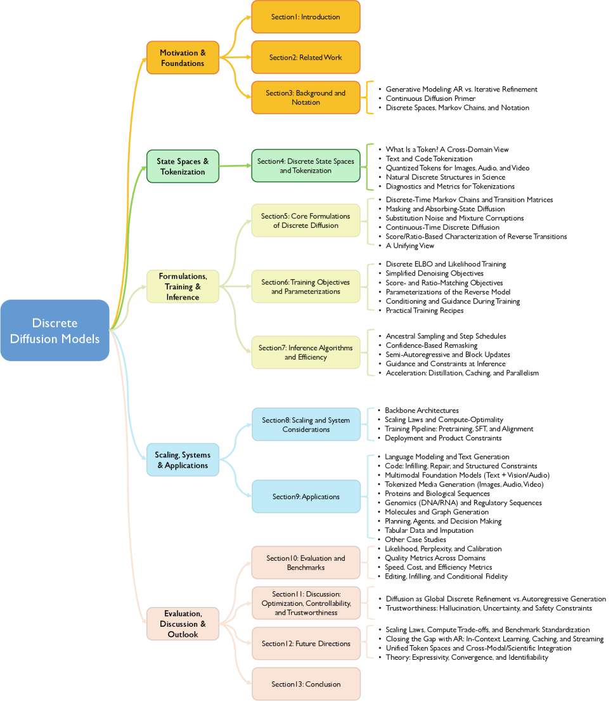

### TL;DR

A unified conceptual framework for Discrete Denoising Diffusion Models (DDMs) that views the whole family through **how the discrete state space is constructed** — the tokenization scheme, the vocabulary topology, the domain-specific alphabets. Under this lens, transition-matrix, masking/absorbing-state, and score/ratio-based formulations become special cases of a common design space. Surfaces cross-cutting tradeoffs in objectives, inference, scaling, systems, and evaluation.

### Key idea

DDMs are usually presented as competing formulations. This survey argues the differences reduce to **how you build the discrete state space**: what counts as a token, how tokens can transition, and what "noise" means over that structure. Transition-matrix / masking-absorbing / ratio-based approaches all instantiate different construction choices; once framed this way, the tradeoffs (parallel decoding capacity, training-objective simplicity, systems throughput) become comparable and combinable.

### Main finding

The unified view exposes design axes and matched tradeoffs that were previously implicit: what happens when you change the tokenization while keeping the objective, or vice versa. Points to research directions where cross-instantiation transfers could unlock new capabilities.

### Why it matters

Discrete diffusion is being explored as a serious alternative to autoregressive LLMs (parallel generation, iterative refinement). A shared framework makes it easier for practitioners to compare variants and for new work to position itself precisely. Ideal seed for a taxonomy page — the graph currently has no discrete-diffusion coverage.

### Knowledge graph integration

**Builds on / relates to existing pages:**
- [architectures/README.md](../architectures/README.md) — architectures of the model family.
- [fundamentals/_tokenization.md](../fundamentals/_tokenization.md) — the tokenization choice is now first-class.

**Suggested new pages:**
- `architectures/_discrete-diffusion.md` *(taxonomy)* — mask/absorbing vs transition-matrix vs ratio-based DDMs.
- `architectures/masking-diffusion.md` *(depth)* — the masking/absorbing-state variant specifically.

---

## 14. Length Penalties Make Chain-of-Thought Less Monitorable

**Authors:** Bryce Little — *Independent*
**Links:** [arXiv:2607.09786](https://arxiv.org/abs/2607.09786) · [HF](https://huggingface.co/papers/2607.09786) · [AlphaXiv](https://www.alphaxiv.org/abs/2607.09786)
**Topics:** `safety`, `reasoning`, `interp`, `cot-monitoring`

### TL;DR

Length-penalized RL shortens CoT while preserving accuracy — but the shortened CoT hides *the influence that drove the answer*. Trains Qwen3-4B and Qwen3-14B with varying target chain lengths, then probes with hint-biasing interventions. Compression cuts reasoning tokens, keeps most multiple-choice accuracy, but collapses lower-bound faithfulness to 63–69% of baseline and drops monitor-caught hint use from ~60–69% to ~48–49%. Even after length-matching random-deletion controls, compressed chains still disclose hints 7–35 percentage points less. There is a **compression-monitorability frontier**.

### Key idea

Compression via length-penalty RL doesn't just shorten — it *preferentially removes* the tokens a monitor needs to see what influenced the answer. Length-matched controls (randomly delete sentences from uncompressed chains until they match the compressed length) isolate this as a *content* effect, not a *length* effect. Measured with biasing-hint interventions on MMLU-Pro-R + four transfer benchmarks.

### Main finding

- At strongest target compression: lower-bound faithfulness drops to **63.1% of baseline for Qwen3-14B** and **69.4% for Qwen3-4B**.
- Monitor catches drop from **69% → 49%** (14B) and **60% → 48%** (4B).
- Length-matched controls: compressed chains disclose hints **7–35 pp less** than randomly-shortened baselines across two sizes and five distributions.

### Why it matters

Length penalties are widely adopted (Kimi k1.5's group-relative length reward is one instance). This paper is direct evidence that using them uncritically corrodes CoT-monitoring safety. It reframes the design tradeoff: "cheaper reasoning" is not free — you may be trading detectability of misaligned influence for it. Should force safety-conscious labs to co-optimize length and faithfulness rather than length alone.

### Knowledge graph integration

**Builds on / relates to existing pages:**
- [cot-monitoring.md](../safety/cot-monitoring.md) — direct counterweight: shows a training pressure that corrodes monitorability.
- [length-penalty.md](../post-training/reasoning/length-penalty.md) — the specific length-reward this paper attacks.
- [long-cot-rl.md](../post-training/reasoning/long-cot-rl.md) — same regime.

**Suggested new pages:**
- `safety/length-penalty-monitorability.md` *(depth)* — the compression-monitorability frontier with numbers and the biasing-hint methodology.

---

## 15. Tracing Agentic Failure from the Flow of Success

**Authors:** Samuel Yeh, Yiwen Zhu, Shaleen Deep, Sharon Li — *University of Wisconsin-Madison, Microsoft Research*
**Links:** [arXiv:2607.12747](https://arxiv.org/abs/2607.12747) · [HF](https://huggingface.co/papers/2607.12747) · [AlphaXiv](https://www.alphaxiv.org/abs/2607.12747)
**Topics:** `agents`, `eval`, `debugging`, `anomaly`

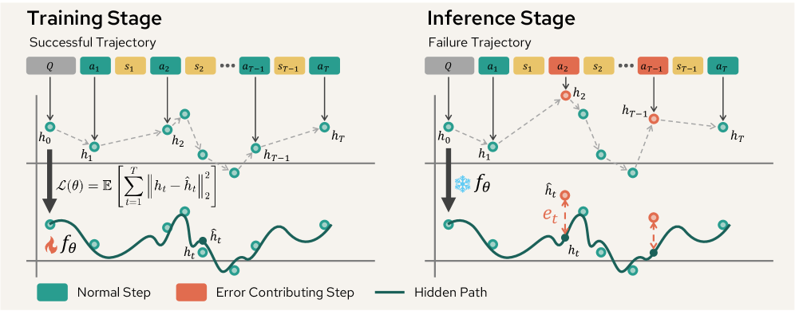

### TL;DR

Failure attribution for agentic systems — identifying which step in a failed trajectory caused the failure — usually needs step-level error annotations that are expensive to collect. **Oat** casts failure attribution as **unsupervised one-class learning**: train only on successful trajectories using neural controlled differential equations to model the "success manifold" in latent space, then score each step of a failure trajectory by its deviation. With only 100 successful trajectories, Oat is 200–5000× faster than prompting-based baselines and beats them by +20% F1 in-domain and +7% F1 OOD.

### Key idea

Rather than annotate error steps in failure trajectories (expensive, poor scaling), learn the dynamical pattern of *success* using neural controlled differential equations in latent space. At inference, each step of a failing trajectory gets an anomaly score based on how far it drifts from the success manifold. Error steps are those with high anomaly scores.

### Main finding

- Training on only **100 successful trajectories** — no failure annotations needed.
- **200–5000× faster** than prompting-based baselines.
- **+20% F1 in-domain**, **+7% F1 OOD** on failure-attribution benchmarks.

### Why it matters

Debugging agent systems is the current bottleneck in agent development. A lightweight, unsupervised attribution model that generalizes OOD gives teams a practical diagnostic they can deploy per-agent without an annotation pipeline. It also connects the agentic-systems literature to a mature ML technique (one-class learning + NCDEs) not previously visible in this area.

### Knowledge graph integration

**Builds on / relates to existing pages:**
- [agents/README.md](../agents/README.md) — debugging/attribution is a core agent-ops need.
- [evaluation/README.md](../evaluation/README.md) — attribution is an evaluation-adjacent primitive.

**Suggested new pages:**
- `agents/failure-attribution.md` *(depth)* — one-class NCDE for step-level anomaly scoring on trajectories.

---

## Notes

- Hero figures live in `assets/2026-07-16/`. Papers without a figure did not have arXiv HTML available at fetch time (2605.10834, 2607.09786, 2607.12625, 2607.13125).
- All other fetched HF papers were skipped as out-of-topic (pure novel-view synthesis, UAV self-awareness, affect estimation) or marginal (embodied simulators, VLM apps without a method contribution).
- Ring-Zero is a Phase-3 case-study candidate — full tech report with multiple individually-novel training tricks. See PR 3.
- This digest is informational. No existing concept files, `READING-LIST.md`, or `PAPERS.md` were modified to produce it.
