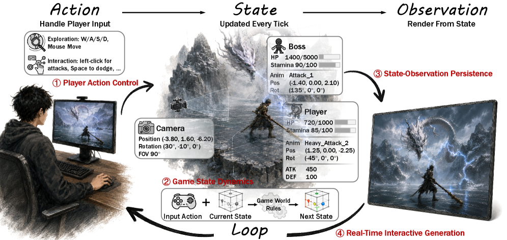
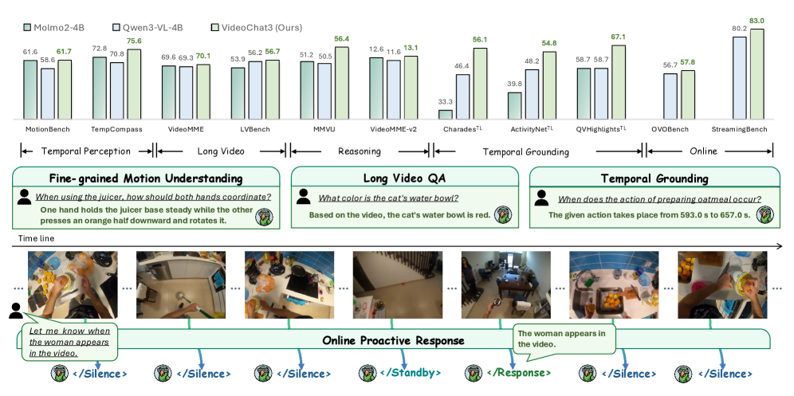
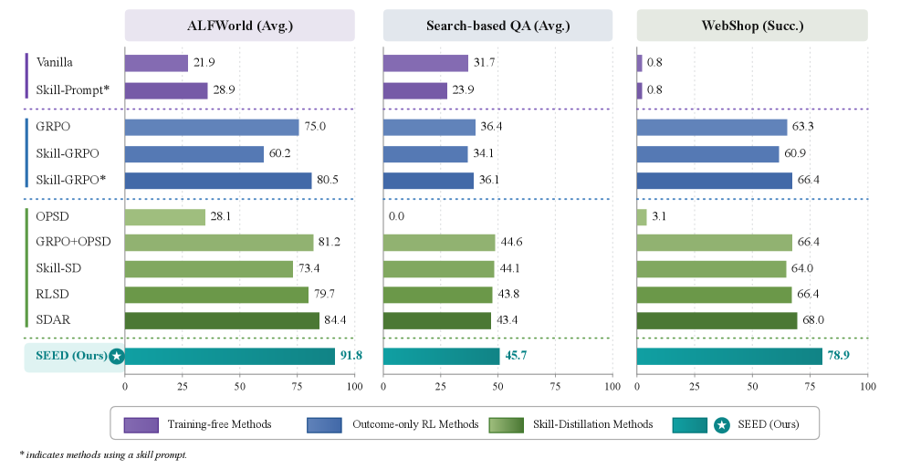
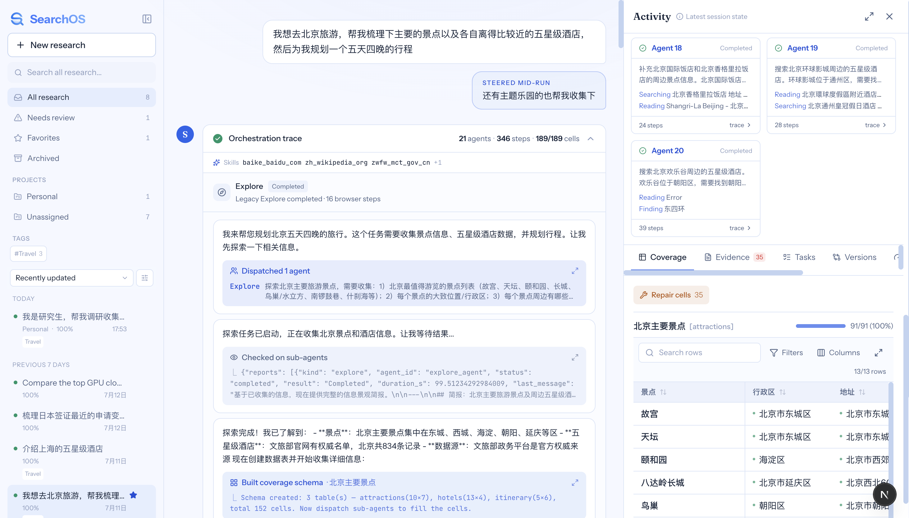
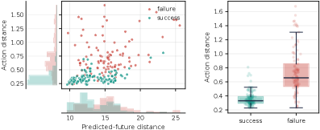
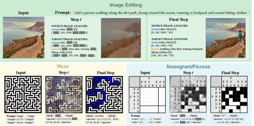
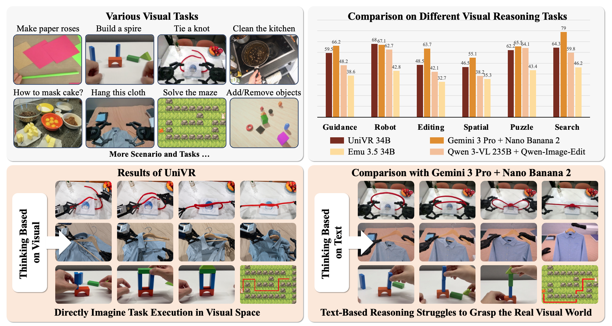
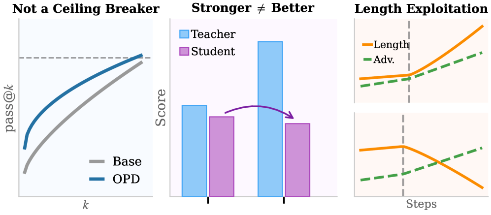
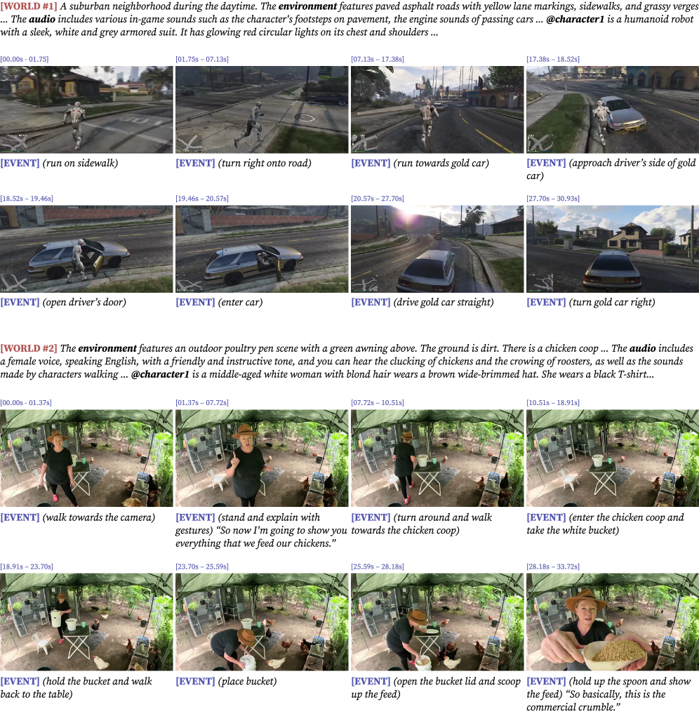

# Daily AI papers — 2026-07-17

*Curated from HF Daily Papers. 15 of ~29 papers kept after relevance filter.*

## Papers at a glance

| # | Title | Topics | Org |
| --- | --- | --- | --- |
| 1 | [From Pixels to States: Rethinking Interactive World Models as Game Engines](#1-from-pixels-to-states) | `world-model`, `video`, `survey` | Alaya Lab |
| 2 | [VideoChat3: Fully Open Video MLLM](#2-videochat3) | `multimodal`, `video`, `MLLM` | Nanjing U. / Shanghai AI Lab |
| 3 | [Seed: Self-Evolving On-Policy Distillation for Agentic RL](#3-seed) | `agents`, `RL`, `distillation` | Tsinghua / Zhejiang / CUHK |
| 4 | [LongStraw: Long-Context RL Beyond 2M Tokens under a Fixed GPU Budget](#4-longstraw) | `RL`, `systems`, `efficient-training` | Mind Lab |
| 5 | [SearchOS-V1: Robust Open-Domain Information-Seeking Agent Collaboration](#5-searchos-v1) | `agents`, `retrieval` | RUC / Ant Group |
| 6 | [BadWAM: When World-Action Models Dream Right but Act Wrong](#6-badwam) | `safety`, `world-model`, `attacks` | NUS / HK PolyU |
| 7 | [CO2 Jump: Self-Correcting Coupled Markov Jump Processes](#7-co2-jump) | `multimodal`, `diffusion`, `generation` | Google DeepMind / Stony Brook |
| 8 | [UniVR: Thinking in Visual Space for Unified Visual Reasoning](#8-univr) | `multimodal`, `RL`, `reasoning` | BJTU / ByteDance |
| 9 | [Spectral Rewiring (SAR) for Exploration, Purification, and Model Merging](#9-sar) | `RL`, `model-merging`, `interp` | Tsinghua AIR / ByteDance Seed |
| 10 | [Demystifying On-Policy Distillation](#10-demystifying-opd) | `RL`, `distillation`, `reasoning` | (not disclosed on HF) |
| 11 | [MeanFlowNFT: Forward-Process RL for Average-Velocity Generators](#11-meanflownft) | `diffusion`, `RL`, `flow-matching` | Tencent Hunyuan / HKUST |
| 12 | [WanSong v1.0 Technical Report](#12-wansong) | `diffusion`, `audio`, `tech-report` | Alibaba (Tongyi) |
| 13 | [DeepLoop: Depth Scaling for Looped Transformers](#13-deeploop) | `architecture`, `looped-transformer` | Princeton / UC |
| 14 | [Byte-Exact KV-State Grafting](#14-kv-state-grafting) | `inference`, `KV-cache` | Sietse Schelpe (solo) |
| 15 | [Wan-Streamer v0.3: Video = World + Event Stream](#15-wan-streamer-v03) | `multimodal`, `video`, `streaming` | Alibaba (Tongyi) |

---

## 1. From Pixels to States

**Authors:** Zian Meng, Shuwei Shi, Mingliang Zhai, Jiaming Tan, Chuanhao Li, Kaipeng Zhang — *Alaya Lab*
**Links:** [arXiv:2607.14076](https://arxiv.org/abs/2607.14076) · [HF](https://huggingface.co/papers/2607.14076) · [AlphaXiv](https://www.alphaxiv.org/abs/2607.14076)
**Topics:** `world-model`, `video`, `survey`

### TL;DR

A structured survey of video-generative "world model" research through the lens of a classical game engine's action → state → observation loop. The authors argue that treating video models as game engines exposes four distinct design axes — action control, state dynamics, state-observation persistence, and real-time generation — and use them to organize existing families of methods. They accompany the survey with a *Black Myth: Wukong* dataset containing 90+ hours of gameplay with frame-aligned player actions, ground-truth game states, structured annotations, and visual observations.

### Key idea

Recast the interactive world model problem as **state-aware** rather than pure pixel prediction: an explicit game state should mediate between action and observation, so that consequences persist across long horizons and rule-following is checkable. Under this lens, most current video WMs collapse the loop into a single pixel-to-pixel functional and inherit the resulting failure modes (rule drift, forgotten commitments, no true real-time loop).

### Main finding

Not a benchmark paper — the finding is taxonomic. The four-axis breakdown groups existing approaches (Genie-style, MineWorld-style, autoregressive-video, diffusion-video, LLM-controlled engines) into families with clearly named strengths/weaknesses. The Wukong dataset provides one of the first open, state-annotated corpora at the scale needed to actually train state-aware WMs — a resource that lets future work compare on rule-conforming metrics, not just FID.

### Why it matters

World models are becoming the training substrate for both robotics VLAs and agentic evaluation of embodied LLMs. The paper reframes progress in the field around *observable game-engine invariants* instead of pixel fidelity, which realigns evaluation with what agents actually need from a WM. The dataset makes the reframing operational.

### Knowledge graph integration

**Builds on / relates to existing pages:**
- [../post-training/reasoning/mcts.md](../post-training/reasoning/mcts.md) — tree search over predicted world states is one candidate for the "state dynamics" axis.

**Suggested new pages:**
- `multimodal/_world-models.md` *(taxonomy)* — a taxonomy over pixel-only vs state-mediated WMs organized by the four axes.
- `multimodal/action-conditioned-video.md` *(depth)* — the state-of-the-art in per-frame action conditioning.

---

## 2. VideoChat3

**Authors:** Xinhao Li, Yuhan Zhu, Xiangyu Zeng, et al. (28 authors) — *Nanjing University, Shanghai AI Laboratory, NTU, Peking University*
**Links:** [arXiv:2607.14935](https://arxiv.org/abs/2607.14935) · [HF](https://huggingface.co/papers/2607.14935) · [AlphaXiv](https://www.alphaxiv.org/abs/2607.14935)
**Topics:** `multimodal`, `video`, `MLLM`

### TL;DR

A fully open 4B-parameter video MLLM aiming to be a *generalist* across motion, long video, and streaming interaction, with all model weights, training code, training strategies, and datasets released. Two key ingredients: an **Inflated 3D Vision Transformer** that turns a 2D image encoder into a temporally-aware video encoder with minimal added parameters, and **adaptive frame resolution** at inference time to handle streaming vs. long-form video from a single checkpoint.

### Key idea

Combine architectural inflation with three curated data mixtures (3M samples total) so that the same 4B model handles fine-grained motion, hour-long video comprehension, and streaming multi-turn dialogue. The adaptive frame-resolution knob is what lets a single model span the streaming/long-form regimes without swapping checkpoints.

### Main finding

At 4B parameters, VideoChat3 matches or exceeds larger open-source video MLLMs across motion, long-video, and streaming benchmarks — while being the first fully open release (weights + training code + all three datasets). Framing is that reproducibility, not just leaderboard scores, is the paper's contribution.

### Why it matters

Video MLLM training remains bottlenecked by dataset opacity — most SOTA models keep at least one of {weights, code, data} private. A fully open 4B baseline resets the reproducibility floor and gives the multimodal community a single controlled starting point for ablations.

### Knowledge graph integration

*The `multimodal/` folder currently has only a README — this paper motivates several standalone pages.*

**Suggested new pages:**
- `multimodal/_video-mllm.md` *(taxonomy)* — a taxonomy over video MLLM architectures (2D-encoder+temporal, native 3D, unified).
- `multimodal/inflated-3d-vit.md` *(depth)* — the specific "inflate a 2D ViT into a temporal 3D ViT" trick.
- `multimodal/adaptive-frame-resolution.md` *(depth)* — the inference-time knob for streaming vs long-form video.

---

## 3. Seed

**Authors:** Jinyang Wu, Shuo Yang, Zhengxi Lu, et al. — *Tsinghua, Zhejiang, CUHK, NTU, Tongji*
**Links:** [arXiv:2607.14777](https://arxiv.org/abs/2607.14777) · [HF](https://huggingface.co/papers/2607.14777) · [AlphaXiv](https://www.alphaxiv.org/abs/2607.14777)
**Topics:** `agents`, `RL`, `distillation`

### TL;DR

A two-stage post-training recipe for agentic LLMs that closes the *supervision gap* between sparse trajectory-level rewards and token-level policy learning. Completed on-policy trajectories are converted into **hindsight skills**, and their behavioral effect is distilled back into the same policy — providing dense token-level guidance jointly optimized with outcome-based RL.

### Key idea

**Self-evolving on-policy distillation**: after each RL rollout, the same trajectory is re-scored under both (a) the ordinary context and (b) a *skill-augmented* context that describes what the trajectory achieved. The action-level KL between these two distributions becomes a dense per-token supervision signal — the model teaches itself which tokens were the "skillful" ones. The RL loss and the self-distillation loss are jointly optimized in the same update.

### Main finding

Across embodied interaction, web navigation, and search-based QA, Seed produces consistent improvements over vanilla agentic RL, with the biggest gains on tasks where trajectories are long and rewards are sparse. The self-evolving loop generalizes without needing a fixed skill vocabulary.

### Why it matters

The sparse-reward, long-trajectory setting is where LLM agents struggle most; single-scalar RL signals give the policy almost no per-token gradient information. Seed shows that hindsight-relabeled *behavior* — not an external teacher — can fill that gap, which is a cheaper alternative to distilling from a frontier model.

### Knowledge graph integration

**Builds on / relates to existing pages:**
- [../post-training/grpo.md](../post-training/grpo.md) — the outcome-RL loss Seed pairs with self-distillation is GRPO-style.
- [../post-training/rlvr.md](../post-training/rlvr.md) — Seed's outcome reward pattern is RLVR-shaped.
- [../post-training/reasoning/long-cot-rl.md](../post-training/reasoning/long-cot-rl.md) — closely related dense-token supervision problem.

**Suggested new pages:**
- `post-training/on-policy-distillation.md` *(depth)* — the general framing that Paper #10 also motivates.
- `agents/hindsight-skill-labeling.md` *(depth)* — the specific relabel-then-distill trick.

---

## 4. LongStraw

**Authors:** Changhai Zhou, Kieran Liu, Yuhua Zhou, et al. — *Mind Lab*
**Links:** [arXiv:2607.14952](https://arxiv.org/abs/2607.14952) · [HF](https://huggingface.co/papers/2607.14952) · [AlphaXiv](https://www.alphaxiv.org/abs/2607.14952)
**Topics:** `RL`, `systems`, `efficient-training`

*(No hero figure — arXiv HTML page did not expose a preview image.)*

### TL;DR

A systems + algorithm co-design for running GRPO with **million-token** contexts on a fixed GPU budget. LongStraw notices that RL post-training has fallen far behind inference: inference runs at million-token contexts while post-training rarely exceeds 256K, so agents must rely on brittle length generalization. LongStraw closes the gap by staging the RL step: evaluate the shared prompt once without autograd, cache the model-specific state that later tokens actually need, then replay each response branch one at a time.

### Key idea

Split the RL step into a **detached prompt pass** and per-response **replay passes**. The prompt-side compute is done without gradients; only the response-side branches carry autograd state. Because responses are short relative to the prompt, this collapses peak memory while trading some replay time — memory becomes O(prompt + one response) instead of O(prompt + G × response).

### Main finding

LongStraw enables >2M-token GRPO RL runs on a *fixed* GPU budget where standard GRPO OOMs at ~256K. Wall-clock cost scales gracefully with response count because prompts and responses are unpacked in the sequence dimension.

### Why it matters

Agentic RL post-training is bottlenecked by trajectory length — tool outputs, observations, and prior decisions all accumulate. This is the first execution stack that lets researchers actually train against the trajectory lengths that deployed agents already encounter, without buying more GPUs.

### Knowledge graph integration

**Builds on / relates to existing pages:**
- [../post-training/grpo.md](../post-training/grpo.md) — LongStraw is instantiated on GRPO's group-rollout structure.
- [../systems/partial-rollouts.md](../systems/partial-rollouts.md) — closely related "don't materialize full trajectories" idea.
- [../systems/dualpipe.md](../systems/dualpipe.md) — sibling piece in the "clever RL/training system" family.

**Suggested new pages:**
- `systems/long-context-rl.md` *(depth)* — the detached-prompt + replay execution pattern.

---

## 5. SearchOS-V1

**Authors:** Junjie Gao, Zhengxian Wu, Jiaming Fan, et al. — *Renmin U. / Ant Group*
**Links:** [arXiv:2607.15257](https://arxiv.org/abs/2607.15257) · [HF](https://huggingface.co/papers/2607.15257) · [AlphaXiv](https://www.alphaxiv.org/abs/2607.15257)
**Topics:** `agents`, `retrieval`

### TL;DR

A multi-agent framework that turns fragile *implicit* search progress into **explicit, persistent shared state**. Open-domain information seeking is reformulated as relational schema completion with grounded citations: agents discover entities, fill attributes across linked tables, and anchor each value to source evidence. A Search-Oriented Context Management layer (Frontier Task, Evidence Graph, Coverage Map, Failure Memory) makes progress inspectable and lets a scheduler pipeline sub-agents against unresolved gaps.

### Key idea

Four externalized data structures do the work: **Frontier Task** (what to search next), **Evidence Graph** (what has been found and where), **Coverage Map** (what fields remain empty), and **Failure Memory** (patterns of searches that returned nothing). A **Search Tool Middleware Harness** intercepts model↔tool interactions to update these structures and detect stalls or budget exhaustion, plus a reusable hierarchical skill system (strategy + access skills) that agents draw on to avoid repeating failed patterns.

### Main finding

SearchOS-V1 leads all metrics vs. evaluated single- and multi-agent baselines on **WideSearch** and **GISA**. The pipeline-parallel scheduling and Failure Memory both contribute measurably.

### Why it matters

Multi-agent search systems today usually let each agent hold private context; when a sub-agent fails, the failure isn't visible elsewhere, and the swarm burns budget rediscovering dead ends. Externalized coverage/failure state is a scalable design that generalizes far beyond information seeking (any long-horizon task with sub-goal decomposition benefits from the same pattern).

### Knowledge graph integration

*The `agents/` folder currently has only a README.*

**Suggested new pages:**
- `agents/_multi-agent-systems.md` *(taxonomy)* — a shape for the multi-agent orchestration space.
- `agents/coverage-map.md` *(depth)* — the externalized-progress data structure pattern.
- `agents/failure-memory.md` *(depth)* — the cross-run failed-pattern memory that avoids search loops.

---

## 6. BadWAM

**Authors:** Qi Li, Xingyi Yang, Xinchao Wang — *NUS / HK PolyU*
**Links:** [arXiv:2607.15207](https://arxiv.org/abs/2607.15207) · [HF](https://huggingface.co/papers/2607.15207) · [AlphaXiv](https://www.alphaxiv.org/abs/2607.15207)
**Topics:** `safety`, `world-model`, `attacks`

### TL;DR

Introduces **World-Action Drift Attacks** — a new class of adversarial attacks against embodied World-Action Models (WAMs). Small visual perturbations decouple the "imagined future" from the actually executed action: the WAM continues to *dream* a plausible outcome (fooling any consistency check that uses the imagination as a witness) while the executed action drifts to something else entirely.

### Key idea

WAMs are marketed as safer than pure policies because you can cross-check the model's imagined future against the executed action. BadWAM shows this cross-check is fragile: a targeted perturbation can preserve the imagined-future output while shifting the action head's decision, breaking the alignment invariant that made WAMs attractive for safety in the first place.

### Main finding

The attack succeeds against multiple WAM checkpoints with imperceptible perturbations, and standard defenses (adversarial training, input smoothing) partially help but don't restore the imagination↔action guarantee.

### Why it matters

The paper undermines a specific safety narrative around VLA / WAM systems — that the imagined future can act as a self-witness for the executed action. It re-motivates external verification (e.g., independent world simulators or hard interlocks) as opposed to intra-model consistency checks for high-stakes embodied deployments.

### Knowledge graph integration

**Builds on / relates to existing pages:**
- [../safety/_attacks.md](../safety/_attacks.md) — new attack class to add to the taxonomy.
- [../safety/cot-monitoring.md](../safety/cot-monitoring.md) — sibling failure of "trust the model's own reasoning trace" as a safety signal.

**Suggested new pages:**
- `safety/world-action-drift-attack.md` *(depth)* — the specific attack family.

---

## 7. CO2 Jump

**Authors:** Armand Comas, Alexandros Lattas, Stylianos Moschoglou, Pedro Vélez, Amit Raj, Aaron Germuth, Thabo Beeler, Dimitris Samaras, Di Qiu — *Google DeepMind / Stony Brook*
**Links:** [arXiv:2607.13188](https://arxiv.org/abs/2607.13188) · [HF](https://huggingface.co/papers/2607.13188) · [AlphaXiv](https://www.alphaxiv.org/abs/2607.13188)
**Topics:** `multimodal`, `diffusion`, `generation`

### TL;DR

A training-free sampler for joint multimodal generation with Masked Diffusion Models. Existing MDMs update text and image tokens either interleaved or in parallel branches that only share prior-step history — never the other modality's *current-step* commitments. Combined with MDMs' inability to remask, this locks cross-modal contradictions in place. CO2 Jump fixes both.

### Key idea

**Self-Correcting Coupled Markov Jump Processes (SC-CMJP):** each modality's transition rate is a functional of the *other* modality's confidence score, weighted by cross-modal attention. A **remasking jump** lets the sampler retract a committed token the moment the other modality's evidence turns against it. CO2 Jump is a training-free single-pass sampler built on SC-CMJP.

### Main finding

Best joint performance on image understanding + editing and on visual reasoning (maze and nonogram solving). Performance scales *monotonically* with the number of denoising steps — evidence that the cross-modal coupling compounds across the trajectory rather than saturating. Three new joint-generation corpora released (JEdit-1M, JMaze-200K, JNono-200K).

### Why it matters

Unified image-understanding + generation is the frontier for multimodal foundation models, and MDMs are the natural substrate. The paper identifies (and fixes) a specific structural gap — no intra-step cross-modal correction — with a training-free intervention, so any existing MDM stack can adopt it.

### Knowledge graph integration

**Suggested new pages:**
- `multimodal/_masked-diffusion-models.md` *(taxonomy)* — the MDM class as a distinct object from continuous diffusion.
- `multimodal/sc-cmjp.md` *(depth)* — the coupled Markov jump sampler with cross-modal transition rates.

---

## 8. UniVR

**Authors:** Yunchao Wei, Yao Zhao, Weibo Gong, Xiao Liu, Anran Wang, Xiangtai Li, Xiaojie Jin — *Beijing Jiaotong / ByteDance*
**Links:** [arXiv:2607.12800](https://arxiv.org/abs/2607.12800) · [HF](https://huggingface.co/papers/2607.12800) · [AlphaXiv](https://www.alphaxiv.org/abs/2607.12800)
**Topics:** `multimodal`, `RL`, `reasoning`

### TL;DR

Learns complex reasoning, fine-grained physical dynamics, and long-horizon planning from **purely visual** demonstrations — no image-text pairs, no task-specific heuristics. UniVR is built around VR-GRPO, a GRPO variant with complementary **global** and **step-level** rewards that enforce both logical coherence across the trajectory and physical consistency at each step.

### Key idea

**VR-GRPO:** decompose the reward into a global logical-coherence signal (whole-trajectory judgment) and a step-level physical-consistency signal (per-step judgment). Both are optimized under the standard GRPO group-baseline update, and the two terms complement each other — global reward alone leaves per-step drifts unpenalized; step-level alone can't enforce cross-step logic. VR-X benchmark accompanies the model.

### Main finding

Up to **25% improvement on VR-X** (a 16-source visual reasoning suite covering long-horizon manipulation, spatial puzzles, physical reasoning). Bonus: the visual-only trained policy transfers to standard multimodal-understanding benchmarks, suggesting broader benefits from pure-vision reasoning training.

### Why it matters

Most multimodal reasoning training uses text as the reasoning substrate (CoT written in language). UniVR shows there's real signal in *visual-space* reasoning that language-based CoT misses — a design lever that's underexplored in current VLM training.

### Knowledge graph integration

**Builds on / relates to existing pages:**
- [../post-training/grpo.md](../post-training/grpo.md) — VR-GRPO is a GRPO variant.
- [../post-training/reasoning/prm.md](../post-training/reasoning/prm.md) — step-level reward pattern.
- [../post-training/reasoning/orm.md](../post-training/reasoning/orm.md) — global-outcome reward pattern.

**Suggested new pages:**
- `post-training/reasoning/vr-grpo.md` *(depth)* — the global-plus-step reward decomposition for visual RL.
- `multimodal/visual-space-reasoning.md` *(depth)* — the "reason in visual tokens, not language tokens" thesis.

---

## 9. SAR (Spectral Rewiring)

**Authors:** Hongli Yu, Huan-ang Gao, Hanlin Wu, Yuxuan Song, Wei-Ying Ma, Ya-Qin Zhang, Hao Zhou — *SIA-Lab (Tsinghua AIR × ByteDance Seed)*
**Links:** [arXiv:2607.03065](https://arxiv.org/abs/2607.03065) · [HF](https://huggingface.co/papers/2607.03065) · [AlphaXiv](https://www.alphaxiv.org/abs/2607.03065)
**Topics:** `RL`, `model-merging`, `interp`

### TL;DR

A post-hoc, training-free editor for dense-full-parameter RL post-training updates. The paper shows the reasoning-effective component of an RL update is concentrated in the base model's **spectral core** — the top singular directions of the pretrained weights. **Subspace-Aligned Rewiring (SAR)** retains the spectral core and removes the orthogonal residue, which (a) preserves reasoning gains, (b) purifies multi-domain training updates, and (c) makes model merging across experts work far better.

### Key idea

Given a post-trained delta W' − W, project it into the top singular subspace of the base W. Keep the projection; discard the orthogonal complement. The orthogonal component is where cross-domain interference and reasoning suppression live; the aligned component is where the actually-useful capability update lives.

### Main finding

- Extracts compact reasoning cores using ~**0.58% of total parameters** while preserving **>99% of post-training performance**.
- Improves high-k exploration on math benchmarks, and improves 6/7 open coding benchmarks on an in-house model.
- Purifies mixed-domain training: releases suppressed coding capability while maintaining math and instruction following.
- Enables model merging across experts that surpasses previous merging baselines and even the best single-domain experts.

### Why it matters

Model merging has been a "does it work?" area; SAR makes it a *reliable* post-training tool by identifying the specific mathematical object (the spectral core of the RL update) that carries capability. It's also a strong empirical claim about the *geometry* of successful post-training updates, which feeds interpretability research.

### Knowledge graph integration

**Builds on / relates to existing pages:**
- [../pre-training/model-souping.md](../pre-training/model-souping.md) — SAR is a spectral-projection variant of model souping / merging.
- [../post-training/rlvr.md](../post-training/rlvr.md) — SAR is applied on top of RLVR updates.
- [../post-training/grpo.md](../post-training/grpo.md) — the RL post-training deltas SAR edits are typically GRPO updates.

**Suggested new pages:**
- `post-training/spectral-rewiring.md` *(depth)* — the SAR editor.
- `pre-training/_model-merging.md` *(taxonomy)* — a taxonomy that would host model-souping, SLERP, task arithmetic, and SAR.

---

## 10. Demystifying On-Policy Distillation

**Authors:** *(not disclosed on HF page)*
**Links:** [arXiv:2607.13399](https://arxiv.org/abs/2607.13399) · [HF](https://huggingface.co/papers/2607.13399) · [AlphaXiv](https://www.alphaxiv.org/abs/2607.13399)
**Topics:** `RL`, `distillation`, `reasoning`

### TL;DR

An analysis paper on On-Policy Distillation (OPD) — the increasingly common recipe of using a teacher to score student rollouts token-by-token. The authors argue OPD acts as an *exploration catalyst*, not a capability-ceiling raiser; then diagnose two failure modes (**Student-Teacher Mismatch** and **Length Exploitation**) and propose two lightweight fixes (**advantage clipping** and **log-scale compression**).

### Key idea

OPD steers the student toward correct reasoning paths via dense token-level guidance, but *only* when the guiding signal is faithful. Two pathologies arise: (1) a large teacher-student distributional gap makes the signal misaligned with correctness — steering into worse paths; (2) the aggregated token-level objective admits length-dependent shortcuts — the student games the reward with truncation or padding. Advantage clipping and log-scale compression regulate the guiding signal so both pathologies disappear.

### Main finding

Across seven benchmarks, the two regulations eliminate length exploitation and stably surpass naive OPD and RLVR baselines. Crucially, the effectiveness of OPD depends on **signal quality**, not teacher scale — bigger teachers alone don't fix the pathologies.

### Why it matters

OPD sits at the intersection of RL post-training and distillation and is used in Seed (#3), R1-style pipelines, and several open reasoning models. This paper's diagnostics turn OPD from folk-practice into a mechanism we can reason about, and its two regulations are drop-in.

### Knowledge graph integration

**Builds on / relates to existing pages:**
- [../post-training/grpo.md](../post-training/grpo.md) — OPD stacks with GRPO-style outcome objectives.
- [../post-training/rlvr.md](../post-training/rlvr.md) — the RLVR baseline that OPD improves over.
- [../post-training/reasoning/length-penalty.md](../post-training/reasoning/length-penalty.md) — sibling fix for length exploitation.

**Suggested new pages:**
- `post-training/on-policy-distillation.md` *(depth)* — the OPD family, including these two regulations. *(Same depth file also serves Paper #3.)*
- `post-training/opd-length-exploitation.md` *(depth)* — the specific failure mode + advantage-clipping / log-scale-compression fixes.

---

## 11. MeanFlowNFT

**Authors:** Yushi Huang, Xiangxin Zhou, Jun Zhang, Liefeng Bo, Tianyu Pang — *Tencent Hunyuan / HKUST*
**Links:** [arXiv:2607.15273](https://arxiv.org/abs/2607.15273) · [HF](https://huggingface.co/papers/2607.15273) · [AlphaXiv](https://www.alphaxiv.org/abs/2607.15273)
**Topics:** `diffusion`, `RL`, `flow-matching`

### TL;DR

Extends **DiffusionNFT** — a forward-process RL objective that avoids reverse-process trajectories and likelihood estimation — to **MeanFlow** generators, which sample by predicting *average* velocities over time intervals instead of instantaneous ones. The bridge is an induced instantaneous-velocity predictor derived from the MeanFlow identity, on which the DiffusionNFT objective is well-defined.

### Key idea

MeanFlow's identity relates average velocity to instantaneous velocity via a boundary correction term. That relationship gives you an implicit instantaneous predictor sitting inside any MeanFlow model. RL on the implicit predictor gives well-defined gradients, but sampling still uses MeanFlow's average-velocity form — so you keep the fast few-step sampling and get RL on top.

### Main finding

Outperforms prior SOTA RL-tuned few-step generators on 6/8 metrics on SD3.5-M and, on several metrics, matches or beats *multi-step* RL-tuned diffusion while using only a few sampling steps. Inherits DiffusionNFT's strict policy-improvement guarantee.

### Why it matters

MeanFlow-style average-velocity generators are the fastest sample-efficient path for consistency/rectified-flow models, but RL fine-tuning has been closed off from them because the objective wasn't well-defined. This paper opens that door — few-step RL-tuned generators are now a realistic deployment target.

### Knowledge graph integration

**Suggested new pages:**
- `multimodal/_flow-matching-rl.md` *(taxonomy)* — a taxonomy for RL applied to flow / diffusion generators (DiffusionNFT, MeanFlowNFT, and existing DPO-for-diffusion).
- `multimodal/meanflow-nft.md` *(depth)* — the induced instantaneous-predictor construction.

---

## 12. WanSong v1.0

**Authors:** Binghui Chen, Pandeng Li, Yu Liu, Jingren Zhou — *Alibaba (Tongyi)*
**Links:** [arXiv:2607.14749](https://arxiv.org/abs/2607.14749) · [HF](https://huggingface.co/papers/2607.14749) · [AlphaXiv](https://www.alphaxiv.org/abs/2607.14749)
**Topics:** `diffusion`, `audio`, `tech-report`

*Borderline: included because it's a full tech report on a diffusion-based generative foundation model (song generation), and the diffusion training + step-distillation recipe is transferable to other modalities.*

### TL;DR

A **pure diffusion** foundation model for long-form (up to 5-minute) commercial-grade song generation, generating dual stems (vocals + backing music) in a single run, with multilingual support. Contrasts with autoregressive and AR-then-diffusion cascades. Fast inference via step distillation; supports downstream editing via lightweight fine-tuning.

### Key idea

A single-shot diffusion generator over the full-song latent — not autoregressive over segments, not cascaded (AR then diffuse). The system is engineered end-to-end for high-fidelity, long-duration generation and treats step-distillation as a first-class deployment tool, not an afterthought.

### Main finding

Delivers commercial-grade 5-minute song generation with dual-stem output, matching or beating cascaded pipelines on subjective quality metrics while running significantly faster after step-distillation.

### Why it matters

The AR-vs-diffusion tradeoff for long-form generative audio has been in flux; WanSong makes a strong empirical case for the pure-diffusion side by demonstrating both quality and speed. The training + step-distillation recipe generalizes to any long-form generative modality.

### Knowledge graph integration

*Audio generation is out of the current KG scope, so no direct cross-links. The step-distillation recipe is the transferable idea.*

**Suggested new pages:**
- `multimodal/step-distillation-for-diffusion.md` *(depth)* — the general "compress the sampling schedule via distillation" recipe applied here.

---

## 13. DeepLoop

**Authors:** Shuzhen Li, Yifan Zhang, Jiacheng Guo, Quanquan Gu, Mengdi Wang — *Princeton / UC*
**Links:** [arXiv:2607.13491](https://arxiv.org/abs/2607.13491) · [HF](https://huggingface.co/papers/2607.13491) · [AlphaXiv](https://www.alphaxiv.org/abs/2607.13491)
**Topics:** `architecture`, `looped-transformer`

### TL;DR

Correct residual scaling for **Looped Transformers** — architectures that increase unrolled depth by re-visiting a shared physical block, so parameters are tied across depths. The paper derives a first-order perturbation bound controlled by a *visit-alignment coefficient* κ_R, showing that the DeepNorm exponent must increase from **1/4** to **1/2** as loop count grows at fixed physical depth. The concrete recipe: α = (2N)^{1/2}, β = (8N)^{-1/2} for unrolled depth N.

### Key idea

In untied Transformers each residual branch has its own parameters and its own gradient; DeepNorm's 1/4 exponent works. In looped Transformers, one shared parameter aggregates gradients across all visits and is *read back* by those same visits in the next forward pass — the visits are aligned. Aligned visits break the DeepNorm assumption; scale the residuals to 1/2 exponent to compensate.

### Main finding

DeepLoop is **neutral** when no physical block is revisited (no regression) but **improves** validation loss and downstream accuracy as recurrent depth is activated, at GPT-2 small and medium scales. Stable recurrent depth is now possible without the training-stability hacks earlier papers needed.

### Why it matters

Looped Transformers are one of the plausible routes to test-time-scaled reasoning without paying weight-count cost. But every prior looped variant has had residual-scaling instabilities that limited how deep you could unroll. DeepLoop gives a principled recipe that removes the ceiling.

### Knowledge graph integration

**Builds on / relates to existing pages:**
- [../architectures/_normalization.md](../architectures/_normalization.md) — DeepNorm variant lives in the normalization taxonomy.
- [../architectures/reordered-norm.md](../architectures/reordered-norm.md) — sibling residual-scaling design decision.
- [../pre-training/_training-stability.md](../pre-training/_training-stability.md) — training-stability lens on why the scaling matters.

**Suggested new pages:**
- `architectures/looped-transformer.md` *(depth)* — the looped Transformer architecture itself.
- `architectures/deep-loop-scaling.md` *(depth)* — the specific α/β recipe.

---

## 14. Byte-Exact KV-State Grafting

**Authors:** Sietse Schelpe (sole author) — *(affiliation not disclosed on HF page)*
**Links:** [arXiv:2607.14431](https://arxiv.org/abs/2607.14431) · [HF](https://huggingface.co/papers/2607.14431) · [AlphaXiv](https://www.alphaxiv.org/abs/2607.14431)
**Topics:** `inference`, `KV-cache`

*(No hero figure — arXiv HTML page did not expose a preview image.)*

### TL;DR

Argues you can lift a frozen small model's capability *without touching weights or buying accelerators*: verified knowledge is deposited **once** as a byte-exact key-value state artifact, and later **restored by graft** into a fresh inference context. The deposit modifies no weights. The restore is byte-exact under a pinned deterministic configuration — SHA-256 equality with fresh recomputation across trials.

### Key idea

Treat the model's per-layer KV cache after processing "verified knowledge" as a *portable artifact*. When new inference sessions come in, graft the artifact back into the new session's KV cache — bit-exact restoration means the downstream logits are indistinguishable from having reprocessed the source text. The engineering trick is guaranteeing byte-exactness under a real accelerator's non-determinism.

### Main finding

- Grafted logit vector is byte-for-byte identical to fresh computation (SHA-256 equality across trials).
- KL divergence from freshly computed distribution is **zero** across 50 samples; 100% argmax agreement.
- A 12B model becomes measurably more capable and dramatically cheaper *simultaneously* — the "flywheel" is the ability to reuse verified state across sessions.

### Why it matters

If bit-exact KV-state grafting is real at deployment scale, it changes the amortized cost of retrieval-augmented / long-context inference: any expensive one-shot computation over a long document becomes a reusable artifact instead of an ephemeral cache. The paper is single-author and the engine is proprietary — the community should reproduce and stress-test.

### Knowledge graph integration

*The `inference/` folder currently has only a README.*

**Suggested new pages:**
- `inference/_kv-cache.md` *(taxonomy)* — a taxonomy over KV-cache techniques (compression, paging, sharing, grafting).
- `inference/kv-state-grafting.md` *(depth)* — the byte-exact deposit+restore recipe.

---

## 15. Wan-Streamer v0.3

**Authors:** Lianghua Huang (corresponding) + large multi-author team — *Alibaba (Tongyi)*
**Links:** [arXiv:2607.15038](https://arxiv.org/abs/2607.15038) · [HF](https://huggingface.co/papers/2607.15038) · [AlphaXiv](https://www.alphaxiv.org/abs/2607.15038)
**Topics:** `multimodal`, `video`, `streaming`

### TL;DR

Recasts video as **World + Event Stream**: a native-streaming interaction model where the *world* provides scene state and the *event stream* injects per-frame controllable events. Wan-Streamer v0.3 preserves the v0.2 operating point (640×368 @ 25 FPS) while adding an organizing lens that specializes cleanly to a broad family of real-time downstream tasks.

### Key idea

Decouple the *scene* from the *events*. The world model is trained to represent persistent context; the event stream carries the transient signals (actions, edits, camera moves) that steer generation each frame. Because the split is native to training — not a post-hoc control adapter — a single trained model specializes to many downstream real-time tasks without task-specific fine-tuning.

### Main finding

The v0.3 formulation specializes to multiple real-time video tasks (streaming interactive generation, controllable editing, action-conditioned rollouts) from a single checkpoint — at the same 25 FPS / 640×368 operating point as v0.2.

### Why it matters

Sibling to Paper #1's four-axis view of world models — Wan-Streamer picks a specific factorization (world + event stream) and shows it operationalizes into a real streaming system. Together they push the field toward *state-aware, real-time* video generation as the frontier.

### Knowledge graph integration

**Suggested new pages:**
- `multimodal/streaming-video-generation.md` *(depth)* — the world-plus-event-stream factorization and its real-time properties.
- `multimodal/_world-models.md` *(taxonomy)* — same taxonomy suggested by Paper #1; Wan-Streamer sits in one of its cells.

---

## Notes

- Borderline inclusions are flagged in-section with an italic *Borderline: …* note (Paper #12 WanSong).
- Hero figures live in `assets/2026-07-17/`. Papers 4 (LongStraw), 14 (KV-State Grafting), and 15's neighbors that had no arXiv HTML preview: LongStraw and KV-State Grafting are missing figures; TTCD was dropped from the final list.
- This digest is informational. No existing concept files, `READING-LIST.md`, or `PAPERS.md` were modified to produce it.
