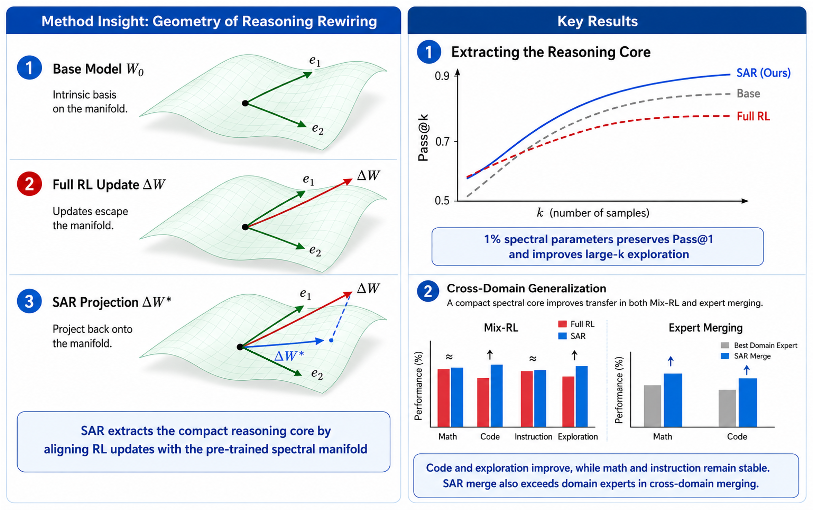
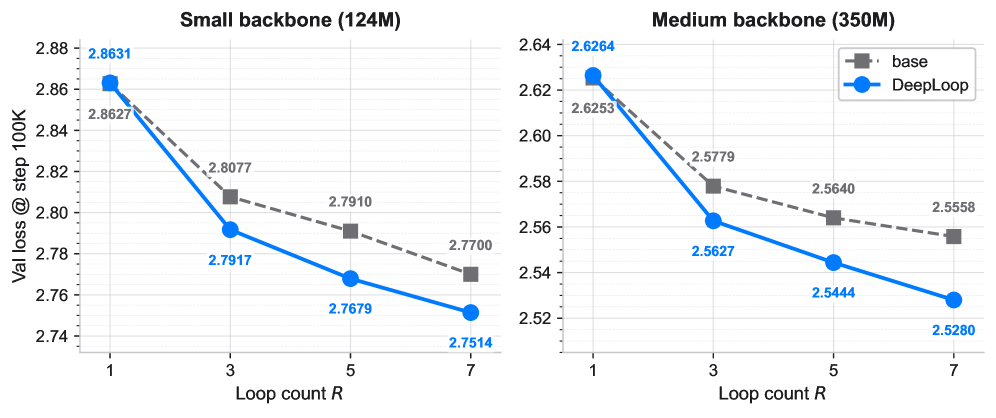
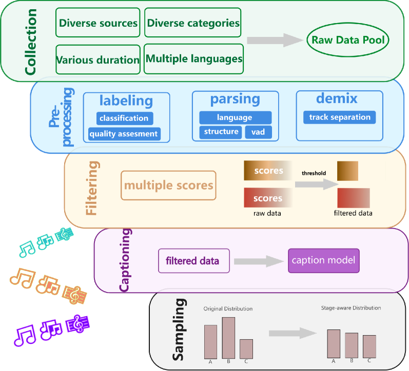

# Daily AI papers — 2026-07-18

*Curated from HF Daily Papers. 15 of ~29 papers kept after relevance filter.*

## Papers at a glance

| # | Title | Topics | Org |
| --- | --- | --- | --- |
| 1 | [From Pixels to States: Rethinking Interactive World Models as Game Engines](#1-from-pixels-to-states) | `world-models`, `taxonomy`, `multimodal` | Alaya Lab |
| 2 | [LongStraw: Long-Context RL Beyond 2M Tokens under a Fixed GPU Budget](#2-longstraw) | `RL`, `long-context`, `systems` | Mind Lab |
| 3 | [VideoChat3: Fully Open Video MLLM for Efficient and Generalist Video Understanding](#3-videochat3) | `multimodal`, `video`, `MLLM` | Nanjing U. / Shanghai AI Lab |
| 4 | [Seed: Self-Evolving On-Policy Distillation for Agentic RL](#4-seed) | `agents`, `RL`, `distillation` | Tsinghua / ZJU / CUHK |
| 5 | [SearchOS-V1: Robust Open-Domain Information-Seeking Agent Collaboration](#5-searchos-v1) | `agents`, `RAG`, `multi-agent` | RUC / Ant Group |
| 6 | [BadWAM: When World-Action Models Dream Right but Act Wrong](#6-badwam) | `safety`, `world-models`, `adversarial` | NUS / HK PolyU |
| 7 | [Thinking in Visual Space for Unified Visual Reasoning (UniVR)](#7-univr) | `multimodal`, `RL`, `reasoning` | BJTU / ByteDance |
| 8 | [Spectral Rewiring for Exploration, Purification, and Model Merging](#8-spectral-rewiring) | `RL`, `model-merging`, `reasoning` | Tsinghua AIR / ByteDance Seed |
| 9 | [RxBrain: Embodied Cognition Foundation Model with Joint Language-Visual Reasoning](#9-rxbrain) | `multimodal`, `agents`, `reasoning` | Anonymous consortium |
| 10 | [Video = World + Event Stream (Wan-Streamer v0.3)](#10-wan-streamer) | `diffusion`, `video`, `streaming` | Wan / Alibaba |
| 11 | [Demystifying On-Policy Distillation: Roles, Pathologies, and Regulations](#11-demystifying-opd) | `distillation`, `RL`, `analysis` | Anonymous |
| 12 | [DeepLoop: Depth Scaling for Looped Transformers](#12-deeploop) | `architectures`, `scaling` | Princeton / UC |
| 13 | [WanSong v1.0 Technical Report](#13-wansong) | `diffusion`, `audio`, `tech-report` | Alibaba |
| 14 | [MeanFlowNFT: Forward-Process RL to Average-Velocity Generators](#14-meanflownft) | `diffusion`, `RL`, `flow-matching` | Tencent Hunyuan / HKUST |
| 15 | [Byte-Exact KV-State Grafting: A Frozen Small Model as a Verified-Knowledge Flywheel](#15-kv-grafting) | `efficient-inference`, `KV-cache` | Independent |

---

## 1. From Pixels to States

**Authors:** Zian Meng, Shuwei Shi, Mingliang Zhai, Jiaming Tan, Chuanhao Li, Kaipeng Zhang — *Alaya Lab*
**Links:** [arXiv:2607.14076](https://arxiv.org/abs/2607.14076) · [HF](https://huggingface.co/papers/2607.14076) · [AlphaXiv](https://www.alphaxiv.org/abs/2607.14076)
**Topics:** `world-models`, `taxonomy`, `multimodal`

### TL;DR

Position paper reframing interactive video world models around the classical game-engine loop of *action → state → observation*. The authors argue that today's pixel-only video generators skip the explicit state layer that real engines depend on, then propose a four-axis taxonomy (player-action control, state dynamics, state-observation persistence, real-time generation) to compare existing families. They also release a *Black Myth: Wukong* corpus with 90+ hours of gameplay carrying frame-aligned player actions, ground-truth engine state, and RGB observations.

### Key idea

Treat any interactive world model as a *stateful* transition function `s_{t+1}, o_{t+1} = f(s_t, a_t)` and evaluate variants along how they represent `s`, how faithfully `o` reflects `s`, whether `s` persists across occlusion, and whether the loop meets real-time budgets. This exposes why pure video diffusion collapses on physics-heavy Wukong sequences: the model has no explicit `s` to preserve.

### Main finding

Categorizes existing systems (Sora-style video, action-conditioned video, latent-state world models, hybrid) along the four axes and quantifies persistence failures on Wukong. Provides the first frame-aligned action+state+observation dataset for a modern action game at 90+ hours.

### Why it matters

Fixes a taxonomy gap: "world model" has been used for everything from Sora to Dreamer. Anchoring the field around action-state-observation matches the engine community's vocabulary and gives evaluators a way to grade *game-quality* world models on state persistence, not just perceptual FID.

### Knowledge graph integration

**Builds on / relates to existing pages:**
- [../multimodal/README.md](../multimodal/README.md) — extends video generation into interactive, action-conditioned generation.

**Suggested new pages:**
- `multimodal/_world-models.md` *(taxonomy)* — action-state-observation axis, video-only vs latent-state vs hybrid variants.
- `multimodal/action-conditioned-video.md` *(depth)* — the video-generation family under this taxonomy.

---

## 2. LongStraw

**Authors:** Changhai Zhou, Kieran Liu, Yuhua Zhou, Qian Qiao, Jun Gao, Harry Zhang, et al. — *Mind Lab*
**Links:** [arXiv:2607.14952](https://arxiv.org/abs/2607.14952) · [HF](https://huggingface.co/papers/2607.14952) · [AlphaXiv](https://www.alphaxiv.org/abs/2607.14952)
**Topics:** `RL`, `long-context`, `systems`

### TL;DR

Architecture-aware execution stack that pushes GRPO post-training to >2M-token contexts under a fixed GPU budget, closing the gap between million-token inference and 256K-token training. The system rearranges rollout scheduling, activation memory, and gradient accumulation around long trajectories so a single fixed cluster can hold sequences an order of magnitude longer than baseline stacks.

### Key idea

Two decoupled pieces: (1) an architecture-aware execution planner that co-schedules rollout collection and gradient steps for long sequences (partial rollouts, sequence-parallel gradients, activation offload) and (2) an instantiation on Group Relative Policy Optimization so gradient variance from short reference groups stays sane at 2M+ tokens.

### Main finding

Reports stable RL training beyond 2M tokens under the same GPU budget that prior stacks use for 256K, on agentic tasks where observations, tool outputs, and prior decisions accumulate over long horizons.

### Why it matters

Post-training length has been the choke point for long-horizon agents — deployment contexts far outpace training contexts, and models rely on length generalization to bridge the gap. Bringing RL training to inference-scale lengths removes that split.

### Knowledge graph integration

**Builds on / relates to existing pages:**
- [../post-training/grpo.md](../post-training/grpo.md) — instantiated on GRPO; extends it to million-token sequence groups.
- [../systems/partial-rollouts.md](../systems/partial-rollouts.md) — long-context RL depends on partial-rollout scheduling.
- [../post-training/reasoning/long-cot-rl.md](../post-training/reasoning/long-cot-rl.md) — same regime, but LongStraw targets agentic trajectories rather than reasoning CoT.

**Suggested new pages:**
- `systems/long-context-rl.md` *(depth)* — execution-stack techniques for million-token RL.

---

## 3. VideoChat3

**Authors:** Xinhao Li, Yuhan Zhu, Xiangyu Zeng, Yuhao Dong, Haoning Wu, et al. — *Nanjing U. / Shanghai AI Lab / NTU / PKU*
**Links:** [arXiv:2607.14935](https://arxiv.org/abs/2607.14935) · [HF](https://huggingface.co/papers/2607.14935) · [AlphaXiv](https://www.alphaxiv.org/abs/2607.14935)
**Topics:** `multimodal`, `video`, `MLLM`

### TL;DR

Fully open video MLLM covering motion understanding, long video, and streaming interaction with weights, training code, training recipe, and complete training data released. Positioned as the reproducible foundation for the open-source video-LLM stack.

### Key idea

A unified vision-language recipe that spans (a) short-clip motion, (b) long-context video, and (c) online streaming interaction, all in one model. Explicit emphasis on releasing the *training-data mixture* — most rivals ship weights only.

### Main finding

Generalist coverage across the three video regimes in a single model, with all training artifacts open so downstream labs can reproduce and iterate.

### Why it matters

Video-LLM research is still gated by data access; fully-open releases at this scope are rare. Makes streaming and long-video capability accessible outside the biggest video-data holders.

### Knowledge graph integration

**Builds on / relates to existing pages:**
- [../multimodal/README.md](../multimodal/README.md) — extends the multimodal folder toward video and streaming.

**Suggested new pages:**
- `multimodal/video-mllm.md` *(depth)* — architecture and training recipe for open video MLLMs (VideoChat3 as anchor).

---

## 4. Seed

**Authors:** Jinyang Wu, Shuo Yang, Zhengxi Lu, Fan Zhang, Yuhao Shen, et al. — *Tsinghua / ZJU / CUHK / NTU / Tongji*
**Links:** [arXiv:2607.14777](https://arxiv.org/abs/2607.14777) · [HF](https://huggingface.co/papers/2607.14777) · [AlphaXiv](https://www.alphaxiv.org/abs/2607.14777)
**Topics:** `agents`, `RL`, `distillation`

### TL;DR

Self-Evolving On-Policy Distillation for agentic RL. The framework converts *completed* on-policy trajectories into training-time "hindsight skills" and distills their behavioral effect back into the policy — using the agent's own successful runs as a dense signal to bridge the gap between sparse trajectory-level rewards and token-level updates.

### Key idea

Instead of relying only on outcome reward, treat each successful trajectory as a *skill demonstration* and distill it back with dense token supervision. The teacher signal is generated *by the current policy*, so the loop is self-evolving with no fixed teacher required.

### Main finding

Reports gains over vanilla outcome-based RL (PPO/GRPO-style) on long-horizon agent benchmarks, attributed to denser intermediate supervision derived from the policy's own good rollouts.

### Why it matters

Agentic RL is bottlenecked by sparse rewards on long trajectories. Reusing your own good rollouts as hindsight demonstrations reduces the need for an external teacher, which is the usual failure mode of distillation-for-agents recipes.

### Knowledge graph integration

**Builds on / relates to existing pages:**
- [../post-training/_rl.md](../post-training/_rl.md) — variant of on-policy RL for agent settings.
- [../post-training/rejection-sampling.md](../post-training/rejection-sampling.md) — hindsight skill extraction is a richer form of rejection-sampling-based self-training.
- [../post-training/grpo.md](../post-training/grpo.md) — layered on top of GRPO-style on-policy updates.

**Suggested new pages:**
- `post-training/on-policy-distillation.md` *(depth)* — the OPD family, with Seed as one member.
- `agents/agentic-rl.md` *(depth)* — RL recipes tailored to long-horizon agent trajectories.

---

## 5. SearchOS-V1

**Authors:** Junjie Gao, Zhengxian Wu, Jiaming Fan, Jin Zhang, Shihan Ma, et al. — *Renmin University / Ant Group*
**Links:** [arXiv:2607.15257](https://arxiv.org/abs/2607.15257) · [HF](https://huggingface.co/papers/2607.15257) · [AlphaXiv](https://www.alphaxiv.org/abs/2607.15257)
**Topics:** `agents`, `RAG`, `multi-agent`

### TL;DR

A system-level multi-agent framework for open-domain information-seeking that turns implicit search progress (buried in interaction history) into *explicit, persistent, shared state* across agents. Designed to keep tool-integrated LLMs from falling into repetitive-search loops when early attempts fail.

### Key idea

Externalize the search state — visited queries, extracted evidence, open sub-questions — into a shared blackboard that every agent reads from and writes to, rather than letting each agent re-derive progress from its own scrolling context. The blackboard is the OS layer of "SearchOS".

### Main finding

Reduces repetitive-loop failures on long-horizon information-seeking benchmarks compared to single-agent and prior multi-agent baselines; better budget utilization on hard queries where naive systems burn tokens re-issuing similar queries.

### Why it matters

Deep-research agents fail not because they can't search but because they *forget what they already searched*. Making progress state a first-class shared artifact is a cheap fix that generalizes across underlying LLMs and tool APIs.

### Knowledge graph integration

**Builds on / relates to existing pages:**
- [../agents/README.md](../agents/README.md) — a multi-agent orchestration pattern for tool-integrated LLMs.

**Suggested new pages:**
- `agents/shared-state-multi-agent.md` *(depth)* — blackboard/shared-state coordination for multi-agent search systems.
- `agents/deep-research-agents.md` *(depth)* — information-seeking agent design (search budgets, evidence tracking).

---

## 6. BadWAM

**Authors:** Qi Li, Xingyi Yang, Xinchao Wang — *NUS / HK PolyU*
**Links:** [arXiv:2607.15207](https://arxiv.org/abs/2607.15207) · [HF](https://huggingface.co/papers/2607.15207) · [AlphaXiv](https://www.alphaxiv.org/abs/2607.15207)
**Topics:** `safety`, `world-models`, `adversarial`

### TL;DR

Introduces *World-Action Drift Attacks*: tiny visual perturbations that keep a World-Action Model's *imagined* future looking correct while its executed action drifts. The paper positions WAM's action↔imagination coupling as fragile safety cover — the imagined future is not a reliable check on the executed action under adversarial input.

*Borderline: included because it introduces a new adversarial attack class on embodied foundation models, so it lands in safety rather than pure robotics.*

### Key idea

Optimize an imperceptible pixel-space perturbation that leaves the imagined next state visually plausible (so any "imagination-as-safety-check" passes) but shifts the joint action distribution off-manifold. The attack exploits the fact that action and imagination heads share a backbone but decouple at the head.

### Main finding

Unified BadWAM framework demonstrates high attack success on several WAM checkpoints while their imagined next-frames remain indistinguishable to human raters and to imagination-based anomaly detectors.

### Why it matters

Undercuts a common safety story for embodied FMs ("we can validate the action against the model's own predicted future"). If imagination and action can be decoupled by ε-bounded perturbations, that check is not a moat.

### Knowledge graph integration

**Builds on / relates to existing pages:**
- [../safety/_attacks.md](../safety/_attacks.md) — new adversarial attack class targeting embodied FMs.
- [../safety/cot-monitoring.md](../safety/cot-monitoring.md) — WAM imagination-monitoring is the embodied analogue of CoT monitoring; both fail under adversarial pressure.

**Suggested new pages:**
- `safety/world-action-drift-attack.md` *(depth)* — the BadWAM attack construction and empirical results.

---

## 7. UniVR

**Authors:** Yunchao Wei, Yao Zhao, Weibo Gong, Xiao Liu, Anran Wang, Xiangtai Li, Xiaojie Jin — *BJTU / ByteDance*
**Links:** [arXiv:2607.12800](https://arxiv.org/abs/2607.12800) · [HF](https://huggingface.co/papers/2607.12800) · [AlphaXiv](https://www.alphaxiv.org/abs/2607.12800)
**Topics:** `multimodal`, `RL`, `reasoning`

### TL;DR

Learns complex reasoning, fine-grained physical dynamics, and long-horizon planning from *pure visual demonstrations* — no image-text pairs. Core mechanism is VR-GRPO, a GRPO variant with paired global outcome rewards and per-step local rewards enforcing logical and physical consistency inside the visual reasoning chain.

### Key idea

VR-GRPO: keep the group-relative baseline of GRPO but score each rollout at *two* granularities — a global reward on final task success and step-level rewards that check physical consistency of intermediate imagined frames. Removes the need for task-specific heuristics or paired language supervision.

### Main finding

+25% on VR-X (a new 16-source visual-reasoning benchmark spanning manipulation, spatial puzzles, and physical reasoning) and side-benefit improvements on standard multimodal understanding benchmarks.

### Why it matters

Pushes RL past text — the group-relative recipe generalizes cleanly to reasoning chains that live entirely in pixel space. Suggests visual chains-of-thought can be trained without any language supervision, which is a live open question.

### Knowledge graph integration

**Builds on / relates to existing pages:**
- [../post-training/grpo.md](../post-training/grpo.md) — VR-GRPO is a step-reward-augmented GRPO in visual space.
- [../post-training/reasoning/prm.md](../post-training/reasoning/prm.md) — step-level rewards on visual reasoning trajectories.
- [../multimodal/README.md](../multimodal/README.md) — visual-space reasoning fits the multimodal folder.

**Suggested new pages:**
- `post-training/reasoning/visual-cot-rl.md` *(depth)* — RL for pure-visual reasoning chains, VR-GRPO as anchor.
- `evaluation/vr-x.md` *(depth)* — the VR-X benchmark for cross-source visual reasoning.

---

## 8. Spectral Rewiring

**Authors:** Hongli Yu, Huan-ang Gao, Hanlin Wu, Yuxuan Song, Wei-Ying Ma, Ya-Qin Zhang, Hao Zhou — *SIA-Lab of Tsinghua AIR & ByteDance Seed*
**Links:** [arXiv:2607.03065](https://arxiv.org/abs/2607.03065) · [HF](https://huggingface.co/papers/2607.03065) · [AlphaXiv](https://www.alphaxiv.org/abs/2607.03065)
**Topics:** `RL`, `model-merging`, `reasoning`

### TL;DR

Post-hoc editing method that keeps the *spectral core* of an RL post-training update aligned with the base model's principal subspace and discards orthogonal components. Reduces the two RL bottlenecks the paper names: premature saturation of test-time scaling, and cross-domain interference when merging RL-trained checkpoints.

### Key idea

Project the RL fine-tune's Δθ onto the base model's dominant spectral directions (Subspace-Aligned Rewiring, SAR), keep the aligned component, drop the rest. The kept component carries most of the reasoning gain; the discarded orthogonal residual is what suppresses test-time scaling and clashes with other domain fine-tunes at merge time.

### Main finding

SAR preserves single-domain reasoning gains while cutting interference during multi-domain training and post-hoc model merging. Positioned as a general RL "cleanup" pass rather than a training-time regularizer.

### Why it matters

Model merging is now the standard way big labs combine specialists into a release; RL updates have been the roughest partners at merge time. Isolating "the part of the RL update that actually reasoned" gives a principled account of what's safe to keep.

### Knowledge graph integration

**Builds on / relates to existing pages:**
- [../pre-training/model-souping.md](../pre-training/model-souping.md) — SAR is a merging-friendly preprocessing step for RL checkpoints.
- [../post-training/_rl.md](../post-training/_rl.md) — post-hoc edit of RL updates.
- [../post-training/reasoning/long-cot-rl.md](../post-training/reasoning/long-cot-rl.md) — targets the saturation of long-CoT RL.

**Suggested new pages:**
- `post-training/spectral-rewiring.md` *(depth)* — the SAR editing procedure.
- `pre-training/_model-merging.md` *(taxonomy)* — souping, task arithmetic, TIES, SAR — the merging landscape.

---

## 9. RxBrain

**Authors:** Haotian Liang, Mingkang Chen, Yufei Huang, Yuchun Guo, Xiaomeng Zhu, et al. — *Affiliations not disclosed on HF page*
**Links:** [arXiv:2607.14187](https://arxiv.org/abs/2607.14187) · [HF](https://huggingface.co/papers/2607.14187) · [AlphaXiv](https://www.alphaxiv.org/abs/2607.14187)
**Topics:** `multimodal`, `agents`, `reasoning`

### TL;DR

An embodied cognition foundation model that represents plans as a *single interleaved sequence* of language reasoning tokens and visual imagination tokens, rather than treating vision-language understanding and generative world modeling as separate stacks. The claim is that alternating modalities inside one sequence lets language steer imagination and imagined visuals ground language.

*Borderline: included because it's a foundation-model architecture recipe (unified planning sequence), not a robotics-only paper.*

### Key idea

One decoder produces a mixed stream of `<text> <image-latent> <text> <image-latent> …` tokens; the same self-attention mixes across modalities so intermediate visual imaginings are usable as reasoning steps and the language stream can request or refine them.

### Main finding

Positions RxBrain as a unified alternative to (a) VLMs that mainly *understand* scenes and (b) world models that mainly *predict* frames. Reports gains on embodied planning where both are needed.

### Why it matters

If interleaved language+imagination sequences generalize, the current split between "VLM understanding" and "video world model" collapses into one architecture — which matters for both agents and generative video research.

### Knowledge graph integration

**Builds on / relates to existing pages:**
- [../multimodal/README.md](../multimodal/README.md) — extends multimodal decoding toward interleaved text+image generation.
- [../agents/README.md](../agents/README.md) — embodied planning as a foundation-model target.

**Suggested new pages:**
- `multimodal/interleaved-generation.md` *(depth)* — single-decoder text+visual-imagination sequences.

---

## 10. Wan-Streamer

**Authors:** Lianghua Huang, Zhi-Fan Wu, Yupeng Shi, Wei Wang, Mengyang Feng, et al. — *Wan / Alibaba*
**Links:** [arXiv:2607.15038](https://arxiv.org/abs/2607.15038) · [HF](https://huggingface.co/papers/2607.15038) · [AlphaXiv](https://www.alphaxiv.org/abs/2607.15038)
**Topics:** `diffusion`, `video`, `streaming`

### TL;DR

Reframes native-streaming interactive video as *video = world + event stream*: a persistent "world" (scene, subjects, ambient conditions) plus a fast-updating "event" stream (per-frame local actions and changes). The v0.3 model of Alibaba's Wan-Streamer line explicitly separates the two so long streaming sessions don't drift as new events arrive.

### Key idea

Decompose the input to a streaming video generator into (a) a slowly-changing world context and (b) an event stream. Different conditioning pathways for each so the model doesn't have to rediscover the persistent world from the event tokens on every step.

### Main finding

Longer stable streaming sessions with fewer drift artifacts than a unified-conditioning baseline; the world/event split maps naturally onto the streaming interaction target.

### Why it matters

Streaming video generation has struggled with world drift on long horizons — the model quietly rewrites the scene as it goes. Making "world" a first-class persistent object matches how humans and game engines think about video and gives a clean surface for interaction.

### Knowledge graph integration

**Builds on / relates to existing pages:**
- [../multimodal/README.md](../multimodal/README.md) — extends the multimodal video-generation stack toward streaming.

**Suggested new pages:**
- `multimodal/streaming-video-generation.md` *(depth)* — world+event-stream decomposition for interactive streaming.

---

## 11. Demystifying On-Policy Distillation

**Authors:** Not disclosed on HF/arXiv HTML — *anonymous under review*
**Links:** [arXiv:2607.13399](https://arxiv.org/abs/2607.13399) · [HF](https://huggingface.co/papers/2607.13399) · [AlphaXiv](https://www.alphaxiv.org/abs/2607.13399)
**Topics:** `distillation`, `RL`, `analysis`

### TL;DR

A systematic analysis of On-Policy Distillation (OPD) in LLM post-training. Frames OPD as an *exploration catalyst* that steers the student toward correct reasoning paths without lifting its capability ceiling, then names two pathologies (Student-Teacher Mismatch, Length Exploitation) and proposes two lightweight regulations (advantage clipping, log-scale compression) that eliminate them.

### Key idea

Prompt diversity dominates over per-problem sample count for OPD gains; the effectiveness of OPD is entirely gated by *guiding-signal quality*, not teacher scale. A too-large teacher misaligns the token-level distillation objective with task correctness (mismatch); the aggregated objective also creates length-dependent shortcuts (length exploitation). Clip the advantage and log-compress the token loss to defang both.

### Main finding

Across seven benchmarks, the two regulations stably surpass naive OPD and RLVR baselines, and length-exploitation shortcuts disappear. Teacher scale is confirmed to be secondary to signal regulation.

### Why it matters

OPD has become a standard trick alongside RLVR in post-training, but recipes were folklore. Naming the failure modes and giving cheap fixes reframes OPD as a signal-quality problem, not a scale problem.

### Knowledge graph integration

**Builds on / relates to existing pages:**
- [../post-training/rlvr.md](../post-training/rlvr.md) — OPD sits alongside RLVR as a post-training exploration tool.
- [../post-training/rejection-sampling.md](../post-training/rejection-sampling.md) — OPD is a per-token generalization of rejection sampling with a live teacher.
- [../post-training/reasoning/length-penalty.md](../post-training/reasoning/length-penalty.md) — length-exploitation pathology mirrors the length-penalty story.

**Suggested new pages:**
- `post-training/on-policy-distillation.md` *(depth)* — OPD as a distinct post-training mechanism (co-anchored with Seed above).

---

## 12. DeepLoop

**Authors:** Shuzhen Li, Yifan Zhang, Jiacheng Guo, Quanquan Gu, Mengdi Wang — *Princeton / University of California*
**Links:** [arXiv:2607.13491](https://arxiv.org/abs/2607.13491) · [HF](https://huggingface.co/papers/2607.13491) · [AlphaXiv](https://www.alphaxiv.org/abs/2607.13491)
**Topics:** `architectures`, `scaling`

### TL;DR

Rescales residual branches in Looped Transformers so unrolled depth scales cleanly without inflating parameter counts. In a Looped Transformer a shared block is applied multiple times and one shared update aggregates gradients from every visit; DeepLoop corrects the resulting α/β scaling so gradients don't blow up or vanish across the loop.

### Key idea

Adjust the residual-scaling constants (α on the residual, β on the sublayer) to account for the fact that a looped block's parameters accumulate gradient contributions from all K visits and receive them back on the next forward. Preserves the equivalent of "one block per depth" gradient scale.

### Main finding

Improves validation loss and downstream accuracy for Looped Transformers at increasing depth without changing parameter count, i.e. cleaner depth scaling than the previous naive-loop baseline.

### Why it matters

Looped Transformers are attractive because they trade parameters for FLOPs — critical for edge and quantization scenarios. But naive loops break residual scaling at depth. Fixing this is a prereq for looped architectures to be a serious alternative to untied depth.

### Knowledge graph integration

**Builds on / relates to existing pages:**
- [../architectures/transformer-block.md](../architectures/transformer-block.md) — DeepLoop modifies residual scaling of the standard block.
- [../pre-training/_training-stability.md](../pre-training/_training-stability.md) — the α/β correction is a stability fix for looped depth.

**Suggested new pages:**
- `architectures/looped-transformer.md` *(depth)* — parameter-tied depth scaling, DeepLoop as anchor.

---

## 13. WanSong

**Authors:** Binghui Chen, Pandeng Li, Yu Liu, Jingren Zhou — *Alibaba*
**Links:** [arXiv:2607.14749](https://arxiv.org/abs/2607.14749) · [HF](https://huggingface.co/papers/2607.14749) · [AlphaXiv](https://www.alphaxiv.org/abs/2607.14749)
**Topics:** `diffusion`, `audio`, `tech-report`

### TL;DR

Pure-diffusion song generator that outputs multilingual songs up to 5 minutes with *dual stems* (vocals and background music) in a single run. Skips the usual AR+diffusion cascade, uses step-distillation for faster inference, and provides a fine-tuning path for downstream editing.

### Key idea

A single diffusion model directly synthesizes the full song (both stems) rather than the standard cascade of AR text-to-melody plus diffusion refinement. Dual-stem output makes vocals and instrumentation separately editable without a source-separator round-trip.

### Main finding

Long-form (up to 5 min), multilingual, dual-stem generation from a single diffusion pass with step-distillation speedups. Positioned as a commercial-grade end-to-end song generator.

### Why it matters

Song generation has been dominated by pipelines that stitch together an AR text-to-music model and a diffusion refiner. A pure-diffusion path with dual-stem output is simpler to train, ship, and fine-tune, and it directly integrates with existing diffusion tooling and step-distillation.

### Knowledge graph integration

**Builds on / relates to existing pages:**
- [../multimodal/README.md](../multimodal/README.md) — extends multimodal generation toward long-form audio.

**Suggested new pages:**
- `multimodal/song-diffusion.md` *(depth)* — pure-diffusion long-form song generation with dual stems.

---

## 14. MeanFlowNFT

**Authors:** Yushi Huang, Xiangxin Zhou, Jun Zhang, Liefeng Bo, Tianyu Pang — *Tencent Hunyuan / HKUST*
**Links:** [arXiv:2607.15273](https://arxiv.org/abs/2607.15273) · [HF](https://huggingface.co/papers/2607.15273) · [AlphaXiv](https://www.alphaxiv.org/abs/2607.15273)
**Topics:** `diffusion`, `RL`, `flow-matching`

### TL;DR

Brings forward-process RL (DiffusionNFT-style reward optimization) to MeanFlow generators, which predict *average velocities* over time intervals rather than instantaneous ones. The trick is an *induced predictor* that lets DiffusionNFT's instantaneous-velocity RL update flow through MeanFlow's parameterization while preserving few-step sampling.

### Key idea

MeanFlow parameterizes an average-velocity network `v̄(x,t₀,t₁)` for fast few-step sampling. To reward-optimize it with a policy-gradient-style forward-process objective, define an induced instantaneous-velocity predictor from `v̄`, apply the DiffusionNFT update on that, and prove the improvement carries back to `v̄`.

### Main finding

4-step MeanFlowNFT surpasses 50-step RL-tuned diffusion on several image and video benchmarks, i.e. combines few-step sampling with reward-driven fine-tuning without giving up either.

### Why it matters

Two of the most active threads in diffusion — few-step generators and RL fine-tuning on rewards — have been hard to combine because RL updates are formulated on instantaneous-velocity networks. The induced-predictor trick unlocks the combination and lands better quality at a fraction of the sampling steps.

### Knowledge graph integration

**Builds on / relates to existing pages:**
- [../post-training/_rl.md](../post-training/_rl.md) — extends RL-fine-tuning recipes to average-velocity generators.

**Suggested new pages:**
- `multimodal/_flow-matching.md` *(taxonomy)* — flow matching, rectified flow, consistency models, MeanFlow.
- `multimodal/diffusion-rl.md` *(depth)* — RL fine-tuning of diffusion / flow-matching generators (DiffusionNFT, MeanFlowNFT).

---

## 15. KV-State Grafting

**Authors:** Sietse Schelpe — *Independent*
**Links:** [arXiv:2607.14431](https://arxiv.org/abs/2607.14431) · [HF](https://huggingface.co/papers/2607.14431) · [AlphaXiv](https://www.alphaxiv.org/abs/2607.14431)
**Topics:** `efficient-inference`, `KV-cache`

### TL;DR

Deposits *verified* knowledge as a byte-exact key-value state artifact once, then grafts that KV state into a fresh inference context on demand. Weights are frozen and the grafted logits are bit-for-bit identical to a fresh recomputation (SHA-256 equality, zero KL, 100% argmax agreement), turning a frozen 12B model into a knowledge flywheel without touching the weights or adding accelerators.

### Key idea

Persist the KV cache of a "study session" as a first-class artifact keyed by a deterministic configuration. At use time, splice that KV state into a new context; because the underlying transformer is deterministic under pinned config, the logits at the graft point are byte-exact — no drift, no re-embedding, no additional compute for the studied material.

### Main finding

Bit-exact restoration under a pinned deterministic configuration across 50 samples: byte-identical logit vectors (SHA-256 equal), zero KL from freshly-computed distributions, 100% argmax agreement. Same-hardware, weight-frozen capability gain and latency/cost drop.

### Why it matters

Reframes "adding knowledge" from a training problem into a caching problem. Weight updates and RAG are the usual answers; KV grafting sits between them — no gradient step, no retrieval prompt inflation. The determinism claim is what makes it a *knowledge* mechanism and not just a cache.

### Knowledge graph integration

**Builds on / relates to existing pages:**
- [../inference/README.md](../inference/README.md) — a KV-cache-oriented inference optimization.

**Suggested new pages:**
- `inference/kv-cache-grafting.md` *(depth)* — byte-exact KV-state deposit-and-graft as a knowledge mechanism.
- `inference/_kv-cache.md` *(taxonomy)* — paged attention, prefix caching, KV grafting, quantized KV.

---

## Notes

- Borderline inclusions (RxBrain, BadWAM) are flagged in-section with an italic *Borderline: …* note.
- Hero figures live in `assets/2026-07-18/`. Missing figures for LongStraw (#2), Seed (#4), RxBrain (#9), and KV-State Grafting (#15) — no `og:image` or accessible arXiv figure at fetch time.
- This digest is informational. No existing concept files, `READING-LIST.md`, or `PAPERS.md` were modified to produce it.
