# Daily AI papers — 2026-07-22

*Curated from HF Daily Papers. 15 of 25 papers kept after relevance filter.*

## Papers at a glance

| # | Title | Topics | Org |
| --- | --- | --- | --- |
| 1 | [AlayaWorld: Interactive Long-Horizon World Modeling](#1-alayaworld-interactive-long-horizon-world-modeling) | `world-model`, `diffusion`, `tech-report` | Alaya Lab |
| 2 | [ABot-World-0: Infinite Interactive World Rollout on a Single Desktop GPU](#2-abot-world-0-infinite-interactive-world-rollout-on-a-single-desktop-gpu) | `world-model`, `efficient-inference` | ABot-World Team |
| 3 | [Mage-Flow: Efficient Native-Resolution Foundation Model for Image Generation and Editing](#3-mage-flow-efficient-native-resolution-foundation-model-for-image-generation-and-editing) | `diffusion`, `rectified-flow`, `multimodal` | Microsoft |
| 4 | [Generative World Renderer at the Speed of Play (AlayaRenderer-Flash)](#4-generative-world-renderer-at-the-speed-of-play-alayarenderer-flash) | `world-model`, `distillation`, `efficient-inference` | Alaya / Shanda |
| 5 | [DataFlow-Harness: Grounded Code-Agent Platform for LLM Data Pipelines](#5-dataflow-harness-grounded-code-agent-platform-for-llm-data-pipelines) | `agents`, `MCP`, `data` | Peking / IAAR / ZGC |
| 6 | [Text Template Tokens Are Implicit Semantic Registers in Diffusion Transformers](#6-text-template-tokens-are-implicit-semantic-registers-in-diffusion-transformers) | `interp`, `diffusion` | Nanjing / Alibaba |
| 7 | [Subliminal Clocks: Latent Time Modelling in Diffusion Language Models](#7-subliminal-clocks-latent-time-modelling-in-diffusion-language-models) | `interp`, `diffusion-lm` | Sapienza / EPFL / NVIDIA |
| 8 | [Stale but Stable: Staleness-Adaptive Trust Regions for Asynchronous RL](#8-stale-but-stable-staleness-adaptive-trust-regions-for-asynchronous-rl) | `RL`, `systems`, `reasoning` | Independent group |
| 9 | [AgentDebugX: Failure Observability, Attribution, and Recovery in LLM Agents](#9-agentdebugx-failure-observability-attribution-and-recovery-in-llm-agents) | `agents`, `eval` | UIUC / Stanford / Google |
| 10 | [GAMUT: Two-Level Meta-Rubrics for Evaluating Factual Completeness](#10-gamut-two-level-meta-rubrics-for-evaluating-factual-completeness) | `eval`, `multimodal` | Meta AI |
| 11 | [ISO: An RLVR-Native Optimization Stack](#11-iso-an-rlvr-native-optimization-stack) | `RL`, `reasoning`, `RLVR` | UT Austin / UIUC / Together |
| 12 | [H²SD: Hybrid Hindsight Self-Distillation for RLVR](#12-hsd-hybrid-hindsight-self-distillation-for-rlvr) | `RL`, `distillation`, `reasoning` | Shanghai AI Lab / Fudan |
| 13 | [Masked Visual Actions for Unified World Modeling](#13-masked-visual-actions-for-unified-world-modeling) | `world-model`, `multimodal`, `VLA` | Stanford / Harvard / UMD |
| 14 | [Where Should Optimizer State Live? Tiered State Allocation for MoE Training (SkewAdam)](#14-where-should-optimizer-state-live-tiered-state-allocation-for-moe-training-skewadam) | `MoE`, `pre-training`, `systems` | Independent |
| 15 | [Reading and Steering Materials-Science Mechanisms in an Open-Weight LM](#15-reading-and-steering-materials-science-mechanisms-in-an-open-weight-lm) | `interp`, `activation-steering` | MIT |

---

## 1. AlayaWorld: Interactive Long-Horizon World Modeling

**Authors:** Chuanhao Li, Kaipeng Zhang, Yifan Zhan, Yongtao Ge, Yuanyang Yin, and Alaya Lab contributors — *Alaya Lab*
**Links:** [arXiv:2607.18367](https://arxiv.org/abs/2607.18367) · [HF](https://huggingface.co/papers/2607.18367) · [AlphaXiv](https://www.alphaxiv.org/abs/2607.18367)
**Topics:** `world-model`, `diffusion`, `tech-report`

### TL;DR

A 15B video diffusion transformer trained to generate 540p/720p footage at 24 fps that can be steered on the fly by text prompts and camera trajectories — presented as a "full technical report" for a system whose goal is to replace game engines with an autoregressive latent world model. Rather than one long clip, AlayaWorld emits latent chunks under user-supplied controls, so scenes stay coherent across minutes of exploration.

### Key idea

An **autoregressive DiT over latent video chunks**: each chunk is conditioned on a camera trajectory plus a switchable text prompt, letting the operator swap goals mid-rollout while inheriting continuous visual state. The 15B backbone is trained end-to-end as a world model rather than a video generator, so its conditioning surface treats action-like signals (camera path, scene switch) as first-class.

### Main finding

Sustains **24 fps at 540p and 720p** with long-horizon consistency across text/image/video prompts, described in the report as the first open interactive world model to hit that frame rate at 720p. The paper positions this as a full-stack release (architecture + data + inference), analogous in scope to prior tech reports on LLMs.

### Why it matters

If video world models can reach real-time interactive rates with steerable prompts, the "engine + assets" pipeline for games and simulators becomes a candidate substrate for foundation-model workflows. The paper is likely to become a reference point for autoregressive-over-latents world models the way DeepSeek-V3 became one for MoE LLMs.

### Knowledge graph integration

**Builds on / relates to existing pages:**
- [architectures/mla.md](../architectures/mla.md) — DiT chunks are close cousins of the attention-variant compression story
- [case-studies/deepseek-v3.md](../case-studies/deepseek-v3.md) — comparable scope of tech report (architecture + data + inference)

**Suggested new pages:**
- `case-studies/alayaworld.md` *(case study)* — full-system breakdown of the 15B video-world model
- `multimodal/action-conditioned-video-diffusion.md` *(depth)* — the autoregressive-chunk + camera-trajectory recipe

---

## 2. ABot-World-0: Infinite Interactive World Rollout on a Single Desktop GPU

**Authors:** ABot-World Team — *ABot-World / undisclosed org*
**Links:** [arXiv:2607.19191](https://arxiv.org/abs/2607.19191) · [HF](https://huggingface.co/papers/2607.19191) · [AlphaXiv](https://www.alphaxiv.org/abs/2607.19191)
**Topics:** `world-model`, `efficient-inference`

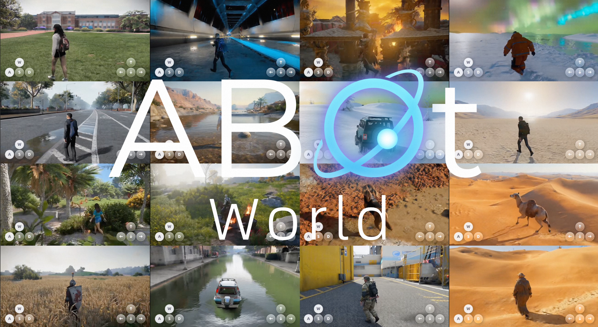

### TL;DR

A companion system to the world-model wave: an action-conditioned video world model whose entire *inference* stack fits in ~19 GiB of VRAM on a single RTX 5090, generating 720p at up to 16 fps with 1.2 s action-to-first-frame latency. The premise is that interactivity is bounded by VRAM budgets and end-to-end latency, not just parameter count.

### Key idea

**A single-GPU inference stack for infinite rollout**: aggressive KV-cache/streaming choices, small-footprint decoders, and action conditioning that runs during the streaming step rather than as a post-hoc rewrite. Designed as an integrated system rather than a bigger model — the paper's contribution is engineering rather than a new backbone.

### Main finding

**720p @ 16 fps, 19 GiB peak VRAM, 1.2 s A2F latency** for open-ended rollouts on a single consumer GPU (RTX 5090). Sits alongside AlayaWorld / AlayaRenderer as the same-day cluster of world-model releases.

### Why it matters

Puts an interactive world model on a hobbyist desktop, not a datacenter. If reproducible, this is the "GGUF moment" for video world models — the point where local inference becomes possible even before local training does.

### Knowledge graph integration

**Builds on / relates to existing pages:**
- [inference/README.md](../inference/README.md) — the paper is fundamentally a serving / streaming systems paper
- [systems/partial-rollouts.md](../systems/partial-rollouts.md) — parallel to LLM partial-rollout tricks in RL

**Suggested new pages:**
- `inference/action-to-first-frame.md` *(depth)* — the latency metric that governs interactive world models
- `case-studies/abot-world-0.md` *(case study)* — if this is picked up as a reference single-GPU stack

---

## 3. Mage-Flow: Efficient Native-Resolution Foundation Model for Image Generation and Editing

**Authors:** Microsoft Mage Team — *Microsoft*
**Links:** [arXiv:2607.19064](https://arxiv.org/abs/2607.19064) · [HF](https://huggingface.co/papers/2607.19064) · [AlphaXiv](https://www.alphaxiv.org/abs/2607.19064)
**Topics:** `diffusion`, `rectified-flow`, `multimodal`

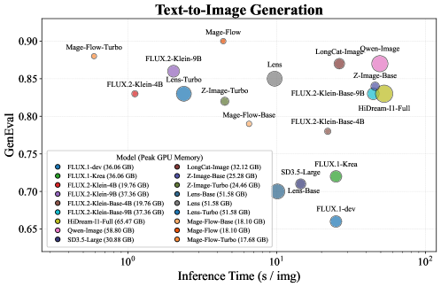

### TL;DR

A 4B image-generation and instruction-editing stack trained with rectified flow matching, with an accompanying VAE (Mage-VAE) that uses a one-step diffusion-style encoder/decoder. Ships Base, RL-aligned, and Turbo variants — the 4-step Turbo hits 0.59 s / 1.02 s for gen/edit at 1024² on a single A100.

### Key idea

**Co-designed VAE + DiT + serving**: (1) a lightweight one-step diffusion-style VAE with anchor-latent regularization, (2) a native-resolution multimodal DiT under rectified flow, (3) diffusion-NFT (a rectified-flow-native RL alignment) and few-step adversarial-perceptual distillation for the Turbo. The pitch is that tokenizer+backbone+kernel design together matter more than a bigger DiT.

### Main finding

Reconstruction quality on par with strong public VAEs at **>10× lower tokenization cost**, ~2.5× end-to-end training throughput, and Turbo variants that generate/edit a 1024² image in ~1 s on a single A100 while remaining competitive on standard benchmarks.

### Why it matters

Serves as an argument that the frontier of open image generation is stack-level co-design, not scale — echoing the "compact 4B" positioning of recent efficient LLM families. If reproducible, this materially cheapens interactive image workflows.

### Knowledge graph integration

**Builds on / relates to existing pages:**
- [multimodal/README.md](../multimodal/README.md) — placeholder for the multimodal generation family

**Suggested new pages:**
- `multimodal/_diffusion-generative.md` *(taxonomy)* — landing page for diffusion / flow-matching families
- `multimodal/rectified-flow.md` *(depth)* — the training objective at the core of Mage-Flow (and SD3, Flux)
- `multimodal/mage-vae.md` *(depth)* — the one-step VAE variant

---

## 4. Generative World Renderer at the Speed of Play (AlayaRenderer-Flash)

**Authors:** Zheng-Hui Huang, Siqi Yang, Ming-Hsuan Yang, Kaipeng Zhang, Zhixiang Wang — *Shanda / Alaya*
**Links:** [arXiv:2607.18703](https://arxiv.org/abs/2607.18703) · [HF](https://huggingface.co/papers/2607.18703) · [AlphaXiv](https://www.alphaxiv.org/abs/2607.18703)
**Topics:** `world-model`, `distillation`, `efficient-inference`

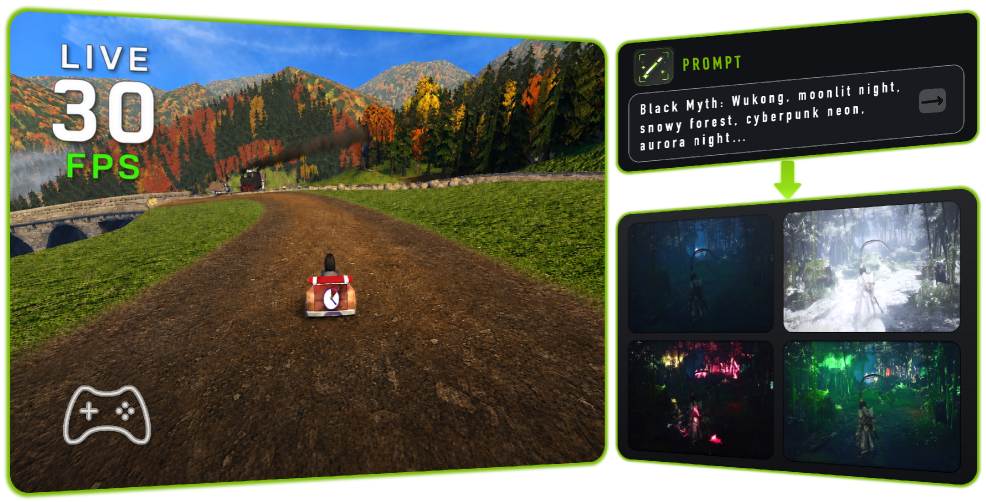

### TL;DR

A distilled real-time variant of AlayaRenderer that takes structured world states from a physics engine and streams RGB frames at 31.54 fps (from 0.56 fps in the teacher). Rather than generate from text, it renders — physics stays authoritative and the model paints frames.

### Key idea

**Few-step autoregressive streaming distillation**: reformulate the multi-step renderer as a small number of autoregressive steps over a stream, and add lightweight distilled latent codecs. Preserves the teacher's G-buffer + text-prompt interfaces so the physics engine keeps driving; the network just paints. Cross-window continuity is enforced through the streaming state.

### Main finding

**~56× speedup** over the teacher (0.56 → 31.54 fps), while retaining content preservation, temporal consistency, and prompt controllability. Integrated with a physics engine, produces a "fully playable generative world running at 30 fps."

### Why it matters

Points at a hybrid architecture — classical physics + generative renderer — that keeps world dynamics deterministic while letting the network handle appearance. That's a much softer promise than "learn everything end-to-end" and may be the pragmatic near-term path for AAA-quality generative games.

### Knowledge graph integration

**Builds on / relates to existing pages:**
- [inference/README.md](../inference/README.md) — the paper is essentially a distillation-for-inference recipe

**Suggested new pages:**
- `inference/few-step-distillation.md` *(depth)* — the diffusion→few-step recipe used here and by Mage-Flow-Turbo
- `multimodal/g-buffer-conditioning.md` *(depth)* — physics-engine G-buffer as conditioning signal

---

## 5. DataFlow-Harness: Grounded Code-Agent Platform for LLM Data Pipelines

**Authors:** Zhen Hao Wong, Wong Hao Liang, Zimo Meng, Chengyu Shen, Xiaochen Ma, Wentao Zhang — *Peking University / IAAR-Shanghai / Zhongguancun Academy*
**Links:** [arXiv:2607.16617](https://arxiv.org/abs/2607.16617) · [HF](https://huggingface.co/papers/2607.16617) · [AlphaXiv](https://www.alphaxiv.org/abs/2607.16617)
**Topics:** `agents`, `MCP`, `data`

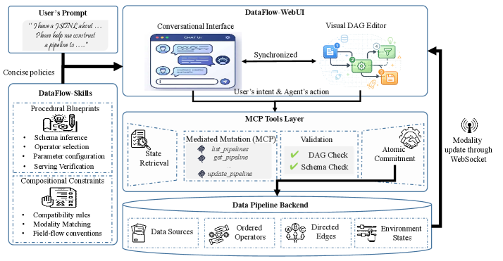

### TL;DR

An LLM code-agent platform that authors data-processing pipelines as *platform-native DAGs* rather than free-form scripts, closing the "NL2Pipeline gap" where agent-produced code doesn't become an editable, reusable artifact. Guides the agent via typed, incremental mutations exposed through an MCP layer, with a synchronized WebUI.

### Key idea

**Typed incremental DAG mutation via MCP**: the agent doesn't write scripts — it applies structured edits to a live pipeline through an MCP-exposed operator registry, backed by a set of curated "DataFlow-Skills" (procedural task patterns). A WebUI keeps conversation and DAG in sync so a human can take over at any step.

### Main finding

**93.3% observed end-to-end pass rate** on a 12-task data-engineering benchmark — the kind of result that's only interesting because the deliverable is an editable pipeline rather than a one-shot script.

### Why it matters

The MCP-plus-typed-mutations pattern generalizes well beyond data pipelines. This is a concrete instance of the broader shift where LLM agents produce **structured artifacts on a shared platform** rather than raw text, which is where "agentic" workflows actually pay off in production.

### Knowledge graph integration

**Builds on / relates to existing pages:**
- [agents/README.md](../agents/README.md) — placeholder for tool-use / MCP concepts

**Suggested new pages:**
- `agents/mcp.md` *(depth)* — Model Context Protocol as an interface for typed tool exposure
- `agents/typed-mutation-agents.md` *(depth)* — agents that emit structured edits instead of scripts

---

## 6. Text Template Tokens Are Implicit Semantic Registers in Diffusion Transformers

**Authors:** Qirui Li, Yanke Zhou, Yiduo Li, Zhaosheng Chi, Chao Xu, Cuifeng Shen, Yixuan Xu, Hanlin Tang, Kan Liu, Tao Lan, Lin Qu, Shao-Qun Zhang — *Nanjing University / Alibaba Group / Zhejiang University*
**Links:** [arXiv:2607.19139](https://arxiv.org/abs/2607.19139) · [HF](https://huggingface.co/papers/2607.19139) · [AlphaXiv](https://www.alphaxiv.org/abs/2607.19139)
**Topics:** `interp`, `diffusion`

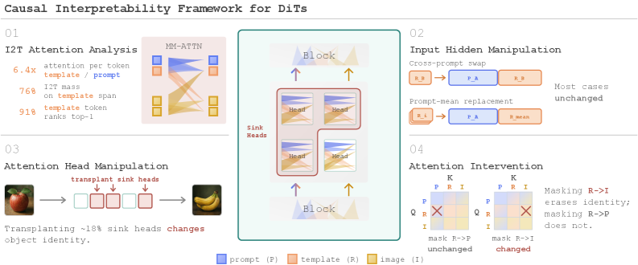

### TL;DR

A causal-interpretability study of large text-to-image DiTs. The authors decompose attention across token spans, heads, and layers and intervene on subsets, finding that the *structural* text tokens (the fixed template scaffolding, not the prompt words) carry almost no prompt-specific content at the encoder — yet act as dominant image-to-text attention sinks and causally maintain object identity inside the DiT. They call these "implicit semantic registers."

### Key idea

**Structural template tokens as attention registers**: separate template tokens from content tokens and target each with attention decomposition + causal interventions. Content tokens carry the prompt, template tokens carry state — analogous to the "attention register" story in ViTs, but discovered inside a production DiT.

### Main finding

Ablating structural tokens breaks object identity in generated images even though those tokens carry no prompt-specific information at the text encoder — a strong causal test that they function as **hidden state registers** rather than semantic content.

### Why it matters

Bridges the mech-interp toolkit (attention decomposition + causal intervention) to diffusion transformers, and gives a concrete lever ("touch the template tokens") for compositional editing and safety-critical intervention in DiTs. Also predicts that prompt-engineering rituals around delimiters and templates were doing more than we thought.

### Knowledge graph integration

**Builds on / relates to existing pages:**
- [interpretability/README.md](../interpretability/README.md) — placeholder for mech-interp depth files
- [fundamentals/attention.md](../fundamentals/attention.md) — attention-sink phenomena in transformers

**Suggested new pages:**
- `interpretability/attention-sinks.md` *(depth)* — the sink phenomenon, now generalized to DiTs
- `interpretability/causal-attention-decomposition.md` *(depth)* — the "decompose + intervene" methodology

---

## 7. Subliminal Clocks: Latent Time Modelling in Diffusion Language Models

**Authors:** Maximo Rulli, Thomas Fontanari, Simone Petruzzi, Federico Alvetreti, Giorgio Strano, Donato Crisostomi, Giorgos Nikolaou, Tommaso Mencattini, Andrea Santilli, Emanuele Rodolà, Simone Scardapane, Alessio Devoto — *Sapienza / EPFL / NVIDIA*
**Links:** [arXiv:2607.01774](https://arxiv.org/abs/2607.01774) · [HF](https://huggingface.co/papers/2607.01774) · [AlphaXiv](https://www.alphaxiv.org/abs/2607.01774)
**Topics:** `interp`, `diffusion-lm`

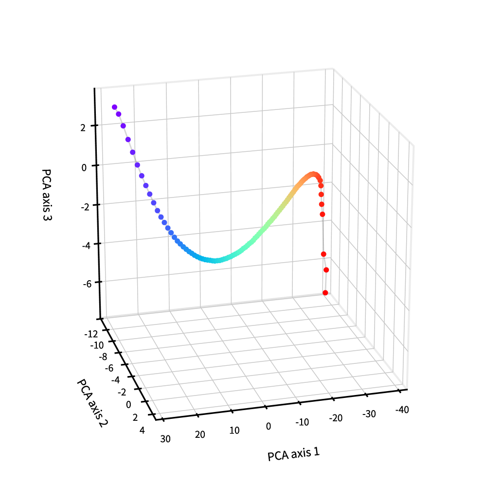

### TL;DR

Diffusion language models aren't given an explicit timestep — but do they *internally* keep track of denoising progress? The authors probe residual streams across layers, find a low-rank subspace that decodes the timestep, and show that steering along it modulates the model's confidence and entropy in a predictable way.

### Key idea

**Linear probing + activation steering on the diffusion-LM residual stream**: fit probes to recover the (unobserved) timestep from hidden states, then steer along the recovered subspace to control the model's sense of "how far into denoising am I." A clean transfer of interp tools originally built for autoregressive LLMs to the diffusion-LM setting.

### Main finding

The subspace is (i) linearly decodable across layers, (ii) low-dimensional and geometrically structured, and (iii) causally effective — steering along it produces predictable, monotone shifts in entropy and generation confidence.

### Why it matters

First clean interp result on diffusion language models — the class of models that keep threatening to displace AR LLMs for generation. If the same techniques transfer, the mech-interp community gets a new substrate; if not, the differences will be as informative as the results.

### Knowledge graph integration

**Builds on / relates to existing pages:**
- [interpretability/README.md](../interpretability/README.md) — placeholder for probing / steering depth files

**Suggested new pages:**
- `interpretability/probing.md` *(depth)* — linear probing methodology (predates this paper, gap in the graph)
- `interpretability/activation-steering.md` *(depth)* — steering along a probed subspace
- `architectures/diffusion-lm.md` *(depth)* — the model class this paper studies

---

## 8. Stale but Stable: Staleness-Adaptive Trust Regions for Asynchronous RL

**Authors:** Junyao Yang, Yucheng Shi, Zongxia Li, Zhongzhi Li, Ruhan Wang, Xiangxin Zhou, Kishan Panaganti, Haitao Mi, Leowei Liang, and 22 others — *undisclosed group*
**Links:** [arXiv:2607.18722](https://arxiv.org/abs/2607.18722) · [HF](https://huggingface.co/papers/2607.18722) · [AlphaXiv](https://www.alphaxiv.org/abs/2607.18722)
**Topics:** `RL`, `systems`, `reasoning`

### TL;DR

Async RL for LLM reasoning hides an ugly problem: rollouts sampled from a policy that's already several optimizer steps behind the trainer. PPO's clip is a per-sample surrogate, not a full-policy constraint, and it under-controls high-staleness updates. SAT (Staleness-Adaptive Trust Region) uses the sampled log-ratio as a staleness proxy and contracts *only* the outward endpoint of the PPO clip on high-mismatch tails — leaving ordinary tokens alone.

### Key idea

**Adaptive clipping keyed on measured drift**: within each batch, identify high-mismatch tails via a staleness-based kernel over sampled log-ratios; contract only the sign-selected endpoint of the nominal PPO interval, preserving baseline behavior on the rest. The paper proves local interval containment and pointwise pessimism vs vanilla PPO — SAT is never wider than PPO's clip on a stale token.

### Main finding

On Qwen3-30B-A3B-Base with SGLang inference + Megatron training, **SAT-GSPO w/ R3 hits AIME24 avg@8 = 35.83 at lag 1 and 34.79 at lag 8** — i.e. almost no degradation at 8-step staleness — a regime where plain PPO / GSPO collapses. Routing replay is an orthogonal complement targeting MoE routing inconsistency.

### Why it matters

Async RL is how you make LLM post-training economics work at scale (rollouts on cheap serving stacks, optimizer on trainers). This paper is the first principled fix that survives real MoE-scale staleness rather than papering over it with global tricks. Expect it to slot in next to GRPO / GSPO as a standard clip.

### Knowledge graph integration

**Builds on / relates to existing pages:**
- [post-training/ppo.md](../post-training/ppo.md) — SAT is a direct modification of PPO's clip
- [post-training/grpo.md](../post-training/grpo.md) — evaluated as SAT-GSPO / SAT-GRPO combinations
- [systems/partial-rollouts.md](../systems/partial-rollouts.md) — the systems half of "async RL for LLMs"

**Suggested new pages:**
- `post-training/sat-clipping.md` *(depth)* — the staleness-adaptive clip
- `systems/async-rl.md` *(depth)* — decoupled rollout/optimizer with staleness bookkeeping

---

## 9. AgentDebugX: Failure Observability, Attribution, and Recovery in LLM Agents

**Authors:** Kunlun Zhu, Xuyan Ye, Zhiguang Han, Yuchen Zhao, Bingxuan Li, Weijia Zhang, Muxin Tian, Xiangru Tang, Pan Lu, James Zou, Jiaxuan You, Heng Ji — *UIUC / Toronto / Google / Stanford*
**Links:** [arXiv:2607.18754](https://arxiv.org/abs/2607.18754) · [HF](https://huggingface.co/papers/2607.18754) · [AlphaXiv](https://www.alphaxiv.org/abs/2607.18754)
**Topics:** `agents`, `eval`

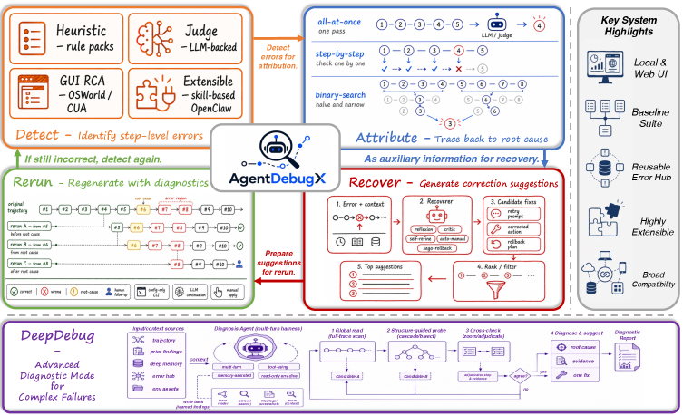

### TL;DR

Debugging LLM-agent traces is hard because the observable failure is rarely the causal step. AgentDebugX organizes debugging as a closed loop — **Detect → Attribute → Recover → Rerun** — with a core "DeepDebug" module that does multi-turn root-cause diagnosis via global trajectory understanding, structure-guided investigation, and cross-examination.

### Key idea

**Multi-turn root-cause diagnosis over full trajectories**: rather than a single-pass "which step failed" call, DeepDebug interrogates the trajectory as a graph with cross-examination between hypotheses. Recovery is triggered from the attributed cause rather than the surface symptom, so a rerun can actually fix it.

### Main finding

On the Who&When benchmark, DeepDebug reaches **28.8% exact agent-and-step attribution accuracy on qwen3.5-9b** (vs 21.7% for the best single-pass baseline). On GAIA, it repairs **13 of 73 failed tasks in a single rerun** (vs 4–6 for self-correction baselines), moving overall accuracy from 55.8% → 63.6%.

### Why it matters

Agent evaluation has mostly measured pass/fail. AgentDebugX makes the *diagnosis* itself a first-class object with a shared Error Hub, which is what production agentic systems have been informally reinventing. Also gives us a real benchmark methodology for the debugging capability itself.

### Knowledge graph integration

**Builds on / relates to existing pages:**
- [agents/README.md](../agents/README.md) — placeholder for the agents topical area

**Suggested new pages:**
- `agents/agent-debugging.md` *(depth)* — Detect / Attribute / Recover / Rerun loop
- `evaluation/whowhen.md` *(depth)* — the attribution-accuracy benchmark used

---

## 10. GAMUT: Two-Level Meta-Rubrics for Evaluating Factual Completeness

**Authors:** Xilun Chen, Zhaleh Feizollahi, Ross Goodwin, Seungwhan Moon, Scott Yih, Pinar Donmez, Babak Damavandi, Luna Dong — *AI at Meta*
**Links:** [arXiv:2607.19322](https://arxiv.org/abs/2607.19322) · [HF](https://huggingface.co/papers/2607.19322) · [AlphaXiv](https://www.alphaxiv.org/abs/2607.19322)
**Topics:** `eval`, `multimodal`

### TL;DR

Long-form factuality evaluation has focused on **precision** (are the claims true?) — this paper argues **completeness** (does the response contain everything it should?) is the missing half, and requires structured rubrics rather than flat checklists. GAMUT is a benchmark of 1,813 wearable-imagery questions across 10 domains, each with an evidence-backed rubric verified by expert annotators.

### Key idea

**Two-level meta-rubric compilation**: a structured meta-rubric captures the organization and importance of required content; it's then mechanically compiled to a flat checklist of binary machine-gradable rubrics, which an LLM judge scores reliably. Handles open-ended sets, ordered processes, and inter-fact relationships that flat lists miss.

### Main finding

Benchmark is discriminative and robust: **best score 58.7% from Gemini 3.1 Pro** across 14 frontier and open-weight models; the gap between best and worst is large enough to rank cleanly, and results are stable to changes of judge LLM.

### Why it matters

Reframes the "LLM as judge" problem: instead of asking a judge for a subjective completeness score, compile a machine-gradable structured rubric per question and let the judge score binaries. The methodology transfers to any long-form generation eval where "did you cover everything" matters.

### Knowledge graph integration

**Builds on / relates to existing pages:**
- [evaluation/ifeval.md](../evaluation/ifeval.md) — closest existing rubric-style eval in the graph

**Suggested new pages:**
- `evaluation/gamut.md` *(depth)* — the benchmark itself
- `evaluation/meta-rubric.md` *(depth)* — the two-level compilation methodology

---

## 11. ISO: An RLVR-Native Optimization Stack

**Authors:** Hanqing Zhu, Wenyan Cong, Zhizhou Sha, Sagnik Mukherjee, Xinyuan Song, David González-Martínez, Xiaoxia Wu, Yuandong Tian, Shiwei Liu, David Z. Pan, Zhangyang Wang — *UT Austin / UIUC / Emory / ELLIS / Together AI / Recursive Superintelligence*
**Links:** [arXiv:2607.19331](https://arxiv.org/abs/2607.19331) · [HF](https://huggingface.co/papers/2607.19331) · [AlphaXiv](https://www.alphaxiv.org/abs/2607.19331)
**Topics:** `RL`, `reasoning`, `RLVR`

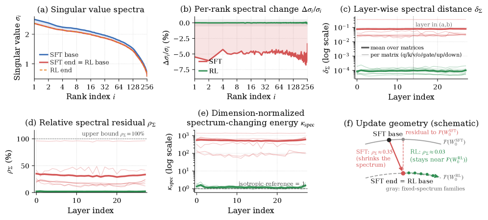

### TL;DR

An RLVR-native optimizer built on a claim called **spectral inheritance**: reasoning fine-tunes largely *reuse* the base model's weight singular spectra and acquire new behavior by rotating the associated input/output singular *frames*. ISO exploits this to build an optimizer whose updates live in the frame-rotation subspace.

### Key idea

**Spectral inheritance as a training prior**: SVD-decompose each weight matrix, freeze the singular values, and update mostly the singular vectors. This is a physically motivated LoRA-adjacent parameterization that specifically targets the observed structure of RLVR updates (post-training changes *directions*, not *magnitudes*).

### Main finding

The paper's core empirical claim is the phenomenology itself — that across RLVR runs, singular values are largely inherited from the base model, while singular vectors carry the new behavior. On top of this, ISO uses the observation to shape its update rule.

### Why it matters

If spectral inheritance holds broadly, it explains why RLVR post-training preserves so much base-model capability (the "raw material" is unchanged), and it hands us a principled compression/lightweight-adapter story for reasoning models. Also directly relevant to the LoRA-for-RLVR discussion.

### Knowledge graph integration

**Builds on / relates to existing pages:**
- [post-training/rlvr.md](../post-training/rlvr.md) — RLVR is exactly the setting studied
- [post-training/grpo.md](../post-training/grpo.md) — the base RL algorithm ISO wraps

**Suggested new pages:**
- `post-training/spectral-inheritance.md` *(depth)* — the phenomenology + ISO update
- `post-training/fine-tuning/svd-lora.md` *(depth)* — SVD-parameterized adapters (fills a real gap)

---

## 12. H²SD: Hybrid Hindsight Self-Distillation for RLVR

**Authors:** Yichuan Ma, Linyang Li, Peiji Li, Yongkang Chen, Qipeng Guo, Yicheng Zou, Tao Gui, Xiaocheng Feng, Bing Qin — *Shanghai AI Lab / Fudan / CUHK / HIT*
**Links:** [arXiv:2607.18955](https://arxiv.org/abs/2607.18955) · [HF](https://huggingface.co/papers/2607.18955) · [AlphaXiv](https://www.alphaxiv.org/abs/2607.18955)
**Topics:** `RL`, `distillation`, `reasoning`

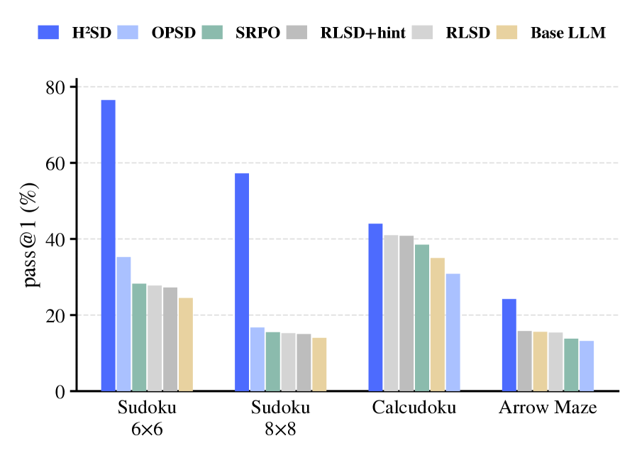

### TL;DR

RLVR gives one scalar reward per trajectory — sparse credit assignment. On-policy self-distillation (OPSD) densifies supervision by conditioning the same model on privileged info to make a teacher, but risks leakage and instability. H²SD splits the treatment by trajectory correctness: **modulate magnitudes on successes, correct direction on failures**.

### Key idea

**Trajectory-conditional hybrid self-distillation**: for successful trajectories, feed the teacher the (already correct) student response with a rephrasing prompt; use its per-token probabilities to modulate update magnitudes without changing sign. For failed trajectories, condition the teacher on a reference hint + verified answer and minimize reverse KL from student to teacher — an explicit correction direction.

### Main finding

H²SD **consistently outperforms RLVR, OPSD, and RLSD baselines** across multiple reasoning benchmarks while maintaining stable optimization and favorable generation efficiency (exact numbers per benchmark in the paper).

### Why it matters

Cleanly separates two failure modes of self-distillation for reasoning RL — magnitude noise on correct rollouts and missing direction on wrong ones — and treats them differently. That framing is likely to survive as an idiom even if the exact algorithm gets replaced.

### Knowledge graph integration

**Builds on / relates to existing pages:**
- [post-training/rlvr.md](../post-training/rlvr.md) — the setting
- [post-training/grpo.md](../post-training/grpo.md) — the RL substrate
- [post-training/rejection-sampling.md](../post-training/rejection-sampling.md) — trajectory-conditional treatment cousin

**Suggested new pages:**
- `post-training/reasoning/hindsight-self-distillation.md` *(depth)* — the H²SD recipe
- `post-training/reasoning/on-policy-distillation.md` *(depth)* — OPSD as the parent class (fills a gap)

---

## 13. Masked Visual Actions for Unified World Modeling

**Authors:** Hadi Alzayer, Wenlong Huang, Haonan Chen, Christopher Luey, Lvmin Zhang, Maneesh Agrawala, Gordon Wetzstein, Li Fei-Fei, Yilun Du, Jiajun Wu, Jia-Bin Huang — *Stanford / Harvard / UMD*
**Links:** [arXiv:2607.19343](https://arxiv.org/abs/2607.19343) · [HF](https://huggingface.co/papers/2607.19343) · [AlphaXiv](https://www.alphaxiv.org/abs/2607.19343)
**Topics:** `world-model`, `multimodal`, `VLA`

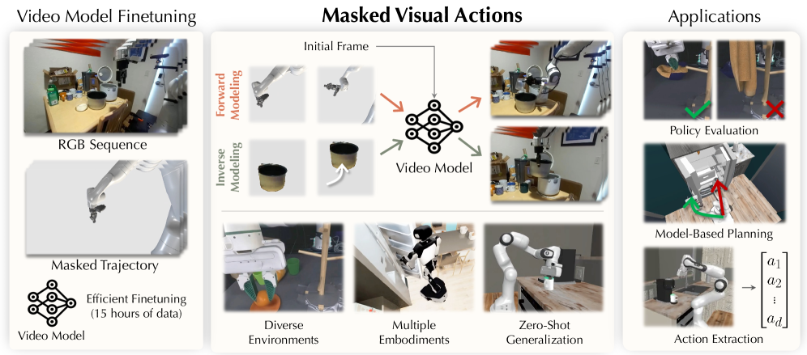

### TL;DR

A pixel-space control interface for video world models: express action as a **partially revealed trajectory of an entity in a video**. Revealing robot motion turns the model into a forward dynamics predictor; revealing desired object motion turns the same model into an inverse controller that synthesizes matching robot behavior.

### Key idea

**Masked visual actions**: a shared conditioning representation — a partially masked pixel-space trajectory of an arbitrary entity — that unifies forward dynamics (reveal robot → predict scene) and inverse dynamics (reveal object → recover robot motion) under one checkpoint. Fine-tuned with only 15 hours of masked examples on top of a general video model.

### Main finding

A single checkpoint delivers strong visual fidelity and controllability across embodiments; imagined rollouts correlate with real-world execution well enough to be used for policy evaluation and for ranking candidate futures in model-based planning; inverse modeling from desired object motion works.

### Why it matters

Sidesteps the two hard problems in VLA design — how to represent action, and how to unify forward/inverse dynamics — by putting both into pixel space and letting the video prior carry them. If the "one model, many roles" claim holds up, this is a strong candidate baseline for robot world models.

### Knowledge graph integration

**Builds on / relates to existing pages:**
- [multimodal/README.md](../multimodal/README.md) — placeholder for VLA / world-model depth files

**Suggested new pages:**
- `multimodal/masked-visual-actions.md` *(depth)* — the pixel-space action interface
- `multimodal/vla.md` *(depth)* — VLA taxonomy landing page (fills a real gap)

---

## 14. Where Should Optimizer State Live? Tiered State Allocation for MoE Training (SkewAdam)

**Authors:** Undisclosed single-author submission — *independent / self-funded*
**Links:** [arXiv:2607.19058](https://arxiv.org/abs/2607.19058) · [HF](https://huggingface.co/papers/2607.19058) · [AlphaXiv](https://www.alphaxiv.org/abs/2607.19058)
**Topics:** `MoE`, `pre-training`, `systems`

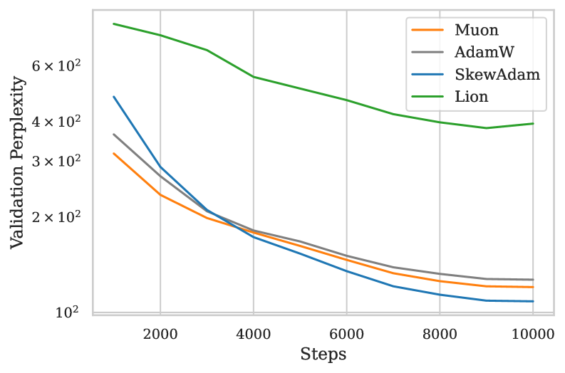

### TL;DR

On MoE models the AdamW optimizer state dwarfs the weights (50.6 GB state vs 12.6 GB bf16 weights on a 6.78B model). SkewAdam observes that the backbone, experts, and router have such different sizes and gradient statistics that they should not carry the same optimizer state. Tier them: full float32 momentum + factored second moment on the backbone, factored-only on experts, exact on the router.

### Key idea

**Tiered optimizer state matched to MoE parameter populations**: (1) backbone = 5% of params → keep momentum + factored second moment (float32), (2) experts = 95% → factored second moment only, no momentum, (3) router = <0.01% → exact everything. Recognizes that "which parameters need which stats" is answerable *a priori* on MoE.

### Main finding

Optimizer state: **50.6 GB → 1.29 GB (2.6% of AdamW)**. Peak training memory: **81.4 GB → 31.3 GB** — inside a 40 GB accelerator budget. On 82M-token controlled runs, val perplexity **108.4 (SkewAdam) vs 126.8 (AdamW) / 120.2 (Muon) / 393.7 (Lion)**. A tier ablation with 20× the state matches SkewAdam, so the gains come from *keeping momentum* under a tight budget, not from the allocation being magical.

### Why it matters

MoE optimizer state has quietly become the memory bottleneck of open MoE training. If SkewAdam's ablation story holds — "you need momentum somewhere, not everywhere" — it becomes the default recipe for anyone trying to fit MoE training on <40 GB accelerators.

### Knowledge graph integration

**Builds on / relates to existing pages:**
- [architectures/_moe.md](../architectures/_moe.md) — MoE taxonomy that this optimizer specifically targets
- [architectures/deepseek-moe.md](../architectures/deepseek-moe.md) — the backbone/expert/router split SkewAdam exploits
- [pre-training/_training-stability.md](../pre-training/_training-stability.md) — momentum-vs-not-momentum tradeoffs

**Suggested new pages:**
- `pre-training/skewadam.md` *(depth)* — the tiered-state optimizer
- `pre-training/_optimizers.md` *(taxonomy)* — AdamW / Adafactor / Muon / Lion / SkewAdam (fills a real gap)

---

## 15. Reading and Steering Materials-Science Mechanisms in an Open-Weight LM

**Authors:** Markus J. Buehler — *MIT*
**Links:** [arXiv:2607.20058](https://arxiv.org/abs/2607.20058) · [HF](https://huggingface.co/papers/2607.20058) · [AlphaXiv](https://www.alphaxiv.org/abs/2607.20058)
**Topics:** `interp`, `activation-steering`

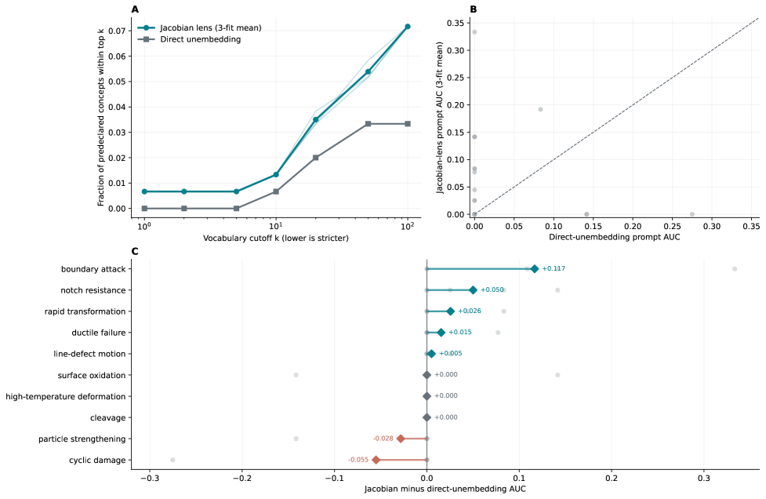

*Borderline: kept because the methodology (Jacobian vocabulary lens + counterfactual constitutive-law prompts + causal interventions) is a broadly transferable interp/steering recipe, even though the target domain is materials science.*

### TL;DR

Applies an interp + steering methodology to a materials-science context in an open-weight `google/gemma-4-E4B-it` model. Shows that scientific *concepts* are readable in hidden states, that *constitutive orientation* (which direction a law points) is carried by controlled state transformations rather than absolute activations, and that internal representations *causally* control the model's engineering answers.

### Key idea

**Jacobian vocabulary lens + directional counterfactual benchmarks**: read concepts via matched direct/Jacobian vocabulary readouts; test for constitutive orientation by comparing prompts identical except for the direction of the physical input, checking whether the resulting state motion follows the supplied law; then causally intervene to steer the answer.

### Main finding

On 50 held-out materials descriptions, three independently fitted Jacobian lenses reproduced concept ranks, and target-free word sets enabled **blinded identification of 9 of 10 mechanism families**. On 60 directional laws, state transformations correctly oriented **39/40**. Bidirectional interventions shifted answer probabilities in the physically-correct direction across 12 matched cases.

### Why it matters

The paper's actual claim is that *state transformations, not states, carry directed physical structure*. This is a generalizable finding — a Jacobian lens catches what a static probe misses — and the counterfactual-orientation protocol is a template for testing whether an LM "understands" a directed relation.

### Knowledge graph integration

**Builds on / relates to existing pages:**
- [interpretability/README.md](../interpretability/README.md) — placeholder for probing / steering depth files

**Suggested new pages:**
- `interpretability/jacobian-lens.md` *(depth)* — reading concepts via input–output Jacobians
- `interpretability/activation-steering.md` *(depth)* — the intervention half of this paper (also touched by paper #7)

---

## Notes

- Borderline inclusions are flagged in-section with an italic *Borderline: …* note.
- Hero figures live in `assets/2026-07-22/`. Papers **#8 (SAT)** and **#10 (GAMUT)** had no usable HTML figure at fetch time and are shown without a hero image.
- This digest is informational. No existing concept files, `READING-LIST.md`, or `PAPERS.md` were modified to produce it.
