# Daily AI papers — 2026-07-23

*Curated from HF Daily Papers. 15 of 20 papers kept after relevance filter.*

## Papers at a glance

| # | Title | Topics | Org |
| --- | --- | --- | --- |
| 1 | [SLAI T-Rex: Full-Parameter Post-training of DeepSeek-V4 on Ascend SuperPOD](#1-slai-t-rex) | `systems`, `post-training`, `MoE`, `FP8` | SLAI / Huawei (Ascend) |
| 2 | [Self Gradient Forcing: Native Long Video Extrapolation](#2-self-gradient-forcing) | `diffusion`, `video`, `training` | Joy Future Academy / JD |
| 3 | [RIPO: Riemannian Isometric Policy Optimization](#3-ripo) | `RL`, `reasoning`, `GRPO` | Tsinghua / (unspecified) |
| 4 | [SLPO: Scaling Latent Reasoning via a Surrogate Policy](#4-slpo) | `RL`, `reasoning`, `latent-CoT` | HK PolyU / Sichuan U. |
| 5 | [Trace: Taxonomy-Guided Environment for Multidomain Visual Reasoning](#5-trace) | `RLVR`, `multimodal`, `data`, `eval` | (undisclosed) |
| 6 | [Anchor-Align: Generalizable VLA Finetuning](#6-anchor-align) | `multimodal`, `VLA`, `fine-tuning` | UIUC / TAMU / UCI |
| 7 | [Scaling Laws for HyperNetwork-Based Knowledge Injection](#7-hypernet-scaling) | `fine-tuning`, `LoRA`, `scaling-laws` | Nace AI / Purdue |
| 8 | [FVAttn: Adaptive Sparse Attention for Video Generation](#8-fvattn) | `attention`, `efficient-inference`, `video` | SYSU / WeChat / PKU |
| 9 | [Rubric4Setwise: Rubric-Oriented Document Set Retrieval](#9-rubric4setwise) | `retrieval`, `RAG`, `eval` | USTC / Tencent |
| 10 | [RECAP: Decodability Supervision for Verifiable Activation Explanations](#10-recap) | `interp`, `SAE`, `eval` | (undisclosed) |
| 11 | [DocOps: Verifiable Benchmark for Autonomous Document Agents](#11-docops) | `agents`, `eval` | CASIA / Baidu |
| 12 | [ICAE-Bench: Coding Agents as Interactive Project Builders](#12-icae-bench) | `agents`, `eval`, `code` | Meituan / Fudan |
| 13 | [ENTRAP-VL: Dual Contextual Entrainment Probe for VLMs](#13-entrap-vl) | `multimodal`, `interp`, `eval` | (undisclosed) |
| 14 | [ActiveVision: An Exam for Active Observers](#14-activevision) | `multimodal`, `eval` | USC |
| 15 | [Moving Alphabet: Training Data for Text-to-Video](#15-moving-alphabet) | `data`, `diffusion`, `video` | Meta Superintelligence Labs / Purdue |

---

## 1. SLAI T-Rex

**Authors:** Dongfang Li, Xiaodong Luo, Ruoyu Sun, et al. (65+ authors) — *SLAI / Huawei Ascend team*
**Links:** [arXiv:2607.20145](https://arxiv.org/abs/2607.20145) · [HF](https://huggingface.co/papers/2607.20145) · [AlphaXiv](https://www.alphaxiv.org/abs/2607.20145)
**Topics:** `systems`, `post-training`, `MoE`, `FP8`

### TL;DR

An end-to-end post-training stack for trillion-parameter MoEs on Huawei's Ascend NPU SuperPOD, applied to DeepSeek-V4. Combines memory-pressure reduction, communication–compute overlap, and NPU-native fused kernels to reach 34.22% MFU — a 2.93× improvement over their baseline. Validates that full-parameter CPT+SFT on frontier MoEs is achievable on non-NVIDIA silicon.

### Key idea

Three systems layers stacked together: (1) tiered activation offload + selective recompute to survive memory pressure of full-parameter (not LoRA) MoE post-training, (2) a fused all-to-all + expert-compute pipeline that hides expert-parallel comm behind local matmul time on Ascend, (3) NPU-tuned kernels for the MoE routing and FP8 accumulation paths. The stack is applied to DeepSeek-V4 for Operations Research CPT+SFT.

### Main finding

**34.22% Model FLOPs Utilization** on the Ascend SuperPOD during trillion-param full-parameter post-training, a **2.93×** speedup over their unoptimized baseline. Specialized OR models reach **71.81% zero-shot Pass@1**, beating GPT-5.4-Mini by 3.98 pp.

### Why it matters

Cements the "you can do frontier MoE training on non-NVIDIA hardware" claim with concrete MFU numbers. Also the first public reference point for post-training the DeepSeek-V4 family. Every open-source lab outside the CUDA moat gets a template.

### Knowledge graph integration

**Builds on / relates to existing pages:**
- [../case-studies/deepseek-v3.md](../case-studies/deepseek-v3.md) — extends the DeepSeek MoE training story to V4 on new silicon.
- [../systems/dualpipe.md](../systems/dualpipe.md) — same all-to-all-hiding motivation, different hardware target.
- [../pre-training/fp8-training.md](../pre-training/fp8-training.md) — FP8 accumulation paths ported to Ascend.
- [../architectures/_moe.md](../architectures/_moe.md) — routing + expert kernels on a new backend.

**Suggested new pages:**
- `systems/ascend-post-training.md` *(depth)* — Ascend-specific memory + comm stack for trillion-param MoEs.

---

## 2. Self Gradient Forcing

**Authors:** Junhao Zhuang, Shiyi Zhang, Yuxuan Bian, et al. — *Joy Future Academy, JD*
**Links:** [arXiv:2607.20368](https://arxiv.org/abs/2607.20368) · [HF](https://huggingface.co/papers/2607.20368) · [AlphaXiv](https://www.alphaxiv.org/abs/2607.20368)
**Topics:** `diffusion`, `video`, `training`

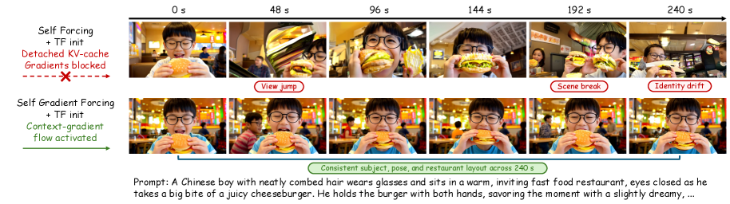

### TL;DR

Autoregressive video diffusion models trained with **Self Forcing** feed the student its own rollout KV cache to fight exposure bias — but the cache is frozen during backprop, so future-frame losses never teach the model how to *write* useful memory. Self Gradient Forcing (SGF) fixes this with a two-pass procedure that reintroduces gradient flow into the historical KV cache without backpropagating through the full rollout.

### Key idea

**Two-pass training.** Pass 1: no-gradient AR rollout matching inference; at a sampled denoising exit step, record the self-generated context and the noisy latents fed to the model. Pass 2: parallel context-gradient reconstruction — the generated context is used as *stop-gradient* clean-latent input, but the model recomputes the context KV representations and future-to-context causal attention. Result: losses on future frames now supervise how earlier latents are encoded into memory.

### Main finding

Trained on only a 5-second window, SGF extrapolates coherently to **multi-minute** videos. Beats Self Forcing on subject identity, background/layout consistency, and temporal stability across long-horizon frame- and chunk-wise benchmarks.

### Why it matters

Long-horizon consistency is the hardest failure of AR video diffusion. SGF is a training-side fix (not a bigger context window or an external memory module) and is compatible with existing Self-Forcing pipelines. Points to a broader recipe for closing the training-inference gap in causal generative models.

### Knowledge graph integration

**Suggested new pages:**
- `pre-training/self-gradient-forcing.md` *(depth)* — the two-pass gradient-reconstruction trick for AR video diffusion.
- `pre-training/self-forcing.md` *(depth)* — the baseline this builds on (student trained on its own rollouts), a prereq for SGF.

---

## 3. RIPO

**Authors:** Xinyuan Guo, Hanlin Wu, Mingxuan Wang, Wei-Ying Ma, Ya-Qin Zhang, Hao Zhou — *(affiliation not disclosed on HF page — likely Tsinghua AIR based on Wei-Ying Ma / Ya-Qin Zhang)*
**Links:** [arXiv:2607.10169](https://arxiv.org/abs/2607.10169) · [HF](https://huggingface.co/papers/2607.10169) · [AlphaXiv](https://www.alphaxiv.org/abs/2607.10169)
**Topics:** `RL`, `reasoning`, `GRPO`

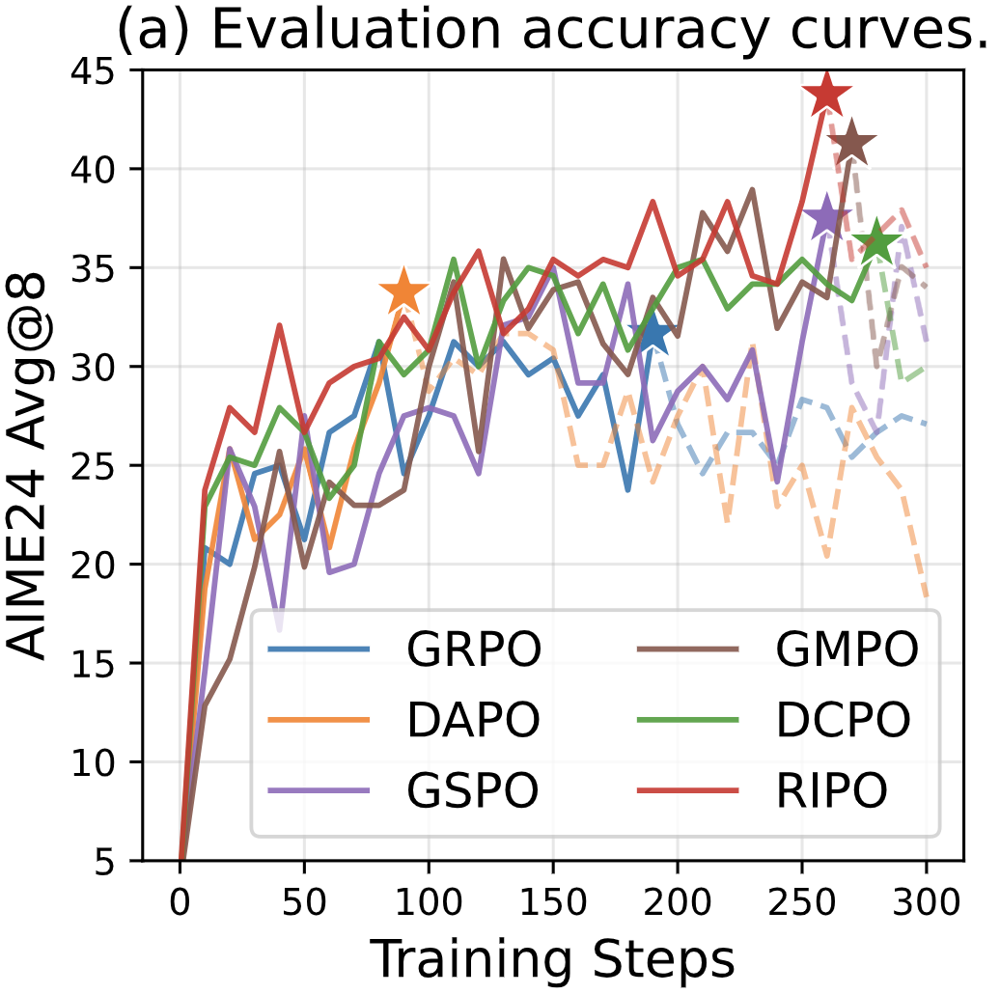

### TL;DR

PPO-Clip (and by extension GRPO) implicitly measures policy discrepancy with a Euclidean metric on probability vectors — which is geometrically wrong for a distribution living on a Riemannian manifold. The mismatch overshrinks updates in low-probability regions (killing exploration) and overshoots in high-probability regions. RIPO reformulates the clip as an *isometric* update on the policy manifold and gets up to **60% AIME24 gain over GRPO**.

### Key idea

Replace the coordinate-wise Euclidean clip with a **Riemannian isometric constraint** on the KL manifold: each policy update moves by a bounded intrinsic distance rather than a bounded coordinate ratio. This restores symmetric-in-log-space behavior, so tokens with 0.01 probability get proportional room to grow instead of being pinned by the outer bound of a Euclidean clip.

### Main finding

**Up to 60% improvement over GRPO on AIME24**, consistent gains across seven competition-level math/code benchmarks. Also demonstrates a better bias-variance tradeoff in optimization traces.

### Why it matters

If it holds up, this is the first principled critique of PPO-Clip that comes with a drop-in fix. GRPO has become the default reasoning-RL algo despite carrying PPO's clip verbatim; if the Riemannian correction is real, every RLVR pipeline should look at swapping the clip.

### Knowledge graph integration

**Builds on / relates to existing pages:**
- [../post-training/grpo.md](../post-training/grpo.md) — direct successor; replaces the Euclidean clip with a Riemannian one.
- [../post-training/ppo.md](../post-training/ppo.md) — the geometric critique targets the PPO-Clip surrogate.
- [../post-training/reasoning/online-policy-mirror-descent.md](../post-training/reasoning/online-policy-mirror-descent.md) — sibling formulation from a KL-mirror-descent starting point.
- [../post-training/rlvr.md](../post-training/rlvr.md) — RIPO drops into any RLVR pipeline.
- [../evaluation/aime.md](../evaluation/aime.md) — headline improvement is on AIME24.

**Suggested new pages:**
- `post-training/ripo.md` *(depth)* — Riemannian isometric surrogate as a GRPO/PPO clip replacement.

---

## 4. SLPO

**Authors:** Runyang You, Zhiyuan Liu, Yongqi Li, Wenjie Li — *HK PolyU / Sichuan U.*
**Links:** [arXiv:2607.19691](https://arxiv.org/abs/2607.19691) · [HF](https://huggingface.co/papers/2607.19691) · [AlphaXiv](https://www.alphaxiv.org/abs/2607.19691)
**Topics:** `RL`, `reasoning`, `latent-CoT`

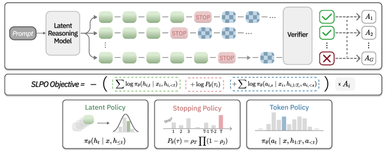

### TL;DR

**Latent reasoners** (Coconut-style continuous-vector CoT) match explicit CoT at shorter horizons but are stuck at imitation learning — outcome-reward RL that works for token CoT doesn't apply because latent trajectories have no tractable per-step likelihood and no stopping interface. SLPO introduces a surrogate density over latent transitions + a correctness-supervised stopping head, unlocking outcome-reward RL for latent reasoning.

### Key idea

Two additions on top of a latent reasoner: (1) an **empirical surrogate policy density** over latent transitions so trajectory-level credit assignment becomes computable, and (2) a **correctness-supervised stopping head** trained jointly, which outcome-reward RL then refines into a *variable-horizon* halting policy. Together they bring the GRPO/RLVR toolbox to continuous-vector reasoning.

### Main finding

Under continuous and soft thinking settings, SLPO improves **Pass@k under parallel sampling** and allocates **longer latent computation to harder instances** with higher deterministic accuracy — i.e., real test-time compute scaling from RL, not just from more imitation.

### Why it matters

Explicit CoT dominates because token-space RL is easy; latent CoT is cheaper per FLOP but has been RL-inaccessible. SLPO is the first credible bridge — if it generalizes, latent CoT becomes a serious contender for long-reasoning workloads.

### Knowledge graph integration

**Builds on / relates to existing pages:**
- [../post-training/reasoning/long-cot-rl.md](../post-training/reasoning/long-cot-rl.md) — extends outcome-reward RL from token to latent trajectories.
- [../post-training/grpo.md](../post-training/grpo.md) — SLPO is a GRPO-style algorithm with a surrogate density.
- [../post-training/rlvr.md](../post-training/rlvr.md) — same verifiable-reward setup, different action space.
- [../post-training/reasoning/length-penalty.md](../post-training/reasoning/length-penalty.md) — stopping-head variant of the same "how long should I think" question.

**Suggested new pages:**
- `post-training/reasoning/latent-reasoning-rl.md` *(depth)* — outcome-reward RL for continuous-vector CoT (SLPO as primary source).

---

## 5. Trace

**Authors:** Undisclosed on HF page
**Links:** [arXiv:2607.19790](https://arxiv.org/abs/2607.19790) · [HF](https://huggingface.co/papers/2607.19790) · [AlphaXiv](https://www.alphaxiv.org/abs/2607.19790)
**Topics:** `RLVR`, `multimodal`, `data`, `eval`

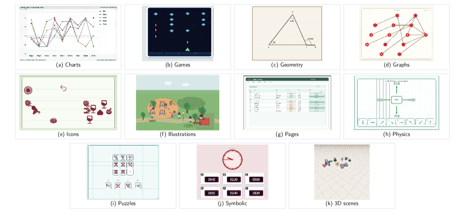

### TL;DR

RLVR is transforming LLM reasoning but is stuck for VLMs because there is no source of **broad, exactly verifiable, reproducible** visual training data. Trace is a taxonomy-guided environment that factorizes tasks into a scene grammar + executable task program: the same semantic state deterministically produces the image, prompt, typed answer, verifier, and replayable trace. 1000 tasks across 11 visual domains, 64k RLVR instances lift Qwen2.5-VL-7B by 4.06 pp on 24 external benchmarks.

### Key idea

Separate **visual realization** from **answer computation** by keeping both derived from the same shared semantic state. That lets any generated image come with a machine-verifiable answer, a typed schema, and a replayable trace — the conditions RLVR needs but VLM datasets rarely provide. Taxonomy of scene grammars ensures broad coverage without hand-labeling.

### Main finding

RLVR on 64k Trace instances improves the **macro-average across 24 external benchmarks** by 3.51 pp (Qwen2.5-VL-3B) and 4.06 pp (Qwen2.5-VL-7B). Evidence that broad procedural training transfers out of the generated task distribution.

### Why it matters

VLM RLVR has been blocked by the data problem, not the algorithm. Trace is a template for procedural-verifiable VLM environments — the analog of Codeforces-style verifiers for the vision-language stack.

### Knowledge graph integration

**Builds on / relates to existing pages:**
- [../post-training/rlvr.md](../post-training/rlvr.md) — extends verifiable rewards to the VLM setting.
- [../post-training/rl-prompt-curation.md](../post-training/rl-prompt-curation.md) — procedural task generation as an RL-data source.
- [../multimodal/README.md](../multimodal/README.md) — VLM post-training angle.
- [../evaluation/README.md](../evaluation/README.md) — benchmark-transfer evaluation methodology.

**Suggested new pages:**
- `multimodal/vlm-rlvr-environments.md` *(depth)* — procedural-verifiable environments for VLM RLVR (Trace as primary source).

---

## 6. Anchor-Align

**Authors:** Dwip Dalal, Shivansh Patel, Chahit Jain, Jeonghwan Kim, Utkarsh Mishra, Alex Baratian, Hyeonjeong Ha, Heng Ji, Svetlana Lazebnik, Unnat Jain — *UIUC / TAMU / UCI*
**Links:** [arXiv:2607.13429](https://arxiv.org/abs/2607.13429) · [HF](https://huggingface.co/papers/2607.13429) · [AlphaXiv](https://www.alphaxiv.org/abs/2607.13429)
**Topics:** `multimodal`, `VLA`, `fine-tuning`

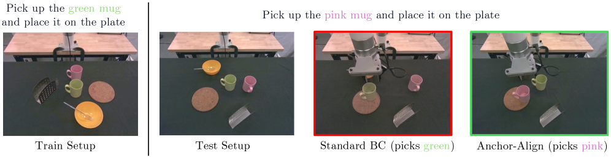

### TL;DR

Standard VLA finetuning uses **behavior cloning** on robot demonstrations — but BC progressively **overwrites** the pretrained VLM representations that give the model visual and semantic generalization. Co-training on web data helps only weakly because language and action losses live on different observations. Anchor-Align adds two objectives: **Vision-Language Anchoring** (layer-wise distillation from a frozen VLM copy) and **Language-Action Alignment** (each action becomes a discrete motion-direction label jointly trained with language on the same robot observation). Real-world success rate ~doubles.

### Key idea

Two objectives on top of BC: (1) distill layer-wise representations from a *frozen copy* of the pretrained VLM into the finetuning student (prevents drift), and (2) convert each action target into a discrete **motion-direction label** so language and action prediction share the same robot observation and cross-supervise.

### Main finding

On a physical xArm7: 28% → 54% and 37% → 60% success across two VLA architectures. Consistent OOD-perturbation, perceptual-robustness, and long-horizon improvements on LIBERO-PRO, LIBERO-Plus, and CALVIN.

### Why it matters

The "BC destroys representations" failure mode has been widely observed but rarely fixed cleanly. Anchor-Align shows the fix is orthogonal to the VLA architecture (works on two) — a candidate default recipe for VLA finetuning going forward.

### Knowledge graph integration

**Suggested new pages:**
- `multimodal/vla-finetuning.md` *(depth)* — the anchor + alignment recipe (representation anchoring + discrete motion labels).
- `multimodal/_vla.md` *(taxonomy)* — VLA architectures and finetuning strategies.

---

## 7. Hypernet Scaling Laws

**Authors:** Nischay Dhankhar, Dos Baha, Abulhair Saparov — *Nace AI / Purdue*
**Links:** [arXiv:2607.19604](https://arxiv.org/abs/2607.19604) · [HF](https://huggingface.co/papers/2607.19604) · [AlphaXiv](https://www.alphaxiv.org/abs/2607.19604)
**Topics:** `fine-tuning`, `LoRA`, `scaling-laws`

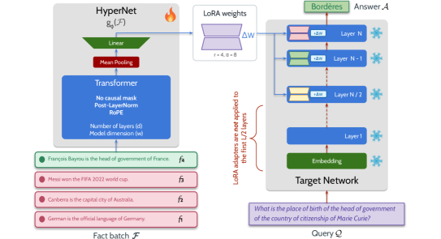

### TL;DR

Studies **train-time** hypernetworks for LLM knowledge injection: given a large fact corpus, train a hypernetwork that maps a set of facts to a fixed LoRA adapter which, when inserted into the target LLM, lets the LLM answer questions about those facts. Extracts scaling laws across hypernetwork depth/width, target model size, and fact count. Ships **MegaWikiQA**, a Wikidata5M-derived multi-hop QA dataset (tens of millions of examples across 39 domains).

### Key idea

Hypernetworks are usually a test-time adaptation tool; here they are trained end-to-end at *training time* to output LoRA adapters that encode arbitrary factual subsets. This decouples "learn the injection procedure" from "learn each fact," and allows fresh facts to be injected without further gradient descent on the target model.

### Main finding

Clean scaling behavior across four axes (hypernet depth, hypernet width, target model size, injected fact count), plus MegaWikiQA as a new large-scale evaluation harness for knowledge-injection methods.

### Why it matters

Continual pretraining is the standard way to inject new facts and it is expensive. If hypernetwork LoRAs scale, you get a cheap "adapter-per-knowledge-slice" route that is data-efficient and reversible.

### Knowledge graph integration

**Suggested new pages:**
- `post-training/fine-tuning/hypernetwork-lora.md` *(depth)* — train-time hypernetworks that emit LoRA adapters for knowledge injection.

---

## 8. FVAttn

**Authors:** Hao Liu, Chenghuan Huang, Ye Huang, Zhiying Wen, Hao Liu, Mohan Zhang, Chen Li, Ziyang Ma, Jing Lyu, Jiangsu Du — *Sun Yat-sen U. / WeChat HPC & Vision (Tencent) / Peking U.*
**Links:** [arXiv:2607.16190](https://arxiv.org/abs/2607.16190) · [HF](https://huggingface.co/papers/2607.16190) · [AlphaXiv](https://www.alphaxiv.org/abs/2607.16190)
**Topics:** `attention`, `efficient-inference`, `video`

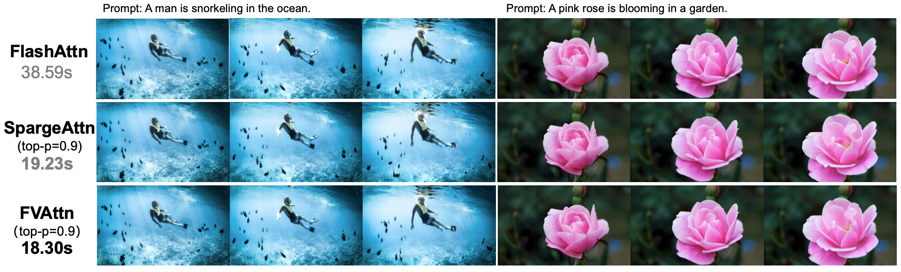

### TL;DR

Video-diffusion transformers spend most of inference in self-attention. Training-free sparse-attention with Top-p routing cuts FLOPs but creates uneven per-head workloads under multi-GPU sequence parallelism — the classic straggler problem. FVAttn combines a Top-p + Top-k-safety-floor routing frontend with **runtime load balancing** (P2P migration of heavy heads) and **slack-aware augmentation**. On step-distilled Wan2.2 I2V: **4.41× attention speedup** and **~2× DiT-inference speedup**.

### Key idea

The insight is that sparse-attention with adaptive Top-p routing is fundamentally *load-imbalanced* under sequence parallelism, so any FLOP savings gets eaten by stragglers. FVAttn treats the imbalance as a scheduling problem: measure per-head cost after routing, migrate a small number of heavy heads via P2P to shorten the rank-level critical path, then fill non-critical slack ranks with additional high-value attention blocks. All overlapped behind existing compute.

### Main finding

Load imbalance dropped from **1.34 → 1.08**, **4.41× attention speedup vs FlashAttention**, **2.02–2.11× DiT inference speedup** on Wan2.2 I2V with negligible video-quality regression.

### Why it matters

Sparse attention has been the theoretical answer for video-DiT inference cost for years; FVAttn is the first to close the practical gap by attacking the distributed-execution stragglers, not the FLOP count. Directly usable in vLLM/SGLang-style serving of video models.

### Knowledge graph integration

**Builds on / relates to existing pages:**
- [../fundamentals/attention.md](../fundamentals/attention.md) — sparse-routed attention variant.
- [../inference/README.md](../inference/README.md) — inference-serving stack.

**Suggested new pages:**
- `inference/sparse-attention-serving.md` *(depth)* — training-free sparse attention with runtime load balancing (FVAttn as primary source).

---

## 9. Rubric4Setwise

**Authors:** Kailin Jiang, Lei Liu, Jian Xi, et al. — *USTC / Tencent Yuanbao*
**Links:** [arXiv:2607.19747](https://arxiv.org/abs/2607.19747) · [HF](https://huggingface.co/papers/2607.19747) · [AlphaXiv](https://www.alphaxiv.org/abs/2607.19747)
**Topics:** `retrieval`, `RAG`, `eval`

### TL;DR

Current retrieval evaluation is single-document, relevance-centric — it misses the *set-level* coordination questions that matter for RAG. **SetwiseEvalKit** is a three-level, nine-dimension benchmark of ~28K rubrics; on it, 12 rerankers achieve modest performance on cross-document coordination. **Rubric4Setwise** converts rubric criteria directly into set-selection signals and delivers the best downstream generation with fewer documents and fewer search rounds.

### Key idea

The core move is treating retrieval as a **set-selection** problem judged by rubrics rather than a per-doc relevance-ranking problem. Rubric4Setwise translates evaluation rubrics into ranking signals during retrieval — the same rubric structure both scores and selects, closing the eval-driven optimization loop.

### Main finding

Best downstream generation across the benchmark with **fewer retrieved documents and fewer search rounds** than baseline rerankers.

### Why it matters

RAG systems that stack rerankers are guessing at set-level quality; SetwiseEvalKit gives the community a shared rubric-driven yardstick and Rubric4Setwise a concrete recipe that beats relevance-only baselines. Likely to become a reference eval for agentic-retrieval work.

### Knowledge graph integration

**Suggested new pages:**
- `evaluation/setwise-retrieval-eval.md` *(depth)* — rubric-driven set-level retrieval evaluation (SetwiseEvalKit + Rubric4Setwise).

---

## 10. RECAP

**Authors:** Undisclosed on HF page
**Links:** [arXiv:2607.20379](https://arxiv.org/abs/2607.20379) · [HF](https://huggingface.co/papers/2607.20379) · [AlphaXiv](https://www.alphaxiv.org/abs/2607.20379)
**Topics:** `interp`, `SAE`, `eval`

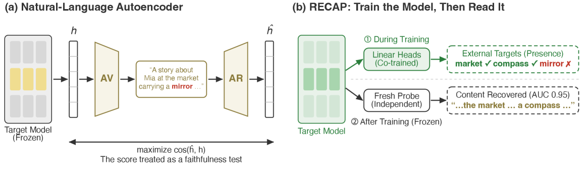

### TL;DR

Natural-language autoencoders judge activation explanations by whether the activation can be **reconstructed** from the explanation. The paper shows this test is passed in two unfaithful ways: (1) the reconstruction tracks the input's *gist* rather than the specific claims (only ~2% of claims in a released Qwen-2.5-7B verbalizer are reconstruction-dependent), and (2) under exact synthetic ground truth, the standard recipe develops **co-adapted private codes** — false wording the reconstruction depends on — in 5/5 runs. Proposes RECAP: linear heads trained alongside the target model to keep designated content decodable.

### Key idea

Two audit protocols — the **grounded-vs-true cross** and the **evaluator swap** — expose the reconstruction test's blind spots without needing new datasets. Then RECAP moves the training pressure onto the *target model* (not the reader): auxiliary linear heads jointly trained keep intended content actually decodable from activations.

### Main finding

On a released Qwen-2.5-7B verbalizer, only ~2% of the specific claims in explanations are reconstruction-dependent — the "faithfulness score" tracks paraphrases, not facts. Standard recipe develops private codes in 5/5 synthetic runs.

### Why it matters

Reconstruction-scored explanations underpin much of modern SAE-and-verbalizer interp; if the reconstruction is fooled by gist, most existing "faithful explanation" claims need re-evaluation. RECAP is a concrete alternative that trains for decodability, not reconstruction.

### Knowledge graph integration

**Builds on / relates to existing pages:**
- [../interpretability/README.md](../interpretability/README.md) — activation-explanation faithfulness is the target.
- [../safety/cot-monitoring.md](../safety/cot-monitoring.md) — same "is this natural-language artifact really about what it claims" problem.

**Suggested new pages:**
- `interpretability/activation-explanation-faithfulness.md` *(depth)* — decodability supervision + audit protocols for verifiable activation explanations.

---

## 11. DocOps

**Authors:** Jiazhen Jiang, Boxi Cao, Lingyong Yan, Yaojie Lu, Hongyu Lin, Shuaiqiang Wang, Dawei Yin, Xianpei Han, Le Sun — *CASIA / Baidu*
**Links:** [arXiv:2607.19865](https://arxiv.org/abs/2607.19865) · [HF](https://huggingface.co/papers/2607.19865) · [AlphaXiv](https://www.alphaxiv.org/abs/2607.19865)
**Topics:** `agents`, `eval`

### TL;DR

A deterministically verifiable benchmark for autonomous agents on complex document workflows (edit, restructure, cross-doc consistency). Decomposes real-world document ops into atomic dimensions and escalating workflow complexity. Frontier configurations still fail on highly coupled long-range tasks, with three consistent failure modes: **long-term state-tracking collapse**, **shallow semantic verification**, and **destructive editing of structural metadata**.

### Key idea

Rather than natural-language rubric grading, DocOps uses **deterministic verifiers** over document state — the answer key is a structural-metadata check, not an LLM judge. Combined with a hierarchical taxonomy from atomic ops to composite workflows so failure modes can be attributed to specific complexity axes.

### Main finding

Even the strongest frontier agents collapse on highly coupled, long-range document tasks. The three named failure modes are consistent across closed- and open-source agent stacks.

### Why it matters

Document manipulation is the workhorse of real workspace agents (M365 Copilot, Notion AI, coding-agent docs edits). A verifiable eval that isolates the failure modes — instead of a wishful correctness score — is directly actionable for agent developers.

### Knowledge graph integration

**Builds on / relates to existing pages:**
- [../agents/README.md](../agents/README.md) — new agent evaluation.
- [../evaluation/README.md](../evaluation/README.md) — deterministic-verifier evaluation methodology.

**Suggested new pages:**
- `agents/document-operation-agents.md` *(depth)* — evaluating agent document ops with deterministic verifiers (DocOps as primary source).

---

## 12. ICAE-Bench

**Authors:** Zhongyuan Peng, Dan Huang, Chuyu Zhang, Caijun Xu, Changyi Xiao, Shibo Hong, David Lo, Lin Qiu, Xuezhi Cao, Jiyuan He, Yixin Cao — *Meituan / Fudan*
**Links:** [arXiv:2607.21217](https://arxiv.org/abs/2607.21217) · [HF](https://huggingface.co/papers/2607.21217) · [AlphaXiv](https://www.alphaxiv.org/abs/2607.21217)
**Topics:** `agents`, `eval`, `code`

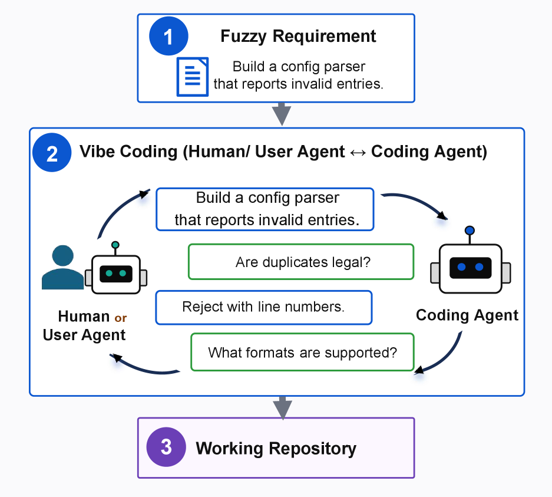

### TL;DR

Existing coding benchmarks give agents fully specified tasks; real "vibe-coding" workflows expect agents to turn fuzzy product intent into working software via clarification, planning, and iteration. ICAE-Bench simulates that with an **automated User Agent** grounded in the ground-truth repo's real behavior, so the User Agent reveals hidden constraints on request without inventing new requirements. 480 tasks across 12 languages; ambiguous project generation remains hard even for the best of six coding models.

### Key idea

Two design decisions do most of the work: (1) each fuzzy task derives from a real open-source repo with executable ground-truth behavior, and (2) the User Agent is **grounded in User Agent Data** — it can reveal hidden constraints via interaction but cannot invent new requirements or leak implementation artifacts. Evaluation combines black-box tests with multi-dimensional diagnostics (functional, semantic, API similarity, structural fidelity, design quality, interaction quality).

### Main finding

**480 tasks across 12 programming languages**; six coding models × two agent frameworks tested. Agents reproduce visible behavior but struggle with hidden constraints, boundary cases, and long-horizon integration.

### Why it matters

Every existing coding benchmark implicitly assumes complete specs; ICAE-Bench is the first to evaluate the interactive-project-building setting realistically. Sets the eval bar for the vibe-coding agent generation.

### Knowledge graph integration

**Builds on / relates to existing pages:**
- [../agents/README.md](../agents/README.md) — interactive-project-building agent setting.
- [../evaluation/humaneval.md](../evaluation/humaneval.md) — moves beyond static specs.
- [../evaluation/livecodebench.md](../evaluation/livecodebench.md) — same domain, different eval philosophy (dynamic-spec vs. contamination-resistant).

**Suggested new pages:**
- `evaluation/icae-bench.md` *(depth)* — interactive-project-building benchmark with a grounded User Agent.

---

## 13. ENTRAP-VL

**Authors:** Undisclosed on HF page
**Links:** [arXiv:2607.20092](https://arxiv.org/abs/2607.20092) · [HF](https://huggingface.co/papers/2607.20092) · [AlphaXiv](https://www.alphaxiv.org/abs/2607.20092)
**Topics:** `multimodal`, `interp`, `eval`

### TL;DR

**Contextual entrainment** is a model's tendency to let auxiliary context pull its output regardless of relevance, truth, or meaning. Well-studied in unimodal LLMs; unexamined in VLMs — where it becomes a *dual* phenomenon (textual and visual entrainment can each be probed independently) and opens a new **veracity** distinction (context that is false of the depicted scene but possible in the world). ENTRAP-VL is a manually curated 1,500-item taxonomic probe (8 categories × 2 axes) built to make VLM entrainment measurable.

### Key idea

The paper's position is that entrainment in VLMs is *substantively different* from the unimodal case — not incremental. So the probe has two streams: a **textual-entrainment stream** (8 context conditions), a **visual-entrainment stream** (3 conditions), each organized along context-association × context-veracity axes. The authors explicitly *do not* claim to measure any model; they ship the instrument.

### Main finding

The dataset itself is the deliverable: 1,500 items across 8 categories with two orthogonal axes, published at huggingface.co/datasets/goyalkaraniit/ENTRAP-VL.

### Why it matters

VLM robustness studies typically port text-only probes; ENTRAP-VL argues for a native multimodal design and provides a shared instrument. Directly useful for red-teaming VLM assistants and for interp research on cross-modal attention shortcuts.

*Borderline: included because dual-modality entrainment probes are a genuinely new evaluation axis, even though the paper doesn't report model results.*

### Knowledge graph integration

**Builds on / relates to existing pages:**
- [../safety/_attacks.md](../safety/_attacks.md) — entrainment is an unintended-influence attack surface.
- [../multimodal/README.md](../multimodal/README.md) — VLM-specific evaluation.

**Suggested new pages:**
- `evaluation/vlm-contextual-entrainment.md` *(depth)* — dual-modality entrainment probing methodology (ENTRAP-VL as primary source).

---

## 14. ActiveVision

**Authors:** Muzi Tao, Shangshang Wang, Ollie Liu, Xuezhe Ma, Willie Neiswanger — *University of Southern California*
**Links:** [arXiv:2607.16165](https://arxiv.org/abs/2607.16165) · [HF](https://huggingface.co/papers/2607.16165) · [AlphaXiv](https://www.alphaxiv.org/abs/2607.16165)
**Topics:** `multimodal`, `eval`

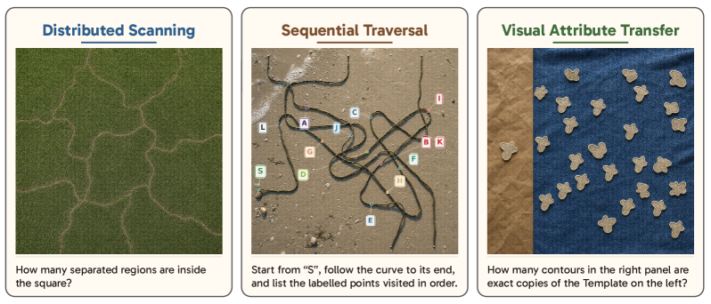

### TL;DR

Human vision is closed-loop — gaze is continuously redirected by intermediate hypotheses. ActiveVision is a **17-task, 3-category** benchmark that forces MLLMs to exercise *repeated* visual perception rather than a single static description. Frontier MLLMs collapse: GPT-5.5 at max reasoning effort solves 10.6%, Claude Fable 5 solves 3.5%, humans average 96.1%. Even letting models write and run their own vision code doesn't close the gap — that code is unreliable, and catching its failures itself requires the active perception the models lack.

### Key idea

Cast active observation as a benchmark axis by designing tasks that are *unsolvable* from a single glance — they require the model to form intermediate hypotheses and re-inspect the image. The 17 tasks span object counting under occlusion, temporal disambiguation across frames, and iterative measurement — chosen so the failure mode is unambiguous.

### Main finding

Frontier MLLMs bottom out at ~3–11% while humans hit 96%. The gap persists even with tool use (write-and-run vision code).

### Why it matters

Argues that current MLLMs lack the perception-reasoning feedback loop, and that scaling reasoning tokens alone won't fix it. Motivates architectures and training objectives targeted at closed-loop perception — a distinct research direction from CoT scaling.

### Knowledge graph integration

**Builds on / relates to existing pages:**
- [../multimodal/README.md](../multimodal/README.md) — MLLM evaluation frontier.
- [../evaluation/README.md](../evaluation/README.md) — new benchmark methodology.

**Suggested new pages:**
- `evaluation/active-observation.md` *(depth)* — active-observation benchmark for MLLMs (ActiveVision as primary source).

---

## 15. Moving Alphabet

**Authors:** Amber Yijia Zheng, Xi Yin — *Meta Superintelligence Labs / Purdue*
**Links:** [arXiv:2607.18789](https://arxiv.org/abs/2607.18789) · [HF](https://huggingface.co/papers/2607.18789) · [AlphaXiv](https://www.alphaxiv.org/abs/2607.18789)
**Topics:** `data`, `diffusion`, `video`

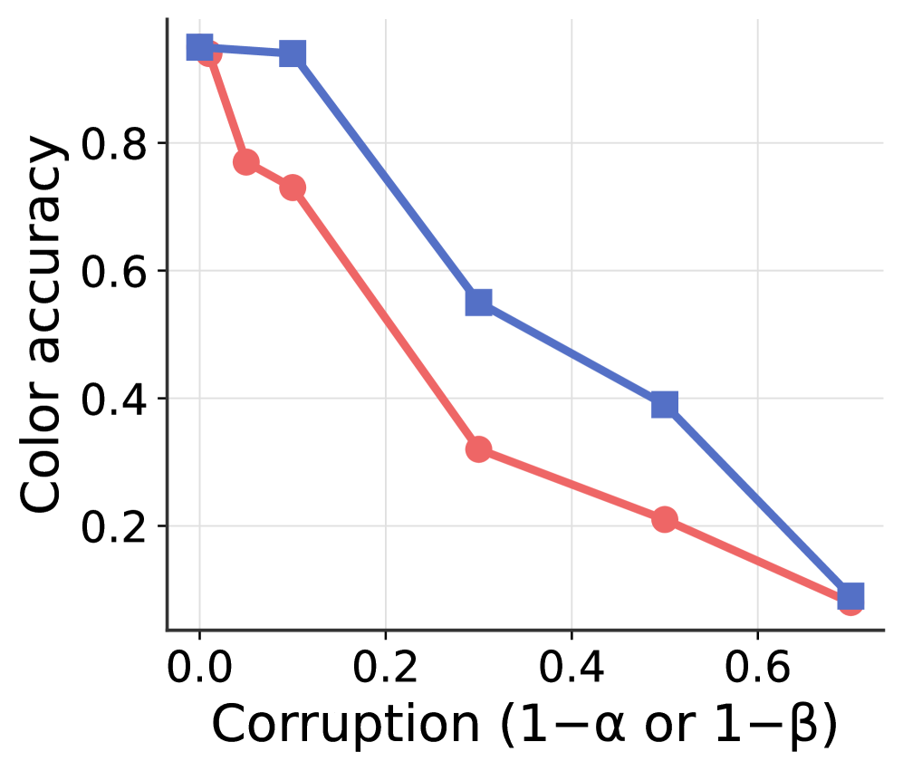

### TL;DR

A **procedural testbed** for text-to-video training data. Renders letters with varying fonts/colors/sizes/positions and movements against a black background, giving precise control over data distribution and caption quality via corruptible ground-truth metadata. Three findings from controlled experiments: (a) diverse balanced content+duration distribution is critical for generalization; (b) caption quality bounds text-to-video by video-understanding quality; (c) classifier-free guidance and high-quality fine-tuning partially recover from corrupt pre-training captions — but not fully.

### Key idea

Replace opaque web-video curation with a **procedural rendering harness** where every training example has ground-truth metadata that can be selectively corrupted. This lets the paper cleanly separate the effects of distribution imbalance from caption noise from architecture choices — normally impossible with scraped data.

### Main finding

(a) balanced distribution is critical, (b) T2V is *bounded* by video-understanding (caption) quality, (c) fine-tuning and CFG recover partially but not fully from corrupt pretraining data.

### Why it matters

Data pieces of the T2V recipe have been folklore-driven; this is one of the first controlled studies. The "bounded by video understanding" claim in particular reframes the T2V bottleneck as a captioning-model problem, not a generation-model problem.

### Knowledge graph integration

**Builds on / relates to existing pages:**
- [../data/_data-curation.md](../data/_data-curation.md) — controlled study of data-curation choices, this time for T2V.
- [../data/quality-filtering.md](../data/quality-filtering.md) — caption-quality vs. training-outcome analysis.

**Suggested new pages:**
- `data/text-to-video-data.md` *(depth)* — training-data design for T2V (Moving Alphabet as primary source).

---

## Notes

- Borderline inclusions are flagged in-section with an italic *Borderline: …* note.
- Hero figures live in `assets/2026-07-23/`. Papers 1 (SLAI T-Rex) and 11 (DocOps) had no arXiv-HTML figures available; figures omitted.
- This digest is informational. No existing concept files, `READING-LIST.md`, or `PAPERS.md` were modified to produce it.
