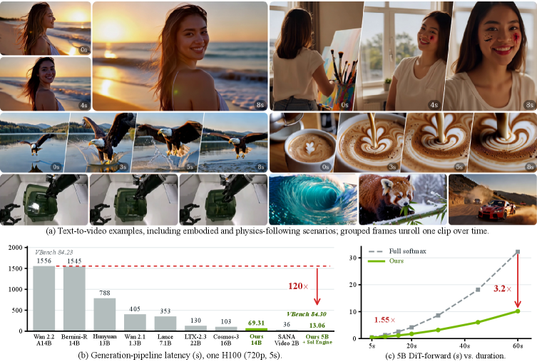
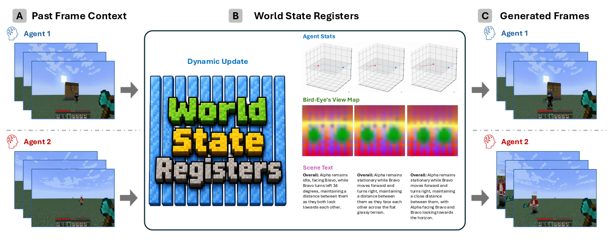
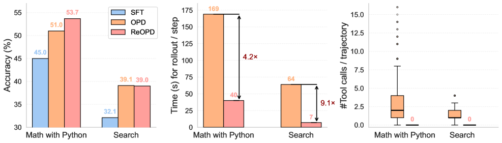
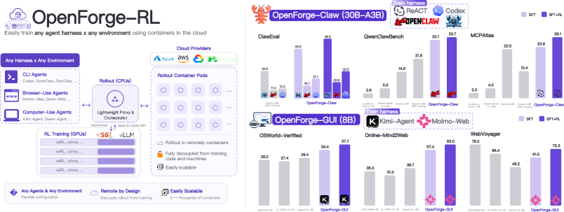
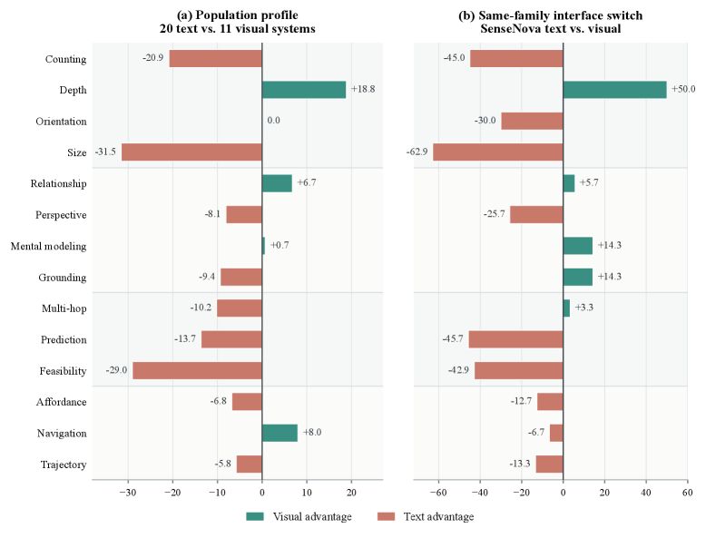
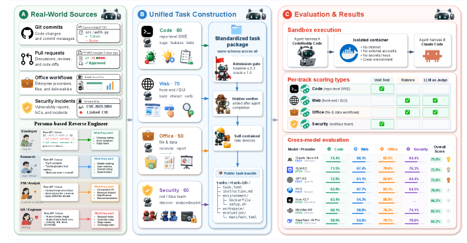
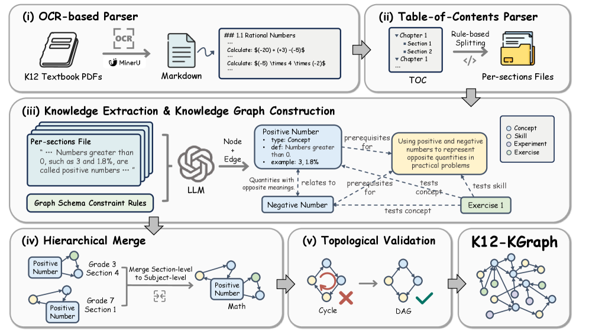

# Daily AI papers — 2026-07-25

*Curated from HF Daily Papers. 14 of 22 papers kept after relevance filter.*

## Papers at a glance

| # | Title | Topics | Org |
| --- | --- | --- | --- |
| 1 | [AREX: Towards a Recursively Self-Improving Agent for Deep Research](#1-arex-towards-a-recursively-self-improving-agent-for-deep-research) | `agents`, `RL`, `reasoning` | (academic collab) |
| 2 | [SANA-Video 2.0: Hybrid Linear Attention with Attention Residuals](#2-sana-video-20-hybrid-linear-attention-with-attention-residuals-for-efficient-video-generation) | `diffusion`, `multimodal`, `efficient-inference` | NVIDIA |
| 3 | [Streaming Multi-Agent Autoregressive Diffusion Model with World State Registers](#3-streaming-multi-agent-autoregressive-diffusion-model-with-world-state-registers) | `diffusion`, `agents`, `multimodal` | UCLA, Adobe |
| 4 | [Multi-Turn On-Policy Distillation with Prefix Replay](#4-multi-turn-on-policy-distillation-with-prefix-replay) | `RL`, `agents`, `post-training` | Microsoft, U. Amsterdam |
| 5 | [Predictive Divergence Masks for LLM RL](#5-predictive-divergence-masks-for-llm-rl) | `RL`, `post-training` | Tencent Hunyuan, UIUC, NUS |
| 6 | [OpenForgeRL: Train Harness-native Agents in Any Environment](#6-openforgerl-train-harness-native-agents-in-any-environment) | `agents`, `RL`, `systems` | Columbia, Dartmouth, MSR |
| 7 | [Sample-Efficient Learning from Agent Experience](#7-sample-efficient-learning-from-agent-experience) | `agents`, `RL`, `post-training` | Monash |
| 8 | [NVIDIA-labs OO Agents: Native Python Object-Oriented Agents](#8-nvidia-labs-oo-agents-native-python-object-oriented-agents) | `agents` | NVIDIA |
| 9 | [Show, Don't Tell: Evaluating Spatial Cognition in Generative Pixels](#9-show-dont-tell-evaluating-spatial-cognition-in-generative-pixels-rather-than-llm-text) | `eval`, `multimodal` | (academic) |
| 10 | [Tencent WorkBuddy Bench](#10-tencent-workbuddy-bench-a-multi-domain-coding-agent-benchmark-with-contamination-resistant-task-construction) | `eval`, `agents` | Tencent |
| 11 | [LLMs Get Lost in Evolving User Intent](#11-llms-get-lost-in-evolving-user-intent) | `eval`, `agents` | Microsoft Research |
| 12 | [K12-KGraph: A Curriculum-Aligned Knowledge Graph for Educational LLMs](#12-k12-kgraph-a-curriculum-aligned-knowledge-graph-for-benchmarking-and-training-educational-llms) | `eval`, `data` | PKU, IAAR |
| 13 | [FinanceComplexQA: Benchmarking Agentic Reasoning on Financial Documents](#13-financecomplexqa-benchmarking-agentic-reasoning-on-industrial-grade-financial-documents) | `eval`, `agents`, `multimodal` | (industrial) |
| 14 | [GraphVid: Interactive Graph-Controllable Video Generation](#14-graphvid-interactive-graph-controllable-video-generation) | `diffusion`, `multimodal` | UIUC (PLAN Lab) |

---

## 1. AREX: Towards a Recursively Self-Improving Agent for Deep Research

**Authors:** Shuqi Lu, Chaofan Li, Kun Luo, Zhang Zhang, Hui Wang, Hongwang Xiao, Zheng Liu, et al.
**Links:** [arXiv:2607.21461](https://arxiv.org/abs/2607.21461) · [HF](https://huggingface.co/papers/2607.21461) · [AlphaXiv](https://www.alphaxiv.org/abs/2607.21461)
**Topics:** `agents`, `RL`, `reasoning`

### TL;DR

AREX reframes deep-research agents around the asymmetry between *finding* a multi-constraint answer (hard) and *verifying* one (decomposable into cheap per-constraint checks). Instead of just searching longer, the agent recursively refines a candidate by verifying intermediate results and using the partially verified state to steer subsequent moves.

### Key idea

A **discovery–verification loop** at every step: propose → decompose into constraint-wise verifiers → keep the partially satisfied substructure → search only over the still-unsatisfied constraints. Verification is treated as a first-class training signal (RL reward + guidance during rollout), so the policy learns *how to leave good partial solutions* rather than starting over on failure.

### Main finding

On multi-constraint deep-research benchmarks the recursive scheme improves solution rate relative to search-longer / best-of-N baselines while keeping tool budgets comparable — the paper positions it as a route to *self-improving* deep-research agents (each verified fragment tightens the search space for the next round).

### Why it matters

Most agent RL treats a rollout as an atom: either the whole answer clears the verifier or it doesn't. AREX makes the verifier *compositional*, which is what deep-research tasks actually look like (a report with 12 required facts, a codebase with 40 tests). If the recursive-verification pattern generalises, it becomes a fresh axis for scaling test-time compute — vertical (deeper verify loops), not just horizontal (more samples).

### Knowledge graph integration

**Builds on / relates to existing pages:**
- [rlvr.md](../post-training/rlvr.md) — verifier-driven reward is exactly RLVR, but applied per-constraint to sub-fragments of an answer.
- [orm.md](../post-training/reasoning/orm.md) — outcome reward models graded on a full answer; AREX decomposes that outcome into per-constraint checks.
- [long-cot-rl.md](../post-training/reasoning/long-cot-rl.md) — recursive refinement is a training-time analogue of long-CoT reasoning at the *agent* granularity.

**Suggested new pages:**
- `agents/deep-research.md` *(depth)* — the deep-research agent problem class and AREX's discovery/verification framing.
- `agents/recursive-verification.md` *(depth)* — the training + inference technique itself.

---

## 2. SANA-Video 2.0: Hybrid Linear Attention with Attention Residuals for Efficient Video Generation

**Authors:** Junsong Chen, Jincheng Yu, Yitong Li, Shuchen Xue, Haozhe Liu, Jingyu Xin, Yuyang Zhao, Tian Ye, Zhangjie Wu, Zian Wang, Daquan Zhou, Ping Luo, Song Han, Enze Xie — *NVIDIA*
**Links:** [arXiv:2607.21553](https://arxiv.org/abs/2607.21553) · [HF](https://huggingface.co/papers/2607.21553) · [AlphaXiv](https://www.alphaxiv.org/abs/2607.21553)
**Topics:** `diffusion`, `multimodal`, `efficient-inference`, `architectures`

### TL;DR

SANA-Video 2.0 is a 5B/14B video DiT that replaces most softmax attention with **gated linear attention**, keeping just enough softmax as periodic anchors to preserve full-rank token interactions. Trained from scratch (not linearized from a softmax model) it matches full-softmax video quality while running dramatically cheaper on long sequences.

### Key idea

**Hybrid Linear–Softmax Attention** at a 3:1 ratio: three gated-linear blocks handle O(N) mixing, then a softmax "anchor" refreshes global structure. **Block Attention Residuals (AttnRes)** pipe completed anchor-block summaries into downstream linear layers so their representations stay full-rank, lifting deep-layer effective rank by ~12%. Reduced-resolution proxy studies fix the 25% softmax share as the quality/efficiency sweet spot.

### Main finding

VBench 84.30 in 13.2s at 480p on a single H100 (40 sampling steps). Compiled DiT forward is 3.2× faster than a matched full-softmax baseline at 720p/60s; the Sol-Engine full-stack (kernel fusion, cache, sparse attention) adds another 3.58×, ending at 13.06s for 5s of 720p — **120× faster than Wan 2.2-A14B** on the same GPU.

### Why it matters

Video diffusion has been quadratic-attention-bound: doubling seconds quadruples cost. A from-scratch hybrid that keeps softmax-level quality with linear scaling changes the frontier of what a single-GPU shop can render. The training-from-scratch (not linearize-after) choice is a strong signal that hybrid architectures are a first-class design point, not a compression artifact.

### Knowledge graph integration

**Builds on / relates to existing pages:**
- [multi-head-attention.md](../architectures/multi-head-attention.md) — anchor blocks are standard MHA; the hybrid slots them into a linear-attention backbone.
- [mla.md](../architectures/mla.md) — same "attention variant for cheaper long-context" family, different mechanism (rank compression vs. linearization).

**Suggested new pages:**
- `architectures/hybrid-linear-softmax-attention.md` *(depth)* — the 3:1 gated-linear + softmax-anchor pattern with AttnRes routing.
- `architectures/_attention-variants.md` *(taxonomy)* — the graph lacks a variants taxonomy pulling GQA/MLA/linear/hybrid together.

---

## 3. Streaming Multi-Agent Autoregressive Diffusion Model with World State Registers

**Authors:** Sicheng Mo, Yuheng Li, Ziyang Leng, Krishna Kumar Singh, Bolei Zhou — *UCLA, Adobe Research*
**Links:** [arXiv:2607.21594](https://arxiv.org/abs/2607.21594) · [HF](https://huggingface.co/papers/2607.21594) · [AlphaXiv](https://www.alphaxiv.org/abs/2607.21594)
**Topics:** `diffusion`, `agents`, `multimodal`

### TL;DR

WorldWeaver (W²) is a streaming multi-agent video diffusion model whose novelty is **world state registers** — learnable tokens that persist shared world facts across agents and views, updated after each generated chunk. Multi-agent worlds finally stop drifting because state stops living in the observation stream.

### Key idea

Replace observation-history conditioning with **learnable state registers**: separate tokens for shared world state, individual agent status, and (with supervision) global bird's-eye views and scene text. A **Mixture-of-Transformers** split gives world modeling and visual frame modeling their own weight sets so state gradients don't fight pixel gradients.

### Main finding

On two-agent Minecraft video generation, explicit world-state modeling improves logical consistency and generation quality over pipelines that carry observation history in-context — measured across cross-agent coherence and long-horizon stability metrics.

### Why it matters

Interactive world models are trying to become the substrate for embodied agents, game AI, and multi-agent simulators — and their long-horizon consistency has been the bottleneck. Register-style persistent state is a clean, transferable primitive; combining it with MoT gives a template for scaling multi-agent generative worlds without rebuilding the observation history at every step.

### Knowledge graph integration

**Builds on / relates to existing pages:**
- [_moe.md](../architectures/_moe.md) — the Mixture-of-Transformers block-level routing is a coarse-grained MoE variant.

**Suggested new pages:**
- `multimodal/world-state-registers.md` *(depth)* — persistent register tokens for multi-agent video diffusion.
- `multimodal/_world-models.md` *(taxonomy)* — the graph has no multimodal depth files yet; a world-models taxonomy would anchor this class.

---

## 4. Multi-Turn On-Policy Distillation with Prefix Replay

**Authors:** Baohao Liao, Hanze Dong, Christof Monz, Xinxing Xu, Li Dong, Furu Wei — *Microsoft Research, University of Amsterdam*
**Links:** [arXiv:2607.04763](https://arxiv.org/abs/2607.04763) · [HF](https://huggingface.co/papers/2607.04763) · [AlphaXiv](https://www.alphaxiv.org/abs/2607.04763)
**Topics:** `RL`, `agents`, `post-training`

### TL;DR

ReOPD is an off-environment substitute for online multi-turn on-policy distillation. Instead of re-rolling out the student against the environment on every update, it **replays pre-collected teacher trajectory prefixes**, then lets the student act at selected steps while the teacher provides dense per-step supervision. No fresh environment interaction; the on-policy signal survives.

### Key idea

Formalises the **prefix trap** — the tradeoff between (a) sampling histories that look student-on-policy so supervision is *relevant*, and (b) staying close to histories the teacher labels *reliably*. ReOPD picks a **step-decaying sampling schedule** that emphasises early, low-shift prefixes and rarefies deep-in-history student actions, trading a tolerable relevance loss for reliability.

### Main finding

Multi-turn agentic tasks show that ReOPD retains the gains of fully-online OPD without per-update environment rollouts — the concrete benchmark numbers are in the paper, but the mechanism story is the load-bearing contribution.

### Why it matters

On-policy distillation is the current best recipe for turning a large teacher into a small on-policy agent, but the "on-policy" part costs a fresh environment run every update. If a step-decaying prefix schedule can approximate that signal from a fixed trajectory buffer, agentic distillation becomes tractable on the same hardware as ordinary SFT.

### Knowledge graph integration

**Builds on / relates to existing pages:**
- [rejection-sampling.md](../post-training/rejection-sampling.md) — same off-policy-data-reuse family as prefix replay, but ReOPD supervises per-step not per-outcome.
- [_rl.md](../post-training/_rl.md) — the reliability-vs-relevance framing is the classical on-policy/off-policy tradeoff, cast for teacher-student.
- [partial-rollouts.md](../systems/partial-rollouts.md) — prefix replay is the training-side analogue of serving-side partial rollouts.

**Suggested new pages:**
- `post-training/on-policy-distillation.md` *(depth)* — OPD as a class, with ReOPD as the multi-turn variant.
- `post-training/replayed-prefix-opd.md` *(depth)* — the specific ReOPD algorithm and its step-decaying schedule.

---

## 5. Predictive Divergence Masks for LLM RL

**Authors:** Xiangxin Zhou, Jiarui Yao, Penghui Qi, Bowen Ping, Jiaqi Tang, Haonan Wang, Tianyu Pang — *Tencent Hunyuan, UIUC, NUS*
**Links:** [arXiv:2607.10848](https://arxiv.org/abs/2607.10848) · [HF](https://huggingface.co/papers/2607.10848) · [AlphaXiv](https://www.alphaxiv.org/abs/2607.10848)
**Topics:** `RL`, `post-training`

### TL;DR

Practical LLM RL is always slightly off-policy (training / inference mismatch, policy staleness), so importance ratios have to correct for divergence between behaviour and target policies — but sampled ratios are noisy. **Predictive Divergence Masks (PDM)** replace the sampled ratio with the *directional derivative* of the divergence, using it as a per-token binary mask on the gradient update.

### Key idea

Rather than reweighting each token by an importance ratio, ask a cheaper predictive question: *would this gradient step increase policy divergence?* If yes, mask it. The mask is derived analytically from the divergence gradient, sidestepping the high-variance sampled ratio and its clipping heuristics (which dominate PPO/GRPO tuning at scale).

### Main finding

PDM stabilises off-policy LLM RL and improves the reasoning/alignment metrics that GRPO-style setups target, with less sensitivity to the clip range and staleness knobs.

### Why it matters

Every large-scale post-training run pays a tax on the sampled-importance-ratio: clip ranges, KL penalties, and reference-model comparisons all exist to keep it from blowing up. A predictive, sample-free surrogate for divergence movement is exactly the kind of ingredient that would slot into every serious RL post-training stack.

### Knowledge graph integration

**Builds on / relates to existing pages:**
- [ppo.md](../post-training/ppo.md) — PPO's clipped importance ratio is the failure mode PDM avoids.
- [grpo.md](../post-training/grpo.md) — GRPO inherits the same off-policy correction structure; PDM is a drop-in for that machinery.
- [online-policy-mirror-descent.md](../post-training/reasoning/online-policy-mirror-descent.md) — same "control the KL step size" concern, different mechanism.

**Suggested new pages:**
- `post-training/predictive-divergence-mask.md` *(depth)* — the PDM technique itself.

---

## 6. OpenForgeRL: Train Harness-native Agents in Any Environment

**Authors:** Xiao Yu, Baolin Peng, Ruize Xu, Hao Zou, Qianhui Wu, Hao Cheng, Wenlin Yao, Nikhil Singh, Zhou Yu, Jianfeng Gao — *Columbia, Dartmouth, Microsoft Research*
**Links:** [arXiv:2607.21557](https://arxiv.org/abs/2607.21557) · [HF](https://huggingface.co/papers/2607.21557) · [AlphaXiv](https://www.alphaxiv.org/abs/2607.21557)
**Topics:** `agents`, `RL`, `systems`

### TL;DR

Modern agents (Claude Code, Codex, OpenClaw) live inside elaborate inference harnesses that handle tool use, memory, and external system access — none of which are visible to open training stacks. OpenForgeRL is an infrastructure layer that lets researchers train the model **inside the real harness it will be deployed with**, so the training distribution matches the deployment distribution.

### Key idea

Frame the harness (not the model call) as the training environment: the RL loop sees whatever multi-turn tool-use flow the harness produces, gradients backprop through the model's calls, and evaluation/serving share the same execution graph. This closes the sim-to-real gap that has plagued agent training with hand-written toy environments.

### Main finding

The contribution is the framework and its demonstrations across multiple harnesses; the paper argues that harness-native training measurably closes the gap between training-time and deployment-time performance on the same task.

### Why it matters

Everyone in agent research has been training against a scripted proxy of the real harness, then paying a distribution-shift tax at deployment. If OpenForgeRL delivers on the "train where you serve" promise, it becomes the natural substrate for a wave of RL post-training papers on production-style agent stacks.

### Knowledge graph integration

**Builds on / relates to existing pages:**
- [ray.md](../systems/ray.md) — comparable systems-layer contribution, one level up: Ray for compute orchestration, OpenForge for harness orchestration.
- [rlvr.md](../post-training/rlvr.md) — harness-native rewards are the natural home for verifiable-reward training.
- [_rl.md](../post-training/_rl.md) — infrastructure counterpart to the RL-algorithms taxonomy.

**Suggested new pages:**
- `agents/harness-native-training.md` *(depth)* — the paradigm and OpenForgeRL as its first system.
- `agents/_agent-rl-systems.md` *(taxonomy)* — the agent-training-systems space (SkyRL, verl, Nemo-Aligner, OpenForgeRL).

---

## 7. Sample-Efficient Learning from Agent Experience

**Authors:** Chenhui Gou, Haoqin Tu, Yunhao Fang, Jianfei Cai, Hamid Rezatofighi — *Monash*
**Links:** [arXiv:2607.21051](https://arxiv.org/abs/2607.21051) · [HF](https://huggingface.co/papers/2607.21051) · [AlphaXiv](https://www.alphaxiv.org/abs/2607.21051)
**Topics:** `agents`, `RL`, `post-training`

### TL;DR

In-context learning from an agent's own interaction history is wildly sample-efficient — until you evict the context and the gains disappear. This paper defines **Experience Distillation**: internalise in-context wins into the weights *without spending any new environment samples*, using only the already-collected trajectories.

### Key idea

Rather than SFT-ing on the interaction transcripts (which barely helps — see below) or re-running RL (which needs new rollouts), reuse the ICL setup as a teacher-student signal: the in-context prompt embodies the improved policy; distill it into the base model via the same context but shifted into weight-space via context distillation.

### Main finding

Across 749 curated software-engineering tasks and six text-adventure games, Experience Distillation **retains ≥64.8%** of the in-context-learning gain, versus **3.8%** for plain SFT on the same trajectories. Compared to classical RL baselines it matches performance with **≥9.6× fewer environment samples**.

### Why it matters

Environment interaction is the scarce resource for agent training — real SWE tasks and human-feedback rollouts cost minutes-to-hours each. An algorithm that turns *free* ICL improvement into *persistent* model improvement, using zero fresh interactions, is the sample-efficiency curve everyone's been chasing.

### Knowledge graph integration

**Builds on / relates to existing pages:**
- [rejection-sampling.md](../post-training/rejection-sampling.md) — closest existing "reuse trajectories to update weights" recipe.
- [_post-training.md](../post-training/_post-training.md) — sits alongside SFT/RLHF as a new post-training paradigm.

**Suggested new pages:**
- `agents/experience-distillation.md` *(depth)* — the technique and its ICL→weights loop.
- `post-training/context-distillation.md` *(depth)* — the underlying primitive (context distillation) is not yet covered in the graph.

---

## 8. NVIDIA-labs OO Agents: Native Python Object-Oriented Agents

**Authors:** Paul Furgale, Severin Klingler, James Nolan, Matt Staats, Gaia Di Lorenzo, Elisa Martinez Abad, Christian Schüller, Razvan Dinu, Alessio Devoto, Pascal Berard, Gal Kaplun, Elad Sarafian, Riccardo Roveri, Leon Derczynski, Ricardo Silveira Cabral — *NVIDIA*
**Links:** [arXiv:2607.20709](https://arxiv.org/abs/2607.20709) · [HF](https://huggingface.co/papers/2607.20709) · [AlphaXiv](https://www.alphaxiv.org/abs/2607.20709)
**Topics:** `agents`

### TL;DR

An agent is a Python object. Its methods are the actions the model can take, its fields are its state, docstrings become prompts, and type annotations become tool contracts. NOOA (NVIDIA Object-Oriented Agents) collapses the usual split between prompt templates, tool schemas, callback code and workflow graphs into ordinary Python.

### Key idea

Use Python's existing language surface as the agent DSL: introspect `__doc__` for prompts, `typing.Annotated` for tool argument descriptions, method signatures for tool schemas, and instance attributes for shared state. The result is a model-agnostic framework where the same object is the agent, the tool interface, and the state store.

### Main finding

The contribution is the framework and its ergonomics — the demonstration is that entire agent workflows collapse to a few dozen lines of Python without giving up prompt/tool discoverability.

### Why it matters

Every agent framework so far has been YAML-in-Python or graph-of-nodes-in-YAML. If a plain object model can carry the same expressivity, the barrier to sharing/composing agents drops sharply and code-based agents become easier to reason about with normal software tooling.

### Knowledge graph integration

**Builds on / relates to existing pages:** none yet — the graph has no agent-framework depth files.

*(No suggested new pages — this is engineering framework work; a case study is possible if the paper grows into a body of practice, but a depth file today would be thin.)*

---

## 9. Show, Don't Tell: Evaluating Spatial Cognition in Generative Pixels Rather Than LLM Text

**Authors:** (not shown on HF page)
**Links:** [arXiv:2607.21072](https://arxiv.org/abs/2607.21072) · [HF](https://huggingface.co/papers/2607.21072) · [AlphaXiv](https://www.alphaxiv.org/abs/2607.21072)
**Topics:** `eval`, `multimodal`

### TL;DR

Spatial reasoning benchmarks force models to answer in coordinates or text, which is a bad fit for image-generation models that could just *draw* the answer. **ProVisE** (Protocolized Visual Evaluation) elicits protocol-constrained visual answers from image-generation models and parses them into structured predictions compatible with the existing metric. **SpatialGen-Bench** is a 470-sample diagnostic across 14 spatial subtasks under this framework.

### Key idea

Two moving parts: (1) a per-benchmark **answer protocol** that pins down how a picture is to be interpreted as a structured answer (points, boxes, paths, masks, colors), and (2) an **agentic builder** that automates protocol construction on new benchmarks. The parser closes the loop so an image-out model competes on the *same metric* as a text-out VLM.

### Main finding

Image-generation models are competitive on tasks where the answer is naturally spatial and directly expressible in pixels; text-output VLMs retain the lead on compositional spatial reasoning. Agentic protocol construction transfers cleanly to six external spatial benchmarks.

### Why it matters

The benchmark ecosystem has quietly assumed text output; that assumption has hidden a whole capability axis for generative models. A metric-compatible testbed for "answer by drawing" opens image-generation systems to the same eval discipline that text-output LLMs have benefited from, and vice-versa.

### Knowledge graph integration

**Builds on / relates to existing pages:**
- [mmlu.md](../evaluation/mmlu.md) — same class of capability benchmark, opposite output modality.

**Suggested new pages:**
- `evaluation/provise-spatialgen.md` *(depth)* — the protocol-parser evaluation method and the benchmark.
- `evaluation/_multimodal-benchmarks.md` *(taxonomy)* — the evaluation folder has no multimodal-benchmark taxonomy.

---

## 10. Tencent WorkBuddy Bench: A Multi-Domain Coding-Agent Benchmark with Contamination-Resistant Task Construction

**Authors:** Siqi Cai, Shaopeng Chen, Xiang Fei, Yong Mao, Zihan Xu, Zhiheng Lyu, et al. — *Tencent (Youtu Lab, Keen Security Lab, Workbuddy, Yunding Security Lab)*
**Links:** [arXiv:2607.20911](https://arxiv.org/abs/2607.20911) · [HF](https://huggingface.co/papers/2607.20911) · [AlphaXiv](https://www.alphaxiv.org/abs/2607.20911)
**Topics:** `eval`, `agents`

### TL;DR

WorkBuddy is a coding-agent benchmark whose central design move is **contamination resistance by task construction**: every task is reverse-engineered from a real commit / PR / business scenario and rewritten as a short, colloquial, role-played request whose prompt cannot be recovered by web-searching the underlying issue. Four subsets — repo engineering, front-end dev, office/business workflows, red/blue-team security — run on two harnesses (CodeBuddy Code, Claude Code).

### Key idea

Instead of secrecy (which decays the moment the benchmark is used), lean on **construction + versioning**: the prompt cannot be traced back to a public artifact even though the artifact itself is open. Each subset uses its own verification style and its own scoring instrument, so no suite-wide average is reported.

### Main finding

Full open release of task directories, environment images, and reference solutions, with a cross-model leaderboard across two agent harnesses; the reproducibility surface is unusually large for a contamination-focused benchmark.

### Why it matters

Coding-agent benchmarks (SWE-bench and descendants) are constantly at risk of contamination once model providers see the task text. A pipeline that makes contamination detectable *and* the benchmark reproducible is the sort of infrastructure the field needs before "our agent scores X" claims stabilise.

### Knowledge graph integration

**Builds on / relates to existing pages:**
- [livecodebench.md](../evaluation/livecodebench.md) — same contamination-aware framing (LCB uses recency windows; WorkBuddy uses prompt rewrites).
- [humaneval.md](../evaluation/humaneval.md) — the older coding benchmark WorkBuddy positions against.
- [codeforces-benchmark.md](../evaluation/codeforces-benchmark.md) — same competitive-programming-style scoring lineage.

**Suggested new pages:**
- `evaluation/contamination-resistant-benchmarks.md` *(depth)* — the construction pattern (reverse-engineer + prompt-rewrite + versioning).
- `evaluation/workbuddy-bench.md` *(depth)* — the benchmark itself.

---

## 11. LLMs Get Lost in Evolving User Intent

**Authors:** Jihoon Tack, Philippe Laban, Jennifer Neville — *Microsoft Research*
**Links:** [arXiv:2607.20734](https://arxiv.org/abs/2607.20734) · [HF](https://huggingface.co/papers/2607.20734) · [AlphaXiv](https://www.alphaxiv.org/abs/2607.20734)
**Topics:** `eval`, `agents`

### TL;DR

Almost every LLM benchmark hands the model a fully-specified prompt up-front. Real users don't — they reveal intent, revise it, and sometimes redirect it mid-conversation. This paper introduces a **framework that mechanically transforms any single-turn benchmark into a multi-turn evolving-intent benchmark**, preserving the original metric so no new annotation is needed.

### Key idea

The transformation is protocol-level: an "evolving user" driver reveals sub-parts of the true intent across turns and can perform mid-conversation revisions/redirections; the target model must track, integrate, and act. Because the underlying benchmark evaluation is unchanged, static-vs-evolving performance drops are directly comparable.

### Main finding

Across multiple task families and model families, **strong static-setting performance does not transfer** to the evolving-intent setting — substantial drops appear consistently. The framework surfaces a capability gap that static benchmarks hide entirely.

### Why it matters

Agent evaluation has been optimising for a distribution users don't inhabit. If a cheap, annotation-free transformation exposes a robust and consistent capability gap, it should become part of every benchmark's default protocol — much as chain-of-thought prompting quietly became universal.

### Knowledge graph integration

**Builds on / relates to existing pages:**
- [ifeval.md](../evaluation/ifeval.md) — instruction-following eval, single-turn; the natural before/after comparison target.
- [mmlu.md](../evaluation/mmlu.md) — same benchmark-transformation target class.

**Suggested new pages:**
- `evaluation/evolving-intent-benchmark.md` *(depth)* — the single-turn→multi-turn transformation framework.

---

## 12. K12-KGraph: A Curriculum-Aligned Knowledge Graph for Benchmarking and Training Educational LLMs

**Authors:** Qihan Lin, Zhaoyang Han, Xiaochen Ma, Zhen Hao Wong, Meiyi Qiang, Linzhuang Sun, Wentao Zhang — *Peking University, IAAR-Shanghai, OriginHub Technology, Zhongguancun Academy*
**Links:** [arXiv:2605.09635](https://arxiv.org/abs/2605.09635) · [HF](https://huggingface.co/papers/2605.09635) · [AlphaXiv](https://www.alphaxiv.org/abs/2605.09635)
**Topics:** `eval`, `data`

### TL;DR

K12-KGraph is a knowledge graph extracted from the official People's Education Press K-12 textbooks (math, physics, chemistry, biology), plus two derived resources: **K12-Bench** (23,640-question multi-select benchmark across five graph-derived task families) and **K12-Train** (7,335 KG-guided SFT samples).

### Key idea

Anchor both evaluation and training data to a *curriculum-aligned* KG rather than to crawled or synthetic corpora. Because the KG carries prerequisite structure, both the benchmark tasks (concept ↔ prereq ↔ subskill relations) and the SFT curriculum can be graph-derived rather than heuristic-generated.

### Main finding

Even strong proprietary models (e.g. Gemini-3-Flash) reach only **~57% exact match** on curriculum-cognition tasks; K12-Train **beats equally-sized subsets of eight mainstream instruction-tuning corpora** for downstream curriculum competence.

### Why it matters

Two contributions worth watching: (a) another datapoint that curriculum-aligned data outperforms undifferentiated instruction-tuning corpora at fixed budget, and (b) a template for building KG-driven benchmarks in domains where a canonical curriculum already exists (medicine, law, standard exams).

*Borderline: included because the SFT-data construction method (KG-guided sampling from a curriculum graph) has transferable technique value beyond the education vertical.*

### Knowledge graph integration

**Builds on / relates to existing pages:**
- [quality-filtering.md](../data/quality-filtering.md) — same "structured signal beats scale" data-selection theme.
- [_data-curation.md](../data/_data-curation.md) — extends the curation taxonomy with a graph-guided variant.

**Suggested new pages:**
- `data/kg-guided-sft-data.md` *(depth)* — the KG-anchored SFT data-construction recipe.

---

## 13. FinanceComplexQA: Benchmarking Agentic Reasoning on Industrial-grade Financial Documents

**Authors:** (industrial collaboration — full list not shown on HF page)
**Links:** [arXiv:2607.19238](https://arxiv.org/abs/2607.19238) · [HF](https://huggingface.co/papers/2607.19238) · [AlphaXiv](https://www.alphaxiv.org/abs/2607.19238)
**Topics:** `eval`, `agents`, `multimodal`

### TL;DR

FinanceComplexQA is a bilingual (zh/en) benchmark of **2,026 expert-level questions over 1,009 real financial documents**, built around a Finance-LaTeX SKILL framework that synthesises documents with real layout complexity (tables, forms, charts, footnotes). Evaluation uses an **agent-as-a-judge** protocol scoring accuracy, numeric correctness, coverage, faithfulness, completeness, and cost.

### Key idea

Push past retrieval-QA benchmarks by demanding **dual-context reasoning** (explicit document evidence *plus* implicit financial domain knowledge) and **cross-layout reasoning** (integrate text, tables, forms, captions). Multi-dimensional agent-as-a-judge scoring lets the benchmark expose failure modes (numeric drift, layout confusion, over-synthesis) that a single-accuracy metric hides.

### Main finding

Layout-aware retrieval (PageIndex) is highly competitive with agentic systems on structured evidence; agentic systems win overall but at **31–45k tokens vs 13–16k**. Performance spans 37–91% accuracy depending on scenario. Systematic failures: numeric drift, layout confusion, evidence omission, over-synthesis.

### Why it matters

Two useful contributions: (a) a benchmark demanding capabilities (multi-layout, dual-context) that are actually the bottleneck in industry deployments, and (b) a multi-metric agent-as-a-judge protocol that is directly reusable outside finance.

*Borderline: included because agent-as-a-judge scoring is a transferable evaluation technique.*

### Knowledge graph integration

**Builds on / relates to existing pages:**
- [ifeval.md](../evaluation/ifeval.md) — multi-dimensional scoring lineage.

**Suggested new pages:**
- `evaluation/agent-as-a-judge.md` *(depth)* — the multi-dimensional scoring protocol as a reusable eval method.

---

## 14. GraphVid: Interactive Graph-Controllable Video Generation

**Authors:** Vedant Shah, Onkar Susladkar, Tushar Prakash, Kiet Nguyen, Tianjio Yu, Adheesh Juvekar, Muntasir Waheed, Ismini Lourentzou — *PLAN Lab, University of Illinois Urbana-Champaign*
**Links:** [arXiv:2607.21580](https://arxiv.org/abs/2607.21580) · [HF](https://huggingface.co/papers/2607.21580) · [AlphaXiv](https://www.alphaxiv.org/abs/2607.21580)
**Topics:** `diffusion`, `multimodal`

### TL;DR

Text prompts and per-object trajectories are both bad interfaces for controlling multi-subject video interactions. GraphVid is a graph-conditioned image-to-video model whose control signal is a **structured interaction graph** — nodes are subjects, edges are relations — plus GraphVid-Bench, a large-scale interaction-centric video dataset with structured relational annotations.

### Key idea

Condition an image-to-video diffusion model on a semantic **interaction graph** (subject → relation → subject), so users specify *what interacts with what* rather than *where each pixel goes*. GraphVid-Bench provides the training substrate that makes this interaction-aware conditioning learnable end-to-end.

### Main finding

With substantially less training data and fewer trainable parameters than motion-control baselines, GraphVid **reduces FID by up to 39.9% and FVD by 37.6%** vs Motion-I2V, and lifts PSNR (9.87→15.98) and SSIM (0.38→0.61).

### Why it matters

Controllability is the current bottleneck in video generation; motion trajectories don't scale past a few objects. A semantic-graph interface is a natural human-facing control primitive and — because it composes with existing image-to-video backbones — a plausible layer to standardise on for interactive video tools.

### Knowledge graph integration

*(No suggested new pages — the graph currently has no video-diffusion depth files; a first-pass taxonomy would be needed before this technique earns a depth file.)*

---

## Notes

- Curated from HF Daily Papers (page dated 2026-07-25). 14 of 22 papers kept; 8 skipped as pure computer vision (ReferTrack, Visual Contrastive Self-Distillation, Recurrent Sinusoidal INRs, Color Pass-Through), robotics/manipulation-only (TableVerse, Robostral Navigate), pure representation learning (Self-Supervised Learning of Structured Dynamics), or off-topic (Dataset Distillation by Influence Matching).
- Hero figures live in `assets/2026-07-25/`. Missing figures for #7 (Sample-Efficient Learning), #11 (LLMs Get Lost), #13 (FinanceComplexQA), #14 (GraphVid) — no usable `og:image` and arXiv HTML figures unavailable at digest time.
- Borderline inclusions flagged in-section: #12 (K12-KGraph), #13 (FinanceComplexQA).
- This digest is informational. No existing concept files, `READING-LIST.md`, or `PAPERS.md` were modified.
