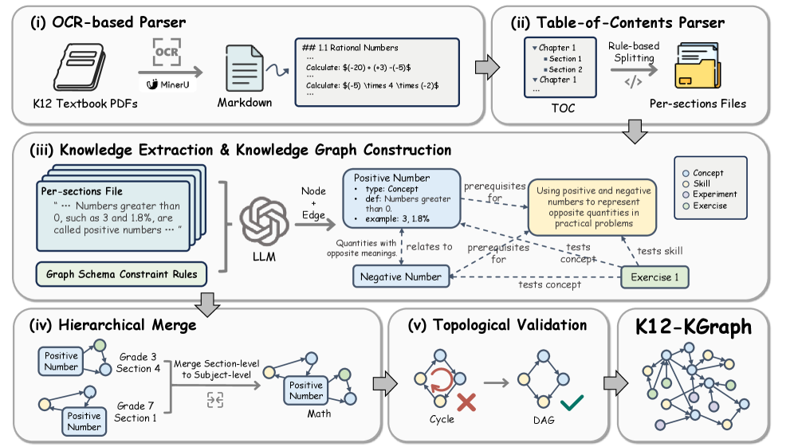
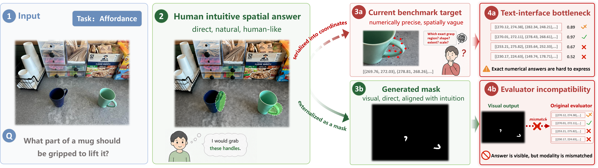
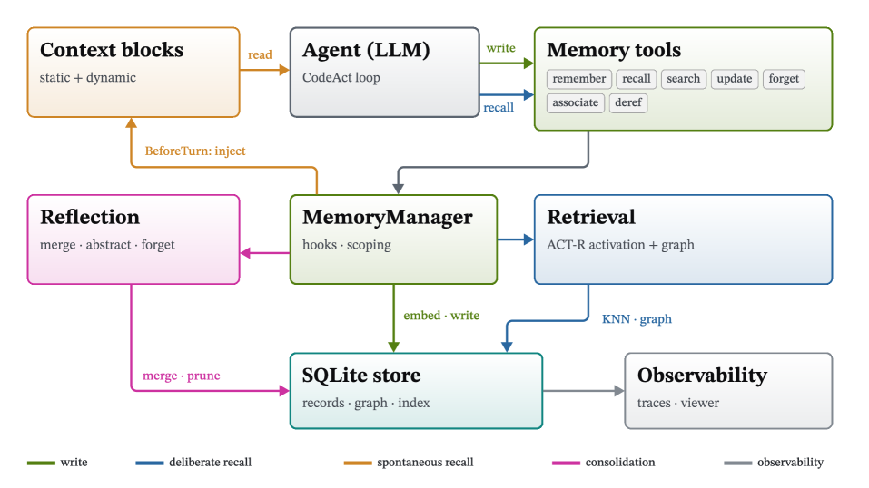
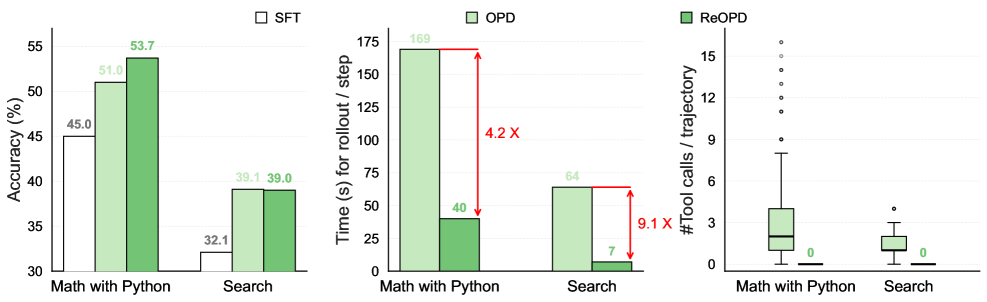
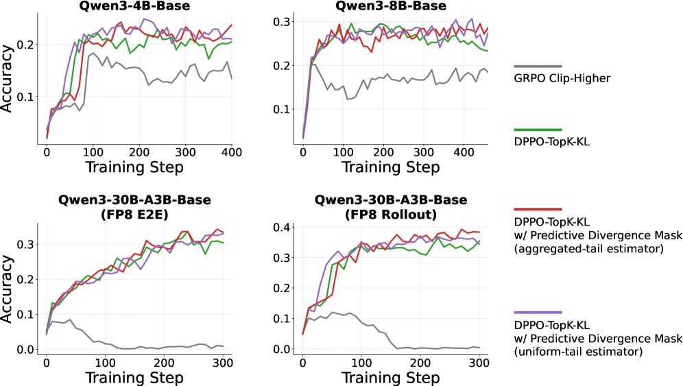
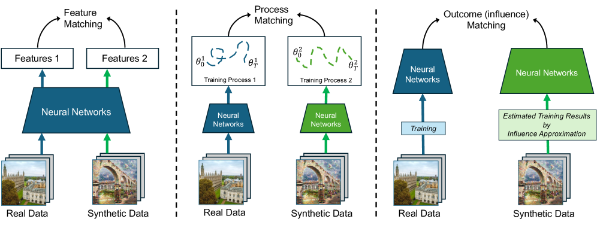

# Daily AI papers — 2026-07-26

*Curated from HF Daily Papers. 15 of 22 papers kept after relevance filter.*

## Papers at a glance

| # | Title | Topics | Org |
| --- | --- | --- | --- |
| 1 | [AREX: Towards a Recursively Self-Improving Agent for Deep Research](#1-arex) | `agents`, `deep-research`, `self-improvement` | Peking / IAAR-Shanghai |
| 2 | [K12-KGraph: A Curriculum-Aligned Knowledge Graph for Educational LLMs](#2-k12-kgraph) | `eval`, `data`, `LLM` | Peking / IAAR-Shanghai |
| 3 | [Show, Don't Tell: Evaluating Spatial Cognition in Generative Pixels](#3-show-dont-tell) | `multimodal`, `eval`, `diffusion` | (undisclosed) |
| 4 | [SANA-Video 2.0: Hybrid Linear Attention with Attention Residuals](#4-sana-video-20) | `diffusion`, `video`, `efficient-inference`, `attention` | NVIDIA |
| 5 | [NVIDIA-labs OO Agents: Native Python Object-Oriented Agents](#5-nvidia-oo-agents) | `agents`, `framework` | NVIDIA |
| 6 | [Tencent WorkBuddy Bench: A Multi-Domain Coding-Agent Benchmark](#6-workbuddy-bench) | `eval`, `agents`, `coding` | Tencent |
| 7 | [LLMs Get Lost in Evolving User Intent](#7-llms-get-lost) | `eval`, `agents`, `multi-turn` | Microsoft Research |
| 8 | [Sample-Efficient Learning from Agent Experience](#8-sample-efficient-experience) | `agents`, `RL`, `distillation` | Monash / UC Santa Cruz |
| 9 | [Streaming Multi-Agent Autoregressive Diffusion (WorldWeaver)](#9-worldweaver) | `diffusion`, `video`, `world-model`, `MoE` | UCLA / Adobe |
| 10 | [Multi-Turn On-Policy Distillation with Prefix Replay (ReOPD)](#10-reopd) | `post-training`, `distillation`, `agents` | Microsoft Research |
| 11 | [Predictive Divergence Masks for LLM RL](#11-pdm) | `post-training`, `RL`, `reasoning` | Tencent Hunyuan / UIUC / NUS |
| 12 | [FinanceComplexQA: Agentic Reasoning on Financial Documents](#12-financecomplexqa) | `eval`, `agents`, `RAG` | (industrial consortium) |
| 13 | [OpenForge RL: Train Harness-native Agents in Any Environment](#13-openforge-rl) | `agents`, `RL`, `systems` | Columbia / Dartmouth / MSR |
| 14 | [GraphVid: Interactive Graph-Controllable Video Generation](#14-graphvid) | `diffusion`, `video`, `controllable-generation` | UIUC (PLAN Lab) |
| 15 | [Dataset Distillation by Influence Matching](#15-inf-match) | `data`, `dataset-distillation`, `interp` | HKU / CUHK / Stanford |

---

## 1. AREX: Towards a Recursively Self-Improving Agent for Deep Research

**Authors:** Shuqi Lu, Chaofan Li, Kun Luo, Zhang Zhang, Hui Wang et al. — *Peking University, IAAR-Shanghai, OriginHub*
**Links:** [arXiv:2607.21461](https://arxiv.org/abs/2607.21461) · [HF](https://huggingface.co/papers/2607.21461) · [AlphaXiv](https://www.alphaxiv.org/abs/2607.21461)
**Topics:** `agents`, `deep-research`, `self-improvement`

### TL;DR

A deep-research agent framework built on the observation that verifying a multi-constraint answer is much cheaper than discovering it. AREX splits work into an **inner research loop** that collects evidence and produces a candidate answer, and an **outer self-improvement loop** that decomposes the answer into per-constraint checks, audits each, and dispatches targeted follow-up research on whatever fails.

### Key idea

Constraint-wise verification as the driver of recursion. Rather than one giant "think harder" pass, AREX decomposes the user's query into tractable constraints, verifies each against gathered evidence, and re-plans research only for the constraints that remain unsatisfied. The self-improvement loop is the outer supervisor over the inner deep-research agent — the same LLM playing both auditor and researcher.

### Main finding

Tops the HF board (140 upvotes) with a benchmark performance figure showing sizeable gains over single-pass deep-research baselines. Exact numbers are shown in Figure 1 but not spelled out in the abstract-level fetch.

### Why it matters

Constraint-wise auditing is the operational shape most "self-improving" reasoning agents will converge to: a cheap verifier that gates an expensive planner. AREX is one of the first named systems to make that architecture explicit for the deep-research setting, which is currently the most economically important agentic use case.

### Knowledge graph integration

**Builds on / relates to existing pages:**
- [../agents/README.md](../agents/README.md) — deep-research agents fit the "training with environments" scope of the agents folder
- [../post-training/reasoning/orm.md](../post-training/reasoning/orm.md) — the outer constraint-checker plays the outcome-reward-model role at inference time
- [../post-training/rejection-sampling.md](../post-training/rejection-sampling.md) — recursive re-generation of failed constraints is close in spirit to rejection sampling with a per-constraint verifier

**Suggested new pages:**
- `agents/deep-research-agents.md` *(depth)* — deep-research agent shape (inner research loop + outer verifier), AREX as reference implementation
- `agents/_agent-loops.md` *(taxonomy)* — outer verifier loops, ReAct-style, planner-executor, deep research

---

## 2. K12-KGraph: A Curriculum-Aligned Knowledge Graph for Benchmarking and Training Educational LLMs

**Authors:** Qihan Lin, Zhaoyang Han, Xiaochen Ma, Zhen Hao Wong, Meiyi Qiang, Linzhuang Sun, Wentao Zhang — *Peking / IAAR-Shanghai / OriginHub / Zhongguancun*
**Links:** [arXiv:2605.09635](https://arxiv.org/abs/2605.09635) · [HF](https://huggingface.co/papers/2605.09635) · [AlphaXiv](https://www.alphaxiv.org/abs/2605.09635)
**Topics:** `eval`, `data`, `LLM`, `education`

### TL;DR

Existing K-12 LLM benchmarks (C-Eval, CMMLU, GaokaoBench, EduEval) score only *factual recall*, not the structured **curriculum cognition** a tutor needs — prerequisite chains, concept taxonomies, experiment-concept links, pedagogical sequencing. K12-KGraph is a curriculum-aligned KG plus a benchmark that scores models on structural understanding, and it doubles as a training resource.

### Key idea

Represent K-12 knowledge as an explicit graph — subject → chapter → concept → prerequisite → related-experiment — then generate benchmark questions that require *graph-shaped* reasoning (e.g. "which prerequisites must be covered before X"), not lookups. Same graph is used to synthesize training data for educational LLMs.

### Main finding

Introduces the benchmark and shows current LLMs, strong at factual K-12 QA, drop sharply when asked about structural relations between concepts. Exact numbers reserved for the full paper.

### Why it matters

The "AI tutor" thesis needs models that know the *shape* of the curriculum, not just the answers. K12-KGraph is one of the first public benchmarks to isolate that capability, and it establishes a pattern (KG-shaped eval + KG-derived training data) that generalizes to other structured domains.

### Knowledge graph integration

**Builds on / relates to existing pages:**
- [../evaluation/mmlu.md](../evaluation/mmlu.md) — K12-KGraph is the structural counterpart to MMLU's factual-recall design
- [../data/_data-curation.md](../data/_data-curation.md) — the curriculum KG is a data-curation strategy for producing high-signal training data in a narrow vertical

**Suggested new pages:**
- `evaluation/k12-kgraph.md` *(depth)* — the benchmark itself, task shapes, LLM performance gaps

---

## 3. Show, Don't Tell: Evaluating Spatial Cognition in Generative Pixels Rather Than LLM Text

**Authors:** (authors not shown on HF page)
**Links:** [arXiv:2607.21072](https://arxiv.org/abs/2607.21072) · [HF](https://huggingface.co/papers/2607.21072) · [AlphaXiv](https://www.alphaxiv.org/abs/2607.21072)
**Topics:** `multimodal`, `eval`, `diffusion`, `spatial-reasoning`

### TL;DR

Current spatial reasoning benchmarks force models to answer in coordinates or text, which mismatches what image-generation models actually produce. ProVisE is a benchmark-agnostic protocol that elicits *visual* answers (marks, points, drawn paths) from generative models and parses them back into the original evaluation metric. Ships with SpatialGen-Bench (470 samples, 14 subtasks) and an "Agentic builder" for auto-constructing protocols on new benchmarks.

### Key idea

Answer-interface matching. If a VLM is text-native, ask a text question; if a model is generative-pixel-native, ask it to *show* its answer in the image and parse the marked pixels back to a structured prediction. Same task semantics, different answer surface — apples to apples between text-output VLMs and image-generation models.

### Main finding

On SpatialGen-Bench, image-generation models are competitive with text-output VLMs when the answer can be externalized in pixel space (pointing, region marking), but text VLMs still dominate compositional spatial reasoning. Establishes a metric-compatible testbed across 6 external spatial benchmarks via the Agentic builder.

### Why it matters

Image-generation models have been benchmarked mostly on aesthetic quality; ProVisE lets you measure spatial *understanding* in image-generation models on the same footing as VLMs. This is a prerequisite for treating image-gen as an interface for spatial reasoning (annotation, grounding, planning) rather than only content synthesis.

### Knowledge graph integration

**Builds on / relates to existing pages:**
- [../multimodal/README.md](../multimodal/README.md) — VLM vs image-gen evaluation is core multimodal territory
- [../evaluation/README.md](../evaluation/README.md) — introduces a new eval protocol shape (parse-generated-pixels)

**Suggested new pages:**
- `evaluation/spatialgen-bench.md` *(depth)* — the benchmark and its 14 subtasks
- `multimodal/visual-answer-protocols.md` *(depth)* — the ProVisE framework itself as a reusable elicitation pattern

---

## 4. SANA-Video 2.0: Hybrid Linear Attention with Attention Residuals for Efficient Video Generation

**Authors:** Junsong Chen, Jincheng Yu, Yitong Li, Shuchen Xue, Haozhe Liu, Jingyu Xin, Yuyang Zhao, Tian Ye, Zhangjie Wu, Zian Wang, Daquan Zhou, Ping Luo, Song Han, Enze Xie — *NVIDIA*
**Links:** [arXiv:2607.21553](https://arxiv.org/abs/2607.21553) · [HF](https://huggingface.co/papers/2607.21553) · [AlphaXiv](https://www.alphaxiv.org/abs/2607.21553)
**Topics:** `diffusion`, `video`, `efficient-inference`, `attention`

### TL;DR

A 5B/14B hybrid video diffusion transformer that generates 720p video on a single GPU. Achieves full-softmax quality by combining **gated linear attention** for O(N)-dominated token mixing with **periodic gated-softmax anchors** at a 3:1 ratio — the softmax blocks restore the full-rank interactions pure linear attention loses.

### Key idea

Hybrid Linear–Softmax Attention with a fixed 3:1 layer ratio. Linear attention gives the long-sequence scaling video needs; softmax anchors every 4th layer inject exact token interactions to prevent the rank collapse that hurts pure-linear DiTs. The "attention residuals" of the title are the softmax deltas the linear blocks are missing.

### Main finding

Matches full-softmax video DiT quality at 5B and 14B scale, while retaining the memory/compute scaling that lets a single GPU render 720p video. Unified architecture across scales, code at [github.com/NVlabs/Sana](https://github.com/NVlabs/Sana).

### Why it matters

Long-sequence video is the setting where softmax attention's quadratic cost bites hardest. A hybrid schedule with a fixed low-frequency softmax injection is a practical bridge — you keep enough softmax to preserve quality but pay linear attention's cost for the rest, and it composes with existing DiT infrastructure.

### Knowledge graph integration

**Builds on / relates to existing pages:**
- [../architectures/multi-head-attention.md](../architectures/multi-head-attention.md) — softmax anchors are standard MHA blocks
- [../architectures/mla.md](../architectures/mla.md) — related family of attention-efficiency techniques

**Suggested new pages:**
- `architectures/hybrid-linear-attention.md` *(depth)* — the SANA-Video hybrid schedule, gating, and 3:1 ratio
- `architectures/_attention-variants.md` *(taxonomy)* — linear vs softmax vs hybrid attention (would cover Mamba/linear/MLA/GQA/hybrid)
- `case-studies/sana-video-2.md` *(case study)* — full system, training data mix, and evaluation

---

## 5. NVIDIA-labs OO Agents: Native Python Object-Oriented Agents

**Authors:** Paul Furgale, Severin Klingler, James Nolan, Matt Staats, Gaia Di Lorenzo, et al. — *NVIDIA*
**Links:** [arXiv:2607.20709](https://arxiv.org/abs/2607.20709) · [HF](https://huggingface.co/papers/2607.20709) · [AlphaXiv](https://www.alphaxiv.org/abs/2607.20709)
**Topics:** `agents`, `framework`, `tool-use`

### TL;DR

An agent framework where the agent *is* a Python object: methods = actions, fields = state, docstrings = prompts, type annotations = tool contracts. Replaces the usual mess of prompt templates + tool schemas + callbacks + workflow graphs with vanilla Python. Model-agnostic and open-source.

### Key idea

Turn the language's own constructs into the agent spec. The Python object model already gives you methods, state, docstrings, and type-checked signatures — NOOA reuses these as the tool schema and prompt surface, so there is nothing separate to keep in sync. An agent's public interface *is* its tool schema by construction.

### Main finding

A working reference framework at [github.com/NVIDIA-NeMo/labs-OO-Agents](https://github.com/NVIDIA-NeMo/labs-OO-Agents) rather than a benchmark result. Framework-level rather than a training paper.

### Why it matters

Most production agent bugs live in the *drift* between prompt, tool schema, and code. Grounding all three in the same Python object collapses that drift by construction and makes agents statically checkable. If the pattern catches on, it will be as consequential for agent code as Pydantic was for API schemas.

### Knowledge graph integration

**Builds on / relates to existing pages:**
- [../agents/README.md](../agents/README.md) — direct fit; agents folder currently has no depth files on frameworks

**Suggested new pages:**
- `agents/tool-schemas.md` *(depth)* — how tool schemas are authored across frameworks; NOOA as the "code-is-schema" variant
- `agents/_agent-frameworks.md` *(taxonomy)* — LangChain / DSPy / NOOA / harness-native comparison

---

## 6. Tencent WorkBuddy Bench: A Multi-Domain Coding-Agent Benchmark with Contamination-Resistant Task Construction

**Authors:** Siqi Cai, Shaopeng Chen, Xiang Fei et al. (36 authors) — *Tencent (Youtu Lab, Keen Security Lab, Yunding Security Lab)*
**Links:** [arXiv:2607.20911](https://arxiv.org/abs/2607.20911) · [HF](https://huggingface.co/papers/2607.20911) · [AlphaXiv](https://www.alphaxiv.org/abs/2607.20911)
**Topics:** `eval`, `agents`, `coding`, `data-contamination`

### TL;DR

Coding-agent benchmark across four work domains (Code, Web, Office, Security). Every task is **reverse-engineered from a real commit / PR / business scenario** and rewritten as a short colloquial role-played request, so the prompt is not web-recoverable from the source issue thread — a direct answer to the training-data contamination problem that inflates SWE-bench-style scores.

### Key idea

Distribution-informed task construction: keep the *technical shape* of a real bug/feature but paraphrase and re-role-play the *prompt* until Google can't reach the original thread. Combined with a unified scoring protocol across the four domains, this gives a leaderboard where high scores actually mean the agent solved the task rather than memorized it.

### Main finding

Introduces the benchmark plus a cross-model leaderboard. Detailed system scores not in the fetched abstract.

### Why it matters

Contamination is now the dominant confound in agent evaluation — a benchmark's half-life is roughly the time until its issues get scraped. "Reverse-engineer real work, rewrite the prompt" is a repeatable playbook for contamination-resistant construction; expect it to be applied to future SWE-bench-style suites.

### Knowledge graph integration

**Builds on / relates to existing pages:**
- [../evaluation/livecodebench.md](../evaluation/livecodebench.md) — same contamination-avoidance philosophy (time-boxed problems)
- [../evaluation/humaneval.md](../evaluation/humaneval.md) — canonical coding benchmark that WorkBuddy is a modern, agent-oriented answer to
- [../data/decontamination.md](../data/decontamination.md) — decontamination on the *evaluation* side rather than training side

**Suggested new pages:**
- `evaluation/workbuddy-bench.md` *(depth)* — the benchmark, its four domains, and the reverse-engineering protocol
- `evaluation/contamination-resistant-construction.md` *(depth)* — the general "rewrite from real work" methodology

---

## 7. LLMs Get Lost in Evolving User Intent

**Authors:** Jihoon Tack, Philippe Laban, Jennifer Neville — *Microsoft Research*
**Links:** [arXiv:2607.20734](https://arxiv.org/abs/2607.20734) · [HF](https://huggingface.co/papers/2607.20734) · [AlphaXiv](https://www.alphaxiv.org/abs/2607.20734)
**Topics:** `eval`, `agents`, `multi-turn`

### TL;DR

Real users don't specify intent up front — they disclose, revise, and redirect across turns. This paper introduces a framework that transforms any single-turn benchmark into a multi-turn one with *evolving* user intent (incremental disclosure, revision, mid-conversation redirection), while preserving the original scoring protocol. LLMs strong at static evaluation drop substantially in the evolving-intent setting.

### Key idea

Turn a static eval into a dynamic one by scripting a synthetic user who *reveals the task in fragments*, sometimes contradicting themselves, on top of an existing benchmark's evaluator. No re-annotation needed — the original protocol still scores the final answer, but the model has to track the intent trajectory to reach it.

### Main finding

A consistent, across-model-families drop from single-turn to evolving-intent settings. Suggests the "just tune on multi-turn" fix is not enough — the models aren't tracking intent, they're re-optimizing per turn.

### Why it matters

Evolving-intent tracking is the hidden capability that separates a demo-quality agent from a usable one. This paper gives a cheap, reusable protocol to measure it on any existing benchmark, which is exactly the tool the field needed to stop optimizing static leaderboards in isolation. Code at [github.com/microsoft/evolving-intent](https://github.com/microsoft/evolving-intent).

### Knowledge graph integration

**Builds on / relates to existing pages:**
- [../evaluation/ifeval.md](../evaluation/ifeval.md) — instruction-following eval; evolving-intent generalizes it across turns
- [../agents/README.md](../agents/README.md) — the "agentic" side of eval, which the folder is otherwise light on

**Suggested new pages:**
- `evaluation/evolving-intent.md` *(depth)* — the framework, its transformations, and the observed capability gap
- `evaluation/_multi-turn-evals.md` *(taxonomy)* — multi-turn eval patterns: role-play user, evolving intent, tool-loop verifiers

---

## 8. Sample-Efficient Learning from Agent Experience

**Authors:** Chenhui Gou, Haoqin Tu, Yunhao Fang, Jianfei Cai, Hamid Rezatofighi — *Monash / UC Santa Cruz (from author profiles)*
**Links:** [arXiv:2607.21051](https://arxiv.org/abs/2607.21051) · [HF](https://huggingface.co/papers/2607.21051) · [AlphaXiv](https://www.alphaxiv.org/abs/2607.21051)
**Topics:** `agents`, `RL`, `distillation`, `sample-efficiency`

### TL;DR

In-context learning from an agent's own trial-and-error history is very sample-efficient, but the gain vanishes when the context is dropped. **Experience Distillation** internalizes that in-context experience into model weights *without* burning any additional environment samples — the trajectories collected during the ICL runs are all you get.

### Key idea

Reuse the trajectories that were already collected while the agent was learning in context. Standard SFT on those trajectories throws away most of the ICL uplift; the paper's distillation objective is designed to preserve the reasoning shape that made ICL effective, so the frozen policy behaves like the in-context version even without the context.

### Main finding

Across 749 curated software-engineering tasks and 6 text adventure games, Experience Distillation retains ≥64.8% of the ICL gains vs 3.8% for direct SFT on the same experience. Matches classical RL baselines with ≥9.6× fewer environment samples.

### Why it matters

Environment samples are the scarce resource in real agent training (expensive tool calls, human feedback, long-running experiments). This is the strongest published number for *reusing* ICL trajectories as the training signal, which turns exploration cost into a one-time expense.

### Knowledge graph integration

**Builds on / relates to existing pages:**
- [../post-training/rejection-sampling.md](../post-training/rejection-sampling.md) — filtering successful trajectories to distill from is a sibling technique
- [../post-training/_rl.md](../post-training/_rl.md) — an off-environment alternative to on-policy RL
- [../post-training/_post-training.md](../post-training/_post-training.md) — sits in the SFT-from-agent-traces slot

**Suggested new pages:**
- `post-training/experience-distillation.md` *(depth)* — the objective, the trajectory reuse pattern, the ICL-preservation trick

---

## 9. Streaming Multi-Agent Autoregressive Diffusion Model with World State Registers (WorldWeaver)

**Authors:** Sicheng Mo, Yuheng Li, Ziyang Leng, Krishna Kumar Singh, Bolei Zhou — *UCLA / Adobe Research*
**Links:** [arXiv:2607.21594](https://arxiv.org/abs/2607.21594) · [HF](https://huggingface.co/papers/2607.21594) · [AlphaXiv](https://www.alphaxiv.org/abs/2607.21594)
**Topics:** `diffusion`, `video`, `world-model`, `MoE`, `multi-agent`

### TL;DR

Existing autoregressive video diffusion models carry observation history as conditioning, which is awkward when many agents share a world. WorldWeaver introduces **cross-agent world state registers** — learnable tokens holding shared world info and per-agent status, updated after each generated chunk — and a Mixture-of-Transformers that separates world-state weights from visual-frame weights.

### Key idea

Registers-as-state. Instead of carrying pixels of prior frames as context, keep a compact set of learnable register tokens that the diffusion process reads/writes each rollout step. Ground the registers with supervision from bird's-eye views and scene text so the model actually uses them to store world state rather than as free-form scratch.

### Main finding

On two-agent Minecraft video generation, explicit world-state modeling improves logical consistency and generation quality versus context-passing baselines. Numbers detailed in Table 1 of the paper (not fetched in abstract).

### Why it matters

Multi-agent interactive world models are the substrate for training environments and for VLA-style planning agents. WorldWeaver's registers make cross-agent state a first-class object in a video diffusion pipeline — a pattern that will be reused as soon as anyone tries to scale beyond single-agent Minecraft.

### Knowledge graph integration

**Builds on / relates to existing pages:**
- [../architectures/_moe.md](../architectures/_moe.md) — Mixture-of-Transformers is an MoE variant with routing at the whole-block level
- [../multimodal/README.md](../multimodal/README.md) — video diffusion sits here in the graph
- [../case-studies/composer2.md](../case-studies/composer2.md) — same neighborhood as prior world-model case studies

**Suggested new pages:**
- `multimodal/world-state-registers.md` *(depth)* — the register mechanism, supervision signals, register update protocol
- `architectures/mixture-of-transformers.md` *(depth)* — the separate-weights-for-different-modalities pattern; distinct from MoE (routing at expert-block level, not per-token)

---

## 10. Multi-Turn On-Policy Distillation with Prefix Replay (ReOPD)

**Authors:** Baohao Liao, Hanze Dong, Christof Monz, Xinxing Xu, Li Dong, Furu Wei — *Microsoft Research, University of Amsterdam*
**Links:** [arXiv:2607.04763](https://arxiv.org/abs/2607.04763) · [HF](https://huggingface.co/papers/2607.04763) · [AlphaXiv](https://www.alphaxiv.org/abs/2607.04763)
**Topics:** `post-training`, `distillation`, `agents`

### TL;DR

Fully-online on-policy distillation (OPD) is expensive for agents because every update needs fresh student rollouts and teacher queries. ReOPD replays *teacher-collected* prefixes and has the student act only at selected steps, then queries the teacher for dense per-step supervision at zero *new* environment cost. A step-decaying sampling schedule avoids the "prefix trap" where fully-student prefixes drift into regions the teacher is unreliable on.

### Key idea

Two-sided distribution-shift management. Making prefixes more student-like helps relevance but pushes them into places the teacher hasn't been trained on. ReOPD models this as a reliability-aware prefix distribution and biases sampling toward earlier (lower-shift) prefixes with a simple decay schedule.

### Main finding

Across math+Python and search environments, at multiple teacher/student scales, ReOPD preserves or improves OPD accuracy while using **zero tool calls during student training** and being ≥4× faster per rollout. Code at [github.com/baohaoliao/ReOPD](https://github.com/baohaoliao/ReOPD).

### Why it matters

Environment interaction (tool calls, browser fetches, long-running code) is the dominant cost of agent post-training. Turning it into a *reusable offline resource* changes what "one pass of distillation" costs — a well-collected trajectory set now trains many students against many teachers.

### Knowledge graph integration

**Builds on / relates to existing pages:**
- [../post-training/_post-training.md](../post-training/_post-training.md) — on-policy distillation is a core post-training technique
- [../post-training/rejection-sampling.md](../post-training/rejection-sampling.md) — same "reuse trajectories" family, different selection rule
- [../post-training/_rl.md](../post-training/_rl.md) — off-environment alternative to on-policy RL for agent training

**Suggested new pages:**
- `post-training/on-policy-distillation.md` *(depth)* — the general OPD setting, teacher/student loss
- `post-training/reopd.md` *(depth)* — prefix replay + step-decaying schedule specifically

---

## 11. Predictive Divergence Masks for LLM RL

**Authors:** Xiangxin Zhou, Jiarui Yao, Penghui Qi, Bowen Ping, Jiaqi Tang, Haonan Wang, Tianyu Pang — *Tencent Hunyuan / UIUC / NUS*
**Links:** [arXiv:2607.10848](https://arxiv.org/abs/2607.10848) · [HF](https://huggingface.co/papers/2607.10848) · [AlphaXiv](https://www.alphaxiv.org/abs/2607.10848)
**Topics:** `post-training`, `RL`, `reasoning`

### TL;DR

For LLM RL, computing gradients on every token in a long-CoT rollout is wasteful — most tokens are boilerplate. **Predictive Divergence Masks (PDM)** pick out the tokens where the policy meaningfully diverges from the reference / behavior policy, and only apply the RL update there. Reduces compute per step without hurting reasoning-benchmark accuracy.

### Key idea

Mask tokens by *predictive divergence*: the KL-per-token between the current policy and a reference. Low-divergence tokens contribute little to the gradient anyway; masking them cuts backward compute and keeps the effective update focused on the tokens actually changing.

### Main finding

Figure 1 shows accuracy curves across settings; the paper reports that PDM matches or exceeds standard GRPO-style training at meaningfully lower per-step cost. Precise multiplier reserved for the full paper.

### Why it matters

Long-CoT RL is bottlenecked by the length of the rollouts, and most of that length is "boring" text the RL update barely touches. Selective-token gradient masking is the RL analogue of sparse-attention thinking — the field's been moving here for a year, and PDM is a clean formulation with the right theoretical grounding (KL-based).

### Knowledge graph integration

**Builds on / relates to existing pages:**
- [../post-training/grpo.md](../post-training/grpo.md) — PDM is a per-token mask on top of GRPO-style updates
- [../post-training/reasoning/long-cot-rl.md](../post-training/reasoning/long-cot-rl.md) — direct application setting
- [../post-training/_rl.md](../post-training/_rl.md) — KL-based token selection generalizes the KL-penalty story

**Suggested new pages:**
- `post-training/predictive-divergence-masks.md` *(depth)* — the mask formulation, the KL threshold, the compute/accuracy tradeoff

---

## 12. FinanceComplexQA: Benchmarking Agentic Reasoning on Industrial-grade Financial Documents

**Authors:** (industrial consortium; specific authors not disclosed on HF page)
**Links:** [arXiv:2607.19238](https://arxiv.org/abs/2607.19238) · [HF](https://huggingface.co/papers/2607.19238) · [AlphaXiv](https://www.alphaxiv.org/abs/2607.19238)
**Topics:** `eval`, `agents`, `RAG`, `finance`

### TL;DR

2,026 expert-level questions over 1,009 real-scale financial documents in Chinese and English, engineered to require *both* explicit document evidence and implicit domain knowledge across text, tables, forms, and charts. Ships with **Finance-LaTeX**, a multi-agent pipeline for synthesizing realistic layout-rich financial docs, and an **Agent-as-a-Judge** evaluation protocol scoring accuracy, faithfulness, coverage, completeness, and cost.

### Key idea

Dual-context reasoning + layout-aware retrieval as first-class benchmark axes. The benchmark separately scores whether the system found the right passages *and* whether it fused text/tables/charts correctly, exposing failure modes (numeric drift, layout confusion, evidence omission) that flat RAG benchmarks hide.

### Main finding

Layout-aware retrieval (PageIndex) beats plain RAG by 6-9 points; Claude-Code-style agents on Sonnet 5 top the leaderboard (76.01 CN / 69.39 EN Overall Accuracy) but at 3× the tokens and 3-5× the latency of retrieval-only systems. No single system dominates all task types.

### Why it matters

Finance QA is an industrial deployment target where getting a number wrong is not a demo bug. This is the first benchmark to combine *industrial-scale documents*, *layout-rich inputs*, and *cost-aware Agent-as-a-Judge scoring* — the shape all serious document-QA benchmarks will need.

### Knowledge graph integration

**Builds on / relates to existing pages:**
- [../evaluation/README.md](../evaluation/README.md) — Agent-as-a-Judge is a new-ish eval protocol worth capturing
- [../agents/README.md](../agents/README.md) — coding-agent vs retrieval-agent tradeoffs

**Suggested new pages:**
- `evaluation/agent-as-a-judge.md` *(depth)* — the multi-dimensional agent-judged scoring protocol
- `evaluation/financecomplexqa.md` *(depth)* — the benchmark and its subdomain structure

---

## 13. OpenForge RL: Train Harness-native Agents in Any Environment

**Authors:** Xiao Yu, Baolin Peng, Ruize Xu, Hao Zou, Qianhui Wu, Hao Cheng, Wenlin Yao, Nikhil Singh, Zhou Yu, Jianfeng Gao — *Columbia / Dartmouth / Microsoft Research*
**Links:** [arXiv:2607.21557](https://arxiv.org/abs/2607.21557) · [HF](https://huggingface.co/papers/2607.21557) · [AlphaXiv](https://www.alphaxiv.org/abs/2607.21557)
**Topics:** `agents`, `RL`, `systems`, `training-infra`

### TL;DR

Production agents (Claude Code, Codex, OpenClaw) drive multi-turn reasoning + tool use inside complex *inference harnesses*, but open SFT/RL stacks can't express stateful multi-process harness inference — so the agents you actually deploy can't be trained end-to-end. OpenForge RL is an open framework that lets any harness plug into open RL codebases and be trained in diverse environments.

### Key idea

Treat the inference harness as a first-class citizen of the RL loop. Rather than reimplement a harness inside the trainer, OpenForge exposes a protocol so an existing harness can drive rollouts, and the RL framework consumes those rollouts as if they were single-model completions.

### Main finding

Framework paper — the deliverable is the abstraction rather than a benchmark result. Code to be released.

### Why it matters

The current gap between "the agent that works" (proprietary harnesses) and "the agent you can train" (open frameworks that assume single-turn or fixed-loop rollouts) is the single largest blocker for open agentic RL. OpenForge is the bridge — expect a wave of harness-native RL results once it lands.

### Knowledge graph integration

**Builds on / relates to existing pages:**
- [../systems/README.md](../systems/README.md) — rollout worker orchestration and harness-native inference belong here
- [../systems/partial-rollouts.md](../systems/partial-rollouts.md) — same category (rollout-execution infrastructure)
- [../post-training/_rl.md](../post-training/_rl.md) — training-time consumer of the harness rollouts

**Suggested new pages:**
- `systems/harness-native-rl.md` *(depth)* — the abstraction between harness and RL trainer
- `agents/inference-harnesses.md` *(depth)* — what "inference harness" means concretely (Claude Code, Codex, OpenClaw as reference implementations)

---

## 14. GraphVid: Interactive Graph-Controllable Video Generation

**Authors:** Vedant Shah, Onkar Susladkar, Tushar Prakash, Kiet Nguyen, Tianjio Yu, Adheesh Juvekar, Muntasir Waheed, Ismini Lourentzou — *UIUC (PLAN Lab)*
**Links:** [arXiv:2607.21580](https://arxiv.org/abs/2607.21580) · [HF](https://huggingface.co/papers/2607.21580) · [AlphaXiv](https://www.alphaxiv.org/abs/2607.21580)
**Topics:** `diffusion`, `video`, `controllable-generation`

### TL;DR

Trajectory-based video control forces users to draw per-object tracks that break under occlusion. GraphVid replaces motion tracks with **structured interaction graphs** — nodes are subjects, edges are relations/actions — and conditions image-to-video generation on them. Ships GraphVid-Bench, a large-scale interaction-annotated dataset.

### Key idea

Graph as the control surface. A directed graph over subjects and their interactions is a language-of-thought for "what should happen in this video" — much cheaper to author than accurate multi-object trajectories, and it survives occlusion because relations don't depend on visibility.

### Main finding

Uses substantially less training data and fewer trainable parameters than Motion-I2V baselines while reducing FID by up to 39.9%, FVD by 37.6%, and improving PSNR (9.87→15.98) and SSIM (0.38→0.61).

### Why it matters

The interaction graph is a much better abstraction for user intent than pixel-space trajectories, and it's compatible with LLM-generated control specs (an LLM can write the graph). Sets up a natural interface between LLM planners and video generators.

### Knowledge graph integration

**Builds on / relates to existing pages:**
- [../multimodal/README.md](../multimodal/README.md) — video generation belongs here
- [../evaluation/README.md](../evaluation/README.md) — GraphVid-Bench is a new interaction-centric video eval

**Suggested new pages:**
- `multimodal/graph-controllable-video.md` *(depth)* — structured graph conditioning for I2V

---

## 15. Dataset Distillation by Influence Matching (Inf-Match)

**Authors:** Haoru Tan, Wang Wang, Sitong Wu, Xiuzhe Wu, Yang-Tian Sun, Chirui Chang, Shaofeng Zhang, Xiaojuan Qi — *HKU / CUHK / Stanford*
**Links:** [arXiv:2607.16859](https://arxiv.org/abs/2607.16859) · [HF](https://huggingface.co/papers/2607.16859) · [AlphaXiv](https://www.alphaxiv.org/abs/2607.16859)
**Topics:** `data`, `dataset-distillation`, `interp`, `influence-functions`

### TL;DR

Prior dataset distillation matches *process surrogates* — per-step gradients or full training trajectories of the real vs synthetic set. Inf-Match matches the *outcome* instead: it learns a synthetic set whose **influence on the converged parameters** matches the real dataset's, using a fully differentiable, linear-time sample-level influence estimator (first-order Taylor over unrolled optimizer dynamics, no inverse-Hessian).

### Key idea

Outcome-centric distillation via a cheap differentiable influence estimator. Skip the inverse-Hessian machinery of classical influence functions by Taylor-expanding around the optimizer trajectory; the estimator is O(n) and gives a gradient the synthetic set can be trained against.

### Main finding

Best accuracy on standard distillation benchmarks. On Tiny-ImageNet at IPC=10, hits 31.5% (+4.7 over NCFM). Scales beyond classification to vision-language distillation on Flickr30K, beating NCFM by +2.5% on average retrieval metrics with 200-1000 synthetic samples. Code at [github.com/hrtan/infmatch](https://github.com/hrtan/infmatch).

### Why it matters

Dataset distillation research has been stuck matching process surrogates that don't directly predict downstream accuracy. Aligning *influence on the trained weights* is the right target, and Inf-Match is the first practical estimator that scales past small classifiers. Interpretability people will notice the influence estimator is useful on its own.

### Knowledge graph integration

**Builds on / relates to existing pages:**
- [../data/_data-curation.md](../data/_data-curation.md) — dataset distillation is the extreme end of data curation
- [../data/quality-filtering.md](../data/quality-filtering.md) — related "select-what-to-train-on" family
- [../interpretability/README.md](../interpretability/README.md) — the linear-time influence estimator is a general interp primitive

**Suggested new pages:**
- `data/dataset-distillation.md` *(depth)* or *(taxonomy)* — the field overview; Inf-Match as the outcome-matching entry
- `interpretability/differentiable-influence.md` *(depth)* — the Taylor-based linear-time estimator, standalone

---

## Notes

- Borderline inclusions: **Dataset Distillation by Influence Matching (#15)** is classification-centric but the influence estimator is directly relevant to interp/data-curation for LLMs — kept. **GraphVid (#14)** is image-to-video, kept as generative-controllable-video and because the graph-conditioning idea generalizes.
- Skipped as off-topic: pure vision (ReferTrack, Visual Contrastive Self-Distillation, Self-Supervised Structured Dynamics), hardware/photography (Color Pass-Through), robotics-only (Robostral Navigate, TableVerse), non-generative implicit representations (Recurrent Sinusoidal INRs).
- Hero figures live in `assets/2026-07-26/`. Papers **#7 (LLMs Get Lost), #8 (Sample-Efficient), #12 (FinanceComplexQA), #14 (GraphVid)** are missing figures because the arXiv HTML preview redirected to a page shell rather than the intended figure asset.
- This digest is informational. No existing concept files, `READING-LIST.md`, or `PAPERS.md` were modified to produce it.
