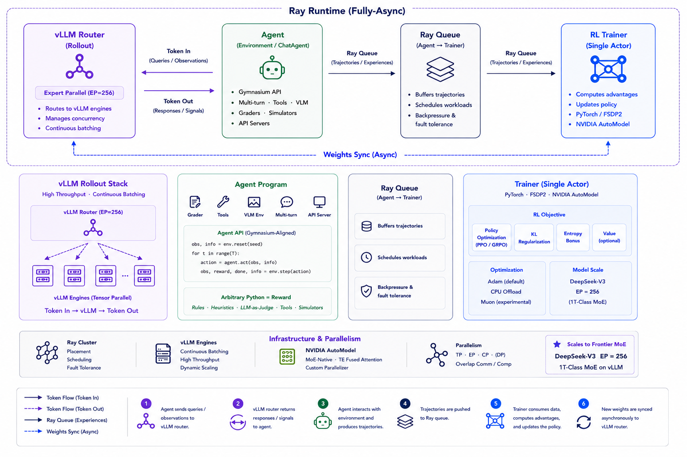
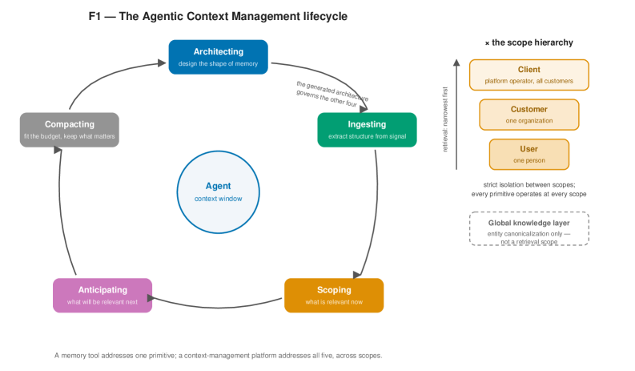
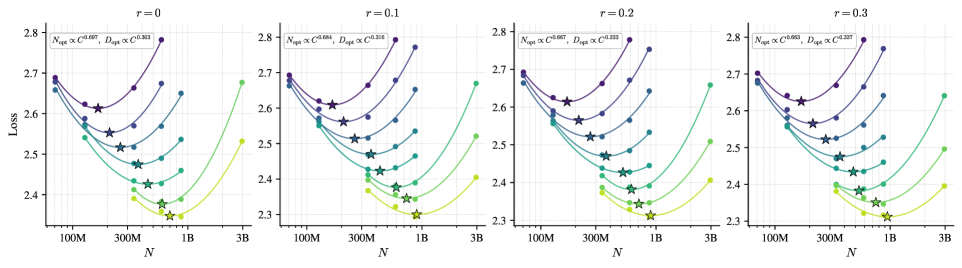
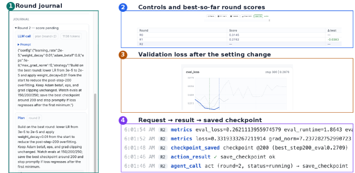
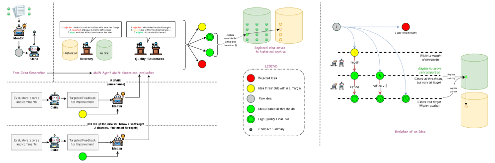
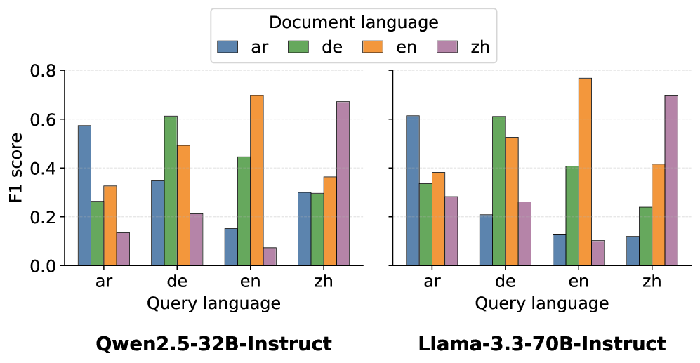
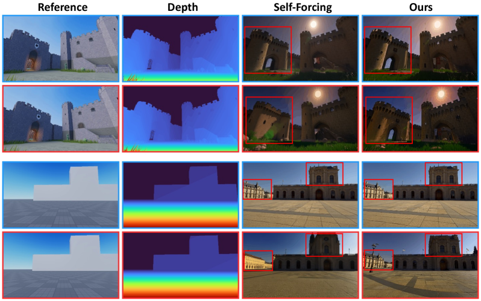
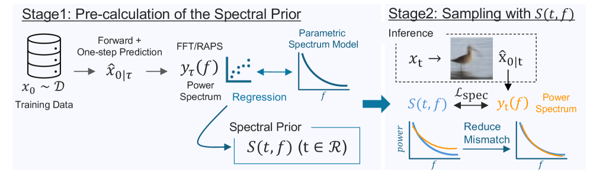

# Daily AI papers — 2026-07-27

*Curated from HF Daily Papers. 14 of 17 papers kept after relevance filter.*

## Papers at a glance

| # | Title | Topics | Org |
| --- | --- | --- | --- |
| 1 | [Molt: A Scalable PyTorch-Native Training Framework for Agentic RL](#1-molt) | `agents`, `RL`, `systems` | NVIDIA |
| 2 | [DataPrep-Bench: Benchmarking LLMs as Training Data Preparators](#2-dataprep-bench) | `data`, `eval`, `synthetic-data` | Peking U. |
| 3 | [Agentic Context Management (ACM)](#3-agentic-context-management) | `agents`, `memory`, `efficient-inference` | Maximem |
| 4 | [Skill Self-Play: Pushing the Frontier of LLM Capability with Co-Evolving Skills](#4-skill-self-play) | `LLM`, `RL`, `agents`, `reasoning` | Qwen / Alibaba |
| 5 | [Three-Body Scattering for Generative Modeling](#5-three-body-scattering) | `diffusion`, `one-step-generation` | Westlake U. |
| 6 | [Scaling Native Multimodal Pre-Training From Scratch](#6-scaling-native-multimodal) | `multimodal`, `pre-training`, `scaling-laws` | Tencent / CUHK |
| 7 | [Interactive Training 2: Auditable Control Plane for Live Model Training](#7-interactive-training-2) | `systems`, `training-infra` | Waterloo / Wisconsin |
| 8 | [VisCo: LLMs as Intrinsic Encoders for Visual Token Compression](#8-visco) | `multimodal`, `efficient-inference` | (unspecified) |
| 9 | [IDEAgent: Agentic Quality-Diversity Search for Research Idea Generation](#9-ideagent) | `agents`, `LLM`, `eval` | DeCLaRe / NTU |
| 10 | [LAMAR: Open Language-Aware Multilingual Alignment Reranker](#10-lamar) | `LLM`, `retrieval`, `multilingual` | NLPAI Lab |
| 11 | [SceneActBench: Can Agents Act on the 3D Scenes They See?](#11-sceneactbench) | `agents`, `multimodal`, `eval` | Tencent Hunyuan |
| 12 | [Multi-Head Latent Control: Unified Interface for LLM Agent Decision Making](#12-multi-head-latent-control) | `agents`, `interp`, `LLM` | U. of Alberta / Huawei |
| 13 | [Closing the Loop: Training-Free Revisit Consistency for Autoregressive Generative Rendering](#13-closing-the-loop) | `diffusion`, `video`, `agents` | Roblox / Penn State |
| 14 | [Spectral Prior for Reducing Exposure Bias in Diffusion Models](#14-spectral-prior) | `diffusion` | Sony AI |

---

## 1. Molt

**Authors:** Huiying Li, Hao Zhang, Binfeng Xu, Yifan Zhang, Shaokun Zhang, Hemil Desai, Michael Demoret, Pavlo Molchanov, Jan Kautz, Yi Dong — *NVIDIA*
**Links:** [arXiv:2607.21653](https://arxiv.org/abs/2607.21653) · [HF](https://huggingface.co/papers/2607.21653) · [AlphaXiv](https://www.alphaxiv.org/abs/2607.21653)
**Topics:** `agents`, `RL`, `systems`

### TL;DR

A PyTorch-native agentic-RL training framework built to keep the researcher's iteration cost small. Molt implements one asynchronous rollout+training loop that trains multimodal and MoE policies without ever training on a token the current policy did not generate — token/policy/semantics-consistent by construction, and statistically on-par with a Megatron-based state-of-the-art stack under a matched async protocol.

### Key idea

Treat the *agent as an ordinary program* — a single Python loop — rather than a graph of trainer/rollout/backend stages. All bookkeeping (which model version generated which token, which experiences are safe to train on) lives in one place, so RL algorithm changes touch a small, readable codebase. The training loop is fully asynchronous but strictly on-policy: any rollout whose policy version doesn't match the current trainer is filtered out before optimization.

### Main finding

Matched-protocol comparison: Molt matches a Megatron-based reference stack (assumed NeMo-Aligner class) in reward and throughput while being drastically smaller in code. Runs multimodal and MoE agents through one loop. Released with recipes + containers at `NVIDIA-NeMo/labs-molt`.

### Why it matters

Frameworks like veRL, TRL, OpenRLHF, and NeMo-Aligner have all grown into layered systems that punish per-experiment iteration. Molt argues the *right* tradeoff for a research framework is code you can hold in your head (and an AI assistant can reason about end-to-end), even if that means giving up some plumbing generality. Signals the field is starting to prioritize researcher velocity over feature-completeness — and gives an open baseline to build agentic-RL experiments on.

### Knowledge graph integration

**Builds on / relates to existing pages:**
- [../post-training/grpo.md](../post-training/grpo.md) — GRPO-family algorithms are the primary consumers of this rollout loop.
- [../post-training/_rl.md](../post-training/_rl.md) — one more entry in the on-policy vs. off-policy vs. async spectrum.
- [../systems/ray.md](../systems/ray.md) — contrasts with Ray-based orchestration for RLHF rollouts.
- [../systems/partial-rollouts.md](../systems/partial-rollouts.md) — Molt's asynchronous loop is a policy for handling exactly this problem.
- [../agents/README.md](../agents/README.md) — infrastructure for training tool-using agents.

**Suggested new pages:**
- `systems/molt.md` *(depth)* — the PyTorch-native single-loop async on-policy design.
- `systems/_rl-frameworks.md` *(taxonomy)* — veRL, TRL, OpenRLHF, NeMo-Aligner, Molt: rollout/trainer architecture tradeoffs.

---

## 2. DataPrep-Bench

**Authors:** Qifeng Cai, Yibo Lin, Jianzhuo Du, Qifeng Xia, Sizhe Qiu, Linzhuang Sun, Meiyi Qiang, Zhaoyang Han, Xiaochen Ma, Bohan Zeng, Ruichuan An, Conghui He, Wentao Zhang — *Peking University / IAAR Shanghai / OriginHub / Zhongguancun Academy*
**Links:** [arXiv:2607.20465](https://arxiv.org/abs/2607.20465) · [HF](https://huggingface.co/papers/2607.20465) · [AlphaXiv](https://www.alphaxiv.org/abs/2607.20465)
**Topics:** `data`, `eval`, `synthetic-data`

### TL;DR

A benchmark that scores LLMs on *preparing training data* rather than answering downstream questions. Two capability axes are measured: transforming raw sources into supervised training data, and predicting how much value a dataset will add before actually training on it. Six domains, multiple base models, and two released baselines — a skill-guided agent and a distribution-based quality metric.

### Key idea

Frame data preparation itself as a benchmarkable LLM skill. The predictor axis is especially novel: given a proposed training corpus, an LLM has to *predict* downstream lift without running the training. The distribution-based quality metric compares candidate-corpus feature statistics against a strong reference distribution, giving a training-free proxy for "will this data help?"

### Main finding

Domain-specific synthetic data *frequently reduces performance* relative to using general corpora alone — a warning against naive vertical-domain synthetic fine-tuning. The distributional metric outperforms model-generated quality scores on cross-model correlation with downstream results in most of the six domains.

### Why it matters

Post-training pipelines lean heavily on LLM-generated synthetic data with little principled way to predict whether the new data will help. If a cheap distributional predictor can flag bad synthesis before a training run, the cost of iterating on data mixtures drops sharply. Also formalizes a metric-vs-outcome gap for LLM-as-judge quality scoring.

### Knowledge graph integration

**Builds on / relates to existing pages:**
- [../data/_data-curation.md](../data/_data-curation.md) — proposes a new axis (predictive quality) for curation decisions.
- [../data/quality-filtering.md](../data/quality-filtering.md) — distributional filter is a training-free filter variant.
- [../data/decontamination.md](../data/decontamination.md) — companion concern when benchmarking data-preparator models.
- [../evaluation/README.md](../evaluation/README.md) — a new class of benchmark (LLM-as-data-preparator).

**Suggested new pages:**
- `evaluation/dataprep-bench.md` *(depth)* — the two-axis benchmark itself.
- `data/distributional-quality-metric.md` *(depth)* — training-free predictor of dataset value.

---

## 3. Agentic Context Management

**Authors:** Undisclosed team — *Maximem*
**Links:** [arXiv:2607.21503](https://arxiv.org/abs/2607.21503) · [HF](https://huggingface.co/papers/2607.21503) · [AlphaXiv](https://www.alphaxiv.org/abs/2607.21503)
**Topics:** `agents`, `memory`, `efficient-inference`

### TL;DR

Position-paper-plus-system claiming production agents fail more from context-management failures than reasoning failures, and framing the fix as a lifecycle (architect · ingest · scope · anticipate · compact/consolidate) rather than a storage-and-retrieval problem. Ships Maximem Synap as a reference implementation, reporting 92% on LongMemEval and 93.2% on LoCoMo.

### Key idea

Reframes "agent memory" as five composable primitives — **architecting** (choose the right store per data type), **ingesting** (structured extraction), **scoping** (org / user / session boundaries), **anticipating** (predict what the next turn will need), and **compaction/consolidation** (validated summarization that preserves fidelity). Argues naive turn-by-turn context accumulation is quadratic in cost, crude summarization is linear but lossy, and only *validated* compaction is linear and faithful.

### Main finding

Under the Maximem Synap configuration: **92% on LongMemEval, 93.2% on LoCoMo** — competitive with the strongest published pipelines, with the paper's economic argument (linear cost, preserved recall) as a companion result.

### Why it matters

Long-running agents currently choose between paying quadratic token bills or losing fidelity to lossy summarizers. Naming and decomposing the discipline gives builders a checklist and gives the research community shared vocabulary. Also flags real gaps in existing memory benchmarks (latency, token efficiency, context-rot resistance) as open work.

### Knowledge graph integration

**Builds on / relates to existing pages:**
- [../agents/README.md](../agents/README.md) — a top-level taxonomy of the agent-context problem.
- [../inference/README.md](../inference/README.md) — KV-cache / prefix-cache management is the systems flip side.

**Suggested new pages:**
- `agents/_context-management.md` *(taxonomy)* — the five ACM primitives as a taxonomy over agent-memory techniques.
- `agents/context-compaction.md` *(depth)* — validated compaction (linear cost, fidelity-preserving) as its own concept.
- `evaluation/longmemeval.md` *(depth)* — the LongMemEval benchmark for long-horizon agent memory.
- `evaluation/locomo.md` *(depth)* — the LoCoMo long-conversation memory benchmark.

---

## 4. Skill Self-Play

**Authors:** Siyuan Huang, Pengyu Cheng, Haotian Liu, Tao Chen, Yihao Liu, Jingwei Ni, Shijie Zhou, Ziyi Yang, Gangwei Jiang, Mengyu Zhou, Yu Cheng, Xiaoxi Jiang, Guanjun Jiang — *Qwen / Alibaba*
**Links:** [arXiv:2607.22529](https://arxiv.org/abs/2607.22529) · [HF](https://huggingface.co/papers/2607.22529) · [AlphaXiv](https://www.alphaxiv.org/abs/2607.22529)
**Topics:** `LLM`, `RL`, `agents`, `reasoning`

### TL;DR

An interaction-driven self-evolution recipe that co-trains three LLM roles — a **proposer** that generates tasks, a **solver** that attempts them, and a **skill controller** that curates which "skills" are exercised — with RL. Aims to break the standard self-evolution dilemma: more diverse tasks are harder to verify, and easily verifiable tasks converge to a narrow skill band.

### Key idea

Reframe self-play as three co-evolving LLM policies instead of two. The skill controller manages an evolving library of skills and decides which the proposer should target next, so the training curriculum keeps expanding into under-covered regions even as verification stays local (per-skill). RL updates flow through all three heads.

### Main finding

Consistent gains on tool-use and reasoning benchmarks over standard proposer/solver self-play baselines (concrete numbers vary by benchmark). The main claim is *frontier-pushing* — pushing capability beyond initial-distribution coverage rather than just polishing it.

### Why it matters

Frontier LLM RL currently piles on human-authored task suites (math, code, agents). A working co-evolving-skills loop would move the field toward truly open-ended self-improvement without a shrinking supply of verifiable prompts — which is one of the central bottlenecks for scaling RLVR.

### Knowledge graph integration

**Builds on / relates to existing pages:**
- [../post-training/_rl.md](../post-training/_rl.md) — sits in the online self-play family of RL methods.
- [../post-training/grpo.md](../post-training/grpo.md) — GRPO-class updates on solver rollouts.
- [../post-training/rlvr.md](../post-training/rlvr.md) — extends RLVR by generating its own verifiable prompts.
- [../post-training/rl-prompt-curation.md](../post-training/rl-prompt-curation.md) — the skill controller is a learned prompt-curator.
- [../post-training/reasoning/long-cot-rl.md](../post-training/reasoning/long-cot-rl.md) — reasoning is one of the target skills.

**Suggested new pages:**
- `post-training/skill-self-play.md` *(depth)* — the three-role proposer/solver/controller co-evolution recipe.

---

## 5. Three-Body Scattering

**Authors:** Peng Sun, Zhenglin Cheng, Deyuan Liu, Jun Xie, Xinyi Shang, Tao Lin — *Westlake University / Zhejiang University / UCL*
**Links:** [arXiv:2607.18198](https://arxiv.org/abs/2607.18198) · [HF](https://huggingface.co/papers/2607.18198) · [AlphaXiv](https://www.alphaxiv.org/abs/2607.18198)
**Topics:** `diffusion`, `one-step-generation`

### TL;DR

A new training objective for one-step generators that side-steps adversarial critics, prescribed noise-to-data paths, and autoregressive factorization. Each "projectile" (fake sample) is attracted to *one* real source and repelled from *one* independently generated fake, turning the energy distance into a per-projectile force. On ImageNet-256 it hits FID=2.23 (pixel PixelDiT-XL) and FID=1.63 (latent DiT-XL) at NFE=1.

### Key idea

Replace the minibatch-wide "all-pairs field" used by Drifting Models with a **three-body scattering** interaction: projectile ↔ one real ↔ one generated. Conditioned on the projectile and its context, the expectation of this force equals the 2-Wasserstein gradient-flow velocity of half the squared energy distance. Tracking that conditional expectation online further cuts noise. Cost per batch is O(B) instead of O(B²).

### Main finding

One-step (NFE=1) ImageNet-256 generation: **FID 2.23** in pixel space (PixelDiT-XL), **FID 1.63** in latent space (DiT-XL). Competitive with or ahead of distilled multi-step baselines while training end-to-end without an adversarial critic.

### Why it matters

Draws a design map connecting diffusion-style supervision, drift-style dynamics, and GAN-style objectives; the winner in this map is a *non-adversarial, one-step, O(B)-cost* training regime. If it holds on video / text-conditioned latent diffusion, this could displace both GAN distillation and multi-step consistency training as the default recipe for fast generators.

### Knowledge graph integration

**Suggested new pages:**
- `architectures/tbsm.md` *(depth)* — three-body scattering as a training objective for one-step generators.
- `architectures/_one-step-generators.md` *(taxonomy)* — consistency models, distillation, TBSM, GAN-distillation.

---

## 6. Scaling Native Multimodal Pre-Training From Scratch

**Authors:** Haoyuan Wu, Aoqi Wu, Hai Wang, Jiajia Wu, Jinxiang Ou, Bei Yu — *CUHK / Tencent LLM Department*
**Links:** [arXiv:2607.22043](https://arxiv.org/abs/2607.22043) · [HF](https://huggingface.co/papers/2607.22043) · [AlphaXiv](https://www.alphaxiv.org/abs/2607.22043)
**Topics:** `multimodal`, `pre-training`, `scaling-laws`

### TL;DR

A systematic scaling-laws study of *native* multimodal pretraining — training a model on multimodal inputs from step 0 rather than gluing a vision encoder onto a pretrained LM. Fits compute laws, measures scaling exponents across model size / data / modality mix, and characterizes optimization asymmetries that late-fusion architectures don't have.

### Key idea

Treat native multimodal pretraining as a first-class scaling regime with its own laws. Contrast against late-fusion (encoder + LM stitched later) on identical compute budgets to quantify the *cross-modal integration bonus* — and to expose where late-fusion's per-modality gradient asymmetry hurts.

### Main finding

Reports scaling-exponent estimates and downstream evaluation results showing native pretraining catches up and pulls ahead of late-fusion at scale on cross-modal tasks; the abstract emphasizes previously uncharacterized scaling properties rather than a single headline number.

### Why it matters

Most frontier VLMs today (Qwen-VL, InternVL, Gemini-Nano-family) start from a strong text LM. A rigorous scaling study of the native path informs whether the field should invest in from-scratch multimodal foundation models or continue with late-fusion. Sets a baseline others can compare against.

### Knowledge graph integration

**Builds on / relates to existing pages:**
- [../multimodal/README.md](../multimodal/README.md) — the native-vs-late-fusion axis is a top-level VLM design choice.
- [../pre-training/README.md](../pre-training/README.md) — extends scaling-laws methodology to the multimodal regime.

**Suggested new pages:**
- `multimodal/_fusion-strategy.md` *(taxonomy)* — native / early-fusion / late-fusion / cross-attention with tradeoffs.
- `multimodal/native-multimodal-pretraining.md` *(depth)* — the from-scratch multimodal pretraining recipe + scaling laws.

---

## 7. Interactive Training 2

**Authors:** Wentao Zhang, Xuanhe Pan, Han Zhou, Yang Lu, Yuntian Deng — *U. of Waterloo / U. of Wisconsin-Madison*
**Links:** [arXiv:2607.18314](https://arxiv.org/abs/2607.18314) · [HF](https://huggingface.co/papers/2607.18314) · [AlphaXiv](https://www.alphaxiv.org/abs/2607.18314)
**Topics:** `systems`, `training-infra`

### TL;DR

An open-source *control plane* for running training jobs. Trainers declare the knobs and actions they expose (LR, data mix, restart-from-checkpoint, …); humans and automated controllers submit change requests through one shared protocol; the training loop validates and applies them at safe checkpoints. Ships with an Aim workspace that renders live metrics plus a chronological audit log of who changed what.

### Key idea

Decouple training *execution* from training *steering*. Once every knob is exposed via a typed request/response protocol, both humans and autonomous "training controllers" (an agent that changes LR on divergence, for instance) can drive a run without touching trainer-specific code. Auditability is first-class — the log is the record.

### Main finding

Demonstrated across five NLP and RL workflows; the deliverable is the reusable protocol + release, not a headline benchmark number.

### Why it matters

Modern LLM training runs increasingly need in-flight interventions (annealed data mixes, LR resets, hot-swapping reward models). Today that's ad-hoc code every time. A shared protocol enables both reproducible human interventions and a whole class of *training-controller agents* — auditable enough to actually deploy on production runs.

### Knowledge graph integration

**Builds on / relates to existing pages:**
- [../pre-training/_training-stability.md](../pre-training/_training-stability.md) — mid-run interventions are the operator response to instability.
- [../pre-training/mid-training.md](../pre-training/mid-training.md) — mid-training data / phase changes are one class of controllable action.
- [../pre-training/_lr-schedules.md](../pre-training/_lr-schedules.md) — LR hot-swapping is a prototypical action.
- [../systems/](../systems/) — belongs in training-systems land.

**Suggested new pages:**
- `systems/training-control-plane.md` *(depth)* — protocol-based mid-run training steering.

---

## 8. VisCo

**Authors:** Yupeng Zheng, Kai Zou, Bin Liu, Nenghai Yu — *(affiliations not stated on HF page)*
**Links:** [arXiv:2607.12756](https://arxiv.org/abs/2607.12756) · [HF](https://huggingface.co/papers/2607.12756) · [AlphaXiv](https://www.alphaxiv.org/abs/2607.12756)
**Topics:** `multimodal`, `efficient-inference`

### TL;DR

A training-efficient visual-token compression scheme for VLMs that *reuses the VLM itself* as a parameter-sharing autoencoder. A small pool of learnable memory tokens replaces most visual tokens; the pretrained backbone plays both encoder and decoder. Wins across compression ratios, stays stable even in the extreme "single-token image" setting, and actually improves the base model when memory tokens are concatenated with the original visual tokens.

### Key idea

Instead of bolting an external compressor onto the VLM (which forces the backbone to re-adapt), use the VLM's own layers as an autoencoder over the visual token stream, with memory tokens as the compressed representation. Parameter sharing between encoding and decoding lets hierarchical information flow both ways.

### Main finding

Beats prior training-based and training-free compression baselines at all evaluated ratios; gap grows at aggressive compression; retains a working representation even down to a single memory token per image. Combining memory tokens with the raw visual tokens exceeds the base model — evidence that the compressed tokens carry a genuinely complementary summary.

### Why it matters

Visual tokens dominate VLM prefill cost and KV footprint. A drop-in, training-efficient compressor that also *improves* the model when kept alongside the original tokens is a rare all-upside change. Especially useful as VLMs move to long-video and document-heavy workloads.

### Knowledge graph integration

**Builds on / relates to existing pages:**
- [../multimodal/README.md](../multimodal/README.md) — visual token compression is a top VLM inference concern.
- [../inference/README.md](../inference/README.md) — smaller visual token budgets directly cut prefill and KV cache cost.
- [../architectures/multi-head-attention.md](../architectures/multi-head-attention.md) — memory-token attention pattern.

**Suggested new pages:**
- `multimodal/visual-token-compression.md` *(depth)* — the parameter-sharing autoencoder recipe.
- `multimodal/_visual-token-compression.md` *(taxonomy)* — training-free vs. training-based vs. intrinsic-encoder compression.

---

## 9. IDEAgent

**Authors:** Soujanya Poria et al. — *DeCLaRe Lab, Nanyang Technological University*
**Links:** [arXiv:2607.22375](https://arxiv.org/abs/2607.22375) · [HF](https://huggingface.co/papers/2607.22375) · [AlphaXiv](https://www.alphaxiv.org/abs/2607.22375)
**Topics:** `agents`, `LLM`, `eval`

### TL;DR

Multi-agent framework for LLM-driven research ideation that treats the problem as **Quality-Diversity (QD) search**. Ideas evolve in lineages; multi-objective feedback drives quality (repair + refinement) while explicit comparisons against completed / historical / rejected ideas drive diversity. Introduces a joint "Yield" metric; on 32 CS topics, IDEAgent posts 3.89× baseline Yield and non-zero Yield on 8× more topics.

### Key idea

Cast idea generation into the QD framework from evolutionary search — instead of optimizing a single objective, maintain a population that covers a *behavior space*. In this instance, that space is defined by comparing candidates against three memory pools (completed/historical/rejected) so the agent explicitly avoids retreading and clustering.

### Main finding

**3.89× Yield** vs. baselines across 32 CS ideation topics; **8× more topics** with non-zero Yield. New Yield metric that jointly measures quality and diversity — a step past pick-your-favorite subjective evaluation of LLM ideas.

### Why it matters

Current "auto-scientist" / research-agent systems collapse to a few clustered ideas. Bringing QD search — a mature idea in evolutionary computing — to LLM-driven ideation is a principled fix, and the Yield metric gives the sub-field a shared quantitative bar.

### Knowledge graph integration

**Builds on / relates to existing pages:**
- [../agents/README.md](../agents/README.md) — a multi-agent architecture pattern.
- [../evaluation/README.md](../evaluation/README.md) — Yield is a new evaluation primitive for open-ended generation.

**Suggested new pages:**
- `agents/quality-diversity-search.md` *(depth)* — QD-driven multi-agent ideation.
- `evaluation/yield-metric.md` *(depth)* — the joint quality-diversity Yield metric.

---

## 10. LAMAR

**Authors:** NLPAI Lab team (author names not disclosed on HF page)
**Links:** [arXiv:2607.22042](https://arxiv.org/abs/2607.22042) · [HF](https://huggingface.co/papers/2607.22042) · [AlphaXiv](https://www.alphaxiv.org/abs/2607.22042)
**Topics:** `LLM`, `retrieval`, `multilingual`

*Borderline: kept because multilingual reranking is directly upstream of multilingual RAG for LLMs.*

### TL;DR

A language-aware multilingual cross-encoder reranker for multilingual RAG. Starts from English-anchored relevance distillation for a consistent cross-lingual score, then a preference-alignment stage nudges same-language-as-query documents up the ranking without sacrificing relevance. Best-in-class on the paper's language-coherence benchmark and competitive on standard multilingual reranking tasks.

### Key idea

Split the training into two staged objectives:
1. **English-anchored distillation** — every language's relevance signal is calibrated to a shared English scoring backbone, so cross-lingual scores are comparable.
2. **Preference alignment for language coherence** — DPO-style preference pairs teach the model to prefer same-language docs when semantically equivalent alternatives exist.

### Main finding

Highest overall and per-language score on the controlled language-coherence eval; competitive on established multilingual reranking benchmarks; best across all reported end-to-end retrieval metrics when used to rerank a first-stage retriever.

### Why it matters

Multilingual RAG systems silently mix languages in their evidence set, which downstream generators often can't reason over faithfully. Fixing this at the reranker (no LLM change) is a cheap, drop-in upgrade for real production stacks.

### Knowledge graph integration

**Builds on / relates to existing pages:**
- [../post-training/dpo.md](../post-training/dpo.md) — the second stage is DPO-style preference alignment applied to reranker training.

**Suggested new pages:**
- `data/multilingual-retrieval.md` *(depth)* — the LAMAR two-stage recipe (distillation + language-coherence DPO).

---

## 11. SceneActBench

**Authors:** Yifei Zhao, Xiangxin Zhou, Wenhao Yang, Jiaqi Tang, Pu Jian, Huanjin Yao, Jiarui Yao, Haowei Lin, Chunchao Guo, Zhuo Chen, Wenkai Lyu, Jianzhu Ma, Xueqian Wang, Wenxi Zhu — *Tencent Hunyuan / THU / NJU / HKUST / UIUC / PKU*
**Links:** [arXiv:2607.22393](https://arxiv.org/abs/2607.22393) · [HF](https://huggingface.co/papers/2607.22393) · [AlphaXiv](https://www.alphaxiv.org/abs/2607.22393)
**Topics:** `agents`, `multimodal`, `eval`

### TL;DR

Benchmark for VLM agents that must *act on* 3D scenes, not just describe them. Five action-oriented 3D tasks under a unified agent-environment loop; 520 task cases over 210 source scenes. Task-specific geometric metrics grade the final scene state against hidden ground truth. On eleven proprietary VLM configurations, overall scores span **38.6–50.2** and no model is consistently strong across tasks.

### Key idea

Score the *outcome* — the modified 3D scene — with geometric metrics rather than the textual response. Fix the agent loop so all VLMs are compared under identical scaffolding, isolating perception+action capability from prompting differences.

### Main finding

Overall scores 38.6–50.2 across eleven frontier proprietary VLMs; every model is best on some tasks and worst on others. Failure modes cluster around spatial reasoning under partial observations and 3D-asset placement.

### Why it matters

VLMs are being pitched as 3D scene editors, robotics planners, and world-model action heads, but existing benchmarks reward describing rather than modifying scenes. SceneActBench pushes the field to compare on the harder, actually-relevant capability.

### Knowledge graph integration

**Builds on / relates to existing pages:**
- [../agents/README.md](../agents/README.md) — action benchmarks for multimodal agents.
- [../multimodal/README.md](../multimodal/README.md) — 3D scene understanding as a VLM capability.
- [../evaluation/README.md](../evaluation/README.md) — a new class of geometry-grounded agent benchmark.

**Suggested new pages:**
- `evaluation/sceneactbench.md` *(depth)* — the 3D scene-action benchmark itself.

---

## 12. Multi-Head Latent Control

**Authors:** Amirhosein Ghasemabadi, Ruichen Chen, Bahador Rashidi, Di Niu — *(U. of Alberta / Huawei-affiliated authors)*
**Links:** [arXiv:2607.14277](https://arxiv.org/abs/2607.14277) · [HF](https://huggingface.co/papers/2607.14277) · [AlphaXiv](https://www.alphaxiv.org/abs/2607.14277)
**Topics:** `agents`, `interp`, `LLM`

### TL;DR

A lightweight side-attached "control layer" that reads hidden-state trajectories from a frozen LLM/VLM and predicts deployment-time control decisions. Two heads: a **Capability Head** ("can *this* model handle *this* instance, or should we defer to a stronger collaborator?") and a **Resolution Head** ("respond directly, ask a clarifying question, invoke a tool, or abstain?"). Trained only on latent traces — the backbone stays frozen.

### Key idea

Route on **latent** signals, not just input signals. Prompt-level routing has to re-encode everything and misses information that's only visible in the model's own generation trajectory. Reading hidden states makes control decisions cheap, post-hoc, and swappable when the backbone changes.

### Main finding

Consistent improvements to the quality-cost tradeoff of multi-model systems across language and vision-language settings — including *early handoff* from partial generations (deciding to defer mid-generation) and more accurate intervention choices than prompt-only baselines.

### Why it matters

Multi-model production stacks — cheap-first + strong-fallback — currently make the routing decision *before* the cheap model runs. Reading the cheap model's own latents to decide "still confident?" mid-generation is a strictly stronger signal, and a training-free way to graft this onto existing frozen models is a real product win. Also nice interp/probing story: hidden states really do carry action-relevant control info.

### Knowledge graph integration

**Builds on / relates to existing pages:**
- [../interpretability/README.md](../interpretability/README.md) — this is a probe-based control mechanism riding on hidden states.
- [../agents/README.md](../agents/README.md) — capability-aware agent control and tool-vs-abstain routing.

**Suggested new pages:**
- `interpretability/latent-probes-for-control.md` *(depth)* — probes on frozen backbones that emit deployment-time control decisions.
- `agents/model-routing.md` *(depth)* — capability-aware routing between weak/strong LLMs.

---

## 13. Closing the Loop

**Authors:** Wenchao Ma, Changran Liu, Sharon X. Huang, Haomiao Jiang — *Roblox / Penn State*
**Links:** [arXiv:2607.21848](https://arxiv.org/abs/2607.21848) · [HF](https://huggingface.co/papers/2607.21848) · [AlphaXiv](https://www.alphaxiv.org/abs/2607.21848)
**Topics:** `diffusion`, `video`, `agents`

*Borderline: kept because the training-free retrieval-into-KV-cache trick is a general recipe for long-horizon autoregressive generators.*

### TL;DR

Autoregressive video generators lose long-term appearance consistency when the camera revisits a place after the relevant KV entries have been evicted. This paper leverages 3D-engine correspondences (already free during rendering) to (a) *retrieve* pose-matched historical latents back into the KV cache, and (b) *bias* per-token attention toward spatially corresponding regions of the retrieved chunks. Training-free.

### Key idea

Repurpose the game engine's ground-truth pose + depth into two levers on the generator: **temporal** correspondence resurrects the right past chunk into KV cache (loop-closure memory), **spatial** correspondence tells attention which tokens inside that chunk are actually the same content. No model changes.

### Main finding

On loop-closure trajectories mined from TartanAir / TartanGround, beats existing training-free baselines on revisit consistency without sacrificing overall video quality.

### Why it matters

Long-horizon autoregressive generation across many domains (video, world models, agent trajectories) hits the same wall: bounded KV → forgotten history → drift. Framing "loop closure" as *retrieval into the KV cache* is a generalizable pattern, and the paper shows that free engine metadata is a strong signal — worth watching where else the same trick applies.

### Knowledge graph integration

**Builds on / relates to existing pages:**
- [../inference/README.md](../inference/README.md) — the KV-cache eviction problem is exactly the target.
- [../architectures/multi-head-attention.md](../architectures/multi-head-attention.md) — spatial-correspondence attention bias plugs into standard attention.

**Suggested new pages:**
- `inference/kv-cache-retrieval.md` *(depth)* — training-free retrieval of past chunks back into KV cache.

---

## 14. Spectral Prior

**Authors:** Sony AI team (individual authors not listed on HF page) — *Sony AI / Sony Group Corporation*
**Links:** [arXiv:2607.22091](https://arxiv.org/abs/2607.22091) · [HF](https://huggingface.co/papers/2607.22091) · [AlphaXiv](https://www.alphaxiv.org/abs/2607.22091)
**Topics:** `diffusion`

### TL;DR

A lightweight fix for exposure bias in diffusion models: identify systematic frequency-domain mismatches between training-time and inference-time intermediate predictions, precompute a per-timestep spectral prior offline, and steer inference-time predictions toward that prior via FFT-based gradients. 3–4% overhead, works with DDPM, ADM, Stable Diffusion variants, and flow-matching.

### Key idea

Exposure bias in diffusion is *frequency-structured* — not a uniform noise mismatch. Fitting a per-timestep spectral prior from training data gives a target distribution over frequency components; at inference an FFT-based guidance step pulls the network's output back onto that distribution.

### Main finding

Consistent quality improvements across DDPM, ADM, Stable Diffusion variants, and flow-matching, with only 3–4% inference overhead. Composes with existing exposure-bias fixes rather than replacing them.

### Why it matters

Exposure bias is a stubborn residual problem for diffusion samplers. A frequency-domain framing that's cheap enough to just tack on to any existing sampler is a nice tool for the shelf; also a small piece of evidence that spectral analyses of diffusion outputs remain underutilized.

### Knowledge graph integration

**Suggested new pages:**
- `architectures/spectral-alignment.md` *(depth)* — spectral prior + FFT-based guidance for exposure bias.

---

## Notes

- Borderline inclusions are flagged in-section with an italic *Borderline: …* note. Skipped 3 papers as pure computer-vision / speaker-verification (2607.18142, 2607.19636, 2607.22830).
- Hero figures live in `assets/2026-07-27/`. Missing figures for 2607.20465 (DataPrep-Bench), 2607.22529 (Skill Self-Play), 2607.22393 (SceneActBench), 2607.12756 (VisCo) — arXiv HTML either lacked usable figures or the first-figure URL returned an error page. LAMAR falls in the same bucket in principle but had a suitable smaller PNG.
- This digest is informational. No existing concept files, `READING-LIST.md`, or `PAPERS.md` were modified to produce it.
