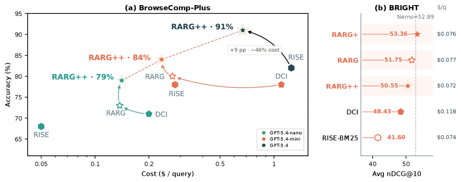
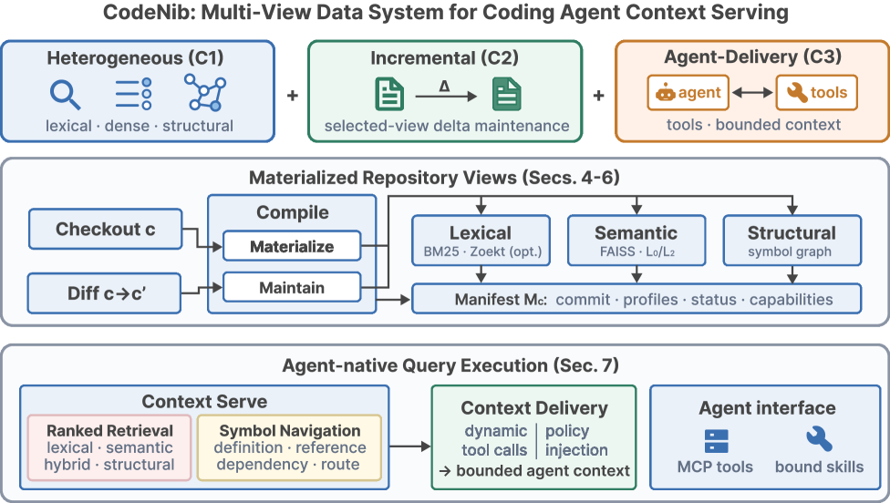
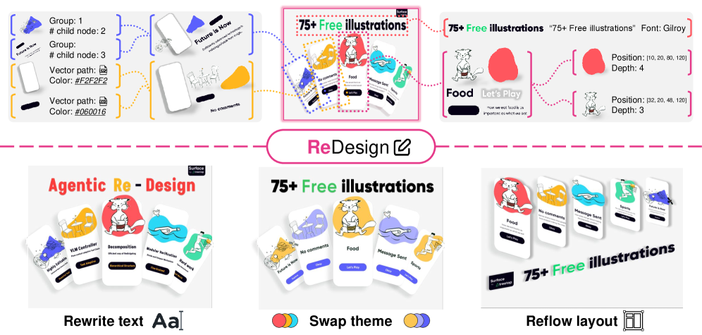
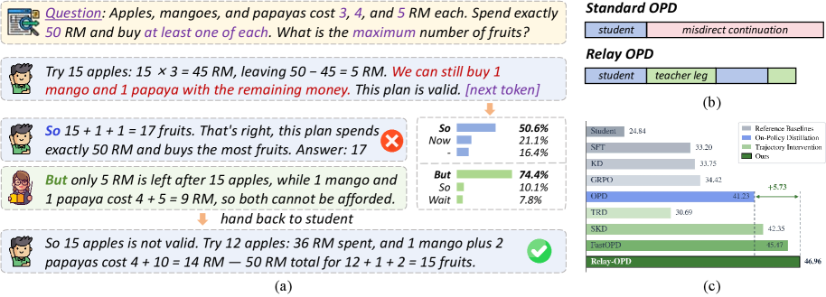
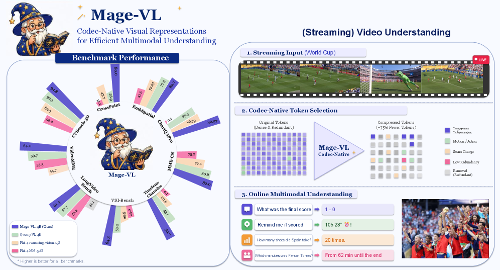
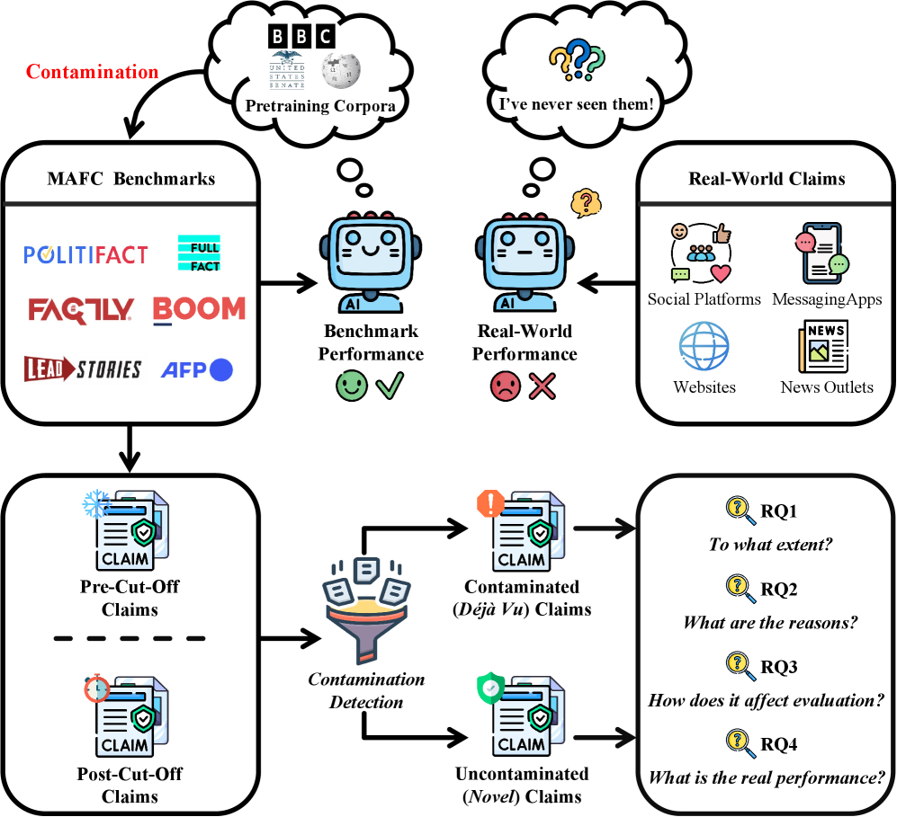
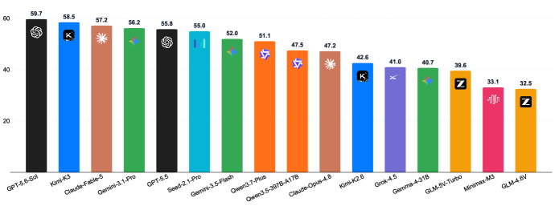
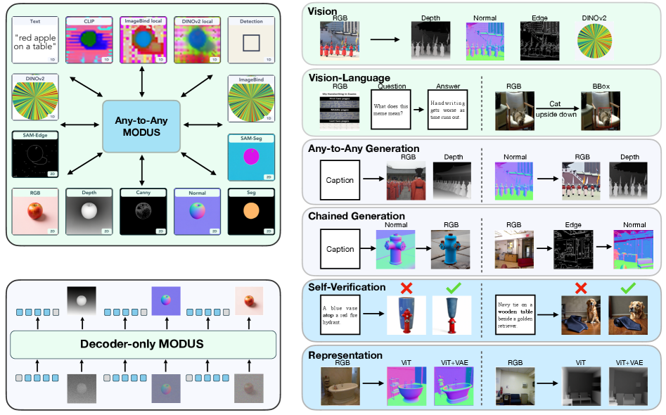
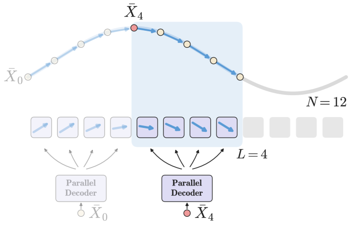

# Daily AI papers — 2026-07-29

*Curated from HF Daily Papers. 14 of ~29 papers kept after relevance filter.*

## Papers at a glance

| # | Title | Topics | Org |
| --- | --- | --- | --- |
| 1 | [A New Role for Relevance: Guiding Corpus Interaction in Agentic Search](#1-rarg-relevance-aware-ripgrep-search-agent) | `agents`, `retrieval`, `RL` | Tencent |
| 2 | [CodeNib: A Multi-View Data System for Serving Repository Context to Coding Agents](#2-codenib-multi-view-data-system-for-coding-agents) | `agents`, `systems`, `code` | UC San Diego |
| 3 | [ReDesign: Recovering Editable Design Structures from Images via Agentic Decomposition](#3-redesign-agentic-decomposition-for-editable-design-recovery) | `agents`, `multimodal`, `eval` | KAIST AI |
| 4 | [Keep It InMind: Benchmarking the Implicit-Association Blind Spot in Agent Memory](#4-inmind-implicit-association-blind-spot-in-agent-memory) | `agents`, `eval`, `memory` | USTC / Metastone |
| 5 | [Pass the Baton: Trajectory-Relayed On-Policy Distillation](#5-relay-opd-trajectory-relayed-on-policy-distillation) | `post-training`, `distillation`, `reasoning` | Zhejiang / Alibaba |
| 6 | [Mage-VL: An Efficient Codec-Native Streaming Multimodal Foundation Model](#6-mage-vl-codec-native-streaming-multimodal) | `multimodal`, `efficient-inference`, `video` | Microsoft |
| 7 | [Wonder: Video World Model Done Better](#7-wonder-video-world-model-done-better) | `diffusion`, `video`, `world-models` | Adobe / JHU |
| 8 | [Shieldstral](#8-shieldstral-policy-adaptive-multimodal-safety-classifier) | `safety`, `multimodal`, `eval` | Mistral AI |
| 9 | [Novel Claim or Déjà Vu? Rethinking "Contamination-Free" Dynamic Evaluation for Multimodal Automated Fact-Checking](#9-contamination-in-dynamic-multimodal-fact-checking) | `eval`, `contamination`, `multimodal` | HKBU / HKU |
| 10 | [PerceptionBench: Evaluating Atomic Visual Perception in Multimodal Large Language Models](#10-perceptionbench-atomic-visual-perception-benchmark) | `eval`, `multimodal` | (multi-author) |
| 11 | [Modus: Decoder-Only Any-to-Any Modeling of Diverse Modalities](#11-modus-decoder-only-any-to-any-multimodal) | `multimodal`, `architectures` | EPFL / Apple |
| 12 | [Reinforcement Learning for Code Optimization](#12-rl-for-code-optimization-dmc-optim) | `RL`, `code`, `reward` | Meta AI |
| 13 | [Parallel Decoding Distillation for Fast Image and Video Generation](#13-parallel-decoding-distillation-pdd) | `diffusion`, `distillation`, `efficient-inference` | Weizmann / NVIDIA |
| 14 | [Uncovering Latent Reasoning Strategies in Language Models](#14-uncovering-latent-reasoning-strategies) | `interp`, `reasoning` | Yale |

---

## 1. RARG: Relevance-Aware RipGrep Search Agent

**Authors:** Jiangnan Li, Yuqing Li, Mo Yu, Jinchao Zhang, Jie Zhou — *Tencent, IIE-CAS*
**Links:** [arXiv:2607.24223](https://arxiv.org/abs/2607.24223) · [HF](https://huggingface.co/papers/2607.24223) · [AlphaXiv](https://www.alphaxiv.org/abs/2607.24223)
**Topics:** `agents`, `retrieval`, `RL`

### TL;DR
Search agents that use `grep`-style corpus interaction ("Direct Corpus Interaction") explore documents blindly, delaying convergence on complex queries. RARG turns query-document relevance into an *execution prior*: it orders the traversal, picks entry paragraphs, and reranks match snippets so the LLM sees informative excerpts first.

### Key idea
Coarse-to-fine relevance guidance layered onto ripgrep: (1) relevance-ordered document sequence for sequential traversal, (2) query-relevant paragraphs as ripgrep entry points, (3) rerank of raw grep hits before the LLM reads them.

### Main finding
On browse-QA and reasoning-intensive retrieval, RARG improves the accuracy–efficiency Pareto frontier versus both classical retrieval agents and pure DCI baselines — same answers with fewer tool calls, higher accuracy under fixed budget.

### Why it matters
Agentic corpus interaction is emerging as an alternative to top-k retrieval for long-horizon research tasks. RARG shows that relevance signals still matter after retrieval "ends" — they can shape *how* an agent explores, not just *what* it retrieves.

### Knowledge graph integration

**Builds on / relates to existing pages:**
- [agents/README.md](../agents/README.md) — extends tool-using agent design to corpus exploration.
- [post-training/rl-prompt-curation.md](../post-training/rl-prompt-curation.md) — related use of relevance signals as training-time prior.

**Suggested new pages:**
- `agents/direct-corpus-interaction.md` *(depth)* — grep-style agentic retrieval and its convergence issues.
- `agents/agentic-search.md` *(depth)* — general recipe for LLM-driven multi-hop search over corpora.

---

## 2. CodeNib: Multi-View Data System for Coding Agents

**Authors:** Hengjia Yu, Boqin Yuan, Shuting Zhao, Yizhao Chen, Aryan Dokania, Mihir Jagtap, Jiayu Chang, Yitong Ma, Yash Jayswal, Wentao Ni, Hejia Zhang, Zhaoling Chen, Gangda Deng, Jishen Zhao — *UC San Diego, Stanford, UC Riverside, USC*
**Links:** [arXiv:2607.25431](https://arxiv.org/abs/2607.25431) · [HF](https://huggingface.co/papers/2607.25431) · [AlphaXiv](https://www.alphaxiv.org/abs/2607.25431)
**Topics:** `agents`, `systems`, `code`

### TL;DR
Coding agents redo the same repo indexing, symbol lookup, and search work every task. CodeNib is a per-repo data system that maintains lexical, dense-embedding, and structural (AST/LSP) views per commit, keeps them incrementally consistent across edits, and exposes them to the agent through a single query runtime.

### Key idea
Treat repository context as a *materialized multi-view database* rather than a set of throwaway per-task tools. Views are keyed on commit hash and refreshed against edits; results carry back to repo-relative source ranges the agent can cite.

### Main finding
Ranked search, symbol navigation, and bounded-context construction are unified behind one API. The paper's framing is a systems contribution — costs (indexing, storage, refresh) are made visible per repo instead of hidden inside each agent turn.

### Why it matters
Serving coding agents at scale is bottlenecked on the *data infrastructure* around them. CodeNib names the abstraction (multi-view, per-commit, agent-facing) that a lot of coding-agent products end up needing.

### Knowledge graph integration

**Builds on / relates to existing pages:**
- [agents/README.md](../agents/README.md) — infrastructure for agentic tool use.

**Suggested new pages:**
- `agents/coding-agent-infrastructure.md` *(depth)* — repo indexing, symbol servers, and context servers as agent runtimes.

---

## 3. ReDesign: Agentic Decomposition for Editable Design Recovery

**Authors:** KAIST AI team (Blizzard, Sonjt00, Sharpeeee, J. Choo), Hye Lim (Helmholtz Munich), H.J. Chung (Korea Univ. / EverEx)
**Links:** [arXiv:2607.25565](https://arxiv.org/abs/2607.25565) · [HF](https://huggingface.co/papers/2607.25565) · [AlphaXiv](https://www.alphaxiv.org/abs/2607.25565)
**Topics:** `agents`, `multimodal`, `eval`

### TL;DR
Given a rasterized design (poster, UI screenshot), recover an editable layered file (typography, vectors, colors, grouping, layer order). ReDesign is an agent that grows the layer hierarchy by picking specialized tools per modality, with a *graceful verification* step at each expansion that accepts, prunes, or retries the sub-result.

### Key idea
Long agentic decision chains break because tool outputs are imperfect and errors compound. Local accept/prune/retry feedback per expansion prevents the whole hierarchy from being invalidated by one bad tool call. Ships with **Figma Edit Replay Benchmark** — 909 Figma files, 14,796 controlled edit instructions replayed on reconstructed outputs.

### Main finding
Editability is scored not by pixel similarity but by whether downstream edits still work — a much stricter test. The verification step is what makes the decomposition tractable at real design complexity.

### Why it matters
Introduces a serious editability benchmark for multimodal agents that operate on structured visual content, plus a decomposition + verify pattern that is broadly applicable to any hierarchical agentic reconstruction task.

### Knowledge graph integration

**Builds on / relates to existing pages:**
- [agents/README.md](../agents/README.md) — long-horizon tool-use with per-step verification.

**Suggested new pages:**
- `agents/graceful-verification.md` *(depth)* — local accept/prune/retry to bound compounding tool error.
- `evaluation/figma-edit-replay.md` *(depth)* — editability benchmark for design-recovery agents.

---

## 4. InMind: Implicit-Association Blind Spot in Agent Memory

**Authors:** USTC + Metastone Technology team
**Links:** [arXiv:2607.24368](https://arxiv.org/abs/2607.24368) · [HF](https://huggingface.co/papers/2607.24368) · [AlphaXiv](https://www.alphaxiv.org/abs/2607.24368)
**Topics:** `agents`, `eval`, `memory`

### TL;DR
Long-term memory retrievers assume the useful memory *looks like* the query. World knowledge violates that: "I'm allergic to tree nuts" should change the answer to "want a macaron?" via the almond-flour bridge, but the two texts share no lexical or semantic cue. InMind is a 125-task benchmark that stress-tests this "implicit-association blind spot".

### Key idea
Distinguish direct-cue retrieval (query and memory overlap in wording) from implicit-association retrieval (link requires an unstated world-knowledge inference). 113 of 125 tasks are grounded in citable public sources across ten life domains.

### Main finding
Current memory systems (dense retrieval, hybrid, LLM-summarized) do well on direct-cue cases but collapse when the necessary link is implicit — even when the target memory is obvious to a human.

### Why it matters
Agent memory is being sold as if it were general reasoning; this benchmark carves out a failure class that most product evals ignore. It defines the shape of the next-generation memory system: one that can retrieve *by inference*, not by similarity.

### Knowledge graph integration

**Builds on / relates to existing pages:**
- [agents/README.md](../agents/README.md) — memory is a core agent subsystem.

**Suggested new pages:**
- `agents/agent-memory.md` *(depth)* — long-term memory stores, retrieval strategies, and their failure modes.
- `evaluation/inmind.md` *(depth)* — implicit-association benchmark for agent memory.

---

## 5. Relay-OPD: Trajectory-Relayed On-Policy Distillation

**Authors:** Haolei Xu, Xiaowen Xu, Haiwen Hong, Zixuan Ni, Hongxing Li, Yiwen Qiu, Weiming Lu, Yongliang Shen — *Zhejiang University, Yuvion Team / Alibaba Group*
**Links:** [arXiv:2607.26057](https://arxiv.org/abs/2607.26057) · [HF](https://huggingface.co/papers/2607.26057) · [AlphaXiv](https://www.alphaxiv.org/abs/2607.26057)
**Topics:** `post-training`, `distillation`, `reasoning`

### TL;DR
On-policy distillation (OPD) trains a student on its own rollouts, but once the student commits to a wrong reasoning direction the entire continuation is corrupted ("prefix failure"). Relay-OPD detects those moments and briefly hands the trajectory to the teacher, who redirects; the student then resumes and is trained on the recovered trajectory.

### Key idea
A label-free trigger derived from teacher/student *continuation asymmetry*: on failed prefixes, teachers redirect while students plow ahead. When the asymmetry fires, the teacher takes over for a short relay leg; a bounded relay budget concentrates intervention on early critical positions.

### Main finding
Qwen3-4B-Instruct teacher → Qwen3-0.6B/1.7B students on 8 math benchmarks: +5.73% over standard OPD, +1.49% over FastOPD on average for 1.7B, consistent 0.6B gains. Training trajectory length cut by >50%.

### Why it matters
Small-model reasoning distillation has been stuck between off-policy (mode-covering but drift-prone) and on-policy (drift-free but expensive). Trajectory-level intervention is a middle ground that keeps most tokens on-policy while surgically fixing the destructive prefixes.

### Knowledge graph integration

**Builds on / relates to existing pages:**
- [post-training/reasoning/long-cot-rl.md](../post-training/reasoning/long-cot-rl.md) — targets long-CoT student models.
- [post-training/rejection-sampling.md](../post-training/rejection-sampling.md) — related "filter bad rollouts" family, but here we *repair* instead of *reject*.

**Suggested new pages:**
- `post-training/on-policy-distillation.md` *(depth)* — OPD basics, prefix failure, teacher–student asymmetry.
- `post-training/relay-opd.md` *(depth)* — the trajectory-relay variant with a label-free handoff.

---

## 6. Mage-VL: Codec-Native Streaming Multimodal

**Authors:** Microsoft Mage Team (Senqiao Yang, Kaichen Zhang, Zhaoyang Jia, et al.)
**Links:** [arXiv:2607.24904](https://arxiv.org/abs/2607.24904) · [HF](https://huggingface.co/papers/2607.24904) · [AlphaXiv](https://www.alphaxiv.org/abs/2607.24904)
**Topics:** `multimodal`, `efficient-inference`, `video`

### TL;DR
Current VLMs digest video by sampling sparse keyframes — fine for slow reasoning, disastrous for real-time streaming. Mage-VL reuses the *video codec's* own motion vectors and residual energy to decide which regions to tokenize densely, cutting visual tokens without losing temporal fidelity.

### Key idea
Codec-native visual tokenization: piggyback on H.264/H.265-style motion-vector + residual signals that the encoder already computed, and let them drive selective spatial-temporal token density in the VLM.

### Main finding
Substantially fewer visual tokens per second of video at matched quality on streaming video reasoning tasks. Positioned as a "Moravec's paradox" fix — the model gets faster on live streams without losing frame-sparse reasoning ability.

### Why it matters
Streaming video assistants are throughput-bound on token count. Repurposing codec signals is a systems-level move that other multimodal foundation models could adopt — the compression pipeline already knows what's moving.

### Knowledge graph integration

**Builds on / relates to existing pages:**
- [multimodal/README.md](../multimodal/README.md) — vision tokenization for VLMs.

**Suggested new pages:**
- `multimodal/codec-native-tokenization.md` *(depth)* — using video codec motion vectors as a token-density prior.
- `multimodal/streaming-vlm.md` *(depth)* — architectures and inference tricks for live-video VLMs.

---

## 7. Wonder: Video World Model Done Better

**Authors:** Hanwen Jiang, Zhixin Shu, Kalyan Sunkavalli (Adobe Research), Vishal M. Patel, Yiqun Mei (Johns Hopkins University)
**Links:** [arXiv:2607.26037](https://arxiv.org/abs/2607.26037) · [HF](https://huggingface.co/papers/2607.26037) · [AlphaXiv](https://www.alphaxiv.org/abs/2607.26037)
**Topics:** `diffusion`, `video`, `world-models`

### TL;DR
A camera-controllable video world model that lets the user "walk around" a scene generated from a single image or a conditioning clip. Wonder combines dense-coordinate-field camera conditioning, sparse attention over a memory of past views, and a refined distillation stage to hit 16 FPS on minute-long clips.

### Key idea
Three pieces stacked: (1) dense-coordinate-field camera control so pose can be specified continuously, (2) sparse-attention memory so the model can *revisit* previously explored regions without redrifting, (3) refined distillation for real-time throughput.

### Main finding
Real-time (16 FPS) minute-scale generation with coherent geometry, appearance, and dynamics when the camera revisits earlier views. Establishes a serious baseline for playable video worlds.

### Why it matters
Playable video world models are approaching the point of being *usable* interfaces, not just demos. The memory-plus-camera-control combination is the design pattern to watch — it's what separates a "video generator" from a "world simulator."

### Knowledge graph integration

**Builds on / relates to existing pages:**
- [multimodal/README.md](../multimodal/README.md) — video generation as a multimodal capability.

**Suggested new pages:**
- `multimodal/video-world-models.md` *(depth)* — camera-controllable interactive video generation.
- `multimodal/_video-generation.md` *(taxonomy)* — DiT, flow matching, world models, distillation for real-time video.

---

## 8. Shieldstral: Policy-Adaptive Multimodal Safety Classifier

**Authors:** Antonia Calvi, Avinash Sooriyarachchi, Giada Pistilli, Guillaume Lample, Maarten Buyl, Maximilian Augustin, Maximilian Müller, Pierre Stock, Tom Bewley, Wassim Bouaziz, Yimu Pan — *Mistral AI*
**Links:** [arXiv:2607.25857](https://arxiv.org/abs/2607.25857) · [HF](https://huggingface.co/papers/2607.25857) · [AlphaXiv](https://www.alphaxiv.org/abs/2607.25857)
**Topics:** `safety`, `multimodal`, `eval`

### TL;DR
Shieldstral is a 3B-parameter policy-adaptive safety classifier that reframes content moderation as a binary yes/no question grounded in an operator-supplied policy. Matches or beats models ~7× its size on text safety and sets SOTA on multimodal safety classification.

### Key idea
Formulate moderation as *policy-conditioned binary QA*: given a policy statement and content (text or image+text), answer yes/no. This unifies heterogeneous safety taxonomies under one training objective and lets operators plug in their own policy at inference time without retraining.

### Main finding
3B model matches / outperforms ~20B safety classifiers on text benchmarks; new SOTA on multimodal safety. Policy-adaptivity means one model can serve many product-specific policies.

### Why it matters
Guardrail models have been proliferating one-per-taxonomy. A single policy-conditioned classifier collapses that fleet and closes a real gap in open-source multimodal moderation.

### Knowledge graph integration

**Builds on / relates to existing pages:**
- [safety/README.md](../safety/README.md) — sits alongside existing jailbreak / refusal / red-team work.
- [safety/_attacks.md](../safety/_attacks.md) — moderation is the defensive counterpart to the attack taxonomy.

**Suggested new pages:**
- `safety/safety-classifier.md` *(depth)* — LLM-based guardrail models for input/output moderation.
- `safety/policy-adaptive-moderation.md` *(depth)* — policy as an inference-time prompt, not a training taxonomy.

---

## 9. Contamination in Dynamic Multimodal Fact-Checking

**Authors:** Haorui He, Xinwen Chen, Dacheng Wen, Reynold Cheng, Francis C. M. Lau, Yupeng Li — *Hong Kong Baptist University, University of Hong Kong, Beijing Normal-Hong Kong Baptist University*
**Links:** [arXiv:2607.23514](https://arxiv.org/abs/2607.23514) · [HF](https://huggingface.co/papers/2607.23514) · [AlphaXiv](https://www.alphaxiv.org/abs/2607.23514)
**Topics:** `eval`, `contamination`, `multimodal`

### TL;DR
"Dynamic benchmarks" — those collecting claims published *after* an LLM's cutoff — are marketed as contamination-free. This paper shows that 17–29% of post-cutoff claims are still verifiable from pre-cutoff knowledge, either directly or through synthesizing public facts, and that contamination inflates Macro-F1 by up to 11.3 points.

### Key idea
Contamination isn't just training-data overlap; it also includes *knowledge-graph derivability* — a new claim can be answered from old facts without ever appearing in training. Ships **ClaimReview2025Q4**, a new dynamic MAFC benchmark, and audits both it and AVeriTeC.

### Main finding
17 findings across the two benchmarks. Highlights: post-cutoff ≠ uncontaminated; contamination flips system rankings, not just absolute scores; naive dynamic collection is not a defense.

### Why it matters
LLM evaluation has been trusting "post-cutoff" as a contamination guarantee. This paper undermines that; future benchmarks need genuinely novel *events*, not just recent *dates*.

### Knowledge graph integration

**Builds on / relates to existing pages:**
- [data/decontamination.md](../data/decontamination.md) — extends the notion of contamination beyond exact matches.
- [evaluation/README.md](../evaluation/README.md) — benchmark integrity for LLM/VLM evaluation.

**Suggested new pages:**
- `evaluation/dynamic-benchmarks.md` *(depth)* — post-cutoff evaluation, its promises, and its failure modes.

---

## 10. PerceptionBench: Atomic Visual Perception Benchmark

**Authors:** Zichao Lin, Yifeng Xie, Bowen Qu, Zhiqi Huang (lead) + 20 additional contributors
**Links:** [arXiv:2607.24957](https://arxiv.org/abs/2607.24957) · [HF](https://huggingface.co/papers/2607.24957) · [AlphaXiv](https://www.alphaxiv.org/abs/2607.24957)
**Topics:** `eval`, `multimodal`

### TL;DR
Frontier VLMs pass complex-reasoning benchmarks but stumble on *atomic* perceptual tasks (counting, spatial relations, color, small-object detection). PerceptionBench isolates 10 such atomic capabilities in 3,000 verified questions, distilled from failure analysis across 42 existing benchmarks.

### Key idea
Instead of one more end-to-end benchmark, decompose the "what did the model see?" question into perceptually atomic units — each unit auditable and independently scored.

### Main finding
No frontier MLLM exceeds 60% accuracy across all 10 capabilities. Atomic perception remains largely unsolved even where task-level scores are high.

### Why it matters
Anchors a diagnostic axis missing from the current MLLM eval suite. If a model scores 90% on a downstream task but 45% on the underlying perception atoms, the downstream score is riding on priors, not vision.

### Knowledge graph integration

**Builds on / relates to existing pages:**
- [evaluation/README.md](../evaluation/README.md) — sits alongside MMLU, IFEval as capability-audit benchmarks.
- [multimodal/README.md](../multimodal/README.md) — probes the perception side of VLMs.

**Suggested new pages:**
- `evaluation/perceptionbench.md` *(depth)* — atomic-perception benchmark for MLLMs.

---

## 11. Modus: Decoder-Only Any-to-Any Multimodal

**Authors:** Zhaochong An, Zhitong Gao, Xian Liu, François Fleuret, Chuan Li, Amir Zadeh, Serge Belongie, Afshin Dehghan, Jesse Allardice, David Mizrahi, Oğuzhan Fatih Kar, Roman Bachmann, Amir Zamir
**Links:** [arXiv:2607.25948](https://arxiv.org/abs/2607.25948) · [HF](https://huggingface.co/papers/2607.25948) · [AlphaXiv](https://www.alphaxiv.org/abs/2607.25948)
**Topics:** `multimodal`, `architectures`

### TL;DR
Existing any-to-any multimodal models are usually encoder-decoder or diffusion, trained from scratch — they can't reuse a strong pretrained decoder-only LLM as a prior. Modus is a decoder-only any-to-any architecture that treats all modalities symmetrically, with no per-modality heads, losses, or task pipelines.

### Key idea
Unify every modality (image, text, depth, segmentation, …) into the same decoder-only token stream. Any subset can be input, any subset output, chosen at inference time. The decoder-only backbone means you can warm-start from a pretrained LLM.

### Main finding
Symmetric decoder-only modeling matches or exceeds specialized any-to-any baselines while inheriting LLM scaling and infrastructure. Removes the need for a menagerie of modality-specific components.

### Why it matters
The main path toward general any-to-any systems has been diffusion-heavy. A decoder-only formulation slots directly into the existing LLM stack (training frameworks, RL, quantization), lowering the cost of adding modalities.

### Knowledge graph integration

**Builds on / relates to existing pages:**
- [architectures/README.md](../architectures/README.md) — decoder-only transformer as a universal backbone.
- [multimodal/README.md](../multimodal/README.md) — VLM/multimodal architecture design.

**Suggested new pages:**
- `multimodal/any-to-any.md` *(depth)* — architectures that map any subset of modalities to any other.
- `multimodal/decoder-only-multimodal.md` *(depth)* — reusing LLM decoders as multimodal backbones.

---

## 12. RL for Code Optimization (DMC-Optim)

**Authors:** Pierre Chambon, Kunhao Zheng, Juliette Decugis, Benoit Sagot, Gabriel Synnaeve — *Meta AI*
**Links:** [arXiv:2607.25970](https://arxiv.org/abs/2607.25970) · [HF](https://huggingface.co/papers/2607.25970) · [AlphaXiv](https://www.alphaxiv.org/abs/2607.25970)
**Topics:** `RL`, `code`, `reward`

### TL;DR
"Just add execution time to the reward" fails: measurement noise, sparsity, and GRPO instability crush the signal, and models get barely faster while more solutions break. This paper makes execution-time rewards trainable via a calibrated sandbox, offline reward simulation, and GRPO adapted to sparse noisy timings.

### Key idea
Three pieces: (1) **DMC-Optim** — a large optimization-focused code test bed with a calibrated sandbox; (2) an offline simulator that predicts which correctness/speed composite rewards will actually train; (3) GRPO modified to survive noisier, sparser reward distributions.

### Main finding
Strict top-50% pass@1 on DMC-Optim: 18.0 → 31.3 on Qwen 2.5 7B; 30.7 → 50.4 on CWM 32B. Even bigger relative gains at top-30% (+125% for CWM 32B). Under degraded timing sandboxes, robust RL wins by 100–200% over standard RLVR. Reaches ~half the human rate on complexity-class improvements.

### Why it matters
Reward shaping for *performance* (not correctness) is a new frontier. This shows it's possible without losing correctness, and demonstrates that RLVR needs to be re-instrumented once the reward has intrinsic noise.

### Knowledge graph integration

**Builds on / relates to existing pages:**
- [post-training/grpo.md](../post-training/grpo.md) — modifies GRPO for sparse noisy rewards.
- [post-training/rlvr.md](../post-training/rlvr.md) — extends RLVR's reward model beyond binary correctness.
- [post-training/_rewards.md](../post-training/_rewards.md) — composite correctness + latency reward design.

**Suggested new pages:**
- `post-training/execution-time-rewards.md` *(depth)* — training signal from calibrated code performance.
- `evaluation/dmc-optim.md` *(depth)* — code-optimization benchmark with calibrated timing.

---

## 13. Parallel Decoding Distillation (PDD)

**Authors:** Neta Shaul (Weizmann), Chao Liu (NVIDIA), Arash Vahdat, Julius Berner (NVIDIA)
**Links:** [arXiv:2607.26004](https://arxiv.org/abs/2607.26004) · [HF](https://huggingface.co/papers/2607.26004) · [AlphaXiv](https://www.alphaxiv.org/abs/2607.26004)
**Topics:** `diffusion`, `distillation`, `efficient-inference`

### TL;DR
Few-step diffusion / flow-matching distillation currently leans on Variational Score Distillation (VSD) plus adversarial losses — hard to optimize and prone to mode collapse (loss of motion, diversity in video). PDD replaces both with a simpler trajectory-based objective for image and video generation.

### Key idea
Distill along the sampling *trajectory* itself in a parallel-decoding regime, sidestepping VSD's stability issues and the adversarial term's mode collapse. Simpler loss, easier to scale.

### Main finding
Fast few-step image and video generation without the VSD/GAN pathologies — retains diversity and motion where prior distillation methods flatten them.

### Why it matters
Diffusion distillation has been a two-loss balancing act (VSD + adversarial). PDD collapses it to one trajectory objective, which is both a training-cost win and a stability win — especially important for video, where motion collapse is expensive to diagnose.

### Knowledge graph integration

**Builds on / relates to existing pages:**
- (No existing diffusion depth files yet — this paper motivates one.)

**Suggested new pages:**
- `multimodal/_diffusion-distillation.md` *(taxonomy)* — VSD, consistency models, PDD, and their tradeoffs.
- `multimodal/parallel-decoding-distillation.md` *(depth)* — trajectory-based distillation for fast image/video.

---

## 14. Uncovering Latent Reasoning Strategies

**Authors:** Awni Altabaa, John Lafferty — *Yale University*
**Links:** [arXiv:2607.17674](https://arxiv.org/abs/2607.17674) · [HF](https://huggingface.co/papers/2607.17674) · [AlphaXiv](https://www.alphaxiv.org/abs/2607.17674)
**Topics:** `interp`, `reasoning`

### TL;DR
A trained reasoning model implicitly mixes multiple strategies — but those strategies are entangled in one response distribution. The paper learns a latent-variable factorization `p(y|x) = r(z|x) · g(y|x,z)` where a router `r` maps inputs to a strategy `z` and a generator `g` produces the response conditioned on it.

### Key idea
Standard variational inference collapses (`z` is unused because `g` already models `p(y|x)`). The fix is a **fractional-information-gain** objective computed relative to the base model's response loss, which concentrates reconstruction pressure on *high-surprisal* tokens — the tokens where strategy actually matters.

### Main finding
On a new multi-strategy algorithmic-task benchmark, recovered latent codes align with the reference strategies used to generate the data, while the base model's response distribution is preserved.

### Why it matters
Interpretability for reasoning models has been stuck at token-level probing. This factorization gives a principled route to *strategy-level* interpretability and to controllable strategy selection at inference time.

### Knowledge graph integration

**Builds on / relates to existing pages:**
- [interpretability/README.md](../interpretability/README.md) — latent-variable factorization as a strategy-level probe.
- [post-training/reasoning/long-cot-rl.md](../post-training/reasoning/long-cot-rl.md) — target model class is reasoning-trained LLMs.

**Suggested new pages:**
- `interpretability/strategy-decomposition.md` *(depth)* — latent-variable factorization of reasoning strategies.
- `interpretability/fractional-information-gain.md` *(depth)* — variational objective targeted at high-surprisal tokens.

---

## Notes

- Hero figures live in `assets/2026-07-29/`. Missing figures (papers 4, 12, 14) mean no reliable `og:image` was published and arXiv `x1.png` returned 404.
- No borderline inclusions this issue.
- This digest is informational. No existing concept files, `READING-LIST.md`, or `PAPERS.md` were modified to produce it.
