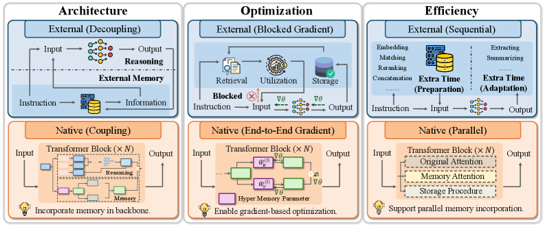
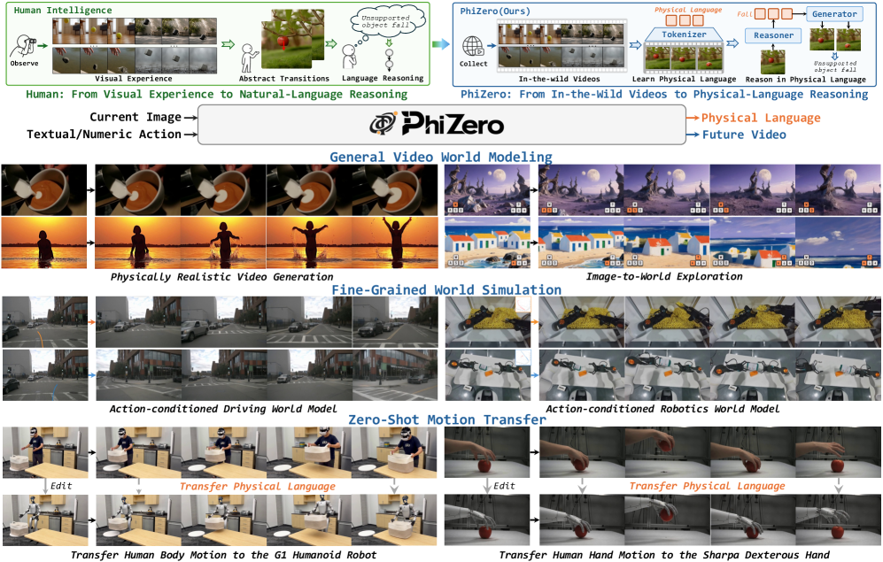
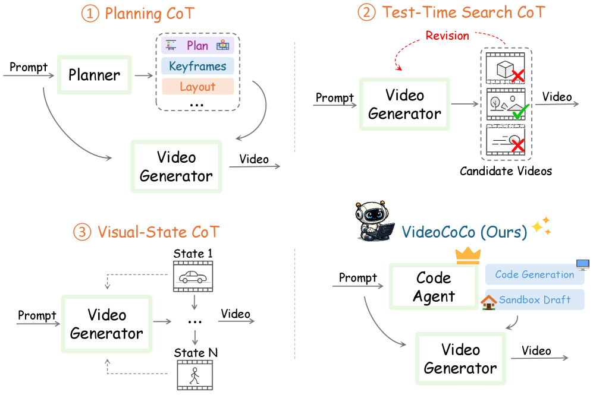
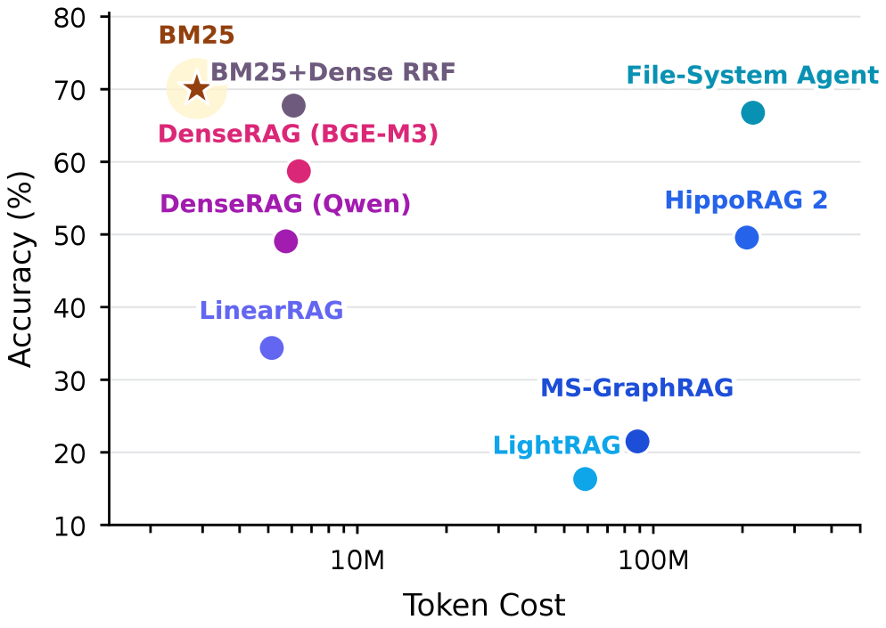
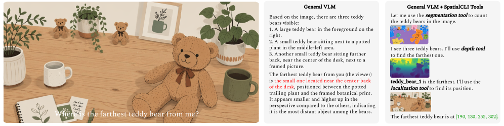
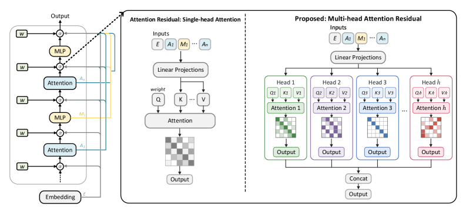
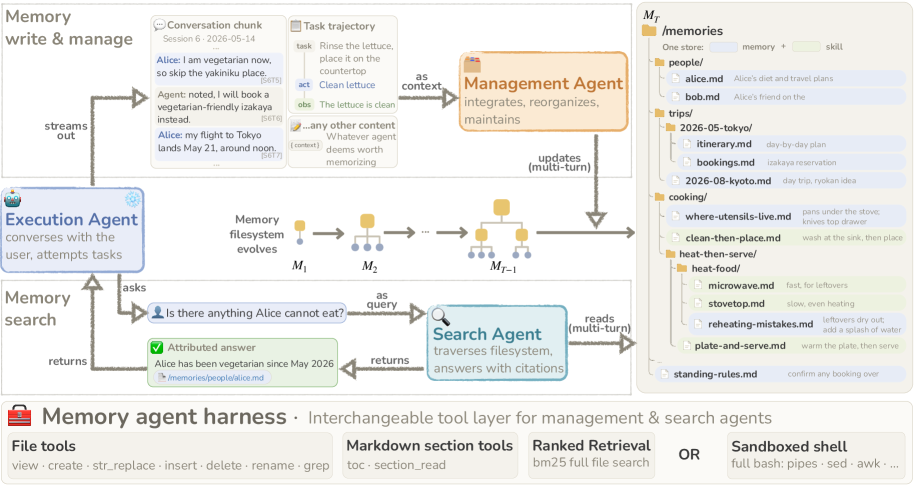

# Daily AI papers — 2026-07-31

*Curated from HF Daily Papers. 15 of 38 papers kept after relevance filter.*

## Papers at a glance

| # | Title | Topics | Org |
| --- | --- | --- | --- |
| 1 | [Qwen-UI-Agent Technical Report](#1-qwen-ui-agent-technical-report-toward-next-generation-real-world-centric-foundation-gui-agents) | `agents`, `multimodal`, `RL` | Alibaba |
| 2 | [Metis: Memory Foundation Model](#2-metis-memory-foundation-model) | `LLM`, `MoE`, `agents`, `long-context` | MemTensor · RUC · NUS |
| 3 | [Frontis-MA1 / OpenMLE](#3-frontis-ma1-training-an-ai4ai-model-towards-recursive-self-improvement-in-machine-learning-engineering) | `agents`, `RL`, `RLVR` | Tsinghua et al. |
| 4 | [PhiZero: A World Model Built Around Physical Language](#4-phizero-a-world-model-built-around-physical-language) | `multimodal`, `diffusion`, `reasoning` | CASIA |
| 5 | [VideoCoCo](#5-videococo-code-as-cot-for-physically-consistent-video-generation-via-an-agentic-dual-engine-system) | `multimodal`, `agents`, `diffusion` | Multi-institution |
| 6 | [Memory Decoder at Scale](#6-memory-decoder-at-scale-a-pretrained-parametric-long-term-memory) | `LLM`, `pretraining`, `long-context` | SJTU · Shanghai AI Lab |
| 7 | [Beacon: Agentic Visual Reasoning](#7-beacon-knowing-when-and-how-to-perform-agentic-visual-reasoning) | `agents`, `multimodal`, `RL` | Peking U · Kling |
| 8 | [BM25 Wins at Scale](#8-bm25-wins-at-scale-a-scaling-study-of-retrieval-augmented-generation-paradigms) | `eval`, `agents` | USTC |
| 9 | [Flux-OPD](#9-flux-opd-on-policy-distillation-with-evolving-contexts) | `RL`, `distillation` | Peking U · Kling |
| 10 | [SpatialCLI](#10-spatialcli-learning-to-reason-with-spatial-tools-then-without-them) | `agents`, `multimodal`, `RL` | Zhejiang U |
| 11 | [β-OPSD: Policy Optimization ↔ Self-Distillation](#11-β-opsd-deriving-with-policy-optimization-training-with-self-distillation) | `RL`, `distillation`, `reasoning` | UMD |
| 12 | [Chimera: Hybrid Visual Diffusion Transformers](#12-chimera-designing-and-chinchilla-scaling-hybrid-visual-diffusion-transformers) | `diffusion`, `architecture`, `efficient-inference` | Adobe Research |
| 13 | [Multi-Head Attention Residuals](#13-multi-head-attention-residuals) | `architecture`, `LLM` | UW-Madison |
| 14 | [Revisiting Lossy Verification in Speculative Decoding](#14-revisiting-lossy-verification-in-speculative-decoding) | `efficient-inference` | Baidu · ZJU |
| 15 | [Filesystem-Based Memory for LLM Agents](#15-filesystem-based-memory-for-llm-agents) | `agents`, `eval` | UIUC · UCSD · Adobe |

---

## 1. Qwen-UI-Agent Technical Report: Toward Next-Generation Real-World Centric Foundation GUI Agents

**Authors:** MAI-UI Team — *Alibaba Group (Alibaba Token Hub)*
**Links:** [arXiv:2607.28227](https://arxiv.org/abs/2607.28227) · [HF](https://huggingface.co/papers/2607.28227) · [AlphaXiv](https://www.alphaxiv.org/abs/2607.28227)
**Topics:** `agents`, `multimodal`, `GUI`, `RL`

### TL;DR

A foundation model positioned as a general-purpose executor across real digital devices — mobile, desktop, browser, and "DeepSearch" environments. The paper frames what a real-world-centric GUI agent should be: cross-platform, mixing GUI clicks with CLI execution, capable of long-horizon workflows, and self-improving with minimal human curation.

### Key idea

A single foundation model trained to interleave GUI actions and shell commands across four canonical environments (mobile / computer-use / web / DeepSearch), rather than a specialist per surface. The report positions "real-device operation + proactive services + autonomous improvement" as the three axes distinguishing a *foundation* GUI agent from a task-specific one.

### Main finding

Abstract-level claims only: benchmark numbers are not visible from the HF page excerpt. The report is framed as a technical report / vision doc for the Qwen-UI-Agent series.

### Why it matters

GUI agents remain the most bandwidth-limited surface for LLMs — every step needs perception, planning, and tool call, and existing systems break on the first unfamiliar UI. A frontier-lab foundation model targeted at exactly this surface (not fine-tuned from a generalist) is a step toward the "computer-use" pattern becoming a first-class capability rather than a demo.

### Knowledge graph integration

**Builds on / relates to existing pages:**
- [agents/README.md](../agents/README.md) — the agents folder scaffolding this paper populates.
- [case-studies/qwen2-5.md](../case-studies/qwen2-5.md) — same lab, prior generation Qwen tech report shape.

**Suggested new pages:**
- `case-studies/qwen-ui-agent.md` *(case study)* — end-to-end system, but only if a longer version of the report is available (abstract alone is too thin).
- `agents/_gui-agents.md` *(taxonomy)* — GUI-agent architectures and training regimes across mobile/desktop/web.
- `agents/deepsearch-agent.md` *(depth)* — the DeepSearch environment as an agentic evaluation surface.

---

## 2. Metis: Memory Foundation Model

**Authors:** Zeyu Zhang, Ziliang Guo, Yihang Sun, Xichong Zhang, Xixuan Hao, Zehao Lin, Yang Zhang, Xiaoyan Zhao, Tong Shen, Bo Tang, Zhi-Qin John Xu, Junchi Yan, Haofen Wang, Xu Chen, Feiyu Xiong, Zhiyu Li, Tat-Seng Chua — *MemTensor · Renmin University of China · NUS · SJTU · Tongji*
**Links:** [arXiv:2607.26760](https://arxiv.org/abs/2607.26760) · [HF](https://huggingface.co/papers/2607.26760) · [AlphaXiv](https://www.alphaxiv.org/abs/2607.26760)
**Topics:** `LLM`, `architecture`, `agents`, `long-context`

### TL;DR

Metis is the first attempt to internalize *agent memory* into the foundation model itself instead of bolting on a retrieval database. The model carries a native memory state that compresses historical context and is queried through a new "memory attention" operator — treating memory as a first-class architectural component alongside attention and MoE.

### Key idea

A parametric memory state trained end-to-end with the model. Historical information is written into and read from this state via a dedicated **memory attention** — semantically similar to KV-cache attention, but the memory is a learned, compressed representation rather than raw past tokens. The paper positions this as a new class of foundation model in the same vein as "reasoning models" or "multimodal models."

### Main finding

Introductory paper — the abstract emphasizes framing and initial demonstrations rather than headline benchmarks. Extensive experiments are claimed with detailed analysis of strengths, limits, and behaviors of the native memory.

### Why it matters

Agent memory today is almost universally external (RAG, vector DBs, scratchpad files — see paper #15 in this digest). If a native architectural primitive can compete, it would collapse a huge chunk of the agent-infra stack into the model. Also see paper #6 (Memory Decoder at Scale) — different bet on the same intuition that memory should be parametric.

### Knowledge graph integration

**Builds on / relates to existing pages:**
- [fundamentals/attention.md](../fundamentals/attention.md) — memory attention is a specialization of the attention operator.
- [architectures/multi-head-attention.md](../architectures/multi-head-attention.md) — closest existing architectural cousin.
- [architectures/_moe.md](../architectures/_moe.md) — precedent for adding a new sparsely-activated primitive alongside attention.

**Suggested new pages:**
- `architectures/memory-foundation-model.md` *(depth)* — Metis architecture: native memory state + memory attention.

---

## 3. Frontis-MA1: Training an AI4AI Model towards Recursive Self-Improvement in Machine Learning Engineering

**Authors:** Junlin Yang, Che Jiang, Yu Fu, Tianwei Luo, Can Ren, Weizhi Wang, Kaikai Zhao, Hongyi Liu, Yuxin Zuo, Yuru Wang, Yuchen Fan, Kai Tian, Zhenzhao Yuan, Xiaojian Lin, Li Sheng, Rushi Qiang, Guoli Jia, Xingtai Lv, Ermo Hua, Dianqiao Lei, Youbang Sun, Ning Ding — *large multi-institution consortium*
**Links:** [arXiv:2607.28568](https://arxiv.org/abs/2607.28568) · [HF](https://huggingface.co/papers/2607.28568) · [AlphaXiv](https://www.alphaxiv.org/abs/2607.28568)
**Topics:** `agents`, `RL`, `RLVR`, `code`

### TL;DR

An open, full-stack system for studying recursive self-improvement (RSI) in machine-learning engineering (MLE). The pitch: MLE is the natural testbed for RSI because tasks have executable rewards. **OpenMLE** ships three parts — a task/env layer with execution feedback (OpenMLE-Gym), operator-level RL (OpenMLE-RL), and long-horizon evolutionary search (OpenMLE-Evo) — plus **Frontis-MA1**, a model trained inside this stack.

### Key idea

Treat "training a model" as a verifiable-reward RL environment. The agent proposes ML pipelines, executes them, and gets scored by the resulting model's held-out performance — a natural RLVR setting where the verifier is the training run itself. Long-horizon search on top allows an evolutionary loop over agent variants.

### Main finding

Abstract only lists the system components; concrete scores are not in the excerpt. The value proposition is the **infrastructure** — open envs + RL + evo-search + an operator-trained model — comparable to what "MLE-Bench + agentic scaffold" would look like open-sourced end-to-end.

### Why it matters

Recursive self-improvement is one of the load-bearing capability claims for near-term AGI. Existing MLE agent benchmarks (MLE-Bench, MLAgentBench) are eval-only. An open training environment where you can *learn* to improve your ML pipelines — with a serious model trained inside it — moves the field from "evaluating AI4AI capability" to "iterating on AI4AI capability."

### Knowledge graph integration

**Builds on / relates to existing pages:**
- [post-training/rlvr.md](../post-training/rlvr.md) — MLE tasks with executable pipelines are RLVR by construction.
- [post-training/grpo.md](../post-training/grpo.md) — expected RL algo family for operator learning.
- [agents/README.md](../agents/README.md) — long-horizon agent training environment.

**Suggested new pages:**
- `agents/ai4ai-rsi.md` *(depth)* — recursive self-improvement in the MLE loop.
- `evaluation/openmle-gym.md` *(depth)* — OpenMLE-Gym as a benchmark harness.

---

## 4. PhiZero: A World Model Built Around Physical Language

**Authors:** Shuyao Shang, Yuqi Wang, Ruopeng Gao, Xu Chen, Tieniu Tan, Lue Fan, Zhaoxiang Zhang — *NLPR, Institute of Automation, Chinese Academy of Sciences (CASIA)*
**Links:** [arXiv:2607.28624](https://arxiv.org/abs/2607.28624) · [HF](https://huggingface.co/papers/2607.28624) · [AlphaXiv](https://www.alphaxiv.org/abs/2607.28624)
**Topics:** `multimodal`, `diffusion`, `reasoning`, `world-model`

### TL;DR

Instead of predicting the future of a scene directly in pixels, PhiZero first infers a compact discrete sequence — a "physical language" — describing how the world will evolve, then renders that plan into video. A reason-then-render split for world modeling.

### Key idea

Learn **physical language** self-supervised from in-the-wild videos: a discrete token vocabulary describing state transitions (motion, contact, deformation) at a level higher than pixels. World-model inference becomes two stages — (1) predict the next physical-language sequence conditioned on current state, (2) render it into video via a diffusion-style generator. The bet: putting the reasoning step in a discrete symbolic space makes physical plausibility something the model can reason *about* rather than something implicit in a pixel predictor.

### Main finding

Claimed strong performance on both generation and understanding benchmarks, plus concrete demos of interactive world modeling, fine-grained action-conditioned simulation, and zero-shot motion transfer. Exact numbers not in the abstract excerpt.

### Why it matters

Video/world models today entangle "what happens" with "how it looks" in one large diffusion transformer. Factoring them along the language/pixel boundary mirrors the reason-then-render pattern that made chain-of-thought work in text — if it generalizes, physical-language models could become the reasoning substrate for embodied and video-generation systems alike.

### Knowledge graph integration

**Builds on / relates to existing pages:**
- [multimodal/README.md](../multimodal/README.md) — video / world-model territory.
- [post-training/reasoning/long-cot-rl.md](../post-training/reasoning/long-cot-rl.md) — same reason-then-answer factorization, ported to video.

**Suggested new pages:**
- `multimodal/physical-language-world-model.md` *(depth)* — the reason-then-render paradigm.

---

## 5. VideoCoCo: Code-as-CoT for Physically-Consistent Video Generation via an Agentic Dual-Engine System

**Authors:** Tianfei Ren, Xiaoxiao Ma, Chunmei Qing, Zhen Fang, et al. — *CUHK · USTC · SCUT · HKU · NTU · PKU · SJTU · CMU · THU · HUST · MBZUAI*
**Links:** [arXiv:2607.27380](https://arxiv.org/abs/2607.27380) · [HF](https://huggingface.co/papers/2607.27380) · [AlphaXiv](https://www.alphaxiv.org/abs/2607.27380)
**Topics:** `multimodal`, `agents`, `diffusion`, `code`

### TL;DR

A dual-engine system that gets physically consistent videos by writing **Blender code** as an intermediate chain-of-thought: an LLM emits a deterministic spatiotemporal simulation script, Blender executes it into a rough animation, then a diffusion editor conditions on that draft to produce a photorealistic final video.

### Key idea

**Code-as-CoT** for generation: instead of prompting a text-to-video model directly, factor the task into (a) simulation-code generation (LLM → Blender), (b) draft-conditioned photorealistic editing (diffusion). Physics correctness is enforced by the simulator, aesthetics by the diffusion model — each engine does what it's best at. A **VideoCoCo-3K** dataset (3,000 aligned draft-instruction-target triplets) supports supervised training of the editor.

### Main finding

- PhyGenBench consistency score: **0.475 → 0.558**.
- VBench-2.0: **52.18 → 77.88**.

Improvements on physical-consistency-heavy benchmarks are substantial.

### Why it matters

State-of-the-art text-to-video models produce beautiful but physically incoherent outputs (objects fall wrong, water bends wrong). Offloading the physics to a real simulator via generated code sidesteps this and points to a broader pattern — LLMs writing code to specify what a diffusion model should render.

### Knowledge graph integration

**Builds on / relates to existing pages:**
- [multimodal/README.md](../multimodal/README.md) — video generation.
- [agents/README.md](../agents/README.md) — the dual-engine loop is an agent pattern.

**Suggested new pages:**
- `multimodal/code-as-cot-video.md` *(depth)* — the code-simulate-render three-stage pattern.

---

## 6. Memory Decoder at Scale: A Pretrained, Parametric Long-Term Memory

**Authors:** Rubin Wei, Jiaqi Cao, Jiarui Wang, Junming Zhang, Qipeng Guo, Bowen Zhou, Zhouhan Lin — *SJTU · Shanghai AI Lab*
**Links:** [arXiv:2607.27919](https://arxiv.org/abs/2607.27919) · [HF](https://huggingface.co/papers/2607.27919) · [AlphaXiv](https://www.alphaxiv.org/abs/2607.27919)
**Topics:** `LLM`, `pretraining`, `long-context`, `distillation`

### TL;DR

Scale up "Memory Decoder" — a dedicated parametric long-term memory module — to **6.9B parameters trained on 300B tokens**. Pairing a small base LM with a large memory module gives a strictly better parameter-vs-quality frontier than growing the base model alone.

### Key idea

Separate the "memory" and "reasoning" parameters. A Memory Decoder is trained (via distillation from a kNN retrieval distribution) to internalize a large corpus as parametric knowledge. At inference, it augments a small base LM by re-weighting its next-token distribution. Scaling both the memory model and the corpus while distributing the Faiss index makes the pipeline tractable at 300B tokens — a required system contribution to hit the scale.

### Main finding

- **6.9B memory + Pythia-410M** → avg 37.34 on 17 benchmarks; **beats Pythia-12B (37.24)** with 39% fewer total parameters.
- For **Qwen3 Base 0.6B → 14B**, a 1.7B domain memory adds >9 avg points across three domains at every scale.

Consistent evidence that memory scales more parameter-efficiently than backbone.

### Why it matters

The standard scaling story says "more base parameters = better model." This paper argues you should spend some of those parameters on a *dedicated memory head* instead. If the result generalizes, small backbones + big detachable memories become a serious inference-time architecture — cheaper to swap knowledge, easier to distill, and complementary to MoE.

### Knowledge graph integration

**Builds on / relates to existing pages:**
- [pre-training/mtp.md](../pre-training/mtp.md) — precedent for adding an auxiliary parametric module scaled alongside the backbone.
- [architectures/README.md](../architectures/README.md) — new backbone-vs-memory factorization.
- [data/quality-filtering.md](../data/quality-filtering.md) — memory quality depends heavily on corpus curation.

**Suggested new pages:**
- `architectures/parametric-memory-decoder.md` *(depth)* — Memory Decoder module + Faiss-distributed distillation pipeline.

---

## 7. Beacon: Knowing When and How to Perform Agentic Visual Reasoning

**Authors:** Qixun Wang, Yang Shi, Letian Cheng, Zhuoran Zhang, Yan He, Yuqi Tang, Qi Zhang, Xinlei Yu, Ruizhe Chen, Tianrun Xu, Yuanxing Zhang, Pengfei Wan, Haotian Wang, Xianghua Ying — *Peking University · Kling Team · HKUST(GZ) · CUHK · ZJU · THU*
**Links:** [arXiv:2607.28595](https://arxiv.org/abs/2607.28595) · [HF](https://huggingface.co/papers/2607.28595) · [AlphaXiv](https://www.alphaxiv.org/abs/2607.28595)
**Topics:** `agents`, `multimodal`, `RL`, `tool-use`

### TL;DR

Agentic vision-language models often call tools even when they'd be right without one, and often introduce errors when the tool is wrong. Beacon adds **necessity-aware reward** — during RL, credit is given only when a tool call was needed *and* corrected the model — plus **hint-guided capability expansion** to teach mode switching.

### Key idea

Decompose tool-use quality into two axes: **Mode Adaptiveness** (choosing whether to call a tool) and **Tool Effect** (extending capability without introducing errors). Design an RL reward that ties positive credit to both — so gratuitous tool calls that don't help are penalized. Hint-guided expansion feeds the model targeted supervision on cases where the tool is needed but not selected.

### Main finding

Beacon demonstrates stronger performance and more disciplined tool usage than baselines on agentic visual reasoning benchmarks; concrete numbers not in the excerpt.

### Why it matters

The "should I call the tool?" question is the quiet source of most agent-quality regressions — either the model over-uses expensive tools and slows down, or under-uses them and gets stuck. Making necessity part of the reward signal is a cleaner alternative to the usual heuristic tool-budgeting.

### Knowledge graph integration

**Builds on / relates to existing pages:**
- [post-training/grpo.md](../post-training/grpo.md) — RL algorithm class Beacon builds on.
- [post-training/_rewards.md](../post-training/_rewards.md) — new reward structure to add.
- [agents/README.md](../agents/README.md) — tool-use training.

**Suggested new pages:**
- `agents/necessity-aware-reward.md` *(depth)* — RL reward design for adaptive tool use.

---

## 8. BM25 Wins at Scale: A Scaling Study of Retrieval-Augmented Generation Paradigms

**Authors:** Benfeng Xu, Shaohan Wang, Xin Zeng, Huarui Wu, Lei Zhang, Licheng Zhang — *USTC · Metastone Technology · Beijing Academy of Agriculture and Forestry Sciences*
**Links:** [arXiv:2607.26497](https://arxiv.org/abs/2607.26497) · [HF](https://huggingface.co/papers/2607.26497) · [AlphaXiv](https://www.alphaxiv.org/abs/2607.26497)
**Topics:** `eval`, `agents`, `RAG`

### TL;DR

A carefully controlled scaling study across five RAG paradigms — dense, lexical, graph, filesystem-agent, and multi-agent — over **28 nested corpus tiers spanning ~450×**. Finding: rankings flip with scale. File-system Agent leads at small corpora; **BM25 dominates past ~10M tokens** and holds a 20-point accuracy lead at full scale.

### Key idea

Hold the question set and gold-vs-adversarial documents constant, vary only corpus size. This isolates the accuracy-cost scaling curve per paradigm, exposing crossovers that per-benchmark evaluations hide. The result is a *paradigm-vs-corpus-size* map instead of a single leaderboard number.

### Main finding

- File-System Agent leads at small corpora.
- BM25 overtakes around **10M tokens**.
- 20-point accuracy gap between BM25 and next-best at full scale.

### Why it matters

The default assumption that dense embedding retrieval + LLM re-ranking dominates BM25 is contradicted at scale — the classical lexical baseline wins where corpora are actually big. Also a rebuke to agentic-search-as-default: filesystem agents are good at small scale but don't survive to production corpus sizes. Practical takeaway: benchmark your retrieval stack at your actual corpus size, not on a 1M-token sample.

### Knowledge graph integration

**Builds on / relates to existing pages:**
- [evaluation/README.md](../evaluation/README.md) — controlled scaling study as an evaluation methodology.

**Suggested new pages:**
- `inference/_rag-paradigms.md` *(taxonomy)* — dense vs BM25 vs graph vs filesystem-agent vs multi-agent RAG.
- `evaluation/rag-scaling-study.md` *(depth)* — the nested-corpus-tier methodology.

---

## 9. Flux-OPD: On-Policy Distillation with Evolving Contexts

**Authors:** Yuran Wang, Zekun Wang, Bohan Zeng, Ruixu Zhang, Wenxuan Liu, Liu Yang, Yifan Dai, Yang Shi, Bozhou Li, Chengzhuo Tong, Daili Hua, Yuanxing Zhang, Wentao Zhang — *Peking University · Kling Team · Tsinghua · SJTU · Zhongguancun Academy*
**Links:** [arXiv:2607.28022](https://arxiv.org/abs/2607.28022) · [HF](https://huggingface.co/papers/2607.28022) · [AlphaXiv](https://www.alphaxiv.org/abs/2607.28022)
**Topics:** `RL`, `distillation`, `post-training`

### TL;DR

On-policy distillation in open-ended domains stalls: without a verifiable reward, contexts that convey preference lose their supervisory value once distilled in. Flux-OPD keeps the context *evolving with the student* and treats the difference between context-conditioned and context-free teachers as a **contextual correction signal**, weighted by an explicit conflict term.

### Key idea

Decompose the reverse-KL objective and observe two facts: (1) OPD distills the student toward the **geometric mean of context-conditioned teachers**, and (2) the objective contains a **conflict term** that measures disagreement among those teachers. Use those pieces mechanically: inject `(context-conditioned teacher) − (context-free teacher)` as a correction into the context-free anchor, and weight the correction magnitude by the conflict term. Distillation now tracks a target that keeps pace with the student and downweights itself when teachers disagree.

### Main finding

Flux-OPD outperforms existing on-policy-distillation paradigms on open-ended tasks (exact numbers not in the excerpt).

### Why it matters

Open-ended domains (creative writing, brainstorming, coding without unit tests) resist RLVR because there's no cheap verifier. Distillation with evolving contexts sidesteps the missing-verifier problem — turning "context that expresses preference" into a *dynamic* training signal. Complements RLHF and pure SFT rather than replacing them.

### Knowledge graph integration

**Builds on / relates to existing pages:**
- [post-training/dpo.md](../post-training/dpo.md) — preference-based post-training family.
- [post-training/reasoning/long2short.md](../post-training/reasoning/long2short.md) — existing use of distillation in RL post-training.
- [post-training/_rl.md](../post-training/_rl.md) — RL-family taxonomy where OPD variants sit.

**Suggested new pages:**
- `post-training/fine-tuning/on-policy-distillation.md` *(depth)* — OPD in general + Flux-OPD extension.

---

## 10. SpatialCLI: Learning to Reason With Spatial Tools, Then Without Them

**Authors:** Zixuan Huang, Sunzhu Li, Zhuo Yang, Chen Zhang, Shunian Chen, Caijun Yan, Jianyao Xu, Shunyu Liu, Weijie Fu, Peiliang Li, Xiaozhi Chen, Yuxiang Cai — *Zhejiang University*
**Links:** [arXiv:2607.27703](https://arxiv.org/abs/2607.27703) · [HF](https://huggingface.co/papers/2607.27703) · [AlphaXiv](https://www.alphaxiv.org/abs/2607.27703)
**Topics:** `agents`, `multimodal`, `RL`, `tool-use`

### TL;DR

Teach a VLM to reason with vision specialist tools (depth, segmentation, etc.), then **internalize** the capability by distilling successful tool-use trajectories back into pure text reasoning. Two-stage curriculum: first learn to use tools, then learn to not need them.

### Key idea

Three-stage pipeline: (1) expose specialist vision models as callable tools; (2) train tool use via SFT + RL; (3) convert successful **tool-use trajectories into direct-reasoning training data** so the tools can be dropped at inference. This targets the general failure mode where tool-augmented VLMs need the tool at test time or collapse in accuracy.

### Main finding

- 8B model, **SpatialCLI-Bench** (516 compositional-spatial-reasoning examples):
  - **72.7%** without tools · **91.3%** with tools.
- Outperforms **GPT-5.6** on this benchmark while keeping the internalized capability.

### Why it matters

Tool-use training tends to make models tool-*dependent*: without the tool, quality drops sharply. Distilling tool-use trajectories back into reasoning data is a clean recipe for **capability internalization** — you get the training benefits of tools *and* a fully self-contained inference-time model.

### Knowledge graph integration

**Builds on / relates to existing pages:**
- [agents/README.md](../agents/README.md) — tool-use training.
- [post-training/grpo.md](../post-training/grpo.md) — RL algorithm for tool-use stage.
- [post-training/rejection-sampling.md](../post-training/rejection-sampling.md) — analog for keeping only successful trajectories.

**Suggested new pages:**
- `agents/tool-internalization.md` *(depth)* — the "train with tools, then without" recipe.
- `evaluation/spatialcli-bench.md` *(depth)* — the 516-example compositional-spatial benchmark (borderline, small benchmark).

---

## 11. β-OPSD: Deriving with Policy Optimization, Training with Self-Distillation

**Authors:** Minghui Liu, Juzheng Zhang, Tom Goldstein, Furong Huang — *University of Maryland, College Park*
**Links:** [arXiv:2607.28582](https://arxiv.org/abs/2607.28582) · [HF](https://huggingface.co/papers/2607.28582) · [AlphaXiv](https://www.alphaxiv.org/abs/2607.28582)
**Topics:** `RL`, `distillation`, `reasoning`

### TL;DR

On-policy self-distillation (OPSD) is exactly the β=1 case of a broader policy-optimization family with a KL-anchor coefficient β. Turning β into a knob interpolates between "stay near the reference policy" and "trust the privileged teacher" — but instead of running expensive RL, the optimal policy has a **closed form** that can be implemented as a cheap logit-mixture distillation target.

### Key idea

The exact policy solving a KL-regularized RL objective with reference $\pi_\text{ref}$ and privileged teacher $\pi_\text{teach}$ is the geometric interpolation $\pi^* \propto \pi_\text{ref}^{1/\beta} \pi_\text{teach}^{1 - 1/\beta}$ (schematically). Each β on the reference-to-teacher path is realized by **mixing token-level logits** at training time — turning a policy-optimization problem into a distillation target. Return-to-go credit assignment ties per-token updates back to the sequence-level RL objective.

### Main finding

β-OPSD consistently beats vanilla OPSD on math-reasoning benchmarks, improving both optimization stability and downstream reasoning performance. Concrete numbers not in the excerpt.

### Why it matters

OPSD is notoriously brittle to run — hyperparameter-sensitive, easily unstable. Reframing it as one point on a policy-optimization spectrum, and getting to any other point via *free* logit mixing, is a genuinely elegant reduction. It also builds a bridge between distillation-style post-training and RL post-training that could clean up how both are taught and implemented.

### Knowledge graph integration

**Builds on / relates to existing pages:**
- [post-training/dpo.md](../post-training/dpo.md) — closest existing "closed-form solution turned into a training loss" pattern.
- [post-training/_rl.md](../post-training/_rl.md) — RL family this fits under.
- [post-training/reasoning/long2short.md](../post-training/reasoning/long2short.md) — a specific instance of teacher-student for reasoning.

**Suggested new pages:**
- `post-training/beta-opsd.md` *(depth)* — β-OPSD derivation + logit-mixture target.

---

## 12. Chimera: Designing and Chinchilla-Scaling Hybrid Visual Diffusion Transformers

**Authors:** Chongjian Ge, Hanwen Jiang, Tianyu Wang, Jiuxiang Gu, Yiran Xu, Ziwen Chen, Shaoteng Liu, Jing Shi, Yicong Hong, Zefan Cai, Hailin Jin, Hao Tan — *Adobe Research*
**Links:** [arXiv:2607.28611](https://arxiv.org/abs/2607.28611) · [HF](https://huggingface.co/papers/2607.28611) · [AlphaXiv](https://www.alphaxiv.org/abs/2607.28611)
**Topics:** `diffusion`, `architecture`, `efficient-inference`, `multimodal`

### TL;DR

Chimera is a hybrid visual-diffusion backbone that stacks three different sequence-mixing primitives — **Kimi Delta Attention** for long-context tracking, **periodic Multi-head Latent Attention (MLA)** for global mixing, and modality-aware short **convolutions** for local spatiotemporal structure. Trained at 11B total / 2B active with a HeteroP module-wise scaling scheme, it hits full-attention quality at 7.3× fewer FLOPs and extrapolates 5s → 30s video zero-shot.

### Key idea

Not every sublayer needs to be full attention. Chimera interleaves three primitives with complementary cost profiles: linear-cost delta attention (most layers), periodic MLA layers (occasional global mixing), and short convolutions (local structure). Because different primitives have different scaling laws, the paper introduces **HeteroP** — a module-wise scaling scheme that predicts per-primitive hyperparameters across model sizes, enabling reliable transfer.

### Main finding

- **7.3×** fewer FLOPs than a matched full-attention baseline at similar quality.
- **Zero-shot video extrapolation from 5s → 30s** with minimal degradation.
- 11B total params, **2B active**.

### Why it matters

Full-attention DiTs are prohibitive at video resolutions and durations. Chimera argues you can get most of the benefit by mixing linear-attention layers, sparse full-attention layers, and convs — a recipe more permissive than pure Mamba-style SSM stacks. HeteroP is separately interesting: independent scaling laws per primitive is a research direction with legs.

### Knowledge graph integration

**Builds on / relates to existing pages:**
- [architectures/mla.md](../architectures/mla.md) — MLA reused as the periodic global-attention primitive.
- [architectures/multi-head-attention.md](../architectures/multi-head-attention.md) — full-attention baseline it beats.
- [architectures/_moe.md](../architectures/_moe.md) — precedent for total-vs-active parameter framing.

**Suggested new pages:**
- `multimodal/hybrid-diffusion-transformer.md` *(depth)* — the delta-attention + MLA + conv recipe for visual diffusion.
- `architectures/kimi-delta-attention.md` *(depth)* — linear-attention variant used here.
- `pre-training/heterop-scaling.md` *(depth)* — module-wise scaling law fitting.

---

## 13. Multi-Head Attention Residuals

**Authors:** Cheng Luo (Independent), Zefan Cai, Junjie Hu — *University of Wisconsin–Madison*
**Links:** [arXiv:2607.27230](https://arxiv.org/abs/2607.27230) · [HF](https://huggingface.co/papers/2607.27230) · [AlphaXiv](https://www.alphaxiv.org/abs/2607.27230)
**Topics:** `architecture`, `LLM`, `pretraining`

### TL;DR

Transformers read only the *most recent* residual state at each sublayer. "Attention residuals" extend this by letting each sublayer softmax-attend over **all previous layer outputs**. This paper fixes attention residuals' width problem: a single routing query forces every feature subspace through one distribution. **MHAR** reshapes the routing query into H per-subspace heads (zero extra params), so each subspace picks its own depth distribution.

### Key idea

Attention residuals = attention over depth. The single query becomes a bottleneck at scale because feature subspaces disagree about which layers matter. MHAR replaces the single-query routing with **block-diagonal multi-head routing** — H per-subspace queries, each softmaxing independently over past layer outputs. H=1 recovers vanilla attention residuals. Setting H = number of KV heads is a hyperparameter-free default. Includes fused Triton kernels that lift training throughput to 0.55–0.88× of the plain-additive-residual baseline.

### Main finding

- Val-loss improvements vs standard Transformer: **-0.049 at 100M · -0.080 at 350M · -0.063 at 1B**.
- Single-head attention residuals **hurt** at 1B (0.105 worse); MHAR's gap over single-head widens from 0.010 → 0.168 with scale.
- 8B mid-training via delta-attention conversion: **+3.2 GSM8K, +3.1 GPQA**.
- Fused Triton routing kernels: **0.55–0.88× baseline throughput** (vs 0.2–0.5× for vanilla attention residuals).

### Why it matters

The residual stream is a hidden bottleneck: adding more depth doesn't help if every sublayer only sees the last output. MHAR is a small, cheap, drop-in that widens that channel — and the scaling story matters: single-head routing hurts at 1B, MHAR helps monotonically. Being competitive with the plain baseline at throughput (via kernels) makes it a real deployment candidate rather than a research-only trick.

### Knowledge graph integration

**Builds on / relates to existing pages:**
- [architectures/transformer-block.md](../architectures/transformer-block.md) — modifies the residual stream between sublayers.
- [architectures/multi-head-attention.md](../architectures/multi-head-attention.md) — reuses per-head factorization pattern for a different purpose.
- [fundamentals/attention.md](../fundamentals/attention.md) — depth-axis attention.

**Suggested new pages:**
- `architectures/multi-head-attention-residuals.md` *(depth)* — MHAR + attention-over-depth family.

---

## 14. Revisiting Lossy Verification in Speculative Decoding: Mechanisms, Trade-offs, and Failure Modes

**Authors:** Tianyu Wang (Independent), Yuxuan Zhou (Baidu), Wenbin Wang (Independent), Heng Li (Independent), Zikai Xiao (Zhejiang University), Junyuan Shang (Baidu)
**Links:** [arXiv:2607.26627](https://arxiv.org/abs/2607.26627) · [HF](https://huggingface.co/papers/2607.26627) · [AlphaXiv](https://www.alphaxiv.org/abs/2607.26627)
**Topics:** `efficient-inference`, `speculative-decoding`

### TL;DR

Speculative decoding schemes that *relax* strict distributional matching between draft and target can go badly wrong. This paper categorizes lossy verification into **truncation-based** and **collaborative** paradigms, identifies the specific mechanisms that cause quality loss in each, and gives design constraints to prevent them.

### Key idea

Two paradigms:
- **Truncation-based**: draft samples are accepted if within a truncated target distribution. Failure mode — **distributional distortion**: the accepted sample distribution can diverge sharply from the true truncated distribution, silently degrading quality vs a proper truncated-sampling baseline.
- **Collaborative**: draft and target combine acceptance rules. Failure mode — **overshoot of draft probability over target probability** leads to low-quality outputs. Controlling that overshoot is the necessary condition.

The paper provides a principled analysis (mechanism + trade-off + failure mode) for each rather than benchmarking a specific new scheme.

### Main finding

Analytical: the paper's main deliverable is characterization — where each lossy paradigm fails and what condition prevents it. Empirical validation follows the analysis.

### Why it matters

Lossy speculative decoding is used in production serving stacks for the throughput. Any distributional drift is invisible in aggregate metrics but shows up as quality regressions users notice. Naming the failure mechanism and the specific condition to control converts silent tail-quality loss into an engineering knob.

### Knowledge graph integration

**Builds on / relates to existing pages:**
- [pre-training/mtp.md](../pre-training/mtp.md) — MTP heads are the canonical draft source for speculative decoding today.
- [inference/README.md](../inference/README.md) — speculative decoding is a headline inference technique.

**Suggested new pages:**
- `inference/_speculative-decoding.md` *(taxonomy)* — lossless, truncation-lossy, collaborative-lossy families.
- `inference/lossy-verification.md` *(depth)* — this paper's characterization + mitigations.

---

## 15. Filesystem-Based Memory for LLM Agents: Organization, Evolution, and Sustainability

**Authors:** Sizhe Zhou, Sheldon Yu, Hui Wei, Junda Wu, Siru Ouyang, Yizhu Jiao, Shijia Pan, Julian McAuley, Yu Zhang, Tong Yu, Jiawei Han — *UIUC · UCSD · UC Merced · Adobe Research · Texas A&M*
**Links:** [arXiv:2607.26637](https://arxiv.org/abs/2607.26637) · [HF](https://huggingface.co/papers/2607.26637) · [AlphaXiv](https://www.alphaxiv.org/abs/2607.26637)
**Topics:** `agents`, `eval`, `memory`

### TL;DR

The default agent memory in production today is a **directory of markdown files** the agent reads, writes, and reorganizes via generic file tools. This paper is the first systematic study of that default: what organization actually buys you, what breaks as the store grows, and what levers actually change the store's shape.

### Key idea

Formalize filesystem memory as three roles around one store — a **management agent** (writes, reorganizes), a **search agent** (retrieves + cites), and an **execution agent** (produces trajectories distilled into skills). Vary shape (agent-organized hierarchy vs verbatim dump vs chunk retrieval), scale, tool harness, and agent strength. Measure answer quality, cost, and store health across long-conversation benchmarks and embodied tasks.

### Main finding

- **Organized stores roughly halve retrieval cost** at large scale — the real, reliable win.
- All but the strongest management agent see **organization erode** as memory grows.
- No agent measured **converts organization itself into better answers** (only into cheaper answers).
- **Tool set matters as much as model choice** for the resulting store's shape.

### Why it matters

Filesystem memory has become the de facto agent-memory default (Claude Code, Cursor, Devin-style systems), but treated as a solved problem. The paper reframes it as an unresolved design space — pointing at concrete gaps (management-agent quality, tool harness design) rather than telling everyone to use vector DBs. Complements paper #2 (Metis) and paper #6 (Memory Decoder) as a study of the *external-memory* alternative both papers are competing with.

### Knowledge graph integration

**Builds on / relates to existing pages:**
- [agents/README.md](../agents/README.md) — the target folder for agent memory patterns.
- [evaluation/README.md](../evaluation/README.md) — long-conversation and embodied-task benchmarking.

**Suggested new pages:**
- `agents/filesystem-memory.md` *(depth)* — the three-role formalization + measured findings.

---

## Notes

- **Memory day.** Four papers (#2 Metis, #6 Memory Decoder, #15 Filesystem Memory, plus MemHarness — not kept — from the same day) all attack agent memory from different angles: native parametric (Metis), separable parametric (Memory Decoder), external filesystem (this paper). Worth watching as a converging debate.
- **Distillation ↔ RL bridge.** Papers #9 (Flux-OPD) and #11 (β-OPSD) both show that on-policy distillation and RL are more closely related than usually taught — β-OPSD is exact, Flux-OPD is empirical.
- **Hero figures missing** for #3 (Frontis-MA1) and #6 (Memory Decoder) — the HF pages had no reliable preview image and the arXiv HTML fallback returned placeholder files. All 13 other figures downloaded successfully.
- This digest is informational. No existing concept files, `READING-LIST.md`, or `PAPERS.md` were modified to produce it.
