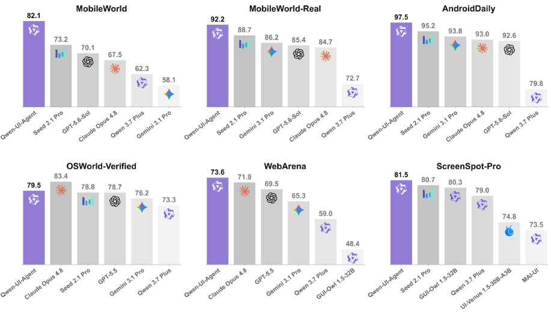
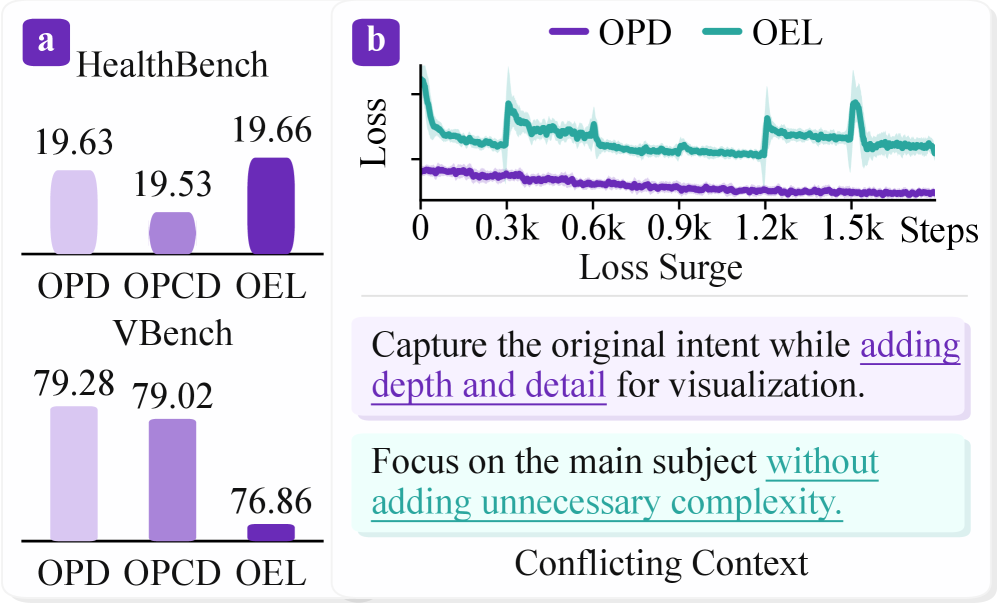
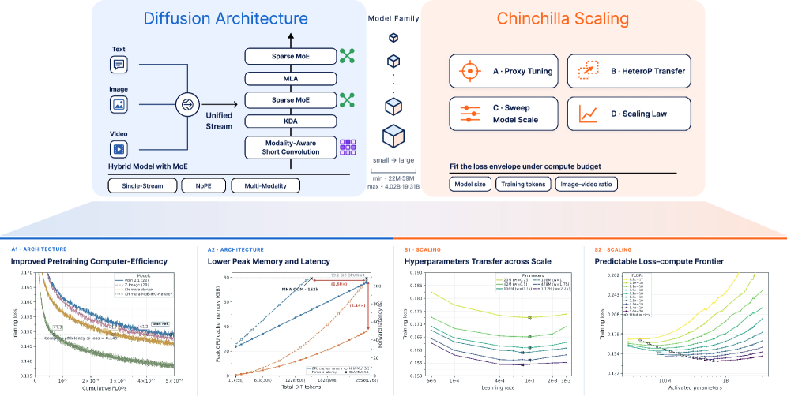
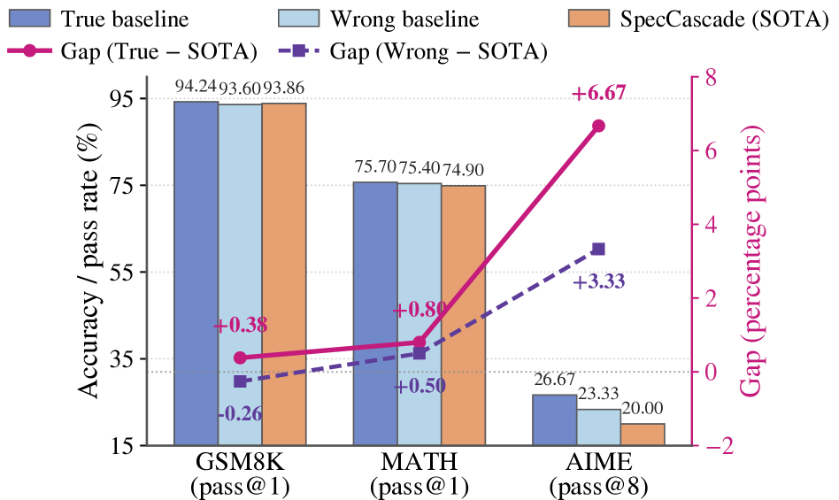

# Daily AI papers — 2026-08-01

*Curated from HF Daily Papers. 15 of ~38 papers kept after relevance filter.*

## Papers at a glance

| # | Title | Topics | Org |
| --- | --- | --- | --- |
| 1 | [Qwen-UI-Agent Technical Report](#1-qwen-ui-agent) | `agents`, `multimodal`, `RL` | Alibaba Token Hub |
| 2 | [Metis: Memory Foundation Model](#2-metis) | `architectures`, `agents`, `memory` | MemTensor / RUC / NUS |
| 3 | [Frontis-MA1: Recursive Self-Improvement in ML Engineering](#3-frontis-ma1) | `agents`, `RL`, `eval` | (open consortium) |
| 4 | [PhiZero: A World Model Built Around Physical Language](#4-phizero) | `multimodal`, `world-model`, `video` | CASIA |
| 5 | [Memory Decoder at Scale](#5-memory-decoder-at-scale) | `pre-training`, `retrieval`, `scaling-laws` | (Qipeng Guo et al.) |
| 6 | [Beacon: Agentic Visual Reasoning](#6-beacon) | `agents`, `multimodal`, `RL` | PKU / Kling |
| 7 | [BM25 Wins at Scale (RAG scaling study)](#7-bm25-wins-at-scale) | `agents`, `retrieval`, `eval` | USTC / Metastone |
| 8 | [Flux-OPD: On-Policy Distillation with Evolving Contexts](#8-flux-opd) | `post-training`, `distillation` | PKU / Kling |
| 9 | [β-OPSD: Policy Optimization via Self-Distillation](#9-beta-opsd) | `post-training`, `RL`, `reasoning` | UMD |
| 10 | [Chimera: Hybrid Visual Diffusion Transformers](#10-chimera) | `diffusion`, `architectures` | Adobe Research |
| 11 | [Echoverse: Environments for Training Computer-Use Agents](#11-echoverse) | `agents`, `RL`, `data` | Microsoft Research |
| 12 | [Revisiting Lossy Verification in Speculative Decoding](#12-lossy-verification) | `efficient-inference` | Baidu / ZJU |
| 13 | [OmniScope: Modality-Decoupled Token Compression](#13-omniscope) | `multimodal`, `efficient-inference` | Xiamen U. / Alibaba |
| 14 | [Is Deep Research Reliable?](#14-is-deep-research-reliable) | `safety`, `agents`, `eval` | (Zhu et al.) |
| 15 | [Coherent Overlap in Sparse MoE Routing](#15-coherent-overlap) | `architectures`, `interp`, `MoE` | ZJU / PolyU |

---

## 1. Qwen-UI-Agent

**Authors:** MAI-UI Team — *Alibaba Token Hub, Alibaba Group*
**Links:** [arXiv:2607.28227](https://arxiv.org/abs/2607.28227) · [HF](https://huggingface.co/papers/2607.28227) · [AlphaXiv](https://www.alphaxiv.org/abs/2607.28227)
**Topics:** `agents`, `multimodal`, `RL`

### TL;DR

Qwen's tech report on a foundation GUI agent that runs across mobile, desktop, web, and DeepSearch on real devices. Positions the class as a single model that combines GUI interaction with CLI, does long-horizon workflows, proactively initiates services, and self-improves — rather than a chat wrapper over screenshots.

### Key idea

A **real-world centric** foundation agent: real devices instead of simulators; unified action space that mixes GUI clicks with terminal commands; a workflow abstraction that lets the same weights execute long, cross-platform recipes; and an autonomous-improvement loop that reduces human supervision as the agent gains experience.

### Main finding

Qwen positions Qwen-UI-Agent as the successor to MAI-UI (2025) and claims real-world usable performance across mobile / computer-use / web / DeepSearch. Concrete numbers are in the report's contributions section (not extracted here).

### Why it matters

Consolidates the fragmented GUI-agent stack — mobile agents, web agents, computer-use, deep research — into one weight-sharing foundation model. Sets a benchmark for what "GUI foundation model" means alongside general-purpose LLMs.

### Knowledge graph integration

**Builds on / relates to existing pages:**
- [../agents/README.md](../agents/README.md) — first Qwen entry to this folder; foundation GUI agents.
- [../case-studies/qwen2-5.md](../case-studies/qwen2-5.md) — same-family Qwen release; shared post-training substrate.

**Suggested new pages:**
- `agents/gui-agent.md` *(depth)* — foundation GUI agent design (unified action space, real-device training).
- `case-studies/qwen-ui-agent.md` *(case study)* — full tech report once contributions section is available.

---

## 2. Metis

**Authors:** Zeyu Zhang, Ziliang Guo, Yihang Sun et al. — *MemTensor (Shanghai) / RUC / NUS / SJTU / Tongji*
**Links:** [arXiv:2607.26760](https://arxiv.org/abs/2607.26760) · [HF](https://huggingface.co/papers/2607.26760) · [AlphaXiv](https://www.alphaxiv.org/abs/2607.26760)
**Topics:** `architectures`, `agents`, `memory`

### TL;DR

A foundation model with **native memory** — instead of bolt-on RAG or scratchpad memory, Metis equips the base model itself with a persistent memory state that historical information is compressed into and later accessed via a dedicated *memory attention* pathway.

### Key idea

Add a first-class "native memory state" (analogous to the KV cache but persistent and compressed) inside the transformer, updated during interaction and read by a **memory-attention** operator alongside standard self-attention. Compression is learned, not heuristic.

### Main finding

Positioned as the first "memory foundation model": memory is a training axis, not a post-hoc wrapper. Improves agent long-horizon consistency; specific numbers in the paper.

### Why it matters

Reframes agent memory from a plumbing problem (vector stores, summaries, LangChain hoops) into a *pretraining* problem. If native memory scales, agents inherit context reuse for free instead of gluing on retrieval.

### Knowledge graph integration

**Builds on / relates to existing pages:**
- [../fundamentals/attention.md](../fundamentals/attention.md) — memory attention is a new attention branch alongside standard self-attention.
- [../architectures/mla.md](../architectures/mla.md) — MLA compresses KV; Metis compresses a longer-horizon state, similar spirit.
- [../agents/README.md](../agents/README.md) — targets agent workflows where scratchpad memory dominates cost.

**Suggested new pages:**
- `architectures/memory-attention.md` *(depth)* — native memory state + memory-attention operator.

---

## 3. Frontis-MA1

**Authors:** Junlin Yang, Che Jiang, Yu Fu et al. — *(affiliation not shown on HF page)*
**Links:** [arXiv:2607.28568](https://arxiv.org/abs/2607.28568) · [HF](https://huggingface.co/papers/2607.28568) · [AlphaXiv](https://www.alphaxiv.org/abs/2607.28568)
**Topics:** `agents`, `RL`, `eval`

### TL;DR

An open **AI4AI** (AI building AI) stack for studying *recursive self-improvement* in the concrete testbed of ML engineering. Ships as three coupled components: OpenMLE-Gym (verifiable RL environments with execution feedback), OpenMLE-RL (operator learning), and OpenMLE-Evo (long-horizon search over programs).

### Key idea

Treat MLE as the concrete problem where RSI can be measured: environments that execute and grade the agent's code, an RL loop that teaches the agent operators (edit / debug / evaluate), and an outer search process that iterates over long horizons. Verifiable rewards make the loop trainable.

### Main finding

Not stated in the abstract excerpt — the paper introduces the framework and Frontis-MA1 as a trained model; downstream MLE benchmark scores are in the report.

### Why it matters

RSI is usually studied abstractly. Grounding it in MLE — where the agent's outputs run and can be verified — turns "does the loop close?" into an empirical question. Comparable in ambition to MLE-Bench and R&D benchmarks but explicitly framed for closed-loop self-improvement.

### Knowledge graph integration

**Builds on / relates to existing pages:**
- [../post-training/rlvr.md](../post-training/rlvr.md) — RL with verifiable rewards; MLE-Gym provides such rewards from code execution.
- [../post-training/_rl.md](../post-training/_rl.md) — operator learning is an RL post-training regime.
- [../agents/README.md](../agents/README.md) — foundational AI4AI agent line.

**Suggested new pages:**
- `agents/ai4ai-rsi.md` *(depth)* — recursive self-improvement via MLE agents.
- `evaluation/openmle-gym.md` *(depth)* — verifiable MLE environments.

---

## 4. PhiZero

**Authors:** Shuyao Shang, Yuqi Wang, Ruopeng Gao, Xu Chen, Tieniu Tan, Lue Fan, Zhaoxiang Zhang — *NLPR, Institute of Automation, CASIA*
**Links:** [arXiv:2607.28624](https://arxiv.org/abs/2607.28624) · [HF](https://huggingface.co/papers/2607.28624) · [AlphaXiv](https://www.alphaxiv.org/abs/2607.28624)
**Topics:** `multimodal`, `world-model`, `video`

### TL;DR

A physical world model that separates **reasoning** from **rendering**: it learns a discrete "physical language" from in-the-wild video via self-supervision, uses it to reason symbolically about future world state, then renders the predicted transitions back to video.

### Key idea

**Reason-then-render.** Instead of predicting future pixels directly, the model predicts a sequence of tokens in a learned "physical language" (compact discrete world-state transitions), and only afterward decodes that sequence into pixels. Reasoning happens in the low-bandwidth symbolic channel; the visual generator becomes a decoder.

### Main finding

Explicit physical-language predictions yield better long-horizon world-state consistency than pixel-space predictors, per the paper's evaluation. Specific benchmark numbers are in the report.

### Why it matters

Frontier video-generation systems collapse world modeling into pixel prediction — expensive and implicit. Factoring out a discrete symbolic layer echoes the RL-with-a-world-model pattern (Dreamer, Genie) but for open-domain video, and connects video generation with symbolic reasoning.

### Knowledge graph integration

**Builds on / relates to existing pages:**
- [../fundamentals/_tokenization.md](../fundamentals/_tokenization.md) — physical language is a learned discrete tokenization of world dynamics.
- [../case-studies/kimi-k1-5.md](../case-studies/kimi-k1-5.md) — nearest "reasoning about visual content" case study in the graph.

**Suggested new pages:**
- `multimodal/physical-language.md` *(depth)* — discrete world-state tokenization.
- `multimodal/_world-models.md` *(taxonomy)* — reason-then-render vs pixel-predictive vs latent-diffusion world models.

---

## 5. Memory Decoder at Scale

**Authors:** Rubin Wei, Jiaqi Cao, Jiarui Wang, Junming Zhang, Qipeng Guo, Bowen Zhou, Zhouhan Lin
**Links:** [arXiv:2607.27919](https://arxiv.org/abs/2607.27919) · [HF](https://huggingface.co/papers/2607.27919) · [AlphaXiv](https://www.alphaxiv.org/abs/2607.27919)
**Topics:** `pre-training`, `retrieval`, `scaling-laws`

### TL;DR

Scales the Memory Decoder recipe — a **parametric long-term memory module** paired with a base LM — up to 6.9B parameters and 300B tokens. Adds a distributed Faiss pipeline and sparse batch-wise kNN loading so indexing/retrieval fits at that scale. Shows that *scaling memory* is a better parameter-efficiency lever than scaling the base model.

### Key idea

Split parameters into a small **base LM** and a large **parametric memory** that emits kNN distributions during training, then combine at inference. Memory grows without inflating base compute per token; distributed Faiss + sparse loading make the retrieval-augmented training loop tractable at 6.9B / 300B.

### Main finding

- 6.9B general memory + Pythia-410M base averages **37.34** across 17 benchmarks — surpasses Pythia-12B (37.24) with **39% fewer total parameters**.
- 1.7B domain memories added to Qwen3 Base (0.6B–14B) lift per-domain average by **>9 points** at every scale.

### Why it matters

Reopens the "should knowledge live in weights or in a database?" debate with a clean answer for pretraining: **memory scales better than base LM at fixed parameter budget**. Practical route to shrinking active-compute LMs while keeping performance via bigger, cheaper-to-train memory modules.

### Knowledge graph integration

**Builds on / relates to existing pages:**
- [../pre-training/README.md](../pre-training/README.md) — new pretraining axis: scaling memory instead of base params.
- [../architectures/_moe.md](../architectures/_moe.md) — spiritually similar (grow total params, keep active params small) but via retrieval, not routing.

**Suggested new pages:**
- `pre-training/memory-decoder.md` *(depth)* — parametric long-term memory as a scaling axis.

---

## 6. Beacon

**Authors:** Qixun Wang, Yang Shi, Letian Cheng et al. — *Peking University / Kling Team / HKUST(GZ) / CUHK / ZJU / THU*
**Links:** [arXiv:2607.28595](https://arxiv.org/abs/2607.28595) · [HF](https://huggingface.co/papers/2607.28595) · [AlphaXiv](https://www.alphaxiv.org/abs/2607.28595)
**Topics:** `agents`, `multimodal`, `RL`

### TL;DR

An agentic visual-reasoning MLLM that learns **when to invoke a tool** and **whether the tool actually helps** — instead of always executing a rigid reasoning chain. Explicitly optimises two axes: *Mode Adaptiveness* (choose to think, look-again, or call a tool) and *Tool Effect* (only trigger tools that measurably improve the answer).

### Key idea

Two-dimensional tool policy trained jointly: an adaptiveness signal decides mode per step, a tool-effect signal reweights the RL reward so gratuitous tool calls are penalized. Result is a compact policy that keeps agentic behavior when it pays off and collapses to fast direct reasoning otherwise.

### Main finding

Reports gains in overall accuracy plus explicit improvements in Mode Adaptiveness and tool-induced Δaccuracy across visual reasoning benchmarks (numbers in the report).

### Why it matters

Directly addresses the common failure mode of agentic MLLMs: latent bias toward *always* calling tools, which inflates cost without improving accuracy. Tool-effect optimisation is a general recipe for tool-using LLMs, not just vision.

### Knowledge graph integration

**Builds on / relates to existing pages:**
- [../post-training/_rl.md](../post-training/_rl.md) — RL post-training with tool-augmented reward shaping.
- [../post-training/rlvr.md](../post-training/rlvr.md) — verifiable-reward signal per tool call.
- [../agents/README.md](../agents/README.md) — agentic tool use.

**Suggested new pages:**
- `agents/tool-effect-reward.md` *(depth)* — reward shaping for when-to-call-a-tool.

---

## 7. BM25 Wins at Scale

**Authors:** Benfeng Xu, Shaohan Wang, Xin Zeng, Huarui Wu, Lei Zhang, Licheng Zhang — *USTC / Metastone / BAAFS*
**Links:** [arXiv:2607.26497](https://arxiv.org/abs/2607.26497) · [HF](https://huggingface.co/papers/2607.26497) · [AlphaXiv](https://www.alphaxiv.org/abs/2607.26497)
**Topics:** `agents`, `retrieval`, `eval`

### TL;DR

Controlled scaling study of RAG paradigms — lexical, dense, graph-based, agentic — over **28 strictly nested corpus tiers spanning ~450×**, holding questions and reader model fixed. Finds a *scale-dependent crossover*: no paradigm wins unconditionally, and lexical BM25 climbs back to the top at large corpus sizes when accuracy/cost is jointly measured.

### Key idea

Nested-tier corpus design isolates corpus size from every other confound (question set, reader, adversarial docs). Measures accuracy alongside construction tokens, query tokens, and latency — so the tradeoff surface is comparable across paradigms.

### Main finding

Crossover behavior: dense retrieval and graph indexing dominate at small corpora; BM25 catches up and eventually wins at large scale once construction/query cost is priced in. The unconditional "dense > sparse" claim doesn't survive the scaling study.

### Why it matters

Corrects a widespread assumption that neural retrieval strictly dominates lexical retrieval. Reframes RAG-paradigm selection as a *corpus-size decision* rather than a *technology decision* — with a reproducible protocol other RAG systems can reuse.

### Knowledge graph integration

**Builds on / relates to existing pages:**
- [../data/quality-filtering.md](../data/quality-filtering.md) — controlled-corpus design overlaps with data-mixture ablations.
- [../evaluation/README.md](../evaluation/README.md) — reproducible protocol for retrieval-paradigm evaluation.

**Suggested new pages:**
- `agents/_rag.md` *(taxonomy)* — BM25 / dense / graph / agentic RAG variants.
- `evaluation/rag-scaling-protocol.md` *(depth)* — nested-tier corpus benchmarking.

---

## 8. Flux-OPD

**Authors:** Yuran Wang, Zekun Wang, Bohan Zeng et al. — *Peking University / Kling / Tsinghua / SJTU*
**Links:** [arXiv:2607.28022](https://arxiv.org/abs/2607.28022) · [HF](https://huggingface.co/papers/2607.28022) · [AlphaXiv](https://www.alphaxiv.org/abs/2607.28022)
**Topics:** `post-training`, `distillation`

### TL;DR

An **on-policy distillation** paradigm for open-ended domains where rewards aren't verifiable. Uses *evolving contexts* — prompts that adapt to the current student — as the supervision signal, and stabilizes the resulting moving target with a KL-decomposition-based conflict-downweighting scheme.

### Key idea

Decompose the reverse-KL between student and context-conditioned teacher(s) into two terms: (i) a distillation term that pulls the student toward the *geometric mean* of context-conditioned teachers, and (ii) a **conflict term** that measures disagreement between contexts. Downweighting the conflict term makes evolving contexts safe to use as in-training supervision.

### Main finding

Turns on-policy distillation from a brittle recipe into a stable open-ended-domain post-training method. Empirical gains reported on open-ended generation benchmarks.

### Why it matters

Bridges the gap between RLHF (needs pairwise preferences) and RLVR (needs verifiable rewards) for open-ended tasks. Contexts are cheap, and letting them evolve with the student closes the loop without new reward infrastructure.

### Knowledge graph integration

**Builds on / relates to existing pages:**
- [../post-training/_rl.md](../post-training/_rl.md) — sits alongside PPO/GRPO/DPO as an open-ended post-training method.
- [../post-training/rejection-sampling.md](../post-training/rejection-sampling.md) — same "curriculum evolves with student" spirit.
- [../post-training/dpo.md](../post-training/dpo.md) — alternative supervision when preferences aren't available.

**Suggested new pages:**
- `post-training/on-policy-distillation.md` *(depth)* — OPD paradigm with reverse-KL decomposition.

---

## 9. β-OPSD

**Authors:** Minghui Liu, Juzheng Zhang, Tom Goldstein, Furong Huang — *University of Maryland, College Park*
**Links:** [arXiv:2607.28582](https://arxiv.org/abs/2607.28582) · [HF](https://huggingface.co/papers/2607.28582) · [AlphaXiv](https://www.alphaxiv.org/abs/2607.28582)
**Topics:** `post-training`, `RL`, `reasoning`

### TL;DR

Reframes on-policy self-distillation as the **β=1** member of a broader KL-regularized policy-optimization family. Making β adjustable turns brittle vanilla OPSD into a controllable knob between "stay near reference" and "follow privileged teacher"; the optimal policy is a closed-form geometric interpolation between the two.

### Key idea

Solve the RL objective analytically → get a target that's a geometric interpolation of reference and teacher policies → mix their **token-level logits** as the distillation target rather than running expensive RL. Return-to-go credit assignment aligns token-level updates with the sequence-level objective.

### Main finding

Consistently outperforms vanilla OPSD on math-reasoning benchmarks; improves optimization stability and downstream reasoning performance. Adds essentially zero compute over vanilla OPSD (just a logit mix).

### Why it matters

Explains why vanilla OPSD is engineering-heavy — it's an unregularized corner of a well-behaved family. Gives practitioners a single tuning knob (β) with a principled interpretation, plus a cheap approximation of expensive KL-regularized RL for reasoning models.

### Knowledge graph integration

**Builds on / relates to existing pages:**
- [../post-training/ppo.md](../post-training/ppo.md) — KL-regularized policy optimization; β-OPSD approximates its closed-form solution.
- [../post-training/grpo.md](../post-training/grpo.md) — same regularized-RL family; β-OPSD sits in the analytical corner.
- [../post-training/reasoning/long-cot-rl.md](../post-training/reasoning/long-cot-rl.md) — target domain (math reasoning) where β-OPSD is evaluated.

**Suggested new pages:**
- `post-training/beta-opsd.md` *(depth)* — KL-regularized self-distillation with β interpolation.

---

## 10. Chimera

**Authors:** Chongjian Ge, Hanwen Jiang, Tianyu Wang et al. — *Adobe Research*
**Links:** [arXiv:2607.28611](https://arxiv.org/abs/2607.28611) · [HF](https://huggingface.co/papers/2607.28611) · [AlphaXiv](https://www.alphaxiv.org/abs/2607.28611)
**Topics:** `diffusion`, `architectures`

### TL;DR

Design study of **hybrid** diffusion transformers: mixes full-attention blocks with cheaper attention variants (linear / sliding / SSM) and Chinchilla-style scales the resulting family to find compute-optimal ratios. Targets the token-intensive regime — high-res images, long videos, multimodal context — where quadratic self-attention dominates cost.

### Key idea

Instead of picking one attention variant globally, interleave full and cheap attention blocks at a chosen ratio, then use Chinchilla-style loss curves to find the compute-optimal mix at each scale. Analogous to hybrid transformer LMs (Jamba, Zamba), but for DiTs.

### Main finding

Yields Pareto-improved efficiency vs pure DiT at long sequences; provides scaling curves usable to pick the right hybrid ratio for a target compute budget.

### Why it matters

DiTs are hitting the same quadratic wall LMs hit; hybrid attention is the emerging answer. A principled, Chinchilla-style design study gives the community a recipe rather than one-off ablations.

### Knowledge graph integration

**Builds on / relates to existing pages:**
- [../fundamentals/attention.md](../fundamentals/attention.md) — full attention is the block being partially replaced.
- [../architectures/multi-head-attention.md](../architectures/multi-head-attention.md) — the standard baseline hybrids interleave with.

**Suggested new pages:**
- `architectures/hybrid-diffusion-transformer.md` *(depth)* — full+cheap attention interleave for DiTs.
- `architectures/_hybrid-attention.md` *(taxonomy)* — hybrid attention variants (LM-side and diffusion-side).

---

## 11. Echoverse

**Authors:** Yash Pandya, Sahil Gupta, Sarthak Harne et al. — *Microsoft Research*
**Links:** [arXiv:2607.28074](https://arxiv.org/abs/2607.28074) · [HF](https://huggingface.co/papers/2607.28074) · [AlphaXiv](https://www.alphaxiv.org/abs/2607.28074)
**Topics:** `agents`, `RL`, `data`

### TL;DR

A compiler that turns specifications into **stateful synthetic applications** with graded tasks, plus a **co-evolution loop** that reads every rollout twice — once to repair the environment / tasks / verifier, once as training signal for the agent. Frames env quality as a first-class training axis for computer-use agents.

### Key idea

Three levers: (1) **behavioural depth** per environment, (2) targeting the *interaction the agent actually fails*, and (3) environments that **co-evolve** with the model. Each rollout produces both training data and env-improvement gradients.

### Main finding

- 9B model trained on 12 environments improves **36.5% → 67.1%** across 14 evaluation splits — within 14 points of the frontier teacher.
- Deep environments raise live-site accuracy (80.0→85.0, 48.0→65.0) while shallow ones *hurt* it (80.0→75.0).
- Repairing one environment lifts an agent trained on it from **16.2% → 38.5%**.
- Grounded-verifier + per-step judge reward raises held-out score from **58.8% → 68.0%** under RL.

### Why it matters

Recasts the computer-use-agent bottleneck: not "how many synthetic apps do you have" but "how deep are they and do they co-evolve." Provides an operational way to keep environments useful as the model improves — otherwise agents saturate their own training data.

### Knowledge graph integration

**Builds on / relates to existing pages:**
- [../agents/README.md](../agents/README.md) — first computer-use RL environment recipe in the graph.
- [../post-training/rlvr.md](../post-training/rlvr.md) — verifiable rewards from application databases.
- [../post-training/rl-prompt-curation.md](../post-training/rl-prompt-curation.md) — environment-repair is the environment-side analogue of prompt curation.

**Suggested new pages:**
- `agents/synthetic-environments.md` *(depth)* — spec-compiled stateful apps with co-evolution.
- `agents/computer-use-training.md` *(depth)* — end-to-end RL recipe for computer-use agents.

---

## 12. Lossy Verification

**Authors:** Tianyu Wang, Yuxuan Zhou, Wenbin Wang, Heng Li, Zikai Xiao, Junyuan Shang — *Independent / Baidu / Zhejiang University*
**Links:** [arXiv:2607.26627](https://arxiv.org/abs/2607.26627) · [HF](https://huggingface.co/papers/2607.26627) · [AlphaXiv](https://www.alphaxiv.org/abs/2607.26627)
**Topics:** `efficient-inference`

### TL;DR

Principled taxonomy and failure analysis of **lossy verification** in speculative decoding. Shows that most "novel" lossy-SD methods reduce to one of two categories — **truncation-based** or **collaborative** — and identifies distributional pitfalls that make each degrade quality unnoticed.

### Key idea

Any lossy verifier silently rewrites the sampling distribution. Truncation-based methods restrict acceptance to a truncated distribution; collaborative methods blend draft and target probabilities. Both categories have specific failure modes: truncation causes distributional distortion vs the true truncated baseline; collaborative fails when draft probability *overshoots* target.

### Main finding

- Truncation-based lossy SD is often worse than plain truncation sampling at the same acceptance rate — a hidden regression.
- Collaborative SD is safe **only** if draft-vs-target overshoot is bounded; otherwise quality collapses.
- Diagnostic evaluation framework isolates these effects across curated benchmarks.

### Why it matters

Lossy speculative decoding is proliferating in serving stacks because it's a free-looking speedup. This paper shows the speedup is silently paid for in quality, and gives the community a diagnostic to catch it.

### Knowledge graph integration

**Builds on / relates to existing pages:**
- [../pre-training/mtp.md](../pre-training/mtp.md) — MTP draft heads feed straight into speculative decoding pipelines.
- [../inference/README.md](../inference/README.md) — first depth-level SD content for `inference/`.

**Suggested new pages:**
- `inference/speculative-decoding.md` *(depth)* — canonical draft+verify SD.
- `inference/lossy-verification.md` *(depth)* — truncation-based vs collaborative variants and their failure modes.

---

## 13. OmniScope

**Authors:** Jinsen Su, Yongdong Luo, Yuexiao Ma, Yibo Hu, Meiguang Jin, Xiaowu Zheng — *Xiamen University / Alibaba*
**Links:** [arXiv:2607.23193](https://arxiv.org/abs/2607.23193) · [HF](https://huggingface.co/papers/2607.23193) · [AlphaXiv](https://www.alphaxiv.org/abs/2607.23193)
**Topics:** `multimodal`, `efficient-inference`

### TL;DR

A **modality-decoupled** token-compression scheme for omnimodal LLMs — compresses image, video, audio, and text tokens with different, mode-appropriate strategies rather than one shared compressor. Targets the growing bottleneck of feeding heterogeneous modality tokens into a shared LLM decoder.

### Key idea

Different modalities have different redundancy structure — video is temporally redundant, audio spectrally, images spatially. A single learned compressor forces a shared tradeoff; per-modality compressors let each mode keep the tokens it needs while dropping what its own redundancy allows. Sits at the projection/interface layer before the LLM decoder.

### Main finding

Reports omnimodal LLM efficiency gains (token counts down, quality preserved) — specific numbers in the paper (abstract not extracted).

*Borderline: included because omnimodal token compression is an underserved concept area even though the extracted abstract was incomplete.*

### Why it matters

As LLMs go omnimodal, one-size-fits-all token compression becomes a bottleneck: video crowds text; audio starves image. Modality-decoupled compression is the natural fix and generalizes to any future modality mix.

### Knowledge graph integration

**Builds on / relates to existing pages:**
- [../multimodal/README.md](../multimodal/README.md) — sits at the vision/audio-to-LLM interface layer.
- [../fundamentals/attention.md](../fundamentals/attention.md) — token compression reduces effective sequence length for downstream attention.

**Suggested new pages:**
- `multimodal/token-compression.md` *(depth)* — per-modality vs shared compression for omnimodal LLMs.

---

## 14. Is Deep Research Reliable?

**Authors:** Pengyu Zhu, Lijun Li, Longju Yang, Sen Su — *(affiliation not shown)*
**Links:** [arXiv:2607.20891](https://arxiv.org/abs/2607.20891) · [HF](https://huggingface.co/papers/2607.20891) · [AlphaXiv](https://www.alphaxiv.org/abs/2607.20891)
**Topics:** `safety`, `agents`, `eval`

### TL;DR

Introduces **MisKnow-Agent** — a framework for injecting *authoritative-looking but misleading* knowledge into Deep Research workflows and measuring how often the agent adopts false conclusions. 5,933 quality-controlled instances built on top of the DeepResearch Benchmark. Finds all evaluated Deep Research agents — open and closed — susceptible.

### Key idea

Attack surface = the open-web evidence stream. Misleading knowledge is generated with controllable *authority level* and *style*, dropped into the DR pipeline, and the agent is scored on whether the false claim survives planning → retrieval → synthesis → report. Post-research verifier defenses tested individually and combined.

### Main finding

- Even limited exposure to misleading knowledge induces false-conclusion adoption in final reports across every tested agent.
- Search-enabled verifiers spot the misleading instances during focused-corpus validation but still adopt them during long-horizon research — a *focused-vs-workflow disconnect*.
- Pre- and post-research defenses mitigate but do not fully prevent the failure.

### Why it matters

Deep Research is now a shipped product at multiple vendors; its safety story is thin. This paper turns "hallucination on the web" into a measurable, adversarial safety problem with a reusable benchmark, and shows verifier LLMs alone aren't enough — the fix has to live in the workflow.

### Knowledge graph integration

**Builds on / relates to existing pages:**
- [../safety/_attacks.md](../safety/_attacks.md) — new class of attack: authority-graded misleading evidence.
- [../safety/cot-monitoring.md](../safety/cot-monitoring.md) — verifier-level oversight fails at workflow level; motivates deeper monitoring.
- [../agents/README.md](../agents/README.md) — Deep Research agents are the target system.

**Suggested new pages:**
- `safety/deep-research-poisoning.md` *(depth)* — authority-graded misleading-knowledge attack.
- `evaluation/misknow-agent.md` *(depth)* — benchmark for DR reliability.

---

## 15. Coherent Overlap

**Authors:** Huiyuan Tian, Bonan Xu, Shijian Li — *Zhejiang University / Hong Kong PolyU*
**Links:** [arXiv:2607.28308](https://arxiv.org/abs/2607.28308) · [HF](https://huggingface.co/papers/2607.28308) · [AlphaXiv](https://www.alphaxiv.org/abs/2607.28308)
**Topics:** `architectures`, `interp`, `MoE`

### TL;DR

Interpretability study of **why sparse MoE routing actually helps** — separates three easily-conflated quantities (route coherence, candidate quality, candidate-by-context interaction) and finds that experts share overlapping subspaces yet their multi-expert computation remains functionally useful. Names the pattern **coherent overlap**.

### Key idea

Three diagnostic tools: (i) an **Expert Subspace Separation Index (ESSI)** measuring geometric distinctness, (ii) matched-route residuals holding route fixed vs alternatives, (iii) a prefix-controlled 2×2 factorial disentangling candidate quality from context effect. Frozen-route interventions and a controlled Top-k study test whether extra experts add function beyond geometry.

### Main finding

- Across 6 MoE architectures, expert subspaces overlap substantially, yet actual routes explain token representations better than matched alternatives.
- In OLMoE / Mixtral / DeepSeek 39-cell factorial, the selected candidate beats the strongest unselected rival in **every** cell.
- Adding later experts improves next-token prediction in **24 of 39** frozen-route comparisons; Top-2 beats Top-1 across 3 seeds.

### Why it matters

Undermines the intuitive "experts must span disjoint subspaces to be useful" reading of MoE, and hence the pruning heuristics that follow from it. Coherent overlap says geometric similarity ≠ redundancy — a warning to expert-pruning and expert-merging papers.

### Knowledge graph integration

**Builds on / relates to existing pages:**
- [../architectures/_moe.md](../architectures/_moe.md) — direct empirical study of the routing/redundancy claims.
- [../architectures/deepseek-moe.md](../architectures/deepseek-moe.md) — DeepSeekMoE is one of the studied architectures.
- [../architectures/load-balancing-loss.md](../architectures/load-balancing-loss.md) — routing analysis speaks to the balance-loss regime.
- [../interpretability/README.md](../interpretability/README.md) — first architecture-level interp entry.

**Suggested new pages:**
- `interpretability/moe-routing-analysis.md` *(depth)* — ESSI + factorial diagnostics for MoE routing.

---

## Notes

- Borderline inclusions are flagged in-section with an italic *Borderline: …* note.
- Hero figures live in `assets/2026-08-01/`. Missing figures (papers 3, 5, 11, 13, 14) had no accessible arXiv HTML rendering at fetch time; the `og:image` meta tag was not exposed on the HF paper pages for any entry in this digest.
- Abstract extraction was partial for papers 1, 3, 4, 10, 13 (HF-rendered pages truncated the abstract) — the sections summarize what was retrieved.
- This digest is informational. No existing concept files, `READING-LIST.md`, or `PAPERS.md` were modified to produce it.
