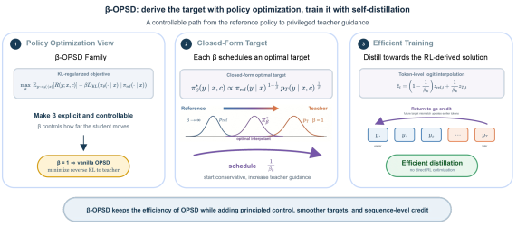
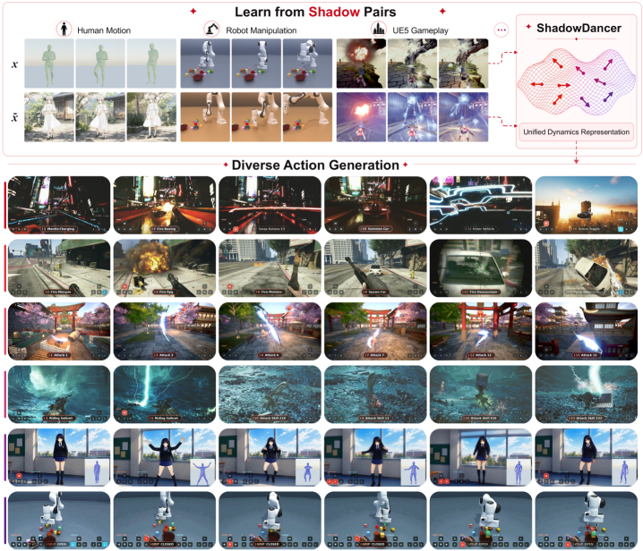
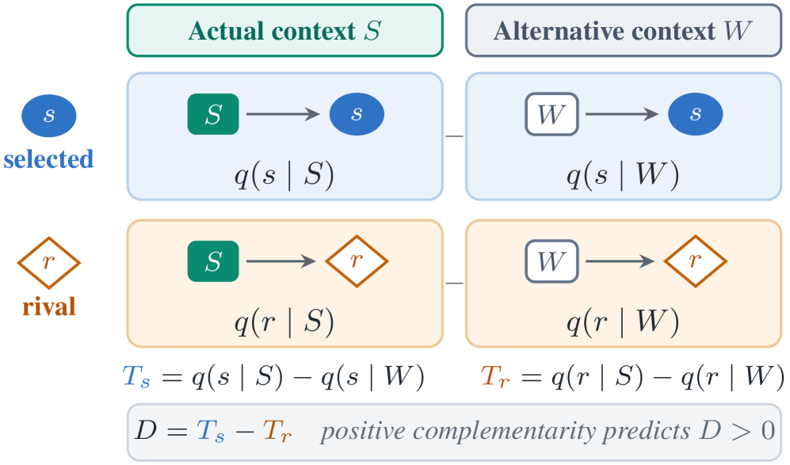

# Daily AI papers — 2026-08-02

*Curated from HF Daily Papers (list shown for 2026-08-02, a Sunday — HF surfaced the most recent daily set, submissions dated 2026-07-31). 15 of ~38 papers kept after relevance filter.*

## Papers at a glance

| # | Title | Topics | Org |
| --- | --- | --- | --- |
| 1 | [Qwen-UI-Agent Technical Report](#1-qwen-ui-agent) | `agents`, `multimodal`, `RL`, `tech-report` | Alibaba / MAI-UI Team |
| 2 | [Metis: Memory Foundation Model](#2-metis) | `LLM`, `memory`, `architectures`, `mid-training` | MemTensor / RUC / NUS / SJTU |
| 3 | [Frontis-MA1: AI4AI for Recursive Self-Improvement](#3-frontis-ma1) | `agents`, `RL`, `self-improvement`, `mle` | Frontis AI |
| 4 | [PhiZero: A World Model Built Around Physical Language](#4-phizero) | `world-models`, `multimodal`, `video`, `reasoning` | CASIA NLPR |
| 5 | [VideoCoCo: Code-as-CoT for Physically-Consistent Video Generation](#5-videococo) | `agents`, `diffusion`, `video`, `reasoning` | CUHK / USTC + consortium |
| 6 | [Memory Decoder at Scale](#6-memory-decoder-at-scale) | `LLM`, `retrieval`, `pretraining`, `scaling` | SJTU / Shanghai AI Lab |
| 7 | [Beacon: Agentic Visual Reasoning](#7-beacon) | `agents`, `multimodal`, `RL`, `tool-use` | Peking U. / Kling Team |
| 8 | [BM25 Wins at Scale: A Scaling Study of RAG Paradigms](#8-bm25-rag-scaling) | `eval`, `retrieval`, `RAG`, `agents` | USTC / Metastone |
| 9 | [Flux-OPD: On-Policy Distillation with Evolving Contexts](#9-flux-opd) | `post-training`, `distillation`, `RL`, `open-ended` | Peking U. / Kling Team |
| 10 | [β-OPSD: Deriving with PO, Training with Self-Distillation](#10-beta-opsd) | `post-training`, `distillation`, `reasoning`, `RL` | University of Maryland |
| 11 | [Chimera: Hybrid Visual Diffusion Transformers](#11-chimera) | `diffusion`, `architectures`, `video`, `scaling` | Adobe Research |
| 12 | [ShadowDancer: Any-Action Video World Models](#12-shadowdancer) | `world-models`, `video`, `multimodal` | (unspecified) |
| 13 | [Multi-Head Attention Residuals](#13-multi-head-attention-residuals) | `architectures`, `attention`, `pretraining` | UW–Madison / Independent |
| 14 | [Revisiting Lossy Verification in Speculative Decoding](#14-lossy-speculative-decoding) | `efficient-inference`, `speculative-decoding`, `eval` | Baidu / Zhejiang U. |
| 15 | [Beyond Geometric Complementarity: SMoE Routing](#15-smoe-coherent-overlap) | `MoE`, `interp`, `architectures` | Zhejiang U. / PolyU |

---

## 1. Qwen-UI-Agent

**Authors:** MAI-UI Team — *Alibaba Group / Token Hub*
**Links:** [arXiv:2607.28227](https://arxiv.org/abs/2607.28227) · [HF](https://huggingface.co/papers/2607.28227) · [AlphaXiv](https://www.alphaxiv.org/abs/2607.28227)
**Topics:** `agents`, `multimodal`, `RL`, `tech-report`

### TL;DR

Alibaba's foundation GUI agent for real-world, cross-platform device use — spans mobile, computer-use, web, and DeepSearch environments in a single model. Positioned as a general-purpose executor that combines GUI interaction with CLI execution, plans long-horizon workflows, proactively initiates services, and autonomously self-improves through minimal-supervision feedback loops.

### Key idea

Unify GUI, CLI, browser, and search into one action space and train a single MLLM backbone across all four. Real-device deployment (not just simulators) forces reliability constraints: robust screen understanding, low-latency planning, and a self-improvement loop that turns operational traces into training data.

### Main finding

Full technical report claims frontier-class GUI performance across mobile / computer-use / web / DeepSearch benchmarks — the paper is positioned as a system release rather than a single-benchmark contribution.

### Why it matters

GUI agents remain the most concrete test of long-horizon agentic capability on messy, real interfaces. A first-party unified stack (perception + action + self-improvement) sets a baseline other open-source efforts have to beat, and closes the loop between deployment traces and post-training updates.

### Knowledge graph integration

**Builds on / relates to existing pages:**
- [../case-studies/qwen2-5.md](../case-studies/qwen2-5.md) — same lineage: Qwen VL backbone, agentic post-training recipe.
- [../post-training/_rl.md](../post-training/_rl.md) — agent post-training uses RL on execution feedback.
- [../post-training/grpo.md](../post-training/grpo.md) — GRPO-family policy optimization is standard for agent RL.

**Suggested new pages:**
- `case-studies/qwen-ui-agent.md` *(case study)* — end-to-end system breakdown.
- `agents/gui-agents.md` *(depth)* — screen perception + click/type action space, common training recipes.
- `agents/computer-use.md` *(depth)* — CLI + GUI fused execution.

---

## 2. Metis

**Authors:** Zeyu Zhang, Ziliang Guo, Yihang Sun, Xichong Zhang, et al. — *MemTensor / Renmin U. / NUS / SJTU / Tongji*
**Links:** [arXiv:2607.26760](https://arxiv.org/abs/2607.26760) · [HF](https://huggingface.co/papers/2607.26760) · [AlphaXiv](https://www.alphaxiv.org/abs/2607.26760)
**Topics:** `LLM`, `memory`, `architectures`, `mid-training`

### TL;DR

First prototype of a **memory foundation model** — instead of bolting memory on as an external retrieval store, Metis puts a persistent, evolving memory state *inside* the backbone. History is compressed into that state and accessed via "memory attention"; memory update is gradient-free, requires only a forward pass, and model weights stay frozen at inference.

### Key idea

Formalize "native memory" as (1) a persistent memory state living in the backbone and (2) native memory *procedures* — store/retrieve operations executed by ordinary forward computation, not external code. Achieved via a new architecture, mid-training on large memory-specific data, and multiple training objectives that teach the model to write to and read from the memory state.

### Main finding

Demonstrates native memory behavior — retention across long sequences, gradient-free online updates, and frozen-weight inference. Full comparisons vs. external-memory baselines released with the checkpoints.

### Why it matters

Retrieval-augmented and external-memory systems are the current default for long-context and personalization, but they add plumbing and break end-to-end training. If a backbone can absorb the memory role natively, that's a cleaner substrate for agents, tool-use loops, and lifelong learning.

### Knowledge graph integration

**Builds on / relates to existing pages:**
- [../architectures/mla.md](../architectures/mla.md) — attention over compressed latent state, close in spirit to memory attention.
- [../architectures/transformer-block.md](../architectures/transformer-block.md) — the memory state is a new stream inside each block.
- [../pre-training/mid-training.md](../pre-training/mid-training.md) — memory capability acquired in a mid-training stage.

**Suggested new pages:**
- `architectures/memory-foundation-model.md` *(depth)* — the persistent-state + memory-attention architecture.
- `architectures/_native-memory.md` *(taxonomy)* — compare native memory, external RAG, and long-context attention.

---

## 3. Frontis-MA1

**Authors:** Junlin Yang, Che Jiang, Yu Fu, Tianwei Luo, et al. — *Frontis AI*
**Links:** [arXiv:2607.28568](https://arxiv.org/abs/2607.28568) · [HF](https://huggingface.co/papers/2607.28568) · [AlphaXiv](https://www.alphaxiv.org/abs/2607.28568)
**Topics:** `agents`, `RL`, `self-improvement`, `mle`

### TL;DR

An open full-stack system (OpenMLE) for studying recursive self-improvement on machine-learning-engineering tasks. Comes with a verifiable-feedback gym (OpenMLE-Gym), an operator-learning RL layer (OpenMLE-RL), and long-horizon search (OpenMLE-Evo). On top of it they post-train **Frontis-MA1 (35B)** as a meta-evolution agent whose whole pipeline is organized around four atomic program-evolution operators: Draft, Improve, Debug, Crossover.

### Key idea

Treat MLE as a testbed for AI4AI: the environment gives executable feedback, so RL signals are unambiguous. Constrain the agent to a small set of *program-evolution operators*, then train and inference-time search over compositions of those operators — turning long-horizon research trajectories into structured operator sequences instead of free-form tool calls.

### Main finding

Full metric table in the paper — the point is the recipe: aligning pretraining, RL, and inference-time search around the same atomic operator vocabulary yields a coherent MLE agent at 35B.

### Why it matters

Recursive self-improvement has been mostly a theoretical target for scalable oversight. Grounding it in MLE (a domain with true executable rewards) makes progress measurable and gives safety researchers a concrete testbed for how fast a system can bootstrap its own capabilities.

### Knowledge graph integration

**Builds on / relates to existing pages:**
- [../post-training/rlvr.md](../post-training/rlvr.md) — verifiable-reward RL on executable feedback.
- [../post-training/_rl.md](../post-training/_rl.md) — closes the tool-use loop with policy optimization.
- [../safety/scheming.md](../safety/scheming.md) — self-improving agents are exactly the safety-relevant class.

**Suggested new pages:**
- `agents/ai4ai.md` *(depth)* — recursive-self-improvement setting: agent evolves its own training pipeline.
- `agents/program-evolution-operators.md` *(depth)* — Draft/Improve/Debug/Crossover as an operator vocabulary.

---

## 4. PhiZero

**Authors:** Shuyao Shang, Yuqi Wang, Ruopeng Gao, Xu Chen, Tieniu Tan, Lue Fan, Zhaoxiang Zhang — *NLPR, Institute of Automation, CAS*
**Links:** [arXiv:2607.28624](https://arxiv.org/abs/2607.28624) · [HF](https://huggingface.co/papers/2607.28624) · [AlphaXiv](https://www.alphaxiv.org/abs/2607.28624)
**Topics:** `world-models`, `multimodal`, `video`, `reasoning`

### TL;DR

A physical world model built around a compact **discrete "physical language"** — a symbolic sequence describing how the world evolves. Instead of predicting pixels directly, PhiZero first *reasons* about world evolution in physical language and then renders the resulting transitions into video. Reason-then-render splits the problem into an explicit dynamics reasoner and a visual synthesizer.

### Key idea

Learn a discrete physical vocabulary from in-the-wild video via self-supervision. At inference: (1) an autoregressive model generates the physical-language sequence describing the next transitions; (2) a rendering model turns that symbolic plan into video frames. The intermediate representation is inspectable, interpretable, and — importantly — cheap to reason over compared to pixel space.

### Main finding

Physically coherent generation across generation and understanding benchmarks, plus zero-shot motion transfer and fine-grained action-conditioned simulation.

### Why it matters

Every serious world model today is either "diffusion in pixel/latent space" (opaque, expensive) or "structured symbolic sim" (brittle, narrow). A learned discrete physical-language intermediate is a genuinely third path — closer in spirit to program synthesis for physics, and it opens explicit reasoning on world dynamics.

### Knowledge graph integration

**Builds on / relates to existing pages:**
- [../fundamentals/_tokenization.md](../fundamentals/_tokenization.md) — physical language is a learned discrete tokenization of world dynamics.
- [../multimodal/README.md](../multimodal/README.md) — vision + language + generation triangle.

**Suggested new pages:**
- `multimodal/world-models.md` *(depth)* — dynamics-in-latent-space vs. reason-then-render approaches.
- `multimodal/physical-language.md` *(depth)* — discrete symbolic intermediate for video/world modeling.

---

## 5. VideoCoCo

**Authors:** Tianfei Ren, Xiaoxiao Ma, Chunmei Qing, Ziyu Guo, et al. — *CUHK / USTC / SCUT / HKU / NTU / PKU / SJTU / CMU / THU / HUST / MBZUAI*
**Links:** [arXiv:2607.27380](https://arxiv.org/abs/2607.27380) · [HF](https://huggingface.co/papers/2607.27380) · [AlphaXiv](https://www.alphaxiv.org/abs/2607.27380)
**Topics:** `agents`, `diffusion`, `video`, `reasoning`

### TL;DR

Text-to-video with **executable Blender code as the chain-of-thought**. A coding agent turns the prompt into a Blender program specifying the scene and its evolution; the simulator produces a deterministic spatiotemporal "draft"; a video diffusion model then paints the draft into a photorealistic video. Physics reasoning happens in a real physics engine, not implicit inside the video model.

### Key idea

Replace vague intermediate "plans" with **runnable code** as the CoT — an executable representation whose semantics are guaranteed. Draft-conditioned video editing (trained on the custom VideoCoCo-3K dataset) lets a generative model be steered by an approximate but physics-correct simulation.

### Main finding

OmniWeaving baseline: **0.475 → 0.558 on PhyGenBench**, **52.18 → 77.88 on VBench-2.0**. Best average on both physics-focused video generation benchmarks.

### Why it matters

Physically consistent video generation has been the wall for T2V systems. Externalizing the physics into a deterministic simulator that the video model conditions on side-steps the "learn physics from pixels" problem cleanly, and the CoT is inspectable code — a big win for controllability.

### Knowledge graph integration

**Builds on / relates to existing pages:**
- [../post-training/reasoning/long-cot-rl.md](../post-training/reasoning/long-cot-rl.md) — code-as-CoT is a stricter execution-verified variant.
- [../multimodal/README.md](../multimodal/README.md) — bridges vision, language, and diffusion.

**Suggested new pages:**
- `multimodal/code-as-cot.md` *(depth)* — executable code as intermediate CoT for generation.
- `multimodal/physically-consistent-video.md` *(depth)* — training recipes and eval for physics-grounded T2V.

---

## 6. Memory Decoder at Scale

**Authors:** Rubin Wei, Jiaqi Cao, Jiarui Wang, Junming Zhang, Qipeng Guo, Bowen Zhou, Zhouhan Lin — *Shanghai AI Lab / SJTU*
**Links:** [arXiv:2607.27919](https://arxiv.org/abs/2607.27919) · [HF](https://huggingface.co/papers/2607.27919) · [AlphaXiv](https://www.alphaxiv.org/abs/2607.27919)
**Topics:** `LLM`, `retrieval`, `pretraining`, `scaling`

### TL;DR

Scales a *parametric* long-term memory module up to **6.9B parameters pretrained on 300B tokens**, decoupling memory capacity from the base LM. At this scale, the standard Faiss kNN pipeline blows up — they solve it with a distributed Faiss and sparse batch-wise loading of kNN distributions.

### Key idea

Split "long-term memory" from "reasoning" into separate parameter budgets. A dedicated Memory Decoder is pretrained on retrieval-augmented next-token objectives; at inference the small base model pairs with a large memory to punch far above its own parameter count.

### Main finding

**Pythia-410M + 6.9B memory reaches 37.34 avg vs. Pythia-12B at 37.24 — with 39% fewer total parameters.** Domain memories of 1.7B improve Qwen3-Base (0.6B–14B) by >9 avg points per domain at every scale. Consistent evidence that allocating more params to memory beats scaling the base model.

### Why it matters

Reopens the parameter-efficiency conversation. If memory scaling is *cheaper per capability gain* than raw model scaling, the frontier design becomes small reasoner + huge memory — with real implications for serving cost, on-device inference, and domain adaptation.

### Knowledge graph integration

**Builds on / relates to existing pages:**
- [../pre-training/README.md](../pre-training/README.md) — introduces a new pretraining objective for parametric memory.
- [../architectures/transformer-block.md](../architectures/transformer-block.md) — memory decoder sits alongside the base decoder.

**Suggested new pages:**
- `architectures/parametric-memory.md` *(depth)* — memory as a scaled parameter budget beside the base LM.
- `pre-training/memory-pretraining.md` *(depth)* — kNN-conditioned pretraining objectives and infra.

---

## 7. Beacon

**Authors:** Qixun Wang, Yang Shi, Letian Cheng, et al. — *Peking U. / Kling Team*
**Links:** [arXiv:2607.28595](https://arxiv.org/abs/2607.28595) · [HF](https://huggingface.co/papers/2607.28595) · [AlphaXiv](https://www.alphaxiv.org/abs/2607.28595)
**Topics:** `agents`, `multimodal`, `RL`, `tool-use`

### TL;DR

Reframes agentic visual reasoning around two properties: **Mode Adaptiveness** (invoke tools *only* when necessary) and **Tool Effect** (tools should help on hard problems without hurting easy ones). Trains an MLLM with a **Necessity-Aware Adaptive Reward** and a **Hint-Guided Capability Expansion** RL scheme that jointly maximize both.

### Key idea

Explicit reward shaping for *when* to call tools, not just *how*. Necessity-Aware Adaptive Reward penalizes unnecessary invocations and rewards useful ones; Hint-Guided Capability Expansion targets the hard tail where tool use is genuinely required. Together they fix the common failure of tool-augmented models: net-zero gains because losses on easy questions cancel wins on hard ones.

### Main finding

Consistent improvement across diverse benchmarks in overall performance, Mode Adaptiveness, and Tool Effect vs. prior agentic visual reasoning models.

### Why it matters

The "just add more tools" era of agents keeps hitting the same wall — average scores don't move because tool overhead cancels tool wins. Beacon is a clean measurement + training story for the actual problem: knowing *when* to use them.

### Knowledge graph integration

**Builds on / relates to existing pages:**
- [../post-training/grpo.md](../post-training/grpo.md) — RL for tool-use policy over MLLMs.
- [../post-training/_rewards.md](../post-training/_rewards.md) — necessity-aware reward is a new class of shaped reward.
- [../multimodal/README.md](../multimodal/README.md) — MLLM tool use is the target substrate.

**Suggested new pages:**
- `agents/adaptive-tool-use.md` *(depth)* — invoking tools only when necessary; measurement + reward design.
- `post-training/necessity-aware-reward.md` *(depth)* — reward shaping to penalize unneeded tool calls.

---

## 8. BM25 RAG Scaling

**Authors:** Benfeng Xu, Shaohan Wang, Xin Zeng, Huarui Wu, Lei Zhang, Licheng Zhang — *USTC / Metastone Technology / Beijing Academy of Agriculture and Forestry Sciences*
**Links:** [arXiv:2607.26497](https://arxiv.org/abs/2607.26497) · [HF](https://huggingface.co/papers/2607.26497) · [AlphaXiv](https://www.alphaxiv.org/abs/2607.26497)
**Topics:** `eval`, `retrieval`, `RAG`, `agents`

### TL;DR

A controlled scaling study of RAG paradigms — lexical (BM25), dense, graph-based, and agentic file-system exploration — across **28 nested corpus tiers spanning ~450×**, one reader model, one judge protocol. Finding: **BM25 wins at scale**, agentic file-system exploration wins at tiny scale.

### Key idea

Hold the reader, questions, and adversarial documents fixed; vary only corpus size in strictly nested tiers. This isolates *accuracy–cost scaling* per retrieval paradigm — the axis usually confounded by benchmark differences.

### Main finding

**~10M-token crossover:** File-System Agent leads below it (costing ~39× more query tokens at the bedrock), BM25 leads above it with a ~20-point margin at full scale. Dense retrieval is efficient but less accurate; graph-RAG hits construction walls. BM25 anchors the low-cost Pareto frontier without LLM-based indexing.

### Why it matters

The "agentic search is the future" narrative has skipped over cost/latency scaling. This study makes the actual crossover concrete and reinstates BM25 as the default at real-world corpus sizes — with agentic reasoning best used *after* ranked discovery, not in place of it.

### Knowledge graph integration

**Builds on / relates to existing pages:**
- [../evaluation/README.md](../evaluation/README.md) — a scaling-controlled RAG evaluation protocol.
- [../fundamentals/dca.md](../fundamentals/dca.md) — long-context alternative to retrieval.

**Suggested new pages:**
- `evaluation/rag-scaling.md` *(depth)* — nested-corpus RAG evaluation methodology.
- `agents/_rag-paradigms.md` *(taxonomy)* — lexical vs. dense vs. graph vs. agentic RAG, with the crossover.

---

## 9. Flux-OPD

**Authors:** Yuran Wang, Zekun Wang, Bohan Zeng, et al. — *Peking U. / Kling Team / SJTU / Tsinghua*
**Links:** [arXiv:2607.28022](https://arxiv.org/abs/2607.28022) · [HF](https://huggingface.co/papers/2607.28022) · [AlphaXiv](https://www.alphaxiv.org/abs/2607.28022)
**Topics:** `post-training`, `distillation`, `RL`, `open-ended`

### TL;DR

On-Policy Distillation (OPD) with **contexts that evolve with the student**. The paper decomposes the reverse-KL objective and shows a fixed context is a wasted signal once the student catches up. Flux-OPD injects contextual difference signals as corrections into the context-free teacher anchor and reweights them by a conflict term.

### Key idea

Reverse-KL under multiple context-conditioned teachers is equivalent to distilling toward their geometric mean, *plus* a conflict term that measures teacher disagreement. Use that conflict term as a downweighting signal, and treat (context-conditioned − context-free) as an anchor-correction vector fed back into the teacher.

### Main finding

Consistent outperformance vs. existing OPD paradigms on open-ended tasks, where verifiable rewards don't exist and teacher preferences must be conveyed through context.

### Why it matters

Verifiable rewards drive RLVR/GRPO everywhere they can — but open-ended domains (writing, dialog, creative tasks) don't have them. This is a clean, theoretically grounded way to keep distilling signal from teachers *after* the student has absorbed the first-order pattern.

### Knowledge graph integration

**Builds on / relates to existing pages:**
- [../post-training/_rl.md](../post-training/_rl.md) — OPD sits in the on-policy KL family alongside PPO/GRPO.
- [../post-training/grpo.md](../post-training/grpo.md) — same reverse-KL geometry, different reward signal.
- [../post-training/rlvr.md](../post-training/rlvr.md) — Flux-OPD is what you do when RLVR is not available.

**Suggested new pages:**
- `post-training/on-policy-distillation.md` *(depth)* — OPD as the reverse-KL alternative to RL for open-ended domains.

---

## 10. β-OPSD

**Authors:** Minghui Liu, Juzheng Zhang, Tom Goldstein, Furong Huang — *University of Maryland, College Park*
**Links:** [arXiv:2607.28582](https://arxiv.org/abs/2607.28582) · [HF](https://huggingface.co/papers/2607.28582) · [AlphaXiv](https://www.alphaxiv.org/abs/2607.28582)
**Topics:** `post-training`, `distillation`, `reasoning`, `RL`

### TL;DR

Shows that on-policy self-distillation (OPSD) is precisely the β=1 case of a broader policy-optimization family where β weights the KL anchor. Generalizes to **β-OPSD**, whose optimal policy is a geometric interpolation between the reference policy and a privileged teacher — then approximates it via cheap logit-mixing distillation rather than expensive RL.

### Key idea

Recognize that OPSD is a corner of a KL-regularized RL objective. Because the optimal policy has a closed form (geometric interpolation), you can *skip* running the expensive RL loop and instead distill to token-level mixed logits between reference and teacher. Return-to-go credit assignment aligns token updates with sequence-level objective while keeping OPSD's speed.

### Main finding

Consistently outperforms vanilla OPSD on math reasoning benchmarks with better optimization stability — same efficiency, fewer training pathologies.

### Why it matters

Reasoning post-training is dominated by either expensive on-policy RL (PPO/GRPO) or brittle vanilla OPSD. β-OPSD gives you the geometry of RL without paying for it, and turns β into a knob you can tune. Beautiful theory-practice bridge.

### Knowledge graph integration

**Builds on / relates to existing pages:**
- [../post-training/grpo.md](../post-training/grpo.md) — same KL-anchored policy-optimization family.
- [../post-training/ppo.md](../post-training/ppo.md) — β corresponds to the KL coefficient in PPO.
- [../post-training/reasoning/long-cot-rl.md](../post-training/reasoning/long-cot-rl.md) — evaluated on reasoning benchmarks.

**Suggested new pages:**
- `post-training/on-policy-self-distillation.md` *(depth)* — OPSD and its β-generalization to KL-anchored PO.

---

## 11. Chimera

**Authors:** Chongjian Ge, Hanwen Jiang, Tianyu Wang, Jiuxiang Gu, Yiran Xu, Ziwen Chen, Shaoteng Liu, Jing Shi, Yicong Hong, Zefan Cai, Hailin Jin, Hao Tan — *Adobe Research*
**Links:** [arXiv:2607.28611](https://arxiv.org/abs/2607.28611) · [HF](https://huggingface.co/papers/2607.28611) · [AlphaXiv](https://www.alphaxiv.org/abs/2607.28611)
**Topics:** `diffusion`, `architectures`, `video`, `scaling`

### TL;DR

A **hybrid Diffusion Transformer** backbone for token-intensive visual generation: interleaves **Kimi Delta Attention** (long-context linear-time), **Multi-head Latent Attention** (global interaction), and **modality-aware short convolutions** (local spatiotemporal context). Runs positionally-embedding-free on unified token sequences. Chinchilla-style compute-optimal scaling recipe and a module-wise scaling scheme (HeteroP) for hyperparameter transfer across sizes.

### Key idea

Full attention is quadratic; visual generation is now firmly in token-intensive territory (long videos, high-res images, multimodal context). Interleave three attention types with complementary tradeoffs so that global, long-context, and local structure each get an efficient handler. HeteroP lets you tune small then transfer to large without re-searching hyperparameters.

### Main finding

**11B model with 2B activated params achieves 7.3× fewer FLOPs than matched baselines** and zero-shot extends video from 5 → 30 seconds with minimal quality degradation.

### Why it matters

DiT-style backbones plateau on compute cost as sequence lengths explode for video. A rigorously scaling-lawed hybrid attention DiT — with a transfer-friendly scaling scheme — is a strong blueprint for the next generation of frontier video/image models.

### Knowledge graph integration

**Builds on / relates to existing pages:**
- [../architectures/mla.md](../architectures/mla.md) — Multi-head Latent Attention as one leg of the hybrid.
- [../architectures/_moe.md](../architectures/_moe.md) — sparse activation (2B/11B) borrows the MoE mindset.
- [../architectures/multi-head-attention.md](../architectures/multi-head-attention.md) — hybrid attention builds on standard MHA.

**Suggested new pages:**
- `architectures/hybrid-attention.md` *(depth)* — interleaving efficient + full attention within one backbone.
- `architectures/kimi-delta-attention.md` *(depth)* — linear-time attention variant used in Chimera.
- `pre-training/heterop-scaling.md` *(depth)* — module-wise hyperparameter transfer via HeteroP.

---

## 12. ShadowDancer

**Authors:** Not listed on HF page — *Affiliations unspecified*
**Links:** [arXiv:2607.28362](https://arxiv.org/abs/2607.28362) · [HF](https://huggingface.co/papers/2607.28362) · [AlphaXiv](https://www.alphaxiv.org/abs/2607.28362)
**Topics:** `world-models`, `video`, `multimodal`

### TL;DR

Any-action, frame-level control of interactive video world models through **shadow pairs** — video pairs replaying the same dynamics with independently resampled appearance. Training predicts one shadow from the other, discarding appearance and keeping only dynamics, so any demonstration clip becomes a reusable, replayable action asset.

### Key idea

The problem: demonstration videos carry action information tangled with appearance, so learned actions transfer poorly across scenes. Solution: at data-time, construct pairs whose only shared axis is *dynamics*; at train-time, learn to predict one from the other. Whatever is preserved across the pair *is* the action; whatever is resampled is discarded by construction.

### Main finding

Any demonstrated clip becomes a reusable action asset that transfers to new environments without action labels, motion estimators, or fine-tuning — a block-causal world model consumes them at inference.

### Why it matters

Action-conditioned video generation and interactive world models have been stuck between (a) loose text conditioning that doesn't reproduce dynamics and (b) narrow structured control signals that only cover one motion family. Shadow-pair training is a beautifully clean disentanglement trick that could unlock generic action transfer.

### Knowledge graph integration

**Builds on / relates to existing pages:**
- [../multimodal/README.md](../multimodal/README.md) — video generation + world models.

**Suggested new pages:**
- `multimodal/interactive-video-world-model.md` *(depth)* — block-causal generation with per-frame action control.
- `multimodal/shadow-pair-training.md` *(depth)* — appearance-dynamics disentanglement via paired videos.

---

## 13. Multi-Head Attention Residuals

**Authors:** Cheng Luo, Zefan Cai, Junjie Hu — *Independent / University of Wisconsin–Madison*
**Links:** [arXiv:2607.27230](https://arxiv.org/abs/2607.27230) · [HF](https://huggingface.co/papers/2607.27230) · [AlphaXiv](https://www.alphaxiv.org/abs/2607.27230)
**Topics:** `architectures`, `attention`, `pretraining`

### TL;DR

Attention residuals let each sublayer read a learned softmax over all previous layers' outputs — but with a single shared query. **MHAR** splits the routing query into H per-subspace heads (block-diagonal read) so different feature subspaces can attend to different depths. Zero added parameters, negligible compute, H=1 recovers vanilla attention residuals.

### Key idea

The residual stream is width-shared, so a single-query attention over depth forces every subspace to agree on which layer to read. Disagreement grows with width; the compromise cost grows too. Fix: reshape the routing query into per-subspace heads. Setting number of routing heads = number of KV heads is a hyperparameter-free default.

### Main finding

Validation loss improvements over standard Transformer at **100M / 350M / 1B: -0.049 / -0.080 / -0.063**. At 1B, single-query routing is actually 0.105 *worse* than plain additive residual — MHAR's advantage over single-head routing widens from 0.010 (100M) to 0.168 (1B). Fused Triton kernels lift throughput from 0.2–0.5× to 0.55–0.88× of baseline. Identity-preserving delta-attention-residual conversion enables 8B mid-training (+3.2 GSM8K, +3.1 GPQA).

### Why it matters

Depth-wise information flow is under-explored compared to width-wise attention. This is a compact, well-instrumented case for a subtle-but-real gain that grows with scale, with a working mid-training path to retrofit existing 8B models. Cheap and scale-safe changes are rare.

### Knowledge graph integration

**Builds on / relates to existing pages:**
- [../architectures/transformer-block.md](../architectures/transformer-block.md) — MHAR modifies the residual pathway.
- [../architectures/multi-head-attention.md](../architectures/multi-head-attention.md) — same head-splitting idea, applied along depth.
- [../pre-training/mid-training.md](../pre-training/mid-training.md) — retrofit path via identity-preserving conversion.

**Suggested new pages:**
- `architectures/attention-residuals.md` *(depth)* — depth-attention residual family, MHAR as the multi-head variant.

---

## 14. Lossy Speculative Decoding

**Authors:** Tianyu Wang, Yuxuan Zhou, Wenbin Wang, Heng Li, Zikai Xiao, Junyuan Shang — *Baidu Inc. / Zhejiang University*
**Links:** [arXiv:2607.26627](https://arxiv.org/abs/2607.26627) · [HF](https://huggingface.co/papers/2607.26627) · [AlphaXiv](https://www.alphaxiv.org/abs/2607.26627)
**Topics:** `efficient-inference`, `speculative-decoding`, `eval`

### TL;DR

Principled analysis of lossy verification in speculative decoding. Shows many "distinct" schemes actually reduce to two categories — **truncation-based** and **collaborative** verification — and diagnoses failure modes for each: truncation distorts the distribution vs. its true truncation-sampling baseline; collaborative verification needs to control draft-vs-target probability overshoot.

### Key idea

Speculative decoding trades exactness for speed. Recent "lossy" variants promise more speed at bounded quality cost, but silently rewrite the decoding distribution. The paper builds a diagnostic evaluation over curated benchmarks and characterizes when each category degrades and by how much.

### Main finding

Truncation-based methods degrade compared to a true truncation-sampling baseline due to distributional distortion. Collaborative verification methods degrade if you don't control the overshoot of draft probabilities over target probabilities. Both failure modes are now measurable and correctable.

### Why it matters

Lossy speculative decoding is quietly showing up in production inference stacks. This paper is the first to say clearly "here is exactly what breaks and why" — a required reference before any team turns on a lossy verifier.

### Knowledge graph integration

**Builds on / relates to existing pages:**
- [../inference/README.md](../inference/README.md) — speculative decoding is a core inference technique.

**Suggested new pages:**
- `inference/speculative-decoding.md` *(depth)* — draft-verify decoding, exact vs. lossy variants.
- `inference/_lossy-verification.md` *(taxonomy)* — truncation-based vs. collaborative verifiers, when each fails.

---

## 15. SMoE Coherent Overlap

**Authors:** Huiyuan Tian, Bonan Xu, Shijian Li — *Zhejiang University / The Hong Kong Polytechnic University*
**Links:** [arXiv:2607.28308](https://arxiv.org/abs/2607.28308) · [HF](https://huggingface.co/papers/2607.28308) · [AlphaXiv](https://www.alphaxiv.org/abs/2607.28308)
**Topics:** `MoE`, `interp`, `architectures`

### TL;DR

An interpretability study of sparse MoE routing. Introduces an **Expert Subspace Separation Index (ESSI)**, matched-route residuals, and a 2×2 prefix-controlled factorial to separate route coherence, candidate quality, and interaction. Finding: **coherent overlap** — experts occupy a shared geometric neighborhood, yet multi-expert composition still helps.

### Key idea

Prior evidence that MoE routing selects "geometrically distinct" experts conflated three quantities. Disentangle them: measure ESSI (subspace disagreement), matched-route residuals (would another expert have worked?), and frozen-route interventions (does Top-2 actually beat Top-1 with the same routes?). Across OLMoE, Mixtral, DeepSeek: overlap is real, but adding later experts *still* improves next-token prediction in 24/39 cases.

### Main finding

Subspaces overlap heavily across six MoE architectures, yet actual routes explain token representations better than matched alternatives. Top-2 beats Top-1 in all seeds — functional benefit persists without geometric complementarity.

### Why it matters

The "MoE works because experts specialize on disjoint geometry" story has driven a lot of MoE analysis, ablation, and pruning proposals. This paper cleanly separates *geometric* redundancy from *functional* redundancy — different quantities, and confusing them leads to wrong pruning decisions.

### Knowledge graph integration

**Builds on / relates to existing pages:**
- [../architectures/_moe.md](../architectures/_moe.md) — directly informs the taxonomy of MoE routing analyses.
- [../architectures/deepseek-moe.md](../architectures/deepseek-moe.md) — DeepSeek MoE is one of the studied architectures.
- [../architectures/load-balancing-loss.md](../architectures/load-balancing-loss.md) — relates to why routers pick overlapping experts.

**Suggested new pages:**
- `architectures/moe-routing-analysis.md` *(depth)* — ESSI + matched-route protocol; geometric vs. functional redundancy.

---

## Notes

- Aug 2 was a Sunday; HF surfaced the most recent daily set (submissions dated 2026-07-31) at the queried date URL. Kept ratio (15/38 ≈ 40%) is on the strict side today because a chunk of the day's list was CV/audio/robotics-only.
- Hero figures live in `assets/2026-08-02/`. Missing for papers 3 (Frontis-MA1) and 6 (Memory Decoder) — no reliable public figure was fetched.
- This digest is informational. No existing concept files, `READING-LIST.md`, or `PAPERS.md` were modified to produce it.
