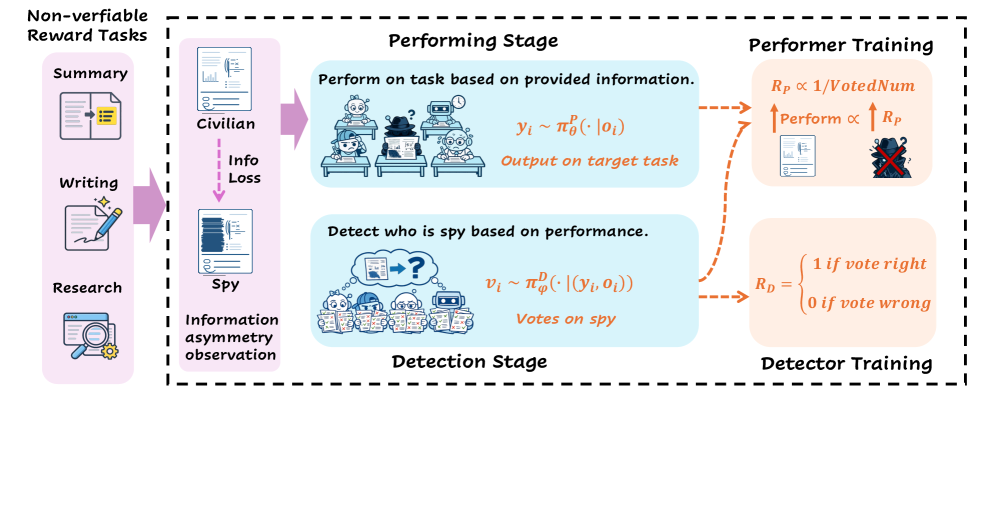
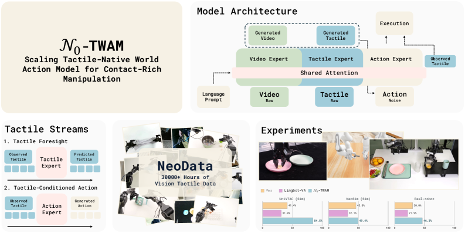
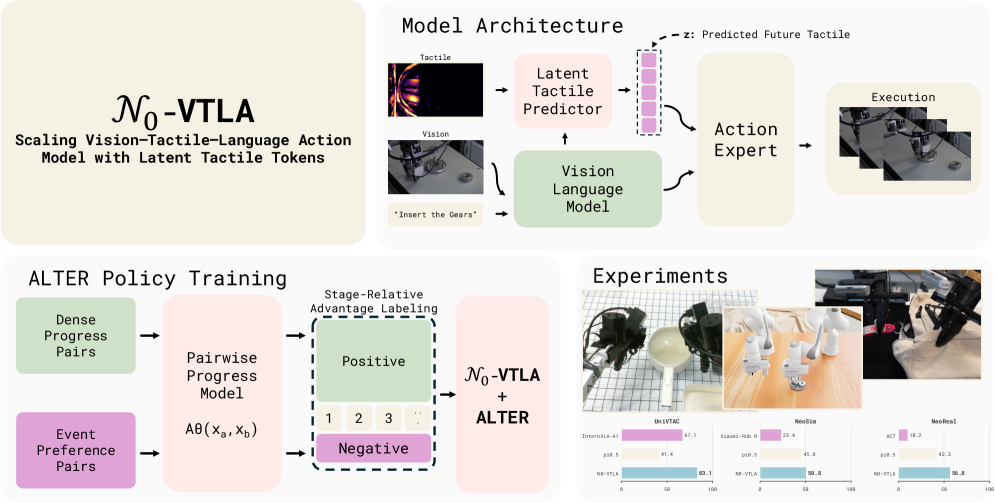
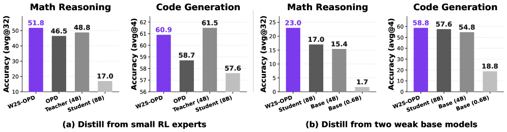
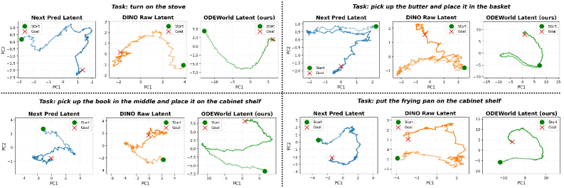
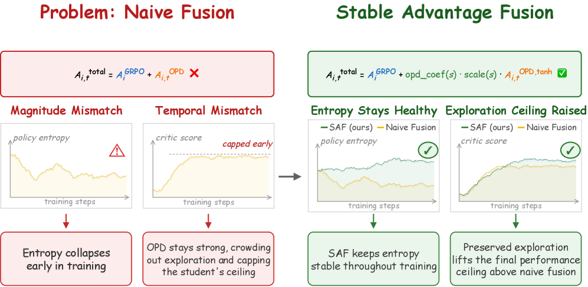
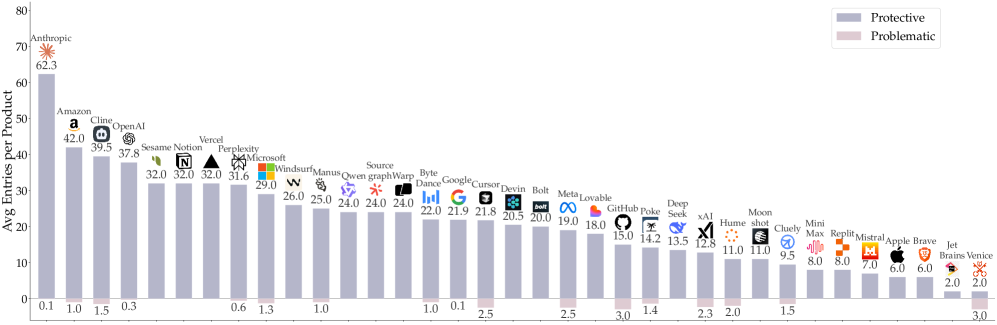
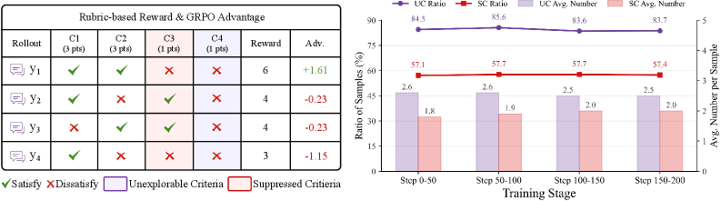
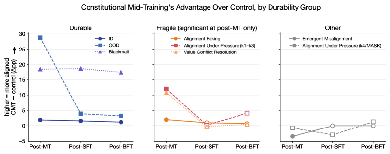
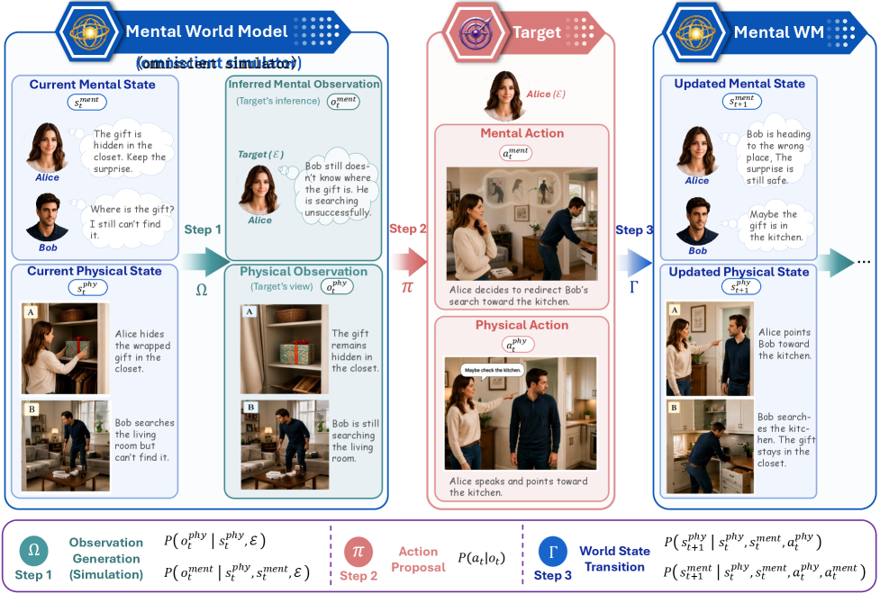

# Daily AI papers — 2026-08-03

*Curated from HF Daily Papers. 15 of 27 papers kept after relevance filter.*

## Papers at a glance

| # | Title | Topics | Org |
| --- | --- | --- | --- |
| 1 | [From RLVR to RLSVR: Task Transformation Induces Self-Verifiable Rewards](#1-from-rlvr-to-rlsvr) | `RL`, `reasoning`, `self-improvement` | Duke · Adobe |
| 2 | [Scaling Properties of Text Conditioning in Visual Generation](#2-scaling-text-conditioning) | `diffusion`, `multimodal`, `scaling` | ByteDance Seed |
| 3 | [N₀-TWAM: Scaling Tactile-Native World-Action Model](#3-n0-twam) | `multimodal`, `agents`, `world-model` | NeoteAI |
| 4 | [N₀-VTLA: Scaling Vision-Tactile-Language-Action Model](#4-n0-vtla) | `multimodal`, `agents`, `RL` | NeoteAI · Fudan |
| 5 | [Meshy T2: Fast Native Mesh Generation with Flow Matching](#5-meshy-t2) | `diffusion`, `flow-matching`, `3D` | Meshy AI |
| 6 | [Weak-to-Strong On-Policy Distillation](#6-w2s-opd) | `RL`, `distillation`, `LLM` | UMD · Microsoft · MBZUAI |
| 7 | [ODEWorld: Continuous Predictive Architecture via Physical-Time Flow](#7-odeworld) | `world-model`, `flow-matching` | Tsinghua AIR · Berkeley |
| 8 | [SAF-OPD: Stable Advantage Fusion for On-Policy Distillation](#8-saf-opd) | `RL`, `distillation`, `GRPO` | SUFE · Meituan · CUHK-SZ |
| 9 | [AISPA: User-Centric System Prompt Auditing](#9-aispa) | `safety`, `eval`, `agents` | Stanford · MIT · Oxford |
| 10 | [CriPO: Enhancing Rubric-based RL via Self-Distillation](#10-cripo) | `RL`, `reasoning`, `distillation` | Zhejiang · ByteDance |
| 11 | [Constitutional Midtraining: Content Presence Drives Alignment Gains](#11-constitutional-midtraining) | `safety`, `alignment`, `mid-training` | Oxford |
| 12 | [CSCR: Counterfactual Sensitivity Credit Reallocation for Long-CoT](#12-cscr) | `RL`, `reasoning`, `GRPO` | Nanjing · SJTU |
| 13 | [Safeguards Based on Copyable Context Cannot Provide Reliable Safety](#13-copyable-safeguards) | `safety`, `theory` | (unattributed) |
| 14 | [EVR: Evaluation-Verification Reward for Multi-Reference Image Editing](#14-evr) | `RL`, `multimodal`, `diffusion` | XJTU · Alibaba · SJTU |
| 15 | [Mental World Modeling](#15-mwm) | `agents`, `world-model`, `eval` | NUS |

---

## 1. From RLVR to RLSVR: Task Transformation Induces Self-Verifiable Rewards for Open-Ended LLM Self-Improvement

**Authors:** Qinsi Wang, Jing Shi, Huazheng Wang, Kun Wan, Yiran Wu, Bo Liu, Qingyun Wu, Hai Helen Li, Yiran Chen, Handong Zhao, Wentian Zhao — *Duke University · Adobe · Oregon State · Penn State · NUS · Amazon*
**Links:** [arXiv:2607.23802](https://arxiv.org/abs/2607.23802) · [HF](https://huggingface.co/papers/2607.23802) · [AlphaXiv](https://www.alphaxiv.org/abs/2607.23802)
**Topics:** `RL`, `reasoning`, `self-improvement`

### TL;DR

RLVR only works where an oracle grader exists — math answers, unit-tested code. This paper wraps *open-ended* tasks (summarization, creative writing) in a multi-agent "Who Is the Spy?" game so that voting outcomes become the verifiable reward, letting the same RLVR machinery train the model on tasks that normally require an LLM judge.

### Key idea

**Task transformation.** Instead of grading a summary directly, spawn several agents with asymmetric information; each writes the target output, then all vote on which one is the pre-designated "spy." The spy identity is a hard label, so vote correctness is a fully verifiable reward. The instantiation, **SpyRL**, is a self-play environment layered on top of GRPO-style rollouts.

### Main finding

SpyRL beats prior self-improvement baselines on summarization and creative-writing benchmarks, and — surprisingly — also gives consistent gains on math reasoning, meaning the induced verifier signal generalizes. Code and models released at github.com/wangqinsi1/SpyRL.

### Why it matters

Removes the biggest wall between RLVR and open-ended domains: the need for a trusted judge. If task-transformation can consistently synthesize verifiable proxies from a self-play game, the "post-training with RL" recipe extends far beyond math/code without paying LLM-judge inference costs.

### Knowledge graph integration

**Builds on / relates to existing pages:**
- [rlvr.md](../post-training/rlvr.md) — SpyRL is a task-transformation extension that expands where RLVR can apply.
- [grpo.md](../post-training/grpo.md) — the underlying policy-gradient method used for the self-play rollouts.
- [_rewards.md](../post-training/_rewards.md) — introduces a new class of verifiable-by-construction reward beyond math/code.

**Suggested new pages:**
- `post-training/rlsvr.md` *(depth)* — self-verifiable reward via task transformation, SpyRL as the canonical instance.

---

## 2. Scaling Properties of Text Conditioning in Visual Generation

**Authors:** Zilong Chen, Chaorui Deng, Kunchang Li, Hongyi Yuan, Haoqi Fan — *ByteDance Seed*
**Links:** [arXiv:2607.29679](https://arxiv.org/abs/2607.29679) · [HF](https://huggingface.co/papers/2607.29679) · [AlphaXiv](https://www.alphaxiv.org/abs/2607.29679)
**Topics:** `diffusion`, `multimodal`, `scaling`

### TL;DR

Diffusion loss doesn't scale with prompt length, which has kept text-conditioning scaling laws elusive. This paper finds that converged loss *does* scale with the amount of **structured language** in the prompt — linearly with a white-box metric (GPG), power-law with a black-box metric (ED) — and uses this to build prompts and prompters that push open-weight T2I generation past the closed-weight frontier on compositional and reasoning benchmarks.

### Key idea

Two structuredness measures: **GPG** (likelihood-based, white-box) and **ED** (attribute density, black-box). Empirically, GPG is linear against loss and ED is power-law. Given that, they (a) construct richer training prompts with semantic + geometric annotations extracted from images, and (b) train a **prompter** (SFT → cold-start → verifier-gated on-policy distillation) that rewrites user prompts into the structured form the model wants.

### Main finding

The resulting system beats all evaluated open-weight T2I models and matches or exceeds the strongest closed-weight ones on compositional, reasoning, and world-knowledge benchmarks — using the same base diffusion architecture, just fed structure-aware prompts.

### Why it matters

Puts a scaling-law lens on the text side of diffusion training, which is usually treated as an afterthought. If the "loss vs. prompt-structuredness" relation holds, T2I data curation becomes an optimization problem with a concrete target metric, not a heuristic. Verifier-gated on-policy distillation for the prompter is also a nice reusable recipe.

### Knowledge graph integration

**Builds on / relates to existing pages:**
- [_data-curation.md](../data/_data-curation.md) — GPG/ED are effectively caption-quality metrics that shape the pretraining mixture.

**Suggested new pages:**
- `multimodal/text-conditioning-scaling.md` *(depth)* — GPG/ED metrics and the structured-prompt scaling law.
- `multimodal/prompt-rewriter.md` *(depth)* — verifier-gated on-policy distillation for a T2I prompter.

---

## 3. N₀-TWAM: Scaling Tactile-Native World-Action Model for Contact-Rich Manipulation

**Authors:** NeoteAI team (contributors listed by role) — *NeoteAI*
**Links:** [arXiv:2607.23783](https://arxiv.org/abs/2607.23783) · [HF](https://huggingface.co/papers/2607.23783) · [AlphaXiv](https://www.alphaxiv.org/abs/2607.23783)
**Topics:** `multimodal`, `agents`, `world-model`

### TL;DR

First large-scale **world-action model** that predicts both future vision *and* tactile contact, trained on 450 tasks across 6 embodiments with a unified force representation (NeoForce). Uses an asymmetric Mixture-of-Transformers so the video pathway is wide but the action/tactile experts stay slim for real-time inference.

*Borderline: included because it's a scaled multimodal foundation model with a novel MoT architecture, not a robotics-only paper.*

### Key idea

**Visuo-tactile joint pretraining** with NeoForce as a physically grounded contact signal. During execution, **tactile contact events** stage long-horizon tasks and gate advancement. The asymmetric MoT gives a full-width video expert paired with slim action + tactile experts so the model can run fast enough to close the tactile control loop.

### Main finding

Strong results across real and simulated contact-rich benchmarks; predictable scaling curves for both action prediction accuracy and tactile prediction fidelity as data scales.

### Why it matters

The "world-action" framing brings tactile perception into the same predictive-loss regime that vision has enjoyed, and the asymmetric MoT is a general blueprint for multimodal foundation models where one modality dominates compute but the others must stay cheap.

### Knowledge graph integration

**Builds on / relates to existing pages:**
- [_moe.md](../architectures/_moe.md) — asymmetric Mixture-of-Transformers is a MoE variant where expert widths differ by modality.

**Suggested new pages:**
- `architectures/asymmetric-mot.md` *(depth)* — Mixture-of-Transformers with per-modality expert width.
- `multimodal/visuo-tactile-pretraining.md` *(depth)* — tactile-native world-action pretraining recipe.

---

## 4. N₀-VTLA: Scaling Vision-Tactile-Language-Action Model with Latent Tactile Tokens

**Authors:** NeoteAI team (contributors listed by role) — *NeoteAI · Fudan Institute*
**Links:** [arXiv:2607.23782](https://arxiv.org/abs/2607.23782) · [HF](https://huggingface.co/papers/2607.23782) · [AlphaXiv](https://www.alphaxiv.org/abs/2607.23782)
**Topics:** `multimodal`, `agents`, `RL`

### TL;DR

Sibling to N₀-TWAM (paper 3): a **Vision-Tactile-Language-Action** foundation model that tokenizes tactile signals as latent tokens and adds an **advantage-conditioned offline RL** stage to improve from stored deployment data.

*Borderline: included because it's a large multimodal LLM (VTLA); shares KG interest with any VLA-flavored foundation model work.*

### Key idea

Three-stage recipe: (1) visuo-tactile pretraining on NeoData, (2) **staged tactile-pathway integration** — add the tactile pathway on top of a visual backbone in stages, and (3) **advantage-conditioned offline policy improvement** so deployment trajectories can be reused as training data without full retraining.

### Main finding

First VTLA pretrained on tactile data at scale; competitive or better than baselines on contact-rich benchmarks after the offline RL stage.

### Why it matters

Latent tactile tokens are the "vision tokenizer" moment for touch — a step toward tactile as a routine modality in multimodal LLMs. Offline RL from deployment logs is also the right long-term shape for how VLAs will keep improving after ship.

### Knowledge graph integration

**Builds on / relates to existing pages:**
- [_rl.md](../post-training/_rl.md) — advantage-conditioned offline RL fits as a variant of return-conditioned policy improvement.

**Suggested new pages:**
- `multimodal/latent-tactile-tokens.md` *(depth)* — tokenizing tactile signals for VLA input.
- `post-training/advantage-conditioned-offline-rl.md` *(depth)* — offline RL with advantage as a conditioning variable.

---

## 5. Meshy T2: Fast Native Mesh Generation with Flow Matching

**Authors:** Jiale Xu, Rendong Liang, Yuhao Long, Siyuan Shen, Zangyueyang Xian, Zeyi Xu, Yuanming Hu — *Meshy AI*
**Links:** [arXiv:2607.28675](https://arxiv.org/abs/2607.28675) · [HF](https://huggingface.co/papers/2607.28675) · [AlphaXiv](https://www.alphaxiv.org/abs/2607.28675)
**Topics:** `diffusion`, `flow-matching`, `3D`

### TL;DR

A **flow-matching** generator that produces compact triangle meshes with explicit connectivity at interactive speeds. Vertices and edges are generated jointly, which means multi-part assets fall out as connected components without any explicit part-decomposition step.

### Key idea

Instead of generating implicit fields (NeRF/SDF) and meshing at the end, Meshy T2 directly generates the **mesh** — vertices + edges — under a flow-matching objective, with a controllable face budget as a conditioning input.

### Main finding

Interactive generation speed with clean topology suitable for downstream DCC tools, and natural multi-part decomposition without a separate segmenter.

### Why it matters

Concrete evidence that flow matching applies well beyond images/video to structured discrete outputs when the geometry is baked into the generator's output space. Practical win for 3D content pipelines that hate implicit-surface artifacts.

### Knowledge graph integration

**Suggested new pages:**
- `multimodal/flow-matching.md` *(depth)* — flow matching as a training objective family; Meshy T2 as a 3D application.
- `multimodal/native-mesh-generation.md` *(depth)* — generating meshes directly rather than via implicit fields.

---

## 6. Weak-to-Strong On-Policy Distillation

**Authors:** Fangxu Yu, Zinan Lin, Xiaodong Liu, Weijia Xu, Michael Xu, Tianyi Zhou, Jianfeng Gao — *UMD · Microsoft Research · MBZUAI*
**Links:** [arXiv:2607.26246](https://arxiv.org/abs/2607.26246) · [HF](https://huggingface.co/papers/2607.26246) · [AlphaXiv](https://www.alphaxiv.org/abs/2607.26246)
**Topics:** `RL`, `distillation`, `LLM`

### TL;DR

On-policy distillation normally assumes a teacher stronger than the student, which breaks at the frontier. **W2S-OPD** builds a *virtual* teacher in logit space from the difference of a positive and negative smaller model, then distills the student against that direction — improving the student even when no single supervisor is stronger.

### Key idea

Given a contrast pair `(pos, neg)` — e.g. `(RL-post-trained, pre-RL init)`, `(bigger base, smaller base)`, or `(small base w/ hint, small base wrong hint)` — compute the logit difference, add it to the student's *own* base logits to form a **proxy teacher** that's distributionally close to the student, and minimize per-token reverse KL on the student's own rollouts.

### Main finding

Across 4 math + 3 code benchmarks, W2S-OPD consistently beats OPD, lets the student surpass the domain teacher, and keeps improving even when every supervision source is weaker. Post-RL vs. pre-RL contrast targets reasoning frameworks; scale contrast targets solving procedure.

### Why it matters

Cracks the "no bigger teacher exists" ceiling for OPD. Cheap-to-obtain smaller models can compose into a training signal for the strongest model in the fleet — a straightforward recipe for self-improvement at the frontier.

### Knowledge graph integration

**Builds on / relates to existing pages:**
- [grpo.md](../post-training/grpo.md) — the "post-RL vs. pre-RL" contrast isolates the direction RL instills, which composes with GRPO training.
- [rejection-sampling.md](../post-training/rejection-sampling.md) — an alternative distillation channel; W2S-OPD sits alongside it in the "improve without a stronger teacher" toolkit.

**Suggested new pages:**
- `post-training/w2s-opd.md` *(depth)* — weak-to-strong on-policy distillation via logit-space contrast.
- `post-training/_distillation.md` *(taxonomy)* — variants of distillation for LLM post-training (SFT distill, on-policy, W2S).

---

## 7. ODEWorld: A Continuous Predictive Architecture via Physical-Time Flow

**Authors:** Haoyi Niu, Peng Cheng, Yuan Gao, Xirui Kang, Sangli Teng, Koushil Sreenath, Xianyuan Zhan — *Tsinghua AIR · UC Berkeley BAIR*
**Links:** [arXiv:2607.27924](https://arxiv.org/abs/2607.27924) · [HF](https://huggingface.co/papers/2607.27924) · [AlphaXiv](https://www.alphaxiv.org/abs/2607.27924)
**Topics:** `world-model`, `flow-matching`

### TL;DR

Discrete-time world models miss the fact that physics is continuous. **PT-Flow** (Physical-Time Flow) learns a continuous latent velocity field in physical time; the resulting **ODEWorld** predicts at arbitrary temporal resolution, is stable over long horizons, and supports backward prediction — none of which discrete-time latents do well.

### Key idea

Replace the discrete transition `z_{t+1} = f(z_t)` with a **continuous velocity field** `dz/dt = v_θ(z, t)` integrated by an ODE solver. The velocity field is learned in physical (wall-clock) time, so query resolution and prediction horizon become integration choices, not architectural ones.

### Main finding

High-quality long-horizon predictions with arbitrary temporal resolution + working backward prediction; addresses representation collapse observed in prior latent world models.

### Why it matters

Aligns world modeling with the mathematical objects (ODEs / flows) that actually describe the systems being modeled. Same trick that made flow matching work for generative modeling is now paying off for latent dynamics prediction.

### Knowledge graph integration

**Suggested new pages:**
- `multimodal/pt-flow.md` *(depth)* — physical-time flow parameterization for continuous-time world models.
- `multimodal/_world-models.md` *(taxonomy)* — kick off a taxonomy of latent world models (discrete-time, continuous-time, JEPA-style).

---

## 8. SAF-OPD: Stable Advantage Fusion for On-Policy Distillation

**Authors:** Yifan Ding, Xincheng Wei, Yoshua Y. Li, Ziheng Li, Yuquan Lu, Siyu Zhang, Dongsheng Ma, Rongxiang Weng, Xunliang Cai, Yun Chen — *SUFE · Meituan (LongCat) · CUHK-SZ · Peking U*
**Links:** [arXiv:2607.29209](https://arxiv.org/abs/2607.29209) · [HF](https://huggingface.co/papers/2607.29209) · [AlphaXiv](https://www.alphaxiv.org/abs/2607.29209)
**Topics:** `RL`, `distillation`, `GRPO`

### TL;DR

Naively fusing GRPO's response-level advantage with OPD's dense token-level advantage causes **entropy collapse**. SAF-OPD identifies two miscalibrations — magnitude mismatch (OPD spikes swamp RLVR) and temporal mismatch (persistent teacher pull kills exploration) — and fixes them with a four-stage light pipeline on the OPD advantage only.

### Key idea

Apply to the OPD advantage two independently toggleable mechanisms: (1) **sparsify-then-compress** for magnitude control (drop small-magnitude token advantages, then clip the remainder), and (2) **warm-up-then-anneal** for temporal control (fade the OPD signal in early, then out to let RLVR-driven exploration take over).

### Main finding

Across 7 math + code benchmarks on Qwen3-{1.7B, 4B, 8B}: SAF avoids entropy collapse, consistently beats fixed-coefficient GRPO+OPD fusion, and improves aggregate score by 0.51–2.70% across all model/domain settings with negligible overhead.

### Why it matters

GRPO+OPD hybrids are the natural next step for reasoning post-training (dense signal from a teacher + verifiable environment reward). SAF is the recipe that makes the combination actually stable, and its two-axis diagnostic (magnitude/temporal) is a useful frame for any RL-KD fusion.

### Knowledge graph integration

**Builds on / relates to existing pages:**
- [grpo.md](../post-training/grpo.md) — fuses OPD with GRPO's advantage broadcast.
- [rlvr.md](../post-training/rlvr.md) — the response-level verifiable reward being fused into.
- [long-cot-rl.md](../post-training/reasoning/long-cot-rl.md) — long-CoT domain benefits most from dense token-level supervision.

**Suggested new pages:**
- `post-training/saf-opd.md` *(depth)* — stable advantage fusion for GRPO+OPD hybrids.

---

## 9. AISPA: User-Centric System Prompt Auditing for Large Language Model Applications

**Authors:** X. Lin, S. Zhu, S. Yang, Z. Zhang, H. Zhang, Y. Zhao, C. Qian, T. Wang, Z. Zhang, Z. Yuan, D. Wang, J. Wu, Y. Si, J. Liu, B. Bi, R. Mahari, T. South, D. Greenwood, Z. He, R. Bommasani, S. Kazinnik, A. Haupt, S. Marro, E. Brynjolfsson, A. Pentland, J. Pei — *Stanford · CMU · UT Austin · Toronto · UCSB · WashU · OSU · UCSC · Northwestern · UIUC · KAUST · MIT · Oxford · Institute for Decentralized AI*
**Links:** [arXiv:2607.28617](https://arxiv.org/abs/2607.28617) · [HF](https://huggingface.co/papers/2607.28617) · [AlphaXiv](https://www.alphaxiv.org/abs/2607.28617)
**Topics:** `safety`, `eval`, `agents`

### TL;DR

System prompts govern commercial LLM apps but are almost never disclosed. **AISPA** proposes a user-side auditing framework: probe deployed apps, reconstruct behavioral signatures, and flag divergence from claimed policies — a technical basis for accountability without vendor cooperation.

### Key idea

Frame the deployed app as a black box whose *effective* policy is a composition of the base model + the hidden system prompt. Use adversarial and behavioral probes from the *user* side to characterize that policy, then compare to whatever is publicly claimed. The paper structures this as an audit protocol rather than a single attack.

### Main finding

Demonstrations that user-side audits can meaningfully differentiate declared vs. observed behavior across a set of commercial applications. Sets up an accountability stack that doesn't require vendors to hand over their prompts.

### Why it matters

Aligns model-safety practice with the way most users actually meet LLMs — through an application layer with an opaque system prompt. Provides an evaluation vocabulary that regulators and third parties can adopt.

### Knowledge graph integration

**Builds on / relates to existing pages:**
- [evil-system-prompt.md](../safety/evil-system-prompt.md) — same interface (system prompt) as attack vector; AISPA is the defensive/audit-side complement.
- [_jailbreaks.md](../safety/_jailbreaks.md) — user-side probing overlaps with jailbreak methodology, repurposed for auditing.

**Suggested new pages:**
- `safety/system-prompt-auditing.md` *(depth)* — user-centric auditing of hidden system prompts (AISPA framework).

---

## 10. Enhancing Rubric-based RL via Self-Distillation (CriPO)

**Authors:** Mingxuan Xia, Yuhang Yang, Chao Ye, Shuai Zhu, Shenzhi Yang, Guangcheng Zhu, Yuhang Zhang, Cheng Peng, Haobo Wang, Siqing Wang — *Zhejiang University · ByteDance*
**Links:** [arXiv:2607.18082](https://arxiv.org/abs/2607.18082) · [HF](https://huggingface.co/papers/2607.18082) · [AlphaXiv](https://www.alphaxiv.org/abs/2607.18082)
**Topics:** `RL`, `reasoning`, `distillation`

### TL;DR

Rubric-based RL has two blind spots: **Unexplored Criteria** (no rollout satisfies them, no gradient) and **Suppressed Criteria** (some rollouts satisfy them, but scalar reward aggregation buries the signal). **CriPO** patches both with on-policy self-distillation — inject missing behaviors via a criterion-injected self-teacher, and rescue suppressed ones by flipping token-level advantages on criterion-relevant tokens.

### Key idea

Two teachers, both derived from the model itself: (1) **Criterion-injection self-teacher** takes rubric criteria into the prompt to generate reference behaviors that a localized forward-KL loss injects into the base policy — no train-inference mismatch since guidance stays out of the deployed prompt. (2) **Counterfactual self-teacher** identifies which tokens in a negative-advantage rollout actually correspond to a satisfied criterion and flips their token-level advantage positive.

### Main finding

>57% of samples exhibit suppressed criteria; average 1.8 suppressed criteria per sample. CriPO consistently beats vanilla rubric-based RL on medical and scientific benchmarks with ~2× fewer optimization steps.

### Why it matters

Rubric-based reward is one of the practical routes for open-ended-task RL (see also paper 1). CriPO shows that the "signal" is often already there in the rollouts but discarded by scalar aggregation — a general concern for any multi-criterion RL setup.

### Knowledge graph integration

**Builds on / relates to existing pages:**
- [grpo.md](../post-training/grpo.md) — CriPO's counterfactual advantage flipping directly modifies the token-level advantage GRPO uses.
- [_rewards.md](../post-training/_rewards.md) — rubric reward as a class; suppressed-criteria issue applies to any multi-part reward.

**Suggested new pages:**
- `post-training/cripo.md` *(depth)* — rubric-based RL with self-distillation for unexplored + suppressed criteria.

---

## 11. Constitutional Midtraining: Content Presence Drives Alignment Gains

**Authors:** Desiree Cho, Cameron Tice, Bernie Hogan, Hunar Batra, Puria Radmard, Jun Zhao, Nigel Shadbolt — *Oxford (CS · Ethics in AI · OII) · Geodesic Research*
**Links:** [arXiv:2607.26654](https://arxiv.org/abs/2607.26654) · [HF](https://huggingface.co/papers/2607.26654) · [AlphaXiv](https://www.alphaxiv.org/abs/2607.26654)
**Topics:** `safety`, `alignment`, `mid-training`

### TL;DR

Post-training alignment is shallow — benign fine-tuning erodes it. This paper injects a **394M-token constitutional corpus** derived from Anthropic's Constitution during **midtraining** at 120B scale and shows the resulting alignment survives SFT and benign fine-tuning far better, with no capability tax.

### Key idea

2×2 factorial: (curriculum ordering) × (deliberative reasoning traces) applied during midtraining, against a replay-only control. Evaluated at three stages: post-midtraining, post-SFT, and post-benign fine-tuning, on alignment-under-pressure, value-conflict, blackmail, and emergent-misalignment benchmarks.

### Main finding

On blackmail propensity: SFT instills it in all models, but constitutional midtraining blunts it and the effect *survives* benign fine-tuning (-17.5 pp). Gains do not extend to settings requiring active resistance to in-context pressure. **Content presence** matters more than structure — curriculum ordering and deliberative traces both help but neither is essential. No cost on MMLU / ARC-Easy / PIQA / GSM8K.

### Why it matters

If a cheap midtraining intervention permanently reduces certain misalignment failure modes, alignment stops being a fragile last-step veneer. Also a rare well-controlled study of when structure vs. content drives an alignment signal.

### Knowledge graph integration

**Builds on / relates to existing pages:**
- [mid-training.md](../pre-training/mid-training.md) — a specific data intervention at midtraining, evidence for its durability.
- [alignment-faking.md](../safety/alignment-faking.md) — related to what constitutional midtraining fails to protect against.

**Suggested new pages:**
- `safety/constitutional-midtraining.md` *(depth)* — constitutional content injection during midtraining; content-vs-structure result.

---

## 12. Not All Tokens Deserve Equal Credit: Counterfactual Sensitivity Credit Reallocation for Long-CoT Reasoning (CSCR)

**Authors:** Qiangqiang He, Zhongheng Wu, ZiJian Wang — *Nanjing University · Shanghai Jiao Tong University*
**Links:** [arXiv:2607.27888](https://arxiv.org/abs/2607.27888) · [HF](https://huggingface.co/papers/2607.27888) · [AlphaXiv](https://www.alphaxiv.org/abs/2607.27888)
**Topics:** `RL`, `reasoning`, `GRPO`

### TL;DR

Critic-free RL (GRPO) broadcasts one response-level reward to every token equally. In long CoT that means the same credit for pivotal reasoning tokens and routine glue. **CSCR** measures each token's **counterfactual sensitivity** on the final outcome, then reduces credit for the most-sensitive tokens and renormalizes — keeping the verifier direction while smoothing out the credit-assignment distortion.

### Key idea

For each token, estimate how much perturbing it would swing the final answer (counterfactual sensitivity). Down-weight tokens with the highest sensitivity (they'd dominate the gradient) and renormalize the token-level advantages while preserving the sign the verifier assigned.

### Main finding

Consistent improvements over GRPO/DAPO-style baselines on mathematical reasoning benchmarks; targeted at long-CoT settings where the token count amplifies the "flat credit" pathology.

### Why it matters

Explicitly acknowledges that RLVR credit assignment is *the* under-solved problem for long-CoT — most existing tricks (length penalty, PRM) address it indirectly. CSCR is a lightweight, model-side answer that doesn't require a separate process reward model.

### Knowledge graph integration

**Builds on / relates to existing pages:**
- [grpo.md](../post-training/grpo.md) — direct modification of GRPO's per-token advantage.
- [long-cot-rl.md](../post-training/reasoning/long-cot-rl.md) — targets the credit-assignment pathology specific to long-CoT.
- [prm.md](../post-training/reasoning/prm.md) — alternative approach to per-token credit; CSCR sits alongside as a critic-free alternative.

**Suggested new pages:**
- `post-training/cscr.md` *(depth)* — counterfactual sensitivity credit reallocation.

---

## 13. Safeguards Based on Copyable Context Cannot Provide Reliable Safety for LLMs

**Authors:** (author list not shown on HF page) — *(affiliation not shown)*
**Links:** [arXiv:2607.27951](https://arxiv.org/abs/2607.27951) · [HF](https://huggingface.co/papers/2607.27951) · [AlphaXiv](https://www.alphaxiv.org/abs/2607.27951)
**Topics:** `safety`, `theory`

### TL;DR

A theoretical argument: if a safeguard decides based only on the *copyable* context (message text, tool history), then for dual-use tasks the safeguard cannot be simultaneously **useful**, **reliably safe**, and **open-access**. The paper derives the exact worst-case attacker-assist floor and sketches when a **trusted credential** can close the gap.

### Key idea

Separate the capability the model releases from the evidence available to decide *release*. When that evidence is copyable, any authorized-user pattern can be imitated. Formalizes this as a "safety trilemma" and shows that hard-to-copy attestations (credentials tied to real downstream use) are the only way to escape the floor — but only under an additional identifiability condition.

### Main finding

Analytic worst-case bound + empirical support from dual-use evaluations, adaptive attacks, and existing trusted-access programs. Concrete implication: pure prompt-based safety is a spending curve that cannot reach zero attacker assistance for dual-use tasks.

### Why it matters

Sharp, actionable framing for open-weight and open-access safety debates. Redirects safeguard research from "detect the bad request" to "attest the downstream use" — the latter requires infrastructure (credentials, verification), not just better classifiers.

### Knowledge graph integration

**Builds on / relates to existing pages:**
- [_jailbreaks.md](../safety/_jailbreaks.md) — provides a theoretical floor on how much any context-based filter can achieve against adaptive attackers.
- [safety-case.md](../safety/safety-case.md) — trusted-credential argument feeds directly into safety-case construction.

**Suggested new pages:**
- `safety/copyable-context-trilemma.md` *(depth)* — formal trilemma for context-based safeguards; trusted-credential complement.

---

## 14. Evaluation-Verification Reward for Consistent Multi-Reference Image Editing (EVR)

**Authors:** Pengfei Zhang, Xiaochen Lv, Meng Yu, Lei Sun, Xiangxiang Chu, Chao Shen, Chenhao Lin — *Xi'an Jiaotong · Amap Alibaba · SJTU*
**Links:** [arXiv:2607.29025](https://arxiv.org/abs/2607.29025) · [HF](https://huggingface.co/papers/2607.29025) · [AlphaXiv](https://www.alphaxiv.org/abs/2607.29025)
**Topics:** `RL`, `multimodal`, `diffusion`

### TL;DR

Multi-reference image editing lacks a good reward for RL fine-tuning: multimodal LLM judges either hallucinate in long reasoning or lack precision in short judgments. **EVR** splits evaluation into per-criterion **hypothesis → verification** — the MLLM Evaluator drafts candidate claims, a Verifier grounds each in visual evidence and accepts/rejects — producing dense, calibrated rewards without architectural changes to the editor.

### Key idea

Multi-dimensional reward = for each visual criterion, run **Evaluator (propose)** → **Verifier (ground)**. Verifier's evidence-anchored accept/reject is a low-variance reward signal that avoids both hallucinated praise and shallow scoring. Feeds into off-the-shelf editor RL fine-tuning through the standard reward interface.

### Main finding

Substantial gains over base Qwen-Image-Edit on consistency and harmony metrics for multi-reference editing; matches or surpasses NanoBanana.

### Why it matters

Generalizable pattern: split subjective evaluation into propose-then-verify with grounding, and the reward stops hallucinating. Same idea should apply to any RL loop that leans on a large model to score complex outputs (agent trajectories, code edits, video edits).

### Knowledge graph integration

**Builds on / relates to existing pages:**
- [_rewards.md](../post-training/_rewards.md) — a compositional MLLM-based reward that generalizes beyond text tasks.
- [cot-reward-model.md](../post-training/cot-reward-model.md) — like CoT reward models but with an explicit verification step against evidence.

**Suggested new pages:**
- `post-training/evaluator-verifier-reward.md` *(depth)* — propose-then-verify decomposition for MLLM-based rewards.

---

## 15. Mental World Modeling

**Authors:** Hao Fei, Yiran Zhao — *National University of Singapore (author internship)*
**Links:** [arXiv:2607.27201](https://arxiv.org/abs/2607.27201) · [HF](https://huggingface.co/papers/2607.27201) · [AlphaXiv](https://www.alphaxiv.org/abs/2607.27201)
**Topics:** `agents`, `world-model`, `eval`

### TL;DR

Argues that world models must model **mental state** (belief, desire, intent) as first-class variables, not just physical scene state. Introduces the **MWM** formulation — a coupled physical-mental world state with target-specific partial observations — and instantiates it in **Mentis**, a training-free inspectable baseline that outperforms 8 modern LLM-based world models on a dataset of situated-decision scenarios.

*Borderline: included because the framework directly targets LLM-as-world-model evaluation and inspection.*

### Key idea

State = `(physical, mental)`; observation = a target-specific projection. Transition simulates action effects on both coordinates jointly. Mentis decomposes it into stages (state parse → target-specific observation → action decompose → coupled physical-mental transition → branch-level value evaluation), so each stage is separately inspectable.

### Main finding

On a manually curated dataset spanning text, image, and sounding-video stories, modeling mental state explicitly is *necessary* for predicting human decisions — 8 LLM baselines underperform Mentis. Ablations expose which mental variables current models lose track of.

### Why it matters

Bridges agent evaluation and world modeling: agents that reason about other agents' beliefs must have a world model that tracks those beliefs. The inspectability of Mentis is useful independent of the "beat other world models" claim.

### Knowledge graph integration

**Suggested new pages:**
- `agents/mental-world-modeling.md` *(depth)* — theory-of-mind-aware world modeling for LLM agents (MWM + Mentis).

---

## Notes

- Borderline inclusions are flagged in-section with an italic *Borderline: …* note.
- Hero figures live in `assets/2026-08-03/`. Papers 2 (2607.29679), 12 (2607.27888), 13 (2607.27951), and 14 (2607.29025) have no figure because arXiv HTML render / HF thumbnail were unavailable at fetch time.
- This digest is informational. No existing concept files, `READING-LIST.md`, or `PAPERS.md` were modified to produce it.
