# Daily AI papers — 2026-08-04

*Curated from HF Daily Papers. 13 of ~40 papers kept after relevance filter.*

## Papers at a glance

| # | Title | Topics | Org |
| --- | --- | --- | --- |
| 1 | [DiffusionGemma Technical Report](#1-diffusiongemma-technical-report) | `LLM`, `diffusion`, `efficient-inference` | DeepMind |
| 2 | [GPTQ-2D: Cubic-Time Two-Sided Adaptive Rounding](#2-gptq-2d-cubic-time-two-sided-adaptive-rounding) | `quantization`, `LLM` | IST Austria |
| 3 | [DAPD: Dual-Anchored Policy Distillation](#3-dapd-dual-anchored-policy-distillation) | `post-training`, `distillation`, `RL` | Anonymous (Qwen3-based) |
| 4 | [GradCuit: Credit-Assigned Gradient Flow for Test-Time Latent Reasoning](#4-gradcuit-credit-assigned-gradient-flow-for-test-time-latent-reasoning) | `reasoning`, `interp`, `test-time` | BIGAI / Peking U |
| 5 | [SKT: Skill-Use Training at Scale via Verified Synthetic Data](#5-skt-skill-use-training-at-scale-via-verified-synthetic-data) | `agents`, `data`, `SFT` | Shanghai AI Lab |
| 6 | [LongHorizon-Harness](#6-longhorizon-harness-advancing-long-horizon-agents-for-real-world-tasks) | `agents`, `eval` | Alibaba DreamX |
| 7 | [Progressive Agent Skill Generation via RL (Skill-α)](#7-progressive-agent-skill-generation-via-rl-skill-α) | `agents`, `RL`, `skills` | CUHK / Lightspeed |
| 8 | [UEmbed: Unified Sparse & Dense Multimodal Embeddings](#8-uembed-unified-sparse--dense-multimodal-embeddings) | `multimodal`, `retrieval`, `LLM` | CASIA / Alibaba |
| 9 | [VAD: Visual-Attribution Distillation](#9-vad-visual-attribution-distillation) | `multimodal`, `distillation`, `RL` | Anonymous |
| 10 | [SWE-Touch: Coding Agents When Users Touch the Code](#10-swe-touch-coding-agents-when-users-touch-the-code) | `agents`, `eval`, `code` | CASIA |
| 11 | [To Add Is Machine, To Delete Is Human — Deletion Avoidance](#11-to-add-is-machine-to-delete-is-human--deletion-avoidance-in-llm-code-editing) | `eval`, `agents`, `code` | Anonymous |
| 12 | [Zero-Mem: Zero-Token Memory Operations for LLM Agents](#12-zero-mem-zero-token-memory-operations-for-llm-agents) | `agents`, `efficient-inference`, `RAG` | PolyU |
| 13 | [WorldExam: Benchmarking World Models](#13-worldexam-benchmarking-world-models-from-appearance-to-reactivity) | `eval`, `multimodal`, `world-model` | CASIA |
| 14 | [ReBA: Geometry-Guided Load Balancing for VL-MoE](#14-reba-geometry-guided-load-balancing-for-vl-moe) | `MoE`, `multimodal` | PKU (Yuan Lab) |
| 15 | [MemSFT: External Parametric Memory Against Alignment Tax](#15-memsft-external-parametric-memory-against-alignment-tax) | `SFT`, `post-training`, `LoRA-adjacent` | SJTU / Shanghai AI Lab |

---

## 1. DiffusionGemma Technical Report

**Authors:** DiffusionGemma Team (Ali Taïga, Assiene, Calandriello, Chaabouni, Gante, von Glehn, Kukla, Liu, Lobov, Nabati, Shahriari, Tarbouriech, Ünlü, and 20+ others) — *Google DeepMind*
**Links:** [arXiv:2608.00146](https://arxiv.org/abs/2608.00146) · [HF](https://huggingface.co/papers/2608.00146) · [AlphaXiv](https://www.alphaxiv.org/abs/2608.00146)
**Topics:** `LLM`, `diffusion`, `efficient-inference`

### TL;DR

DeepMind releases an open-weight text diffusion LM built on top of the Gemma 4 MoE backbone. Instead of decoding one token at a time it refines blocks of 256 tokens in parallel, emitting ~20 tokens per forward pass and ~1,500 tokens/sec on a single H100.

### Key idea

Discrete text diffusion over 256-token blocks. Fine-tune a pretrained MoE (Gemma 4) with a masked-token-refinement objective so a single forward pass can update many token positions simultaneously; iterate a small number of denoising steps per block. This sidesteps the sequential-decode bottleneck that speculative decoding tries (and only partially manages) to break.

### Main finding

~1,500 output tokens/sec on one H100 GPU, roughly an order of magnitude ahead of comparably-sized autoregressive Gemma variants even with speculative decoding, at competitive quality. Effective average of ~20 tokens generated per forward pass.

### Why it matters

First serious open-weight text-diffusion release from a frontier lab. Text diffusion has been an academic curiosity for years; if the quality holds up in the released weights, it becomes a live alternative to autoregressive decoding for latency-sensitive workloads (coding assistants, agents, real-time chat). Also validates *initializing text diffusion from a pretrained AR MoE* as a viable path — a big cost reduction versus training from scratch.

### Knowledge graph integration

**Builds on / relates to existing pages:**
- [../architectures/_moe.md](../architectures/_moe.md) — DiffusionGemma reuses the Gemma 4 MoE backbone
- [../inference/README.md](../inference/README.md) — motivated by AR decode-latency limits
- [../pre-training/mtp.md](../pre-training/mtp.md) — multi-token prediction is the AR analogue; diffusion is a stronger form of the same "predict many tokens per step" idea

**Suggested new pages:**
- `architectures/text-diffusion-lm.md` *(depth)* — discrete text diffusion for language modelling
- `case-studies/diffusion-gemma.md` *(case study)* — full tech-report breakdown

---

## 2. GPTQ-2D: Cubic-Time Two-Sided Adaptive Rounding

**Authors:** Jiale Chen, Torsten Hoefler, Dan Alistarh (+ 10 others) — *IST Austria (Distributed Algorithms & Systems Lab)*
**Links:** [arXiv:2607.27042](https://arxiv.org/abs/2607.27042) · [HF](https://huggingface.co/papers/2607.27042) · [AlphaXiv](https://www.alphaxiv.org/abs/2607.27042)
**Topics:** `quantization`, `LLM`, `algorithms`

### TL;DR

GPTQ is Babai's nearest-plane algorithm rounding weights under a one-sided quadratic metric. GPTQ-2D generalizes this to a two-sided objective (basis matrices on left *and* right of the residual) with no loss of exactness and only cubic time — a substantial speed-up over the naive quartic vectorization.

### Key idea

The two-sided quadratic has a Kronecker-product Gram matrix. Rounding anti-diagonal by anti-diagonal makes all entries on one anti-diagonal independent, so each anti-diagonal can be rounded in parallel. Iterating over the O(n) anti-diagonals — each of O(n²) work — gives an O(n³) algorithm that produces the exact same output as the O(n⁴) naive scheme.

### Main finding

Identical rounded matrices to the naive two-sided variant at ~n× lower asymptotic cost, opening two-sided calibration as a practical option for LLM weight quantization at frontier scale.

### Why it matters

Two-sided adaptive rounding jointly accounts for input-covariance and output-perturbation structure, which one-sided GPTQ ignores. This has been a known bound; GPTQ-2D removes the compute wall that stopped people from actually using it. Expect it to become the default calibration for INT4 / MXFP4 LLM weight-only quant.

### Knowledge graph integration

**Builds on / relates to existing pages:**
- [../quantization/_number-formats.md](../quantization/_number-formats.md) — INT4 / MXFP4 weight-only quant is the target regime
- [../quantization/fp8.md](../quantization/fp8.md) — same broader "compress LLM weights without destroying quality" agenda

**Suggested new pages:**
- `quantization/gptq.md` *(depth)* — the original one-sided algorithm (long-overdue in the graph)
- `quantization/gptq-2d.md` *(depth)* — the two-sided extension proposed here

---

## 3. DAPD: Dual-Anchored Policy Distillation

**Authors:** Anonymous (Qwen3-based experiments; corresponding author code repo `uanu2002/DAPD`)
**Links:** [arXiv:2608.01735](https://arxiv.org/abs/2608.01735) · [HF](https://huggingface.co/papers/2608.01735) · [AlphaXiv](https://www.alphaxiv.org/abs/2608.01735)
**Topics:** `post-training`, `distillation`, `RL`

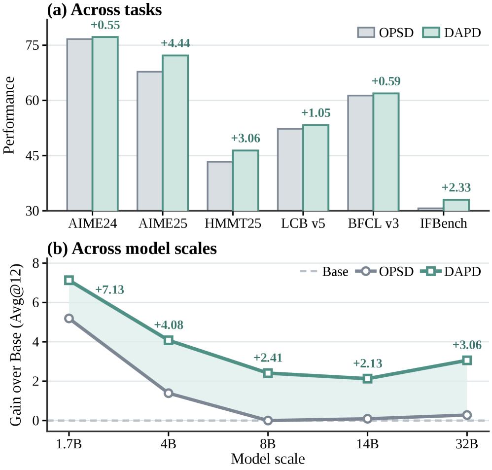

### TL;DR

On-policy self-distillation (OPSD) often makes the student *worse* at inference because it internalises behaviour that only makes sense when the teacher's privileged information is present. DAPD adds two levels of "anchoring" that force the student to behave the same with and without privileged context.

### Key idea

**Dual-Path Anchoring (DPA):** run two matched-information paths — a self-conditioned bridge and an inference-time rollout — and align their behaviours, so the student can't quietly become a privileged-teacher shadow.
**Dual-Source Anchoring (DSA):** apply the alignment in both reference→rollout and rollout→reference directions, so correctness supervision survives while reliance on privileged reference guidance drops.

### Main finding

On Qwen3-4B: +2.00 avg points over vanilla OPSD across evaluated tasks. Gains persist at scale: +2.69 at 4B, +2.78 at 32B.

### Why it matters

OPSD is being adopted widely in reasoning post-training (DeepSeek, Qwen, etc.). The "privilege illusion" is a subtle failure mode that has real cost — it silently gates how good self-distillation can get. DAPD is a small architectural fix that removes the ceiling.

### Knowledge graph integration

**Builds on / relates to existing pages:**
- [../post-training/_rl.md](../post-training/_rl.md) — sits alongside GRPO / PPO as an on-policy method
- [../post-training/rejection-sampling.md](../post-training/rejection-sampling.md) — related off-policy improvement family
- [../post-training/reasoning/long-cot-rl.md](../post-training/reasoning/long-cot-rl.md) — self-distillation is a common piece of long-CoT recipes

**Suggested new pages:**
- `post-training/on-policy-distillation.md` *(depth)* — the OPSD family as a whole
- `post-training/dapd.md` *(depth)* — DAPD specifically (privilege illusion + dual anchoring)

---

## 4. GradCuit: Credit-Assigned Gradient Flow for Test-Time Latent Reasoning

**Authors:** Zhaoxin Yu, Qi Shen, Hengli Li, Zhaowei Zhang, Song-Chun Zhu, Chi Zhang, Zilong Zheng — *BIGAI · CASIA · BUPT · Peking University*
**Links:** [arXiv:2608.02585](https://arxiv.org/abs/2608.02585) · [HF](https://huggingface.co/papers/2608.02585) · [AlphaXiv](https://www.alphaxiv.org/abs/2608.02585)
**Topics:** `reasoning`, `interp`, `test-time`

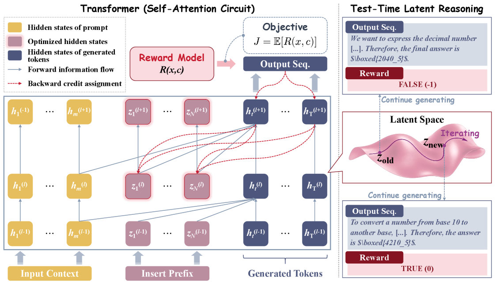

### TL;DR

Instead of decoding tokens, GradCuit does reasoning in latent space at *test time* by running credit-assigned gradient updates on hidden states of a frozen LM, driven by a verifier signal — producing more robust and more interpretable reasoning than long-CoT decoding on the same model.

### Key idea

Freeze the LM. At inference, run a small number of gradient steps on selected intermediate activations, with the gradient flow shaped by an explicit credit-assignment mask so only the "responsible" latents get updated. The result is a latent-reasoning trace you can inspect (which activations moved, by how much) instead of a token trace you have to trust.

### Main finding

Beats explicit-CoT baselines on reasoning benchmarks while producing shorter, gradient-attributable "reasoning traces," and remains robust under adversarial prompt perturbations that break token-level CoT.

### Why it matters

Latent reasoning has been a nice idea (Coconut, iCoT, activation steering) that keeps losing to just decoding more tokens. GradCuit's credit assignment is the missing piece — it lets test-time optimisation improve reasoning quality *and* give you an interpretability handle at the same time.

### Knowledge graph integration

**Builds on / relates to existing pages:**
- [../post-training/reasoning/long-cot-rl.md](../post-training/reasoning/long-cot-rl.md) — direct alternative to explicit-CoT reasoning
- [../interpretability/README.md](../interpretability/README.md) — the credit-assigned latent trace *is* the interpretability artefact

**Suggested new pages:**
- `post-training/reasoning/latent-reasoning.md` *(depth)* — the general class of test-time latent-space reasoning methods
- `post-training/reasoning/gradcuit.md` *(depth)* — the specific credit-assigned variant

---

## 5. SKT: Skill-Use Training at Scale via Verified Synthetic Data

**Authors:** Yiqun Zhang, Hao Li, Zhiyao Cui, Hejia Geng, Shao Zhang, Hangfan Zhang, Yang Chen, Xiaosong Wang, Lilong Wang, Zhenfei Yin, Shuyue Hu, Chen Zhang, Lei Bai — *Shanghai AI Lab & collaborators*
**Links:** [arXiv:2608.02287](https://arxiv.org/abs/2608.02287) · [HF](https://huggingface.co/papers/2608.02287) · [AlphaXiv](https://www.alphaxiv.org/abs/2608.02287)
**Topics:** `agents`, `data`, `SFT`

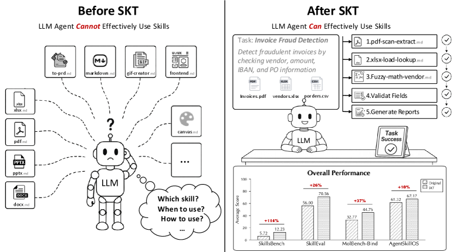

### TL;DR

Agent Skills (reusable procedural blocks) get published faster than models learn to use them well. SKT is a pipeline that grows 2,000 public skills into 4,000 skill-grounded tasks with 27,164 verified trajectories, and SFT on that data reliably lifts skill-use ability across models.

### Key idea

Bidirectional synthesis: given a bank of skills, sample plausible task instances that *require* combinations of them, then execute rollouts with a teacher agent and *verify* each trajectory against the skill's own success criteria before keeping it. Verification is what stops the standard "synthetic-agent-data collapse" problem.

### Main finding

Consistent post-training gains across multiple model backbones and skill-use benchmarks from SFT on the 27k verified trajectories (paper reports per-model deltas).

### Why it matters

Skills are the runtime primitive frontier agents (Claude Skills, custom-instructions systems) increasingly ship with. Training data for using them well was a bottleneck; a verified-synthesis pipeline turns any skill corpus into skill-use SFT data.

### Knowledge graph integration

**Builds on / relates to existing pages:**
- [../data/_data-curation.md](../data/_data-curation.md) — verified-synthesis is a data-curation strategy
- [../post-training/fine-tuning/README.md](../post-training/fine-tuning/README.md) — SFT on rollouts is the training path
- [../agents/README.md](../agents/README.md) — skill-use is the agent capability being trained

**Suggested new pages:**
- `agents/agent-skills.md` *(depth)* — Agent Skills as a runtime primitive
- `data/verified-synthetic-trajectories.md` *(depth)* — the verify-before-keep synthetic-data pattern

---

## 6. LongHorizon-Harness: Advancing Long-Horizon Agents for Real-World Tasks

**Authors:** Hailang Huang, Shun Zou, Yong Wang, Shidong Yang, Yiming Hu, Fei Wei, Xiangxiang Chu — *Alibaba Group (DreamX Team)*
**Links:** [arXiv:2608.01964](https://arxiv.org/abs/2608.01964) · [HF](https://huggingface.co/papers/2608.01964) · [AlphaXiv](https://www.alphaxiv.org/abs/2608.01964)
**Topics:** `agents`, `eval`, `harness`

### TL;DR

Standard agent harnesses cram task state, execution history, and self-assessment into one growing context — errors compound. LongHorizon-Harness explicitly maintains task state *outside* the LM and only updates it with environment-verified facts.

### Key idea

A **Manage-Execute-Audit** loop: a Manager maintains an external structured task-state store; an Executor takes actions with only the currently-relevant state slice; an Auditor validates each state update against the environment before it persists. The context the LM sees never accumulates unverified self-assessments.

### Main finding

Substantial gains across multiple long-horizon benchmarks (paper reports per-benchmark deltas) with several LLM backbones, at inference-only cost — no retraining required.

### Why it matters

Every serious agent system is fighting the same "context rot / hallucinated state" failure. Externalising state and gating updates on environment verification is architecturally cleaner than context-compression tricks, and it composes with any base model.

### Knowledge graph integration

**Builds on / relates to existing pages:**
- [../agents/README.md](../agents/README.md) — long-horizon execution is *the* agent problem
- [../fundamentals/dca.md](../fundamentals/dca.md) — orthogonal fix to the same "long context is fragile" failure

**Suggested new pages:**
- `agents/_agent-harnesses.md` *(taxonomy)* — ReAct, Manage-Execute-Audit, harness variants and tradeoffs
- `agents/external-state-management.md` *(depth)* — patterns for moving task state out of the LM context

---

## 7. Progressive Agent Skill Generation via RL (Skill-α)

**Authors:** Junhao Shen, Zhanqiu Zhang, Yiwen Guo, Hong Cheng — *CUHK · Lightspeed · Independent*
**Links:** [arXiv:2608.01678](https://arxiv.org/abs/2608.01678) · [HF](https://huggingface.co/papers/2608.01678) · [AlphaXiv](https://www.alphaxiv.org/abs/2608.01678)
**Topics:** `agents`, `RL`, `skills`

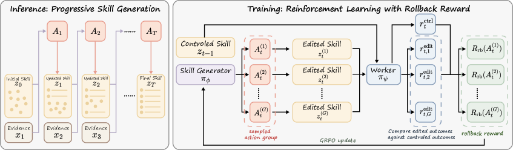

### TL;DR

Skill-α replaces heuristic "distil experience into a doc" skill-generation pipelines with an RL policy that generates skills *and* is rewarded by whether those skills improve downstream agent performance.

### Key idea

Skills have no direct supervision signal — you only find out if a skill was good by trying it. Skill-α treats the skill generator as a policy, samples candidate skills, deploys the agent with each, and uses the downstream success delta as the RL reward. A *progressive* curriculum grows the skill library over training rounds so later skills can compose earlier ones.

### Main finding

Beats heuristic skill-generation baselines across the evaluated skill-use benchmarks (paper reports per-benchmark deltas); improvements grow across curriculum rounds.

### Why it matters

Bridges "self-improving agents" and RLVR: the reward comes from an environment (downstream task success) rather than a human. Complements SKT (paper #5) — SKT trains models to *use* skills, Skill-α trains a model to *write* them.

### Knowledge graph integration

**Builds on / relates to existing pages:**
- [../post-training/rlvr.md](../post-training/rlvr.md) — verifiable-reward RL over a downstream metric
- [../post-training/grpo.md](../post-training/grpo.md) — plausible base algorithm for the skill-generation policy
- [../agents/README.md](../agents/README.md) — the target capability

**Suggested new pages:**
- `agents/skill-generation-rl.md` *(depth)* — RL for automatic skill authoring

---

## 8. UEmbed: Unified Sparse & Dense Multimodal Embeddings

**Authors:** Author list from CASIA, Alibaba Group, UCAS, Yale (full names not visible on HF page)
**Links:** [arXiv:2608.02583](https://arxiv.org/abs/2608.02583) · [HF](https://huggingface.co/papers/2608.02583) · [AlphaXiv](https://www.alphaxiv.org/abs/2608.02583)
**Topics:** `multimodal`, `retrieval`, `LLM`

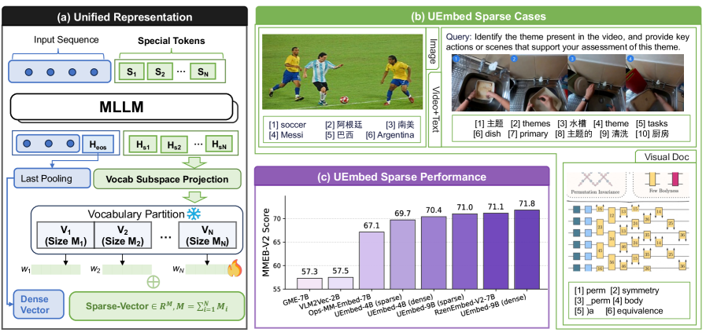

### TL;DR

A single decoder-only multimodal model that produces both a sparse lexical vector and a dense embedding in one causal forward pass — no cross-encoder, no dual-encoder, no extra module.

### Key idea

Two projection heads sit on top of the same causal decoder: one produces a bag-of-vocab sparse "learned lexical" vector (Learned Sparse Retrieval), the other a dense embedding. Both are trained jointly on multimodal contrastive + LSR losses so a single forward pass covers dense-, sparse-, and hybrid-retrieval regimes.

### Main finding

Beats prior LSR baselines on MMEB-v2 and BEIR while removing the auxiliary cross-modal encoder LSR usually needs, at inference cost equivalent to a single decoder pass.

### Why it matters

Retrieval stacks in agentic systems have been dragging around three components (dense, sparse, cross-encoder). UEmbed shows a decoder-only LLM can *be* the whole stack — an important unification for RAG and tool-use pipelines.

### Knowledge graph integration

**Builds on / relates to existing pages:**
- [../multimodal/README.md](../multimodal/README.md) — multimodal retrieval / embedding
- [../architectures/multi-head-attention.md](../architectures/multi-head-attention.md) — decoder-only architecture reused as encoder

**Suggested new pages:**
- `multimodal/multimodal-embeddings.md` *(depth)* — decoder-as-embedder for retrieval
- `data/learned-sparse-retrieval.md` *(depth)* — LSR family (SPLADE-style)

---

## 9. VAD: Visual-Attribution Distillation

**Authors:** Yixing Li, Shuai Shao, Qingyao Li, Zhengxi Lu, Zhiyuan Yao, Shijian Wang, Jianghao Lin, Wenxiang Jiao, Yuan Lu, Weiwen Liu, Weinan Zhang, Yong Yu
**Links:** [arXiv:2607.28590](https://arxiv.org/abs/2607.28590) · [HF](https://huggingface.co/papers/2607.28590) · [AlphaXiv](https://www.alphaxiv.org/abs/2607.28590)
**Topics:** `multimodal`, `distillation`, `RL`

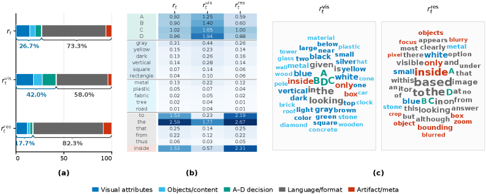

### TL;DR

Multimodal on-policy distillation gives the teacher privileged visual access. VAD isolates the "visually-attributable" component of the teacher's correction with a counterfactual (teacher-with vs teacher-without the evidence) and distills only that.

### Key idea

At each student-generated prefix, run the same teacher twice — once with the visual evidence present, once with it hidden. The centered-logprob difference `u_t` is a signed direction of "what the visual evidence supports." Project the raw teacher correction onto `u_t` to get an intervention-aligned target; use that as primary supervision, keep the raw teacher as a weak regularizer.

### Main finding

Beats direct privileged-view distillation and visual-advantage weighting across six fine-grained visual benchmarks at both 4B and 9B scales. Token-level analysis shows the projected component concentrates on task-relevant visual corrections.

### Why it matters

Extends the "isolate the useful signal" trick that made preference-based RL work (implicit reward, advantage estimation) to *multimodal* distillation. Suggests counterfactual target reconstruction as a general recipe for any teacher-student setup where the teacher has privileged information.

### Knowledge graph integration

**Builds on / relates to existing pages:**
- [../post-training/_rl.md](../post-training/_rl.md) — advantage-estimation-style projection
- [../post-training/dpo.md](../post-training/dpo.md) — same "extract the useful signal from the raw log-prob diff" intuition
- [../multimodal/README.md](../multimodal/README.md) — VLM post-training

**Suggested new pages:**
- `multimodal/on-policy-distillation-vlm.md` *(depth)* — VLM OPD as a class
- `multimodal/visual-attribution-distillation.md` *(depth)* — VAD specifically

---

## 10. SWE-Touch: Coding Agents When Users Touch the Code

**Authors:** Yuqiao Tan, Jinxiang Meng, Fangyu Lei, Minzheng Wang, Shizhu He, Jun Zhao, Kang Liu — *CASIA*
**Links:** [arXiv:2608.02499](https://arxiv.org/abs/2608.02499) · [HF](https://huggingface.co/papers/2608.02499) · [AlphaXiv](https://www.alphaxiv.org/abs/2608.02499)
**Topics:** `agents`, `eval`, `code`

### TL;DR

Real coding-agent work happens in shared repos where users modify files mid-task. SWE-Touch injects plausible-but-conflicting user edits into SWE-bench-style tasks and evaluates whether agents notice and adapt.

### Key idea

Mine "task-critical" regions from multiple successful repair trajectories, use a separate User Patch Generator to construct **Counter-Edits** to those regions, and inject them (with contextual messages) at the point the agent reaches the relevant code. Every counter-edit conflicts with a correct fix — a robust agent must re-inspect and reconcile.

### Main finding

Across nine coding models, Counter-Edit lowers SWE-bench Verified resolve rate by **7.7 percentage points on average**; degradation also persists on SWE-Bench Pro and DeepSWE. Trajectory analysis: agents either keep the conflicting code or replace it *without* re-testing.

### Why it matters

SWE-bench and cousins have been trained-and-tested against; the "real developer surface" is much more adversarial. SWE-Touch names a specific failure mode (workspace-state awareness) and provides a benchmark that isolates it — expect it to become part of default coding-agent evals.

### Knowledge graph integration

**Builds on / relates to existing pages:**
- [../evaluation/livecodebench.md](../evaluation/livecodebench.md) — coding-benchmark family
- [../evaluation/humaneval.md](../evaluation/humaneval.md) — same
- [../agents/README.md](../agents/README.md) — coding agent as a subclass

**Suggested new pages:**
- `evaluation/swe-bench.md` *(depth)* — the SWE-bench family (Verified, Pro, DeepSWE) — a gap
- `evaluation/swe-touch.md` *(depth)* — this benchmark specifically

---

## 11. To Add Is Machine, To Delete Is Human — Deletion Avoidance in LLM Code Editing

**Authors:** Author list not visible on HF page.
**Links:** [arXiv:2607.28887](https://arxiv.org/abs/2607.28887) · [HF](https://huggingface.co/papers/2607.28887) · [AlphaXiv](https://www.alphaxiv.org/abs/2607.28887)
**Topics:** `eval`, `agents`, `code`

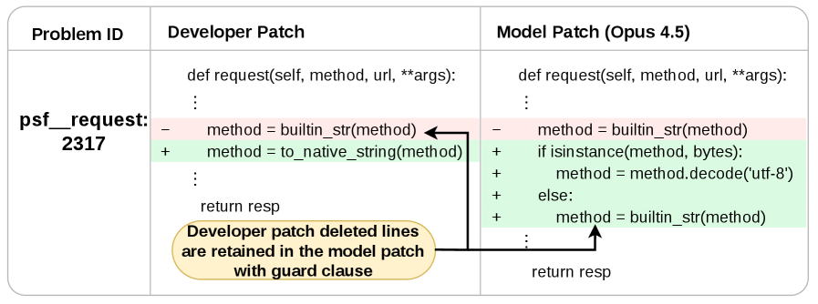

### TL;DR

Top-5 SWE-bench Verified models find the right file 92%+ of the time but only cut the actual line 52% of the time. Passing patches routinely *wrap* the offending code in a guard/fallback instead of removing it — a pattern the authors call **Guard-and-Go**.

### Key idea

Introduce **deletion recall** as an evaluation metric: how much of the developer patch's *removed* lines the model's patch also removes. Then quantify Guard-and-Go patches (test-passing patches that keep the target code and add a bypass). Together these expose why LLM patches leave codebases harder to maintain.

### Main finding

Across the top 5 SWE-bench leaderboard models on tasks all five solve: deletion recall caps at **71.7%**. **29.0% of passing patches are Guard-and-Go**. File-level localisation is >92%; exact-line deletion is <52%.

### Why it matters

Explains the widely-noted "the tests pass but the code got worse" complaint about LLM coding agents in precise terms. Any coding-agent training recipe should now include a deletion-recall signal, not just test-pass reward.

### Knowledge graph integration

**Builds on / relates to existing pages:**
- [../evaluation/livecodebench.md](../evaluation/livecodebench.md) — related coding eval family
- [../evaluation/humaneval.md](../evaluation/humaneval.md) — same
- [../post-training/rlvr.md](../post-training/rlvr.md) — argues test-pass as sole verifiable reward is insufficient

**Suggested new pages:**
- `evaluation/deletion-recall.md` *(depth)* — the metric and the Guard-and-Go pattern

---

## 12. Zero-Mem: Zero-Token Memory Operations for LLM Agents

**Authors:** Yilin Xiao, Zhehan Zhu, Yujing Zhang, Jin Chen, Zijin Hong, Luyao Zhuang, Qinggang Zhang, Shengyuan Chen, Xiaocao Ouyang, Lingfei Ren, Xiao Huang
**Links:** [arXiv:2607.29377](https://arxiv.org/abs/2607.29377) · [HF](https://huggingface.co/papers/2607.29377) · [AlphaXiv](https://www.alphaxiv.org/abs/2607.29377)
**Topics:** `agents`, `efficient-inference`, `RAG`

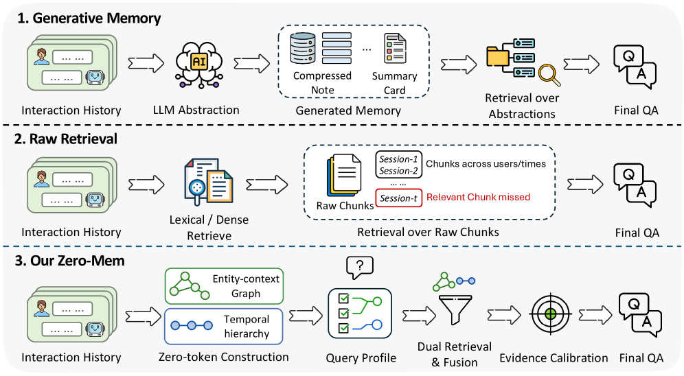

### TL;DR

Most agent-memory systems burn LLM calls on maintenance — summarising past turns, deciding what to store, mediating retrieval. Zero-Mem removes every LLM call *except* the final QA reader by organising raw interaction traces into an entity–context graph plus a temporal hierarchy.

### Key idea

Two complementary views over raw traces:
- **Entity–context graph:** cross-interaction connections (who / what / relations).
- **Temporal hierarchy:** conversational locality + session state.
Each query is scored against both views, retrieval is done with the graph structure, and a deterministic calibration step drops conflicting evidence before it reaches the reader. No intermediate summarisation, no LLM-in-the-loop for memory operations.

### Main finding

Competitive with heavier baselines on long-memory & long-context QA benchmarks while eliminating LLM calls / tokens for memory ops. **57.6% reduction in memory-operation time cost** versus the fastest baseline, same reader and context budget.

### Why it matters

Directly attacks the biggest hidden cost in agent stacks. Also a clean argument that "generate a memory representation with an LLM" was never necessary — structure over the raw log wins.

### Knowledge graph integration

**Builds on / relates to existing pages:**
- [../agents/README.md](../agents/README.md) — memory is a core agent subsystem
- [../inference/README.md](../inference/README.md) — memory-op token cost is an inference-efficiency concern

**Suggested new pages:**
- `agents/_agent-memory.md` *(taxonomy)* — MemGPT-style, LLM-mediated, graph-based, hierarchical; tradeoffs
- `agents/zero-token-memory.md` *(depth)* — Zero-Mem specifically

---

## 13. WorldExam: Benchmarking World Models from Appearance to Reactivity

**Authors:** Shuyao Shang, Jiahe Wang, Zitong Zhou, Liang Tan, Junhan Zeng, Ruizhi Li, Junyan Li, Yu Liu, Xiao Yang, Yong Li, Jun Zhu, Hongsheng Li, Tieniu Tan, Lue Fan, Zhaoxiang Zhang — *CASIA · SLAI · CUHK · AMAP · Tsinghua*
**Links:** [arXiv:2608.02603](https://arxiv.org/abs/2608.02603) · [HF](https://huggingface.co/papers/2608.02603) · [AlphaXiv](https://www.alphaxiv.org/abs/2608.02603)
**Topics:** `eval`, `multimodal`, `world-model`

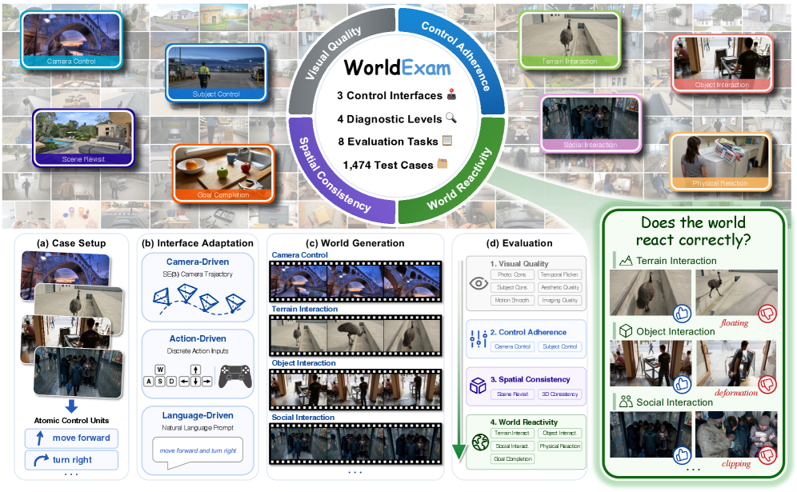

### TL;DR

A four-level benchmark (Visual Quality → Control Adherence → Spatial Consistency → **World Reactivity**) for video-generation "world models," with 1,474 cases across eight tasks and unified evaluation across camera-, action-, and language-driven paradigms.

### Key idea

Explicitly separates *inherent reactivity* — does the generated world respond plausibly to state and goals not spelled out in the prompt? — from the visual-quality and instruction-following metrics that current benchmarks focus on.

### Main finding

Evaluating 20 representative models reveals a clean split: camera-driven models are precise but static, action-driven models control subjects but leave the world inert, language-driven models handle interaction but drop complex control. **No model** combines broad coverage with strong performance.

### Why it matters

"World model" has become a marketing term; WorldExam gives it a testable definition. Provides the evaluation infrastructure needed if the "generative video ≈ simulator" thesis is going to be checked against reality.

### Knowledge graph integration

**Builds on / relates to existing pages:**
- [../multimodal/README.md](../multimodal/README.md) — video generation lives here
- [../evaluation/README.md](../evaluation/README.md) — new eval family

**Suggested new pages:**
- `evaluation/world-model-eval.md` *(depth)* — WorldExam and the reactivity concept
- `multimodal/_world-models.md` *(taxonomy)* — camera- vs action- vs language-driven video world models

---

## 14. ReBA: Geometry-Guided Load Balancing for VL-MoE

**Authors:** Ziang Wu, Peng Jin, Qishen Yin, Munan Ning, Hao Li, Peizhen Zhang, Li Yuan — *Peking University / Yuan Lab and collaborators*
**Links:** [arXiv:2608.00574](https://arxiv.org/abs/2608.00574) · [HF](https://huggingface.co/papers/2608.00574) · [AlphaXiv](https://www.alphaxiv.org/abs/2608.00574)
**Topics:** `MoE`, `multimodal`

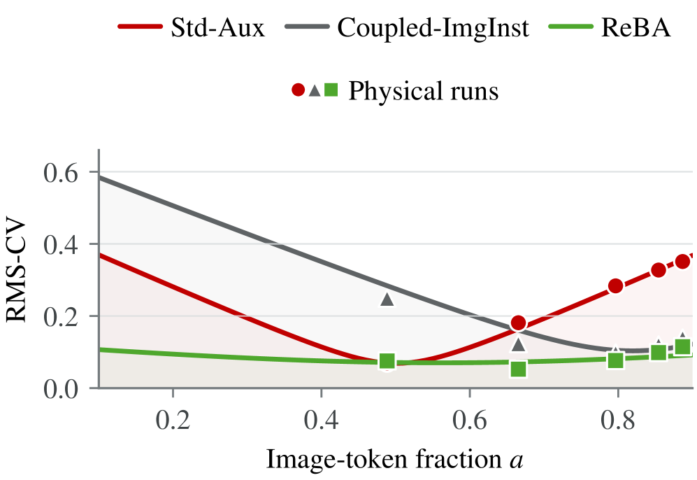

### TL;DR

Vision-language batches mix image and text tokens in ratios that swing with image resolution, tiling and prompt length. The standard Switch auxiliary loss balances only the *mixture*, so image-side and text-side load errors can cancel while individual modalities are wildly imbalanced. ReBA balances each modality separately.

### Key idea

Derive the exact load curve as the image/text mix varies with fixed per-modality profiles — the image–text load gap turns out to control mix sensitivity. Then:
- **Relax Within:** allow slack in intra-modality routing (one equal-weight routing instance per image, respecting the natural per-image grouping of visual tokens).
- **Balance Across:** enforce balance separately for the image and text modality regions.

### Main finding

Across four split backbones, ReBA lowers load imbalance on every reported benchmark input while preserving mean task accuracy vs Std-Aux, and reduces worst-case physical load under resolution/tiling shifts. On the main model, Std-Aux showed >5× load imbalance across image resolutions — ReBA flattens this.

### Why it matters

VL-MoEs are becoming the default frontier vision-language architecture. The load-balancing failure is real (measured 5× swings) and hurts inference cost. ReBA generalises the aux-loss-free-balancing lineage to the multimodal setting.

### Knowledge graph integration

**Builds on / relates to existing pages:**
- [../architectures/_moe.md](../architectures/_moe.md) — MoE routing family
- [../architectures/load-balancing-loss.md](../architectures/load-balancing-loss.md) — Std-Aux is the baseline
- [../architectures/aux-loss-free-balancing.md](../architectures/aux-loss-free-balancing.md) — same problem, unimodal
- [../architectures/sequence-wise-balance-loss.md](../architectures/sequence-wise-balance-loss.md) — related sequence-level balance idea

**Suggested new pages:**
- `architectures/vl-moe-load-balancing.md` *(depth)* — ReBA and the multimodal load-balance regime

---

## 15. MemSFT: External Parametric Memory Against Alignment Tax

**Authors:** Jiarui Wang, Xiang Shi, Jiaqi Cao, Rubin Wei, Xiquan Wang, Hao Sun, Jingzhi Wang, Zhiqi Yang, Qipeng Guo, Bowen Zhou, Zhouhan Lin — *SJTU LUMIA Lab · Shanghai AI Lab · Tsinghua*
**Links:** [arXiv:2607.25614](https://arxiv.org/abs/2607.25614) · [HF](https://huggingface.co/papers/2607.25614) · [AlphaXiv](https://www.alphaxiv.org/abs/2607.25614)
**Topics:** `SFT`, `post-training`, `LoRA-adjacent`

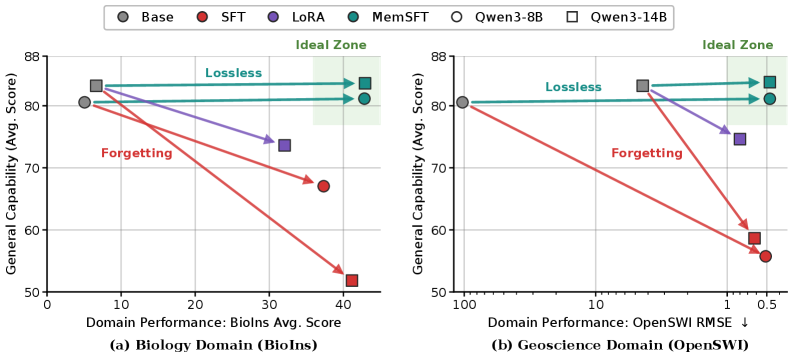

### TL;DR

Domain SFT hurts general capabilities (alignment tax / catastrophic forgetting). MemSFT decouples domain specialization from backbone-parameter updates by writing domain knowledge into a plug-and-play *parametric memory* module trained separately from the base weights.

### Key idea

Freeze the base LLM. Attach an external parametric-memory module and only train that on domain data. At inference the module is "plugged in" additively so domain queries hit it while general queries fall back to the base model — no interference with the base weights.

### Main finding

Recovers substantially more general-task performance than standard domain-SFT while matching domain-task specialization (paper reports per-task numbers).

### Why it matters

Positions parametric memory alongside LoRA/adapters as a third route to "compose domain skills without breaking the base." The specific decoupling design plus the alignment-tax framing gives a clean template for enterprise-domain adaptation.

### Knowledge graph integration

**Builds on / relates to existing pages:**
- [../post-training/fine-tuning/README.md](../post-training/fine-tuning/README.md) — SFT and PEFT family
- [../pre-training/model-souping.md](../pre-training/model-souping.md) — related "combine specialised models" theme

**Suggested new pages:**
- `post-training/fine-tuning/parametric-memory-sft.md` *(depth)* — MemSFT and the external-memory-for-SFT pattern

---

## Notes

- Borderline inclusions: papers #9 (VAD) and #14 (ReBA) are dense and technical; kept because both extend concepts already in the graph (distillation, MoE load-balancing) with mechanisms worth documenting.
- Hero figures live in `assets/2026-08-04/`. Three papers (#1 DiffusionGemma, #2 GPTQ-2D, #10 SWE-Touch) had no accessible arXiv HTML rendering and no HF `og:image`, so figures are omitted for them.
- This digest is informational. No existing concept files, `READING-LIST.md`, or `PAPERS.md` were modified to produce it.
