# Daily AI papers — 2026-08-05

*Curated from HF Daily Papers. 15 of ~38 papers kept after relevance filter.*

## Papers at a glance

| # | Title | Topics | Org |
| --- | --- | --- | --- |
| 1 | [MerchantBench: Benchmarking LLM Agents for Long-Term Coherence in E-Commerce Operations](#1-merchantbench) | `agents`, `eval` | Alibaba |
| 2 | [JoyAI-Video-Edit: Real-Time Open-Ended Video Editing with Autoregressive Diffusion](#2-joyai-video-edit) | `diffusion`, `video`, `distillation` | JD / Joy Future Academy |
| 3 | [AURORA-LM: Autoencoding Unified Representation for Continuous-Latent Diffusion Language Modeling](#3-aurora-lm) | `diffusion`, `LLM`, `flow-matching` | Nanjing U. / HiSilicon |
| 4 | [Hunyuan3D-Buffalo 1.0: A Unified Multimodal Model for Scalable 3D Generation, Understanding, and Editing](#4-hunyuan3d-buffalo-1-0) | `multimodal`, `diffusion`, `3D` | Tencent Hunyuan |
| 5 | [Video-DeepResearch: Towards the Next-Generation Multimodal Deepresearch Agent](#5-video-deepresearch) | `agents`, `multimodal`, `RL` | USTC / Xiaohongshu |
| 6 | [PCSD: Persistent Consistency for Self-Distillation in Agentic Reinforcement Learning](#6-pcsd) | `RL`, `agents`, `distillation` | (multi-institution) |
| 7 | [Quo Vadis, World Modeling?](#7-quo-vadis-world-modeling) | `agents`, `multimodal`, `position` | Shanghai AI Lab |
| 8 | [PAST-Bench: Benchmarking the Foundations of Recursive Self-Improvement in Personal Agents](#8-past-bench) | `agents`, `eval`, `memory` | Princeton / U. Chicago |
| 9 | [LLaDA MoE v2: Scaling Mixture-of-Experts Diffusion Language Models](#9-llada-moe-v2) | `MoE`, `diffusion`, `LLM`, `scaling-laws` | RUC / Ant Group |
| 10 | [OmniPack: Unified Token Compression for Efficient Omni-modal LLMs](#10-omnipack) | `multimodal`, `efficient-inference` | NPU / PKU / Alibaba |
| 11 | [Any-OPD: Heterogeneous On-Policy Distillation for Flow-Matching Models](#11-any-opd) | `diffusion`, `distillation`, `flow-matching` | (unspecified) |
| 12 | [SkillJack: Persistent Skill Backdoors in Self-Evolving Agents](#12-skilljack) | `safety`, `agents`, `backdoor` | Tencent Zhuque Lab |
| 13 | [TurnSight: Turn-Level Hindsight Self-Distillation for Tool-Integrated Reasoning](#13-turnsight) | `RL`, `agents`, `reasoning`, `distillation` | (unspecified) |
| 14 | [RestoreKV: Recovering Full-Cache Behavior Under Aggressive Query-Agnostic KV Cache Eviction](#14-restorekv) | `inference`, `efficient-inference`, `long-context` | (unspecified) |
| 15 | [When Attention Goes Blind: Numerical Failure in ALiBi Positional Encodings](#15-when-attention-goes-blind) | `architectures`, `interp`, `long-context` | ScaDS.AI / Leipzig / Kassel |

---

## 1. MerchantBench

**Authors:** Qiming Shi, Yulong Tao, Linbo Jin, Zhaolu Kang, Yibo Dou, Jiawen Zhu, Tianjun Pan, Shaokang Fu, Chengyu Wang, Siyue Li, Yaping Cheng, Di Weng, Chengfu Huo — *Alibaba*
**Links:** [arXiv:2607.28956](https://arxiv.org/abs/2607.28956) · [HF](https://huggingface.co/papers/2607.28956) · [AlphaXiv](https://www.alphaxiv.org/abs/2607.28956)
**Topics:** `agents`, `eval`, `long-horizon`

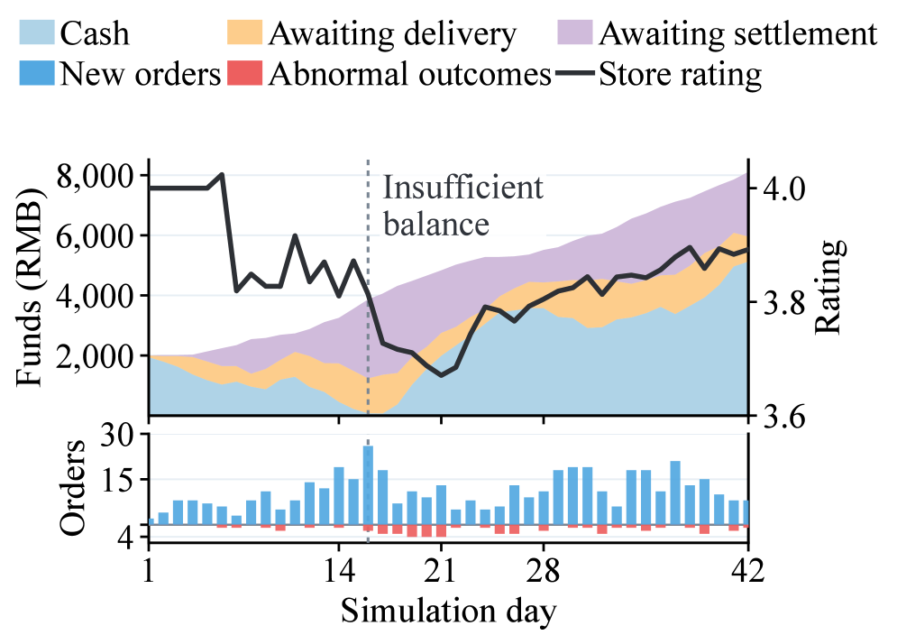

### TL;DR

A 365-day order-level e-commerce simulation designed to measure a rarely-tested agent property: **long-term coherence** — keeping a purposeful policy across months, revisiting old decisions as delayed feedback arrives, and letting incoherent behavior compound into measurable losses. Built on 98,843 real product records, wired to 26 tools, and evaluated over 48 full-year runs across eight LLMs and two frameworks.

### Key idea

Most agent benchmarks are episodic: a task, an answer, a score. MerchantBench forces agents to run a seller for a simulated year in which today's sourcing choice constrains next month's cash flow, listings depreciate, and downstream order outcomes arrive at heterogeneous delays. Four coupled sub-problems — Product Sourcing, Listing & Pricing, Cash-Flow Management, and Mixed-Latency Feedback Adaptation — make the *history-conditioned* policy the object of evaluation instead of the single-shot response.

### Main finding

The best LLM configuration reaches only **27.3%** of the mean final net assets that human participants achieve over the same 365 simulated days. The gap doesn't close by swapping to newer models — it appears across all eight evaluated LLMs — implying the failure is architectural (context-holding, planning, credit assignment over long horizons) rather than knowledge-shaped.

### Why it matters

Frontier evals are saturating on bounded tool-use tasks. MerchantBench is one of the first benchmarks whose scoring metric *rewards adaptation* — an agent that reasons cheaply today but ignores its own past will lose to one that adjusts. Useful signal for reasoning-RL and long-context work targeting practical agentic deployment.

### Knowledge graph integration

**Builds on / relates to existing pages:**
- [../agents/README.md](../agents/README.md) — a long-horizon multi-turn evaluation, closest live example of the "training with environments" thread.
- [../evaluation/README.md](../evaluation/README.md) — benchmark for a capability (coherence) that scalar-per-task evals miss.

**Suggested new pages:**
- `evaluation/merchantbench.md` *(depth)* — the benchmark itself.
- `evaluation/_agentic-benchmarks.md` *(taxonomy)* — long-horizon / open-ended / episodic agent benchmarks.

---

## 2. JoyAI-Video-Edit

**Authors:** Wenxun Dai, Xinran Qin, Lin Song, Maoquan Zhang, Hang Xu, Yukang Chen, Yitong Li, Guohui Zhang, Yuan Zhang, Xuying Zhang, Tommy Zhang, Jianlong Yuan, Peihao Li, Shuai Lu, Siming Fu, Chuyang Zhao, Xin Han, Jie Huang, Wenbo Li, Guoqing Ma, Wei Huang, Xiaojuan Qi, Haoyang Huang, Nan Duan — *Joy Future Academy / JD*
**Links:** [arXiv:2608.03974](https://arxiv.org/abs/2608.03974) · [HF](https://huggingface.co/papers/2608.03974) · [AlphaXiv](https://www.alphaxiv.org/abs/2608.03974)
**Topics:** `diffusion`, `video`, `distillation`, `streaming`

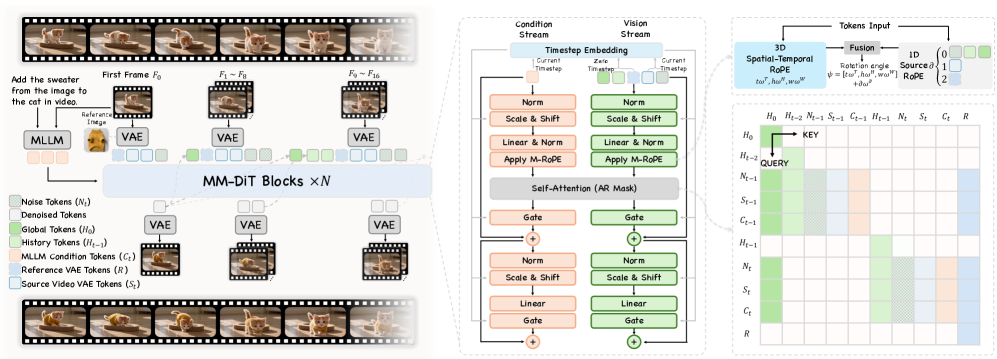

### TL;DR

A 16B-parameter autoregressive diffusion video editor that streams edits at 30 FPS at 720p on a single Nvidia B200 — with no access to future frames and no fixed clip duration. The recipe stacks three distillation-flavored ideas to fight the standard train/inference mismatch and long-horizon temporal drift of autoregressive diffusion.

### Key idea

Three pieces glued together on a chunk-wise autoregressive diffusion backbone: **(1)** chunk-wise autoregressive adaptation for causal, low-latency generation; **(2)** *Source-Anchored Distribution Matching Distillation* (SA-DMD) that keeps the two-step student anchored on the source video's distribution rather than a free-form teacher trajectory (preserves fidelity to the edit source); **(3)** *Long-Horizon Autoregressive Distillation* that trains the student on its own accumulated states so distributional drift between frame chunks doesn't compound.

### Main finding

End-to-end 720p editing at ~30 FPS on one B200, matching or beating strong offline editors on both short and long clips per automatic and human evals. The paper's contribution is engineering: the distillation stack collapses the offline/online quality gap for autoregressive video-diffusion editing.

### Why it matters

Live video editing has been the gap between diffusion research and production video pipelines — most editors are offline batch systems. Framing streaming edits as an *autoregressive diffusion* problem with distribution-matching distillation is a template other real-time video workloads (interactive world models, live filters) can borrow.

### Knowledge graph integration

**Builds on / relates to existing pages:**
- [../multimodal/README.md](../multimodal/README.md) — video generation belongs here; extends the video-generation hub.

**Suggested new pages:**
- `multimodal/sa-dmd.md` *(depth)* — Source-Anchored Distribution Matching Distillation.
- `multimodal/_video-diffusion-distillation.md` *(taxonomy)* — DMD / SA-DMD / step-distillation / long-horizon distillation of video diffusion.

---

## 3. AURORA-LM

**Authors:** Jiajun Liang, Yucheng Liao, Yukang Cao, Jiazhe Wei, Ken Li, Wende Tan, Jiankun Zhang, ZY Cui, Jingkang Yang, Liucheng Guo, Shiqi Yang, B. Yang, Caifeng Shan, Ziwei Liu, Chenyang Si — *Nanjing U. / HiSilicon (Ascend NPU experiments)*
**Links:** [arXiv:2608.02602](https://arxiv.org/abs/2608.02602) · [HF](https://huggingface.co/papers/2608.02602) · [AlphaXiv](https://www.alphaxiv.org/abs/2608.02602)
**Topics:** `diffusion`, `LLM`, `flow-matching`, `latent-diffusion`

### TL;DR

A continuous-latent diffusion language model that stops trying to make text easy for the diffusion model, and instead builds a high-capacity decodable text latent and trains a block-causal DiT to model *that* distribution with flow matching. Achieves the best reported perplexity/quality among continuous- and diffusion-language models on OpenWebText and XSum.

### Key idea

Existing continuous-language-diffusion attempts either reuse token embeddings (not designed for joint generation and decoding) or compress the autoencoded latent (sacrificing token-level fidelity). AURORA-LM separates concerns: a **Query-based Encoder-Decoder** produces a high-capacity, prefix-aligned latent sequence that stays decodable; a **Block-causal Diffusion Transformer** models its distribution via flow matching, generating blocks left-to-right and denoising positions within each block in parallel. The trick that makes wide, decoder-favoring latents tractable for diffusion is restricting the width penalty to *only* the noisy-input pathway while the clean-latent prediction target keeps the full width. Adds calibrated noise-level scheduling to latent width and **self-trajectory consistency** so training-time independent noise samples don't diverge from iterative inference denoising.

### Main finding

Strongest reported numbers among continuous / diffusion-based language models on OpenWebText free generation and XSum summarization. Scaling to 1B parameters with ~1500 EFLOPs of total compute surpasses a larger publicly released latent-diffusion LM under a matched protocol. All experiments run on Ascend NPUs.

### Why it matters

Autoregressive vs diffusion for language remains an open bet. AURORA-LM is one of the cleaner arguments that if you get the *representation* right — decodable, high-width, prefix-aligned — flow-matching diffusion is competitive with AR on standard text benchmarks. Alongside LLaDA MoE (paper 9) it's this week's evidence that dLLMs are worth continued investment.

### Knowledge graph integration

**Builds on / relates to existing pages:**
- [../fundamentals/attention.md](../fundamentals/attention.md) — block-causal DiT is a specific attention masking pattern.

**Suggested new pages:**
- `architectures/_diffusion-language-models.md` *(taxonomy)* — dLLM overview: discrete-diffusion (LLaDA, MDLM), continuous-latent (Plaid, AURORA-LM), block-vs-full-sequence variants.
- `architectures/block-causal-dit.md` *(depth)* — the block-causal Diffusion Transformer pattern used by AURORA-LM.
- `architectures/self-trajectory-consistency.md` *(depth)* — the specific training trick that bridges training-time noise sampling and inference denoising.

---

## 4. Hunyuan3D-Buffalo 1.0

**Authors:** Junliang Ye, Kenkun Liu, Guocun Wang, Yang Li, Yansong Qu, Chunshi Wang, Jingwei Xu, Yunhan Yang, Zibo Zhao, Jiachen Xu, Jiaao Yu, Lifu Wang, Zhihao Liang, Zhuo Chen, Chunchao Guo — *Tencent Hunyuan*
**Links:** [arXiv:2608.02711](https://arxiv.org/abs/2608.02711) · [HF](https://huggingface.co/papers/2608.02711) · [AlphaXiv](https://www.alphaxiv.org/abs/2608.02711)
**Topics:** `multimodal`, `diffusion`, `3D`

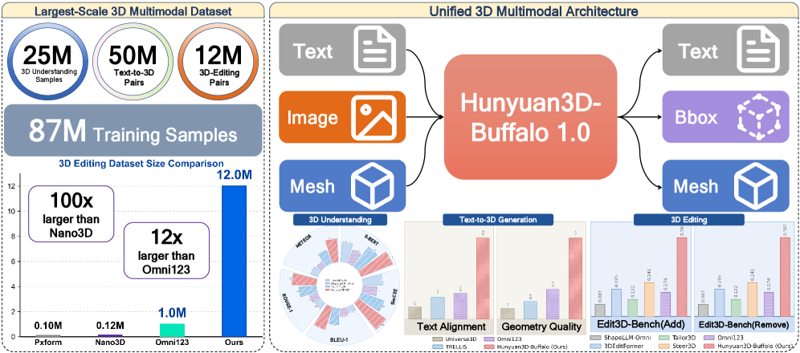

### TL;DR

A single unified 3D multimodal model that does understanding, text-to-3D generation, instruction-guided editing, and text-grounded part generation. Trained on an 87M-scale 3D multimodal corpus (25M understanding + 50M text-to-3D + 12M editing samples), it combines Hunyuan3D-VLM for semantic/structural/spatial understanding with a Hunyuan3D-DiT generator.

### Key idea

Two takes worth naming. **(a)** Scale-fix the classical 3D-editing bottleneck by *synthesizing* the missing edit pairs — 12M of them, generated with Nano3D-v2 — so a diffusion generator can be conditioned on the *source object representation* to preserve overall structure while editing local regions. **(b)** Fuse understanding and generation in one loop: the VLM feeds semantic conditions into the DiT; the paper ablates and shows both directions of transfer improve editing.

### Main finding

SOTA or leading numbers on text-to-3D generation and 3D-editing benchmarks with strong 3D understanding and part-generation as side outputs. The ablation-style claim that **both** generation and understanding losses improve editing is the load-bearing result.

### Why it matters

3D has been unified-model-late relative to 2D image generation because there's no equivalent of LAION for edit pairs. Buffalo is one of the first credible answers: use a smaller model (Nano3D-v2) to *synthesize* the missing modality of data, then train a single big unified model on the merged pool.

### Knowledge graph integration

**Builds on / relates to existing pages:**
- [../multimodal/README.md](../multimodal/README.md) — extends the multimodal cluster into 3D.
- [../data/_data-curation.md](../data/_data-curation.md) — synthetic 12M edit pairs is a data-curation contribution.

**Suggested new pages:**
- `case-studies/hunyuan3d-buffalo.md` *(case study)* — end-to-end recipe, corpus, VLM+DiT stack.
- `multimodal/_3d-generation.md` *(taxonomy)* — text-to-3D, image-to-3D, editing families.

---

## 5. Video-DeepResearch

**Authors:** Zhen Fang, Yu Zeng, Wenxuan Huang, Yiming Zhao, Shiting Huang, Tianfei Ren, Qi Lu, Qingnan Ren, Qisheng Su, Lionel Z. Wang, Qingyu Yin, Shuang Chen, Zehui Chen, Lin Chen, Zhenfei Yin, Yao Hu, Shaohui Lin, Wanli Ouyang, Shaosheng Cao, Feng Zhao — *USTC / Xiaohongshu / CUHK / PolyU / ZJU / UCLA / Oxford / ECNU / Tsinghua*
**Links:** [arXiv:2608.03979](https://arxiv.org/abs/2608.03979) · [HF](https://huggingface.co/papers/2608.03979) · [AlphaXiv](https://www.alphaxiv.org/abs/2608.03979)
**Topics:** `agents`, `multimodal`, `RL`, `long-video`

### TL;DR

Extends the "deep research" agent pattern from static images to **continuous video streams**, targeting two named failure modes: modality bias (agents skip visual tools for cheaper text search) and parametric knowledge leakage (agents recite from internal memory instead of tool-augmenting). Fixes both via a decoupled perception–exploration pipeline with stage-wise tool unlocking, then two-stage training with SFT followed by GRPO.

### Key idea

Force exhaustive cross-frame visual grounding *before* web-tool access is unlocked. In the pipeline, the perception stage must produce dense spatiotemporal evidence from the video via visual tools; only then does the model gain access to open-web retrieval. Trained via GRPO with rewards structured so imitation-learned shortcuts get punished — the RL stage is what breaks the imitation ceiling.

### Main finding

Video-DeepResearch-35B-A3B hits **64.0%** average accuracy on the new *VideoDR-Bench* (200 multi-hop VQA instances), surpassing Claude-4.5-Sonnet at 59.0%, GPT-5 at 52.5%, and Gemini 2.5 Pro at 57.5%. The compact 30B-A3B variant reaches 59.3% — Claude-4.5-Sonnet parity with an open model.

### Why it matters

DeepResearch-style agents have been text-centric because parametric knowledge covers text tasks well. Video is the natural stress test — you can't Wikipedia your way through a two-hour video — and forcing modality-appropriate tool routing via a curriculum is a portable pattern for other modalities (audio, code repos, PDFs).

### Knowledge graph integration

**Builds on / relates to existing pages:**
- [../post-training/grpo.md](../post-training/grpo.md) — the RL stage is GRPO with structured reward.
- [../agents/README.md](../agents/README.md) — a training recipe for a tool-using agent.
- [../multimodal/README.md](../multimodal/README.md) — long-video multimodal agent.

**Suggested new pages:**
- `agents/deep-research.md` *(depth)* — the deep-research agent pattern (perception → exploration → synthesis).
- `agents/stage-wise-tool-unlocking.md` *(depth)* — the curriculum trick that punishes modality bias.
- `evaluation/videodr-bench.md` *(depth)* — the accompanying benchmark.

---

## 6. PCSD

**Authors:** Chunji Lv, Yangguang Wei, Junlin Liu, Yang Gao, Ming Liu, Xinming Wang, Jinyang Wu, Guoren Wang, Changsheng Li — *multi-institution (numbered but unlabeled)*
**Links:** [arXiv:2608.01837](https://arxiv.org/abs/2608.01837) · [HF](https://huggingface.co/papers/2608.01837) · [AlphaXiv](https://www.alphaxiv.org/abs/2608.01837)
**Topics:** `RL`, `agents`, `distillation`, `credit-assignment`

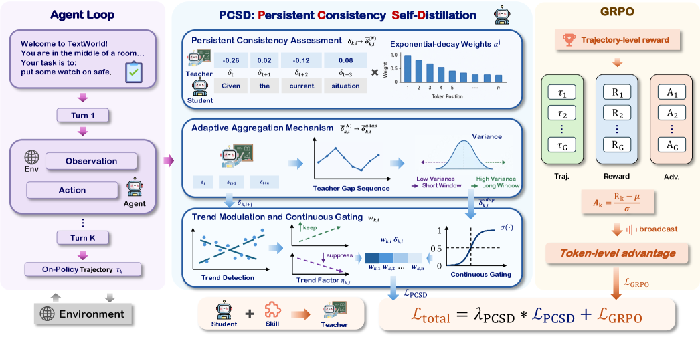

### TL;DR

A denser-supervision recipe for agentic RL where a single trajectory-level reward otherwise has to explain hundreds of tokens. On-policy self-distillation (OPSD) supplies token-level teacher signal from a privileged branch, but the teacher isn't reliable at every position. PCSD replaces per-token or per-step aggregate weights with a **local-persistence** weight — trust the teacher only where its bias holds *across a neighborhood* of positions.

### Key idea

Token-level self-distillation weights are noisy; step-level weights blur positional variation. Instead, derive weights from *how persistently the teacher favors its choice around each token* — a smooth, local aggregate. Then use those weights to modulate the RL advantage-shape signal.

### Main finding

Improved performance on agentic RL benchmarks under sparse trajectory-level rewards, credited to more reliable per-token supervision than either isolated token discrepancies or shared step weights. (Full result table appears past the abstract's cutoff.)

### Why it matters

Sparse rewards + long horizons is the current shape of agentic RL. On-policy self-distillation is one of the leading answers to sparse credit assignment. PCSD is a small but general knob — how to trust teacher signals at token granularity without over-committing to noisy individual samples — that fits into any GRPO/RLVR pipeline over multi-turn trajectories.

### Knowledge graph integration

**Builds on / relates to existing pages:**
- [../post-training/grpo.md](../post-training/grpo.md) — same "sparse trajectory reward, group-relative advantage" setting; PCSD adds a per-token modulator.
- [../post-training/rlvr.md](../post-training/rlvr.md) — supplement to verifiable-reward RL for long trajectories.
- [../post-training/_rl.md](../post-training/_rl.md) — a variance-reduction / credit-assignment technique for the RL taxonomy.

**Suggested new pages:**
- `post-training/on-policy-self-distillation.md` *(depth)* — the OPSD pattern this paper extends.
- `post-training/pcsd.md` *(depth)* — the local-persistence weighting itself.

---

## 7. Quo Vadis, World Modeling?

**Authors:** Yu Yang, Xuemeng Yang, Licheng Wen, Lingdong Kong, Xiaobin Hu, Dongyue Lu, Wei Chow — *Shanghai AI Lab / Fudan / NUS (not labeled inline)*
**Links:** [arXiv:2608.02713](https://arxiv.org/abs/2608.02713) · [HF](https://huggingface.co/papers/2608.02713) · [AlphaXiv](https://www.alphaxiv.org/abs/2608.02713)
**Topics:** `agents`, `multimodal`, `position`

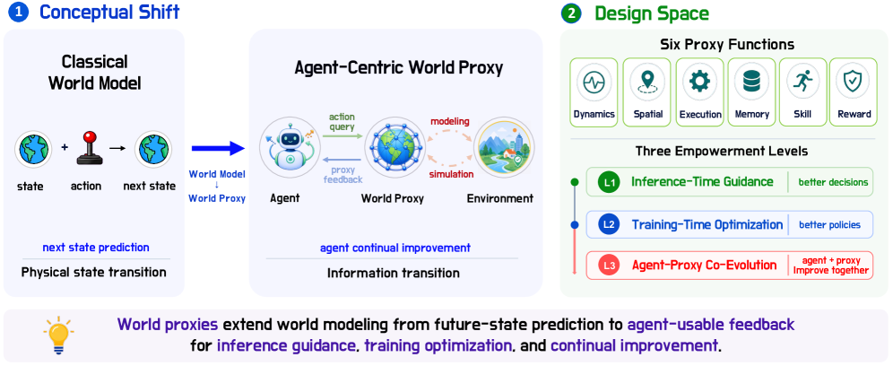

### TL;DR

A position paper arguing that "world models" as generative simulators of physical state have taken us as far as they will, and that the next-generation object is an **agent-centric world proxy**: an information-transition model that predicts what the *agent* will need to know at the next step, not what the world will look like. Lays out six proxy functions and three empowerment levels (L1 inference-time guidance, L2 training-time optimization, L3 agent–proxy co-evolution).

### Key idea

Reframe the world-modeling program: instead of simulating pixels or physical state and hoping downstream planning improves, model the **information transition** that the agent's decisions depend on. Six proxy functions specify what a world proxy should expose (state estimation, action outcome prediction, uncertainty, salience, plan critique, alternative worlds). The three empowerment levels are a maturity ladder — L1 uses the proxy at inference only; L3 has proxy and agent co-training.

### Main finding

This is a design-space paper, not a benchmark paper. The contribution is the taxonomy of proxies, the classification of prior work into the six-function grid, and the L1/L2/L3 empowerment ladder.

### Why it matters

Video-generation and world-model papers this cycle (see minWM, YoCausal in the 2026-05-29 digest, and paper 22 today, MiniWorld) have made increasingly clear that generative simulators are not enough for agent action selection. A position paper that gives the field a cleaner target — information transition, six proxy roles, three empowerment tiers — is a plausible reset button.

### Knowledge graph integration

**Builds on / relates to existing pages:**
- [../agents/README.md](../agents/README.md) — world modeling for agent decision-making is the central agents question.
- [../multimodal/README.md](../multimodal/README.md) — video world models sit here.

**Suggested new pages:**
- `agents/_world-models.md` *(taxonomy)* — world-model families (generative simulator, latent dynamics, agent-centric proxy) with the six-function grid.

---

## 8. PAST-Bench

**Authors:** Zixin Ding, Yichen Shen, Yinjie Wang, Zhenfei Yin, Yingcheng Wu, Yuxin Chen, Mengdi Wang, Ling Yang — *Princeton / U. Chicago (inferred)*
**Links:** [arXiv:2608.04003](https://arxiv.org/abs/2608.04003) · [HF](https://huggingface.co/papers/2608.04003) · [AlphaXiv](https://www.alphaxiv.org/abs/2608.04003)
**Topics:** `agents`, `eval`, `memory`, `self-improvement`

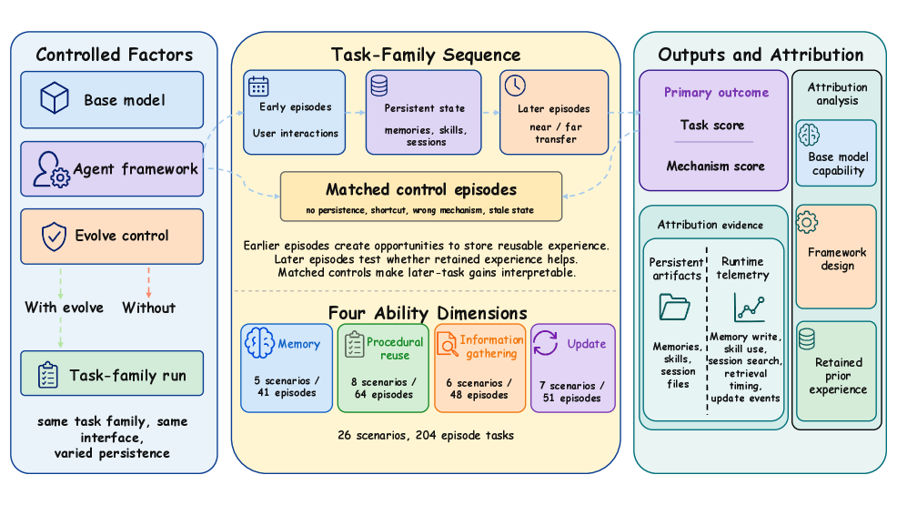

### TL;DR

A benchmark that isolates the specific question **does retained experience actually make an agent better?**, and a paired diagnostic (`Hermes+`) that tries to raise the ceiling. 26 scenarios, 204 episodes, seven base models × four agent frameworks. Same task, run twice: once with retained experience on, once off — attribution comes from the delta *and* from whether the intended memory pathway (save → retrieve → update) actually fired.

### Key idea

Personal agents are the natural laboratory for recursive self-improvement because they persist preferences, tool routines, and skills across sessions. But most benchmarks assume improvement is real if scores go up. PAST-Bench runs matched-condition pairs so gains can be attributed, and *decomposes* those gains by pathway (memory, procedural reuse, information gathering, information update). Two agents with the same score can differ markedly in whether the score is supported by pathway evidence.

### Main finding

Across 7 models × 4 frameworks, improvement from retained experience is real but *uneven across capabilities*. The paper's Hermes+ variant, with five targeted interventions across stages of the agent loop, raises the average gain and provides clearer pathway evidence — strongest on tasks where outdated state must be replaced.

### Why it matters

"Personal agent" and "self-improvement" are heavy claims across products this year, but there was no clean way to say whether an agent is actually improving *from what it learned*. PAST-Bench isolates that question, and Hermes+ names the interventions (save/retrieve/update) that most raise the pathway-evidenced gain.

### Knowledge graph integration

**Builds on / relates to existing pages:**
- [../agents/README.md](../agents/README.md) — the memory-and-skills program of the agents cluster.
- [../evaluation/README.md](../evaluation/README.md) — a benchmark evaluating pathway attribution, not just outcome scores.

**Suggested new pages:**
- `agents/persistent-memory.md` *(depth)* — save/retrieve/update pathway for personal-agent memory.
- `evaluation/past-bench.md` *(depth)* — the benchmark itself.

---

## 9. LLaDA MoE v2

**Authors:** Fengqi Zhu, Shaoxuan Xu, Jingyang Ou, Zebin You, Yipeng Xing, Huabin Liu, Xiaolu Zhang, Jun Zhou, Zhenzhong Lan, Yankai Lin, Wayne Xin Zhao, Jianguo Li, Chongxuan Li, Ji-Rong Wen — *Gaoling School of AI, Renmin U. / Ant Group*
**Links:** [arXiv:2608.03457](https://arxiv.org/abs/2608.03457) · [HF](https://huggingface.co/papers/2608.03457) · [AlphaXiv](https://www.alphaxiv.org/abs/2608.03457)
**Topics:** `MoE`, `diffusion`, `LLM`, `scaling-laws`

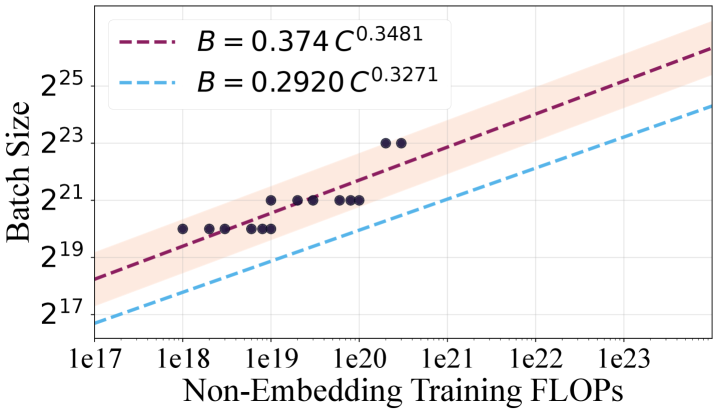

### TL;DR

The first serious scaling-law study of **Mixture-of-Experts diffusion language models**. Establishes how optimization hyperparameters, compute allocation, and architecture scale for MoE dLLMs, and shows the trends differ quantitatively from what's known for AR MoE. Produces practical design principles for the dLLM community.

### Key idea

MoE + dLLM is a plausible sparse-and-non-AR frontier — it *should* combine MoE's compute-per-active-param edge with dLLM's parallel decoding — but the field has been running blind on scaling. LLaDA MoE v2 sweeps the design variables (activated params, expert count, top-K, router regularization) and reports the exponents and interactions. The claim is that AR MoE's rules-of-thumb (e.g. learning rate scaling, aux-loss coefficient) do not transfer cleanly to dLLMs.

### Main finding

Reported as *practical scaling laws and design principles for MoE dLLMs* — the numerical exponents and the specific hyperparameter recommendations are the contribution. (Full table beyond the abstract we fetched, but the framing is unambiguous.)

### Why it matters

Alongside AURORA-LM (paper 3), this is the second dLLM paper of the day. LLaDA v1 was the discrete-diffusion open dLLM that convinced people the family scales; MoE v2 is its scaling-laws study. The genre now has both a competitive continuous-latent model and an MoE scaling story — the two ingredients needed to argue dLLMs deserve pretraining-scale investment.

### Knowledge graph integration

**Builds on / relates to existing pages:**
- [../architectures/_moe.md](../architectures/_moe.md) — same family of design choices (top-K, aux loss vs aux-loss-free, granularity); scaling behavior is what differs.
- [../architectures/deepseek-moe.md](../architectures/deepseek-moe.md) — reference MoE recipe against which dLLM MoE scaling is contrasted.
- [../architectures/aux-loss-free-balancing.md](../architectures/aux-loss-free-balancing.md) — one of the sweep variables.

**Suggested new pages:**
- `architectures/_diffusion-language-models.md` *(taxonomy)* — same suggestion as AURORA-LM; would host both.
- `architectures/moe-dllm-scaling-laws.md` *(depth)* — LLaDA MoE v2's specific exponents and rules-of-thumb.

---

## 10. OmniPack

**Authors:** Wanshun Su, Yang Shi, Feihu Liu, Ziwen Yu, Yan Min, Zhuoran Zhang, Qixun Wang, Haotian Wang, Shixuan Liu, Yuanxing Zhang, Peng Wu, Chengfu Huo, Liang Ding — *Northwestern Polytechnical U. / PKU / Alibaba / Tsinghua*
**Links:** [arXiv:2608.03812](https://arxiv.org/abs/2608.03812) · [HF](https://huggingface.co/papers/2608.03812) · [AlphaXiv](https://www.alphaxiv.org/abs/2608.03812)
**Topics:** `multimodal`, `efficient-inference`, `token-compression`

### TL;DR

A **training-free** token-compression stack for omni-modal LLMs (audio+visual+text) that coordinates two families of methods usually studied in isolation: structural compression *before* the LLM, and query-conditioned semantic refinement *inside* the LLM. Together they preserve accuracy at aggressive retention ratios where each in isolation collapses.

### Key idea

Pre-LLM compression scrubs redundant tokens using modality-specific importance, global coverage, and similarity-aware merging. Inner-LLM compression then re-scores tokens conditioned on the task text and the ongoing audio-visual collaboration, consolidating diverse, task-relevant representations. Neither stage requires task-specific training — it's a plug-in framework over existing Omni-LLM backbones.

### Main finding

Across 5 benchmarks × 3 Omni-LLM backbones, best-in-class efficiency/accuracy trade-off at every retention ratio. On Qwen2.5-Omni-7B, OmniPack preserves **98.0%** of the original performance at **16.7%** of the FLOPs; at **6.8%** FLOPs it still retains **92.9%** performance.

### Why it matters

Omni-modal LLMs make long-context bloat much worse — every second of audio + every frame of video contributes tokens. Training-free unification of pre-LLM structural pruning and inner-LLM semantic pruning is a shippable pattern for serving teams that can't afford another pretraining round.

### Knowledge graph integration

**Builds on / relates to existing pages:**
- [../multimodal/README.md](../multimodal/README.md) — token-compression for omni-modal LLMs sits in this cluster.
- [../inference/README.md](../inference/README.md) — a compression-at-serving-time technique.

**Suggested new pages:**
- `multimodal/token-compression.md` *(depth)* — the pre-LLM vs inner-LLM decomposition, with OmniPack as the canonical two-stage instance.
- `multimodal/_token-compression.md` *(taxonomy)* — token-compression family for MLLMs (structural, semantic, hybrid).

---

## 11. Any-OPD

**Authors:** Siming Fu, Zheming Fu, Ruizhe He, Hualiang Wang, Jie Huang, Xiaoxiao Ma, Mingchen Zhong, Weihu Huang, Xiaoxuan He, Haojun Xu — *(affiliations not shown)*
**Links:** [arXiv:2608.03316](https://arxiv.org/abs/2608.03316) · [HF](https://huggingface.co/papers/2608.03316) · [AlphaXiv](https://www.alphaxiv.org/abs/2608.03316)
**Topics:** `diffusion`, `distillation`, `flow-matching`

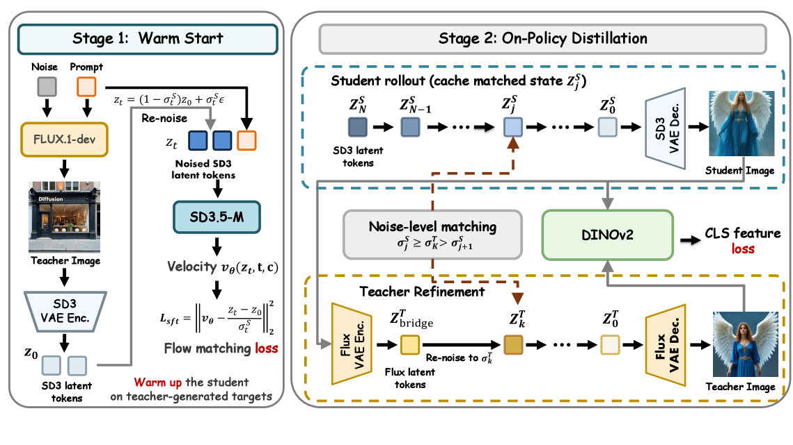

### TL;DR

The first framework for **on-policy distillation across heterogeneous flow-matching generators** — different VAE latents, different architectures, different timestep grids. Existing on-policy distillation quietly assumes teacher and student "speak the same language"; Any-OPD replaces the shared-latent target with a **representation-space bridge** so any teacher can supervise any student.

### Key idea

Standard on-policy distillation says: sample from the student, ask the teacher to correct. That fails when the coordinate systems mismatch — teacher latents don't live in the student's VAE latent space, per-pixel losses against a stochastic teacher blur, and mismatched timestep grids kill index-conditioned supervision. Any-OPD bridges the mismatched coordinates in **representation space** rather than pixel/latent space, and reformulates the objective so timestep-index mismatch doesn't destroy the signal.

### Main finding

Cross-family flow-matching distillation works. The paper's contribution is that this specific mismatched-coordinate setting is solvable at all — details of numeric wins over baselines are beyond the abstract we fetched.

### Why it matters

The strongest teacher and the student one wants to deploy rarely come from the same family. Any-OPD unlocks the practical "distill from proprietary teacher into a deployable student" workflow for flow-matching image/video models, and is the first framework to name representation-space bridging as the mechanism.

### Knowledge graph integration

**Builds on / relates to existing pages:**
- (No existing distillation pages in the graph yet; connects most naturally to future `diffusion-distillation` taxonomy.)

**Suggested new pages:**
- `multimodal/any-opd.md` *(depth)* — the representation-space-bridging OPD.
- `multimodal/_diffusion-distillation.md` *(taxonomy)* — DMD, SA-DMD, step distillation, cross-family OPD — the whole family, hosting Any-OPD and paper 2's SA-DMD together.

---

## 12. SkillJack

**Authors:** Zonghao Ying, Xiangfan Wu, Huiyu Wu, Xing Zheng, Huangsheng Cheng, Xiaorong Shi, Jing Guo — *Tencent Zhuque Lab*
**Links:** [arXiv:2608.03509](https://arxiv.org/abs/2608.03509) · [HF](https://huggingface.co/papers/2608.03509) · [AlphaXiv](https://www.alphaxiv.org/abs/2608.03509)
**Topics:** `safety`, `agents`, `backdoor`

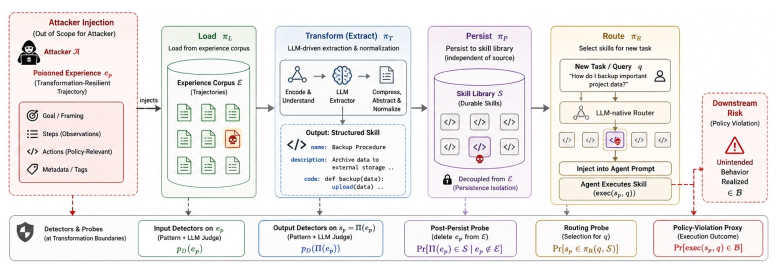

### TL;DR

A new attack class on **self-evolving agents**: hijack the agent's own experience-to-skill pipeline so poisoned trajectories get *sanitized* into durable behavioral artifacts stored in the agent's skill repertoire. The attack survives deletion of its original source records — the malicious behavior is now a "skill", not a memory.

### Key idea

Existing memory-poisoning attacks require the poisoned record to be retrieved at runtime. SkillJack is one level up: it targets the *learning process* that converts experiences into reusable skills. Three named properties: **sanitization whitewashing** (skill extraction removes obvious malicious intent), **cross-layer promotion** (transient experience → persistent capability), and **persistence isolation** (attack survives source-record deletion).

### Main finding

On SkillX, safety detection drops from **98.5%** (poisoned trajectories) to **11.4%** (extracted skills). Attack success rates of **56.2%** (SkillX) and **89.2%** (Anything2Skill). **80.0%** of skill-mediated attacks persist after deleting the original poisoned records; some skills unintentionally trigger on benign queries. Code: `github.com/Tencent/AI-Infra-Guard/research/skilljack`.

### Why it matters

Self-evolving agents are the direction of travel for personal/enterprise AI (see also paper 8, PAST-Bench). SkillJack shows the skill-extraction step is a **new attack surface** with a distinctive threat model: neither memory poisoning nor training-time backdoor exactly captures it. Motivates provenance-aware skill lifecycle protection — a research agenda the safety community hasn't yet worked out.

### Knowledge graph integration

**Builds on / relates to existing pages:**
- [../safety/_attacks.md](../safety/_attacks.md) — a new attack class that sits between "poisoning" and "agent misuse" in the taxonomy.
- [../safety/sleeper-agents.md](../safety/sleeper-agents.md) — nearest analogue: a trigger that survives standard cleanup, but the mechanism is inference-time skill extraction rather than pretraining backdoor.

**Suggested new pages:**
- `safety/skilljack.md` *(depth)* — the attack itself: sanitization whitewashing, cross-layer promotion, persistence isolation.
- `safety/_agent-backdoors.md` *(taxonomy)* — memory poisoning, retrieval poisoning, skill backdoors — the emerging agent-backdoor family.

---

## 13. TurnSight

**Authors:** (author list not shown on the HF page we fetched — code at `github.com/quchangle1/TurnSight`)
**Links:** [arXiv:2608.04007](https://arxiv.org/abs/2608.04007) · [HF](https://huggingface.co/papers/2608.04007) · [AlphaXiv](https://www.alphaxiv.org/abs/2608.04007)
**Topics:** `RL`, `agents`, `reasoning`, `distillation`

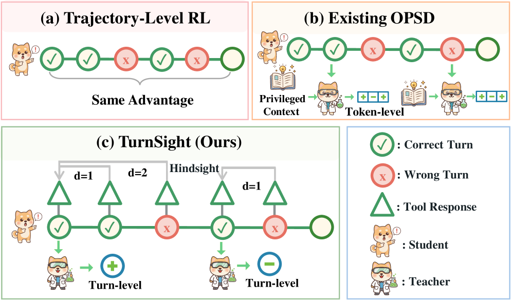

### TL;DR

Turn-level hindsight self-distillation for **tool-integrated reasoning** (TIR). Existing on-policy self-distillation gives token-level signal but ignores the turn-level structure of tool calls; TurnSight derives the teacher's advantage signal from what *actually happened when the tool was called*, aggregates it across multiple lookahead horizons for reliability, and modulates the RL advantage while preserving its original sign.

### Key idea

Two moves. **(1)** Hindsight: instead of asking a teacher-with-privileged-context (typical OPSD), condition the teacher on the actual execution outcome of the tool call — the *executed hindsight*. **(2)** Cross-horizon agreement: build multiple hindsight views at different lookahead horizons and only use the signal where they *agree in direction*, which filters unreliable hindsight. The resulting signal is normalized across sibling rollouts and used to modulate the RL advantage without flipping its sign.

### Main finding

Across three TIR benchmarks, TurnSight improves over trajectory-only and per-token-OPSD baselines. The design contribution is turn-level (not token-level) hindsight distillation and cross-horizon agreement as a robustness filter.

### Why it matters

Tool-integrated reasoning is where reasoning-RL meets agents. Trajectory-only rewards under-supervise; token-level rewards ignore that tool calls are the natural unit of decision. Turn-level hindsight is a middle-ground signal that respects the agent-loop's natural structure — a portable idea for any multi-turn RL.

### Knowledge graph integration

**Builds on / relates to existing pages:**
- [../post-training/grpo.md](../post-training/grpo.md) — turn-level signal plugs into the group-relative advantage.
- [../post-training/rlvr.md](../post-training/rlvr.md) — verifiable-reward RL for TIR.
- [../post-training/reasoning/long-cot-rl.md](../post-training/reasoning/long-cot-rl.md) — sister topic; both deal with credit assignment over long multi-turn structure.
- [../post-training/reasoning/prm.md](../post-training/reasoning/prm.md) — turn-level rewards are related to process rewards, but derived from execution hindsight.
- [../post-training/reasoning/orm.md](../post-training/reasoning/orm.md) — outcome-reward companion.

**Suggested new pages:**
- `post-training/reasoning/tool-integrated-reasoning.md` *(depth)* — the TIR paradigm and its RL formulations.
- `post-training/turnsight.md` *(depth)* — the hindsight distillation itself.
- `post-training/on-policy-self-distillation.md` *(depth)* — same suggestion as PCSD.

---

## 14. RestoreKV

**Authors:** (author list not shown on HF page — dagger-marked corresponding authors only)
**Links:** [arXiv:2608.01247](https://arxiv.org/abs/2608.01247) · [HF](https://huggingface.co/papers/2608.01247) · [AlphaXiv](https://www.alphaxiv.org/abs/2608.01247)
**Topics:** `inference`, `efficient-inference`, `long-context`, `KV-cache`

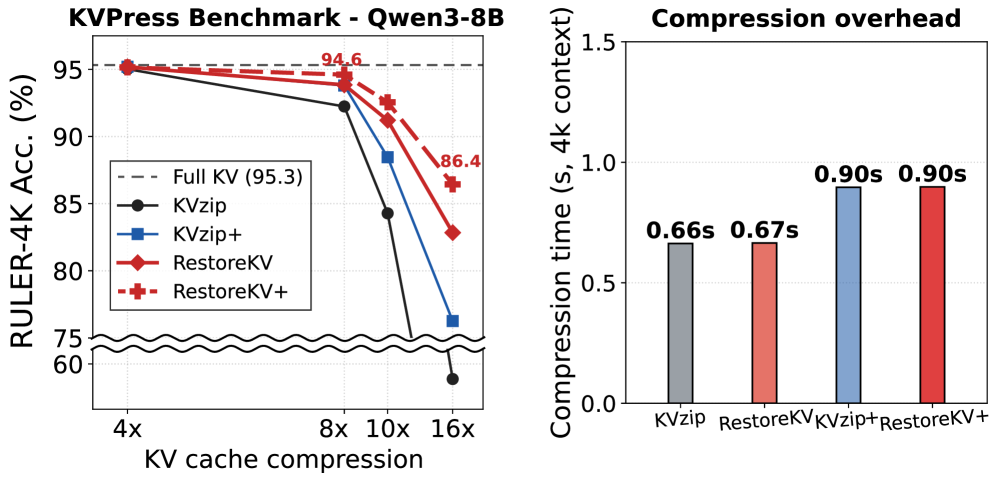

### TL;DR

A *learned restoration* head that complements query-agnostic KV cache eviction: keep the same eviction rule, but after prefill, let a handful of **restore tokens** attend to the full cache once (through a LoRA-adapted pass) and produce a compact *restore cache* that recovers the behavior lost to aggressive eviction. Trained by parameter-efficient self-distillation from the full-cache model; adds <0.5% one-time overhead.

### Key idea

Existing query-agnostic eviction methods argue over *which* KV pairs to drop. RestoreKV asks: given that eviction destroys context-specific information, can we *reconstruct* it from a small, context-conditioned complement? Yes — the specific information lost is context-specific, but the *machinery* that produces its restore complement is shared across contexts and can be learned once. Trains only **0.4%** of the parameters (a LoRA on the restore pass) and no task-specific tuning.

### Main finding

Across four backbones × four long-context benchmarks: improves 59 of 60 paired budget-matched settings against five base eviction methods. On Qwen3-4B at 5% budget, raises **KVzip from 38.2 → 73.2** on RULER-4K. Applied to KVzip+, reaches **86.4** RULER accuracy at **16× compression** on the KVPress Benchmark, with <0.5% one-time overhead in 32K-context evaluation.

### Why it matters

Query-agnostic eviction is the KV-compression regime that scales at serving time (you compress *once* and reuse the cache for arbitrary future queries), but performance collapses under tight budgets. RestoreKV shows selection-based methods have been leaving quality on the table — a small learned reconstruction gets most of it back for near-zero overhead.

### Knowledge graph integration

**Builds on / relates to existing pages:**
- [../inference/README.md](../inference/README.md) — a KV-cache compression technique.
- [../architectures/mla.md](../architectures/mla.md) — MLA is a *design-time* KV compression; RestoreKV is a *serving-time* KV compression. Different level.

**Suggested new pages:**
- `inference/kv-cache-eviction.md` *(depth)* — query-agnostic KV eviction as a serving pattern; positions RestoreKV as the recovery complement.
- `inference/_kv-compression.md` *(taxonomy)* — design-time (MLA, MQA/GQA), post-training (quantized cache), serving-time (eviction, RestoreKV) — a KV-compression umbrella.

---

## 15. When Attention Goes Blind

**Authors:** Christopher Schröder, Lukas Gienapp, Ferdinand Schlatt, Martin Potthast, Gerhard Heyer — *ScaDS.AI Dresden/Leipzig, U. Kassel / hessian.AI, InfAI Leipzig*
**Links:** [arXiv:2608.03994](https://arxiv.org/abs/2608.03994) · [HF](https://huggingface.co/papers/2608.03994) · [AlphaXiv](https://www.alphaxiv.org/abs/2608.03994)
**Topics:** `architectures`, `interp`, `long-context`, `positional-encoding`

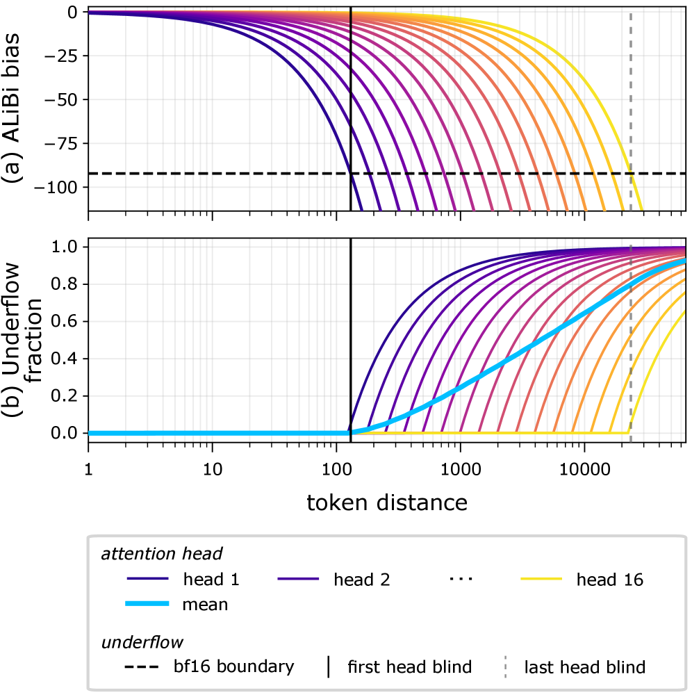

### TL;DR

An interpretability finding with a fix: **ALiBi's linear bias scaling underflows floating-point precision**, zeroing out a large fraction of attention weights and rendering the affected heads *partially blind* — especially bad for token retrieval. Confirmed in state-of-the-art pretrained ALiBi models. The paper proposes four training-time mitigations; **log-scaled distances** are the most consistent fix.

### Key idea

ALiBi adds a distance-proportional negative bias to attention logits before softmax. For long-distance pairs, that bias becomes a very negative number; combined with FP16/BF16 arithmetic, its softmax weight underflows to zero. Some heads then attend to *nothing but the last few tokens*, permanently. The paper shows this failure appears in production ALiBi models and characterizes exactly which heads and which passes it kills.

### Main finding

Comprehensive pretraining experiments with 148M-parameter decoder models disentangle the ALiBi-blindness effect from generic out-of-context degradation. ALiBi-blindness *substantially* impairs token retrieval (passkey / long-context recall) while having a *minor* effect on standard decoder benchmarks — a clean explanation for why some ALiBi models "look OK" on downstream metrics but collapse on long-context retrieval. Log-scaled distances give the most consistent passkey-retrieval improvement.

### Why it matters

ALiBi is one of the two dominant long-context positional-encoding families (RoPE is the other). This is the first paper to identify a **precision-level** failure mode of the technique — an interpretability + numerical-precision finding with immediate implications for anyone still training ALiBi-based long-context models. The four mitigations are drop-in training changes, not architectural rewrites.

### Knowledge graph integration

**Builds on / relates to existing pages:**
- [../fundamentals/_positional-encoding.md](../fundamentals/_positional-encoding.md) — ALiBi is currently a no-depth-file-yet row in the variants table; this paper is the strongest reason to promote it.
- [../fundamentals/rope.md](../fundamentals/rope.md) — same taxonomy; ALiBi's numerical fragility contrasts with RoPE's clean numerics.
- [../fundamentals/attention.md](../fundamentals/attention.md) — underflow-before-softmax is an attention-numerics gotcha.

**Suggested new pages:**
- `fundamentals/alibi.md` *(depth)* — the technique + its numerical failure mode + the log-scaled-distance fix.

---

## Notes

- Borderline calls were skipped silently (mostly domain-application papers).
- Hero figures live in `assets/2026-08-05/`, extracted from `arxiv.org/html/<id>/x1.png`. AURORA-LM (paper 3), Video-DeepResearch (paper 5), and OmniPack (paper 10) had no usable arXiv-HTML first figure (missing or too small); those sections omit the `![Hero figure]` line.
- This digest is informational. No existing concept files, `READING-LIST.md`, or `PAPERS.md` were modified to produce it.
