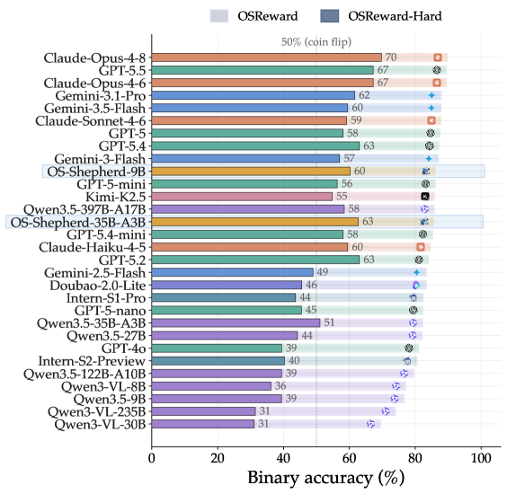
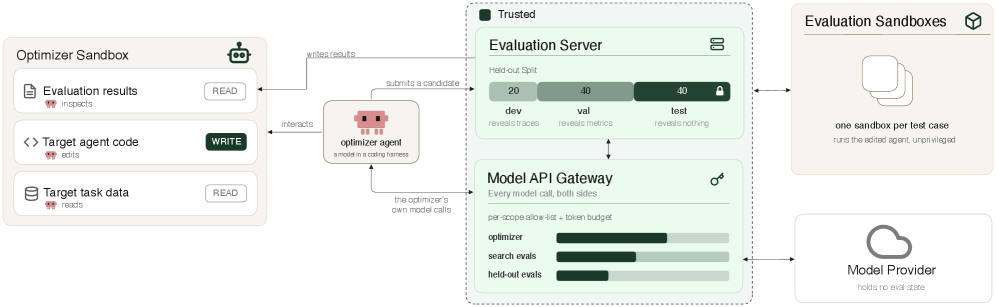
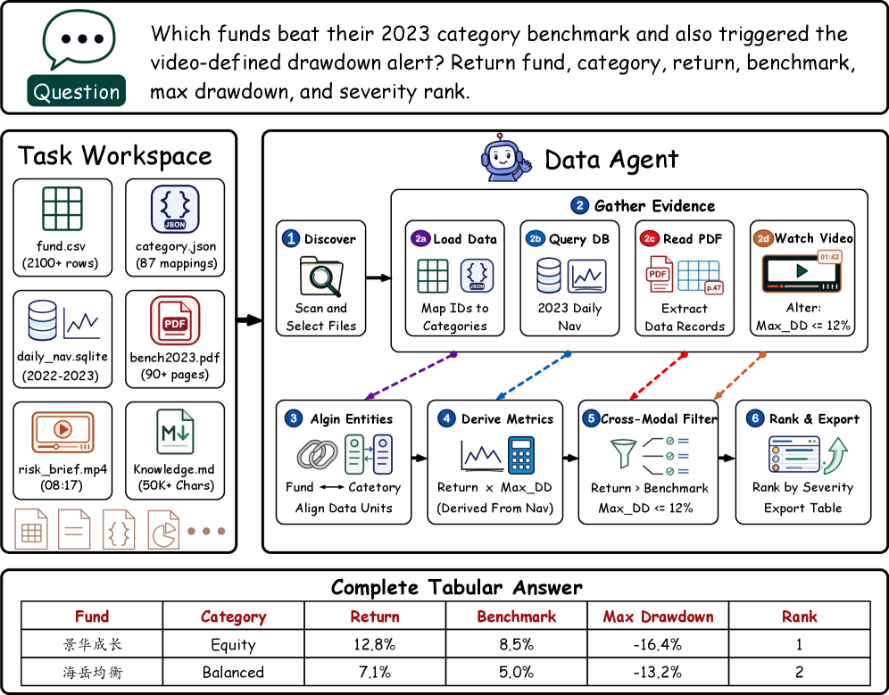
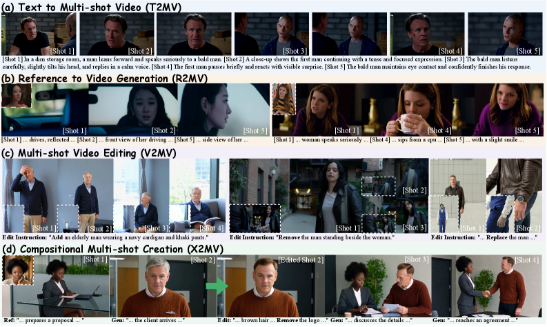
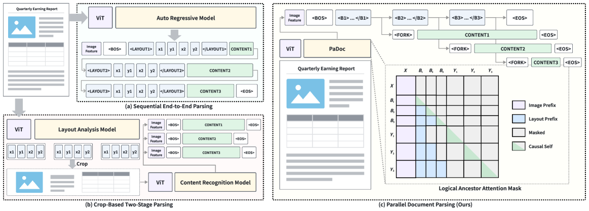
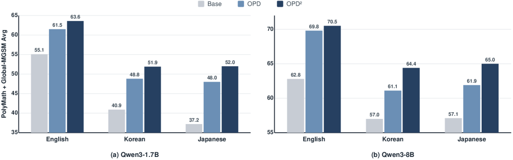

# Daily AI papers — 2026-08-07

*Curated from HF Daily Papers. 15 of ~30 papers kept after relevance filter.*

## Papers at a glance

| # | Title | Topics | Org |
| --- | --- | --- | --- |
| 1 | [AgentOPSD: Recursive Self-Distillation for Agentic RL](#1-agentopsd) | `RL`, `agents`, `reasoning` | Tsinghua / Zhejiang / Meituan |
| 2 | [OSReward: Standardized Evaluation for Cross-Platform Computer-Use Reward Models](#2-osreward) | `agents`, `eval`, `reward-model` | HKU / XJTU / Nanjing |
| 3 | [EnvACE: World Rehearsal for Agentic RL](#3-envace) | `RL`, `agents`, `world-model` | SJTU / Tencent |
| 4 | [HarnessOpt-Bench: Evaluating LLMs at Harness Optimization](#4-harnessopt-bench) | `eval`, `agents` | Scale AI |
| 5 | [DataSpace: Benchmarking Data Agents for Verifiable Analytics](#5-dataspace) | `agents`, `eval`, `multimodal` | HKUST(GZ) / Tsinghua |
| 6 | [UniME-R1: Retrieval-Centric CoT via Hard Negatives for Multimodal Retrieval](#6-unime-r1) | `multimodal`, `retrieval`, `reasoning` | DeepGlint-AI |
| 7 | [KVAE: Family of Tokenizers for Multimodal Generative Models](#7-kvae) | `diffusion`, `multimodal`, `tokenizer` | Kandinsky Lab |
| 8 | [ContextMaster: Sparse Context Routing for Interactive Multi-Shot Video](#8-contextmaster) | `diffusion`, `video`, `efficient-inference` | Tsinghua / Kling / Kuaishou |
| 9 | [PaDoc: Layout-Grounded Parallel Decoding for Document Parsing](#9-padoc) | `efficient-inference`, `multimodal` | Tsinghua / (industry) |
| 10 | [On-Policy Delta Distillation for Multilingual Math Reasoning](#10-opd2) | `distillation`, `reasoning`, `multilingual` | (unspecified) |
| 11 | [WorldClaw: Agentic 3D Open-World Generation at Scale](#11-worldclaw) | `agents`, `diffusion`, `3D` | Tencent |
| 12 | [GST-Bench: Can VLMs Develop Global Spatial Awareness from Video?](#12-gst-bench) | `multimodal`, `eval`, `VLM` | ByteDance Seed / ZJU / NUS |
| 13 | [ChronoVision: Temporal Reasoning via Latent State Reconstruction](#13-chronovision) | `multimodal`, `reasoning`, `RL` | (unspecified) |
| 14 | [Teaching Nemotron Greek: Corpus, Retrieval, Grounded Generation](#14-nemotron-greek) | `data`, `multilingual`, `retrieval` | (multi-author) |
| 15 | [Task-Conditional Flow Matching for Multilingual Embedding Adaptation](#15-tcfm) | `embedding`, `flow-matching`, `multilingual` | IIT Gandhinagar |

---

## 1. AgentOPSD

**Authors:** Zi-Han Wang, Zhengxi Lu, Zhiyuan Yao, Jinyang Wu, et al. — *Tsinghua / Zhejiang / Meituan*
**Links:** [arXiv:2608.05987](https://arxiv.org/abs/2608.05987) · [HF](https://huggingface.co/papers/2608.05987) · [AlphaXiv](https://www.alphaxiv.org/abs/2608.05987)
**Topics:** `RL`, `agents`, `reasoning`

### TL;DR

A critic-free credit-assignment recipe for multi-turn agent RL. Aggregates token-level teacher–student log-prob gaps into per-turn evidence, then does a recursive Bayesian update in log-odds space to identify which turns actually drove the outcome. Drops into GRPO without extra rollouts.

### Key idea

Privileged self-distillation gives you a dense per-token signal, but sparse outcome rewards only care about turns. AgentOPSD sums the token-level gaps *within each turn* to produce turn-level evidence and applies a running Bayesian log-odds update so the "pivotal turn" score depends on the whole preceding history — not on a fixed windowed heuristic. The result is a turn-level reweighting term stapled onto standard policy optimization.

### Main finding

On ALFWorld, WebShop, and Search-QA with Qwen2.5-3B and 7B, AgentOPSD beats GRPO and strong self-distillation baselines. Reaches 89.1% success on ALFWorld with 7B. Ablations attribute the gains to turn-level aggregation and the history-dependent recursive update rather than the raw distillation signal.

### Why it matters

Long-horizon agentic RL is bottlenecked by outcome sparsity; every recent recipe (GiGPO, ARPO, T-GRPO) invents its own turn-credit scheme. AgentOPSD is a clean, critic-free alternative that piggybacks on a teacher instead of a learned value head — a route worth having as a baseline in the credit-assignment zoo.

### Knowledge graph integration

**Builds on / relates to existing pages:**
- [../post-training/grpo.md](../post-training/grpo.md) — drops in as a per-turn reweighter on top of the standard GRPO objective.
- [../post-training/_rl.md](../post-training/_rl.md) — new entry in the credit-assignment taxonomy for LLM agents.
- [../post-training/rejection-sampling.md](../post-training/rejection-sampling.md) — same "use a teacher to select the good stuff" spirit, applied at the credit level rather than the trajectory level.
- [../systems/partial-rollouts.md](../systems/partial-rollouts.md) — related because both target rollout-cost efficiency in agentic RL.

**Suggested new pages:**
- `post-training/agent-credit-assignment.md` *(taxonomy)* — covers per-turn credit schemes for agent RL (GiGPO, T-GRPO, ARPO, AgentOPSD).
- `post-training/agentopsd.md` *(depth)* — recursive Bayesian log-odds turn credit.

---

## 2. OSReward

**Authors:** Kanzhi Cheng, Yian Wang, Bowen Yang, Hang Yan, et al. — *HKU / XJTU / Nanjing / USTC / NUS / Fudan*
**Links:** [arXiv:2607.28609](https://arxiv.org/abs/2607.28609) · [HF](https://huggingface.co/papers/2607.28609) · [AlphaXiv](https://www.alphaxiv.org/abs/2607.28609)
**Topics:** `agents`, `eval`, `reward-model`

### TL;DR

A standardized benchmark for reward models used to grade computer-use agent trajectories across desktop, mobile, and web platforms. Introduces a unified task/label schema, cross-platform test suites, and comparison protocols so that "which RM should I use for agent RL" becomes an answerable question.

### Key idea

Computer-use RMs are proliferating (per-step correctness, trajectory verifiers, LLM judges) but each paper evaluates them on its own platform-specific harness. OSReward defines a single grading protocol: for each trajectory step it exposes a screenshot, action, and outcome to the RM and scores accuracy against human-labeled ground truth, then aggregates per-platform to detect brittleness under distribution shift.

### Main finding

The paper is a benchmark contribution — it shows large accuracy gaps between generalist LLM judges and specialized RMs, and identifies cross-platform generalization (train on web, test on mobile) as the biggest failure mode. Concrete numbers per model are in the paper.

### Why it matters

Agent RL is only as reliable as the RM that scores its rollouts. Without a shared RM benchmark, published agent-RL gains are hard to trust — and hard to compare. OSReward is the analogue of RewardBench for computer-use.

### Knowledge graph integration

**Builds on / relates to existing pages:**
- [../post-training/_rewards.md](../post-training/_rewards.md) — extends the reward-model taxonomy toward trajectory-level graders.
- [../post-training/cot-reward-model.md](../post-training/cot-reward-model.md) — computer-use RMs are the multimodal, action-grounded cousin of CoT RMs.
- [../evaluation/README.md](../evaluation/README.md) — new benchmark, belongs in the eval index.

**Suggested new pages:**
- `evaluation/osreward.md` *(depth)* — benchmark for computer-use reward models.
- `post-training/computer-use-reward-model.md` *(depth)* — the class of RMs OSReward is grading.

---

## 3. EnvACE

**Authors:** Zishan Xu, Zhiyuan Yao, Yuxin Chen, Yifu Guo, et al. — *SJTU / ZJU / NUS / Tencent*
**Links:** [arXiv:2608.06197](https://arxiv.org/abs/2608.06197) · [HF](https://huggingface.co/papers/2608.06197) · [AlphaXiv](https://www.alphaxiv.org/abs/2608.06197)
**Topics:** `RL`, `agents`, `world-model`

### TL;DR

Replaces the external environment during agentic RL with **world rehearsal**: the policy generates a tool call, then plays the environment to hallucinate the response, then conditions on the rehearsed response for the next decision — all end-to-end trainable with task-success reward. Yields an agent that carries its world model inside its weights.

### Key idea

Alternating role assignment. On even turns the model acts; on odd turns it *is* the environment, producing the tool-response text that would follow. Both roles are optimized jointly against the outcome reward, so the model learns environment dynamics implicitly. At test time the same model can privately rehearse candidate actions before committing, giving MCTS-style deliberation without an external simulator.

### Main finding

Across BFCL-v4, τ²-Bench, VitaBench, and FinMCP-Bench, EnvACE beats environment-scaling baselines. Test-time private rehearsal (a modest sample budget) gives further gains without any external tool calls. Improvements hold across model sizes.

### Why it matters

Executable environments are the pacing constraint on agent RL — every recipe needs a docker fleet or a tool-call proxy. Internalizing the environment as an in-weights world model turns training into pure policy compute, and reframes rollout scaling as a data-quality problem instead of a devops problem.

### Knowledge graph integration

**Builds on / relates to existing pages:**
- [../post-training/grpo.md](../post-training/grpo.md) — trained end-to-end with GRPO-style outcome rewards.
- [../post-training/_rl.md](../post-training/_rl.md) — new entry in the RL-for-agents family.
- [../post-training/rl-prompt-curation.md](../post-training/rl-prompt-curation.md) — the world-model self-generates the "environment response" prompts.

**Suggested new pages:**
- `post-training/world-rehearsal.md` *(depth)* — model-as-environment training for agent RL.
- `agents/agent-world-model.md` *(depth)* — implicit in-weights world models for LLM agents.

---

## 4. HarnessOpt-Bench

**Authors:** Apaar Shanker, Yash Maurya, Shehab Yasser, Vijay S. Kalmath, Veronica Chatrath, Yuan (Emily) Xue — *Scale AI*
**Links:** [arXiv:2608.06301](https://arxiv.org/abs/2608.06301) · [HF](https://huggingface.co/papers/2608.06301) · [AlphaXiv](https://www.alphaxiv.org/abs/2608.06301)
**Topics:** `eval`, `agents`

### TL;DR

A benchmark for LLMs *as harness optimizers*: given a seed agent harness (prompts, tools, control flow) and a graded evaluation with a fixed budget, an optimizer LLM must edit the harness and nominate a final candidate that beats the seed on a held-out test partition. Trusted execution enforces the eval boundary.

### Key idea

Frame "how good is your model at improving an agent scaffold?" as an evaluation-guided, budgeted search — separate from the target task. The optimizer gets partial noisy feedback but never touches the held-out score; a sandbox meters target-agent resource use so different optimizers are compared under matched compute. Runs each optimizer both in its native harness and in a shared coding harness to isolate model vs harness effects.

### Main finding

5 frontier LLMs across 4 tasks (111 scored runs). Optimizer model matters more than the coding harness they act through. Native harnesses aren't uniformly better than the shared one. Gains vary wildly by task and seed regime — no single winner, but the capability is measurable and discriminative.

### Why it matters

"Harness optimization" is where a lot of production agent quality actually comes from — but it's mostly informal today. HarnessOpt-Bench turns it into a leaderboard capability, and its cross-harness protocol lets you tell "the model is smart" from "the harness is well-designed."

### Knowledge graph integration

**Builds on / relates to existing pages:**
- [../evaluation/README.md](../evaluation/README.md) — new agent-capability benchmark, belongs here.
- [../agents/README.md](../agents/README.md) — harness is the object being optimized.
- [../post-training/rl-prompt-curation.md](../post-training/rl-prompt-curation.md) — related: harness edits are large-scope prompt edits.

**Suggested new pages:**
- `evaluation/harnessopt-bench.md` *(depth)* — benchmark for LLM harness optimization.
- `agents/agent-harness.md` *(depth)* — the concept of an "agent harness" (prompt + tools + control flow + memory).

---

## 5. DataSpace

**Authors:** Boyan Li, Zhuowen Liang, Yupeng Xie, Xiaotian Lin, et al. — *HKUST(GZ) / Tsinghua*
**Links:** [arXiv:2608.03451](https://arxiv.org/abs/2608.03451) · [HF](https://huggingface.co/papers/2608.03451) · [AlphaXiv](https://www.alphaxiv.org/abs/2608.03451)
**Topics:** `agents`, `eval`, `multimodal`

### TL;DR

410 tasks where a data agent must produce verifiable tabular results from workspaces mixing CSV, JSON, SQLite, Markdown, PDF, and video (15 GB total). Grading uses deterministic column/type/order-aware normalization, so answers are actually machine-checkable rather than LLM-judged.

### Key idea

Two pieces. (1) A construction pipeline (DataSpace-Builder) with cross-language transformation, constraint-aware sampling, and human review, so every task has an executable ground-truth answer. (2) A grading protocol that handles header renames, unit and precision drift, and order sensitivity so equivalent-but-different tables score the same. Fixes the classic "correct answer, wrong format → 0" trap of tabular benchmarks.

### Main finding

Six multimodal models across five agent harnesses. Best system scores 66.34% overall. Joins across sources and multimodal-evidence integration (reading a chart image, joining to a CSV) are the sharpest bottlenecks.

### Why it matters

Data-analysis agents are the shortest path to real-world enterprise value for LLMs, but every prior benchmark either grades on text similarity or restricts to a single file type. DataSpace makes end-to-end multimodal analytics measurable — and its grading protocol is reusable for any tabular agent benchmark.

### Knowledge graph integration

**Builds on / relates to existing pages:**
- [../evaluation/README.md](../evaluation/README.md) — new agentic-analytics benchmark.
- [../agents/README.md](../agents/README.md) — the target capability.
- [../data/_data-curation.md](../data/_data-curation.md) — DataSpace-Builder is a data-curation pipeline in its own right.

**Suggested new pages:**
- `evaluation/dataspace.md` *(depth)* — the benchmark.
- `evaluation/deterministic-tabular-grading.md` *(depth)* — the header/type/order-invariant grader as a reusable pattern.

---

## 6. UniME-R1

**Authors:** Zelong Sun, Jun Wang, Kaicheng Yang, Tiancheng Gu, Ziyong Feng, Zhiwu Lu — *DeepGlint-AI*
**Links:** [arXiv:2608.06060](https://arxiv.org/abs/2608.06060) · [HF](https://huggingface.co/papers/2608.06060) · [AlphaXiv](https://www.alphaxiv.org/abs/2608.06060)
**Topics:** `multimodal`, `retrieval`, `reasoning`

### TL;DR

An embedder-adviser framework for unified multimodal retrieval where the CoT is conditioned on **retrieval feedback** (initially retrieved candidates + hard negatives), not on the query alone. The reasoning explains what the first-pass retriever got wrong, then rewrites the query representation so the second pass discriminates.

### Key idea

Standard CoT-augmented retrieval asks the model to think about the query. UniME-R1 asks it to think about the *misses* — the top-K candidates it initially fetched, especially the hardest negatives — and produce a Retrieval-Centric CoT (RC-CoT) whose gradients push the embedder to separate them. Failure-driven, adviser-in-the-loop refinement.

### Main finding

State-of-the-art on unified multimodal retrieval benchmarks; the gain comes disproportionately from confusable-pair discrimination, which is exactly the case query-only CoT misses.

### Why it matters

Retrieval CoT is a strong recent trend (GRIT, etc.), but almost all of it operates open-loop on the query. Grounding CoT in what the retriever actually returned is a small change that maps directly onto the "learn from failures" pattern that's been transformative in RL — and it's cheap to bolt onto any LVLM retriever.

### Knowledge graph integration

**Builds on / relates to existing pages:**
- [../multimodal/README.md](../multimodal/README.md) — multimodal retrieval belongs in the multimodal folder.
- [../data/quality-filtering.md](../data/quality-filtering.md) — hard-negative mining is closely related to quality filtering.

**Suggested new pages:**
- `multimodal/retrieval-centric-cot.md` *(depth)* — the RC-CoT recipe.
- `multimodal/multimodal-retrieval.md` *(taxonomy)* — the class of LVLM-based unified retrievers.

---

## 7. KVAE

**Authors:** Andrey Shutkin, Denis Parkhomenko, Ivan Kirillov, et al. — *Kandinsky Lab*
**Links:** [arXiv:2608.05798](https://arxiv.org/abs/2608.05798) · [HF](https://huggingface.co/papers/2608.05798) · [AlphaXiv](https://www.alphaxiv.org/abs/2608.05798)
**Topics:** `diffusion`, `multimodal`, `tokenizer`

### TL;DR

Open family of tokenizers spanning audio, image, and video for text-conditioned latent diffusion. KVAE-Audio does 48 kHz continuous compression to 64 channels @ 50 Hz; KVAE-3D provides two causal video tokenizers (4×16×16 and 4×8×8 compression); KVAE-2D handles images at 8× with 32 channels.

### Key idea

Ship a *consistent family* of VAEs across modalities with shared design language (causal 3D convs for video, high-channel latents for audio fidelity) so that a single text-to-latent diffusion stack can plug into any modality without per-modality retraining of the diffusion transformer.

### Main finding

Matches or surpasses frontier open-source tokenizers on reconstruction (PSNR, LPIPS, PESQ) and on generation FID/CLIP/CLAP, plus subjective side-by-side wins. Code and pretrained weights released.

### Why it matters

Latent tokenizers are the unsung bottleneck of the multimodal diffusion stack. Every downstream FID improvement compounds against a fixed VAE. An open, cross-modality tokenizer family lowers the fixed cost for anyone building a multimodal diffusion system on top.

### Knowledge graph integration

**Builds on / relates to existing pages:**
- [../multimodal/README.md](../multimodal/README.md) — cross-modality tokenizer suite, canonical multimodal infra.
- [../fundamentals/_tokenization.md](../fundamentals/_tokenization.md) — tokenizer taxonomy, though this is a continuous-latent VAE not a BPE-style tokenizer.

**Suggested new pages:**
- `multimodal/latent-tokenizer.md` *(taxonomy)* — VAE / VQ tokenizers for diffusion (image, video, audio).
- `multimodal/kvae.md` *(depth)* — the KVAE family.

---

## 8. ContextMaster

**Authors:** Zhengxuan Wei, Xinghui Li, Hanzhuo Huang, et al. — *Tsinghua / Kling / Kuaishou / SJTU / HKUST*
**Links:** [arXiv:2608.04956](https://arxiv.org/abs/2608.04956) · [HF](https://huggingface.co/papers/2608.04956) · [AlphaXiv](https://www.alphaxiv.org/abs/2608.04956)
**Topics:** `diffusion`, `video`, `efficient-inference`

### TL;DR

Unified video model that generates, reference-conditions, and edits across multiple shots while keeping the per-denoising-step context read cost bounded. Combines reusable clean context states with a fixed-budget sparse context router and a "ConstraintSink" that keeps task constraints visible. Trained with a two-stage privileged context distillation.

### Key idea

Long interactive video sessions blow up context cost because every new shot adds to history. ContextMaster caches per-shot latent context "states" and, at each denoising step, sparsely routes a *fixed budget* of context tokens through attention — so per-step cost is O(1) in history length. The ConstraintSink is a reserved routing slot for the current task's constraints so they aren't evicted. Privileged distillation transfers the full-context teacher behavior into this sparse student.

### Main finding

Improves task fulfillment and cross-shot consistency vs specialized generation/reference/editing baselines on IMVC (interactive multi-shot video creation) primitives. Runs at 16 FPS on a single GPU. User studies validate flexibly composed workflows.

### Why it matters

Every serious interactive video product hits the same wall: history grows, cost blows up. Fixed-budget sparse routing over a cached history is a general primitive for interactive generative-model UIs — and the distillation recipe for teaching a sparse student to imitate a dense teacher is transferable well beyond video.

### Knowledge graph integration

**Builds on / relates to existing pages:**
- [../inference/README.md](../inference/README.md) — sparse-context routing is an inference-side memory technique.
- [../post-training/reasoning/long2short.md](../post-training/reasoning/long2short.md) — same "distill a heavy model into a lighter behavior" spirit.

**Suggested new pages:**
- `multimodal/interactive-video-generation.md` *(depth)* — the IMVC setting and ContextMaster's recipe.
- `inference/sparse-context-routing.md` *(depth)* — fixed-budget sparse routing over a cached context.
- `post-training/privileged-context-distillation.md` *(depth)* — dense-teacher → sparse-student consistency distillation.

---

## 9. PaDoc

**Authors:** Hao Yu, Jiabo Zhan, Kang Liu, Linnan Zhao, et al. — *Tsinghua + industry*
**Links:** [arXiv:2608.06146](https://arxiv.org/abs/2608.06146) · [HF](https://huggingface.co/papers/2608.06146) · [AlphaXiv](https://www.alphaxiv.org/abs/2608.06146)
**Topics:** `efficient-inference`, `multimodal`

### TL;DR

Layout-grounded parallel decoder for document parsing. Predicts the page layout first, then decodes each region's content in parallel branches conditioned on a shared page prefix. Decoding depth becomes the longest layout→content path instead of the total content length.

### Key idea

End-to-end document parsers serialize the entire page into one autoregressive sequence; two-stage crop parsers get parallelism but pay repeated visual prefills. PaDoc has one visual prefill, one layout stream (a branching structure over the shared page representation), and then region branches decode concurrently. A region-sufficiency assumption justifies the prefix-conditioned factorization.

### Main finding

Removes cross-region autoregressive dependencies without sacrificing full-page context. Reduces decoding depth substantially compared to serial parsers; concrete latency and accuracy numbers in the paper.

### Why it matters

Document parsing is a canonical structured-output task and a strong stress test for parallel decoding. The "predict structure, then decode leaves in parallel" pattern generalizes to any output with a known DAG (JSON, code, tool-call arguments) — a nice complement to speculative decoding, which is structure-agnostic.

### Knowledge graph integration

**Builds on / relates to existing pages:**
- [../inference/README.md](../inference/README.md) — parallel decoding technique, belongs in the inference folder.
- [../multimodal/README.md](../multimodal/README.md) — vision-conditioned document understanding.

**Suggested new pages:**
- `inference/parallel-decoding.md` *(taxonomy)* — parallel decoding families (speculative, self-speculative, structured/layout-grounded).
- `inference/layout-grounded-parallel-decoding.md` *(depth)* — the PaDoc recipe.

---

## 10. OPD 2

**Authors:** Not disclosed on HF page.
**Links:** [arXiv:2608.05802](https://arxiv.org/abs/2608.05802) · [HF](https://huggingface.co/papers/2608.05802) · [AlphaXiv](https://www.alphaxiv.org/abs/2608.05802)
**Topics:** `distillation`, `reasoning`, `multilingual`

### TL;DR

An on-policy distillation variant for math reasoning: uses the **log-prob gap between a post-trained teacher and its own base model** — not the teacher's raw distribution — as the learning signal. Applied to English, Korean, and Japanese math with Qwen3.

### Key idea

Standard OPD matches the teacher's softmax. OPD 2 matches the *delta* the teacher moved from its base — i.e. what post-training actually taught the teacher — so the student inherits the training-induced shift without also inheriting the base model's idiosyncrasies. This isolates the transferrable reasoning gain.

### Main finding

OPD 2 consistently beats OPD on Korean and Japanese math with Qwen3, narrowing the English–Korean gap. English-only OPD helps Korean/Japanese too, but shifts responses toward English — a language-drift artifact. Preserving target language requires multilingual data in the distillation set.

### Why it matters

On-policy distillation is emerging as a lightweight alternative to RL for reasoning post-training. Delta distillation is a clean answer to "what part of the teacher should we copy" — and the multilingual observation (English-only distillation drifts responses toward English) is a warning shot for anyone building non-English reasoners.

### Knowledge graph integration

**Builds on / relates to existing pages:**
- [../post-training/_post-training.md](../post-training/_post-training.md) — OPD is an alternative to RL post-training for reasoning.
- [../post-training/grpo.md](../post-training/grpo.md) — same reasoning-post-training problem, different family.
- [../post-training/reasoning/long-cot-rl.md](../post-training/reasoning/long-cot-rl.md) — related target (math reasoning), different training signal.

**Suggested new pages:**
- `post-training/on-policy-distillation.md` *(depth)* — OPD as a distillation-based alternative to RL.
- `post-training/delta-distillation.md` *(depth)* — the OPD 2 teacher-minus-base signal.

---

## 11. WorldClaw

**Authors:** Project Leaders: Chunchao Guo, Yang Li — *Tencent (Kandinsky-style multi-contributor)*
**Links:** [arXiv:2608.05248](https://arxiv.org/abs/2608.05248) · [HF](https://huggingface.co/papers/2608.05248) · [AlphaXiv](https://www.alphaxiv.org/abs/2608.05248)
**Topics:** `agents`, `diffusion`, `3D`

*Borderline: kept because it treats scene generation as an agent pipeline and is likely a source paper for future "agentic 3D generation" case studies.*

### TL;DR

A fully agentic coarse-to-fine framework for text-to-3D open-world scene generation. Planning agents produce a structured spec (regions, terrain, assets, materials, relations); render-based agents refine placement, appearance, and contacts. Produces editable instance-level assets embedded in a globally coherent terrain.

### Key idea

Rather than generate a monolithic 3D scene end-to-end, decompose the problem into agentic phases: planning → terrain foundation → asset generation (procedural or generative) → region-specific detailing → render-based refinement. Each phase is an agent with its own tool set (mesh reconstruction, material synthesis, placement), and outputs are explicit, editable assets rather than an opaque radiance field.

### Main finding

Produces large-scale explorable 3D worlds that maintain global spatial organization *and* expose editable instance-level assets — the two properties usually traded off in monolithic generators.

### Why it matters

Most text-to-3D work stops at single objects or small scenes; open-world generation is where 3D generative models will actually be useful (games, worldbuilding, robotics sims). An agentic decomposition is a plausible template for how these systems will look at scale.

### Knowledge graph integration

**Builds on / relates to existing pages:**
- [../agents/README.md](../agents/README.md) — planning + render-critic agents in a generative pipeline.

**Suggested new pages:**
- `multimodal/text-to-3d.md` *(taxonomy)* — the class of text-to-3D generation systems.
- `case-studies/worldclaw.md` *(case study)* — if a v2 arrives, this is the end-to-end pipeline to document.

---

## 12. GST-Bench

**Authors:** Kaixiang Huang, Heng Dong, Huang Fang, Junting Chen, et al. — *ByteDance Seed / ZJU / NUS*
**Links:** [arXiv:2608.05747](https://arxiv.org/abs/2608.05747) · [HF](https://huggingface.co/papers/2608.05747) · [AlphaXiv](https://www.alphaxiv.org/abs/2608.05747)
**Topics:** `multimodal`, `eval`, `VLM`

### TL;DR

Video-VQA benchmark for **global** spatial awareness. Models watch long synthetic egocentric streams (6,790 min total) and must answer spatial-reasoning questions from novel viewpoints or produce top-down maps from egocentric frames.

### Key idea

Existing spatial benchmarks test local perception from a small number of viewpoints (BLINK, VSR, etc.). GST-Bench targets *global* awareness: has the model built an internal map that survives long horizons and novel viewpoints? Synthetic video gives ground-truth geometry, so questions can be automatically graded against the true spatial layout.

### Main finding

22 VLMs evaluated. Best zero-shot: 42.68 vs 79.08 human baseline — a big gap on what humans consider trivial spatial cognition. The gap grows with horizon length and with viewpoint novelty.

### Why it matters

Global spatial awareness is a prerequisite for embodied agents (VLAs, VLNs) and world models. GST-Bench turns "does your VLM have a map" into a measurable capability, and the human-vs-model gap suggests this is not a benchmark that will saturate soon.

### Knowledge graph integration

**Builds on / relates to existing pages:**
- [../multimodal/README.md](../multimodal/README.md) — VLM benchmark, canonical multimodal eval.
- [../evaluation/README.md](../evaluation/README.md) — new capability benchmark.

**Suggested new pages:**
- `evaluation/gst-bench.md` *(depth)* — benchmark for global spatial awareness in VLMs.
- `multimodal/spatial-reasoning-vlm.md` *(taxonomy)* — the class of spatial-reasoning capabilities and their benchmarks.

---

## 13. ChronoVision

**Authors:** Yifan Shen, Jian Xu, Boyi Li, Yuner Zhang, Tianjiao Yu, Bingxuan Li, Houze Yang, Rushi Wang, Xu Cao
**Links:** [arXiv:2608.05631](https://arxiv.org/abs/2608.05631) · [HF](https://huggingface.co/papers/2608.05631) · [AlphaXiv](https://www.alphaxiv.org/abs/2608.05631)
**Topics:** `multimodal`, `reasoning`, `RL`

### TL;DR

Multimodal reasoning framework that aligns visual logic with **latent** imagery instead of language-based reasoning traces. During SFT, a Reconstructive Visual Head predicts the latent of the final transformed state; an ROI Attention Locating module focuses attention via semantic-span queries. Post-training uses RL with an implicit-process-grounding reward.

### Key idea

Language-based CoT struggles to articulate continuous visual transformations (e.g. "the block moved to here, then rotated 30°"). ChronoVision instead makes the model reconstruct the *latent* representation of the final visual state — the "answer" lives in image latent space, not in tokens — and grounds the reasoning trace with an ROI attention module. RL uses a composite reward: outcome correctness, latent-process alignment, and an unsupervised visual-focus term.

### Main finding

Introduces Vbvr-VQA (video reasoning reformulated as strict image-ordering). ChronoVision hits 74.8% in-domain / 71.6% OOD on Vbvr-VQA and 55.0% on IntPhys2 — SOTA on both.

### Why it matters

If CoT text is a lossy channel for visual reasoning, then training the model to think in visual latents is a natural next step. The recipe (reconstruction head + attention-locating module + latent-alignment reward) is transferrable to any task where the state space is continuous and image-shaped.

### Knowledge graph integration

**Builds on / relates to existing pages:**
- [../post-training/rlvr.md](../post-training/rlvr.md) — verifiable RL with a composite reward.
- [../post-training/reasoning/long-cot-rl.md](../post-training/reasoning/long-cot-rl.md) — same "RL for reasoning" family, different reasoning modality.
- [../multimodal/README.md](../multimodal/README.md) — MLLM reasoning.

**Suggested new pages:**
- `multimodal/visual-latent-cot.md` *(depth)* — reasoning in image-latent space instead of tokens.
- `evaluation/vbvr-vqa.md` *(depth)* — the video-as-image-ordering benchmark.

---

## 14. Teaching Nemotron Greek

**Authors:** Ayoub Kirouane, Christos Petrocheilos, et al. — *(affiliation not disclosed)*
**Links:** [arXiv:2608.05138](https://arxiv.org/abs/2608.05138) · [HF](https://huggingface.co/papers/2608.05138) · [AlphaXiv](https://www.alphaxiv.org/abs/2608.05138)
**Topics:** `data`, `multilingual`, `retrieval`

### TL;DR

End-to-end recipe for adapting NVIDIA's Nemotron retrieval stack to Modern Greek across legal, energy, financial, and medical domains. Releases mined corpora, a Greek retrieval benchmark (HERA), and adapted retriever / grounding models.

### Key idea

Three pieces glued together. (1) Corpus mining pipeline for a mid-resource language across specialist domains. (2) Retrieval fine-tuning of the Nemotron embedder on the mined Greek data. (3) A Greek RAG benchmark (HERA) covering the four specialist domains so the community has a shared yardstick.

### Main finding

Fine-tuned models substantially improve retrieval and grounded-generation metrics for Greek vs the base Nemotron stack, and outperform strong multilingual baselines on HERA.

### Why it matters

Nemotron adaptation for a mid-resource language is a template other communities can copy. The mined-corpus + benchmark + adapted-weights combo lowers the barrier for language-specific RAG at NVIDIA-stack quality.

### Knowledge graph integration

**Builds on / relates to existing pages:**
- [../data/_data-curation.md](../data/_data-curation.md) — mined-corpus construction for a target language.
- [../data/README.md](../data/README.md) — mid-resource multilingual data.

**Suggested new pages:**
- `data/multilingual-corpus-mining.md` *(depth)* — pipeline for mining specialist-domain corpora for mid-resource languages.

---

## 15. TCFM

**Authors:** Tirth Bhatt, Naren Kumar S, Mayank Singh — *LINGO Research Group, IIT Gandhinagar*
**Links:** [arXiv:2608.05785](https://arxiv.org/abs/2608.05785) · [HF](https://huggingface.co/papers/2608.05785) · [AlphaXiv](https://www.alphaxiv.org/abs/2608.05785)
**Topics:** `embedding`, `flow-matching`, `multilingual`

### TL;DR

Multilingual embedding-adaptation framework that applies **Flow Matching selectively to translation tasks** and uses task-appropriate objectives (retrieval, classification, pair-classification) elsewhere. Combines teacher-guided representation preservation with a three-stage curriculum.

### Key idea

Different embedding tasks want different loss geometries. Translation wants a distribution-matching objective (hence Flow Matching over embedding pairs); retrieval wants contrastive; classification wants cross-entropy. Task-Conditional Flow Matching routes the loss per task and preserves the base model's representation via a teacher-KL term to prevent catastrophic drift during multi-task fine-tuning.

### Main finding

New SOTA on the Indic Massive Text Embedding Benchmark; generalizes across embedding model families. Flow Matching helps most on translation-style tasks (the hardest for pure contrastive objectives).

### Why it matters

Flow Matching has been a hit for generative modeling; TCFM is one of the first applications to *embedding adaptation*, and the "route the loss per task" design is a clean answer to the multi-task-fine-tuning trap. The Indic-benchmark result is also a data point that mid-resource language embeddings still have room.

### Knowledge graph integration

**Builds on / relates to existing pages:**
- [../data/README.md](../data/README.md) — multilingual embedding adaptation touches data-mixture concerns.

**Suggested new pages:**
- `fundamentals/flow-matching.md` *(depth)* — the underlying flow-matching primitive (also relevant to diffusion).
- `multimodal/task-conditional-flow-matching.md` *(depth)* — TCFM's per-task loss routing for embedding adaptation.

---

## Notes

- Borderline inclusions are flagged in-section with an italic *Borderline: …* note.
- Hero figures live in `assets/2026-08-07/`. Missing figures (6 papers: WorldClaw, GST-Bench, UniME-R1, Nemotron-Greek, TCFM, ChronoVision) mean the arXiv HTML render lacked an `x1.png` and the HF page had no gradient thumbnail available.
- This digest is informational. No existing concept files, `READING-LIST.md`, or `PAPERS.md` were modified to produce it.
