# Daily AI papers — 2026-08-11

*Curated from HF Daily Papers. 15 of ~37 papers kept after relevance filter.*

## Papers at a glance

| # | Title | Topics | Org |
| --- | --- | --- | --- |
| 1 | [Motif 3: Technical Report](#1-motif-3) | `MoE`, `attention`, `distillation`, `RL`, `agents` | Motif Technologies |
| 2 | [Ouroboros: A Self-Developing Frontier Coding Agent](#2-ouroboros) | `agents`, `RL`, `eval` | Moscow State / AIRI / Joi Lab |
| 3 | [Macaron-V1: Open Continual Learning with Mixture-of-LoRA](#3-macaron-v1) | `agents`, `LoRA`, `continual-learning` | Mind Lab |
| 4 | [BDH-CQ: In-Context Learning with Recurrent Latent Reasoning](#4-bdh-cq) | `reasoning`, `architectures`, `eval` | (undisclosed) |
| 5 | [SWE-Bench ProMax: Multilingual Code Refactoring Benchmark](#5-swe-bench-promax) | `agents`, `eval` | (multi-industry consortium) |
| 6 | [On-Policy Self-Distillation without Any Supervision](#6-u-opsd) | `distillation`, `RL`, `reasoning` | UCSD / ByteDance |
| 7 | [Stealing Reasoning Traces from Proprietary LLM APIs](#7-stealing-reasoning-traces) | `safety`, `agents`, `jailbreak` | (large multi-org consortium) |
| 8 | [Agent Memory Distillation: Hierarchical Teacher Memory](#8-agent-memory-distillation) | `agents`, `distillation`, `memory` | KAIST / DeepAuto.ai |
| 9 | [OasisKV: Scaling In-Decode KV Cache Beyond HBM](#9-oasiskv) | `efficient-inference`, `KV-cache`, `speculative-decoding` | Microsoft Research / Imperial |
| 10 | [SPOT: Sparse Probing and Outcome Calibration for On-Policy Distillation](#10-spot) | `distillation`, `RL`, `reasoning` | CUHK-SZ / ECNU |
| 11 | [Scaling Inherently Interpretable Language Models](#11-steerling) | `interp`, `LLM`, `steering` | Guide Labs |
| 12 | [Evidence-RL: Counterfactual Evidence Disentanglement for VLMs](#12-evidence-rl) | `multimodal`, `RL`, `VLM` | NUS / Tsinghua / Tencent |
| 13 | [Evo-Bench: Can Language Models Improve Agent Harness?](#13-evo-bench) | `agents`, `eval` | RUC / BOSS Zhipin |
| 14 | [Sci-VBench: Knowledge- and Reasoning-Intensive Video Generation](#14-sci-vbench) | `eval`, `diffusion`, `multimodal` | Zhejiang U / Yale |
| 15 | [The Loss Does Not See the Basis, but Adam Does](#15-adam-gauge) | `optimizer`, `theory`, `pre-training` | Memorial U. of Newfoundland |

---

## 1. Motif 3

**Authors:** Motif Technologies team — *Motif Technologies*
**Links:** [arXiv:2608.09119](https://arxiv.org/abs/2608.09119) · [HF](https://huggingface.co/papers/2608.09119) · [AlphaXiv](https://www.alphaxiv.org/abs/2608.09119)
**Topics:** `MoE`, `attention`, `distillation`, `RL`, `agents`

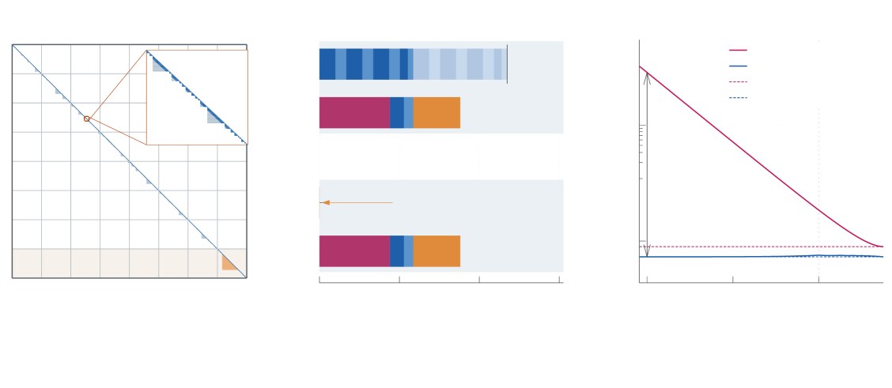

### TL;DR

A 314B-total / 13.2B-active MoE tech report built around a new attention variant (Grouped Differential Latent Attention) that fuses differential attention with MLA-style KV compression, plus expert-specific PolyNorm activations, manifold-constrained hyper-connections, MTP, and MXFP8-based training up to 256K context. Post-training stacks six specialist RL teachers, an SFT-only software-engineering teacher, and Multi-teacher On-Policy Distillation into a single unified model competitive with leading open-weight releases.

### Key idea

Three architectural bets and one post-training bet. (1) **GDLA** combines the noise-cancelling per-head differential attention idea with MLA's compressed KV latent — one attention module keeps both the sharpness of differential attention and MLA's cache footprint. (2) **384 fine-grained experts, top-8 routed** with expert-specific PolyNorm activations pushes fine-grained MoE further than DeepSeek-V3's 256 experts, letting each expert specialize on a narrower niche. (3) **Modified manifold-constrained hyper-connections** stabilize the deeper stack. (4) **Multi-teacher On-Policy Distillation** merges six domain-RL'd teachers into one student — RL isn't run on the frontier model, it's run on specialists and then distilled.

### Main finding

Motif 3 reports competitive results against leading open-weight models on long-horizon agentic tasks, math reasoning, scientific knowledge, and hallucination-sensitive evaluations. Trained on ~12.5T tokens with selective MXFP8 compute + memory-efficient fused kernels + window-aware context parallelism enabling 256K context training.

### Why it matters

This is the second frontier open-weight tech report (after DeepSeek-V3) to bundle a full stack: novel attention, fine-grained MoE, MXFP8, MTP, and a distillation-based post-training pipeline. Two ideas stand out. GDLA proposes that MLA and differential attention are complementary rather than alternative — a claim worth testing broadly. Multi-teacher on-policy distillation formalizes the "RL specialists, distill into generalist" recipe that DeepSeek-V3 used ad-hoc, and puts it on a repeatable footing.

### Knowledge graph integration

**Builds on / relates to existing pages:**
- [../architectures/mla.md](../architectures/mla.md) — GDLA extends MLA's compressed-KV representation with a differential-attention overlay.
- [../architectures/deepseek-moe.md](../architectures/deepseek-moe.md) — fine-grained routed experts + top-k routing, extended from 256 to 384 experts.
- [../pre-training/mtp.md](../pre-training/mtp.md) — multi-token prediction is used as a training-time auxiliary loss.
- [../pre-training/fp8-training.md](../pre-training/fp8-training.md) — MXFP8 selective compute + comm generalizes DeepSeek-V3's FP8 recipe to the MX format.
- [../case-studies/deepseek-v3.md](../case-studies/deepseek-v3.md) — most-comparable prior open-weight MoE tech report.

**Suggested new pages:**
- `architectures/gdla.md` *(depth)* — Grouped Differential Latent Attention: fusion of MLA + differential attention.
- `architectures/differential-attention.md` *(depth)* — the noise-cancelling two-softmax attention primitive.
- `architectures/polynorm.md` *(depth)* — expert-specific PolyNorm activation for fine-grained MoE.
- `architectures/hyper-connections.md` *(depth)* — manifold-constrained hyper-connections for deep transformer stacks.
- `quantization/mxfp8.md` *(depth)* — the MX-format FP8 numerical scheme used for compute and communication.
- `post-training/multi-teacher-on-policy-distillation.md` *(depth)* — unified-model recipe distilling from multiple RL specialists.
- `case-studies/motif-3.md` *(case study)* — full end-to-end tech report breakdown.

---

## 2. Ouroboros

**Authors:** Anton Razzhigaev, Andrei Gritsaev, Andrei Kaznacheev, Nikita Dragunov, Roman Yampolskiy, Andrei Kuznetsov — *Moscow State / AIRI / Skoltech / Joi Lab*
**Links:** [arXiv:2608.08311](https://arxiv.org/abs/2608.08311) · [HF](https://huggingface.co/papers/2608.08311) · [AlphaXiv](https://www.alphaxiv.org/abs/2608.08311)
**Topics:** `agents`, `RL`, `eval`

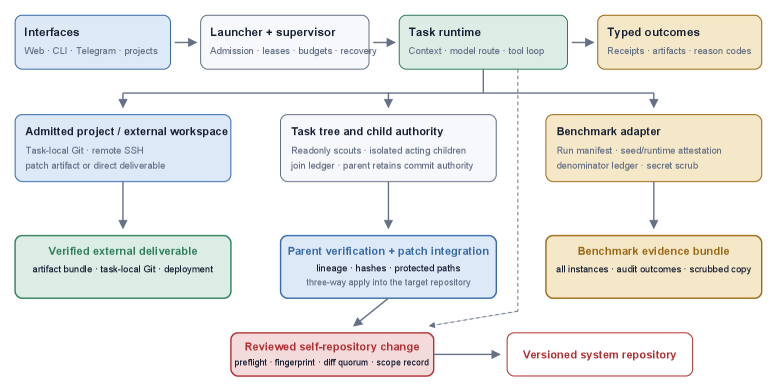

### TL;DR

An agent whose *harness* — tools, prompts, context assembly, and core implementation — is not fixed at design time but rewritten by the agent itself through reviewed commits that become the runtime for subsequent tasks. Two evolution modes: recursive free evolution (improvement is itself a task that schedules the next cycle), and experience-driven evolution (ordinary work exposes rough edges that trigger structural changes). Scores 86.97% on Terminal-Bench 2.1, the best reported number on the benchmark.

### Key idea

Most agent research improves the model behind a fixed scaffold. Ouroboros holds the model constant and treats the *scaffold itself* as the mutable optimand — a self-modifying code loop with a code-review gate. Every improvement to the harness has to pass review before entering the runtime, which prevents the loop from drifting off into unstable states while still letting it accumulate real capability.

### Main finding

86.97% on Terminal-Bench 2.1 (86.74% after trajectory audit) with an Opus 5 backbone — the best reported result on the benchmark. The number is downstream of the evolved harness, not a new base model.

### Why it matters

Agent quality is a product of model × harness. Cast in this frame, the "harness" side of the product has been improving by hand while the "model" side has been improving with compute. Ouroboros is the first serious argument that harness improvement can itself be compute-scaled. The review-gated commit loop is the interesting design choice — it turns self-modification into something with a rollback story.

### Knowledge graph integration

**Builds on / relates to existing pages:**
- [../agents/README.md](../agents/README.md) — a self-developing agent scaffold; the folder currently only has a README.
- [../evaluation/livecodebench.md](../evaluation/livecodebench.md) — Terminal-Bench 2.1 is the terminal-tasks analogue for coding agents.

**Suggested new pages:**
- `agents/self-developing-harness.md` *(depth)* — the reviewed-commit self-modification loop.
- `evaluation/terminal-bench.md` *(depth)* — the agent terminal-tasks benchmark.
- `agents/_agent-harness.md` *(taxonomy)* — the class of tool/context/prompt scaffolds that wrap a base model.

---

## 3. Macaron-V1

**Authors:** 60+ author "Mind Lab" team — *Mind Lab*
**Links:** [arXiv:2608.09819](https://arxiv.org/abs/2608.09819) · [HF](https://huggingface.co/papers/2608.09819) · [AlphaXiv](https://www.alphaxiv.org/abs/2608.09819)
**Topics:** `agents`, `LoRA`, `continual-learning`

### TL;DR

An open agent-model family whose weights are a Mixture-of-LoRA over a shared base — new tasks are learned by minting new LoRA adapters and routing between them, so the base model stays frozen and the graph of adapters grows. Combined with recursive self-improvement, the claim is a continual-learning stack that adds specialized capabilities across tasks without catastrophic forgetting.

### Key idea

Cast continual learning as MoE-over-adapters. Instead of a single model repeatedly fine-tuned (which drifts / forgets) or a fixed model with a prompt harness (which can't internalize new skills), each new skill becomes a low-rank adapter and a learned router picks the right adapter (or blend) at inference. Recursive self-improvement then lets the system add its own adapters when a task can't be solved by the current mix.

### Main finding

The paper claim (per HF page summary) is that the Mixture-of-LoRA stack enables continual specialization and collaboration across tasks. Concrete numeric results are not surfaced on the HF page; the primary artifact is the released open family.

### Why it matters

LoRA + MoE was inevitable once each idea was cheap enough independently — Macaron-V1 is one of the first named realizations at the *agent* level rather than as a single-model architectural choice. The interesting question the paper opens is governance: as the adapter graph grows, how do you avoid a combinatorial explosion of router decisions and adapter interference?

### Knowledge graph integration

**Builds on / relates to existing pages:**
- [../post-training/fine-tuning/README.md](../post-training/fine-tuning/README.md) — LoRA and adapter tuning live in this folder (currently README-only).
- [../architectures/_moe.md](../architectures/_moe.md) — Mixture-of-LoRA is the low-rank-adapter cousin of expert-mixture routing.

**Suggested new pages:**
- `post-training/fine-tuning/lora.md` *(depth)* — the base low-rank adapter technique, currently missing.
- `post-training/fine-tuning/mixture-of-lora.md` *(depth)* — LoRA + router; the Macaron-V1 recipe.
- `post-training/fine-tuning/_continual-learning.md` *(taxonomy)* — adapter-growth / EWC / replay families for continual LLM training.

---

## 4. BDH-CQ

**Authors:** (author list not disclosed on the HF page) — *(affiliation not disclosed)*
**Links:** [arXiv:2608.09888](https://arxiv.org/abs/2608.09888) · [HF](https://huggingface.co/papers/2608.09888) · [AlphaXiv](https://www.alphaxiv.org/abs/2608.09888)
**Topics:** `reasoning`, `architectures`, `eval`

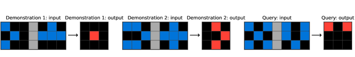

### TL;DR

A 150M-parameter reasoning model that combines in-context learning with **recurrent latent reasoning** — inputs continuously update a recurrent memory, and queries are solved by iterating in a high-dimensional latent space without emitting an intermediate chain-of-thought. On ARC-AGI-1 it hits 29.5% pass@2 for $0.0007 per task, breaking the prior cost/accuracy Pareto front on that benchmark by ~10×.

### Key idea

Two-level architecture: a **recurrent memory** that ingests demonstrations and updates its state, and an **iterative latent solver** that computes the answer by repeated latent updates instead of by verbalizing tokens. The whole "reasoning" step happens inside the model's hidden state, so cost is decoupled from the length of any textual CoT — no token-per-step tax.

### Main finding

29.5% pass@2 on ARC-AGI-1 at $0.0007/task with a 150M model. That's a new Pareto point: comparable-accuracy submissions from frontier models cost orders of magnitude more per task.

### Why it matters

Long-CoT reasoning is a bet that the *right substrate* for reasoning is text. BDH-CQ is a bet that a much smaller latent-recurrence substrate can carry enough of the work to make small, cheap reasoners viable — at least on ARC-style pattern-transformation tasks. If the approach generalizes beyond ARC it reframes "reasoning models" away from the o1-style long-CoT scaling curve.

### Knowledge graph integration

**Builds on / relates to existing pages:**
- [../post-training/reasoning/long-cot-rl.md](../post-training/reasoning/long-cot-rl.md) — the counterpoint: token-space reasoning trained with RL.
- [../fundamentals/attention.md](../fundamentals/attention.md) — recurrent latent reasoning replaces attention with a state-space-style iterated update.

**Suggested new pages:**
- `architectures/recurrent-latent-reasoning.md` *(depth)* — in-latent-space iterative computation as a reasoning substrate.
- `evaluation/arc-agi.md` *(depth)* — the ARC-AGI benchmark and its cost/accuracy frontier.

---

## 5. SWE-Bench ProMax

**Authors:** (author list not disclosed on the HF page) — *(consortium)*
**Links:** [arXiv:2608.09802](https://arxiv.org/abs/2608.09802) · [HF](https://huggingface.co/papers/2608.09802) · [AlphaXiv](https://www.alphaxiv.org/abs/2608.09802)
**Topics:** `agents`, `eval`

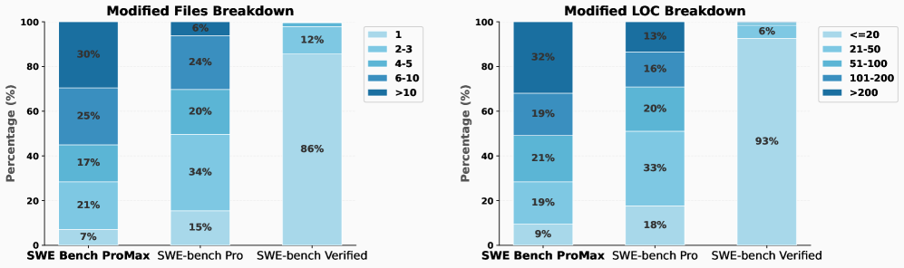

### TL;DR

A 170-instance, seven-language (Python, Java, TypeScript, Go, C, C++, Rust) code-refactoring benchmark for coding agents, curated in direct response to the audited flaws of SWE-Bench Verified (60% of "unsolved" instances had flawed tests; frontier models memorized gold patches). Each instance averages 11.4 modified files and 261.6 LOC. The best current model resolves 41.2%, a significant regression from saturated SWE-bench numbers.

### Key idea

Move the bar from *bug-fix* to *refactor* — behavior-preserving multi-file changes. Refactoring stresses long-horizon planning and cross-file consistency in a way that single-issue bug fixes don't, and there's less contamination risk because refactor commits are less well-indexed than issue-driven fixes. Task specs are rewritten from scratch and tests are manually audited to remove the two failure modes of prior benchmarks.

### Main finding

Best model: **41.2% resolve rate** — the benchmark is unsaturated and much harder than SWE-bench Verified. Task scale (11.4 files, 261.6 LOC per instance) is a step change vs prior benchmarks.

### Why it matters

Every widely-used agent benchmark eventually saturates and gets memorized; the useful question is what replaces it. ProMax argues the answer is *scale and language breadth* rather than more issues. If the resolve rate stays low across the next model generation, this becomes the default replacement for SWE-Bench Verified.

### Knowledge graph integration

**Builds on / relates to existing pages:**
- [../evaluation/livecodebench.md](../evaluation/livecodebench.md) — same family: coding-agent benchmarks under contamination pressure.
- [../evaluation/humaneval.md](../evaluation/humaneval.md) — the classic saturated coding benchmark.

**Suggested new pages:**
- `evaluation/swe-bench.md` *(depth)* — the original SWE-bench family (Full, Verified, Multimodal, Lite).
- `evaluation/swe-bench-promax.md` *(depth)* — the refactor-focused multilingual variant.
- `evaluation/_coding-benchmarks.md` *(taxonomy)* — SWE-bench, LiveCodeBench, HumanEval, MBPP, CodeContests, etc.

---

## 6. u-OPSD

**Authors:** Yijiang Li, Bingyang Wang, Yijun Liang, Yunjie Tian, Di Fu, Nuno Vasconcelos — *UCSD / Georgia Tech / U. Maryland / ByteDance*
**Links:** [arXiv:2608.06296](https://arxiv.org/abs/2608.06296) · [HF](https://huggingface.co/papers/2608.06296) · [AlphaXiv](https://www.alphaxiv.org/abs/2608.06296)
**Topics:** `distillation`, `RL`, `reasoning`

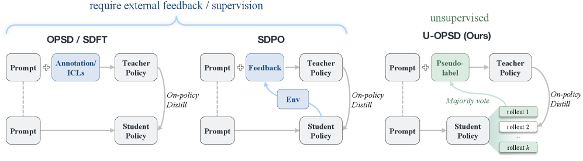

### TL;DR

On-policy self-distillation with **no external supervision at all** — no ground truth, no verifier, no bigger teacher. u-OPSD samples multiple rollouts, builds a pseudo-solution by majority vote under a self-consistency threshold, and then distills the model onto the disagreeing completions conditioned on that pseudo-solution. Matches or beats GRPO on math reasoning across AIME24/25, HMMT25, MATH500, AMC23.

### Key idea

Reframe "on-policy self-distillation" so it truly needs only the model itself. The self-consistency majority vote replaces the ground-truth label; the distribution conditioned on the pseudo-solution replaces the teacher distribution. Distillation is then applied only to the *disagreeing* completions — the model corrects itself precisely where it was confidently wrong.

### Main finding

+8.5% and +10.7% over Qwen3 base (non-thinking mode) at 4B and 8B on the five math benchmarks. Beats supervised OPSD by +3.2% / +2.3% and GRPO by +0.7% / +1.1%. Thinking-mode results are level with OPSD.

### Why it matters

RLVR needs verifiable rewards; SFT needs labels; distillation needs a teacher. u-OPSD collapses all three into a single training loop that only needs the model. If the recipe generalizes beyond math, it opens a route to continued post-training in domains where verifiable rewards don't exist and label costs are the bottleneck.

### Knowledge graph integration

**Builds on / relates to existing pages:**
- [../post-training/grpo.md](../post-training/grpo.md) — u-OPSD is compared directly and matches/beats GRPO with no external reward.
- [../post-training/rejection-sampling.md](../post-training/rejection-sampling.md) — self-consistency majority voting is a soft cousin of rejection sampling.
- [../post-training/rlvr.md](../post-training/rlvr.md) — same problem setting; u-OPSD removes the "verifiable" requirement.
- [../post-training/reasoning/long-cot-rl.md](../post-training/reasoning/long-cot-rl.md) — targeted at the same reasoning benchmarks.

**Suggested new pages:**
- `post-training/on-policy-distillation.md` *(depth)* — the general OPD/OPSD family this paper extends.
- `post-training/self-consistency.md` *(depth)* — majority-vote self-consistency as a training signal.
- `post-training/u-opsd.md` *(depth)* — the unsupervised on-policy self-distillation recipe.

---

## 7. Stealing Reasoning Traces

**Authors:** Alexander Panfilov, David Schmotz, Ilia Shumailov, Luca Beurer-Kellner, Joachim Schaeffer, Ameya Prabhu, Jonas Geiping, Maksym Andriushchenko + 39 others — *(large multi-institution consortium)*
**Links:** [arXiv:2608.09867](https://arxiv.org/abs/2608.09867) · [HF](https://huggingface.co/papers/2608.09867) · [AlphaXiv](https://www.alphaxiv.org/abs/2608.09867)
**Topics:** `safety`, `agents`, `jailbreak`

### TL;DR

Frontier providers now return **encrypted** chain-of-thought traces to clients (to protect IP and reduce leakage). The paper shows these encrypted blocks are fully interchangeable across users, sessions, and models within a provider — inject the encrypted CoT from a strong model into a weaker sibling model in the same ecosystem, and the weaker model will happily decrypt and emit the plaintext CoT verbatim. Demonstrated against Anthropic, OpenAI, and Google.

### Key idea

The attack is not a jailbreak against the strong model at all — it's a lateral move to a weaker, less-safeguarded sibling model that shares the same encryption/decryption pipeline. Because the encrypted CoT is a *provider-scoped* opaque token stream, any model in that provider's ecosystem can decrypt it. The weaker model is the decryption oracle.

### Main finding

Four distinct attack vectors demonstrated: (1) extract proprietary reasoning traces bypassing anti-distillation; (2) large-scale PII / credential extraction — 315,320 blocks scraped from public repos yielded **367 PII artifacts and 182 credentials**; (3) reveal hazardous content hidden inside CoT that the final visible output correctly refuses; (4) invisible prompt injection via encrypted payloads that poison agentic rollouts.

### Why it matters

Encrypted CoT was pitched as a defence-in-depth measure against distillation and leakage. This paper shows the current implementation is architecturally broken: the shared decryption oracle makes all sibling models a lateral-movement path for the strongest model in the family. Directly relevant to any deployment where encrypted CoT is passed back through untrusted intermediaries.

### Knowledge graph integration

**Builds on / relates to existing pages:**
- [../safety/cot-monitoring.md](../safety/cot-monitoring.md) — the counterpoint: monitoring CoT vs concealing it. This paper is what breaks the concealment story.
- [../safety/_jailbreaks.md](../safety/_jailbreaks.md) — a new attack surface for the taxonomy: cross-model decryption oracle attacks.
- [../safety/_attacks.md](../safety/_attacks.md) — a distinct architectural attack vector, not a text jailbreak.
- [../safety/prefix-injection.md](../safety/prefix-injection.md) — same family: injecting content into the model's own context.

**Suggested new pages:**
- `safety/encrypted-cot-injection.md` *(depth)* — the cross-model decryption oracle attack.
- `safety/anti-distillation.md` *(depth)* — the class of measures encrypted CoT is meant to defend, and how this attack circumvents them.

---

## 8. Agent Memory Distillation

**Authors:** Taeil Kim, Kangsan Kim, Sung Ju Hwang — *KAIST / DeepAuto.ai*
**Links:** [arXiv:2608.07169](https://arxiv.org/abs/2608.07169) · [HF](https://huggingface.co/papers/2608.07169) · [AlphaXiv](https://www.alphaxiv.org/abs/2608.07169)
**Topics:** `agents`, `distillation`, `memory`

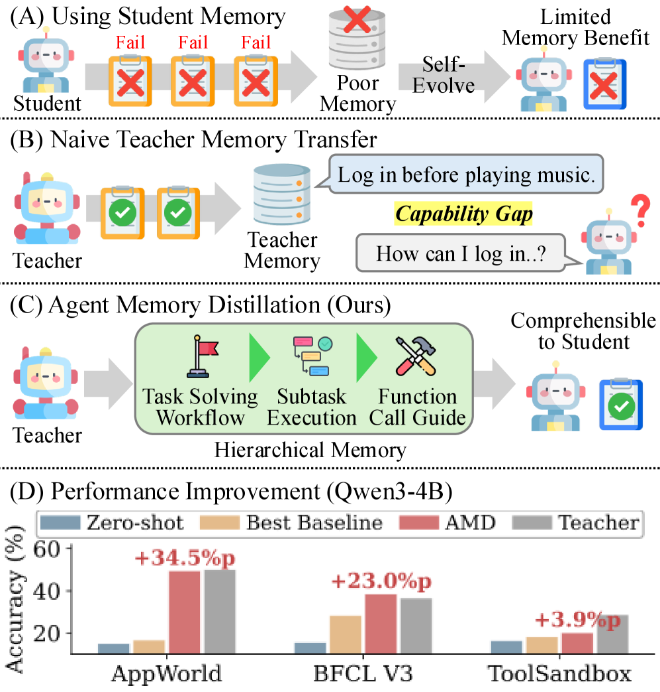

### TL;DR

A training-free memory-distillation framework: mine a strong teacher agent's successful trajectories, distill them into **three memory layers** (Workflow, Subtask, Function), and hand those to a 4B–8B student agent at runtime. Workflow + Subtask are injected proactively at task start; Function memory is retrieved reactively on tool-calling errors. +27.2 pp on AppWorld, +11.2 pp on BFCL V3, +3.4 pp on ToolSandbox.

### Key idea

Split "agent memory" by *granularity* into three complementary levels: task strategies (Workflow), intermediate behavioral examples (Subtask), and per-function calling conventions and pitfalls (Function). Match the level to the moment — proactive high-level memories at the start, reactive low-level memories on failure. The student never trains; it just consumes structured teacher memory.

### Main finding

Average accuracy gains: **+27.2 pp on AppWorld, +11.2 pp on BFCL V3, +3.4 pp on ToolSandbox**, across four 4B–8B student models with GPT-5-mini as teacher. Consistently outperforms prior memory-based baselines with zero training.

### Why it matters

The current fashion is to *train* small agent models with RL or SFT to close the gap to frontier. This paper argues the gap can be closed *without training* if you extract structured knowledge from the teacher into the right memory shape. Distillation via memory rather than weights is a different design axis, cheaper to iterate on, and orthogonal to weight-level distillation.

### Knowledge graph integration

**Builds on / relates to existing pages:**
- [../agents/README.md](../agents/README.md) — agent memory is one of the folder's core themes; no depth files yet.
- [../post-training/rejection-sampling.md](../post-training/rejection-sampling.md) — mining successful teacher trajectories is a supervision analogue of rejection sampling.

**Suggested new pages:**
- `agents/agent-memory.md` *(depth)* — hierarchical Workflow/Subtask/Function memory for small agents.
- `agents/_agent-memory-systems.md` *(taxonomy)* — episodic / structured / procedural / hybrid memory for agent loops.

---

## 9. OasisKV

**Authors:** (partial author list; team from Microsoft Research + Imperial College London) — *Microsoft Research / Imperial*
**Links:** [arXiv:2608.08097](https://arxiv.org/abs/2608.08097) · [HF](https://huggingface.co/papers/2608.08097) · [AlphaXiv](https://www.alphaxiv.org/abs/2608.08097)
**Topics:** `efficient-inference`, `KV-cache`, `speculative-decoding`

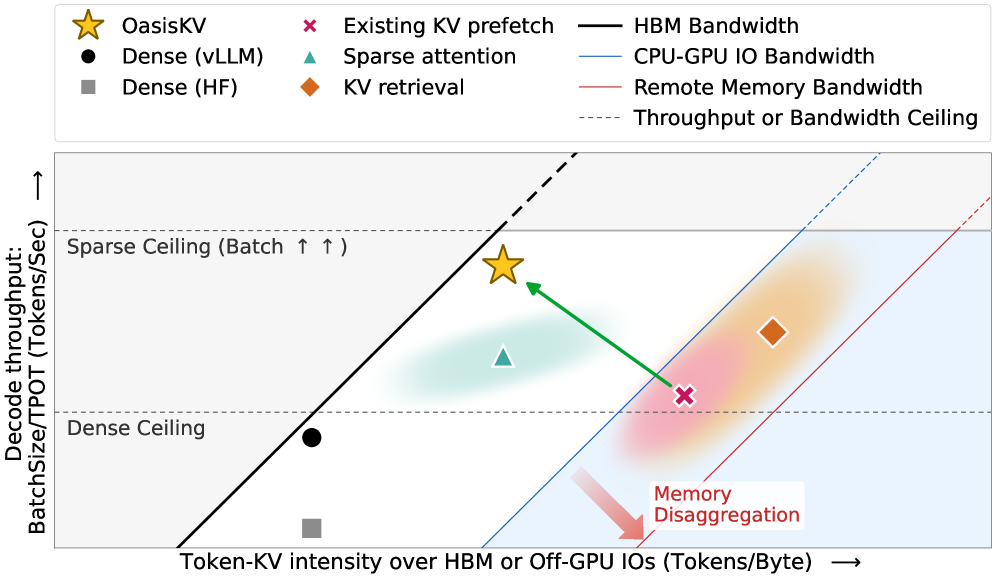

### TL;DR

A vLLM-based inference system that decouples KV-cache storage from HBM. It keeps only the *predicted-important* KV entries in HBM and stages the rest from host / remote memory tiers, using lookahead tokens from speculative decoding to predict which KV blocks will matter for the next decode step. Under a 2048-token KV budget, accuracy stays within 0.7 points of full attention; throughput improves 1.69× on reasoning workloads and up to 2.1× on multi-GPU long-context serving.

### Key idea

Two ideas glued together: **decode-time attention sparsity is real and predictable**, and **speculative-decoding drafts are already computing the "lookahead" the KV prefetcher needs**. So the paper piggybacks on the SD lookahead to identify which KV blocks the main model will touch next, then prefetches those blocks from cheaper memory tiers before decode reaches them. HBM becomes a working set, not the full cache.

### Main finding

**1.69× throughput** over dense vLLM at 0.1 pt accuracy loss on the reasoning workload. **Up to 2.1×** on multi-GPU long-context serving. Under prefill-decode disaggregation: **~2× dense throughput** with 6.5–9.7× less KV admitted per request and 2.2–2.6× less decode-node host memory than full KV transfer.

### Why it matters

HBM has become the binding constraint on inference throughput as reasoning workloads push context length up. Prior sparse-KV work either lost accuracy or needed a separate predictor network. OasisKV shows the SD lookahead is a nearly-free source of the "which tokens matter" signal, unlocking sparse serving without a new predictor. Directly buildable on the existing vLLM stack.

### Knowledge graph integration

**Builds on / relates to existing pages:**
- [../inference/README.md](../inference/README.md) — KV cache and paged attention are the folder's core themes; no depth files yet.
- [../fundamentals/attention.md](../fundamentals/attention.md) — the underlying operation whose sparsity structure the paper exploits.
- [../architectures/mla.md](../architectures/mla.md) — the orthogonal cache-compression axis; OasisKV is complementary.

**Suggested new pages:**
- `inference/kv-cache.md` *(depth)* — the KV cache itself and its memory-footprint tradeoffs.
- `inference/speculative-decoding.md` *(depth)* — SD as an inference primitive.
- `inference/sparse-kv-prefetch.md` *(depth)* — the OasisKV lookahead-guided sparse prefetch scheme.
- `inference/_kv-cache-management.md` *(taxonomy)* — paging, offloading, sparse selection, and compression strategies.

---

## 10. SPOT

**Authors:** Zikun Qu, Min Zhang, Mingze Kong, Zhiwei Shang, Yikun Ban, Shuang Qiu, Zhongxiang Dai — *CUHK-SZ / ECNU / Beihang / City U. HK*
**Links:** [arXiv:2608.04419](https://arxiv.org/abs/2608.04419) · [HF](https://huggingface.co/papers/2608.04419) · [AlphaXiv](https://www.alphaxiv.org/abs/2608.04419)
**Topics:** `distillation`, `RL`, `reasoning`

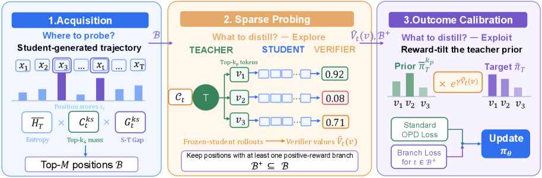

### TL;DR

Fixes two failure modes of standard on-policy distillation (OPD): reverse-KL over-concentrates on the teacher's mode and misses other plausible continuations, and every position gets the same probing budget regardless of how uncertain the student is there. SPOT does an acquisition–exploration–exploitation loop: pick uncertain positions to probe, propose teacher-side candidates, score them with a verifier through the student's own continuations, and distill toward the outcome-calibrated candidate distribution.

### Key idea

Three-stage recipe. **Acquisition:** allocate probing budget by a position-level score combining teacher entropy, top-k mass, and student–teacher mismatch — probe where distillation actually matters. **Exploration:** evaluate teacher-proposed candidates via verifier-scored student continuations — the student's own downstream success is the arbiter. **Exploitation:** produce a KL-regularized target that favors candidates leading to good outcomes while staying anchored to the teacher distribution.

### Main finding

Reported improvements across multiple student models and reasoning benchmarks vs standard OPD; specific numeric deltas not surfaced on the HF page.

### Why it matters

On-policy distillation is becoming the default post-training tool now that verifiers are widely available. SPOT's contribution is the two knobs — *where to probe* and *what to distill toward* — that make OPD budget-efficient and outcome-aware. Compare directly to u-OPSD (paper #6): SPOT keeps the teacher, u-OPSD drops it; both improve the vanilla OPSD baseline.

### Knowledge graph integration

**Builds on / relates to existing pages:**
- [../post-training/grpo.md](../post-training/grpo.md) — SPOT competes with GRPO as an on-policy reasoning-post-training method.
- [../post-training/rejection-sampling.md](../post-training/rejection-sampling.md) — verifier-scored candidate selection is close cousin to rejection sampling.
- [../post-training/reasoning/prm.md](../post-training/reasoning/prm.md) — position-level scoring parallels process-reward modeling at a lower level.

**Suggested new pages:**
- `post-training/spot-distillation.md` *(depth)* — the acquisition–exploration–exploitation OPD recipe.
- `post-training/_on-policy-distillation.md` *(taxonomy)* — OPD/OPSD/u-OPSD/SPOT/multi-teacher-OPD variants.

---

## 11. Steerling / Scaling Inherently Interpretable Language Models

**Authors:** Guide Labs team (Andreas Madsen, Aya Abdelsalam Ismail, Giang Nguyen, Isaac Plant, Muawiz Chaudhary, Nathaniel Monson, Saqib Azim, Zhichen Guo, Julius Adebayo) — *Guide Labs*
**Links:** [arXiv:2608.07594](https://arxiv.org/abs/2608.07594) · [HF](https://huggingface.co/papers/2608.07594) · [AlphaXiv](https://www.alphaxiv.org/abs/2608.07594)
**Topics:** `interp`, `LLM`, `steering`

### TL;DR

Instead of training a base model and then bolting SAEs on top post hoc, add an **interpretability constraint as a co-objective during training itself**. The resulting Steerling-8B has natively disentangled representations that support concept-based attribution, training-data retrieval, and corrective steering without retraining — while staying competitive with peer models trained on 2–16× more compute.

### Key idea

Interpretability doesn't need to be an after-the-fact excavation. Bake it in as a training constraint alongside the LM loss, and the model itself produces representations that expose concept-level attribution and steering primitives. This positions the paper as the "trained-interpretable" alternative to SAE-based unsupervised concept extraction.

### Main finding

Steerling-8B stays competitive with peer models while using **2–16× less compute**, and natively supports concept attribution, training-data retrieval, and steering without additional interpretability training.

### Why it matters

The interpretability community has bet heavily on post-hoc SAEs against production-scale LLMs. This paper is a wager that the alternative — treating interpretability as a first-class training objective — is not only feasible but scales positively and is cheaper. If it holds, it opens a lane of "interp-by-construction" models that don't require the SAE overhead.

### Knowledge graph integration

**Builds on / relates to existing pages:**
- [../interpretability/README.md](../interpretability/README.md) — the folder's core theme; no depth files yet.

**Suggested new pages:**
- `interpretability/inherently-interpretable-training.md` *(depth)* — interpretability constraint as a training co-objective.
- `interpretability/sae.md` *(depth)* — sparse autoencoders as the post-hoc alternative this paper displaces (or complements).
- `interpretability/activation-steering.md` *(depth)* — the steering primitive whose native version this paper enables.
- `interpretability/_interpretability-methods.md` *(taxonomy)* — probing / SAEs / activation steering / logit lens / inherently-interpretable training.

---

## 12. Evidence-RL

**Authors:** Haojie Huang, Xinlei Yu, Chengming Xu, Zhangquan Chen, Cheng Yang, Qingdong He, Yu Yang, Jiangning Zhang, Xiaobin Hu — *NUS / Zhejiang / Fudan / Tsinghua / Tencent*
**Links:** [arXiv:2608.08021](https://arxiv.org/abs/2608.08021) · [HF](https://huggingface.co/papers/2608.08021) · [AlphaXiv](https://www.alphaxiv.org/abs/2608.08021)
**Topics:** `multimodal`, `RL`, `VLM`

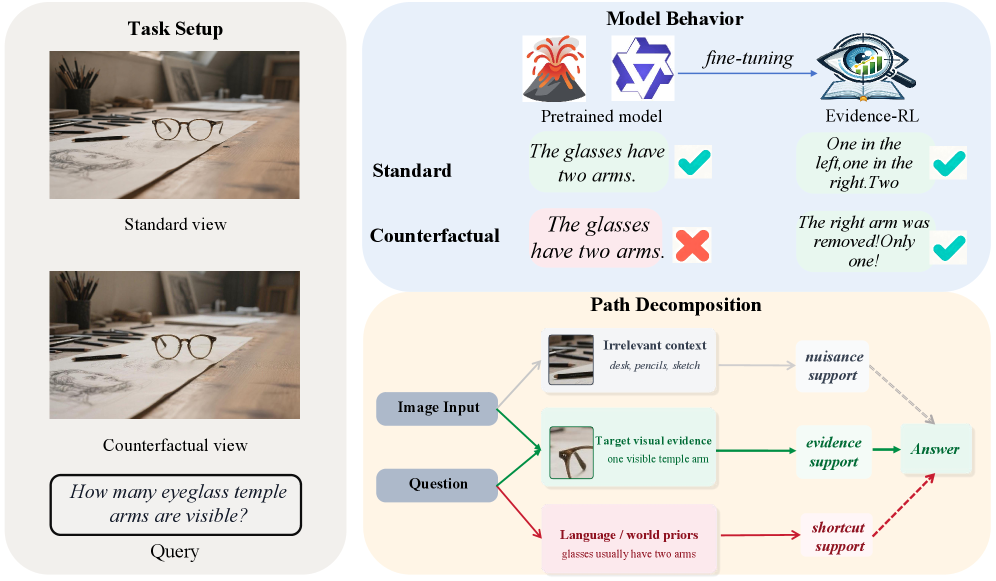

### TL;DR

A post-training RL objective for vision-language models that **audits whether the answer causally depends on the local image evidence**. For each response, the paper's Counterfactual Evidence Disentanglement (CED) neutralizes an object-centric Evidence Region and checks the support drop against matched non-evidence regions. Combined with correctness inside GRPO, this rewards answers that rely on the actual evidence path rather than dataset shortcuts or language priors.

### Key idea

Cast VLM grounding as a **counterfactual test**. If the region you claim is the evidence is really the evidence, ablating it should collapse the answer support — while ablating a matched non-evidence region shouldn't. The gap between the two ablation drops is your grounding signal; combine it with GRPO's correctness reward and the policy learns to answer *from* the image rather than *around* it.

### Main finding

Across nine public VLM benchmarks and four backbones, Evidence-RL outperforms prior RL-based post-training methods, with targeted analyses confirming the object-centric signal is doing the work.

### Why it matters

VLMs are notorious for shortcut-learning: they answer from language priors or dataset regularities and hallucinate their "grounding." Evidence-RL turns grounding from a claim into a measurable training-time signal, without needing question-specific evidence annotations. Directly usable inside any GRPO stack — this is a plug-in reward augmentation, not a new algorithm.

### Knowledge graph integration

**Builds on / relates to existing pages:**
- [../post-training/grpo.md](../post-training/grpo.md) — Evidence-RL is a reward augmentation that plugs into standard GRPO.
- [../post-training/rlvr.md](../post-training/rlvr.md) — same family: verifiable reward augmentation for post-training.
- [../multimodal/README.md](../multimodal/README.md) — the folder's core theme; no depth files yet.

**Suggested new pages:**
- `multimodal/vlm-post-training.md` *(depth)* — RL post-training for VLMs.
- `multimodal/counterfactual-evidence-disentanglement.md` *(depth)* — the CED reward-augmentation recipe.

---

## 13. Evo-Bench

**Authors:** Lisheng Huang, Chen Yang, Hao Zhou, Huatong Song, Zongchao Chen, Ran Le, Yang Song, Wayne Xin Zhao, Tao Zhang — *Renmin U. / BOSS Zhipin*
**Links:** [arXiv:2608.09096](https://arxiv.org/abs/2608.09096) · [HF](https://huggingface.co/papers/2608.09096) · [AlphaXiv](https://www.alphaxiv.org/abs/2608.09096)
**Topics:** `agents`, `eval`

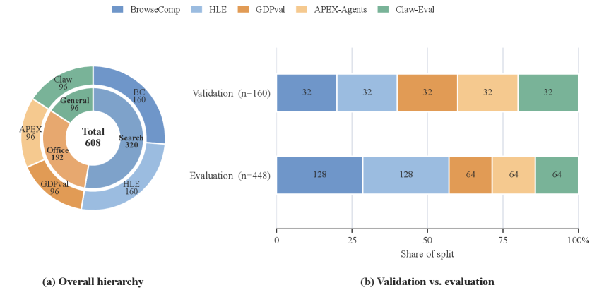

### TL;DR

A benchmark specifically for **harness evolution** — an agent's capacity to autonomously improve its own operating scaffold. Spans Search, Office, and General agent domains, and is designed to isolate harness improvements from base-model strength while blocking task-specific overfitting.

### Key idea

The Ouroboros-style claim (paper #2) — that agents can improve their harness — needs an evaluation instrument. Evo-Bench provides it: multiple domains, controls for base-model uplift, and a long-horizon iterative-research structure that penalizes single-task memorization. The benchmark is designed to measure the *marginal* capability added by harness evolution, not raw task performance.

### Main finding

Evo-Bench is the paper's contribution itself; specific model rankings on it are the report's evaluation section (not surfaced in the HF summary).

### Why it matters

Harness evolution is a new capability axis, and every new capability axis needs its measurement stack before real progress can be tracked. This is that stack. Pairs directly with Ouroboros (#2): Ouroboros is the demonstration, Evo-Bench is the yardstick.

### Knowledge graph integration

**Builds on / relates to existing pages:**
- [../evaluation/livecodebench.md](../evaluation/livecodebench.md) — same family: agent capability benchmarks.
- [../agents/README.md](../agents/README.md) — harness evolution is an agent-side capability.

**Suggested new pages:**
- `evaluation/evo-bench.md` *(depth)* — the harness-evolution benchmark.
- `agents/_agent-harness.md` *(taxonomy)* — see paper #2; benchmark and demonstration share it.

---

## 14. Sci-VBench

**Authors:** Diandian Zhang, Tingyu Song, Lin Fu, Zheyuan Yang, Yilun Zhao — *Zhejiang U / UCAS / Tongji / Yale*
**Links:** [arXiv:2608.09873](https://arxiv.org/abs/2608.09873) · [HF](https://huggingface.co/papers/2608.09873) · [AlphaXiv](https://www.alphaxiv.org/abs/2608.09873)
**Topics:** `eval`, `diffusion`, `multimodal`

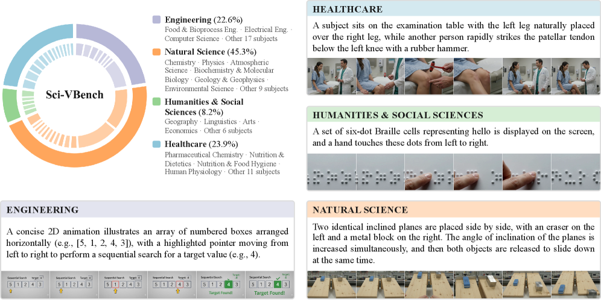

### TL;DR

A 1,253-example expert-annotated benchmark for **knowledge- and reasoning-intensive video generation** across 60 scientific subjects (Natural Science, Healthcare, Humanities & Social Sciences, Engineering). Each example demands temporally rich videos that require scientific reasoning and knowledge-grounded synthesis, not just visual plausibility. Includes a rubric-based evaluation protocol usable by both non-expert humans and MLLM judges.

### Key idea

Existing video-generation benchmarks reward visual realism; Sci-VBench decouples realism from **scientific and causal correctness**. Two axes are measured separately — Prompt Grounding and Scientific/Causal Correctness — so a model can be caught being photogenic-but-wrong. The rubric-based protocol is engineered so that MLLM-as-judge agreement with expert judges is high enough to be usable at scale.

### Main finding

Across 16 frontier proprietary + open models: automatic perceptual-quality scores cluster tightly, but Prompt Grounding and Scientific/Causal Correctness diverge substantially — with a pronounced proprietary vs open-source gap. Visual realism has not translated into reliable scientific dynamics.

### Why it matters

The video-generation field has been optimizing for a metric (realism) that has already saturated at the top, hiding a much larger gap on physically and causally correct dynamics. Sci-VBench surfaces that gap. Pairs with the general call to move video-gen evals from FVD-style quality metrics to task-grounded scientific-reasoning metrics.

### Knowledge graph integration

**Builds on / relates to existing pages:**
- [../evaluation/mmlu.md](../evaluation/mmlu.md) — closest genre: multi-domain expert-knowledge eval, here applied to video generation.
- [../multimodal/README.md](../multimodal/README.md) — the folder covers video generation as a target modality.

**Suggested new pages:**
- `evaluation/sci-vbench.md` *(depth)* — the scientific video-generation benchmark.
- `multimodal/video-generation.md` *(depth)* — the target-modality overview page.

---

## 15. Adam Gauge

**Authors:** Devender Singh — *Memorial University of Newfoundland*
**Links:** [arXiv:2608.05136](https://arxiv.org/abs/2608.05136) · [HF](https://huggingface.co/papers/2608.05136) · [AlphaXiv](https://www.alphaxiv.org/abs/2608.05136)
**Topics:** `optimizer`, `theory`, `pre-training`

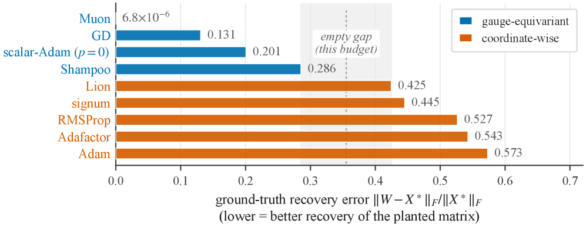

### TL;DR

*Borderline: included because it directly touches optimizer choice for transformer pre-training and reframes an old debate.* Gradient descent on `W = UV⊤` is implicitly biased toward low-rank solutions; Adam, from the same init, is not. The paper traces the difference to the loss's **gauge symmetry** — invariance under `(U, V) ↦ (UQ, VQ)`. Optimizers that respect this gauge (GD, momentum, "shared-scalar" Adam, Muon, Shampoo) inherit gradient flow's low-rank bias; coordinate-wise Adam / RMSProp do not.

### Key idea

A structure theorem: the memoryless gauge-equivariant update rules are *exactly* the Gram-determined left preconditioners. A one-parameter family sweeping from coordinate-wise to shared-scalar preconditioning restores the low-rank bias monotonically — anisotropy in Adam's preconditioner is the cause of the missing bias. A "spectral schedule" for Muon reconciles two opposing prior reports about whether it recovers low-rank targets: equal-rate updates recover exactly-low-rank targets but degrade as the spectral tail grows.

### Main finding

On matrix sensing, nine update rules sort cleanly by recovery error along the equivariance axis. In transformers: Adam separates two gauge-equivalent inits at the very first step and ends with per-head `WQ⊤WK` invariants 56% apart in relative Frobenius distance — a gap no per-head rotation can close. On hyperspectral data at matched training loss, GD cuts held-out error 43–44% at the lowest sampling density.

### Why it matters

Adam vs Muon / Shampoo debates usually invoke "smoothness" or "second-order geometry." This paper reframes them as a question about *which basis the optimizer secretly picks*. That reframing has direct implications for optimizer choice under implicit-bias-sensitive workloads and for the recent Muon results at scale.

### Knowledge graph integration

**Builds on / relates to existing pages:**
- [../pre-training/_training-stability.md](../pre-training/_training-stability.md) — optimizer choice is one of the taxonomy's core levers.
- [../fundamentals/README.md](../fundamentals/README.md) — the folder's optimizer coverage would naturally extend to this analysis.

**Suggested new pages:**
- `fundamentals/adamw.md` *(depth)* — Adam / AdamW, currently missing as a standalone page.
- `fundamentals/muon.md` *(depth)* — the Muon optimizer whose spectral-schedule question this paper addresses.
- `fundamentals/_optimizers.md` *(taxonomy)* — GD / momentum / Adam / RMSProp / Muon / Shampoo, organized by gauge equivariance.

---

## Notes

- Borderline inclusions are flagged in-section with an italic *Borderline: …* note.
- Hero figures live in `assets/2026-08-11/`. Missing figures (Macaron-V1, Stealing Reasoning Traces, Steerling) mean no accessible figure URL was found on either the HF page (only "gradient" placeholder) or the arXiv HTML render.
- This digest is informational. No existing concept files, `READING-LIST.md`, or `PAPERS.md` were modified to produce it.
